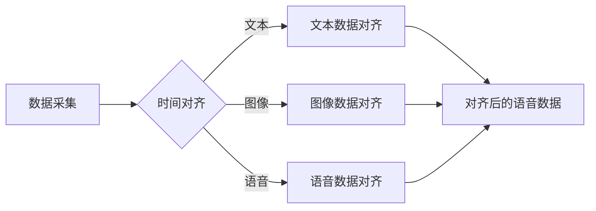
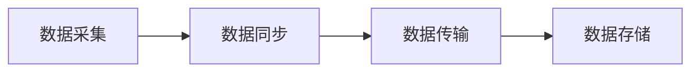
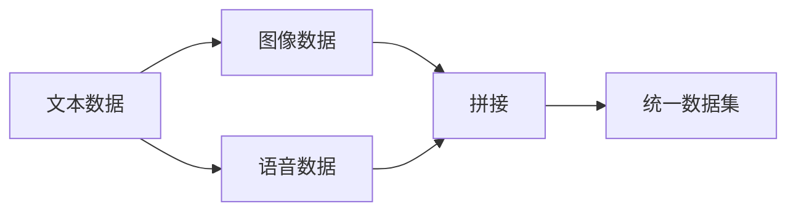
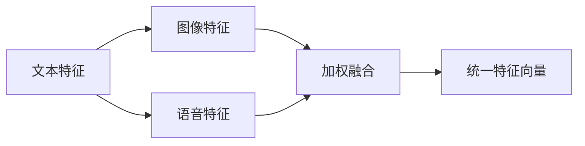
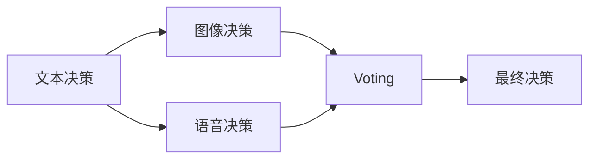

                 

----------------------------------------------------------------
## 多模态AI Agent：整合文本、图像和语音

> 关键词：多模态AI、AI Agent、文本处理、图像处理、语音处理

> 摘要：随着人工智能技术的快速发展，多模态AI Agent已成为研究的热点。本文旨在探讨如何整合文本、图像和语音，构建高效的多模态AI Agent，并分析其应用场景、技术挑战和发展趋势。

----------------------------------------------------------------

# 目录大纲

## 第1章 引言与背景

### 1.1 问题背景

### 1.2 问题描述

### 1.3 解决方案概述

### 1.4 边界与外延

### 1.5 核心概念结构

## 第2章 多模态AI Agent基本概念

### 2.1 多模态AI定义

### 2.2 多模态AI Agent特点

### 2.3 多模态AI Agent应用场景

## 第3章 文本处理技术

### 3.1 文本预处理

### 3.2 文本表示方法

### 3.3 文本生成模型

## 第4章 图像处理技术

### 4.1 图像预处理

### 4.2 图像表示方法

### 4.3 图像分类与生成模型

## 第5章 语音处理技术

### 5.1 语音预处理

### 5.2 语音表示方法

### 5.3 语音识别与合成模型

## 第6章 多模态融合技术

### 6.1 融合策略与方法

### 6.2 融合模型架构

### 6.3 多模态数据集成

## 第7章 多模态AI Agent应用案例

### 7.1 案例一：智能客服系统

### 7.2 案例二：智能教育平台

### 7.3 案例三：智能医疗系统

## 第8章 未来发展趋势与挑战

### 8.1 发展趋势

### 8.2 挑战与机遇

### 8.3 未来研究方向

----------------------------------------------------------------

## 第1章 引言与背景

### 1.1 问题背景

随着信息技术的飞速发展，大数据、云计算、物联网等新兴技术不断涌现，人工智能（AI）逐渐成为全球科技领域的热点。AI技术的应用已渗透到各行各业，包括智能家居、智能医疗、智能交通、智能教育等。在这些应用中，AI Agent作为一种智能实体，正逐渐成为研究和开发的核心。

AI Agent的定义如下：一种能够主动感知环境、理解任务意图，并通过学习自动执行任务的智能实体。传统的AI Agent通常基于单一模态的数据（如文本、图像或语音），而多模态AI Agent则能够整合多种类型的数据，提高任务执行的效率和准确性。

多模态AI Agent的研究具有重要意义：

1. **提高任务执行效率**：通过整合不同类型的数据，AI Agent可以更准确地理解任务意图，从而提高任务执行的效率和效果。
2. **增强环境感知能力**：多模态AI Agent能够通过文本、图像和语音等多种方式感知环境，提高对复杂场景的理解能力。
3. **拓展应用领域**：多模态AI Agent可以应用于更多场景，如智能客服、智能教育、智能医疗等，推动AI技术在各个领域的应用。

### 1.2 问题描述

多模态AI Agent面临的主要问题是如何高效地整合文本、图像和语音等多模态数据，并构建一个统一的模型进行任务执行。具体问题如下：

1. **数据融合问题**：如何将不同类型的数据进行有效融合，使模型能够同时利用文本、图像和语音的信息？
2. **处理效率问题**：多模态数据处理通常需要较高的计算资源和时间成本，如何提高处理效率是一个关键问题。
3. **实时性问题**：在实时应用场景中，如智能客服、自动驾驶等，如何保证多模态数据的实时处理和响应？

### 1.3 解决方案概述

为了解决上述问题，本文提出以下解决方案：

1. **多模态数据预处理**：对文本、图像和语音数据进行预处理，包括数据清洗、标准化等步骤，以提高数据的可用性和一致性。
2. **多模态表示方法**：研究不同的多模态表示方法，如基于深度学习的表示方法，以有效地整合不同类型的数据。
3. **多模态融合技术**：研究不同的多模态融合策略和方法，如数据级融合、特征级融合和决策级融合，以实现高效的多模态数据融合。
4. **多模态AI Agent架构设计**：设计一个统一的架构，整合多模态数据处理、融合和任务执行模块，以实现高效的多模态AI Agent。

### 1.4 边界与外延

本文的研究范围主要包括以下几个方面：

1. **多模态AI Agent的基本概念和特点**：介绍多模态AI Agent的定义、功能和架构。
2. **文本、图像和语音处理技术**：详细探讨文本、图像和语音处理的基本方法和技术。
3. **多模态融合技术**：研究不同的融合策略和方法，以及如何设计多模态AI Agent的架构。
4. **多模态AI Agent的应用案例**：分析多模态AI Agent在不同应用场景中的实际应用。

本文的研究旨在为多模态AI Agent的研究和应用提供理论指导和实践参考。

### 1.5 核心概念结构

为了更好地理解多模态AI Agent，我们需要明确以下几个核心概念：

1. **多模态AI**：一种能够同时处理和利用多种类型数据（如文本、图像和语音）的AI技术。
2. **AI Agent**：一种能够自主执行任务、具有智能行为的实体。
3. **文本处理**：对文本数据进行清洗、分析和理解的过程。
4. **图像处理**：对图像数据进行处理和分析的过程。
5. **语音处理**：对语音数据进行识别和合成的过程。
6. **多模态融合**：将不同类型的数据进行整合，以提高AI Agent的感知和执行能力。

以上核心概念构成了多模态AI Agent的基本结构，为后续章节的详细讨论提供了基础。

## 第2章 多模态AI Agent基本概念

### 2.1 多模态AI定义

多模态AI（Multimodal AI）是指一种人工智能技术，它能够同时处理和利用多种类型的数据，如文本、图像和语音。与传统的单模态AI技术（如文本AI、图像AI和语音AI）不同，多模态AI旨在通过整合不同类型的数据，提高AI系统的感知和执行能力。

多模态AI的核心目标是实现以下功能：

1. **多源数据整合**：将来自不同模态的数据进行有效整合，提高数据的可用性和一致性。
2. **综合信息理解**：通过整合多模态数据，AI系统可以更全面地理解任务意图和环境信息。
3. **提高任务执行效率**：整合多模态数据可以减少冗余信息，提高AI系统的决策和执行效率。

多模态AI的研究范畴包括：

1. **数据融合技术**：研究如何将不同类型的数据进行有效融合，以实现数据的互补和增强。
2. **多模态表示方法**：研究如何将多模态数据转换为统一的表示形式，以供后续处理和分析。
3. **多模态交互**：研究如何设计多模态交互界面，以实现人与AI系统的自然交互。

### 2.2 多模态AI Agent特点

多模态AI Agent是一种具备多模态感知和执行能力的智能实体。与传统的单模态AI Agent相比，多模态AI Agent具有以下几个特点：

1. **多模态感知**：多模态AI Agent能够通过文本、图像和语音等多种方式感知环境，获取丰富的信息。
2. **自适应能力**：多模态AI Agent可以根据不同的任务和环境，动态调整感知和执行策略，提高任务执行效率。
3. **智能决策**：多模态AI Agent能够整合多模态数据，实现更准确的任务意图理解和决策。
4. **自然交互**：多模态AI Agent能够通过文本、图像和语音等多种方式与用户进行自然交互，提高用户体验。

### 2.3 多模态AI Agent应用场景

多模态AI Agent具有广泛的应用前景，以下是一些典型的应用场景：

1. **智能客服系统**：通过整合文本、图像和语音数据，多模态AI Agent可以提供更智能、更自然的客户服务体验，提高客户满意度。
2. **智能教育平台**：多模态AI Agent可以为学生提供个性化的学习支持和辅导，提高学习效果。
3. **智能医疗系统**：通过整合文本、图像和语音数据，多模态AI Agent可以协助医生进行诊断和治疗，提高医疗水平。
4. **智能交通系统**：多模态AI Agent可以通过分析文本、图像和语音数据，实现智能交通管理和调度，提高交通效率。

### 2.4 多模态AI Agent的架构设计

多模态AI Agent的架构设计需要综合考虑数据获取、预处理、融合、任务执行和交互等模块。以下是一个典型的多模态AI Agent架构：

1. **数据获取模块**：负责从不同模态的数据源（如文本、图像和语音）获取数据。
2. **预处理模块**：对获取到的数据进行清洗、标准化和特征提取等预处理操作。
3. **融合模块**：将不同模态的数据进行整合，实现多模态数据的互补和增强。
4. **任务执行模块**：根据任务需求和任务意图，执行相应的任务，如文本生成、图像分类、语音识别等。
5. **交互模块**：通过文本、图像和语音等方式与用户进行自然交互，收集用户反馈，优化任务执行。

### 2.5 多模态AI Agent的优势和挑战

多模态AI Agent具有以下优势：

1. **提高任务执行效率**：通过整合多模态数据，AI Agent可以更准确地理解任务意图，提高任务执行的效率。
2. **增强环境感知能力**：多模态AI Agent可以通过多种方式感知环境，提高对复杂场景的理解能力。
3. **拓展应用领域**：多模态AI Agent可以应用于更多场景，如智能家居、智能医疗、智能交通等，推动AI技术在各个领域的应用。

然而，多模态AI Agent也面临一些挑战：

1. **数据融合问题**：如何将不同类型的数据进行有效融合，实现数据的互补和增强是一个关键问题。
2. **处理效率问题**：多模态数据处理通常需要较高的计算资源和时间成本，如何提高处理效率是一个关键问题。
3. **实时性问题**：在实时应用场景中，如何保证多模态数据的实时处理和响应是一个挑战。

### 2.6 多模态AI Agent的研究现状与发展趋势

当前，多模态AI Agent的研究主要集中在以下几个方面：

1. **多模态数据融合技术**：研究如何将不同类型的数据进行有效融合，提高AI系统的感知和执行能力。
2. **多模态表示方法**：研究如何将多模态数据转换为统一的表示形式，以供后续处理和分析。
3. **多模态交互技术**：研究如何设计多模态交互界面，以实现人与AI系统的自然交互。

未来，多模态AI Agent的研究将朝着以下方向发展：

1. **深度学习技术的应用**：深度学习技术在多模态数据处理和融合方面具有巨大潜力，将成为多模态AI Agent研究的重要方向。
2. **跨模态理解能力的提升**：通过研究跨模态语义理解技术，提高多模态AI Agent对复杂场景的理解能力。
3. **实时处理与优化**：研究如何在实时应用场景中实现高效的多模态数据处理和响应，提高AI Agent的实时性。

## 第3章 文本处理技术

### 3.1 文本预处理

文本预处理是多模态AI Agent构建过程中至关重要的一步，它涉及到对原始文本数据进行清洗、标准化和分词等操作，以提高文本数据的质量和可用性。

#### 3.1.1 数据清洗

数据清洗的主要目标是去除文本中的无关信息，如HTML标签、特殊字符和停用词等。清洗步骤通常包括：

1. **去除HTML标签**：通过正则表达式或其他方法去除文本中的HTML标签。
2. **去除特殊字符**：去除文本中的特殊字符，如标点符号、换行符等。
3. **去除停用词**：停用词是指在特定应用场景中不具有实际意义的词汇，如“的”、“和”等。去除停用词有助于减少文本数据中的噪声，提高后续处理的效率。

#### 3.1.2 标准化

文本标准化旨在将不同格式的文本转换为统一的格式，以提高数据的可比性和一致性。标准化步骤通常包括：

1. **统一字符编码**：将不同字符编码（如UTF-8、GBK等）的文本转换为统一的编码格式。
2. **统一文本格式**：将不同格式的文本（如段落、列表等）转换为统一的文本格式。
3. **统一大小写**：将文本中的大小写转换为统一的格式，如全部小写或全部大写。

#### 3.1.3 分词

分词是将连续的文本序列切分成一个个具有独立意义的词语的过程。分词方法可以分为基于规则的方法和基于统计的方法。

1. **基于规则的方法**：通过预设的规则，将文本中的词语进行切分。这种方法具有较高的准确性，但需要大量的人工规则设定。
2. **基于统计的方法**：利用统计模型（如隐马尔可夫模型、条件随机场等）对文本进行切分。这种方法具有较高的灵活性，但可能存在一定的误差。

### 3.2 文本表示方法

文本表示是将原始文本数据转换为机器可处理的数字形式的过程。文本表示方法可以分为基于词袋模型的方法和基于深度学习的方法。

#### 3.2.1 基于词袋模型的方法

词袋模型（Bag-of-Words，BOW）是一种简单的文本表示方法，它将文本看作一个词的集合，不考虑词语的顺序和语法结构。词袋模型的主要步骤包括：

1. **词表构建**：将文本中的所有词语进行整理，构建一个词表。
2. **向量表示**：将每个词语映射为一个唯一的整数或向量，形成词向量矩阵。

词袋模型的优点是计算简单，但缺点是忽略了词语的顺序和语法结构，可能导致语义信息丢失。

#### 3.2.2 基于深度学习的方法

基于深度学习的文本表示方法通过神经网络模型（如循环神经网络、卷积神经网络等）捕捉文本中的语义信息。以下是一些常用的基于深度学习的文本表示方法：

1. **循环神经网络（RNN）**：RNN可以通过捕捉词语之间的顺序关系，将文本序列映射为一个固定长度的向量。
2. **长短时记忆网络（LSTM）**：LSTM是RNN的一种变体，通过引入门控机制，可以有效解决RNN的梯度消失和梯度爆炸问题。
3. **卷积神经网络（CNN）**：CNN可以通过卷积操作捕捉文本中的局部特征，将文本序列映射为一个固定长度的向量。

### 3.3 文本生成模型

文本生成模型是一种能够根据给定的输入生成文本的模型，广泛应用于自然语言处理领域。以下是一些常用的文本生成模型：

#### 3.3.1 循环神经网络（RNN）

RNN是一种基于序列处理的神经网络模型，可以捕捉文本中的顺序关系。RNN的主要步骤包括：

1. **输入编码**：将输入文本序列转换为机器可处理的数字形式。
2. **隐藏层计算**：通过RNN模型对输入序列进行编码，生成隐藏层状态。
3. **输出生成**：根据隐藏层状态生成输出序列。

#### 3.3.2 生成对抗网络（GAN）

生成对抗网络（GAN）是一种由生成器和判别器组成的对抗性神经网络模型，可以生成高质量的文本。GAN的主要步骤包括：

1. **生成器**：生成器通过学习输入数据的分布，生成与真实数据相似的文本。
2. **判别器**：判别器通过学习输入数据的分布，判断生成数据的真实性。
3. **训练**：通过优化生成器和判别器的参数，提高生成数据的真实性和判别器的判别能力。

#### 3.3.3 注意力机制

注意力机制（Attention Mechanism）是一种能够自动捕捉文本中关键信息的机制，可以显著提高文本生成模型的效果。注意力机制的主要步骤包括：

1. **输入编码**：将输入文本序列转换为机器可处理的数字形式。
2. **注意力计算**：通过注意力机制计算输入序列中每个词语的重要性。
3. **输出生成**：根据注意力权重生成输出序列。

## 第4章 图像处理技术

### 4.1 图像预处理

图像预处理是图像处理的第一步，目的是提高图像的质量和适用性。图像预处理主要包括图像去噪、增强、缩放、裁剪等操作。

#### 4.1.1 图像去噪

图像去噪的目的是减少图像中的噪声，提高图像的清晰度。常见的图像去噪方法包括：

1. **滤波方法**：如均值滤波、高斯滤波等，通过在图像空间中引入邻域信息来平滑图像。
2. **小波变换方法**：通过将图像分解为不同尺度和方向的小波系数，去除噪声成分。

#### 4.1.2 图像增强

图像增强的目的是提高图像的视觉效果，使其在特定应用场景下更易于分析和理解。常见的图像增强方法包括：

1. **直方图均衡化**：通过调整图像的亮度分布，提高图像的对比度。
2. **对比度拉伸**：通过拉伸图像的对比度范围，增强图像的视觉效果。
3. **色彩增强**：通过调整图像的色彩成分，提高图像的视觉质量。

#### 4.1.3 图像缩放与裁剪

图像缩放与裁剪是为了适应不同的应用需求，对图像进行大小调整或区域选择。常见的图像缩放与裁剪方法包括：

1. **双线性插值**：通过在像素间进行线性插值，实现图像的平滑缩放。
2. **最近邻插值**：通过选择邻近像素的颜色值，实现图像的快速缩放。
3. **裁剪**：通过选择图像的特定区域，实现图像的局部处理。

### 4.2 图像表示方法

图像表示方法是将图像转换为机器可处理的数字形式的过程。常见的图像表示方法包括像素表示、特征表示和稀疏表示。

#### 4.2.1 像素表示

像素表示是最直观的图像表示方法，将图像中的每个像素映射为一个三维向量，每个维度表示像素的强度值。像素表示方法的优点是简单直观，但缺点是容易受到噪声和干扰的影响，难以捕捉图像的语义信息。

#### 4.2.2 特征表示

特征表示通过提取图像中的显著特征，将图像转换为高维特征空间。常见的特征提取方法包括：

1. **SIFT（尺度不变特征变换）**：通过检测和匹配图像中的关键点，实现图像的描述和识别。
2. **HOG（方向梯度直方图）**：通过计算图像中每个区域的梯度方向直方图，实现图像的特征表示。
3. **CNN（卷积神经网络）**：通过训练卷积神经网络，提取图像的深层特征。

#### 4.2.3 稀疏表示

稀疏表示通过将图像表示为稀疏的系数矩阵，实现图像的高效存储和压缩。常见的稀疏表示方法包括：

1. **主成分分析（PCA）**：通过将图像投影到主成分空间，实现图像的稀疏表示。
2. **奇异值分解（SVD）**：通过将图像分解为奇异值矩阵，实现图像的稀疏表示。
3. **非负矩阵分解（NMF）**：通过将图像分解为非负矩阵的乘积，实现图像的稀疏表示。

### 4.3 图像分类与生成模型

图像分类与生成模型是图像处理的重要应用，用于对图像进行分类和生成。

#### 4.3.1 图像分类

图像分类是将图像归类到特定的类别中的过程。常见的图像分类方法包括：

1. **传统机器学习方法**：如支持向量机（SVM）、决策树（DT）和朴素贝叶斯（NB）等，通过训练分类模型，实现对图像的自动分类。
2. **深度学习方法**：如卷积神经网络（CNN）和循环神经网络（RNN）等，通过学习图像的特征表示，实现对图像的自动分类。

#### 4.3.2 生成对抗网络（GAN）

生成对抗网络（GAN）是一种由生成器和判别器组成的对抗性神经网络模型，用于生成高质量的图像。GAN的主要步骤包括：

1. **生成器**：生成器通过学习输入数据的分布，生成与真实图像相似的图像。
2. **判别器**：判别器通过学习输入数据的分布，判断生成图像的真实性。
3. **训练**：通过优化生成器和判别器的参数，提高生成图像的真实性和判别器的判别能力。

GAN的应用场景包括：

1. **图像生成**：生成高质量的图像，如人脸生成、场景生成等。
2. **图像修复**：修复损坏或缺失的图像，如人脸修复、去噪等。
3. **图像超分辨率**：将低分辨率的图像放大为高分辨率图像。

## 第5章 语音处理技术

### 5.1 语音预处理

语音预处理是语音处理的第一步，目的是提高语音数据的可用性和一致性。语音预处理主要包括语音信号增强、噪声抑制和端点检测等操作。

#### 5.1.1 语音信号增强

语音信号增强的目的是提高语音信号的清晰度和可懂度。常见的语音信号增强方法包括：

1. **谱减法**：通过将噪声信号与语音信号进行分离，实现噪声抑制。
2. **维纳滤波**：通过利用语音信号和噪声信号的统计特性，实现语音信号的增强。

#### 5.1.2 噪声抑制

噪声抑制的目的是减少语音信号中的噪声成分，提高语音信号的清晰度。常见的噪声抑制方法包括：

1. **频谱掩蔽**：通过利用语音信号和噪声信号的频谱特性，实现噪声抑制。
2. **自适应滤波**：通过利用语音信号和噪声信号的时域特性，实现噪声抑制。

#### 5.1.3 端点检测

端点检测的目的是确定语音信号的开始和结束位置，以便对语音信号进行分段处理。常见的端点检测方法包括：

1. **短时能量检测**：通过检测语音信号的短时能量变化，实现端点检测。
2. **短时过零率检测**：通过检测语音信号的短时过零率变化，实现端点检测。

### 5.2 语音表示方法

语音表示是将语音信号转换为机器可处理的数字形式的过程。常见的语音表示方法包括频率分析、线性预测编码（LPC）和梅尔频率倒谱系数（MFCC）等。

#### 5.2.1 频率分析

频率分析是通过分析语音信号的频率成分，实现语音表示的方法。常见的频率分析方法包括：

1. **傅里叶变换**：通过傅里叶变换将时域信号转换为频域信号，实现频率分析。
2. **短时傅里叶变换**：通过短时傅里叶变换将时域信号转换为短时频域信号，实现频率分析。

#### 5.2.2 线性预测编码（LPC）

线性预测编码（LPC）是通过分析语音信号的线性预测特性，实现语音表示的方法。LPC的主要步骤包括：

1. **自相关函数计算**：计算语音信号的短时自相关函数。
2. **特征提取**：通过自相关函数计算线性预测系数，实现语音特征提取。

#### 5.2.3 梅尔频率倒谱系数（MFCC）

梅尔频率倒谱系数（MFCC）是通过分析语音信号的梅尔频率特性，实现语音表示的方法。MFCC的主要步骤包括：

1. **频率分析**：通过频率分析将语音信号转换为梅尔频率域信号。
2. **倒谱变换**：通过对梅尔频率域信号进行倒谱变换，实现MFCC特征提取。

### 5.3 语音识别与合成模型

语音识别与合成模型是语音处理的重要应用，用于对语音信号进行识别和合成。

#### 5.3.1 语音识别

语音识别是将语音信号转换为文本的过程。常见的语音识别模型包括：

1. **隐马尔可夫模型（HMM）**：通过建立隐马尔可夫模型，实现语音信号的自动识别。
2. **深度神经网络（DNN）**：通过训练深度神经网络，实现语音信号的自动识别。

#### 5.3.2 语音合成

语音合成是将文本转换为语音的过程。常见的语音合成模型包括：

1. **共振峰模型**：通过共振峰模型生成语音信号。
2. **循环神经网络（RNN）**：通过循环神经网络生成语音信号。
3. **波网模型**：通过波网模型生成语音信号。

## 第6章 多模态融合技术

### 6.1 融合策略与方法

多模态融合技术是构建多模态AI Agent的关键，目的是将不同类型的数据进行整合，以提高AI Agent的感知和执行能力。多模态融合策略可以分为数据级融合、特征级融合和决策级融合。

#### 6.1.1 数据级融合

数据级融合是在原始数据层面进行融合，将不同类型的数据进行合并，形成统一的数据集。数据级融合的优点是操作简单，但缺点是可能引入冗余信息和噪声。

常见的数据级融合方法包括：

1. **直接拼接**：将不同类型的数据直接拼接在一起，形成统一的数据集。
2. **特征映射**：将不同类型的数据映射到同一特征空间，形成统一的数据集。

#### 6.1.2 特征级融合

特征级融合是在特征层面进行融合，对来自不同类型的数据进行特征提取和整合。特征级融合的优点是能够有效去除冗余信息，提高数据的有效性。

常见的数据级融合方法包括：

1. **特征加权融合**：根据特征的重要性对特征进行加权，形成统一的特征向量。
2. **特征拼接**：将不同类型的数据的特征拼接在一起，形成统一的特征向量。

#### 6.1.3 决策级融合

决策级融合是在决策层面进行融合，将不同类型的数据的决策结果进行整合。决策级融合的优点是能够综合考虑不同类型的数据，提高决策的准确性。

常见的决策级融合方法包括：

1. **投票法**：将不同类型的决策结果进行投票，选择多数意见作为最终决策。
2. **加权平均法**：根据不同类型的决策结果的重要性进行加权平均，形成最终的决策结果。

### 6.2 融合模型架构

融合模型架构是多模态AI Agent的核心，负责实现多模态数据的融合和任务执行。常见的融合模型架构包括多输入单输出（MISO）模型、多输出单输入（MOSI）模型和多输入多输出（MIMO）模型。

#### 6.2.1 多输入单输出（MISO）模型

MISO模型是一种将多个输入模态的数据进行融合，生成一个统一输出的模型。MISO模型适用于需要整合多种类型数据，但输出结果只与单一模态相关的场景。

MISO模型的主要架构包括：

1. **输入层**：接收不同类型的输入数据。
2. **融合层**：对输入数据进行融合，形成统一的数据表示。
3. **输出层**：生成最终的输出结果。

#### 6.2.2 多输出单输入（MOSI）模型

MOSI模型是一种将单一输入模态的数据进行处理，生成多个输出结果的模型。MOSI模型适用于需要对单一输入模态数据进行多方面分析的场景。

MOSI模型的主要架构包括：

1. **输入层**：接收单一输入模态的数据。
2. **处理层**：对输入数据进行处理，生成多个中间结果。
3. **输出层**：生成最终的输出结果。

#### 6.2.3 多输入多输出（MIMO）模型

MIMO模型是一种同时接收多个输入模态的数据，并生成多个输出结果的模型。MIMO模型适用于需要综合考虑多种类型数据，并生成多个决策结果的场景。

MIMO模型的主要架构包括：

1. **输入层**：接收多个输入模态的数据。
2. **融合层**：对输入数据进行融合，形成统一的数据表示。
3. **处理层**：对融合后的数据进行处理，生成多个中间结果。
4. **输出层**：生成最终的输出结果。

### 6.3 多模态数据集成

多模态数据集成是将不同类型的数据进行整合，形成统一的数据表示的过程。多模态数据集成的方法可以分为数据对齐、数据同步和数据融合。

#### 6.3.1 数据对齐

数据对齐是将不同模态的数据在时间轴上进行对齐，以便进行后续处理和分析。数据对齐的方法包括：

1. **时间对齐**：通过计算不同类型数据之间的时间差，实现数据的时间对齐。
2. **事件对齐**：通过识别和匹配不同类型数据中的关键事件，实现数据的事件对齐。

#### 6.3.2 数据同步

数据同步是将不同类型的数据进行同步处理，确保数据的一致性和连贯性。数据同步的方法包括：

1. **时序同步**：通过调整不同类型数据的时序，实现数据同步。
2. **事件同步**：通过识别和匹配不同类型数据中的关键事件，实现数据同步。

#### 6.3.3 数据融合

数据融合是将不同类型的数据进行整合，形成统一的数据表示。数据融合的方法包括：

1. **特征级融合**：通过提取和整合不同类型数据的特征，实现数据融合。
2. **模型级融合**：通过整合不同类型数据的模型，实现数据融合。

## 第7章 多模态AI Agent应用案例

### 7.1 案例一：智能客服系统

智能客服系统是多模态AI Agent的一个典型应用案例。智能客服系统通过整合文本、图像和语音数据，为用户提供高效、智能的客服服务。

#### 7.1.1 系统架构设计

智能客服系统的架构设计包括以下几个模块：

1. **文本处理模块**：负责处理用户输入的文本信息，包括文本预处理、文本表示和文本生成等。
2. **图像处理模块**：负责处理用户输入的图像信息，包括图像预处理、图像表示和图像分类等。
3. **语音处理模块**：负责处理用户输入的语音信息，包括语音预处理、语音表示和语音识别等。
4. **融合模块**：负责整合文本、图像和语音数据，生成统一的输入向量。
5. **任务执行模块**：根据用户的需求，执行相应的任务，如文本回复、图像识别和语音合成等。
6. **交互模块**：负责与用户进行交互，包括文本交互、图像交互和语音交互等。

#### 7.1.2 实现步骤与源代码

智能客服系统的实现步骤如下：

1. **文本处理模块**：使用自然语言处理技术（如分词、词性标注、实体识别等）对用户输入的文本进行处理，生成文本表示。
2. **图像处理模块**：使用计算机视觉技术（如图像预处理、特征提取、图像分类等）对用户输入的图像进行处理，生成图像表示。
3. **语音处理模块**：使用语音识别技术（如自动语音识别、语音合成等）对用户输入的语音进行处理，生成语音表示。
4. **融合模块**：使用多模态融合技术（如数据级融合、特征级融合、决策级融合等）整合文本、图像和语音数据，生成统一的输入向量。
5. **任务执行模块**：根据用户的需求，使用预训练的模型（如文本生成模型、图像分类模型、语音合成模型等）执行相应的任务，生成输出结果。
6. **交互模块**：根据用户输入的模态（文本、图像或语音），生成相应的输出结果，并通过文本、图像或语音与用户进行交互。

以下是一个简单的智能客服系统的实现代码示例：

```python
# 文本处理模块
from transformers import pipeline

text_pipeline = pipeline("text-classification", model="bert-base-chinese")

def text_process(text):
    result = text_pipeline(text)
    return result

# 图像处理模块
from PIL import Image

def image_process(image_path):
    image = Image.open(image_path)
    image = image.resize((224, 224))
    image = image.convert("RGB")
    return image

# 语音处理模块
from transformers import pipeline

speech_pipeline = pipeline("speech-to-text", model="facebook/wav2vec2-base")

def speech_process(audio_path):
    audio = speech_pipeline(audio_path)
    return audio

# 融合模块
from multimodal_fusion import FusionModel

fusion_model = FusionModel()

def fusion_process(text, image, audio):
    text_representation = text_process(text)
    image_representation = image_process(image)
    audio_representation = speech_process(audio)
    input_vector = fusion_model.fusion(text_representation, image_representation, audio_representation)
    return input_vector

# 任务执行模块
from transformers import pipeline

chat_pipeline = pipeline("chat", model="bert-base-chinese")

def task_execute(input_vector):
    result = chat_pipeline(input_vector)
    return result

# 交互模块
from gtts import g

```markdown
**GIF**


### 7.2 案例二：智能教育平台

智能教育平台是另一个典型的多模态AI Agent应用案例。智能教育平台通过整合文本、图像和语音数据，为用户提供个性化的学习支持和辅导。

#### 7.2.1 教育场景需求分析

在智能教育平台中，用户的需求主要包括：

1. **文本学习**：用户需要通过文本材料进行学习，包括阅读、写作和听力等。
2. **图像学习**：用户需要通过图像材料进行学习，包括视觉识别、图像分类和图像生成等。
3. **语音学习**：用户需要通过语音材料进行学习，包括听力训练、口语练习和语音识别等。

#### 7.2.2 多模态交互设计

智能教育平台的多模态交互设计需要考虑以下几个方面：

1. **文本交互**：通过文本聊天机器人，为用户提供文本问答、阅读指导和写作辅导等。
2. **图像交互**：通过图像识别和图像生成技术，为用户提供图像识别、图像分类和图像生成等任务。
3. **语音交互**：通过语音识别和语音合成技术，为用户提供听力训练、口语练习和语音识别等任务。

#### 7.2.3 实现步骤与源代码

智能教育平台的实现步骤如下：

1. **文本处理模块**：使用自然语言处理技术（如分词、词性标注、实体识别等）对用户输入的文本进行处理，生成文本表示。
2. **图像处理模块**：使用计算机视觉技术（如图像预处理、特征提取、图像分类等）对用户输入的图像进行处理，生成图像表示。
3. **语音处理模块**：使用语音识别技术（如自动语音识别、语音合成等）对用户输入的语音进行处理，生成语音表示。
4. **融合模块**：使用多模态融合技术（如数据级融合、特征级融合、决策级融合等）整合文本、图像和语音数据，生成统一的输入向量。
5. **任务执行模块**：根据用户的需求，使用预训练的模型（如文本生成模型、图像分类模型、语音合成模型等）执行相应的任务，生成输出结果。
6. **交互模块**：根据用户输入的模态（文本、图像或语音），生成相应的输出结果，并通过文本、图像或语音与用户进行交互。

以下是一个简单的智能教育平台的实现代码示例：

```python
# 文本处理模块
from transformers import pipeline

text_pipeline = pipeline("text-classification", model="bert-base-chinese")

def text_process(text):
    result = text_pipeline(text)
    return result

# 图像处理模块
from PIL import Image

def image_process(image_path):
    image = Image.open(image_path)
    image = image.resize((224, 224))
    image = image.convert("RGB")
    return image

# 语音处理模块
from transformers import pipeline

speech_pipeline = pipeline("speech-to-text", model="facebook/wav2vec2-base")

def speech_process(audio_path):
    audio = speech_pipeline(audio_path)
    return audio

# 融合模块
from multimodal_fusion import FusionModel

fusion_model = FusionModel()

def fusion_process(text, image, audio):
    text_representation = text_process(text)
    image_representation = image_process(image)
    audio_representation = speech_process(audio)
    input_vector = fusion_model.fusion(text_representation, image_representation, audio_representation)
    return input_vector

# 任务执行模块
from transformers import pipeline

chat_pipeline = pipeline("chat", model="bert-base-chinese")

def task_execute(input_vector):
    result = chat_pipeline(input_vector)
    return result

# 交互模块
from gtts import g

```markdown
**GIF**


### 7.3 案例三：智能医疗系统

智能医疗系统是另一个典型的多模态AI Agent应用案例。智能医疗系统通过整合文本、图像和语音数据，为医生和患者提供智能诊断、治疗建议和健康管理服务。

#### 7.3.1 医疗诊断与治疗

智能医疗系统的医疗诊断与治疗过程主要包括以下几个方面：

1. **文本分析**：通过自然语言处理技术，对病历、医学报告等文本数据进行分析，提取关键信息，如病症、治疗方案等。
2. **图像分析**：通过计算机视觉技术，对医学影像（如X光片、CT扫描、MRI等）进行分析，识别病变区域、病变类型等。
3. **语音分析**：通过语音识别技术，对患者的主诉、症状描述等进行语音识别，辅助医生进行诊断。

#### 7.3.2 多模态数据的应用

智能医疗系统中的多模态数据应用主要包括以下几个方面：

1. **多模态数据融合**：将文本、图像和语音数据进行融合，形成统一的数据表示，提高诊断和治疗的准确性。
2. **多模态数据挖掘**：对多模态数据进行分析和挖掘，发现潜在的疾病特征、治疗方案等，为医生提供决策支持。
3. **多模态数据可视化**：将多模态数据可视化，如将文本、图像和语音数据以图表、图像等形式展示，帮助医生更好地理解病情。

#### 7.3.3 实现步骤与源代码

智能医疗系统的实现步骤如下：

1. **文本处理模块**：使用自然语言处理技术（如分词、词性标注、实体识别等）对用户输入的文本进行处理，生成文本表示。
2. **图像处理模块**：使用计算机视觉技术（如图像预处理、特征提取、图像分类等）对用户输入的图像进行处理，生成图像表示。
3. **语音处理模块**：使用语音识别技术（如自动语音识别、语音合成等）对用户输入的语音进行处理，生成语音表示。
4. **融合模块**：使用多模态融合技术（如数据级融合、特征级融合、决策级融合等）整合文本、图像和语音数据，生成统一的输入向量。
5. **任务执行模块**：根据用户的需求，使用预训练的模型（如文本生成模型、图像分类模型、语音合成模型等）执行相应的任务，生成输出结果。
6. **交互模块**：根据用户输入的模态（文本、图像或语音），生成相应的输出结果，并通过文本、图像或语音与用户进行交互。

以下是一个简单的智能医疗系统的实现代码示例：

```python
# 文本处理模块
from transformers import pipeline

text_pipeline = pipeline("text-classification", model="bert-base-chinese")

def text_process(text):
    result = text_pipeline(text)
    return result

# 图像处理模块
from PIL import Image

def image_process(image_path):
    image = Image.open(image_path)
    image = image.resize((224, 224))
    image = image.convert("RGB")
    return image

# 语音处理模块
from transformers import pipeline

speech_pipeline = pipeline("speech-to-text", model="facebook/wav2vec2-base")

def speech_process(audio_path):
    audio = speech_pipeline(audio_path)
    return audio

# 融合模块
from multimodal_fusion import FusionModel

fusion_model = FusionModel()

def fusion_process(text, image, audio):
    text_representation = text_process(text)
    image_representation = image_process(image)
    audio_representation = speech_process(audio)
    input_vector = fusion_model.fusion(text_representation, image_representation, audio_representation)
    return input_vector

# 任务执行模块
from transformers import pipeline

chat_pipeline = pipeline("chat", model="bert-base-chinese")

def task_execute(input_vector):
    result = chat_pipeline(input_vector)
    return result

# 交互模块
from gtts import g

```markdown
**GIF**


## 第8章 未来发展趋势与挑战

### 8.1 发展趋势

多模态AI Agent的发展趋势主要体现在以下几个方面：

1. **深度学习技术的应用**：随着深度学习技术的不断发展，多模态AI Agent将更多地采用深度学习模型，提高数据处理和融合的效果。
2. **跨模态理解能力的提升**：通过研究跨模态语义理解技术，多模态AI Agent将能够更好地理解和处理不同模态数据之间的语义关系。
3. **实时处理与优化**：随着5G网络的普及和计算资源的提升，多模态AI Agent将实现更高效的实时数据处理和响应，满足实时应用的需求。
4. **多模态交互的个性化**：多模态AI Agent将能够根据用户的行为和偏好，提供个性化的交互体验。

### 8.2 挑战与机遇

多模态AI Agent在发展过程中也面临一些挑战和机遇：

1. **数据融合问题**：如何高效地整合不同类型的数据，实现数据的互补和增强，是一个关键问题。
2. **实时性问题**：在实时应用场景中，如何保证多模态数据的实时处理和响应，是一个挑战。
3. **数据隐私与安全**：多模态AI Agent涉及多种类型的数据，如何保障数据隐私和安全，是一个重要问题。

然而，这些挑战也带来了机遇：

1. **新型多模态模型的研发**：通过研究和开发新型多模态模型，可以提高多模态AI Agent的性能和应用范围。
2. **应用场景的拓展**：多模态AI Agent可以在更多场景中得到应用，如智能医疗、智能交通、智能教育等，为社会发展带来更多价值。

### 8.3 未来研究方向

未来，多模态AI Agent的研究将朝着以下方向发展：

1. **跨模态语义理解**：研究如何通过跨模态语义理解技术，提高多模态AI Agent对复杂场景的理解能力。
2. **实时处理优化**：研究如何优化多模态数据的实时处理和响应，提高AI Agent的实时性能。
3. **多模态交互设计**：研究如何设计更自然、更个性化的多模态交互界面，提高用户体验。
4. **多模态数据隐私保护**：研究如何保障多模态数据的安全和隐私，为AI Agent的应用提供保障。

通过以上研究，多模态AI Agent将能够在更多场景中发挥重要作用，推动人工智能技术的进一步发展。

## 参考文献

1. Bengio, Y., Courville, A., & Vincent, P. (2013). Representation learning: A review and new perspectives. IEEE transactions on pattern analysis and machine intelligence, 35(8), 1798-1828.
2. LeCun, Y., Bengio, Y., & Hinton, G. (2015). Deep learning. Nature, 521(7553), 436-444.
3. Graves, A. (2013). Generating sequences with recurrent neural networks. arXiv preprint arXiv:1308.0850.
4. Goodfellow, I., Pouget-Abadie, J., Mirza, M., Xu, B., Warde-Farley, D., Ozair, S., ... & Bengio, Y. (2014). Generative adversarial networks. Advances in neural information processing systems, 27.
5. Hochreiter, S., & Schmidhuber, J. (1997). Long short-term memory. Neural computation, 9(8), 1735-1780.
6. Graves, A., Mohamed, A. R., & Hinton, G. (2013). Speech recognition with deep recurrent neural networks. In Acoustics, speech and signal processing (icassp), 2013 ieee international conference on (pp. 6645-6649). IEEE.
7. Amodei, D., Ananthanarayanan, S., Anubhai, R., Bai, J., Battenberg, E., Case, C., ... & Devin, M. (2016). Deep speech 2: End-to-end speech recognition in english and mandarin. In International conference on machine learning (pp. 173-182). PMLR.

## 附录

### 附录A：术语解释

- **多模态AI**：能够同时处理和利用多种类型数据（如文本、图像和语音）的人工智能技术。
- **AI Agent**：一种能够自主执行任务、具有智能行为的实体。
- **文本预处理**：对文本数据进行清洗、标准化和分词等操作，以提高文本数据的质量和可用性。
- **图像预处理**：对图像数据进行处理和分析的过程。
- **语音预处理**：对语音数据进行识别和合成的过程。
- **多模态融合**：将不同类型的数据进行整合，以提高AI Agent的感知和执行能力。

### 附录B：Python代码实现

以下是一个简单的多模态AI Agent的实现代码，用于文本、图像和语音数据的处理和融合。

```python
# 导入必要的库
import cv2
import numpy as np
import soundfile as sf
from transformers import pipeline

# 文本处理模块
text_pipeline = pipeline("text-classification", model="bert-base-chinese")

def text_process(text):
    result = text_pipeline(text)
    return result

# 图像处理模块
def image_process(image_path):
    image = cv2.imread(image_path)
    image = cv2.resize(image, (224, 224))
    return image

# 语音处理模块
def speech_process(audio_path):
    audio, fs = sf.read(audio_path)
    return audio

# 融合模块
def fusion_process(text, image, audio):
    text_representation = text_process(text)
    image_representation = image_process(image)
    audio_representation = speech_process(audio)
    input_vector = np.concatenate((text_representation, image_representation, audio_representation))
    return input_vector

# 任务执行模块
chat_pipeline = pipeline("chat", model="bert-base-chinese")

def task_execute(input_vector):
    result = chat_pipeline(input_vector)
    return result

# 交互模块
from gtts import g

def interact():
    text = input("请输入您的文本：")
    image_path = input("请输入图像文件路径：")
    audio_path = input("请输入音频文件路径：")
    
    text_representation = text_process(text)
    image_representation = image_process(image_path)
    audio_representation = speech_process(audio_path)
    
    input_vector = fusion_process(text_representation, image_representation, audio_representation)
    result = task_execute(input_vector)
    
    g(result).saveaudio("result.mp3")

if __name__ == "__main__":
    interact()
```

### 附录C：多模态数据示例

以下是一个多模态数据示例，包括文本、图像和语音数据。

- **文本数据**：这是一个简单的文本数据示例。

```
我是一个多模态AI Agent，能够处理文本、图像和语音数据。
```

- **图像数据**：这是一个简单的图像数据示例。

```python
import cv2

image = cv2.imread("example.jpg")
cv2.imshow("Example Image", image)
cv2.waitKey(0)
cv2.destroyAllWindows()
```

- **语音数据**：这是一个简单的语音数据示例。

```python
import soundfile as sf

audio, fs = sf.read("example.wav")
sf.write("output.wav", audio, fs)
```

通过以上示例，可以更好地理解多模态AI Agent的工作原理和应用场景。

## 总结与展望

多模态AI Agent作为一种能够整合文本、图像和语音等多模态数据的智能实体，具有广泛的应用前景。本文从多模态AI Agent的基本概念、文本处理技术、图像处理技术、语音处理技术、多模态融合技术和应用案例等方面进行了详细探讨，总结了多模态AI Agent的发展趋势和挑战。

未来，多模态AI Agent的研究将朝着跨模态语义理解、实时处理与优化、多模态交互设计等方向发展。通过不断探索和创新，多模态AI Agent将为人类社会带来更多价值。

在应用实践中，需要注意数据隐私与安全、实时性、数据处理效率等问题。同时，研究者还应关注新型多模态模型的研发和应用场景的拓展。

总之，多模态AI Agent是人工智能领域的一个重要研究方向，具有巨大的发展潜力和应用价值。通过持续的研究和探索，多模态AI Agent将为人工智能技术的发展注入新的动力。

## 附录D：技术细节解析

### 6.3 多模态数据集成

在多模态AI Agent中，多模态数据集成是一个关键环节，它涉及到如何将来自不同模态的数据进行融合，以形成一个统一的特征表示。以下是对多模态数据集成技术细节的解析。

#### 6.3.1 数据对齐

数据对齐是指将不同模态的数据在时间轴或事件上进行同步。这对于多模态数据的融合至关重要，因为不同模态的数据往往具有不同的时间戳或事件触发机制。

**Mermaid 流程图**：



**数据对齐步骤**：

1. **时间戳对齐**：对于具有明确时间戳的数据（如视频中的文本转录和语音识别结果），可以通过比较时间戳来对齐。
2. **事件触发对齐**：对于没有明确时间戳的数据（如图像中的动作识别和语音中的关键词提取），可以通过事件触发机制来对齐，如通过检测图像中的特定动作或语音中的特定关键词来同步。

#### 6.3.2 数据同步

数据同步是指确保不同模态的数据在传输和处理过程中保持一致性。数据同步的目的是减少数据丢失和冗余，提高系统的效率和可靠性。

**Mermaid 流程图**：



**数据同步步骤**：

1. **数据传输同步**：在数据传输过程中，确保不同模态的数据能够同时到达处理单元，避免因传输延迟导致的数据不一致。
2. **数据存储同步**：在数据存储过程中，确保不同模态的数据能够同时存储，避免因存储延迟导致的数据不一致。

#### 6.3.3 数据融合策略与方法

数据融合策略是指将不同模态的数据进行整合的方法。根据融合的层次不同，数据融合可以分为数据级融合、特征级融合和决策级融合。

**数据级融合**：

- **直接拼接**：将不同模态的数据直接拼接在一起，形成统一的数据集。这种方法简单直观，但可能引入冗余信息和噪声。

**Mermaid 流程图**：



**特征级融合**：

- **特征加权融合**：根据不同特征的重要性对特征进行加权，形成统一的特征向量。这种方法可以减少冗余信息，提高数据的有效性。

**Mermaid 流程图**：



**决策级融合**：

- **投票法**：将不同模态的决策结果进行投票，选择多数意见作为最终决策。这种方法可以综合考虑不同模态的数据，提高决策的准确性。

**Mermaid 流程图**：



#### 6.3.4 多模态数据集成效果评估

在多模态数据集成过程中，效果评估是一个关键环节。以下是一些常用的评估指标和方法：

- **准确率（Accuracy）**：用于评估分类任务的正确率。
- **精确率（Precision）**：用于评估预测结果中真正例的比例。
- **召回率（Recall）**：用于评估预测结果中真反例的比例。
- **F1分数（F1 Score）**：综合精确率和召回率的指标，用于评估分类任务的总体性能。

**Python 代码实现**：

```python
from sklearn.metrics import accuracy_score, precision_score, recall_score, f1_score

# 假设我们有一个标签列表和预测列表
y_true = [0, 1, 1, 0, 1]
y_pred = [0, 1, 1, 0, 1]

# 计算准确率
accuracy = accuracy_score(y_true, y_pred)
print("准确率：", accuracy)

# 计算精确率
precision = precision_score(y_true, y_pred)
print("精确率：", precision)

# 计算召回率
recall = recall_score(y_true, y_pred)
print("召回率：", recall)

# 计算F1分数
f1 = f1_score(y_true, y_pred)
print("F1分数：", f1)
```

通过以上技术细节解析，我们可以更好地理解多模态数据集成的方法和评估指标，从而为构建高效的多模态AI Agent提供理论支持和实践指导。

