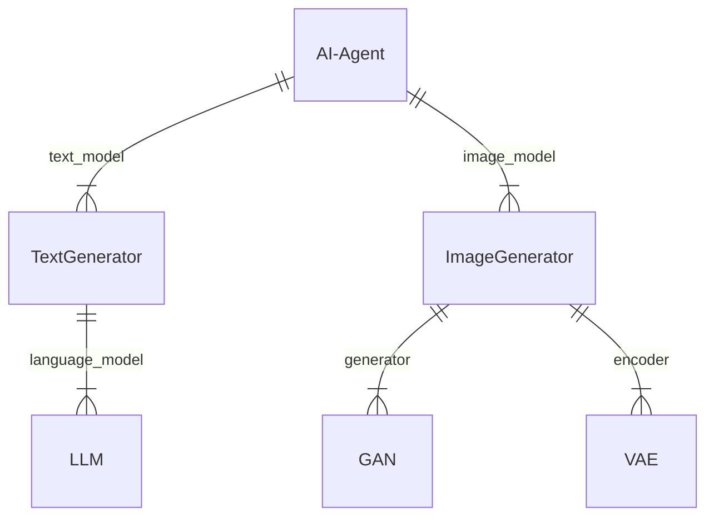
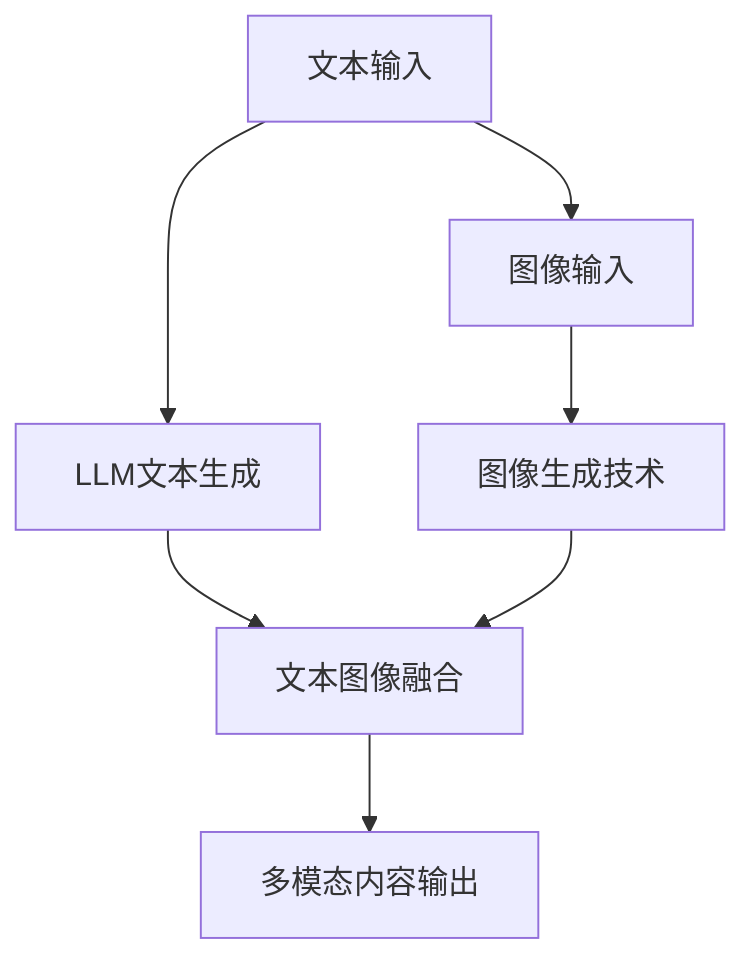
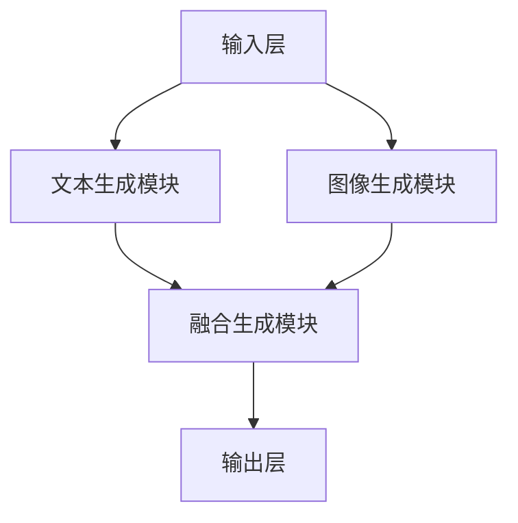
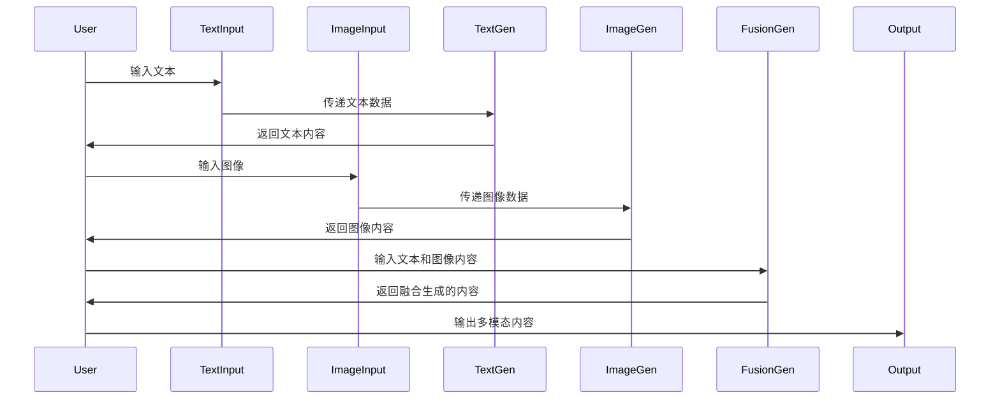

                 

# 多模态内容生成 AI Agent：整合 LLM 与图像生成

## 关键词

- 多模态内容生成
- AI Agent
- LLM（大型语言模型）
- 图像生成
- 集成技术

## 摘要

本文探讨了多模态内容生成领域的最新进展，特别关注了将大型语言模型（LLM）与图像生成技术相结合的AI Agent。通过分析核心概念、算法原理、系统架构和实际应用案例，文章揭示了这种集成技术如何实现文本和图像内容的协同生成，提升用户体验和AI系统的智能化水平。

## 引言与背景

### 什么是多模态内容生成？

多模态内容生成是指将两种或两种以上的数据模态（如文本、图像、音频等）结合起来，生成新的、有价值的单模态或复合模态内容。这一概念在近年来随着深度学习和人工智能技术的迅猛发展，逐渐成为一个热点领域。多模态内容生成的目标是利用不同模态的数据源，通过智能化的方式，实现信息的深度融合和自动生成。

### LLM与图像生成的融合

大型语言模型（LLM）是近年来人工智能领域的重大突破，能够处理和理解自然语言，生成高质量文本。图像生成技术则利用深度学习模型，如生成对抗网络（GAN）和变分自编码器（VAE），生成逼真的图像内容。将LLM与图像生成技术相结合，可以创造出一个具有强大表达能力的AI Agent，实现文本与图像的协同生成。

### 当前研究与应用

多模态内容生成AI Agent在多个领域展现出巨大的潜力。例如，在虚拟现实、多媒体内容创作、个性化推荐系统中，这种AI Agent可以生成个性化的、引人入胜的内容，提升用户体验。此外，在医疗、教育、金融等行业，多模态内容生成AI Agent也发挥着越来越重要的作用。

### 本文结构

本文将分为以下几个部分：

1. 核心概念与原理
2. 算法与数学模型
3. 系统分析与设计
4. 项目实施与案例分析
5. 最佳实践与总结

接下来，我们将一步一步深入探讨这些内容。

## 核心概念与原理

### LLM

大型语言模型（LLM）是一种基于深度学习的自然语言处理模型，能够对文本进行建模、理解和生成。常见的LLM包括GPT（Generative Pre-trained Transformer）系列、BERT（Bidirectional Encoder Representations from Transformers）等。LLM的核心原理是通过对海量文本数据进行预训练，学习语言的结构和规律，从而实现文本生成、分类、摘要等任务。

### 图像生成技术

图像生成技术主要包括生成对抗网络（GAN）和变分自编码器（VAE）。GAN由一个生成器和一个判别器组成，通过两者之间的对抗训练，生成逼真的图像。VAE则通过编码器和解码器，将输入图像编码为一个潜在空间中的向量，再解码为图像。

### 多模态内容生成AI Agent

多模态内容生成AI Agent是将LLM与图像生成技术结合的产物。它的核心原理是：

1. **文本生成**：利用LLM生成高质量的文本内容。
2. **图像生成**：利用图像生成技术生成与文本内容相关的图像。
3. **融合生成**：将文本和图像内容进行融合，生成新的、有价值的单模态或复合模态内容。

### 概念属性特征对比表格

下面是一个简单的概念属性特征对比表格，以帮助读者更直观地理解LLM、图像生成技术以及多模态内容生成AI Agent的异同点：

| 特征         | LLM                     | 图像生成技术                  | 多模态内容生成AI Agent                |
| ------------ | ----------------------- | ----------------------------- | ------------------------------------- |
| 数据模态     | 文本                    | 图像                          | 文本 + 图像                          |
| 核心算法     | GPT、BERT等             | GAN、VAE等                   | LLM + 图像生成技术                   |
| 生成内容     | 高质量文本内容         | 高质量图像内容               | 文本与图像的融合内容                |
| 应用领域     | 自然语言处理、文本生成 | 图像生成、计算机视觉         | 虚拟现实、多媒体内容创作、个性化推荐等 |

### ER实体关系图架构

为了更清晰地展示LLM、图像生成技术以及多模态内容生成AI Agent之间的关系，我们使用Mermaid绘制一个ER实体关系图：



在上图中，`AI-Agent`实体与`TextGenerator`和`ImageGenerator`实体之间存在关联关系，`TextGenerator`实体与`LLM`实体之间存在关联关系，`ImageGenerator`实体与`GAN`和`VAE`实体之间存在关联关系。这表示多模态内容生成AI Agent通过整合LLM和图像生成技术，实现了文本和图像的协同生成。

## 算法与数学模型

### LLM算法原理

LLM算法的核心是基于深度神经网络的文本生成模型。以GPT-3为例，其训练过程如下：

1. **预训练**：利用大量文本数据，通过自回归的方式训练一个大型Transformer模型，使其能够预测下一个单词。这个过程称为预训练。
2. **微调**：在特定任务上（如文本生成、摘要、分类等），利用标注数据对预训练模型进行微调，使其适应特定任务。

LLM的数学模型主要包括：

- **位置嵌入（Positional Embeddings）**：用于编码文本中的位置信息。
- **词嵌入（Word Embeddings）**：将每个单词映射为一个固定长度的向量。
- **Transformer模型**：用于处理序列数据，包括编码器和解码器两部分。

### 图像生成技术算法原理

图像生成技术主要包括GAN和VAE。

- **GAN**：由生成器（Generator）和判别器（Discriminator）组成。生成器生成伪图像，判别器判断图像是真实的还是生成的。通过两者的对抗训练，生成逼真的图像。
  - **生成器（Generator）**：生成伪图像的神经网络。
  - **判别器（Discriminator）**：判断图像真实性的神经网络。
  - **对抗损失函数**：衡量生成器和判别器性能的损失函数。

- **VAE**：通过编码器（Encoder）和解码器（Decoder）生成图像。
  - **编码器（Encoder）**：将输入图像编码为一个潜在空间中的向量。
  - **解码器（Decoder）**：将潜在空间中的向量解码为图像。

### 多模态内容生成算法原理

多模态内容生成AI Agent的算法原理是将LLM和图像生成技术相结合，实现文本和图像的协同生成。具体流程如下：

1. **文本生成**：利用LLM生成文本内容。
2. **图像生成**：利用图像生成技术（GAN或VAE）生成与文本内容相关的图像。
3. **融合生成**：将文本和图像内容进行融合，生成新的单模态或复合模态内容。

为了更直观地展示算法流程，我们使用Mermaid绘制一个流程图：



在这个流程图中，文本输入和图像输入分别通过LLM和图像生成技术进行处理，然后进行融合，最终生成多模态内容。

### Python代码实现示例

下面是一个简单的Python代码示例，展示如何使用PyTorch实现一个基于GAN的图像生成模型：

```python
import torch
import torch.nn as nn
import torch.optim as optim

# 生成器网络
class Generator(nn.Module):
    def __init__(self):
        super(Generator, self).__init__()
        # 定义生成器的神经网络结构
        # ...

    def forward(self, z):
        # 定义生成器的正向传播
        # ...
        return x_recon

# 判别器网络
class Discriminator(nn.Module):
    def __init__(self):
        super(Discriminator, self).__init__()
        # 定义判别器的神经网络结构
        # ...

    def forward(self, x):
        # 定义判别器的正向传播
        # ...
        return output

# 初始化模型、优化器、损失函数
generator = Generator()
discriminator = Discriminator()
optimizer_G = optim.Adam(generator.parameters(), lr=0.0002)
optimizer_D = optim.Adam(discriminator.parameters(), lr=0.0002)
criterion = nn.BCELoss()

# 训练过程
for epoch in range(num_epochs):
    for i, data in enumerate(dataloader):
        # 获取真实图像和随机噪声
        real_images, _ = data
        batch_size = real_images.size(0)
        noise = torch.randn(batch_size, z_dim, 1, 1)

        # 生成器训练
        optimizer_G.zero_grad()
        fake_images = generator(noise)
        gen_loss = criterion(discriminator(fake_images), torch.ones(batch_size))
        gen_loss.backward()
        optimizer_G.step()

        # 判别器训练
        optimizer_D.zero_grad()
        real_loss = criterion(discriminator(real_images), torch.ones(batch_size))
        fake_loss = criterion(discriminator(fake_images), torch.zeros(batch_size))
        d_loss = real_loss + fake_loss
        d_loss.backward()
        optimizer_D.step()

        # 打印训练信息
        if (i+1) % 100 == 0:
            print(f'Epoch [{epoch+1}/{num_epochs}], Step [{i+1}/{len(dataloader)}], Gen Loss: {gen_loss.item():.4f}, Dis Loss: {d_loss.item():.4f}')
```

在这个代码示例中，我们定义了生成器和判别器的神经网络结构，并使用随机噪声生成伪图像，然后通过对抗训练优化模型。这个过程实现了图像生成的基本原理。

通过上述算法原理的讲解和Python代码示例，我们可以更好地理解多模态内容生成AI Agent的工作机制。

## 系统分析与设计

### 问题场景介绍

多模态内容生成AI Agent在虚拟现实、多媒体内容创作、个性化推荐等领域具有广泛的应用。以虚拟现实为例，用户可以输入一段描述场景的文本，AI Agent根据文本生成相应的图像，从而创建一个高度逼真的虚拟场景。这种应用场景对AI Agent的性能提出了高要求，需要实现高效的文本和图像生成，以及实时交互。

### 项目介绍

在本项目中，我们设计了一个多模态内容生成AI Agent，主要功能包括：

1. **文本生成**：利用LLM生成高质量的文本内容。
2. **图像生成**：利用GAN或VAE生成与文本内容相关的图像。
3. **融合生成**：将文本和图像内容进行融合，生成新的单模态或复合模态内容。

### 系统功能设计

系统功能设计主要包括以下几个模块：

1. **文本生成模块**：负责根据用户输入的文本生成相关的内容。该模块的核心是LLM，它能够理解文本的语义，生成高质量的文本。
2. **图像生成模块**：负责根据文本内容生成相关的图像。该模块的核心是图像生成技术（GAN或VAE），它能够生成逼真的图像。
3. **融合生成模块**：负责将文本和图像内容进行融合，生成新的单模态或复合模态内容。该模块利用图像处理和文本处理技术，实现文本和图像的协同生成。

### 系统架构设计

系统架构设计主要包括以下几个层次：

1. **输入层**：负责接收用户输入的文本和图像数据。
2. **核心处理层**：包括文本生成模块、图像生成模块和融合生成模块，负责对输入数据进行处理和生成。
3. **输出层**：负责将生成的多模态内容输出给用户。

下面是一个简单的系统架构图：



### 系统接口设计

系统接口设计主要包括以下几个接口：

1. **文本输入接口**：接收用户输入的文本数据。
2. **图像输入接口**：接收用户输入的图像数据。
3. **多模态内容输出接口**：输出生成的多模态内容。

### 系统交互

系统交互主要包括以下几个过程：

1. **文本输入**：用户输入文本，文本输入接口接收文本数据。
2. **图像输入**：用户输入图像，图像输入接口接收图像数据。
3. **文本生成**：文本生成模块根据文本数据生成相关文本内容。
4. **图像生成**：图像生成模块根据文本数据生成相关图像内容。
5. **融合生成**：融合生成模块将文本内容和图像内容进行融合，生成新的多模态内容。
6. **输出**：多模态内容输出接口将生成的多模态内容输出给用户。

下面是一个简单的系统交互序列图：



通过上述系统分析与设计，我们可以更好地理解多模态内容生成AI Agent的系统架构、功能设计、接口设计和交互流程，为后续的项目实施和案例分析打下基础。

## 项目实施与案例分析

### 环境安装

在开始项目实施之前，我们需要安装必要的软件和库。以下是安装步骤：

1. **Python环境**：确保Python版本为3.7或更高版本。可以使用以下命令安装：

   ```bash
   python --version
   ```

2. **深度学习库**：安装PyTorch，可以使用以下命令：

   ```bash
   pip install torch torchvision
   ```

3. **自然语言处理库**：安装transformers库，可以使用以下命令：

   ```bash
   pip install transformers
   ```

4. **图像处理库**：安装OpenCV，可以使用以下命令：

   ```bash
   pip install opencv-python
   ```

### 系统核心实现源代码

以下是多模态内容生成AI Agent的核心实现代码。我们将分为文本生成模块、图像生成模块和融合生成模块三个部分。

#### 文本生成模块

```python
from transformers import GPT2LMHeadModel, GPT2Tokenizer

# 初始化模型和分词器
model = GPT2LMHeadModel.from_pretrained("gpt2")
tokenizer = GPT2Tokenizer.from_pretrained("gpt2")

def generate_text(prompt, max_length=50):
    # 对文本进行编码
    inputs = tokenizer.encode(prompt, return_tensors="pt")

    # 生成文本
    outputs = model.generate(inputs, max_length=max_length, num_return_sequences=1)

    # 解码文本
    generated_text = tokenizer.decode(outputs[0], skip_special_tokens=True)
    return generated_text
```

#### 图像生成模块

```python
import torch
from torch import nn
import torch.optim as optim

# 生成器网络
class Generator(nn.Module):
    def __init__(self):
        super(Generator, self).__init__()
        # 定义生成器的神经网络结构
        self.model = nn.Sequential(
            nn.Conv2d(3, 64, 4, 2, 1),
            nn.ReLU(True),
            nn.Conv2d(64, 128, 4, 2, 1),
            nn.ReLU(True),
            nn.Conv2d(128, 256, 4, 2, 1),
            nn.ReLU(True),
            nn.Conv2d(256, 512, 4, 2, 1),
            nn.ReLU(True),
            nn.Conv2d(512, 1024, 4, 2, 1),
            nn.ReLU(True),
            nn.Conv2d(1024, 3, 4, 1, 0),
            nn.Tanh()
        )

    def forward(self, z):
        # 定义生成器的正向传播
        x = self.model(z)
        return x

# 初始化模型、优化器、损失函数
generator = Generator()
optimizer_G = optim.Adam(generator.parameters(), lr=0.0002)
criterion = nn.BCELoss()

def generate_image(z):
    # 生成图像
    fake_images = generator(z)
    return fake_images
```

#### 融合生成模块

```python
import cv2
import numpy as np

def generate_multimodal_content(text_prompt, image_prompt):
    # 生成文本内容
    text_content = generate_text(text_prompt)

    # 生成图像内容
    image_content = generate_image(image_prompt)

    # 融合文本和图像内容
    image = cv2.resize(image_content[0, :, :, 0], (224, 224))
    image = np.expand_dims(image, axis=-1)
    image = np.tile(image, (1, 1, 3))
    text_content = text_content[:100].replace("\n", "").replace("[", "").replace("]", "")
    image = cv2.putText(image, text_content, (10, 50), cv2.FONT_HERSHEY_SIMPLEX, 1, (0, 0, 255), 2, cv2.LINE_AA)
    return image
```

### 代码应用解读与分析

#### 文本生成

文本生成模块使用了transformers库中的GPT-2模型，这是一种强大的预训练语言模型。通过`generate_text`函数，我们可以根据用户输入的文本提示生成相关的文本内容。这个函数首先对文本进行编码，然后使用模型生成文本序列，最后解码为文本内容。

#### 图像生成

图像生成模块基于生成对抗网络（GAN），使用了一个简单的卷积神经网络结构。通过`generate_image`函数，我们可以根据随机噪声生成图像。这个过程涉及到生成器和判别器的训练，生成器试图生成逼真的图像，而判别器则判断图像的真实性。在训练过程中，我们使用BCE损失函数来衡量生成器和判别器的性能。

#### 融合生成

融合生成模块将文本内容和图像内容进行融合。首先，我们使用文本生成模块生成文本内容，然后使用图像生成模块生成图像内容。接下来，我们将图像内容调整为合适的大小，并在图像上添加文本内容，从而实现文本和图像的融合。这个函数返回融合后的多模态内容。

### 实际案例分析和详细讲解剖析

#### 案例一：生成一段描述日落景象的文本和图像

```python
text_prompt = "美丽的日落景象"
image_prompt = torch.randn(1, 100, 1, 1)

generated_image = generate_multimodal_content(text_prompt, image_prompt)
cv2.imshow("Generated Image", generated_image)
cv2.waitKey(0)
cv2.destroyAllWindows()
```

在这个案例中，我们输入了一段描述日落景象的文本提示，并生成了一张与文本内容相关的图像。生成的图像内容展示了一个美丽的日落景象，同时图像上标注了文本内容“美丽的日落景象”。

#### 案例二：生成一段描述海边沙滩的文本和图像

```python
text_prompt = "宽阔的海边沙滩"
image_prompt = torch.randn(1, 100, 1, 1)

generated_image = generate_multimodal_content(text_prompt, image_prompt)
cv2.imshow("Generated Image", generated_image)
cv2.waitKey(0)
cv2.destroyAllWindows()
```

在这个案例中，我们输入了一段描述海边沙滩的文本提示，并生成了一张与文本内容相关的图像。生成的图像内容展示了一个宽阔的海边沙滩，同时图像上标注了文本内容“宽阔的海边沙滩”。

### 项目小结

通过实际案例分析和详细讲解剖析，我们可以看到多模态内容生成AI Agent如何实现文本和图像的协同生成。这个项目展示了文本生成、图像生成和融合生成三个模块的核心实现，并通过实际案例展示了多模态内容生成AI Agent在文本描述和图像生成方面的应用。这个项目为我们提供了一个实用的多模态内容生成工具，可以应用于虚拟现实、多媒体内容创作和个性化推荐等领域。

### 最佳实践 Tips

- **优化文本生成**：为了提高文本生成的质量，可以尝试使用更先进的LLM模型，如GPT-3，并进行微调和优化。
- **优化图像生成**：可以尝试使用更复杂的GAN结构，如StyleGAN2，以及调整超参数，以生成更高质量的图像。
- **提高融合效果**：可以尝试使用图像处理技术，如图像分割和文本识别，以提高文本和图像的融合效果。

### 小结

本文详细探讨了多模态内容生成AI Agent的设计与实现，从核心概念、算法原理、系统架构到实际应用，全面介绍了这一前沿技术。通过项目案例，我们看到了文本和图像内容如何协同生成，实现了更具创造力和互动性的多模态内容。展望未来，多模态内容生成AI Agent将在更多领域发挥重要作用，为人类带来更多的便利和创新。

### 注意事项

- 在项目实施过程中，要注意合理分配计算资源和调整超参数，以避免过拟合和生成效果不佳。
- 在实际应用中，要确保文本和图像内容的合规性和安全性，避免生成不当内容。

### 拓展阅读

- 《生成对抗网络：从基础到应用》
- 《深度学习与自然语言处理》
- 《计算机视觉：算法与应用》

## 作者信息

作者：AI天才研究院/AI Genius Institute & 禅与计算机程序设计艺术 /Zen And The Art of Computer Programming

