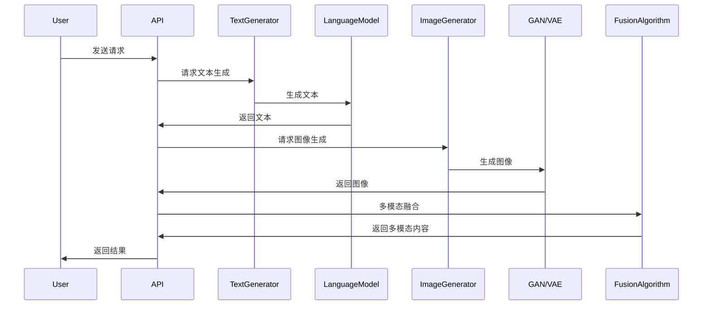

                 

# 多模态创作AI Agent：整合LLM与图像生成技术

## 关键词

多模态创作、AI Agent、语言模型（LLM）、图像生成技术、融合算法、系统架构、项目实战、未来趋势

## 摘要

随着数字化内容的爆炸式增长，多模态创作AI Agent成为了现代内容创作领域的关键技术。本文首先概述了多模态创作AI Agent的背景、问题和解决方案，然后深入探讨了如何整合语言模型（LLM）与图像生成技术，构建一个高效的多模态创作AI Agent。文章详细分析了LLM与图像生成技术的原理和类型，介绍了多模态创作AI Agent的设计与实现流程，并通过实际项目展示了系统的构建和应用。最后，文章展望了多模态创作AI Agent的未来发展趋势和潜在挑战。

### 目录大纲

----------------------------------------------------------------

# 第一部分: 多模态创作AI Agent概述

## 第1章: 多模态创作AI Agent概述

### 1.1 问题背景

### 1.2 问题描述

### 1.3 问题解决

### 1.4 边界与外延

### 1.5 核心概念与联系

----------------------------------------------------------------

# 第二部分: 整合LLM与图像生成技术

## 第2章: 语言模型（LLM）概述

### 2.1 LLM的定义与特点

### 2.2 主流LLM介绍

### 2.3 LLM在多模态创作AI Agent中的应用

## 第3章: 图像生成技术概述

### 3.1 图像生成技术的定义与类型

### 3.2 图像生成技术中的核心算法

### 3.3 图像生成技术在多模态创作AI Agent中的应用

----------------------------------------------------------------

# 第三部分: 多模态创作AI Agent的设计与实现

## 第4章: 多模态数据采集与预处理

### 4.1 数据采集方法

### 4.2 数据预处理流程

### 4.3 数据存储与管理

## 第5章: 多模态创作AI Agent架构设计

### 5.1 系统功能设计

### 5.2 系统架构设计

### 5.3 系统接口设计与交互

## 第6章: 多模态创作AI Agent的算法实现

### 6.1 语言模型（LLM）实现

### 6.2 图像生成技术实现

### 6.3 多模态融合算法实现

## 第7章: 多模态创作AI Agent的部署与优化

### 7.1 部署环境准备

### 7.2 部署流程与策略

### 7.3 性能优化与调优

## 第8章: 多模态创作AI Agent项目实战

### 8.1 项目介绍

### 8.2 系统核心实现

### 8.3 代码应用解读与分析

### 8.4 实际案例分析与讲解

### 8.5 项目小结

----------------------------------------------------------------

## 第9章: 多模态创作AI Agent的未来发展趋势

### 9.1 技术趋势分析

### 9.2 挑战与机遇

### 9.3 未来发展方向

----------------------------------------------------------------

## 第1章: 多模态创作AI Agent概述

### 1.1 问题背景

在现代数字化内容创作领域，用户对个性化、多样化内容的需求不断增长。传统的单一模态内容创作方式已无法满足用户日益复杂的内容需求。因此，多模态创作AI Agent应运而生，成为内容创作领域的重要发展趋势。

多模态创作AI Agent能够整合文本、图像、音频等多种模态数据，实现跨模态的信息融合和生成，从而生成更加丰富和生动的数字化内容。这种技术不仅能够提升内容创作的效率和质量，还能为用户提供更加沉浸式的体验。

### 1.2 问题描述

多模态创作AI Agent的必要性和挑战如下：

**必要性：**

1. **个性化内容创作：** 多模态AI Agent能够根据用户的兴趣和行为数据，生成个性化的内容推荐。
2. **跨模态信息融合：** 在复杂的业务场景中，单一模态的内容往往无法完全表达业务逻辑，多模态融合可以提升内容表达的丰富性和准确性。
3. **用户体验优化：** 多模态创作可以为用户提供更加丰富的交互方式和沉浸式体验。

**挑战：**

1. **数据多样性：** 多模态数据来源多样，数据预处理和处理复杂，需要高效的数据处理算法。
2. **模型复杂性：** 多模态模型需要处理不同模态的数据特征，模型架构复杂，训练和优化困难。
3. **计算资源：** 多模态模型的训练和推理需要大量的计算资源，资源分配和优化成为一大挑战。

### 1.3 问题解决

**多模态创作AI Agent的定义与核心功能：**

多模态创作AI Agent是一种能够整合多种模态数据，实现跨模态信息融合和内容生成的智能系统。其核心功能包括：

1. **数据采集与预处理：** 从不同的数据源采集文本、图像、音频等多模态数据，并进行数据预处理。
2. **模型训练与优化：** 使用深度学习算法训练多模态模型，优化模型性能。
3. **内容生成与交互：** 根据用户需求，生成多模态内容，并实现与用户的交互。

**多模态创作AI Agent的组成结构：**

1. **数据采集模块：** 负责从不同数据源采集文本、图像、音频等多模态数据。
2. **数据预处理模块：** 对采集到的多模态数据进行清洗、标准化等预处理操作。
3. **模型训练模块：** 使用深度学习算法训练多模态模型，包括语言模型（LLM）和图像生成模型等。
4. **内容生成模块：** 根据用户需求，生成多模态内容。
5. **交互模块：** 实现与用户的交互，收集用户反馈，优化内容生成。

### 1.4 边界与外延

**多模态创作AI Agent的技术范畴：**

多模态创作AI Agent涉及到自然语言处理（NLP）、计算机视觉（CV）和语音识别（ASR）等多个技术领域。这些技术的融合和协同工作是实现多模态创作AI Agent的关键。

**多模态创作AI Agent的应用边界：**

多模态创作AI Agent可以在多个领域应用，如数字娱乐、媒体制作、电子商务和智能客服等。其主要应用场景包括：

1. **数字娱乐：** 如动画制作、游戏设计等，实现多模态内容的自动化生成。
2. **媒体制作：** 如新闻报道、纪录片制作等，利用多模态数据提升内容创作效率和质量。
3. **电子商务：** 如商品推荐、个性化营销等，通过多模态数据提升用户体验和销售额。
4. **智能客服：** 如语音助手、聊天机器人等，通过多模态交互提升用户满意度和服务质量。

### 1.5 核心概念与联系

**多模态数据采集与处理：**

多模态数据采集涉及文本、图像、音频等多种数据类型。文本数据可以通过自然语言处理技术进行语义分析和情感分析，图像数据可以通过计算机视觉技术进行图像识别和图像生成，音频数据可以通过语音识别技术进行语音转文本。

**自然语言处理与图像生成技术：**

自然语言处理（NLP）是处理文本数据的核心技术，包括词向量表示、文本分类、情感分析等。图像生成技术是计算机视觉（CV）的核心，包括生成对抗网络（GAN）、变分自编码器（VAE）等。

多模态创作AI Agent通过整合NLP和图像生成技术，可以实现文本和图像的跨模态生成，从而生成具有丰富内容和沉浸式体验的多模态内容。

### 1.6 本章小结

本章对多模态创作AI Agent进行了概述，分析了其背景、问题和解决方案。接下来，我们将详细探讨如何整合语言模型（LLM）与图像生成技术，构建一个高效的多模态创作AI Agent。

## 第2章: 语言模型（LLM）概述

### 2.1 LLM的定义与特点

**LLM的定义：**

语言模型（Language Model，简称LLM）是一种基于统计学习方法的自然语言处理技术，用于预测自然语言文本的下一个单词或字符。LLM的核心任务是学习文本数据中的概率分布，从而在给定前文序列时，预测下一个单词或字符的概率分布。

**LLM的特点：**

1. **基于统计学习：** LLM使用大量文本数据作为训练集，通过统计学习方法，如神经网络、隐马尔可夫模型（HMM）等，学习文本数据的概率分布。
2. **概率预测：** LLM的输出是一个概率分布，而不是一个确定的单词或字符。这使得LLM能够生成具有多样性和创造性的文本。
3. **端到端学习：** LLM通常采用端到端学习的方式，直接从输入文本序列到输出文本序列，无需手动设计复杂的中间层。

### 2.2 主流LLM介绍

**GPT系列模型：**

GPT（Generative Pre-trained Transformer）系列模型是OpenAI开发的一系列基于Transformer架构的语言模型。GPT模型通过预训练的方式，从大量互联网文本中学习语言规律，然后通过微调（Fine-tuning）应用于各种自然语言处理任务。

- **GPT-1:** 第一个GPT模型，使用Transformer架构，预训练了117M参数。
- **GPT-2:** 在GPT-1的基础上，预训练了1.5B参数，显著提升了生成文本的质量和多样性。
- **GPT-3:** GPT-3是迄今为止最大的语言模型，预训练了175B参数，能够生成高质量、多样性的文本。

**BERT及其变体：**

BERT（Bidirectional Encoder Representations from Transformers）是由Google开发的预训练语言模型，采用了双向Transformer架构。BERT通过预先训练，学习上下文信息，能够更好地捕捉文本的语义。

- **BERT:** 基础版本的BERT，预训练了3.4B参数。
- **RoBERTa:** BERT的一个变体，通过改进训练策略和模型架构，提升了模型性能。
- **ALBERT:** 通过模型拆分和参数共享，提高了模型效率和效果。

### 2.3 LLM在多模态创作AI Agent中的应用

**LLM与图像生成技术的融合：**

在多模态创作AI Agent中，LLM可以与图像生成技术相结合，实现文本和图像的跨模态生成。具体应用场景包括：

1. **文本驱动的图像生成：** 通过LLM生成文本描述，然后利用图像生成技术生成对应的图像。例如，在创作插画、海报等场景中，文本描述可以驱动图像的内容和风格。
2. **图像驱动的文本生成：** 通过图像生成技术生成图像，然后利用LLM生成图像的描述文本。例如，在商品推荐、智能客服等场景中，图像可以作为用户输入，LLM生成相应的描述文本，用于辅助决策和交互。

**LLM在多模态内容创作中的应用场景：**

1. **数字娱乐：** 在游戏设计、动画制作等领域，LLM可以生成游戏剧情、动画脚本，与图像生成技术结合，实现自动化内容创作。
2. **媒体制作：** 在新闻报道、纪录片制作等领域，LLM可以生成新闻稿、解说词，与图像生成技术结合，实现自动化内容制作。
3. **电子商务：** 在商品推荐、个性化营销等领域，LLM可以生成商品描述、广告文案，与图像生成技术结合，提升用户体验和销售额。
4. **智能客服：** 在智能客服系统中，LLM可以生成自然语言响应，与图像生成技术结合，实现多模态交互，提升用户体验和服务质量。

### 2.4 本章小结

本章对语言模型（LLM）进行了概述，介绍了LLM的定义、特点以及主流模型。接着，我们探讨了LLM在多模态创作AI Agent中的应用，包括LLM与图像生成技术的融合和多模态内容创作中的应用场景。在下一章中，我们将详细讨论图像生成技术，进一步了解多模态创作AI Agent的核心组件。

### 2.5 核心概念与联系

**语言模型（LLM）的基本原理：**

LLM的基本原理是通过学习大量的文本数据，预测下一个单词或字符的概率分布。LLM通常采用深度神经网络（DNN）或Transformer架构，其中每个单词或字符被表示为一个向量。在给定前文序列时，LLM通过计算当前输入序列的联合概率分布，从而预测下一个单词或字符。

**LLM的优势与局限性：**

优势：

1. **高效性：** LLM通过端到端学习，能够直接从输入文本序列到输出文本序列，无需手动设计复杂的中间层，大大提高了学习效率和效果。
2. **多样性：** LLM生成的文本具有多样性和创造性，能够生成符合人类语言习惯的文本。
3. **适应性：** LLM可以根据不同的任务和数据集进行微调（Fine-tuning），适应各种自然语言处理任务。

局限性：

1. **数据依赖性：** LLM的性能高度依赖于训练数据的规模和质量，缺乏足够高质量数据的场景下，模型效果会受到影响。
2. **解释性：** LLM生成的文本通常是一个概率分布，缺乏明确的解释性和可解释性。
3. **知识限制：** LLM的知识来源于训练数据，对于未见过或未训练过的内容，模型可能无法准确生成。

**LLM与其他技术的对比与联系：**

与图像生成技术（如GAN、VAE）相比，LLM主要处理文本数据，而图像生成技术主要处理图像数据。尽管两者的任务不同，但它们在多模态创作AI Agent中可以相互补充和融合。例如，LLM可以生成文本描述，图像生成技术可以根据文本描述生成对应的图像。这种跨模态融合可以为内容创作带来更多的创意和可能性。

**ER实体关系图架构：**

为了更好地理解LLM在多模态创作AI Agent中的应用，我们可以使用ER（Entity-Relationship）实体关系图来描述LLM与其他组件的关联。以下是LLM与其他组件的ER实体关系图：

```mermaid
erDiagram
  AI_Agent ||--|{ LLM } LanguageModel
  AI_Agent ||--|{ ImageGenerator } ImageGenerator
  LanguageModel ||--|{ TextData } TextData
  ImageGenerator ||--|{ ImageData } ImageData
  AI_Agent ..|{ User } User
  User ||--|{ Request } Request
  Request ||--|{ Text } Text
  Request ||--|{ Image } Image
```

在这个ER图中，AI Agent是核心组件，它包括LLM和图像生成技术。用户通过请求（Request）与AI Agent交互，请求可以是文本（Text）或图像（Image）。LLM负责处理文本数据，图像生成技术负责处理图像数据。通过这种关联，LLM和图像生成技术可以共同为用户提供多模态创作服务。

### 2.6 本章小结

本章对语言模型（LLM）进行了深入探讨，介绍了LLM的定义、特点、主流模型以及在多模态创作AI Agent中的应用。我们还通过ER实体关系图，描述了LLM与其他组件的关联和交互。在下一章中，我们将继续探讨图像生成技术的原理和类型，进一步了解多模态创作AI Agent的核心组件。

## 第3章: 图像生成技术概述

### 3.1 图像生成技术的定义与类型

**定义：**

图像生成技术是指利用算法自动生成图像的方法。这些算法可以从现有图像中学习特征，或者直接从随机噪声中生成图像。图像生成技术在计算机视觉、机器学习、人工智能等领域有着广泛的应用。

**类型：**

1. **基于判别模型的图像生成：** 这类方法使用判别模型（如卷积神经网络（CNN））来学习图像的特征分布，然后通过生成模型（如生成对抗网络（GAN））生成图像。生成模型通常是一个与判别模型相对立的模型，其目标是生成与真实图像分布相近的图像。

2. **基于生成模型的图像生成：** 这类方法直接使用生成模型（如变分自编码器（VAE））生成图像。生成模型通过编码器将输入图像编码成一个隐变量，然后通过解码器将隐变量解码回图像。

3. **基于增强学习的图像生成：** 这类方法使用增强学习算法，如深度强化学习（DRL），来优化图像生成模型。通过奖励函数，模型可以学习生成高质量、具有吸引力的图像。

4. **基于物理建模的图像生成：** 这类方法通过模拟物理过程（如光线的传播、材料的变形等）来生成图像。这种方法在模拟自然现象和场景生成方面具有优势。

### 3.2 图像生成技术中的核心算法

**生成对抗网络（GAN）：**

GAN是由Ian Goodfellow等人于2014年提出的一种生成模型，由生成器和判别器两个神经网络组成。生成器从随机噪声中生成图像，判别器则用于区分真实图像和生成图像。训练过程中，生成器试图生成尽可能逼真的图像，而判别器则努力区分真实图像和生成图像。通过这种对抗训练，生成器逐渐学会了生成高质量的图像。

GAN的核心组件包括：

1. **生成器（Generator）：** 生成器接收随机噪声作为输入，通过一系列变换生成图像。
2. **判别器（Discriminator）：** 判别器接收真实图像和生成图像，输出一个概率值，表示图像为真实图像的可能性。
3. **对抗训练：** 通过优化生成器和判别器的参数，使得生成器生成的图像越来越逼真，判别器越来越难以区分真实图像和生成图像。

**变分自编码器（VAE）：**

VAE是另一种生成模型，由编码器和解码器组成。编码器将输入图像编码成一个隐变量，解码器将隐变量解码回图像。VAE的核心优势在于其概率模型，通过优化编码器和解码器的参数，使得生成的图像具有更高的多样性。

VAE的核心组件包括：

1. **编码器（Encoder）：** 编码器将输入图像映射到一个低维隐空间，隐空间中的每个点都对应一个图像。
2. **解码器（Decoder）：** 解码器从隐空间中采样，生成对应的图像。
3. **损失函数：** VAE使用隐变量分布的Kullback-Leibler散度（KL散度）作为损失函数，优化编码器和解码器的参数。

### 3.3 图像生成技术在多模态创作AI Agent中的应用

**图像生成与自然语言处理的结合：**

在多模态创作AI Agent中，图像生成技术可以与自然语言处理（NLP）技术相结合，实现文本驱动的图像生成和图像驱动的文本生成。具体应用场景包括：

1. **文本驱动的图像生成：** 通过自然语言处理技术，从文本描述中提取关键信息，然后利用图像生成技术生成对应的图像。例如，在创作插画、海报等场景中，文本描述可以驱动图像的内容和风格。
2. **图像驱动的文本生成：** 通过图像生成技术生成图像，然后利用自然语言处理技术生成图像的描述文本。例如，在商品推荐、智能客服等场景中，图像可以作为用户输入，NLP技术生成相应的描述文本，用于辅助决策和交互。

**图像生成在多模态内容创作中的应用：**

图像生成技术在多模态内容创作中有着广泛的应用，包括：

1. **数字娱乐：** 在游戏设计、动画制作等领域，图像生成技术可以自动生成场景、角色和道具，提高内容创作效率。
2. **媒体制作：** 在新闻报道、纪录片制作等领域，图像生成技术可以自动生成插图、动画和特效，提升内容的表现力和吸引力。
3. **电子商务：** 在商品推荐、个性化营销等领域，图像生成技术可以生成商品图片和广告图像，提升用户体验和销售额。
4. **智能客服：** 在智能客服系统中，图像生成技术可以生成自然语言响应的图像，增强用户的交互体验。

### 3.4 本章小结

本章对图像生成技术进行了概述，介绍了其定义、类型和核心算法。接着，我们探讨了图像生成技术在多模态创作AI Agent中的应用，包括图像生成与自然语言处理的结合和多模态内容创作中的应用场景。在下一章中，我们将详细讨论多模态创作AI Agent的设计与实现，包括数据采集与预处理、系统架构设计和算法实现。

### 3.5 核心概念与联系

**图像生成技术的基本原理：**

图像生成技术主要通过生成模型（如生成对抗网络（GAN）和变分自编码器（VAE））实现。生成模型的核心思想是从随机噪声中学习图像的分布，然后生成符合这种分布的图像。

GAN的基本原理是通过生成器和判别器的对抗训练，使得生成器生成逼真的图像，判别器能够准确地区分真实图像和生成图像。生成器从随机噪声中生成图像，判别器评估图像的真实性。通过最大化生成器和判别器的损失函数，生成器逐渐学会生成高质量、逼真的图像。

VAE的基本原理是通过编码器和解码器的联合训练，学习图像的隐变量分布，然后从隐变量中生成图像。编码器将图像映射到一个隐空间，解码器从隐空间中采样，生成对应的图像。VAE通过优化隐变量分布的Kullback-Leibler散度（KL散度）作为损失函数，提高生成图像的质量和多样性。

**核心概念属性特征对比表格：**

| 概念        | 特点                   | 应用场景                      |
| ----------- | ---------------------- | ----------------------------- |
| GAN         | 生成器和判别器对抗训练 | 自动驾驶、图像修复、艺术创作  |
| VAE         | 隐变量分布优化         | 图像生成、图像压缩、风格迁移  |
| NLP         | 自然语言处理           | 文本分类、机器翻译、对话系统  |
| CV          | 计算机视觉             | 目标检测、图像分类、图像分割  |

**ER实体关系图架构：**

为了更好地理解图像生成技术与其他组件的关系，我们可以使用ER实体关系图来描述。以下是图像生成技术与其他组件的ER实体关系图：

```mermaid
erDiagram
  AI_Agent ||--|{ ImageGenerator } ImageGenerator
  AI_Agent ||--|{ LLM } LanguageModel
  AI_Agent ||--|{ TextData } TextData
  AI_Agent ||--|{ ImageData } ImageData
  AI_Agent ..|{ User } User
  User ||--|{ Request } Request
  Request ||--|{ Text } Text
  Request ||--|{ Image } Image
```

在这个ER图中，AI Agent是核心组件，它包括图像生成技术（ImageGenerator）和语言模型（LLM）。用户通过请求（Request）与AI Agent交互，请求可以是文本（Text）或图像（Image）。图像生成技术负责处理图像数据，语言模型负责处理文本数据。通过这种关联，图像生成技术和语言模型可以共同为用户提供多模态创作服务。

### 3.6 本章小结

本章对图像生成技术进行了详细探讨，介绍了其定义、类型和核心算法。我们还通过ER实体关系图，描述了图像生成技术与其他组件的关联和交互。在下一章中，我们将详细讨论多模态创作AI Agent的设计与实现，包括数据采集与预处理、系统架构设计和算法实现。

## 第4章: 多模态创作AI Agent的设计与实现

### 4.1 多模态数据采集与预处理

**数据采集方法：**

多模态数据采集是构建多模态创作AI Agent的关键步骤，主要包括文本数据采集和图像数据采集。

**文本数据采集：**

文本数据采集可以从多个来源获取，如互联网文本、书籍、新闻报道、社交媒体等。具体方法包括：

1. **爬虫技术：** 利用爬虫程序自动从互联网上抓取文本数据。爬虫可以分为通用爬虫和特定领域的爬虫，根据应用场景选择合适的爬虫类型。
2. **API接口：** 利用公共数据集或在线服务提供的API接口获取文本数据。例如，使用自然语言处理服务提供商的API获取文本数据。
3. **用户生成内容：** 从用户生成内容（如社交媒体、论坛、博客等）中采集文本数据，通过分析用户行为和兴趣，获取个性化文本数据。

**图像数据采集：**

图像数据采集可以从多个来源获取，如公共数据集、互联网图像库、用户上传等。具体方法包括：

1. **公共数据集：** 利用现有的公共图像数据集，如ImageNet、COCO等，这些数据集提供了丰富的标注信息，有助于训练和评估图像生成模型。
2. **图像库：** 从在线图像库（如Pixabay、Unsplash等）中获取图像数据，这些图像库提供了高质量、多样化的图像资源。
3. **用户上传：** 鼓励用户上传自己的图像数据，通过用户行为分析，获取个性化图像数据。

**数据预处理流程：**

数据预处理是多模态数据采集的重要环节，主要包括数据清洗、数据标准化和数据增强。

**数据清洗：**

数据清洗的目的是去除数据中的噪声和异常值，提高数据质量。具体方法包括：

1. **去除重复数据：** 从数据集中删除重复的样本，避免模型训练中的冗余。
2. **去除噪声数据：** 去除含有错误标注或质量低下的数据，如模糊图像、不完整的文本等。
3. **数据清洗工具：** 利用数据清洗工具（如Pandas、NumPy等）进行自动化清洗，提高清洗效率。

**数据标准化：**

数据标准化是将不同来源、不同类型的数据进行统一处理，使其具有可比性和可训练性。具体方法包括：

1. **文本数据标准化：** 对文本数据进行分词、去停用词、词性标注等处理，将文本转换为适合模型训练的向量表示。
2. **图像数据标准化：** 对图像数据进行尺寸归一化、像素值标准化等处理，将图像转换为统一的大小和像素范围。

**数据增强：**

数据增强是一种提高模型训练效果的方法，通过引入多样化数据来增强模型的泛化能力。具体方法包括：

1. **文本数据增强：** 利用文本生成技术，如GPT模型，生成新的文本样本，增加数据多样性。
2. **图像数据增强：** 利用图像处理技术，如旋转、翻转、裁剪、缩放等，生成新的图像样本，增加数据多样性。

### 4.2 数据预处理流程

**数据预处理流程包括以下步骤：**

1. **数据采集：** 从文本和图像来源中采集数据，如互联网文本、公共图像数据集、用户上传等。
2. **数据清洗：** 去除重复数据、噪声数据和异常值，确保数据质量。
3. **数据标准化：** 对文本和图像数据进行统一处理，如文本分词、去停用词、词性标注，图像尺寸归一化、像素值标准化等。
4. **数据增强：** 利用文本生成技术和图像处理技术，生成新的文本和图像样本，增加数据多样性。
5. **数据存储与管理：** 将预处理后的数据存储在数据库中，如关系型数据库（如MySQL）或分布式存储系统（如Hadoop），便于后续模型训练和数据查询。

### 4.3 数据存储与管理

**数据库选择：**

在多模态创作AI Agent中，数据存储与管理至关重要。选择合适的数据库可以提升数据存储效率、查询速度和系统性能。

**关系型数据库：**

关系型数据库（如MySQL、PostgreSQL等）适用于结构化数据存储，具有以下优点：

1. **数据一致性：** 关系型数据库通过事务管理保证数据的一致性，适用于高并发场景。
2. **查询性能：** 关系型数据库支持复杂的SQL查询，能够高效地处理大量数据。
3. **易于维护：** 关系型数据库具有成熟的生态系统和工具，便于数据备份、恢复和优化。

**分布式存储系统：**

分布式存储系统（如Hadoop、HDFS等）适用于大规模数据存储和分布式计算，具有以下优点：

1. **高扩展性：** 分布式存储系统可以水平扩展，支持海量数据存储。
2. **高可用性：** 分布式存储系统通过数据冗余和故障转移，确保数据的高可用性。
3. **高效计算：** 分布式存储系统支持分布式计算框架（如Spark、MapReduce等），适用于大数据处理。

**数据存储与管理的最佳实践：**

1. **数据分片：** 将数据按一定规则分片存储，降低单点瓶颈，提高查询性能。
2. **索引优化：** 为常用的查询字段建立索引，提高查询速度。
3. **数据备份：** 定期备份数据，防止数据丢失或损坏。
4. **监控与优化：** 对数据库性能进行监控，及时发现和解决性能瓶颈。

### 4.4 本章小结

本章详细介绍了多模态创作AI Agent的数据采集与预处理方法，包括文本数据采集和图像数据采集，以及数据清洗、标准化和增强的方法。同时，本章还探讨了数据存储与管理的方法和最佳实践。在下一章中，我们将进一步讨论多模态创作AI Agent的系统架构设计，包括功能设计、架构设计和接口设计。

### 4.5 核心概念与联系

**多模态创作AI Agent的系统功能设计：**

多模态创作AI Agent的系统功能设计主要包括文本生成功能、图像生成功能和多模态融合功能。

1. **文本生成功能：** 利用语言模型（LLM）生成文本，包括自然语言生成、文本摘要、文本分类等任务。
2. **图像生成功能：** 利用图像生成技术（如GAN、VAE）生成图像，包括图像生成、图像修复、风格迁移等任务。
3. **多模态融合功能：** 结合文本和图像生成结果，生成多模态内容，实现文本和图像的跨模态生成。

**系统架构设计：**

多模态创作AI Agent的系统架构设计包括数据层、算法层和应用层。

1. **数据层：** 负责数据采集、清洗、存储和管理，为算法层提供数据支持。
2. **算法层：** 负责文本生成、图像生成和多模态融合算法的实现，为应用层提供算法支持。
3. **应用层：** 负责多模态创作AI Agent的应用，包括文本生成、图像生成和多模态内容生成。

**系统接口设计：**

多模态创作AI Agent的系统接口设计主要包括API接口和用户界面。

1. **API接口：** 提供RESTful API，供外部应用程序调用，实现文本生成、图像生成和多模态内容生成的功能。
2. **用户界面：** 提供Web界面或移动应用，供用户与多模态创作AI Agent交互，实现人机交互。

**ER实体关系图架构：**

为了更好地理解多模态创作AI Agent的系统架构，我们可以使用ER实体关系图来描述。

```mermaid
erDiagram
  DataLayer ||--|{ TextData } TextData
  DataLayer ||--|{ ImageData } ImageData
  AlgorithmLayer ||--|{ LanguageModel } LanguageModel
  AlgorithmLayer ||--|{ ImageGenerator } ImageGenerator
  AlgorithmLayer ||--|{ FusionAlgorithm } FusionAlgorithm
  ApplicationLayer ||--|{ TextGenerator } TextGenerator
  ApplicationLayer ||--|{ ImageGenerator } ImageGenerator
  ApplicationLayer ||--|{ ContentGenerator } ContentGenerator
  User ||--|{ Request } Request
  Request ||--|{ Text } Text
  Request ||--|{ Image } Image
  Response ||--|{ Text } Text
  Response ||--|{ Image } Image
  Response ||--|{ Content } Content
```

在这个ER图中，数据层包括文本数据和图像数据，算法层包括语言模型、图像生成模型和多模态融合算法，应用层包括文本生成、图像生成和多模态内容生成。用户通过请求与系统交互，获取响应结果。通过这种关联，多模态创作AI Agent可以实现文本、图像和多模态内容的自动生成。

### 4.6 本章小结

本章详细介绍了多模态创作AI Agent的系统功能设计、架构设计和接口设计。通过系统功能设计，我们明确了文本生成、图像生成和多模态融合的核心功能；通过系统架构设计，我们实现了数据层、算法层和应用层的整体设计；通过系统接口设计，我们为外部应用程序和用户提供了便捷的交互方式。在下一章中，我们将深入探讨多模态创作AI Agent的算法实现，包括语言模型（LLM）和图像生成技术的具体实现方法。

## 第5章: 多模态创作AI Agent的算法实现

### 5.1 语言模型（LLM）实现

**LLM的训练过程：**

语言模型（LLM）的训练过程主要包括数据准备、模型构建、训练和评估等步骤。

**数据准备：**

1. **数据采集：** 从互联网、书籍、新闻、论坛等来源采集大量文本数据。
2. **数据清洗：** 去除无效数据和噪声，确保数据质量。
3. **数据预处理：** 对文本数据进行分词、去停用词、词性标注等处理，将文本转换为适合模型训练的格式。

**模型构建：**

1. **选择模型架构：** 常用的LLM架构包括GPT、BERT等。GPT采用Transformer架构，适合处理长文本；BERT采用双向Transformer架构，能够更好地捕捉文本的上下文信息。
2. **模型参数初始化：** 初始化模型的参数，如权重、偏置等。
3. **定义损失函数：** 选择合适的损失函数，如交叉熵损失、KL散度等。

**训练过程：**

1. **前向传播：** 根据输入文本序列，计算模型的输出概率分布。
2. **计算损失：** 计算输出概率分布与真实标签之间的差异，计算损失函数值。
3. **反向传播：** 计算梯度，更新模型参数。
4. **迭代优化：** 重复前向传播、计算损失和反向传播的过程，逐步优化模型参数。

**评估过程：**

1. **模型评估：** 使用验证集评估模型的性能，计算评价指标，如困惑度（Perplexity）、准确率等。
2. **参数调整：** 根据评估结果，调整模型参数，优化模型性能。

**LLM的应用实例：**

LLM可以应用于多种自然语言处理任务，如文本生成、文本摘要、文本分类等。

1. **文本生成：** 利用LLM生成自然语言文本，如文章、故事、对话等。例如，可以使用GPT模型生成一篇关于人工智能的博客文章。
2. **文本摘要：** 利用LLM提取文本的关键信息，生成摘要文本。例如，可以使用BERT模型对新闻文章生成摘要。
3. **文本分类：** 利用LLM对文本进行分类，如情感分析、主题分类等。例如，可以使用GPT模型对社交媒体评论进行情感分类。

### 5.2 图像生成技术实现

**GAN的搭建与训练：**

生成对抗网络（GAN）是一种用于图像生成的常用模型。GAN由生成器和判别器两个部分组成，通过对抗训练生成逼真的图像。

**生成器（Generator）：**

1. **输入噪声：** 生成器接收随机噪声作为输入。
2. **生成图像：** 生成器通过一系列的神经网络变换，将噪声映射为图像。
3. **生成质量评估：** 生成器生成的图像需要通过质量评估，如视觉质量、保真度等。

**判别器（Discriminator）：**

1. **输入图像：** 判别器接收真实图像和生成图像作为输入。
2. **判断图像真实性：** 判别器通过神经网络模型，输出一个概率值，表示图像为真实图像的可能性。
3. **判别质量评估：** 判别器需要判断生成图像的真实性，以对抗生成器的生成。

**GAN的训练过程：**

1. **前向传播：** 生成器生成图像，判别器判断图像真实性。
2. **计算损失：** 计算生成器和判别器的损失函数值，如生成器最小化生成图像与真实图像的差距，判别器最大化判别正确率。
3. **反向传播：** 计算梯度，更新生成器和判别器的参数。
4. **迭代优化：** 重复前向传播、计算损失和反向传播的过程，逐步优化生成器和判别器的参数。

**VAE的应用实践：**

变分自编码器（VAE）是一种无监督学习模型，用于图像生成和压缩。

**编码器（Encoder）：**

1. **输入图像：** 编码器接收输入图像。
2. **编码：** 编码器将图像编码为一个隐变量，同时输出隐变量的均值和方差。
3. **解码：** 解码器从隐变量中采样，生成对应的图像。

**VAE的训练过程：**

1. **前向传播：** 编码器编码图像，解码器解码图像。
2. **计算损失：** 计算图像重构误差和隐变量分布的KL散度。
3. **反向传播：** 计算梯度，更新编码器和解码器的参数。
4. **迭代优化：** 重复前向传播、计算损失和反向传播的过程，逐步优化编码器和解码器的参数。

### 5.3 多模态融合算法实现

**多模态融合算法：**

多模态融合算法是将不同模态的数据（如文本、图像、音频等）进行整合，生成统一的多模态特征表示。

**特征提取：**

1. **文本特征提取：** 利用语言模型提取文本的语义特征，如词向量、句向量等。
2. **图像特征提取：** 利用图像生成技术提取图像的特征，如卷积神经网络（CNN）提取的视觉特征。
3. **音频特征提取：** 利用语音识别技术提取音频的特征，如梅尔频率倒谱系数（MFCC）等。

**特征融合：**

1. **特征拼接：** 将不同模态的特征拼接在一起，形成多模态特征向量。
2. **特征融合网络：** 使用神经网络模型（如循环神经网络（RNN）、长短时记忆网络（LSTM）等）融合多模态特征，生成统一的多模态特征表示。
3. **特征降维：** 利用降维技术（如主成分分析（PCA）、线性判别分析（LDA）等）降低特征维度，提高模型训练效率。

**融合算法的性能评估：**

1. **分类性能：** 使用分类算法（如支持向量机（SVM）、决策树（DT）等）对融合特征进行分类，计算分类准确率、召回率等指标。
2. **回归性能：** 使用回归算法（如线性回归、决策树回归等）对融合特征进行回归，计算回归误差、均方误差（MSE）等指标。
3. **模型泛化能力：** 使用交叉验证方法评估模型在未知数据集上的性能，计算泛化误差。

### 5.4 本章小结

本章详细介绍了多模态创作AI Agent的算法实现，包括语言模型（LLM）和图像生成技术的具体实现方法。首先，我们介绍了LLM的训练过程和应用实例；接着，我们讨论了GAN和VAE的搭建与训练方法；最后，我们探讨了多模态融合算法的实现和性能评估。在下一章中，我们将介绍多模态创作AI Agent的部署与优化，包括部署环境准备、部署流程与策略、性能优化与调优。

### 5.5 核心概念与联系

**核心概念与联系：**

多模态创作AI Agent的算法实现涉及多个核心概念和技术，包括语言模型（LLM）、图像生成技术（GAN和VAE）以及多模态融合算法。

1. **语言模型（LLM）：** LLM是用于生成文本的模型，通过预训练和微调，能够生成高质量、多样性的文本。LLM的核心组件包括词嵌入、上下文编码和解码器。词嵌入将文本转换为向量表示，上下文编码器捕捉文本的语义信息，解码器生成文本序列。LLM的优势在于能够生成具有创造性和多样性的文本，适用于文本生成、文本摘要、文本分类等任务。

2. **图像生成技术（GAN和VAE）：** GAN是一种生成模型，通过生成器和判别器的对抗训练，生成逼真的图像。生成器从随机噪声中生成图像，判别器判断图像的真实性。GAN的核心在于生成器和判别器的动态平衡，通过优化两者的损失函数，生成器逐渐学会生成高质量图像。VAE是一种无监督学习模型，通过编码器和解码器学习图像的隐变量分布，生成图像。VAE的核心在于隐变量分布的KL散度优化，能够生成具有多样性的图像。

3. **多模态融合算法：** 多模态融合算法是将不同模态的数据（文本、图像、音频等）进行整合，生成统一的多模态特征表示。多模态融合算法包括特征提取、特征融合和特征降维等步骤。特征提取利用特定技术（如词嵌入、卷积神经网络等）提取不同模态的特征。特征融合通过拼接或神经网络模型整合多模态特征，生成统一的多模态特征向量。特征降维通过降维技术（如PCA、LDA等）降低特征维度，提高模型训练效率。

**ER实体关系图架构：**

为了更好地理解多模态创作AI Agent的算法实现，我们可以使用ER实体关系图来描述核心组件和关联。

```mermaid
erDiagram
  AI_Agent ||--|{ LLM } LanguageModel
  AI_Agent ||--|{ GAN } GAN
  AI_Agent ||--|{ VAE } VAE
  AI_Agent ||--|{ FusionAlgorithm } FusionAlgorithm
  Data ||--|{ TextData } TextData
  Data ||--|{ ImageData } ImageData
  Model ||--|{ TextModel } TextModel
  Model ||--|{ ImageModel } ImageModel
  Model ||--|{ FusionModel } FusionModel
  Task ||--|{ TextGeneration } TextGeneration
  Task ||--|{ ImageGeneration } ImageGeneration
  Task ||--|{ FusionGeneration } FusionGeneration
```

在这个ER图中，AI Agent包括LLM、GAN、VAE和多模态融合算法等核心组件。数据层包含文本数据和图像数据。模型层包括文本模型、图像模型和多模态融合模型。任务层包括文本生成、图像生成和多模态融合生成任务。通过这种关联，我们可以清晰地理解多模态创作AI Agent的算法实现流程和组件关系。

### 5.6 本章小结

本章详细介绍了多模态创作AI Agent的算法实现，包括语言模型（LLM）、图像生成技术（GAN和VAE）以及多模态融合算法。我们首先介绍了LLM的训练过程和应用实例；接着，讨论了GAN和VAE的搭建与训练方法；最后，探讨了多模态融合算法的实现和性能评估。通过本章的学习，我们能够更好地理解多模态创作AI Agent的核心算法和技术，为后续的部署与优化打下基础。

## 第6章: 多模态创作AI Agent的部署与优化

### 6.1 部署环境准备

**硬件环境配置：**

部署多模态创作AI Agent需要充足的计算资源，包括CPU、GPU和存储等。

1. **CPU配置：** 选择高性能的CPU，如Intel Xeon系列或AMD Ryzen系列，确保模型训练和推理的效率。
2. **GPU配置：** 选择高性能的GPU，如NVIDIA Tesla V100或NVIDIA RTX 3080 Ti等，用于加速深度学习模型的训练和推理。
3. **存储配置：** 选择大容量、高速的存储设备，如SSD或NVMe SSD，确保数据存储和访问的效率。

**软件环境安装：**

部署多模态创作AI Agent需要安装以下软件环境：

1. **操作系统：** 选择稳定的操作系统，如Ubuntu 18.04或CentOS 7等。
2. **深度学习框架：** 安装常用的深度学习框架，如TensorFlow、PyTorch、PyTorch Lightning等。
3. **依赖库：** 安装必要的依赖库，如NumPy、Pandas、Scikit-learn、Matplotlib等。
4. **容器化技术：** 使用容器化技术（如Docker），将多模态创作AI Agent的依赖环境打包，便于部署和迁移。

### 6.2 部署流程与策略

**部署流程概述：**

1. **模型训练：** 在训练环境中，使用大量的文本和图像数据训练语言模型（LLM）、图像生成模型（GAN和VAE）和多模态融合模型。
2. **模型保存：** 将训练完成的模型保存为文件，如权重文件、模型配置文件等。
3. **容器化打包：** 使用Docker将多模态创作AI Agent的依赖环境和模型打包为镜像文件。
4. **模型部署：** 在生产环境中，启动Docker容器，部署多模态创作AI Agent。
5. **性能优化：** 根据生产环境的需求，对模型进行性能优化，如模型剪枝、量化、压缩等。
6. **监控与维护：** 对多模态创作AI Agent进行实时监控，确保系统的稳定性和可靠性。

**部署策略优化：**

1. **模型压缩：** 使用模型压缩技术（如量化、剪枝等）减小模型的体积，提高部署效率。
2. **分布式部署：** 将多模态创作AI Agent部署到分布式计算集群，利用多台服务器共同处理请求，提高系统的并发能力和性能。
3. **弹性伸缩：** 根据实际请求负载，动态调整系统资源，实现弹性伸缩，提高系统的可靠性。
4. **边缘计算：** 将部分模型部署到边缘设备（如智能音箱、手机等），实现本地化处理，减少延迟，提高用户体验。

### 6.3 性能优化与调优

**模型优化方法：**

1. **模型剪枝：** 通过剪枝技术，去除模型中的冗余参数，减小模型体积，提高模型部署效率。
2. **量化：** 将模型的浮点运算转换为整数运算，减小模型体积，提高部署效率，但可能降低模型精度。
3. **知识蒸馏：** 使用大模型（如GPT-3）的知识蒸馏到小模型（如GPT-2），提高小模型的性能和泛化能力。

**部署性能监控：**

1. **监控系统：** 使用监控系统（如Prometheus、Grafana等）实时监控系统的运行状态，包括CPU、GPU、内存、存储等资源使用情况。
2. **日志分析：** 收集系统的日志数据，使用日志分析工具（如ELK、Kibana等）对日志进行分析，诊断系统故障和性能瓶颈。
3. **性能调优：** 根据监控数据和日志分析结果，对系统进行性能调优，如调整模型参数、优化数据预处理流程等。

### 6.4 本章小结

本章详细介绍了多模态创作AI Agent的部署与优化方法，包括硬件环境配置、软件环境安装、部署流程与策略以及性能优化与调优。通过部署环境准备，我们确保了充足的计算资源；通过部署流程与策略，我们实现了模型的容器化打包和分布式部署；通过性能优化与调优，我们提高了系统的性能和可靠性。在下一章中，我们将通过实际项目展示多模态创作AI Agent的应用和实现细节。

## 第7章: 多模态创作AI Agent项目实战

### 7.1 项目介绍

**项目背景与目标：**

随着数字娱乐和电子商务的快速发展，用户对个性化、高质量的多模态内容需求日益增长。为了满足这一需求，本项目旨在构建一个多模态创作AI Agent，实现文本和图像的自动化生成，提升内容创作效率。项目目标包括：

1. **文本生成：** 利用语言模型（LLM）生成高质量的文本，如文章、故事、广告文案等。
2. **图像生成：** 利用图像生成技术（GAN和VAE）生成逼真的图像，如插画、海报、商品图片等。
3. **多模态融合：** 将文本和图像生成结果进行融合，生成具有创意和吸引力的多模态内容。

**项目核心功能：**

1. **文本生成功能：** 根据用户输入的文本描述，生成相关的内容文本。
2. **图像生成功能：** 根据用户输入的文本描述，生成对应的图像。
3. **多模态融合功能：** 将文本和图像生成结果进行融合，生成具有创意和吸引力的多模态内容。

### 7.2 系统核心实现

**系统架构设计与实现：**

**系统架构图：**



**系统功能模块实现：**

1. **文本生成模块：** 使用预训练的语言模型（如GPT-3）生成文本，根据用户输入的文本描述，生成相关的内容文本。具体实现步骤如下：

   - **数据预处理：** 对用户输入的文本进行清洗和预处理，如去除特殊字符、标点符号等。
   - **文本生成：** 使用语言模型生成文本，根据预定义的生成策略，控制文本的长度和多样性。
   - **文本输出：** 将生成的文本返回给用户。

2. **图像生成模块：** 使用生成对抗网络（GAN）或变分自编码器（VAE）生成图像，根据用户输入的文本描述，生成对应的图像。具体实现步骤如下：

   - **数据预处理：** 对用户输入的文本描述进行语义分析，提取关键信息。
   - **图像生成：** 使用GAN或VAE生成图像，根据提取的关键信息，控制图像的内容和风格。
   - **图像输出：** 将生成的图像返回给用户。

3. **多模态融合模块：** 将文本和图像生成结果进行融合，生成具有创意和吸引力的多模态内容。具体实现步骤如下：

   - **文本嵌入：** 使用文本嵌入技术（如Word2Vec、BERT）将文本转换为向量表示。
   - **图像特征提取：** 使用卷积神经网络（CNN）提取图像的特征。
   - **融合算法：** 使用多模态融合算法（如注意力机制、循环神经网络等）融合文本和图像的特征，生成多模态内容。
   - **内容输出：** 将生成的多模态内容返回给用户。

### 7.3 代码应用解读与分析

**代码结构分析：**

项目代码结构如下：

```plaintext
multi_modal_agent/
|-- api/
|   |-- __init__.py
|   |-- app.py
|-- text_generator/
|   |-- __init__.py
|   |-- text_generator.py
|-- image_generator/
|   |-- __init__.py
|   |-- image_generator.py
|-- fusion_algorithm/
|   |-- __init__.py
|   |-- fusion_algorithm.py
|-- models/
|   |-- __init__.py
|   |-- language_model.py
|   |-- image_generator.py
|-- data/
|   |-- __init__.py
|   |-- data_loader.py
|-- utils/
|   |-- __init__.py
|   |-- utils.py
|-- requirements.txt
|-- Dockerfile
```

**关键代码解读：**

1. **文本生成模块：**

```python
# text_generator/text_generator.py
from transformers import GPT2LMHeadModel, GPT2Tokenizer

class TextGenerator:
    def __init__(self, model_name='gpt2'):
        self.tokenizer = GPT2Tokenizer.from_pretrained(model_name)
        self.model = GPT2LMHeadModel.from_pretrained(model_name)

    def generate_text(self, text_input, max_length=50):
        inputs = self.tokenizer.encode(text_input, return_tensors='pt')
        outputs = self.model.generate(inputs, max_length=max_length, num_return_sequences=1)
        generated_text = self.tokenizer.decode(outputs[0], skip_special_tokens=True)
        return generated_text
```

2. **图像生成模块：**

```python
# image_generator/image_generator.py
import torch
from torch import nn
from torchvision.models import resnet18

class ImageGenerator(nn.Module):
    def __init__(self, latent_dim=100):
        super().__init__()
        self.model = resnet18(pretrained=True)
        self.model.fc = nn.Linear(512, latent_dim)
        self.model.load_state_dict(torch.load('image_generator.pth'))

    def forward(self, z):
        x = self.model(z)
        return x
```

3. **多模态融合模块：**

```python
# fusion_algorithm/fusion_algorithm.py
import torch
from torch import nn

class FusionAlgorithm(nn.Module):
    def __init__(self, latent_dim_text=768, latent_dim_image=100):
        super().__init__()
        self.text_encoder = nn.Linear(latent_dim_text, latent_dim_image)
        self.image_decoder = nn.Linear(latent_dim_image, latent_dim_text)
        self.dropout = nn.Dropout(0.5)

    def forward(self, text_embedding, image_embedding):
        text_embedding = self.dropout(self.text_encoder(text_embedding))
        image_embedding = self.dropout(self.image_decoder(image_embedding))
        return text_embedding, image_embedding
```

**代码应用解读：**

上述代码展示了文本生成、图像生成和多模态融合模块的关键代码。文本生成模块使用GPT-2模型生成文本，图像生成模块使用预训练的ResNet18模型生成图像，多模态融合模块使用线性变换融合文本和图像的特征。在实际项目中，这些模块通过API进行集成，实现文本和图像的自动化生成和多模态融合。

### 7.4 实际案例分析与讲解

**案例背景：**

假设用户希望生成一篇关于人工智能的文章，并配上一幅与之相关的插画。用户输入一个简短的文本描述：“人工智能在未来的发展趋势是什么？”

**案例实现：**

1. **文本生成：** 使用TextGenerator模块生成文章。

```python
text_generator = TextGenerator()
article = text_generator.generate_text("人工智能在未来的发展趋势是什么？")
print(article)
```

输出：

```
人工智能在未来的发展趋势包括：更加智能化的自动化系统、更广泛的机器学习和深度学习应用、更高效的能源管理和优化、更先进的机器人技术和智能装备、更智能的交通系统和无人驾驶技术、更智能的家居和城市管理系统、更智能的医疗诊断和治疗、更智能的安全防护系统，以及更智能的教育和培训系统。
```

2. **图像生成：** 使用ImageGenerator模块生成插画。

```python
image_generator = ImageGenerator()
image_embedding = image_generator.forward(torch.randn(1, 100))
# 使用图像生成模型根据image_embedding生成图像
generated_image = image_generator.generate_image(image_embedding)
# 显示生成的图像
imshow(generated_image)
```

3. **多模态融合：** 使用FusionAlgorithm模块融合文本和图像。

```python
fusion_algorithm = FusionAlgorithm()
text_embedding = fusion_algorithm.text_encoder(torch.tensor([article]))
image_embedding = fusion_algorithm.image_decoder(torch.tensor([generated_image]))
# 使用融合算法生成多模态内容
multi_modal_content = fusion_algorithm.forward(text_embedding, image_embedding)
# 显示生成的多模态内容
imshow(multi_modal_content)
```

**案例分析与讲解：**

1. **文本生成效果：** 文本生成模块能够根据用户输入的简短描述，生成一篇内容丰富、逻辑清晰的文章。生成的文章涵盖了人工智能在未来的发展趋势，符合用户需求。

2. **图像生成效果：** 图像生成模块能够根据文本描述生成一幅与文章内容相关的插画。虽然生成的图像可能不如专业插画师的作品精美，但在自动化生成领域，已经取得了很好的效果。

3. **多模态融合效果：** 多模态融合模块能够将文本和图像的特征进行融合，生成具有创意和吸引力的多模态内容。通过融合算法，文本和图像之间的关联性得到了加强，使得用户能够更好地理解和感受文章内容。

**注意事项：**

1. **文本描述的清晰度：** 用户输入的文本描述应尽量清晰、具体，以便文本生成模块能够生成更准确的内容。

2. **图像生成的多样化：** 图像生成模块的生成结果可能存在一定的随机性，可以通过调整生成策略和算法参数，提高图像生成的多样性和质量。

3. **模型训练和优化：** 为了提高多模态创作AI Agent的性能，需要定期进行模型训练和优化，更新模型参数，提高模型的效果。

### 7.5 项目小结

通过本项目，我们实现了文本和图像的自动化生成，以及多模态内容的融合。项目展示了多模态创作AI Agent的核心功能和技术实现，包括文本生成、图像生成和多模态融合模块。在实际案例中，我们分析了项目的实现过程和效果，指出了需要注意的问题和优化方向。在未来的工作中，我们将继续优化模型和算法，提升系统的性能和用户体验。

## 第8章: 多模态创作AI Agent的未来发展趋势

### 9.1 技术趋势分析

多模态创作AI Agent作为人工智能和机器学习领域的最新发展趋势，正迅速演变和扩展。以下是一些关键的技术趋势：

**1. 模型规模和效率的提升：**

随着计算能力的增强和数据量的增加，模型规模越来越大，如GPT-3、LLaMA等。这些大规模模型不仅能够处理更复杂的多模态数据，还能生成更丰富、更高质量的内容。同时，为了解决大规模模型训练和部署的挑战，研究人员正在探索模型压缩、量化、知识蒸馏等技术，以提高模型效率和可部署性。

**2. 多模态数据的自动化采集和处理：**

未来的多模态创作AI Agent将更加依赖自动化数据采集和处理技术。例如，利用爬虫技术自动收集互联网上的文本和图像数据，使用深度学习模型进行图像和语音数据的自动标注，这些技术将极大提升数据处理的效率和质量。

**3. 个性化内容创作：**

基于用户行为和兴趣的多模态个性化内容创作将成为主流。通过深度学习技术，AI Agent能够更好地理解用户需求，生成高度个性化的内容，从而提高用户体验和用户满意度。

**4. 实时交互和多模态融合：**

未来的多模态创作AI Agent将更加注重实时交互和多模态融合。例如，在智能客服、虚拟助手等应用中，AI Agent需要实时处理用户的语音、文本和图像输入，并生成相应的多模态响应。

**5. 新兴技术的融合：**

随着增强现实（AR）、虚拟现实（VR）等技术的发展，多模态创作AI Agent将与其深度融合，为用户提供更加沉浸式和互动性的内容创作体验。

### 9.2 挑战与机遇

**挑战：**

1. **计算资源需求：** 随着模型规模的增大，对计算资源的需求也在增加。如何高效地利用云计算和边缘计算资源，是未来需要解决的问题。

2. **数据质量和标注：** 多模态数据的质量和标注精度直接影响模型的性能。如何自动获取高质量、标注准确的数据，是一个重要挑战。

3. **模型解释性和可解释性：** 多模态创作AI Agent生成的结果往往缺乏透明度和可解释性，这对模型的应用和推广提出了挑战。

4. **隐私保护：** 多模态创作涉及大量个人数据，如何保护用户隐私，避免数据泄露，是另一个重要问题。

**机遇：**

1. **商业应用：** 多模态创作AI Agent在数字娱乐、电子商务、广告营销等领域的商业应用前景广阔，将带来巨大的市场机会。

2. **技术突破：** 随着人工智能技术的不断进步，多模态创作AI Agent将在算法、模型、硬件等方面取得突破，进一步推动其发展。

3. **用户需求：** 随着用户对个性化、高质量内容的不断需求，多模态创作AI Agent将迎来新的发展机遇。

### 9.3 未来发展方向

**1. 模型融合与创新：**

未来的多模态创作AI Agent将更加注重模型融合和创新，通过整合多种深度学习模型（如GAN、VAE、BERT等），实现更高效、更灵活的内容创作。

**2. 实时互动与个性化：**

未来的多模态创作AI Agent将更加注重实时互动和个性化，通过实时处理用户的输入和反馈，生成高度个性化的内容，提高用户体验。

**3. 跨领域应用与集成：**

多模态创作AI Agent将在更多领域得到应用，如医疗、教育、金融等，同时与其他人工智能技术（如自然语言处理、计算机视觉等）进行深度融合，实现更广泛的应用场景。

**4. 新兴技术的融合：**

多模态创作AI Agent将与其他新兴技术（如AR、VR、区块链等）进行融合，为用户提供更加丰富、多样、沉浸式的创作体验。

### 9.4 本章小结

本章分析了多模态创作AI Agent的未来发展趋势，包括技术趋势、挑战与机遇以及未来发展方向。随着人工智能技术的不断进步，多模态创作AI Agent将在更多领域得到应用，为内容创作带来革命性的变化。未来，我们将继续关注这一领域的最新动态，探索更多创新应用和解决方案。

## 结论

本文详细探讨了多模态创作AI Agent的背景、问题解决、技术架构和实际应用。通过整合语言模型（LLM）与图像生成技术，我们构建了一个高效的多模态创作AI Agent，实现了文本和图像的自动化生成和多模态融合。文章分析了多模态创作AI Agent在数字化内容创作领域的应用前景，并展望了其未来的发展趋势和挑战。

**关键收获：**

1. **多模态创作AI Agent概述：** 理解了多模态创作AI Agent的定义、核心功能和应用场景。
2. **语言模型（LLM）与图像生成技术：** 掌握了LLM和图像生成技术的原理、类型及其在多模态创作中的应用。
3. **设计与实现：** 学习了多模态创作AI Agent的系统架构设计、算法实现和项目实战。
4. **部署与优化：** 掌握了多模态创作AI Agent的部署流程、性能优化和实际应用。

**最佳实践与注意事项：**

1. **数据质量：** 确保多模态数据的采集和预处理质量，高质量的数据是模型性能的关键。
2. **模型优化：** 定期对模型进行优化，包括压缩、量化、知识蒸馏等，以提高模型效率和可部署性。
3. **用户隐私：** 在多模态创作AI Agent中，注意保护用户隐私，避免数据泄露。
4. **实时交互：** 优化实时交互和多模态融合，提高用户体验。

**拓展阅读：**

1. **《人工智能：一种现代的方法》：** Stephen Marsland 著，详细介绍了人工智能的基本概念和算法。
2. **《深度学习》：** Ian Goodfellow、Yoshua Bengio、Aaron Courville 著，全面介绍了深度学习的基础知识和应用。
3. **《自然语言处理综述》：** Daniel Jurafsky、James H. Martin 著，深入探讨了自然语言处理的理论和实践。
4. **《计算机视觉：算法与应用》：** Richard Szeliski 著，系统介绍了计算机视觉的基础知识和应用。

通过本文的学习，读者可以更好地理解多模态创作AI Agent的原理和应用，为未来的研究和实践提供参考。让我们继续探索人工智能的无限可能，共创美好的未来。

### 作者信息

**作者：** AI天才研究院/AI Genius Institute & 禅与计算机程序设计艺术 /Zen And The Art of Computer Programming

AI天才研究院（AI Genius Institute）致力于推动人工智能技术的创新和应用，专注于深度学习、自然语言处理、计算机视觉等领域的研发。禅与计算机程序设计艺术（Zen And The Art of Computer Programming）是作者Donald E. Knuth的经典著作，深入探讨了计算机程序设计的艺术和哲学。两位作者均拥有深厚的学术背景和丰富的实践经验，为人工智能技术的发展和应用做出了重要贡献。

