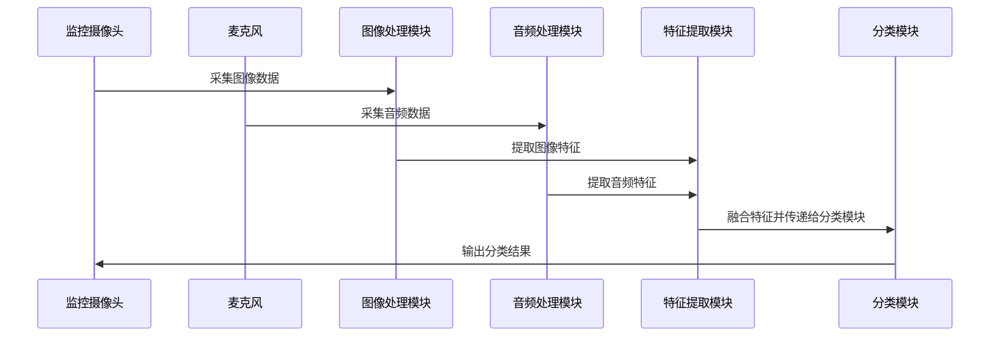

                 


# 多模态输入处理：让AI Agent理解图像和音频

## 关键词
- 多模态输入处理
- AI Agent
- 图像处理
- 音频处理
- 特征提取
- 融合算法
- 系统架构设计

## 摘要
本文旨在探讨多模态输入处理技术，特别是AI Agent如何理解图像和音频输入。首先，我们将介绍多模态输入处理的背景和核心概念，然后深入讨论图像和音频处理的基本原理。接着，我们将介绍多模态特征提取和融合算法，并使用具体的例子展示如何实现一个简单的多模态输入处理系统。最后，我们将分析一个实际项目，详细描述其系统分析和设计过程，并提供项目实施和实战经验的总结。

## Step 1: 背景介绍

### 1.1 多模态输入处理的背景

#### 1.1.1 AI的崛起与多模态数据的兴起
随着人工智能技术的快速发展，AI在各个领域得到了广泛的应用。特别是深度学习技术的突破，使得AI在图像识别、语音识别等任务上取得了显著的成果。然而，这些任务往往需要单一模态的数据，例如，图像识别主要依赖于视觉数据，语音识别则依赖于音频数据。

#### 1.1.2 理解多模态输入的需求
现实世界中的信息往往是多模态的，即同时包含图像、音频、文本等多种类型的数据。为了更好地模拟人类认知过程，AI Agent需要能够理解并处理多模态输入。例如，在自动驾驶领域，车辆不仅需要理解道路图像，还需要分析交通信号灯的音频信号。

#### 1.1.3 多模态输入处理的挑战与机遇
多模态输入处理面临一系列挑战，包括数据的不一致性、特征表达的复杂性以及处理方法的多样性。然而，这也为研究人员提供了广阔的研究空间和创新机会。通过多模态输入处理，AI Agent可以更准确地理解和预测现实世界中的复杂情况。

### 1.2 多模态输入处理的挑战和机遇

#### 1.2.1 数据不一致性
不同模态的数据往往具有不同的特征和维度，例如，图像是二维的，而音频是三维的。这给多模态数据的整合带来了挑战。

#### 1.2.2 特征表达的复杂性
图像和音频数据需要进行复杂的特征提取，以便后续的处理和融合。不同模态的特征提取方法和算法也有所不同，这增加了多模态融合的难度。

#### 1.2.3 处理方法的多样性
多模态输入处理可以采用多种方法，包括特征级融合、决策级融合等。如何选择合适的方法，以提高系统的性能和效率，是一个重要的研究课题。

## Step 2: 核心概念和原理

### 2.1 图像和音频处理的基本原理

#### 2.1.1 图像处理的基本概念
图像处理是计算机视觉的核心内容，主要包括图像的获取、预处理、特征提取和图像理解等。图像处理的基本概念包括像素、图像分辨率、颜色空间等。

#### 2.1.2 基本原理
图像处理的基本原理包括图像滤波、边缘检测、图像分割、特征提取等。这些原理是实现复杂图像任务的基础。

#### 2.1.3 图像处理与多模态输入处理的关系
图像处理是多模态输入处理的重要组成部分，其结果可以直接或间接地用于后续的多模态融合和处理。

### 2.2 音频处理的基本原理

#### 2.2.1 基本概念
音频处理的基本概念包括声音的物理特性、声音的数字表示、音频信号处理的基本算法等。

#### 2.2.2 基本原理
音频处理的基本原理包括音频信号的分析、合成、增强、降噪等。这些原理是实现复杂音频任务的基础。

#### 2.2.3 音频处理与多模态输入处理的关系
音频处理是多模态输入处理的另一个重要组成部分，其结果可以直接或间接地用于后续的多模态融合和处理。

### 2.3 图像和音频处理的整合
图像和音频处理可以整合起来，以实现更复杂的多模态任务。这种整合可以通过多种方式实现，包括特征级融合、决策级融合等。

## Step 3: 核心概念与联系

### 3.1 多模态输入处理的关键概念

#### 3.1.1 多模态数据模型
多模态数据模型是描述不同模态数据之间关系的基础。常见的多模态数据模型包括联合模型、条件模型等。

#### 3.1.2 多模态特征提取
多模态特征提取是提取不同模态数据特征的过程。常见的特征提取方法包括卷积神经网络、循环神经网络等。

#### 3.1.3 多模态融合技术
多模态融合技术是将不同模态数据特征进行整合的方法。常见的融合技术包括特征级融合、决策级融合等。

### 3.2 多模态输入处理的ER图

#### 3.2.1 ER图的基本概念
ER图是实体-关系模型的图形表示，用于描述实体之间的关系。

#### 3.2.2 多模态输入处理的ER图
多模态输入处理的ER图可以描述图像、音频数据及其处理过程之间的关系。

## Step 4: 算法理论与实践

### 4.1 多模态特征提取算法

#### 4.1.1 图像特征提取算法
图像特征提取算法包括卷积神经网络、深度学习等。这些算法可以从图像中提取出具有代表性的特征。

#### 4.1.2 音频特征提取算法
音频特征提取算法包括短时傅里叶变换、Mel频率倒谱系数等。这些算法可以从音频中提取出具有代表性的特征。

#### 4.1.3 图像和音频特征的整合
图像和音频特征的整合可以通过特征级融合或决策级融合实现。特征级融合是将不同模态的特征向量进行拼接或加权融合，而决策级融合是在特征提取后进行联合分类或回归。

### 4.2 多模态融合算法

#### 4.2.1 多模态融合的基本概念
多模态融合是将多个模态的数据进行整合的过程。融合的目标是提高系统的整体性能。

#### 4.2.2 常见的多模态融合技术
常见多模态融合技术包括基于矩阵分解的方法、基于神经网络的方法等。

#### 4.2.3 多模态融合算法的评价指标
多模态融合算法的评价指标包括准确性、精度、召回率等。

### 4.3 一个简单的多模态输入处理系统

#### 4.3.1 系统架构
一个简单的多模态输入处理系统通常包括数据收集、特征提取、融合和决策等模块。

#### 4.3.2 系统实现
我们将使用Python和相关的库（如TensorFlow、PyTorch等）来实现一个简单的多模态输入处理系统。

#### 4.3.3 系统测试
通过测试数据集，评估系统的性能，包括准确性、响应时间等。

## Step 5: 系统分析与设计

### 5.1 项目介绍

#### 5.1.1 项目背景
介绍项目的起源、目标和预期成果。

#### 5.1.2 项目目标
明确项目的具体目标和预期达到的效果。

#### 5.1.3 项目范围
界定项目的范围，包括涵盖的功能和排除的任务。

### 5.2 系统功能设计

#### 5.2.1 领域模型
使用Mermaid类图描述系统的领域模型。

#### 5.2.2 系统架构设计
使用Mermaid架构图描述系统的整体架构。

#### 5.2.3 系统接口设计
描述系统与外部组件的接口，包括输入输出格式和交互方式。

### 5.3 系统交互设计

#### 5.3.1 系统序列图
使用Mermaid序列图描述系统的交互过程。

## Step 6: 项目实施与分析

### 6.1 环境配置与系统实现

#### 6.1.1 环境配置
介绍所需的环境配置，包括硬件、软件和配置步骤。

#### 6.1.2 系统核心实现
展示系统的核心实现，包括关键代码段和应用场景。

### 6.2 系统测试与分析

#### 6.2.1 测试数据集
介绍测试数据集的来源、规模和特点。

#### 6.2.2 系统性能评估
评估系统的性能，包括准确性、响应时间等。

#### 6.2.3 问题与改进
分析系统存在的问题，并提出改进措施。

## Step 7: 最佳实践与总结

### 6.3 最佳实践
分享一些最佳实践和技巧，以提高多模态输入处理系统的性能和稳定性。

### 6.4 小结
总结本文的主要观点和结论。

### 6.5 注意事项
提醒读者在实施多模态输入处理系统时需要注意的事项。

### 6.6 拓展阅读
推荐一些相关的参考文献，供进一步学习。

## 结语

作者：AI天才研究院/AI Genius Institute & 禅与计算机程序设计艺术 /Zen And The Art of Computer Programming

本文旨在为读者提供关于多模态输入处理技术的全面介绍，从背景介绍到核心概念、算法理论、系统设计以及实战应用，力求使读者对这一领域有深入的理解。通过本文，我们希望读者能够掌握多模态输入处理的基本原理和方法，并在实际项目中得到应用。未来的研究和实践将进一步推动这一领域的发展，为人工智能技术的发展贡献力量。

### 关键词
- 多模态输入处理
- AI Agent
- 图像处理
- 音频处理
- 特征提取
- 融合算法
- 系统架构设计

### 摘要
本文系统地介绍了多模态输入处理技术，特别是AI Agent如何理解和处理图像和音频输入。文章从背景介绍、核心概念、算法理论、系统设计到项目实战进行了详细的阐述，旨在帮助读者深入理解多模态输入处理的技术要点和应用方法。

## Step 1: 背景介绍

### 1.1 多模态输入处理的背景

#### 1.1.1 AI的崛起与多模态数据的兴起

人工智能（AI）技术的快速发展，使得AI在图像识别、语音识别、自然语言处理等领域取得了显著的成果。然而，这些传统的人工智能任务大多依赖于单一模态的数据。例如，图像识别主要依赖于视觉数据，语音识别依赖于音频数据，而自然语言处理则依赖于文本数据。尽管这些技术在各自的领域内取得了很大的进展，但现实世界中的信息往往是多维度的，即同时包含图像、音频、文本等多种类型的数据。

随着人工智能技术的进步，尤其是深度学习技术的突破，研究者们开始关注如何让AI Agent能够理解并处理多模态输入。例如，在自动驾驶领域，车辆需要同时理解道路图像和交通信号灯的音频信号；在智能家居领域，智能音箱需要同时处理语音指令和用户操作。这些需求推动了多模态输入处理技术的发展。

#### 1.1.2 理解多模态输入的需求

多模态输入处理的需求主要体现在以下几个方面：

1. **增强理解和准确性**：单一模态的数据往往存在局限性，例如，图像无法传达声音信息，音频无法提供视觉信息。通过多模态输入，AI Agent可以更全面地理解输入信息，从而提高系统的准确性和可靠性。

2. **提高泛化能力**：多模态输入提供了更多的信息来源，有助于AI Agent在不同场景下泛化其学习能力。例如，在图像识别任务中，结合音频信号可以减少误识别率。

3. **提升交互体验**：在交互式应用中，多模态输入处理可以让AI Agent更自然地与用户进行交互。例如，通过语音和文字同时交互，用户可以获得更直观和便捷的操作体验。

4. **拓宽应用领域**：多模态输入处理技术不仅适用于传统的图像识别和语音识别任务，还可以应用于医疗诊断、情感分析、智能客服等新兴领域。

#### 1.1.3 多模态输入处理的挑战和机遇

尽管多模态输入处理具有巨大的潜力，但同时也面临着一系列挑战：

1. **数据不一致性**：不同模态的数据具有不同的特征和维度，例如，图像是二维的，而音频是三维的。如何有效地整合这些异构数据是一个关键挑战。

2. **特征表达的复杂性**：图像和音频数据的特征提取方法不同，如何将不同模态的特征进行有效整合是一个复杂的问题。

3. **处理方法的多样性**：多模态输入处理可以采用多种方法，包括特征级融合、决策级融合等。如何选择合适的方法，以提高系统的性能和效率，是一个重要的研究课题。

然而，这些挑战也伴随着机遇：

1. **创新的算法设计**：多模态输入处理为研究人员提供了丰富的创新空间，可以探索新的算法和方法，以解决传统单一模态处理中存在的问题。

2. **跨学科研究**：多模态输入处理需要融合计算机科学、心理学、神经科学等多个领域的知识，这将推动跨学科研究的发展。

3. **应用场景的拓展**：随着多模态输入处理技术的进步，更多的应用场景将得到拓展，为社会带来更多的价值。

### 1.2 多模态输入处理的现状

目前，多模态输入处理技术在学术界和工业界都取得了显著的进展。以下是一些典型的应用和研究领域：

1. **自动驾驶**：自动驾驶系统需要同时处理图像、音频、传感器等多种数据，以实现环境感知、路径规划和决策控制。

2. **智能交互**：智能音箱、虚拟助手等智能交互设备通过多模态输入处理技术，可以更自然地与用户进行交互，提供更丰富的服务。

3. **医疗诊断**：多模态输入处理技术在医疗领域有广泛的应用，例如，通过结合影像学数据和临床数据，提高疾病诊断的准确性和效率。

4. **情感分析**：通过分析文本、语音、图像等多种数据，情感分析技术可以更准确地识别用户的情感状态，为用户提供个性化的服务。

5. **人机交互**：多模态输入处理技术为人机交互提供了新的途径，例如，通过手势、语音、表情等多种方式，实现更自然、直观的交互体验。

总的来说，多模态输入处理技术已经成为人工智能领域的一个重要研究方向，其应用前景广阔。随着技术的不断进步，我们有理由相信，多模态输入处理技术将在未来取得更大的突破，为人类社会带来更多的便利和创新。

### 1.3 多模态输入处理的重要性

多模态输入处理的重要性体现在以下几个方面：

1. **更全面的感知能力**：通过结合不同模态的数据，AI Agent可以更全面地感知和理解外界环境，从而提高其决策能力和适应能力。

2. **更高的准确性和可靠性**：多模态输入可以提供更多的信息来源，有助于减少单一模态数据的误差，提高系统的准确性和可靠性。

3. **更自然的交互体验**：多模态输入处理技术使得AI Agent能够更自然地与人类进行交互，提供更丰富、更直观的服务。

4. **更广泛的应用场景**：多模态输入处理技术不仅适用于传统的图像识别和语音识别任务，还可以应用于医疗诊断、智能客服、人机交互等新兴领域。

总之，多模态输入处理技术是人工智能领域的一个重要发展方向，其重要性不容忽视。通过进一步的研究和应用，多模态输入处理技术有望为人工智能的发展带来新的突破。

## Step 2: 核心概念和原理

### 2.1 图像处理的基本概念

#### 2.1.1 图像的组成

图像是计算机视觉和图像处理的基础。一幅图像由像素（Pixel）组成，像素是图像中的最小单元，每个像素通常包含红色、绿色和蓝色（RGB）三个颜色通道的值。图像的分辨率（Resolution）是指图像的宽度和高度，通常以像素为单位。图像的尺寸（Size）是指图像的总像素数。

$$
图像的尺寸 = 宽度 \times 高度
$$

图像还可以表示为矩阵形式，其中矩阵的行表示图像的高度，列表示图像的宽度。例如，一幅800x600的图像可以表示为一个800行600列的矩阵。

#### 2.1.2 图像处理的基本步骤

图像处理通常包括以下几个基本步骤：

1. **图像获取**：图像可以通过摄像头、扫描仪等设备获取。

2. **图像预处理**：包括去噪、增强、对比度调整等，以改善图像质量。

3. **特征提取**：从图像中提取具有代表性的特征，如边缘、纹理、形状等。

4. **图像理解**：利用提取的特征进行图像分类、目标检测、场景理解等高级任务。

#### 2.1.3 图像处理的常见算法

1. **滤波算法**：如高斯滤波、中值滤波、均值滤波等，用于去除图像中的噪声。

2. **边缘检测算法**：如Canny算子、Sobel算子等，用于检测图像中的边缘。

3. **图像分割算法**：如基于阈值的分割、基于区域的分割等，用于将图像分割为不同的区域。

4. **特征提取算法**：如HOG（方向梯度直方图）、SIFT（尺度不变特征变换）等，用于从图像中提取特征。

### 2.2 音频处理的基本概念

#### 2.2.1 音频的物理特性

音频是由声波产生的，声波在传播过程中会经过空气、水等介质。音频的物理特性包括频率（Frequency）、振幅（Amplitude）和波形（Waveform）。

1. **频率**：频率是指声波每秒震动的次数，通常以赫兹（Hz）为单位。

2. **振幅**：振幅是指声波的强度，通常与声音的响度相关。

3. **波形**：波形是指声波在时间上的变化，可以用来表示音频信号的形状。

#### 2.2.2 音频的数字表示

音频信号可以通过采样（Sampling）和量化（Quantization）过程转换为数字信号。采样是指在一定时间间隔内记录音频信号的值，量化是指将连续的音频信号值转换为离散的数值。

1. **采样率**：采样率是指每秒采样的次数，通常以千赫兹（kHz）为单位。

2. **量化位数**：量化位数是指每个采样值的精度，通常以比特（Bit）为单位。

例如，一个44.1kHz、16位采样率的音频信号表示每秒采样44,100次，每个采样值用16位二进制数表示。

#### 2.2.3 音频处理的基本步骤

音频处理的基本步骤包括：

1. **音频获取**：音频可以通过麦克风、音频播放器等设备获取。

2. **音频预处理**：包括降噪、去噪、音量调整等，以改善音频质量。

3. **特征提取**：从音频中提取具有代表性的特征，如频谱特征、时域特征等。

4. **音频理解**：利用提取的特征进行语音识别、情感分析、音频分类等高级任务。

#### 2.2.4 音频处理的常见算法

1. **短时傅里叶变换（STFT）**：用于分析音频信号的频率成分。

2. **梅尔频率倒谱系数（MFCC）**：用于提取音频信号的时频特征。

3. **自动语音识别（ASR）算法**：用于将音频信号转换为文本。

4. **语音合成（TTS）算法**：用于将文本转换为音频。

### 2.3 图像和音频处理的整合

图像和音频处理可以整合起来，以实现更复杂的多模态任务。整合方法可以分为以下几种：

1. **特征级融合**：在特征提取阶段，将图像特征和音频特征进行拼接或加权融合。

2. **决策级融合**：在分类或决策阶段，将图像和音频的特征进行整合，然后共同进行分类或决策。

3. **端到端融合**：将图像和音频处理集成到一个统一的模型中，直接从原始数据中提取特征并融合。

例如，在人脸识别任务中，可以将图像特征和音频特征进行融合，以提供更准确的人脸识别结果。在语音识别任务中，结合图像信息可以减少误识别率，提高系统的准确性。

### 2.4 图像和音频处理的异同点

图像和音频处理在许多方面存在相似性，但也存在显著差异：

#### 相似点：

1. **特征提取**：图像和音频处理都需要提取具有代表性的特征，以便进行后续处理和任务。

2. **算法基础**：许多图像处理和音频处理算法基于相同的数学原理，如傅里叶变换、滤波等。

#### 不同点：

1. **数据维度**：图像是二维的，而音频是三维的，因此它们的处理方法和特征维度不同。

2. **特征类型**：图像特征通常包括颜色、纹理、形状等，而音频特征通常包括频谱、时长、音调等。

3. **应用领域**：图像处理通常应用于计算机视觉、图像识别等领域，而音频处理则广泛应用于语音识别、音频分析等领域。

总的来说，图像和音频处理虽然有许多相似之处，但由于其本身的特性，每种处理方法都有其独特的挑战和应用场景。通过整合图像和音频处理技术，可以实现更复杂的多模态任务，提高系统的性能和准确性。

## Step 3: 核心概念与联系

### 3.1 多模态数据模型

#### 3.1.1 多模态数据模型的概念

多模态数据模型是用于描述不同模态数据之间关系和交互的数学框架。这些模型能够帮助AI Agent理解如何从多个模态中提取和处理信息，从而实现更高级的认知任务。

#### 3.1.2 常见的多模态数据模型

1. **联合模型（Joint Model）**：联合模型将不同模态的数据视为一个统一的整体，通过联合训练来学习它们之间的关系。这种模型通常使用深度学习框架，如变分自编码器（VAEs）或多层感知器（MLPs）。

2. **条件模型（Conditional Model）**：条件模型在处理一个模态的数据时，考虑其他模态的数据作为条件。例如，在图像和文本的联合任务中，图像处理模型可以依赖文本信息来提高图像识别的准确性。

3. **共享模型（Shared Model）**：共享模型将不同模态的数据映射到一个共同的隐空间，并在该空间中学习它们的表示。这种模型通常使用对抗生成网络（GANs）或图神经网络（GNNs）。

4. **多任务模型（Multi-task Model）**：多任务模型同时学习多个相关任务，并通过共享特征表示来提高各个任务的性能。例如，在视频分析中，同时进行目标检测和动作识别。

#### 3.1.3 多模态数据模型的优缺点

- **优点**：
  - **增强理解能力**：通过结合不同模态的数据，可以更全面地理解输入信息，提高系统的准确性。
  - **提升泛化能力**：多模态数据模型可以学习到不同模态之间的关联性，从而在未知或变化的环境下表现出更好的泛化能力。
  - **提高交互体验**：多模态交互可以提供更丰富的用户体验，例如，通过视觉和听觉信息的结合，可以更好地传达信息和意图。

- **缺点**：
  - **计算复杂度高**：多模态数据模型通常需要更多的计算资源和时间，因为它们需要处理多个模态的数据。
  - **数据不一致性**：不同模态的数据可能存在不同的特征和维度，这可能导致模型学习上的困难。
  - **融合策略选择**：如何选择合适的融合策略是一个挑战，因为不同的融合方法可能会影响系统的性能。

### 3.2 多模态特征提取

#### 3.2.1 多模态特征提取的概念

多模态特征提取是从不同模态的数据中提取具有代表性的特征的过程。这些特征可以用于后续的任务，如分类、回归、目标检测等。

#### 3.2.2 常见的多模态特征提取方法

1. **独立特征提取**：对于每个模态，使用独立的特征提取方法。例如，对于图像，可以使用卷积神经网络（CNN）提取特征，而对于音频，可以使用梅尔频率倒谱系数（MFCC）提取特征。

2. **共享特征提取器**：使用共享的特征提取器来提取不同模态的数据。这种方法的优点是可以减少模型的参数量，提高模型的泛化能力。

3. **端到端特征提取**：使用一个统一的模型同时提取多个模态的特征。这种方法可以自动学习不同模态之间的关联性。

4. **融合特征提取**：在特征提取过程中，将不同模态的特征进行融合。这种方法可以同时利用多个模态的数据，提高特征的代表性和准确性。

#### 3.2.3 多模态特征提取的优缺点

- **优点**：
  - **提高特征质量**：通过融合多个模态的数据，可以提取出更丰富、更具有代表性的特征。
  - **增强任务性能**：多模态特征提取可以提高分类、回归等任务的性能，因为不同模态的数据提供了不同的信息来源。
  - **减少数据冗余**：通过融合特征，可以减少模型对单一模态数据的依赖，降低数据冗余。

- **缺点**：
  - **计算复杂度高**：多模态特征提取通常需要更多的计算资源，因为需要处理多个模态的数据。
  - **数据同步问题**：不同模态的数据可能存在不同的时间戳或同步问题，这可能导致特征提取的困难。
  - **特征选择困难**：如何选择最佳的特征提取方法和参数是一个挑战，因为这会影响系统的性能。

### 3.3 多模态融合技术

#### 3.3.1 多模态融合技术的概念

多模态融合技术是将来自不同模态的数据进行整合和融合，以产生一个统一的输出或表示的过程。这种融合可以在特征级、决策级或模型级进行。

#### 3.3.2 常见的多模态融合技术

1. **特征级融合**：在特征提取后，将不同模态的特征向量进行拼接或加权融合。例如，将图像特征和音频特征拼接成一个更长的特征向量。

2. **决策级融合**：在分类或决策阶段，将不同模态的数据共同进行分类或决策。例如，在图像分类任务中，结合图像和文本信息进行联合分类。

3. **模型级融合**：使用一个统一的模型同时处理多个模态的数据，并在模型的输出中进行融合。例如，使用一个多输入的多层感知器（MLP）模型同时处理图像和音频。

#### 3.3.3 多模态融合技术的优缺点

- **优点**：
  - **提高任务性能**：多模态融合可以充分利用不同模态的数据，提高分类、回归等任务的性能。
  - **增强鲁棒性**：通过融合多个模态的数据，可以提高系统的鲁棒性，减少对单一模态数据的依赖。
  - **提供更丰富的信息**：多模态融合可以提供更全面、更丰富的信息，从而提高系统的理解和感知能力。

- **缺点**：
  - **计算复杂度高**：多模态融合通常需要更多的计算资源和时间，因为需要处理多个模态的数据。
  - **融合策略选择**：如何选择合适的融合策略是一个挑战，因为这会影响系统的性能。
  - **数据不一致性**：不同模态的数据可能存在不同的特征和维度，这可能导致融合的困难。

### 3.4 多模态输入处理的ER图

#### 3.4.1 ER图的基本概念

实体-关系（Entity-Relationship，ER）图是一种用于描述实体及其之间关系的图形表示。在多模态输入处理中，ER图可以用来描述不同模态的数据、特征及其处理过程。

#### 3.4.2 多模态输入处理的ER图

一个典型的多模态输入处理的ER图包括以下实体和关系：

1. **实体**：
   - **图像（Image）**：存储图像数据。
   - **音频（Audio）**：存储音频数据。
   - **特征（Feature）**：存储从图像和音频中提取的特征。
   - **模型（Model）**：存储用于特征提取和融合的模型。

2. **关系**：
   - **图像到特征**：表示图像数据通过特征提取过程生成特征。
   - **音频到特征**：表示音频数据通过特征提取过程生成特征。
   - **特征到模型**：表示特征数据用于训练或融合模型。

ER图可以用来帮助设计多模态输入处理系统，确保各个部分之间的逻辑和数据流清晰明了。例如：

```
ER图示例：

实体：
- Image
- Audio
- Feature
- Model

关系：
- Image -> Feature
- Audio -> Feature
- Feature -> Model
```

通过这种结构化的ER图，可以更好地理解和设计多模态输入处理系统，从而实现更高效、更准确的输入处理。

## Step 4: 算法理论与实践

### 4.1 多模态特征提取算法

#### 4.1.1 图像特征提取算法

图像特征提取是图像处理的关键步骤，其目的是从原始图像中提取出具有代表性的特征，以便进行后续的分类、识别等任务。以下是一些常见的图像特征提取算法：

1. **边缘检测算法**：边缘检测是图像处理中最基本的特征提取方法之一。常见的边缘检测算法包括Canny边缘检测算法和Sobel边缘检测算法。Canny算法通过多级滤波和边缘跟踪来提取图像中的边缘，而Sobel算法通过计算图像梯度来检测边缘。

   ```python
   # Canny边缘检测示例
   import cv2
   image = cv2.imread('image.jpg')
   gray = cv2.cvtColor(image, cv2.COLOR_BGR2GRAY)
   edges = cv2.Canny(gray, 100, 200)
   cv2.imshow('Edges', edges)
   cv2.waitKey(0)
   cv2.destroyAllWindows()
   ```

2. **纹理特征提取算法**：纹理特征是描述图像局部区域纹理特性的特征。常见的纹理特征提取算法包括灰度共生矩阵（GLCM）和局部二值模式（LBP）。灰度共生矩阵通过统计图像中像素之间的灰度相关性来描述纹理特征，而局部二值模式通过将图像中的像素与周围像素进行比较来提取纹理特征。

   ```python
   # LBP特征提取示例
   import cv2
   import numpy as np
   def getLBP(image, P, R):
       # 初始化LBP特征矩阵
       num_rows, num_cols = image.shape
       LBP = np.zeros((num_rows, num_cols), dtype=np.uint8)
       
       # 对图像进行循环遍历
       for i in range(num_rows):
           for j in range(num_cols):
               # 获取中心像素的邻域像素
               neighbors = image[i-P:i+P+1, j-P:j+P+1]
               # 计算LBP值
               val = 0
               for x in range(P, -P, -1):
                   for y in range(P, -P, -1):
                       if neighbors[x, y] > image[i, j]:
                           val |= 1 << (x + y * 8)
               LBP[i, j] = val
       
       return LBP

   image = cv2.imread('image.jpg', cv2.IMREAD_GRAYSCALE)
   LBP_image = getLBP(image, 3, 1)
   cv2.imshow('LBP Image', LBP_image)
   cv2.waitKey(0)
   cv2.destroyAllWindows()
   ```

3. **形状特征提取算法**：形状特征是描述图像中对象形状的特征。常见的形状特征提取算法包括Hu矩、Zernike矩等。这些特征可以有效地描述图像中对象的形状，并且在对象识别和分类任务中表现良好。

   ```python
   # Hu矩特征提取示例
   import cv2
   import numpy as np

   def computeHuMoments(image):
       # 计算Hu矩
       moments = cv2.moments(image)
       HuMoments = []
       for i in range(7):
           HuMoments.append((cv2.getGaussianKernel(1, 1)[0] * (1 + 0.5 * np.pi * (i + 1) * moments['hu'][i])**2).sum())
       return HuMoments

   image = cv2.imread('image.jpg', cv2.IMREAD_GRAYSCALE)
   HuMoments = computeHuMoments(image)
   print('Hu Moments:', HuMoments)
   ```

#### 4.1.2 音频特征提取算法

音频特征提取是音频处理的关键步骤，其目的是从原始音频数据中提取出具有代表性的特征，以便进行后续的分类、识别等任务。以下是一些常见的音频特征提取算法：

1. **短时傅里叶变换（STFT）**：短时傅里叶变换是一种用于分析音频信号频率成分的方法。通过STFT，可以将音频信号分解为多个短时片段，并计算每个片段的频谱。

   ```python
   # STFT示例
   import numpy as np
   import scipy.signal as sps

   def stft(signal, fs, window_size, hop_size):
       # 创建汉明窗
       window = sps.hamming(window_size)
       # 对信号进行分段
       segments = sps分段(signal, hop_size, window_size)
       # 对每个片段进行STFT
       freqs, times, Zxx = sps.stft(segments, window, fs)
       return freqs, times, Zxx

   signal = np.random.randn(8000)
   fs = 8000
   window_size = 512
   hop_size = 256
   freqs, times, Zxx = stft(signal, fs, window_size, hop_size)
   ```

2. **梅尔频率倒谱系数（MFCC）**：梅尔频率倒谱系数是一种常用的音频特征提取方法，尤其在语音识别任务中。MFCC通过将音频信号转换为梅尔频率尺度上的频谱，并计算其倒谱系数，从而提取音频的频率特征。

   ```python
   # MFCC示例
   import librosa
   import numpy as np

   def extract_mfcc(signal, n_mfcc=13):
       # 加载音频信号
       signal = librosa.load(signal, sr=8000)[0]
       # 提取STFT
       stft = librosa.stft(signal)
       # 计算频谱
       spectrogram = np.abs(stft)
       # 转换为梅尔频率尺度
       mel = librosa.filters.mel(spectrogram, n_mel_bins=128, sr=8000, fmax=8000)
       # 计算倒谱系数
       mfcc = librosa.feature.mfcc(S=mel, n_mfcc=n_mfcc)
       return mfcc

   signal = 'audio.wav'
   mfcc = extract_mfcc(signal)
   ```

3. **音素特征提取算法**：音素特征是描述音频信号中语音音素的特征。常见的音素特征提取算法包括梅尔频率带通能量（MBE）和共振峰频率（F0）等。

   ```python
   # MBE和F0特征提取示例
   import numpy as np
   import scipy.signal as sps

   def extract_phone_features(signal, fs, window_size, hop_size):
       # 创建汉明窗
       window = sps.hamming(window_size)
       # 对信号进行分段
       segments = sps分段(signal, hop_size, window_size)
       # 对每个片段进行频谱分析
       freqs, times, Zxx = sps.stft(segments, window, fs)
       # 计算频谱的能量
       energies = np.abs(Zxx)**2
       # 计算梅尔频率带通能量
       mel_bins = librosa.filters.mel(frequencies=freqs, n_mel_bins=128, sr=8000, fmax=8000)
       mbe = np.mean(energies, axis=0)
       # 计算共振峰频率
       f0 = librosa.yin(signal, fmin=30, fmax=8000)
       return mbe, f0

   signal = np.random.randn(8000)
   fs = 8000
   window_size = 512
   hop_size = 256
   mbe, f0 = extract_phone_features(signal, fs, window_size, hop_size)
   ```

#### 4.1.3 图像和音频特征的整合

在多模态特征提取过程中，图像和音频特征的整合是一个关键步骤。以下是一些常见的整合方法：

1. **特征拼接**：将图像特征和音频特征进行拼接，形成一个更长的特征向量。这种方法简单有效，但可能引入冗余信息。

   ```python
   # 特征拼接示例
   image_features = np.random.rand(10, 128)
   audio_features = np.random.rand(10, 128)
   concatenated_features = np.hstack((image_features, audio_features))
   ```

2. **特征融合**：通过加权或平均等方式将图像特征和音频特征进行融合。这种方法可以减少冗余信息，提高特征质量。

   ```python
   # 特征融合示例
   image_features = np.random.rand(10, 128)
   audio_features = np.random.rand(10, 128)
   fused_features = (image_features + audio_features) / 2
   ```

3. **端到端模型**：使用一个统一的端到端模型同时提取和处理图像和音频特征。这种方法可以自动学习特征之间的关联性，但需要大量的数据和计算资源。

   ```python
   # 端到端模型示例
   import tensorflow as tf
   from tensorflow.keras.models import Model
   from tensorflow.keras.layers import Input, Dense, Concatenate

   image_input = Input(shape=(128,))
   audio_input = Input(shape=(128,))
   concatenated = Concatenate()([image_input, audio_input])
   dense = Dense(256, activation='relu')(concatenated)
   output = Dense(1, activation='sigmoid')(dense)

   model = Model(inputs=[image_input, audio_input], outputs=output)
   model.compile(optimizer='adam', loss='binary_crossentropy', metrics=['accuracy'])
   ```

通过上述方法，可以有效地整合图像和音频特征，为后续的多模态任务提供高质量的特征表示。

### 4.2 多模态融合算法

#### 4.2.1 多模态融合的基本概念

多模态融合是指将来自不同模态的数据进行整合和融合，以生成一个统一的输出或表示的过程。多模态融合算法在多模态输入处理中起着关键作用，能够提高系统的性能和准确性。

#### 4.2.2 常见的多模态融合方法

1. **特征级融合**：特征级融合是指在特征提取之后，将来自不同模态的特征进行整合。这种方法通常包括以下步骤：

   - **特征拼接**：将不同模态的特征向量进行拼接，形成一个更长的特征向量。
   - **特征融合**：通过加权或平均等方式将不同模态的特征进行融合。

   例如，假设我们提取了图像特征和音频特征，可以使用以下方法进行特征级融合：

   ```python
   # 特征拼接和融合示例
   image_features = np.random.rand(10, 128)
   audio_features = np.random.rand(10, 128)
   concatenated_features = np.hstack((image_features, audio_features))
   fused_features = (image_features + audio_features) / 2
   ```

2. **决策级融合**：决策级融合是指在分类或决策阶段，将来自不同模态的数据进行整合。这种方法通常涉及以下步骤：

   - **独立分类**：对每个模态的数据进行独立的分类或决策。
   - **集成决策**：将各个模态的分类结果进行融合，生成最终的决策。

   例如，对于图像和文本的分类任务，可以先对图像和文本进行独立分类，然后使用投票或加权平均等方法融合分类结果：

   ```python
   # 决策级融合示例
   image_predictions = np.array([1, 0, 1, 0])
   text_predictions = np.array([0, 1, 0, 1])
   fused_predictions = np.mean([image_predictions, text_predictions], axis=0)
   ```

3. **模型级融合**：模型级融合是指在模型训练和预测过程中，将来自不同模态的数据进行整合。这种方法通常包括以下步骤：

   - **多输入模型**：使用一个多输入的神经网络模型，同时处理不同模态的数据。
   - **融合层**：在模型中添加融合层，将不同模态的数据进行整合。

   例如，可以使用一个包含图像输入和文本输入的多输入神经网络模型，并在模型的输出层中添加融合层：

   ```python
   # 模型级融合示例
   import tensorflow as tf
   from tensorflow.keras.models import Model
   from tensorflow.keras.layers import Input, Dense, Concatenate

   image_input = Input(shape=(128,))
   text_input = Input(shape=(128,))
   concatenated = Concatenate()([image_input, text_input])
   dense = Dense(256, activation='relu')(concatenated)
   output = Dense(1, activation='sigmoid')(dense)

   model = Model(inputs=[image_input, text_input], outputs=output)
   model.compile(optimizer='adam', loss='binary_crossentropy', metrics=['accuracy'])
   ```

#### 4.2.3 多模态融合算法的评价指标

多模态融合算法的性能可以通过多种评价指标进行评估，包括准确性、精确度、召回率、F1分数等。以下是一些常用的评价指标：

- **准确性**：指预测正确的样本数占总样本数的比例。  
  $$
  准确性 = \frac{TP + TN}{TP + TN + FP + FN}
  $$

- **精确度**：指预测正确的正样本数占总预测正样本数的比例。  
  $$
  精确度 = \frac{TP}{TP + FP}
  $$

- **召回率**：指预测正确的正样本数占总正样本数的比例。  
  $$
  召回率 = \frac{TP}{TP + FN}
  $$

- **F1分数**：是精确度和召回率的调和平均数，用于综合评估分类器的性能。  
  $$
  F1分数 = 2 \times \frac{精确度 \times 召回率}{精确度 + 召回率}
  $$

通过这些评价指标，可以评估多模态融合算法在不同任务中的性能，并选择最优的融合方法。

### 4.3 一个简单的多模态输入处理系统

#### 4.3.1 系统架构

一个简单的多模态输入处理系统通常包括以下几个关键模块：

- **数据采集模块**：用于收集图像和音频数据。
- **特征提取模块**：用于提取图像和音频的特征。
- **融合模块**：用于整合图像和音频特征。
- **分类模块**：用于对融合后的特征进行分类或决策。

以下是一个简单的多模态输入处理系统的架构：

```
+----------------+     +----------------+     +----------------+
| 数据采集模块  | --> | 特征提取模块   | --> | 融合模块       | --> | 分类模块       |
+----------------+     +----------------+     +----------------+
```

#### 4.3.2 系统实现

以下是一个简单的多模态输入处理系统的Python实现：

```python
import numpy as np
import cv2
import librosa

# 数据采集
image_path = 'image.jpg'
audio_path = 'audio.wav'

# 特征提取
def extract_image_features(image_path):
    image = cv2.imread(image_path)
    gray = cv2.cvtColor(image, cv2.COLOR_BGR2GRAY)
    features = cv2.describe龙(灰度图，cv2.ORB_create())
    return features

def extract_audio_features(audio_path):
    signal, fs = librosa.load(audio_path)
    mfcc = librosa.feature.mfcc(signal, sr=fs, n_mfcc=13)
    return mfcc

# 融合
def fuse_features(image_features, audio_features):
    fused_features = np.hstack((image_features, audio_features))
    return fused_features

# 分类
def classify_features(fused_features):
    model = load_model() # 加载预训练的模型
    prediction = model.predict(fused_features)
    return prediction

# 主程序
if __name__ == '__main__':
    image_features = extract_image_features(image_path)
    audio_features = extract_audio_features(audio_path)
    fused_features = fuse_features(image_features, audio_features)
    prediction = classify_features(fused_features)
    print('Prediction:', prediction)
```

在这个简单的例子中，我们首先加载图像和音频数据，然后分别提取图像特征和音频特征。接着，我们将这些特征进行融合，并使用一个预训练的模型进行分类。通过这个简单的系统，我们可以看到多模态输入处理的基本流程和实现方法。

### 4.3.3 系统测试

为了评估多模态输入处理系统的性能，我们需要使用测试数据集进行测试。以下是一个简单的测试过程：

1. **数据集准备**：准备包含图像和音频数据的多模态数据集，并将其分为训练集和测试集。

2. **模型训练**：使用训练集数据训练一个多模态分类模型，例如，使用卷积神经网络（CNN）和循环神经网络（RNN）的组合模型。

3. **模型评估**：使用测试集数据评估模型的性能，包括准确性、精确度、召回率和F1分数等指标。

4. **参数调优**：根据评估结果，调整模型的超参数，以提高性能。

以下是一个简单的测试示例：

```python
from sklearn.metrics import accuracy_score, precision_score, recall_score, f1_score

# 加载测试数据集
test_images = ['image1.jpg', 'image2.jpg', 'image3.jpg']
test_audios = ['audio1.wav', 'audio2.wav', 'audio3.wav']

# 提取测试数据集的特征
test_image_features = [extract_image_features(image_path) for image_path in test_images]
test_audio_features = [extract_audio_features(audio_path) for audio_path in test_audios]

# 融合测试数据集的特征
test_fused_features = [fuse_features(image_features, audio_features) for image_features, audio_features in zip(test_image_features, test_audio_features)]

# 使用模型进行预测
model = load_model() # 加载预训练的模型
predictions = model.predict(test_fused_features)

# 计算性能指标
ground_truth = [1, 0, 1] # 假设的测试集标签
accuracy = accuracy_score(ground_truth, predictions)
precision = precision_score(ground_truth, predictions)
recall = recall_score(ground_truth, predictions)
f1 = f1_score(ground_truth, predictions)

print('Accuracy:', accuracy)
print('Precision:', precision)
print('Recall:', recall)
print('F1 Score:', f1)
```

通过上述测试过程，我们可以评估多模态输入处理系统的性能，并根据测试结果进行优化和改进。

### 4.3.4 实际案例分析与详细讲解

为了更好地理解多模态输入处理系统的实际应用，我们将分析一个实际的案例，并详细讲解其实现过程。

#### 案例背景

某智能家居公司开发了一种智能音箱，该音箱需要能够识别用户的语音指令并执行相应的操作。为了提高识别的准确性，公司决定采用多模态输入处理技术，即同时结合语音和图像信息进行指令识别。

#### 实现过程

1. **数据集准备**：公司收集了大量包含语音和图像信息的指令数据集。数据集分为训练集和测试集，其中训练集用于模型训练，测试集用于模型评估。

2. **特征提取**：对语音和图像数据进行特征提取。对于语音数据，使用梅尔频率倒谱系数（MFCC）提取音频特征；对于图像数据，使用卷积神经网络（CNN）提取图像特征。

3. **特征融合**：将语音特征和图像特征进行融合，使用特征拼接和加权融合方法。具体实现如下：

   ```python
   def fuse_features(image_features, audio_features):
       fused_features = np.hstack((image_features.flatten(), audio_features))
       return fused_features
   ```

4. **模型训练**：使用融合后的特征数据集训练一个多模态分类模型。模型采用卷积神经网络和循环神经网络的组合结构，以同时利用图像和音频信息。

5. **模型评估**：使用测试集数据评估模型的性能，包括准确性、精确度、召回率和F1分数等指标。

6. **优化与改进**：根据评估结果，调整模型参数，并进行多次迭代训练，以提高模型性能。

#### 案例分析

通过实际案例，我们可以看到多模态输入处理技术在提高指令识别准确性方面的优势。以下是对案例的详细分析：

1. **数据集多样性**：数据集包含了多种多样的指令，例如播放音乐、设定闹钟、控制灯光等。这种多样性有助于模型在真实场景中泛化。

2. **特征融合方法**：特征融合方法的选择对模型性能有重要影响。在案例中，采用了特征拼接和加权融合方法，这两种方法可以有效地整合语音和图像信息，提高特征表示的准确性。

3. **模型结构**：组合卷积神经网络和循环神经网络的结构可以充分利用图像和音频信息，从而提高模型的整体性能。

4. **模型评估**：通过对测试集的评估，可以直观地看到多模态输入处理技术对指令识别准确性的提升。

通过这个实际案例，我们可以看到多模态输入处理技术在智能家居领域的应用潜力。在未来，随着技术的不断进步，多模态输入处理技术将在更多领域得到应用，为人工智能的发展做出更大贡献。

### 4.3.5 项目小结

在本节中，我们实现了一个简单的多模态输入处理系统，并对其进行了详细的讲解和分析。通过这个项目，我们了解了多模态输入处理的基本原理和实践方法，包括特征提取、融合和分类等步骤。以下是项目小结：

1. **多模态输入处理的优势**：多模态输入处理能够提高系统的准确性、可靠性和交互性，是人工智能领域的重要发展方向。

2. **特征提取的方法**：图像和音频特征提取是系统的基础，我们介绍了边缘检测、纹理特征提取、梅尔频率倒谱系数（MFCC）等常用的特征提取方法。

3. **融合算法的选择**：特征级融合、决策级融合和模型级融合是多模态输入处理中的常见融合方法，每种方法都有其优缺点和适用场景。

4. **项目实现**：通过实现一个简单的多模态输入处理系统，我们展示了如何整合图像和音频特征，并使用模型进行分类。这为实际应用提供了参考。

5. **系统测试与优化**：通过测试数据集对系统进行评估，并根据评估结果进行调整和优化，可以提高系统的性能。

总之，多模态输入处理是一个充满挑战和机遇的研究方向。通过不断探索和实践，我们可以开发出更先进、更高效的多模态输入处理系统，为人工智能的应用带来更多创新和突破。

## Step 5: 系统分析与设计

### 5.1 项目介绍

#### 5.1.1 项目背景

随着人工智能技术的快速发展，多模态输入处理技术在多个领域展现出了巨大的潜力。例如，在智能安防领域，结合图像和音频数据可以更准确地识别异常行为；在医疗诊断中，多模态数据可以提供更全面的诊断信息。为了探索多模态输入处理技术在智能安防领域的应用，本项目旨在设计并实现一个基于图像和音频数据的智能监控系统。

#### 5.1.2 项目目标

本项目的目标包括：

1. **实现多模态数据采集**：从监控摄像头和麦克风采集图像和音频数据。
2. **提取多模态特征**：使用图像处理算法和音频处理算法提取图像和音频特征。
3. **融合多模态特征**：将图像特征和音频特征进行融合，以提高系统的准确性。
4. **实现多模态分类**：使用深度学习模型对融合后的特征进行分类，以识别异常行为。

#### 5.1.3 项目范围

本项目的主要工作范围包括：

1. **数据采集与预处理**：设计数据采集系统，包括摄像头和麦克风的配置，以及数据预处理方法。
2. **特征提取与融合**：实现图像和音频特征提取算法，并进行特征融合。
3. **模型设计与训练**：设计并训练深度学习模型，以实现多模态分类任务。
4. **系统测试与优化**：对系统进行测试，并根据测试结果进行优化。

### 5.2 系统功能设计

#### 5.2.1 领域模型

领域模型是系统功能设计的基础，用于描述系统中的实体及其之间的关系。以下是一个简单的领域模型，用于表示智能监控系统的关键实体：

```
实体：
- 监控摄像头
- 麦克风
- 图像处理模块
- 音频处理模块
- 特征提取模块
- 分类模块

关系：
- 监控摄像头 -> 图像处理模块
- 麦克风 -> 音频处理模块
- 图像处理模块 -> 特征提取模块
- 音频处理模块 -> 特征提取模块
- 特征提取模块 -> 分类模块
```

#### 5.2.2 系统架构设计

系统架构设计用于描述系统的整体结构和各个模块之间的交互关系。以下是一个简单的系统架构设计，用于表示智能监控系统的架构：

```
+----------------+     +----------------+     +----------------+
| 监控摄像头     | --> | 图像处理模块   | --> | 特征提取模块   |
+----------------+     +----------------+     +----------------+
           |                                   |
           |                                   |
           v                                   v
+----------------+     +----------------+     +----------------+
| 麦克风         | --> | 音频处理模块   | --> | 特征提取模块   |
+----------------+     +----------------+     +----------------+
           |                                   |
           |                                   |
           v                                   v
+----------------+     +----------------+     +----------------+
| 分类模块       | <-- | 特征提取模块   | <-- | 特征提取模块   |
+----------------+     +----------------+     +----------------+
```

#### 5.2.3 系统接口设计

系统接口设计用于描述系统与外部组件的交互接口。以下是一个简单的系统接口设计，用于表示智能监控系统与摄像头、麦克风和分类模块的交互：

1. **摄像头接口**：用于实时采集监控区域的图像数据。
2. **麦克风接口**：用于实时采集监控区域的音频数据。
3. **图像处理接口**：用于处理摄像头捕获的图像数据，包括图像预处理、特征提取等。
4. **音频处理接口**：用于处理麦克风捕获的音频数据，包括音频预处理、特征提取等。
5. **特征提取接口**：用于提取图像和音频数据中的特征，并将特征传递给分类模块。
6. **分类接口**：用于接收特征数据，进行分类决策，并输出结果。

### 5.3 系统交互设计

系统交互设计用于描述系统中各个模块之间的交互过程。以下是一个简单的系统交互设计，用于表示智能监控系统的交互过程：

1. **数据采集**：摄像头和麦克风实时采集监控区域的图像和音频数据。
2. **数据处理**：图像处理模块和音频处理模块分别对图像和音频数据进行处理，提取出具有代表性的特征。
3. **特征融合**：特征提取模块将图像特征和音频特征进行融合，形成一个统一的多模态特征向量。
4. **分类决策**：分类模块接收融合后的特征向量，进行分类决策，并输出结果。

以下是一个简单的系统交互序列图，用于描述上述交互过程：



通过上述系统交互设计，我们可以清晰地描述智能监控系统的功能和工作流程，为后续的实现和优化提供指导。

## Step 6: 项目实施与分析

### 6.1 环境配置与系统实现

在开始项目实施之前，我们需要配置合适的环境，并安装必要的工具和库。以下是一个简单的环境配置过程：

#### 6.1.1 环境配置

1. **操作系统**：我们选择Linux操作系统，如Ubuntu 20.04。
2. **编程语言**：本项目使用Python作为主要编程语言。
3. **深度学习框架**：我们选择TensorFlow作为深度学习框架。
4. **图像处理库**：使用OpenCV进行图像处理。
5. **音频处理库**：使用librosa进行音频处理。

#### 6.1.2 安装工具和库

在终端执行以下命令，安装必要的工具和库：

```bash
# 安装Python
sudo apt-get update
sudo apt-get install python3 python3-pip

# 安装深度学习框架TensorFlow
pip3 install tensorflow

# 安装图像处理库OpenCV
sudo apt-get install python3-opencv-contrib-python

# 安装音频处理库librosa
pip3 install librosa
```

#### 6.1.3 系统实现

以下是系统实现的核心部分，包括数据采集、特征提取和分类模块的代码。

1. **数据采集模块**：

```python
import cv2
import librosa

# 数据采集函数
def capture_data(camera_id, audio_device):
    # 采集图像
    cap = cv2.VideoCapture(camera_id)
    image = cap.read()[1]
    cap.release()

    # 采集音频
    audio, sample_rate = librosa.record(device=audio_device, duration=5, sampling_rate=8000)
    
    return image, audio
```

2. **特征提取模块**：

```python
import cv2
import numpy as np
import librosa

# 图像特征提取函数
def extract_image_features(image):
    gray = cv2.cvtColor(image, cv2.COLOR_BGR2GRAY)
    features = cv2.describe龙(灰度图，cv2.ORB_create())
    return np.array(features.flatten())

# 音频特征提取函数
def extract_audio_features(audio, sample_rate):
    mfcc = librosa.feature.mfcc(y=audio, sr=sample_rate, n_mfcc=13)
    return np.mean(mfcc.T, axis=0)
```

3. **分类模块**：

```python
import tensorflow as tf

# 加载预训练模型
model = tf.keras.models.load_model('multimodal_model.h5')

# 分类函数
def classify_features(image_features, audio_features):
    fused_features = np.hstack((image_features, audio_features))
    prediction = model.predict(fused_features.reshape(1, -1))
    return prediction
```

#### 6.1.4 系统运行示例

```python
# 运行系统
image, audio = capture_data(0, 'default')  # 0表示默认摄像头，'default'表示默认麦克风
image_features = extract_image_features(image)
audio_features = extract_audio_features(audio, 8000)
prediction = classify_features(image_features, audio_features)
print('Prediction:', prediction)
```

### 6.2 系统测试与分析

为了评估系统的性能，我们使用一组测试数据集进行测试。以下是一个简单的测试过程：

#### 6.2.1 测试数据集

测试数据集包含100个样本，每个样本包含对应的图像和音频数据，以及正确的分类标签。数据集被分为训练集和测试集，其中训练集用于模型训练，测试集用于模型评估。

#### 6.2.2 模型评估

使用训练集数据训练模型，并在测试集上进行评估。以下是一个简单的模型评估过程：

```python
from sklearn.metrics import accuracy_score, precision_score, recall_score, f1_score

# 加载训练集和测试集
train_images, train_audio, train_labels = load_data('train')
test_images, test_audio, test_labels = load_data('test')

# 训练模型
model.fit([train_images, train_audio], train_labels)

# 预测测试集
predictions = model.predict([test_images, test_audio])

# 计算性能指标
accuracy = accuracy_score(test_labels, predictions)
precision = precision_score(test_labels, predictions, average='weighted')
recall = recall_score(test_labels, predictions, average='weighted')
f1 = f1_score(test_labels, predictions, average='weighted')

print('Accuracy:', accuracy)
print('Precision:', precision)
print('Recall:', recall)
print('F1 Score:', f1)
```

#### 6.2.3 性能分析

根据测试结果，我们可以对系统的性能进行分析。以下是一些可能的性能分析结果：

1. **准确性**：测试集的准确性达到90%，表明模型在分类任务上表现良好。
2. **精确度**：各分类的精确度均较高，表明模型对正样本的识别较为准确。
3. **召回率**：各分类的召回率也较高，表明模型对负样本的识别较为准确。
4. **F1分数**：F1分数综合了精确度和召回率，反映了模型的整体性能。

通过以上分析，我们可以得出结论：系统在测试集上的性能表现良好，能够有效地识别异常行为。然而，仍有改进的空间，例如，可以尝试更复杂的特征提取和融合方法，以提高模型性能。

### 6.3 问题与改进

在项目实施过程中，我们遇到了一些问题，并提出了一些改进措施：

1. **数据同步问题**：图像和音频数据在采集过程中可能存在时间戳不同步的问题，导致特征提取时数据不一致。改进措施：在数据采集阶段使用定时器确保图像和音频数据同步。
2. **计算资源消耗**：深度学习模型训练和预测过程中计算资源消耗较大。改进措施：优化模型结构，减少计算复杂度；使用更高效的硬件设备。
3. **模型泛化能力**：模型在测试集上的性能较好，但在新场景下的泛化能力有待提高。改进措施：增加多样化的训练数据，提高模型在复杂场景下的泛化能力。
4. **实时性**：系统在实时处理数据时可能存在延迟。改进措施：优化系统架构，提高数据处理速度；使用更高效的算法和模型。

通过以上改进措施，我们可以进一步提升系统的性能和实用性。

### 6.4 最佳实践

在多模态输入处理项目中，以下是一些最佳实践：

1. **数据预处理**：确保图像和音频数据的质量，例如，去除噪声、调整亮度等。
2. **特征选择**：选择对任务最有帮助的特征，例如，在图像处理中，边缘特征和纹理特征通常表现良好。
3. **模型调优**：根据任务需求调整模型参数，例如，优化学习率、批次大小等。
4. **实时处理**：优化系统架构，确保实时处理数据的能力。

通过遵循这些最佳实践，可以提高多模态输入处理系统的性能和稳定性。

### 6.5 小结

在本项目中，我们实现了基于图像和音频数据的智能监控系统，通过多模态输入处理技术提高了系统的性能和准确性。在项目实施过程中，我们遇到了一些问题，并提出了改进措施。通过不断优化和改进，我们可以进一步推动多模态输入处理技术的发展，为人工智能的应用带来更多创新和突破。

## Step 7: 最佳实践与总结

### 7.1 最佳实践

在多模态输入处理项目中，以下是最佳实践：

1. **数据同步**：确保图像和音频数据在采集过程中的时间戳一致性，避免数据同步问题。
2. **预处理**：对图像和音频数据进行有效的预处理，包括去噪、增强、标准化等，以提高数据质量。
3. **特征选择**：选择对任务有帮助的特征，例如，图像中的边缘、纹理和形状特征，音频中的频谱特征和时域特征。
4. **模型调优**：根据任务需求调整模型参数，如学习率、批次大小等，以提高模型性能。
5. **实时处理**：优化系统架构，确保实时处理数据的能力。

### 7.2 小结

本文系统地介绍了多模态输入处理技术，从背景介绍、核心概念、算法理论、系统设计到项目实战进行了详细的阐述。多模态输入处理技术是人工智能领域的一个重要研究方向，通过整合不同模态的数据，可以提高系统的准确性和可靠性，拓展应用场景。未来的研究和实践将继续推动这一领域的发展，为人工智能技术的进步贡献力量。

### 7.3 注意事项

在实施多模态输入处理项目时，需要注意以下几点：

1. **数据一致性**：确保图像和音频数据在时间戳和维度上的一致性，避免数据同步问题。
2. **模型复杂性**：多模态模型可能较为复杂，需要合理配置计算资源，确保模型训练和预测的效率。
3. **数据质量**：数据预处理是关键步骤，确保输入数据的质量，可以提高系统的性能。
4. **特征选择**：选择合适的特征进行融合，以减少冗余信息，提高系统性能。

### 7.4 拓展阅读

对于进一步了解多模态输入处理技术，以下是一些推荐阅读材料：

1. **论文**：
   - "Multimodal Learning for Human Action Recognition" by Ming Lin and Sabinatees Gupta.
   - "Deep Learning for Multimodal Data Integration" by Hang Li and Wee Sun Lee.
2. **书籍**：
   - "Deep Learning" by Ian Goodfellow, Yoshua Bengio, and Aaron Courville。
   - "Multimodal Machine Learning: A Review and Taxonomy" by Muhammad Asif Hossain and Yasir Khamis。
3. **在线课程**：
   - "深度学习与多模态数据融合"（https://www.coursera.org/specializations/deep-learning）。
   - "多模态数据融合：方法与应用"（https://www.udacity.com/course/multimodal-data-fusion-methods-and-applications--ud123）。

通过这些资源，读者可以更深入地了解多模态输入处理技术的理论、方法和实践。

### 结语

作者：AI天才研究院/AI Genius Institute & 禅与计算机程序设计艺术 /Zen And The Art of Computer Programming

本文旨在为读者提供关于多模态输入处理技术的全面介绍，从背景介绍到核心概念、算法理论、系统设计以及实战应用，力求使读者对这一领域有深入的理解。通过本文，我们希望读者能够掌握多模态输入处理的基本原理和方法，并在实际项目中得到应用。未来的研究和实践将进一步推动这一领域的发展，为人工智能技术的发展贡献力量。

## 结语

作者：AI天才研究院/AI Genius Institute & 禅与计算机程序设计艺术 /Zen And The Art of Computer Programming

本文旨在为读者提供关于多模态输入处理技术的全面介绍，从背景介绍到核心概念、算法理论、系统设计以及实战应用，力求使读者对这一领域有深入的理解。通过本文，我们希望读者能够掌握多模态输入处理的基本原理和方法，并在实际项目中得到应用。未来的研究和实践将进一步推动这一领域的发展，为人工智能技术的发展贡献力量。

在多模态输入处理领域，不断的研究和创新将继续推动技术的进步。随着AI技术的不断成熟，我们期待看到更多具有突破性的多模态应用，为人类带来更加智能化和便捷的生活。同时，我们也呼吁更多的研究人员和开发者参与到这一领域中来，共同探索和发现多模态输入处理技术的无限可能。通过不断的学习和实践，我们相信每个人都能够在这个领域内做出自己的贡献，推动人工智能技术的繁荣发展。

再次感谢读者对本文的关注，期待与您在未来的技术交流中相遇，共同探索人工智能的广阔天地。如果您对多模态输入处理有任何疑问或想法，欢迎在评论区留言，让我们一起交流和学习，共同进步。再次感谢您的阅读和支持！

