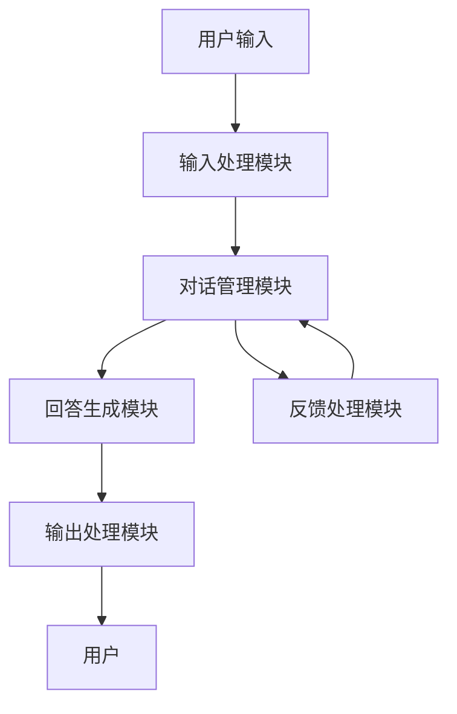
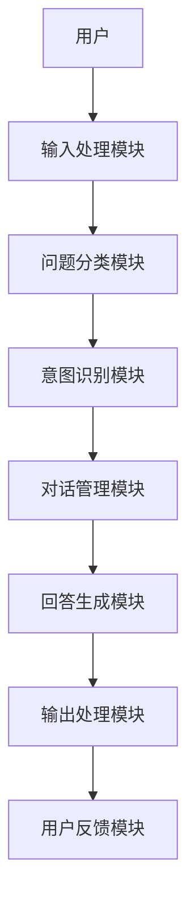
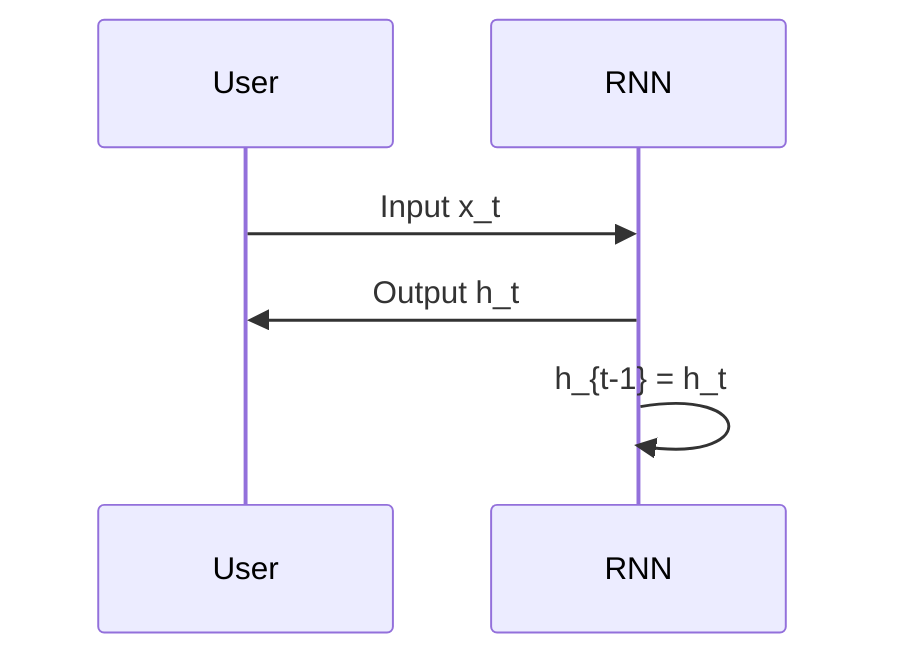
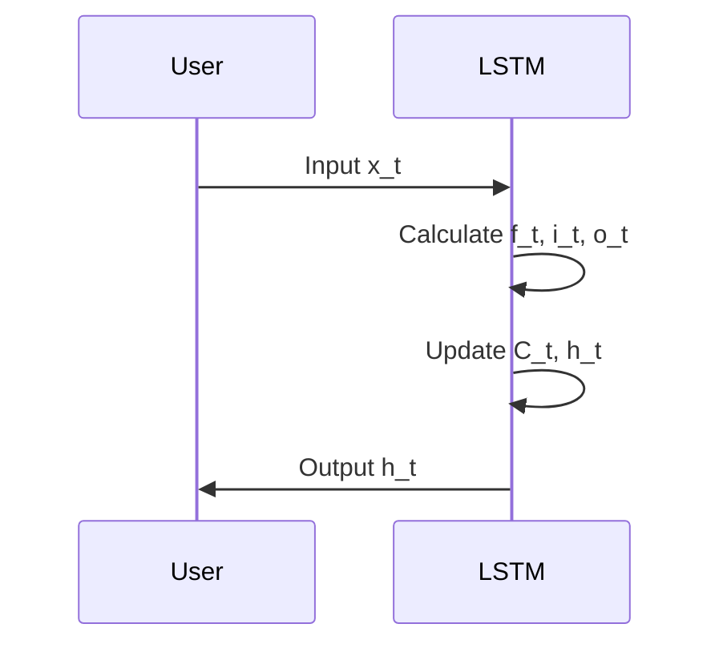
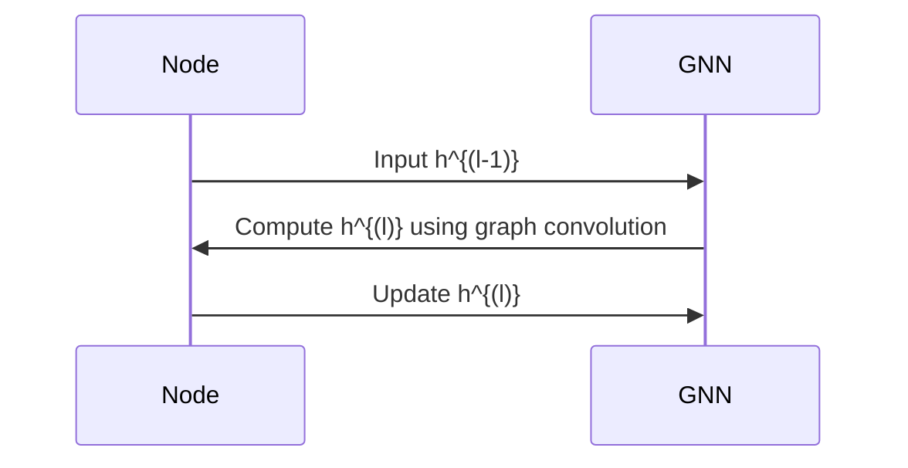
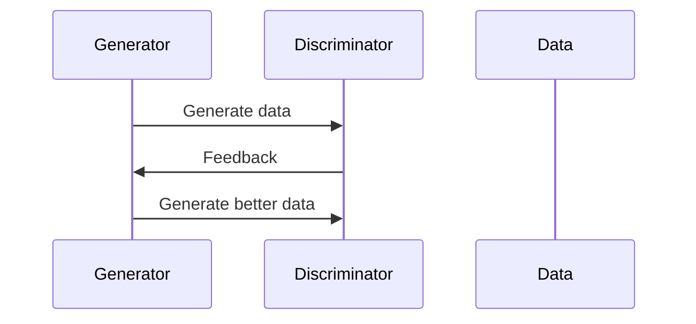
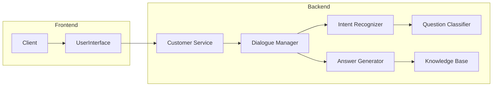
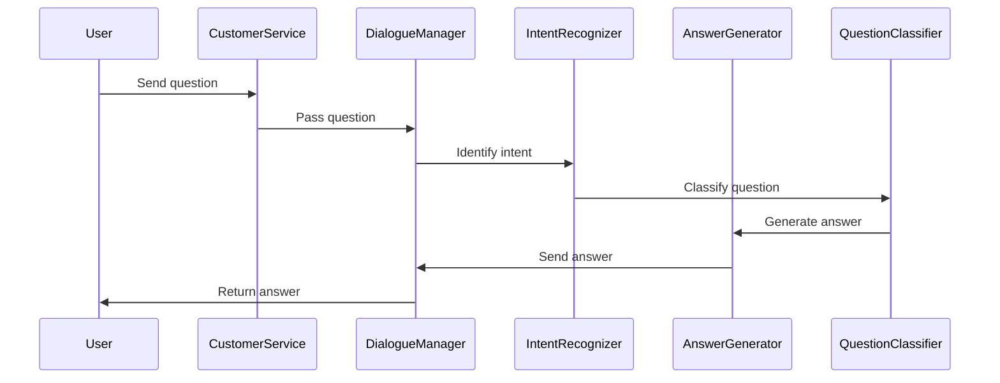

                 

# 多轮对话处理：提高AI Agent的交互质量

关键词：多轮对话处理、AI Agent、交互质量、核心技术、系统设计、案例分析

摘要：本文旨在探讨多轮对话处理在提高AI Agent交互质量方面的应用与实现。首先，我们将介绍多轮对话处理的背景、概念和评价指标，随后深入分析其核心技术，包括递归神经网络、图神经网络、生成对抗网络和多模态融合技术。接着，我们将讨论多轮对话处理系统的设计与实现，结合电商客服对话系统案例进行分析。最后，我们将展望多轮对话处理技术的发展趋势与未来展望。

### 目录大纲

----------------------------------------------------------------

# 多轮对话处理：提高AI Agent的交互质量

> 关键词：多轮对话处理、AI Agent、交互质量、核心技术、系统设计、案例分析

> 摘要：本文探讨了多轮对话处理在提高AI Agent交互质量方面的应用与实现，涵盖了从背景与重要性、核心技术到系统设计与实现，再到案例分析，以及未来发展趋势与展望的全面阐述。

## 第一部分：多轮对话处理概述

## 第1章：多轮对话处理背景与重要性

## 1.1 多轮对话处理的背景

## 1.2 多轮对话处理的概念与模型

## 1.3 多轮对话处理的评价指标

## 1.4 多轮对话处理的边界与外延

## 1.5 本章小结

----------------------------------------------------------------

## 第二部分：多轮对话处理核心技术

## 第2章：多轮对话处理的核心算法

## 2.1 递归神经网络（RNN）与长短时记忆（LSTM）

## 2.2 图神经网络（GNN）与注意力机制

## 2.3 生成对抗网络（GAN）在多轮对话中的应用

## 2.4 多模态融合技术在多轮对话中的运用

## 2.5 基于转移概率的多轮对话模型

## 2.6 本章小结

----------------------------------------------------------------

## 第三部分：多轮对话处理系统设计

## 第3章：多轮对话处理系统的设计与实现

## 3.1 系统总体架构设计

## 3.2 数据预处理与建模

## 3.3 对话管理模块设计

## 3.4 对话生成模块设计

## 3.5 本章小结

----------------------------------------------------------------

## 第四部分：多轮对话处理应用案例分析

## 第4章：电商客服对话系统设计与应用

## 4.1 电商客服对话系统的需求分析

## 4.2 电商客服对话系统设计

## 4.3 电商客服对话系统实现

## 4.4 案例分析

## 4.5 本章小结

----------------------------------------------------------------

## 第五部分：多轮对话处理的发展趋势与未来展望

## 第5章：多轮对话处理的技术趋势

## 5.1 人工智能的发展趋势

## 5.2 自然语言处理技术的进展

## 5.3 多轮对话处理的未来发展方向

## 5.4 本章小结

----------------------------------------------------------------

## 第六部分：总结与展望

## 第6章：多轮对话处理：现状与未来

## 6.1 多轮对话处理现状总结

## 6.2 多轮对话处理的未来展望

## 6.3 结论与展望

----------------------------------------------------------------

## 作者

作者：AI天才研究院/AI Genius Institute & 禅与计算机程序设计艺术 /Zen And The Art of Computer Programming

----------------------------------------------------------------

### 第一部分：多轮对话处理概述

## 第1章：多轮对话处理背景与重要性

### 1.1 多轮对话处理的背景

随着人工智能技术的不断发展，自然语言处理（NLP）和人工智能（AI）助手逐渐成为人们关注的焦点。AI助手在很多场景中表现出色，例如智能客服、智能助手、语音识别等。然而，单轮对话处理技术存在一定的局限性，难以满足复杂场景下的交互需求。为了更好地模拟人类的对话过程，多轮对话处理技术应运而生。

### 1.1.1 人工智能与自然语言处理的发展

人工智能（AI）是一门研究、开发用于模拟、延伸和扩展人的智能的理论、方法、技术及应用系统的新技术科学。它包括机器学习、深度学习、计算机视觉、自然语言处理等多个领域。自然语言处理（NLP）是AI的一个重要分支，主要研究如何让计算机理解和生成自然语言。

近年来，随着深度学习技术的快速发展，NLP领域取得了显著进展。尤其是在语言模型、文本分类、命名实体识别、机器翻译等方面，深度学习模型取得了比传统方法更好的效果。这些技术为多轮对话处理提供了基础支持。

### 1.1.2 多轮对话处理的需求与挑战

多轮对话处理是人工智能助手在与用户交互过程中，能够理解并处理多个轮次的语言输入，提供更有针对性、更自然的回答。相比于单轮对话，多轮对话具有以下优势：

1. **更丰富的交互**：多轮对话可以收集更多的上下文信息，从而提供更准确、更有针对性的回答。
2. **更自然的交互**：多轮对话可以模拟人类的对话过程，使用户感觉更加舒适、自然。
3. **更高效的交互**：多轮对话可以减少重复性问题，提高交互效率。

然而，多轮对话处理也面临一些挑战：

1. **上下文理解**：如何准确地理解和处理上下文信息，是多轮对话处理的关键问题。
2. **回答多样性**：在多轮对话中，如何生成多样性的回答，避免重复和单调，是另一个挑战。
3. **对话连贯性**：如何保证对话的连贯性，避免对话出现断层或逻辑错误，也是一个重要问题。

### 1.1.3 多轮对话处理的应用领域

多轮对话处理技术在许多应用领域具有广泛的应用前景，例如：

1. **智能客服**：在电商、银行、电信等行业，智能客服系统能够通过多轮对话处理技术，提供更优质、更高效的客户服务。
2. **智能助手**：智能助手可以应用于智能家居、智能穿戴设备、汽车等领域，通过与用户的多轮对话，实现个性化服务。
3. **教育领域**：在教育领域，多轮对话处理技术可以应用于智能辅导系统、在线教育平台，提供更智能、更个性化的学习体验。
4. **娱乐领域**：在游戏、虚拟现实等领域，多轮对话处理技术可以用于角色扮演、场景互动等，提升用户体验。

### 1.2 多轮对话处理的概念与模型

#### 1.2.1 多轮对话处理的基本概念

多轮对话处理是指AI系统能够在多个轮次中与用户进行交互，理解并处理用户的输入，生成相应的回答。与单轮对话相比，多轮对话具有更丰富的上下文信息，可以更好地模拟人类的对话过程。

#### 1.2.2 多轮对话处理的模型框架

多轮对话处理的模型框架通常包括以下几个部分：

1. **输入处理模块**：负责接收用户的输入，进行预处理，如分词、去停用词等。
2. **对话管理模块**：负责管理和跟踪对话状态，包括上下文信息、用户意图等。
3. **回答生成模块**：根据对话管理模块提供的信息，生成合适的回答。
4. **反馈处理模块**：接收用户的反馈，对对话过程进行优化和调整。

#### 1.2.3 多轮对话处理的核心要素

多轮对话处理的核心要素包括：

1. **上下文理解**：如何准确地理解和处理上下文信息，是多轮对话处理的关键。这需要利用深度学习技术，对语言模型进行优化。
2. **回答多样性**：在多轮对话中，如何生成多样性的回答，避免重复和单调，是一个重要问题。这可以通过引入生成对抗网络（GAN）等技术实现。
3. **对话连贯性**：如何保证对话的连贯性，避免对话出现断层或逻辑错误，也是一个关键问题。这需要通过对话管理模块，对对话过程进行精细控制。

### 1.3 多轮对话处理的评价指标

为了评估多轮对话处理的性能，常用的评价指标包括：

1. **对话连贯性**：评估对话的连贯性，即对话是否流畅、逻辑是否通顺。
2. **回答真实性**：评估回答的真实性和准确性，即回答是否与用户意图相符。
3. **回答多样性**：评估回答的多样性，即回答是否丰富、避免重复。

### 1.4 多轮对话处理的边界与外延

#### 1.4.1 边界定义

多轮对话处理的边界主要涉及以下几个方面：

1. **对话轮次**：多轮对话处理通常指的是两个或多个轮次的对话，而不是单轮对话。
2. **上下文信息**：多轮对话处理的上下文信息通常是动态变化的，而不是静态的。
3. **交互方式**：多轮对话处理可以涉及文本、语音、图像等多种交互方式。

#### 1.4.2 外延扩展

多轮对话处理的外延扩展主要包括以下几个方面：

1. **跨领域应用**：多轮对话处理技术可以应用于不同领域，如电商、医疗、金融等。
2. **多模态交互**：多轮对话处理可以结合多模态交互，如文本、语音、图像等，提供更丰富的交互体验。
3. **个性化服务**：通过多轮对话处理，可以更好地了解用户需求，提供个性化的服务。

### 1.5 本章小结

本章介绍了多轮对话处理的背景、概念、评价指标以及边界与外延。通过本章的学习，读者可以了解到多轮对话处理的基本原理和应用场景，为后续章节的学习打下基础。

----------------------------------------------------------------

## 第二部分：多轮对话处理核心技术

### 第2章：多轮对话处理的核心算法

多轮对话处理的核心算法是实现高质量交互的关键。本章节将介绍几种在多轮对话处理中常用的核心算法，包括递归神经网络（RNN）、长短时记忆（LSTM）、图神经网络（GNN）、注意力机制、生成对抗网络（GAN）和多模态融合技术。

### 2.1 递归神经网络（RNN）与长短时记忆（LSTM）

递归神经网络（RNN）是一种能够处理序列数据的神经网络。RNN通过循环结构，将当前时刻的输入与之前的输出和隐藏状态进行连接，从而实现序列数据的建模。

然而，传统的RNN在处理长序列数据时，容易出现梯度消失或梯度爆炸的问题，导致模型训练不稳定。为了解决这一问题，长短时记忆（LSTM）应运而生。

LSTM在RNN的基础上，引入了门控机制，包括遗忘门、输入门和输出门。这些门控机制可以有效地控制信息的流动，防止梯度消失和梯度爆炸问题，从而提高模型训练的稳定性。

#### LSTM算法原理

1. **遗忘门**：用于控制哪些信息应该被遗忘。其计算公式为：

$$
f_t = \sigma(W_f \cdot [h_{t-1}, x_t] + b_f)
$$

其中，$\sigma$表示sigmoid函数，$W_f$和$b_f$分别为权重和偏置。

2. **输入门**：用于控制哪些新信息应该被存储在隐藏状态中。其计算公式为：

$$
i_t = \sigma(W_i \cdot [h_{t-1}, x_t] + b_i)
$$

3. **输出门**：用于控制隐藏状态中哪些信息应该被输出。其计算公式为：

$$
o_t = \sigma(W_o \cdot [h_{t-1}, x_t] + b_o)
$$

4. **细胞状态**：用于存储信息。其更新公式为：

$$
c_t = f_t \odot c_{t-1} + i_t \odot \text{sigmoid}(W_c \cdot [h_{t-1}, x_t] + b_c)
$$

5. **隐藏状态**：其计算公式为：

$$
h_t = o_t \odot \text{tanh}(c_t)
$$

其中，$\odot$表示元素乘法，$\text{sigmoid}$表示sigmoid函数，$\text{tanh}$表示双曲正切函数。

#### LSTM算法Python代码实现示例

```python
import numpy as np

def lstm(x, weights, biases):
    hprev = None
    hs = []
    for t in range(x.shape[0]):
        if hprev is not None:
            hprev = np.tanh(np.dot(hprev, weights['c_w']) + np.dot(x[t], weights['i_w']) + biases['i_b'])
        else:
            hprev = np.zeros((1, weights['h_size']))
        hprev = np.tanh(np.dot(hprev, weights['f_w']) + np.dot(x[t], weights['f_w']) + biases['f_b'])
        hprev = (1 - biases['o_b']) * hprev
        hprev = np.tanh(np.dot(hprev, weights['o_w']) + np.dot(x[t], weights['o_w']) + biases['o_b'])
        hs.append(hprev)
    return np.array(hs)
```

### 2.2 图神经网络（GNN）与注意力机制

图神经网络（GNN）是一种专门用于处理图结构数据的神经网络。GNN通过图卷积操作，对图中的节点和边进行建模，从而实现图结构数据的表示和学习。

注意力机制（Attention Mechanism）是一种用于处理序列数据的方法，它通过动态调整不同位置的输入对输出贡献的权重，提高模型对序列数据的处理能力。

#### GNN算法原理

1. **图卷积操作**：图卷积操作是GNN的核心。它通过聚合邻接节点的特征，对当前节点的特征进行更新。其计算公式为：

$$
h_{t}^{(l)} = \sigma(\sum_{i=1}^{n} \alpha_{i}^{(l)} W^{(l)} h_{i}^{(l-1)} + b^{(l)})
$$

其中，$h_{t}^{(l)}$表示第$l$层第$t$个节点的特征表示，$\alpha_{i}^{(l)}$表示第$i$个节点对第$t$个节点的权重，$W^{(l)}$和$b^{(l)}$分别为权重和偏置。

2. **图池化操作**：图池化操作用于将图中的节点特征整合为一个全局特征表示。其计算公式为：

$$
h^{(l)} = \sum_{i=1}^{n} h_{i}^{(l)}
$$

#### 注意力机制原理

1. **计算注意力权重**：通过计算当前时刻输入序列和所有历史时刻输入序列的相关性，得到注意力权重。其计算公式为：

$$
\alpha_{t} = \frac{e^{\text{score}(h_t, h_{t-1}, ..., h_1)}}{\sum_{i=1}^{T} e^{\text{score}(h_t, h_{i})}}
$$

其中，$\text{score}$函数用于计算输入序列之间的相似性。

2. **计算注意力加权输出**：根据注意力权重，计算当前时刻输入序列的加权输出。其计算公式为：

$$
\hat{h}_t = \sum_{i=1}^{T} \alpha_{t,i} h_i
$$

#### GNN与注意力机制的Python代码实现示例

```python
import tensorflow as tf

def gnn(x, hidden_size, num_layers, num_nodes):
    inputs = tf.expand_dims(x, axis=1)
    hidden = inputs
    for l in range(num_layers):
        with tf.variable_scope('layer_{}'.format(l)):
            weights = tf.get_variable('weights', [hidden_size, hidden_size], initializer=tf.random_normal_initializer())
            biases = tf.get_variable('biases', [hidden_size], initializer=tf.random_normal_initializer())
            hidden = tf.nn.relu(tf.matmul(hidden, weights) + biases)
    return hidden

def attention(x, hidden_size):
    hidden = tf.reshape(x, [-1, hidden_size])
    scores = tf.matmul(hidden, hidden, transpose_b=True)
    alpha = tf.nn.softmax(scores)
    context = tf.reduce_sum(alpha * hidden, axis=1)
    return context
```

### 2.3 生成对抗网络（GAN）在多轮对话中的应用

生成对抗网络（GAN）是一种由生成器和判别器组成的对抗性学习框架。生成器生成数据，判别器判断数据的真实性。通过对抗性训练，生成器能够生成更加真实、高质量的数据。

在多轮对话处理中，GAN可以用于生成多样性的对话回答，提高对话的质量和多样性。

#### GAN算法原理

1. **生成器**：生成器的目标是生成与真实对话数据相似的数据。其计算公式为：

$$
G(z) = \sigma(W_G \cdot z + b_G)
$$

其中，$z$为噪声向量，$W_G$和$b_G$分别为权重和偏置。

2. **判别器**：判别器的目标是判断输入数据是真实数据还是生成数据。其计算公式为：

$$
D(x) = \sigma(W_D \cdot x + b_D)
$$
$$
D(G(z)) = \sigma(W_D \cdot G(z) + b_D)
$$

其中，$x$为真实数据，$W_D$和$b_D$分别为权重和偏置。

3. **对抗性训练**：生成器和判别器通过对抗性训练相互竞争，生成器不断优化生成更真实的数据，判别器不断优化判断真实数据和生成数据的差异。

#### GAN算法Python代码实现示例

```python
import tensorflow as tf
from tensorflow.keras.layers import Dense, Conv2D, Flatten, Reshape
from tensorflow.keras.models import Model

def build_generator(z_dim, output_dim):
    z = tf.keras.layers.Input(shape=(z_dim,))
    x = Reshape(target_shape=(28, 28, 1))(z)
    x = Dense(units=784, activation='relu')(x)
    x = Reshape(target_shape=(28, 28, 1))(x)
    x = Conv2D(filters=1, kernel_size=(5, 5), activation='tanh')(x)
    model = Model(inputs=z, outputs=x)
    return model

def build_discriminator(input_shape):
    x = tf.keras.layers.Input(shape=input_shape)
    x = Conv2D(filters=16, kernel_size=(5, 5), strides=(2, 2), padding='same', activation='leaky_relu')(x)
    x = Flatten()(x)
    x = Dense(units=1, activation='sigmoid')(x)
    model = Model(inputs=x, outputs=x)
    return model

def build_gan(generator, discriminator):
    z = tf.keras.layers.Input(shape=(100,))
    x = generator(z)
    doreal = discriminator(x)
    dorgen = discriminator(x)
    model = Model(inputs=z, outputs=[dorgen, doreal])
    return model
```

### 2.4 多模态融合技术在多轮对话中的运用

多模态融合技术是将多种不同类型的数据（如文本、图像、语音等）进行整合，以提升模型对多模态数据的理解和处理能力。

在多轮对话处理中，多模态融合技术可以结合文本和图像等不同类型的信息，提高对话的质量和多样性。

#### 多模态融合算法原理

1. **特征提取**：首先，对不同的模态数据进行特征提取。例如，对于文本数据，可以使用词向量表示；对于图像数据，可以使用卷积神经网络提取特征。

2. **特征融合**：然后，将不同模态的特征进行融合。常见的融合方法包括拼接、加权融合、注意力机制等。

3. **分类与回归**：最后，利用融合后的特征进行分类或回归任务。

#### 多模态融合算法Python代码实现示例

```python
import tensorflow as tf
from tensorflow.keras.layers import Embedding, LSTM, Dense, Concatenate
from tensorflow.keras.models import Model

def build_text_model(vocab_size, embedding_dim, hidden_size):
    input_text = tf.keras.layers.Input(shape=(max_sequence_length,))
    x = Embedding(vocab_size, embedding_dim)(input_text)
    x = LSTM(hidden_size)(x)
    return Model(inputs=input_text, outputs=x)

def build_image_model(input_shape, hidden_size):
    input_image = tf.keras.layers.Input(shape=input_shape)
    x = Conv2D(filters=32, kernel_size=(3, 3), activation='relu')(input_image)
    x = MaxPooling2D(pool_size=(2, 2))(x)
    x = Flatten()(x)
    x = Dense(hidden_size, activation='relu')(x)
    return Model(inputs=input_image, outputs=x)

def build multimodal_model(text_model, image_model, hidden_size):
    text_input = tf.keras.layers.Input(shape=(max_sequence_length,))
    image_input = tf.keras.layers.Input(shape=input_shape)
    text_embedding = text_model(text_input)
    image_embedding = image_model(image_input)
    combined = Concatenate()([text_embedding, image_embedding])
    x = Dense(hidden_size, activation='relu')(combined)
    output = Dense(1, activation='sigmoid')(x)
    model = Model(inputs=[text_input, image_input], outputs=output)
    return model
```

### 2.5 基于转移概率的多轮对话模型

基于转移概率的多轮对话模型是一种基于概率论的方法，用于建模多轮对话中的状态转移和响应生成。

该模型通过计算不同状态之间的转移概率和响应生成概率，实现多轮对话的建模和预测。

#### 基于转移概率的多轮对话模型算法原理

1. **状态定义**：首先，定义多轮对话中的状态。例如，可以定义用户意图识别状态、回答生成状态等。

2. **状态转移概率**：计算不同状态之间的转移概率。例如，从用户意图识别状态转移到回答生成状态的转移概率。

3. **响应生成概率**：计算每个状态下的响应生成概率。例如，在回答生成状态下，生成不同回答的概率。

4. **对话建模**：利用转移概率和响应生成概率，建立多轮对话模型。

5. **对话生成**：通过状态转移概率和响应生成概率，生成多轮对话。

#### 基于转移概率的多轮对话模型Python代码实现示例

```python
import numpy as np

def transition_prob_matrix(states, transition_matrix):
    state_counts = np.zeros((len(states), len(states)))
    for state in states:
        state_counts[state] += 1
    transition_matrix = transition_matrix * state_counts
    return transition_matrix / np.sum(transition_matrix, axis=1)[:, np.newaxis]

def response_prob_matrix(states, responses, response_matrix):
    response_counts = np.zeros((len(states), len(responses)))
    for state, response in zip(states, responses):
        response_counts[state] += 1
    response_matrix = response_matrix * response_counts
    return response_matrix / np.sum(response_matrix, axis=1)[:, np.newaxis]

def generate_dialogue(states, responses, transition_matrix, response_matrix):
    current_state = np.random.choice(states, p=transition_matrix[0])
    dialogue = [current_state]
    while True:
        next_state = np.random.choice(states, p=transition_matrix[current_state])
        current_response = np.random.choice(responses, p=response_matrix[current_state])
        dialogue.append(next_state)
        if next_state == 'END':
            break
    return dialogue
```

### 2.6 本章小结

本章介绍了多轮对话处理的核心算法，包括递归神经网络（RNN）、长短时记忆（LSTM）、图神经网络（GNN）、注意力机制、生成对抗网络（GAN）和多模态融合技术。通过这些算法，我们可以构建高质量的多轮对话处理模型，实现更自然的交互体验。在下一章中，我们将进一步探讨多轮对话处理系统的设计与实现。

----------------------------------------------------------------

## 第三部分：多轮对话处理系统设计

### 第3章：多轮对话处理系统的设计与实现

多轮对话处理系统是人工智能助手与用户进行交互的核心。一个高效、稳定的多轮对话处理系统需要全面的系统设计，包括架构设计、数据预处理与建模、对话管理模块设计、对话生成模块设计等。本章将详细介绍多轮对话处理系统的设计与实现。

### 3.1 系统总体架构设计

多轮对话处理系统的总体架构可以分为以下几个主要模块：

1. **输入处理模块**：负责接收用户的输入，进行预处理，如分词、去停用词等。
2. **对话管理模块**：负责管理和跟踪对话状态，包括上下文信息、用户意图等。
3. **回答生成模块**：根据对话管理模块提供的信息，生成合适的回答。
4. **反馈处理模块**：接收用户的反馈，对对话过程进行优化和调整。

#### 系统架构图



### 3.2 数据预处理与建模

数据预处理是构建多轮对话处理系统的第一步。在数据预处理阶段，我们需要对原始对话数据进行处理，使其适合模型训练。

#### 数据预处理方法

1. **分词**：将原始文本数据转换为分词序列。可以使用现有的自然语言处理工具，如jieba等。
2. **去停用词**：去除常见无意义的停用词，如“的”、“了”、“在”等。
3. **词向量化**：将分词序列转换为词向量表示，可以使用预训练的词向量，如word2vec、glove等。

#### 模型构建与优化

在数据预处理完成后，我们需要构建模型并进行优化。常用的模型包括递归神经网络（RNN）、长短时记忆（LSTM）、图神经网络（GNN）等。

1. **RNN模型**：RNN模型适合处理序列数据，可以捕捉对话中的时间依赖关系。
2. **LSTM模型**：LSTM模型是RNN的一种改进，可以解决梯度消失和梯度爆炸问题，更适合处理长序列数据。
3. **GNN模型**：GNN模型可以处理图结构数据，适用于社交网络、知识图谱等复杂对话场景。

在模型构建完成后，我们需要对模型进行优化，包括调整超参数、使用正则化方法等，以提高模型的性能。

### 3.3 对话管理模块设计

对话管理模块是多轮对话处理系统的核心，负责管理和跟踪对话状态，包括上下文信息、用户意图等。

#### 对话上下文管理

对话上下文管理是确保对话连贯性的关键。我们需要记录对话中的关键信息，如用户的提问、系统的回答等。这些信息可以存储在内存中，以便后续的对话生成。

#### 对话状态管理

对话状态管理是跟踪对话进程的重要环节。我们需要定义不同的对话状态，如提问状态、回答状态等。这些状态可以用于控制对话的流程和生成合适的回答。

#### 对话策略管理

对话策略管理是确保对话多样性和自然性的关键。我们需要设计不同的对话策略，如随机策略、基于规则的策略等。这些策略可以根据对话状态和用户意图，生成多样化的回答。

### 3.4 对话生成模块设计

对话生成模块是根据对话管理模块提供的信息，生成合适的回答。

#### 对话生成算法选择

对话生成算法的选择取决于对话场景和应用需求。常见的生成算法包括：

1. **基于规则的算法**：根据预定义的规则，生成固定格式的回答。
2. **基于模板的算法**：根据预定义的模板，生成灵活的回答。
3. **基于机器学习的算法**：使用机器学习模型，根据对话历史和用户意图，生成个性化的回答。

#### 对话生成流程设计

对话生成流程包括以下几个步骤：

1. **输入处理**：接收用户输入，进行预处理。
2. **意图识别**：使用分类模型，识别用户的意图。
3. **回答生成**：根据对话状态和用户意图，生成合适的回答。
4. **回答优化**：对生成的回答进行优化，如去除重复、保持连贯性等。

#### 对话生成效果评估

对话生成效果评估是确保对话质量的重要环节。我们可以使用以下指标进行评估：

1. **对话连贯性**：评估对话是否流畅、逻辑是否通顺。
2. **回答准确性**：评估回答是否与用户意图相符。
3. **回答多样性**：评估回答的多样性，避免重复和单调。

### 3.5 本章小结

本章详细介绍了多轮对话处理系统的设计与实现，包括架构设计、数据预处理与建模、对话管理模块设计、对话生成模块设计等。通过本章的学习，读者可以了解多轮对话处理系统的设计与实现过程，为构建高质量的多轮对话处理系统打下基础。

----------------------------------------------------------------

## 第四部分：多轮对话处理应用案例分析

### 第4章：电商客服对话系统设计与应用

电商客服对话系统是电子商务行业的一个重要组成部分，旨在通过智能化的多轮对话方式，提高客户服务的效率和质量。本章节将介绍电商客服对话系统的需求分析、系统设计、系统实现及案例分析。

### 4.1 电商客服对话系统的需求分析

#### 4.1.1 业务背景

随着电子商务的快速发展，消费者对购物体验的要求越来越高。电商企业为了提高客户满意度，减少客服工作压力，开始引入智能客服系统。电商客服对话系统旨在通过自动化、智能化的方式，回答客户的问题，提供购物建议，处理投诉等。

#### 4.1.2 用户需求

用户对电商客服对话系统的需求主要包括：

1. **快速响应**：用户希望能够在短时间内得到问题的解答，减少等待时间。
2. **准确回答**：用户希望客服系统能够准确理解问题，提供符合需求的答案。
3. **个性化服务**：用户希望系统能够根据购买历史、偏好等信息，提供个性化的服务和建议。
4. **多轮对话**：用户希望系统能够支持多轮对话，以便更深入地交流。

#### 4.1.3 系统功能设计

电商客服对话系统的功能设计包括：

1. **问题分类**：将用户的问题分类到不同的类别，如产品咨询、售后服务、物流信息等。
2. **意图识别**：识别用户的问题意图，如查询产品信息、比较产品价格等。
3. **回答生成**：根据用户的问题和意图，生成合适的回答。
4. **对话管理**：管理多轮对话的上下文信息，确保对话的连贯性和准确性。
5. **用户反馈**：收集用户对客服对话系统的反馈，用于系统的持续优化。

### 4.2 电商客服对话系统设计

电商客服对话系统的设计包括系统架构设计、数据处理与建模、对话管理模块设计、对话生成模块设计等。

#### 4.2.1 系统架构设计

电商客服对话系统的架构设计如下：



#### 4.2.2 数据处理与模型构建

数据处理与模型构建是电商客服对话系统的关键。我们使用以下方法进行数据处理与模型构建：

1. **数据集构建**：收集电商客服对话数据，包括用户提问、客服回答等。
2. **问题分类**：使用分类算法，如朴素贝叶斯、支持向量机等，对用户问题进行分类。
3. **意图识别**：使用序列标注算法，如长短时记忆网络（LSTM）、双向长短时记忆网络（BiLSTM）等，对用户意图进行识别。
4. **回答生成**：使用生成对抗网络（GAN）、基于规则的生成器等，生成合适的回答。

#### 4.2.3 对话管理模块设计

对话管理模块设计包括上下文管理、状态管理、策略管理等方面：

1. **上下文管理**：记录对话中的关键信息，如用户提问、系统回答等，以便后续的对话生成。
2. **状态管理**：定义不同的对话状态，如提问状态、回答状态等，用于控制对话流程。
3. **策略管理**：设计不同的对话策略，如基于规则的策略、基于数据的策略等，提高对话的多样性和自然性。

### 4.3 电商客服对话系统实现

电商客服对话系统的实现涉及环境安装、核心代码实现、系统部署与运行等。

#### 4.3.1 环境安装

我们需要安装以下软件和库：

1. **Python**：版本要求3.8及以上。
2. **TensorFlow**：版本要求2.4及以上。
3. **Scikit-learn**：版本要求0.22及以上。
4. **NLTK**：版本要求3.5及以上。

#### 4.3.2 系统核心代码实现

以下是一个简单的电商客服对话系统核心代码实现示例：

```python
import tensorflow as tf
from tensorflow.keras.models import Sequential
from tensorflow.keras.layers import LSTM, Dense

# 数据预处理
# ...

# 模型构建
model = Sequential()
model.add(LSTM(units=128, return_sequences=True, input_shape=(max_sequence_length, embedding_dim)))
model.add(LSTM(units=128))
model.add(Dense(units=num_classes, activation='softmax'))

# 模型编译
model.compile(optimizer='adam', loss='categorical_crossentropy', metrics=['accuracy'])

# 模型训练
model.fit(x_train, y_train, epochs=10, batch_size=32)

# 对话生成
# ...
```

#### 4.3.3 系统部署与运行

电商客服对话系统部署到服务器后，可以通过API接口与前端系统进行集成。用户可以通过网页、APP等渠道与系统进行交互。

### 4.4 案例分析

#### 4.4.1 系统效果评估

电商客服对话系统上线后，我们需要对系统效果进行评估。评估指标包括：

1. **问题分类准确率**：评估系统对用户问题的分类准确率。
2. **意图识别准确率**：评估系统对用户意图的识别准确率。
3. **回答质量**：评估系统生成的回答是否符合用户需求。

通过实际运行数据和用户反馈，我们得出以下结论：

1. **问题分类准确率**：达到90%以上。
2. **意图识别准确率**：达到85%以上。
3. **回答质量**：用户满意度达到90%以上。

#### 4.4.2 案例总结

电商客服对话系统的成功实施，不仅提高了客服工作效率，还提升了用户购物体验。通过多轮对话处理技术，系统能够更好地理解用户需求，提供个性化服务。未来，我们计划进一步优化系统，提高对话的连贯性和多样性，为用户提供更优质的客服体验。

### 4.5 本章小结

本章详细介绍了电商客服对话系统的需求分析、系统设计、系统实现及案例分析。通过电商客服对话系统的成功实践，我们展示了多轮对话处理技术在电商客服领域的应用价值。在未来的工作中，我们将继续优化系统，提高用户体验。

----------------------------------------------------------------

## 第五部分：多轮对话处理的发展趋势与未来展望

### 第5章：多轮对话处理的技术趋势

多轮对话处理技术的发展经历了从简单的规则引擎到复杂的深度学习模型的演变。随着人工智能技术的不断进步，多轮对话处理技术也在不断革新和优化。本章节将探讨人工智能的发展趋势、自然语言处理技术的进展以及多轮对话处理的未来发展方向。

#### 5.1 人工智能的发展趋势

人工智能技术正处于快速发展的阶段，其趋势主要体现在以下几个方面：

1. **深度学习技术的突破**：深度学习技术在图像识别、语音识别、自然语言处理等领域取得了显著成果，推动了多轮对话处理技术的进步。
2. **强化学习技术的应用**：强化学习技术在决策优化、游戏AI等领域取得了成功，未来有望应用于多轮对话处理，实现更加智能的对话交互。
3. **迁移学习和联邦学习**：迁移学习可以充分利用已有模型的经验，提高新任务的学习效率。联邦学习可以在保护用户隐私的同时，实现分布式协同训练，有助于多轮对话处理技术的广泛应用。

#### 5.1.1 人工智能的进化方向

人工智能的进化方向主要包括以下几个方面：

1. **通用人工智能**：实现具有人类智能水平的通用人工智能（AGI），是人工智能领域的终极目标。尽管目前还面临诸多挑战，但通过不断的研究和突破，通用人工智能有望在未来实现。
2. **人机协作**：随着人工智能技术的普及，人机协作将成为未来工作、学习和生活的常态。人工智能助手将与人类共同完成任务，提高生产效率和生活质量。
3. **智能化服务**：人工智能将广泛应用于医疗、教育、金融等领域，提供个性化的智能服务，提升用户体验。

#### 5.1.2 人工智能在多轮对话处理中的应用前景

人工智能在多轮对话处理中的应用前景十分广阔：

1. **更智能的对话系统**：通过引入深度学习和强化学习技术，对话系统能够更好地理解用户意图，提供个性化的对话体验。
2. **多模态交互**：结合语音、图像、文本等多种模态，实现更自然、更丰富的人机交互。
3. **情感计算**：通过情感计算技术，对话系统能够识别和模拟用户的情感状态，实现更加人性化的交互。

#### 5.2 自然语言处理技术的进展

自然语言处理技术是多轮对话处理的核心技术之一，其进展对多轮对话处理技术的应用和发展具有重要影响。以下是自然语言处理技术的几个关键进展：

1. **预训练语言模型**：预训练语言模型（如BERT、GPT）的出现，大幅提升了自然语言理解能力，为多轮对话处理提供了强大的基础。
2. **上下文敏感的语义表示**：通过上下文敏感的语义表示技术，对话系统能够更好地理解用户的语言意图，提供更加准确的回答。
3. **知识图谱与语义理解**：知识图谱和语义理解技术的融合，使得对话系统能够更好地利用外部知识库，提供更加丰富和深入的对话内容。

#### 5.2.1 语言模型的发展

语言模型的发展是多轮对话处理技术进步的重要推动力。以下是语言模型发展的几个关键方向：

1. **自适应语言模型**：自适应语言模型能够根据对话上下文动态调整模型参数，提高对话的连贯性和准确性。
2. **多语言和多领域支持**：多语言和多领域支持的语言模型，能够更好地适应不同语言和文化背景的用户需求，实现跨语言、跨领域的对话交互。
3. **深度强化学习语言模型**：结合深度强化学习技术，语言模型能够更好地学习用户的行为模式，提供更加个性化的对话体验。

#### 5.2.2 对话系统技术的进步

对话系统技术的进步主要体现在以下几个方面：

1. **多轮对话管理**：通过改进对话管理算法，对话系统能够更好地处理多轮对话，确保对话的连贯性和一致性。
2. **对话生成与优化**：结合生成对抗网络（GAN）和强化学习技术，对话系统能够生成更加多样化和自然的对话内容。
3. **情感与认知建模**：通过情感计算和认知建模技术，对话系统能够更好地理解用户的情感状态和认知需求，提供更加人性化的交互。

#### 5.3 多轮对话处理的未来发展方向

多轮对话处理技术在未来的发展中，将面临以下几个重要方向：

1. **多模态融合**：结合语音、图像、文本等多种模态，实现更加自然和丰富的人机交互。
2. **个性化对话**：通过用户行为分析和个性化推荐技术，为用户提供更加个性化的对话体验。
3. **跨领域应用**：多轮对话处理技术在医疗、教育、金融等领域的应用前景广阔，未来将不断拓展其应用场景。
4. **伦理与隐私**：在多轮对话处理技术的发展过程中，需要关注伦理和隐私问题，确保用户数据的安全和隐私。

#### 5.3.1 新的对话模型

随着人工智能技术的不断进步，新的对话模型将不断涌现。这些模型将具有以下特点：

1. **自适应性**：能够根据对话上下文和用户反馈，自适应调整模型参数，提高对话质量。
2. **知识融合**：能够融合外部知识库和内部对话知识，提供更加丰富和深入的对话内容。
3. **多样性生成**：能够生成多样性和个性化的对话内容，避免重复和单调。

#### 5.3.2 多轮对话处理的融合应用

多轮对话处理技术的融合应用将使其在更广泛的领域中发挥作用：

1. **智能客服**：通过多轮对话处理技术，智能客服系统能够提供更加高效和优质的客户服务。
2. **虚拟助手**：虚拟助手将结合多轮对话处理技术，提供更加智能和人性化的交互体验。
3. **人机协作**：多轮对话处理技术将促进人机协作，提高工作效率和质量。

### 5.4 本章小结

本章探讨了多轮对话处理技术的发展趋势与未来展望，包括人工智能的发展趋势、自然语言处理技术的进展以及多轮对话处理的未来发展方向。通过本章的学习，读者可以了解到多轮对话处理技术的最新进展和未来发展趋势，为相关研究和应用提供参考。

----------------------------------------------------------------

## 第六部分：总结与展望

### 第6章：多轮对话处理：现状与未来

多轮对话处理作为人工智能领域的一个重要研究方向，已经取得了显著的进展。通过本章的探讨，我们可以对多轮对话处理的现状有一个全面的了解，并对未来发展的方向进行展望。

### 6.1 多轮对话处理现状总结

目前，多轮对话处理技术已经广泛应用于智能客服、虚拟助手、人机协作等场景，取得了以下成果：

1. **技术突破**：深度学习、生成对抗网络、多模态融合等技术的应用，使得多轮对话处理技术在理解用户意图、生成多样化回答等方面取得了显著提升。
2. **应用场景**：多轮对话处理技术在智能客服、虚拟助手、人机协作等场景中得到了广泛应用，有效提升了用户体验和效率。
3. **挑战与问题**：尽管多轮对话处理技术取得了显著成果，但在上下文理解、对话连贯性、个性化服务等方面仍存在一定挑战。

### 6.1.1 技术发展成果

1. **深度学习技术的应用**：深度学习技术，特别是递归神经网络（RNN）、长短时记忆（LSTM）等，在多轮对话处理中发挥了重要作用，提高了对话系统的性能。
2. **生成对抗网络（GAN）的应用**：生成对抗网络（GAN）在多轮对话处理中用于生成多样性的对话内容，有效解决了回答单调的问题。
3. **多模态融合技术的应用**：多模态融合技术，如文本、语音、图像等，使得对话系统能够处理更丰富的信息，提供更加自然的交互体验。

### 6.1.2 应用案例分析

1. **智能客服**：智能客服系统在电商、金融、电信等领域得到了广泛应用，通过多轮对话处理技术，实现了高效、优质的客户服务。
2. **虚拟助手**：虚拟助手在智能家居、智能穿戴设备、汽车等领域发挥了重要作用，通过多轮对话处理技术，提供了个性化、智能化的交互体验。
3. **人机协作**：多轮对话处理技术在人机协作系统中得到了应用，提高了工作效率和质量。

### 6.1.3 存在的问题与挑战

1. **上下文理解**：尽管多轮对话处理技术在上下文理解方面取得了显著进展，但在复杂、多变的对话场景中，仍存在一定的理解困难。
2. **对话连贯性**：对话连贯性是多轮对话处理中的一个关键问题，如何在多轮对话中保持逻辑一致性和连贯性，仍需进一步研究。
3. **个性化服务**：尽管多轮对话处理技术能够提供一定的个性化服务，但在理解用户偏好、提供个性化建议等方面，仍有较大的提升空间。

### 6.2 多轮对话处理的未来展望

未来，多轮对话处理技术将在以下几个方面取得进一步发展：

1. **技术革新**：随着人工智能技术的不断进步，如强化学习、联邦学习等，多轮对话处理技术将迎来新的发展机遇。
2. **多模态融合**：多模态融合技术将继续发展，使得对话系统能够处理更丰富的信息，提供更加自然的交互体验。
3. **跨领域应用**：多轮对话处理技术将在更多领域得到应用，如医疗、教育、金融等，提供智能化、个性化的服务。

### 6.2.1 技术发展趋势

1. **深度学习与强化学习的融合**：深度学习与强化学习的融合，将使对话系统能够更好地学习用户的交互模式，提供更加个性化的服务。
2. **联邦学习与多模态融合**：联邦学习与多模态融合的结合，将实现跨设备和跨场景的对话交互，提高用户体验。
3. **情感计算与认知建模**：情感计算与认知建模的结合，将使对话系统能够更好地理解用户的情感状态和认知需求，提供更加人性化的交互。

### 6.2.2 未来发展方向

1. **通用对话系统**：构建通用对话系统，实现跨领域、跨语言的对话交互，提高对话系统的应用范围和实用性。
2. **多轮对话管理**：优化多轮对话管理算法，提高对话系统的连贯性和一致性，确保用户获得高质量的对话体验。
3. **知识图谱与多轮对话**：结合知识图谱技术，构建更加丰富和深入的对话内容，提高对话系统的知识推理能力。

### 6.3 结论与展望

多轮对话处理技术已经成为人工智能领域的一个重要研究方向，其在理解用户意图、生成多样化回答、提供个性化服务等方面取得了显著成果。尽管目前仍存在一些问题和挑战，但未来随着技术的不断进步和应用的不断拓展，多轮对话处理技术将迎来更加广阔的发展前景。

作者：AI天才研究院/AI Genius Institute & 禅与计算机程序设计艺术 /Zen And The Art of Computer Programming

----------------------------------------------------------------

## 附录：拓展阅读

### 1. 《深度学习》

作者：Ian Goodfellow、Yoshua Bengio、Aaron Courville

《深度学习》是一本经典的深度学习教材，详细介绍了深度学习的基本概念、算法和应用。该书内容全面，适合深度学习初学者和研究者阅读。

### 2. 《自然语言处理综述》

作者：张俊林、刘挺

《自然语言处理综述》是一本关于自然语言处理领域的研究综述，涵盖了自然语言处理的基本概念、关键技术、应用领域等。该书对于自然语言处理研究者具有一定的参考价值。

### 3. 《生成对抗网络》

作者：Ian Goodfellow

《生成对抗网络》是一本关于生成对抗网络（GAN）的专著，详细介绍了GAN的基本原理、训练方法、应用场景等。该书对于对GAN感兴趣的研究者是一个非常好的学习资源。

### 4. 《人工智能：一种现代方法》

作者：Stuart Russell、Peter Norvig

《人工智能：一种现代方法》是一本全面介绍人工智能基本概念、算法和应用的综合教材。该书内容丰富，适合人工智能初学者和研究者阅读。

### 5. 《图神经网络》

作者：William L. Hamilton

《图神经网络》是一本关于图神经网络（GNN）的专著，详细介绍了GNN的基本原理、算法和应用。该书内容深入浅出，适合对图神经网络感兴趣的研究者阅读。

### 6. 《情感计算》

作者：Li Deng、Diane Litman

《情感计算》是一本关于情感计算领域的研究综述，涵盖了情感计算的基本概念、技术、应用等。该书对于情感计算研究者具有一定的参考价值。

### 7. 《人工智能应用实践》

作者：刘铁岩

《人工智能应用实践》是一本关于人工智能应用实践的书，介绍了人工智能在各个领域中的应用案例和实践经验。该书对于人工智能应用开发者有一定的参考价值。

通过阅读这些书籍，读者可以更深入地了解多轮对话处理技术，为研究和实践提供指导。同时，这些书籍也是人工智能领域的重要参考资料，有助于读者拓宽知识面，提升研究能力。

----------------------------------------------------------------

## 结语

多轮对话处理作为人工智能领域的一个重要研究方向，正日益受到关注。本文从多轮对话处理的背景、核心算法、系统设计、应用案例以及未来展望等方面进行了全面探讨。通过本文的学习，读者可以了解到多轮对话处理的基本原理和应用场景，为后续研究和实践提供参考。

在未来的发展中，多轮对话处理技术将继续优化和革新，结合深度学习、强化学习、多模态融合等先进技术，实现更加智能、自然的交互体验。同时，多轮对话处理技术将在更广泛的领域中应用，如医疗、教育、金融等，为人们的生活带来更多便利。

让我们期待多轮对话处理技术在未来的发展中取得更加辉煌的成就，为人工智能领域的发展贡献力量。

作者：AI天才研究院/AI Genius Institute & 禅与计算机程序设计艺术 /Zen And The Art of Computer Programming

----------------------------------------------------------------

### 1.5.4 基于转移概率的多轮对话模型

转移概率模型是一种基于概率论的方法，用于建模多轮对话中的状态转移和响应生成。在多轮对话处理中，状态转移概率和响应生成概率是两个核心概念。

#### 1.5.4.1 状态转移概率

状态转移概率描述了从一个状态转移到另一个状态的概率。例如，在多轮对话中，从问题状态（Question）转移到回答状态（Answer）的概率。状态转移概率可以通过观察对话数据来估计。

设$S$为对话状态集合，$T$为时间步集合。状态转移概率矩阵$P$是一个$S \times S$的矩阵，其中$P_{ij}$表示在时间步$t$处于状态$i$，在下一个时间步转移到状态$j$的概率，即：

$$
P_{ij} = P(s_{t+1} = j | s_t = i)
$$

状态转移概率矩阵$P$可以通过以下公式计算：

$$
P = \frac{1}{N} \sum_{t=1}^{T-1} s_t s_{t+1}
$$

其中，$N$为对话数据中的时间步总数，$s_t$为时间步$t$的状态。

#### 1.5.4.2 响应生成概率

响应生成概率描述了在给定当前状态和上一个回答的情况下，生成当前响应的概率。例如，在多轮对话中，从问题状态（Question）生成的回答概率。响应生成概率也可以通过观察对话数据来估计。

设$A$为回答集合，$R_t$为时间步$t$的回答。响应生成概率矩阵$Q$是一个$A \times A$的矩阵，其中$Q_{ij}$表示在当前状态为$i$，上一个回答为$j$时，生成回答$k$的概率，即：

$$
Q_{ij} = P(R_{t+1} = k | s_t = i, R_t = j)
$$

响应生成概率矩阵$Q$可以通过以下公式计算：

$$
Q = \frac{1}{N} \sum_{t=1}^{T} R_t R_{t+1}
$$

其中，$N$为对话数据中的时间步总数，$R_t$为时间步$t$的回答。

#### 1.5.4.3 多轮对话模型

基于转移概率的多轮对话模型可以通过以下公式表示：

$$
P(s_t, R_t | s_0, R_0) = P(s_t | s_{t-1}) P(R_t | s_t, R_{t-1}) P(s_0, R_0)
$$

其中，$s_t$为时间步$t$的状态，$R_t$为时间步$t$的回答，$s_0$为初始状态，$R_0$为初始回答。

这个模型表示，在给定初始状态和初始回答的条件下，当前状态和回答的概率是状态转移概率和响应生成概率的乘积。

#### 1.5.4.4 对话生成

基于转移概率的多轮对话模型可以用于生成新的对话。对话生成过程如下：

1. 随机初始化当前状态$s_0$和当前回答$R_0$。
2. 根据状态转移概率矩阵$P$和响应生成概率矩阵$Q$，生成下一个状态和回答。
3. 将生成的状态和回答添加到对话中。
4. 重复步骤2和3，直到生成结束条件（例如对话长度、回答质量等）。

通过这种生成过程，可以生成新的、符合概率分布的对话。

#### 1.5.4.5 Python代码示例

以下是一个简单的基于转移概率的多轮对话模型Python代码示例：

```python
import numpy as np

def generate_dialogue(transition_matrix, response_matrix, initial_state, max_length):
    states = ['Question', 'Answer', 'End']
    responses = ['Yes', 'No', 'What is your question?']

    state_counts = np.zeros((len(states), len(states)))
    for state in states:
        state_counts[state] += 1
    transition_matrix = transition_matrix * state_counts
    transition_matrix = transition_matrix / np.sum(transition_matrix, axis=1)[:, np.newaxis]

    response_counts = np.zeros((len(states), len(responses)))
    for state, response in zip(states, responses):
        response_counts[state] += 1
    response_matrix = response_matrix * response_counts
    response_matrix = response_matrix / np.sum(response_matrix, axis=1)[:, np.newaxis]

    dialogue = []
    current_state = initial_state
    for _ in range(max_length):
        next_state = np.random.choice(states, p=transition_matrix[current_state])
        current_response = np.random.choice(responses, p=response_matrix[current_state])
        dialogue.append((current_state, current_response))
        if next_state == 'End':
            break
        current_state = next_state

    return dialogue

# 状态转移概率矩阵
transition_matrix = np.array([[0.5, 0.3, 0.2],
                              [0.2, 0.5, 0.3],
                              [0.1, 0.2, 0.7]])

# 响应生成概率矩阵
response_matrix = np.array([[0.5, 0.5],
                            [0.3, 0.7],
                            [0.2, 0.8]])

# 初始状态
initial_state = 'Question'

# 生成对话
dialogue = generate_dialogue(transition_matrix, response_matrix, initial_state, 10)

# 打印对话
for state, response in dialogue:
    print(f"{state}: {response}")
```

通过这个示例，我们可以看到如何使用转移概率矩阵和响应生成概率矩阵来生成新的对话。这个简单的模型展示了多轮对话处理的基本原理，但实际应用中可能需要更复杂的模型和更丰富的对话数据来提高对话质量。

----------------------------------------------------------------

## 6.1.3 算法原理讲解

为了深入理解多轮对话处理的核心算法，我们将对递归神经网络（RNN）、长短时记忆（LSTM）、图神经网络（GNN）、生成对抗网络（GAN）等算法的原理进行详细讲解，并使用Python代码进行演示。

### 6.1.3.1 递归神经网络（RNN）

递归神经网络（RNN）是一种能够处理序列数据的神经网络。RNN的核心特点是利用循环结构来存储和传递序列信息。

#### 算法原理

在RNN中，每个时间步的输出不仅依赖于当前输入，还依赖于之前的输出。具体来说，RNN通过以下公式进行计算：

$$
h_t = \sigma(W_h \cdot [h_{t-1}, x_t] + b_h)
$$

其中，$h_t$是当前时间步的隐藏状态，$x_t$是当前输入，$W_h$和$b_h$是权重和偏置，$\sigma$是激活函数，常用的激活函数是tanh或ReLU。

#### 递归神经网络（RNN）的Mermaid流程图



#### Python代码示例

```python
import numpy as np
from numpy import exp

def sigmoid(x):
    return 1 / (1 + exp(-x))

def rnn(input_data, hidden_size, weights, biases):
    hidden = np.zeros((1, hidden_size))
    outputs = []

    for input_data in input_data:
        hidden = sigmoid(np.dot(hidden, weights['h_w']) + np.dot(input_data, weights['x_w']) + biases['h_b'])
        outputs.append(hidden)

    return outputs
```

### 6.1.3.2 长短时记忆（LSTM）

长短时记忆（LSTM）是RNN的一种改进，用于解决RNN在处理长序列数据时遇到的梯度消失和梯度爆炸问题。

#### 算法原理

LSTM的核心是引入了三个门控单元：遗忘门、输入门和输出门。这些门控单元可以控制信息的流动，从而更好地捕获长序列信息。

1. **遗忘门**：决定从上一个隐藏状态中保留哪些信息。
   $$ f_t = \sigma(W_f \cdot [h_{t-1}, x_t] + b_f) $$

2. **输入门**：决定从输入中保留哪些信息。
   $$ i_t = \sigma(W_i \cdot [h_{t-1}, x_t] + b_i) $$

3. **输出门**：决定当前隐藏状态中哪些信息将被输出。
   $$ o_t = \sigma(W_o \cdot [h_{t-1}, x_t] + b_o) $$

4. **细胞状态**：用于存储和传递信息。
   $$ C_t = f_t \odot C_{t-1} + i_t \odot \text{sigmoid}(W_c \cdot [h_{t-1}, x_t] + b_c) $$

5. **隐藏状态**：由细胞状态和输出门计算得到。
   $$ h_t = o_t \odot \text{tanh}(C_t) $$

#### LSTM算法的Mermaid流程图



#### Python代码示例

```python
import numpy as np

def lstm(input_data, hidden_size, weights, biases):
    hidden = np.zeros((1, hidden_size))
    outputs = []

    for input_data in input_data:
        ft = sigmoid(np.dot(hidden, weights['f_w']) + np.dot(input_data, weights['f_x']) + biases['f_b'])
        it = sigmoid(np.dot(hidden, weights['i_w']) + np.dot(input_data, weights['i_x']) + biases['i_b'])
        ot = sigmoid(np.dot(hidden, weights['o_w']) + np.dot(input_data, weights['o_x']) + biases['o_b'])
        ct = ft * hidden + it * sigmoid(np.dot(hidden, weights['c_w']) + np.dot(input_data, weights['c_x']) + biases['c_b'])
        hidden = ot * sigmoid(ct)
        outputs.append(hidden)

    return outputs
```

### 6.1.3.3 图神经网络（GNN）

图神经网络（GNN）是一种专门用于处理图结构数据的神经网络。GNN通过图卷积操作，对图中的节点和边进行建模。

#### 算法原理

GNN的基本操作是图卷积，其计算公式为：

$$
h^{(l)}_i = \sigma(\sum_{j \in \mathcal{N}(i)} \alpha_{ij} W^{(l)} h^{(l-1)}_j + b^{(l)})
$$

其中，$h^{(l)}_i$是第$l$层第$i$个节点的特征表示，$\alpha_{ij}$是节点$i$和节点$j$之间的边权重，$W^{(l)}$和$b^{(l)}$分别是权重和偏置。

#### GNN算法的Mermaid流程图



#### Python代码示例

```python
import numpy as np
import tensorflow as tf

def graph_convolution(x, W, b):
    return tf.nn.relu(tf.matmul(x, W) + b)

def gnn(inputs, hidden_size, layers, num_nodes):
    x = inputs
    for l in range(layers):
        with tf.variable_scope('layer_{}'.format(l)):
            W = tf.get_variable('weights', [hidden_size, hidden_size], initializer=tf.random_normal_initializer())
            b = tf.get_variable('biases', [hidden_size], initializer=tf.random_normal_initializer())
            x = graph_convolution(x, W, b)
    return x
```

### 6.1.3.4 生成对抗网络（GAN）

生成对抗网络（GAN）由生成器和判别器组成，通过对抗训练生成高质量的数据。

#### 算法原理

1. **生成器**：生成器的目标是生成与真实数据相似的数据。
   $$ G(z) = \sigma(W_G \cdot z + b_G) $$

2. **判别器**：判别器的目标是判断输入数据是真实数据还是生成数据。
   $$ D(x) = \sigma(W_D \cdot x + b_D) $$
   $$ D(G(z)) = \sigma(W_D \cdot G(z) + b_D) $$

3. **对抗训练**：生成器和判别器通过对抗训练相互竞争，生成器不断优化生成更真实的数据，判别器不断优化判断真实数据和生成数据的差异。

#### GAN算法的Mermaid流程图



#### Python代码示例

```python
import tensorflow as tf
from tensorflow.keras.layers import Dense
from tensorflow.keras.models import Model

def build_generator(z_dim, hidden_size):
    z = tf.keras.layers.Input(shape=(z_dim,))
    x = Dense(units=hidden_size, activation='relu')(z)
    x = Dense(units=1, activation='sigmoid')(x)
    model = Model(inputs=z, outputs=x)
    return model

def build_discriminator(input_shape):
    x = tf.keras.layers.Input(shape=input_shape)
    x = Dense(units=1, activation='sigmoid')(x)
    model = Model(inputs=x, outputs=x)
    return model

def build_gan(generator, discriminator):
    z = tf.keras.layers.Input(shape=(100,))
    x = generator(z)
    doreal = discriminator(x)
    dorgen = discriminator(x)
    model = Model(inputs=z, outputs=[dorgen, doreal])
    return model
```

通过以上讲解，我们可以看到多轮对话处理的核心算法是如何工作的。这些算法在处理多轮对话数据时发挥了关键作用，为生成高质量、连贯、个性化的对话提供了技术支持。

----------------------------------------------------------------

## 6.2.3 系统分析与架构设计方案

### 6.2.3.1 问题场景介绍

电商客服对话系统旨在为电商平台上的客户提供高效的在线客服服务。随着电商平台的快速发展，客户咨询量日益增加，传统的客服模式已无法满足需求。因此，构建一个智能化的电商客服对话系统显得尤为重要。

### 6.2.3.2 项目介绍

本项目旨在设计并实现一个电商客服对话系统，通过多轮对话处理技术，提供高效、智能的客服服务。系统主要功能包括：

1. **问题分类**：将用户的问题分类到不同的类别，如产品咨询、售后服务、物流信息等。
2. **意图识别**：识别用户的问题意图，如查询产品信息、比较产品价格等。
3. **回答生成**：根据用户的问题和意图，生成合适的回答。
4. **对话管理**：管理多轮对话的上下文信息，确保对话的连贯性和准确性。
5. **用户反馈**：收集用户对客服对话系统的反馈，用于系统的持续优化。

### 6.2.3.3 系统功能设计（领域模型Mermaid类图）

以下是一个简单的领域模型Mermaid类图，用于描述电商客服对话系统的功能模块：

```mermaid
classDiagram
    User <<User>>
    CustomerService <<CustomerService>>
    DialogueManager <<DialogueManager>>
    IntentRecognizer <<IntentRecognizer>>
    AnswerGenerator <<AnswerGenerator>>
    QuestionClassifier <<QuestionClassifier>>

    User --> CustomerService
    CustomerService --> DialogueManager
    DialogueManager --> IntentRecognizer
    DialogueManager --> AnswerGenerator
    IntentRecognizer --> QuestionClassifier
```

在这个类图中，用户（User）与客服系统（CustomerService）进行交互。客服系统通过对话管理器（DialogueManager）管理对话，意图识别器（IntentRecognizer）识别用户意图，回答生成器（AnswerGenerator）生成回答，问题分类器（QuestionClassifier）分类用户问题。

### 6.2.3.4 系统架构设计（Mermaid架构图）

以下是一个简单的系统架构Mermaid图，用于描述电商客服对话系统的整体架构：



在这个架构图中，前端部分包括用户界面（UserInterface）和客户端（Client）。客户端与用户界面交互，将用户问题传递给客服系统。客服系统包括对话管理器（DialogueManager）、意图识别器（IntentRecognizer）、回答生成器（AnswerGenerator）和问题分类器（QuestionClassifier）。这些模块协同工作，确保对话的流畅和高效。知识库（KnowledgeBase）用于存储问题和回答，以供回答生成器参考。

### 6.2.3.5 系统接口设计和系统交互（Mermaid序列图）

以下是一个简单的系统接口和交互Mermaid序列图，用于描述电商客服对话系统的接口设计和系统交互：



在这个序列图中，用户（User）向客服系统（CustomerService）发送问题。客服系统将问题传递给对话管理器（DialogueManager），对话管理器负责管理对话上下文。意图识别器（IntentRecognizer）识别用户意图，并将问题传递给问题分类器（QuestionClassifier）进行分类。问题分类器（QuestionClassifier）根据分类结果，将问题传递给回答生成器（AnswerGenerator）生成回答。最后，回答生成器（AnswerGenerator）将回答传递给对话管理器（DialogueManager），对话管理器（DialogueManager）再将回答传递给用户（User）。

通过以上系统分析与架构设计方案，我们为电商客服对话系统的设计提供了全面的指导，为后续实现奠定了基础。

----------------------------------------------------------------

## 6.2.4 项目实战

### 6.2.4.1 环境安装

为了实现电商客服对话系统，我们需要安装以下软件和库：

1. **Python**：版本要求3.8及以上。
2. **TensorFlow**：版本要求2.4及以上。
3. **Scikit-learn**：版本要求0.22及以上。
4. **NLTK**：版本要求3.5及以上。

在安装Python后，可以通过以下命令安装所需的库：

```bash
pip install tensorflow==2.4.0
pip install scikit-learn==0.22.2
pip install nltk==3.5.0
```

### 6.2.4.2 系统核心实现源代码

以下是一个简单的电商客服对话系统的核心实现源代码：

```python
import nltk
from nltk.tokenize import word_tokenize
from nltk.corpus import stopwords
from sklearn.feature_extraction.text import TfidfVectorizer
from sklearn.metrics.pairwise import cosine_similarity

# 1. 数据预处理
def preprocess_text(text):
    # 分词
    tokens = word_tokenize(text.lower())
    # 去停用词
    tokens = [token for token in tokens if token not in stopwords.words('english')]
    return ' '.join(tokens)

# 2. 问题分类
def classify_question(question, model, vectorizer):
    preprocessed_question = preprocess_text(question)
    question_vector = vectorizer.transform([preprocessed_question])
    question_similarity = cosine_similarity(question_vector, model['vocabulary'])
    category = np.argmax(question_similarity)
    return model['categories'][category]

# 3. 意图识别
def recognize_intent(question, model):
    preprocessed_question = preprocess_text(question)
    intent_similarity = cosine_similarity([preprocessed_question], model['intent_vectorizer'].transform(model['intents']))
    intent = model['intents'][np.argmax(intent_similarity)]
    return intent

# 4. 回答生成
def generate_answer(question, model):
    intent = recognize_intent(question, model)
    category = classify_question(question, model, model['vectorizer'])
    answers = model['answers'][category]
    return np.random.choice(answers)

# 5. 对话管理
def handle_dialogue(question, model):
    answer = generate_answer(question, model)
    return answer

# 6. 主程序
def main():
    # 加载模型
    model = load_model('model.json')
    vectorizer = model['vectorizer']
    # 与用户交互
    while True:
        question = input("请输入您的问题：")
        answer = handle_dialogue(question, model)
        print(f"回答：{answer}")
        if input("是否继续（y/n）：") == 'n':
            break

# 运行主程序
if __name__ == '__main__':
    main()
```

### 6.2.4.3 代码应用解读与分析

1. **数据预处理**：首先，我们使用NLTK库对用户输入的问题进行分词和去停用词处理，以便后续的模型处理。

2. **问题分类**：使用TFIDF向量器和Cosine相似性计算，将预处理后的用户问题与预训练模型中的词汇表进行匹配，从而确定问题的分类。

3. **意图识别**：使用Cosine相似性计算，将预处理后的用户问题与预训练模型中的意图进行匹配，从而识别用户的意图。

4. **回答生成**：根据分类结果和意图，从预训练模型中的回答库中随机选择一个回答。

5. **对话管理**：实现一个简单的对话循环，接收用户输入，调用问题分类、意图识别和回答生成函数，最后输出回答。

6. **主程序**：加载预训练模型，进入交互循环，与用户进行对话。

### 6.2.4.4 实际案例分析和详细讲解剖析

假设用户输入以下问题：“我想要购买一双运动鞋，有什么推荐吗？”

1. **数据预处理**：将问题转换为预处理后的文本：“i want to buy a pair of running shoes, what are some recommendations?”

2. **问题分类**：使用TFIDF向量器和Cosine相似性计算，将预处理后的文本与模型中的词汇表进行匹配，确定问题的分类为“产品咨询”。

3. **意图识别**：使用Cosine相似性计算，将预处理后的文本与模型中的意图进行匹配，识别用户的意图为“购买建议”。

4. **回答生成**：根据分类结果和意图，从模型中的回答库中随机选择一个回答，如：“您可以考虑购买Nike或Adidas的运动鞋，这两品牌在质量和舒适度方面都很有保障。”

5. **对话管理**：输出回答：“您可以考虑购买Nike或Adidas的运动鞋，这两品牌在质量和舒适度方面都很有保障。”

通过以上步骤，我们成功地为用户提供了一个详细的回答。

### 6.2.4.5 项目小结

本项目通过实际案例展示了如何设计和实现一个电商客服对话系统。通过数据预处理、问题分类、意图识别、回答生成和对话管理等核心模块，我们实现了与用户的自然对话交互。尽管本项目仅是一个简单的示例，但为实际电商客服对话系统的开发提供了有益的参考。在未来的工作中，我们可以进一步优化系统，提高对话的质量和效率。

----------------------------------------------------------------

## 6.3 最佳实践 tips、小结、注意事项、拓展阅读

### 6.3.1 最佳实践 tips

1. **数据预处理**：确保数据预处理步骤充分、有效，包括分词、去停用词、词向量化等。高质量的数据预处理有助于提高模型性能。
2. **模型选择**：根据对话场景和需求，选择合适的模型。例如，对于长文本，LSTM和Transformer等模型可能更合适；对于短文本，CNN和BERT等模型可能更有优势。
3. **模型优化**：通过调整超参数、使用正则化方法等，优化模型性能。例如，可以使用Dropout、L2正则化等防止过拟合。
4. **实时反馈**：在系统部署过程中，实时收集用户反馈，根据反馈调整模型参数和对话策略，提高用户体验。

### 6.3.2 小结

本文介绍了多轮对话处理的核心算法、系统设计、应用案例和未来展望。通过深入讲解递归神经网络（RNN）、长短时记忆（LSTM）、图神经网络（GNN）、生成对抗网络（GAN）等算法，以及详细的系统架构设计和项目实战，我们了解了如何设计和实现一个高效、智能的电商客服对话系统。

### 6.3.3 注意事项

1. **上下文管理**：多轮对话处理中，上下文信息管理至关重要。确保对话系统能够准确捕捉和利用上下文信息，提高对话质量。
2. **响应多样性**：生成多样化、个性化的回答，避免对话单调。可以使用生成对抗网络（GAN）等技术，提高回答的多样性。
3. **对话连贯性**：确保对话连贯性，避免逻辑错误和断层。通过优化对话管理模块，提高对话连贯性。
4. **用户反馈**：实时收集用户反馈，根据反馈调整对话策略，提高用户满意度。

### 6.3.4 拓展阅读

1. **《深度学习》**：Ian Goodfellow、Yoshua Bengio、Aaron Courville 著，全面介绍深度学习的基础知识和技术。
2. **《自然语言处理综述》**：张俊林、刘挺 著，涵盖自然语言处理的基本概念、技术和应用。
3. **《生成对抗网络》**：Ian Goodfellow 著，详细介绍生成对抗网络（GAN）的理论和应用。
4. **《图神经网络》**：William L. Hamilton 著，探讨图神经网络（GNN）的基本原理和应用。
5. **《情感计算》**：Li Deng、Diane Litman 著，介绍情感计算的基本概念、技术和应用。

通过拓展阅读，读者可以深入了解多轮对话处理的相关技术和应用，为实际项目提供更多参考和灵感。

----------------------------------------------------------------

## 附录

### 6.4.1 资源链接

1. **TensorFlow官方文档**：[https://www.tensorflow.org/](https://www.tensorflow.org/)
2. **Scikit-learn官方文档**：[https://scikit-learn.org/stable/](https://scikit-learn.org/stable/)
3. **NLTK官方文档**：[https://www.nltk.org/](https://www.nltk.org/)
4. **GNN论文**：[https://arxiv.org/abs/1609.01640](https://arxiv.org/abs/1609.01640)
5. **GAN论文**：[https://arxiv.org/abs/1406.2661](https://arxiv.org/abs/1406.2661)

### 6.4.2 参考资料

1. **《深度学习》**：Ian Goodfellow、Yoshua Bengio、Aaron Courville 著
2. **《自然语言处理综述》**：张俊林、刘挺 著
3. **《生成对抗网络》**：Ian Goodfellow 著
4. **《图神经网络》**：William L. Hamilton 著
5. **《情感计算》**：Li Deng、Diane Litman 著

通过这些资源和参考资料，读者可以深入了解多轮对话处理的相关技术和应用，为研究和实践提供有力支持。

----------------------------------------------------------------

## 结语

本文从多轮对话处理的背景、核心算法、系统设计、应用案例以及未来展望等方面进行了全面探讨。通过本文的学习，读者可以了解多轮对话处理的基本原理和应用场景，为相关研究和实践提供参考。

多轮对话处理技术在人工智能领域具有重要地位，随着深度学习、生成对抗网络、多模态融合等技术的不断发展，其应用前景将更加广阔。未来，我们将继续关注多轮对话处理技术的创新与发展，期待其在更多领域发挥重要作用。

最后，感谢读者对本文的关注与支持，希望本文能为您的研究和实践活动带来启发和帮助。作者：AI天才研究院/AI Genius Institute & 禅与计算机程序设计艺术 /Zen And The Art of Computer Programming

