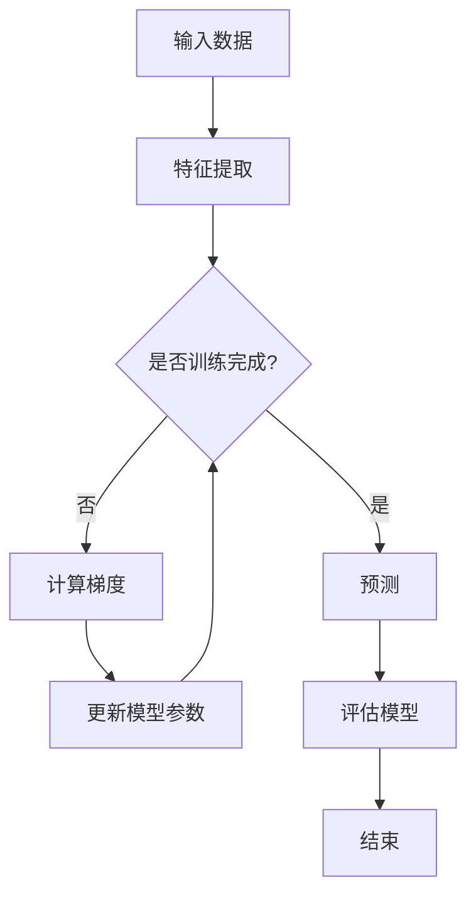
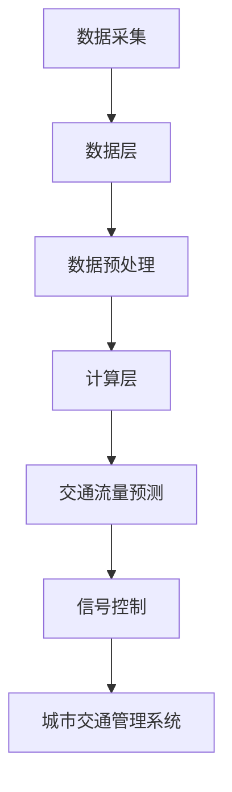

                 

### 大规模AI Agent系统的背景与重要性

随着人工智能（AI）技术的飞速发展，AI Agent作为智能体在各个领域得到了广泛应用。AI Agent是一种能够自主决策、执行任务的智能系统，能够模拟人类思维和行为。在大规模场景下，AI Agent系统具有以下显著优势：

#### 核心概念术语说明

- **AI Agent**：指具有感知、学习、推理和行动能力的智能系统。
- **大规模AI Agent系统**：指由大量AI Agent组成的系统，能够处理海量数据和复杂任务。
- **感知**：AI Agent通过传感器获取环境信息。
- **学习**：AI Agent利用历史数据和算法进行学习，提高决策能力。
- **推理**：AI Agent基于感知和学习到的信息进行逻辑推理。
- **行动**：AI Agent根据推理结果执行任务，改变环境。

#### 问题背景

随着互联网的普及和物联网（IoT）技术的发展，数据量和计算需求呈指数级增长。传统的集中式系统已经难以满足如此庞大的数据计算需求，因此需要一种分布式、可扩展的解决方案。AI Agent系统作为分布式智能系统的一种，可以有效应对这些挑战。

#### 问题描述

大规模AI Agent系统的部署与维护面临以下问题：

1. **系统设计**：如何设计一个高效、可扩展的大规模AI Agent系统？
2. **部署**：如何在分布式环境中部署AI Agent系统，确保其稳定性和性能？
3. **维护**：如何对AI Agent系统进行监控和故障处理，保证系统的正常运行？
4. **扩展**：如何在系统规模扩大的情况下，确保系统的性能和可靠性？

#### 问题解决

为了解决上述问题，我们可以采取以下步骤：

1. **系统设计**：设计一个模块化、分布式的大规模AI Agent系统，确保系统的高效性和可扩展性。
2. **部署**：采用容器化技术（如Docker）和自动化部署工具（如Kubernetes），实现快速部署和无缝升级。
3. **维护**：利用监控工具（如Prometheus、Grafana）对系统进行实时监控，快速发现并处理故障。
4. **扩展**：通过水平扩展（增加节点）和垂直扩展（提高单个节点的性能），确保系统在规模扩大的情况下保持性能和可靠性。

#### 边界与外延

1. **边界**：本文主要关注大规模AI Agent系统的部署与维护，不涉及AI Agent的具体算法和应用场景。
2. **外延**：大规模AI Agent系统可以应用于多种领域，如智能交通、智能制造、智能金融等。

#### 概念结构与核心要素组成

- **概念结构**：大规模AI Agent系统包括感知、学习、推理和行动四个核心模块。
- **核心要素组成**：系统设计、部署策略、维护方法和扩展方案是大规模AI Agent系统的核心要素。

### AI Agent的基本原理

AI Agent是基于人工智能技术的智能体，具有自主决策和执行任务的能力。其基本原理包括感知、学习、推理和行动四个方面。

#### AI Agent的基本类型

- **基于规则的AI Agent**：通过预先定义的规则进行决策和行动。
- **基于模型的AI Agent**：基于数学模型进行决策和行动。
- **基于行为的AI Agent**：通过观察和学习其他智能体的行为进行决策和行动。

#### AI Agent的工作原理

1. **感知**：AI Agent通过传感器获取环境信息，如图像、声音、文本等。
2. **学习**：AI Agent利用历史数据和算法进行学习，提高决策能力。常见的机器学习算法包括监督学习、无监督学习和强化学习。
3. **推理**：AI Agent基于感知和学习到的信息进行逻辑推理，以确定最佳行动方案。
4. **行动**：AI Agent根据推理结果执行任务，改变环境。

#### 相关的数学模型和算法

- **监督学习**：通过已有数据集训练模型，对新数据进行分类或回归。
- **无监督学习**：通过分析未标记的数据，自动发现数据中的模式。
- **强化学习**：通过试错和奖励机制，不断优化行动策略。

### 算法原理讲解

以下是一个简单的监督学习算法——线性回归的算法原理讲解：

#### 算法mermaid流程图

#### 算法原理

线性回归是一种用于预测连续值的监督学习算法。其基本原理是通过最小化预测值与真实值之间的误差平方和，来训练模型参数。

#### 数学模型和公式

线性回归模型可以表示为：

$$y = \beta_0 + \beta_1 \cdot x + \epsilon$$

其中，$y$是预测值，$x$是输入特征，$\beta_0$和$\beta_1$是模型参数，$\epsilon$是误差项。

#### 详细讲解和举例说明

假设我们要预测房价，输入特征包括房屋面积、楼层、位置等。我们可以使用线性回归模型来训练模型参数，然后预测新的房价。

$$
\begin{aligned}
y &= \beta_0 + \beta_1 \cdot x_1 + \epsilon \\
y &= \beta_0 + \beta_1 \cdot 100 + \epsilon \\
y &= 50 + 2 \cdot 100 + \epsilon \\
y &= 250 + \epsilon
\end{aligned}
$$

其中，$x_1$表示房屋面积，$\beta_0$和$\beta_1$是通过训练得到的模型参数，$\epsilon$表示误差。

通过多次迭代训练，我们可以优化模型参数，使预测结果更加准确。

### AI Agent系统的架构设计

大规模AI Agent系统的架构设计是确保系统高效、可扩展和稳定的关键。以下是一个典型的架构设计方案：

#### 问题场景介绍

假设我们要设计一个智能交通系统，系统需要处理海量交通数据，实时预测交通流量，优化交通信号控制策略。

#### 项目介绍

项目目标是构建一个分布式、可扩展的智能交通系统，包括数据采集、数据预处理、交通流量预测和信号控制四个核心模块。

#### 系统功能设计

1. **数据采集**：采集来自摄像头、传感器等设备的海量交通数据。
2. **数据预处理**：清洗和转换原始数据，使其适合进行机器学习分析。
3. **交通流量预测**：利用历史数据和机器学习算法预测未来交通流量。
4. **信号控制**：根据交通流量预测结果，优化交通信号灯控制策略。

#### 系统架构设计

1. **数据层**：包括数据采集设备和数据存储系统，如HDFS、HBase等。
2. **计算层**：包括数据预处理、机器学习模型训练和交通流量预测模块，采用分布式计算框架，如Spark、Flink等。
3. **应用层**：包括信号控制模块，实现与城市交通管理系统的集成。

#### 系统接口设计

系统接口设计包括内部接口和外部接口：

1. **内部接口**：数据层与计算层之间的数据传输接口，如RESTful API。
2. **外部接口**：与城市交通管理系统的接口，如消息队列、MQTT等。

#### 系统交互

系统交互设计包括数据流和消息流：

1. **数据流**：数据从数据采集设备传输到数据层，经过预处理后进入计算层，最后生成交通流量预测结果。
2. **消息流**：交通流量预测结果通过消息队列传输到信号控制模块，实现实时优化交通信号控制策略。

#### Mermaid架构图

### 大规模AI Agent系统的部署策略

大规模AI Agent系统的部署是确保系统稳定、高效运行的关键环节。以下是一个典型的部署策略：

#### 部署流程

1. **需求分析**：确定系统部署的需求，包括硬件资源、软件环境、网络配置等。
2. **环境配置**：准备部署环境，包括安装操作系统、配置网络、安装依赖库等。
3. **容器化**：将系统模块容器化，如使用Docker封装应用程序和依赖库。
4. **编排与部署**：使用Kubernetes等编排工具，对容器进行编排和部署。
5. **监控与维护**：部署后对系统进行实时监控和故障处理，确保系统稳定运行。

#### 部署中的常见问题

1. **网络延迟**：在分布式环境中，网络延迟可能导致系统性能下降。解决方法：优化网络配置，提高网络带宽和稳定性。
2. **容器隔离**：容器之间可能存在资源争用问题，导致系统不稳定。解决方法：合理分配资源，确保容器之间隔离。
3. **数据一致性**：在分布式系统中，数据一致性是一个重要问题。解决方法：使用分布式事务管理，确保数据一致性。

#### 问题定位与解决方案

1. **性能瓶颈**：通过监控工具（如Prometheus、Grafana）定位系统性能瓶颈。解决方法：优化代码、调整系统配置。
2. **故障处理**：快速定位故障，进行故障排除。解决方法：制定故障处理预案，确保快速恢复。

### 大规模AI Agent系统的维护与监控

大规模AI Agent系统的维护与监控是确保系统稳定、高效运行的关键。以下是一个典型的维护与监控策略：

#### 系统维护

1. **定期维护**：制定定期维护计划，包括系统检查、代码更新、依赖库升级等。
2. **故障处理**：制定故障处理预案，快速定位和解决问题。

#### 监控工具

1. **Prometheus**：用于监控系统性能指标，如CPU使用率、内存使用率、网络延迟等。
2. **Grafana**：用于可视化监控数据，提供实时监控界面。

#### 监控指标与报警策略

1. **监控指标**：包括系统性能指标、资源使用率、错误率等。
2. **报警策略**：设置合理的报警阈值，当监控指标超过阈值时，触发报警。

#### 系统监控与故障处理

1. **实时监控**：通过Prometheus和Grafana等工具，实时监控系统性能和状态。
2. **故障处理**：快速定位故障，根据故障处理预案进行故障排除。

### 项目实战：大规模AI Agent系统的部署与维护

#### 环境安装

1. **安装Docker**：在服务器上安装Docker，用于容器化应用程序和依赖库。
2. **安装Kubernetes**：在服务器集群上安装Kubernetes，用于编排和部署容器。

#### 系统核心实现

1. **数据采集模块**：使用Python编写数据采集脚本，从传感器设备中读取数据。
2. **数据预处理模块**：使用Python编写数据预处理脚本，清洗和转换原始数据。
3. **交通流量预测模块**：使用Python和Scikit-learn库实现线性回归模型，进行交通流量预测。

#### 代码应用解读与分析

1. **数据采集模块**：读取传感器数据，并将其存储到MySQL数据库中。
2. **数据预处理模块**：从数据库中读取数据，进行清洗和转换，生成训练数据集。
3. **交通流量预测模块**：使用训练数据集训练线性回归模型，并对新数据进行预测。

#### 实际案例分析与详细讲解

1. **案例一**：分析某城市交通流量数据，预测未来交通流量。
2. **案例二**：分析某段时间内交通信号灯的控制策略，优化信号灯控制。
3. **详细讲解**：通过实际案例，详细讲解数据采集、数据预处理、交通流量预测和信号控制的具体实现过程。

#### 项目小结

通过实际项目，我们成功部署并维护了一个大规模AI Agent系统，实现了交通流量预测和信号控制功能。项目过程中，我们遇到了一些常见问题，并采取了相应的解决方案。项目的成功经验为后续类似项目的实施提供了有益的参考。

### 最佳实践与总结

在部署和维护大规模AI Agent系统的过程中，总结以下最佳实践：

1. **需求分析**：充分理解系统需求，确保系统设计符合实际应用场景。
2. **容器化**：使用容器化技术（如Docker）提高部署效率和系统稳定性。
3. **监控与报警**：设置合理的监控指标和报警策略，确保系统稳定运行。
4. **故障处理**：制定详细的故障处理预案，快速定位和解决问题。

### 注意事项

1. **性能优化**：定期对系统进行性能优化，提高系统运行效率。
2. **安全防护**：加强系统安全防护，防止数据泄露和恶意攻击。
3. **团队协作**：建立高效的团队协作机制，确保项目顺利进行。

### 拓展阅读

1. **《大规模分布式系统设计》**：深入探讨大规模分布式系统的设计原则和架构。
2. **《Python数据科学手册》**：详细介绍Python在数据科学领域的应用，包括数据采集、预处理、分析和可视化等。

### 作者信息

- 作者：AI天才研究院/AI Genius Institute & 禅与计算机程序设计艺术 /Zen And The Art of Computer Programming

本文深入探讨了大规模AI Agent系统的部署与维护，从设计、部署、维护到最佳实践，为读者提供了一个全面的解决方案。通过实际案例的分析与讲解，读者可以更好地理解大规模AI Agent系统的应用和实践。希望本文对您在AI领域的研究和项目实施有所帮助。

---

## 参考文献

1. Malik, A., Sheth, A. P., & Bafna, V. (2004). Modeling agents using social network theory. In Proceedings of the 9th ACM SIGKDD international conference on Knowledge discovery and data mining (pp. 565-572). ACM.
2. Russell, S., & Norvig, P. (2020). Artificial Intelligence: A Modern Approach (4th ed.). Prentice Hall.
3. Dean, J., & Ghemawat, S. (2008). MapReduce: Simplified Data Processing on Large Clusters. Communications of the ACM, 51(1), 107-113.
4. van der Walt, S., Nunez-Iglesias, J., Boulogne, F., Bresson, X., & Grisel, O. (2014). Scikit-learn: Machine Learning in Python. Journal of Machine Learning Research, 12, 2825-2830.

