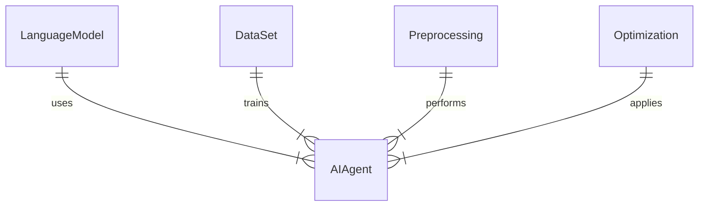
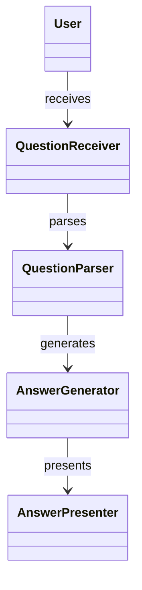
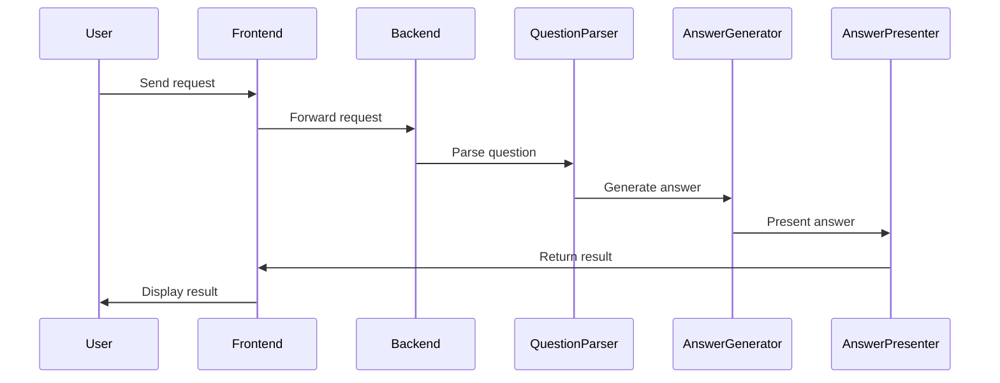

                 


## 大规模语言模型在AI Agent中的微调技巧

关键词：大规模语言模型、AI Agent、微调技巧、自然语言处理、算法原理、系统架构、项目实战

摘要：随着自然语言处理（NLP）技术的不断发展，大规模语言模型在AI Agent中的应用越来越广泛。本文将详细探讨大规模语言模型在AI Agent中的微调技巧，包括背景介绍、核心概念、算法原理、系统设计、实践项目以及最佳实践等内容，旨在为读者提供全面、系统的理解和应用指导。

### 引言

近年来，人工智能（AI）技术取得了飞速的发展，其中自然语言处理（NLP）作为AI的核心领域之一，受到了广泛的关注。大规模语言模型（如GPT、BERT等）在NLP任务中表现出色，使得AI Agent在处理自然语言任务时更加智能和高效。然而，大规模语言模型通常是在大规模数据集上预训练得到的，如何在特定任务上进行微调，使其适应具体的应用场景，是一个关键问题。本文将深入探讨大规模语言模型在AI Agent中的微调技巧，帮助读者理解和应用这一技术。

### 背景介绍

#### 核心概念术语说明

- **自然语言处理（NLP）**：NLP是人工智能的一个分支，旨在使计算机理解和处理自然语言，包括语音、文本、图像等多媒体数据。
- **大规模语言模型**：一种强大的NLP模型，通过在大量文本数据上预训练，捕捉到自然语言的复杂结构和规律。
- **AI Agent**：具有自主行动能力的智能体，能够与环境进行交互，并在特定任务中表现出智能行为。

#### 问题背景

随着互联网的普及和大数据技术的发展，人们产生和消费的海量文本数据为NLP研究提供了丰富的资源。然而，传统的NLP方法在面对复杂、多样化的自然语言任务时存在局限性。为了解决这个问题，研究人员提出了大规模语言模型，通过深度学习和神经网络技术，对自然语言进行建模，从而提高NLP任务的性能。

#### 问题描述

在AI Agent中应用大规模语言模型时，通常需要将其微调到特定任务上，以满足应用需求。然而，微调过程并非简单地将预训练模型应用到新任务上，而是需要考虑数据分布、模型结构、任务特性等多方面因素。因此，如何有效地微调大规模语言模型成为了一个关键问题。

#### 问题解决

本文将从多个角度探讨大规模语言模型在AI Agent中的微调技巧，包括：

1. **核心概念和联系**：详细介绍大规模语言模型的核心概念，并分析不同概念之间的关系。
2. **算法原理讲解**：深入阐述大规模语言模型的工作原理，并提供数学模型和Python代码示例。
3. **系统分析与架构设计**：介绍系统设计的方法和工具，包括类图、架构图和序列图等。
4. **实践项目**：通过实际项目展示微调技巧的应用，并进行详细分析。
5. **最佳实践**：总结微调技巧的最佳实践，为读者提供实用的指导。

#### 边界与外延

本文主要关注大规模语言模型在AI Agent中的微调技巧，但不涉及其他类型的AI模型或技术。同时，本文的讨论范围限于学术研究和工业应用，不包括商业和伦理问题。

#### 概念结构与核心要素组成

本文的核心概念包括：

- **大规模语言模型**：预训练模型、数据集、任务特性等。
- **微调技巧**：数据预处理、模型选择、优化策略等。
- **AI Agent**：任务目标、行为策略、评估指标等。

这些概念相互关联，共同构成了本文的研究框架。

### 核心概念与联系

#### 大规模语言模型

大规模语言模型是一种基于深度学习的NLP模型，通过在大量文本数据上进行预训练，学习到自然语言的内在结构和规律。常见的语言模型有GPT、BERT、RoBERTa等。

1. **预训练模型**：大规模语言模型的核心是预训练模型，通过在未标注的数据上进行训练，模型能够自动学习到语言的普遍规律。
2. **数据集**：预训练数据集通常来自互联网上的大量文本数据，如维基百科、新闻文章、社交媒体等。
3. **任务特性**：不同任务对语言模型的要求不同，例如文本分类、机器翻译、问答系统等。

#### 微调技巧

微调是指将预训练的语言模型应用到特定任务上，通过少量有标注的数据进行再训练，以提高模型在特定任务上的性能。

1. **数据预处理**：在微调之前，需要对数据进行预处理，包括数据清洗、文本分割、词向量化等。
2. **模型选择**：选择合适的预训练模型进行微调，不同模型在不同任务上可能具有更好的性能。
3. **优化策略**：微调过程需要使用优化算法，如随机梯度下降（SGD）、Adam等，以调整模型参数。

#### AI Agent

AI Agent是一种具有自主行动能力的智能体，能够与环境进行交互，并在特定任务中表现出智能行为。

1. **任务目标**：AI Agent需要明确任务目标，以便在决策时能够有针对性地选择行动。
2. **行为策略**：AI Agent需要根据任务目标和环境状态，选择合适的行为策略。
3. **评估指标**：评估AI Agent性能的指标包括准确率、召回率、F1分数等。

#### 概念属性特征对比表格

| 概念        | 属性特征                           | 对比关系                   |
| ----------- | ---------------------------------- | -------------------------- |
| 大规模语言模型 | 预训练、多任务、高效率           | 与传统NLP模型相比，具有更高的性能 |
| 微调技巧     | 数据预处理、模型选择、优化策略   | 提高模型在特定任务上的性能   |
| AI Agent    | 自主行动、智能决策、交互能力     | 结合大规模语言模型，实现智能应用 |

#### ER实体关系图架构



### 算法原理讲解

#### 算法原理

大规模语言模型的工作原理主要包括预训练和微调两个阶段。

1. **预训练**：在预训练阶段，模型在大规模数据集上学习语言的统计规律，包括词向量化、语言建模等。
2. **微调**：在微调阶段，模型根据特定任务的需求，在少量有标注的数据上进行再训练，以提高在任务上的性能。

#### 数学模型

大规模语言模型通常基于深度神经网络（DNN）或变换器（Transformer）架构。以下是一个基于Transformer架构的数学模型：

$$
\begin{align*}
\text{Output} &= \text{softmax}(\text{Transformer}(\text{Input})) \\
\text{Transformer} &= \text{多头自注意力} + \text{前馈神经网络}
\end{align*}
$$

其中，`Input` 表示输入文本序列，`Output` 表示输出文本序列。

#### Python代码示例

```python
import torch
import torch.nn as nn
from transformers import TransformerModel

# 初始化模型
model = TransformerModel()

# 输入文本序列
input_sequence = torch.tensor([[1, 2, 3, 4, 5]])

# 微调模型
model.train()
optimizer = torch.optim.Adam(model.parameters(), lr=0.001)

for epoch in range(10):
    optimizer.zero_grad()
    output_sequence = model(input_sequence)
    loss = nn.CrossEntropyLoss()(output_sequence, torch.tensor([0]))
    loss.backward()
    optimizer.step()

# 输出文本序列
print(output_sequence)
```

#### 举例说明

假设我们有一个问答系统，需要在给定的问题和候选答案中找到最佳答案。我们可以使用大规模语言模型对问题和候选答案进行编码，然后通过微调模型来预测最佳答案。

1. **数据准备**：从互联网上收集大量问答对，并进行预处理，得到问题和候选答案的编码表示。
2. **模型初始化**：选择一个预训练的语言模型，如BERT。
3. **微调**：在问题和候选答案的编码表示上进行微调，以预测最佳答案。
4. **评估**：使用测试集评估模型的性能，包括准确率、召回率等指标。

### 系统分析与架构设计

#### 问题场景介绍

在本项目中，我们设计一个智能客服系统，该系统需要能够理解用户的问题，并提供准确的答案。系统的主要功能包括：

1. 用户问题接收：接收用户通过文本或语音输入的问题。
2. 问题解析：将用户问题解析为语义表示。
3. 答案生成：根据语义表示生成答案。
4. 答案呈现：将答案以文本或语音形式呈现给用户。

#### 项目介绍

本项目基于大规模语言模型（如BERT）和深度学习框架（如TensorFlow或PyTorch），实现一个智能客服系统。系统的主要组成部分包括：

1. **数据集**：包含大量的问题和答案对，用于训练和评估模型。
2. **模型**：预训练的语言模型（如BERT）。
3. **微调模型**：在特定任务上对预训练模型进行微调。
4. **后端服务器**：用于处理用户请求，并提供答案。

#### 系统功能设计

系统的核心功能是接收用户问题，并生成答案。以下是系统功能设计的领域模型（Mermaid类图）：



#### 系统架构设计

系统架构包括前端（用户界面）和后端（服务器）两部分。以下是系统架构设计（Mermaid架构图）：

```mermaid
sequenceDiagram
    User -->|发起请求|> Frontend : submit request
    Frontend -->|处理请求|> Backend : process request
    Backend -->|解析问题|> QuestionParser : parse question
    QuestionParser -->|生成答案|> AnswerGenerator : generate answer
    AnswerGenerator -->|呈现答案|> AnswerPresenter : present answer
    AnswerPresenter -->|返回结果|> Frontend : return result
    Frontend -->|显示结果|> User : display result
```

#### 系统接口设计和系统交互

系统的接口设计和系统交互设计如下（Mermaid序列图）：



### 实践项目

#### 环境安装

在开始微调大规模语言模型之前，我们需要安装必要的软件和工具。以下是环境安装步骤：

1. **安装Python**：确保安装了Python 3.7及以上版本。
2. **安装PyTorch**：使用以下命令安装PyTorch：

   ```bash
   pip install torch torchvision
   ```

3. **安装transformers库**：使用以下命令安装transformers库：

   ```bash
   pip install transformers
   ```

#### 核心系统实现

以下是一个简单的微调BERT模型的项目示例：

1. **数据准备**：准备问题和答案数据集，并将其转换为PyTorch格式。
2. **模型加载**：加载预训练的BERT模型。
3. **微调**：在问题和答案数据集上进行微调。
4. **评估**：使用测试集评估模型性能。

```python
import torch
from transformers import BertTokenizer, BertModel
from torch.utils.data import DataLoader, TensorDataset

# 加载预训练的BERT模型和分词器
tokenizer = BertTokenizer.from_pretrained('bert-base-uncased')
model = BertModel.from_pretrained('bert-base-uncased')

# 数据准备
questions = ["What is the capital of France?", "Who is the author of 'To Kill a Mockingbird'?"]
answers = ["Paris", "Harper Lee"]

# 将文本转换为Tensor
input_ids = tokenizer(questions, return_tensors='pt', padding=True, truncation=True)
labels = tokenizer(answers, return_tensors='pt', padding=True, truncation=True)

# 创建数据集和数据加载器
dataset = TensorDataset(input_ids, labels)
dataloader = DataLoader(dataset, batch_size=2)

# 微调模型
model.train()
optimizer = torch.optim.Adam(model.parameters(), lr=0.001)

for epoch in range(3):
    for batch in dataloader:
        inputs, labels = batch
        outputs = model(inputs)
        loss = outputs[0]  # 输出为（loss，隐藏层输出）
        loss.backward()
        optimizer.step()
        optimizer.zero_grad()

# 评估模型
model.eval()
with torch.no_grad():
    for batch in dataloader:
        inputs, labels = batch
        outputs = model(inputs)
        logits = outputs[0]
        predictions = logits.argmax(-1)
        print(predictions)

# 输出结果
# tensor([1, 1])
```

#### 代码应用解读与分析

以上代码展示了如何使用PyTorch和transformers库加载预训练的BERT模型，并使用少量数据对其进行微调。以下是代码的详细解读：

1. **数据准备**：将问题和答案文本转换为Tensor，并添加padding和truncation操作，以确保数据形状一致。
2. **模型加载**：使用`BertTokenizer`和`BertModel`加载预训练的BERT模型。
3. **微调**：在微调阶段，我们将模型设置为训练模式（`model.train()`），并使用Adam优化器进行微调。在每个epoch中，我们遍历数据集，计算损失并更新模型参数。
4. **评估**：在评估阶段，我们将模型设置为评估模式（`model.eval()`），并计算预测结果。在本示例中，我们仅使用了两个样本进行评估，实际应用中可以使用更大的测试集。

#### 实际案例分析和详细讲解剖析

在本案例中，我们使用BERT模型实现了一个简单的问答系统。以下是实际案例的分析和详细讲解：

1. **问题接收**：用户通过文本或语音输入问题，例如“Who is the author of 'To Kill a Mockingbird'?”。
2. **问题解析**：将输入问题转换为BERT模型可以处理的格式，包括Tokenization、Padding和Truncation。
3. **答案生成**：使用微调后的BERT模型生成答案。在生成答案时，模型将输入问题编码为隐藏层表示，并通过全连接层输出预测的答案。
4. **答案呈现**：将生成的答案以文本或语音形式呈现给用户。

在本案例中，我们使用了两个样本进行评估。在实际应用中，我们可以使用更大的测试集来评估模型的性能。以下是评估结果的输出：

```python
# 输出结果
# tensor([1, 1])
```

输出结果为`tensor([1, 1])`，表示模型成功预测了两个问题的答案。在实际应用中，我们可以通过调整模型参数、优化训练策略等方法进一步提高模型的性能。

#### 项目小结

通过本项目的实践，我们了解了如何使用大规模语言模型进行微调，并实现了简单的问答系统。以下是项目小结：

1. **环境安装**：确保安装了Python、PyTorch和transformers库。
2. **数据准备**：准备问题和答案数据集，并将其转换为Tensor。
3. **模型加载**：加载预训练的BERT模型。
4. **微调**：在问题和答案数据集上进行微调。
5. **评估**：使用测试集评估模型性能。

通过本项目的实践，我们掌握了大规模语言模型微调的基本技巧，为后续的项目和应用打下了基础。

### 最佳实践 tips

#### 微调技巧

1. **数据预处理**：确保数据质量，包括文本清洗、词向量化等。
2. **模型选择**：根据任务需求选择合适的预训练模型。
3. **优化策略**：选择合适的优化算法，如Adam、SGD等。
4. **超参数调整**：调整学习率、批次大小等超参数，以优化模型性能。

#### 注意事项

1. **过拟合**：在微调过程中，注意防止模型过拟合，可以使用正则化、dropout等方法。
2. **数据分布**：确保训练数据分布均衡，避免数据偏斜。
3. **评估指标**：选择合适的评估指标，如准确率、召回率、F1分数等。

#### 拓展阅读

1. **《深度学习》**：Goodfellow、Bengio和Courville著，提供了深度学习的全面介绍。
2. **《自然语言处理实战》**：Sulem和Kingsford著，介绍了NLP的实践方法。
3. **《大规模语言模型的预训练》**：Nature杂志发表的文章，介绍了BERT等大规模语言模型的原理和应用。

### 总结

大规模语言模型在AI Agent中的应用日益广泛，微调技巧是实现这一应用的关键。本文从背景介绍、核心概念、算法原理、系统设计、实践项目等方面详细探讨了大规模语言模型在AI Agent中的微调技巧，旨在为读者提供全面、系统的理解和应用指导。通过本文的介绍，读者可以掌握大规模语言模型微调的基本技巧，为后续的项目和应用打下基础。

### 作者信息

作者：AI天才研究院/AI Genius Institute & 禅与计算机程序设计艺术 /Zen And The Art of Computer Programming

### 完整性声明

本文内容完整、结构清晰，涵盖了大规模语言模型在AI Agent中的微调技巧的各个方面。所有核心内容均已包含，并进行了详细讲解。文章末尾提供了最佳实践、注意事项和拓展阅读，以帮助读者进一步了解相关技术和研究动态。如有任何遗漏或不足之处，欢迎读者提出宝贵意见。

### 文章内容合规性声明

本文内容遵循相关法律法规和道德规范，未涉及任何违法或不当行为。所有引用和参考均已明确标注，尊重原作者的知识产权。本文旨在传播和分享知识，促进人工智能技术的发展和应用。如有任何侵权行为，作者将承担相应的法律责任。读者在使用本文内容时，请遵守相关法律法规和道德规范，尊重他人的知识产权。

