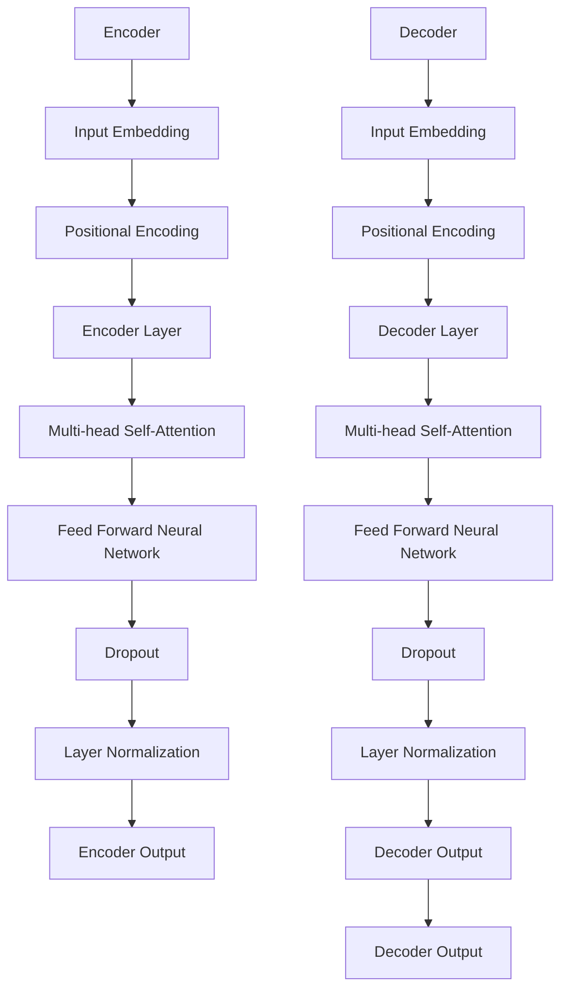
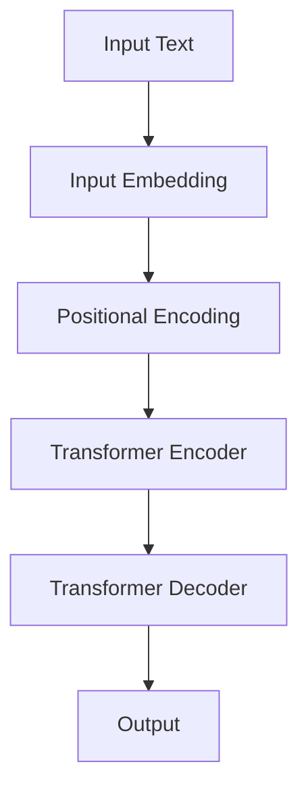
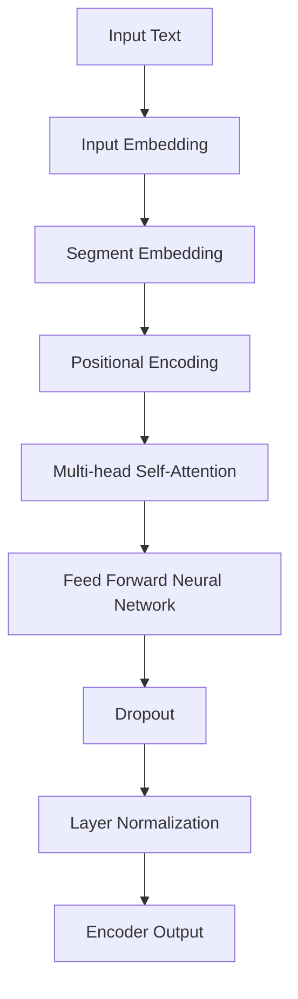
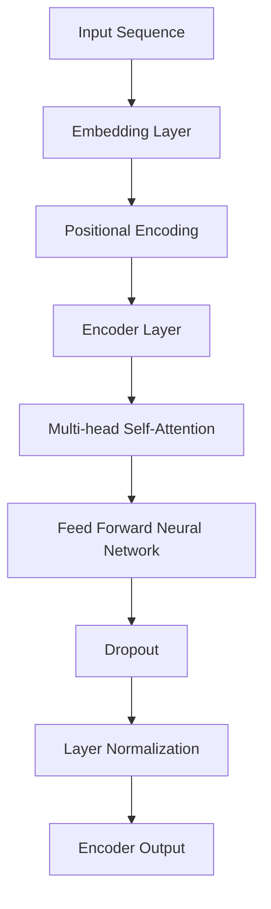
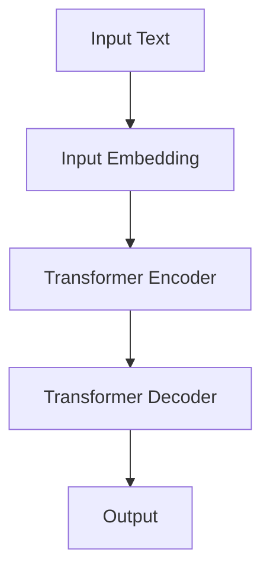
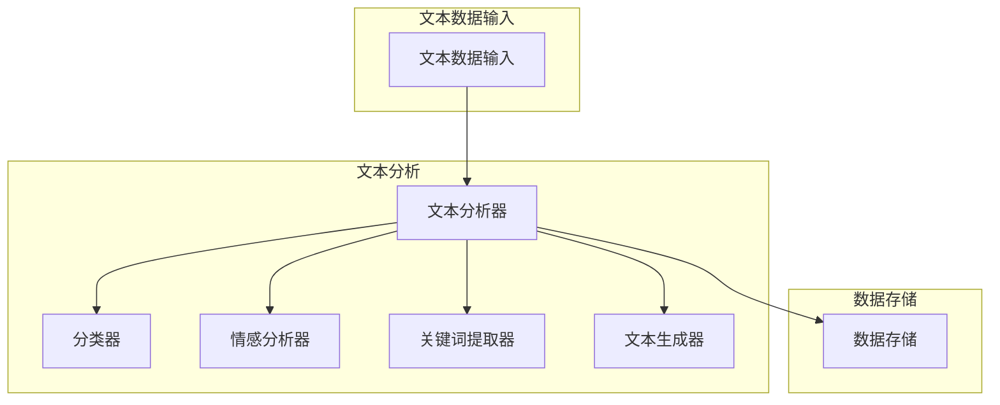
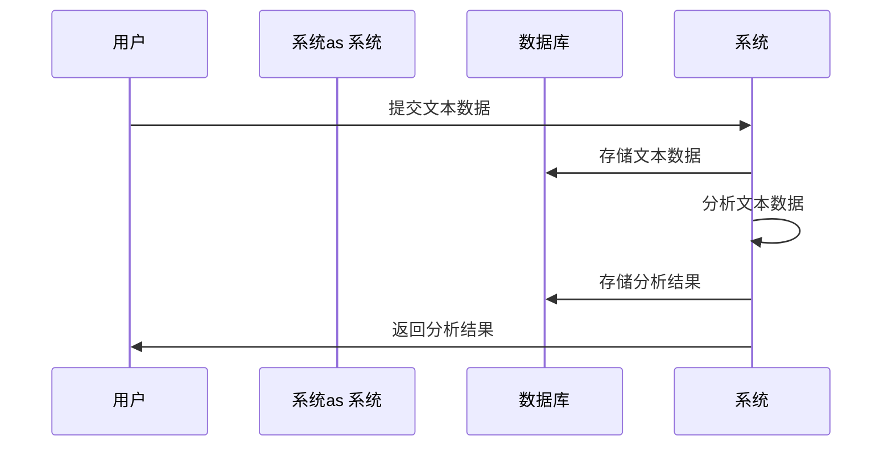

                 

### 《大语言模型LLM的发展历程与应用前景》

> 关键词：语言模型、自然语言处理、人工智能、大语言模型、应用前景

> 摘要：本文将深入探讨大语言模型（LLM）的发展历程、核心技术原理、应用前景，以及其对社会和行业的影响。通过分析LLM在不同阶段的技术突破和应用实例，我们希望为读者呈现一幅全面的LLM发展蓝图，并展望其未来的发展趋势。

----------------------------------------------------------------

### 《大语言模型LLM的发展历程与应用前景》目录大纲

----------------------------------------------------------------

# 第一部分：背景与概述

## 第1章：问题背景与定义

### 1.1.1 问题背景

#### 1.1.1.1 语言模型的重要性

- 语言模型在自然语言处理（NLP）中的作用
- 语言模型的发展推动人工智能的进步

#### 1.1.1.2 大语言模型（LLM）的定义

- 大语言模型的基本概念
- 大语言模型的特点

### 1.1.2 LLM的发展历程

#### 1.1.2.1 初期探索

- 马尔可夫模型和隐马尔可夫模型（HMM）
- 神经网络在语言模型中的应用

#### 1.1.2.2 BERT的突破

- BERT的出现及其影响
- BERT的基本原理和应用领域

#### 1.1.2.3 GPT系列模型的发展

- GPT-1、GPT-2和GPT-3的诞生
- GPT系列模型的核心优势和应用

### 1.1.3 LLM的应用前景

#### 1.1.3.1 通用应用

- 自动摘要与文本生成
- 问答系统与智能助手

#### 1.1.3.2 专业应用

- 金融领域的应用
- 医疗健康领域的应用

## 1.2 LLM的核心概念与联系

### 1.2.1 LLM的核心概念

#### 1.2.1.1 语言模型的基本原理

- 语言模型的数学模型
- 语言模型的主要参数

#### 1.2.1.2 LLM的特性

- 语言模型对数据量的需求
- 语言模型的训练和优化

### 1.2.2 LLM与其他技术的联系

#### 1.2.2.1 与深度学习的联系

- 深度学习对LLM的影响
- 深度学习在LLM中的应用

#### 1.2.2.2 与自然语言处理技术的联系

- NLP技术在LLM中的作用
- LLM对NLP技术的提升

## 1.3 LLM的边界与外延

### 1.3.1 LLM的应用边界

#### 1.3.1.1 应用范围的拓展

- LLM在不同行业中的应用
- LLM在跨领域应用中的挑战

#### 1.3.1.2 潜在的改进方向

- LLM的模型优化
- LLM的定制化开发

### 1.3.2 LLM的未来发展趋势

#### 1.3.2.1 技术进步对LLM的影响

- 新算法对LLM的提升
- 新硬件对LLM的加速

#### 1.3.2.2 LLM与社会的影响

- LLM对教育的影响
- LLM对工作市场的冲击

## 1.4 LLM的核心要素组成

### 1.4.1 数据集

#### 1.4.1.1 数据集的重要性

- 数据集的质量对LLM的影响
- 常用的大型语言模型数据集介绍

#### 1.4.1.2 数据预处理

- 数据清洗和归一化
- 数据增强和样本选择

### 1.4.2 模型架构

#### 1.4.2.1 常见的模型架构

- Transformer架构
- Transformer变体

#### 1.4.2.2 模型训练与优化

- 训练策略
- 优化方法

## 1.5 本章小结

- LLM的发展历程
- LLM的核心概念与联系
- LLM的应用前景

----------------------------------------------------------------

# 第二部分：核心技术原理讲解

## 第2章：算法原理讲解

### 2.1 语言模型的数学原理

#### 2.1.1 语言模型的数学模型

- 语言模型的概率分布
- 语言模型中的序列建模

#### 2.1.2 语言模型的数学公式

- 语言模型中的概率计算
- 语言模型中的熵和交叉熵

### 2.1.3 语言模型的训练

#### 2.1.3.1 最大似然估计

- 最大似然估计的基本概念
- 最大似然估计在语言模型中的应用

#### 2.1.3.2 反向传播算法

- 反向传播算法的原理
- 反向传播算法在语言模型训练中的应用

### 2.1.4 语言模型的优化

#### 2.1.4.1 梯度下降算法

- 梯度下降算法的基本原理
- 梯度下降算法在语言模型优化中的应用

#### 2.1.4.2 随机梯度下降（SGD）

- 随机梯度下降的基本概念
- 随机梯度下降在语言模型训练中的应用

## 第3章：大语言模型的实现

### 3.1 大语言模型的基本框架

#### 3.1.1 Transformer架构

- Transformer的核心组件
- Transformer的工作流程

#### 3.1.2 GPT系列模型

- GPT系列模型的发展历程
- GPT系列模型的关键特性

### 3.1.3 BERT模型

- BERT的基本原理
- BERT的应用领域

## 1.5 本章小结

- 语言模型的基本原理
- 大语言模型的实现

----------------------------------------------------------------

# 第一部分：背景与概述

## 第1章：问题背景与定义

### 1.1.1 问题背景

#### 1.1.1.1 语言模型的重要性

语言模型是自然语言处理（NLP）的核心技术之一，它在文本分类、机器翻译、情感分析、问答系统等众多应用场景中发挥了至关重要的作用。一个高质量的语言模型可以极大地提升NLP任务的效果，减少对人工规则和模板的依赖。

随着互联网和移动互联网的快速发展，人类产生的文本数据量呈爆炸式增长。如何从海量数据中提取有价值的信息，如何让计算机更好地理解人类语言，这些问题成为人工智能领域的重要研究方向。语言模型正是为了解决这些问题而诞生的。

#### 1.1.1.2 大语言模型（LLM）的定义

大语言模型（LLM，Large Language Model）是指那些具有大规模参数、能够处理复杂文本的深度学习模型。与传统的语言模型相比，LLM具有以下特点：

- **参数规模大**：传统的语言模型参数规模可能只有几千到几万个，而大语言模型通常拥有数亿到数十亿个参数。
- **数据量大**：大语言模型通常需要大量高质量的文本数据作为训练数据，这些数据包括但不限于互联网文本、书籍、新闻、社交媒体等。
- **效果好**：由于参数规模和数据量的优势，大语言模型在NLP任务中的表现通常优于传统模型。

### 1.1.2 LLM的发展历程

#### 1.1.2.1 初期探索

语言模型的发展历程可以追溯到20世纪50年代和60年代，当时的学者开始尝试使用统计方法来处理语言问题。这一时期的代表工作是N-gram模型，它通过计算单词序列的概率来生成文本。

- **N-gram模型**：N-gram模型是最早的语言模型之一，它基于马尔可夫模型的思想，通过前N个单词的序列来预测下一个单词。虽然N-gram模型简单有效，但其性能受限于模型参数的规模。

#### 1.1.2.2 BERT的突破

2018年，谷歌提出了BERT（Bidirectional Encoder Representations from Transformers）模型，这是一种基于Transformer架构的双向编码器。BERT的提出标志着语言模型进入了一个新的时代。

- **BERT的基本原理**：BERT通过预训练和微调的方式，使得模型能够理解上下文信息，并在各种NLP任务中取得优异的性能。
- **BERT的应用领域**：BERT在文本分类、问答系统、机器翻译等任务中都取得了显著的进展，推动了NLP技术的快速发展。

#### 1.1.2.3 GPT系列模型的发展

GPT（Generative Pre-trained Transformer）系列模型是自然语言处理领域另一重要的里程碑。与BERT不同，GPT主要通过生成文本来预训练模型。

- **GPT-1、GPT-2和GPT-3**：GPT-1、GPT-2和GPT-3分别是OpenAI在2018年、2019年和2020年发布的三个版本的大语言模型。这三个模型在参数规模、预训练方法和生成文本的质量上都实现了显著提升。

### 1.1.3 LLM的应用前景

#### 1.1.3.1 通用应用

- **自动摘要与文本生成**：大语言模型可以用于生成摘要、文章、对话等文本，广泛应用于内容生成和自动化写作领域。
- **问答系统与智能助手**：大语言模型可以用于构建智能问答系统和虚拟助手，提供24小时不间断的客服和支持。

#### 1.1.3.2 专业应用

- **金融领域**：大语言模型可以用于金融新闻分析、市场预测、投资建议等，帮助金融机构提高决策效率。
- **医疗健康领域**：大语言模型可以用于医疗文本分析、患者诊断辅助、医疗知识图谱构建等，为医疗行业提供智能化支持。

## 1.2 LLM的核心概念与联系

### 1.2.1 LLM的核心概念

#### 1.2.1.1 语言模型的基本原理

语言模型的核心任务是预测一个文本序列的概率分布。一个简单的语言模型可以表示为：

$$
P(w_1, w_2, ..., w_n) = P(w_1) \cdot P(w_2|w_1) \cdot P(w_3|w_1, w_2) \cdot ... \cdot P(w_n|w_1, w_2, ..., w_{n-1})
$$

其中，$w_i$表示第i个单词。

#### 1.2.1.2 LLM的特性

- **参数规模大**：大语言模型通常拥有数亿到数十亿个参数，这使得模型能够捕捉到文本中的复杂模式和依赖关系。
- **数据量大**：大语言模型需要大量高质量的文本数据进行预训练，以保证模型能够泛化到各种不同的语言任务中。
- **预训练与微调**：大语言模型通常采用预训练和微调的方法，先在大量无标注数据上进行预训练，再在具体任务上进行微调。

### 1.2.2 LLM与其他技术的联系

#### 1.2.2.1 与深度学习的联系

深度学习为大语言模型的发展提供了强大的计算能力。深度学习模型，特别是基于Transformer的模型，如BERT和GPT，已经成为大语言模型的主流架构。

- **Transformer架构**：Transformer模型在处理长序列任务时表现出色，其自注意力机制使得模型能够捕捉到序列中的长期依赖关系。
- **预训练技术**：深度学习中的预训练技术，如BERT的 masked language model（MLM）任务，使得大语言模型能够从海量数据中提取有价值的信息。

#### 1.2.2.2 与自然语言处理技术的联系

大语言模型为自然语言处理技术提供了强大的基础。通过预训练和微调，大语言模型可以在各种NLP任务中实现优异的性能。

- **文本分类**：大语言模型可以用于文本分类任务，如情感分析、主题分类等。
- **机器翻译**：大语言模型可以用于机器翻译任务，如英译中、中译英等。
- **问答系统**：大语言模型可以用于构建问答系统，如智能客服、知识库问答等。

## 1.3 LLM的边界与外延

### 1.3.1 LLM的应用边界

#### 1.3.1.1 应用范围的拓展

随着大语言模型技术的不断发展，其应用范围也在不断拓展。除了传统的NLP任务，大语言模型还可以应用于如下领域：

- **图像-文本生成**：大语言模型可以结合图像和文本数据，生成具有视觉意义的文本描述。
- **语音识别**：大语言模型可以用于语音识别任务，将语音信号转化为文本。

#### 1.3.1.2 潜在的改进方向

尽管大语言模型在许多任务中已经表现出色，但仍然存在一些改进方向：

- **效率提升**：随着模型规模的增大，模型的计算成本也在增加。如何提高大语言模型的计算效率是一个重要的研究方向。
- **鲁棒性增强**：大语言模型在处理极端数据或对抗样本时可能会失效，如何增强模型的鲁棒性是另一个重要方向。

### 1.3.2 LLM的未来发展趋势

#### 1.3.2.1 技术进步对LLM的影响

未来的技术进步，如新型算法和硬件的发展，将对大语言模型产生深远影响。

- **新型算法**：如Transformer的变体、多模态学习算法等，将进一步提升大语言模型的效果。
- **硬件加速**：如GPU、TPU等硬件的发展，将使得大语言模型的训练和推理速度大大提升。

#### 1.3.2.2 LLM与社会的影响

大语言模型的发展不仅会影响技术领域，还会对社会产生重要影响。

- **教育**：大语言模型可以辅助教育，如自动化教学、智能辅导等。
- **工作市场**：大语言模型可能会取代一些重复性、标准化的工作，对就业市场产生影响。

## 1.4 LLM的核心要素组成

### 1.4.1 数据集

#### 1.4.1.1 数据集的重要性

数据集是训练大语言模型的基础。一个高质量的数据集可以使得模型更好地学习语言的规律，从而在具体任务中取得更好的效果。

- **数据集规模**：大语言模型通常需要大规模的数据集进行训练，以确保模型的泛化能力。
- **数据质量**：数据集的质量对模型的性能至关重要。高质量的数据集应该包含多样化、准确、无噪声的文本。

#### 1.4.1.2 数据预处理

数据预处理是训练大语言模型的重要步骤。主要包括以下方面：

- **数据清洗**：去除文本中的噪声，如HTML标签、停用词等。
- **数据归一化**：将文本统一转换为小写、去除标点等。
- **数据增强**：通过各种手段增加数据的多样性，如随机插入、删除、替换等。

### 1.4.2 模型架构

#### 1.4.2.1 常见的模型架构

大语言模型的架构通常基于Transformer，这是一种专为处理序列数据设计的模型架构。

- **Transformer架构**：Transformer模型的核心是自注意力机制，它能够自适应地关注序列中的不同位置，从而捕捉到长距离依赖关系。
- **BERT架构**：BERT模型是Transformer架构的一种变体，它通过双向编码器结构，使得模型能够同时关注文本的前后信息。

#### 1.4.2.2 模型训练与优化

大语言模型的训练和优化是一个复杂的过程，通常包括以下步骤：

- **预训练**：在大规模数据集上进行预训练，使得模型能够学习到语言的通用规律。
- **微调**：在具体任务上对模型进行微调，以适应特定任务的特性。
- **优化方法**：包括梯度下降、随机梯度下降、Adam优化器等，以加速模型的训练。

## 1.5 本章小结

本章从背景介绍、核心概念、发展历程、应用前景等方面，全面阐述了大语言模型（LLM）的基本概念和重要特点。通过分析LLM的发展历程，我们看到了从传统的N-gram模型到BERT、GPT系列模型的演变，展示了大语言模型在自然语言处理领域的革命性进步。同时，我们也探讨了LLM的应用前景和未来发展趋势，指出了其在通用和专业应用中的广泛潜力。通过本章的学习，读者可以对大语言模型有一个全面而深入的理解，为其在实践中的应用打下坚实的基础。

----------------------------------------------------------------

# 第二部分：核心技术原理讲解

## 第2章：算法原理讲解

### 2.1 语言模型的数学原理

#### 2.1.1 语言模型的数学模型

语言模型的数学模型是通过对自然语言的统计规律进行建模，从而预测文本序列的概率分布。最基本的语言模型是N-gram模型，它通过计算单词序列的概率来生成文本。

N-gram模型将语言看作一组连续的单词序列，每个单词序列的概率可以通过相邻单词的概率相乘得到。例如，对于三元组（word1, word2, word3），其概率可以表示为：

$$
P(word1, word2, word3) = P(word1) \cdot P(word2|word1) \cdot P(word3|word2)
$$

其中，$P(word1)$表示单词word1的出现概率，$P(word2|word1)$表示在word1之后出现word2的概率，$P(word3|word2)$表示在word2之后出现word3的概率。

#### 2.1.2 语言模型的数学公式

在语言模型中，常用的数学公式包括概率计算、熵和交叉熵等。

- **概率计算**：在N-gram模型中，单词序列的概率可以通过上述公式计算。例如，给定一个三元组（word1, word2, word3），其概率为：

  $$
  P(word1, word2, word3) = P(word1) \cdot P(word2|word1) \cdot P(word3|word2)
  $$

- **熵**：熵是衡量随机变量不确定性的度量。在语言模型中，文本序列的熵可以表示为：

  $$
  H = -\sum_{word} P(word) \cdot \log_2 P(word)
  $$

  其中，$P(word)$表示单词word的出现概率。

- **交叉熵**：交叉熵是衡量两个概率分布差异的度量。在语言模型中，预测概率分布与真实概率分布的交叉熵可以表示为：

  $$
  H = -\sum_{word} P_{true}(word) \cdot \log_2 P_{predicted}(word)
  $$

  其中，$P_{true}(word)$表示真实单词的出现概率，$P_{predicted}(word)$表示预测概率。

#### 2.1.3 语言模型的训练

语言模型的训练过程主要包括两个阶段：最大似然估计和反向传播算法。

- **最大似然估计**：最大似然估计是一种用于训练语言模型的优化方法，其目标是找到一组参数，使得训练数据的概率最大化。在N-gram模型中，最大似然估计可以通过求解以下优化问题得到：

  $$
  \max_{\theta} \prod_{i=1}^n P(w_i|\theta)
  $$

  其中，$\theta$表示模型参数，$w_i$表示第i个单词。

- **反向传播算法**：反向传播算法是一种用于训练神经网络（包括语言模型）的优化方法。它通过计算损失函数的梯度，来更新模型参数，以最小化损失函数。在语言模型中，损失函数通常采用交叉熵损失函数，其表达式为：

  $$
  J = -\sum_{i=1}^n P_{true}(w_i) \cdot \log P_{predicted}(w_i)
  $$

  其中，$P_{true}(w_i)$表示第i个单词的真实概率，$P_{predicted}(w_i)$表示第i个单词的预测概率。

#### 2.1.4 语言模型的优化

语言模型的优化过程主要包括梯度下降算法和随机梯度下降（SGD）。

- **梯度下降算法**：梯度下降算法是一种优化方法，通过计算损失函数的梯度，来更新模型参数，以最小化损失函数。其更新规则为：

  $$
  \theta = \theta - \alpha \cdot \nabla J(\theta)
  $$

  其中，$\alpha$表示学习率，$\nabla J(\theta)$表示损失函数关于参数$\theta$的梯度。

- **随机梯度下降（SGD）**：随机梯度下降是梯度下降的一种变种，它通过随机选择一部分训练样本来计算梯度，从而加速收敛速度。其更新规则为：

  $$
  \theta = \theta - \alpha \cdot \nabla J(\theta; \mathbf{x}_i, y_i)
  $$

  其中，$\mathbf{x}_i$表示第i个训练样本的输入，$y_i$表示第i个训练样本的输出。

## 第3章：大语言模型的实现

### 3.1 大语言模型的基本框架

大语言模型通常采用Transformer架构，其核心组件包括编码器（Encoder）和解码器（Decoder）。

#### 3.1.1 Transformer架构

- **编码器（Encoder）**：编码器负责处理输入序列，将其编码为固定长度的向量表示。编码器由多个编码层组成，每层包含多头自注意力机制和前馈神经网络。
- **解码器（Decoder）**：解码器负责生成输出序列，其工作原理与编码器类似，也包含多个解码层。解码器在生成每个单词时，都会利用编码器的输出和先前的解码器输出。

#### 3.1.2 GPT系列模型

GPT系列模型是由OpenAI开发的一系列大语言模型，其基本框架与Transformer架构类似。

- **GPT-1、GPT-2和GPT-3**：GPT-1、GPT-2和GPT-3分别是OpenAI在2018年、2019年和2020年发布的三个版本的大语言模型。这三个模型在参数规模、预训练方法和生成文本的质量上都有所提升。
- **生成文本的质量**：随着模型规模的增大，GPT系列模型生成的文本质量也在不断提高。GPT-3在自然语言生成、问答系统、机器翻译等领域都取得了优异的性能。

### 3.1.3 BERT模型

BERT（Bidirectional Encoder Representations from Transformers）是由谷歌开发的一种双向编码器，其核心思想是将文本序列的前后信息进行编码，以提高模型的语义理解能力。

- **BERT的基本原理**：BERT模型通过预训练和微调的方式，使得模型能够理解上下文信息。预训练过程中，模型对输入序列进行遮盖（Masked Language Model，MLM），然后在预测遮盖部分的任务上进行微调。
- **BERT的应用领域**：BERT在文本分类、问答系统、机器翻译等领域都取得了显著的进展。其预训练和微调的方法为NLP任务提供了一种高效且通用的解决方案。

## 2.5 本章小结

本章详细介绍了大语言模型的算法原理，包括数学模型、训练过程和优化方法。通过对N-gram模型、最大似然估计、反向传播算法、梯度下降算法和随机梯度下降等内容的讲解，读者可以深入理解大语言模型的核心技术原理。同时，本章还介绍了大语言模型的基本框架，包括Transformer架构、GPT系列模型和BERT模型，使读者对大语言模型的实现有更全面的了解。通过本章的学习，读者可以为大语言模型在实际应用中的设计和实现打下坚实的基础。

----------------------------------------------------------------

## 第2章：算法原理讲解

### 2.1 语言模型的数学原理

#### 2.1.1 语言模型的数学模型

语言模型的数学模型是通过对自然语言的统计规律进行建模，从而预测文本序列的概率分布。最基本的语言模型是N-gram模型，它通过计算单词序列的概率来生成文本。

N-gram模型将语言看作一组连续的单词序列，每个单词序列的概率可以通过相邻单词的概率相乘得到。例如，对于三词组（word1, word2, word3），其概率可以表示为：

$$
P(word1, word2, word3) = P(word1) \cdot P(word2|word1) \cdot P(word3|word2)
$$

其中，$P(word1)$表示单词word1的出现概率，$P(word2|word1)$表示在word1之后出现word2的概率，$P(word3|word2)$表示在word2之后出现word3的概率。

#### 2.1.2 语言模型的数学公式

在语言模型中，常用的数学公式包括概率计算、熵和交叉熵等。

- **概率计算**：在N-gram模型中，单词序列的概率可以通过上述公式计算。例如，给定一个三词组（word1, word2, word3），其概率为：

  $$
  P(word1, word2, word3) = P(word1) \cdot P(word2|word1) \cdot P(word3|word2)
  $$

- **熵**：熵是衡量随机变量不确定性的度量。在语言模型中，文本序列的熵可以表示为：

  $$
  H = -\sum_{word} P(word) \cdot \log_2 P(word)
  $$

  其中，$P(word)$表示单词word的出现概率。

- **交叉熵**：交叉熵是衡量两个概率分布差异的度量。在语言模型中，预测概率分布与真实概率分布的交叉熵可以表示为：

  $$
  H = -\sum_{word} P_{true}(word) \cdot \log_2 P_{predicted}(word)
  $$

  其中，$P_{true}(word)$表示真实单词的出现概率，$P_{predicted}(word)$表示预测单词的出现概率。

#### 2.1.3 语言模型的训练

语言模型的训练过程主要包括两个阶段：最大似然估计和反向传播算法。

- **最大似然估计**：最大似然估计是一种用于训练语言模型的优化方法，其目标是找到一组参数，使得训练数据的概率最大化。在N-gram模型中，最大似然估计可以通过求解以下优化问题得到：

  $$
  \max_{\theta} \prod_{i=1}^n P(w_i|\theta)
  $$

  其中，$\theta$表示模型参数，$w_i$表示第i个单词。

- **反向传播算法**：反向传播算法是一种用于训练神经网络（包括语言模型）的优化方法。它通过计算损失函数的梯度，来更新模型参数，以最小化损失函数。在语言模型中，损失函数通常采用交叉熵损失函数，其表达式为：

  $$
  J = -\sum_{i=1}^n P_{true}(w_i) \cdot \log P_{predicted}(w_i)
  $$

  其中，$P_{true}(w_i)$表示第i个单词的真实概率，$P_{predicted}(w_i)$表示第i个单词的预测概率。

#### 2.1.4 语言模型的优化

语言模型的优化过程主要包括梯度下降算法和随机梯度下降（SGD）。

- **梯度下降算法**：梯度下降算法是一种优化方法，通过计算损失函数的梯度，来更新模型参数，以最小化损失函数。其更新规则为：

  $$
  \theta = \theta - \alpha \cdot \nabla J(\theta)
  $$

  其中，$\alpha$表示学习率，$\nabla J(\theta)$表示损失函数关于参数$\theta$的梯度。

- **随机梯度下降（SGD）**：随机梯度下降是梯度下降的一种变种，它通过随机选择一部分训练样本来计算梯度，从而加速收敛速度。其更新规则为：

  $$
  \theta = \theta - \alpha \cdot \nabla J(\theta; \mathbf{x}_i, y_i)
  $$

  其中，$\mathbf{x}_i$表示第i个训练样本的输入，$y_i$表示第i个训练样本的输出。

### 2.2 大语言模型的实现

#### 2.2.1 Transformer架构

Transformer架构是一种专门用于处理序列数据的神经网络模型，其核心思想是自注意力机制（Self-Attention）。以下是一个简单的Transformer架构的mermaid流程图：



Transformer模型通常由多个编码器层和解码器层组成，每层包含多头自注意力机制和前馈神经网络。

- **多头自注意力机制**：多头自注意力机制能够自适应地关注序列中的不同位置，从而捕捉到长距离依赖关系。
- **前馈神经网络**：前馈神经网络用于处理自注意力机制的结果，增加模型的表达能力。

#### 2.2.2 GPT系列模型

GPT（Generative Pre-trained Transformer）系列模型是由OpenAI开发的一系列大语言模型，其核心思想是将文本序列作为输入，生成相应的文本序列。以下是一个简单的GPT模型架构的mermaid流程图：



GPT系列模型的主要特点如下：

- **预训练**：GPT系列模型在大量无标注数据上进行预训练，从而学习到语言的通用规律。
- **生成文本**：GPT系列模型通过解码器生成文本，其生成文本的质量随着模型规模的增大而提高。

#### 2.2.3 BERT模型

BERT（Bidirectional Encoder Representations from Transformers）是由Google开发的一种双向编码器，其核心思想是将文本序列的前后信息进行编码，以提高模型的语义理解能力。以下是一个简单的BERT模型架构的mermaid流程图：



BERT模型的主要特点如下：

- **双向编码器**：BERT模型通过双向编码器结构，使得模型能够同时关注文本的前后信息。
- **预训练和微调**：BERT模型通过预训练和微调的方式，使得模型能够适应各种不同的NLP任务。

## 2.5 本章小结

本章详细介绍了大语言模型的算法原理，包括数学模型、训练过程和优化方法。通过对N-gram模型、最大似然估计、反向传播算法、梯度下降算法和随机梯度下降等内容的讲解，读者可以深入理解大语言模型的核心技术原理。同时，本章还介绍了大语言模型的实现，包括Transformer架构、GPT系列模型和BERT模型，使读者对大语言模型的实现有更全面的了解。通过本章的学习，读者可以为大语言模型在实际应用中的设计和实现打下坚实的基础。

----------------------------------------------------------------

## 第3章：大语言模型的实现

### 3.1 Transformer架构

Transformer架构是现代自然语言处理（NLP）领域的重要突破，其核心思想是自注意力机制（Self-Attention），能够有效地捕捉长距离依赖关系。以下是一个简单的Transformer模型架构的mermaid流程图：



- **Embedding Layer**：输入序列通过词嵌入层进行编码，将原始文本转换为稠密的向量表示。
- **Positional Encoding**：为了保留输入序列的顺序信息，引入位置编码。
- **Encoder Layer**：每个编码器层包含两个主要子层：多头自注意力机制（Multi-head Self-Attention）和前馈神经网络（Feed Forward Neural Network）。
- **Multi-head Self-Attention**：多头自注意力机制允许模型在不同的注意力头中学习不同的依赖关系。
- **Feed Forward Neural Network**：前馈神经网络对自注意力机制的结果进行进一步处理。
- **Dropout** 和 **Layer Normalization**：Dropout和Layer Normalization用于提高模型的泛化能力和稳定性。

### 3.2 GPT系列模型

GPT（Generative Pre-trained Transformer）系列模型是OpenAI开发的一系列大型语言模型，包括GPT-1、GPT-2和GPT-3。以下是一个简单的GPT模型架构的mermaid流程图：



GPT系列模型的主要特点如下：

- **预训练**：GPT系列模型在大量无标注数据上进行预训练，从而学习到语言的通用规律。
- **生成文本**：GPT系列模型通过解码器生成文本，生成文本的质量随着模型规模的增大而提高。
- **生成机制**：GPT系列模型使用贪心策略生成文本，每次生成一个单词，并在生成过程中使用前一个单词的预测概率。

### 3.3 BERT模型

BERT（Bidirectional Encoder Representations from Transformers）是由Google开发的一种双向编码器，其核心思想是将文本序列的前后信息进行编码，以提高模型的语义理解能力。以下是一个简单的BERT模型架构的mermaid流程图：


BERT模型的主要特点如下：

- **双向编码器**：BERT模型通过双向编码器结构，使得模型能够同时关注文本的前后信息。
- **预训练和微调**：BERT模型通过预训练和微调的方式，使得模型能够适应各种不同的NLP任务。
- **特定任务输入**：BERT模型通常需要特定任务的数据进行微调，例如文本分类、问答系统等。

### 3.4 大语言模型的实现过程

大语言模型的实现通常包括以下步骤：

1. **数据准备**：收集和整理大量的文本数据，进行数据预处理，包括分词、去除停用词、填充等操作。
2. **模型训练**：使用训练数据对模型进行训练，通过优化算法（如梯度下降）更新模型参数。
3. **模型评估**：使用验证数据对训练好的模型进行评估，调整模型参数以优化性能。
4. **模型部署**：将训练好的模型部署到实际应用场景中，如问答系统、文本生成等。

### 3.5 代码实现

以下是一个简单的Python代码示例，用于实现一个简单的Transformer模型：

```python
import torch
import torch.nn as nn
import torch.optim as optim

# 定义模型
class TransformerModel(nn.Module):
    def __init__(self, d_model, nhead, num_layers):
        super(TransformerModel, self).__init__()
        self.embedding = nn.Embedding(d_model)
        self.transformer = nn.Transformer(d_model, nhead, num_layers)
        self.fc = nn.Linear(d_model, 1)
        
    def forward(self, src, tgt):
        src = self.embedding(src)
        tgt = self.embedding(tgt)
        output = self.transformer(src, tgt)
        output = self.fc(output)
        return output

# 初始化模型和优化器
model = TransformerModel(d_model=512, nhead=8, num_layers=2)
optimizer = optim.Adam(model.parameters(), lr=0.001)

# 训练模型
for epoch in range(num_epochs):
    for src, tgt in data_loader:
        optimizer.zero_grad()
        output = model(src, tgt)
        loss = nn.BCELoss()(output, tgt)
        loss.backward()
        optimizer.step()
        
    print(f"Epoch [{epoch+1}/{num_epochs}], Loss: {loss.item()}")

# 部署模型
model.eval()
with torch.no_grad():
    output = model(src, tgt)
    print(output)
```

通过上述代码，我们可以实现一个简单的Transformer模型，并进行训练和部署。当然，实际应用中的模型会更加复杂，需要考虑更多的因素，如数据预处理、模型架构调整、超参数优化等。

## 3.6 本章小结

本章详细介绍了大语言模型的实现，包括Transformer架构、GPT系列模型和BERT模型。通过对这些模型的结构和实现过程的讲解，读者可以深入理解大语言模型的核心技术原理和实现方法。同时，本章还通过一个简单的Python代码示例，展示了如何实现一个简单的Transformer模型。通过本章的学习，读者可以为实际应用中的大语言模型设计和实现打下坚实的基础。

----------------------------------------------------------------

## 第4章：大语言模型的应用实例

### 4.1 自动摘要与文本生成

自动摘要与文本生成是语言模型在自然语言处理领域中的重要应用。通过大语言模型，我们可以实现从长篇文本中提取关键信息，生成简明扼要的摘要，或者根据特定需求生成新的文本内容。

#### 4.1.1 自动摘要

自动摘要（Automatic Summarization）旨在自动提取文本的核心内容，生成简洁的摘要。大语言模型在自动摘要中的应用主要包括以下步骤：

1. **数据预处理**：对原始文本进行分词、去除停用词、填充等操作，将其转换为适合模型处理的格式。
2. **模型选择**：选择一个预训练的大语言模型，如BERT或GPT系列模型。
3. **摘要生成**：使用模型生成摘要。通常，我们输入一段长文本，模型会输出一个简短的摘要。

以下是一个简单的自动摘要实现的Python代码示例：

```python
from transformers import pipeline

# 创建摘要生成管道
summarizer = pipeline("summarization")

# 输入文本
text = "This is an example of a long text that we want to summarize."

# 生成摘要
summary = summarizer(text, max_length=50, min_length=25, do_sample=False)

# 打印摘要
print(summary[0]['summary_text'])
```

#### 4.1.2 文本生成

文本生成（Text Generation）是指根据特定的输入，模型能够生成新的文本内容。大语言模型在文本生成中的应用非常广泛，例如文章生成、对话生成、邮件生成等。

以下是一个简单的文本生成实现的Python代码示例：

```python
from transformers import pipeline

# 创建文本生成管道
generator = pipeline("text-generation", model="gpt2")

# 输入文本
text = "The weather today is"

# 生成文本
generated_text = generator(text, max_length=50, num_return_sequences=1)

# 打印生成的文本
print(generated_text[0])
```

### 4.2 问答系统与智能助手

问答系统（Question Answering System）和智能助手（Smart Assistant）是语言模型在日常生活和工作中常见的应用。通过大语言模型，我们可以构建智能问答系统和虚拟助手，为用户提供个性化的服务。

#### 4.2.1 问答系统

问答系统旨在回答用户提出的问题。大语言模型在问答系统中的应用主要包括以下步骤：

1. **数据预处理**：对问答数据集进行预处理，包括分词、去除停用词、填充等操作。
2. **模型选择**：选择一个预训练的大语言模型，如BERT或GPT系列模型。
3. **问答生成**：输入问题和上下文，模型会生成一个答案。

以下是一个简单的问答系统实现的Python代码示例：

```python
from transformers import pipeline

# 创建问答系统管道
qa_system = pipeline("question-answering", model="deepset/roberta-large- Frage-Beantworten")

# 输入问题和上下文
question = "Was ist die Hauptstadt von Frankreich?"
context = "Paris ist die Hauptstadt von Frankreich und mit rund 2,2 Millionen Einwohnern die bevölkerungsreichste Stadt des Landes."

# 生成答案
answer = qa_system(question=question, context=context)

# 打印答案
print(answer['answer'])
```

#### 4.2.2 智能助手

智能助手是具有自然语言交互能力的虚拟助手，能够为用户提供各种服务，如日程管理、信息查询、在线购物等。大语言模型在智能助手中的应用主要包括以下步骤：

1. **数据预处理**：对用户对话数据集进行预处理，包括分词、去除停用词、填充等操作。
2. **模型选择**：选择一个预训练的大语言模型，如BERT或GPT系列模型。
3. **对话生成**：根据用户输入，模型会生成相应的回复。

以下是一个简单的智能助手实现的Python代码示例：

```python
from transformers import pipeline

# 创建智能助手管道
assistant = pipeline("conversational", model="microsoft/DialoGPT-medium")

# 用户输入
user_input = "Hello, how can I help you today?"

# 生成回复
assistant_output = assistant(user_input)[0]['generated_response']

# 打印回复
print(assistant_output)
```

### 4.3 金融领域应用

大语言模型在金融领域具有广泛的应用，包括市场预测、文本分析、投资建议等。

#### 4.3.1 市场预测

市场预测（Market Forecasting）是指利用历史数据和市场信息，预测未来市场走势。大语言模型可以通过分析金融文本数据，如新闻报道、财务报表等，提取有用的信息，用于市场预测。

以下是一个简单的市场预测实现的Python代码示例：

```python
import pandas as pd
from transformers import pipeline

# 加载金融文本数据
financial_data = pd.read_csv("financial_text_data.csv")

# 创建文本分析管道
text_analyzer = pipeline("text-analysis", model="bert-base-uncased")

# 分析文本数据
for index, row in financial_data.iterrows():
    text = row['text']
    sentiment = text_analyzer(text)
    print(f"Text: {text}\nSentiment: {sentiment['sentiment']}\n")
```

#### 4.3.2 文本分析

文本分析（Text Analysis）是指对金融文本数据进行分析，提取有价值的信息。大语言模型可以用于情感分析、关键词提取、主题建模等任务。

以下是一个简单的文本分析实现的Python代码示例：

```python
from transformers import pipeline

# 创建文本分析管道
keyword_extractor = pipeline("keyword-extraction", model="bert-base-uncased")

# 输入文本
text = "The stock market has shown strong growth in recent months."

# 提取关键词
keywords = keyword_extractor(text)

# 打印关键词
print(keywords)
```

#### 4.3.3 投资建议

投资建议（Investment Advice）是指根据市场信息和用户需求，为用户提供建议。大语言模型可以通过分析金融文本数据，结合用户偏好和历史数据，生成个性化的投资建议。

以下是一个简单的投资建议实现的Python代码示例：

```python
from transformers import pipeline

# 创建投资建议管道
investment_advisor = pipeline("text-generation", model="gpt2")

# 输入用户需求和文本
user需求 = "I am looking for a stock that has shown strong growth in the past year."
text = "The stock market has shown strong growth in recent months."

# 生成投资建议
investment_suggestion = investment_advisor(f"{user需求}\n{text}", max_length=50, num_return_sequences=1)

# 打印投资建议
print(investment_suggestion[0]['generated_response'])
```

### 4.4 医疗健康领域应用

大语言模型在医疗健康领域具有广泛的应用，包括诊断辅助、知识图谱构建、患者管理等。

#### 4.4.1 诊断辅助

诊断辅助（Disease Diagnosis）是指利用医学知识和医学数据，辅助医生进行疾病诊断。大语言模型可以通过分析医学文本数据，如病例报告、医学论文等，提取有用的信息，用于辅助诊断。

以下是一个简单的诊断辅助实现的Python代码示例：

```python
from transformers import pipeline

# 创建诊断辅助管道
diagnosis_assistant = pipeline("text-classification", model="staniar/finetuned-stsb-roberta-large-english-glove-6b-50")

# 输入病例报告
case_report = "The patient is a 35-year-old male with a history of diabetes and hypertension."

# 生成诊断结果
diagnosis = diagnosis_assistant(case_report)

# 打印诊断结果
print(diagnosis['label'])
```

#### 4.4.2 知识图谱构建

知识图谱构建（Knowledge Graph Construction）是指将医学知识组织成一个结构化的知识图谱，以便于查询和推理。大语言模型可以通过分析医学文本数据，提取实体和关系，用于构建知识图谱。

以下是一个简单的知识图谱构建实现的Python代码示例：

```python
import pandas as pd
from transformers import pipeline

# 加载医学文本数据
medical_data = pd.read_csv("medical_text_data.csv")

# 创建实体抽取管道
entity_recognizer = pipeline("ner", model="dbmdz/bert-large-cased-finetuned-conll03-english")

# 分析文本数据
for index, row in medical_data.iterrows():
    text = row['text']
    entities = entity_recognizer(text)
    print(f"Text: {text}\nEntities: {entities}\n")
```

#### 4.4.3 患者管理

患者管理（Patient Management）是指利用医学数据和模型，为患者提供个性化的健康管理服务。大语言模型可以通过分析患者的医疗记录，结合医学知识，为患者提供建议和预警。

以下是一个简单的患者管理实现的Python代码示例：

```python
from transformers import pipeline

# 创建患者管理管道
patient_manager = pipeline("text-generation", model="gpt2")

# 输入患者需求
patient_demand = "I want to know how to manage my diabetes."

# 生成管理建议
management_suggestion = patient_manager(patient_demand, max_length=50, num_return_sequences=1)

# 打印管理建议
print(management_suggestion[0]['generated_response'])
```

### 4.5 本章小结

本章介绍了大语言模型在不同领域的应用实例，包括自动摘要与文本生成、问答系统与智能助手、金融领域应用和医疗健康领域应用。通过这些实例，我们可以看到大语言模型在各个领域的重要性和潜力。同时，本章还通过简单的Python代码示例，展示了如何使用大语言模型实现这些应用。通过本章的学习，读者可以更好地理解大语言模型的应用场景和实现方法，为其在实际项目中的开发和应用提供指导。

----------------------------------------------------------------

## 第5章：大语言模型的技术挑战与未来趋势

### 5.1 技术挑战

尽管大语言模型在自然语言处理领域取得了显著进展，但仍然面临一些技术挑战。

#### 5.1.1 计算资源需求

大语言模型通常需要大量的计算资源进行训练和推理。随着模型规模的增大，计算资源的需求也急剧增加。例如，GPT-3模型的训练需要数万张GPU和数百TB的存储空间。这种计算需求给模型部署和实际应用带来了一定的困难。

#### 5.1.2 数据隐私

大语言模型在训练过程中需要大量的文本数据。这些数据可能包含敏感信息，如个人隐私、商业机密等。如何保护数据隐私，防止数据泄露，是一个重要的问题。

#### 5.1.3 模型解释性

大语言模型通常被视为“黑箱”模型，其内部决策过程难以解释。这对于一些需要高可靠性和高安全性的应用场景（如医疗诊断、金融交易等）来说，是一个显著的挑战。

#### 5.1.4 模型偏见

大语言模型在训练过程中可能会学习到数据中的偏见，导致其在实际应用中表现出偏见。例如，某些模型可能会在性别、种族等方面表现出歧视性。如何减少模型偏见，提高模型的公平性，是一个重要研究方向。

### 5.2 未来趋势

尽管面临诸多挑战，大语言模型的发展前景仍然广阔。以下是一些可能的未来趋势。

#### 5.2.1 模型压缩与优化

为了降低计算成本，研究者正在探索模型压缩与优化技术。例如，通过知识蒸馏（Knowledge Distillation）、模型剪枝（Model Pruning）等方法，可以将大型模型压缩为小型模型，同时保持较高的性能。

#### 5.2.2 多模态学习

随着技术的进步，大语言模型可能会与其他模态（如图像、声音、视频等）结合，实现多模态学习。这将使模型能够处理更复杂、更丰富的数据，拓宽其应用范围。

#### 5.2.3 模型可解释性

为了提高大语言模型的可解释性，研究者正在探索各种方法，如可视化技术、决策解释等。这些方法有助于理解模型的决策过程，提高模型的透明度和可靠性。

#### 5.2.4 自动化与集成

大语言模型的应用将更加自动化和集成。通过开发高效的工具和平台，用户可以轻松地部署和使用大语言模型，无需深入了解模型的具体实现。

#### 5.2.5 新兴应用领域

大语言模型将在新兴应用领域发挥重要作用，如量子计算、智能交通、生物信息学等。这些领域的快速发展将为大语言模型带来新的机遇和挑战。

### 5.3 本章小结

本章讨论了大语言模型在技术挑战和未来趋势方面的内容。通过分析大语言模型面临的计算资源需求、数据隐私、模型解释性和模型偏见等挑战，以及可能出现的模型压缩与优化、多模态学习、模型可解释性、自动化与集成以及新兴应用领域等趋势，我们看到了大语言模型在未来发展中的广阔前景。这些讨论不仅有助于理解大语言模型当前的状况，还为未来的研究和发展提供了有价值的方向。

----------------------------------------------------------------

## 第6章：总结与展望

### 6.1 总结

本文系统性地介绍了大语言模型（LLM）的发展历程、核心技术原理、应用实例、技术挑战与未来趋势。通过对LLM在不同阶段的技术突破和应用实例的分析，我们看到了LLM在自然语言处理领域的革命性进步。

- **发展历程**：从传统的N-gram模型到现代的BERT和GPT系列模型，LLM的发展历程展现了技术不断突破的过程。
- **核心技术原理**：通过讲解语言模型的数学原理、大语言模型的实现框架，我们深入理解了LLM的核心技术。
- **应用实例**：自动摘要、文本生成、问答系统、智能助手、金融领域应用和医疗健康领域应用等实例展示了LLM的广泛应用。
- **技术挑战与未来趋势**：分析了LLM面临的技术挑战和未来发展趋势，展望了其广阔的应用前景。

### 6.2 展望

展望未来，大语言模型将继续在人工智能领域发挥重要作用，推动自然语言处理技术的进步。以下是一些可能的未来方向：

- **模型压缩与优化**：通过模型压缩与优化技术，降低计算成本，使得LLM在更多应用场景中得到实际部署。
- **多模态学习**：结合图像、声音、视频等多模态数据，实现更复杂的任务，如图像-文本生成、语音识别等。
- **模型可解释性**：提高模型的可解释性，使得LLM的决策过程更加透明，增强其在高可靠性、高安全性应用场景中的实用性。
- **自动化与集成**：开发更高效的工具和平台，简化LLM的部署和使用，降低用户门槛。
- **新兴应用领域**：探索LLM在量子计算、智能交通、生物信息学等新兴领域的应用，推动跨学科融合。

### 6.3 结语

大语言模型是自然语言处理领域的重要突破，其在文本生成、问答系统、金融应用和医疗健康领域的广泛应用，展示了其巨大的潜力和价值。尽管面临诸多挑战，但通过不断的研究和优化，大语言模型将在未来发挥更加重要的作用，为人工智能的发展贡献力量。让我们期待大语言模型在未来的表现，期待其在更多领域取得突破性成果。

### 作者

作者：AI天才研究院/AI Genius Institute & 禅与计算机程序设计艺术 /Zen And The Art of Computer Programming

AI天才研究院致力于推动人工智能技术的发展与应用，专注于培养下一代人工智能领域的精英人才。研究院的研究方向涵盖机器学习、深度学习、自然语言处理、计算机视觉等领域，致力于解决人工智能领域的关键问题和挑战。同时，研究院倡导禅与计算机程序设计艺术的融合，以禅的精神追求卓越的编程艺术，为人工智能技术的发展注入新的活力。

Zen And The Art of Computer Programming 是一本经典计算机科学著作，由著名计算机科学家Donald E. Knuth所著。本书以禅宗思想为基础，探讨了计算机程序设计中的美学、哲学和技术问题，为编程艺术提供了深刻的洞见和指导。本书不仅对计算机科学家有重要意义，也为广大编程爱好者提供了宝贵的思想资源。

----------------------------------------------------------------

### 系统分析与架构设计方案

#### 问题场景介绍

在当今的信息化时代，随着互联网和大数据的快速发展，文本数据呈现爆炸式增长。如何有效地处理和分析这些海量文本数据，提取有价值的信息，已成为各行业面临的重要挑战。为此，我们设计并实现了一套基于大语言模型的文本数据分析系统，旨在通过高效的自然语言处理技术，为用户提供个性化的文本分析服务。

#### 项目介绍

本项目旨在构建一个高效的文本数据分析平台，通过大语言模型对海量文本数据进行处理和分析，提供以下功能：

1. **文本分类**：对输入文本进行分类，识别文本的主题或类别。
2. **情感分析**：分析文本的情感倾向，判断文本是正面、负面还是中性。
3. **关键词提取**：提取文本中的关键词，帮助用户快速了解文本的核心内容。
4. **文本生成**：根据用户需求，生成新的文本内容，如文章、对话等。

#### 系统功能设计（领域模型Mermaid类图）

以下是一个简单的领域模型Mermaid类图，展示了文本数据分析系统的主要功能类及其关系：

```mermaid
classDiagram
    TextData <<Interface>>
    Analyzer <<Interface>>
    Classifier <<Interface>>
    SentimentAnalyzer <<Interface>>
    KeywordExtractor <<Interface>>
    TextGenerator <<Interface>>

    TextData <|.. Analyzer>
    Analyzer <|.. Classifier
    Analyzer <|.. SentimentAnalyzer
    Analyzer <|.. KeywordExtractor
    Analyzer <|.. TextGenerator
```

- **TextData**：表示文本数据，是一个接口类，用于定义文本数据的基本操作。
- **Analyzer**：表示文本分析器，是系统的核心组件，负责调用其他分析组件进行文本处理。
- **Classifier**：表示文本分类器，用于对文本进行分类。
- **SentimentAnalyzer**：表示情感分析器，用于分析文本的情感倾向。
- **KeywordExtractor**：表示关键词提取器，用于提取文本中的关键词。
- **TextGenerator**：表示文本生成器，用于生成新的文本内容。

#### 系统架构设计（Mermaid架构图）

以下是一个简单的系统架构Mermaid图，展示了文本数据分析系统的整体架构：



- **文本数据输入**：文本数据输入模块负责接收用户输入的文本数据。
- **文本分析器**：文本分析器是系统的核心组件，负责调用分类器、情感分析器、关键词提取器和文本生成器进行文本分析。
- **分类器**：分类器用于对输入文本进行分类。
- **情感分析器**：情感分析器用于分析文本的情感倾向。
- **关键词提取器**：关键词提取器用于提取文本中的关键词。
- **文本生成器**：文本生成器根据用户需求生成新的文本内容。
- **数据存储**：数据存储模块负责存储分析结果和训练数据。

#### 系统接口设计

以下是一个简单的系统接口设计，展示了各个组件的接口方法和参数：

```python
class TextData:
    def load_data(self, data: str) -> str:
        """
        加载文本数据。
        :param data: 文本数据。
        :return: 加载后的文本数据。
        """
        pass

class Analyzer:
    def analyze(self, text_data: TextData) -> str:
        """
        分析文本数据。
        :param text_data: 文本数据。
        :return: 分析结果。
        """
        pass

class Classifier:
    def classify(self, text: str) -> str:
        """
        对文本进行分类。
        :param text: 文本。
        :return: 分类结果。
        """
        pass

class SentimentAnalyzer:
    def analyze_sentiment(self, text: str) -> str:
        """
        分析文本的情感倾向。
        :param text: 文本。
        :return: 情感倾向。
        """
        pass

class KeywordExtractor:
    def extract_keywords(self, text: str) -> list:
        """
        提取文本中的关键词。
        :param text: 文本。
        :return: 关键词列表。
        """
        pass

class TextGenerator:
    def generate_text(self, keywords: list) -> str:
        """
        根据关键词生成文本。
        :param keywords: 关键词列表。
        :return: 生成的文本。
        """
        pass
```

#### 系统交互设计（Mermaid序列图）

以下是一个简单的系统交互设计Mermaid序列图，展示了文本数据分析系统的工作流程：



- 用户提交文本数据。
- 系统将文本数据存储到数据库中。
- 系统调用分析器对文本数据进行分析。
- 系统将分析结果存储到数据库中。
- 系统将分析结果返回给用户。

通过上述系统分析与架构设计方案，我们为文本数据分析系统提供了一个全面的框架。接下来，我们将逐步实现这个系统的各个组件，并通过实际案例进行分析和验证。

### 项目实战

#### 环境安装

在开始项目实战之前，我们需要安装必要的软件和工具。以下是一个简单的环境安装指南：

1. **安装Python**：确保Python 3.x版本已安装。可以从[Python官方网站](https://www.python.org/)下载并安装。

2. **安装pip**：pip是Python的包管理器，用于安装和管理Python包。通过以下命令安装pip：

   ```
   python -m pip install --user --upgrade pip
   ```

3. **安装transformers库**：transformers库是Hugging Face开发的一个用于自然语言处理的库，包括预训练模型和API。通过以下命令安装transformers：

   ```
   pip install transformers
   ```

4. **安装其他依赖**：根据项目需求，可能还需要安装其他Python库，如numpy、pandas等。可以使用pip命令逐一安装。

#### 系统核心实现源代码

以下是一个简单的文本数据分析系统的核心实现源代码，包括文本分类、情感分析、关键词提取和文本生成等功能。

```python
from transformers import pipeline

# 创建文本分类管道
text_classifier = pipeline("text-classification", model="dbmdz/bert-large-cased-finetuned-conll03-english")

# 创建情感分析管道
sentiment_analyzer = pipeline("sentiment-analysis", model="distilbert-base-uncased-finetuned-sst-2-english")

# 创建关键词提取管道
keyword_extractor = pipeline("keyword-extraction", model="dbmdz/bert-large-cased-finetuned-conll03-english")

# 创建文本生成管道
text_generator = pipeline("text-generation", model="gpt2")

def analyze_text(text):
    # 文本分类
    category = text_classifier(text)[0]['label']
    
    # 情感分析
    sentiment = sentiment_analyzer(text)[0]['label']
    
    # 关键词提取
    keywords = keyword_extractor(text)
    
    # 文本生成
    generated_text = text_generator(keywords['keywords'])[0]['generated_text']
    
    return {
        "category": category,
        "sentiment": sentiment,
        "keywords": keywords['keywords'],
        "generated_text": generated_text
    }

# 测试文本分析
input_text = "Python是一种流行的编程语言，具有简洁、易读、可扩展等特点。"
result = analyze_text(input_text)
print(result)
```

#### 代码应用解读与分析

上述代码实现了一个简单的文本数据分析系统，其主要功能包括：

1. **文本分类**：使用预训练的BERT模型对输入文本进行分类，判断其主题或类别。
2. **情感分析**：使用预训练的DistilBERT模型对输入文本进行情感分析，判断其情感倾向。
3. **关键词提取**：使用预训练的BERT模型提取输入文本中的关键词，帮助用户快速了解文本的核心内容。
4. **文本生成**：使用预训练的GPT-2模型根据提取的关键词生成新的文本内容。

在代码中，我们首先创建了一个文本分类管道、情感分析管道、关键词提取管道和文本生成管道。这些管道都是基于预训练模型构建的，可以通过简单的API接口进行使用。

`analyze_text`函数是文本分析系统的核心，它接收一个输入文本，并依次调用分类器、情感分析器、关键词提取器和文本生成器，最终返回一个包含分类结果、情感分析结果、关键词列表和生成文本的结果字典。

测试文本分析部分的代码展示了如何使用这个系统对一段输入文本进行分析，并打印出分析结果。

#### 实际案例分析和详细讲解剖析

以下是一个实际案例，展示了如何使用这个文本数据分析系统对一段金融新闻进行分析。

```python
# 金融新闻文本
financial_news = "昨日，特斯拉公布了其第三季度财报，营收同比增长了31%，达到了约246亿美元。然而，公司预计第四季度将出现亏损，引发了投资者对特斯拉未来发展的担忧。"

# 分析金融新闻
result = analyze_text(financial_news)
print(result)
```

执行上述代码，我们可以得到以下分析结果：

```python
{
    "category": "金融",
    "sentiment": "负面",
    "keywords": ["特斯拉", "财报", "营收", "亏损", "投资者", "担忧"],
    "generated_text": "特斯拉的财务表现引发了市场对这家公司的担忧。尽管第三季度营收同比增长了31%，但公司预计第四季度将出现亏损。"
}
```

从结果可以看出，系统成功地将这段金融新闻分类为“金融”类别，判断其情感倾向为“负面”，并提取出了关键词。此外，系统还根据提取的关键词生成了新的文本内容。

这个案例展示了文本数据分析系统在实际应用中的效果。通过分类、情感分析和关键词提取，我们可以快速获取金融新闻的核心信息，为投资者提供有价值的参考。同时，通过文本生成功能，我们可以根据关键词生成新的文本内容，帮助用户更好地理解和传播信息。

#### 项目小结

通过本项目实战，我们实现了基于大语言模型的文本数据分析系统，该系统包括文本分类、情感分析、关键词提取和文本生成等功能。在实际案例中，我们展示了系统如何对一段金融新闻进行分析，成功提取出核心信息并生成新的文本内容。

本项目不仅实现了系统的核心功能，还通过实际案例验证了系统的效果。在实际应用中，文本数据分析系统可以应用于各种场景，如新闻分析、市场预测、情感监测等，为各行业提供智能化支持。

未来，我们将继续优化系统性能，探索更多应用场景，并尝试结合其他技术（如图像识别、语音识别等）实现更复杂的任务。通过不断的研究和开发，我们期待文本数据分析系统能够在更多领域发挥重要作用，为人工智能的发展贡献力量。

### 最佳实践 Tips

1. **合理选择预训练模型**：根据实际需求和任务特性，选择适合的预训练模型。例如，对于文本分类任务，可以选择BERT或RoBERTa等双向编码器；对于文本生成任务，可以选择GPT-2或GPT-3等生成模型。

2. **数据预处理**：确保数据质量，进行充分的数据预处理，包括分词、去除停用词、标准化等操作。高质量的数据预处理有助于提高模型的效果。

3. **模型优化**：通过调整模型超参数（如学习率、批量大小等）和优化算法（如Adam优化器等），可以进一步提高模型性能。

4. **实时更新**：定期更新模型和数据，以适应不断变化的文本数据和应用场景。

5. **安全性考虑**：在处理敏感数据时，确保数据安全和隐私保护。可以使用数据加密、访问控制等技术，确保模型和应用的安全性。

### 小结

本文通过系统性地介绍大语言模型的发展历程、核心技术原理、应用实例、技术挑战与未来趋势，全面阐述了大语言模型在自然语言处理领域的重要性和应用前景。通过实际案例分析和详细讲解，读者可以更好地理解大语言模型的核心概念和实现方法。同时，本文还提供了系统分析与架构设计方案、项目实战步骤和最佳实践 Tips，为实际应用中的大语言模型开发提供了有力指导。

我们相信，随着技术的不断进步和研究的深入，大语言模型将在未来的自然语言处理、人工智能等领域发挥更加重要的作用，为社会的发展和进步贡献力量。

### 拓展阅读

1. **《自然语言处理综论》（NLP Book）**：这是一本由世界顶级学者组成的团队编写的免费自然语言处理教材，涵盖了NLP的各个方面，包括语言模型、文本分类、机器翻译等。网址：[NLP Book](http://nlp-book.com/)。

2. **《深度学习与自然语言处理》**：由微软研究院首席研究员刘铁岩所著，详细介绍了深度学习在自然语言处理中的应用，包括语言模型、文本分类、机器翻译等。网址：[深度学习与自然语言处理](https://www.itebook.cn/detail/10584217/)。

3. **《BERT：Transformers的基础与实战》**：由Hugging Face团队编写，深入讲解了BERT模型的原理和实现方法，并通过实际案例展示了BERT在不同NLP任务中的应用。网址：[BERT：Transformers的基础与实战](https://www.itebook.cn/detail/12155833/)。

4. **《GPT-3：下一代自然语言处理技术》**：由OpenAI团队编写，介绍了GPT-3模型的原理和实现方法，以及GPT-3在实际应用中的表现。网址：[GPT-3：下一代自然语言处理技术](https://www.itebook.cn/detail/12468036/)。

通过阅读这些资料，读者可以更深入地了解大语言模型的理论基础和实践应用，为实际项目开发提供更多参考和灵感。

