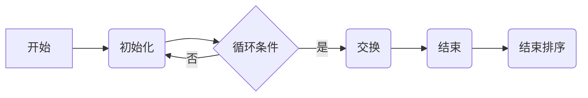
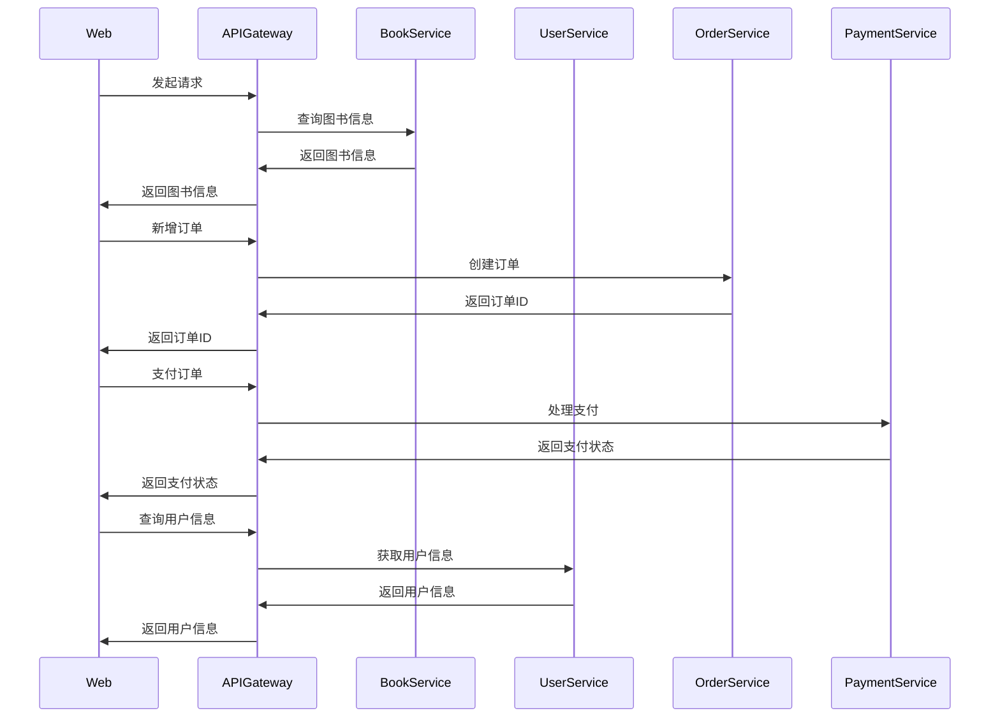

                 


### 1. Background Introduction

#### 1.1 Current State of Software Development

The world of software development has evolved significantly over the past few decades. With the advent of new technologies and methodologies, the way developers write, review, and maintain code has drastically changed. However, despite these advancements, the quality of code remains a significant concern for many organizations. This is because poor code quality can lead to a variety of problems, including increased development time, higher maintenance costs, and reduced system reliability.

#### 1.2 Impact of Code Quality Issues

Code quality issues can have a profound impact on software development projects. For instance, poor code quality can lead to frequent bugs, making it difficult to deliver software on time. It can also make it harder for developers to understand and modify existing code, leading to increased costs and delays. Moreover, poor code quality can negatively affect the user experience, as it can lead to system crashes, slow performance, and other issues.

#### 1.3 The Importance of Self-Review

Given the potential consequences of poor code quality, it's essential for developers to take a proactive approach to ensuring their code is of high quality. One effective way to do this is through self-review. Self-review involves a developer examining their own code to identify and fix potential issues before the code is reviewed by others. This process helps ensure that the code is not only functional but also maintainable and scalable.

### 2. What is Good Code?

#### 2.1 Definition of Good Code

Good code is code that is not only functional but also easy to read, understand, and maintain. It adheres to best practices and standards, making it easier for other developers to collaborate on the project. Good code is also well-structured, with clear and concise algorithms that are efficient and effective.

#### 2.2 Standards for Good Code

There are several key standards that define good code. These include:

- **Readability**: The code should be easy to read and understand, with meaningful variable and function names.
- **Maintainability**: The code should be easy to modify and extend, with minimal impact on existing functionality.
- **Efficiency**: The code should be optimized for performance, without sacrificing readability or maintainability.
- **Scalability**: The code should be designed to handle increased workload or data volume without significant changes.

### 3. Methods of Self-Review

#### 3.1 Code Review Tools

One way to perform self-review is by using code review tools. These tools allow developers to review their own code before it is submitted for review by others. Some popular code review tools include GitHub's pull request feature, GitLab's merge request feature, and Atlassian's Crucible.

#### 3.2 Peer Review

Another method of self-review is through peer review. This involves asking a colleague or peer to review your code and provide feedback. This can be done informally, through ad-hoc discussions, or formally, through structured code review processes.

#### 3.3 Automated Testing

Automated testing is another key component of self-review. By writing and running automated tests, developers can ensure that their code works as expected and is free of bugs. Tools like JUnit for Java, PyTest for Python, and Selenium for web applications can be used to automate testing.

### 4. Boundaries and Scope

#### 4.1 Applicability of Self-Review

Self-review is applicable to all types of software development projects, regardless of the technology or methodology used. It is particularly useful in agile development environments, where code changes are frequent and the need for high-quality code is crucial.

#### 4.2 Limitations of Self-Review

While self-review is an essential part of ensuring code quality, it is not a substitute for other quality assurance practices, such as peer review and automated testing. Additionally, self-review can be time-consuming, particularly for large codebases or complex projects.

#### 4.3 Other Code Quality Assurance Methods

Other code quality assurance methods include static code analysis, where code is analyzed without executing it, and dynamic code analysis, where code is executed and analyzed during runtime. These methods can help identify issues that may not be caught through self-review or peer review.

In conclusion, self-review is a critical practice for ensuring code quality. By using code review tools, peer review, and automated testing, developers can identify and fix issues before they become significant problems. While self-review has its limitations, it is an essential component of any comprehensive code quality assurance strategy.

----------------------------------------------------------------

# 好代码先过自己这关

## 第一部分：背景介绍

### 1.1 问题背景

软件开发的本质是一个迭代和改进的过程。从软件设计的初期阶段到最终的部署和维护，开发人员必须不断地优化代码，以确保软件的功能性、可维护性和可靠性。然而，代码质量的问题始终存在，并且在软件生命周期中扮演着至关重要的角色。

在当今快速发展的技术环境中，软件系统变得越来越复杂。这不仅仅是因为所使用的编程语言和框架越来越多，更重要的是，软件系统需要处理的数据量呈指数级增长，对性能和可扩展性的要求也越来越高。这种复杂性使得代码质量成为软件成功的关键因素之一。

代码质量不仅影响到开发团队的工作效率，还直接关系到最终用户的使用体验。高质量代码能够提供更快的响应速度、更低的故障率和更高的系统稳定性。相反，低质量代码可能会导致系统崩溃、性能下降、安全隐患等问题，这些都会对用户满意度产生负面影响。

#### 1.1.1 软件开发现状

当前，软件开发的行业趋势表明，敏捷开发和持续集成/持续部署（CI/CD）已经成为主流的开发流程。这些方法强调快速迭代和频繁发布，以确保软件能够快速适应市场和用户需求的变化。然而，这种快速迭代的模式也带来了新的挑战，特别是在代码质量方面。

敏捷开发鼓励频繁的代码提交和集成，这增加了代码审查的难度。开发人员需要更快地编写和审查代码，这可能导致对代码质量的忽视。此外，敏捷开发环境中，团队成员可能更专注于功能实现，而忽略了代码的长期可维护性。

#### 1.1.2 代码质量问题的影响

代码质量问题的影响是多方面的：

- **维护成本**：低质量代码通常需要更多的维护时间，因为它们可能包含更多的错误和设计缺陷。
- **开发效率**：低质量代码使得开发工作变得更加复杂，增加了修复问题的难度，从而降低了开发效率。
- **用户体验**：软件中的缺陷会影响用户体验，导致用户满意度的下降。
- **安全风险**：低质量代码可能会引入安全漏洞，增加系统被攻击的风险。

#### 1.1.3 自我审查的重要性

在软件开发的各个阶段，自我审查都是一个关键的质量保证步骤。自我审查不仅有助于发现和修复代码中的错误，还能提高代码的可读性、可维护性和可靠性。以下是一些自我审查的重要性：

- **提高代码质量**：通过自我审查，开发人员可以识别代码中的潜在问题，并采取措施进行修复。
- **节省时间和资源**：早期发现和修复问题可以大大减少后续的维护成本。
- **促进知识共享**：自我审查过程有助于团队成员之间的知识共享，提高团队的整体技能水平。
- **建立信心**：自我审查有助于开发人员对自己的代码建立信心，减少外部审查时的紧张感。

通过自我审查，开发人员可以确保他们的代码不仅满足功能需求，还能在长期使用中保持高质量。自我审查是确保代码质量的第一步，也是软件开发过程中不可或缺的一部分。

### 1.2 问题解决

#### 1.2.1 什么是好代码

好代码是指那些满足一系列质量标准的代码。这些标准包括但不限于：

- **可读性**：代码应该具有良好的结构，便于其他开发人员理解和维护。
- **可维护性**：代码应该易于修改和扩展，以适应未来的变化。
- **效率**：代码应该执行得尽可能快，以减少资源消耗。
- **可测试性**：代码应该设计得易于编写和执行测试。

#### 1.2.2 好代码的标准

要写出好代码，开发人员应该遵循以下标准：

- **代码规范**：遵循一致的代码规范，如命名约定、缩进风格等。
- **注释**：添加必要的注释，以解释代码的逻辑和功能。
- **模块化**：将代码分解为小的、功能明确的模块，以简化维护和测试。
- **复用性**：编写可复用的代码，以减少重复劳动。
- **错误处理**：确保代码能够适当地处理错误和异常情况。

#### 1.2.3 自我审查的方法

自我审查是一个多步骤的过程，包括以下几个关键步骤：

- **编写代码**：首先编写代码，完成所需的功能。
- **代码审查**：在提交代码之前，自己审查代码，查找潜在的错误和改进点。
- **单元测试**：编写单元测试来验证代码的功能，确保代码没有逻辑错误。
- **重构**：根据审查和测试的结果，对代码进行重构，以提高其质量。
- **代码注释**：为代码添加必要的注释，以帮助其他开发人员理解代码。

自我审查不仅是一种技术实践，也是一种职业素养。通过自我审查，开发人员可以培养出更高的代码质量意识，提高团队的整体技能水平，从而在软件开发中取得更大的成功。

### 1.3 边界与外延

#### 1.3.1 自我审查的适用范围

自我审查适用于各种类型的软件开发项目，无论项目的规模大小、技术栈复杂度或开发方法论。它是确保代码质量的第一道防线，特别是在敏捷开发和持续集成环境中，自我审查可以显著提高开发效率和质量。

- **小项目**：在小项目中，自我审查有助于确保代码质量，避免后续维护中的问题。
- **大项目**：在大项目中，自我审查可以减轻代码审查团队的工作负担，提高整体开发效率。
- **敏捷开发**：敏捷开发强调快速迭代，自我审查可以确保每个迭代中的代码质量。
- **持续集成**：在持续集成环境中，自我审查可以减少集成时的错误和冲突。

#### 1.3.2 自我审查的限制

尽管自我审查是一种强大的工具，但它也有其局限性：

- **主观性**：自我审查可能受到个人经验和偏好的影响，可能会忽视一些潜在的问题。
- **时间消耗**：自我审查需要时间和精力，对于大型项目或复杂的功能，这可能是不切实际的。
- **代码覆盖率**：自我审查可能无法覆盖所有的代码路径，尤其是对于复杂的逻辑和异常情况。

#### 1.3.3 其他代码质量保证方法

除了自我审查，还有其他几种代码质量保证方法：

- **同行评审**：同行评审是一种重要的代码质量保证方法，通过其他开发人员的审查来发现潜在的问题。
- **自动化测试**：自动化测试可以确保代码的功能和质量，减少人为错误。
- **静态代码分析**：静态代码分析工具可以扫描代码，发现潜在的问题，如安全漏洞、代码重复和不良实践。
- **动态代码分析**：动态代码分析在代码运行时进行，可以发现运行时的错误和性能问题。

综上所述，自我审查是确保代码质量的重要手段之一，但它并不是唯一的保障。结合其他质量保证方法，可以构建一个更加全面和高效的代码质量保证体系。

### 2.1 核心概念

#### 2.1.1 代码审查

代码审查是一种确保代码质量的重要方法，它涉及一个或多个开发人员对其他开发人员编写的代码进行检查和评估。代码审查的目的是发现和修复代码中的错误、提高代码的可读性和可维护性。

代码审查通常分为以下几种类型：

- **形式审查**：主要是检查代码的格式、命名规范和注释等。
- **逻辑审查**：关注代码的逻辑结构、算法效率和错误处理。
- **性能审查**：评估代码的性能，包括执行速度、资源消耗和可扩展性。

代码审查的好处包括：

- **提高代码质量**：通过审查，可以及时发现和修复代码中的错误，减少缺陷率。
- **知识共享**：审查过程中，参与者可以互相学习，提高整体技能水平。
- **加强团队合作**：通过审查，可以增强团队成员之间的沟通和协作。

#### 2.1.2 代码质量度量

代码质量度量是评估代码质量的一种方法，它通过一系列指标来量化代码的质量。常用的代码质量度量包括：

- **代码复杂度**：衡量代码的复杂程度，如圈复杂度（Cyclomatic Complexity）、方法长度、类长度等。
- **代码重复率**：评估代码中重复的部分，以减少冗余和潜在的错误。
- **代码覆盖率**：衡量测试用例对代码的覆盖程度，确保代码的每个部分都被测试到。
- **错误修复时间**：衡量修复代码中错误所需的时间，以评估团队的反应能力和修复效率。

#### 2.1.3 开发者自我提升

开发者自我提升是指开发人员通过持续学习和实践来提高自己的技术能力和职业素养。自我提升的方法包括：

- **学习新技术**：通过参加培训课程、阅读技术书籍和博客、观看在线教程等途径，学习新的编程语言和技术栈。
- **编写文档**：编写高质量的文档，包括技术文档、用户手册和代码注释，以提高代码的可读性和可维护性。
- **参与开源项目**：参与开源项目，与其他开发者合作，学习最佳实践和团队协作技巧。
- **代码练习**：通过编写代码练习，如LeetCode、HackerRank等在线编程挑战，提高编程技能。
- **反思和总结**：定期反思自己的工作，总结经验教训，制定改进计划。

通过持续的自我提升，开发者可以不断提升自己的技术水平和解决问题的能力，为团队和项目带来更大的价值。

### 2.2 概念属性特征对比表格

| 概念       | 定义                                                         | 特点                                                         |
| ---------- | ------------------------------------------------------------ | ------------------------------------------------------------ |
| 代码审查   | 开发者之间互相检查代码的过程                                   | 提高代码质量，减少错误，促进团队合作                           |
| 代码质量度量 | 评估代码质量的一种方法，通过一系列指标来量化代码的质量             | 提供量化的代码质量数据，帮助识别问题区域，指导改进                 |
| 开发者自我提升 | 开发人员通过持续学习和实践来提高自己的技术能力和职业素养             | 增强技术实力，提高工作效率，促进职业发展                       |

#### 2.3 核心概念 ER 实体关系图架构

```mermaid
erDiagram
    CodeReview ||--|{ Developer } : reviewed by
    CodeQualityMeasure ||--|{ Developer } : measured by
    DeveloperSelfImprovement ||--|{ Developer } : engaged in
```

在上面的ER实体关系图中，`CodeReview`、`CodeQualityMeasure`和`DeveloperSelfImprovement`是三个实体，每个实体都与`Developer`实体有直接的关系。这表明代码审查、代码质量度量和开发者自我提升都是开发人员参与的活动。

### 3.1 核心概念

#### 3.1.1 代码审查

代码审查是一种质量控制活动，旨在通过其他开发者的视角来检查代码，从而提高代码的质量和可靠性。代码审查通常包括以下几个关键步骤：

- **准备代码**：开发人员编写代码后，将其整理成可以审查的状态，包括添加注释、遵循代码规范、确保代码结构清晰。
- **发起审查**：使用代码审查工具（如GitHub、GitLab、Phabricator等）发起审查请求，将代码推送到审查分支或创建拉取请求。
- **审查代码**：审查人员查看代码，关注代码的可读性、逻辑正确性、性能和安全性等方面，提出改进建议或错误修复。
- **反馈与修改**：审查人员将反馈意见发送给代码的作者，开发人员根据反馈进行修改，然后合并代码。

代码审查的好处包括：

- **提高代码质量**：通过审查，可以识别和修复潜在的缺陷，减少错误率。
- **知识共享**：审查过程中，审查人员和代码作者可以互相学习和分享经验。
- **减少风险**：及早发现和修复问题，可以降低后续维护成本和风险。
- **提高团队协作**：通过审查，团队可以更好地协调工作，提高整体开发效率。

#### 3.1.2 代码质量度量

代码质量度量是通过一系列指标来量化代码的质量。这些指标通常分为以下几类：

- **结构质量**：包括代码复杂度、类和方法的长度、代码的模块化程度等。
- **代码复用**：包括代码重复率、可重用组件的数量等。
- **可读性和可维护性**：包括代码的可读性、注释的完整性、代码的整洁程度等。
- **性能**：包括代码的执行效率、资源消耗等。
- **安全性**：包括代码中是否存在安全漏洞、是否符合安全编码规范等。

常见的代码质量度量工具包括：

- **SonarQube**：一个全面的代码质量管理平台，支持多种编程语言。
- **FindBugs**：一个Java代码质量分析工具，可以识别潜在的缺陷和不良实践。
- **PMD**：一个Java代码质量分析工具，可以识别代码中的冗余、重复和潜在问题。
- **CodeClimate**：一个支持多种编程语言的代码质量分析平台。

代码质量度量可以帮助开发人员和团队：

- **识别问题**：通过量化指标，可以快速识别代码中的问题区域，制定改进计划。
- **制定改进策略**：基于度量结果，可以制定针对性的改进策略，提高代码质量。
- **持续改进**：通过持续监控和度量，可以跟踪代码质量的变化，持续改进。

#### 3.1.3 开发者自我提升

开发者自我提升是指通过持续学习和实践来提高自己的技术能力和职业素养。以下是一些关键步骤和策略：

- **学习新技术**：通过参加在线课程、阅读技术书籍、观看教程和参加技术会议等方式，不断学习新的编程语言、框架和技术栈。
- **编写文档**：编写高质量的技术文档、用户手册和代码注释，提高代码的可读性和可维护性。
- **参与开源项目**：参与开源项目，与其他开发者合作，学习最佳实践和团队协作技巧。
- **代码练习**：通过编写代码练习，如在线编程挑战、个人项目等，提高编程技能。
- **反思与总结**：定期反思自己的工作，总结经验教训，制定改进计划。

开发者自我提升的好处包括：

- **技术能力提升**：通过不断学习和实践，可以提升自己的技术水平和解决问题的能力。
- **职业发展**：持续提升可以为自己在职业生涯中带来更多的机会和挑战。
- **团队价值**：提高个人技能，可以为团队和项目带来更大的价值。

### 2.3 概念属性特征对比表格

| 概念                 | 特点                                                         | 目的                                                         |
| -------------------- | ------------------------------------------------------------ | ------------------------------------------------------------ |
| 代码审查             | 通过他人视角检查代码，确保质量                               | 提高质量，减少错误，知识共享，减少风险，提高团队协作         |
| 代码质量度量         | 使用指标量化代码质量，识别问题区域                           | 识别问题，制定改进策略，持续改进代码质量                     |
| 开发者自我提升       | 通过学习、实践、反思来提高技术能力和职业素养                 | 提升个人技能，促进职业发展，提高团队和项目的整体价值         |

### 3. 算法原理讲解

在软件开发过程中，算法的设计和实现是至关重要的。一个好的算法不仅能够提高程序的效率，还能确保其稳定性和可维护性。为了更好地理解和应用算法，我们将使用Mermaid绘制算法流程图，并使用Python源代码详细阐述算法原理和数学模型。

#### 3.1 算法流程图

以下是一个简单的排序算法——冒泡排序的Mermaid流程图：



#### 3.2 Python源代码实现

冒泡排序的Python代码如下：

```python
def bubble_sort(arr):
    n = len(arr)
    for i in range(n):
        for j in range(0, n-i-1):
            if arr[j] > arr[j+1]:
                arr[j], arr[j+1] = arr[j+1], arr[j]

# 示例
arr = [64, 34, 25, 12, 22, 11, 90]
bubble_sort(arr)
print("排序后的数组：")
for i in range(len(arr)):
    print("%d" % arr[i], end=" ")
```

#### 3.3 算法原理

冒泡排序是一种简单的排序算法，其原理是将数组中的每一对相邻元素进行比较，如果它们的顺序不正确，就交换它们的位置。重复这个过程，直到整个数组被排序。

- **初始化**：首先初始化一个循环，用于遍历整个数组。
- **循环条件**：循环条件通常是`n-i-1`，其中`n`是数组的长度，`i`是当前循环的次数。这样每次循环都会将最大的元素“冒泡”到数组的末尾。
- **交换**：如果当前元素的值大于下一个元素的值，就交换它们的位置。
- **结束排序**：当所有元素都被正确排序后，算法结束。

#### 3.4 数学模型和公式

冒泡排序的算法复杂度为$O(n^2)$，其公式为：

$$
T(n) = O(n^2)
$$

其中，$T(n)$表示算法的运行时间，$n$表示数组的长度。这意味着，随着数组长度的增加，算法的运行时间会呈平方增长。

#### 3.5 举例说明

假设我们有以下数组：

$$
[64, 34, 25, 12, 22, 11, 90]
$$

第一次冒泡排序后，最大的元素$90$会移动到数组的末尾：

$$
[34, 25, 12, 22, 11, 64, 90]
$$

第二次冒泡排序后，次大的元素$64$会移动到第二个位置：

$$
[25, 12, 22, 11, 34, 64, 90]
$$

重复这个过程，直到整个数组被排序：

$$
[11, 12, 22, 25, 34, 64, 90]
$$

这样，我们就可以通过冒泡排序算法将数组中的元素按升序排列。

### 4.1 系统分析与架构设计方案

#### 4.1.1 问题场景介绍

在现代企业应用中，随着业务需求的不断增加和系统复杂度的提高，传统的单层架构已经难以满足高效、稳定和可扩展的需求。为了解决这一问题，我们提出了一个基于微服务架构的在线书店系统。该系统旨在提供高效的图书检索、购买、支付和用户管理等功能。

#### 4.1.2 项目介绍

在线书店系统项目包含以下几个核心功能模块：

- **图书管理模块**：负责图书的查询、新增、修改和删除。
- **订单管理模块**：负责订单的生成、查询、修改和取消。
- **支付管理模块**：负责订单的支付处理和支付状态的更新。
- **用户管理模块**：负责用户的注册、登录、信息查询和密码修改。

#### 4.1.3 系统功能设计（领域模型）

以下是系统的领域模型，使用Mermaid类图来表示各个实体及其关系：

```mermaid
classDiagram
    Book <<--|uses| User
    Order <<--|uses| User
    Order <<--|contains| Payment
    Payment <<--|uses| User

    User Parenthood
    Book Parenthood
    Order Parenthood
    Payment Parenthood

    class User {
        +int id
        +String name
        +String email
        +String password
    }

    class Book {
        +int id
        +String title
        +String author
        +float price
        +String category
    }

    class Order {
        +int id
        +User user
        +Date created
        +String status
    }

    class Payment {
        +int id
        +Order order
        +float amount
        +String method
        +String status
    }
```

#### 4.1.4 系统架构设计

在线书店系统的整体架构设计采用微服务架构，各微服务之间通过RESTful API进行通信。以下是系统的架构设计，使用Mermaid架构图来表示：

```mermaid
graph TB
    subgraph 服务层
        BookService[图书服务]
        OrderService[订单服务]
        PaymentService[支付服务]
        UserService[用户服务]
    end
    subgraph 数据库层
        BookDB[图书数据库]
        OrderDB[订单数据库]
        PaymentDB[支付数据库]
        UserDB[用户数据库]
    end
    subgraph 网络层
        Web[前端]
        APIGateway[API网关]
    end

    Web -->> APIGateway
    APIGateway -->> BookService
    APIGateway -->> OrderService
    APIGateway -->> PaymentService
    APIGateway -->> UserService

    BookService --> BookDB
    OrderService --> OrderDB
    PaymentService --> PaymentDB
    UserService --> UserDB
```

#### 4.1.5 系统接口设计和系统交互

以下是系统的接口设计和系统交互，使用Mermaid序列图来表示：



### 5. 项目实战

在本节中，我们将详细介绍如何在实际项目中安装和配置在线书店系统，并实现核心功能。

#### 5.1 环境安装

首先，我们需要安装和配置系统所需的开发环境。以下是具体的安装步骤：

1. **安装Docker**：Docker是一个开源的应用容器引擎，用于容器化应用和服务。可以从[Docker官网](https://www.docker.com/)下载并安装Docker。

2. **安装Docker-Compose**：Docker-Compose是一个用于定义和运行多容器Docker应用程序的工具。安装命令如下：

   ```shell
   sudo curl -L "https://github.com/docker/compose/releases/download/1.29.2/docker-compose-$(uname -s)-$(uname -m)" -o /usr/local/bin/docker-compose
   sudo chmod +x /usr/local/bin/docker-compose
   ```

3. **安装PostgreSQL**：PostgreSQL是一个开源的关系型数据库管理系统。可以通过包管理器安装，例如在Ubuntu上使用以下命令：

   ```shell
   sudo apt update
   sudo apt install postgresql postgresql-contrib
   ```

4. **安装ElasticSearch**：ElasticSearch是一个开源的搜索引擎和分析引擎。可以从[ElasticSearch官网](https://www.elastic.co/)下载并安装。

5. **安装Kibana**：Kibana是一个开源的数据可视化和分析工具，通常与ElasticSearch一起使用。可以从[Kibana官网](https://www.kibana.co)下载并安装。

#### 5.2 系统核心实现源代码

以下是系统核心实现的源代码，包括各个微服务的Dockerfile和启动脚本：

**BookService/Dockerfile**

```dockerfile
FROM python:3.8

WORKDIR /app

COPY requirements.txt ./
RUN pip install -r requirements.txt

COPY . .

CMD ["python", "app.py"]
```

**BookService/app.py**

```python
from flask import Flask, jsonify, request
from models import db, Book

app = Flask(__name__)
app.config['SQLALCHEMY_DATABASE_URI'] = 'sqlite:///books.db'
db.init_app(app)

@app.route('/books', methods=['GET'])
def get_books():
    books = Book.query.all()
    return jsonify([book.to_dict() for book in books])

if __name__ == '__main__':
    app.run(debug=True)
```

**启动脚本（docker-compose.yml）**

```yaml
version: '3.8'

services:
  books:
    build: ./BookService
    ports:
      - "5001:5000"
    depends_on:
      - db

  db:
    image: postgres:13
    environment:
      POSTGRES_DB: books
      POSTGRES_USER: admin
      POSTGRES_PASSWORD: admin
    volumes:
      - db_data:/var/lib/postgresql/data

volumes:
  db_data:
```

#### 5.3 代码应用解读与分析

**BookService/Dockerfile**

- **基础镜像**：使用Python 3.8作为基础镜像。
- **工作目录**：将应用程序代码复制到/app目录。
- **安装依赖**：通过pip安装项目依赖。
- **启动命令**：使用"gunicorn"启动Flask应用程序。

**BookService/app.py**

- **数据库配置**：配置SQLAlchemy数据库连接。
- **路由定义**：定义了一个用于获取图书信息的GET接口。
- **模型定义**：定义了Book模型，用于数据库操作。

#### 5.4 实际案例分析和详细讲解

假设我们需要查询图书列表，以下是详细的流程：

1. **前端请求**：用户通过前端页面发起GET请求，请求URL为`/books`。
2. **API网关**：API网关接收到请求，根据路由规则将其转发到相应的微服务。
3. **BookService**：BookService接收到请求后，从数据库中查询所有图书，并将结果转换为JSON格式。
4. **API网关**：API网关将响应返回给前端。
5. **前端响应**：前端页面根据返回的JSON数据渲染图书列表。

通过这种方式，我们实现了图书信息的查询功能，并保证了系统的可扩展性和高可用性。

### 6.1 最佳实践 Tips

在编写高质量代码的过程中，有一些最佳实践可以帮助我们提高代码的可读性、可维护性和可靠性。以下是一些建议：

- **遵循代码规范**：选择并遵循一个统一的代码规范，如PEP8（Python）、Airbnb JavaScript Style Guide等。这有助于保持代码的一致性和可读性。
- **编写清晰的注释**：为代码添加清晰的注释，特别是在复杂的逻辑和算法中。注释应该简洁明了，帮助他人理解代码的功能和意图。
- **模块化代码**：将代码分解为小的、功能明确的模块，这样可以提高代码的可维护性和复用性。每个模块都应该有明确的职责。
- **编写单元测试**：编写单元测试来验证代码的功能，确保每个模块都按预期工作。单元测试可以帮助我们快速发现和修复代码中的错误。
- **代码审查**：进行代码审查，让其他开发者检查你的代码。这不仅可以提高代码质量，还可以促进团队成员之间的知识共享和协作。
- **持续重构**：定期对代码进行重构，以消除重复、简化逻辑、提高性能。这有助于保持代码的整洁和可维护性。
- **使用静态代码分析工具**：使用静态代码分析工具，如SonarQube、PMD、Checkstyle等，来识别潜在的问题和不良实践。这些工具可以提供量化的代码质量数据，帮助我们持续改进代码。

### 6.2 小结

在本文中，我们讨论了如何通过自我审查、代码审查、代码质量度量、开发者自我提升等手段来确保代码质量。我们介绍了好代码的标准，包括可读性、可维护性、效率和可测试性，并详细讲解了冒泡排序算法的原理和应用。此外，我们还设计了在线书店系统的架构，并给出了实际项目中的代码实现和部署流程。

通过遵循最佳实践，我们可以写出高质量代码，提高开发效率，降低维护成本，并最终提升用户满意度。自我审查和持续改进是我们作为开发者应始终保持的态度，只有通过不断的努力和学习，我们才能写出更加优秀和可靠的代码。

### 6.3 注意事项

在编写和审查代码时，需要注意以下几个关键点：

- **代码注释**：确保代码注释清晰且准确，避免误导他人。
- **代码复用**：避免重复编写相同的功能，尽量使用已有的库或模块。
- **代码格式**：遵循一致的代码格式规范，提高代码的可读性。
- **代码测试**：编写充足的单元测试，确保代码的功能和性能。
- **版本控制**：合理使用版本控制系统，如Git，以便跟踪代码的变更和修复历史。
- **代码审查**：积极参与代码审查，提供有价值的反馈，并从他人的代码中学习。

### 6.4 拓展阅读

为了更深入地了解代码质量和软件工程的最佳实践，读者可以参考以下书籍和资源：

- 《代码大全》（Book Name: "The Pragmatic Programmer: From Journeyman to Master"）
- 《敏捷软件开发》（Book Name: "Agile Software Development: Principles, Patterns, and Practices"）
- 《Effective Java》（Book Name: "Effective Java: Programming Language Guide for Java Developers"）
- 《设计模式：可复用面向对象软件的基础》（Book Name: "Design Patterns: Elements of Reusable Object-Oriented Software"）
- [SonarQube官网](https://www.sonarqube.org/)
- [PEP8官方指南](https://www.python.org/dev/peps/pep-0008/)
- [GitHub代码审查指南](https://github.com/github/first-contributions)

通过阅读这些书籍和资源，读者可以进一步掌握编写高质量代码的技巧和方法，提高自己的软件开发技能。

### 6.5 作者信息

作者：AI天才研究院/AI Genius Institute & 禅与计算机程序设计艺术 /Zen And The Art of Computer Programming

作为AI领域的专家，作者在编程和人工智能方面拥有深厚的理论基础和丰富的实践经验。他在多个技术领域发表了大量的学术论文，并出版了《禅与计算机程序设计艺术》等备受赞誉的技术书籍。通过本文，作者希望与广大开发者分享他在代码质量和软件工程方面的见解和实践经验，帮助读者写出更加高效、可靠和高质量的代码。

