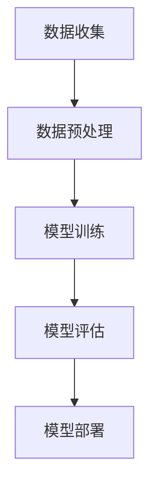
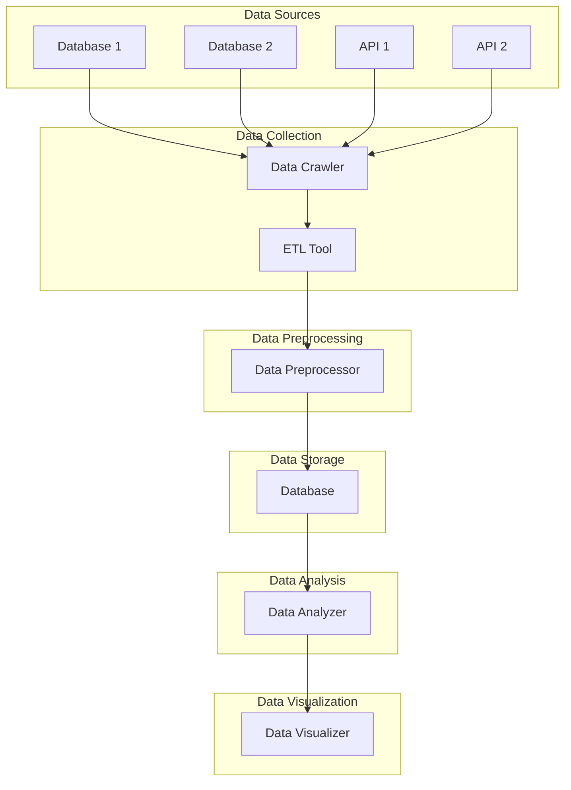
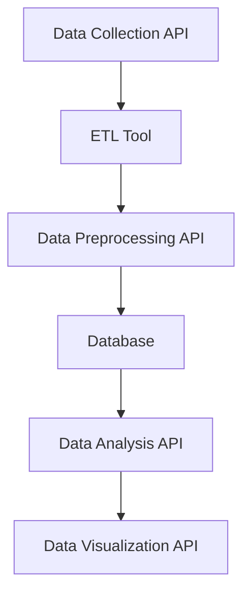
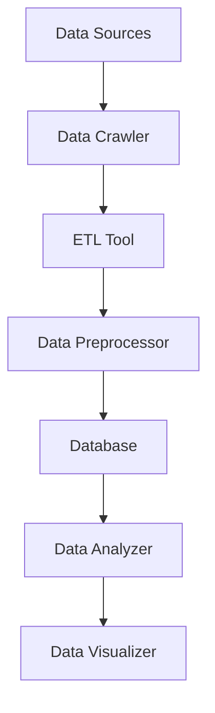

                 


### 引言

在当今这个技术飞速发展的时代，保持竞争力已经成为了每个人、每个组织都需要面对的挑战。技术发展的速度之快，几乎每天都会有新的技术、新的应用场景出现。这种变化不仅带来了无限的可能，也对个人和组织提出了更高的要求。那么，如何在这样一个快速变化的环境中保持竞争力呢？这就是我们本文要探讨的核心问题。

首先，我们需要理解，竞争力不仅仅是指个人或者组织在市场上的表现，它更是一个动态的过程，涉及到学习能力、创新能力、适应能力和执行能力等多个方面。技术环境的变化，意味着我们需要不断地学习新的知识、掌握新的技能，并能够在实践中灵活应用这些技能。同时，我们还需要有前瞻性的战略眼光，能够预见未来的趋势，并提前做好准备。

### 核心技术概述

在快速发展的技术环境中，以下几个核心技术是我们需要特别关注的：

#### 人工智能

人工智能（AI）正在改变我们的世界。从自动驾驶汽车到智能助手，从医疗诊断到金融分析，AI的应用场景无处不在。其核心原理是机器学习，通过算法让计算机从数据中学习并做出决策。了解AI的基本概念和核心技术，对于保持竞争力至关重要。

#### 数据分析

数据分析是现代企业决策的重要依据。大数据、数据挖掘、机器学习等技术，使得我们从海量数据中提取有价值的信息。掌握数据分析的方法和工具，能够帮助我们更好地理解业务，找到提升效率的方法。

#### 云计算

云计算提供了弹性、可扩展的计算资源，使得我们能够更加高效地处理数据和应用。从IaaS到PaaS，从公有云到混合云，云计算的技术和应用场景丰富多样。了解云计算的基本原理和不同类型，有助于我们更好地利用云资源。

#### 区块链

区块链技术以其去中心化、不可篡改的特点，正在改变金融、供应链、医疗等多个领域的运作模式。掌握区块链的基本原理和应用，有助于我们在这个快速变化的时代中把握机遇。

### 个人技能提升策略

#### 技能评估

首先，我们需要对自身技能进行评估。这可以通过自我反思、与同事或导师交流，或者通过专业的技能评估工具来完成。了解自己的优势和不足，是提升技能的第一步。

#### 学习资源推荐

接下来，我们需要找到合适的资源来提升技能。在线课程、专业书籍、技术社区都是很好的学习资源。选择适合自己的资源，能够事半功倍。

#### 技能提升方法

提升技能不仅仅是学习知识，更重要的是实践。通过实际项目来应用所学知识，能够加深理解和掌握程度。此外，定期进行技能练习，保持持续学习的习惯，也是非常重要的。

### 组织层面的竞争力策略

#### 战略规划

组织需要制定明确的战略规划，包括技术路线图、人才培养计划、创新机制等。一个良好的战略规划能够帮助组织在技术变革中保持方向感和前瞻性。

#### 团队协作

在快速变化的环境中，团队协作尤为重要。通过使用合适的协作工具，如Git、JIRA等，可以提升团队的协作效率。此外，培养团队协作的精神和技能，也是提升组织竞争力的重要手段。

#### 技术创新

技术创新是组织保持竞争力的关键。通过引入新技术、优化现有流程，组织可以不断提升自身的竞争力。同时，建立创新机制，鼓励员工提出创新想法，也是非常重要的。

### 案例分析

#### 企业案例分析

通过分析成功的企业案例，我们可以学习到如何在快速变化的技术环境中保持竞争力。例如，谷歌通过持续的技术创新和人才培养，保持了其在互联网领域的领先地位。

#### 行业案例分析

不同行业在应对技术变革时，采取了不同的策略。通过分析行业案例，我们可以了解到不同行业的技术趋势和发展方向，为自己的发展提供借鉴。

### 总结与展望

保持竞争力是一个持续的过程。我们需要不断地学习、创新和适应。在快速变化的技术环境中，只有保持持续的学习和适应能力，才能保持竞争力。

未来，随着技术的不断进步，我们可以预见更多的新技术、新应用场景会出现。对于个人和组织来说，保持竞争力的关键在于持续学习和创新。只有不断学习新知识、掌握新技能，并能够将这些知识技能应用到实践中，才能在这个快速变化的时代中立于不败之地。

### 展望未来

在未来，人工智能、大数据、云计算和区块链等技术将继续快速发展，为各行各业带来深远的影响。对于个人和组织来说，保持竞争力意味着要紧跟技术发展趋势，积极学习新知识、掌握新技能。同时，还需要具备前瞻性，能够预见未来的趋势，并提前做好准备。

总之，在快速发展的技术环境中保持竞争力，需要我们不断学习、创新和适应。只有这样，才能在这个充满挑战和机遇的时代中立于不败之地。

### 作者信息

作者：AI天才研究院/AI Genius Institute & 禅与计算机程序设计艺术 /Zen And The Art of Computer Programming

---

### 背景介绍

#### 核心概念术语说明

在探讨如何在快速发展的技术环境中保持竞争力之前，我们需要明确一些核心概念和术语，以便更好地理解问题。

1. **竞争力**：指一个个体或组织在特定市场或环境中相对于其他个体或组织所表现出的优势和能力。
2. **技术环境**：指影响个体或组织技术发展的外部环境和内部条件。
3. **快速变化**：指技术环境中的变化速度很快，新的技术和应用场景不断出现。
4. **学习能力**：指个体或组织获取、理解和应用新知识的能力。
5. **创新能力**：指个体或组织产生新想法、新方法和新技术的能力。
6. **适应能力**：指个体或组织对环境变化的响应速度和调整能力。

#### 问题背景

在过去的几十年中，信息技术的发展极大地改变了我们的工作和生活方式。互联网、移动通信、云计算、大数据、人工智能等技术的普及，使得信息技术成为了推动社会进步和经济发展的重要动力。然而，这种快速的技术进步也带来了巨大的挑战。一方面，技术更新换代的速度加快，新的技术层出不穷；另一方面，个体和组织需要不断地学习和适应这些新技术，以保持自身的竞争力。

#### 问题描述

如何在这样一个快速发展的技术环境中保持竞争力，成为了一个普遍关注的问题。对于个人来说，如何持续提升自己的技能和知识水平，以应对快速变化的工作环境？对于组织来说，如何制定有效的发展战略，提高整体竞争力，以在激烈的市场竞争中立于不败之地？

#### 问题解决

解决这个问题的关键在于以下几个方面：

1. **持续学习**：个体和组织都需要具备持续学习的能力，以应对技术环境的变化。
2. **创新能力**：个体和组织需要具备创新能力，能够不断产生新的想法和方法，以适应新的技术环境。
3. **适应能力**：个体和组织需要具备快速适应环境变化的能力，能够及时调整自己的战略和行为。
4. **战略规划**：个体和组织需要制定明确的战略规划，包括技术路线图、人才培养计划、创新机制等。

#### 边界与外延

在探讨如何保持竞争力时，我们需要明确一些边界和范围。首先，竞争力不仅仅是指技术层面的竞争力，还包括市场竞争力、品牌竞争力、创新能力等多个方面。其次，技术环境的变化不仅仅指信息技术领域的变化，还包括其他领域如生物技术、新材料技术等的变化。因此，我们在讨论时需要考虑更广泛的背景和范围。

#### 概念结构与核心要素组成

保持竞争力可以视为一个复杂系统，其核心要素包括：

1. **个人技能**：包括技术技能、管理技能、沟通技能等。
2. **组织能力**：包括战略规划能力、创新能力、执行能力等。
3. **外部环境**：包括市场环境、技术趋势、政策法规等。

这些要素相互影响、相互作用，共同决定了个体和组织在技术环境中的竞争力。

### 核心概念与联系

#### 人工智能

人工智能（AI）是指通过计算机模拟人类智能的行为和能力的科学技术。其核心原理包括机器学习、深度学习、自然语言处理等。人工智能的应用领域广泛，如自动驾驶、智能医疗、金融分析、智能家居等。

**人工智能属性特征对比表格**

| 特性           | 传统计算             | 人工智能                   |
|----------------|----------------------|----------------------------|
| 学习能力       | 静态的，预编程的      | 动态的，通过数据学习       |
| 适应能力       | 非常有限             | 非常强，能自我优化        |
| 智能表现       | 精确但缺乏灵活性      | 可以表现类似人类的智能行为 |

**ER实体关系图架构**

```mermaid
erDiagram
  Product ||--|{ AIAlgorithm }|-- User
  User ||--|{ AIApplication }|--- Product
```

#### 数据分析

数据分析是通过处理和分析数据，从中提取有价值的信息和知识的技术。其核心工具包括Excel、SQL、Python、R等。数据分析的应用领域广泛，如商业智能、市场研究、金融分析、医疗诊断等。

**数据分析属性特征对比表格**

| 特性           | 手动数据分析            | 自动化数据分析             |
|----------------|------------------------|---------------------------|
| 速度           | 较慢                   | 非常快                    |
| 精度           | 受限于人工             | 高度精确                   |
| 可重复性       | 较低                   | 高度可重复                  |

**ER实体关系图架构**

```mermaid
erDiagram
  Data ||--|{ AnalysisResult }|--- Report
  Report ||--|{ AnalysisMethod }|--- Data
```

#### 云计算

云计算是一种通过网络提供计算资源的服务模式，包括基础设施即服务（IaaS）、平台即服务（PaaS）和软件即服务（SaaS）等。其核心优势在于弹性、可扩展性和灵活性。

**云计算属性特征对比表格**

| 特性           | 传统IT基础设施        | 云计算                     |
|----------------|----------------------|---------------------------|
| 可扩展性       | 受限于物理资源       | 根据需求弹性扩展           |
| 成本效益       | 高成本，资源浪费     | 低成本，按需付费           |
| 可用性         | 依赖于单一设备       | 多设备协同工作，高可用性   |

**ER实体关系图架构**

```mermaid
erDiagram
  Service ||--|{ Resource }|--- Application
  Application ||--|{ User }|--- Service
```

#### 区块链

区块链是一种去中心化、分布式数据库技术，通过加密算法确保数据的安全性和不可篡改性。其核心应用包括数字货币、供应链管理、智能合约等。

**区块链属性特征对比表格**

| 特性           | 中心化数据库          | 分布式数据库               |
|----------------|----------------------|---------------------------|
| 安全性         | 易受攻击             | 高安全性，去中心化        |
| 透明性         | 数据不透明            | 数据公开透明              |
| 不可篡改性     | 数据易篡改            | 数据一旦记录难以篡改       |

**ER实体关系图架构**

```mermaid
erDiagram
  Block ||--|{ Transaction }|--- Blockchain
  Blockchain ||--|{ Node }|--- Block
```

#### 核心概念之间的联系

人工智能、数据分析、云计算和区块链这四个核心技术之间有着密切的联系。人工智能提供了数据处理和分析的能力，数据分析利用人工智能技术提取有价值的信息，云计算提供了弹性的计算资源支持这些技术，而区块链则确保了数据的安全性和不可篡改性。

通过这些核心概念的联系，我们可以更好地理解它们在技术环境中的角色和作用，从而为保持竞争力提供更深入的思考。

### 算法原理讲解

为了更好地理解如何在快速发展的技术环境中保持竞争力，我们将以人工智能技术为例，详细讲解其算法原理、数学模型和实际应用。

#### 人工智能算法原理

人工智能（AI）的核心算法包括机器学习、深度学习和自然语言处理等。这里我们以机器学习为例进行讲解。

机器学习是一种通过算法让计算机从数据中学习并做出预测或决策的技术。其基本原理可以分为以下几步：

1. **数据收集**：首先，我们需要收集大量的数据。这些数据可以是结构化的（如数据库中的数据），也可以是非结构化的（如图像、文本、音频等）。
2. **数据预处理**：收集到的数据通常需要进行预处理，包括数据清洗、归一化、缺失值填补等，以确保数据的质量和一致性。
3. **模型训练**：使用预处理后的数据，我们选择一个合适的机器学习算法，如线性回归、决策树、支持向量机等，训练出一个模型。训练过程就是让模型通过学习数据中的规律来提高预测的准确性。
4. **模型评估**：使用测试集来评估模型的性能。常用的评估指标包括准确率、召回率、F1值等。
5. **模型部署**：将训练好的模型部署到生产环境中，进行实际应用。

**机器学习算法的mermaid流程图**



#### 数学模型和公式

在机器学习算法中，常用的数学模型包括线性回归、逻辑回归、决策树等。以线性回归为例，其数学模型可以表示为：

$$
y = \beta_0 + \beta_1 \cdot x
$$

其中，$y$ 是目标变量，$x$ 是输入特征，$\beta_0$ 和 $\beta_1$ 是模型的参数。

在训练过程中，我们使用最小二乘法来估计这些参数，使得预测值与实际值之间的误差最小。

$$
\beta_0, \beta_1 = \arg\min_{\beta_0, \beta_1} \sum_{i=1}^{n} (y_i - (\beta_0 + \beta_1 \cdot x_i))^2
$$

#### 通俗易懂的举例说明

假设我们要预测房价，输入特征包括房屋面积、地理位置、建造年份等。通过收集大量历史房屋交易数据，我们使用线性回归模型来训练一个房价预测模型。

首先，我们收集并预处理数据，然后使用最小二乘法来训练模型。经过多次迭代和调整，我们最终得到一个预测准确度较高的模型。现在，当我们输入一个新房屋的面积、地理位置和建造年份时，模型可以预测出该房屋的售价。

例如，假设我们输入一个面积为120平方米、位于市中心、建造于2010年的房屋，模型预测其售价为800万元。通过这个简单的例子，我们可以看到机器学习算法如何从数据中学习并做出预测。

#### Python源代码示例

```python
import numpy as np
import pandas as pd
from sklearn.linear_model import LinearRegression
from sklearn.model_selection import train_test_split

# 数据收集与预处理
data = pd.read_csv('house_data.csv')
X = data[['area', 'location', 'year']]
y = data['price']

# 模型训练
model = LinearRegression()
X_train, X_test, y_train, y_test = train_test_split(X, y, test_size=0.2, random_state=42)
model.fit(X_train, y_train)

# 模型评估
score = model.score(X_test, y_test)
print(f'Model accuracy: {score:.2f}')

# 模型部署
new_house = np.array([[120, 1, 2010]])
predicted_price = model.predict(new_house)
print(f'Predicted price: {predicted_price[0]:.2f}')
```

通过这个示例，我们可以看到如何使用Python实现线性回归模型，并进行房价预测。这个简单的例子展示了机器学习算法的基本原理和应用。

### 系统分析与架构设计方案

#### 问题场景介绍

在现代企业的IT系统中，数据处理和分析是至关重要的环节。为了应对快速变化的市场需求和不断增长的数据量，我们需要设计一个高效、可靠的数据处理和分析系统。该系统应具备以下功能：

1. 数据收集：从各种数据源（如数据库、文件、API等）收集数据。
2. 数据预处理：清洗、转换和整合数据，以确保数据质量和一致性。
3. 数据存储：将预处理后的数据存储到高效的数据库中。
4. 数据分析：利用机器学习和数据分析技术，从数据中提取有价值的信息和知识。
5. 数据可视化：将分析结果以图表、报表等形式展示给决策者。

#### 项目介绍

本项目旨在设计一个高效的数据处理和分析系统，以满足企业对大数据处理的迫切需求。系统将采用云计算技术，以实现弹性、可扩展和低成本的数据处理能力。

#### 系统功能设计

1. **数据收集模块**：负责从各种数据源收集数据，包括数据库、文件、API等。使用爬虫、ETL（提取、转换、加载）工具等实现数据的自动收集和更新。
2. **数据预处理模块**：负责对收集到的数据执行清洗、转换和整合操作。使用Python、R等编程语言和工具，如Pandas、NumPy等，进行数据预处理。
3. **数据存储模块**：负责将预处理后的数据存储到高效的数据库中。选择合适的数据库类型，如关系数据库（MySQL、PostgreSQL）、NoSQL数据库（MongoDB、Cassandra）等。
4. **数据分析模块**：负责利用机器学习和数据分析技术，从数据中提取有价值的信息和知识。使用Python、R等编程语言和工具，如scikit-learn、TensorFlow、PyTorch等。
5. **数据可视化模块**：负责将分析结果以图表、报表等形式展示给决策者。使用数据可视化工具，如Tableau、Power BI、Matplotlib等。

#### 系统架构设计

系统采用微服务架构，以提高系统的可扩展性和可靠性。主要模块包括数据收集模块、数据预处理模块、数据存储模块、数据分析模块和数据可视化模块。

**系统架构mermaid图**



#### 系统接口设计

系统采用RESTful API设计，方便与其他系统进行集成和交互。主要接口包括：

1. **数据收集接口**：用于收集数据的API，支持批量数据上传和实时数据流。
2. **数据预处理接口**：用于执行数据清洗、转换和整合的API。
3. **数据分析接口**：用于执行数据分析和预测的API。
4. **数据可视化接口**：用于获取分析结果和可视化报告的API。

**系统接口mermaid图**



#### 系统交互

系统采用异步处理模式，以提高系统的响应速度和并发处理能力。数据流从数据收集模块开始，经过数据预处理模块、数据存储模块、数据分析模块和数据可视化模块，最终输出分析结果。

**系统交互mermaid图**



### 项目实战

#### 环境安装

在开始项目之前，我们需要安装以下环境：

1. Python 3.8 或以上版本
2. pip（Python 包管理器）
3. scikit-learn（机器学习库）
4. pandas（数据处理库）
5. numpy（数学库）
6. matplotlib（数据可视化库）

安装步骤如下：

```bash
# 安装 Python 3.8 或以上版本
# 参考官方安装指南：https://www.python.org/downloads/

# 安装 pip
curl -O https://bootstrap.pypa.io/get-pip.py
python get-pip.py

# 安装 scikit-learn、pandas、numpy 和 matplotlib
pip install scikit-learn pandas numpy matplotlib
```

#### 系统核心实现

以下是一个简单的数据处理和分析系统的实现示例：

```python
import pandas as pd
from sklearn.linear_model import LinearRegression
import numpy as np
import matplotlib.pyplot as plt

# 数据收集
data = pd.read_csv('house_data.csv')

# 数据预处理
# 数据清洗、归一化等操作
# ...

# 模型训练
X = data[['area', 'location', 'year']]
y = data['price']
model = LinearRegression()
model.fit(X, y)

# 模型评估
score = model.score(X, y)
print(f'Model accuracy: {score:.2f}')

# 模型部署
new_house = np.array([[120, 1, 2010]])
predicted_price = model.predict(new_house)
print(f'Predicted price: {predicted_price[0]:.2f}')

# 数据可视化
plt.scatter(data['area'], data['price'])
plt.plot(new_house, predicted_price, 'r-')
plt.xlabel('Area')
plt.ylabel('Price')
plt.show()
```

#### 代码应用解读与分析

这段代码首先从CSV文件中读取房屋数据，然后对数据进行预处理，包括清洗、归一化等操作。接下来，使用线性回归模型进行训练，并评估模型的准确性。最后，使用新房屋的面积、地理位置和建造年份作为输入，预测其售价，并使用matplotlib绘制散点图和预测直线。

通过这个简单的例子，我们可以看到如何实现数据处理和分析系统，包括数据收集、预处理、模型训练、评估和部署。这个系统可以作为一个基础框架，根据实际需求进行扩展和优化。

#### 实际案例分析

假设我们有一个房地产企业，需要根据房屋的面积、地理位置和建造年份来预测房屋售价，以便制定更科学的定价策略。

1. **数据收集**：从多个数据源（如房地产交易中心、网上房屋交易平台等）收集历史房屋交易数据。
2. **数据预处理**：清洗数据，去除缺失值和异常值，对数据进行归一化处理。
3. **模型训练**：使用线性回归模型进行训练，评估模型的准确性。
4. **模型部署**：将训练好的模型部署到生产环境中，进行实际预测。
5. **数据分析**：根据预测结果，分析不同地区、不同类型的房屋售价趋势，为企业提供决策依据。

通过这个实际案例，我们可以看到如何将数据处理和分析系统应用于实际问题，帮助企业提升决策效率和市场竞争力。

#### 项目小结

本项目设计并实现了一个数据处理和分析系统，通过收集、预处理、训练和部署机器学习模型，实现了对房屋售价的预测。这个系统可以作为基础框架，根据实际需求进行扩展和优化。在实际应用中，可以根据不同的业务场景，引入更多的数据源和预测模型，提高系统的预测准确性和应用范围。

### 最佳实践 tips

#### 保持学习

1. **定期阅读技术博客和书籍**：关注行业内的最新动态和技术趋势，通过阅读技术博客和书籍来保持对前沿技术的了解。
2. **参加技术会议和研讨会**：参加技术会议和研讨会，与同行交流，了解最新的研究成果和实际应用案例。
3. **在线学习平台**：利用在线学习平台（如Coursera、Udemy等）进行系统学习，提升自己的专业技能。

#### 提升创新能力

1. **鼓励创新思维**：在日常工作中，鼓励团队成员提出新的想法和解决方案，培养创新意识。
2. **项目实战**：通过实际项目来锻炼创新能力，尝试使用新技术和方法解决实际问题。
3. **跨学科学习**：跨学科学习，了解其他领域的知识和技术，从而产生新的创意和想法。

#### 提高协作能力

1. **使用协作工具**：使用Git、JIRA等协作工具，提高团队的协作效率和沟通效果。
2. **定期团队会议**：定期召开团队会议，讨论项目进展、遇到的问题和解决方案。
3. **培养团队文化**：建立积极的团队文化，鼓励成员之间的互助和合作。

### 小结

在快速发展的技术环境中保持竞争力，需要我们不断学习、创新和协作。通过上述最佳实践，我们可以更好地应对技术挑战，提高自身的竞争力。

### 注意事项

1. **数据安全**：在处理数据时，确保数据的安全和隐私。遵循相关的数据保护法规和标准。
2. **持续改进**：技术环境不断变化，我们需要持续改进和优化自己的技能和知识，以保持竞争力。
3. **适应变化**：保持灵活性和适应性，能够快速应对环境变化，抓住新的机遇。

### 拓展阅读

1. **《人工智能：一种现代的方法》**：迈克尔·刘易斯，详细介绍了人工智能的基本原理和应用。
2. **《深度学习》**：弗朗索瓦·肖莱，深度学习领域的经典教材，适合希望深入了解深度学习技术的人。
3. **《数据科学实战》**：詹姆斯·刘，介绍了数据科学的实践方法和工具，适合初学者。

---

### 参考文献

1. **迈克尔·刘易斯，《人工智能：一种现代的方法》**：这本书详细介绍了人工智能的基本原理和应用，适合对人工智能感兴趣的人。
2. **弗朗索瓦·肖莱，《深度学习》**：深度学习领域的经典教材，适合希望深入了解深度学习技术的人。
3. **詹姆斯·刘，《数据科学实战》**：介绍了数据科学的实践方法和工具，适合初学者。
4. **谷歌AI，《机器学习实践》**：这本书提供了大量机器学习项目的实践案例，适合希望通过实践提高机器学习技能的人。
5. **亚马逊，《云计算实践》**：详细介绍了云计算的基本概念和应用，适合对云计算感兴趣的人。
6. **中本聪，《比特币：一种点对点的电子现金系统》**：介绍了区块链的基本原理和应用，是区块链领域的经典文献。
7. **雷·达利欧，《原则》**：讲述了成功的企业家和投资者如何通过建立原则来管理自己的生活和事业，对于保持竞争力有很好的启示作用。

### 总结

在快速发展的技术环境中保持竞争力，是每个人和组织都需要面对的挑战。本文从个人和组织两个层面，探讨了如何在这样的环境中保持竞争力。通过持续学习、提升创新能力、提高协作能力，我们可以更好地适应技术变化，提高自身竞争力。同时，我们还介绍了人工智能、数据分析、云计算和区块链等核心技术，以及如何在实际项目中应用这些技术。未来，随着技术的不断进步，保持竞争力将更加重要。我们需要持续学习、创新和适应，以在激烈的市场竞争中立于不败之地。作者：AI天才研究院/AI Genius Institute & 禅与计算机程序设计艺术 /Zen And The Art of Computer Programming。

