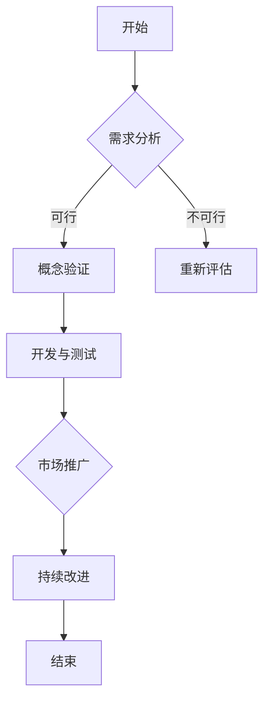

                 

# 如何培养团队的技术创新能力

## 关键词

技术创新、团队建设、创新能力、技术交流、流程管理、案例分析、实践指南

## 摘要

在当前快速发展的技术时代，技术创新已成为企业竞争力的核心。培养团队的技术创新能力，不仅是企业持续发展的关键，也是应对市场变化的重要策略。本文将深入探讨如何通过系统的方法和步骤，构建一个具备技术创新能力的团队。首先，我们将介绍技术创新的背景和重要性，随后详细解析团队技术创新能力的基础概念。接着，文章将讨论如何营造支持技术创新的文化和环境，激发团队成员的创造力，并强调技术交流与合作的重要性。此外，我们将介绍技术创新流程管理的方法，并通过实际案例进行分析和总结，提供实践指南，帮助读者在实际工作中培养团队的技术创新能力。

### 第1章：背景介绍

#### 1.1 技术创新的时代背景

在21世纪，技术创新已成为推动社会进步和经济发展的主要动力。随着人工智能、大数据、云计算等新兴技术的快速发展，技术变革的速度前所未有地加快。企业如果不具备持续的技术创新能力，将难以在激烈的市场竞争中立于不败之地。因此，培养团队的技术创新能力已成为企业领导者的重要任务。

#### 1.2 团队技术创新的必要性

团队技术创新的重要性体现在以下几个方面：

1. **适应市场变化**：市场环境变化迅速，只有不断进行技术创新，才能快速响应市场需求，保持竞争优势。
2. **提高竞争力**：技术创新是企业提高生产效率、降低成本、提升产品质量和客户满意度的关键。
3. **促进持续发展**：技术创新是推动企业不断发展和成长的重要引擎。

#### 1.3 技术创新面临的挑战

尽管技术创新的重要性不言而喻，但企业在实际操作中仍面临诸多挑战：

1. **技术瓶颈**：在某些领域，技术瓶颈限制了企业的创新潜力。
2. **资源限制**：有限的资金、人才和时间资源可能成为技术创新的障碍。
3. **市场风险**：新的技术产品或服务可能面临市场接受度低、竞争激烈等风险。

#### 1.4 问题解决与边界外延

为了解决这些挑战，企业需要从以下几个方面入手：

1. **突破技术瓶颈**：通过加大研发投入，引进高端人才，或者与外部科研机构合作，共同突破技术瓶颈。
2. **优化资源配置**：合理分配资源，确保技术创新项目得到足够的资金、人才和时间支持。
3. **降低市场风险**：通过市场调研，了解客户需求，进行小规模试点，逐步扩大市场推广范围。

在培养团队的技术创新能力过程中，还需要注意以下几点：

1. **边界与外延**：技术创新不仅要满足当前市场需求，还应考虑未来市场的发展趋势，确保技术的前瞻性。
2. **概念结构与核心要素**：明确技术创新的核心概念和要素，构建科学合理的技术创新体系。
3. **持续改进**：技术创新是一个持续的过程，需要不断进行改进和完善。

### 第2章：团队技术创新能力的基础概念

#### 2.1 创新的定义与分类

创新是一个广泛的概念，它涵盖了从概念形成到产品或服务开发的全过程。根据不同的分类标准，创新可以分为以下几种类型：

1. **按照技术层面分类**：技术创新、产品创新、服务创新、商业模式创新等。
2. **按照创新程度分类**：渐进性创新、革命性创新。
3. **按照创新对象分类**：产品创新、工艺创新、管理创新、组织创新。

#### 2.2 创新理论概述

创新理论是研究创新过程和创新行为的理论体系。以下是一些重要的创新理论：

1. **线性创新模型**：该模型将创新过程划分为不同的阶段，如研发、开发、测试、市场推广等。
2. **混沌创新模型**：该模型强调创新过程中的随机性和不确定性，认为创新是通过不断的试错和调整来实现的。
3. **开放创新模型**：该模型强调企业内部和外部资源的整合，通过开放的创新方式，实现技术创新的最大化。

#### 2.3 创新模式与工具

创新模式是指企业在进行技术创新时采用的具体方法和策略。以下是一些常见的创新模式：

1. **精益创新**：通过最小化浪费和最大化价值，快速迭代和优化产品或服务。
2. **开放式创新**：通过外部合作，引入外部资源，推动技术创新。
3. **用户参与创新**：通过用户反馈和参与，改进产品或服务，实现创新。

创新工具是实现创新过程的重要手段。以下是一些常用的创新工具：

1. **头脑风暴**：通过集体讨论，激发创意的产生。
2. **思维导图**：通过图形化的方式，展示创新思路和流程。
3. **六顶思考帽**：通过不同的思考角度，全面分析问题，激发创新思维。

### 第3章：构建技术创新的文化和环境

#### 3.1 创新文化的塑造

创新文化是企业持续创新的重要基础。以下是构建创新文化的关键步骤：

1. **领导层的支持**：企业领导者的态度和行为直接影响创新文化的形成。领导者需要明确表达对创新的支持，并提供必要的资源。
2. **鼓励失败**：创新过程中不可避免地会遇到失败，企业需要建立一个鼓励失败、从失败中学习的文化。
3. **员工参与**：让员工参与到创新过程中，增强他们的主人翁意识，激发创新潜力。

#### 3.2 支持技术创新的环境建设

良好的技术创新环境有助于激发团队成员的创造力。以下是构建支持技术创新的环境的几个方面：

1. **资源配置**：确保技术创新项目有足够的资金、人才和时间支持。
2. **信息共享**：建立信息共享平台，促进团队成员之间的知识交流。
3. **培训与发展**：提供持续的培训和发展机会，提升团队成员的技术能力和创新思维。

#### 3.3 领导者的角色与职责

领导者是创新文化的塑造者和推动者。以下是领导者应承担的角色和职责：

1. **提供愿景**：为团队提供清晰的愿景和目标，激发成员的积极性和创造力。
2. **搭建平台**：为团队搭建一个支持创新的平台，提供必要的资源和工具。
3. **激励与奖励**：对在技术创新中表现突出的成员进行激励和奖励，鼓励更多成员参与创新。

### 第4章：激发团队成员的创造力

#### 4.1 个人成长与自我激励

团队成员的创造力是技术创新的重要源泉。以下是一些激发个人成长和自我激励的方法：

1. **学习与成长**：鼓励团队成员不断学习新知识，提升自己的技能水平。
2. **设定目标**：为团队成员设定具有挑战性的目标，激发他们的积极性和创造力。
3. **自我激励**：通过自我激励，如设立个人成就目标、奖励制度等，激发团队成员的内在动力。

#### 4.2 团队激励策略

团队激励策略是激发团队整体创新能力的重要手段。以下是几种常见的团队激励策略：

1. **目标导向**：通过设定明确的团队目标，激发团队成员的积极性和合作精神。
2. **奖励机制**：对在技术创新中表现突出的团队和个人进行奖励，提高团队的整体创新能力。
3. **认可与反馈**：对团队成员的创新成果进行认可和反馈，增强他们的成就感和自豪感。

#### 4.3 创造力的激发与培养

创造力是技术创新的核心。以下是一些激发和培养创造力的方法：

1. **思维训练**：通过思维训练，如头脑风暴、思维导图等，激发团队成员的创造思维。
2. **环境设计**：设计一个有利于创造力的工作环境，如开放式的办公空间、创意工作坊等。
3. **跨学科合作**：通过跨学科合作，引入不同的思维方式和视角，促进创新。

### 第5章：技术交流与合作

#### 5.1 知识共享的重要性

知识共享是团队技术创新的重要环节。以下是知识共享的重要性：

1. **提高效率**：通过知识共享，可以避免重复劳动，提高工作效率。
2. **促进创新**：知识共享可以激发新的创意和想法，促进创新。
3. **增强团队凝聚力**：知识共享有助于增强团队成员之间的信任和合作，提高团队凝聚力。

#### 5.2 跨部门合作与沟通

跨部门合作是团队技术创新的必然要求。以下是跨部门合作与沟通的方法：

1. **建立沟通机制**：建立跨部门的沟通机制，如定期会议、邮件列表等，确保信息的及时传递。
2. **共同目标**：确保跨部门的团队成员有共同的目标，促进合作。
3. **激励与奖励**：对在跨部门合作中表现优秀的团队成员进行激励和奖励，鼓励更多合作。

#### 5.3 技术社区与外部合作

技术社区和外部合作是团队技术创新的重要资源。以下是技术社区和外部合作的方法：

1. **加入技术社区**：加入相关的技术社区，如GitHub、Stack Overflow等，获取最新的技术信息和资源。
2. **合作研发**：与外部科研机构、高校和企业进行合作研发，共同攻克技术难题。
3. **技术交流**：通过技术论坛、研讨会等形式，与行业内的专家和同行进行交流，拓宽视野，获取灵感。

### 第6章：技术创新流程管理

#### 6.1 技术创新流程概述

技术创新流程是团队进行技术创新的指导性框架。以下是技术创新流程的概述：

1. **需求分析**：明确技术创新的目标和需求。
2. **概念验证**：通过原型设计或试验，验证技术创新的可行性。
3. **开发与测试**：进行技术开发和测试，确保产品或服务的质量。
4. **市场推广**：将技术创新的产品或服务推向市场，获取用户反馈。
5. **持续改进**：根据用户反馈和市场变化，对技术创新进行持续改进。

#### 6.2 需求分析与评估

需求分析是技术创新的第一步。以下是需求分析与评估的方法：

1. **用户调研**：通过用户调研，了解用户的需求和期望。
2. **竞争分析**：分析竞争对手的产品和服务，找出差异化的创新点。
3. **需求文档**：编写详细的需求文档，明确技术创新的目标和需求。

#### 6.3 项目规划与风险管理

项目规划与风险管理是确保技术创新顺利进行的关键。以下是项目规划与风险管理的方法：

1. **项目计划**：制定详细的项目计划，明确项目目标、任务和进度。
2. **资源分配**：合理分配项目资源，确保项目的顺利进行。
3. **风险评估**：识别项目风险，制定风险应对策略。

### 第7章：案例分析与实践指南

#### 7.1 案例分析

为了更好地理解如何培养团队的技术创新能力，以下是几个成功的案例分析：

1. **苹果公司**：苹果公司通过持续的创新，推出了一系列革命性的产品，如iPhone、iPad等。其成功的关键在于建立了一个高度创新的文化和机制。
2. **谷歌**：谷歌通过开放式创新和用户参与，推出了许多创新的产品和服务，如Google Maps、Google Search等。其成功的关键在于建立了一个鼓励创新和自由探索的工作环境。

#### 7.2 实践指南

基于以上案例分析，以下是一些培养团队技术创新能力的实践指南：

1. **建立创新文化**：营造一个支持创新的企业文化，鼓励员工提出新的想法和解决方案。
2. **提供资源支持**：为技术创新项目提供足够的资金、人才和时间支持，确保项目的顺利进行。
3. **激励与奖励**：对在技术创新中表现突出的员工进行激励和奖励，鼓励更多员工参与创新。
4. **学习与培训**：提供持续的学习和培训机会，提升员工的技术能力和创新思维。

### 小结

技术创新是企业发展的重要驱动力，培养团队的技术创新能力已成为企业领导者的重要任务。通过构建创新文化、优化创新环境、激发个人和团队的创造力、加强技术交流和合作、进行有效的流程管理，企业可以培养出一个具备持续创新能力的团队。本文通过详细的案例分析和实践指南，为读者提供了培养团队技术创新能力的具体方法和策略。

### 注意事项

1. **持续投入**：技术创新需要长期的投入和坚持，不能期望一蹴而就。
2. **适应变化**：技术创新过程是一个动态的过程，需要根据市场和技术的变化进行调整。
3. **尊重人才**：尊重和关注员工的需求和意见，发挥他们的创新潜力。

### 拓展阅读

1. **《创新者的窘境》**：克莱顿·克里斯坦森著，详细分析了企业如何通过创新来保持竞争优势。
2. **《精益创新》**：艾利·高德拉特著，介绍了通过精益思想实现快速迭代和优化的创新方法。
3. **《创新者的基因》**：史蒂夫·布兰克著，探讨了如何培养创新思维和创造力。

### 作者

作者：AI天才研究院/AI Genius Institute & 禅与计算机程序设计艺术 /Zen And The Art of Computer Programming

---

以下是本文中使用到的Mermaid流程图和LaTeX公式的示例：

#### Mermaid流程图示例：

#### LaTeX公式示例：

段落内的公式：$$ E = mc^2 $$

独立段落的公式：

$$
    a^2 + b^2 = c^2
$$

通过这些示例，读者可以了解如何在markdown格式中嵌入Mermaid流程图和LaTeX公式，使文章内容更加丰富和直观。在实际撰写过程中，可以根据具体内容灵活应用这些工具，增强文章的表达力和可读性。

