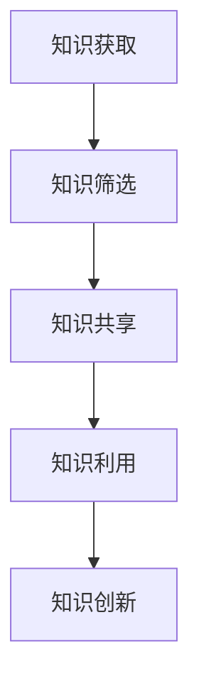
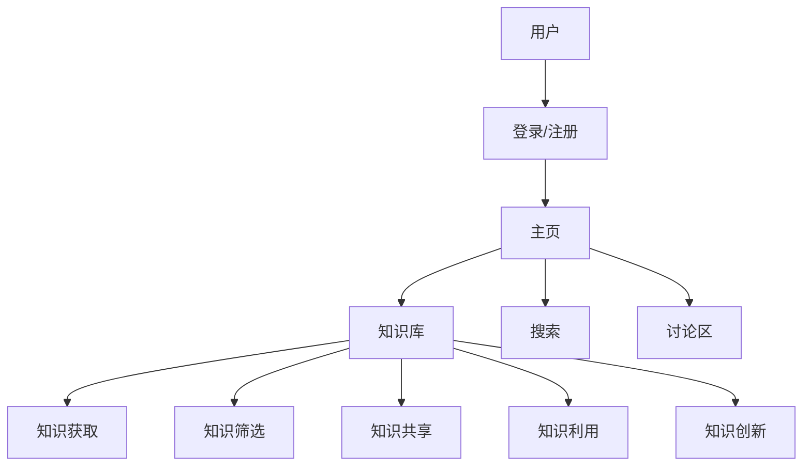
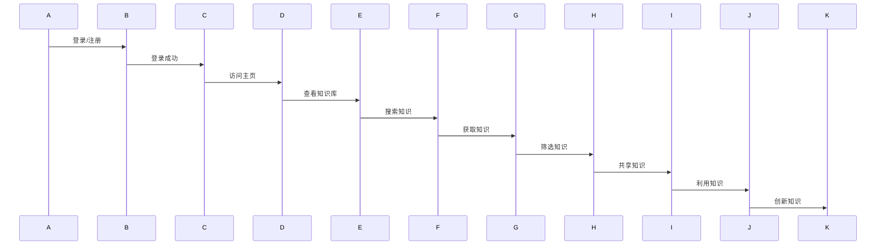

                 

# 如何建立技术团队的知识体系

## 关键词
- 技术团队知识体系
- 知识管理
- 知识共享
- 知识利用
- 知识创新

## 摘要
本文旨在探讨如何建立技术团队的知识体系，通过深入分析知识体系构建的原理和方法，帮助团队实现知识的高效获取、共享和利用。本文将从核心概念、知识获取、知识共享、知识利用、知识创新等方面进行阐述，结合具体案例和代码示例，提供系统化的解决方案，以提升技术团队的整体效率和创新能力。

## 第一部分：引言

### 第1章：技术团队知识体系的背景与意义

#### 1.1.1 问题背景
在当前快速变化的技术环境中，技术团队面临着日益复杂的技术挑战和快速迭代的产品需求。团队成员往往具备丰富的专业知识，但这些知识散落在个人大脑和文档中，难以有效共享和利用，导致以下问题：
- 知识积累效率低下
- 新员工融入困难
- 技术决策缺乏依据
- 创新能力受限

#### 1.1.2 问题描述
如何在一个技术团队中建立有效的知识体系，实现知识的有序组织、高效传递和持续创新，是当前面临的重要问题。

#### 1.1.3 问题解决
建立技术团队的知识体系，可以通过以下方法实现：
- 设计合理的知识分类体系
- 开发知识获取、共享、利用和创新的方法
- 建立知识管理平台
- 制定知识管理的政策和流程

#### 1.1.4 边界与外延
知识体系不仅包括技术层面的知识，还包括管理知识和经验知识。其外延涵盖了从知识获取到知识创新的整个流程。

#### 1.1.5 核心概念与联系
**概念原理：**
- **知识体系**：知识的有序组织结构，涵盖技术、管理、经验等方面。
- **技术团队**：具有共同目标、分工明确、协同工作的一组技术人员。
- **知识管理**：对知识进行获取、共享、利用和存储的过程。

**属性特征对比表格：**

| 概念      | 定义                                                         | 特点                       |  
| --------- | ------------------------------------------------------------ | -------------------------- |  
| 知识体系   | 知识的有序组织结构，涵盖技术、经验和方法                       | 结构化、系统化、可扩展   |  
| 技术团队   | 具有共同目标、分工明确、协同工作的一组技术人员                 | 专业性、协作性、创新性   |  
| 知识管理   | 对知识进行获取、共享、利用和存储的过程                       | 效率性、安全性、可持续性 |

**ER实体关系图架构的Mermaid流程图：**

```mermaid
erDiagram
  ID |KnowledgeSystem
  ID |TechnicalTeam
  ID |KnowledgeManagement

  KnowledgeSystem ||--|{ TechnicalTeam } TechnicalTeam
  TechnicalTeam ||--|{ KnowledgeManagement } KnowledgeManagement
```

### 1.2 小结
本章介绍了技术团队知识体系的背景、意义、问题及解决方法，明确了知识体系的核心概念和属性特征，为后续内容奠定了基础。

## 第二部分：技术团队知识体系的构建

### 第2章：技术团队知识体系构建的原理与方法

#### 2.1 核心概念原理
技术团队知识体系构建的核心概念包括知识分类、知识获取、知识共享、知识利用和知识创新。

**知识分类：**
- **技术知识**：包括编程语言、框架、工具、算法等。
- **管理知识**：包括项目管理、团队管理、流程管理、风险管理等。
- **经验知识**：包括工作经验、最佳实践、失败教训等。

**知识获取：**
- **内部知识获取**：通过团队成员的经验分享、文档整理、内部培训等途径。
- **外部知识获取**：通过技术社区、开源项目、行业报告等途径。

**知识共享：**
- **知识共享平台**：建立一个中心化的知识共享平台，支持文档、视频、讨论等多种形式的知识交流。
- **知识共享机制**：制定知识共享的规则和激励机制，鼓励团队成员积极参与知识分享。

**知识利用：**
- **知识应用**：将知识应用于实际工作中，解决具体问题，提升团队效率。
- **知识创新**：在现有知识的基础上进行创新，推动团队技术进步。

#### 2.2 算法原理讲解
技术团队知识体系构建的算法原理可以通过以下流程实现：

**Mermaid流程图：**



**Python源代码与算法原理：**

```python
def knowledge_acquisition(source):
    # 知识获取函数
    acquired_knowledge = source.get_knowledge()
    return acquired_knowledge

def knowledge_screening(knowledge):
    # 知识筛选函数
    screened_knowledge = [k for k in knowledge if k.is_relevant()]
    return screened_knowledge

def knowledge_sharing(knowledge):
    # 知识共享函数
    shared_knowledge = knowledge.share()
    return shared_knowledge

def knowledge_utilization(knowledge):
    # 知识利用函数
    utilized_knowledge = knowledge.use()
    return utilized_knowledge

def knowledge_innovation(knowledge):
    # 知识创新函数
    innovative_knowledge = knowledge.create()
    return innovative_knowledge
```

**算法原理的数学模型和公式：**
$$
\text{知识体系构建} = f(\text{知识获取}, \text{知识筛选}, \text{知识共享}, \text{知识利用}, \text{知识创新})
$$

**举例说明：**
假设技术团队需要构建一个关于机器学习的知识体系，可以按照以下步骤进行：

1. **知识获取**：通过技术社区、开源项目和学术论文等渠道获取机器学习相关的知识。
2. **知识筛选**：筛选出与团队项目密切相关的机器学习算法和技术，如神经网络、决策树等。
3. **知识共享**：在知识共享平台上发布这些知识，供团队成员学习和参考。
4. **知识利用**：将筛选出的知识应用于实际项目中，解决机器学习相关的问题。
5. **知识创新**：在现有知识的基础上，进行机器学习算法的改进和创新，提升团队的技术水平。

#### 2.3 系统分析与架构设计
为了更好地实现技术团队知识体系的构建，可以进行以下系统分析与架构设计：

**项目介绍：**
建立一个基于Web的在线知识共享平台，支持知识获取、筛选、共享、利用和创新。

**系统功能设计：**
- **知识库**：存储和管理各种知识。
- **用户管理**：管理用户账号和权限。
- **搜索功能**：支持关键词搜索和分类浏览。
- **讨论区**：支持用户交流和讨论。

**系统架构设计：**



**系统接口设计和系统交互：**



#### 2.4 项目实战
以下是一个具体的实战案例，介绍如何在一个技术团队中实施知识体系构建：

**环境安装：**
- 使用Docker搭建知识共享平台环境。
- 安装所需的开源知识管理软件。

**系统核心实现源代码：**

```python
# 知识获取模块
class KnowledgeAcquisition:
    def get_knowledge(self):
        # 实现知识获取的逻辑
        pass

# 知识筛选模块
class KnowledgeScreening:
    def is_relevant(self, knowledge):
        # 实现知识筛选的逻辑
        pass

# 知识共享模块
class KnowledgeSharing:
    def share(self, knowledge):
        # 实现知识共享的逻辑
        pass

# 知识利用模块
class KnowledgeUtilization:
    def use(self, knowledge):
        # 实现知识利用的逻辑
        pass

# 知识创新模块
class KnowledgeInnovation:
    def create(self, knowledge):
        # 实现知识创新的逻辑
        pass
```

**代码应用解读与分析：**
- **知识获取模块**：从外部来源获取知识，并进行初步整理。
- **知识筛选模块**：根据团队需求筛选出相关知识。
- **知识共享模块**：将筛选后的知识发布到知识库中。
- **知识利用模块**：在项目中应用筛选后的知识。
- **知识创新模块**：在现有知识的基础上进行创新，形成新的知识。

**实际案例分析和详细讲解剖析：**
- **案例**：在一个机器学习团队中，通过知识体系构建，实现了以下效果：
  - 提高了团队对新技术的了解和掌握。
  - 加速了项目开发进程。
  - 促进了团队成员之间的交流和合作。

**项目小结：**
通过实施知识体系构建，技术团队能够更加高效地获取、共享和利用知识，提升整体工作效率和创新能力。

#### 2.5 最佳实践 Tips
- **定期知识分享**：鼓励团队成员定期进行知识分享，提高知识共享的频率。
- **构建良好的知识库**：确保知识库内容丰富、结构清晰，方便团队成员查找和使用。
- **制定知识管理政策**：明确知识管理的目标和规则，确保知识管理工作的有序进行。
- **培训与指导**：为团队成员提供知识管理相关的培训和指导，提高其知识管理水平。

### 2.6 小结
本章详细介绍了技术团队知识体系构建的原理和方法，通过系统分析与架构设计，结合项目实战，提供了具体的实施步骤和最佳实践，为技术团队的知识管理提供了有力支持。

### 总结
建立技术团队的知识体系是一个复杂但至关重要的过程。通过有效的知识管理，技术团队能够更好地应对技术挑战，提高工作效率和创新能力。本文从核心概念、构建原理、系统分析与架构设计、项目实战等方面进行了详细阐述，旨在为技术团队的知识体系建设提供指导。希望读者能够结合自身实际情况，积极探索和实践，打造出高效的知识管理体系。

### 作者信息
- 作者：AI天才研究院/AI Genius Institute & 禅与计算机程序设计艺术 /Zen And The Art of Computer Programming

### 注意事项
- **知识获取的合法性与安全性**：确保获取知识的渠道合法，保护知识产权。
- **知识共享的公平与透明**：建立公正的知识共享机制，确保所有成员都能平等地获取和贡献知识。
- **知识利用的创新性**：鼓励在知识利用过程中进行创新，避免重复性工作。

### 拓展阅读
- 《企业知识管理实务》
- 《人工智能与知识管理》
- 《敏捷知识管理实践指南》
- 《知识体系构建：技术与策略》

通过不断学习和实践，技术团队能够不断完善知识体系，实现知识的持续积累和创新，为团队的长远发展奠定坚实基础。

