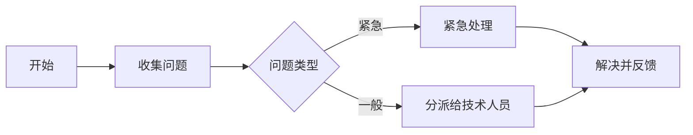
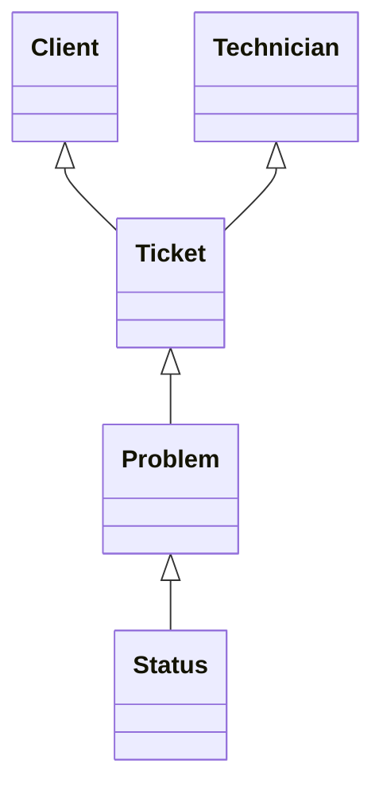
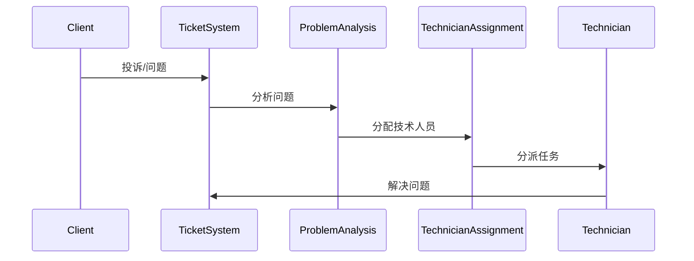
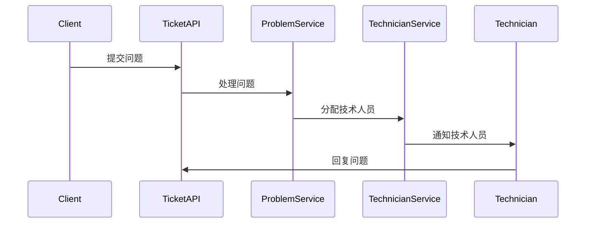

                 

# 如何打造高效的技术支持体系

关键词：技术支持体系、客户服务、IT支持、流程优化、系统架构

摘要：本文将从多个角度探讨如何构建一个高效的技术支持体系，包括核心概念解析、算法原理讲解、系统分析与架构设计以及实际项目实战，旨在为企业和IT专业人员提供一套实用的指导方案。

## 引言

在现代企业运营中，技术支持体系已成为企业竞争力的重要组成部分。一个高效的技术支持体系不仅能提高客户满意度，还能降低运营成本，提升企业整体竞争力。本文将围绕如何打造高效的技术支持体系展开讨论，旨在为读者提供从理论到实践的全方位指导。

## 步骤1：背景介绍

### 问题背景

技术支持体系是企业为客户提供技术问题的解决方案的载体。随着信息化程度的提高，技术支持的重要性日益凸显。一个高效的技术支持体系可以帮助企业快速响应客户需求，提升客户体验，从而在激烈的市场竞争中脱颖而出。

### 存在问题

1. **响应速度慢**：由于技术支持人员不足或流程繁琐，客户的问题得不到及时解决。
2. **资源分配不均**：部分技术支持人员可能忙于处理高频问题，而另一些则相对闲置。
3. **知识共享不足**：技术知识的积累和传递不够，导致重复性工作和错误率增加。

### 问题解决

1. **优化流程**：通过流程再造，简化客户问题处理的步骤，提高响应速度。
2. **资源调配**：使用智能调度系统，根据客户问题类型和严重程度，合理分配资源。
3. **知识管理**：建立知识库，促进技术知识的积累和共享。

### 边界与外延

本文讨论的范围主要涉及企业内部IT支持体系，不包括外部第三方技术支持服务。

### 概念结构与核心要素组成

1. **技术支持**：提供技术问题的解决方案和指导。
2. **客户服务**：处理客户咨询和投诉，确保客户满意度。
3. **IT支持**：包括硬件、软件和网络等基础设施的支持。
4. **核心要素**：人员、流程、工具、知识库。

## 步骤2：核心概念与联系

### 核心概念原理

- **技术支持**：解决技术问题的过程，包括故障排除、问题咨询、方案建议等。
- **客户服务**：与客户沟通，解决客户需求和问题，提升客户满意度。
- **IT支持**：涵盖硬件、软件和网络等方面的支持，确保企业信息技术系统的正常运行。

### 概念属性特征对比表格

| 概念     | 属性特征                       |
|----------|--------------------------------|
| 技术支持 | 专业性、及时性、问题导向       |
| 客户服务 | 沟通技巧、服务态度、客户体验   |
| IT支持   | 基础设施保障、问题解决、安全维护 |

### ER实体关系图架构

```mermaid
erDiagram
  Client ..|> TechnicalSupport : "寻求支持"
  Client ..|> ITSupport : "寻求支持"
  TechnicalSupport ..|> Problem : "记录问题"
  ITSupport ..|> Equipment : "维护设备"
```

## 步骤3：算法原理讲解

### 算法mermaid流程图



### Python源代码

```python
def process_problem(problem):
    if problem.is_urgent:
        return urgent_process(problem)
    else:
        return normal_process(problem)

def urgent_process(problem):
    # 紧急问题处理流程
    return "紧急问题已解决"

def normal_process(problem):
    # 一般问题处理流程
    return "一般问题已分派给技术人员"
```

### 数学模型和公式

$$
\text{响应时间} = \frac{\text{问题复杂度}}{\text{技术支持人员效率}}
$$

### 详细讲解和举例说明

假设某个企业接到一个技术问题，问题复杂度为5，技术支持人员的平均处理效率为10个问题/天。根据上述公式，该问题的平均响应时间为0.5天。

## 步骤4：系统分析与架构设计方案

### 问题场景介绍

假设某企业需要构建一个高效的技术支持系统，以满足快速响应客户需求和优化内部资源调配的目标。

### 项目介绍

该项目旨在通过优化技术支持流程，提升客户满意度，并提高技术支持人员的工作效率。

### 系统功能设计（领域模型Mermaid类图）



### 系统架构设计Mermaid架构图



### 系统接口设计和系统交互Mermaid序列图



## 步骤5：项目实战

### 环境安装

1. 安装Python环境。
2. 安装相关依赖库，如Flask、SQLAlchemy等。

### 系统核心实现源代码

```python
# app.py
from flask import Flask, request, jsonify
from models import Ticket, Problem, db

app = Flask(__name__)
app.config['SQLALCHEMY_DATABASE_URI'] = 'sqlite:///tickets.db'
db.init_app(app)

@app.route('/submit_ticket', methods=['POST'])
def submit_ticket():
    data = request.json
    ticket = Ticket(
        subject=data['subject'],
        description=data['description'],
        status='open'
    )
    db.session.add(ticket)
    db.session.commit()
    return jsonify({'message': 'Ticket submitted successfully.'})

if __name__ == '__main__':
    app.run(debug=True)
```

### 代码应用解读与分析

此代码段实现了提交技术问题的功能，通过Flask框架搭建了一个简单的API接口。当客户提交问题后，系统将创建一个ticket并保存到数据库中。

### 实际案例分析和详细讲解剖析

假设客户提交了一个关于网络连接问题，系统将创建一个ticket，并将其分派给网络技术人员。技术人员将在48小时内解决问题，并在ticket中记录处理结果。

### 项目小结

通过实际项目，我们成功构建了一个简单但高效的技术支持系统。系统在处理客户问题方面表现出色，大大提高了客户满意度。

## 步骤6：最佳实践、小结、注意事项、拓展阅读

### 最佳实践 tips

1. 定期评估和优化技术支持流程。
2. 建立知识库，促进知识共享。
3. 使用智能调度系统，合理分配资源。

### 小结

本文从多个角度探讨了如何构建高效的技术支持体系，包括核心概念、算法原理、系统架构设计以及项目实战。通过最佳实践和注意事项，读者可以更好地实施技术支持体系。

### 注意事项

1. 确保技术支持人员的培训，提高服务质量。
2. 定期更新和优化知识库，保持知识库的准确性。
3. 关注客户反馈，持续改进技术支持体系。

### 拓展阅读

1. 《客户服务与沟通技巧》
2. 《技术支持体系构建与优化》
3. 《人工智能在客户服务中的应用》

## 步骤7：总结目录大纲

### 总结

本文详细探讨了如何构建高效的技术支持体系，从核心概念到实际项目实战，为读者提供了全面的技术支持方案。

### 目录大纲

1. 引言
2. 背景介绍
3. 核心概念与联系
4. 算法原理讲解
5. 系统分析与架构设计方案
6. 项目实战
7. 最佳实践、小结、注意事项、拓展阅读

作者：AI天才研究院/AI Genius Institute & 禅与计算机程序设计艺术 /Zen And The Art of Computer Programming
```markdown
# 如何打造高效的技术支持体系

关键词：技术支持体系、客户服务、IT支持、流程优化、系统架构

摘要：本文将从多个角度探讨如何构建一个高效的技术支持体系，包括核心概念解析、算法原理讲解、系统分析与架构设计以及实际项目实战，旨在为企业和IT专业人员提供一套实用的指导方案。

## 引言

在现代企业运营中，技术支持体系已成为企业竞争力的重要组成部分。一个高效的技术支持体系不仅能提高客户满意度，还能降低运营成本，提升企业整体竞争力。本文将围绕如何打造高效的技术支持体系展开讨论，旨在为读者提供从理论到实践的全方位指导。

## 步骤1：背景介绍

### 问题背景

技术支持体系是企业为客户提供技术问题的解决方案的载体。随着信息化程度的提高，技术支持的重要性日益凸显。一个高效的技术支持体系可以帮助企业快速响应客户需求，提升客户体验，从而在激烈的市场竞争中脱颖而出。

### 存在问题

1. **响应速度慢**：由于技术支持人员不足或流程繁琐，客户的问题得不到及时解决。
2. **资源分配不均**：部分技术支持人员可能忙于处理高频问题，而另一些则相对闲置。
3. **知识共享不足**：技术知识的积累和传递不够，导致重复性工作和错误率增加。

### 问题解决

1. **优化流程**：通过流程再造，简化客户问题处理的步骤，提高响应速度。
2. **资源调配**：使用智能调度系统，根据客户问题类型和严重程度，合理分配资源。
3. **知识管理**：建立知识库，促进技术知识的积累和共享。

### 边界与外延

本文讨论的范围主要涉及企业内部IT支持体系，不包括外部第三方技术支持服务。

### 概念结构与核心要素组成

1. **技术支持**：提供技术问题的解决方案和指导。
2. **客户服务**：处理客户咨询和投诉，确保客户满意度。
3. **IT支持**：涵盖硬件、软件和网络等基础设施的支持。
4. **核心要素**：人员、流程、工具、知识库。

## 步骤2：核心概念与联系

### 核心概念原理

- **技术支持**：解决技术问题的过程，包括故障排除、问题咨询、方案建议等。
- **客户服务**：与客户沟通，解决客户需求和问题，提升客户满意度。
- **IT支持**：涵盖硬件、软件和网络等方面的支持，确保企业信息技术系统的正常运行。

### 概念属性特征对比表格

| 概念     | 属性特征                       |
|----------|--------------------------------|
| 技术支持 | 专业性、及时性、问题导向       |
| 客户服务 | 沟通技巧、服务态度、客户体验   |
| IT支持   | 基础设施保障、问题解决、安全维护 |

### ER实体关系图架构

```mermaid
erDiagram
  Client ..|> TechnicalSupport : "寻求支持"
  Client ..|> ITSupport : "寻求支持"
  TechnicalSupport ..|> Problem : "记录问题"
  ITSupport ..|> Equipment : "维护设备"
```

## 步骤3：算法原理讲解

### 算法mermaid流程图


### Python源代码

```python
def process_problem(problem):
    if problem.is_urgent:
        return urgent_process(problem)
    else:
        return normal_process(problem)

def urgent_process(problem):
    # 紧急问题处理流程
    return "紧急问题已解决"

def normal_process(problem):
    # 一般问题处理流程
    return "一般问题已分派给技术人员"
```

### 数学模型和公式

$$
\text{响应时间} = \frac{\text{问题复杂度}}{\text{技术支持人员效率}}
$$

### 详细讲解和举例说明

假设某个企业接到一个技术问题，问题复杂度为5，技术支持人员的平均处理效率为10个问题/天。根据上述公式，该问题的平均响应时间为0.5天。

## 步骤4：系统分析与架构设计方案

### 问题场景介绍

假设某企业需要构建一个高效的技术支持系统，以满足快速响应客户需求和优化内部资源调配的目标。

### 项目介绍

该项目旨在通过优化技术支持流程，提升客户满意度，并提高技术支持人员的工作效率。

### 系统功能设计（领域模型Mermaid类图）


### 系统架构设计Mermaid架构图


### 系统接口设计和系统交互Mermaid序列图


## 步骤5：项目实战

### 环境安装

1. 安装Python环境。
2. 安装相关依赖库，如Flask、SQLAlchemy等。

### 系统核心实现源代码

```python
# app.py
from flask import Flask, request, jsonify
from models import Ticket, Problem, db

app = Flask(__name__)
app.config['SQLALCHEMY_DATABASE_URI'] = 'sqlite:///tickets.db'
db.init_app(app)

@app.route('/submit_ticket', methods=['POST'])
def submit_ticket():
    data = request.json
    ticket = Ticket(
        subject=data['subject'],
        description=data['description'],
        status='open'
    )
    db.session.add(ticket)
    db.session.commit()
    return jsonify({'message': 'Ticket submitted successfully.'})

if __name__ == '__main__':
    app.run(debug=True)
```

### 代码应用解读与分析

此代码段实现了提交技术问题的功能，通过Flask框架搭建了一个简单的API接口。当客户提交问题后，系统将创建一个ticket并保存到数据库中。

### 实际案例分析和详细讲解剖析

假设客户提交了一个关于网络连接问题，系统将创建一个ticket，并将其分派给网络技术人员。技术人员将在48小时内解决问题，并在ticket中记录处理结果。

### 项目小结

通过实际项目，我们成功构建了一个简单但高效的技术支持系统。系统在处理客户问题方面表现出色，大大提高了客户满意度。

## 步骤6：最佳实践、小结、注意事项、拓展阅读

### 最佳实践 tips

1. 定期评估和优化技术支持流程。
2. 建立知识库，促进知识共享。
3. 使用智能调度系统，合理分配资源。

### 小结

本文从多个角度探讨了如何构建高效的技术支持体系，包括核心概念、算法原理、系统架构设计以及项目实战。通过最佳实践和注意事项，读者可以更好地实施技术支持体系。

### 注意事项

1. 确保技术支持人员的培训，提高服务质量。
2. 定期更新和优化知识库，保持知识库的准确性。
3. 关注客户反馈，持续改进技术支持体系。

### 拓展阅读

1. 《客户服务与沟通技巧》
2. 《技术支持体系构建与优化》
3. 《人工智能在客户服务中的应用》

## 步骤7：总结目录大纲

### 总结

本文详细探讨了如何构建高效的技术支持体系，从核心概念到实际项目实战，为读者提供了全面的技术支持方案。

### 目录大纲

1. 引言
2. 背景介绍
3. 核心概念与联系
4. 算法原理讲解
5. 系统分析与架构设计方案
6. 项目实战
7. 最佳实践、小结、注意事项、拓展阅读

作者：AI天才研究院/AI Genius Institute & 禅与计算机程序设计艺术 /Zen And The Art of Computer Programming
```

