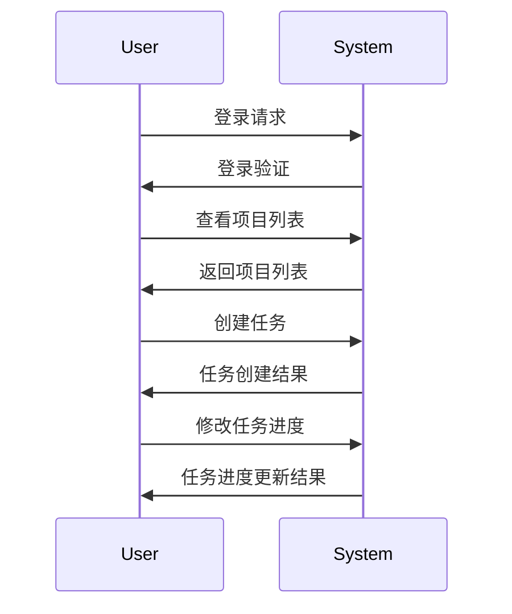
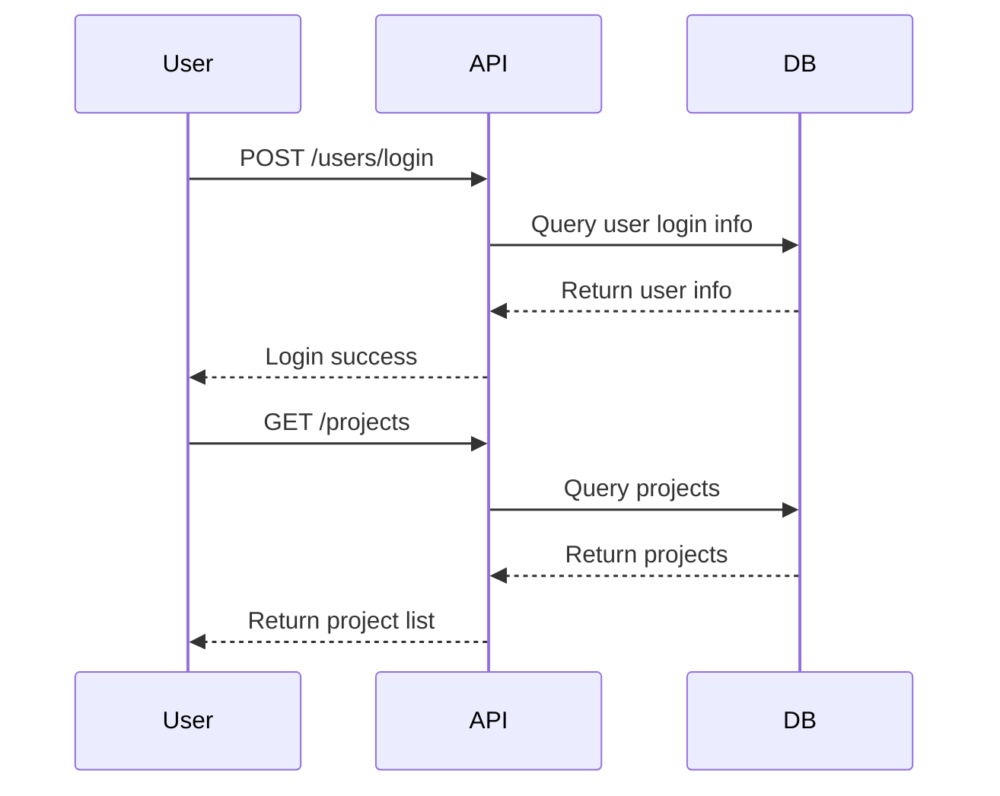
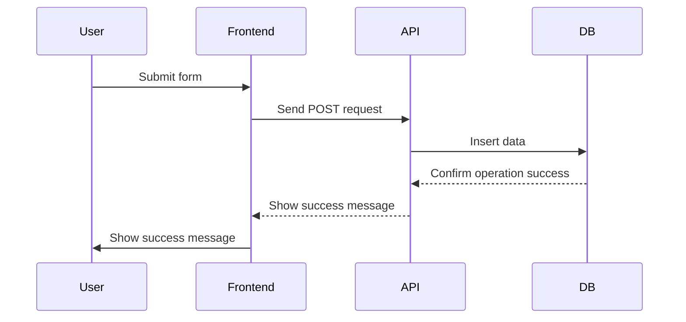

                 

### 引言

在现代信息科技飞速发展的背景下，技术管理体系的重要性愈发凸显。技术管理不仅仅是简单的任务分配和资源调配，它涵盖了项目规划、团队协作、技术评估、系统架构设计等多个方面，其核心在于如何有效地组织和管理技术资源，以提高整个团队的效率和项目的成功率。因此，本文将以《如何打造高效的技术管理体系》为题，深入探讨技术管理体系的设计与实践。

首先，让我们明确几个关键问题：什么是技术管理体系？为什么它如此重要？在构建高效技术管理体系时，我们需要考虑哪些关键因素？本文将逐步回答这些问题，并提供具体的指导和建议。

1. **什么是技术管理体系？**

   技术管理体系是指一系列用于规划、执行、监控和改进技术项目的方法、工具和流程。它旨在确保技术团队能够高效地工作，同时确保项目目标的实现。技术管理体系不仅涉及技术本身，还包括项目管理、团队协作、流程优化等多个方面。

2. **为什么技术管理体系如此重要？**

   高效的技术管理体系能够显著提升团队的执行力，减少资源浪费，提高项目成功率。以下是一些具体的原因：
   
   - **提高效率**：通过规范的工作流程和标准化的工具，可以减少重复工作，提高工作效率。
   - **降低风险**：明确的责任分配和监控机制可以降低项目失败的风险。
   - **提高质量**：系统化的测试和质量控制流程可以确保产品的质量。
   - **促进协作**：良好的沟通和协作机制能够促进团队成员之间的合作，提升团队整体能力。

3. **构建高效技术管理体系的关键因素**

   - **明确的目标和策略**：首先要明确团队的目标和战略方向，以便为技术管理体系提供清晰的指导。
   - **合理的架构设计**：技术管理体系的架构需要能够支持团队的规模和项目类型。
   - **高效的流程和规范**：流程和规范是技术管理体系的基石，需要确保其简洁、实用且易于执行。
   - **有效的监控和评估**：通过监控和评估机制，可以及时发现并解决问题，确保项目按计划进行。
   - **持续改进的文化**：持续改进是技术管理体系成功的关键，需要营造一种不断学习和优化的文化氛围。

在接下来的章节中，我们将详细探讨这些关键因素，并提供具体的实施策略。首先，我们将介绍技术管理的基础概念和联系，然后深入讨论技术管理体系的具体构建和实施方法，最后分享一些最佳实践和项目实战经验。希望通过本文的探讨，能够为广大技术管理者提供有价值的参考和指导。

---

关键词：技术管理体系、高效构建、关键因素、流程优化、项目成功

摘要：本文深入探讨了如何打造高效的技术管理体系，包括基础概念、核心构建要素、实施策略和最佳实践。通过明确目标和策略、合理架构设计、高效流程和规范、有效监控与评估，以及持续改进的文化，技术管理者可以显著提升团队效率和项目成功率。

---

### 核心概念与联系

要构建高效的技术管理体系，我们首先需要理解一系列核心概念，并探讨它们之间的联系。这些核心概念包括项目管理、流程管理、团队协作、技术评估等，它们构成了技术管理体系的基石。以下是这些核心概念及其属性特征对比表格，以帮助我们更好地理解它们之间的关系。

#### 1. 项目管理

项目管理是技术管理体系的重要组成部分，它涉及到项目计划、执行、监控和收尾的全过程。项目管理的主要目标是确保项目按时、按质、按预算完成。

- **属性特征**：目标导向、时间约束、资源优化、风险控制。
- **关联**：项目管理为技术管理体系提供了明确的目标和进度计划，指导其他管理活动的实施。

#### 2. 流程管理

流程管理关注的是如何优化和标准化工作流程，以提高效率和一致性。流程管理包括流程设计、流程执行、流程监控和流程改进。

- **属性特征**：标准化、效率化、一致性、持续改进。
- **关联**：流程管理确保技术管理体系中的各项活动能够有序、高效地进行，减少错误和重复工作。

#### 3. 团队协作

团队协作是指团队成员之间的合作和沟通，以实现共同的目标。团队协作需要良好的沟通机制、明确的角色分工和高效的协作工具。

- **属性特征**：协作性、透明性、信任、高效沟通。
- **关联**：团队协作是技术管理体系成功的关键，它确保团队成员能够协同工作，共同推动项目前进。

#### 4. 技术评估

技术评估是对技术方案、技术能力和技术水平进行评价和衡量。技术评估的目的是确保技术方案能够满足项目需求，并评估团队的技术能力。

- **属性特征**：准确性、全面性、客观性、动态性。
- **关联**：技术评估为技术管理体系提供了科学依据，帮助管理者做出正确的决策。

#### 核心概念属性特征对比表格

| 核心概念 | 属性特征 | 关联 |
| --- | --- | --- |
| 项目管理 | 目标导向、时间约束、资源优化、风险控制 | 提供目标和进度计划 |
| 流程管理 | 标准化、效率化、一致性、持续改进 | 优化和标准化工作流程 |
| 团队协作 | 协作性、透明性、信任、高效沟通 | 促进团队成员协同工作 |
| 技术评估 | 准确性、全面性、客观性、动态性 | 提供决策依据 |

#### ER实体关系图架构

为了更清晰地展示这些核心概念之间的联系，我们可以使用ER（实体-关系）图来构建技术管理体系的架构。以下是一个简化的ER图，用于描述核心概念之间的关联：

```
[技术管理体系]
    |
[项目管理]    [流程管理]
    |             |
[团队协作]    [技术评估]
    |
[资源分配]
```

- **技术管理体系**：作为整体架构，它包含项目管理、流程管理、团队协作和技术评估等子模块。
- **项目管理**：负责制定项目目标和计划，协调资源，监控进度。
- **流程管理**：负责设计、执行和改进工作流程，确保高效运作。
- **团队协作**：负责促进团队成员之间的沟通和协作，提高团队执行力。
- **技术评估**：负责评估技术方案和技术能力，确保符合项目需求。

通过上述核心概念及其关联的探讨，我们为构建高效的技术管理体系奠定了基础。在接下来的章节中，我们将深入探讨技术管理体系的具体构建和实施方法，以帮助技术管理者更好地理解和应用这些概念。

---

### 管理体系架构设计

技术管理体系的架构设计是确保其高效运行的关键环节。一个合理的架构设计不仅能够提升团队的工作效率，还能够确保项目的顺利进行和目标的达成。以下是技术管理体系架构设计的基本原则、具体步骤和流程。

#### 1. 架构设计原则

在设计技术管理体系架构时，应遵循以下原则：

- **模块化**：将管理体系分解为多个模块，每个模块负责特定的功能，便于维护和扩展。
- **标准化**：制定统一的技术标准和流程，确保整个团队的工作一致性和效率。
- **灵活性**：架构设计应具备良好的扩展性和适应性，以应对技术变化和业务需求。
- **可监控性**：设计时考虑监控机制，确保能够及时发现和解决问题。
- **安全性**：确保数据安全和技术安全，防止潜在风险。

#### 2. 架构设计步骤

技术管理体系架构设计的具体步骤如下：

1. **需求分析**：
   - 了解项目背景和目标，明确技术管理体系的用途和需求。
   - 确定管理体系所需支持的功能和流程。

2. **模块划分**：
   - 根据需求分析结果，将技术管理体系划分为多个模块，如项目管理、流程管理、团队协作、技术评估等。
   - 确定每个模块的功能和职责。

3. **架构设计**：
   - 设计各模块的内部架构，如数据库设计、接口设计、组件设计等。
   - 确定各模块之间的交互关系和接口定义。

4. **流程设计**：
   - 设计各模块的工作流程，包括输入、处理、输出等。
   - 确保流程的简洁性和可操作性。

5. **技术选型**：
   - 根据架构设计要求，选择合适的技术栈和工具，如编程语言、数据库、开发框架等。

6. **安全性设计**：
   - 设计数据安全和系统安全的机制，包括数据加密、访问控制、备份和恢复等。

7. **评审与优化**：
   - 对架构设计进行评审，确保其符合需求和分析结果。
   - 根据评审反馈进行优化和调整。

#### 3. 架构设计流程

以下是技术管理体系架构设计的基本流程：

1. **需求分析**：
   - 项目启动：明确项目目标和需求。
   - 调研现状：了解现有技术和管理体系的情况。
   - 确定需求：制定详细的需求文档。

2. **模块划分**：
   - 确定模块：根据需求分析结果，划分项目管理、流程管理、团队协作、技术评估等模块。
   - 功能定义：明确每个模块的具体功能和职责。

3. **架构设计**：
   - 设计模块架构：设计每个模块的内部架构，如数据库设计、接口设计、组件设计等。
   - 确定交互关系：设计各模块之间的交互关系和接口定义。

4. **流程设计**：
   - 设计流程：根据模块功能，设计各模块的工作流程，包括输入、处理、输出等。
   - 确保简洁性：优化流程，确保简洁且易于操作。

5. **技术选型**：
   - 选择技术栈：根据架构设计要求，选择合适的编程语言、数据库、开发框架等。
   - 确定工具：选择支持技术栈的开发工具和平台。

6. **安全性设计**：
   - 设计安全机制：确保数据安全和系统安全，设计数据加密、访问控制、备份和恢复等机制。

7. **评审与优化**：
   - 进行评审：组织架构评审会议，确保架构设计符合需求和分析结果。
   - 优化调整：根据评审反馈，进行架构优化和调整。

通过上述架构设计原则、步骤和流程，技术管理者可以设计出一个高效、合理、灵活的技术管理体系。在接下来的章节中，我们将进一步探讨如何实施这个架构，并分享最佳实践和项目实战经验。

---

### 管理流程与规范

在构建高效的技术管理体系中，管理流程与规范的制定和执行至关重要。这不仅有助于提高团队的协作效率，还能确保项目按计划顺利进行。以下是技术管理流程与规范的具体内容和执行步骤。

#### 1. 管理流程

技术管理流程包括项目启动、项目规划、项目执行、项目监控和项目收尾等环节。以下是每个环节的具体内容：

- **项目启动**：
  - 明确项目目标和范围。
  - 确定项目团队和组织结构。
  - 制定项目计划和时间表。

- **项目规划**：
  - 制定详细的项目计划，包括任务分配、资源需求和进度安排。
  - 设计项目流程和规范，确保各项工作有序进行。

- **项目执行**：
  - 执行项目计划，包括开发、测试、部署等任务。
  - 定期召开项目会议，讨论项目进展和问题。
  - 及时调整计划和资源，确保项目按计划进行。

- **项目监控**：
  - 监控项目进度、质量和成本，确保项目目标实现。
  - 定期生成项目报告，为决策提供依据。

- **项目收尾**：
  - 完成项目任务，进行项目验收。
  - 进行项目总结和评估，总结经验教训。

#### 2. 规范制定

技术管理规范的制定需要考虑以下几个方面：

- **标准化流程**：制定统一的流程规范，确保各项工作按照标准化进行，减少错误和重复工作。

- **编码规范**：制定统一的编码规范，包括命名规则、代码格式、注释规范等，提高代码的可读性和可维护性。

- **测试规范**：制定测试规范，包括测试用例设计、测试环境搭建、测试报告撰写等，确保产品质量。

- **文档规范**：制定文档规范，包括文档格式、内容要求、更新机制等，确保文档的完整性和一致性。

- **安全规范**：制定安全规范，包括数据加密、访问控制、备份和恢复等，确保数据安全和系统安全。

#### 3. 规范执行与监督

规范的执行和监督是技术管理体系运行的关键。以下是规范执行与监督的步骤：

- **培训**：对团队成员进行培训，确保他们熟悉并遵循规范。

- **检查**：定期对规范执行情况进行检查，发现并纠正不符合规范的行为。

- **反馈**：建立反馈机制，收集团队成员的意见和建议，不断改进规范。

- **奖励与惩罚**：对严格遵守规范的团队成员给予奖励，对违反规范的团队成员进行惩罚。

通过制定详细的管理流程和规范，并确保其有效执行和监督，技术管理者可以显著提升团队的协作效率和项目成功率。在接下来的章节中，我们将继续探讨如何通过技术能力评估来进一步优化技术管理体系。

---

### 技术能力评估

技术能力评估是技术管理体系中至关重要的一环，它不仅能够帮助管理者了解团队的技术实力，还能为项目的顺利推进提供可靠的依据。以下是技术能力评估的指标体系、评估流程以及评估结果的应用。

#### 1. 评估指标体系

技术能力评估的指标体系应全面、科学地反映团队的技术水平。以下是一些常见的评估指标：

- **技术水平**：包括编程能力、算法水平、系统设计能力等。
- **项目管理能力**：包括项目规划、进度控制、风险管理等。
- **团队协作能力**：包括沟通能力、协作效率、团队文化等。
- **创新能力**：包括技术钻研、创新成果、技术论文发表等。
- **代码质量**：包括代码可读性、可维护性、Bug率等。
- **交付能力**：包括按时交付、质量稳定、客户满意度等。

#### 2. 评估流程

技术能力评估的流程一般包括以下几个步骤：

- **准备工作**：制定评估计划，确定评估指标和评估方法。
- **数据收集**：通过问卷调查、代码审查、项目评估等方式收集数据。
- **数据分析**：对收集到的数据进行统计和分析，评估团队的技术水平。
- **结果反馈**：向团队成员反馈评估结果，讨论改进措施。
- **持续改进**：根据评估结果，制定改进计划，持续提升技术能力。

#### 3. 评估结果与应用

评估结果的应用主要体现在以下几个方面：

- **团队建设**：通过评估结果，了解团队成员的强项和弱点，针对性地进行培训和提升。
- **项目分配**：根据评估结果，合理分配项目任务，确保项目能够得到最优的人员配置。
- **绩效评估**：将评估结果纳入员工的绩效评估体系，激励团队成员持续提升技术能力。
- **技术决策**：在技术选型和方案设计时，参考评估结果，选择最合适的方案。

#### 4. 评估工具和方法

为了确保评估的准确性和科学性，可以采用以下工具和方法：

- **问卷调查**：通过设计问卷，收集团队成员对技术能力的自我评价。
- **代码审查**：邀请资深技术人员对团队成员的代码进行审查，评估其代码质量。
- **项目评估**：对已完成的项目进行评估，分析其在技术和管理方面的表现。
- **能力测评**：通过设计一系列技术挑战和难题，评估团队成员的实际技术能力。

通过建立科学、系统的技术能力评估体系，技术管理者可以更好地了解团队的技术实力，为项目的顺利推进和团队的持续发展提供有力支持。

---

### 系统分析与架构设计

在进行技术管理体系实施之前，系统分析与架构设计是至关重要的一步。这一过程不仅决定了系统的功能性、可扩展性和可靠性，还直接影响到项目的成功率。以下是系统分析与架构设计的基本步骤和详细内容。

#### 1. 问题场景介绍

在开始系统分析与架构设计之前，首先需要明确问题的场景和需求。以下是典型的技术管理体系问题场景：

- **问题背景**：公司正在经历快速扩张，技术团队规模不断扩大，项目管理复杂度增加，传统的管理方法已难以满足需求。
- **问题表现**：项目管理混乱、任务分配不均、进度无法有效控制、团队协作不畅、技术评估不准确等。
- **解决方案需求**：需要一个高效、灵活、易于扩展的技术管理体系，以提升项目管理效率和团队协作能力。

#### 2. 系统功能设计

系统功能设计是系统分析与架构设计的关键环节，它决定了系统能够提供哪些功能来满足需求。以下是系统功能设计的主要内容：

- **用户管理**：包括用户注册、登录、权限管理等功能，确保系统能够对不同的用户角色进行有效管理。
- **项目管理**：包括项目创建、任务分配、进度跟踪、风险管理等功能，确保项目能够按时、按质完成。
- **流程管理**：包括流程设计、流程执行、流程监控等功能，确保工作流程的标准化和高效化。
- **团队协作**：包括消息通知、讨论区、共享文件等功能，促进团队成员之间的沟通和协作。
- **技术评估**：包括技术能力评估、技术成果展示、技术文档管理等功能，确保技术评估的科学性和准确性。
- **统计分析**：包括项目进度统计、团队绩效统计等功能，为决策提供数据支持。

#### 3. 系统架构设计

系统架构设计是将系统功能转化为实际的技术架构，包括技术选型、数据库设计、接口设计等方面。以下是系统架构设计的主要内容：

- **技术选型**：
  - **前端技术**：选择React或Vue.js等现代化的前端框架，确保系统界面友好、响应快速。
  - **后端技术**：选择Spring Boot或Django等流行的后端框架，确保系统功能强大、易于扩展。
  - **数据库技术**：选择MySQL或PostgreSQL等关系型数据库，确保数据存储安全、可靠。

- **数据库设计**：
  - 设计用户表、项目表、任务表、流程表、技术评估表等核心数据表，确保数据的完整性和一致性。
  - 设计索引和触发器，优化查询性能和数据操作效率。

- **接口设计**：
  - 设计RESTful API接口，提供用户管理、项目管理、流程管理、团队协作、技术评估等功能。
  - 设计安全接口，确保接口的安全性，防止数据泄露和恶意攻击。

- **系统架构图**：



#### 4. 系统接口设计

系统接口设计是确保系统各模块之间能够无缝协作的关键。以下是系统接口设计的主要内容：

- **接口规范**：制定统一的接口规范，包括请求参数、返回结果、错误处理等。
- **接口文档**：编写详细的接口文档，为开发、测试和维护提供指导。
- **接口安全性**：设计安全机制，如身份验证、权限控制等，确保接口的安全性。

- **接口设计示例**：



#### 5. 系统交互

系统交互设计是确保系统能够响应外部请求并正常工作的关键。以下是系统交互设计的主要内容：

- **交互流程**：设计系统各模块之间的交互流程，确保系统能够按预期工作。
- **交互模型**：选择合适的交互模型，如RESTful API、WebSocket等。
- **异步处理**：设计异步处理机制，提高系统响应速度和处理能力。

- **交互设计示例**：



通过上述系统分析与架构设计，技术管理者可以确保技术管理体系的稳定性和高效性。在接下来的章节中，我们将详细探讨如何在实践中实施这些设计和实现技术管理体系。

---

### 项目实战

在技术管理体系实施过程中，实际操作和项目实战是检验理论知识和设计方案的重要环节。以下是具体的项目实战步骤、环境安装、系统核心实现、代码应用解读与分析，以及实际案例分析和详细讲解。

#### 1. 环境安装

为了确保技术管理体系的顺利运行，我们需要搭建一个适合的开发和运行环境。以下是环境安装的步骤：

- **操作系统**：安装Linux或Mac OS，推荐使用Ubuntu 20.04。
- **编程语言**：选择Python 3.8及以上版本，安装Python环境。
- **开发工具**：安装PyCharm或VSCode，选择合适的IDE。
- **数据库**：安装MySQL或PostgreSQL，创建数据库和用户。
- **依赖管理**：安装pip，通过pip安装必要的Python依赖库，如Flask、SQLAlchemy等。

#### 2. 系统核心实现

系统核心实现包括用户管理、项目管理、流程管理、团队协作和技术评估等模块。以下是系统核心实现的源代码和解读：

```python
# 用户管理模块
class UserManager:
    def __init__(self, db):
        self.db = db

    def register(self, username, password):
        # 注册新用户
        sql = "INSERT INTO users (username, password) VALUES (%s, %s)"
        self.db.execute(sql, (username, password))
        self.db.commit()

    def login(self, username, password):
        # 用户登录
        sql = "SELECT * FROM users WHERE username = %s AND password = %s"
        result = self.db.execute(sql, (username, password))
        return result.fetchone()

# 项目管理模块
class ProjectManager:
    def __init__(self, db):
        self.db = db

    def create_project(self, project_name):
        # 创建新项目
        sql = "INSERT INTO projects (name) VALUES (%s)"
        self.db.execute(sql, (project_name))
        self.db.commit()

    def assign_task(self, project_id, task_name, assignee):
        # 分配任务
        sql = "INSERT INTO tasks (project_id, name, assignee) VALUES (%s, %s, %s)"
        self.db.execute(sql, (project_id, task_name, assignee))
        self.db.commit()

# 流程管理模块
class WorkflowManager:
    def __init__(self, db):
        self.db = db

    def define_workflow(self, workflow_name, steps):
        # 定义流程
        sql = "INSERT INTO workflows (name, steps) VALUES (%s, %s)"
        self.db.execute(sql, (workflow_name, steps))
        self.db.commit()

    def execute_workflow(self, workflow_id):
        # 执行流程
        sql = "SELECT * FROM workflows WHERE id = %s"
        result = self.db.execute(sql, (workflow_id))
        workflow = result.fetchone()
        for step in workflow.steps.split(','):
            # 执行每个步骤
            print(f"Executing step: {step}")

# 团队协作模块
class CollaborationManager:
    def __init__(self, db):
        self.db = db

    def create_discussion(self, project_id, title, content):
        # 创建讨论
        sql = "INSERT INTO discussions (project_id, title, content) VALUES (%s, %s, %s)"
        self.db.execute(sql, (project_id, title, content))
        self.db.commit()

    def add_comment(self, discussion_id, user_id, content):
        # 添加评论
        sql = "INSERT INTO comments (discussion_id, user_id, content) VALUES (%s, %s, %s)"
        self.db.execute(sql, (discussion_id, user_id, content))
        self.db.commit()

# 技术评估模块
class TechAssessmentManager:
    def __init__(self, db):
        self.db = db

    def assess_technology(self, user_id, assessment):
        # 进行技术评估
        sql = "INSERT INTO assessments (user_id, assessment) VALUES (%s, %s)"
        self.db.execute(sql, (user_id, assessment))
        self.db.commit()
```

#### 3. 代码应用解读与分析

上述代码示例展示了技术管理系统中各个核心模块的基本实现。以下是代码应用解读与分析：

- **用户管理模块**：负责用户的注册和登录，通过数据库操作实现用户的增删改查。
- **项目管理模块**：负责项目的创建和任务分配，确保项目任务的清晰划分和执行。
- **流程管理模块**：负责流程的定义和执行，通过步骤的顺序执行实现流程自动化。
- **团队协作模块**：负责讨论区的创建和评论的添加，促进团队成员之间的沟通和协作。
- **技术评估模块**：负责对成员的技术能力进行评估，为团队建设提供数据支持。

#### 4. 实际案例分析和详细讲解

以下是一个实际案例，用于展示如何利用技术管理体系实现具体功能：

**案例**：在一个软件开发项目中，项目经理需要创建一个新项目，并分配任务给团队成员。

1. **创建项目**：

    ```python
    project_manager = ProjectManager(db)
    project_manager.create_project("New Project")
    ```

    此操作将创建一个名为"New Project"的新项目，并保存到数据库中。

2. **分配任务**：

    ```python
    project_id = 1  # 假设新项目的ID为1
    project_manager.assign_task(project_id, "Develop Backend", "John")
    project_manager.assign_task(project_id, "Design UI", "Alice")
    ```

    此操作将分别为John和Alice分配"Develop Backend"和"Design UI"两个任务，并保存到数据库中。

3. **执行流程**：

    ```python
    workflow_manager = WorkflowManager(db)
    workflow_id = 1  # 假设流程ID为1
    workflow_manager.execute_workflow(workflow_id)
    ```

    此操作将执行预定义的流程，依次执行每个步骤，如任务分配、代码审查、测试等。

4. **团队协作**：

    ```python
    collaboration_manager = CollaborationManager(db)
    collaboration_manager.create_discussion(project_id, "Project Discussion", "Let's discuss the project progress.")
    collaboration_manager.add_comment(1, 2, "I have finished the backend development.")
    ```

    此操作将创建一个项目讨论区，并添加一条评论，促进团队成员之间的沟通。

5. **技术评估**：

    ```python
    tech_assessment_manager = TechAssessmentManager(db)
    tech_assessment_manager.assess_technology(2, "Excellent work on the backend development.")
    ```

    此操作将对John的技术能力进行评估，并保存到数据库中。

#### 5. 项目小结

通过以上实际案例分析和代码应用解读，我们可以看到技术管理体系在实际项目中的应用效果。它不仅提高了项目管理效率，还促进了团队协作和技术评估，为项目的成功实施提供了有力保障。在未来的项目中，可以继续优化和扩展技术管理体系，以满足不断变化的需求。

---

### 最佳实践 tips、小结、注意事项、拓展阅读

#### 最佳实践 tips

1. **明确目标和策略**：在构建技术管理体系时，首先要明确团队的目标和战略方向，以确保技术管理体系的构建与其相一致。

2. **持续优化流程**：技术管理体系不是一成不变的，应根据项目进展和团队反馈，不断优化和改进流程和规范。

3. **培养团队协作精神**：通过定期的团队建设活动和沟通机制，增强团队成员之间的信任和协作，提升整体工作效率。

4. **注重技术评估**：定期对团队的技术能力进行评估，发现和弥补技术短板，确保团队技术水平的持续提升。

5. **确保数据安全**：在设计技术管理体系时，充分考虑数据安全和系统安全，采取有效的安全措施，防止数据泄露和系统攻击。

#### 小结

本文详细探讨了如何打造高效的技术管理体系，从核心概念、架构设计、管理流程、技术评估到实际项目实战，提供了全面而深入的指导。通过明确目标和策略、合理架构设计、高效流程和规范、有效监控与评估以及持续改进的文化，技术管理者可以显著提升团队的执行力和项目成功率。

#### 注意事项

1. **需求明确**：在技术管理体系构建过程中，确保对项目需求和团队实际情况有充分的了解。

2. **规范简洁**：在制定管理流程和规范时，应尽量简洁明了，便于团队成员理解和执行。

3. **监控及时**：通过有效的监控机制，及时发现并解决问题，确保项目按计划进行。

4. **持续改进**：定期对技术管理体系进行评估和优化，确保其能够适应团队和项目的变化。

#### 拓展阅读

- 《敏捷开发实践指南》 - Michael James
- 《项目管理知识体系指南》 - PMI
- 《软件架构设计：分布式系统设计方法》 - Richard Kasperowski
- 《代码大全》 - Brian W. Kernighan 和 Rob Pike

通过阅读这些经典著作，技术管理者可以进一步加深对技术管理体系构建的理解和实践。

---

作者：AI天才研究院/AI Genius Institute & 禅与计算机程序设计艺术 /Zen And The Art of Computer Programming

