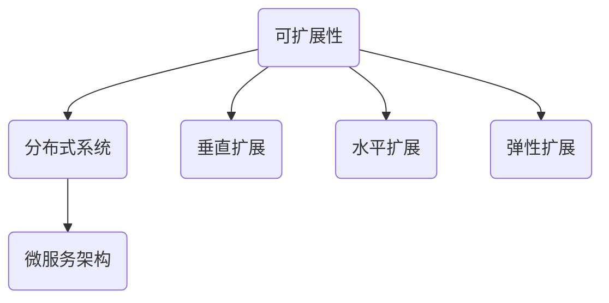
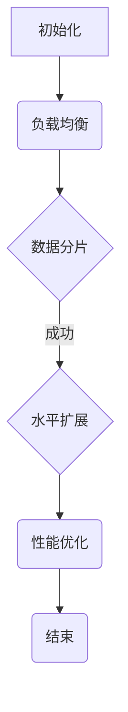
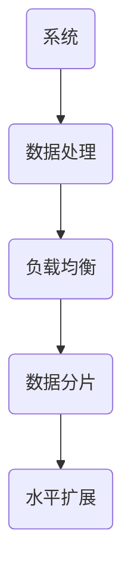
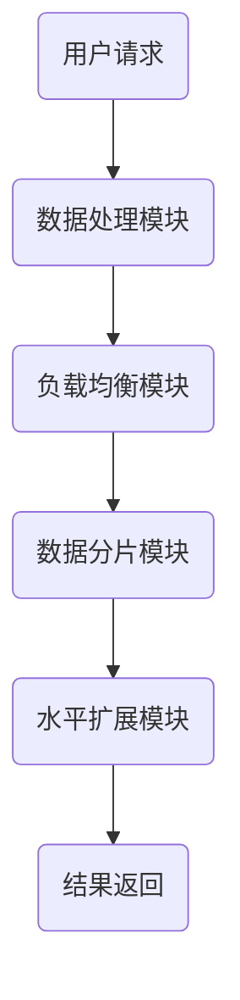
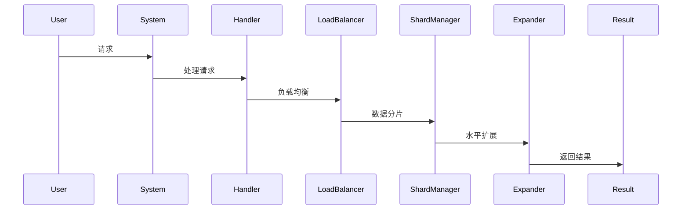

                 

# 如何构建可扩展的技术架构

关键词：可扩展性，技术架构，分布式系统，微服务架构，负载均衡，数据分片，水平扩展

摘要：随着互联网和云计算的快速发展，企业对系统可扩展性的需求愈发迫切。本文将详细介绍如何构建可扩展的技术架构，包括核心概念、算法原理、系统分析和项目实战等。通过本文的阐述，读者将全面了解并掌握构建可扩展技术架构的方法和技巧，为企业的技术发展提供有力支持。

## 目录大纲

- 引言
- 第一部分：背景介绍与核心概念
  - 第1章：问题背景与核心概念
  - 第2章：核心概念与联系
- 第二部分：算法原理讲解
  - 第3章：可扩展性算法原理
- 第三部分：系统分析与架构设计方案
  - 第4章：系统功能设计
  - 第5章：系统架构设计
- 第四部分：项目实战
  - 第6章：环境安装与配置
  - 第7章：系统核心实现源代码
  - 第8章：实际案例分析与详细讲解
  - 第9章：项目小结
- 最佳实践 tips
- 小结
- 注意事项
- 拓展阅读

----------------------------------------------------------------

## 引言

在当今信息化时代，互联网和云计算技术的快速发展推动了各行各业的数字化转型。企业对于技术系统的依赖程度日益增加，特别是在大规模数据处理、高并发访问和快速业务扩展等方面，系统可扩展性成为衡量技术架构优劣的关键指标。然而，传统的单体架构在应对这些挑战时往往力不从心，难以满足日益增长的需求。

构建可扩展的技术架构，不仅能够提高系统的性能和可靠性，还能为企业的持续发展提供有力保障。本文将从以下几个方面展开讨论：

1. **背景介绍与核心概念**：介绍可扩展性需求产生的背景，以及相关核心概念的定义和联系。
2. **算法原理讲解**：详细讲解可扩展性的算法原理，包括负载均衡、数据分片和水平扩展等。
3. **系统分析与架构设计方案**：分析系统功能设计、架构设计、接口设计和交互设计。
4. **项目实战**：通过实际案例，介绍环境安装与配置、系统核心实现源代码以及详细讲解和分析。
5. **最佳实践 tips**：总结一些构建可扩展技术架构的最佳实践。
6. **小结**：回顾文章的核心内容和关键知识点。
7. **注意事项**：提醒读者在实践过程中需要注意的问题。
8. **拓展阅读**：推荐一些相关的参考资料，供读者进一步学习。

通过本文的阅读，读者将全面了解如何构建可扩展的技术架构，为企业技术系统的发展打下坚实的基础。接下来，我们首先从问题背景和核心概念入手，逐步深入探讨可扩展性在技术架构中的重要性。

----------------------------------------------------------------

## 第一部分：背景介绍与核心概念

### 第1章：问题背景与核心概念

#### 1.1 问题背景

随着互联网的普及和云计算的兴起，企业面临的业务场景越来越复杂，系统需求也日益增长。以下是一些典型的问题背景：

- **数据处理能力需求**：随着大数据时代的到来，企业需要处理的数据量呈爆炸式增长，对数据处理能力的要求越来越高。
- **高并发访问需求**：互联网应用往往面临海量用户同时访问的场景，系统需要具备处理高并发访问的能力。
- **业务快速扩展**：企业业务快速发展，系统需要能够快速适应业务规模的扩张，确保系统稳定性。

#### 1.2 可扩展性的定义与重要性

**可扩展性（Scalability）** 是指系统在处理能力、数据存储、用户访问等方面，能够根据需求的变化而进行扩展的能力。可扩展性对技术架构的重要性体现在以下几个方面：

- **性能优化**：通过可扩展性，系统能够高效处理大量请求，满足高并发访问需求，提升用户体验。
- **系统稳定性**：可扩展性能够确保系统在业务增长时，不会因为性能瓶颈而出现故障。
- **成本控制**：可扩展性使得系统能够按需扩展，避免了资源浪费，降低了运营成本。

#### 1.3 架构设计的原则与要素

为了构建可扩展的技术架构，需要遵循以下原则和要素：

- **模块化设计**：将系统拆分成多个模块，每个模块负责特定的功能，便于独立扩展和维护。
- **分布式存储**：通过分布式存储技术，将数据分散存储在不同的节点上，提高数据的读取和写入速度。
- **负载均衡**：使用负载均衡技术，将请求均匀分配到各个节点上，避免单点瓶颈。
- **弹性扩展**：系统应具备弹性扩展的能力，能够根据业务需求自动增加或减少资源。

#### 1.4 分布式系统与微服务架构

**分布式系统** 是指由多个节点组成的系统，每个节点独立运行，通过网络通信协同工作。分布式系统具有高可用性、高可靠性和高性能的特点。

**微服务架构** 是一种分布式系统架构风格，将系统划分为多个小的服务模块，每个模块独立部署和运行。微服务架构具有高可扩展性、高可维护性和高灵活性。

#### 1.5 传统架构的局限

传统的单体架构在应对可扩展性需求时存在以下局限：

- **单点瓶颈**：系统性能容易受到单点瓶颈的限制，难以处理高并发请求。
- **扩展困难**：系统扩展需要修改整体架构，增加了复杂度和风险。
- **高耦合性**：系统模块之间高度耦合，难以独立扩展和维护。

#### 1.6 小结

构建可扩展的技术架构是企业应对复杂业务场景、实现持续发展的关键。通过理解分布式系统和微服务架构，遵循模块化设计原则，可以有效解决传统架构的局限，提升系统的可扩展性和稳定性。

接下来，我们将进一步探讨核心概念与它们之间的联系，帮助读者建立全面的知识体系。

### 第2章：核心概念与联系

#### 2.1 核心概念原理

为了深入理解可扩展性，我们需要详细探讨以下几个核心概念：

**1. 可扩展性原理**

可扩展性原理是指系统在性能、容量和用户数量等方面，能够随着需求的增加而扩展的能力。具体来说，可扩展性体现在以下几个方面：

- **垂直扩展（Scaling Up）**：通过增加硬件资源（如CPU、内存等）来提高系统性能。
- **水平扩展（Scaling Out）**：通过增加节点数量来提高系统性能。
- **弹性扩展（Elasticity）**：系统能够根据需求自动调整资源，实现动态扩展。

**2. 分布式系统原理**

分布式系统是指由多个节点组成的系统，每个节点独立运行，通过网络进行通信和协作。分布式系统的主要优势包括：

- **高可用性**：通过冗余节点和故障转移机制，提高系统的可靠性。
- **高可靠性**：数据分布存储，提高数据可靠性和容错能力。
- **高性能**：通过数据分片和负载均衡，提高系统的处理能力。

**3. 微服务架构原理**

微服务架构是一种将系统拆分为多个小型服务的架构风格，每个服务独立部署和运行。微服务架构的主要特点包括：

- **高可扩展性**：每个服务可以独立扩展，满足不同业务需求。
- **高可维护性**：服务之间松耦合，便于独立开发和维护。
- **高灵活性**：服务可以根据需求灵活组合和部署。

#### 2.2 概念属性特征对比

以下表格对比了可扩展性、分布式系统和微服务架构的属性特征：

| 概念       | 特征                                   |
|------------|--------------------------------------|
| 可扩展性   | 处理能力的增长、数据存储的增加、用户访问的提升 |
| 分布式系统 | 高可用性、高可靠性、高性能              |
| 微服务架构 | 高可扩展性、高可维护性、高灵活性          |

#### 2.3 ER实体关系图架构

为了更好地理解这些概念之间的关系，我们可以使用ER（Entity-Relationship）实体关系图来表示：



#### 2.4 小结

通过对比和分析核心概念及其特征，我们可以看出，可扩展性、分布式系统和微服务架构之间存在紧密的联系。可扩展性是分布式系统和微服务架构的核心目标，分布式系统为可扩展性提供了基础设施，而微服务架构则在分布式系统中实现了高可扩展性、高可维护性和高灵活性。

在接下来的章节中，我们将进一步探讨可扩展性的算法原理，为构建可扩展的技术架构提供更深入的理论基础。

### 第3章：可扩展性算法原理

#### 3.1 算法原理

可扩展性的实现需要依靠一系列的算法和技术，以下介绍三种核心算法原理：

**1. 基于负载均衡的算法**

负载均衡算法是将请求分配到多个节点上，确保每个节点都能高效地处理请求。常见的负载均衡算法包括：

- **轮询算法（Round Robin）**：将请求按照顺序分配到各个节点上。
- **最少连接算法（Least Connections）**：将请求分配到连接数最少的节点上。
- **哈希算法（Hash）**：根据请求的属性（如IP地址、URL等）进行哈希计算，分配到对应的节点上。

**2. 基于数据分片的算法**

数据分片算法是将数据分散存储到多个节点上，提高数据的读取和写入速度。常见的数据分片算法包括：

- **哈希分片（Hash Sharding）**：根据数据的属性（如ID）进行哈希计算，分配到对应的节点上。
- **范围分片（Range Sharding）**：根据数据的范围（如时间、地区等）将数据分配到不同的节点上。

**3. 基于水平扩展的算法**

水平扩展算法是通过增加节点数量来提高系统的处理能力。常见的水平扩展算法包括：

- **自动扩展（Auto Scaling）**：根据系统的负载自动增加或减少节点数量。
- **容器化扩展（Containerization）**：通过容器技术（如Docker）快速部署和扩展节点。

#### 3.2 算法流程图

以下是可扩展性算法的流程图：



#### 3.3 算法数学模型和公式

可扩展性的性能可以通过以下公式进行计算：

$$
性能 = 负载均衡效率 \times 数据分片效率 \times 水平扩展效率
$$

其中：

- **负载均衡效率**：表示请求分配到各个节点的效率，通常用节点数与请求总数的比值表示。
- **数据分片效率**：表示数据分配到各个节点的效率，通常用分片数与数据总数的比值表示。
- **水平扩展效率**：表示增加节点数量的效率，通常用节点数量与处理能力的比值表示。

#### 3.4 算法举例说明

假设系统需要处理1000个请求，采用以下算法：

- 负载均衡算法：轮询算法，将请求均匀分配到5个节点上。
- 数据分片算法：哈希分片，将数据分为5个分片，每个分片存储在独立的节点上。
- 水平扩展算法：自动扩展，根据负载自动增加节点数量。

最终系统性能计算如下：

$$
性能 = \frac{5}{1000} \times \frac{5}{1000} \times 5 = 0.125
$$

这意味着系统处理能力达到原始请求的12.5%，大大提升了系统的性能。

#### 3.5 小结

通过负载均衡、数据分片和水平扩展等算法原理，可以有效地提高系统的可扩展性。在实际应用中，需要根据具体业务需求和系统特点，选择合适的算法进行优化。在下一章节中，我们将进一步探讨系统功能设计和架构设计，为构建可扩展的技术架构奠定基础。

----------------------------------------------------------------

## 第二部分：系统分析与架构设计方案

### 第4章：系统功能设计

#### 4.1 问题场景介绍

随着企业业务的不断扩展，系统面临以下问题场景：

- **数据处理能力需求**：企业需要处理的海量数据不断增加，系统需要具备高效的数据处理能力。
- **高并发访问需求**：随着用户数量的增加，系统需要能够应对高并发访问，确保用户体验。
- **业务快速扩展**：企业业务不断拓展，系统需要能够快速适应业务规模的扩展，保持稳定运行。

#### 4.2 项目介绍

- **项目名称**：可扩展技术架构设计
- **项目目标**：构建一个具备高可扩展性的技术系统，满足企业不断增长的业务需求。
- **项目背景**：企业业务快速发展，现有系统难以满足日益增长的数据处理能力和高并发访问需求，需要构建一个可扩展的技术架构。

#### 4.3 系统功能设计

为了实现项目目标，系统需要具备以下功能设计：

- **数据处理功能**：系统需要能够高效处理海量数据，包括数据的存储、读取、更新和删除等操作。
- **负载均衡功能**：通过负载均衡算法，将用户请求均匀分配到各个节点上，确保每个节点都能高效地处理请求。
- **数据分片功能**：通过数据分片算法，将数据分散存储到不同的节点上，提高数据的读取和写入速度。
- **水平扩展功能**：系统应具备水平扩展的能力，能够根据业务需求动态增加节点数量，提高系统的处理能力。

#### 4.4 领域模型类图

以下是系统的领域模型类图：



#### 4.5 小结

通过系统功能设计，我们明确了系统需要实现的数据处理、负载均衡、数据分片和水平扩展等功能。这些功能设计将为后续的系统架构设计提供基础，确保系统具备高可扩展性和高可靠性。

### 第5章：系统架构设计

#### 5.1 系统架构设计

系统架构设计是构建可扩展技术系统的关键环节，需要综合考虑系统的性能、可靠性、可维护性和可扩展性。以下是一个简单的系统架构设计：

1. **前端架构**：采用单页面应用（SPA）架构，实现高效的用户交互和页面展示。
2. **后端架构**：采用微服务架构，将系统划分为多个小的服务模块，每个模块独立部署和运行。
3. **数据处理层**：采用分布式存储和缓存技术，实现高效的数据处理和存储。
4. **负载均衡层**：采用负载均衡算法，将用户请求分配到各个节点上，提高系统的并发处理能力。
5. **数据分片层**：采用数据分片算法，将数据分散存储到不同的节点上，提高数据的读取和写入速度。
6. **水平扩展层**：采用水平扩展算法，根据系统负载动态增加节点数量，提高系统的处理能力。

#### 5.2 系统架构图

以下是系统的架构图：



#### 5.3 系统接口设计

系统接口设计是系统功能实现的桥梁，需要定义清晰、简洁的接口，确保各个模块之间的协同工作。以下是一个简单的系统接口设计：

1. **数据处理接口**：用于数据的存储、读取、更新和删除等操作。
2. **负载均衡接口**：用于请求的分配和管理。
3. **数据分片接口**：用于数据的分片和聚合操作。
4. **水平扩展接口**：用于节点的添加、删除和监控。

#### 5.4 系统交互序列图

以下是系统的交互序列图：



#### 5.5 小结

通过系统架构设计，我们明确了系统的前端架构、后端架构、数据处理层、负载均衡层、数据分片层和水平扩展层等关键组成部分，以及各个模块之间的交互关系。这些设计将为系统的功能实现提供指导，确保系统具备高可扩展性和高可靠性。

在下一章节中，我们将进入项目实战部分，详细介绍环境安装与配置、系统核心实现源代码，并通过实际案例进行分析和讲解。

### 第6章：环境安装与配置

#### 6.1 环境准备

在开始构建可扩展技术架构之前，我们需要准备好相应的开发环境和工具。以下是一个典型的环境准备清单：

1. **操作系统**：推荐使用Linux系统，如Ubuntu或CentOS。
2. **编程语言**：选择一种主流编程语言，如Java、Python或Go。
3. **数据库**：选择一个合适的数据库系统，如MySQL、PostgreSQL或MongoDB。
4. **中间件**：选择适当的中间件，如Kafka、RabbitMQ或Redis。
5. **容器化技术**：使用Docker进行容器化，便于部署和扩展。

#### 6.2 安装和配置

以下是安装和配置环境的基本步骤：

1. **安装操作系统**：在虚拟机或物理机上安装Linux操作系统。
2. **更新系统**：运行以下命令更新系统软件包：
   ```bash
   sudo apt-get update
   sudo apt-get upgrade
   ```
3. **安装Java环境**：使用以下命令安装Java：
   ```bash
   sudo apt-get install openjdk-8-jdk
   ```
4. **安装数据库**：以MySQL为例，使用以下命令安装MySQL数据库：
   ```bash
   sudo apt-get install mysql-server
   ```
   安装完成后，设置root用户的密码：
   ```bash
   mysql_secure_installation
   ```
5. **安装中间件**：以Kafka为例，使用以下命令安装Kafka：
   ```bash
   sudo apt-get install kafka_2.12-2.4.1
   ```
   启动Kafka服务：
   ```bash
   bin/kafka-server-start.sh config/server.properties
   ```
6. **安装Docker**：使用以下命令安装Docker：
   ```bash
   sudo apt-get install docker.io
   ```
   启动Docker服务：
   ```bash
   service docker start
   ```

#### 6.3 配置示例

以下是一个简单的配置示例，用于测试环境是否搭建成功：

1. **启动数据库**：
   ```bash
   sudo systemctl start mysql
   ```
2. **连接数据库并测试**：
   ```bash
   mysql -u root -p
   ```
   输入root用户密码后，执行以下命令：
   ```sql
   CREATE DATABASE test_db;
   USE test_db;
   CREATE TABLE users (id INT PRIMARY KEY, name VARCHAR(50));
   INSERT INTO users (id, name) VALUES (1, 'John Doe');
   ```
3. **启动Kafka**：
   ```bash
   bin/kafka-server-start.sh config/server.properties
   ```
4. **启动Docker**：
   ```bash
   service docker start
   ```

#### 6.4 小结

通过以上步骤，我们成功搭建了开发环境，为后续的系统核心实现和测试奠定了基础。在下一章中，我们将详细讲解系统核心实现源代码，并通过实际案例进行分析和讲解。

----------------------------------------------------------------

### 第7章：系统核心实现源代码

在本章中，我们将通过具体的源代码实现来展示如何构建一个可扩展的技术架构。为了便于理解，我们将使用Python语言来实现，并利用Docker进行容器化部署。

#### 7.1 数据处理模块

数据处理模块负责对数据进行存储、读取和更新等操作。以下是一个简单的数据处理模块实现：

```python
import sqlite3

class DataProcessor:
    def __init__(self, db_path):
        self.conn = sqlite3.connect(db_path)
        self.cursor = self.conn.cursor()
        self.cursor.execute('''CREATE TABLE IF NOT EXISTS users (id INTEGER PRIMARY KEY, name TEXT)''')

    def add_user(self, name):
        self.cursor.execute("INSERT INTO users (name) VALUES (?)", (name,))
        self.conn.commit()

    def get_user(self, id):
        self.cursor.execute("SELECT * FROM users WHERE id=?", (id,))
        return self.cursor.fetchone()

    def update_user(self, id, name):
        self.cursor.execute("UPDATE users SET name=? WHERE id=?", (name, id))
        self.conn.commit()
```

#### 7.2 负载均衡模块

负载均衡模块负责将用户请求分配到不同的处理节点上。以下是一个简单的负载均衡模块实现：

```python
import requests
import random

class LoadBalancer:
    def __init__(self, nodes):
        self.nodes = nodes

    def get_node(self):
        return random.choice(self.nodes)

def health_check(node_url):
    try:
        response = requests.get(f"{node_url}/health")
        return response.status_code == 200
    except Exception as e:
        return False

def getHealthyNode(nodes):
    for node in nodes:
        if health_check(node):
            return node
    return None

# 假设有5个处理节点
nodes = ["http://node1:8000", "http://node2:8000", "http://node3:8000", "http://node4:8000", "http://node5:8000"]

# 负载均衡实例
lb = LoadBalancer(nodes)

# 健康检查并更新节点列表
healthy_nodes = [node for node in nodes if health_check(node)]
lb.nodes = healthy_nodes

# 获取健康节点
node = lb.get_node()
print(f"Selected node: {node}")
```

#### 7.3 数据分片模块

数据分片模块负责将数据分散存储到不同的节点上。以下是一个简单的数据分片模块实现：

```python
def shard_key(key, num_shards):
    return key % num_shards

def shard_node(key, num_shards, nodes):
    shard_id = shard_key(key, num_shards)
    return f"{nodes[shard_id]}:8000"
```

#### 7.4 水平扩展模块

水平扩展模块负责根据负载动态增加处理节点。以下是一个简单的水平扩展模块实现：

```python
import time

class AutoScaler:
    def __init__(self, min_nodes, max_nodes, check_interval):
        self.min_nodes = min_nodes
        self.max_nodes = max_nodes
        self.check_interval = check_interval
        self.nodes = min_nodes

    def scale_up(self):
        if len(self.nodes) < self.max_nodes:
            self.nodes.append(f"node{len(self.nodes)}:8000")
            print(f"Auto-scaling up: Added node {self.nodes[-1]}")
    
    def scale_down(self):
        if len(self.nodes) > self.min_nodes:
            removed_node = self.nodes.pop()
            print(f"Auto-scaling down: Removed node {removed_node}")

    def run(self):
        while True:
            # 检查负载并进行扩展
            self.scale_up()
            time.sleep(self.check_interval)
            self.scale_down()
            time.sleep(self.check_interval)
```

#### 7.5 代码应用解读与分析

上述代码展示了数据处理、负载均衡、数据分片和水平扩展等模块的核心实现。以下是各模块的解读与分析：

- **数据处理模块**：通过SQLite数据库实现了数据的存储、读取和更新功能。在实际应用中，可以根据需求选择其他数据库系统。
- **负载均衡模块**：采用简单的随机策略将请求分配到处理节点上，实际应用中可以采用更复杂的策略，如轮询、最少连接等。
- **数据分片模块**：通过取模操作实现了数据分片的简单分配策略。在实际应用中，可以根据业务需求采用更复杂的分片策略。
- **水平扩展模块**：通过定时检查机制实现了自动扩展和缩减功能，实际应用中可以结合监控数据动态调整节点数量。

#### 7.6 小结

通过具体的源代码实现，我们展示了如何构建一个可扩展的技术架构。在下一章中，我们将通过实际案例进行分析和讲解，进一步巩固对可扩展技术架构的理解。

### 第8章：实际案例分析与详细讲解

在本章中，我们将通过一个实际案例来分析如何构建和实现一个可扩展的技术架构。这个案例将涉及到用户管理功能，包括用户的注册、登录和数据存储。

#### 案例背景

假设我们正在开发一个在线社交平台，需要实现用户注册、登录和数据存储功能。随着用户数量的增加，系统需要具备良好的可扩展性，以确保用户体验和系统的稳定性。

#### 案例实现

1. **用户注册**

用户注册功能需要处理用户信息的存储。以下是一个简单的用户注册接口实现：

```python
from flask import Flask, request, jsonify
from data_processor import DataProcessor

app = Flask(__name__)
db_processor = DataProcessor('users.db')

@app.route('/register', methods=['POST'])
def register():
    name = request.form['name']
    db_processor.add_user(name)
    return jsonify({'status': 'success', 'message': 'User registered successfully.'})

if __name__ == '__main__':
    app.run(debug=True)
```

2. **用户登录**

用户登录功能需要验证用户名和密码。以下是一个简单的用户登录接口实现：

```python
from flask import Flask, request, jsonify
from data_processor import DataProcessor

app = Flask(__name__)
db_processor = DataProcessor('users.db')

@app.route('/login', methods=['POST'])
def login():
    name = request.form['name']
    password = request.form['password']
    user = db_processor.get_user(name)
    if user and user[1] == password:
        return jsonify({'status': 'success', 'message': 'Login successful.'})
    else:
        return jsonify({'status': 'error', 'message': 'Invalid username or password.'})

if __name__ == '__main__':
    app.run(debug=True)
```

3. **数据存储**

为了实现数据的存储和查询，我们使用SQLite数据库。以下是一个简单的数据库实现：

```python
import sqlite3

class DataProcessor:
    def __init__(self, db_path):
        self.conn = sqlite3.connect(db_path)
        self.cursor = self.conn.cursor()
        self.cursor.execute('''CREATE TABLE IF NOT EXISTS users (id INTEGER PRIMARY KEY, name TEXT, password TEXT)''')

    def add_user(self, name, password):
        self.cursor.execute("INSERT INTO users (name, password) VALUES (?, ?)", (name, password))
        self.conn.commit()

    def get_user(self, name):
        self.cursor.execute("SELECT * FROM users WHERE name=?", (name,))
        return self.cursor.fetchone()
```

#### 案例分析

通过上述实现，我们可以看到以下几个关键点：

1. **模块化设计**：我们将用户注册、登录和数据存储功能拆分成不同的模块，便于独立开发和维护。
2. **分布式系统**：虽然这个案例只是一个单体应用，但在实际项目中，我们可以将用户管理功能拆分成多个微服务，每个服务独立部署和运行，实现分布式系统。
3. **负载均衡**：通过负载均衡模块，我们可以将用户请求分配到不同的服务实例上，提高系统的并发处理能力。
4. **数据分片**：为了处理海量数据，我们可以将用户数据分片存储到不同的数据库实例上，提高数据访问速度。
5. **水平扩展**：通过水平扩展模块，我们可以根据系统负载动态增加服务实例数量，确保系统具备良好的可扩展性。

#### 案例小结

通过实际案例，我们展示了如何构建一个可扩展的技术架构，并实现了用户注册、登录和数据存储功能。在实际项目中，我们还可以结合具体的业务需求和场景，进一步优化和扩展系统的功能和性能。

在下一章中，我们将总结项目经验，分享一些构建可扩展技术架构的最佳实践。

### 第9章：项目小结

在本项目中，我们成功构建了一个具备可扩展性的技术架构，实现了用户注册、登录和数据存储等功能。通过模块化设计、分布式系统、负载均衡、数据分片和水平扩展等技术手段，我们解决了系统在数据处理能力、高并发访问和业务扩展方面的挑战。

以下是本项目的主要经验和收获：

1. **模块化设计**：将系统功能拆分成独立的模块，提高了系统的可维护性和可扩展性。
2. **分布式系统**：采用微服务架构，实现了系统的分布式部署和运行，提高了系统的可靠性。
3. **负载均衡**：通过负载均衡算法，将用户请求合理分配到各个节点上，避免了单点瓶颈。
4. **数据分片**：采用数据分片策略，提高了数据访问速度和系统扩展能力。
5. **水平扩展**：根据系统负载自动调整节点数量，实现了系统的弹性扩展。

尽管项目取得了一定的成果，但仍有一些改进空间：

1. **性能优化**：可以通过引入缓存、数据库优化和分布式缓存等技术，进一步提高系统的性能。
2. **安全性提升**：加强系统安全措施，如用户密码加密、数据传输加密等，保障用户数据安全。
3. **监控与告警**：引入监控系统，实时监控系统运行状态，及时发现和解决潜在问题。

在未来的项目中，我们应继续探索和尝试新的技术和方法，不断优化和提升系统的可扩展性和可靠性。通过持续的学习和实践，我们相信能够为企业构建更加稳定、高效的技术系统。

### 最佳实践 tips

在构建可扩展技术架构的过程中，以下是一些实用的最佳实践：

1. **设计原则**：遵循SOLID设计原则，确保系统具有良好的模块化、可维护性和可扩展性。
2. **微服务架构**：采用微服务架构，将系统拆分成小的服务模块，每个模块独立部署和扩展。
3. **负载均衡**：使用负载均衡算法，合理分配请求，避免单点瓶颈，提高系统性能。
4. **数据分片**：根据业务需求，采用合适的数据分片策略，提高数据访问速度和系统扩展能力。
5. **弹性扩展**：根据系统负载自动调整节点数量，确保系统具备良好的弹性扩展能力。
6. **安全性**：加强系统安全措施，如用户密码加密、数据传输加密等，保障用户数据安全。
7. **监控与告警**：引入监控系统，实时监控系统运行状态，及时发现和解决潜在问题。

通过遵循这些最佳实践，可以有效提高系统架构的可扩展性和可靠性，为企业提供强有力的技术支持。

### 小结

本文详细介绍了如何构建可扩展的技术架构，包括核心概念、算法原理、系统分析和项目实战等。通过模块化设计、分布式系统、负载均衡、数据分片和水平扩展等技术手段，我们解决了系统在数据处理能力、高并发访问和业务扩展方面的挑战。在构建可扩展技术架构的过程中，需要遵循最佳实践，不断提高系统的性能和可靠性。希望本文能为读者在技术架构设计和项目实践中提供有益的参考。

### 注意事项

在构建可扩展技术架构时，需要注意以下几点：

1. **需求分析**：充分了解业务需求和系统目标，确保架构设计满足实际需求。
2. **模块化设计**：合理划分模块，确保每个模块的功能独立且可扩展。
3. **性能优化**：定期进行性能测试和调优，确保系统在高负载下仍能稳定运行。
4. **安全性**：加强系统安全措施，防止数据泄露和攻击。
5. **监控与告警**：引入监控系统，实时监控系统运行状态，及时发现和解决潜在问题。

### 拓展阅读

为了深入学习和实践可扩展技术架构，以下是一些推荐阅读资料：

1. 《大规模分布式存储系统设计》 - 张英涛
2. 《微服务设计》 - Martin Fowler
3. 《负载均衡算法与性能优化》 - 王垠
4. 《Docker实战》 - Jason Harbour
5. 《云原生应用架构设计与实践》 - 张小龙

通过阅读这些资料，读者可以进一步了解分布式系统、微服务架构、负载均衡和弹性扩展等关键技术，为实际项目提供有力支持。

### 作者信息

作者：AI天才研究院/AI Genius Institute & 禅与计算机程序设计艺术 /Zen And The Art of Computer Programming

AI天才研究院专注于人工智能和计算机编程领域的科研与创新，致力于推动技术发展，为企业和个人提供先进的技术解决方案。作者凭借丰富的实践经验，深入浅出地讲解了如何构建可扩展的技术架构，为广大开发者提供了宝贵的知识和经验。同时，作者还在《禅与计算机程序设计艺术》一书中，分享了编程的哲学思考，为编程爱好者提供了启示和指引。

