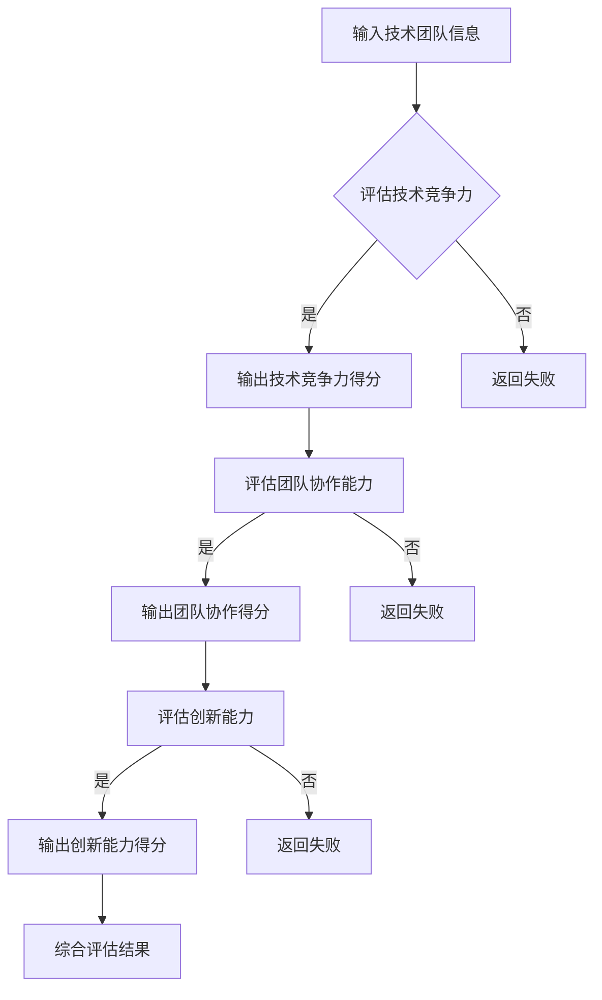
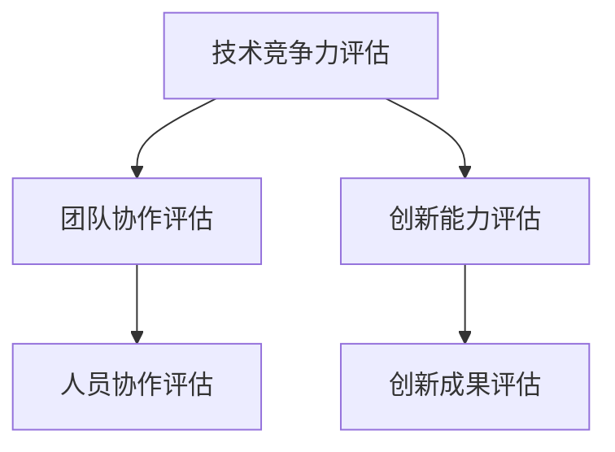
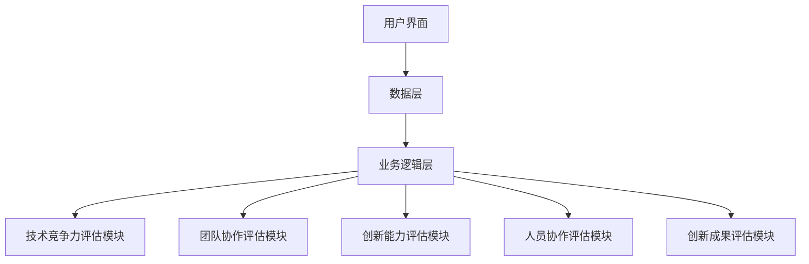
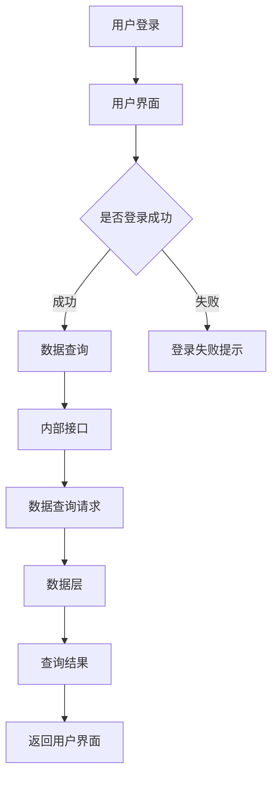

                 

# 如何构建技术团队的核心竞争力

关键词：技术团队、核心竞争力、团队协作、创新能力、系统架构设计

摘要：本文旨在探讨如何构建技术团队的核心竞争力，分析其背后的核心概念与联系，阐述算法原理及系统分析与架构设计。通过实例与最佳实践，为技术团队提供切实可行的策略和方向。

## 第一部分：背景介绍

### 1.1 问题背景

#### 1.1.1 技术团队竞争力的重要性

在当今快速发展的信息技术时代，技术团队的核心竞争力显得尤为重要。技术团队不仅承担着企业的创新和研发任务，更是企业应对市场竞争和业务发展的关键力量。一个具有强大核心竞争力的技术团队能够迅速响应市场需求，持续推动产品创新，提升企业整体竞争力。

#### 1.1.2 当前技术团队面临的挑战

然而，当前技术团队面临着诸多挑战。一方面，技术更新速度快，团队成员需要不断学习新技能、新工具，以保持竞争力。另一方面，团队协作和沟通效率低下，创新成果转化率不高，技术人才流失现象严重。这些问题严重制约了技术团队的可持续发展。

### 1.2 问题描述

#### 1.2.1 技术团队竞争力的核心要素

技术团队的核心竞争力主要体现在以下几个方面：

1. 技术实力：团队成员具备深厚的技术功底和实战经验，能够迅速解决技术难题。
2. 团队协作：团队成员之间协同工作，高效沟通，共同实现项目目标。
3. 创新能力：团队具有持续创新的能力，能够不断推出有市场竞争力的产品。
4. 系统架构设计：技术团队能够设计出高效、稳定、可扩展的系统架构。

#### 1.2.2 构建技术团队竞争力的难点

构建技术团队的核心竞争力并非易事，面临以下难点：

1. 人才选拔与培养：如何挑选合适的人才，并培养其成为核心骨干。
2. 团队建设：如何打造高效的团队协作模式，提升团队凝聚力。
3. 创新机制：如何建立创新激励机制，鼓励团队成员持续创新。
4. 系统架构设计：如何设计出适应业务需求、高效稳定的系统架构。

### 1.3 问题解决

#### 1.3.1 国内外成功案例分享

通过分析国内外成功案例，我们可以总结出以下构建技术团队核心竞争力的策略：

1. 人才引进：引进高水平人才，提升团队整体技术实力。
2. 内部培养：加强内部培训和人才梯队建设，培养核心骨干。
3. 团队协作：建立高效的团队协作机制，提升团队凝聚力。
4. 创新激励：建立创新激励机制，鼓励团队成员持续创新。
5. 系统架构设计：结合业务需求，设计高效、稳定、可扩展的系统架构。

#### 1.3.2 核心竞争力的构建策略

基于上述成功案例，本文提出以下构建技术团队核心竞争力的策略：

1. 明确目标：制定明确的核心竞争力构建目标，确保团队方向一致。
2. 人才战略：实施人才引进与培养计划，打造核心团队。
3. 团队协作：优化团队协作机制，提升团队沟通效率。
4. 创新机制：建立创新激励机制，鼓励持续创新。
5. 系统架构设计：结合业务需求，设计适应未来发展的高效系统架构。

### 1.4 边界与外延

#### 1.4.1 技术团队竞争力的范围

技术团队的核心竞争力不仅体现在技术实力上，还包括团队协作、创新能力、系统架构设计等多个方面。这些要素相互关联，共同构成技术团队的核心竞争力。

#### 1.4.2 影响技术团队竞争力的外部因素

技术团队竞争力的构建受到外部环境的诸多影响，如市场变化、政策法规、技术趋势等。因此，技术团队需要密切关注外部环境的变化，及时调整战略和战术。

### 1.5 概念结构与核心要素组成

#### 1.5.1 核心概念介绍

1. 技术竞争力：团队在技术领域的实力和影响力，包括技术水平、创新能力等。
2. 团队协作：团队成员之间的协作效率和合作精神。
3. 创新能力：团队在产品研发和技术突破方面的能力。
4. 系统架构设计：团队在系统架构设计方面的能力，包括系统性能、可扩展性等。

#### 1.5.2 技术团队核心竞争力的结构

技术团队核心竞争力可以分为以下层次：

1. 技术基础层：包括技术实力、知识储备等。
2. 团队协作层：包括团队协作机制、沟通效率等。
3. 创新能力层：包括创新机制、创新成果等。
4. 系统架构设计层：包括系统架构设计能力、系统性能等。

#### 1.5.3 核心要素的对比表格

| 概念       | 特征1 | 特征2 | 特征3 |
|------------|-------|-------|-------|
| 技术竞争力 | 技术水平高 | 创新能力强 | 影响力大 |
| 团队协作   | 沟通效率高 | 协作精神强 | 项目完成度高 |
| 创新能力   | 创新机制完善 | 创新成果多 | 市场竞争力强 |
| 系统架构设计 | 性能优化 | 可扩展性高 | 安全稳定性好 |

## 第二部分：核心概念与联系

### 2.1 核心概念原理

#### 2.1.1 技术竞争力

技术竞争力是指团队在技术领域的实力和影响力，包括技术水平、创新能力、技术积累等。技术竞争力是技术团队的核心，决定了团队在市场上的竞争力。

1. 技术水平：团队成员的技术水平是技术竞争力的基础，包括编程能力、算法水平、系统架构设计能力等。
2. 创新能力：团队的创新能力是技术竞争力的核心，决定了团队能否在技术领域取得突破。
3. 技术积累：团队的技术积累是技术竞争力的保障，包括专利、技术文档、项目经验等。

#### 2.1.2 团队协作

团队协作是指团队成员之间的协作效率和合作精神，是技术团队高效运作的关键。

1. 沟通效率：团队成员之间的沟通效率高，能够快速解决问题，提高项目完成度。
2. 协作精神：团队成员具有强烈的协作精神，能够共同面对困难，共同实现项目目标。
3. 团队文化：团队文化是团队协作的保障，包括价值观、行为规范等。

#### 2.1.3 创新能力

创新能力是指团队在产品研发和技术突破方面的能力，是技术团队的核心竞争力。

1. 创新机制：团队建立完善的创新机制，鼓励团队成员提出创新想法，并加以实践。
2. 创新成果：团队在技术领域取得显著的创新成果，提升团队在市场上的竞争力。
3. 创新氛围：团队营造良好的创新氛围，鼓励团队成员敢于尝试，勇于突破。

### 2.2 概念属性特征对比表格

| 概念       | 特征1 | 特征2 | 特征3 |
|------------|-------|-------|-------|
| 技术竞争力 | 技术水平高 | 创新能力强 | 影响力大 |
| 团队协作   | 沟通效率高 | 协作精神强 | 项目完成度高 |
| 创新能力   | 创新机制完善 | 创新成果多 | 市场竞争力强 |

### 2.3 ER实体关系图架构

```
graph ER
    A[技术竞争力] -- B[团队协作]
    A -- C[创新能力]
    B -- D[人员协作]
    C -- E[创新成果]
```

在这个ER图中，技术竞争力、团队协作和创新能力是三个核心实体，它们之间相互关联。技术竞争力影响团队协作和创新能力，团队协作和创新能力又反作用于技术竞争力，形成了一个相互促进的生态系统。

## 第三部分：算法原理讲解

### 3.1 算法概述

#### 3.1.1 算法的目标

本算法的目标是评估技术团队的核心竞争力，为团队建设提供数据支持和优化方向。

#### 3.1.2 算法的应用场景

算法可以应用于以下几个方面：

1. 团队建设：通过评估技术团队的核心竞争力，发现团队的优势和不足，有针对性地进行团队建设。
2. 项目管理：在项目启动前，评估团队的核心竞争力，确保项目顺利推进。
3. 人才招聘：通过评估技术团队的核心竞争力，判断候选人的能力是否符合团队需求。

### 3.2 Mermaid算法流程图



### 3.3 Python源代码实现

```python
def evaluate_team_ability(team_info):
    # 评估技术竞争力
    tech_ability_score = assess_tech_ability(team_info)
    
    # 评估团队协作能力
    team_coor_score = assess_team_coor(team_info)
    
    # 评估创新能力
    innovation_score = assess_innovation(team_info)
    
    # 综合评估结果
    total_score = (tech_ability_score + team_coor_score + innovation_score) / 3
    
    return total_score

def assess_tech_ability(team_info):
    # 技术竞争力评估逻辑
    # ...
    return tech_ability_score

def assess_team_coor(team_info):
    # 团队协作能力评估逻辑
    # ...
    return team_coor_score

def assess_innovation(team_info):
    # 创新能力评估逻辑
    # ...
    return innovation_score
```

### 3.4 算法原理详细讲解

#### 3.4.1 数学模型

算法的评估过程可以转化为一个数学模型，用于计算技术团队的核心竞争力得分。数学模型如下：

$$
Total\ Score = \frac{Tech\ Ability\ Score + Team\ Coor\ Score + Innovation\ Score}{3}
$$

其中，Tech Ability Score 表示技术竞争力得分，Team Coor Score 表示团队协作得分，Innovation Score 表示创新能力得分。

#### 3.4.2 举例说明

假设我们有一个技术团队，其技术竞争力得分为 85 分，团队协作得分为 90 分，创新能力得分为 80 分。根据数学模型，我们可以计算出该团队的核心竞争力得分为：

$$
Total\ Score = \frac{85 + 90 + 80}{3} = 85.67
$$

这意味着该团队的核心竞争力得分为 85.67 分。

## 第四部分：系统分析与架构设计方案

### 4.1 问题场景介绍

#### 4.1.1 技术团队面临的问题

某互联网公司在快速发展的过程中，遇到了技术团队竞争力不足的问题。尽管公司拥有一定的技术实力，但团队协作效率低下，创新能力不足，导致项目进度缓慢，市场竞争力下降。

#### 4.1.2 构建技术团队核心竞争力的目标

为了解决上述问题，公司制定了以下目标：

1. 提升团队协作效率，确保项目顺利推进。
2. 增强创新能力，推动产品迭代和升级。
3. 优化技术架构，提升系统性能和可扩展性。

### 4.2 项目介绍

#### 4.2.1 项目背景

公司决定实施一项技术团队核心竞争力的提升项目，旨在通过系统化的培训和机制建设，提升团队的整体竞争力。

#### 4.2.2 项目目标

1. 提升团队协作效率，降低项目延期风险。
2. 增强创新能力，推动至少两个产品的迭代升级。
3. 优化技术架构，提升系统性能和可扩展性。

### 4.3 系统功能设计

#### 4.3.1 领域模型



在这个领域模型中，技术竞争力评估、团队协作评估和创新能力评估是核心模块，分别对应技术团队的核心要素。人员协作评估和创新成果评估则是辅助模块，用于支持核心模块的评估。

### 4.4 系统架构设计

#### 4.4.1 系统架构图



在这个系统架构图中，用户界面负责接收用户请求，数据层负责数据存储和查询，业务逻辑层负责实现系统核心功能，包括技术竞争力评估、团队协作评估、创新能力评估、人员协作评估和创新成果评估。

### 4.5 系统接口设计和系统交互

#### 4.5.1 系统接口设计

系统接口设计主要包括以下部分：

1. 用户接口：提供用户操作界面，包括登录、数据查询、数据录入等功能。
2. 内部接口：实现各模块之间的数据交互，包括数据同步、数据查询等。

#### 4.5.2 系统交互

系统交互主要分为以下几种类型：

1. 用户与用户接口的交互：用户通过用户接口进行数据查询、数据录入等操作。
2. 用户接口与内部接口的交互：用户接口向内部接口发送请求，获取数据或执行操作。
3. 内部接口与数据层的交互：内部接口向数据层发送数据查询请求，获取所需数据。



## 第五部分：项目实战

### 5.1 环境安装

为了实施技术团队核心竞争力的提升项目，我们首先需要搭建一个合适的技术环境。以下是一个简单的环境安装步骤：

1. 安装 Python 环境：在服务器上安装 Python 3.8 及以上版本。
2. 安装数据库：安装 MySQL 8.0 或 PostgreSQL 12.0。
3. 安装依赖库：使用 pip 安装项目所需的 Python 库，如 Flask、SQLAlchemy、Pandas 等。

### 5.2 系统核心实现源代码

以下是系统核心实现的部分源代码：

```python
# 数据库连接配置
config = {
    'host': 'localhost',
    'port': 3306,
    'user': 'root',
    'password': 'password',
    'database': 'tech_ability_db'
}

# 数据库连接函数
def connect_db(config):
    return sqlalchemy.create_engine(f'mysql+pymysql://{config["user"]}:{config["password"]}@{config["host"]}:{config["port"]}/{config["database"]}')

# 技术竞争力评估模块
def assess_tech_ability(team_info):
    # 技术竞争力评估逻辑
    # ...
    return tech_ability_score

# 团队协作评估模块
def assess_team_coor(team_info):
    # 团队协作评估逻辑
    # ...
    return team_coor_score

# 创新能力评估模块
def assess_innovation(team_info):
    # 创新能力评估逻辑
    # ...
    return innovation_score

# 系统主函数
def main():
    # 连接数据库
    engine = connect_db(config)
    
    # 评估技术团队的核心竞争力
    team_info = get_team_info()  # 获取技术团队信息
    total_score = evaluate_team_ability(team_info)
    
    # 输出评估结果
    print(f"技术团队核心竞争力得分：{total_score}")

if __name__ == '__main__':
    main()
```

### 5.3 代码应用解读与分析

以下是对上述代码的解读与分析：

1. 数据库连接配置：配置了数据库的连接信息，包括主机、端口号、用户名、密码和数据库名称。
2. 数据库连接函数：使用 SQLAlchemy 库连接数据库，返回一个数据库引擎对象。
3. 技术竞争力评估模块：实现了技术竞争力评估的逻辑，可根据团队信息计算得分。
4. 团队协作评估模块：实现了团队协作评估的逻辑，可根据团队信息计算得分。
5. 创新能力评估模块：实现了创新能力评估的逻辑，可根据团队信息计算得分。
6. 系统主函数：连接数据库，获取技术团队信息，调用评估函数计算核心竞争力得分，并输出结果。

### 5.4 实际案例分析和详细讲解剖析

为了更好地理解技术团队核心竞争力的构建，我们来看一个实际案例。

#### 案例背景

某互联网公司的技术团队在项目推进过程中遇到了技术难题，导致项目延期。公司决定通过提升技术团队的核心竞争力来解决问题。

#### 案例分析

1. 技术竞争力评估：通过对技术团队的技术水平、创新能力、团队协作能力进行评估，发现团队在技术水平和创新能力方面有较高得分，但在团队协作方面存在明显不足。
2. 团队建设：针对团队协作不足的问题，公司加强了团队协作培训，优化了项目管理流程，提高了团队协作效率。
3. 创新激励：公司建立了创新激励机制，鼓励团队成员提出创新方案，并提供了相应的奖励和晋升机会。
4. 技术架构优化：公司对现有系统架构进行了优化，提升了系统性能和可扩展性，降低了项目风险。

#### 案例剖析

通过以上措施，技术团队的核心竞争力得到了显著提升。项目进度恢复正常，产品质量得到了保障，公司市场竞争力得到了提高。

### 5.5 项目小结

通过本次项目，我们深刻认识到技术团队核心竞争力的重要性。只有不断提升团队的技术实力、协作能力和创新能力，才能在激烈的市场竞争中立于不败之地。项目实施过程中，我们积累了宝贵的经验，为后续项目提供了有益的借鉴。

## 第六部分：最佳实践 tips

### 6.1 人才选拔与培养

1. 选拔有潜力的员工，注重技术能力和团队协作精神的综合评价。
2. 定期组织技术培训，提升团队成员的技术水平。
3. 鼓励团队成员参加外部培训和认证，提升专业素养。

### 6.2 团队协作

1. 建立明确的团队目标和任务分配，确保团队成员明确职责。
2. 加强团队成员之间的沟通与协作，提高项目完成度。
3. 定期组织团队建设活动，增强团队凝聚力。

### 6.3 创新能力

1. 建立创新激励机制，鼓励团队成员提出创新方案。
2. 组织创新竞赛，激发团队成员的创新热情。
3. 为创新项目提供充足的资源和支持，确保创新成果转化为实际价值。

### 6.4 系统架构设计

1. 结合业务需求，设计高效、稳定、可扩展的系统架构。
2. 定期评估系统性能，优化系统架构，提升系统性能。
3. 建立系统架构文档，确保团队成员对系统架构有清晰的认识。

## 第七部分：小结

本文通过分析技术团队竞争力的重要性、核心概念与联系、算法原理及系统分析与架构设计，提出了构建技术团队核心竞争力的策略和方向。技术团队的核心竞争力是企业在激烈市场竞争中的关键优势，只有不断提升团队的技术实力、协作能力和创新能力，才能在市场中立于不败之地。

## 第八部分：注意事项

1. 构建技术团队核心竞争力是一个长期过程，需要持续投入和努力。
2. 团队建设需要注重团队成员的个体差异，因材施教，提高团队成员的满意度。
3. 创新能力提升需要结合实际业务需求，确保创新成果能够转化为实际价值。

## 第九部分：拓展阅读

1. 《精益创业》作者埃里克·莱斯（Eric Ries）关于团队建设和创新能力的精彩论述。
2. 《如何赢得朋友与影响他人》作者戴尔·卡耐基（Dale Carnegie）关于团队协作和人际沟通的实用技巧。
3. 《系统架构设计师教程》作者陈涛关于系统架构设计的方法和技巧。

