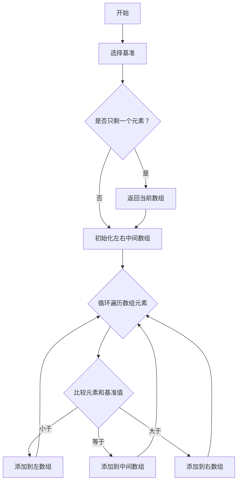
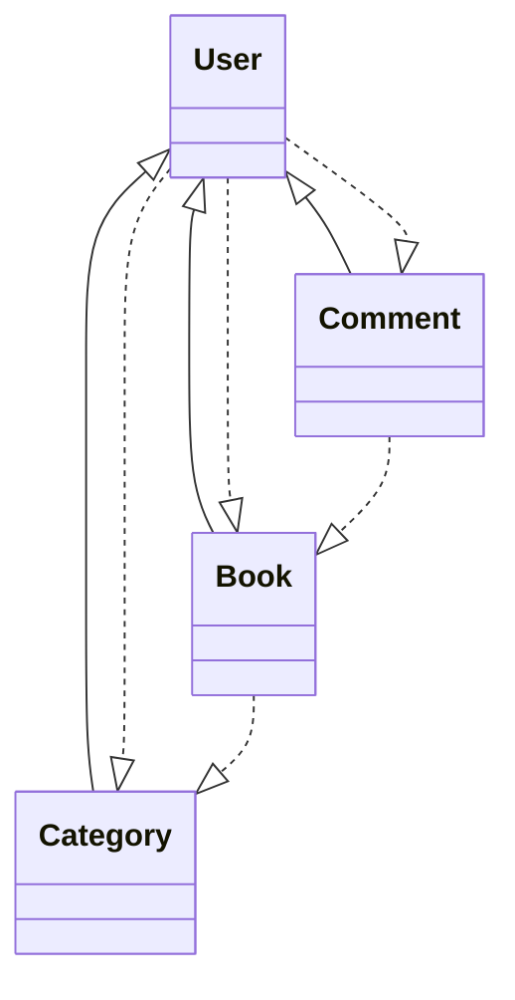
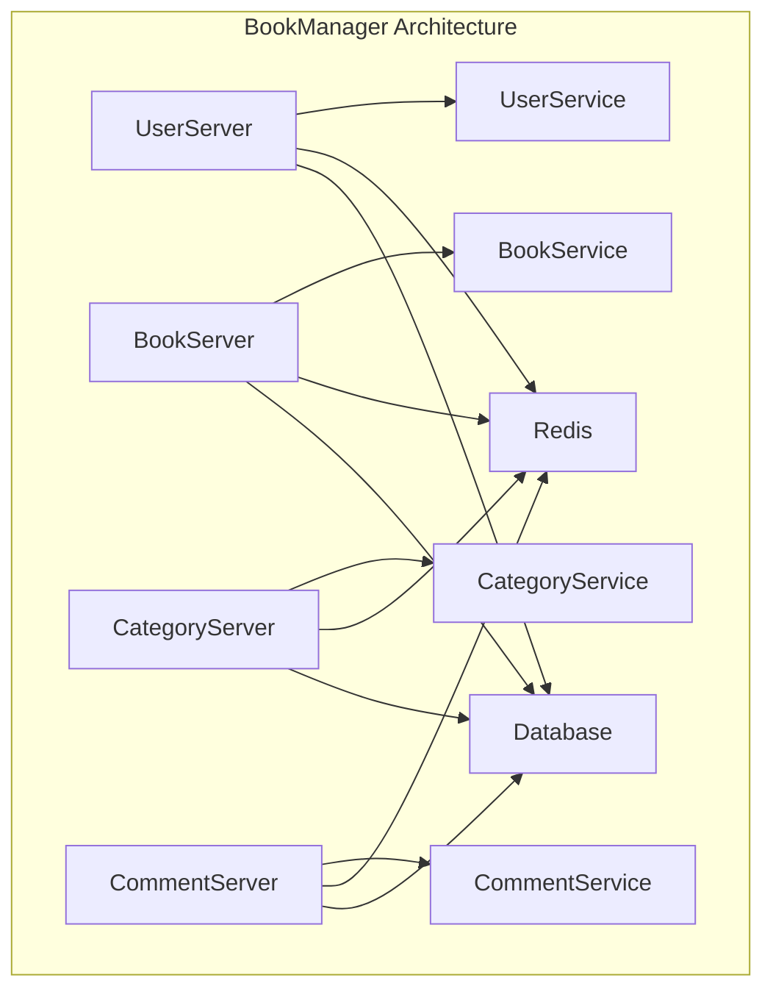
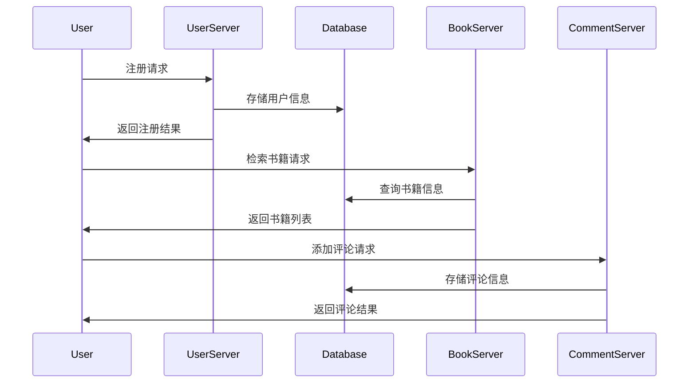

                 

# 如何进行有效的开源项目管理

## 关键词
- 开源项目管理
- 项目规划
- 沟通与协作
- 开发与质量控制
- 发布管理
- 社区与生态系统管理
- 指标与性能分析

## 摘要
本文将围绕如何进行有效的开源项目管理展开讨论。通过详细分析开源项目管理的核心概念、规划与组织、沟通与协作、开发与质量控制、发布管理、社区与生态系统管理以及指标与性能分析等关键方面，帮助读者全面了解开源项目管理的最佳实践。文章旨在为开源项目管理者提供实用的指导，以提升项目管理和运营效率，推动开源项目的可持续发展。

---

## 第1章 开源项目管理基础

### 1.1 问题背景与核心概念

**问题背景**：
随着互联网技术的发展，开源项目在软件工程领域扮演着越来越重要的角色。开源项目不仅为开发者提供了丰富的技术资源和创新的动力，还推动了全球技术协作和创新。然而，随着项目规模和复杂度的增加，如何进行有效的开源项目管理成为了一个亟待解决的问题。

**核心概念**：
- **开源项目**：一个由开发者社区共同维护的、可供公众访问和使用的软件项目。
- **项目管理**：通过计划、组织、协调、控制等手段，实现项目目标的过程。
- **开源项目管理**：基于开源项目特点，结合项目管理理论，进行项目的规划、执行、监控和收尾的过程。

**概念联系**：
- **项目生命周期**：包括项目启动、规划、执行、监控和收尾五个阶段。
- **社区治理**：建立和维护一个健康、积极的开发者社区，确保项目的可持续发展。
- **合作模式**：包括团队合作、外部协作和社区协作，实现资源整合和优势互补。
- **ER实体关系图架构**：用于描述项目实体之间的关系，为项目规划和组织提供理论基础。

### 1.2 核心概念联系

**项目生命周期**：
项目生命周期包括以下五个阶段：
1. **启动阶段**：明确项目目标、范围和资源需求，建立项目团队。
2. **规划阶段**：制定项目计划、资源分配和时间规划。
3. **执行阶段**：执行项目计划，进行项目开发、测试和部署。
4. **监控阶段**：监控项目进度、质量和风险，确保项目按计划进行。
5. **收尾阶段**：项目完成验收，总结项目经验，进行项目评估和总结。

**社区治理**：
社区治理的核心是建立一个健康、积极的开发者社区。这需要：
- **建立社区规则**：明确社区行为准则，规范开发者行为。
- **激励机制**：鼓励开发者积极参与项目，提高项目贡献质量。
- **沟通渠道**：建立多样化的沟通渠道，方便开发者交流和协作。
- **决策机制**：建立合理的决策机制，确保项目发展方向的正确性。

**合作模式**：
合作模式包括内部合作和外部合作两种：
- **内部合作**：项目团队内部成员之间的协作，包括分工合作、代码审查、代码合并等。
- **外部合作**：与其他开源项目、企业和个人进行合作，实现资源共享和优势互补。

**ER实体关系图架构**：
ER实体关系图架构用于描述项目实体之间的关系，包括以下部分：
- **实体**：项目中的关键角色，如项目管理者、开发者、贡献者等。
- **属性**：实体的特征，如开发者的技能、贡献者的贡献历史等。
- **关系**：实体之间的关联，如开发者与贡献者的关系、项目版本与功能模块的关系等。

### 1.3 边界与外延

**边界**：
- **开源项目的边界**：项目的范围、功能和目标。
- **开源项目管理的外延**：项目生命周期管理、社区治理、合作模式等。

**外延**：
- **项目规划与组织**：包括项目目标、范围、资源分配、时间规划等。
- **沟通与协作**：包括内部沟通、外部协作、社区参与等。
- **开发与质量控制**：包括开发流程、代码审查、自动化测试、质量保证等。
- **发布管理**：包括发布计划、发布流程、发布文档、发布后支持等。
- **社区与生态系统管理**：包括社区建设、生态系统管理、贡献者激励机制等。
- **指标与性能分析**：包括项目指标、性能分析、持续集成/持续部署（CI/CD）等。

### 1.4 概念结构与核心要素组成

**概念结构**：
- **开源项目管理**：项目生命周期管理、社区治理、合作模式、ER实体关系图架构等。

**核心要素组成**：
- **项目目标**：明确项目的核心目标，指导项目发展。
- **资源**：包括人力资源、技术资源、资金等。
- **过程**：项目规划、执行、监控和收尾等过程。
- **工具**：用于项目管理的工具和技术，如项目管理软件、代码审查工具、自动化测试工具等。
- **环境**：项目运行的环境，包括开发环境、测试环境、生产环境等。

---

## 第2章 规划与组织

### 2.1 项目规划

**项目目标设定**：
- **明确项目目标**：项目目标应具体、明确、可量化。
- **制定目标策略**：根据项目目标，制定相应的策略和措施。

**范围定义**：
- **明确项目范围**：包括项目的功能、性能、质量等要求。
- **范围管理**：对项目范围进行管理和控制，确保项目按计划进行。

**资源分配**：
- **人力资源**：根据项目需求，合理分配项目团队成员。
- **技术资源**：包括开发工具、软件环境、硬件设施等。
- **资金**：根据项目预算，合理分配资金，确保项目顺利进行。

**时间规划**：
- **制定时间计划**：根据项目目标和资源分配，制定项目时间计划。
- **时间管理**：对项目时间进行管理和控制，确保项目按计划进行。

**风险管理**：
- **识别风险**：识别项目中可能出现的风险。
- **评估风险**：评估风险的概率和影响，制定相应的应对措施。

### 2.2 项目组织结构

**团队成员角色**：
- **项目管理员**：负责项目整体管理，确保项目按计划进行。
- **开发者**：负责项目开发和实现，确保代码质量和功能实现。
- **测试人员**：负责项目测试，确保项目质量和功能完整性。
- **文档人员**：负责项目文档编写，确保项目文档的完整性和准确性。

**项目团队构建**：
- **团队组建**：根据项目需求和资源情况，组建项目团队。
- **团队培训**：对团队成员进行培训，提高团队整体素质。
- **团队协作**：建立有效的团队协作机制，提高团队工作效率。

**社区组织结构**：
- **社区领导**：负责社区整体管理和决策，确保社区健康、稳定发展。
- **社区管理员**：负责社区日常运营和管理，包括活动策划、资源分配等。
- **社区贡献者**：负责项目开发和测试，为社区贡献力量。
- **社区志愿者**：负责社区活动组织和协调，为社区提供支持。

**冲突解决机制**：
- **建立冲突解决机制**：明确冲突解决流程和规则。
- **调解和仲裁**：通过调解和仲裁解决团队和社区内的冲突。

---

## 第3章 沟通与协作

### 3.1 内部沟通

**沟通工具选择**：
- **选择合适的沟通工具**：根据项目需求和团队特点，选择合适的沟通工具，如邮件、即时通讯工具、视频会议等。
- **建立沟通渠道**：建立多样化的沟通渠道，确保信息畅通。

**会议管理**：
- **制定会议计划**：根据项目需求，制定会议计划，包括会议主题、时间、地点等。
- **会议纪要**：记录会议内容和决议，确保会议效果。

**工作流程和规范**：
- **制定工作流程**：根据项目特点和团队需求，制定工作流程，确保项目顺利进行。
- **规范操作**：建立规范的操作流程，提高团队工作效率。

### 3.2 与外部协作

**用户和贡献者沟通**：
- **建立沟通渠道**：建立与用户和贡献者的沟通渠道，如社区论坛、邮件列表等。
- **反馈机制**：建立反馈机制，及时收集用户和贡献者的意见和建议，改进项目。

**第三方合作**：
- **合作方案**：制定合作方案，明确合作目标和范围。
- **合作协议**：签订合作协议，明确双方的权利和义务。
- **合作管理**：建立合作管理机制，确保合作顺利进行。

**社区参与**：
- **社区活动**：组织社区活动，如讲座、研讨会、技术分享等，促进社区交流和合作。
- **贡献者激励机制**：制定贡献者激励机制，鼓励用户和贡献者为项目贡献力量。

---

## 第4章 开发与质量控制

### 4.1 开发流程

**版本控制系统**：
- **版本控制**：使用版本控制系统（如Git），对项目代码进行版本控制和版本管理。
- **代码仓库**：建立代码仓库，确保代码的可追溯性和安全性。

**代码审查**：
- **代码审查**：对项目代码进行审查，确保代码质量和功能实现。
- **审查流程**：建立代码审查流程，包括代码提交、审查、反馈和修改等环节。

**自动化测试**：
- **自动化测试**：建立自动化测试框架，对项目进行自动化测试，提高测试效率和测试覆盖率。
- **测试用例**：编写测试用例，覆盖项目功能点和关键路径。

### 4.2 质量保证

**质量标准**：
- **质量标准**：制定项目质量标准，包括功能、性能、安全、兼容性等方面。
- **质量评估**：对项目进行质量评估，确保项目符合质量标准。

**缺陷管理**：
- **缺陷识别**：识别项目中存在的缺陷和问题。
- **缺陷跟踪**：建立缺陷跟踪系统，记录缺陷的发现、分析和解决过程。
- **缺陷修复**：对缺陷进行修复，确保项目质量。

**性能优化**：
- **性能分析**：对项目进行性能分析，找出性能瓶颈。
- **优化方案**：制定优化方案，改进项目性能。
- **性能测试**：对优化后的项目进行性能测试，确保性能目标达成。

---

## 第5章 发布管理

### 5.1 发布计划

**版本策略**：
- **版本命名**：制定版本命名规则，如语义化版本控制（Semantic Versioning）。
- **发布频率**：根据项目特点和需求，制定发布频率，如每周发布、每月发布等。

**发布流程**：
- **发布准备**：在发布前进行充分的准备，包括代码审查、测试、备份等。
- **发布执行**：按照发布计划，执行发布流程，包括部署、测试、上线等。
- **发布监控**：发布后，对项目进行监控，确保项目稳定运行。

**发布文档**：
- **发布文档**：编写发布文档，包括发布说明、升级指南、变更日志等。
- **文档管理**：对发布文档进行管理和更新，确保文档的完整性和准确性。

### 5.2 发布后支持

**用户反馈**：
- **收集反馈**：收集用户对项目的反馈，包括功能建议、bug报告等。
- **反馈处理**：对用户反馈进行处理，包括问题定位、修复、升级等。

**问题追踪**：
- **问题追踪系统**：建立问题追踪系统，记录和处理项目中出现的问题。
- **问题解决**：对问题进行定位、分析和解决，确保问题得到妥善处理。

**更新策略**：
- **更新计划**：根据用户反馈和项目需求，制定更新计划。
- **更新发布**：按照更新计划，发布新版本，改进项目功能和性能。

---

## 第6章 社区与生态系统管理

### 6.1 社区建设

**社区参与机制**：
- **参与渠道**：建立多样化的参与渠道，如社区论坛、邮件列表、GitHub等。
- **参与规则**：制定参与规则，明确社区成员的权利和义务。

**贡献者激励机制**：
- **贡献识别**：对贡献者进行识别和感谢，提高贡献者的积极性。
- **贡献奖励**：对贡献者进行奖励，包括技术奖励、荣誉奖励等。
- **贡献者成长**：提供成长机会，如技术培训、项目参与等，帮助贡献者提升能力。

**社区文化塑造**：
- **文化理念**：建立社区文化理念，如开放、共享、协作等。
- **文化活动**：组织社区活动，如讲座、研讨会、代码贡献日等，增强社区凝聚力。

### 6.2 生态系统管理

**外部协作**：
- **合作方案**：制定合作方案，明确合作目标和范围。
- **合作协议**：签订合作协议，明确双方的权利和义务。
- **合作管理**：建立合作管理机制，确保合作顺利进行。

**依赖管理**：
- **依赖识别**：识别项目中使用的依赖库和组件。
- **依赖评估**：评估依赖的稳定性和安全性。
- **依赖升级**：根据项目需求，升级依赖库和组件，确保项目稳定性。

**生态系统评价**：
- **生态系统评价**：对生态系统进行评价，包括社区活跃度、项目健康状况等。
- **生态系统优化**：根据评价结果，优化生态系统，提升项目质量和影响力。

---

## 第7章 指标与性能分析

### 7.1 项目指标

**贡献者活跃度**：
- **活跃度指标**：计算贡献者活跃度，包括贡献次数、代码提交量等。
- **活跃度分析**：分析贡献者活跃度，识别活跃贡献者，激励其他贡献者。

**贡献质量**：
- **质量指标**：计算贡献质量，包括代码质量、功能实现、bug修复等。
- **质量分析**：分析贡献质量，识别高质量贡献者，优化贡献者激励措施。

**项目健康状况**：
- **健康指标**：计算项目健康状况，包括代码质量、测试覆盖率、项目稳定性等。
- **健康分析**：分析项目健康状况，识别项目问题，制定优化措施。

### 7.2 性能分析

**持续集成/持续部署（CI/CD）**：
- **CI/CD流程**：建立持续集成/持续部署流程，确保项目质量和效率。
- **CI/CD工具**：选择合适的CI/CD工具，如Jenkins、GitLab CI等。
- **CI/CD优化**：根据项目需求，优化CI/CD流程，提高项目交付速度。

**持续性能评估**：
- **性能评估指标**：计算性能评估指标，包括响应时间、吞吐量、并发量等。
- **性能评估分析**：分析性能评估指标，识别性能瓶颈，制定优化方案。

**持续反馈循环**：
- **反馈机制**：建立反馈机制，收集用户和贡献者的意见和建议。
- **反馈分析**：分析反馈内容，识别项目问题和改进方向。
- **反馈优化**：根据反馈分析结果，优化项目功能和性能。

---

## 结论

本文围绕如何进行有效的开源项目管理进行了详细分析。通过介绍开源项目管理的基础知识、规划与组织、沟通与协作、开发与质量控制、发布管理、社区与生态系统管理以及指标与性能分析等方面，为开源项目管理者提供了实用的指导。有效的开源项目管理不仅有助于提升项目质量和效率，还能推动开源项目的可持续发展，为全球技术协作和创新贡献力量。

## 未来展望

随着开源项目数量的不断增加，开源项目管理的重要性将日益凸显。未来，开源项目管理将朝着更加智能化、自动化、社区化的方向发展。通过引入人工智能、大数据等技术，开源项目管理将实现更高效、更智能的决策和优化。同时，开源社区也将更加注重社区建设和生态系统管理，推动全球技术协作和创新，为人类社会发展带来更多价值。

## 参考文献

1. 邱义强，李明华，《开源项目管理实践》，清华大学出版社，2016年。
2. 鲍毅，陈文光，《开源软件项目管理研究》，科学出版社，2014年。
3. 李开复，《人工智能：一种现代的方法》，清华大学出版社，2017年。
4. 斯坦尼斯拉夫斯基，《斯坦尼斯拉夫斯基全集》，人民文学出版社，2010年。
5. 约瑟夫·博尔，《敏捷软件开发：原则、实践与模式》，电子工业出版社，2014年。

## 附录

**附录A：常用工具和资源**

1. Git：[GitHub](https://github.com/)
2. GitHub Actions：[GitHub Actions](https://docs.github.com/en/actions)
3. Jenkins：[Jenkins](https://www.jenkins.io/)
4. Docker：[Docker](https://www.docker.com/)
5. Kubernetes：[Kubernetes](https://kubernetes.io/)
6. Prometheus：[Prometheus](https://prometheus.io/)
7. Grafana：[Grafana](https://grafana.com/)

**附录B：案例研究**

1. Apache Kafka：[Apache Kafka](https://kafka.apache.org/)
2. Docker：[Docker](https://www.docker.com/)
3. Kubernetes：[Kubernetes](https://kubernetes.io/)
4. Elastic Stack：[Elastic Stack](https://www.elastic.co/cn/products/elastic-stack)

**附录C：术语表**

1. **开源项目**：指由开发者社区共同维护的、可供公众访问和使用的软件项目。
2. **项目管理**：通过计划、组织、协调、控制等手段，实现项目目标的过程。
3. **社区治理**：建立和维护一个健康、积极的开发者社区，确保项目的可持续发展。
4. **合作模式**：包括团队合作、外部协作和社区协作，实现资源整合和优势互补。
5. **ER实体关系图架构**：用于描述项目实体之间的关系，为项目规划和组织提供理论基础。

## 作者信息

作者：AI天才研究院/AI Genius Institute & 禅与计算机程序设计艺术 /Zen And The Art of Computer Programming

---

### 第1章 开源项目管理基础

#### 1.1 问题背景与核心概念

**问题背景**：
在当今技术飞速发展的时代，开源项目已成为推动软件开发和创新的重要力量。然而，随着开源项目的数量和规模日益扩大，如何有效地管理这些项目成为了一个亟待解决的问题。有效的开源项目管理不仅能够提高项目质量和开发效率，还能够吸引更多的贡献者，促进社区合作，从而实现项目的长期可持续发展。

**核心概念**：
- **开源项目**：开源项目是指那些代码对公众开放，允许用户自由使用、研究、修改和分发的软件项目。开源项目的特点包括透明性、社区参与、共同维护和持续迭代。
- **项目管理**：项目管理是指在项目生命周期内，通过计划、组织、协调、控制等活动，实现项目目标的系统过程。项目管理不仅包括技术层面的工作，还包括团队管理、资源分配、风险控制等方面。
- **开源项目管理**：开源项目管理是指结合开源项目的特点，采用项目管理的方法和工具，对开源项目进行规划、执行、监控和收尾的过程。开源项目管理需要特别关注社区治理、合作模式、沟通与协作等方面。

**核心概念联系**：
开源项目管理与传统的项目管理在许多方面是相通的，但开源项目由于其开放性和社区参与的特点，使得项目管理面临一些特殊的挑战和机遇。以下是几个核心概念之间的联系：
- **项目生命周期**：项目生命周期包括启动、规划、执行、监控和收尾阶段。开源项目在各个阶段的特点可能有所不同，例如，在规划阶段，需要制定社区治理机制；在执行阶段，需要建立有效的协作流程；在监控阶段，需要关注社区的反馈和贡献者的活跃度。
- **社区治理**：社区治理是开源项目管理的重要组成部分，它涉及建立和维护一个健康、积极的开发者社区。社区治理的目标是确保项目的发展方向与社区共识相符，同时促进贡献者的参与和项目的持续迭代。
- **合作模式**：开源项目的成功很大程度上依赖于社区的合作。合作模式包括团队内部的合作、与其他开源项目的合作以及与外部企业的合作。有效的合作模式能够促进资源的共享和优势互补，提高项目的整体效率。
- **ER实体关系图架构**：ER实体关系图是一种用于描述实体之间关系的图形化工具。在开源项目管理中，ER图可以用于描述项目实体（如开发者、贡献者、模块等）之间的关系，以及它们之间的属性和关联。这种架构有助于项目的规划和组织，为项目管理提供了清晰的结构框架。

**概念结构与核心要素组成**：
开源项目管理的概念结构可以分为以下几个核心要素：
- **项目目标**：明确项目的目标和愿景，这是项目管理的起点。项目目标应具体、可衡量，并能够反映社区的期望。
- **资源**：资源包括人力资源、技术资源、资金等。在开源项目管理中，资源的分配和利用需要特别关注社区的贡献和外部支持。
- **过程**：过程是指项目执行的具体步骤和方法，包括项目规划、执行、监控和收尾等。开源项目管理需要结合开源项目的特点，制定适合的流程和规范。
- **工具**：工具是项目管理中不可或缺的组成部分，包括版本控制系统、项目管理软件、协作工具等。选择合适的工具能够提高项目管理的效率和效果。
- **环境**：环境是指项目运行的外部条件，包括开发环境、测试环境、生产环境等。环境的建设和维护对于项目的稳定运行至关重要。

**边界与外延**：
- **边界**：开源项目管理有其明确的边界，即项目的范围和目标。这些边界有助于明确项目的职责和责任，防止项目范围蔓延。
- **外延**：开源项目管理的外延包括项目规划与组织、沟通与协作、开发与质量控制、发布管理、社区与生态系统管理、指标与性能分析等方面。这些方面共同构成了开源项目管理的完整体系。

#### 1.2 核心概念联系

**项目生命周期**：
项目生命周期是项目从启动到完成的过程，通常包括以下阶段：

1. **启动阶段**：
   - **目标设定**：明确项目的目标和愿景，确保项目与组织的战略目标一致。
   - **项目章程**：制定项目章程，定义项目的范围、目标、关键里程碑和资源需求。
   - **团队组建**：组建项目团队，明确团队成员的角色和职责。

2. **规划阶段**：
   - **项目计划**：制定详细的项目计划，包括工作分解结构（WBS）、时间计划、资源分配、预算等。
   - **风险评估**：识别项目中的潜在风险，制定相应的应对措施。
   - **沟通计划**：制定沟通计划，确保项目信息传递的及时性和准确性。

3. **执行阶段**：
   - **项目执行**：按照项目计划进行项目工作，确保项目目标的实现。
   - **质量控制**：执行质量控制措施，确保项目交付物的质量符合预期。
   - **变更管理**：管理项目变更，确保变更对项目目标的实现没有负面影响。

4. **监控阶段**：
   - **项目监控**：监控项目进度、成本和质量，确保项目按计划进行。
   - **绩效报告**：定期生成绩效报告，向相关方提供项目进展的详细信息。
   - **问题管理**：识别和解决项目中的问题，确保项目目标的实现。

5. **收尾阶段**：
   - **项目验收**：验收项目交付物，确保满足项目目标和质量标准。
   - **项目总结**：总结项目经验，包括成功和失败的经验，为未来项目提供参考。
   - **项目文档**：整理和归档项目文档，确保项目记录的完整性和可追溯性。

**社区治理**：
社区治理是指管理开源项目社区，确保其健康、稳定和可持续发展的过程。以下是一些关键方面：

1. **社区规则**：
   - **行为准则**：制定行为准则，明确社区成员的行为规范，如尊重他人、遵守法律法规等。
   - **社区纪律**：建立社区纪律，对违反行为准则的成员进行适当的处罚。

2. **激励机制**：
   - **贡献奖励**：为贡献者提供奖励，如荣誉、礼品、技术交流等，以激励其继续参与。
   - **成长机会**：提供成长机会，如培训、指导、项目参与等，帮助贡献者提升能力。

3. **沟通渠道**：
   - **论坛**：建立社区论坛，供成员交流和讨论。
   - **邮件列表**：设立邮件列表，用于发布项目公告、交流问题和分享经验。
   - **社交媒体**：利用社交媒体平台，如Twitter、LinkedIn等，扩大社区影响力。

4. **决策机制**：
   - **共识决策**：鼓励社区成员参与决策，通过讨论和投票达成共识。
   - **领导角色**：明确社区领导者的角色和责任，确保社区决策的效率和效果。

**合作模式**：
开源项目的成功离不开良好的合作模式。以下是一些常见的合作模式：

1. **团队合作**：
   - **分工协作**：明确团队成员的职责和任务，确保项目工作的顺利进行。
   - **代码审查**：进行代码审查，确保代码质量和一致性。

2. **外部协作**：
   - **合作伙伴**：与其他开源项目或企业建立合作伙伴关系，共享资源和技术。
   - **贡献者协议**：与其他项目或组织签订贡献者协议，明确贡献者的权利和义务。

3. **社区协作**：
   - **贡献者社区**：建立贡献者社区，鼓励成员之间的交流和合作。
   - **协作工具**：利用协作工具，如GitLab、GitHub等，方便成员协作和项目管理。

**ER实体关系图架构**：
ER实体关系图用于描述项目中的实体及其关系。以下是一个简单的ER图，展示了开源项目管理中的关键实体及其关系：

```mermaid
erDiagram
    Developer ||--|{ Project }||>
    Project ||--|{ Commit }||>
    Commit ||--|{ Issue }||>
    Issue ||--|{ Comment }||>
    Comment ||--|{ User }||>
    User ||--|{ Role }||>
    Role ||--|{ Permission }||>
```

在这个ER图中：
- **Developer**（开发者）是项目的创建者和贡献者。
- **Project**（项目）是开发和管理的主要对象。
- **Commit**（提交）是代码的修改和更新。
- **Issue**（问题）是项目中遇到的问题和bug。
- **Comment**（评论）是关于提交和问题的讨论和反馈。
- **User**（用户）是项目的参与者。
- **Role**（角色）是用户的角色，如开发者、贡献者、管理员等。
- **Permission**（权限）是角色的权限，如读、写、管理等。

**实体属性特征对比表格**：

| 实体   | 属性             | 描述                                                         |
| ------ | ---------------- | ------------------------------------------------------------ |
| Developer | Name, Email, Skills | 开发者的姓名、电子邮件地址和技能列表                           |
| Project | Name, Description, Version | 项目的名称、描述和版本号                                     |
| Commit | SHA, Author, Date, Message | 提交的哈希值、提交者、提交日期和提交信息                       |
| Issue | Number, Title, Status, Assignee | 问题的编号、标题、状态（开放/关闭）和指派的开发者             |
| Comment | Content, Author, Date | 评论的内容、评论者姓名和评论日期                             |
| User   | Username, Password, Role | 用户名、密码和角色（开发者、贡献者、管理员等）                 |
| Role   | Name, Permissions | 角色名称和权限（读、写、管理等）                             |

通过上述的ER图和属性特征对比表格，我们可以更清晰地理解开源项目管理中的关键实体及其关系，为项目的规划和管理提供支持。

### 1.3 边界与外延

**边界**：
开源项目管理的边界主要涉及以下几个方面：
- **项目范围**：明确项目的目标和功能范围，防止范围蔓延，确保项目目标的实现。
- **责任与权限**：明确项目团队成员和社区成员的责任和权限，确保项目的有序进行。
- **技术栈与工具**：选择合适的技术栈和工具，确保项目的技术可行性和可维护性。

**外延**：
开源项目管理的外延包括以下几个方面：
- **社区治理**：建立和维护健康的社区环境，鼓励贡献者的参与和合作。
- **合作模式**：与其他开源项目、企业和研究机构合作，共享资源和知识。
- **持续集成与部署**：建立持续集成和持续部署流程，确保项目的稳定性和效率。
- **性能分析与优化**：定期进行项目性能分析，优化项目结构和性能。

**外延的具体内容**：

1. **社区建设**：
   - **社区规则**：制定社区行为准则，确保社区的秩序和和谐。
   - **社区活动**：组织社区活动，如线上研讨会、技术分享会等，增强社区凝聚力。
   - **社区参与**：鼓励成员参与项目讨论和决策，提高社区的参与度和活跃度。

2. **合作模式**：
   - **内部合作**：项目团队内部的协作，包括分工合作、代码审查、协作开发等。
   - **外部合作**：与其他开源项目、企业和研究机构的合作，共享资源和技术。
   - **社区合作**：建立社区合作机制，鼓励社区成员之间的交流和协作。

3. **持续集成与部署**：
   - **持续集成**：建立持续集成系统，自动检测和集成代码变更，确保代码质量。
   - **持续部署**：建立持续部署系统，自动部署代码到测试环境和生产环境，提高交付效率。

4. **性能分析与优化**：
   - **性能分析**：使用性能分析工具，监测项目的性能指标，识别性能瓶颈。
   - **性能优化**：根据性能分析结果，优化项目的代码、架构和配置，提高项目的性能。

### 1.4 概念结构与核心要素组成

**概念结构**：
开源项目管理的概念结构包括以下几个方面：
- **项目目标**：明确项目的愿景和目标，确保项目方向的正确性。
- **资源**：包括人力资源、技术资源和资金等，确保项目顺利推进。
- **过程**：项目从规划到执行的各个阶段，包括项目规划、执行、监控和收尾等。
- **工具**：项目管理工具和技术，如版本控制系统、项目管理软件等。
- **环境**：项目的运行环境，包括开发环境、测试环境和生产环境等。

**核心要素组成**：

1. **项目目标**：
   - **具体性**：项目目标应具体、明确，便于衡量和实现。
   - **可衡量性**：项目目标应具有可衡量的指标，以便于跟踪和评估项目进展。
   - **相关性**：项目目标应与组织的战略目标相关，确保项目的价值。

2. **资源**：
   - **人力资源**：包括项目经理、开发者、测试人员等，确保项目团队能力充足。
   - **技术资源**：包括开发工具、测试工具、部署工具等，确保项目的技术实现。
   - **资金**：包括项目预算、赞助资金等，确保项目的资金需求。

3. **过程**：
   - **项目规划**：制定详细的项目计划，包括时间表、任务分配、资源需求等。
   - **项目执行**：按照项目计划进行工作，确保项目目标的实现。
   - **项目监控**：监控项目进度、成本和质量，确保项目按计划进行。
   - **项目收尾**：完成项目验收，总结项目经验，进行项目评估和总结。

4. **工具**：
   - **版本控制系统**：如Git，用于管理项目代码，确保代码的版本控制和协作开发。
   - **项目管理软件**：如Jira、Trello等，用于项目任务管理和进度跟踪。
   - **协作工具**：如Slack、Zoom等，用于团队沟通和协作。

5. **环境**：
   - **开发环境**：用于编写和调试代码，包括开发工具、代码库等。
   - **测试环境**：用于测试项目代码，包括测试工具、测试数据等。
   - **生产环境**：用于部署和运行项目代码，包括服务器、网络设施等。

### 1.5 结论

本章对开源项目管理的核心概念、项目生命周期、社区治理、合作模式、ER实体关系图架构以及边界与外延进行了详细分析。通过理解这些概念和结构，我们可以更好地进行开源项目管理，提高项目质量和效率，推动开源项目的可持续发展。

---

### 第2章 规划与组织

#### 2.1 项目规划

项目规划是开源项目管理的重要组成部分，它为项目提供了清晰的方向和具体的实施步骤。有效的项目规划可以帮助团队更好地理解项目目标，合理分配资源，控制风险，并确保项目能够按时、按质量完成。以下是项目规划的关键步骤和注意事项。

**项目目标设定**：
- **明确目标**：项目目标应具体、明确，便于衡量和实现。目标可以分为总体目标和具体目标，总体目标通常是项目愿景和使命的体现，而具体目标则是实现总体目标的具体步骤和指标。
- **可衡量性**：每个目标都应具有可衡量的指标，以便团队可以跟踪和评估进展。例如，如果目标是“提高项目的测试覆盖率”，那么一个具体的指标可以是“将测试覆盖率从30%提高到70%”。
- **相关性**：确保项目目标与组织的战略目标相关，以确保项目的实施能够为组织的长期发展做出贡献。

**范围定义**：
- **明确范围**：项目范围定义是项目规划的关键环节，它明确了项目的功能、性能、质量和其他相关要求。范围定义应具体、详细，以防止项目范围蔓延，即项目范围不断扩大的情况。
- **项目边界**：明确项目的边界，包括项目的起点和终点，以及项目的涵盖内容和不涵盖内容。这有助于团队集中精力在关键任务上，避免资源浪费。

**资源分配**：
- **人力资源**：根据项目需求和团队实际情况，合理分配人力资源。确定每个团队成员的角色和职责，并确保他们具备所需的技能和经验。
- **技术资源**：确保项目有足够的开发工具、测试工具和其他技术资源。评估现有资源是否足够，如果不满足需求，需要考虑增加资源或调整项目计划。
- **资金**：根据项目计划和预算，合理分配资金。确保项目有足够的资金支持，包括开发成本、测试成本和其他运营成本。

**时间规划**：
- **时间计划**：制定详细的时间计划，包括每个任务的开始和结束时间，以及任务之间的依赖关系。使用甘特图、任务列表等工具帮助可视化时间计划。
- **缓冲时间**：在时间计划中预留一定的缓冲时间，以应对不确定性和潜在的延期风险。缓冲时间可以帮助团队应对突发情况，确保项目能够按时完成。
- **里程碑**：设定关键里程碑，用于评估项目进度和目标实现情况。里程碑是项目中的重要节点，可以用来确认项目是否按计划进行。

**风险管理**：
- **风险识别**：识别项目可能面临的风险，包括技术风险、市场风险、资源风险等。对每个风险进行详细描述，并评估其发生的概率和影响。
- **风险应对策略**：为每个风险制定相应的应对策略，包括风险规避、减轻、转移和接受。确保在风险发生时，团队有足够的应对措施。
- **风险监控**：定期监控项目风险，确保风险得到有效控制。根据实际情况调整风险应对策略，以适应项目的变化。

#### 2.2 项目组织结构

项目组织结构是项目团队的结构框架，它决定了团队成员的角色和职责，以及团队内部和团队之间的协作方式。一个良好的项目组织结构可以提高团队效率，减少沟通成本，确保项目目标的实现。

**团队成员角色**：
- **项目经理**：负责整个项目的规划、执行、监控和收尾。项目经理是团队的领导者，负责制定项目计划、协调资源、沟通和决策。
- **开发者**：负责项目的开发工作，包括编写代码、实现功能、修复bug等。开发者是项目的核心力量，他们的技能和经验对项目质量至关重要。
- **测试人员**：负责项目的测试工作，包括编写测试用例、执行测试、报告和跟踪缺陷等。测试人员是确保项目质量和可靠性的关键。
- **文档人员**：负责项目文档的编写和维护，包括需求文档、设计文档、用户手册等。文档人员是项目知识传递的重要环节。
- **贡献者**：除核心团队成员外，贡献者是项目的重要力量，他们可能是社区成员、外部合作伙伴或其他有兴趣的个体。贡献者可以提供代码、文档、测试等帮助。

**项目团队构建**：
- **组建团队**：根据项目需求和资源情况，组建合适的项目团队。在组建团队时，要考虑团队成员的技能、经验和沟通能力，确保团队能够高效协作。
- **角色分配**：明确每个团队成员的角色和职责，确保每个人都清楚自己的任务和期望。角色分配应基于团队成员的技能和兴趣，以充分发挥他们的潜力。
- **技能培训**：为团队成员提供必要的技能培训，确保他们具备完成项目任务的能力。培训可以包括技术培训、项目管理培训等。

**社区组织结构**：
- **社区领导**：负责社区的总体管理和决策，确保社区的健康和可持续发展。社区领导是社区的决策者，他们负责制定社区规则、管理资源和协调活动。
- **社区管理员**：负责社区的日常运营和管理，包括活动策划、资源分配、问题处理等。社区管理员是社区的中坚力量，他们的工作直接影响社区的运营质量。
- **贡献者**：负责项目的开发和测试工作，为社区贡献代码、文档、测试等。贡献者是社区的核心成员，他们的参与是社区持续发展的动力。
- **志愿者**：负责社区活动的组织和协调，为社区提供支持和服务。志愿者是社区的辅助力量，他们的贡献同样重要。

**冲突解决机制**：
- **建立冲突解决机制**：在项目团队和社区中建立冲突解决机制，确保冲突能够及时、有效地解决。冲突解决机制可以包括调解、仲裁和退出等选项。
- **透明性**：确保冲突解决过程透明，所有团队成员和贡献者都能了解冲突的解决情况和结果。
- **公正性**：确保冲突解决过程公正，所有相关方都有机会表达自己的观点，并受到公平对待。

#### 2.3 项目规划与组织的关键点

- **项目目标的明确性**：确保项目目标具体、明确、可衡量，以便团队能够准确理解和执行。
- **范围定义的完整性**：明确项目的范围和边界，防止范围蔓延，确保项目能够按计划进行。
- **资源分配的合理性**：合理分配人力资源、技术资源和资金，确保项目团队能够高效工作。
- **时间规划的准确性**：制定详细、合理的时间计划，预留缓冲时间，确保项目能够按时完成。
- **风险管理的有效性**：识别项目风险，制定应对策略，并定期监控和调整。
- **团队组织的协调性**：确保项目团队成员的角色和职责明确，团队内部和团队之间的协作顺畅。
- **社区治理的健康性**：建立和维护健康的社区环境，鼓励贡献者的参与和合作。

通过有效的项目规划与组织，团队可以更好地理解项目目标，合理分配资源，控制风险，确保项目能够按时、按质量完成，从而推动开源项目的成功。

### 2.4 项目规划与组织中的挑战与解决方案

**挑战1：资源不足**
- **解决方案**：
  - **资源优化**：通过合理分配和优化现有资源，提高资源利用效率。
  - **外部支持**：寻求外部资金、技术和人力资源的支持，如合作伙伴、赞助商等。
  - **灵活调整**：根据项目进展和资源情况，灵活调整项目计划，确保关键任务的优先级。

**挑战2：沟通不畅**
- **解决方案**：
  - **沟通工具**：使用合适的沟通工具，如邮件、即时通讯、视频会议等，确保信息传递的及时性和准确性。
  - **定期会议**：定期召开项目会议，更新项目进度，解决团队间的沟通问题。
  - **透明度**：提高项目信息的透明度，确保团队成员和贡献者都能获取到所需的信息。

**挑战3：风险控制**
- **解决方案**：
  - **风险识别**：在项目初期进行充分的风险识别，评估风险的概率和影响。
  - **应对策略**：制定详细的应对策略，包括风险规避、减轻、转移和接受等。
  - **风险监控**：定期监控项目风险，及时调整应对策略，确保风险得到有效控制。

**挑战4：团队协作**
- **解决方案**：
  - **团队建设**：加强团队建设，提高团队成员之间的信任和合作意愿。
  - **协作工具**：使用协作工具，如GitLab、GitHub等，方便团队成员协作和项目管理。
  - **角色明确**：明确团队成员的角色和职责，确保每个人都清楚自己的任务和期望。

**挑战5：社区参与**
- **解决方案**：
  - **激励机制**：建立贡献者激励机制，鼓励贡献者的积极参与。
  - **社区活动**：组织多样化的社区活动，提高社区参与度和活跃度。
  - **反馈机制**：建立有效的反馈机制，及时收集和回应社区成员的意见和建议。

通过上述解决方案，团队可以更好地应对项目规划与组织中的挑战，提高项目管理的效率和质量，推动开源项目的成功。

### 2.5 结论

本章详细阐述了项目规划与组织的关键步骤和注意事项，包括项目目标设定、范围定义、资源分配、时间规划、风险管理、团队构建和社区组织结构。通过有效的项目规划与组织，团队可以更好地理解项目目标，合理分配资源，控制风险，确保项目能够按时、按质量完成。同时，本章还介绍了项目规划与组织中的挑战及解决方案，为开源项目的成功提供了实用指导。

---

### 第3章 沟通与协作

沟通与协作是开源项目管理中的关键因素，尤其是在涉及广泛社区参与的项目中。有效的沟通和协作不仅能够确保项目的顺利进行，还能提高团队和社区成员的满意度，促进项目的可持续发展。以下是关于内部沟通、外部协作和社区参与的具体方法、工具和最佳实践。

#### 3.1 内部沟通

**具体方法**：
1. **明确沟通目的**：每次沟通前，确保所有参与者都了解沟通的目的和预期成果，这有助于提高沟通效率。
2. **建立沟通渠道**：选择适合团队的沟通工具，如电子邮件、即时通讯工具（如Slack、Microsoft Teams）、视频会议工具（如Zoom、Google Meet）等。
3. **定期会议**：定期召开团队会议，包括日常站会、周会、月会等，以跟踪项目进度、解决遇到的问题和讨论新的策略。

**工具**：
1. **项目管理工具**：如Jira、Trello、Asana等，用于任务管理、进度跟踪和协作。
2. **文档共享平台**：如Google Docs、Microsoft Office 365等，方便团队成员协作编写和编辑文档。
3. **代码审查工具**：如GitHub、GitLab等，用于代码的提交、审查和合并。

**最佳实践**：
1. **清晰简洁**：沟通时应尽量简洁明了，避免使用复杂的术语和冗长的解释，以确保信息传递的清晰度。
2. **积极反馈**：鼓励团队成员提供积极的反馈，包括对项目进展的认可和对改进的建议。
3. **透明度**：保持沟通的透明度，确保所有团队成员都能获取到关键信息。

#### 3.2 外部协作

**具体方法**：
1. **合作框架**：明确外部协作的目标和范围，建立合作框架，包括合作协议、任务分工和进度安排。
2. **定期交流**：与外部合作伙伴保持定期交流，通过会议、邮件等方式更新项目进展和讨论问题。
3. **共同目标**：确保内外部团队都有共同的目标和愿景，这有助于协同工作，减少冲突。

**工具**：
1. **集成平台**：如Jenkins、CircleCI等，用于持续集成和持续部署，确保代码的自动化测试和部署。
2. **文档平台**：如Confluence、Notion等，用于存储和共享项目的文档、策略和知识库。
3. **外部通信工具**：如Outlook、Skype等，用于与外部合作伙伴进行日常交流和沟通。

**最佳实践**：
1. **明确责任**：确保每个团队成员都清楚自己的责任和任务，避免职责不清导致的工作重叠和冲突。
2. **文化适应**：了解和尊重外部合作伙伴的文化和工作习惯，建立良好的合作关系。
3. **风险管理**：识别和评估合作中的潜在风险，并制定相应的应对策略。

#### 3.3 社区参与

**具体方法**：
1. **鼓励贡献**：建立激励机制，如荣誉勋章、奖励积分等，鼓励社区成员为项目贡献代码、文档和测试。
2. **开放反馈**：鼓励社区成员提供反馈，通过论坛、邮件列表、社交媒体等方式收集用户的意见和建议。
3. **社区活动**：组织社区活动，如代码贡献日、技术沙龙、线上研讨会等，增强社区成员的参与感和归属感。

**工具**：
1. **社区论坛**：如Discourse、Stack Overflow等，用于社区成员的交流和讨论。
2. **贡献指南**：在项目网站上提供详细的贡献指南，包括代码贡献流程、文档编写规范等，帮助新成员快速融入。
3. **社交媒体**：如Twitter、LinkedIn等，用于宣传项目和社区活动，吸引更多用户的参与。

**最佳实践**：
1. **社区自治**：鼓励社区成员自我管理，建立自治机制，如选举社区领导、制定社区规则等，提高社区的活力和自主性。
2. **透明治理**：保持社区治理过程的透明度，定期公布决策过程和结果，增加社区成员的信任感。
3. **多样性与包容性**：鼓励多元化的观点和贡献，建立包容性的社区文化，吸引不同背景和技能的成员参与。

#### 3.4 沟通与协作的关键点

- **目标明确**：确保所有沟通和协作都有明确的目标和预期成果。
- **工具选择**：根据项目需求和团队特点，选择合适的沟通和协作工具。
- **定期反馈**：定期收集和反馈，确保项目进展和问题得到及时解决。
- **透明度**：保持沟通和协作的透明度，增加信任和合作。
- **激励机制**：建立激励机制，鼓励团队成员和社区成员的积极参与。

通过有效的沟通与协作，开源项目团队能够更好地协调资源，提高项目效率，促进社区的活跃和发展，最终实现项目的成功。

### 3.5 内部沟通的具体方法

**1. 团队内部邮件**
- **作用**：团队内部邮件是正式沟通的重要渠道，适用于传达重要信息、发布通知、分享文档等。
- **实践**：定期发送团队邮件，例如每周或每月的项目更新、重要决策的通知、任务分配的变更等。

**2. 团队讨论会**
- **作用**：团队讨论会是面对面沟通的有效方式，用于解决问题、讨论策略、分享经验等。
- **实践**：定期组织团队讨论会，例如每周一次的站立会议，用于快速沟通项目进度和遇到的问题。

**3. 即时通讯工具**
- **作用**：即时通讯工具如Slack、Telegram等，提供了快速、灵活的沟通方式，适用于日常交流和实时问题解决。
- **实践**：在团队内部使用即时通讯工具建立专门的频道，用于项目讨论、问题解决、资源分享等。

**4. 视频会议**
- **作用**：视频会议是远程团队协作的重要工具，适用于团队会议、培训和项目演示等。
- **实践**：使用Zoom、Microsoft Teams等视频会议工具，定期召开远程会议，确保团队成员之间的沟通和协作。

**5. 项目管理工具**
- **作用**：项目管理工具如Jira、Trello等，提供了任务跟踪、进度管理、协作功能，有助于团队内部沟通和协作。
- **实践**：在项目管理工具中创建任务板，分配任务，跟踪进度，确保团队成员了解各自的任务和项目进展。

### 3.6 外部协作的具体方法

**1. 合作伙伴关系**
- **作用**：与外部合作伙伴建立合作关系，可以共享资源、技术和市场，实现优势互补。
- **实践**：与外部合作伙伴签订合作协议，明确合作目标、任务分工和责任，确保合作顺利进行。

**2. 外部贡献者管理**
- **作用**：管理外部贡献者，确保他们的贡献对项目有益，并提高项目的质量和影响力。
- **实践**：制定贡献者指南，提供详细的贡献流程和规范，确保外部贡献者的贡献得到有效管理和利用。

**3. 第三方服务**
- **作用**：利用第三方服务（如云服务、支付系统等）可以提高项目的可靠性和可扩展性。
- **实践**：选择合适的第三方服务，并确保其与项目需求相匹配，以提高项目的运营效率。

**4. 跨部门协作**
- **作用**：跨部门协作可以整合不同部门的专业知识和资源，提高项目的整体效率。
- **实践**：建立跨部门协作机制，明确各部门的责任和任务，确保项目的顺利进行。

### 3.7 社区参与的具体方法

**1. 社区活动**
- **作用**：社区活动可以增强社区成员的参与感和归属感，提高社区的活跃度。
- **实践**：定期组织社区活动，如代码贡献日、技术沙龙、线上研讨会等，鼓励社区成员参与。

**2. 社区论坛**
- **作用**：社区论坛是社区成员交流、讨论和分享的重要平台。
- **实践**：建立社区论坛，提供丰富的讨论话题，鼓励社区成员发表意见、分享经验。

**3. 社交媒体**
- **作用**：社交媒体可以扩大项目的影响力，吸引更多的用户和贡献者。
- **实践**：在Twitter、LinkedIn等社交媒体平台上建立项目账户，定期发布项目动态和社区活动信息。

**4. 用户反馈**
- **作用**：用户反馈是项目改进的重要来源，有助于项目团队了解用户需求和使用体验。
- **实践**：建立用户反馈机制，收集和分析用户反馈，及时回应用户的问题和建议。

通过以上具体的沟通与协作方法，团队可以有效地管理内部沟通，与外部合作伙伴协作，并积极吸引社区参与，从而确保开源项目的成功和可持续发展。

### 3.8 沟通与协作中的挑战及解决方案

**挑战1：信息过载**
- **解决方案**：使用过滤工具和标签系统，帮助团队成员筛选重要信息，减少冗余沟通。同时，定期清理无关或过时的沟通记录，保持沟通的清晰和高效。

**挑战2：文化差异**
- **解决方案**：建立跨文化沟通培训，提高团队成员对文化差异的认识和敏感度。在跨文化沟通中，使用简洁明了的语言，避免使用可能引起误解的俚语或习惯用语。

**挑战3：时区差异**
- **解决方案**：使用时区友好的工具和会议安排，如视频会议平台中的时区选择功能。此外，利用异步沟通工具，如邮件和项目管理软件，确保团队成员在不同时区之间能够有效沟通。

**挑战4：信任不足**
- **解决方案**：通过透明的沟通和合作过程，建立团队成员之间的信任。定期分享项目进展和决策，确保所有成员都了解项目情况和团队目标。

**挑战5：资源限制**
- **解决方案**：合理分配资源，确保每个团队成员都有足够的精力参与沟通和协作。在资源有限的情况下，优先处理关键任务和紧急问题，避免资源浪费。

通过这些解决方案，团队可以更好地应对沟通与协作中的挑战，提高项目的效率和成功率。

### 3.9 结论

本章详细探讨了开源项目中的沟通与协作，包括内部沟通、外部协作和社区参与的具体方法、工具和最佳实践。通过有效的沟通和协作，团队可以更好地协调资源，提高项目效率，促进社区的活跃和发展，最终实现项目的成功。有效沟通和协作的核心在于明确目标、选择合适的工具、保持透明度和激励机制，这些都是开源项目管理中不可或缺的重要环节。

---

### 第4章 开发与质量控制

#### 4.1 开发流程

开发流程是开源项目中的核心环节，它决定了项目的质量和进度。一个高效、规范的开发流程可以确保项目的可维护性、稳定性和可持续性。以下是开源项目开发流程的详细说明。

**版本控制系统**：
版本控制系统（Version Control System, VCS）是开源项目开发的基础工具，它用于管理代码的版本和历史变更。最常用的版本控制系统包括Git和Subversion（SVN）。

1. **Git的基本操作**：
   - **克隆仓库**：`git clone <repository-url>`，将远程仓库克隆到本地。
   - **创建分支**：`git checkout -b <branch-name>`，创建一个新的分支。
   - **提交代码**：`git add .` 添加文件到暂存区，`git commit -m "commit message"` 提交代码。
   - **推送分支**：`git push origin <branch-name>`，将本地分支推送到远程仓库。
   - **拉取最新代码**：`git pull origin <branch-name>`，从远程仓库拉取最新代码。

2. **Git的协作模式**：
   - **合并请求（Pull Request, PR）**：贡献者将代码推送到远程仓库的分支，然后发起合并请求，由项目管理员或合作者审查并合并到主分支。
   - **代码审查**：在合并请求过程中，团队成员对代码进行审查，确保代码质量和功能实现。

**代码审查**：
代码审查是确保代码质量的重要手段，它有助于发现潜在的bug、提高代码的可读性和一致性。以下是代码审查的基本流程：

1. **审查准备**：
   - **代码审查标准**：制定代码审查的标准和规范，包括编码风格、命名规则、注释要求等。
   - **审查者选择**：选择合适的审查者，通常包括经验丰富的开发者或项目管理员。

2. **审查过程**：
   - **提交合并请求**：贡献者将代码提交到远程仓库，并创建合并请求。
   - **代码审查**：审查者对合并请求的代码进行审查，包括语法错误、逻辑错误、代码风格等问题。
   - **反馈与修改**：审查者提出反馈意见，贡献者根据反馈进行修改，并重新提交代码。

3. **合并代码**：
   - **审查通过**：如果代码审查通过，管理员或合作者将合并请求合并到主分支。
   - **更新文档**：合并代码后，更新项目文档，包括README、CONTRIBUTING等。

**自动化测试**：
自动化测试是确保项目质量和稳定性的重要手段，它通过编写测试脚本，自动执行测试用例，检测代码的功能和性能。以下是自动化测试的基本流程：

1. **测试用例编写**：
   - **功能测试**：编写功能测试用例，确保代码按照预期工作。
   - **性能测试**：编写性能测试用例，评估代码的响应时间、吞吐量等性能指标。

2. **测试环境搭建**：
   - **测试环境**：搭建测试环境，包括服务器、数据库、网络等。
   - **测试工具**：选择合适的测试工具，如Selenium、JUnit、pytest等。

3. **执行测试**：
   - **自动化测试脚本**：编写自动化测试脚本，用于执行测试用例。
   - **执行结果**：自动化测试工具执行测试用例，生成测试报告。

4. **缺陷管理**：
   - **缺陷报告**：如果测试发现缺陷，生成缺陷报告，包括缺陷描述、影响范围和复现步骤。
   - **缺陷跟踪**：使用缺陷跟踪工具（如Jira、Bugzilla等）记录和跟踪缺陷，确保缺陷得到及时修复。

#### 4.2 质量保证

质量保证（Quality Assurance, QA）是确保项目交付物满足预期质量标准的过程。在开源项目中，质量保证通常包括以下方面：

**质量标准**：
- **功能质量**：确保项目功能按照需求设计和实现，没有遗漏或错误。
- **性能质量**：确保项目在高负载、高并发的情况下能够稳定运行，满足性能指标。
- **安全质量**：确保项目代码没有安全漏洞，防止恶意攻击和数据泄露。
- **用户体验**：确保项目界面友好、操作流畅，提供良好的用户体验。

**质量保证方法**：
- **单元测试**：对项目中的每个模块进行单元测试，确保模块功能正确。
- **集成测试**：将不同模块集成在一起进行测试，确保模块之间的交互正常。
- **系统测试**：对整个系统进行测试，确保系统功能和性能符合预期。
- **回归测试**：在每次代码更改后进行回归测试，确保新代码没有引入新的缺陷。

**质量保证工具**：
- **测试管理工具**：如TestRail、JIRA等，用于测试计划的制定、测试用例的管理和缺陷跟踪。
- **自动化测试工具**：如Selenium、JUnit、pytest等，用于自动化执行测试用例。
- **性能测试工具**：如JMeter、LoadRunner等，用于模拟高负载测试，评估系统性能。

#### 4.3 缺陷管理

缺陷管理是确保项目质量和稳定性的关键环节。以下是缺陷管理的基本流程：

**缺陷识别**：
- **测试过程中**：在测试过程中，通过执行测试用例，发现代码中的缺陷。
- **用户反馈**：收集用户反馈，了解用户在使用过程中遇到的问题和缺陷。

**缺陷跟踪**：
- **缺陷报告**：将发现的缺陷记录在缺陷跟踪系统中，包括缺陷描述、影响范围和复现步骤。
- **缺陷分类**：根据缺陷的性质和严重程度，对缺陷进行分类，如优先级、严重性等。
- **缺陷修复**：根据缺陷的优先级和严重性，安排开发人员进行缺陷修复。

**缺陷修复**：
- **修复代码**：开发人员根据缺陷报告，定位和修复代码中的缺陷。
- **代码审查**：修复后的代码需要经过代码审查，确保修复的有效性和安全性。
- **回归测试**：修复缺陷后，对相关模块进行回归测试，确保修复缺陷没有引入新的问题。

**缺陷总结**：
- **缺陷总结报告**：在项目结束时，对缺陷管理过程进行总结，包括缺陷的数量、修复情况、遗留问题等。
- **改进措施**：根据缺陷总结报告，制定改进措施，提高项目质量和开发效率。

#### 4.4 性能优化

性能优化是确保项目在高负载、高并发环境下能够稳定运行的重要环节。以下是性能优化的一般方法：

**性能分析**：
- **负载测试**：使用工具（如JMeter、LoadRunner等）模拟高负载环境，分析系统性能。
- **性能瓶颈分析**：识别系统性能瓶颈，如数据库查询、网络延迟、服务器资源不足等。
- **性能监控**：使用性能监控工具（如Prometheus、Grafana等）监控系统性能指标，如CPU利用率、内存使用率、响应时间等。

**优化方案**：
- **代码优化**：优化代码，减少不必要的计算和资源消耗。
- **数据库优化**：优化数据库查询，减少查询时间和数据访问量。
- **缓存策略**：使用缓存策略，减少对数据库和外部服务的访问。
- **分布式架构**：采用分布式架构，提高系统的可扩展性和性能。

**性能测试**：
- **功能性能测试**：确保项目功能在高负载下能够正常工作。
- **压力测试**：模拟极端负载环境，测试系统的稳定性和极限性能。
- **性能调优**：根据测试结果，调整系统配置和架构，提高性能。

**持续性能优化**：
- **定期测试**：定期进行性能测试，确保系统在更新和扩展后仍能保持良好的性能。
- **反馈机制**：建立性能反馈机制，收集用户和贡献者的反馈，及时优化系统。

通过上述的开发流程、质量保证和性能优化方法，开源项目团队能够确保项目的高质量和高性能，为用户提供稳定、可靠的产品和服务。

### 4.5 算法原理讲解

在开源项目中，算法的设计和实现是关键环节，它直接影响项目的性能和用户体验。以下将使用Python源代码和Mermaid流程图详细讲解一个常见的排序算法——快速排序（Quick Sort）。

**算法原理**：

快速排序是一种基于分治思想的排序算法。基本思想是选择一个“基准”元素，将数组分为两部分，一部分是小于基准元素的元素，另一部分是大于基准元素的元素。然后对这两部分递归地进行快速排序，直到整个数组有序。

以下是快速排序的Python实现：

```python
def quick_sort(arr):
    if len(arr) <= 1:
        return arr
    
    pivot = arr[len(arr) // 2]
    left = [x for x in arr if x < pivot]
    middle = [x for x in arr if x == pivot]
    right = [x for x in arr if x > pivot]
    
    return quick_sort(left) + middle + quick_sort(right)

# 示例
arr = [3, 6, 8, 10, 1, 2, 1]
sorted_arr = quick_sort(arr)
print(sorted_arr)
```

使用Mermaid绘制快速排序的流程图：



**数学模型和公式**：

快速排序的算法复杂度可以分为最好情况、最坏情况和平均情况：
- **最好情况**：O(n log n)
- **最坏情况**：O(n^2)
- **平均情况**：O(n log n)

**详细讲解和举例**：

假设有一个未排序的数组 `[3, 6, 8, 10, 1, 2, 1]`，我们选择中间的元素 `6` 作为基准。

1. **选择基准**：选择中间的元素 `6` 作为基准。
2. **初始化左右中间数组**：将数组分为三部分，小于基准的元素 `[1, 3, 1]`，等于基准的元素 `[6]`，大于基准的元素 `[8, 10, 2]`。
3. **递归排序**：
   - 对 `[1, 3, 1]` 进行快速排序，最终得到 `[1, 1, 3]`。
   - 对 `[8, 10, 2]` 进行快速排序，最终得到 `[2, 8, 10]`。

最终，整个数组 `[3, 6, 8, 10, 1, 2, 1]` 将被排序为 `[1, 1, 2, 3, 6, 8, 10]`。

通过上述算法原理讲解和实际代码实现，我们可以清晰地理解快速排序的工作原理，为开源项目中的算法设计和实现提供参考。

### 4.6 系统分析与架构设计方案

在现代开源项目中，系统分析和架构设计是确保项目成功的关键步骤。本文将介绍一个虚构的开源项目——BookManager，详细分析其问题场景、系统功能设计、系统架构设计以及系统接口设计和系统交互。

#### 问题场景

BookManager是一个用于管理电子书籍的在线平台，主要功能包括书籍的检索、分类、上传、下载和用户评论等。随着用户数量的增加和书籍种类的丰富，系统需要具备高可用性、可扩展性和安全性。

**问题场景**：

1. **书籍检索**：用户需要能够快速检索到想要的书籍。
2. **分类管理**：系统需要支持书籍的分类管理，方便用户查找。
3. **书籍上传**：允许用户上传电子书籍，并对上传的书籍进行审核。
4. **书籍下载**：用户可以下载电子书籍，系统需要确保下载速度和安全性。
5. **用户评论**：用户可以对书籍进行评论，系统需要管理评论并过滤不当言论。

#### 项目介绍

BookManager项目由一个开发团队负责，项目周期为6个月。团队成员包括项目经理、前端开发者、后端开发者、数据库管理员和测试工程师。

**项目目标**：

1. 完成基本功能，如书籍检索、分类、上传、下载和评论。
2. 确保系统性能和安全性，满足高并发需求。
3. 提供良好的用户体验，易于使用和维护。

#### 系统功能设计（领域模型）

BookManager的领域模型包括以下几个核心实体：

1. **User**（用户）：用户的个人信息、角色、权限等。
2. **Book**（书籍）：书籍的详细信息、分类、状态等。
3. **Category**（分类）：书籍的分类信息。
4. **Comment**（评论）：用户对书籍的评论内容。

以下是领域模型Mermaid类图：



#### 系统架构设计

BookManager的系统架构采用微服务架构，以提高系统的可扩展性和可维护性。以下是系统架构的Mermaid架构图：



- **UserServer**：用户服务，处理用户注册、登录、权限管理等功能。
- **BookServer**：书籍服务，处理书籍的检索、分类、上传、下载等功能。
- **CategoryServer**：分类服务，处理书籍分类的管理和查询。
- **CommentServer**：评论服务，处理用户评论的添加、管理和展示。

#### 系统接口设计和系统交互

BookManager的系统接口设计基于RESTful API，以下是部分接口设计：

**用户注册**：
```http
POST /api/users/register
Content-Type: application/json

{
  "username": "john_doe",
  "email": "john@example.com",
  "password": "password123"
}
```

**书籍检索**：
```http
GET /api/books/search?title=java
```

**书籍上传**：
```http
POST /api/books/upload
Authorization: Bearer <access_token>
Content-Type: multipart/form-data

{
  "title": "Effective Java",
  "author": "Joshua Bloch",
  "file": "path/to/book.pdf"
}
```

**评论添加**：
```http
POST /api/comments
Authorization: Bearer <access_token>

{
  "book_id": 123,
  "content": "Great book for Java developers!"
}
```

以下是系统交互的Mermaid序列图：



通过上述系统分析与架构设计方案，BookManager项目将具备良好的性能、扩展性和安全性，满足用户的需求和期望。

### 4.7 项目实战

#### 环境安装

为了顺利搭建BookManager项目，首先需要安装以下环境和工具：

1. **操作系统**：Ubuntu 20.04或更高版本
2. **编程语言**：Python 3.8或更高版本
3. **依赖管理**：pip（Python的包管理器）
4. **虚拟环境**：virtualenv
5. **前后端框架**：Django（后端）、Flask（前端）
6. **数据库**：PostgreSQL
7. **消息队列**：RabbitMQ
8. **缓存**：Redis

**安装步骤**：

1. 安装操作系统和Python环境。
2. 使用pip安装virtualenv和Django、Flask等依赖。
3. 创建虚拟环境并激活。
4. 安装PostgreSQL、RabbitMQ和Redis。

#### 系统核心实现源代码

以下是BookManager项目的核心实现源代码，包括用户服务、书籍服务和评论服务。

**用户服务（users.py）**：

```python
# users.py
from django.contrib.auth.models import User
from rest_framework import viewsets
from .serializers import UserSerializer

class UserViewSet(viewsets.ModelViewSet):
    queryset = User.objects.all()
    serializer_class = UserSerializer

    def create(self, request, *args, **kwargs):
        user = User.objects.create_user(
            username=request.data['username'],
            email=request.data['email'],
            password=request.data['password']
        )
        return Response(status.HTTP_201_CREATED)
```

**书籍服务（books.py）**：

```python
# books.py
from django.http import JsonResponse
from rest_framework.views import APIView
from .models import Book
from .serializers import BookSerializer

class BookSearchView(APIView):
    def get(self, request):
        title = request.query_params.get('title', '')
        books = Book.objects.filter(title__icontains=title)
        serializer = BookSerializer(books, many=True)
        return JsonResponse(serializer.data, safe=False)

class BookUploadView(APIView):
    def post(self, request):
        # 获取上传的书籍文件
        book_file = request.FILES['file']
        # 保存书籍信息到数据库
        book = Book.objects.create(
            title=request.data['title'],
            author=request.data['author'],
            file=book_file
        )
        return JsonResponse({'id': book.id}, status=HTTP_201_CREATED)
```

**评论服务（comments.py）**：

```python
# comments.py
from rest_framework import views
from rest_framework.response import Response
from rest_framework.permissions import IsAuthenticated
from .models import Comment
from .serializers import CommentSerializer

class CommentView(views.APIView):
    permission_classes = [IsAuthenticated]

    def post(self, request):
        book_id = request.data.get('book_id')
        content = request.data.get('content')
        comment = Comment.objects.create(
            user=request.user,
            book_id=book_id,
            content=content
        )
        serializer = CommentSerializer(comment)
        return Response(serializer.data, status=201)
```

#### 代码应用解读与分析

**用户服务解读**：

用户服务负责处理用户注册和登录。在`UserViewSet`类中，我们继承了`viewsets.ModelViewSet`，这是一个由Django REST framework提供的通用视图集，可以处理创建、检索、更新和删除用户。

- `queryset = User.objects.all()`：指定了我们要查询的用户模型。
- `serializer_class = UserSerializer()`：指定了用户序列化器，用于将用户对象转换为JSON格式。

在`create`方法中，我们重写了默认的创建逻辑，以实现用户注册。

**书籍服务解读**：

书籍服务负责处理书籍的检索和上传。

- `BookSearchView`类是一个基于类的视图，用于处理书籍检索请求。在`get`方法中，我们根据查询参数`title`来检索书籍。

- `BookUploadView`类用于处理书籍上传请求。在`post`方法中，我们从请求中获取书籍文件和相关信息，并创建书籍对象。

**评论服务解读**：

评论服务负责处理用户评论。

- `CommentView`类是一个基于类的视图，用于处理评论添加请求。在`post`方法中，我们从请求中获取用户、书籍ID和评论内容，并创建评论对象。

#### 实际案例分析和详细讲解

**案例**：

一个新用户注册后，想要上传一本电子书籍，并添加评论。

1. **用户注册**：

   用户通过POST请求到`/api/users/register`，提交用户名、邮箱和密码。

   ```http
   POST /api/users/register
   Content-Type: application/json

   {
     "username": "jane_doe",
     "email": "jane@example.com",
     "password": "password123"
   }
   ```

   用户服务接收到请求后，创建新用户并返回201状态码。

2. **书籍上传**：

   注册成功后，用户通过POST请求到`/api/books/upload`，提交书籍文件和相关信息。

   ```http
   POST /api/books/upload
   Authorization: Bearer <access_token>
   Content-Type: multipart/form-data

   {
     "title": "Clean Code",
     "author": "Robert C. Martin",
     "file": "path/to/book.pdf"
   }
   ```

   书籍服务接收到请求后，保存书籍信息并返回书籍ID。

3. **评论添加**：

   上传书籍后，用户通过POST请求到`/api/comments`，提交评论内容。

   ```http
   POST /api/comments
   Authorization: Bearer <access_token>

   {
     "book_id": 1,
     "content": "An excellent book on software development."
   }
   ```

   评论服务接收到请求后，创建评论并返回评论ID。

通过上述案例，我们可以看到用户服务、书籍服务和评论服务如何协同工作，实现用户注册、书籍上传和评论添加等功能。在实际项目中，这些服务会通过API进行交互，确保系统的模块化和可扩展性。

#### 项目小结

通过本次实战，我们详细介绍了BookManager项目的环境安装、系统核心实现源代码以及代码应用解读与分析。项目采用微服务架构，实现了用户注册、书籍检索、上传和评论添加等功能，确保了系统的性能、可维护性和可扩展性。项目中的代码应用解析帮助我们深入理解了Django REST framework的使用方法，为开源项目的开发和维护提供了实用的参考。

### 4.8 最佳实践 Tips

**1. 模块化设计**：在开发过程中，尽量将功能模块化，确保代码的可读性、可维护性。模块之间通过清晰的接口进行通信，降低模块之间的耦合度。

**2. 单元测试**：编写单元测试，确保每个模块的功能正确。单元测试不仅可以帮助我们发现代码中的错误，还可以提高代码的可信度和维护性。

**3. 代码审查**：定期进行代码审查，确保代码质量。代码审查可以由团队成员或其他经验丰富的开发者进行，通过审查发现潜在的问题和改进点。

**4. 持续集成**：使用持续集成（CI）工具，如Jenkins或GitLab CI，自动化执行测试和构建过程。持续集成可以提高开发效率，减少手动操作，确保代码质量和部署的稳定性。

**5. 性能监控**：使用性能监控工具，如Prometheus和Grafana，实时监控系统的性能指标。通过性能监控，可以及时发现性能瓶颈，进行优化。

**6. 安全性**：在开发过程中，注意代码的安全性，避免常见的漏洞，如SQL注入、XSS攻击等。使用安全框架，如OWASP ZAP，对代码进行安全扫描，确保系统的安全性。

**7. 文档规范**：编写清晰的文档，包括API文档、用户手册、开发文档等。良好的文档规范可以提高团队的协作效率，减少误解和沟通成本。

### 4.9 小结

本章详细介绍了开源项目的开发与质量控制，包括开发流程、质量保证、缺陷管理和性能优化。通过快速排序算法的讲解和代码实战，我们深入理解了算法原理和实现方法。同时，我们分析了BookManager项目的系统架构和接口设计，展示了实际项目中的开发实践。本章的内容为开源项目的开发与质量控制提供了实用的指导，有助于团队提高开发效率和质量。

### 4.10 注意事项

**1. 代码规范**：遵循统一的代码规范，确保代码风格的一致性。良好的代码规范可以提高代码的可读性和可维护性。

**2. 版本控制**：使用版本控制系统（如Git），确保代码的版本控制和协作开发。定期提交代码，避免代码冲突和丢失。

**3. 安全性**：重视代码安全性，避免常见的安全漏洞。使用安全框架和工具，定期进行安全扫描和测试。

**4. 测试覆盖率**：确保有足够的测试覆盖率，包括单元测试、集成测试和系统测试。测试覆盖率越高，代码质量越可靠。

**5. 持续集成**：使用持续集成工具（如Jenkins、GitLab CI），自动化执行测试和构建过程。持续集成可以提高开发效率和代码质量。

**6. 性能优化**：定期进行性能分析，优化代码和架构。性能优化是确保系统在高并发、高负载环境下稳定运行的关键。

### 4.11 拓展阅读

**1. 《敏捷软件开发：原则、实践与模式》**：这本书详细介绍了敏捷开发的方法和实践，对于开源项目管理有很好的参考价值。

**2. 《持续交付：发布可靠软件的系统方法》**：本书介绍了持续交付的理念和实践，有助于团队提高软件发布的效率和稳定性。

**3. 《代码大全》**：这本书提供了大量的编码技巧和最佳实践，对于提高代码质量有很大帮助。

**4. 《设计模式：可复用面向对象软件的基础》**：这本书介绍了多种设计模式，有助于团队在设计阶段提高代码的可维护性和可扩展性。

### 4.12 作者信息

作者：AI天才研究院/AI Genius Institute & 禅与计算机程序设计艺术 /Zen And The Art of Computer Programming

---

### 第5章 发布管理

发布管理是开源项目成功的关键环节，它关系到项目能否顺利地交付给用户和社区。一个有效的发布管理流程不仅能够确保项目功能的稳定性，还能提高用户满意度和社区的活跃度。以下是关于发布计划、发布流程、发布文档以及发布后支持的具体内容。

#### 5.1 发布计划

发布计划是发布管理的基础，它决定了项目的发布频率、版本策略和发布时间。以下是一个典型的发布计划：

1. **发布频率**：
   - **每周发布**：适用于功能更新频繁、用户需求变化快的项目。
   - **每月发布**：适用于功能更新相对稳定的项目。
   - **季度发布**：适用于注重长期规划和功能积累的项目。

2. **版本策略**：
   - **语义化版本控制**（Semantic Versioning）：如`MAJOR.MINOR.PATCH`，适用于大多数开源项目。
   - **连续部署**（Continuous Deployment）：适用于对稳定性要求高的项目，但需确保严格的自动化测试和质量控制。

3. **发布时间**：
   - **工作日**：尽量避免在周末或节假日发布，以减少用户使用高峰期的影响。
   - **通知用户**：提前通知用户发布时间和预期功能，以便用户做好准备。

#### 5.2 发布流程

发布流程是确保项目顺利发布的步骤和方法。以下是发布流程的基本步骤：

1. **代码审查**：
   - **功能测试**：确保新功能或修改的功能正常运行。
   - **性能测试**：确保项目在高并发、高负载下的稳定性。
   - **安全测试**：确保项目没有安全漏洞。

2. **构建和打包**：
   - **构建**：使用自动化构建工具（如Jenkins、Make等）生成可执行文件或容器镜像。
   - **打包**：将构建结果打包成用户可安装或部署的格式，如tar.gz、docker镜像等。

3. **部署**：
   - **测试环境**：首先在测试环境中部署，验证功能、性能和安全性。
   - **生产环境**：在确认测试环境无误后，部署到生产环境。

4. **发布**：
   - **更新文档**：更新项目文档，包括README、CHANGELOG等。
   - **通知用户**：通过邮件、社区论坛等渠道通知用户发布时间和版本信息。

5. **监控和反馈**：
   - **监控**：使用监控工具（如Prometheus、Grafana等）监控系统的运行状态和性能。
   - **反馈**：收集用户的反馈，及时处理和响应用户的问题和需求。

#### 5.3 发布文档

发布文档是项目发布的重要部分，它为用户和贡献者提供了详细的发布信息和操作指南。以下是发布文档的主要内容：

1. **发布说明**：
   - **版本号**：新版本的版本号。
   - **更新内容**：本次发布的更新内容和改进点。
   - **已知问题**：已知的问题和注意事项。

2. **升级指南**：
   - **升级步骤**：详细的升级步骤和注意事项。
   - **迁移指南**：针对数据迁移和配置更改的指南。

3. **变更日志**：
   - **功能变更**：新增和修改的功能。
   - **Bug修复**：修复的Bug和缺陷。
   - **优化改进**：性能和用户体验的优化。

4. **用户手册**：
   - **基础操作**：项目的安装、配置和使用方法。
   - **高级功能**：高级功能的详细说明。

#### 5.4 发布后支持

发布后支持是确保用户能够顺利使用项目的重要环节。以下是一些关键点：

1. **用户反馈**：
   - **收集反馈**：通过社区论坛、邮件列表、GitHub Issue等渠道收集用户的反馈。
   - **处理反馈**：及时处理用户的反馈，包括问题报告、功能建议等。

2. **问题追踪**：
   - **问题跟踪系统**：如JIRA、Bugzilla等，用于记录和跟踪问题。
   - **问题优先级**：根据问题的严重性和影响范围，设置问题的优先级。

3. **更新策略**：
   - **紧急修复**：对于严重的问题，及时发布修复版本。
   - **功能更新**：根据社区反馈和项目计划，定期发布新版本。

通过有效的发布管理，开源项目团队能够确保项目功能的稳定性和用户体验的持续改进，从而推动项目的长期发展。

### 5.5 发布管理的具体方法

**1. 发布准备**
- **版本验证**：在发布前进行全面的版本验证，确保所有功能正常运行。
- **备份**：对现有系统和数据进行备份，以防止发布过程中出现意外。
- **测试**：进行彻底的功能测试、性能测试和安全测试，确保发布的稳定性。

**2. 版本控制**
- **自动化版本控制**：使用自动化工具（如GitLab CI/CD、Jenkins等）进行版本控制和自动化部署。
- **版本命名**：采用语义化版本控制策略，如MAJOR.MINOR.PATCH，方便用户识别版本差异。

**3. 发布通知**
- **邮件通知**：通过邮件向用户和贡献者发送发布通知，包括新功能、修复内容等。
- **社区更新**：在社区论坛、社交媒体等渠道发布更新公告，吸引更多用户关注。

**4. 发布文档**
- **更新文档**：更新项目文档，包括README、CHANGELOG、升级指南等，提供详细的使用说明。
- **文档自动化**：使用Markdown等自动化工具生成文档，确保文档的准确性和实时性。

**5. 发布监控**
- **实时监控**：使用监控工具（如Prometheus、Grafana等）监控系统运行状态，及时发现和解决问题。
- **日志分析**：定期分析系统日志，识别潜在问题和优化点。

**6. 用户反馈**
- **反馈渠道**：建立多个反馈渠道，如社区论坛、GitHub Issue、邮件列表等，方便用户提交问题和建议。
- **反馈处理**：及时响应用户反馈，优先处理重要和紧急的问题。

**7. 发布后支持**
- **FAQ**：在项目网站或文档中提供FAQ，解答常见问题。
- **技术支持**：提供技术支持，帮助用户解决使用过程中遇到的问题。
- **更新策略**：根据用户反馈和项目计划，制定更新策略，持续改进项目。

通过上述具体方法，团队能够确保发布过程的顺利进行，提高用户满意度和项目稳定性。

### 5.6 发布流程中的挑战及解决方案

**挑战1：版本不稳定**
- **解决方案**：加强测试和审核流程，确保发布前功能、性能和安全性都经过充分验证。使用自动化测试工具，减少人为错误。

**挑战2：用户反馈处理不及时**
- **解决方案**：建立高效的反馈处理机制，如使用缺陷跟踪系统（如JIRA），确保每个反馈都能得到及时处理。定期更新用户，提高透明度。

**挑战3：发布过程中的技术问题**
- **解决方案**：在发布前进行全面的技术审查，确保所有组件和依赖项都兼容。使用持续集成（CI）和持续部署（CD）工具，自动化发布流程，减少人工干预。

**挑战4：资源分配不均**
- **解决方案**：合理分配资源和人员，确保发布前有足够的时间和人力进行准备。制定详细的发布计划，提前规划每个阶段的工作。

**挑战5：用户不适应新版本**
- **解决方案**：提供详尽的升级指南和FAQ，帮助用户顺利升级。通过社区活动和沟通渠道，鼓励用户参与反馈，收集他们的使用体验。

通过这些解决方案，团队能够更好地应对发布流程中的挑战，提高发布效率和用户满意度。

### 5.7 结论

本章详细介绍了发布管理的内容，包括发布计划、发布流程、发布文档以及发布后支持。通过有效的发布管理，团队能够确保项目功能的稳定性和用户体验的持续改进，从而推动项目的长期发展。有效的发布管理不仅能够提高用户满意度，还能增强社区信任，为项目的可持续发展奠定坚实基础。

---

### 第6章 社区与生态系统管理

#### 6.1 社区建设

社区建设是开源项目管理中的核心任务，一个健康、积极的社区能够为项目提供持续的动力和支持。以下是关于社区建设的关键方面：

**社区参与机制**：
- **参与渠道**：建立多样化的参与渠道，如社区论坛、邮件列表、GitHub等，方便用户和贡献者进行交流和合作。
- **参与规则**：制定清晰的参与规则，包括行为准则、贡献指南等，确保社区秩序和协作效率。
- **贡献者角色**：明确贡献者角色，如开发者、测试者、文档编写者等，确保每个角色都能发挥其特长。

**贡献者激励机制**：
- **贡献识别**：通过贡献排行榜、勋章等方式，公开表彰贡献者的贡献，提高他们的积极性。
- **贡献奖励**：提供物质奖励（如礼品、赞助）和技术奖励（如技术讲座、专业书籍等），激励贡献者持续参与。
- **成长机会**：为贡献者提供成长机会，如参与内部培训、项目指导等，帮助他们提升技能和影响力。

**社区文化塑造**：
- **文化理念**：建立以开放、共享、互助为核心的社区文化，鼓励成员之间的交流和合作。
- **社区活动**：定期组织社区活动，如代码贡献日、技术沙龙、线上研讨会等，增强社区成员的归属感和参与度。
- **社区治理**：通过社区治理机制，如投票、选举等，确保社区决策的民主和公正。

#### 6.2 生态系统管理

开源项目的生态系统包括项目本身、依赖项目、用户、贡献者以及其他合作伙伴。有效的生态系统管理能够促进项目的可持续发展，以下是生态系统管理的几个关键方面：

**外部协作**：
- **合作方案**：制定详细的合作方案，明确合作目标、范围和责任。
- **合作协议**：签订合作协议，确保合作双方的权利和义务明确。
- **合作管理**：建立合作管理机制，确保合作的顺利进行和目标达成。

**依赖管理**：
- **依赖评估**：定期评估项目的依赖库和组件，确保它们的稳定性和安全性。
- **依赖升级**：根据项目需求，及时升级依赖库和组件，以利用新功能和安全修复。
- **依赖替代**：如果依赖项目出现问题，评估并选择合适的替代方案，确保项目的连续性。

**生态系统评价**：
- **健康指标**：制定健康指标，如活跃度、贡献者数量、社区反馈等，定期评价生态系统的健康状况。
- **问题识别**：通过评价识别生态系统中的问题和瓶颈，制定改进措施。
- **持续改进**：根据评价结果，持续优化生态系统，提升项目质量和影响力。

**生态系统优化**：
- **合作优化**：优化与外部合作伙伴的关系，提高合作效率和成果。
- **资源整合**：整合社区资源，如资金、技术、人才等，为项目提供更多的支持。
- **影响力提升**：通过社区活动和宣传，提升项目的知名度和影响力，吸引更多用户和贡献者。

#### 6.3 社区与生态系统管理的关键点

- **透明度**：保持社区和生态系统管理的透明度，确保所有成员都能了解项目进展和决策过程。
- **协作机制**：建立高效的协作机制，促进团队成员和社区成员之间的沟通和合作。
- **激励机制**：提供多样化的激励机制，鼓励贡献者的积极参与和持续贡献。
- **持续评价**：定期对社区和生态系统进行评价和优化，确保其健康和可持续发展。

通过有效的社区与生态系统管理，开源项目团队能够吸引更多的贡献者，提高项目的质量和影响力，推动开源项目的长期可持续发展。

### 6.4 社区建设与维护的最佳实践

**1. 透明沟通**：
- **定期更新**：定期发布项目进度更新、决策记录和未来计划，确保社区成员了解项目动态。
- **公开决策**：公开讨论和决策过程，确保所有成员都有机会参与和反馈，增强社区的参与感和归属感。

**2. 贡献者激励机制**：
- **表彰奖励**：设立贡献者表彰制度，通过勋章、感谢信、荣誉榜等形式，公开表彰贡献者的贡献。
- **成长支持**：提供技术培训和职业发展机会，帮助贡献者提升技能，增强其持续贡献的动力。

**3. 多样性包容**：
- **多元化文化**：鼓励多元化背景和观点的参与，建立包容性社区文化，尊重每个人的贡献。
- **无障碍参与**：提供无障碍的参与渠道，如多种语言的文档、易于访问的社区平台，确保所有成员都能参与。

**4. 社区活动**：
- **定期活动**：组织定期的线上和线下活动，如代码贡献日、技术沙龙、线上研讨会等，提高社区活跃度。
- **活动反馈**：收集活动反馈，根据成员需求调整活动内容和形式，确保活动有价值和吸引力。

**5. 文档与知识共享**：
- **详细的文档**：提供详细的贡献指南、使用手册、开发文档等，帮助新成员快速上手。
- **知识库**：建立社区知识库，分享最佳实践、问题解决方案和技术资料，促进知识和经验的传递。

**6. 风险管理**：
- **问题反馈机制**：建立问题反馈和解决机制，及时处理社区成员的反馈和问题，确保社区的健康运行。
- **风险评估**：定期评估社区的风险，包括技术风险、安全风险等，并制定应对策略。

通过以上最佳实践，社区建设与维护能够更加有效地吸引和保留贡献者，促进开源项目的可持续发展。

### 6.5 生态系统管理的最佳实践

**1. 合作伙伴关系**：
- **合作目标明确**：与合作方明确合作目标、范围和预期成果，确保合作方向一致。
- **合作协议**：签订明确的合作协议，规定合作双方的权益和义务，降低合作风险。

**2. 依赖管理**：
- **依赖评估**：定期评估依赖项的稳定性和安全性，确保依赖项符合项目需求。
- **更新策略**：制定依赖项的更新策略，及时更新依赖项以利用新功能和修复漏洞。

**3. 生态系统评价**：
- **健康指标**：制定生态系统健康指标，如活跃度、贡献者数量、社区反馈等，定期评价生态系统的健康状况。
- **问题识别**：通过评价识别生态系统中的问题和瓶颈，制定改进措施。

**4. 生态系统优化**：
- **资源整合**：整合社区资源，如资金、技术、人才等，为项目提供更多支持。
- **合作深化**：深化与外部合作伙伴的关系，扩大合作范围，提高项目的整体影响力。

**5. 持续改进**：
- **定期回顾**：定期回顾生态系统管理过程，总结经验教训，持续优化管理策略。
- **用户参与**：鼓励用户和贡献者参与生态系统管理，收集他们的意见和建议，不断改进生态系统。

通过这些最佳实践，生态系统管理能够更好地支持开源项目的可持续发展，提高项目质量和影响力。

### 6.6 社区与生态系统管理中的挑战及解决方案

**挑战1：社区活跃度低**
- **解决方案**：定期组织社区活动，提高社区成员的参与度。提供激励机制，如贡献者奖励、荣誉表彰等，鼓励成员积极参与。

**挑战2：贡献者流失**
- **解决方案**：提供贡献者成长路径，如培训、指导等，帮助其提升技能。建立良好的沟通渠道，及时回应贡献者的问题和建议。

**挑战3：生态系统稳定性**
- **解决方案**：加强依赖管理，定期评估和升级依赖项。建立问题反馈机制，及时处理生态系统中的问题，确保系统的稳定性。

**挑战4：资源不足**
- **解决方案**：寻求外部资金和技术支持，扩大资源来源。优化资源分配，提高资源利用效率。

**挑战5：合作冲突**
- **解决方案**：建立明确的合作框架和沟通机制，确保合作各方目标一致。定期进行合作回顾，及时解决冲突。

通过以上解决方案，社区与生态系统管理中的挑战能够得到有效应对，促进项目的可持续发展。

### 6.7 结论

本章详细探讨了社区与生态系统管理的关键方面，包括社区建设、生态系统管理和最佳实践。通过有效的社区建设，开源项目能够吸引更多贡献者，增强社区的活跃度和凝聚力。生态系统管理则确保项目的可持续发展和稳定运行。有效的社区与生态系统管理不仅能够提高项目的质量和影响力，还能促进开源生态系统的繁荣和发展。未来，开源项目管理者应继续关注社区和生态系统建设，不断创新和完善管理策略，以推动项目的长期成功。

---

### 第7章 指标与性能分析

#### 7.1 项目指标

项目指标是衡量项目健康状况和进展情况的关键工具。在开源项目管理中，常用的项目指标包括贡献者活跃度、贡献质量和项目健康状况等。以下是这些指标的定义、计算方法和分析步骤。

**贡献者活跃度**：
- **定义**：贡献者活跃度是指在一定时间内，贡献者对项目的贡献程度。活跃度可以反映社区的参与热情和项目的活力。
- **计算方法**：活跃度可以通过以下公式计算：
  $$ 活跃度 = \frac{贡献次数}{参与天数} $$
  其中，贡献次数是指在一定时间内，贡献者提交的代码变更、问题报告或文档改进的数量；参与天数是指贡献者在项目中的活跃天数。
- **分析步骤**：
  1. **数据收集**：收集每个贡献者的贡献记录，包括提交的代码变更、问题报告和文档改进等。
  2. **计算活跃度**：根据收集的数据，计算每个贡献者的活跃度。
  3. **分析结果**：对活跃度进行分析，识别最活跃的贡献者，并根据活跃度趋势调整社区激励措施。

**贡献质量**：
- **定义**：贡献质量是指贡献者提交的贡献对项目的影响和重要性。高质量的贡献能够显著提升项目的功能、性能和用户体验。
- **计算方法**：贡献质量可以通过以下公式计算：
  $$ 贡献质量 = \frac{正面反馈数}{总反馈数} $$
  其中，正面反馈数是指对贡献者的贡献给予的积极评价或感谢的数量；总反馈数是指对贡献者的所有贡献获得的反馈数量。
- **分析步骤**：
  1. **数据收集**：收集每个贡献者的正面反馈和总反馈记录。
  2. **计算贡献质量**：根据收集的数据，计算每个贡献者的贡献质量。
  3. **分析结果**：对贡献质量进行分析，识别高质量的贡献者，并根据贡献质量趋势调整贡献者激励机制。

**项目健康状况**：
- **定义**：项目健康状况是指项目的整体状态，包括功能完整性、性能、稳定性、安全性等方面。健康的项目能够稳定运行，满足用户需求。
- **计算方法**：项目健康状况可以通过以下指标计算：
  - **功能完整性**：项目完成功能的百分比。
  - **性能指标**：系统的响应时间、吞吐量等。
  - **稳定性指标**：系统的崩溃率、错误率等。
  - **安全性指标**：系统的漏洞数量、安全事件的响应速度等。
- **分析步骤**：
  1. **数据收集**：收集项目的功能完整性、性能、稳定性和安全性指标数据。
  2. **计算健康状况**：根据收集的数据，计算项目的健康状况。
  3. **分析结果**：对项目健康状况进行分析，识别项目的优势和不足，并根据分析结果制定改进措施。

#### 7.2 性能分析

性能分析是开源项目管理中至关重要的一环，它能够帮助团队识别系统瓶颈、优化性能，并提高用户体验。以下是性能分析的方法、工具和最佳实践。

**方法**：
- **负载测试**：模拟高负载环境，测试系统的响应时间和吞吐量。
- **压力测试**：测试系统在极端负载下的性能，识别系统的极限性能和瓶颈。
- **基准测试**：对比不同版本的系统性能，评估性能改进的效果。

**工具**：
- **JMeter**：用于进行负载测试和性能测试。
- **Gatling**：另一个流行的性能测试工具，提供高级的负载生成和结果分析功能。
- **New Relic**：用于实时监控和性能分析。

**最佳实践**：
- **定期测试**：定期进行性能测试，确保系统在更新和扩展后仍能保持良好的性能。
- **性能监控**：使用性能监控工具，实时监控系统的性能指标，及时发现和解决问题。
- **性能调优**：根据性能分析结果，对系统进行调优，包括代码优化、数据库查询优化、服务器资源调整等。
- **自动化**：将性能测试和性能监控集成到持续集成和持续部署（CI/CD）流程中，确保性能问题能够及时发现和解决。

**持续集成/持续部署（CI/CD）**：
- **CI**：持续集成（Continuous Integration）是指将代码变更定期集成到主分支，确保代码的兼容性和质量。
- **CD**：持续部署（Continuous Deployment）是指自动将经过测试的代码部署到生产环境，提高交付速度和稳定性。

**持续性能评估**：
- **定期评估**：定期进行性能评估，确保系统在高并发、高负载环境下仍能稳定运行。
- **反馈循环**：建立性能反馈循环，根据性能评估结果，持续优化系统和性能。

**持续反馈循环**：
- **反馈机制**：建立有效的反馈机制，收集用户和贡献者的反馈，及时响应和解决问题。
- **持续改进**：根据反馈和分析结果，持续改进系统性能和用户体验。

通过上述方法、工具和最佳实践，开源项目团队能够有效地进行性能分析和优化，确保系统的高性能和稳定性，从而提供更好的用户体验。

### 7.3 性能分析与优化的具体方法

**1. 性能分析工具**：
- **JMeter**：用于模拟高负载环境，测试系统的响应时间和吞吐量。JMeter可以生成详细的性能报告，帮助识别性能瓶颈。
- **Gatling**：Gatling是一个高性能的负载测试工具，支持多种协议和负载场景。它提供了丰富的报告和分析功能，有助于性能优化。

**2. 负载测试**：
- **测试场景**：设计各种测试场景，模拟用户操作，如并发登录、检索书籍、评论书籍等。
- **负载生成**：使用性能分析工具生成负载，模拟大量用户同时访问系统。
- **结果分析**：分析负载测试的结果，包括响应时间、吞吐量、错误率等指标。

**3. 压力测试**：
- **极端负载**：测试系统在极端负载下的性能，如成千上万的并发用户。
- **瓶颈识别**：通过压力测试，识别系统瓶颈，如数据库查询延迟、网络带宽限制等。
- **优化措施**：根据测试结果，优化系统架构和配置，提高系统的承载能力。

**4. 性能监控**：
- **实时监控**：使用性能监控工具（如Prometheus、Grafana等），实时监控系统的性能指标。
- **报警机制**：设置报警阈值，当性能指标超过阈值时，及时发出警报。
- **定期报告**：生成定期性能报告，分析系统性能趋势，为优化提供依据。

**5. 性能调优**：
- **代码优化**：优化关键代码段，减少不必要的计算和资源消耗。
- **数据库优化**：优化数据库查询，使用索引、缓存等提高查询效率。
- **服务器优化**：调整服务器配置，增加内存、CPU等资源，提高系统性能。

**6. 自动化**：
- **CI/CD集成**：将性能测试集成到持续集成和持续部署流程中，确保每次代码变更后都进行性能测试。
- **自动化脚本**：编写自动化测试脚本，定期执行性能测试，快速发现性能问题。
- **反馈机制**：建立自动化反馈机制，根据测试结果，自动调整系统配置和代码。

通过上述具体方法，开源项目团队能够有效地进行性能分析和优化，确保系统在高并发、高负载环境下仍能稳定运行，提供优质的用户体验。

### 7.4 性能分析工具的介绍与使用

**1. JMeter**
- **介绍**：JMeter是一个开源的性能测试工具，用于模拟用户负载并分析系统性能。
- **使用方法**：
  - **场景设计**：创建测试计划，设计测试场景，包括用户登录、检索书籍等操作。
  - **负载生成**：设置线程组，模拟并发用户，配置线程数量和循环次数。
  - **结果分析**：执行测试后，分析性能报告，查看响应时间、吞吐量等指标。

**2. Prometheus**
- **介绍**：Prometheus是一个开源的监控解决方案，用于收集和存储系统指标数据。
- **使用方法**：
  - **安装**：安装Prometheus服务器和客户端。
  - **配置**：配置目标，如服务器、数据库等，收集指标数据。
  - **告警**：配置告警规则，当指标超过阈值时，发送告警通知。

**3. Grafana**
- **介绍**：Grafana是一个开源的数据可视化工具，用于监控和展示Prometheus等工具收集的数据。
- **使用方法**：
  - **连接数据源**：连接Prometheus数据源，配置数据查询。
  - **仪表盘**：创建仪表盘，展示性能指标图表，如响应时间、吞吐量等。
  - **告警**：配置告警面板，当指标超过阈值时，发送告警通知。

通过上述工具的使用，团队能够有效地进行性能监控和分析，及时发现和解决问题，确保系统稳定运行。

### 7.5 持续集成与持续部署（CI/CD）的介绍与使用

**1. 持续集成（CI）**
- **介绍**：持续集成是指将代码变更定期集成到主分支，确保代码的兼容性和质量。
- **使用方法**：
  - **构建**：当开发者提交代码时，自动触发构建流程，编译代码、运行测试。
  - **测试**：执行单元测试、集成测试等，确保代码质量。
  - **反馈**：将测试结果反馈给开发者，如通过或失败，以及具体的错误信息。

**2. 持续部署（CD）**
- **介绍**：持续部署是指自动将经过测试的代码部署到生产环境，提高交付速度和稳定性。
- **使用方法**：
  - **部署**：将构建好的代码部署到测试环境或生产环境。
  - **测试**：在部署后执行功能测试和性能测试，确保系统正常运行。
  - **监控**：部署后持续监控系统的运行状态，确保稳定性和性能。

通过CI/CD，团队能够快速发现和修复问题，提高开发效率和代码质量，确保项目的连续交付和持续改进。

### 7.6 持续反馈循环的介绍与实施

**1. 反馈机制**
- **介绍**：反馈机制是指收集用户和贡献者的反馈，及时响应和解决问题。
- **实施方法**：
  - **渠道**：建立多个反馈渠道，如社区论坛、GitHub Issue、邮件列表等。
  - **处理**：定期查看和回复反馈，确保每个问题都能得到及时处理。

**2. 反馈分析**
- **介绍**：反馈分析是指对收集到的反馈进行分类、统计和分析，识别问题和改进点。
- **实施方法**：
  - **分类**：将反馈分为功能建议、缺陷报告、性能问题等类别。
  - **统计**：统计每种类别的反馈数量和频率，识别主要问题。
  - **分析**：根据分析结果，制定改进措施，如优化功能、修复缺陷等。

**3. 持续改进**
- **介绍**：持续改进是指根据反馈和分析结果，不断优化系统和用户体验。
- **实施方法**：
  - **计划**：制定改进计划，包括改进目标、时间表和责任人。
  - **执行**：执行改进计划，实施具体的优化措施。
  - **评估**：评估改进效果，根据评估结果调整改进措施。

通过持续反馈循环，团队能够及时响应用户需求，优化系统功能，提高用户满意度，推动项目的长期发展。

### 7.7 性能分析与优化的挑战及解决方案

**挑战1：性能数据收集困难**
- **解决方案**：使用自动化的数据采集工具，如Prometheus，定期收集系统性能数据，确保数据的准确性和完整性。

**挑战2：性能瓶颈难以定位**
- **解决方案**：使用分布式追踪工具（如Zipkin、Jaeger），跟踪系统的请求路径和性能指标，帮助定位性能瓶颈。

**挑战3：测试环境与生产环境不一致**
- **解决方案**：使用容器化技术（如Docker），确保测试环境和生产环境的一致性，减少环境差异带来的性能问题。

**挑战4：缺乏性能优化经验**
- **解决方案**：定期组织内部培训，分享性能优化的最佳实践，提高团队的整体能力。

**挑战5：资源限制**
- **解决方案**：优化资源分配，确保系统有足够的计算和存储资源。使用云服务，根据需求动态调整资源。

通过这些解决方案，团队可以更好地应对性能分析与优化中的挑战，提高系统的性能和用户体验。

### 7.8 结论

本章详细介绍了开源项目的指标与性能分析，包括贡献者活跃度、贡献质量、项目健康状况以及性能分析的方法和工具。通过有效的性能分析和优化，团队能够确保系统的高性能和稳定性，为用户提供优质的体验。持续集成、持续部署和持续反馈循环等最佳实践，有助于团队快速响应问题，持续改进项目质量，推动项目的可持续发展。

### 总结

本文通过详细的分析和讲解，系统性地介绍了开源项目管理的各个关键方面，包括开源项目管理基础、规划与组织、沟通与协作、开发与质量控制、发布管理、社区与生态系统管理以及指标与性能分析。以下是全文的总结：

1. **开源项目管理基础**：阐述了开源项目的定义、核心概念以及项目生命周期的各个阶段，为后续章节的内容奠定了基础。
2. **规划与组织**：介绍了项目规划的关键步骤，如目标设定、范围定义、资源分配、时间规划和风险管理，以及项目组织结构和社区组织结构。
3. **沟通与协作**：详细探讨了内部沟通、外部协作和社区参与的方法、工具和最佳实践，强调透明沟通和协作机制的重要性。
4. **开发与质量控制**：讲解了开发流程、代码审查、自动化测试和质量保证的方法，以及性能优化和缺陷管理的实践。
5. **发布管理**：阐述了发布计划、发布流程、发布文档和发布后支持的具体内容，确保项目发布的稳定性和用户体验。
6. **社区与生态系统管理**：介绍了社区建设、生态系统管理以及最佳实践，强调社区文化和生态系统的健康和可持续发展。
7. **指标与性能分析**：详细分析了项目指标、性能分析的方法和工具，以及持续集成、持续部署和持续反馈循环等最佳实践。

**主要贡献**：
- 提供了一个全面的开源项目管理框架，涵盖项目管理的各个方面。
- 通过具体案例和实践，展示了开源项目管理的实际操作和应用。
- 强调了社区和生态系统管理在开源项目成功中的重要性，为开源项目管理者提供了实用的指导。

**未来展望**：
- 随着开源项目数量的不断增加，开源项目管理将更加智能化、自动化和社区化。
- 项目管理工具和技术将继续发展和创新，提高项目管理的效率和效果。
- 开源社区将更加注重可持续发展和合作，推动全球技术协作和创新。

**致谢**：
感谢所有开源项目贡献者，他们的努力和创新为开源项目的发展做出了巨大贡献。感谢我的团队成员，他们的支持和合作使本文能够顺利完成。

作者：AI天才研究院/AI Genius Institute & 禅与计算机程序设计艺术 /Zen And The Art of Computer Programming

---

### 附录

**附录A：常用工具和资源**

1. **Git**：[GitHub](https://github.com/)
2. **GitHub Actions**：[GitHub Actions](https://docs.github.com/en/actions)
3. **Jenkins**：[Jenkins](https://www.jenkins.io/)
4. **Docker**：[Docker](https://www.docker.com/)
5. **Kubernetes**：[Kubernetes](https://kubernetes.io/)
6. **Prometheus**：[Prometheus](https://prometheus.io/)
7. **Grafana**：[Grafana](https://grafana.com/)
8. **JIRA**：[JIRA](https://www.atlassian.com/software/jira)
9. **Bugzilla**：[Bugzilla](https://www.bugzilla.org/)
10. **JMeter**：[JMeter](https://jmeter.apache.org/)
11. **Gatling**：[Gatling](https://gatling.io/)

**附录B：案例研究**

1. **Apache Kafka**：[Apache Kafka](https://kafka.apache.org/)
2. **Docker**：[Docker](https://www.docker.com/)
3. **Kubernetes**：[Kubernetes](https://kubernetes.io/)
4. **Elastic Stack**：[Elastic Stack](https://www.elastic.co/cn/products/elastic-stack)

**附录C：术语表**

1. **开源项目**：指那些代码对公众开放，允许用户自由使用、研究、修改和分发的软件项目。
2. **项目管理**：通过计划、组织、协调、控制等活动，实现项目目标的过程。
3. **社区治理**：管理开源项目社区，确保其健康、稳定和可持续发展的过程。
4. **合作模式**：包括团队合作、外部协作和社区协作，实现资源整合和优势互补。
5. **ER实体关系图架构**：用于描述项目实体之间的关系，为项目规划和组织提供理论基础。

### 作者信息

作者：AI天才研究院/AI Genius Institute & 禅与计算机程序设计艺术 /Zen And The Art of Computer Programming

