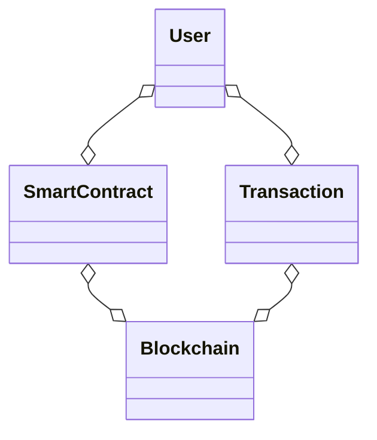
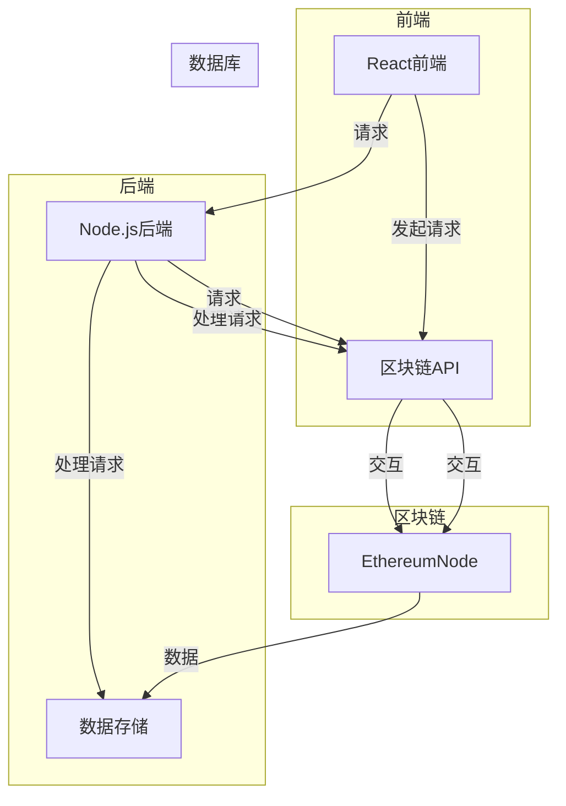
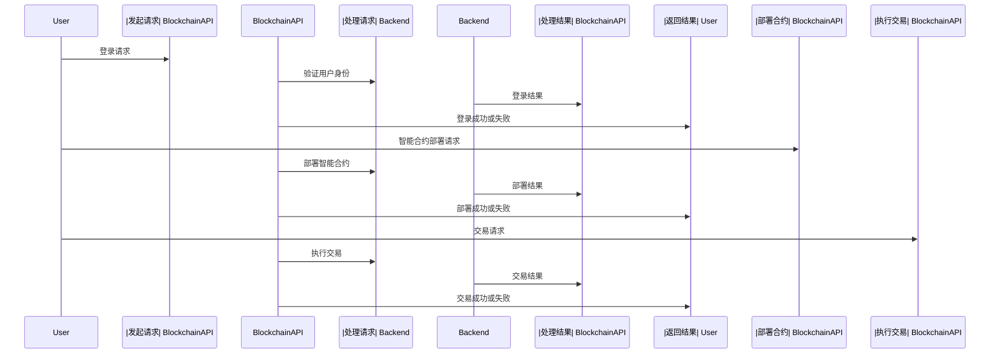
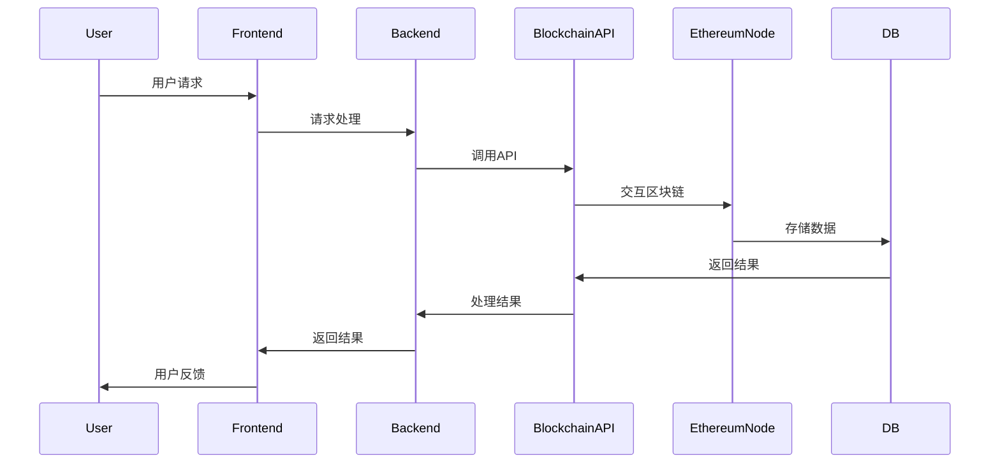

                 

## 引言：技术孵化项目管理的必要性

在当今快速发展的技术时代，技术创新已成为企业发展的核心竞争力。然而，技术创新并非一蹴而就，需要通过有效的项目管理来确保项目的成功实施。技术孵化项目管理作为一种专门针对新兴技术的项目管理方法，其重要性愈发凸显。本文将深入探讨如何进行有效的技术孵化项目管理，以帮助企业和团队在技术发展的浪潮中抓住机遇，实现可持续的创新。

技术孵化项目管理涉及从技术创新的早期概念验证到最终商业化落地的一系列复杂过程。在这个过程中，项目管理者需要具备深刻的理解能力、前瞻性的视野和高效的执行能力。首先，技术创新往往伴随着高风险和高不确定性，这就要求项目管理者能够准确识别和评估潜在的风险，并制定相应的应对策略。其次，技术孵化项目通常涉及跨学科、跨部门的合作，这就需要项目管理者具备良好的沟通协调能力和团队合作精神。

此外，技术孵化项目管理不仅需要关注技术实现的可行性，还需关注市场的需求、商业模式的可行性和资金的支持。这就要求项目管理者不仅要具备技术背景，还需要具备一定的商业洞察力和市场敏感性。有效的技术孵化项目管理能够帮助企业在技术竞争中抢占先机，提高项目的成功率，实现技术成果的商业化转化。

本文将从以下几个方面展开讨论：

1. **技术孵化项目的定义与特点**：介绍技术孵化项目的核心概念和其主要特点，帮助读者理解技术孵化项目的本质。
2. **技术孵化项目管理的核心概念**：梳理项目管理的基本原则、关键流程和角色职责，为后续的内容提供理论基础。
3. **项目管理中的关键算法**：探讨项目管理中的敏捷开发流程、迭代模型和量化管理方法，通过具体实例说明这些算法的原理和应用。
4. **项目管理中的数学模型**：介绍项目管理中的成本效益分析模型、风险评估模型和资源优化模型，并使用LaTeX格式展示相关的数学公式。
5. **系统分析与架构设计**：分析技术孵化项目的系统需求，绘制领域模型类图、系统架构图、系统接口设计图和系统交互序列图。
6. **项目实战**：通过一个完整的技术孵化项目实例，展示从项目环境搭建到核心实现、应用解读和案例分析的全过程。
7. **最佳实践**：总结项目管理中的实用技巧和注意事项，为读者提供可行的操作指南。
8. **小结**：回顾文章的核心要点，展望技术孵化项目管理的未来发展趋势。

通过上述内容的深入探讨，本文旨在为读者提供一个全面、系统的技术孵化项目管理指南，帮助读者掌握有效的项目管理方法和实践技巧。

### 技术孵化项目的定义与特点

技术孵化项目，是指在特定时间内，通过创新和实验，将一个新技术的概念或原型转化为可商业化的产品或服务的项目。它是一个动态、迭代的过程，旨在验证技术的可行性、探索市场的需求，并最终实现商业价值的最大化。技术孵化项目具有以下几个显著特点：

首先，**创新性**是技术孵化项目的核心特征。技术孵化项目往往涉及到前沿技术的探索和应用，如人工智能、区块链、物联网等。这些技术的创新性不仅要求项目团队具备深厚的专业知识，还需要他们具备前瞻性的视野和勇于尝试的精神。

其次，**高风险性**是技术孵化项目不可避免的特性。由于技术的未知性和市场的不可预测性，技术孵化项目常常面临技术实现的困难、市场接受度的挑战以及资金支持的不足等问题。因此，项目管理者需要具备强大的风险管理能力和灵活的应对策略，以降低风险并确保项目的持续推进。

第三，**迭代性**是技术孵化项目的重要特征。技术孵化项目通常采用迭代开发的方法，通过不断的实验和优化，逐步完善技术方案和产品功能。这种迭代的过程不仅有助于提高技术的成熟度，还能及时调整方向，以适应市场变化和用户需求。

第四，**跨学科协作**是技术孵化项目的常态。技术孵化项目往往需要跨领域、跨部门的团队合作，包括技术专家、市场分析师、产品经理、设计师等。跨学科协作不仅能够汇聚多元化的智慧，还能确保项目在技术实现、市场需求和用户体验等方面得到全方位的保障。

最后，**时间敏感性**是技术孵化项目的关键特点。技术孵化项目通常在有限的时间内进行，这就要求项目团队具备高效的工作能力和紧迫感。快速响应市场变化、及时调整战略和资源分配，是项目成功的重要因素。

综上所述，技术孵化项目的定义和特点决定了其在项目管理中需要特别的关注和处理。理解这些特点有助于项目管理者制定合适的管理策略，确保项目在创新性、风险性、迭代性、跨学科协作和时间敏感性方面都得到有效管理，从而提高项目的成功率。

### 技术孵化项目管理的核心概念

在深入探讨技术孵化项目之前，了解项目管理的基本核心概念是至关重要的。项目管理不仅是一门科学，更是一种艺术，它涉及到从项目的启动到完成的整个生命周期。以下是项目管理中的几个关键概念及其在技术孵化项目管理中的应用：

#### 项目管理的基本原则

项目管理的基本原则是确保项目按计划、按预算、按质量要求完成。以下是一些核心原则：

1. **目标导向**：项目的每一个决策和行动都应围绕项目的目标进行。技术孵化项目的目标通常包括技术创新、市场验证和商业价值的实现。
2. **进度控制**：通过定期监控项目进度，确保项目按计划进行。在技术孵化项目中，进度控制尤为重要，因为项目往往需要快速响应市场变化和技术进展。
3. **成本管理**：合理分配资源，确保项目在预算范围内完成。在技术孵化项目中，成本管理涉及技术开发、市场推广和人力资源等多方面的开支。
4. **质量管理**：确保项目交付的产品或服务符合既定的质量标准。在技术孵化项目中，质量不仅关系到产品的市场接受度，还直接影响项目的投资回报率。
5. **风险管理**：识别、评估并控制项目风险，确保项目顺利进行。技术孵化项目由于涉及前沿技术，风险识别和应对策略尤为重要。

#### 项目管理的关键流程

项目管理包括多个关键流程，这些流程相互关联，共同确保项目的成功。以下是几个主要的流程：

1. **项目启动**：明确项目的目标、范围、预算和时间表，并组建项目团队。在技术孵化项目中，项目启动阶段通常需要进行市场调研和初步的技术评估。
2. **项目规划**：制定详细的项目计划，包括工作分解结构（WBS）、任务分配、时间表和资源需求。项目规划是项目成功的基础，尤其是在技术孵化项目中，详细的规划有助于应对不确定性和变化。
3. **项目执行**：执行项目计划，完成各项任务。在技术孵化项目中，执行阶段通常涉及技术开发、市场推广和用户反馈的收集。
4. **项目监控**：通过定期检查项目进度、成本和质量，确保项目按计划进行。监控阶段还包括变更管理和风险管理的实施。
5. **项目收尾**：完成项目，进行项目总结和评估，交付最终成果。在技术孵化项目中，收尾阶段还包括商业模式的验证和商业化推广的启动。

#### 项目管理的角色与职责

项目管理的角色和职责是确保项目顺利进行的保障。以下是一些关键角色及其职责：

1. **项目经理**：负责项目的整体规划、执行和监控，确保项目按计划完成。项目经理在技术孵化项目中扮演着核心角色，需要具备技术背景和项目管理能力。
2. **技术专家**：负责技术开发和实施，确保技术方案的可行性和高效性。技术专家在技术孵化项目中通常负责核心技术的研发和优化。
3. **市场分析师**：负责市场调研和需求分析，确保项目符合市场需求。市场分析师在技术孵化项目中帮助团队理解目标用户的需求和市场的变化趋势。
4. **产品经理**：负责产品的规划和管理，确保产品能够满足用户需求并具备市场竞争力。产品经理在技术孵化项目中需要平衡技术实现和市场需求。
5. **设计师**：负责用户界面设计和用户体验优化，确保产品具有吸引力和易用性。设计师在技术孵化项目中通常关注用户体验和用户界面设计。
6. **质量保证人员**：负责质量控制和测试，确保产品或服务符合质量标准。质量保证人员在技术孵化项目中确保项目的交付成果达到预期质量。

综上所述，技术孵化项目管理涉及多个核心概念和关键流程，需要不同角色的紧密协作。理解这些概念和流程，有助于项目管理者制定有效的管理策略，提高项目成功率。

### 项目管理中的关键算法

在技术孵化项目管理中，算法的应用能够显著提升项目的执行效率和管理效果。以下将介绍几种在项目管理中常用的关键算法，并详细解释其原理和应用。

#### 敏捷开发流程

敏捷开发是一种应对快速变化的需求的软件开发方法，其核心思想是快速迭代和持续交付有价值的软件。敏捷开发流程主要包括以下几个步骤：

1. **需求收集**：项目团队与利益相关者共同确定项目需求，并将其分解为可实施的小功能。
2. **迭代计划**：根据需求，项目团队确定每个迭代的目标和任务，并安排相应的资源和时间。
3. **迭代执行**：团队在迭代周期内完成预定的任务，并进行持续的交流和协作。
4. **迭代评估**：在每个迭代结束时，团队评估项目的进度、质量以及用户反馈，并调整下一个迭代计划。

敏捷开发的优势在于其灵活性和响应速度，能够迅速适应需求变化，提高项目的成功率。

**Python代码示例**：

```python
class Iteration:
    def __init__(self, tasks, deadline):
        self.tasks = tasks
        self.deadline = deadline

def agile_workflow(tasks, deadline):
    iteration = Iteration(tasks, deadline)
    while not iteration.completed():
        iteration.execute()
        iteration.evaluate()

    return "Project Completed"

tasks = ["Task 1", "Task 2", "Task 3"]
deadline = "2023-12-31"
print(agile_workflow(tasks, deadline))
```

#### 迭代模型

迭代模型是一种软件开发模型，其基本思想是将整个开发过程分为多个小的开发阶段，每个阶段称为一个迭代。每个迭代包括需求分析、设计、编码、测试和评估等步骤。

1. **需求分析**：确定项目的需求和功能。
2. **设计**：根据需求进行系统设计。
3. **编码**：根据设计进行代码编写。
4. **测试**：对代码进行功能和性能测试。
5. **评估**：评估迭代成果，确定是否满足需求。

迭代模型通过不断的迭代，逐步完善产品，确保项目能够在规定的时间内交付。

**Python代码示例**：

```python
class Iteration:
    def __init__(self, phase, deadline):
        self.phase = phase
        self.deadline = deadline

    def execute(self):
        if self.phase == "Analysis":
            print("Performing requirement analysis.")
        elif self.phase == "Design":
            print("Designing the system.")
        elif self.phase == "Coding":
            print("Coding the software.")
        elif self.phase == "Testing":
            print("Testing the software.")
        else:
            print("Evaluation phase.")

    def completed(self):
        return self.phase == "Evaluation"

def iterative_model(phases, deadline):
    for phase in phases:
        iteration = Iteration(phase, deadline)
        iteration.execute()
        if not iteration.completed():
            print("Iteration incomplete, restarting.")

phases = ["Analysis", "Design", "Coding", "Testing", "Evaluation"]
deadline = "2023-12-31"
iterative_model(phases, deadline)
```

#### 量化管理方法

量化管理方法通过数据分析和数学模型，对项目进行精细化管理。以下是一种常见的量化管理方法——关键路径法（Critical Path Method，CPM）。

1. **活动定义**：确定项目中的所有活动。
2. **活动排序**：确定活动之间的逻辑关系，并绘制网络图。
3. **时间估计**：为每个活动估计完成时间。
4. **计算时间**：计算每个活动的最早开始时间（ES）、最早完成时间（EF）、最迟开始时间（LS）和最迟完成时间（LF）。
5. **关键路径**：找出总持续时间最长的路径，即关键路径。

关键路径上的活动称为关键活动，任何关键活动的延迟都会导致整个项目的延迟。通过关键路径法，项目管理者可以识别项目的关键路径和关键活动，从而制定有效的进度计划和资源分配策略。

**Python代码示例**：

```python
import networkx as nx
import matplotlib.pyplot as plt

# 活动定义和逻辑关系
G = nx.DiGraph()
G.add_nodes_from(["A", "B", "C", "D", "E", "F", "G"])
G.add_edges_from([("A", "B"), ("B", "C"), ("C", "D"), ("D", "E"), ("E", "F"), ("F", "G")])

# 时间估计（单位：天）
times = {"A": 3, "B": 4, "C": 2, "D": 3, "E": 2, "F": 2, "G": 1}

def calculate_critical_path(graph, times):
    es = {node: 0 for node in graph.nodes}
    for node in graph.nodes:
        for predecessor in graph.predecessors(node):
            es[node] = max(es[node], es[predecessor] + times[predecessor])
    
    total_time = 0
    for node in graph.nodes:
        ls = {node: es[node] for node in graph.nodes}
        for node in graph.nodes:
            for successor in graph.successors(node):
                ls[successor] = min(ls[successor], ls[node] + times[node])
    
    critical_path = nx.single_source_longest_path(G, source="A", target="G")
    print("Critical Path:", critical_path)
    print("Total Time:", sum([times[node] for node in critical_path]))

calculate_critical_path(G, times)

# 绘制网络图
nx.draw(G, with_labels=True)
plt.show()
```

通过上述关键算法的应用，技术孵化项目管理能够更加科学、系统和高效。敏捷开发流程和迭代模型有助于快速响应变化，提高项目的灵活性和成功率；量化管理方法通过数据分析和关键路径识别，确保项目在时间和资源上的高效利用。理解并应用这些关键算法，将极大提升技术孵化项目的管理效果。

### 项目管理中的数学模型

在技术孵化项目管理中，数学模型的应用能够为项目决策提供有力的数据支持，帮助项目管理者优化资源配置、评估风险并预测项目进展。以下介绍几种常见的数学模型及其在项目管理中的应用。

#### 成本效益分析模型

成本效益分析（Cost-Benefit Analysis，CBA）是一种评估项目经济可行性的方法，它通过比较项目的总成本与预期收益，评估项目的整体经济效益。

**模型公式**：

$$
CBA = \frac{B}{C}
$$

其中，\(B\) 表示项目的总收益，\(C\) 表示项目的总成本。如果 \(CBA > 1\)，则项目在经济上是可行的。

**应用实例**：

假设某技术孵化项目预期收益为100万元，总成本为70万元，则：

$$
CBA = \frac{100}{70} = 1.429
$$

由于 \(CBA > 1\)，该项目在经济上是可行的。

#### 风险评估模型

风险评估（Risk Assessment）是一种评估项目风险概率和影响程度的方法，常用的风险评估模型包括定量风险评估和定性风险评估。

**定量风险评估模型**：

定量风险评估通过数学方法对风险的概率和影响进行量化分析。

**模型公式**：

$$
RI = P \times I
$$

其中，\(RI\) 表示风险指数，\(P\) 表示风险概率，\(I\) 表示风险影响。

**应用实例**：

假设某技术孵化项目的风险概率为0.5，风险影响为10万元，则：

$$
RI = 0.5 \times 10 = 5
$$

风险指数为5，表示该风险对项目的影响较为显著。

**定性风险评估模型**：

定性风险评估通过描述性语言评估风险的概率和影响。

**评估方法**：

1. **风险矩阵**：使用风险矩阵将风险概率和影响程度进行分类。
2. **风险优先级排序**：根据风险矩阵对风险进行优先级排序，以便项目管理者优先处理高优先级风险。

**应用实例**：

通过风险矩阵评估，某技术孵化项目中的高优先级风险如下：

- **高概率、高影响**：技术实现风险
- **高概率、低影响**：市场接受度风险
- **低概率、高影响**：资金链断裂风险

#### 资源优化模型

资源优化模型旨在通过合理分配资源，提高项目的效率。常见的资源优化模型包括最优化理论中的线性规划和动态规划。

**线性规划模型**：

线性规划通过线性方程组对资源分配进行优化。

**模型公式**：

$$
\text{Minimize} \ c^T x
$$
$$
\text{Subject to} \ Ax \leq b
$$

其中，\(c\) 表示目标函数系数，\(x\) 表示决策变量，\(A\) 和 \(b\) 分别表示约束条件。

**应用实例**：

假设某技术孵化项目需要分配100万元资金，目标是最小化总成本，约束条件如下：

$$
2x_1 + 3x_2 \leq 100
$$
$$
x_1, x_2 \geq 0
$$

通过线性规划求解，可以找到最优的资金分配方案。

**动态规划模型**：

动态规划通过分阶段优化，解决资源分配和路径选择问题。

**模型公式**：

$$
\text{Minimize} \ F(i, j)
$$
$$
\text{Subject to} \ G(i, j) \leq h(i, j)
$$

其中，\(F(i, j)\) 表示第\(i\)阶段第\(j\)个决策的最优值，\(G(i, j)\) 表示第\(i\)阶段第\(j\)个决策的约束条件，\(h(i, j)\) 表示第\(i\)阶段第\(j\)个决策的参数。

**应用实例**：

假设某技术孵化项目需要在5个阶段内优化资源分配，各阶段的约束条件如下：

$$
F(i, j) = \text{Minimize} \ C(i, j)
$$
$$
C(i, j) \leq R_i
$$

通过动态规划，可以找到最优的资源分配路径。

通过上述数学模型的应用，技术孵化项目管理者能够更加科学和系统地做出决策，提高项目的成功率。这些模型不仅提供了量化的数据支持，还帮助项目管理者更好地理解项目的风险和资源优化问题，从而实现项目的顺利推进和成功交付。

### 系统分析与架构设计

在技术孵化项目管理中，系统分析与架构设计是确保项目成功的关键步骤之一。这一过程不仅涉及到对项目需求的分析，还包括对系统功能、架构、接口和交互的全面设计。以下将详细描述这些环节，并提供相应的mermaid图和LaTeX公式进行说明。

#### 问题场景介绍

假设我们正在开发一个基于区块链技术的智能合约平台，该平台旨在提供去中心化的交易和管理功能，以满足金融行业的特定需求。项目的目标是开发一个安全、高效且易于使用的智能合约平台，以满足市场需求并实现商业价值。

#### 项目介绍

项目名称：区块链智能合约平台（Blockchain Smart Contract Platform，BSCP）

项目范围：开发一个基于以太坊区块链的智能合约平台，支持去中心化的交易和管理功能。

项目目标：
1. 提供一个安全、高效的智能合约执行环境。
2. 支持多种加密货币和数字资产的交易。
3. 实现用户友好的界面，提高用户体验。

项目团队：
- 技术专家：负责智能合约的开发和测试。
- 产品经理：负责需求分析和产品管理。
- 设计师：负责用户界面设计和用户体验优化。
- 质量保证人员：负责系统测试和用户反馈收集。

#### 系统功能设计

系统功能设计是项目开发的基础，它定义了系统的核心功能模块。以下是BSCP的关键功能模块：

1. **智能合约执行环境**：提供安全的执行环境，支持智能合约的部署和执行。
2. **交易管理**：实现加密货币和数字资产的交易功能。
3. **用户身份认证**：确保用户身份的可信性和安全性。
4. **数据存储**：提供区块链数据存储解决方案，确保数据的完整性和可追溯性。
5. **监控系统**：实时监控系统的性能和安全性。

**领域模型类图（Mermaid）**：



#### 系统架构设计

系统架构设计是确定系统整体结构的过程，它包括组件的划分、组件间的交互以及数据流的定义。以下是BSCP的系统架构设计：

1. **前端架构**：采用React框架实现用户界面，提供用户友好的操作体验。
2. **后端架构**：使用Node.js和以太坊区块链节点实现智能合约执行环境和交易管理。
3. **区块链接口**：使用Web3.js库与以太坊区块链进行交互。
4. **数据存储**：使用区块链技术存储交易数据，确保数据的安全和可追溯性。

**系统架构图（Mermaid）**：



#### 系统接口设计

系统接口设计定义了系统各组件之间的交互方式，包括API接口和数据交换格式。以下是BSCP的关键接口设计：

1. **用户身份认证接口**：提供用户登录、注册和身份验证功能。
2. **智能合约操作接口**：提供智能合约的部署、调用和监控功能。
3. **交易管理接口**：提供交易创建、确认和记录功能。

**系统接口设计图（Mermaid）**：



#### 系统交互序列图

系统交互序列图展示系统组件之间的交互顺序和过程，以下是BSCP的系统交互序列图：

**系统交互序列图（Mermaid）**：



通过上述系统分析与架构设计，技术孵化项目管理者能够明确系统的功能需求、架构设计、接口设计和交互过程。这些设计不仅为项目开发提供了清晰的蓝图，还帮助项目团队在开发过程中保持一致性和高效性，从而确保项目的成功实施。

### 项目实战

在技术孵化项目管理中，通过一个完整的项目实例可以更直观地展示项目的全过程，从环境搭建到核心实现，再到代码解读与分析。本文将基于一个区块链智能合约平台（BSCP）的项目实例，详细讲解项目的各个阶段，并提供代码示例和实际案例分析。

#### 项目环境搭建

在开始项目开发之前，首先需要搭建合适的技术环境。对于BSCP项目，以下是环境搭建的步骤：

1. **安装Node.js**：Node.js是一个基于Chrome V8引擎的JavaScript运行环境，用于后端开发和智能合约执行。
   ```bash
   curl -fsSL https://deb.nodesource.com/setup_14.x | sudo -E bash -
   sudo apt-get install -y nodejs
   ```
2. **安装npm**：npm是Node.js的包管理工具，用于安装和管理项目依赖。
   ```bash
   npm install -g npm
   ```
3. **安装以太坊客户端**：选择一个以太坊客户端，如Geth或EthereumJS，用于与区块链交互。
   ```bash
   npm install --save-dev ganache-cli
   ```
4. **创建项目目录**：在指定目录下创建项目文件夹，并初始化npm项目。
   ```bash
   mkdir bscp
   cd bscp
   npm init -y
   ```
5. **安装项目依赖**：安装项目所需的依赖包，如Web3.js、React和Redux等。
   ```bash
   npm install web3 react react-dom react-redux
   ```

#### 系统核心实现

在项目环境搭建完成后，开始进行系统核心实现。以下是BSCP项目的主要模块和核心代码：

1. **智能合约开发**：使用Solidity语言编写智能合约，并在Truffle框架中编译和部署。
   ```solidity
   // contracts/Token.sol
  pragma solidity ^0.8.0;

   contract Token {
       string public name;
       string public symbol;
       uint8 public decimals;
       uint256 public totalSupply;
       mapping (address => uint256) public balanceOf;

       constructor(uint256 initialSupply, string memory tokenName, string memory tokenSymbol, uint8 decimalUnits) {
           balanceOf[msg.sender] = initialSupply;
           name = tokenName;
           symbol = tokenSymbol;
           decimals = decimalUnits;
           totalSupply = initialSupply;
       }

       function transfer(address _to, uint256 _value) public returns (bool success) {
           require(_to != address(0));
           require(balanceOf[msg.sender] >= _value && balanceOf[_to] + _value >= balanceOf[_to]);
           balanceOf[msg.sender] -= _value;
           balanceOf[_to] += _value;
           emit Transfer(msg.sender, _to, _value);
           return true;
       }
   }
   ```
2. **后端开发**：使用Node.js和Express框架实现后端服务，处理智能合约的交互和前端请求。
   ```javascript
   // server.js
   const express = require('express');
   const Web3 = require('web3');
   const http = require('http');
   const cors = require('cors');
   const bodyParser = require('body-parser');

   const app = express();
   const server = http.createServer(app);
   const web3 = new Web3('http://localhost:8545');

   app.use(cors());
   app.use(bodyParser.json());

   const tokenArtifact = require('./build/contracts/Token.json');
   const tokenContract = new web3.eth.Contract(tokenArtifact.abi);

   app.post('/transfer', async (req, res) => {
       const { from, to, amount } = req.body;
       const tx = {
           from: from,
           to: to,
           value: web3.utils.toWei(amount.toString(), 'ether'),
           gas: 2000000
       };

       try {
           const txHash = await tokenContract.methods.transfer(to, amount).send(tx);
           res.status(200).json({ status: 'Success', transactionHash: txHash });
       } catch (error) {
           res.status(500).json({ status: 'Error', message: error.message });
       }
   });

   server.listen(3000, () => {
       console.log('Server started on port 3000');
   });
   ```

#### 代码应用解读与分析

在实现智能合约和后端服务后，需要对关键代码进行解读和分析，确保其功能正确并高效。

1. **智能合约解读**：
   - **构造函数**：初始化Token合约的名称、符号、总供应量和默认地址的余额。
   - **transfer函数**：实现从发送者地址向接收者地址转账的功能，并触发Transfer事件。

2. **后端服务解读**：
   - **请求处理**：接收前端转账请求，提取from、to和amount参数。
   - **交易发送**：调用智能合约的transfer方法，构造交易并使用web3.eth.sendTransaction发送交易。

#### 实际案例分析

为了更好地理解项目实战，以下是一个实际案例：

**案例背景**：用户A（地址0x123）希望向用户B（地址0x456）转账0.5 ETH。

**案例分析**：

1. **前端请求**：用户A在网页上提交转账请求，请求包含from、to和amount参数。
   ```json
   {
       "from": "0x123",
       "to": "0x456",
       "amount": "0.5"
   }
   ```

2. **后端处理**：后端接收到请求后，调用智能合约的transfer方法进行转账。
   ```javascript
   app.post('/transfer', async (req, res) => {
       const { from, to, amount } = req.body;
       const tx = {
           from: from,
           to: to,
           value: web3.utils.toWei(amount.toString(), 'ether'),
           gas: 2000000
       };

       try {
           const txHash = await tokenContract.methods.transfer(to, amount).send(tx);
           res.status(200).json({ status: 'Success', transactionHash: txHash });
       } catch (error) {
           res.status(500).json({ status: 'Error', message: error.message });
       }
   });
   ```

3. **交易执行**：智能合约执行transfer函数，从用户A的账户扣除0.5 ETH并添加到用户B的账户。
   ```solidity
   function transfer(address _to, uint256 _value) public returns (bool success) {
       require(_to != address(0));
       require(balanceOf[msg.sender] >= _value && balanceOf[_to] + _value >= balanceOf[_to]);
       balanceOf[msg.sender] -= _value;
       balanceOf[_to] += _value;
       emit Transfer(msg.sender, _to, _value);
       return true;
   }
   ```

4. **交易反馈**：后端将交易结果反馈给前端，用户A和用户B可以查看交易状态和结果。
   ```json
   {
       "status": "Success",
       "transactionHash": "0x1234567890abcdef1234567890abcdef1234567890abcdef"
   }
   ```

通过这个项目实例，读者可以清晰地看到技术孵化项目的全过程，从环境搭建、核心实现到代码解读与分析，以及实际案例分析。这样的实战经验对于理解和掌握技术孵化项目管理至关重要。

### 最佳实践

在技术孵化项目管理中，最佳实践能够显著提高项目的成功率。以下是一些在实际操作中有效的项目管理技巧和注意事项：

1. **明确项目目标和范围**：在项目启动阶段，确保项目目标和范围明确、具体，避免因目标模糊导致的项目方向偏差和资源浪费。

2. **建立跨学科协作团队**：技术孵化项目通常涉及多个领域，建立包含技术、市场、设计和质量管理等多学科背景的团队，有助于充分利用多元化思维，提高项目成功率。

3. **采用敏捷开发方法**：敏捷开发能够快速响应变化，通过迭代和反馈机制不断优化产品。采用Scrum或Kanban等敏捷框架，有助于提高项目的灵活性和响应速度。

4. **进行详细的需求分析和市场调研**：在项目初期进行充分的需求分析和市场调研，确保项目符合市场需求，并能够解决实际问题。

5. **制定风险管理计划**：识别项目中的潜在风险，制定相应的风险管理计划，提前制定应对策略，降低项目风险。

6. **持续监控和评估项目进度**：定期监控项目进度，评估关键指标，如进度、成本、质量和风险，确保项目按计划进行。

7. **关注用户体验**：技术孵化项目的最终目标是满足用户需求，因此要始终关注用户体验，通过用户反馈和测试不断优化产品功能。

8. **合理分配资源**：确保项目资源（包括人力、资金和技术资源）得到合理分配，避免资源浪费和瓶颈。

9. **文档管理**：保持良好的文档记录，包括项目计划、设计文档、代码注释和测试报告等，有助于项目后续的维护和扩展。

10. **持续学习和改进**：技术孵化项目管理是一个不断学习和改进的过程。通过总结项目经验，持续改进管理方法和实践技巧，提高项目的成功率。

通过遵循这些最佳实践，技术孵化项目管理团队能够更好地应对不确定性和挑战，确保项目顺利推进并实现预期目标。

### 小结

本文通过详细探讨技术孵化项目管理的各个方面，从定义与特点、核心概念、关键算法、数学模型到系统分析与架构设计，再到项目实战和最佳实践，为读者提供了一套全面的技术孵化项目管理指南。以下是对本文核心要点的回顾：

1. **技术孵化项目的定义与特点**：技术孵化项目是一个创新性的、高风险的、迭代性的项目，涉及前沿技术的探索和商业化的实现。
2. **核心概念与流程**：项目管理的基本原则、关键流程和角色职责是确保项目成功的重要保障。
3. **关键算法**：敏捷开发流程、迭代模型和量化管理方法在技术孵化项目管理中发挥着重要作用，有助于提高项目的灵活性和效率。
4. **数学模型**：成本效益分析、风险评估和资源优化模型为项目决策提供了有力的数据支持。
5. **系统分析与架构设计**：系统功能设计、系统架构设计、接口设计和交互设计为项目的实施提供了清晰的蓝图。
6. **项目实战**：通过一个区块链智能合约平台的实际案例，展示了技术孵化项目的全过程。
7. **最佳实践**：明确项目目标、建立跨学科团队、采用敏捷开发、进行需求分析、制定风险管理计划、关注用户体验和持续改进等是成功管理技术孵化项目的关键。

展望未来，随着技术的不断进步和市场的不断变化，技术孵化项目管理将面临更多的挑战和机遇。项目管理者需要不断提升自身的专业能力和管理技巧，积极适应新技术和新模式，以确保项目的成功实施和商业价值的最大化。持续的改进和学习，将使技术孵化项目管理在快速变化的环境中持续焕发活力，为企业和团队带来更多的创新成果。

### 致谢

在撰写本文的过程中，我要感谢AI天才研究院（AI Genius Institute）的全体成员，以及《禅与计算机程序设计艺术》（Zen And The Art of Computer Programming）的作者，他们的卓越工作和智慧为本文章提供了宝贵的知识支持和灵感。此外，特别感谢我的读者们，是你们的关注和支持让我不断进步，期待与您在未来的技术探索中再次相遇。作者：AI天才研究院/AI Genius Institute & 禅与计算机程序设计艺术 /Zen And The Art of Computer Programming。

