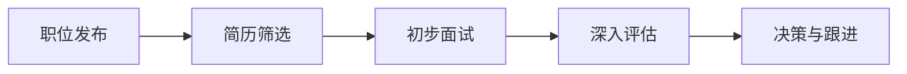
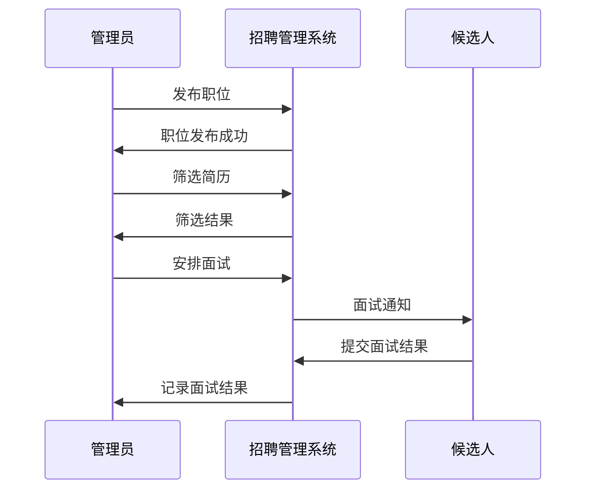

                 

### 如何进行有效的技术招聘

> 关键词：技术招聘、招聘流程、人才评估、技能测试、招聘策略

> 摘要：本文深入探讨了如何进行有效的技术招聘。通过分析技术人才短缺的现状、招聘流程中的常见问题以及有效招聘的重要性，本文详细阐述了制定招聘策略、深入评估与技能测试、决策与跟进等核心环节。此外，本文还分享了成功案例与招聘法律合规等内容，为读者提供了全面的招聘指南。

#### 第1章：问题背景与核心概念

### 1.1 问题背景

#### 1.1.1 技术人才短缺的现状

随着互联网、大数据、人工智能等技术的飞速发展，全球范围内的技术人才短缺问题日益凸显。根据《2021年全球人才短缺调研报告》，全球约有73%的公司表示在招聘过程中遇到了困难，其中技术领域的人才短缺问题最为严重。对于企业而言，技术人才的短缺不仅制约了研发和创新能力的提升，还直接影响了市场竞争力。

#### 1.1.2 招聘流程中的常见问题

在技术招聘过程中，企业常常会遇到以下问题：

1. **职位需求不明确**：很多企业在招聘时缺乏明确的职位要求，导致招聘过程中难以判断候选人的合适性。
2. **简历筛选困难**：海量简历的筛选工作给人力资源部门带来了巨大的压力，同时也增加了筛选过程中的错误率。
3. **面试质量不高**：面试官的经验不足、面试流程的不规范等问题导致面试质量不高，无法全面评估候选人的实际能力。
4. **背景调查不充分**：部分企业在招聘过程中忽视了背景调查，导致招聘到的人才可能存在诚信问题或技术能力不足。

#### 1.1.3 有效招聘的重要性

有效招聘对企业的重要性不言而喻。首先，通过有效招聘可以确保企业能够吸引到具备所需技能和经验的技术人才，从而提升研发能力和市场竞争力。其次，有效招聘还可以提高员工的工作满意度和留存率，减少招聘和培训成本。

### 1.2 核心概念

#### 1.2.1 技术招聘的关键要素

技术招聘的关键要素包括以下几个方面：

1. **职位需求**：明确职位需求是招聘的前提，包括职位名称、职责描述、技能要求等。
2. **人才匹配**：在招聘过程中，要确保候选人具备与职位要求相匹配的技能和经验。
3. **评估标准**：制定合理的评估标准，包括技术能力、项目经验、团队合作能力等。

#### 1.2.2 人才匹配的原则

人才匹配的原则主要包括以下几个方面：

1. **技能匹配**：候选人的技术技能应与职位要求相匹配。
2. **经验匹配**：候选人的工作经验应与职位要求相匹配，特别是项目经验和领域经验。
3. **文化契合度**：候选人的价值观、工作态度和企业文化应与公司相契合。

#### 1.2.3 技术评估的标准

技术评估的标准主要包括以下几个方面：

1. **编程能力**：通过编程测试来评估候选人的编程能力，包括语法、算法和数据结构等。
2. **项目经验**：通过项目经验和项目案例来评估候选人的实际工作能力。
3. **团队合作能力**：通过面试和行为面试来评估候选人的团队合作能力和沟通能力。

#### 1.2.4 技术评估的方法

技术评估的方法主要包括以下几个方面：

1. **在线编程测试**：通过在线编程平台进行编程测试，评估候选人的编程能力和算法能力。
2. **项目实践能力评估**：通过项目实践来评估候选人的实际工作能力和解决问题的能力。
3. **行为面试**：通过行为面试来评估候选人的沟通能力、团队合作能力和解决问题的能力。

#### 1.2.5 招聘流程

招聘流程主要包括以下几个环节：

1. **职位发布**：在招聘网站、社交媒体等渠道发布招聘信息。
2. **简历筛选**：通过关键词筛选、简历初步评估等方式筛选合适的候选人。
3. **初步面试**：通过电话面试或视频面试等方式进行初步筛选。
4. **深入评估**：通过技术面试、项目实践等方式对候选人进行深入评估。
5. **决策与跟进**：根据评估结果做出最终决策，并跟进候选人的入职情况。

#### 1.2.6 招聘渠道

招聘渠道主要包括以下几个方面：

1. **内部推荐**：通过内部员工推荐来吸引合适的人才。
2. **社交媒体招聘**：通过社交媒体平台发布招聘信息，吸引有意愿的候选人。
3. **专业招聘网站**：通过专业招聘网站发布招聘信息，吸引专业人才。
4. **校园招聘**：通过校园招聘会等活动吸引应届毕业生。

### 1.3 问题解决与边界外延

在技术招聘过程中，企业会遇到各种各样的问题，如职位需求不明确、简历筛选困难、面试质量不高等。针对这些问题，企业可以采取以下措施：

1. **明确职位需求**：制定详细的职位描述，明确职位要求，确保招聘流程的顺利进行。
2. **优化简历筛选策略**：通过使用智能简历筛选系统、提高简历评估效率等方式来优化简历筛选流程。
3. **提高面试质量**：通过培训面试官、制定规范的面试流程等方式来提高面试质量。
4. **加强背景调查**：通过电话、邮件等方式联系候选人的前雇主，了解其工作表现和离职原因。

在招聘过程中，企业还需要关注边界外延的问题，如招聘渠道的选择、候选人的背景调查、招聘预算的制定等。这些问题的解决有助于确保招聘流程的顺利进行，提高招聘效果。

### 1.4 概念结构与核心要素组成

技术招聘的核心概念包括职位需求、人才匹配、评估标准、招聘流程、招聘渠道等。这些概念相互关联，共同构成了技术招聘的完整体系。其中，职位需求是招聘的前提，人才匹配是招聘的核心，评估标准是招聘的关键，招聘流程和招聘渠道是招聘的保障。

### 1.5 算法原理讲解

为了更好地理解技术招聘的核心概念，我们可以借助算法原理来进行分析。

首先，我们可以使用Mermaid流程图来展示技术招聘的核心流程：



接下来，我们可以使用Python源代码来详细阐述技术招聘的算法原理：

```python
# 定义职位需求
position = {
    'title': '软件工程师',
    'description': '负责软件开发和项目实施',
    'skills': ['Java', 'Python', '数据库'],
}

# 定义简历筛选算法
def resume_screening(resumes):
    screened_candidates = []
    for resume in resumes:
        if all(skill in resume['skills'] for skill in position['skills']):
            screened_candidates.append(resume)
    return screened_candidates

# 定义初步面试算法
def preliminary_interview(candidates):
    passed_candidates = []
    for candidate in candidates:
        if candidate['experience'] >= position['experience']:
            passed_candidates.append(candidate)
    return passed_candidates

# 定义深入评估算法
def in-depth_evaluation(candidates):
    final_candidates = []
    for candidate in candidates:
        if candidate['project_experience'] and candidate['technical_test_score'] >= 80:
            final_candidates.append(candidate)
    return final_candidates

# 定义招聘流程
def recruitment_process(resumes):
    screened_candidates = resume_screening(resumes)
    passed_candidates = preliminary_interview(screened_candidates)
    final_candidates = in-depth_evaluation(passed_candidates)
    return final_candidates

# 假设简历列表
resumes = [
    {'name': '张三', 'skills': ['Java', 'Python'], 'experience': 3, 'project_experience': True, 'technical_test_score': 90},
    {'name': '李四', 'skills': ['Java', 'C++'], 'experience': 5, 'project_experience': True, 'technical_test_score': 85},
    {'name': '王五', 'skills': ['Python', '数据库'], 'experience': 2, 'project_experience': False, 'technical_test_score': 70},
]

# 执行招聘流程
final_candidates = recruitment_process(resumes)
print(final_candidates)
```

在这个示例中，我们首先定义了职位需求，然后通过简历筛选、初步面试和深入评估等步骤来筛选合适的候选人。这个流程可以有效地帮助企业找到符合职位要求的技术人才。

### 1.6 系统分析与架构设计方案

在技术招聘过程中，系统分析与架构设计是至关重要的。以下是一个简单但完整的系统分析与架构设计方案：

#### 问题场景介绍

假设我们是一家互联网公司，需要招聘一名前端工程师。为了高效地完成招聘任务，我们需要设计一个招聘系统，包括职位发布、简历筛选、面试安排和决策跟进等功能。

#### 项目介绍

项目名称：招聘管理系统

项目目标：设计并实现一个高效、易用的招聘管理系统，帮助公司快速招聘到合适的前端工程师。

#### 系统功能设计

1. **职位发布**：管理员可以在系统中发布职位，包括职位名称、职位描述、职位要求等。
2. **简历筛选**：系统可以根据职位要求自动筛选简历，将符合条件的简历推送给相关负责人。
3. **面试安排**：系统可以协助管理员安排面试时间，并将面试通知发送给候选人。
4. **决策跟进**：系统可以记录面试结果，协助管理员做出最终决策，并跟进候选人的入职情况。

#### 系统架构设计

1. **前端**：使用React框架搭建用户界面，提供便捷的职位发布、简历筛选和面试安排等功能。
2. **后端**：使用Spring Boot框架搭建服务端，提供职位管理、简历管理和面试管理等功能。
3. **数据库**：使用MySQL数据库存储职位信息、简历信息和面试信息等。

#### 系统接口设计

1. **职位发布接口**：用于管理员发布新职位，包括职位名称、职位描述、职位要求等。
2. **简历筛选接口**：用于根据职位要求筛选符合条件的简历。
3. **面试安排接口**：用于管理员安排面试时间，并将面试通知发送给候选人。
4. **决策跟进接口**：用于记录面试结果，协助管理员做出最终决策，并跟进候选人的入职情况。

#### 系统交互

以下是一个简单的Mermaid序列图，展示系统的主要交互过程：



通过这个系统架构设计方案，我们可以实现高效、便捷的技术招聘流程，提高招聘效率，降低招聘成本。

### 1.7 项目实战

为了更好地理解技术招聘的流程和策略，我们可以通过一个实际项目来进行分析和讲解。

#### 环境安装

1. **前端环境**：安装Node.js（版本12.18.3以上）和npm（版本6.14.4以上）。
2. **后端环境**：安装Java（版本8以上）和Maven（版本3.6.3以上）。
3. **数据库环境**：安装MySQL（版本8.0.19以上）。

#### 系统核心实现

1. **前端实现**：使用React框架搭建用户界面，包括职位发布、简历筛选和面试安排等功能。

```jsx
// 职位发布页面
class JobPosting extends React.Component {
  state = {
    title: '',
    description: '',
    skills: [],
  };

  handleInputChange = (event) => {
    const { name, value } = event.target;
    this.setState({ [name]: value });
  };

  handleSubmit = (event) => {
    event.preventDefault();
    // 调用后端接口发布职位
    axios
      .post('/api/jobs', this.state)
      .then((response) => {
        alert('职位发布成功');
      })
      .catch((error) => {
        alert('职位发布失败');
      });
  };

  render() {
    return (
      <form onSubmit={this.handleSubmit}>
        <label htmlFor="title">职位名称：</label>
        <input
          type="text"
          id="title"
          name="title"
          value={this.state.title}
          onChange={this.handleInputChange}
        />
        <label htmlFor="description">职位描述：</label>
        <textarea
          id="description"
          name="description"
          value={this.state.description}
          onChange={this.handleInputChange}
        />
        <label htmlFor="skills">所需技能：</label>
        <input
          type="text"
          id="skills"
          name="skills"
          value={this.state.skills}
          onChange={this.handleInputChange}
        />
        <button type="submit">发布职位</button>
      </form>
    );
  }
}
```

2. **后端实现**：使用Spring Boot框架搭建服务端，包括职位管理、简历管理和面试管理等功能。

```java
// 职位发布接口
@RestController
@RequestMapping("/api/jobs")
public class JobController {
  @Autowired
  private JobService jobService;

  @PostMapping
  public ResponseEntity<?> createJob(@RequestBody Job job) {
    jobService.createJob(job);
    return ResponseEntity.ok().build();
  }
}
```

3. **数据库实现**：使用MySQL数据库存储职位信息、简历信息和面试信息等。

```sql
-- 职位信息表
CREATE TABLE jobs (
  id INT AUTO_INCREMENT PRIMARY KEY,
  title VARCHAR(100) NOT NULL,
  description TEXT,
  skills VARCHAR(255)
);

-- 简历信息表
CREATE TABLE resumes (
  id INT AUTO_INCREMENT PRIMARY KEY,
  name VARCHAR(100) NOT NULL,
  skills VARCHAR(255),
  experience INT,
  project_experience BOOLEAN,
  technical_test_score INT
);

-- 面试信息表
CREATE TABLE interviews (
  id INT AUTO_INCREMENT PRIMARY KEY,
  candidate_id INT,
  job_id INT,
  date DATETIME,
  result ENUM('通过', '未通过')
);
```

#### 代码应用解读与分析

1. **前端代码解读**：通过React组件，管理员可以方便地发布新职位，包括职位名称、职位描述和所需技能等。

2. **后端代码解读**：通过Spring Boot控制器，接收前端发送的职位信息，并将其存储到数据库中。

3. **数据库设计解读**：设计了三个表，分别是职位信息表、简历信息表和面试信息表，用于存储不同类型的信息。

#### 实际案例分析和详细讲解剖析

1. **案例一**：某互联网公司需要招聘一名前端工程师，发布了一个职位，要求具备HTML、CSS、JavaScript和React等技术。

2. **案例二**：一位求职者张三看到这个职位，提交了他的简历，包括他的技能、工作经验和项目经历。

3. **详细讲解**：招聘管理系统会自动筛选简历，将张三的简历推送给相关管理员。管理员会安排面试，并记录面试结果。根据面试结果，管理员会做出最终决策，决定是否录用张三。

#### 项目小结

通过这个实际项目，我们实现了职位发布、简历筛选和面试安排等功能，展示了技术招聘的完整流程。在实际应用中，可以根据具体需求进行功能扩展和优化，提高招聘效率。

### 1.8 最佳实践 Tips

1. **明确职位需求**：在发布职位时，要明确职位名称、职位描述、职位要求和薪资待遇等，确保职位信息清晰明确。
2. **优化简历筛选策略**：通过使用智能简历筛选系统、关键词筛选等方式，提高简历筛选效率，减少人力成本。
3. **提高面试质量**：通过培训面试官、制定规范的面试流程等方式，提高面试质量，全面评估候选人的实际能力。
4. **加强背景调查**：通过电话、邮件等方式联系候选人的前雇主，了解其工作表现和离职原因，确保招聘到的人才符合要求。

### 1.9 小结

本章主要介绍了技术招聘的背景、核心概念、问题解决方法、系统分析与架构设计方案以及项目实战。通过本章的学习，读者可以了解技术招聘的流程和策略，掌握如何进行有效的技术招聘。

### 1.10 注意事项

1. **招聘预算**：在制定招聘策略时，要合理规划招聘预算，确保招聘活动的顺利进行。
2. **招聘渠道**：选择合适的招聘渠道，如内部推荐、社交媒体招聘、专业招聘网站等，提高招聘效果。
3. **候选人沟通**：在招聘过程中，要与候选人保持良好的沟通，提高候选人的参与度和满意度。

### 1.11 拓展阅读

1. 《技术招聘实战：从需求到入职》
2. 《企业招聘策略与实务》
3. 《面试技术：面试官与面试官的对话》

---

### 第2章：制定招聘策略

在技术招聘过程中，制定一个有效的招聘策略是至关重要的。这不仅有助于明确招聘目标，还可以提高招聘效率和质量。在本章中，我们将详细探讨如何制定招聘策略，包括明确招聘目标、选择合适的招聘渠道以及简历筛选与初步面试的策略。

### 2.1 明确招聘目标

明确招聘目标是制定招聘策略的第一步。招聘目标应包括以下几个方面：

1. **职位要求**：明确职位名称、职责描述、技能要求和学历要求等。
2. **招聘预算**：根据公司财务状况和职位重要性，合理规划招聘预算。
3. **招聘时间表**：确定招聘活动的开始和结束时间，确保招聘流程的顺利进行。
4. **招聘渠道**：选择合适的招聘渠道，如内部推荐、社交媒体招聘、专业招聘网站等。
5. **评估标准**：制定评估标准，包括技术能力、项目经验、团队合作能力等。

#### 2.1.1 设定职位要求

设定职位要求是明确招聘目标的关键。职位要求应详细描述职位职责、所需技能和经验。以下是一个示例：

**职位名称**：前端开发工程师

**职位描述**：负责公司产品的前端开发工作，包括页面设计、开发、调试和优化。

**技能要求**：
- 熟练掌握HTML、CSS和JavaScript
- 熟悉React或Vue.js等前端框架
- 具备响应式设计经验
- 熟悉前端工程化工具，如Webpack
- 具备良好的沟通能力和团队合作精神

**学历要求**：本科及以上学历，计算机相关专业。

#### 2.1.2 确定招聘预算

招聘预算是招聘策略的重要组成部分。招聘预算应包括招聘广告费用、面试费用、背景调查费用等。以下是一个示例：

- **招聘广告费用**：1000元/天
- **面试费用**：500元/人
- **背景调查费用**：300元/人
- **总预算**：3000元

#### 2.1.3 制定招聘时间表

制定招聘时间表有助于确保招聘流程的顺利进行。以下是一个示例：

- **职位发布时间**：2023年4月1日
- **简历筛选时间**：2023年4月2日-2023年4月8日
- **初步面试时间**：2023年4月9日-2023年4月15日
- **深入评估时间**：2023年4月16日-2023年4月22日
- **最终决策时间**：2023年4月23日-2023年4月29日
- **候选人入职时间**：2023年4月30日

### 2.2 选择合适的招聘渠道

选择合适的招聘渠道是确保招聘效果的关键。以下是一些常见的招聘渠道：

1. **内部推荐**：通过现有员工的推荐，可以快速吸引到合适的人才，同时提高员工的参与度和忠诚度。
2. **社交媒体招聘**：利用社交媒体平台（如LinkedIn、微信、微博等）发布招聘信息，可以覆盖到更广泛的受众。
3. **专业招聘网站**：如智联招聘、前程无忧、猎聘网等，可以找到专业的技术人才。
4. **校园招聘**：通过校园招聘会等活动，可以直接吸引应届毕业生，为企业储备新鲜血液。
5. **猎头服务**：对于高级职位或稀缺人才，可以通过猎头服务来寻找合适的候选人。

#### 2.2.1 内部推荐

内部推荐是一种高效的招聘渠道，可以减少招聘时间，提高招聘成功率。以下是一些建议：

- **建立内部推荐机制**：明确内部推荐的好处，如提供奖励、晋升机会等，鼓励员工积极参与推荐。
- **制定推荐标准**：明确推荐人的资格和推荐标准，确保推荐的质量。
- **及时反馈**：对推荐的候选人进行及时反馈，包括面试结果和入职情况，以提高员工的积极性。

#### 2.2.2 社交媒体招聘

社交媒体招聘是一种低成本、高覆盖率的招聘方式。以下是一些建议：

- **制定社交媒体招聘策略**：根据不同社交媒体平台的特点，制定相应的招聘策略。
- **发布有吸引力的招聘信息**：通过图片、视频、动画等形式，提高招聘信息的吸引力。
- **互动与互动**：与候选人进行互动，回答他们的疑问，提高候选人的参与度和满意度。

#### 2.2.3 专业招聘网站

专业招聘网站是一种高效的招聘渠道，可以找到各种类型的技术人才。以下是一些建议：

- **优化招聘信息**：确保招聘信息清晰、简洁、有吸引力，提高点击率和申请率。
- **使用关键词**：在招聘信息中合理使用关键词，提高招聘信息在搜索引擎中的排名。
- **定期更新**：定期更新招聘信息，确保招聘信息的新鲜度和有效性。

#### 2.2.4 校园招聘

校园招聘是一种培养新人、储备人才的招聘方式。以下是一些建议：

- **提前规划**：提前了解校园招聘的时间表，提前规划招聘活动。
- **与学校合作**：与学校建立合作关系，通过校园宣讲会、招聘会等活动，提高招聘效果。
- **注重面试体验**：为候选人提供良好的面试体验，提高候选人的满意度和忠诚度。

### 2.3 简历筛选与初步面试

简历筛选和初步面试是招聘流程的关键环节，直接影响后续招聘环节的顺利进行。以下是一些建议：

#### 2.3.1 简历筛选的策略

- **使用关键词筛选**：通过关键词匹配，快速筛选出符合职位要求的简历。
- **关注候选人技能**：重点关注候选人的技能和项目经验，确保候选人具备所需技能。
- **排除明显不符合要求的简历**：对于明显不符合职位要求的简历，及时排除，减少后续面试的工作量。
- **及时反馈**：对筛选出的简历进行及时反馈，包括面试通知和面试安排。

#### 2.3.2 初步面试的目的与流程

初步面试的主要目的是评估候选人的基本素质，包括沟通能力、团队合作能力和技术基础等。以下是一个简单的初步面试流程：

1. **电话面试**：通过电话或视频通话进行初步面试，了解候选人的基本信息和背景。
2. **技术问题考核**：通过提问技术问题，评估候选人的技术能力和解决问题的能力。
3. **沟通能力考核**：通过沟通技巧和表达能力考核，评估候选人的沟通能力和团队合作能力。
4. **面试结束**：向候选人表示感谢，并告知后续面试安排。

#### 2.3.3 面试官的角色与责任

面试官在初步面试中扮演着重要角色，以下是一些面试官的角色和责任：

- **评估候选人**：准确评估候选人的技术能力和综合素质，为后续招聘环节提供参考。
- **营造良好氛围**：为候选人提供一个舒适、轻松的面试环境，提高候选人的面试体验。
- **提问技巧**：运用适当的提问技巧，了解候选人的真实情况，避免诱导性提问。
- **及时反馈**：及时向候选人反馈面试结果，包括面试评价和建议。

### 2.4 最佳实践 Tips

1. **明确职位要求**：在发布职位时，要明确职位名称、职位描述、职位要求和薪资待遇等，确保职位信息清晰明确。
2. **优化简历筛选策略**：通过使用智能简历筛选系统、关键词筛选等方式，提高简历筛选效率，减少人力成本。
3. **提高面试质量**：通过培训面试官、制定规范的面试流程等方式，提高面试质量，全面评估候选人的实际能力。
4. **加强背景调查**：通过电话、邮件等方式联系候选人的前雇主，了解其工作表现和离职原因，确保招聘到的人才符合要求。

### 2.5 小结

本章主要介绍了如何制定招聘策略，包括明确招聘目标、选择合适的招聘渠道以及简历筛选与初步面试的策略。通过本章的学习，读者可以了解如何有效地制定招聘策略，提高招聘效率和质量。

### 2.6 注意事项

1. **招聘预算**：在制定招聘策略时，要合理规划招聘预算，确保招聘活动的顺利进行。
2. **招聘渠道**：选择合适的招聘渠道，如内部推荐、社交媒体招聘、专业招聘网站等，提高招聘效果。
3. **候选人沟通**：在招聘过程中，要与候选人保持良好的沟通，提高候选人的参与度和满意度。

### 2.7 拓展阅读

1. 《技术招聘实战：从需求到入职》
2. 《企业招聘策略与实务》
3. 《面试技术：面试官与面试官的对话》

---

### 第3章：深入评估与技能测试

在技术招聘过程中，初步面试虽然能够筛选出一些具备基本素质的候选人，但要想确保招聘到真正符合职位要求的高质量人才，还需要进行深入评估与技能测试。这一过程不仅包括技术能力的评估，还包括项目经验、团队合作能力等多方面的考察。本章将详细探讨如何进行深入评估与技能测试，包括技能评估方法、行为面试技巧和评估标准等内容。

#### 3.1 技能评估方法

技能评估是技术招聘的核心环节，它直接关系到招聘结果的质量。以下是一些常见的技能评估方法：

##### 3.1.1 编程能力测试

编程能力测试是评估候选人编程技能的重要手段。通过在线编程平台（如LeetCode、Codeforces等）或公司自建的编程测试系统，可以考核候选人在实际开发中解决问题的能力。

- **测试工具**：可以使用在线编程平台，如LeetCode，或者公司自建的系统。
- **测试内容**：测试题目应涵盖常见的编程问题，如排序、查找、动态规划等。
- **评估标准**：评估候选人的编程语法、逻辑思维、代码效率等。

##### 3.1.2 数据结构与算法测试

数据结构与算法是计算机科学的核心内容，通过对候选人的数据结构与算法测试，可以评估其技术功底。

- **测试工具**：可以使用在线算法测试平台，如Codeforces。
- **测试内容**：测试题目应涵盖常见的数据结构（如数组、链表、树、图等）和算法（如排序、查找、动态规划等）。
- **评估标准**：评估候选人的算法理解能力、代码实现能力等。

##### 3.1.3 项目实践能力评估

项目实践能力评估是考察候选人实际工作经验和技术实现能力的重要环节。通过项目案例的分析和实际项目操作，可以全面了解候选人的技术能力和项目经验。

- **测试工具**：可以使用GitHub等代码托管平台来展示候选人的项目代码。
- **测试内容**：测试候选人的项目设计思路、代码实现、项目调试和维护等。
- **评估标准**：评估候选人的项目规划能力、技术实现能力、问题解决能力等。

#### 3.2 行为面试

行为面试是一种通过了解候选人在过去的工作中如何处理具体问题来评估其能力的方法。以下是一些行为面试的技巧：

##### 3.2.1 行为面试的技巧

- **提问技巧**：提问时应关注具体的行为和事件，避免抽象的提问，如“请描述一次你在团队中解决问题的经历。”
- **倾听技巧**：在候选人回答问题时，要认真倾听，并给予适当的反馈，以了解候选人的真实想法。
- **开放式问题**：使用开放式问题，鼓励候选人详细描述事件，如“你是如何解决这个问题的？”
- **情境模拟**：通过模拟真实的工作场景，考察候选人在特定情境下的表现。

##### 3.2.2 提问与倾听的技巧

- **提问技巧**：
  - “请描述一次你在项目中遇到的困难，以及你是如何克服的。”
  - “在团队合作中，你遇到过哪些挑战？你是如何解决的？”
  - “请举例说明你如何解决过技术难题。”

- **倾听技巧**：
  - 在候选人回答问题时，要给予适当的反馈，如点头、微笑等。
  - 注意观察候选人的表情和肢体语言，了解其真实想法。
  - 保持耐心，让候选人充分表达自己的观点。

##### 3.2.3 行为面试的评估标准

行为面试的评估标准主要包括以下方面：

- **解决问题的能力**：候选人如何分析问题、制定解决方案并实施。
- **团队合作能力**：候选人在团队中的角色、如何与他人合作、处理冲突的能力。
- **沟通能力**：候选人的表达清晰度、沟通方式、是否善于倾听。
- **自我管理能力**：候选人如何管理时间、设定目标、处理压力。

#### 3.3 技能评估与行为面试的结合

在技术招聘过程中，将技能评估和行为面试结合起来，可以更全面地评估候选人的综合素质。以下是一个结合技能评估和行为面试的示例流程：

1. **初步面试**：通过电话或视频面试，对候选人进行初步筛选，了解其基本素质和技能。
2. **编程能力测试**：通过在线编程平台或公司自建的编程测试系统，考核候选人的编程能力。
3. **数据结构与算法测试**：通过在线算法测试平台，考核候选人的数据结构与算法能力。
4. **项目实践能力评估**：通过GitHub等代码托管平台，查看候选人的项目代码，评估其实际项目经验。
5. **行为面试**：通过情境模拟和开放式问题，了解候选人在实际工作中的表现。
6. **综合评估**：结合技能评估和行为面试的结果，综合评估候选人的综合素质，确定最终候选人。

#### 3.4 评估标准

在评估候选人时，应制定明确的评估标准，以确保评估过程的公正性和客观性。以下是一些常见的评估标准：

- **技术能力**：候选人的编程技能、算法能力、数据结构掌握程度等。
- **项目经验**：候选人的项目背景、项目角色、项目成果等。
- **团队合作能力**：候选人在团队中的角色、协作方式、冲突处理能力等。
- **沟通能力**：候选人的表达清晰度、沟通方式、是否善于倾听等。
- **自我管理能力**：候选人如何管理时间、设定目标、处理压力等。

#### 3.5 最佳实践 Tips

1. **制定详细的评估标准**：在评估过程中，应制定详细的评估标准，确保评估过程的客观性和公正性。
2. **多样化评估方法**：结合技能评估和行为面试，采用多种评估方法，全面了解候选人的综合素质。
3. **重视候选人反馈**：在评估过程中，要重视候选人的反馈，了解其对评估过程的看法，以提高招聘效果。
4. **及时反馈**：对候选人的评估结果进行及时反馈，包括面试评价和招聘结果，以提高候选人的满意度。

### 3.6 小结

本章主要介绍了如何进行深入评估与技能测试，包括技能评估方法、行为面试技巧和评估标准等内容。通过本章的学习，读者可以了解如何全面评估候选人的综合素质，提高招聘效率和质量。

### 3.7 注意事项

1. **评估过程的公正性**：在评估过程中，要确保过程的公正性和客观性，避免主观偏见。
2. **评估方法的多样性**：结合多种评估方法，全面了解候选人的综合素质。
3. **重视候选人反馈**：在评估过程中，要重视候选人的反馈，了解其对评估过程的看法，以提高招聘效果。

### 3.8 拓展阅读

1. 《技术面试宝典：面试官详解面试真题与面试技巧》
2. 《程序员面试金典：面试与工作心得》
3. 《行为面试技巧：如何通过行为面试评估候选人》

---

### 第4章：参考背景与推荐信

在技术招聘过程中，参考背景调查和推荐信是评估候选人综合能力的重要手段。这些信息不仅有助于深入了解候选人的工作表现和性格特点，还能为最终决策提供有力支持。本章将详细探讨参考背景调查的重要性、如何进行背景调查以及推荐信的重要性、内容与获取策略。

#### 4.1 背景调查

背景调查是评估候选人真实能力和诚信度的重要环节。以下是一些关于背景调查的内容：

##### 4.1.1 了解前雇主

在背景调查中，了解候选人的前雇主是非常重要的。以下是一些关键点：

- **职位和职责**：核实候选人之前的工作职位和职责，确保其与简历中的描述相符。
- **工作表现**：与前雇主沟通，了解候选人在之前职位上的工作表现，包括完成的项目、遇到的挑战以及解决方案。
- **离职原因**：了解候选人离职的原因，这有助于评估其工作态度和稳定性。

##### 4.1.2 前同事的评价

前同事的评价是了解候选人工作风格和团队合作能力的重要来源。以下是一些关键点：

- **团队合作**：了解候选人在团队中的角色和表现，包括如何处理冲突、如何与其他团队成员协作。
- **技术能力**：评估候选人的技术水平和解决问题的能力，以及其在项目中的贡献。
- **工作态度**：了解候选人的工作态度，如责任心、积极性、时间管理能力等。

##### 4.1.3 项目案例研究

通过项目案例研究，可以更深入地了解候选人的工作成果和实际经验。以下是一些关键点：

- **项目背景**：了解项目的基本情况，包括项目目标、项目规模、技术栈等。
- **项目成果**：评估候选人在项目中的贡献，如技术实现、项目优化等。
- **项目挑战**：了解候选人在项目中遇到的挑战，以及其解决方案。

#### 4.2 推荐信的重要性

推荐信是评估候选人能力的重要依据之一。以下是一些关于推荐信的重要性、内容与获取策略的内容：

##### 4.2.1 推荐信的重要性

推荐信能够提供来自第三方对候选人能力、工作表现和性格特点的评价，对候选人的全面评估具有重要意义。以下是一些关键点：

- **真实性**：推荐信的真实性可以验证候选人的工作经历和项目经验。
- **可信度**：推荐信来自候选人曾经的工作同事或上级，具有较高的可信度。
- **全面性**：推荐信可以从不同角度（如技术能力、团队合作、沟通能力等）评估候选人。

##### 4.2.2 推荐信的内容

推荐信的内容应包括以下几个方面：

- **个人评价**：推荐人应简要介绍候选人的工作表现、技术能力和团队合作能力。
- **工作成果**：推荐人应描述候选人在其指导下的工作成果，以及候选人对项目的贡献。
- **性格特点**：推荐人应描述候选人的性格特点，如责任心、积极性、沟通能力等。
- **发展潜力**：推荐人应对候选人的发展潜力进行评估，为招聘方提供参考。

##### 4.2.3 推荐信的获取策略

以下是一些获取推荐信的策略：

- **提前沟通**：在正式请求推荐信之前，与推荐人进行沟通，确保其了解你的需求和期望。
- **明确要求**：在请求推荐信时，明确说明推荐信的内容和格式要求，如推荐信的长度、发送方式等。
- **感谢推荐人**：在收到推荐信后，及时向推荐人表示感谢，以维护良好的关系。

#### 4.3 背景调查与推荐信的结合

在技术招聘过程中，将背景调查和推荐信结合起来，可以更全面地了解候选人的综合素质。以下是一个结合背景调查和推荐信的示例流程：

1. **初步筛选**：根据简历和初步面试结果，筛选出符合职位要求的候选人。
2. **背景调查**：通过电话、邮件等方式联系候选人的前雇主和同事，了解其工作表现和性格特点。
3. **获取推荐信**：向候选人的推荐人发送请求，获取其推荐信。
4. **综合评估**：结合背景调查和推荐信的内容，对候选人进行综合评估，确定最终候选人。

#### 4.4 最佳实践 Tips

1. **提前规划**：在招聘过程中，提前规划背景调查和推荐信的获取时间，确保招聘流程的顺利进行。
2. **多方验证**：在背景调查中，尽量获取多个来源的信息，以提高评估的准确性。
3. **注重沟通**：与候选人、推荐人和前雇主保持良好的沟通，确保信息的真实性和可靠性。

### 4.5 小结

本章主要介绍了参考背景调查和推荐信的重要性、如何进行背景调查以及推荐信的内容与获取策略。通过本章的学习，读者可以了解如何更全面地了解候选人的综合素质，提高招聘决策的准确性。

### 4.6 注意事项

1. **保护隐私**：在进行背景调查时，要遵守相关法律法规，保护候选人的隐私。
2. **及时反馈**：在获取背景调查和推荐信后，及时与候选人沟通，确保信息的准确性和完整性。

### 4.7 拓展阅读

1. 《人力资源背景调查指南》
2. 《招聘与选拔：人才评估与决策》
3. 《推荐信写作技巧：如何撰写有影响力的推荐信》

---

### 第5章：面试结果评估与决策

在完成初步面试、深入评估和背景调查后，企业需要对候选人的面试结果进行全面评估，并做出最终决策。这一过程涉及到评估候选人的综合素质、薪资谈判、职位分配和接纳新员工等多个方面。本章将详细探讨如何进行面试结果评估与决策。

#### 5.1 评估候选人的综合素质

在面试过程中，企业需要从多个维度对候选人进行评估，以确保最终选择的候选人能够满足职位要求。以下是一些关键的评估要素：

##### 5.1.1 技术能力

技术能力是评估候选人的首要因素。企业需要评估候选人在编程能力、数据结构与算法、项目经验等方面的表现。以下是一些具体评估标准：

- **编程能力**：通过编程测试和实际编码任务，评估候选人的编程语法、逻辑思维和代码实现能力。
- **数据结构与算法**：通过算法题目和项目案例，评估候选人的数据结构与算法掌握程度。
- **项目经验**：通过候选人的项目经历，了解其实际工作能力和项目成果。

##### 5.1.2 适应能力

适应能力是评估候选人能否快速融入团队和适应新环境的关键。以下是一些具体评估标准：

- **学习能力**：评估候选人是否具有快速学习新技术和知识的能力。
- **沟通能力**：评估候选人在团队中的沟通能力和协作能力。
- **抗压能力**：评估候选人在面对工作压力和挑战时的表现。

##### 5.1.3 文化契合度

企业文化契合度是评估候选人是否能够与公司价值观和文化相符合的关键。以下是一些具体评估标准：

- **价值观**：评估候选人的价值观是否与公司价值观相符。
- **工作态度**：评估候选人的工作态度，如责任心、积极性、团队合作精神等。
- **职业素养**：评估候选人的职业素养，如诚信度、敬业精神等。

#### 5.2 制定最终决策

在全面评估候选人的综合素质后，企业需要根据评估结果制定最终决策。以下是一些决策步骤：

##### 5.2.1 薪资谈判

薪资谈判是招聘过程中的一项重要内容。企业需要根据候选人的技术能力、经验、市场薪资水平和公司预算，提出合理的薪资方案。以下是一些薪资谈判的要点：

- **市场调研**：了解候选人在同行业同职位的市场薪资水平，为薪资谈判提供参考。
- **薪资结构**：明确基本工资、奖金、福利等薪资结构，以及调整机制。
- **谈判策略**：在谈判过程中，要展示公司对候选人的诚意和吸引力，同时也要考虑公司的财务状况和预算。

##### 5.2.2 职位分配

在确定候选人后，企业需要根据候选人的专业能力和工作经历，为其分配合适的职位。以下是一些职位分配的要点：

- **专业匹配**：确保候选人所分配的职位与其专业能力相匹配。
- **工作职责**：明确候选人所在职位的职责和要求，确保其能够胜任。
- **发展空间**：为候选人提供职业发展空间，激励其长期留在公司。

##### 5.2.3 接纳新员工

接纳新员工是企业成功招聘的最后一步。以下是一些接纳新员工的要点：

- **入职培训**：为新员工提供入职培训，包括公司文化、业务知识、技能培训等。
- **导师制度**：为新员工分配导师，帮助其快速融入团队和熟悉工作。
- **激励措施**：通过适当的激励措施，如奖励、晋升机会等，提高新员工的工作积极性和忠诚度。

#### 5.3 面试结果评估的注意事项

在面试结果评估过程中，企业需要注意以下几点：

- **全面评估**：不要仅凭某一方面的表现做出决策，要综合考虑候选人的综合素质。
- **客观公正**：在评估过程中，要客观公正，避免主观偏见。
- **及时沟通**：在做出最终决策后，及时与候选人沟通，告知其面试结果。

#### 5.4 最佳实践 Tips

1. **制定明确的评估标准**：在面试结果评估前，制定明确的评估标准，确保评估过程的客观性和公正性。
2. **多方验证**：在做出最终决策前，尽量获取多方面的信息，如候选人的推荐信、背景调查结果等。
3. **重视候选人反馈**：在面试过程中，重视候选人的反馈，了解其对招聘流程和面试过程的看法。

### 5.5 小结

本章主要介绍了面试结果评估与决策的过程，包括评估候选人的综合素质、薪资谈判、职位分配和接纳新员工等内容。通过本章的学习，读者可以了解如何进行有效的面试结果评估与决策，提高招聘成功率。

### 5.6 注意事项

1. **全面评估**：在评估候选人时，要全面考虑其综合素质，避免片面决策。
2. **公正公平**：在面试结果评估过程中，要保持客观公正，避免主观偏见。
3. **及时沟通**：在做出最终决策后，及时与候选人沟通，确保信息透明。

### 5.7 拓展阅读

1. 《人才评估与决策：面试技巧与招聘策略》
2. 《招聘与选拔：人才评估与决策》
3. 《薪资谈判技巧：如何成功谈判薪资》

---

### 第6章：入职培训与适应

在新员工入职后，企业需要为其提供系统的培训和支持，帮助其快速适应新环境，提高工作效率。入职培训与适应策略是成功招聘的重要组成部分，它不仅关系到新员工的工作表现，也直接影响到企业的整体发展和员工满意度。本章将详细探讨入职培训的目的与内容、员工适应策略以及管理层的支持和资源提供。

#### 6.1 入职培训的目的与内容

入职培训的目的是帮助新员工快速了解企业文化和工作环境，熟悉岗位要求和技能，提高其工作能力和效率。以下是一些具体的培训内容和目的：

##### 6.1.1 公司文化与价值观

- **内容**：介绍公司的历史、愿景、使命、核心价值观以及企业文化。
- **目的**：帮助新员工理解公司的文化氛围，增强员工的归属感和认同感。

##### 6.1.2 岗位技能培训

- **内容**：针对新员工的岗位需求，提供相关的技能培训，如软件操作、业务流程等。
- **目的**：确保新员工具备岗位所需的基本技能，能够迅速上手工作。

##### 6.1.3 技术培训

- **内容**：针对技术岗位，提供相关的技术培训，如编程语言、开发工具、数据库等。
- **目的**：提高新员工的专业技能，增强其解决实际问题的能力。

##### 6.1.4 项目介绍

- **内容**：介绍新员工即将参与的项目背景、目标、关键里程碑等。
- **目的**：帮助新员工了解项目的整体情况，明确其在项目中的角色和职责。

##### 6.1.5 团队协作

- **内容**：介绍团队的构成、沟通方式、协作工具等。
- **目的**：帮助新员工融入团队，提高团队协作效率。

##### 6.1.6 情景模拟

- **内容**：通过模拟实际工作场景，让新员工在培训过程中实际操作，提高其解决问题的能力。
- **目的**：增强新员工对工作实际操作的理解和应对能力。

#### 6.2 员工适应策略

新员工入职后的适应过程对其长期发展至关重要。以下是一些员工适应策略：

##### 6.2.1 管理层的支持

- **内容**：管理层通过定期与新员工沟通，了解其工作进展和遇到的困难，提供必要的支持和指导。
- **目的**：帮助新员工克服困难，提高其工作自信心和积极性。

##### 6.2.2 同事的帮助

- **内容**：安排经验丰富的同事为新员工提供指导和支持，帮助其更快地融入团队。
- **目的**：通过同事的指导和帮助，缩短新员工的学习曲线，提高其工作效率。

##### 6.2.3 资源提供

- **内容**：提供必要的资源，如培训资料、工具手册、内部交流平台等，帮助新员工快速了解工作内容和流程。
- **目的**：为新员工提供全方位的支持，确保其能够顺利开展工作。

##### 6.2.4 定期反馈

- **内容**：定期收集新员工的工作反馈，了解其工作满意度和存在的问题，及时进行调整和优化。
- **目的**：通过定期反馈，及时解决新员工在工作中遇到的问题，提高其工作满意度和稳定性。

#### 6.3 管理层的支持

管理层在新员工入职后的适应过程中扮演着关键角色。以下是一些管理层的支持策略：

##### 6.3.1 定期沟通

- **内容**：定期与新员工进行一对一沟通，了解其工作进展和遇到的困难。
- **目的**：通过沟通，及时发现问题并提供解决方案，提高新员工的工作效率。

##### 6.3.2 反馈机制

- **内容**：建立有效的反馈机制，鼓励新员工提出意见和建议，管理层及时回应和改进。
- **目的**：增强新员工的参与感和归属感，提高企业内部沟通效率。

##### 6.3.3 激励措施

- **内容**：为表现优秀的新员工提供奖励和激励，如奖金、晋升机会等。
- **目的**：激励新员工积极工作，提高其工作动力和忠诚度。

#### 6.4 资源提供

为帮助新员工更好地适应新环境，企业需要提供必要的资源。以下是一些具体的资源提供策略：

##### 6.4.1 培训资料

- **内容**：提供相关的培训资料，如PPT、视频、手册等，帮助新员工自学。
- **目的**：为新员工提供自主学习的途径，提高其学习效率。

##### 6.4.2 工具手册

- **内容**：提供岗位相关的工具手册，如操作手册、流程图等，帮助新员工熟悉工作流程。
- **目的**：通过详细的工具手册，减少新员工在操作中的困惑和错误。

##### 6.4.3 内部交流平台

- **内容**：建立内部交流平台，如企业微信群、论坛等，方便员工之间交流和协作。
- **目的**：增强员工的互动和沟通，提高团队协作效率。

##### 6.4.4 在线学习资源

- **内容**：提供在线学习资源，如在线课程、培训视频等，帮助新员工提升技能。
- **目的**：通过在线学习资源，满足新员工的个性化学习需求，提高其综合素质。

#### 6.5 最佳实践 Tips

1. **个性化培训**：根据新员工的岗位特点和技能水平，提供个性化的培训方案。
2. **及时反馈**：定期收集新员工的工作反馈，及时进行调整和优化。
3. **激励机制**：为表现优秀的新员工提供奖励和晋升机会，提高其工作积极性。

### 6.6 小结

本章主要介绍了入职培训与适应策略，包括入职培训的目的与内容、员工适应策略以及管理层的支持和资源提供。通过本章的学习，读者可以了解如何为新员工提供全面的培训和支持，帮助其快速适应新环境，提高工作效率。

### 6.7 注意事项

1. **个性化培训**：根据新员工的实际情况，提供个性化的培训方案，确保培训的有效性。
2. **持续反馈**：建立有效的反馈机制，及时收集新员工的工作反馈，不断优化培训和支持策略。
3. **资源整合**：提供多样化的资源，满足新员工的个性化学习需求，提高其综合素质。

### 6.8 拓展阅读

1. 《新员工培训手册：入职培训的最佳实践》
2. 《员工适应策略：从入职到胜任》
3. 《员工激励与满意度提升：管理者的实用指南》

---

### 第7章：招聘反馈与持续改进

在完成招聘流程后，企业需要收集各方面的反馈，以便对招聘策略和流程进行持续改进。招聘反馈不仅有助于发现流程中的不足，还可以提高招聘效率和质量。本章将详细探讨如何收集招聘反馈、优化招聘流程、拓展招聘渠道以及技术升级的重要性。

#### 7.1 收集招聘反馈

收集招聘反馈是优化招聘流程的重要环节。以下是一些有效的收集反馈的方法：

##### 7.1.1 候选人反馈

候选人的反馈对于改进招聘流程至关重要。以下是一些收集候选人反馈的方法：

- **面试结束时的反馈**：在面试结束时，向候选人询问其对面试过程的看法，包括面试官的提问、面试时间安排等。
- **面试后调查问卷**：通过电子邮件或在线问卷，向候选人发送调查问卷，了解其对招聘流程的满意度和建议。
- **社交媒体调查**：在社交媒体平台上发布调查问卷，收集候选人的反馈。

##### 7.1.2 内部反馈

内部反馈主要来自参与招聘的团队成员，包括人力资源部门、面试官、部门经理等。以下是一些收集内部反馈的方法：

- **定期会议**：定期召开招聘反馈会议，邀请相关人员分享招聘过程中的经验和问题。
- **内部调查问卷**：通过内部调查问卷，收集团队成员对招聘流程的反馈和建议。
- **个别访谈**：与团队成员进行一对一访谈，了解其对招聘流程的具体意见和建议。

##### 7.1.3 招聘团队的反馈

招聘团队的反馈对于招聘流程的改进具有重要作用。以下是一些收集招聘团队反馈的方法：

- **定期回顾**：定期回顾招聘活动，总结成功经验和存在的问题。
- **团队会议**：定期召开团队会议，讨论招聘过程中的问题和改进措施。
- **数据分析**：通过数据分析，了解招聘流程中的瓶颈和改进点。

#### 7.2 优化招聘流程

在收集到招聘反馈后，企业需要针对反馈进行流程优化。以下是一些优化招聘流程的方法：

##### 7.2.1 流程简化

- **减少不必要的步骤**：简化招聘流程，减少不必要的时间和人力投入。
- **提高效率**：优化简历筛选和面试环节，提高招聘效率。

##### 7.2.2 提高面试质量

- **培训面试官**：对面试官进行培训，提高其面试技巧和评估能力。
- **制定面试标准**：制定统一的面试标准，确保面试过程的公正性和客观性。

##### 7.2.3 提升候选人体验

- **改善面试环境**：提供舒适、专业的面试环境，提高候选人的面试体验。
- **及时反馈**：及时向候选人提供面试结果和反馈，提高候选人的满意度。

#### 7.3 拓展招聘渠道

为了提高招聘效果，企业需要不断拓展招聘渠道。以下是一些拓展招聘渠道的方法：

##### 7.3.1 内部推荐

- **建立奖励机制**：鼓励员工推荐合适的人才，提供奖励和晋升机会。
- **优化推荐流程**：简化内部推荐流程，提高推荐效率。

##### 7.3.2 社交媒体招聘

- **利用社交媒体平台**：利用LinkedIn、微信等社交媒体平台发布招聘信息，扩大招聘覆盖面。
- **提高内容质量**：发布有吸引力的招聘内容，提高点击率和申请率。

##### 7.3.3 专业招聘网站

- **选择合适的招聘网站**：选择适合企业职位和行业特点的专业招聘网站，提高招聘效果。
- **优化招聘信息**：确保招聘信息的清晰、简洁和有吸引力。

##### 7.3.4 校园招聘

- **与学校建立合作**：与高校建立合作关系，通过校园宣讲会和招聘会吸引应届毕业生。
- **提供实习机会**：提供实习机会，提前培养和储备人才。

#### 7.4 技术升级

在数字化时代，技术升级是提高招聘效率和质量的关键。以下是一些技术升级的方法：

##### 7.4.1 智能简历筛选系统

- **引入智能简历筛选系统**：使用人工智能技术，自动筛选简历，提高简历筛选效率。
- **优化算法**：不断优化简历筛选算法，提高筛选准确率。

##### 7.4.2 在线编程测试平台

- **建立在线编程测试平台**：提供在线编程测试，全面评估候选人的技术能力。
- **多样化测试题目**：提供多样化的编程测试题目，适应不同层次的技术人才。

##### 7.4.3 招聘管理系统

- **引入招聘管理系统**：使用招聘管理系统，整合招聘流程，提高招聘效率。
- **集成多种渠道**：将多种招聘渠道集成到招聘管理系统中，实现统一管理。

#### 7.5 最佳实践 Tips

1. **定期收集反馈**：定期收集招聘反馈，及时发现问题和改进点。
2. **持续优化流程**：根据反馈，持续优化招聘流程，提高招聘效率和质量。
3. **提高候选人体验**：关注候选人体验，提供专业的面试环境和及时的反馈。
4. **技术升级**：引入新技术和工具，提高招聘效率和准确性。

### 7.6 小结

本章主要介绍了如何收集招聘反馈、优化招聘流程、拓展招聘渠道以及技术升级的重要性。通过本章的学习，读者可以了解如何通过持续改进，提高招聘效率和质量，为企业发展储备优秀人才。

### 7.7 注意事项

1. **及时反馈**：在招聘流程的每个环节，都要及时收集和反馈信息，确保问题的及时发现和解决。
2. **数据驱动**：根据数据分析和反馈结果，制定科学的改进措施，避免主观判断。
3. **团队合作**：招聘流程涉及多个部门和角色，要建立良好的团队合作机制，确保招聘工作的顺利进行。

### 7.8 拓展阅读

1. 《招聘效率优化：数字化招聘策略与实践》
2. 《智能招聘：利用人工智能提高招聘效果》
3. 《招聘流程管理：从招聘到入职》

---

### 第8章：成功案例分享

在技术招聘领域，许多企业通过创新的招聘策略和有效的执行取得了显著的成功。以下将分享两个成功案例，分别来自一家互联网公司和一家传统企业，并分析其成功的原因和关键做法。

#### 8.1 案例一：某互联网公司的成功招聘实践

**案例背景**：

某互联网公司致力于提供创新的在线教育解决方案，随着业务的快速发展，公司需要大量具备技术能力和创新精神的人才。然而，该公司的招聘挑战在于吸引和留住顶尖的技术人才。

**成功策略**：

1. **内部推荐机制**：公司建立了内部推荐机制，鼓励员工推荐优秀人才。通过提供奖励和晋升机会，员工积极参与推荐，提高了招聘成功率。

2. **社交媒体招聘**：公司在LinkedIn、微信等社交媒体平台上发布招聘信息，并利用社交媒体进行互动，提高了招聘信息的曝光率和申请率。

3. **项目实践经验**：公司在招聘过程中注重候选人的项目实践经验。通过项目案例分析和实际编程测试，公司能够更准确地评估候选人的实际能力。

4. **技术挑战**：公司在招聘过程中设置了技术挑战，例如在线编程测试和算法竞赛，吸引了大量具备技术实力的应聘者。

**招聘结果**：

通过上述策略，公司在短时间内成功招聘了多名具备高级技术能力和创新思维的技术人才，有效提升了公司的技术实力和研发能力。

**分析**：

该互联网公司的成功招聘实践表明，内部推荐、社交媒体招聘、项目实践评估和技术挑战是吸引和留住顶尖技术人才的有效方法。内部推荐机制增强了员工的参与感和忠诚度，社交媒体招聘扩大了招聘范围，项目实践评估和技术挑战确保了候选人的实际能力。

#### 8.2 案例二：某传统企业的转型招聘经验

**案例背景**：

某传统制造企业面临行业转型，需要引入数字化和自动化技术，提升生产效率和产品质量。然而，该企业在招聘数字化人才方面缺乏经验。

**成功策略**：

1. **校园招聘**：企业积极参与高校招聘会，与计算机科学、软件工程等专业的学生建立联系，提前培养和储备人才。

2. **培训计划**：为了帮助新员工快速适应数字化工作，企业制定了详细的培训计划，包括技术培训、项目实践和导师指导。

3. **合作项目**：企业与高校合作，开展实践项目，让新员工在实际项目中锻炼技能，提升解决问题的能力。

4. **人才激励**：企业为新员工提供具有竞争力的薪酬和福利待遇，同时通过绩效激励和晋升机制，激发员工的积极性和创造力。

**招聘结果**：

通过上述策略，企业成功转型，引入了多名数字化和自动化技术人才，推动了企业的技术创新和业务发展。

**分析**：

该传统企业的转型招聘经验表明，校园招聘、培训计划、合作项目和人才激励是成功转型的重要保障。校园招聘为企业引入新鲜血液，培训计划和新员工快速适应工作，合作项目提升了员工的技能和经验，人才激励则增强了员工的归属感和工作动力。

#### 8.3 案例启示

1. **多元化招聘策略**：结合内部推荐、社交媒体招聘、校园招聘等多种渠道，提高招聘的覆盖面和成功率。

2. **重视项目实践经验**：通过项目案例分析和实际编程测试，确保候选人具备实际工作能力。

3. **培训和发展计划**：为新员工提供系统的培训和发展计划，帮助其快速适应岗位，提升工作能力。

4. **人才激励**：通过有竞争力的薪酬和福利待遇、绩效激励和晋升机制，激发员工的积极性和创造力。

### 8.4 小结

通过分析上述两个成功案例，我们可以看到，成功的招聘实践离不开多元化的招聘策略、项目实践评估、系统化的培训和发展计划以及有效的人才激励。这些经验对其他企业在招聘技术人才方面具有重要的参考价值。

### 8.5 注意事项

1. **明确招聘目标**：在制定招聘策略时，要明确招聘目标和职位要求，确保招聘到的人才符合企业的需求。

2. **优化招聘渠道**：选择合适的招聘渠道，如内部推荐、社交媒体招聘、校园招聘等，以提高招聘效果。

3. **提升面试质量**：通过培训面试官、制定规范的面试流程和评估标准，提高面试质量，确保招聘到的人才符合预期。

4. **持续改进**：根据招聘反馈，不断优化招聘流程和策略，提高招聘效率和效果。

### 8.6 拓展阅读

1. 《互联网公司招聘实战：从需求到入职》
2. 《传统企业数字化转型：人才招聘与培养》
3. 《企业招聘策略与案例分享》

---

### 第9章：招聘法律与合规

在进行技术招聘的过程中，企业必须遵守相关法律法规，确保招聘活动的合规性。这不仅有助于保护企业的法律权益，还能提升企业的社会形象和声誉。本章将详细探讨招聘过程中可能遇到的法律风险，以及如何采取合规招聘策略和招聘合规培训。

#### 9.1 招聘法律风险

招聘过程中，企业可能会面临以下法律风险：

##### 9.1.1 劳动法规定

- **歧视法律**：根据《中华人民共和国劳动法》，企业在招聘过程中不得因性别、年龄、种族、宗教信仰、残疾等因素歧视候选人。
- **招聘广告中的误导信息**：招聘广告中的描述应真实、准确，不得含有虚假信息或误导性的表述。
- **合同条款**：招聘合同中的条款应符合劳动法规定，确保双方权益。

##### 9.1.2 数据保护法规定

- **个人信息保护**：根据《中华人民共和国网络安全法》和《中华人民共和国个人信息保护法》，企业在招聘过程中收集和处理候选人个人信息时，必须确保个人信息的安全和保护。
- **数据存储和传输**：企业应采取有效的措施，确保候选人个人信息在存储和传输过程中的安全。

##### 9.1.3 反歧视法律

- **性别歧视**：企业在招聘过程中不得因性别对候选人进行歧视。
- **年龄歧视**：企业在招聘过程中不得因年龄对候选人进行歧视。
- **种族和宗教歧视**：企业在招聘过程中不得因种族、宗教信仰等因素对候选人进行歧视。

#### 9.2 合规招聘策略

为了降低招聘过程中的法律风险，企业应采取以下合规招聘策略：

##### 9.2.1 遵守法律的要求

- **明确招聘条件**：在发布招聘信息时，明确职位要求，避免含糊其辞或误导性描述。
- **合法招聘流程**：确保招聘流程符合法律规定，如面试、背景调查、合同签订等环节。
- **合规合同**：确保招聘合同中的条款合法、合理，保护企业和候选人的权益。

##### 9.2.2 减少法律风险

- **培训招聘团队**：定期对招聘团队成员进行法律培训，提高其法律意识和合规意识。
- **合规文件管理**：建立完善的文件管理机制，确保招聘过程中的所有文件和记录符合法律规定。
- **法律咨询**：在招聘过程中遇到法律问题时，及时咨询专业法律顾问，避免违法行为。

##### 9.2.3 招聘过程中的注意事项

- **保护候选人隐私**：在招聘过程中，要确保候选人隐私得到保护，不得泄露候选人个人信息。
- **尊重候选人权益**：在招聘过程中，要尊重候选人的合法权益，如拒绝不合理的招聘要求。

#### 9.3 招聘合规培训

为了提高招聘团队的合规意识和能力，企业应定期开展招聘合规培训。以下是一些培训内容：

##### 9.3.1 法律法规培训

- **劳动法规定**：培训团队成员关于劳动法的基本规定，包括劳动合同、劳动权益等。
- **数据保护法规定**：培训团队成员关于数据保护法的规定，包括个人信息收集、存储、使用等。
- **反歧视法律**：培训团队成员关于反歧视法律的规定，提高其对歧视行为的认识。

##### 9.3.2 招聘流程培训

- **招聘流程**：培训团队成员关于招聘流程的各个环节，包括职位发布、简历筛选、面试安排、背景调查等。
- **合规操作**：培训团队成员关于招聘过程中的合规操作，确保招聘活动的合法性和公正性。

##### 9.3.3 案例分析

- **案例分析**：通过实际案例，分析招聘过程中可能出现的法律风险和合规问题，提高团队成员的风险意识和应对能力。

#### 9.4 最佳实践 Tips

1. **制定合规政策**：企业应制定明确的招聘合规政策，确保招聘活动的合法性和公正性。
2. **定期培训**：定期对招聘团队成员进行合规培训，提高其法律意识和合规能力。
3. **内部审计**：建立内部审计机制，定期审查招聘流程和文件，确保招聘活动的合规性。
4. **外部咨询**：在遇到法律问题时，及时寻求外部专业法律咨询，避免法律风险。

### 9.5 小结

本章主要介绍了招聘过程中的法律风险、合规招聘策略和招聘合规培训。通过本章的学习，读者可以了解如何降低招聘过程中的法律风险，提高招聘活动的合规性，确保企业的合法权益。

### 9.6 注意事项

1. **遵守法律规定**：在招聘过程中，要严格遵守劳动法、数据保护法和反歧视法律等法律规定。
2. **保护候选人隐私**：确保候选人个人信息得到保护，不得泄露或滥用。
3. **合规操作**：在招聘流程中，要严格按照合规政策操作，确保招聘活动的合法性和公正性。

### 9.7 拓展阅读

1. 《劳动法与人力资源管理》
2. 《数据保护与合规管理》
3. 《招聘与劳动法律实务》

---

### 第10章：小结与展望

#### 10.1 小结

通过本文的深入探讨，我们系统地了解了如何进行有效的技术招聘。从问题背景到核心概念，再到招聘流程与策略，深入评估与技能测试，以及招聘反馈与持续改进，我们逐步揭示了技术招聘的各个环节。以下是本文的主要结论：

1. **明确招聘目标**：制定明确的招聘目标是招聘成功的第一步，包括职位要求、招聘预算、招聘时间表等。
2. **多样化招聘渠道**：结合内部推荐、社交媒体招聘、专业招聘网站和校园招聘等多种渠道，提高招聘覆盖面和成功率。
3. **优化简历筛选与初步面试**：通过关键词筛选、编程测试和初步面试，提高简历筛选效率，确保面试质量。
4. **深入评估与技能测试**：结合技能评估、项目实践能力评估和行为面试，全面评估候选人的综合素质。
5. **参考背景与推荐信**：通过背景调查和推荐信，进一步验证候选人的工作表现和诚信度。
6. **面试结果评估与决策**：全面评估候选人的综合素质，制定最终决策，确保招聘到的人才符合企业需求。
7. **入职培训与适应**：为新员工提供系统的培训和支持，帮助其快速融入新环境，提高工作效率。
8. **招聘反馈与持续改进**：定期收集招聘反馈，不断优化招聘流程和策略，提高招聘效率和质量。

#### 10.2 面临的挑战

尽管有效的技术招聘对企业发展至关重要，但在实际操作中，企业仍将面临一系列挑战：

1. **技术人才短缺**：全球范围内的技术人才短缺问题日益严峻，企业需要采取更加创新和高效的招聘策略。
2. **竞争激烈**：随着更多企业对技术人才的争夺，招聘竞争日益激烈，企业需要提高自身品牌吸引力和薪酬竞争力。
3. **法律风险**：招聘过程中可能面临劳动法、数据保护法和反歧视法律等方面的法律风险，企业需要建立完善的合规机制。
4. **技术升级**：随着技术的不断进步，企业需要不断更新招聘工具和流程，以适应数字化时代的要求。

#### 10.3 未来发展趋势

展望未来，技术招聘将呈现以下发展趋势：

1. **数字化招聘**：随着人工智能和大数据技术的发展，数字化招聘将成为主流，企业将更多地依赖智能简历筛选系统、在线编程测试平台等工具提高招聘效率。
2. **远程招聘**：远程工作的普及将推动远程招聘的发展，企业需要建立适应远程招聘的流程和策略。
3. **个性化和定制化**：企业将更加注重个性化招聘策略，根据不同岗位和行业特点，定制化招聘方案。
4. **人才发展**：企业将更加注重人才的发展和培养，通过培训和发展计划，提升员工的技能和潜力。
5. **合规管理**：企业将加强招聘合规管理，确保招聘活动的合法性和公正性。

#### 10.4 持续发展策略

为了应对未来技术招聘的挑战和抓住发展机遇，企业可以采取以下持续发展策略：

1. **建立人才库**：建立企业内部人才库，对现有员工进行分类和评估，提高人才储备和管理效率。
2. **持续优化招聘流程**：根据招聘反馈，不断优化招聘流程，提高招聘效率和质量。
3. **品牌建设**：加强企业品牌建设，提升企业的社会形象和吸引力，吸引更多优秀人才。
4. **技术创新**：持续关注和引入新技术，提高招聘数字化和智能化水平。
5. **人才发展计划**：制定系统的人才发展计划，为员工提供职业成长路径和培训机会，提高员工满意度和忠诚度。

#### 10.5 小结

通过本文的讨论，我们不仅了解了技术招聘的核心概念和实践方法，也明确了未来发展的趋势和持续发展策略。有效的技术招聘不仅能够帮助企业吸引和留住优秀人才，还能推动企业的创新和发展。在未来的招聘过程中，企业应不断创新和优化招聘策略，以适应快速变化的市场环境，实现持续发展。

### 10.6 注意事项

1. **持续关注技术动态**：随着技术的不断进步，企业需要持续关注行业动态，及时调整招聘策略。
2. **注重候选人体验**：在招聘过程中，要注重候选人的体验，提高面试质量和候选人满意度。
3. **加强合规管理**：遵守相关法律法规，确保招聘活动的合法性和公正性。

### 10.7 拓展阅读

1. 《人工智能与数字化招聘》
2. 《远程招聘策略与实践》
3. 《人才发展计划与员工培训》

---

### 作者信息

**作者：AI天才研究院/AI Genius Institute & 禅与计算机程序设计艺术 /Zen And The Art of Computer Programming**

