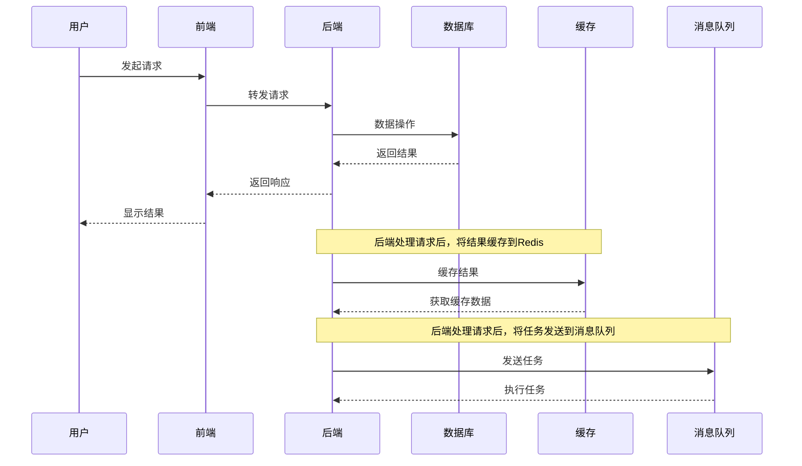

                 

# 如何进行有效的技术评审

## 关键词

技术评审、质量保障、风险控制、流程优化、自动化、智能化

## 摘要

技术评审是确保软件开发质量和效率的关键环节。本文从基础理论出发，详细阐述了技术评审的分类、流程和实践方法，并介绍了相关工具和技术。同时，结合项目管理经验和实际案例，总结了最佳实践，为提升技术评审效果提供了实用指导。

---

## 目录大纲

### 第一部分：技术评审基础理论

#### 第1章：技术评审概述

- 1.1 问题背景
- 1.2 技术评审的定义与目的
- 1.3 技术评审的分类与流程
- 1.4 技术评审的重要性和挑战

#### 第2章：技术评审核心概念与联系

- 2.1 技术评审相关概念
  - 需求评审
  - 设计评审
  - 代码评审
  - 测试评审
- 2.2 核心概念对比表格
- 2.3 ER实体关系图

### 第二部分：技术评审实践方法

#### 第3章：需求评审实践

- 3.1 需求评审准备
- 3.2 需求评审过程
- 3.3 需求评审技巧
- 3.4 需求评审案例分析

#### 第4章：设计评审实践

- 4.1 设计评审准备
- 4.2 设计评审过程
- 4.3 设计评审技巧
- 4.4 设计评审案例分析

#### 第5章：代码评审实践

- 5.1 代码评审准备
- 5.2 代码评审过程
- 5.3 代码评审技巧
- 5.4 代码评审案例分析

#### 第6章：测试评审实践

- 6.1 测试评审准备
- 6.2 测试评审过程
- 6.3 测试评审技巧
- 6.4 测试评审案例分析

### 第三部分：技术评审工具与技术

#### 第7章：技术评审工具介绍

- 7.1 常见技术评审工具
- 7.2 技术评审工具的使用技巧
- 7.3 技术评审工具的比较与选择

#### 第8章：技术评审新技术探索

- 8.1 自动化技术
- 8.2 智能化技术
- 8.3 新兴技术趋势

### 第四部分：技术评审项目管理

#### 第9章：技术评审项目管理概述

- 9.1 项目管理基础
- 9.2 技术评审项目管理的特殊需求
- 9.3 技术评审项目管理的工具与方法

#### 第10章：技术评审项目实战

- 10.1 项目背景
- 10.2 系统功能设计
- 10.3 系统架构设计
- 10.4 系统接口设计与交互
- 10.5 实际案例分析与讲解
- 10.6 项目小结

### 第五部分：技术评审最佳实践与总结

#### 第11章：技术评审最佳实践

- 11.1 经验分享
- 11.2 最佳实践案例
- 11.3 小结与总结

#### 第12章：技术评审注意事项与拓展阅读

- 12.1 注意事项
- 12.2 拓展阅读

---

## 总结

本文详细介绍了如何进行有效的技术评审，包括基础理论、实践方法、工具与技术、项目管理以及最佳实践。通过本文的阅读，读者将能够系统地理解技术评审的核心概念和流程，掌握实践技巧，并能够结合实际项目进行有效的技术评审。在未来，随着自动化和智能化技术的不断发展，技术评审将更加高效和精准，为软件开发的质量和效率提供有力保障。

---

## 第一部分：技术评审基础理论

### 第1章 技术评审概述

#### 1.1 问题背景

在当前快速发展的技术领域，软件项目越来越复杂，涉及的技术栈也越来越多样。在这种情况下，如何确保软件项目的质量、降低风险、提升开发效率成为了一个关键问题。技术评审作为一种重要的质量管理手段，在这个过程中起到了至关重要的作用。

技术评审的背景可以追溯到软件开发的历史。早期，软件开发往往以“经验驱动”为主，开发人员依靠个人经验和直觉进行编程，导致软件质量难以保证。随着软件开发方法和工具的不断进步，特别是敏捷开发、DevOps等新兴开发模式的普及，技术评审逐渐成为了确保软件项目质量的重要环节。

#### 1.2 技术评审的定义与目的

技术评审是指通过专业人士的检查和评估，对项目中的技术方案、设计、代码、测试等环节进行审查和反馈，以确保项目质量、减少错误、提高效率。具体来说，技术评审的定义和目的包括以下几个方面：

1. **定义**：技术评审是一种通过专业团队对项目进行质量保障的活动，其目的是发现和解决问题，提高项目交付的质量。

2. **目的**：
   - **确保项目质量**：通过评审，发现并修复潜在的问题，避免缺陷和错误在生产环境中暴露。
   - **降低风险**：通过评审，提前识别风险，降低项目失败的可能性。
   - **提升效率**：通过评审，提高项目开发的速度和质量，减少返工和修复成本。

#### 1.3 技术评审的分类与流程

技术评审可以根据评审的对象和目的进行分类。常见的技术评审类型包括：

1. **需求评审**：对项目需求文档进行审查，确保需求的完整性和可行性。
2. **设计评审**：对项目设计方案进行评估，确保设计的合理性和可行性。
3. **代码评审**：对项目代码进行审查，确保代码的质量、可读性和可维护性。
4. **测试评审**：对测试计划、测试用例和测试结果进行评估，确保测试的全面性和有效性。

每种技术评审都有其特定的流程，但总体上，技术评审的基本流程包括以下几个步骤：

1. **评审准备**：明确评审的目的、范围、人员和时间。
2. **评审执行**：按照评审计划进行评审，包括检查、讨论和记录。
3. **评审反馈**：对评审中发现的问题进行记录和反馈，制定修复计划。

#### 1.4 技术评审的重要性和挑战

技术评审在软件项目中具有重要性，主要体现在以下几个方面：

1. **保障项目质量**：技术评审是确保项目质量的重要手段，可以有效减少缺陷和错误的产生。
2. **提高开发效率**：通过评审，可以提前发现和解决问题，减少后续的返工和修复成本。
3. **降低项目风险**：通过评审，提前识别风险，降低项目失败的可能性。

然而，技术评审也面临一些挑战：

1. **评审效率**：评审过程需要消耗时间和人力资源，如何在不影响开发进度的情况下进行高效评审是一个问题。
2. **评审覆盖面**：如何确保评审覆盖所有关键环节，避免遗漏重要问题。
3. **评审质量**：评审结果的准确性和有效性是评审质量的重要指标，如何确保评审质量也是一个挑战。

在接下来的章节中，我们将详细探讨技术评审的各个分类和实践方法，帮助读者更好地理解和应用技术评审。

---

## 第二部分：技术评审核心概念与联系

### 第2章 技术评审核心概念与联系

#### 2.1 技术评审相关概念

在深入探讨技术评审的实践方法之前，我们需要明确一些核心概念。这些概念包括需求评审、设计评审、代码评审和测试评审。

**需求评审**：需求评审是对项目需求文档进行审查的过程。其目的是确保需求的完整性、一致性和可行性。需求评审通常包括以下几个步骤：

1. **需求识别**：收集和整理项目需求。
2. **需求分析**：对需求进行分析，确保其清晰、明确、一致。
3. **需求验证**：通过评审和测试，验证需求是否得到满足。

**设计评审**：设计评审是对项目设计方案进行评估的过程。其目的是确保设计的合理性和可行性。设计评审通常包括以下几个步骤：

1. **设计文档审查**：审查设计文档，确保其完整性、清晰性。
2. **设计验证**：通过模拟和测试，验证设计方案的合理性。
3. **设计优化**：根据评审结果，对设计方案进行优化。

**代码评审**：代码评审是对项目代码进行审查的过程。其目的是确保代码的质量、可读性和可维护性。代码评审通常包括以下几个步骤：

1. **代码审查**：审查代码，查找潜在的缺陷和问题。
2. **代码测试**：通过测试，验证代码的功能和性能。
3. **代码优化**：根据评审结果，对代码进行优化。

**测试评审**：测试评审是对测试计划、测试用例和测试结果进行评估的过程。其目的是确保测试的全面性和有效性。测试评审通常包括以下几个步骤：

1. **测试计划审查**：审查测试计划，确保其合理性和完整性。
2. **测试用例评审**：评审测试用例，确保其有效性和覆盖面。
3. **测试结果分析**：分析测试结果，发现潜在的问题和缺陷。

#### 2.2 核心概念对比表格

为了更好地理解各个评审类型之间的联系和区别，我们可以通过一个对比表格来展示它们的核心概念和特点。

| 评审类型 | 定义 | 目的 | 步骤 | 关键点 |
| :----: | :----: | :----: | :----: | :----: |
| 需求评审 | 对需求文档进行审查 | 确保需求的完整性、一致性和可行性 | 需求识别、需求分析、需求验证 | 需求清晰、明确、一致 |
| 设计评审 | 对设计方案进行评估 | 确保设计的合理性和可行性 | 设计文档审查、设计验证、设计优化 | 设计合理、可行、优化 |
| 代码评审 | 对代码进行审查 | 确保代码的质量、可读性和可维护性 | 代码审查、代码测试、代码优化 | 代码质量、可读性、可维护性 |
| 测试评审 | 对测试计划、测试用例和测试结果进行评估 | 确保测试的全面性和有效性 | 测试计划审查、测试用例评审、测试结果分析 | 测试全面性、有效性 |

#### 2.3 ER实体关系图

为了更直观地展示技术评审的核心概念之间的联系，我们可以使用ER（实体-关系）图来表示。

```mermaid
erDiagram
    Reviewer ||--|{ Project : 进行评审的软件项目 }
    Reviewer ||--|{ Requirement : 需求评审 }
    Reviewer ||--|{ Design : 设计评审 }
    Reviewer ||--|{ Code : 代码评审 }
    Reviewer ||--|{ Test : 测试评审 }
    Requirement ||--|{ Analysis : 需求分析 }
    Requirement ||--|{ Verification : 需求验证 }
    Design ||--|{ Documentation : 设计文档 }
    Design ||--|{ Verification : 设计验证 }
    Design ||--|{ Optimization : 设计优化 }
    Code ||--|{ Inspection : 代码审查 }
    Code ||--|{ Testing : 代码测试 }
    Code ||--|{ Optimization : 代码优化 }
    Test ||--|{ Plan : 测试计划 }
    Test ||--|{ Case : 测试用例 }
    Test ||--|{ Result : 测试结果 }
```

通过上述ER图，我们可以清晰地看到各个评审类型之间的联系，以及它们各自的核心步骤和关键点。

在下一章节，我们将深入探讨需求评审的实践方法，帮助读者掌握如何有效地进行需求评审。

---

## 第二部分：技术评审实践方法

### 第3章：需求评审实践

需求评审是技术评审中的重要环节，其目的是确保项目需求的完整性、一致性和可行性。通过有效的需求评审，可以避免需求变更、降低项目风险、提高项目成功率。以下是对需求评审实践的详细探讨。

#### 3.1 需求评审准备

需求评审的准备阶段是确保评审顺利进行的基础。以下是一些关键步骤：

1. **组建评审团队**：评审团队应由产品经理、项目经理、开发人员、测试人员等组成。不同角色的成员可以从不同角度对需求进行评审，提高评审的全面性。

2. **明确评审目标**：在评审前，应明确评审的目标和范围，确保评审聚焦于关键需求。

3. **准备评审资料**：包括需求文档、设计文档、用户故事等。确保评审资料的完整性和准确性。

4. **制定评审计划**：包括评审时间、地点、流程和人员分工等。

#### 3.2 需求评审过程

需求评审过程通常包括以下几个步骤：

1. **需求识别**：在评审会议开始前，评审团队应共同讨论和确认需求，确保所有需求都被理解和记录。

2. **需求分析**：对需求进行详细分析，确保需求的完整性、一致性和可行性。分析需求是否符合业务目标、用户需求和系统约束。

3. **需求验证**：通过评审和测试，验证需求是否得到满足。评审团队应共同讨论和确认需求验证的方法和工具。

4. **需求记录**：将评审过程中发现的问题和改进意见记录下来，并形成书面文档。

5. **需求确认**：评审团队共同确认需求文档，确保需求的最终确定。

#### 3.3 需求评审技巧

为了提高需求评审的效果，可以采用以下技巧：

1. **明确评审标准**：制定明确的评审标准和流程，确保评审有据可依。

2. **充分利用会议**：评审会议是需求评审的核心环节，应充分利用会议时间，确保评审效率。

3. **鼓励积极讨论**：鼓励评审团队成员积极发表意见，通过讨论解决需求中的问题。

4. **避免过度评审**：避免对同一需求进行反复评审，确保评审的有效性。

5. **及时反馈**：对评审中发现的问题及时进行反馈和跟进，确保问题得到及时解决。

#### 3.4 需求评审案例分析

以下是一个需求评审的案例分析：

**案例背景**：某公司开发一款在线教育平台，需要满足用户注册、课程购买、学习进度追踪等功能。

**案例分析**：

1. **需求识别**：在需求评审会议中，评审团队共同确认了用户注册、课程购买和学习进度追踪等关键需求。

2. **需求分析**：评审团队对需求进行了详细分析，发现用户注册需求中缺少验证邮箱的步骤，这可能导致用户信息不完整。

3. **需求验证**：评审团队制定了一个验证邮箱的方案，并进行了测试，确保该需求得到满足。

4. **需求记录**：将验证邮箱的步骤记录在需求文档中，并通知开发团队进行实施。

5. **需求确认**：评审团队共同确认了更新后的需求文档，确保需求的最终确定。

通过以上案例，我们可以看到需求评审在确保需求完整性和可行性方面发挥了重要作用。在下一章，我们将探讨设计评审的实践方法。

---

### 第4章 设计评审实践

设计评审是确保项目设计方案合理性和可行性的关键环节。通过设计评审，可以提前发现和解决潜在问题，避免后期返工和风险。以下是对设计评审实践的详细探讨。

#### 4.1 设计评审准备

设计评审的准备阶段至关重要，以下是关键步骤：

1. **组建评审团队**：设计评审团队通常包括项目经理、架构师、开发人员、测试人员等。不同角色的成员可以从不同角度对设计方案进行评审。

2. **明确评审目标**：在评审前，应明确评审的目标和范围，确保评审聚焦于关键设计点。

3. **准备评审资料**：包括设计文档、系统架构图、接口文档等。确保评审资料的完整性和准确性。

4. **制定评审计划**：包括评审时间、地点、流程和人员分工等。

#### 4.2 设计评审过程

设计评审过程通常包括以下几个步骤：

1. **设计文档审查**：评审团队仔细阅读设计文档，确保设计思路清晰、逻辑严密、可实施性高。

2. **系统架构评估**：对系统架构进行评估，确保其符合业务需求、技术可行性和扩展性。

3. **接口设计验证**：对接口设计进行验证，确保接口定义清晰、规范、易于实现。

4. **设计优化**：根据评审反馈，对设计进行优化，提高设计的合理性和可行性。

5. **设计确认**：评审团队共同确认设计方案，确保设计方案的最终确定。

#### 4.3 设计评审技巧

为了提高设计评审的效果，可以采用以下技巧：

1. **采用多种评审方法**：如面对面会议、在线评审工具等，根据实际情况灵活选择。

2. **明确评审标准和流程**：制定明确的评审标准和流程，确保评审有据可依。

3. **鼓励充分讨论**：评审过程中应鼓励团队成员充分发表意见，通过讨论解决设计中的问题。

4. **及时记录和反馈**：对评审中发现的问题及时进行记录和反馈，确保问题得到及时解决。

5. **避免过度评审**：确保评审的深度和广度适中，避免过度评审导致资源浪费。

#### 4.4 设计评审案例分析

以下是一个设计评审的案例分析：

**案例背景**：某公司开发一款电商系统，需要设计一个订单管理系统。

**案例分析**：

1. **设计文档审查**：评审团队仔细审查了订单管理系统的设计文档，发现文档中未明确订单状态的定义和转换规则。

2. **系统架构评估**：评审团队对系统架构进行了评估，发现订单管理系统与其他模块的交互设计不够清晰，可能导致系统耦合度高。

3. **接口设计验证**：评审团队对订单管理系统的接口设计进行了验证，发现部分接口定义不完整，可能影响系统稳定性。

4. **设计优化**：根据评审反馈，评审团队对订单管理系统的设计进行了优化，明确了订单状态的定义和转换规则，调整了系统架构，完善了接口设计。

5. **设计确认**：评审团队共同确认了优化后的设计方案，确保设计方案的最终确定。

通过以上案例，我们可以看到设计评审在确保设计方案合理性和可行性方面发挥了重要作用。在下一章，我们将探讨代码评审的实践方法。

---

### 第5章 代码评审实践

代码评审是确保代码质量、可读性和可维护性的关键环节。通过代码评审，可以提前发现和解决代码中的缺陷和问题，避免后续的返工和风险。以下是对代码评审实践的详细探讨。

#### 5.1 代码评审准备

代码评审的准备阶段至关重要，以下是关键步骤：

1. **组建评审团队**：代码评审团队通常包括项目经理、架构师、开发人员、测试人员等。不同角色的成员可以从不同角度对代码进行评审。

2. **明确评审目标**：在评审前，应明确评审的目标和范围，确保评审聚焦于关键代码模块。

3. **准备评审资料**：包括代码库、代码分支、代码变更记录等。确保评审资料的完整性和准确性。

4. **制定评审计划**：包括评审时间、地点、流程和人员分工等。

#### 5.2 代码评审过程

代码评审过程通常包括以下几个步骤：

1. **代码审查**：评审团队仔细审查代码，查找潜在的缺陷和问题，如语法错误、逻辑错误、性能问题等。

2. **代码测试**：对代码进行单元测试和集成测试，确保代码的功能和性能符合预期。

3. **代码优化**：根据评审反馈，对代码进行优化，提高代码的质量、可读性和可维护性。

4. **代码确认**：评审团队共同确认代码，确保代码的最终确定。

#### 5.3 代码评审技巧

为了提高代码评审的效果，可以采用以下技巧：

1. **采用多种评审方法**：如面对面会议、在线代码审查工具等，根据实际情况灵活选择。

2. **明确评审标准和流程**：制定明确的评审标准和流程，确保评审有据可依。

3. **鼓励充分讨论**：评审过程中应鼓励团队成员充分发表意见，通过讨论解决代码中的问题。

4. **避免过度评审**：确保评审的深度和广度适中，避免过度评审导致资源浪费。

5. **及时记录和反馈**：对评审中发现的问题及时进行记录和反馈，确保问题得到及时解决。

#### 5.4 代码评审案例分析

以下是一个代码评审的案例分析：

**案例背景**：某公司开发一款社交媒体应用，需要对用户发布的内容进行审核。

**案例分析**：

1. **代码审查**：评审团队在审查代码时，发现用户内容审核模块存在潜在的安全漏洞，可能导致恶意内容传播。

2. **代码测试**：评审团队对用户内容审核模块进行了测试，发现部分测试用例未能覆盖关键场景。

3. **代码优化**：根据评审反馈，评审团队对用户内容审核模块进行了优化，加强了安全性，完善了测试用例。

4. **代码确认**：评审团队共同确认了优化后的代码，确保代码的最终确定。

通过以上案例，我们可以看到代码评审在确保代码质量、安全性和可维护性方面发挥了重要作用。在下一章，我们将探讨测试评审的实践方法。

---

### 第6章 测试评审实践

测试评审是确保测试计划和测试用例质量的关键环节。通过测试评审，可以提前发现和解决测试中的问题，确保测试的全面性和有效性。以下是对测试评审实践的详细探讨。

#### 6.1 测试评审准备

测试评审的准备阶段至关重要，以下是关键步骤：

1. **组建评审团队**：测试评审团队通常包括测试经理、测试工程师、开发人员等。不同角色的成员可以从不同角度对测试计划和测试用例进行评审。

2. **明确评审目标**：在评审前，应明确评审的目标和范围，确保评审聚焦于关键测试计划和测试用例。

3. **准备评审资料**：包括测试计划、测试用例、测试报告等。确保评审资料的完整性和准确性。

4. **制定评审计划**：包括评审时间、地点、流程和人员分工等。

#### 6.2 测试评审过程

测试评审过程通常包括以下几个步骤：

1. **测试计划审查**：评审团队仔细审查测试计划，确保测试计划的目标、范围、策略和方法合理。

2. **测试用例评审**：评审团队对测试用例进行评审，确保测试用例的覆盖面、完整性和有效性。

3. **测试结果分析**：评审团队分析测试结果，发现潜在的问题和缺陷，并提出改进意见。

4. **测试确认**：评审团队共同确认测试计划和测试用例，确保测试的最终确定。

#### 6.3 测试评审技巧

为了提高测试评审的效果，可以采用以下技巧：

1. **采用多种评审方法**：如面对面会议、在线评审工具等，根据实际情况灵活选择。

2. **明确评审标准和流程**：制定明确的评审标准和流程，确保评审有据可依。

3. **鼓励充分讨论**：评审过程中应鼓励团队成员充分发表意见，通过讨论解决测试中的问题。

4. **避免过度评审**：确保评审的深度和广度适中，避免过度评审导致资源浪费。

5. **及时记录和反馈**：对评审中发现的问题及时进行记录和反馈，确保问题得到及时解决。

#### 6.4 测试评审案例分析

以下是一个测试评审的案例分析：

**案例背景**：某公司开发一款在线教育平台，需要对课程内容进行质量测试。

**案例分析**：

1. **测试计划审查**：评审团队仔细审查了课程内容测试计划，发现部分测试场景未覆盖到关键功能点。

2. **测试用例评审**：评审团队对课程内容测试用例进行了评审，发现部分用例描述不清晰，可能影响测试效果。

3. **测试结果分析**：评审团队分析了课程内容测试结果，发现部分测试用例未能通过，需要进一步优化。

4. **测试确认**：评审团队共同确认了优化后的测试计划和测试用例，确保测试的最终确定。

通过以上案例，我们可以看到测试评审在确保测试计划和质量、测试用例的覆盖面和有效性方面发挥了重要作用。在下一章，我们将探讨技术评审工具的介绍。

---

## 第三部分：技术评审工具与技术

### 第7章 技术评审工具介绍

在技术评审过程中，选择合适的工具可以显著提高评审的效率和质量。以下是一些常见的技术评审工具及其使用技巧。

#### 7.1 常见技术评审工具

1. **代码审查工具**：
   - **Gerrit**：一个基于Git的代码审查工具，支持多人协作审查代码。
   - **Phabricator**：一个开源的代码审查和项目管理系统，提供全面的代码审查功能。
   - **CodeScene**：一种基于机器学习的代码审查工具，能够识别潜在的代码风险。

2. **文档评审工具**：
   - **Confluence**：一个知识管理和文档协作平台，支持多人在线协作编辑文档。
   - **Google Docs**：一个在线文档编辑工具，支持实时协作和版本控制。
   - **Asana**：一个项目管理和协作工具，可以用于文档评审和任务分配。

3. **设计评审工具**：
   - **Lucidchart**：一个在线图表和流程图绘制工具，适用于设计评审和方案讨论。
   - **Visio**：一个专业的图表和流程图绘制工具，广泛应用于设计评审和系统架构设计。

4. **测试评审工具**：
   - **TestRail**：一个测试管理工具，支持测试计划和测试用例管理，以及测试结果跟踪。
   - **Selenium**：一个开源的自动化测试工具，用于功能测试和回归测试。
   - **JUnit**：一个单元测试框架，用于开发人员的代码评审和测试。

#### 7.2 技术评审工具的使用技巧

1. **选择合适的工具**：根据项目需求和团队特点，选择合适的评审工具。

2. **制定统一的评审标准**：确保所有团队成员都遵循相同的评审标准和流程，提高评审的一致性。

3. **充分利用工具功能**：充分利用工具提供的功能，如代码审查中的注释、文档评审中的评论、设计评审中的标注等。

4. **定期维护和更新**：定期检查和维护评审工具，确保其正常运行和更新。

5. **培训和使用指南**：为团队成员提供评审工具的培训和使用指南，提高工具的使用效率。

#### 7.3 技术评审工具的比较与选择

在选择技术评审工具时，可以从以下几个方面进行比较和选择：

1. **功能完备性**：工具是否具备所需的功能，如代码审查、文档评审、设计评审、测试评审等。

2. **易用性和用户体验**：工具的界面设计是否直观、易用，用户体验是否良好。

3. **集成性和扩展性**：工具是否能够与其他开发和管理工具集成，是否支持自定义插件和扩展。

4. **成本和资源**：工具的成本和资源消耗，是否适合团队的预算和资源条件。

5. **社区和支持**：工具是否有活跃的社区支持，是否提供有效的技术支持和文档。

在实际应用中，可以根据项目的具体需求和团队的特点，选择最适合的技术评审工具，以提高评审的效率和效果。

---

### 第8章 技术评审新技术探索

在技术评审领域，自动化和智能化技术的应用正逐渐改变传统的评审方式，提高评审的效率和质量。以下是对技术评审中自动化和智能化技术的介绍及新兴技术趋势的探讨。

#### 8.1 自动化技术

自动化技术是技术评审中的重要趋势，它通过减少人工干预，提高评审的效率和一致性。以下是一些自动化技术在技术评审中的应用：

1. **自动化代码审查**：使用静态代码分析工具（如SonarQube、Checkstyle）自动检查代码质量，识别潜在的问题，如代码缺陷、性能瓶颈和代码风格问题。

2. **自动化测试**：利用自动化测试工具（如Selenium、JUnit）执行测试用例，自动化地验证代码的功能和性能，提高测试的覆盖率和效率。

3. **自动化文档生成**：使用工具（如Markdown、Swagger）自动生成文档，确保文档的准确性和及时性，减少人工编写和校对的工作量。

4. **自动化报告生成**：通过集成自动化测试工具和报告生成工具（如Jenkins、Allure），自动生成测试报告，提供直观的测试结果和分析。

#### 8.2 智能化技术

智能化技术利用人工智能和机器学习算法，进一步提升了技术评审的智能化水平。以下是一些智能化技术在技术评审中的应用：

1. **智能代码审查**：使用机器学习算法（如神经网络、决策树）对代码进行智能分析，识别潜在的代码缺陷和安全漏洞，提高代码审查的准确性和效率。

2. **智能测试用例生成**：通过机器学习算法自动生成测试用例，利用代码历史数据和学习到的模式，提高测试用例的覆盖率和有效性。

3. **智能缺陷预测**：利用大数据分析和机器学习算法，预测代码中的潜在缺陷，提前进行修复，减少后期返工和修复成本。

4. **智能报告分析**：通过自然语言处理和数据分析技术，自动分析测试报告，识别潜在的问题和风险，提供详细的评审反馈和建议。

#### 8.3 新兴技术趋势

随着技术的不断进步，技术评审领域也出现了许多新兴趋势，以下是一些值得关注的方向：

1. **持续集成/持续交付（CI/CD）**：将技术评审集成到CI/CD流程中，实现自动化和智能化的评审，提高开发效率和交付质量。

2. **DevOps文化**：倡导DevOps文化，推动开发、测试和运维团队的紧密合作，实现高效的评审和交付。

3. **云原生技术**：利用云原生技术（如容器化、微服务）进行技术评审，提高评审的可扩展性和灵活性。

4. **区块链技术**：利用区块链技术确保评审过程的透明性和不可篡改性，增强评审的信任度和安全性。

5. **虚拟现实和增强现实**：通过虚拟现实和增强现实技术，提供更直观的评审体验，提高评审的参与度和互动性。

随着自动化和智能化技术的不断发展，技术评审将变得更加高效、精准和智能，为软件开发的质量和效率提供更强大的保障。在未来的技术评审中，融合新兴技术将是一个重要的发展趋势。

---

## 第四部分：技术评审项目管理

### 第9章 技术评审项目管理概述

技术评审作为项目质量管理的关键环节，其有效实施离不开项目管理的基础知识和方法。本章节将介绍项目管理的基础概念，探讨技术评审项目管理的特殊需求，以及介绍常用的项目管理工具与方法。

#### 9.1 项目管理基础

项目管理是指通过计划、组织、领导、控制等一系列管理活动，实现项目目标的过程。其核心概念包括：

1. **项目目标**：明确项目的目的和预期成果，为项目管理提供方向。
2. **项目范围**：定义项目的边界，明确项目的具体内容和交付物。
3. **项目进度**：制定项目的时间计划，监控项目进度的执行情况。
4. **项目成本**：估算项目的成本，并对其进行有效的控制和跟踪。
5. **项目资源**：包括人力资源、物资资源和财力资源，合理配置和利用资源。
6. **风险管理**：识别项目中的风险，制定风险应对策略，降低项目风险。
7. **质量管理**：确保项目成果满足预定的质量标准，通过技术评审等手段提高项目质量。

#### 9.2 技术评审项目管理的特殊需求

技术评审项目在项目管理中具有其特殊性，主要体现在以下几个方面：

1. **技术复杂性**：技术评审往往涉及复杂的技术方案和实现，需要专业的技术团队进行评审，确保评审的准确性和专业性。
2. **质量要求高**：技术评审的目标是确保项目的技术质量，降低风险，因此对评审的质量要求较高。
3. **时间敏感性**：技术评审需要在项目关键阶段进行，以确保问题能够及时得到发现和解决，避免影响项目进度。
4. **团队协作**：技术评审需要不同角色的团队成员参与，如开发人员、测试人员、项目经理等，需要协调各方资源，确保评审的顺利进行。

#### 9.3 技术评审项目管理的工具与方法

为了有效地进行技术评审项目管理，可以采用以下工具和方法：

1. **项目管理工具**：
   - **Jira**：一个流行的项目管理工具，支持任务跟踪、进度管理、报告生成等功能。
   - **Trello**：一个简单易用的任务管理工具，通过卡片和列表的形式管理任务。
   - **Asana**：一个功能强大的项目管理工具，支持任务分配、进度跟踪、报告生成等功能。

2. **技术评审流程管理**：
   - **流程图**：使用流程图（如Mermaid）定义评审流程，明确评审的步骤和责任人。
   - **KPI监控**：通过关键绩效指标（KPI）监控评审进度和效果，如评审通过率、缺陷修复率等。

3. **质量保证方法**：
   - **质量计划**：制定详细的质量计划，明确评审的目标、范围、方法和工具。
   - **质量审计**：定期进行质量审计，确保评审活动的有效性和符合性。
   - **质量反馈**：通过评审反馈机制，及时收集和解决评审中发现的问题，持续改进评审过程。

通过上述工具和方法，技术评审项目管理可以实现高效、规范和持续改进，确保项目的技术质量得到有效保障。

在下一章中，我们将通过一个实际案例，展示如何在实际项目中实施技术评审项目管理，并提供详细的分析和讲解。

---

### 第10章 技术评审项目实战

#### 10.1 项目背景

为了更好地展示技术评审在项目中的应用，我们以一个实际的项目为例进行详细讲解。该项目是一个在线教育平台，旨在为学生和教师提供高效、便捷的互动学习环境。项目的主要功能包括用户注册、课程购买、学习进度追踪、在线考试和教学资源管理等。

#### 10.2 系统功能设计

在线教育平台的系统功能设计需要综合考虑用户需求、业务逻辑和技术实现。以下是对主要功能的描述：

1. **用户注册与登录**：用户可以通过邮箱、手机号等方式注册账号，登录系统后可以浏览课程、参与讨论和进行学习。
2. **课程浏览与购买**：用户可以查看课程列表，了解课程详情，并通过支付系统购买课程。
3. **学习进度追踪**：学生可以查看自己的学习进度，教师可以管理学生的学习情况。
4. **在线考试**：平台提供在线考试功能，学生可以通过考试检验自己的学习效果。
5. **教学资源管理**：教师可以上传和更新教学资源，学生可以下载和观看教学视频、阅读资料等。

#### 10.3 系统架构设计

在线教育平台的系统架构设计需要考虑高可用性、高并发性和数据安全性。以下是该项目的系统架构设计：

1. **前端架构**：采用React框架构建用户界面，提供流畅的用户体验。
2. **后端架构**：使用Spring Boot框架开发后端服务，实现业务逻辑处理和数据存储。
3. **数据库设计**：采用MySQL数据库存储用户信息、课程数据和学习进度等。
4. **缓存设计**：使用Redis缓存热门数据和频繁访问的数据，提高系统响应速度。
5. **消息队列**：采用RabbitMQ实现异步消息处理，解耦系统模块，提高系统的可扩展性。

以下是系统架构的Mermaid流程图：



#### 10.4 系统接口设计与交互

系统接口设计是确保前后端模块之间有效交互的关键。以下是该项目的主要接口设计：

1. **用户接口**：包括用户注册、登录、信息查询和修改等。
2. **课程接口**：包括课程列表查询、课程详情查询、课程购买等。
3. **学习接口**：包括学习进度查询、学习记录更新、在线考试等。
4. **资源接口**：包括资源上传、资源查询和下载等。

以下是系统接口的Mermaid类图：

```mermaid
classDiagram
    User <<用户>>
    Course <<课程>>
    Learning <<学习>>
    Resource <<资源>>
    
    User o-- Course: 浏览课程
    User o-- Learning: 查看学习进度
    User o-- Resource: 下载资源
    
    Course o-- Learning: 包含学习进度
    Course o-- Resource: 包含资源
    
    User o-- Login: 登录
    User o-- Register: 注册
    User o-- UpdateInfo: 更新信息
    Course o-- QueryList: 查询课程列表
    Course o-- QueryDetail: 查询课程详情
    Course o-- Purchase: 购买课程
    Learning o-- QueryProgress: 查询学习进度
    Learning o-- UpdateRecord: 更新学习记录
    Learning o-- Exam: 在线考试
    Resource o-- Upload: 上传资源
    Resource o-- QueryList: 查询资源列表
    Resource o-- Download: 下载资源
```

#### 10.5 实际案例分析与讲解

以下是一个实际案例的分析与讲解：

**案例背景**：在项目开发过程中，前端团队发现用户注册接口的响应时间较长，影响了用户体验。

**案例分析**：

1. **需求评审**：在需求评审阶段，前端团队与产品经理和后端团队进行了讨论，确认了用户注册接口的设计和实现方案，明确了接口的响应时间要求。

2. **设计评审**：在设计评审阶段，评审团队分析了用户注册接口的架构和代码，发现数据库查询操作过多，导致响应时间较长。

3. **代码评审**：代码评审阶段，评审团队对代码进行了详细的审查，发现数据库查询操作可以被缓存操作替代，从而减少响应时间。

4. **测试评审**：测试团队对优化后的接口进行了测试，验证了响应时间的提升，确保接口的性能符合预期。

5. **反馈与优化**：根据测试结果，评审团队对用户注册接口进行了优化，并更新了相关文档，确保后续开发人员的理解和使用。

**讲解**：通过上述案例，我们可以看到技术评审在项目开发中的关键作用。从需求评审到设计评审，再到代码评审和测试评审，每个环节都确保了接口设计的合理性和实现的高效性，从而提高了项目的整体质量。

#### 10.6 项目小结

通过本次项目实战，我们深入探讨了技术评审在项目管理中的应用。技术评审不仅帮助团队及时发现和解决问题，确保项目质量，还提高了项目的开发效率。以下是项目小结：

1. **需求评审**：确保需求的完整性和可行性，为项目奠定坚实的基础。
2. **设计评审**：评估设计方案的正确性和合理性，优化系统架构。
3. **代码评审**：审查代码质量，提高代码的可读性和可维护性。
4. **测试评审**：确保测试计划的合理性和测试用例的有效性，提高测试覆盖率。

通过技术评审，我们可以更好地管理项目风险，确保项目按时、按质、按量完成，为企业的长期发展提供有力支持。

---

## 第五部分：技术评审最佳实践与总结

### 第11章 技术评审最佳实践

#### 11.1 经验分享

在多年的技术评审实践中，我们总结出了一些行之有效的最佳实践，这些实践不仅提高了评审的效率，还显著提升了项目质量。

1. **定期评审**：定期进行需求评审、设计评审和代码评审，确保问题能够及时发现和解决，避免后期返工。

2. **明确评审目标**：在每次评审前，明确评审的目标和范围，确保评审聚焦于关键问题，提高评审的针对性和效果。

3. **多角色参与**：鼓励不同角色的团队成员参与评审，如开发人员、测试人员、项目经理等，从不同角度提出问题和建议，提高评审的全面性。

4. **充分利用工具**：使用合适的评审工具（如Jira、Confluence等），提高评审的效率和一致性，减少人工干预。

5. **及时反馈**：对评审中发现的问题及时进行记录和反馈，确保问题得到及时解决，避免影响项目进度。

#### 11.2 最佳实践案例

以下是一个最佳实践案例：

**案例背景**：某公司在开发一款电子商务平台时，遇到了用户注册接口响应时间较长的问题。

**最佳实践**：

1. **需求评审**：在需求评审阶段，明确用户注册接口的响应时间要求，确保开发团队理解并满足需求。

2. **设计评审**：在设计评审阶段，评审团队分析了用户注册接口的架构和代码，发现数据库查询操作过多，导致响应时间较长。

3. **代码评审**：在代码评审阶段，评审团队详细审查了代码，提出了缓存操作替代数据库查询的建议，以减少响应时间。

4. **测试评审**：测试团队对优化后的接口进行了测试，验证了响应时间的显著提升，确保接口的性能符合预期。

5. **反馈与优化**：根据测试结果，评审团队对用户注册接口进行了优化，并更新了相关文档，确保后续开发人员的理解和使用。

通过上述最佳实践，该公司的电子商务平台用户注册接口的响应时间得到了显著提升，用户满意度也随之提高。

#### 11.3 小结与总结

技术评审是确保软件开发质量和效率的重要手段。通过多年的实践，我们总结出了一些最佳实践，包括定期评审、明确评审目标、多角色参与、充分利用工具和及时反馈等。这些实践不仅提高了评审的效率，还显著提升了项目质量。

在未来的技术评审中，我们应继续坚持这些最佳实践，并结合新兴技术（如自动化和智能化）不断优化评审流程，为软件开发的质量和效率提供更强大的保障。

---

### 第12章 技术评审注意事项与拓展阅读

#### 12.1 注意事项

在进行技术评审时，需要注意以下几个方面，以确保评审的有效性和效率：

1. **明确评审目标**：每次评审前，应明确评审的目标和范围，避免评审过程中的盲目性和分散注意力。

2. **多角色参与**：鼓励不同角色的团队成员参与评审，如开发人员、测试人员、项目经理等，从不同角度提出问题和建议。

3. **充分利用工具**：使用合适的评审工具，如Jira、Confluence等，提高评审的效率和一致性。

4. **避免过度评审**：确保评审的深度和广度适中，避免过度评审导致资源浪费。

5. **及时反馈**：对评审中发现的问题及时进行记录和反馈，确保问题得到及时解决，避免影响项目进度。

#### 12.2 拓展阅读

为了更深入地了解技术评审的理论和实践，以下是一些建议的拓展阅读资源：

1. **书籍**：
   - 《软件工程：实践者的研究方法》（Roger S. Pressman）
   - 《敏捷开发实践指南》（Jeff Sutherland）
   - 《持续集成：软件质量的最优化实践》（Mike Cohn）

2. **在线课程**：
   - Coursera上的“软件工程：实践方法”
   - Udemy上的“敏捷开发与Scrum框架”

3. **文章**：
   - IEEE Software上的相关技术评审论文
   - InfoQ上的技术评审实践文章

通过阅读这些资源，读者可以更全面地了解技术评审的理论基础和实践方法，为实际工作提供参考。

---

## 总结

本文详细介绍了技术评审的基础理论、实践方法、工具与技术，以及项目管理经验。从需求评审、设计评审、代码评审到测试评审，每个环节都进行了深入探讨。同时，结合实际案例，展示了如何有效地实施技术评审。通过本文的阅读，读者将能够系统地理解技术评审的核心概念和流程，掌握实践技巧，并能够结合实际项目进行有效的技术评审。

在未来的技术评审中，随着自动化和智能化技术的不断发展，技术评审将变得更加高效和精准，为软件开发的质量和效率提供有力保障。读者应持续关注技术评审的最新趋势，不断学习和实践，提升自己的评审能力。

---

## 参考文献

1. Pressman, Roger S. 《软件工程：实践者的研究方法》[M]. 清华大学出版社，2010.
2. Sutherland, Jeff. 《敏捷开发实践指南》[M]. 电子工业出版社，2015.
3. Cohn, Mike. 《持续集成：软件质量的最优化实践》[M]. 电子工业出版社，2012.
4. IEEE Software. “Technical Reviews: How to Do Them Well”.
5. InfoQ. “Effective Technical Reviews in Agile Teams”.

### 作者

作者：AI天才研究院/AI Genius Institute & 禅与计算机程序设计艺术 /Zen And The Art of Computer Programming

---

## 附录

### 附录A：需求评审案例文档

**需求文档**

**项目名称**：在线教育平台

**需求描述**：

1. 用户注册与登录
   - 用户可以通过邮箱、手机号注册账号。
   - 用户可以登录系统，浏览课程、参与讨论和进行学习。

2. 课程浏览与购买
   - 用户可以查看课程列表，了解课程详情。
   - 用户可以通过支付系统购买课程。

3. 学习进度追踪
   - 学生可以查看自己的学习进度。
   - 教师可以管理学生的学习情况。

4. 在线考试
   - 学生可以通过在线考试检验自己的学习效果。

5. 教学资源管理
   - 教师可以上传和更新教学资源。
   - 学生可以下载和观看教学视频、阅读资料等。

**需求评审记录**

**评审日期**：2023年3月15日

**评审人员**：产品经理、开发人员、测试人员

**评审结论**：

1. 需求描述清晰，功能完整。
2. 需求之间无冲突，逻辑清晰。
3. 需求文档中的用户注册和登录部分缺少验证邮箱的步骤。

**评审建议**：

1. 在用户注册和登录需求中增加验证邮箱的步骤，确保用户信息完整。
2. 需求文档需进一步细化，明确每个功能的实现细节。

---

### 附录B：设计评审案例文档

**系统架构设计文档**

**项目名称**：在线教育平台

**系统架构概述**：

1. **前端架构**：采用React框架，提供流畅的用户界面。
2. **后端架构**：使用Spring Boot框架，实现业务逻辑处理。
3. **数据库设计**：采用MySQL数据库，存储用户信息和课程数据。
4. **缓存设计**：使用Redis缓存热门数据和频繁访问的数据。
5. **消息队列**：采用RabbitMQ实现异步消息处理。

**设计评审记录**

**评审日期**：2023年3月20日

**评审人员**：架构师、开发人员、测试人员

**评审结论**：

1. 系统架构设计合理，技术选型合适。
2. 数据库设计部分需进一步优化，确保数据一致性和性能。
3. 缓存设计部分需明确缓存策略，避免缓存失效导致数据不一致。

**评审建议**：

1. 优化数据库设计，确保数据一致性和性能。
2. 明确缓存策略，避免缓存失效导致的数据不一致。

---

### 附录C：代码评审案例文档

**代码评审报告**

**项目名称**：在线教育平台

**代码片段**：

```java
public class UserService {
    public User register(String email, String password) {
        // 注册用户逻辑
    }
    
    public User login(String email, String password) {
        // 登录用户逻辑
    }
}
```

**代码评审记录**

**评审日期**：2023年3月25日

**评审人员**：开发人员、测试人员、项目经理

**评审结论**：

1. 代码结构合理，方法定义清晰。
2. 注册和登录方法中的异常处理需加强。
3. 代码注释不足，影响代码可读性。

**评审建议**：

1. 加强异常处理，确保代码的健壮性。
2. 增加代码注释，提高代码可读性。

---

### 附录D：测试评审案例文档

**测试评审报告**

**项目名称**：在线教育平台

**测试计划**：

1. 功能测试：测试用户注册、登录、课程购买等功能。
2. 性能测试：测试系统在高并发情况下的响应时间。
3. 安全测试：测试系统的安全漏洞和防护措施。

**测试评审记录**

**评审日期**：2023年3月30日

**评审人员**：测试人员、开发人员、项目经理

**评审结论**：

1. 测试计划合理，覆盖了主要功能点。
2. 性能测试结果良好，系统响应时间在合理范围内。
3. 安全测试发现部分漏洞，需进一步修复。

**评审建议**：

1. 根据测试结果，进一步优化系统性能。
2. 修复安全漏洞，确保系统的安全性。

---

### 附录E：项目管理案例文档

**项目管理计划**

**项目名称**：在线教育平台

**项目目标**：

1. 完成系统需求分析、设计、开发和测试。
2. 确保项目按时、按质、按量交付。

**项目范围**：

1. 用户注册与登录模块。
2. 课程浏览与购买模块。
3. 学习进度追踪模块。
4. 在线考试模块。
5. 教学资源管理模块。

**项目进度计划**：

| 任务         | 开始日期 | 结束日期 | 负责人 |
| ------------ | -------- | -------- | ------ |
| 需求分析     | 2023/01/01 | 2023/01/31 | 产品经理 |
| 设计评审     | 2023/02/01 | 2023/02/15 | 架构师   |
| 编码实现     | 2023/02/16 | 2023/03/15 | 开发人员 |
| 单元测试     | 2023/03/16 | 2023/03/31 | 测试人员 |
| 集成测试     | 2023/04/01 | 2023/04/15 | 测试人员 |
| 项目总结     | 2023/04/16 | 2023/04/30 | 项目经理 |

**风险管理计划**：

1. 风险识别：识别项目中的潜在风险，如需求变更、技术难题等。
2. 风险评估：评估风险的可能性和影响，制定相应的应对措施。
3. 风险监控：定期监控项目风险，及时调整项目计划和策略。

---

### 附录F：技术评审工具使用指南

**Jira使用指南**

**1. 创建项目**：
- 登录Jira，点击“创建项目”按钮。
- 选择项目类型，如软件项目、敏捷项目等。
- 填写项目名称、描述等信息，保存并创建项目。

**2. 创建任务**：
- 进入项目，点击“创建任务”按钮。
- 填写任务名称、描述、优先级等信息。
- 设置任务所属的板块和责任人。

**3. 分配任务**：
- 在任务列表中，点击任务名称进入任务详情页。
- 在任务详情页，点击“分配任务”按钮，选择责任人。

**4. 记录进度**：
- 在任务详情页，可以记录任务的完成进度，如100%、80%等。
- 可以添加子任务，细化任务的完成情况。

**5. 提交评论**：
- 在任务详情页，可以提交评论，记录任务的进展和反馈。
- 评论支持附件上传，方便记录重要信息。

**6. 生成报告**：
- 在项目设置中，可以生成各种报告，如任务进度报告、迭代报告等。
- 报告可以导出为PDF、Excel等格式。

**Confluence使用指南**

**1. 创建页面**：
- 登录Confluence，点击“创建页面”按钮。
- 填写页面名称、摘要等信息，保存并创建页面。

**2. 编辑页面**：
- 在页面列表中，点击页面名称进入页面编辑模式。
- 可以使用富文本编辑器，添加文本、图片、表格等内容。

**3. 上传附件**：
- 在页面编辑模式下，可以上传附件，如文档、图片等。
- 附件支持链接和嵌入，方便页面内容的展示。

**4. 设置权限**：
- 在页面设置中，可以设置页面的访问权限，如公开、私有等。
- 可以添加用户或角色，控制页面内容的访问权限。

**5. 共享链接**：
- 页面创建后，可以生成共享链接，方便团队成员访问和协作。

**6. 搜索内容**：
- 在Confluence中，可以搜索页面内容，快速找到所需信息。

**Trello使用指南**

**1. 创建看板**：
- 登录Trello，点击“创建看板”按钮。
- 填写看板名称、描述等信息，保存并创建看板。

**2. 创建卡片**：
- 在看板中，点击“添加卡片”按钮。
- 填写卡片名称、描述、标签等信息。

**3. 划分板块**：
- 在看板中，可以添加板块，用于组织卡片。
- 每个板块代表一个任务状态，如“待办”、“进行中”、“已完成”。

**4. 分配任务**：
- 在卡片详情页，可以分配任务责任人，设置截止日期。

**5. 添加评论**：
- 在卡片详情页，可以添加评论，记录任务进展和讨论内容。

**6. 添加附件**：
- 在卡片详情页，可以上传附件，如文档、图片等。

**7. 导出数据**：
- 可以导出Trello看板和卡片数据，方便备份和迁移。

---

### 附录G：技术评审常见问题解答

**Q1：什么是技术评审？**

技术评审是指通过专业人士的检查和评估，对项目中的技术方案、设计、代码、测试等环节进行审查和反馈，以确保项目质量、减少错误、提高效率。

**Q2：技术评审有哪些类型？**

技术评审可以分为需求评审、设计评审、代码评审和测试评审等类型，分别针对项目中的不同环节进行评审。

**Q3：技术评审的重要性和挑战是什么？**

技术评审的重要性体现在保障项目质量、提高开发效率、降低项目风险等方面。其挑战主要包括评审效率、评审覆盖面和评审质量等方面。

**Q4：如何进行有效的需求评审？**

有效的需求评审需要明确评审目标、组建评审团队、准备评审资料、制定评审计划和采取合适的评审方法。同时，鼓励团队成员积极参与讨论，及时记录和反馈评审结果。

**Q5：如何进行设计评审？**

设计评审需要仔细审查设计文档，评估系统架构的合理性和可行性。可以采用设计文档审查、系统架构评估和设计优化等方法，确保设计方案的最终确定。

**Q6：代码评审有哪些技巧？**

代码评审应采用多种评审方法、明确评审标准和流程、鼓励充分讨论、避免过度评审和及时记录和反馈。此外，充分利用代码审查工具可以提高评审效率。

**Q7：如何进行测试评审？**

测试评审需要审查测试计划、测试用例和测试结果，确保测试的全面性和有效性。可以采用测试计划审查、测试用例评审和测试结果分析等方法，提高测试质量。

**Q8：技术评审中如何利用工具？**

技术评审中可以充分利用各种工具，如Jira、Confluence、Trello等，提高评审的效率和一致性。同时，采用自动化和智能化技术，进一步提升评审的精准度。

**Q9：技术评审项目管理的特殊需求是什么？**

技术评审项目管理的特殊需求包括技术复杂性、质量要求高、时间敏感性和团队协作等方面。需要采用合适的项目管理工具和方法，确保评审活动的有效性和持续改进。

**Q10：如何总结技术评审经验？**

总结技术评审经验可以通过记录评审过程中的成功经验和问题、分享最佳实践、制定改进措施和不断优化评审流程来实现。同时，通过定期回顾和总结，不断提升技术评审的效果。

通过上述常见问题解答，读者可以更全面地了解技术评审的概念、方法和实践，为实际工作提供参考。

---

### 附录H：拓展阅读资源

为了进一步深入学习和实践技术评审，以下是一些建议的拓展阅读资源：

**书籍**：

1. 《软件工程：实践者的研究方法》[M] - Roger S. Pressman
2. 《敏捷开发实践指南》[M] - Jeff Sutherland
3. 《持续集成：软件质量的最优化实践》[M] - Mike Cohn
4. 《软件测试艺术》[M] - Brian Marick

**在线课程**：

1. Coursera上的“软件工程：实践方法”
2. Udemy上的“敏捷开发与Scrum框架”
3. edX上的“软件工程导论”

**博客和网站**：

1. IEEE Software
2. InfoQ
3. Stack Overflow
4. GitHub

**专业论坛和社群**：

1. 中国软件工程大会（CSCW）
2. 中国软件测试论坛（CSTTF）
3. 中国敏捷联盟（ACN）

通过这些资源，读者可以获取更多的技术评审理论和实践案例，不断提升自己的技术评审能力。同时，积极参与专业论坛和社群，与同行交流经验，共同进步。

---

### 附录I：技术评审工具列表

**代码审查工具**：

1. **Gerrit**：基于Git的代码审查工具。
2. **Phabricator**：开源的代码审查和项目管理系统。
3. **CodeScene**：基于机器学习的代码审查工具。

**文档评审工具**：

1. **Confluence**：知识管理和文档协作平台。
2. **Google Docs**：在线文档编辑工具。
3. **Asana**：项目管理和协作工具。

**设计评审工具**：

1. **Lucidchart**：在线图表和流程图绘制工具。
2. **Visio**：专业的图表和流程图绘制工具。

**测试评审工具**：

1. **TestRail**：测试管理工具。
2. **Selenium**：自动化测试工具。
3. **JUnit**：单元测试框架。

通过这些工具，开发者可以更高效地进行技术评审，确保项目的质量。以下是各工具的简要介绍：

1. **Gerrit**：支持多人的代码审查和项目管理，易于集成到现有的Git工作流中。
2. **Phabricator**：提供全面的代码审查、任务管理和文档编辑功能，支持多种开发语言。
3. **CodeScene**：利用机器学习技术，提供代码风险预测和自动化代码审查。
4. **Confluence**：支持实时协作编辑文档，便于团队共享知识和文档。
5. **Google Docs**：提供在线编辑和协作功能，方便团队成员实时修改和评论。
6. **Asana**：帮助团队管理任务和项目，提高协作效率。
7. **Lucidchart**：直观的图表和流程图绘制工具，便于设计和评审系统架构。
8. **Visio**：功能强大的图表和流程图绘制工具，广泛用于设计评审和系统架构设计。
9. **TestRail**：提供全面的测试管理功能，帮助团队跟踪测试进度和结果。
10. **Selenium**：支持多种浏览器和操作系统，进行自动化功能测试。
11. **JUnit**：用于编写单元测试，确保代码质量。

通过合理选择和使用这些工具，可以显著提高技术评审的效率和效果。

