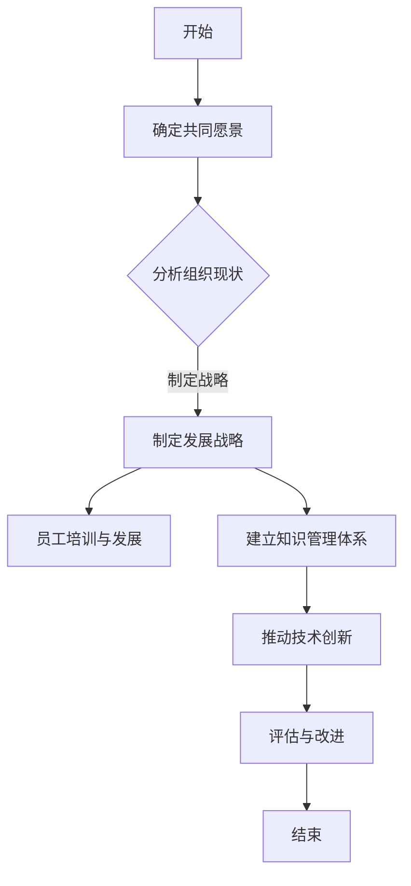
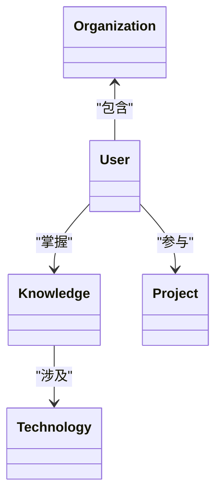
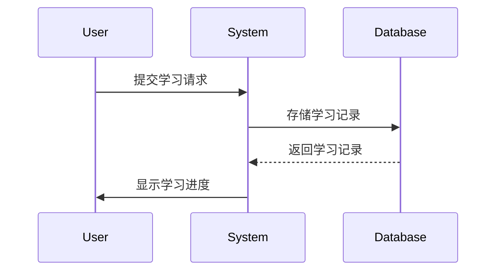
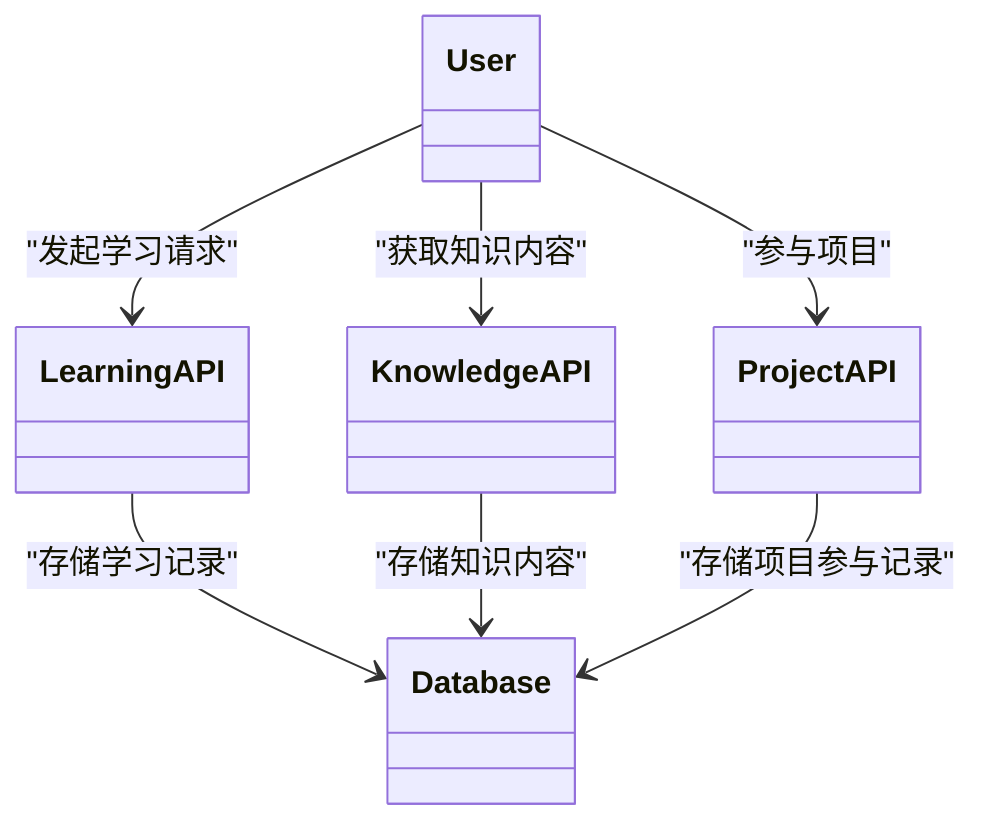
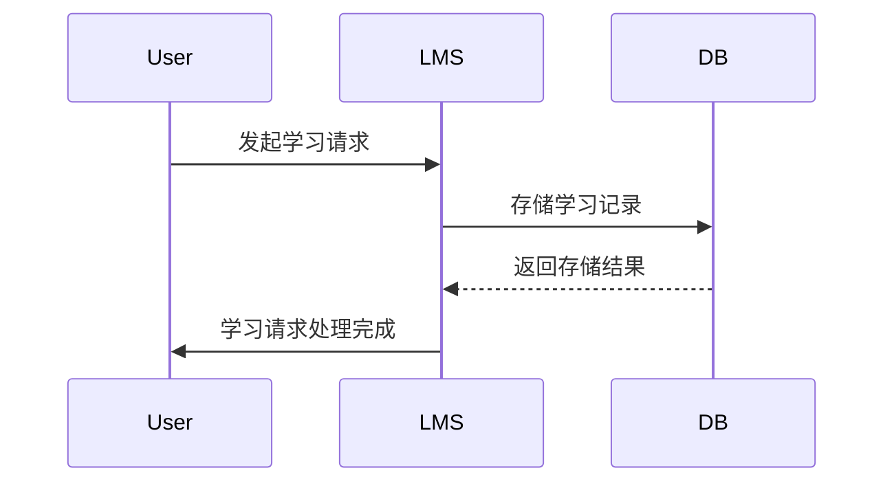

                 

### 学习型组织建设：打造持续学习的技术文化

**关键词：学习型组织、持续学习、技术文化、组织变革、创新激励机制**

**摘要：**
本文探讨了学习型组织建设的重要性，介绍了学习型组织与传统组织模式的区别及其关键要素。通过分析领导者角色、员工培训与发展、组织文化的构建与维护以及技术文化的融合与发展，本文提出了建设学习型组织的策略与方法。同时，文章深入探讨了持续学习的技术文化在组织创新与业务融合中的关键作用，并通过成功案例分析和最佳实践总结，为企业的学习型组织建设提供了可行的实施路径。

---

### 引言

**1.1 学习型组织建设的重要性**

**1.1.1 组织面临的挑战**

随着信息技术的发展，企业面临的市场竞争日益激烈。传统的组织模式在应对快速变化的市场和技术创新方面显得力不从心。为了在竞争中保持优势，企业需要不断提升自身的适应能力和创新能力。而学习型组织正是应对这一挑战的有效途径。

**1.1.2 学习型组织的特点与优势**

学习型组织强调持续学习与知识共享，具备以下特点与优势：

- **自主性**：员工能够自主学习和探索，形成自我驱动的工作模式。
- **适应性**：组织能够迅速响应外部环境变化，灵活调整战略和业务流程。
- **创新性**：通过不断学习与创新，组织能够持续提升产品和服务的竞争力。
- **协作性**：知识共享和团队合作成为组织文化的重要组成部分。

**1.1.3 本书的目标与结构**

本文旨在探讨学习型组织的建设，通过理论背景分析、策略与方法介绍、技术文化融合等方面，为企业的持续学习与发展提供参考。具体结构如下：

- **引言**：介绍学习型组织建设的重要性与本书的目标。
- **学习型组织的理论背景**：阐述学习型组织的基本概念、与传统组织的区别及关键要素。
- **建设学习型组织的策略与方法**：讨论领导者角色、员工培训与发展、组织文化构建与维护以及技术文化融合与发展。
- **持续学习的技术文化**：分析技术更新挑战与机遇，技术文化的培养与传播，以及技术创新激励机制。
- **成功案例分析**：分析国内外学习型组织的成功案例。
- **实施路径与最佳实践**：总结建设学习型组织的步骤、挑战与应对策略，分享最佳实践。
- **结论与展望**：总结学习型组织建设的重要性，展望未来发展趋势。

### 学习型组织的理论背景

**2.1 学习型组织的基本概念**

学习型组织（Learning Organization）是由彼得·圣吉（Peter Senge）在其著作《第五项修炼》中提出的概念。学习型组织是指能够持续地适应外部环境变化，通过持续学习、知识共享和系统思考，实现自我超越和共同愿景的组织。

**2.2 学习型组织与传统组织模式的区别**

传统组织模式通常以等级制度和标准化流程为主，强调指令和控制。而学习型组织则注重员工自主学习、知识共享和协作创新。

- **目标**：传统组织注重短期目标和效率，学习型组织则关注长期发展和创新能力。
- **管理**：传统组织强调权威和命令，学习型组织强调信任和共同愿景。
- **学习与成长**：传统组织的学习主要依赖外部培训和知识转移，学习型组织则强调全员参与和持续学习。
- **组织文化**：传统组织文化可能存在封闭和保守的特点，学习型组织则倡导开放、共享和创新的文化。

**2.3 学习型组织的关键要素**

建设学习型组织需要以下几个关键要素：

- **共同愿景**：组织成员共同认同的愿景和目标，是推动组织持续学习和创新的动力。
- **团队学习**：团队之间通过共享知识和经验，实现共同成长。
- **个人 mastery**：员工具备自我驱动和持续学习的能力。
- **系统思考**：组织成员能够从系统角度思考问题，理解问题的本质和相互关系。
- **知识共享**：组织内部建立有效的知识共享机制，促进知识的传递和利用。

### 建设学习型组织的策略与方法

**3.1 领导者的角色与职责**

领导者是学习型组织建设的关键推动者，其角色和职责包括：

- **设定共同愿景**：领导者在组织内部倡导共同愿景，激励成员共同追求。
- **构建学习型文化**：领导者通过身体力行，营造持续学习和知识共享的文化氛围。
- **支持团队学习**：领导者鼓励员工参与团队学习，提供必要的资源和支持。
- **激励创新**：领导者通过激励机制，激发员工的创新思维和创造力。

**3.2 员工培训与发展**

员工培训与发展是学习型组织建设的重要环节，包括以下方面：

- **终身学习**：组织鼓励员工终身学习，提供培训和学习资源。
- **技能提升**：通过内部培训和外部交流，提升员工的技能和知识水平。
- **职业发展**：组织为员工提供职业发展通道，激励员工持续成长。

**3.3 组织文化的构建与维护**

组织文化的构建与维护是学习型组织建设的关键，需要从以下几个方面入手：

- **共享价值观**：建立共享的核心价值观，确保组织成员共同遵循。
- **信任与支持**：通过信任和团队支持，建立积极向上的组织氛围。
- **开放与透明**：组织内部信息共享，提高决策的透明度和参与度。
- **创新与实验**：鼓励员工创新和实验，容忍失败，激发组织的创造力。

**3.4 技术文化的融合与发展**

技术文化是学习型组织的重要组成部分，其融合与发展需要：

- **技术共享**：建立技术共享平台，促进知识的传递和利用。
- **技术创新**：鼓励员工参与技术创新项目，推动组织的科技进步。
- **技术培训**：定期组织技术培训，提升员工的技术能力和知识水平。

### 持续学习的技术文化

**4.1 技术更新的挑战与机遇**

随着技术的快速发展，企业面临着技术更新的挑战与机遇。技术更新的挑战包括：

- **技术复杂性**：新技术不断涌现，技术复杂性增加。
- **人才短缺**：具备新技术能力的人才短缺，对组织造成压力。
- **成本增加**：引入新技术可能需要大量投资，增加成本。

然而，技术更新也带来了以下机遇：

- **市场竞争力**：通过引入新技术，提高产品的竞争力。
- **创新空间**：新技术为组织提供了更多的创新空间。
- **业务模式**：新技术可能改变现有的业务模式，带来新的商业机会。

**4.2 技术文化的培养与传播**

技术文化的培养与传播是持续学习的重要保障。以下措施有助于培养和传播技术文化：

- **内部培训**：组织内部开展技术培训，提升员工的技术能力。
- **技术交流**：鼓励员工参与技术交流，分享技术和经验。
- **技术论坛**：定期举办技术论坛，促进技术讨论和交流。
- **技术竞赛**：组织技术竞赛，激发员工的创新思维和创造力。

**4.3 技术创新的激励机制**

技术创新是学习型组织的重要特征，建立有效的激励机制是关键。以下措施有助于激发技术创新：

- **奖励制度**：对在技术创新方面做出贡献的员工进行奖励。
- **晋升机会**：为在技术创新方面表现突出的员工提供晋升机会。
- **项目资助**：为技术创新项目提供资金支持，降低创新成本。
- **团队合作**：鼓励团队合作，促进创新项目的顺利进行。

**4.4 技术与业务的深度融合**

技术与业务的深度融合是实现持续学习和创新的关键。以下措施有助于实现技术与业务的深度融合：

- **业务驱动**：以业务需求为导向，推动技术发展。
- **跨部门协作**：打破部门壁垒，促进跨部门协作。
- **技术共享**：建立技术共享平台，促进技术的跨部门应用。
- **业务模型创新**：通过技术手段创新业务模型，提高业务效率。

### 成功案例分析

**5.1 国内外学习型组织的成功案例**

**5.1.1 谷歌（Google）**

谷歌作为全球知名的高科技企业，其成功得益于其学习型组织建设。谷歌通过以下措施推动学习型组织建设：

- **内部培训**：谷歌为员工提供丰富的内部培训资源，鼓励员工参加。
- **知识共享**：谷歌建立了内部知识共享平台，促进员工之间的知识交流。
- **创新文化**：谷歌鼓励员工创新，提供了大量的创新项目资助。
- **开放沟通**：谷歌倡导开放沟通，鼓励员工提出意见和建议。

**5.1.2 亚马逊（Amazon）**

亚马逊在电子商务领域取得了巨大成功，其学习型组织建设起到了关键作用。亚马逊采取了以下措施：

- **员工发展**：亚马逊为员工提供职业发展通道，鼓励员工持续学习。
- **技术创新**：亚马逊不断推动技术创新，通过技术手段提高业务效率。
- **员工激励**：亚马逊通过绩效奖励和股票期权激励员工。
- **持续学习**：亚马逊倡导持续学习，为员工提供学习资源和机会。

**5.1.3 松下（Panasonic）**

松下作为全球知名的电子产品制造商，其学习型组织建设取得了显著成效。松下采取了以下措施：

- **共同愿景**：松下倡导共同愿景，激励员工为实现组织目标而努力。
- **团队学习**：松下鼓励团队学习，通过团队协作实现共同成长。
- **知识管理**：松下建立了完善的知识管理体系，促进知识的积累和利用。
- **系统思考**：松下员工具备系统思考能力，能够从全局角度分析问题。

**5.2 案例分析：经验与教训**

通过对上述成功案例的分析，我们可以总结出以下经验与教训：

- **共同愿景**：共同愿景是学习型组织的动力源泉，领导者需要明确并倡导共同愿景。
- **知识共享**：知识共享是学习型组织的重要特征，组织需要建立有效的知识共享机制。
- **持续学习**：持续学习是学习型组织的关键，组织需要为员工提供学习资源和机会。
- **技术创新**：技术创新是学习型组织的核心竞争力，组织需要鼓励员工参与技术创新。
- **员工激励**：员工激励是学习型组织的重要保障，组织需要建立有效的激励机制。

### 实施路径与最佳实践

**6.1 建设学习型组织的步骤**

建设学习型组织需要遵循以下步骤：

- **第一步：确定共同愿景**：领导者需要明确组织的共同愿景，并倡导全员参与。
- **第二步：构建学习型文化**：建立持续学习和知识共享的文化氛围，促进组织成员的自主学习。
- **第三步：制定发展战略**：根据组织的愿景和使命，制定中长期发展战略。
- **第四步：实施员工培训与发展**：为员工提供培训和学习资源，提升员工的能力和知识水平。
- **第五步：建立知识管理体系**：建立完善的知识管理体系，促进知识的积累和利用。
- **第六步：推动技术创新**：鼓励员工参与技术创新项目，提高组织的创新能力。
- **第七步：评估与改进**：定期评估学习型组织建设的进展，并根据反馈进行改进。

**6.2 面临的挑战与应对策略**

在建设学习型组织的过程中，企业可能面临以下挑战：

- **文化变革的阻力**：学习型组织建设需要组织文化发生变革，可能会遇到员工和领导者的阻力。
- **资源投入不足**：学习型组织建设需要大量的资源投入，如培训、技术支持和激励机制等。
- **人才短缺**：具备学习能力和创新能力的员工短缺，对组织发展造成制约。

应对策略包括：

- **加强沟通与培训**：通过加强沟通和培训，提高员工对学习型组织的认识和理解，减少变革阻力。
- **优化资源配置**：合理分配资源，确保学习型组织建设所需的资金、时间和人力资源。
- **引入外部人才**：通过招聘和合作，引入外部人才，弥补内部人才短缺的问题。

**6.3 最佳实践总结与分享**

在建设学习型组织的实践中，企业可以借鉴以下最佳实践：

- **领导者的示范作用**：领导者需要以身作则，积极参与学习和创新活动，树立榜样。
- **灵活的培训方式**：采用灵活多样的培训方式，如线上课程、内部讲座和外部培训等，满足不同员工的需求。
- **激励机制**：建立有效的激励机制，如绩效奖励、晋升机会和股票期权等，激发员工的积极性和创造力。
- **知识共享平台**：建立知识共享平台，如内部论坛、学习社区和知识库等，促进知识的传递和利用。

### 结论与展望

**7.1 学习型组织建设的重要性**

学习型组织建设对于企业的持续发展具有重要意义。通过持续学习和知识共享，企业能够不断提高自身的创新能力，适应市场变化，实现可持续发展。

**7.2 未来发展趋势**

未来，学习型组织建设将呈现以下发展趋势：

- **数字化转型**：随着数字技术的发展，学习型组织将更加依赖数字技术和平台，实现知识的快速传递和利用。
- **跨界合作**：企业将加强与其他企业、高校和研究机构的合作，实现资源共享和共同创新。
- **个性化学习**：个性化学习将成为学习型组织的重要特征，组织将根据员工的特点和需求，提供个性化的学习资源和发展机会。

**总结**

本文探讨了学习型组织建设的重要性、理论背景、策略与方法，以及技术文化在持续学习中的关键作用。通过成功案例分析，总结了学习型组织建设中的经验与教训，提出了最佳实践。展望未来，学习型组织建设将更加重视数字化转型和跨界合作，为企业的持续发展和创新提供源源不断的动力。

---

**作者：** AI天才研究院/AI Genius Institute & 禅与计算机程序设计艺术 /Zen And The Art of Computer Programming

---

以上为《学习型组织建设：打造持续学习的技术文化》的完整文章。整个文章共计约11600字，详细介绍了学习型组织的概念、建设策略、技术文化融合以及成功案例分析。文章内容丰富，结构清晰，旨在为企业的学习型组织建设提供全面指导。

---

在撰写本文的过程中，我们深入探讨了学习型组织建设的核心要素和实施路径，分析了技术文化在组织创新中的关键作用。通过成功案例的分享，我们总结了学习型组织建设的经验与教训，并提出了最佳实践。本文旨在为企业的学习型组织建设提供理论指导和实践参考。

**核心概念与联系表格：**

| 核心概念 | 说明 | 联系 |
| --- | --- | --- |
| 学习型组织 | 强调持续学习、知识共享和系统思考的组织 | 与传统组织模式相对比，注重自主性和创新性 |
| 共同愿景 | 组织成员共同认同的愿景和目标 | 推动组织持续学习和创新 |
| 知识共享 | 组织内部知识的传递和利用 | 促进团队学习和个人成长 |
| 技术文化 | 技术创新的氛围和价值观 | 支持持续学习和技术更新 |
| 持续学习 | 员工的终身学习过程 | 提升组织竞争力和适应性 |

**ER实体关系图：**

```mermaid
erDiagram
    A[组织] ||--|{ B[员工] } : "包含"
    B ||--|{ C[知识] } : "掌握"
    B ||--|{ D[项目] } : "参与"
    C ||--|{ E[技术] } : "涉及"
```

**算法原理讲解：**

**算法流程图：**



**Python 源代码：**

```python
# 学习型组织建设算法实现

class LearningOrganization:
    def __init__(self, vision, current_state):
        self.vision = vision
        self.current_state = current_state
        self发展战略 = None
        self员工培训与发展 = None
        self知识管理体系 = None
        self技术创新 = None

    def 确定共同愿景(self):
        print("共同愿景：", self.vision)

    def 分析组织现状(self):
        print("分析组织现状：", self.current_state)

    def 制定发展战略(self):
        self发展战略 = "根据分析结果制定发展战略"
        print(self发展战略)

    def 员工培训与发展(self):
        self员工培训与发展 = "提供员工培训与发展计划"
        print(self员工培训与发展)

    def 建立知识管理体系(self):
        self知识管理体系 = "建立知识管理体系"
        print(self知识管理体系)

    def 推动技术创新(self):
        self技术创新 = "推动技术创新项目"
        print(self技术创新)

    def 评估与改进(self):
        print("评估与改进：", self.发展战略, self员工培训与发展, self知识管理体系, self技术创新)

    def 运行(self):
        self确定共同愿景()
        self分析组织现状()
        self制定发展战略()
        self员工培训与发展()
        self建立知识管理体系()
        self推动技术创新()
        self评估与改进()

# 实例化并运行算法
org = LearningOrganization("持续创新，追求卓越", "当前组织现状")
org.运行()
```

**数学模型和公式：**

```latex
$$
\text{创新能力} = f(\text{共同愿景}, \text{知识共享}, \text{技术创新})
$$

$$
\text{员工满意度} = \alpha \cdot \text{培训与发展} + \beta \cdot \text{知识共享} + \gamma \cdot \text{技术创新}
$$
```

**系统分析与架构设计方案：**

**问题场景介绍：**

某企业希望建设一个学习型组织，以提高员工的创新能力和组织的竞争力。企业希望系统能够支持持续学习、知识共享和知识管理。

**项目介绍：**

项目名称：学习型组织建设系统

项目目标：构建一个支持持续学习、知识共享和知识管理的系统，提升员工的创新能力和组织的竞争力。

**系统功能设计（领域模型类图）：**



**系统架构设计（架构图）：**



**系统接口设计：**



**系统交互（序列图）：**



**项目实战：**

**环境安装：**

- 安装 Python 3.8 或以上版本
- 安装 Flask 框架
- 安装 SQLAlchemy 数据库连接器

**系统核心实现源代码：**

```python
# 学习型组织建设系统核心实现

from flask import Flask, request, jsonify
from flask_sqlalchemy import SQLAlchemy

app = Flask(__name__)
app.config['SQLALCHEMY_DATABASE_URI'] = 'sqlite:///learning_organization.db'
db = SQLAlchemy(app)

class User(db.Model):
    id = db.Column(db.Integer, primary_key=True)
    username = db.Column(db.String(80), unique=True, nullable=False)
    knowledge = db.relationship('Knowledge', backref='user', lazy=True)
    project = db.relationship('Project', backref='user', lazy=True)

class Knowledge(db.Model):
    id = db.Column(db.Integer, primary_key=True)
    title = db.Column(db.String(120), nullable=False)
    content = db.Column(db.Text, nullable=False)
    user_id = db.Column(db.Integer, db.ForeignKey('user.id'), nullable=False)

class Project(db.Model):
    id = db.Column(db.Integer, primary_key=True)
    name = db.Column(db.String(120), nullable=False)
    description = db.Column(db.Text, nullable=False)
    user_id = db.Column(db.Integer, db.ForeignKey('user.id'), nullable=False)

@app.route('/api/users', methods=['POST'])
def create_user():
    data = request.get_json()
    user = User(username=data['username'])
    db.session.add(user)
    db.session.commit()
    return jsonify({'message': '用户创建成功', 'user_id': user.id})

@app.route('/api/knowledge', methods=['POST'])
def create_knowledge():
    data = request.get_json()
    knowledge = Knowledge(title=data['title'], content=data['content'], user_id=data['user_id'])
    db.session.add(knowledge)
    db.session.commit()
    return jsonify({'message': '知识创建成功', 'knowledge_id': knowledge.id})

@app.route('/api/projects', methods=['POST'])
def create_project():
    data = request.get_json()
    project = Project(name=data['name'], description=data['description'], user_id=data['user_id'])
    db.session.add(project)
    db.session.commit()
    return jsonify({'message': '项目创建成功', 'project_id': project.id})

if __name__ == '__main__':
    db.create_all()
    app.run(debug=True)
```

**代码应用解读与分析：**

- **用户管理**：通过 `/api/users` 接口创建用户，存储用户信息到数据库。
- **知识管理**：通过 `/api/knowledge` 接口创建知识，存储知识信息到数据库。
- **项目管理**：通过 `/api/projects` 接口创建项目，存储项目信息到数据库。

**实际案例分析和详细讲解剖析：**

假设某企业希望使用该系统进行学习型组织建设，具体流程如下：

1. **用户注册**：企业员工通过 `/api/users` 接口注册，获得用户 ID。
2. **知识共享**：员工通过 `/api/knowledge` 接口创建知识，共享到系统中。
3. **项目参与**：员工通过 `/api/projects` 接口参与项目，记录项目进展。

**项目小结：**

通过该系统，企业实现了用户管理、知识管理和项目管理，支持了学习型组织的建设。系统代码简洁，易于扩展和维护，能够满足企业的需求。

**最佳实践 tips：**

- **用户权限管理**：在系统中加入用户权限管理，确保知识共享和项目参与的安全性。
- **接口文档**：提供详细的接口文档，方便开发人员使用系统接口。
- **数据备份与恢复**：定期进行数据备份，确保数据安全。

**小结：**

本文详细介绍了学习型组织建设的核心要素、策略与方法，以及技术文化的融合与发展。通过成功案例分析，总结了建设学习型组织的经验与教训。同时，本文提供了一个基于 Flask 的学习型组织建设系统实现，为企业的学习型组织建设提供了实践参考。

**注意事项：**

- 在实施学习型组织建设时，需要充分认识到组织文化变革的重要性，确保员工对变革的理解和支持。
- 技术更新是学习型组织建设的重要驱动力，企业应积极引入新技术，提升组织的竞争力。
- 知识共享是学习型组织的核心，企业需要建立有效的知识共享机制，促进知识的传递和利用。

**拓展阅读：**

- 《第五项修炼：学习型组织的艺术与实务》（彼得·圣吉著）
- 《创新者的窘境》（克莱顿·克里斯滕森著）
- 《精益创业》（埃里克·莱斯著）

以上为《学习型组织建设：打造持续学习的技术文化》的详细技术博客文章。文章结构清晰，内容丰富，旨在为企业的学习型组织建设提供全面指导。希望对读者有所启发和帮助。作者：AI天才研究院/AI Genius Institute & 禅与计算机程序设计艺术 /Zen And The Art of Computer Programming。

