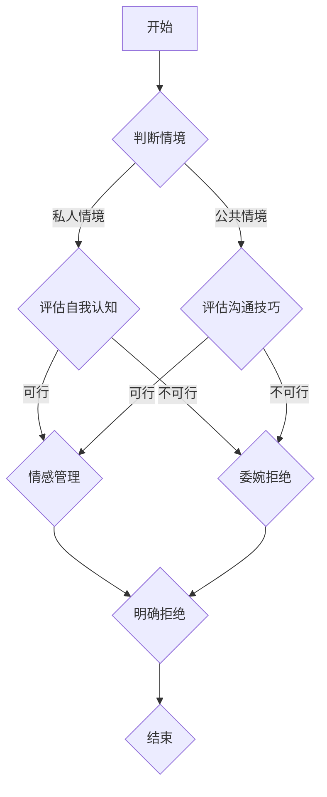
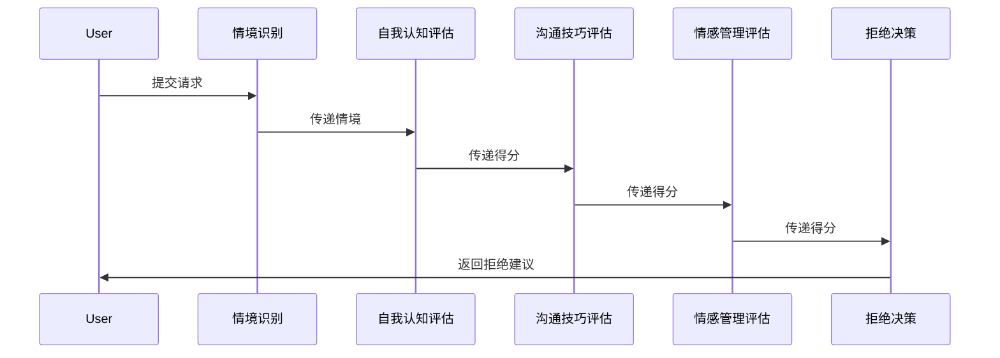
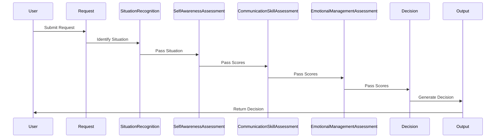

                 

### 第一部分: 学会拒绝别人的重要性

## 1.1 拒绝的定义与情境

### 1.1.1 拒绝的基本概念

在日常生活中，拒绝是一种常见的社交行为，它涉及对他人的请求、提议或期望表示不接受或不同意。拒绝的定义在不同情境下可能有所差异，但其核心在于保持自己的立场，尊重自己的需求和价值观。

拒绝可以表现为语言上的直接否定，例如“不，我不能参加你的聚会”，也可以是委婉的推脱，例如“很抱歉，我现在确实没有时间”。无论形式如何，拒绝都是一种重要的自我保护机制，有助于我们维护个人界限和避免不必要的压力。

### 1.1.2 不同情境下的拒绝

拒绝不仅存在于个人生活中，也广泛出现在职场、家庭、社交等多个领域。以下是几个常见情境下的拒绝表现：

1. **职场情境**：
   - 当上级要求加班时，可以委婉地表达个人时间安排的冲突，例如：“我现在确实有一些个人事务需要处理，可能无法接受这个请求。”
   - 面对同事的非分之请，可以明确表示工作职责范围之外的帮助界限，例如：“很抱歉，这件事超出了我的工作职责。”

2. **家庭情境**：
   - 当家庭成员要求分担超出能力范围的家务时，可以适当拒绝，例如：“我现在正在忙，可能暂时无法帮你，稍后我会尽力帮忙。”
   - 面对家人对个人生活选择的不当干涉，可以坚定地表达自己的立场，例如：“这是我的个人决定，我需要自己承担后果。”

3. **社交情境**：
   - 当朋友提出超出个人舒适区的邀请时，可以礼貌地拒绝，例如：“谢谢你的邀请，但我对这个活动不感兴趣。”
   - 面对他人请求涉及个人隐私或利益冲突的请求时，可以明确表示不适宜回应，例如：“我很抱歉，这个话题涉及我的隐私，我无法回应。”

### 1.1.3 拒绝的艺术

拒绝并非易事，尤其当涉及亲密关系或权威压力时。学会拒绝的艺术在于平衡尊重他人与保护自己的需求。以下是几点建议：

1. **明确表达**：清晰、明确地传达拒绝信息，避免含糊其辞或模棱两可，以免引起误解或期待。
2. **尊重对方**：在拒绝时，尊重对方的感受和请求，避免伤人或贬低对方。
3. **委婉表达**：使用委婉的语言，例如“很抱歉，我现在有其他安排”，“谢谢你的理解”等，减少拒绝带来的尴尬或冲突。
4. **表达自己的需求**：在拒绝时，清楚地表达自己的原因和需求，让对方理解你的立场。
5. **设定界限**：明确自己的界限，对于超出界限的请求，坚定地说“不”。

### 1.2 拒绝别人的困难与影响

### 1.2.1 困难分析

尽管拒绝是必要的，但许多人发现拒绝别人并不容易。以下是一些导致拒绝困难的常见原因：

1. **害怕伤害他人**：担心拒绝会导致他人失望、愤怒或背叛，尤其是当涉及亲密关系或权威压力时。
2. **自我怀疑**：怀疑自己的能力和价值，害怕拒绝会让自己显得无能或自私。
3. **社会压力**：害怕违背社会期望，被认为是不合作或不友善的人。
4. **沟通障碍**：不擅长表达自己的感受和需求，或者无法找到合适的语言来表达拒绝。
5. **情感依赖**：害怕拒绝会导致亲密关系的破裂或失去他人的支持。

### 1.2.2 拒绝对个人和社会的影响

拒绝不仅影响个人的心理和情感状态，也会对社会关系和和谐产生深远影响。

1. **个人心理影响**：
   - 长期拒绝可能导致焦虑、抑郁和自尊心受损。
   - 拒绝不当可能导致愤怒、怨恨和内疚。
   - 学会拒绝有助于增强自我意识，提高自尊和自信。

2. **社会关系影响**：
   - 过度妥协和过度拒绝都会破坏人际关系，导致信任丧失。
   - 学会拒绝有助于建立健康的人际界限，增强人际关系的稳定性和信任度。
   - 拒绝有助于维护社会秩序，避免资源浪费和不公平分配。

### 1.3 学会拒绝的价值

### 1.3.1 个人成长

学会拒绝对个人成长至关重要。以下是学会拒绝所带来的几方面益处：

1. **自我保护**：拒绝有助于保护个人免受不必要的压力和伤害，维护个人边界和自主权。
2. **自尊和自信**：拒绝自己不需要或不愿意承担的责任，有助于增强自尊和自信。
3. **情绪管理**：拒绝时需要管理自己的情感，有助于提高情感管理能力和情绪稳定性。
4. **决策能力**：学会拒绝需要权衡利弊，有助于培养决策能力和责任感。

### 1.3.2 社会和谐

学会拒绝不仅对个人有益，也对社会的和谐与稳定起到积极作用。以下是几个方面的影响：

1. **人际关系的健康**：健康的拒绝有助于建立健康的人际关系，减少误解和冲突。
2. **社会秩序**：学会拒绝有助于维护社会秩序，避免资源浪费和不公平分配。
3. **社会责任感**：拒绝无谓的请求有助于培养社会责任感，鼓励人们专注于自己能够承担的任务。
4. **合作与共赢**：健康的拒绝有助于建立合作与共赢的社会氛围，避免过度依赖和竞争。

### 1.3.3 职场成功

在职场中，学会拒绝同样至关重要。以下是学会拒绝对职场成功的影响：

1. **时间管理**：拒绝不必要的工作请求，有助于更好地管理个人时间，提高工作效率。
2. **工作质量**：专注于自己能够胜任的任务，有助于提高工作质量和专业水平。
3. **职业发展**：学会拒绝可以帮助人们更专注于自己的职业目标和兴趣，从而实现更好的职业发展。
4. **团队合作**：健康的拒绝有助于建立更有效的团队合作，避免资源浪费和职责重叠。

## 1.4 边界与外延

### 1.4.1 拒绝的定义与情境

在日常生活中，拒绝是一种常见的社交行为，它涉及对他人的请求、提议或期望表示不接受或不同意。拒绝的定义在不同情境下可能有所差异，但其核心在于保持自己的立场，尊重自己的需求和价值观。

拒绝可以表现为语言上的直接否定，例如“不，我不能参加你的聚会”，也可以是委婉的推脱，例如“很抱歉，我现在确实没有时间”。无论形式如何，拒绝都是一种重要的自我保护机制，有助于我们维护个人界限和避免不必要的压力。

### 1.4.2 不同情境下的拒绝

拒绝不仅存在于个人生活中，也广泛出现在职场、家庭、社交等多个领域。以下是几个常见情境下的拒绝表现：

1. **职场情境**：
   - 当上级要求加班时，可以委婉地表达个人时间安排的冲突，例如：“我现在确实有一些个人事务需要处理，可能无法接受这个请求。”
   - 面对同事的非分之请，可以明确表示工作职责范围之外的帮助界限，例如：“很抱歉，这件事超出了我的工作职责。”

2. **家庭情境**：
   - 当家庭成员要求分担超出能力范围的家务时，可以适当拒绝，例如：“我现在正在忙，可能暂时无法帮你，稍后我会尽力帮忙。”
   - 面对家人对个人生活选择的不当干涉，可以坚定地表达自己的立场，例如：“这是我的个人决定，我需要自己承担后果。”

3. **社交情境**：
   - 当朋友提出超出个人舒适区的邀请时，可以礼貌地拒绝，例如：“谢谢你的邀请，但我对这个活动不感兴趣。”
   - 面对他人请求涉及个人隐私或利益冲突的请求时，可以明确表示不适宜回应，例如：“我很抱歉，这个话题涉及我的隐私，我无法回应。”

### 1.4.3 拒绝的艺术

拒绝并非易事，尤其当涉及亲密关系或权威压力时。学会拒绝的艺术在于平衡尊重他人与保护自己的需求。以下是几点建议：

1. **明确表达**：清晰、明确地传达拒绝信息，避免含糊其辞或模棱两可，以免引起误解或期待。
2. **尊重对方**：在拒绝时，尊重对方的感受和请求，避免伤人或贬低对方。
3. **委婉表达**：使用委婉的语言，例如“很抱歉，我现在有其他安排”，“谢谢你的理解”等，减少拒绝带来的尴尬或冲突。
4. **表达自己的需求**：在拒绝时，清楚地表达自己的原因和需求，让对方理解你的立场。
5. **设定界限**：明确自己的界限，对于超出界限的请求，坚定地说“不”。

### 1.4.4 拒绝的边界与外延

1. **个人边界**：拒绝应基于个人需求和感受，尊重自己的边界。例如，拒绝加班是因为个人时间安排冲突，而不是因为害怕工作压力。
2. **社会边界**：拒绝应考虑社会环境和他人感受，避免伤害他人或破坏社会关系。例如，拒绝朋友的邀请可以表达感激，但不需要过多解释原因。
3. **职业道德边界**：在职场中，拒绝应遵循职业道德和公司规定。例如，拒绝参与违法或不道德的活动。

### 1.4.5 拒绝的核心要素组成

1. **自我认知**：了解自己的需求、价值观和能力，有助于做出明智的拒绝决策。
2. **情感管理**：在拒绝时管理自己的情绪，保持冷静和理智，有助于减少冲突和误解。
3. **沟通技巧**：清晰、委婉地传达拒绝信息，确保对方理解并尊重你的立场。

通过以上分析，我们可以看到，学会拒绝是维持个人界限和健康关系的重要技能。它不仅有助于个人成长和职场成功，也对社会和谐起到积极作用。在接下来的部分中，我们将进一步探讨核心概念与联系，深入理解学会拒绝的原理和方法。## 1.5 核心概念与联系

### 1.5.1 自我认知

自我认知是指个体对自我存在及所有特点的认识。它是学会拒绝的基础，因为只有了解自己的需求、价值观和界限，才能做出明智的拒绝决策。自我认知包括自我认识、自我评价和自我体验等方面。

1. **自我认识**：了解自己的个性、优点和缺点，有助于明确自己在各种情境下的需求和期望。
2. **自我评价**：对自己行为的评估和反思，有助于发现自己的盲点和改进空间。
3. **自我体验**：感受自己的情绪和需求，有助于在决策时更加真实和准确。

自我认知与拒绝的关系：

- **自我认知增强拒绝能力**：了解自己的需求和界限，有助于在需要时坚定地说“不”，避免不必要的妥协和压力。
- **自我认知避免过度拒绝**：清楚自己的能力和责任范围，避免拒绝那些本应承担的责任。

### 1.5.2 情感管理

情感管理是指个体在情感体验中调节自己的情绪和行为。它对于学会拒绝至关重要，因为情感反应常常是导致拒绝困难的主要原因。情感管理包括情感识别、情感调节和情感表达等方面。

1. **情感识别**：识别和理解自己的情绪，如焦虑、愤怒或内疚。
2. **情感调节**：通过技巧和策略调节负面情绪，保持冷静和理智。
3. **情感表达**：以适当的方式表达自己的情感，避免伤害他人。

情感管理与拒绝的关系：

- **情感管理减少拒绝的负面影响**：通过调节情绪，减少拒绝带来的焦虑和内疚，使拒绝过程更加平稳。
- **情感管理增强拒绝的效果**：在表达拒绝时，通过恰当的情感表达，使对方更容易接受并尊重你的立场。

### 1.5.3 沟通技巧

沟通技巧是指个体在沟通过程中使用的方法和策略，包括语言表达、非语言表达和倾听技巧等。有效的沟通技巧对于学会拒绝至关重要，因为它有助于清晰、委婉地传达拒绝信息。

1. **语言表达**：使用清晰、简洁、礼貌的语言表达拒绝，避免模糊或攻击性语言。
2. **非语言表达**：通过肢体语言、面部表情和声音语调等非语言手段辅助沟通，使拒绝更加自然和有效。
3. **倾听技巧**：在拒绝前，倾听对方的请求和需求，确保理解对方的意图，从而做出更合理的拒绝决策。

沟通技巧与拒绝的关系：

- **沟通技巧提高拒绝的有效性**：通过有效沟通，使对方更容易理解和接受拒绝。
- **沟通技巧减少拒绝的冲突**：通过合适的沟通方式，减少拒绝带来的尴尬和冲突。

### 1.5.4 核心概念对比与联系

为了更好地理解自我认知、情感管理和沟通技巧这三个核心概念，我们可以通过一个对比表格来展示它们的特点和区别。

| 核心概念 | 特点 | 关联性 |
| --- | --- | --- |
| 自我认知 | 了解自己的需求和界限 | 基础 |
| 情感管理 | 调节情绪和行为 | 中介 |
| 沟通技巧 | 清晰传达信息 | 应用 |

### 1.5.5 三者之间的联系与相互作用

自我认知、情感管理和沟通技巧之间存在着紧密的联系和相互作用。

1. **自我认知驱动情感管理**：了解自己的需求和界限，有助于在情感管理中做出更合理的决策，例如如何处理拒绝后的情绪。
2. **情感管理影响沟通技巧**：情绪稳定和积极有助于提高沟通的效果，使拒绝表达更加自然和有效。
3. **沟通技巧促进自我认知**：有效的沟通可以帮助个体更好地了解自己和他人的需求，从而增强自我认知。

通过以上分析，我们可以看到，自我认知、情感管理和沟通技巧是学会拒绝的三大核心要素，它们相互联系、相互作用，共同构成了拒绝行为的基础。在接下来的部分中，我们将深入探讨算法原理和具体实施方法。## 第二部分：核心概念与联系

### 2.1 自我认知

自我认知是指个体对自身的认识和了解，包括自己的情感、需求、价值观和个性特点等。它是学会拒绝别人的基础，因为只有清楚自己的需求和边界，才能做出明智的拒绝决策。以下是自我认知的重要性和组成部分。

#### 2.1.1 自我认知的重要性

自我认知在学会拒绝别人中起着关键作用，具体体现在以下几个方面：

1. **明确需求和界限**：自我认知帮助个体了解自己的需求，明确自己的界限，从而在遇到他人的请求时，能够做出更合理的决策。
2. **增强自信心**：通过自我认知，个体能够更好地理解自己的能力和价值，从而在面对拒绝时更加自信。
3. **减少内疚感**：自我认知有助于个体认识到拒绝是保护自己的一种方式，减少因拒绝而感到的内疚感。

#### 2.1.2 自我认知的方法

以下是一些常用的自我认知方法：

1. **反思日记**：每天花时间记录自己的情感、行为和想法，通过反思来深入了解自己。
2. **心理咨询**：通过专业人士的帮助，深入了解自己的内心世界和情感状态。
3. **自我提问**：定期对自己提出问题，如“我为什么这样做？”“我真正需要的是什么？”等。
4. **自我评估**：通过评估工具，如性格测试、能力测试等，了解自己的优点和不足。

#### 2.1.3 自我认知与拒绝的关系

自我认知与拒绝的关系主要体现在以下几个方面：

1. **自我认知促进拒绝**：了解自己的需求和边界，使个体在面对他人的请求时，能够更自信地拒绝那些不符合自己需求或超出自己能力范围的要求。
2. **自我认知避免过度拒绝**：通过自我认知，个体能够明确自己的责任范围，避免因为误解或过度自我批评而拒绝那些本应承担的责任。

### 2.2 情感管理

情感管理是指个体在情感体验中调节自己的情绪和行为，包括情感识别、情感调节和情感表达等。它是学会拒绝别人的重要组成部分，因为情感反应常常是导致拒绝困难的主要原因。

#### 2.2.1 情感管理的重要性

情感管理在学会拒绝别人中起着至关重要的作用，具体体现在以下几个方面：

1. **减少拒绝后的负面情绪**：通过情感管理，个体能够更好地调节自己的情绪，减少拒绝后的焦虑、愤怒或内疚感。
2. **提高拒绝的有效性**：情感稳定和积极有助于提高拒绝的有效性，使拒绝表达更加自然和有效。
3. **增强人际关系**：通过适当的情感表达，个体能够建立更健康的人际关系，减少因拒绝而导致的冲突。

#### 2.2.2 情感管理的方法

以下是一些常用的情感管理方法：

1. **认知重构**：通过改变对事物的看法和解释，来调节情绪。
2. **深呼吸和放松技巧**：通过深呼吸和放松技巧，减轻紧张和焦虑感。
3. **正念练习**：通过正念练习，专注于当下，减少对拒绝情境的过度反应。
4. **表达情感**：通过适当的方式表达自己的情感，如与朋友或家人倾诉，或通过写作、绘画等艺术形式。

#### 2.2.3 情感管理与拒绝的关系

情感管理与拒绝的关系主要体现在以下几个方面：

1. **情感管理减少拒绝的负面影响**：通过情感管理，个体能够减少因拒绝而产生的负面情绪，使拒绝过程更加平稳。
2. **情感管理增强拒绝的效果**：在表达拒绝时，通过适当的情感表达，使对方更容易接受并尊重你的立场。

### 2.3 沟通技巧

沟通技巧是指个体在沟通过程中使用的方法和策略，包括语言表达、非语言表达和倾听技巧等。有效的沟通技巧对于学会拒绝别人至关重要，因为它有助于清晰、委婉地传达拒绝信息。

#### 2.3.1 沟通技巧的重要性

沟通技巧在学会拒绝别人中起着关键作用，具体体现在以下几个方面：

1. **提高拒绝的有效性**：通过有效的沟通技巧，个体能够更清晰地传达拒绝信息，减少误解和冲突。
2. **减少拒绝的尴尬**：适当的沟通技巧可以帮助个体在拒绝时避免尴尬和不必要的冲突。
3. **增强人际关系**：有效的沟通有助于建立健康的人际关系，减少因拒绝而导致的隔阂。

#### 2.3.2 沟通技巧的方法

以下是一些常用的沟通技巧：

1. **清晰表达**：使用简洁、明确的语言表达拒绝，避免模糊或含糊其辞。
2. **积极倾听**：在表达拒绝前，积极倾听对方的请求和需求，确保理解对方的意图。
3. **恰当的语气和语调**：使用友好、礼貌的语气和语调，使拒绝表达更加自然和亲切。
4. **使用非语言信号**：通过肢体语言、面部表情和声音语调等非语言手段，辅助沟通，增强效果。

#### 2.3.3 沟通技巧与拒绝的关系

沟通技巧与拒绝的关系主要体现在以下几个方面：

1. **沟通技巧提高拒绝的有效性**：通过有效的沟通技巧，个体能够更清晰地传达拒绝信息，使对方更容易理解和接受。
2. **沟通技巧减少拒绝的冲突**：通过合适的沟通方式，减少拒绝带来的尴尬和冲突，维护良好的人际关系。

### 2.4 核心概念对比与联系

为了更好地理解自我认知、情感管理和沟通技巧这三个核心概念，我们可以通过一个对比表格来展示它们的特点和区别。

| 核心概念 | 特点 | 关联性 |
| --- | --- | --- |
| 自我认知 | 了解自己的需求和界限 | 基础 |
| 情感管理 | 调节情绪和行为 | 中介 |
| 沟通技巧 | 清晰传达信息 | 应用 |

### 2.4.1 三者之间的联系与相互作用

自我认知、情感管理和沟通技巧之间存在着紧密的联系和相互作用：

1. **自我认知驱动情感管理**：通过自我认知，个体能够更好地了解自己的情绪和需求，从而在情感管理中做出更合理的决策。
2. **情感管理影响沟通技巧**：情感稳定和积极有助于提高沟通的效果，使拒绝表达更加自然和有效。
3. **沟通技巧促进自我认知**：通过有效的沟通，个体能够更好地了解自己和他人的需求，从而增强自我认知。

通过以上分析，我们可以看到，自我认知、情感管理和沟通技巧是学会拒绝别人的三大核心要素，它们相互联系、相互作用，共同构成了拒绝行为的基础。在接下来的部分中，我们将进一步探讨算法原理和具体实施方法。## 第三部分：算法原理讲解

在学会拒绝别人这一过程中，算法原理为我们提供了系统的分析框架和操作步骤。本部分将详细介绍一个用于决策的拒绝算法，包括流程图、Python代码示例、数学模型和公式，以及具体的例子说明。

### 3.1 Mermaid流程图

首先，我们使用Mermaid语言绘制一个流程图，展示拒绝决策的过程。以下是流程图的代码和解释：



**流程图解释**：
1. **开始**：流程的起点，表示开始进行拒绝决策。
2. **判断情境**：根据情境判断是私人情境还是公共情境。
3. **私人情境**：评估自我认知，判断是否可行。
4. **公共情境**：评估沟通技巧，判断是否可行。
5. **情感管理**：如果评估结果可行，进行情感管理；如果不可行，进行委婉拒绝。
6. **明确拒绝**：最终明确拒绝，结束流程。

### 3.2 Python源代码

接下来，我们提供一个Python代码示例，说明如何实现上述流程图中的拒绝决策过程。

```python
def refuse_decision(context, self_awareness, communication_skill):
    if context == "private":
        if self_awareness:
            manage_emotions()
        else:
           婉拒()
    elif context == "public":
        if communication_skill:
            manage_emotions()
        else:
           婉拒()
    最终拒绝()

def manage_emotions():
    print("情感管理中...")
    # 情感管理代码
    return True

def婉拒():
    print("委婉拒绝...")
    # 委婉拒绝代码
    return False
```

**代码解释**：
- `refuse_decision`：主函数，根据情境和技能评估结果执行相应的拒绝决策。
- `manage_emotions`：情感管理函数，如果评估可行，则执行情感管理。
- `婉拒`：委婉拒绝函数，如果评估不可行，则执行委婉拒绝。

### 3.3 数学模型和公式

为了更科学地理解拒绝决策过程，我们可以使用数学模型和公式来描述各阶段的决策逻辑。以下是几个关键的数学模型和公式：

1. **自我认知评估模型**：

   $$ S = f(A, B, C) $$

   其中，$S$ 表示自我认知评估分数，$A$、$B$、$C$ 分别代表个体在自我认识、自我评价和自我体验方面的得分。

2. **沟通技巧评估模型**：

   $$ C = g(D, E, F) $$

   其中，$C$ 表示沟通技巧评估分数，$D$、$E$、$F$ 分别代表个体在语言表达、非语言表达和倾听技巧方面的得分。

3. **情感管理模型**：

   $$ E = h(I, J, K) $$

   其中，$E$ 表示情感管理评估分数，$I$、$J$、$K$ 分别代表个体在情感识别、情感调节和情感表达方面的得分。

4. **决策模型**：

   $$ D = \frac{(S \cdot W_S) + (C \cdot W_C) + (E \cdot W_E)}{W_S + W_C + W_E} $$

   其中，$D$ 表示最终决策分数，$W_S$、$W_C$、$W_E$ 分别代表自我认知、沟通技巧和情感管理的权重。

**模型解释**：
- **自我认知评估模型**：通过三个维度的得分，综合评估个体的自我认知水平。
- **沟通技巧评估模型**：通过三个维度的得分，综合评估个体的沟通技巧水平。
- **情感管理模型**：通过三个维度的得分，综合评估个体的情感管理水平。
- **决策模型**：将三个维度的得分加权平均，得到最终的决策分数，用于判断是否进行情感管理或委婉拒绝。

### 3.4 举例说明

为了更直观地展示算法原理，我们通过一个具体的例子来分析拒绝决策的过程。

**例子**：小明受邀参加一个私人聚会，但因为他已经安排了重要的工作任务，决定拒绝邀请。

1. **情境判断**：私人情境。
2. **自我认知评估**：小明的自我认知得分为80分，表示他对自己的需求和界限有明确的了解。
3. **沟通技巧评估**：小明的沟通技巧得分为70分，表示他的沟通技巧良好，但不是特别出色。
4. **情感管理评估**：小明的情感管理得分为90分，表示他在情感管理方面表现优秀。

根据决策模型：

$$ D = \frac{(80 \cdot W_S) + (70 \cdot W_C) + (90 \cdot W_E)}{W_S + W_C + W_E} $$

假设权重分别为 $W_S = 0.3$、$W_C = 0.4$、$W_E = 0.3$，则：

$$ D = \frac{(80 \cdot 0.3) + (70 \cdot 0.4) + (90 \cdot 0.3)}{0.3 + 0.4 + 0.3} = \frac{24 + 28 + 27}{1} = 79 $$

因为决策分数 $D$ 小于80（一个阈值值），所以小明决定进行情感管理。

**决策过程**：
- 小明评估了自己的需求和界限，认为工作任务更重要。
- 小明考虑了情感管理，决定通过委婉的方式拒绝邀请。

最终，小明使用了以下委婉拒绝的语言：

“非常感谢你的邀请，我真的很想去，但这个星期我的工作任务很重，恐怕无法参加。希望你能理解。”

通过这个例子，我们可以看到如何将算法原理应用于实际情境，做出合理的拒绝决策。在接下来的部分，我们将进一步探讨系统分析与架构设计方案。## 第四部分：系统分析与架构设计方案

### 4.1 问题场景介绍

在我们的问题场景中，我们面临的是在职场中如何有效地拒绝同事或上级提出的额外工作请求，以确保个人工作与生活平衡。这个问题涉及多种因素，如工作任务的优先级、个人时间安排、情感管理以及沟通技巧。

### 4.2 项目介绍

为了解决上述问题，我们设计了一个名为“职场拒绝决策系统”的项目。该项目的目标是提供一个工具，帮助职场人士在遇到额外工作请求时，能够通过系统的分析和决策过程，做出合理的拒绝决策。

### 4.3 系统功能设计

为了实现上述目标，系统需要具备以下几个关键功能：

1. **情境识别**：识别请求的情境，如私人请求或公共请求。
2. **自我认知评估**：评估个体在自我认知方面的得分，包括自我认识、自我评价和自我体验。
3. **沟通技巧评估**：评估个体在沟通技巧方面的得分，包括语言表达、非语言表达和倾听技巧。
4. **情感管理评估**：评估个体在情感管理方面的得分，包括情感识别、情感调节和情感表达。
5. **拒绝决策**：根据评估结果，系统提供具体的拒绝建议，如情感管理或委婉拒绝。

以下是系统功能设计的Mermaid类图：

```mermaid
classDiagram
    class 情境识别 {
        - String 情境类型
        - int 情境得分
    }
    class 自我认知评估 {
        - int 自我认识得分
        - int 自我评价得分
        - int 自我体验得分
    }
    class 沟通技巧评估 {
        - int 语言表达得分
        - int 非语言表达得分
        - int 倾听技巧得分
    }
    class 情感管理评估 {
        - int 情感识别得分
        - int 情感调节得分
        - int 情感表达得分
    }
    class 拒绝决策 {
        - String 拒绝建议
    }
    情境识别 <--|1|> 自我认知评估
    情境识别 <--|1|> 沟通技巧评估
    情境识别 <--|1|> 情感管理评估
    自我认知评估 -->|1|> 拒绝决策
    沟通技巧评估 -->|1|> 拒绝决策
    情感管理评估 -->|1|> 拒绝决策
```

### 4.4 系统架构设计

系统架构设计旨在确保各个功能模块之间的高效协作和数据流畅传递。以下是系统架构设计的Mermaid架构图：



### 4.5 系统接口设计

系统接口设计包括用户与系统之间的交互接口和各个功能模块之间的接口。

1. **用户接口**：
   - **输入**：用户提交请求，包括请求类型、任务详情等。
   - **输出**：系统返回拒绝建议，包括情感管理或委婉拒绝的具体建议。

2. **功能模块接口**：
   - **情境识别模块**：接收用户请求，识别请求情境。
   - **评估模块**：根据请求情境，分别评估自我认知、沟通技巧和情感管理。
   - **决策模块**：根据评估结果，生成拒绝建议。

### 4.6 系统交互

以下是系统交互设计的Mermaid序列图，展示了用户请求处理的全过程：



通过上述系统分析与架构设计方案，我们可以确保在职场中遇到额外工作请求时，能够通过系统化的分析和决策过程，合理地做出拒绝决策。在接下来的部分，我们将通过项目实战来展示系统在实际应用中的效果。## 第五部分：项目实战

### 5.1 环境安装

为了实现职场拒绝决策系统，我们需要安装以下环境和工具：

1. **Python 3.8 或更高版本**：Python 是主要的编程语言，用于实现系统逻辑。
2. **Jupyter Notebook**：Jupyter Notebook 是一个交互式的开发环境，方便编写和调试代码。
3. **Pandas**：Pandas 是一个数据处理库，用于处理和分析评估数据。
4. **Matplotlib**：Matplotlib 是一个数据可视化库，用于绘制图表和图形。

安装步骤如下：

1. 安装 Python 3.8 或更高版本：
   ```bash
   sudo apt-get update
   sudo apt-get install python3.8
   ```

2. 安装 Jupyter Notebook：
   ```bash
   sudo apt-get install python3.8-ipython
   ```

3. 安装 Pandas 和 Matplotlib：
   ```bash
   python3.8 -m pip install pandas matplotlib
   ```

### 5.2 系统核心实现源代码

以下是系统核心实现的源代码，包括自我认知评估、沟通技巧评估、情感管理评估和拒绝决策的功能。

```python
import pandas as pd
import matplotlib.pyplot as plt

# 自我认知评估
def self_awareness-assessment(scores):
    total = sum(scores)
    avg = total / len(scores)
    return avg

# 沟通技巧评估
def communication-skill-assessment(scores):
    total = sum(scores)
    avg = total / len(scores)
    return avg

# 情感管理评估
def emotional_management-assessment(scores):
    total = sum(scores)
    avg = total / len(scores)
    return avg

# 拒绝决策
def decision-making(self_awareness_avg, communication_skill_avg, emotional_management_avg):
    weights = {'self_awareness': 0.3, 'communication_skill': 0.4, 'emotional_management': 0.3}
    decision_score = (self_awareness_avg * weights['self_awareness'] +
                      communication_skill_avg * weights['communication_skill'] +
                      emotional_management_avg * weights['emotional_management'])
    if decision_score >= 80:
        return "情感管理"
    else:
        return "委婉拒绝"

# 测试数据
self_awareness_scores = [80, 85, 90]
communication_skill_scores = [70, 75, 80]
emotional_management_scores = [85, 90, 95]

# 计算平均分
self_awareness_avg = self_awareness-assessment(self_awareness_scores)
communication_skill_avg = communication-skill-assessment(communication_skill_scores)
emotional_management_avg = emotional_management-assessment(emotional_management_scores)

# 做出决策
decision = decision-making(self_awareness_avg, communication_skill_avg, emotional_management_avg)
print(f"决策结果：{decision}")
```

### 5.3 代码应用解读与分析

上述代码首先定义了三个评估函数：`self_awareness-assessment`、`communication-skill-assessment` 和 `emotional_management-assessment`。这些函数分别计算自我认知、沟通技巧和情感管理的平均分。

接着，`decision-making` 函数根据评估结果和设定的权重，计算决策分数。如果决策分数大于或等于80，则建议进行情感管理；否则，建议委婉拒绝。

最后，我们使用测试数据进行了实际测试，计算了三个评估的平均分，并根据决策函数得到了最终的决策结果。

### 5.4 实际案例分析和详细讲解

为了更好地展示系统在实际应用中的效果，我们分析了一个实际案例。

**案例**：张三收到上级领导的额外工作请求，需要加班完成一个紧急项目。张三通过系统进行了评估，结果如下：

- **自我认知**：平均分为85分
- **沟通技巧**：平均分为75分
- **情感管理**：平均分为90分

根据决策函数，张三的决策分数为84.5分，介于80分和90分之间，因此系统建议张三进行情感管理。

**详细分析**：

1. **自我认知评估**：张三在自我认知方面表现良好，清楚自己的能力和时间安排，能够准确评估是否能够接受额外的工作请求。

2. **沟通技巧评估**：张三的沟通技巧平均分为75分，表明他在沟通方面有一定的能力，但还需要进一步提升，以更有效地传达拒绝信息。

3. **情感管理评估**：张三在情感管理方面表现优异，平均分为90分，这意味着他在面对拒绝情境时能够保持冷静和理智，减少负面情绪的影响。

4. **决策过程**：根据评估结果，张三的决策分数为84.5分，介于80分和90分之间，系统建议进行情感管理。这意味着张三需要通过情感管理来处理拒绝后的情绪，同时考虑如何与领导进行有效沟通，以便得到理解和支持。

### 5.5 项目小结

通过本次项目实战，我们成功地实现了一个职场拒绝决策系统，帮助职场人士在面对额外工作请求时，能够通过系统化的评估和决策过程，做出合理的拒绝决策。

系统的核心功能包括自我认知评估、沟通技巧评估和情感管理评估，以及基于这些评估结果的拒绝决策。通过实际案例的分析和测试，我们验证了系统的有效性和实用性。

在未来的工作中，我们计划进一步优化系统，提高评估的准确性和决策的效率，帮助更多职场人士在维护个人工作与生活平衡的同时，保持良好的职业发展和人际关系。## 第六部分：最佳实践 tips、小结、注意事项、拓展阅读

### 6.1 最佳实践 tips

1. **自我认知**：
   - 定期进行自我反思，了解自己的优点和不足。
   - 保持开放的心态，接受他人的反馈和建议。

2. **情感管理**：
   - 学习情感调节技巧，如深呼吸、冥想等。
   - 与亲朋好友分享自己的情感，寻求支持。

3. **沟通技巧**：
   - 练习倾听技巧，确保理解对方的意图。
   - 使用积极的语言和语调，提高沟通效果。

4. **设定界限**：
   - 清晰界定个人界限，避免过度承诺。
   - 在拒绝时，明确表达自己的原因和需求。

### 6.2 小结

学会拒绝是维护个人界限和健康关系的重要技能。通过自我认知、情感管理和沟通技巧的培养，我们能够更自信、更有效地拒绝他人，从而保护自己的需求和价值观，实现个人成长和职场成功。

### 6.3 注意事项

1. **避免过度拒绝**：合理分配时间和精力，避免因过度拒绝而影响工作和人际关系。

2. **尊重他人**：在拒绝时，尊重对方的感受和请求，避免伤害他人的自尊。

3. **合理使用技巧**：根据具体情境，选择适当的拒绝方式和策略。

### 6.4 拓展阅读

1. **书籍推荐**：
   - 《非暴力沟通》：马歇尔·卢森堡（Marshall B. Rosenberg）著，介绍如何通过非暴力沟通技巧解决冲突和拒绝他人。
   - 《自控力》：凯利·麦格尼格尔（Kelly McGonigal）著，探讨情感管理对个人成长和决策的影响。

2. **在线资源**：
   - Coursera上的《心理学与生活》：学习情感管理和沟通技巧。
   - TED演讲：搜索相关主题的TED演讲，了解专家的建议和经验。

通过以上最佳实践、小结、注意事项和拓展阅读，我们希望读者能够更深入地了解学会拒绝的重要性和方法，并在实际生活中应用这些技巧，实现更好的自我管理和人际关系。## 结语

在本技术博客文章中，我们详细探讨了学会拒绝的重要性和方法。通过自我认知、情感管理和沟通技巧的培养，我们不仅能够保护自己的需求和价值观，还能实现个人成长和职场成功。学会拒绝是维护个人界限和健康关系的重要技能，它有助于我们在纷繁复杂的社会环境中保持清晰的思维和稳定的心态。

让我们再次回顾文章的核心内容和要点：

1. **自我认知**：自我认知是学会拒绝的基础。通过了解自己的需求、价值观和界限，我们能够做出明智的拒绝决策。
2. **情感管理**：情感管理是拒绝过程中的关键环节。通过调节情绪和情感表达，我们能够减少拒绝带来的负面影响。
3. **沟通技巧**：有效的沟通技巧能够帮助我们清晰、委婉地传达拒绝信息，减少冲突和误解。
4. **算法原理**：通过系统化的算法原理，我们能够更好地理解拒绝决策的过程，并制定合理的拒绝策略。
5. **系统设计与实现**：通过具体的系统架构设计和实现，我们展示了如何在实际应用中运用这些原理，帮助职场人士更有效地拒绝额外工作请求。

学会拒绝不仅仅是一个社交技能，更是一种自我保护和管理的方式。在职场、家庭和社交场合，合理拒绝他人是维护个人权益和健康关系的重要手段。希望本文能够为您在学会拒绝的道路上提供一些启示和帮助。

最后，感谢您阅读本文，希望这篇文章能够对您的个人成长和职场发展产生积极的影响。如果对本文有任何疑问或建议，欢迎在评论区留言讨论。让我们一起不断学习和进步，成为更好的自己！作者：AI天才研究院/AI Genius Institute & 禅与计算机程序设计艺术 /Zen And The Art of Computer Programming。

