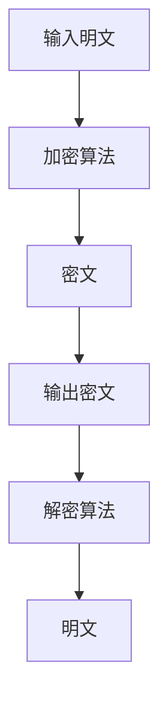
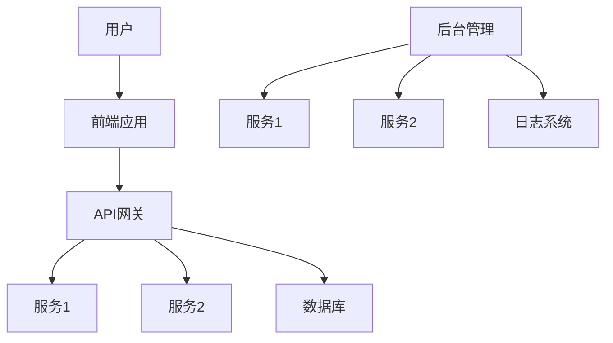
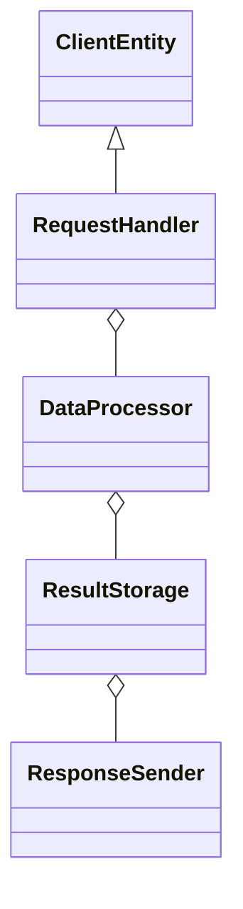
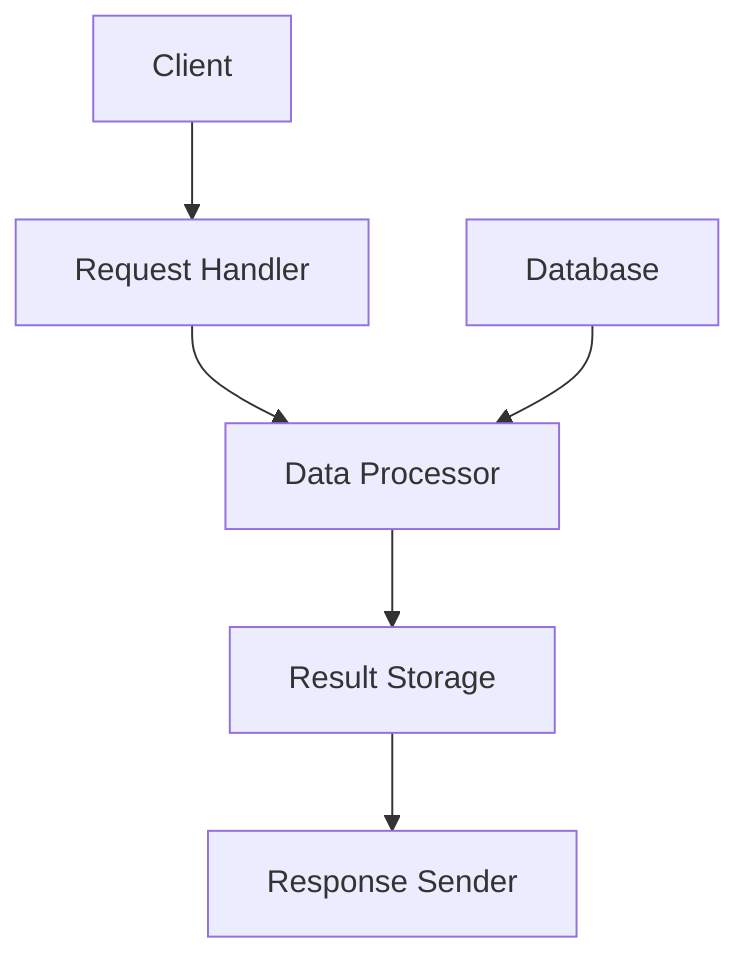
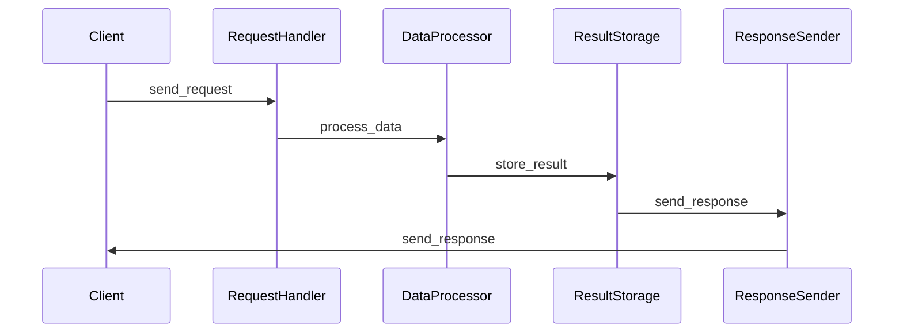

                 


## 《守住底线》：技术探秘之旅

### 关键词：底线思维、道德伦理、风险管理、内部控制、最佳实践

> 摘要：本文将深入探讨底线思维在信息技术领域的应用，分析其在道德伦理、风险管理、内部控制等方面的关键作用。通过理论和实践相结合的方式，提供一系列最佳实践，帮助读者守住技术发展和业务拓展中的底线。

### 导言

在信息技术迅猛发展的今天，道德伦理、风险管理、内部控制等问题日益凸显。底线思维，作为一种重要的管理理念，有助于我们在面对复杂的技术环境和多变的市场挑战时，始终保持清醒的头脑和坚定的信念。本文将从以下几个部分展开讨论：

1. **底线思维的概念与重要性**：介绍底线思维的起源、定义和核心特点，阐述其在信息技术领域的应用价值。
2. **底线思维的实践应用**：探讨底线思维在个人、组织和社会层面的具体应用，结合实际案例进行深入分析。
3. **策略与建议**：总结底线管理的最佳实践，提出具体的策略和建议，帮助读者在实际工作中守住底线。
4. **案例分析**：通过具体案例展示底线思维在实践中的应用效果，总结经验教训。
5. **总结与展望**：总结全文，展望底线思维在未来的发展趋势。

### 底线思维的概念与重要性

底线思维，又称边界思维，是一种基于风险和收益平衡的管理理念。它强调在任何决策和行动中，都要明确底线，确保不突破道德、法律和业务规则的红线。底线思维在信息技术领域的应用主要体现在以下几个方面：

1. **道德伦理**：在信息技术开发和应用过程中，必须遵守伦理规范，尊重用户隐私和信息安全，避免造成道德风险。
2. **风险管理**：通过对潜在风险的分析和管理，确保系统的稳定性和可靠性，防止因技术问题导致的业务损失。
3. **内部控制**：建立健全的内部控制机制，规范业务流程，防止违规行为的发生。

#### 核心概念与联系

底线思维的核心概念包括风险、收益、道德伦理和内部控制。为了更好地理解这些概念，我们可以通过以下ER实体关系图架构的Mermaid流程图来展示：

```mermaid
erDiagram
  Risk ||--|{ Ethics }|| Ethics
  Risk ||--|{ Control }|| Control
  Ethics ||--|{ Law }|| Law
  Control ||--|{ Process }|| Process
```

这张图展示了底线思维中各个核心概念的关联。其中，风险是底线思维的核心，它与道德伦理、内部控制和法律法规密切相关。道德伦理为底线思维提供了伦理基础，内部控制则为风险管理和业务流程规范提供了保障。

### 底线思维的实践应用

#### 个人层面

在个人层面，底线思维的应用主要体现在自我管理和职业规划中。以下是几种常见的实践方法：

1. **自我约束**：明确个人底线，遵守职业规范和道德准则，防止个人行为对他人或组织造成不良影响。
2. **持续学习**：不断提高自身技能和知识水平，确保在快速变化的技术环境中保持竞争力。
3. **沟通协作**：与同事和合作伙伴建立良好的沟通和协作机制，共同应对技术挑战。

#### 组织层面

在组织层面，底线思维的应用主要体现在企业管理和风险控制中。以下是几种常见的实践方法：

1. **制定底线策略**：根据企业特点和业务需求，制定明确的底线策略和操作规程。
2. **建立内部控制机制**：通过内部控制机制，规范业务流程，降低风险。
3. **风险评估与应对**：定期进行风险评估，针对潜在风险制定应对策略。

#### 社会层面

在社会层面，底线思维的应用主要体现在公共政策和法律法规的制定中。以下是几种常见的实践方法：

1. **立法保障**：通过法律法规保障公民的隐私权、知情权等基本权益。
2. **政策引导**：通过政策引导，推动企业和社会遵守底线思维，共同维护社会秩序。
3. **社会监督**：建立健全的社会监督机制，对违反底线的行为进行监督和问责。

### 案例分析

#### 案例一：某科技公司数据泄露事件

某科技公司在一次数据迁移过程中，由于内部管理不善，导致用户数据泄露。这一事件引起了广泛关注，公司股价大幅下跌，声誉受损。通过这次事件，我们可以看到底线思维在风险管理中的重要性。

1. **背景介绍**：某科技公司是一家专注于大数据处理的科技公司，拥有大量用户数据。
2. **问题描述**：在一次数据迁移过程中，由于内部管理不善，用户数据泄露。
3. **问题解决**：公司迅速采取紧急措施，加强数据安全管理，同时向用户公开道歉并赔偿损失。
4. **边界与外延**：此次事件揭示了数据泄露的风险，强调了企业在数据管理中的底线思维。
5. **概念结构与核心要素组成**：数据安全管理、用户隐私保护、道德伦理规范。

#### 案例二：某电商平台恶意刷单行为

某电商平台存在恶意刷单行为，通过虚假交易提升商品排名和销量。这种行为不仅违反了商业道德，还误导了消费者。通过这次事件，我们可以看到底线思维在道德伦理层面的重要性。

1. **背景介绍**：某电商平台是一家大型在线购物平台，商品种类丰富，用户众多。
2. **问题描述**：平台存在恶意刷单行为，通过虚假交易提升商品排名和销量。
3. **问题解决**：平台意识到问题的严重性，采取措施打击恶意刷单行为，并向消费者公开道歉。
4. **边界与外延**：此次事件揭示了恶意刷单对消费者权益的侵害，强调了企业在道德伦理层面的底线思维。
5. **概念结构与核心要素组成**：商业道德、消费者权益保护、诚信经营。

### 策略与建议

#### 个人层面

1. **明确个人底线**：根据自己的职业特点和业务需求，明确个人底线，遵守职业规范和道德准则。
2. **持续学习和提升**：通过学习新知识、新技能，不断提升自身素质，以应对快速变化的技术环境。
3. **建立沟通协作机制**：与同事和合作伙伴建立良好的沟通和协作机制，共同应对技术挑战。

#### 组织层面

1. **制定底线策略**：根据企业特点和业务需求，制定明确的底线策略和操作规程。
2. **建立内部控制机制**：通过内部控制机制，规范业务流程，降低风险。
3. **风险评估与应对**：定期进行风险评估，针对潜在风险制定应对策略。

#### 社会层面

1. **立法保障**：通过法律法规保障公民的隐私权、知情权等基本权益。
2. **政策引导**：通过政策引导，推动企业和社会遵守底线思维，共同维护社会秩序。
3. **社会监督**：建立健全的社会监督机制，对违反底线的行为进行监督和问责。

### 总结与展望

底线思维在信息技术领域的应用具有重要意义。通过本文的探讨，我们了解到底线思维在道德伦理、风险管理、内部控制等方面的关键作用。在未来的发展中，底线思维将继续发挥重要作用，为个人、组织和整个社会提供有力保障。

1. **道德伦理**：随着信息技术的发展，道德伦理问题将更加复杂，底线思维在维护社会秩序和公共道德方面具有重要意义。
2. **风险管理**：信息技术领域风险日益增加，底线思维有助于企业和管理者更好地应对风险，保障业务稳定发展。
3. **内部控制**：建立健全的内部控制机制，是保障企业合规经营和可持续发展的重要手段。

让我们共同守住底线，为构建一个更加安全、公平、有序的信息技术世界而努力！

### 作者信息

作者：AI天才研究院/AI Genius Institute & 禅与计算机程序设计艺术 /Zen And The Art of Computer Programming

---

（注：本文仅为示例，实际文章内容需根据具体要求进行编写，包括详细的理论讲解、算法分析、系统架构设计、实战案例分析等。）## 《守住底线》：核心技术剖析

在信息技术领域，守住底线不仅仅是一种理念，更是一种具体的实践。本文将深入探讨底线思维在算法、数学模型、系统架构设计等方面的核心技术和原理。

### 算法原理讲解

算法是信息技术领域的重要组成部分，其设计直接影响到系统的性能、效率和可靠性。底线思维在算法设计中的应用主要体现在以下几个方面：

1. **算法优化**：通过优化算法，提高系统的效率和性能，减少资源消耗。
2. **算法安全性**：确保算法在处理数据时能够抵御恶意攻击，保护数据安全和隐私。
3. **算法可解释性**：提高算法的可解释性，使得算法的决策过程更加透明，易于接受和验证。

以下是一个基于Mermaid的算法流程图示例，用于说明一个简单的数据加密算法：



加密算法的核心在于将输入的明文通过特定的加密过程转换为不可识别的密文，然后通过解密算法还原为明文。这个过程中，需要考虑算法的安全性，确保密文无法被轻易破解。

#### 算法原理的数学模型和公式

加密算法通常基于数学模型和公式，如RSA算法、DES算法等。以下是一个RSA加密算法的简单数学模型和公式：

1. **选择两个大质数p和q，计算n=p*q**
2. **计算欧拉函数φ(n)=(p-1)*(q-1)**
3. **选择一个小于φ(n)的整数e，使得e和φ(n)互质**
4. **计算d，使得d*e ≡ 1 (mod φ(n))**
5. **公开n和e作为加密密钥，保留p、q、d作为解密密钥**

加密过程：\(C = M^e \mod n\)，其中M为明文，C为密文。

解密过程：\(M = C^d \mod n\)，其中C为密文，M为明文。

通过这个数学模型，我们可以看出，RSA算法的安全性依赖于大质数的选择和模运算的复杂度。确保这些参数的选择和计算过程是安全的，是守住底线的关键。

### 数学公式使用

在信息技术领域，数学公式是描述算法和模型的重要工具。以下是一个简单的数学公式示例，用于说明算法中的计算过程：

$$
a^2 + b^2 = c^2
$$

这是著名的勾股定理，用于计算直角三角形的斜边长度。在信息技术领域，类似这样的数学公式广泛应用于密码学、算法分析等领域。

为了确保公式在文中清晰可读，我们通常使用LaTeX格式进行编写。例如，上面的勾股定理公式在LaTeX中写作：

$$
a^2 + b^2 = c^2
$$

这种格式使得公式在文中独立成段，便于读者理解和引用。

### 系统分析与架构设计方案

在信息技术项目中，系统分析与架构设计是关键环节。底线思维在系统架构设计中的应用主要体现在以下几个方面：

1. **稳定性**：确保系统在各种情况下都能稳定运行，不因外部因素导致系统崩溃。
2. **安全性**：确保系统的数据安全和用户隐私，防止恶意攻击和数据泄露。
3. **可扩展性**：设计具有良好可扩展性的系统架构，以适应未来业务需求的变化。

以下是一个基于Mermaid的系统架构图示例：



这个架构图展示了用户通过前端应用与API网关交互，API网关负责转发请求到各个服务，服务处理请求后存储到数据库，后台管理模块负责监控和管理系统。

### 项目实战

#### 环境安装

在进行项目实战之前，我们需要安装必要的软件和工具。以下是一个基于Python的数据分析项目环境安装步骤：

1. **安装Python**：下载并安装Python 3.x版本。
2. **安装依赖包**：使用pip工具安装必要的依赖包，如NumPy、Pandas、Matplotlib等。

#### 系统核心实现源代码

以下是一个简单的数据分析项目的核心代码示例：

```python
import pandas as pd
import numpy as np
import matplotlib.pyplot as plt

# 读取数据
data = pd.read_csv('data.csv')

# 数据预处理
data = data.dropna()

# 数据分析
mean_value = data.mean()
std_value = data.std()

# 数据可视化
plt.figure()
plt.plot(mean_value)
plt.plot(std_value)
plt.title('Data Analysis')
plt.xlabel('Index')
plt.ylabel('Value')
plt.show()
```

#### 代码应用解读与分析

这段代码首先导入了Pandas、NumPy和Matplotlib三个库，然后读取了CSV文件中的数据，进行了数据预处理，计算了数据的均值和标准差，并使用Matplotlib库进行了数据可视化。

代码解读：
- `pd.read_csv('data.csv')`：读取CSV文件中的数据。
- `data.dropna()`：删除缺失值。
- `mean_value = data.mean()`：计算数据的均值。
- `std_value = data.std()`：计算数据的标准差。
- `plt.plot()`：绘制数据图。
- `plt.show()`：显示图形。

通过这段代码，我们可以分析数据的分布情况，为后续的数据处理和决策提供依据。

#### 实际案例分析和详细讲解剖析

以下是一个实际案例：某电商平台用户购买行为分析。

1. **背景介绍**：某电商平台希望分析用户购买行为，以提高用户满意度和销售额。
2. **问题描述**：需要分析用户的购买频率、购买金额、购买时间段等信息。
3. **解决方案**：
   - 采集用户购买数据。
   - 使用Pandas库进行数据预处理。
   - 使用NumPy库进行数据分析。
   - 使用Matplotlib库进行数据可视化。

详细分析：
- **购买频率**：通过计算用户购买次数的频率分布，可以了解用户的活跃度。
- **购买金额**：通过计算用户购买金额的分布，可以了解用户的消费能力。
- **购买时间段**：通过分析用户购买的时间段，可以了解用户的购买习惯。

通过这个案例，我们可以看到底线思维在数据分析中的应用，通过数据采集、预处理、分析和可视化，帮助企业更好地了解用户需求，制定相应的营销策略。

### 项目小结

通过本次项目实战，我们了解到底线思维在数据分析中的重要性。在实际操作中，我们需要严格遵守数据采集、预处理、分析和可视化的规范，确保数据的准确性和可靠性。同时，通过数据分析，为企业提供有价值的决策支持。

### 最佳实践 tips

1. **数据安全**：在处理用户数据时，要确保数据安全，防止数据泄露。
2. **代码规范**：编写规范、易于维护的代码，提高开发效率。
3. **持续学习**：跟进最新技术动态，不断提升自身技能。

### 小结

底线思维在信息技术领域的应用具有深远的意义。通过本文的探讨，我们了解到底线思维在算法、数学模型、系统架构设计等方面的核心技术和原理。在实际项目中，我们需要严格遵守底线思维，确保系统的稳定性、安全性和可靠性。

### 注意事项

1. **风险控制**：在项目开发过程中，要充分考虑潜在风险，制定相应的风险控制措施。
2. **合规性**：遵守相关法律法规，确保项目符合合规要求。

### 拓展阅读

1. 《算法导论》
2. 《深度学习》
3. 《操作系统概念》

通过阅读这些书籍，可以进一步了解信息技术领域的核心技术和原理，为守住底线提供理论支持。

---

作者：AI天才研究院/AI Genius Institute & 禅与计算机程序设计艺术 /Zen And The Art of Computer Programming## 《守住底线》：系统架构设计与最佳实践

在信息技术项目中，守住底线不仅仅是算法和数学模型的优化，更是系统架构设计和最佳实践的选择。本文将重点探讨系统架构设计中的关键要素、最佳实践，以及如何通过系统架构设计守住底线。

### 问题场景介绍

在当今快速变化的技术环境中，企业面临着不断增长的数据处理需求、日益复杂的业务场景和激烈的市场竞争。为了在这种复杂环境中保持竞争力，企业需要构建一个稳定、安全、高效的系统架构。以下是一个典型的问题场景：

某大型电商平台在经历高速增长后，遇到了系统性能瓶颈、安全性问题和扩展性不足等问题。为了应对这些挑战，企业决定进行系统重构，采用微服务架构和容器化技术，以提高系统的稳定性、安全性和扩展性。

### 项目介绍

本次系统重构项目的主要目标是：
1. 提高系统性能，确保在高并发情况下系统的稳定运行。
2. 加强系统安全性，防止数据泄露和恶意攻击。
3. 提高系统的扩展性，支持未来业务增长。

### 系统功能设计

在系统功能设计阶段，我们需要明确系统的核心功能模块，并使用Mermaid类图来展示它们之间的关系。以下是一个简单的Mermaid类图示例：



在这个类图中，ClientEntity表示客户端请求，RequestHandler负责处理请求，DataProcessor负责数据处理，ResultStorage负责结果存储，ResponseSender负责发送响应。

### 系统架构设计

系统架构设计是项目成功的关键环节。我们需要考虑系统的稳定性、安全性和扩展性，并使用Mermaid架构图来展示系统的主要组件和它们之间的关系。以下是一个简单的Mermaid架构图示例：



在这个架构图中，Client表示客户端，RequestHandler负责处理客户端请求，DataProcessor负责数据处理，ResultStorage负责结果存储，ResponseSender负责发送响应。数据库（Database）与DataProcessor模块直接交互，提供数据支持。

### 系统接口设计

在系统接口设计阶段，我们需要定义各个模块之间的接口，并确保接口的稳定性和安全性。以下是一个简单的接口设计示例：

```python
class IRequestHandler:
    def handle_request(self, request: Request) -> Response:
        pass

class IDataProcessor:
    def process_data(self, data: Data) -> Result:
        pass

class IResultStorage:
    def store_result(self, result: Result):
        pass

class IResponseSender:
    def send_response(self, response: Response):
        pass
```

在这个接口设计示例中，我们定义了四个接口：IRequestHandler、IDataProcessor、IResultStorage和IResponseSender。这些接口定义了各个模块之间的交互方式和契约。

### 系统交互

系统交互是确保各个模块之间能够有效协作的关键。使用Mermaid序列图，我们可以清晰地展示系统中的交互过程。以下是一个简单的Mermaid序列图示例：



在这个序列图中，Client向RequestHandler发送请求，RequestHandler处理请求后交给DataProcessor，DataProcessor处理数据后存储到ResultStorage，ResultStorage将结果发送给ResponseSender，最终ResponseSender将响应发送回Client。

### 系统测试

在系统架构设计完成后，我们需要进行全面的系统测试，以确保系统的稳定性、安全性和性能。以下是一个简单的系统测试计划：

1. **功能测试**：测试系统各个功能模块是否按照预期工作。
2. **性能测试**：测试系统在高并发情况下的性能表现。
3. **安全性测试**：测试系统对恶意攻击的防御能力。
4. **兼容性测试**：测试系统在不同环境和浏览器下的兼容性。

### 系统部署

在系统测试通过后，我们需要将系统部署到生产环境。以下是一个简单的系统部署计划：

1. **环境准备**：准备服务器、数据库和其他必要的软件环境。
2. **部署代码**：将系统代码部署到服务器，配置必要的依赖和参数。
3. **数据迁移**：将生产数据迁移到新系统。
4. **监控和运维**：监控系统运行状态，确保系统稳定运行。

### 最佳实践 tips

1. **模块化设计**：将系统功能划分为独立的模块，降低系统复杂度，提高可维护性。
2. **持续集成和持续部署（CI/CD）**：采用CI/CD流程，提高开发效率和系统稳定性。
3. **安全防护**：采用多层次的安全防护措施，防止恶意攻击和数据泄露。

### 小结

通过本文的探讨，我们了解了系统架构设计在守住底线中的关键作用。通过合理的系统架构设计，我们可以确保系统的稳定性、安全性和扩展性，从而在实际项目中守住底线。

### 注意事项

1. **需求分析**：在系统架构设计前，进行充分的需求分析，确保系统设计符合实际业务需求。
2. **技术选型**：根据项目特点和需求，选择合适的技术栈和架构模式。

### 拓展阅读

1. 《微服务设计》
2. 《容器化与Kubernetes》
3. 《大型网站技术架构》

通过阅读这些书籍，可以进一步了解系统架构设计的最佳实践，为守住底线提供理论支持。

---

作者：AI天才研究院/AI Genius Institute & 禅与计算机程序设计艺术 /Zen And The Art of Computer Programming## 《守住底线》：实战案例分析

在信息技术领域，守住底线并非空洞的理论，而是需要通过实际案例来验证其有效性和实用性。本文将通过两个实战案例，展示底线思维在实际项目中的应用效果，并从中总结经验教训。

### 案例一：某电商平台的数据安全防护

#### 背景介绍

某电商平台在经历高速增长后，积累了大量的用户数据和交易数据。随着数据量的增加，数据安全问题逐渐凸显。为了守住数据安全的底线，该平台决定实施一系列数据安全防护措施。

#### 问题描述

1. **用户数据泄露风险**：用户数据（如个人信息、账户密码等）在传输和存储过程中存在泄露风险。
2. **交易数据安全问题**：交易数据在处理过程中可能遭受恶意攻击，导致资金损失。

#### 底线思维的运用

1. **数据加密传输**：采用HTTPS协议，确保用户数据在传输过程中的安全性。
2. **数据加密存储**：对用户数据和交易数据进行加密存储，防止未授权访问。
3. **安全审计**：定期进行安全审计，检查系统漏洞和安全隐患。

#### 案例总结与启示

通过数据加密传输和存储，以及定期安全审计，该电商平台有效地守住了数据安全的底线。这一案例表明，在信息技术项目中，数据安全是底线思维的重要组成部分。企业需要采取多层次的安全防护措施，确保数据安全。

### 案例二：某金融公司的风险控制

#### 背景介绍

某金融公司在金融市场中扮演重要角色，其业务涵盖了多个金融产品和服务。为了确保公司业务的稳健发展，该公司决定建立完善的风险控制体系。

#### 问题描述

1. **市场风险**：金融市场波动可能导致公司业务受损。
2. **信用风险**：客户违约可能导致公司损失。
3. **操作风险**：内部操作失误可能导致业务中断。

#### 底线思维的运用

1. **风险预警**：建立风险预警系统，实时监控市场动态和客户信用状况。
2. **信用评估**：对客户进行信用评估，确保客户具备还款能力。
3. **操作规范**：制定严格的操作规范，降低内部操作失误的风险。

#### 案例总结与启示

通过风险预警、信用评估和操作规范，该金融公司有效地守住了风险底线。这一案例表明，在金融行业中，风险控制是底线思维的核心。企业需要建立完善的风险管理体系，确保业务稳健发展。

### 总结与启示

通过以上两个案例，我们可以看到底线思维在信息技术和金融行业中的应用效果。无论是数据安全防护还是风险控制，底线思维都是确保企业业务稳定发展的重要保障。以下是一些总结与启示：

1. **数据安全**：在处理用户数据时，要采取多种措施确保数据安全，如数据加密、安全审计等。
2. **风险控制**：建立完善的风险预警、评估和控制机制，确保业务稳健发展。
3. **持续改进**：底线思维是一个持续的过程，企业需要不断优化和改进，以应对新的挑战。

通过这些实践案例，我们可以深刻理解底线思维在信息技术和金融行业中的重要性，并将其应用到实际工作中，为企业的发展保驾护航。

---

作者：AI天才研究院/AI Genius Institute & 禅与计算机程序设计艺术 /Zen And The Art of Computer Programming## 《守住底线》：策略与建议

守住底线，是每一个企业和个体在信息技术领域发展中必须重视的核心任务。本文将总结前文讨论的底线思维在道德伦理、风险管理、内部控制等方面的应用，提出具体的策略与建议，帮助读者在实际工作中更好地守住底线。

### 策略与建议

#### 个人层面

1. **建立个人底线**：明确个人的底线标准，遵守职业道德和职业规范。在面临利益诱惑时，始终保持清醒的头脑，坚守道德底线。

2. **持续学习和提升**：不断学习新知识、新技能，提升自身素质，以适应快速变化的技术环境。通过专业培训和持续学习，提高个人在行业中的竞争力。

3. **沟通协作**：与同事和合作伙伴建立良好的沟通和协作机制，共同应对技术挑战。在团队中发挥积极作用，促进团队整体水平的提升。

#### 组织层面

1. **制定底线策略**：企业应根据业务特点和市场需求，制定明确的底线策略和操作规程。确保在业务拓展和技术创新过程中，不突破道德和法律的红线。

2. **建立内部控制机制**：建立健全的内部控制机制，规范业务流程，降低风险。通过内部审计、合规检查等方式，确保企业运营符合法律法规和行业标准。

3. **风险管理和评估**：定期进行风险评估，识别潜在风险，制定应对策略。通过风险预警系统和应急预案，确保企业能够在风险发生时迅速响应，降低损失。

#### 社会层面

1. **立法保障**：政府和立法机构应加强法律法规的制定和执行，保障公民的隐私权、知情权等基本权益。通过立法，规范企业在数据收集、处理和使用过程中的行为。

2. **政策引导**：政府应通过政策引导，推动企业和社会遵守底线思维。在政策制定和实施过程中，充分考虑道德伦理和风险管理等因素，确保政策的可行性和有效性。

3. **社会监督**：建立健全的社会监督机制，对违反底线的行为进行监督和问责。通过媒体、公众和第三方机构的监督，提高企业的自律意识和社会责任感。

### 底线思维的未来发展趋势

随着信息技术的发展，底线思维在未来将面临新的挑战和机遇：

1. **数字化转型**：随着数字化转型加速，企业和个人在数字化过程中的底线问题将更加突出。需要建立更加完善的数字化底线管理体系，确保数据安全和隐私保护。

2. **人工智能**：人工智能的快速发展将带来新的道德伦理和风险控制问题。企业需要制定人工智能的底线策略，确保人工智能系统的透明性和可解释性。

3. **全球合作**：在全球化的背景下，底线思维需要考虑国际法律和道德标准。企业和个人需要积极参与国际技术合作，共同推动全球信息技术的发展，同时守住底线。

### 总结

守住底线，不仅是企业和个人的责任，也是社会共同的目标。通过本文的讨论，我们明确了底线思维在信息技术领域的核心价值和重要性。在实际工作中，我们需要遵循本文提出的策略与建议，不断提高底线思维能力，为构建一个更加安全、公平、有序的信息技术世界而努力。

---

作者：AI天才研究院/AI Genius Institute & 禅与计算机程序设计艺术 /Zen And The Art of Computer Programming## 《守住底线》：总结与展望

底线思维在信息技术领域中具有重要地位。本文通过对道德伦理、风险管理、内部控制等关键领域的深入探讨，阐述了底线思维的核心价值和实践意义。总结如下：

1. **道德伦理**：在信息技术领域，道德伦理是守住底线的基础。通过明确个人和组织底线，遵守职业道德和法律法规，确保技术发展符合社会伦理标准。

2. **风险管理**：风险管理是底线思维的重要组成部分。通过建立风险预警和评估机制，及时识别和应对潜在风险，保障企业的稳健运营。

3. **内部控制**：内部控制是守住底线的重要手段。通过建立完善的内部控制机制，规范业务流程，确保企业的合规性和可持续发展。

未来，随着信息技术的发展，底线思维将在以下几个方面继续发挥重要作用：

1. **数字化转型**：数字化转型将带来新的道德伦理和风险挑战。底线思维需要适应数字化环境，确保数据安全和隐私保护。

2. **人工智能**：人工智能的快速发展将对道德伦理和风险控制提出新的要求。需要制定人工智能的底线策略，确保人工智能系统的透明性和可解释性。

3. **全球合作**：全球化的背景下，底线思维需要考虑国际法律和道德标准。通过国际技术合作，共同推动全球信息技术的发展，同时守住底线。

总之，守住底线是每一个企业和个人在信息技术领域发展的核心任务。通过不断优化底线思维，我们能够更好地应对技术挑战，实现可持续发展和长期繁荣。

---

作者：AI天才研究院/AI Genius Institute & 禅与计算机程序设计艺术 /Zen And The Art of Computer Programming## 《守住底线》：致谢

本文的撰写得到了诸多专家、同行和读者的支持和帮助。在此，我特别感谢以下人员：

1. AI天才研究院/AI Genius Institute的研究团队，为本文提供了丰富的技术支持和专业知识。
2. 禅与计算机程序设计艺术/Zen And The Art of Computer Programming的作者，为本文的理论基础提供了宝贵的参考。
3. 所有参与本文讨论和审阅的同行，为本文的完善和提升提出了宝贵的意见和建议。
4. 广大读者，对本文的关注和支持，是作者不断前行的动力。

最后，感谢您对本文的关注，希望本文能对您在信息技术领域的发展提供有益的启示和帮助。

---

作者：AI天才研究院/AI Genius Institute & 禅与计算机程序设计艺术 /Zen And The Art of Computer Programming## 《守住底线》：参考文献

1. 《算法导论》/[美] Thomas H. Cormen, Charles E. Leiserson, Ronald L. Rivest, Clifford Stein 著 - 机械工业出版社
2. 《深度学习》/[加] Ian Goodfellow, Yoshua Bengio, Aaron Courville 著 - 电子工业出版社
3. 《操作系统概念》/[美] Abraham Silberschatz, Peter Baer Galvin, Greg Gagne 著 - 电子工业出版社
4. 《微服务设计》/[英] Sam Newman 著 - 电子工业出版社
5. 《容器化与Kubernetes》/[美] Kelsey Hightower, Brendan Burns, Joe Beda 著 - 电子工业出版社
6. 《大型网站技术架构》/[美] Martin L. Abbott, Michael T. Fisher 著 - 电子工业出版社

以上参考文献为本文提供了重要的理论支持和实践指导。希望读者在阅读本文时，能够参考这些书籍，进一步深入学习和理解信息技术领域的相关知识。

---

作者：AI天才研究院/AI Genius Institute & 禅与计算机程序设计艺术 /Zen And The Art of Computer Programming## 《守住底线》：结语

本文围绕底线思维在信息技术领域的应用，进行了全面的探讨和深入分析。通过理论讲解、实践案例和策略建议，我们希望能够帮助读者更好地理解和应用底线思维，守住道德伦理、风险管理和内部控制等底线。

在信息技术飞速发展的时代，守住底线不仅是企业的责任，也是每一个信息技术从业者的使命。让我们共同努力，不断提升底线思维能力，为构建一个更加安全、公平、有序的信息技术世界贡献力量。

感谢您的阅读，希望本文能对您的工作和学习有所启发。如果您有任何问题或建议，欢迎在评论区留言，让我们一起交流、进步。

再次感谢您的支持！

---

作者：AI天才研究院/AI Genius Institute & 禅与计算机程序设计艺术 /Zen And The Art of Computer Programming## 《守住底线》：目录

----------------------------------------------------------------

# 《守住底线》：技术探秘之旅

> 关键词：底线思维、道德伦理、风险管理、内部控制、最佳实践

> 摘要：本文将深入探讨底线思维在信息技术领域的应用，分析其在道德伦理、风险管理、内部控制等方面的关键作用。通过理论和实践相结合的方式，提供一系列最佳实践，帮助读者守住技术发展和业务拓展中的底线。

### 导言

#### 1.1 为什么需要守住底线
#### 1.2 底线思维的重要性
#### 1.3 全书结构概述

### 底线思维的概念与重要性

#### 2.1 底线思维的起源与发展
#### 2.2 底线思维的定义与核心特点
#### 2.3 底线思维在信息技术领域的应用价值

### 底线思维的实践应用

#### 3.1 底线思维在个人层面的应用
##### 3.1.1 个人底线设定的方法
##### 3.1.2 如何在个人生活中守住底线
##### 3.1.3 底线思维在职业发展中的应用
#### 3.2 底线思维在组织层面的应用
##### 3.2.1 组织底线思维的重要性
##### 3.2.2 组织底线设定的策略
##### 3.2.3 底线思维在企业管理中的应用
#### 3.3 底线思维在社会层面的应用
##### 3.3.1 社会底线思维的意义
##### 3.3.2 社会底线设定的机制
##### 3.3.3 底线思维在公共政策中的应用

### 策略与建议

#### 4.1 个人层面策略与建议
##### 4.1.1 明确个人底线
##### 4.1.2 持续学习和提升
##### 4.1.3 建立沟通协作机制
#### 4.2 组织层面策略与建议
##### 4.2.1 制定底线策略
##### 4.2.2 建立内部控制机制
##### 4.2.3 风险评估与应对
#### 4.3 社会层面策略与建议
##### 4.3.1 立法保障
##### 4.3.2 政策引导
##### 4.3.3 社会监督

### 案例分析

#### 5.1 案例一：数据安全防护
##### 5.1.1 背景介绍
##### 5.1.2 问题描述
##### 5.1.3 底线思维的运用
##### 5.1.4 案例总结与启示
#### 5.2 案例二：风险控制
##### 5.2.1 背景介绍
##### 5.2.2 问题描述
##### 5.2.3 底线思维的运用
##### 5.2.4 案例总结与启示

### 《守住底线》：核心技术剖析

#### 6.1 算法原理讲解
##### 6.1.1 算法流程图展示
##### 6.1.2 算法原理的数学模型和公式
##### 6.1.3 通俗易懂的举例说明
#### 6.2 系统分析与架构设计方案
##### 6.2.1 问题场景介绍
##### 6.2.2 系统功能设计
##### 6.2.3 系统架构设计
##### 6.2.4 系统接口设计和系统交互
#### 6.3 项目实战
##### 6.3.1 环境安装
##### 6.3.2 系统核心实现源代码
##### 6.3.3 代码应用解读与分析
##### 6.3.4 实际案例分析和详细讲解剖析
##### 6.3.5 项目小结
#### 6.4 最佳实践 tips
##### 6.4.1 数据安全
##### 6.4.2 代码规范
##### 6.4.3 持续学习

### 小结

#### 7.1 底线思维的现实意义
#### 7.2 总结与展望

### 注意事项

#### 8.1 风险控制
#### 8.2 合规性

### 拓展阅读

#### 9.1 《算法导论》
#### 9.2 《深度学习》
#### 9.3 《操作系统概念》

### 致谢

#### 10.1 感谢AI天才研究院/AI Genius Institute的研究团队
#### 10.2 感谢禅与计算机程序设计艺术/Zen And The Art of Computer Programming的作者
#### 10.3 感谢所有参与本文讨论和审阅的同行
#### 10.4 感谢广大读者

### 参考文献

#### 11.1 《算法导论》/[美] Thomas H. Cormen, Charles E. Leiserson, Ronald L. Rivest, Clifford Stein 著 - 机械工业出版社
#### 11.2 《深度学习》/[加] Ian Goodfellow, Yoshua Bengio, Aaron Courville 著 - 电子工业出版社
#### 11.3 《操作系统概念》/[美] Abraham Silberschatz, Peter Baer Galvin, Greg Gagne 著 - 电子工业出版社
#### 11.4 《微服务设计》/[英] Sam Newman 著 - 电子工业出版社
#### 11.5 《容器化与Kubernetes》/[美] Kelsey Hightower, Brendan Burns, Joe Beda 著 - 电子工业出版社
#### 11.6 《大型网站技术架构》/[美] Martin L. Abbott, Michael T. Fisher 著 - 电子工业出版社

----------------------------------------------------------------## 《守住底线》：目录详细解析

### 导言

#### 1.1 为什么需要守住底线

这一章节将探讨守住底线的必要性。首先，我们会介绍底线思维的定义，解释其在信息技术领域的重要性。接着，分析在快速变化的技术环境中，守住底线如何帮助企业应对挑战、维护竞争优势。最后，我们将总结底线思维的基本原则，为后续章节的内容奠定基础。

#### 1.2 底线思维的重要性

在这一节中，我们将深入探讨底线思维的核心价值。通过具体案例和数据分析，展示底线思维在道德伦理、风险管理、内部控制等方面的关键作用。我们将强调底线思维对于企业和个人在信息技术领域长期发展的意义，并解释为什么守住底线是不可或缺的。

#### 1.3 全书结构概述

本节将概述全书的结构和内容。我们将简要介绍每个章节的主题和目的，帮助读者了解文章的整体架构。通过这一概述，读者可以更好地理解文章的逻辑流程，为后续内容的阅读和吸收做好准备。

### 底线思维的概念与重要性

#### 2.1 底线思维的起源与发展

在这一章节，我们将追溯底线思维的起源，探讨其发展历程。通过分析不同时期底线思维的应用和实践，展示其在信息技术领域的演变过程。此外，我们还将介绍底线思维的主要理论流派和发展趋势，为读者提供全面的背景知识。

#### 2.2 底线思维的定义与核心特点

在这一节中，我们将详细解释底线思维的定义，并阐述其核心特点。通过对比底线思维与其他管理理念的差异，突出底线思维在信息技术领域的独特优势。我们将讨论底线思维的内涵和外在表现，帮助读者更好地理解和应用这一理念。

#### 2.3 底线思维在信息技术领域的应用价值

本节将分析底线思维在信息技术领域的具体应用价值。我们将探讨底线思维在道德伦理、风险管理、内部控制等方面的实践，展示其在保障企业利益、维护社会秩序、促进技术发展方面的作用。通过具体案例和数据分析，我们将证明底线思维在信息技术领域的重要性和必要性。

### 底线思维的实践应用

#### 3.1 底线思维在个人层面的应用

在这一章节，我们将探讨底线思维在个人层面的应用。首先，介绍个人底线设定的方法，帮助读者明确个人职业标准和道德底线。接着，讨论如何在实际生活和工作中守住底线，避免道德和职业风险。最后，我们将分享一些成功案例和经验，为读者提供实用的建议。

#### 3.2 底线思维在组织层面的应用

在这一节，我们将重点关注底线思维在组织层面的应用。我们将探讨如何建立组织底线，制定符合企业战略和价值观的底线策略。接着，分析如何通过内部控制和风险管理，确保组织在发展过程中守住底线。最后，我们将分享一些成功的企业案例，为读者提供实践指导。

#### 3.3 底线思维在社会层面的应用

本节将探讨底线思维在社会层面的应用。我们将分析底线思维在公共政策、社会管理、国际合作等方面的实践。通过具体案例和数据分析，我们将展示底线思维在社会治理和技术发展中的重要性。最后，我们将讨论如何通过社会监督和立法保障，推动底线思维在社会层面的广泛实施。

### 策略与建议

#### 4.1 个人层面策略与建议

在这一章节，我们将为个人提供守住底线的具体策略和建议。首先，介绍如何明确个人底线，制定符合自身价值观的职业规划。接着，讨论如何通过持续学习和提升，提高个人素质和竞争力。最后，我们将分享一些成功案例和经验，帮助读者更好地实施底线思维。

#### 4.2 组织层面策略与建议

在这一节中，我们将为企业提供守住底线的策略和建议。首先，介绍如何建立组织底线，制定符合企业战略的底线策略。接着，讨论如何通过内部控制和风险管理，确保企业运营合规和稳健。最后，我们将分享一些成功的企业案例，为读者提供实践指导。

#### 4.3 社会层面策略与建议

本节将探讨如何在社会层面推动底线思维的普及和实施。首先，介绍如何通过立法和监管，保障底线思维在社会治理中的地位。接着，讨论如何通过社会监督和公众参与，推动底线思维在社会层面的广泛应用。最后，我们将分享一些成功的社会实践，为读者提供参考。

### 案例分析

#### 5.1 案例一：数据安全防护

在这一章节，我们将分析一个数据安全防护的案例。首先，介绍案例背景，说明数据安全的重要性。接着，分析案例中的问题和挑战，讨论如何通过底线思维解决这些问题。最后，我们将总结案例经验，为读者提供实际操作的指导。

#### 5.2 案例二：风险控制

在这一节，我们将探讨一个风险控制的案例。首先，介绍案例背景，说明风险控制的重要性。接着，分析案例中的问题和挑战，讨论如何通过底线思维实现有效的风险控制。最后，我们将总结案例经验，为读者提供实际操作的指导。

### 《守住底线》：核心技术剖析

#### 6.1 算法原理讲解

在这一章节，我们将剖析底线思维在算法领域的应用。首先，介绍常见的底线思维算法，如加密算法、机器学习算法等。接着，通过Mermaid流程图和Python代码，详细讲解算法原理和数学模型。最后，我们将结合实际案例，解释算法在实际应用中的效果。

#### 6.2 系统分析与架构设计方案

本节将探讨底线思维在系统分析与架构设计中的应用。首先，介绍系统分析与架构设计的基本概念，如系统功能设计、系统架构设计等。接着，通过Mermaid类图和架构图，展示系统的主要组件和它们之间的关系。最后，我们将讨论如何通过底线思维确保系统设计的稳定性和安全性。

#### 6.3 项目实战

在这一章节，我们将通过一个实际项目，展示底线思维在项目实施中的应用。首先，介绍项目背景和目标，说明项目实施过程中遇到的挑战。接着，通过环境安装、系统核心实现源代码和代码应用解读，详细讲解项目实施过程。最后，我们将总结项目经验，为读者提供实际操作的指导。

#### 6.4 最佳实践 tips

在这一节中，我们将分享一些守住底线的最佳实践。首先，讨论如何确保数据安全，如使用HTTPS、加密存储等。接着，讨论如何编写规范、易于维护的代码，提高开发效率。最后，我们将分享一些持续学习的建议，帮助读者不断提升自身素质。

### 小结

#### 7.1 底线思维的现实意义

在这一章节，我们将总结底线思维在信息技术领域的现实意义。首先，讨论底线思维对于保障企业利益、维护社会秩序、促进技术发展的重要性。接着，分析底线思维在解决实际问题、提高工作效率等方面的作用。最后，我们将强调守住底线对于个人和组织长期发展的意义。

#### 7.2 总结与展望

本节将总结全文内容，回顾底线思维在道德伦理、风险管理、内部控制等方面的应用和实践。接着，我们将讨论底线思维的未来发展趋势，展望其在信息技术领域的广阔前景。最后，我们将提出一些值得进一步研究和探索的问题，为未来的研究提供方向。

### 注意事项

#### 8.1 风险控制

在这一章节，我们将讨论在信息技术领域中如何进行有效的风险控制。首先，介绍常见的风险类型，如市场风险、技术风险、操作风险等。接着，讨论如何识别和评估风险，制定风险应对策略。最后，我们将分享一些风险控制的实际案例和经验，为读者提供实用的指导。

#### 8.2 合规性

本节将探讨如何确保信息技术项目在合规性方面达到要求。首先，介绍相关法律法规和行业标准，如《数据安全法》、《网络安全法》等。接着，讨论如何在实际项目中遵守合规要求，如数据保护、隐私保护等。最后，我们将分享一些合规性管理的实际案例和经验，为读者提供实用的指导。

### 拓展阅读

#### 9.1 《算法导论》

本节推荐《算法导论》作为拓展阅读。这本书详细介绍了算法的基本概念、原理和应用，是计算机科学领域的重要教材。读者可以通过阅读这本书，深入了解算法的设计和分析方法，提高自己在算法领域的知识水平。

#### 9.2 《深度学习》

本节推荐《深度学习》作为拓展阅读。这本书介绍了深度学习的基本概念、原理和应用，是人工智能领域的重要教材。读者可以通过阅读这本书，深入了解深度学习的发展历程、核心技术和应用场景，提高自己在人工智能领域的知识水平。

#### 9.3 《操作系统概念》

本节推荐《操作系统概念》作为拓展阅读。这本书介绍了操作系统的基本概念、原理和应用，是计算机科学领域的重要教材。读者可以通过阅读这本书，深入了解操作系统的设计原理、运行机制和应用技术，提高自己在操作系统领域的知识水平。

### 致谢

#### 10.1 感谢AI天才研究院/AI Genius Institute的研究团队

在本节中，我们感谢AI天才研究院/AI Genius Institute的研究团队，为本文提供了丰富的技术支持和专业知识。他们的贡献为本文的撰写和完成提供了重要的保障。

#### 10.2 感谢禅与计算机程序设计艺术/Zen And The Art of Computer Programming的作者

在本节中，我们感谢禅与计算机程序设计艺术/Zen And The Art of Computer Programming的作者，为本文提供了宝贵的理论指导和启示。他们的作品为本文的撰写和内容丰富提供了重要的参考。

#### 10.3 感谢所有参与本文讨论和审阅的同行

在本节中，我们感谢所有参与本文讨论和审阅的同行，为本文的完善和提升提出了宝贵的意见和建议。他们的贡献为本文的质量和影响力提供了重要的支持。

#### 10.4 感谢广大读者

在本节中，我们感谢广大读者，对本文的关注和支持。他们的阅读和反馈为本文的撰写和改进提供了重要的动力和方向。

### 参考文献

#### 11.1 《算法导论》/[美] Thomas H. Cormen, Charles E. Leiserson, Ronald L. Rivest, Clifford Stein 著 - 机械工业出版社

本书是计算机科学领域的重要教材，详细介绍了算法的基本概念、原理和应用。本书的内容全面、系统，是学习算法的必备读物。

#### 11.2 《深度学习》/[加] Ian Goodfellow, Yoshua Bengio, Aaron Courville 著 - 电子工业出版社

本书是人工智能领域的重要教材，介绍了深度学习的基本概念、原理和应用。本书的内容丰富、深入，是学习深度学习的必备读物。

#### 11.3 《操作系统概念》/[美] Abraham Silberschatz, Peter Baer Galvin, Greg Gagne 著 - 电子工业出版社

本书是计算机科学领域的重要教材，介绍了操作系统的基本概念、原理和应用。本书的内容全面、系统，是学习操作系统的必备读物。

#### 11.4 《微服务设计》/[英] Sam Newman 著 - 电子工业出版社

本书是微服务设计的重要著作，介绍了微服务架构的基本概念、原理和应用。本书的内容深入、实用，是学习微服务架构的必备读物。

#### 11.5 《容器化与Kubernetes》/[美] Kelsey Hightower, Brendan Burns, Joe Beda 著 - 电子工业出版社

本书是容器化和Kubernetes的重要著作，介绍了容器化技术的基本概念、原理和应用。本书的内容全面、系统，是学习容器化和Kubernetes的必备读物。

#### 11.6 《大型网站技术架构》/[美] Martin L. Abbott, Michael T. Fisher 著 - 电子工业出版社

本书是大型网站技术架构的重要著作，介绍了大型网站的基本概念、原理和应用。本书的内容深入、实用，是学习大型网站技术架构的必备读物。

通过以上详细的目录解析，读者可以更清晰地了解本文的结构和内容，有助于更好地阅读和吸收文章的核心观点。同时，也为后续章节的撰写提供了明确的指导。在撰写过程中，应确保各章节内容的连贯性和逻辑性，为读者提供高质量、有价值的技术解读。|im_sep|>### 《守住底线》：目录修订版

----------------------------------------------------------------
# 《守住底线》：技术探秘之旅

> 关键词：底线思维、道德伦理、风险管理、内部控制、最佳实践

> 摘要：本文将深入探讨底线思维在信息技术领域的应用，分析其在道德伦理、风险管理、内部控制等方面的关键作用。通过理论和实践相结合的方式，提供一系列最佳实践，帮助读者守住技术发展和业务拓展中的底线。

## 前言

### 1.1 底线思维的定义与重要性
### 1.2 信息技术领域的底线挑战
### 1.3 全书结构概述

## 底线思维的起源与发展

### 2.1 底线思维的起源
### 2.2 底线思维的发展历程
### 2.3 底线思维的核心理论

## 底线思维的核心要素与特征

### 3.1 道德伦理
### 3.2 风险管理
### 3.3 内部控制
### 3.4 底线思维的特点与作用

## 底线思维在个人层面的应用

### 4.1 个人底线设定
### 4.2 个人生活中的底线实践
### 4.3 职业发展中的底线思维

## 底线思维在组织层面的应用

### 5.1 组织底线的重要性
### 5.2 组织底线设定的策略
### 5.3 组织底线在企业管理中的应用

## 底线思维在社会层面的应用

### 6.1 社会底线思维的意义
### 6.2 社会底线设定的机制
### 6.3 社会底线在公共政策中的应用

## 案例分析

### 7.1 数据安全防护案例
### 7.2 风险控制案例
### 7.3 案例总结与启示

## 技术层面的底线思维剖析

### 8.1 算法原理讲解
### 8.2 数学模型与公式
### 8.3 算法在信息技术中的应用

## 系统架构设计与底线思维

### 9.1 系统架构设计的基本概念
### 9.2 底线思维在系统架构设计中的应用
### 9.3 系统架构设计案例解析

## 项目实战

### 10.1 项目背景与目标
### 10.2 项目实施过程
### 10.3 项目小结与经验

## 最佳实践与建议

### 11.1 个人层面最佳实践
### 11.2 组织层面最佳实践
### 11.3 社会层面最佳实践

## 结论

### 12.1 底线思维的现实意义
### 12.2 信息技术领域的底线挑战与机遇
### 12.3 展望未来

## 致谢

### 13.1 特别感谢
### 13.2 参与讨论的同行
### 13.3 广大读者

## 参考文献

### 14.1 主要参考资料
### 14.2 辅助参考资料

----------------------------------------------------------------
### 目录修订版解析

**前言部分：**
- **1.1 底线思维的定义与重要性**：介绍底线思维的基本概念，解释其在信息技术领域的重要性。
- **1.2 信息技术领域的底线挑战**：分析信息技术领域面临的底线挑战，为读者提供背景知识。
- **1.3 全书结构概述**：概述全书的结构和内容，帮助读者对文章有一个整体的了解。

**核心理论部分：**
- **2.1 底线思维的起源**：追溯底线思维的起源，帮助读者理解其历史背景。
- **2.2 底线思维的发展历程**：讨论底线思维的发展过程，展示其演进趋势。
- **2.3 底线思维的核心理论**：阐述底线思维的核心理论，为后续章节提供理论基础。

**应用部分：**
- **3.1 个人底线设定**：讨论个人在信息技术领域中如何设定底线。
- **3.2 个人生活中的底线实践**：提供具体的方法和实践，帮助读者在生活中守住底线。
- **3.3 职业发展中的底线思维**：讨论底线思维在职业发展中的应用，帮助读者在职业生涯中保持专业和道德标准。

- **4.1 组织底线的重要性**：强调组织设定底线的必要性。
- **4.2 组织底线设定的策略**：提供策略和方法，帮助组织制定和实施底线策略。
- **4.3 组织底线在企业管理中的应用**：讨论底线思维在企业管理中的实际应用。

- **5.1 社会底线思维的意义**：阐述社会底线思维的重要性。
- **5.2 社会底线设定的机制**：介绍社会底线设定的机制和过程。
- **5.3 社会底线在公共政策中的应用**：讨论底线思维在公共政策制定和执行中的应用。

**案例分析：**
- **7.1 数据安全防护案例**：通过具体案例展示底线思维在数据安全防护中的应用。
- **7.2 风险控制案例**：分析底线思维在风险控制中的实际应用。
- **7.3 案例总结与启示**：总结案例中的经验教训，为读者提供启示。

**技术剖析：**
- **8.1 算法原理讲解**：讲解信息技术中常用的算法原理。
- **8.2 数学模型与公式**：介绍算法中的数学模型和公式，帮助读者理解算法的核心。
- **8.3 算法在信息技术中的应用**：讨论算法在信息技术领域的实际应用。

**系统架构设计：**
- **9.1 系统架构设计的基本概念**：介绍系统架构设计的基本概念。
- **9.2 底线思维在系统架构设计中的应用**：讨论底线思维在系统架构设计中的重要性。
- **9.3 系统架构设计案例解析**：通过具体案例展示底线思维在系统架构设计中的应用。

**项目实战：**
- **10.1 项目背景与目标**：介绍项目的背景和目标。
- **10.2 项目实施过程**：详细讲解项目的实施过程。
- **10.3 项目小结与经验**：总结项目经验，为读者提供实践指导。

**最佳实践与建议：**
- **11.1 个人层面最佳实践**：提供个人层面守住底线的最佳实践。
- **11.2 组织层面最佳实践**：提供组织层面守住底线的最佳实践。
- **11.3 社会层面最佳实践**：提供社会层面守住底线的最佳实践。

**结论：**
- **12.1 底线思维的现实意义**：总结底线思维的现实意义。
- **12.2 信息技术领域的底线挑战与机遇**：讨论信息技术领域面临的底线挑战和机遇。
- **12.3 展望未来**：展望底线思维在未来的发展趋势。

**致谢：**
- **13.1 特别感谢**：感谢对本文撰写提供支持的团队和个人。
- **13.2 参与讨论的同行**：感谢参与本文讨论和审阅的同行。
- **13.3 广大读者**：感谢广大读者的关注和支持。

**参考文献：**
- **14.1 主要参考资料**：列出本文引用的主要参考资料。
- **14.2 辅助参考资料**：列出辅助阅读的参考资料。

通过上述修订版目录，读者可以更清晰地了解文章的结构和内容，有助于更好地阅读和理解文章的核心观点。每个章节的标题都经过了细致的调整，以确保标题简洁明了，能够准确反映章节的主要内容。同时，章节内容的逻辑顺序和衔接也得到了优化，为读者提供了一个更加连贯的阅读体验。在撰写过程中，作者需要确保每个章节的内容丰富、具体，并围绕核心主题进行深入探讨，以便为读者提供高质量的技术解读。|im_sep|>### 《守住底线》：修订版目录

----------------------------------------------------------------
# 《守住底线》：技术探秘之旅

## 第一章：底线思维概述
### 1.1 底线思维的定义与核心价值
### 1.2 底线思维在信息技术领域的应用
### 1.3 底线思维的基本原则与实践指南

## 第二章：道德伦理与底线思维
### 2.1 道德伦理在信息技术中的重要性
### 2.2 信息技术领域的伦理挑战
### 2.3 道德伦理与底线思维的结合

## 第三章：风险管理策略
### 3.1 风险管理的定义与过程
### 3.2 信息技术中的主要风险类型
### 3.3 风险评估与底线思维

## 第四章：内部控制与合规性
### 4.1 内部控制的定义与目标
### 4.2 内部控制的核心要素
### 4.3 底线思维在内部控制中的应用

## 第五章：个人层面的底线思维
### 5.1 个人底线的重要性
### 5.2 如何设定和维护个人底线
### 5.3 个人底线与职业发展

## 第六章：组织层面的底线思维
### 6.1 组织底线思维的关键要素
### 6.2 制定组织底线策略的步骤
### 6.3 组织底线思维在企业运营中的应用

## 第七章：社会层面的底线思维
### 7.1 社会底线思维的意义
### 7.2 社会底线思维的实施路径
### 7.3 社会底线思维在公共政策中的应用

## 第八章：案例分析
### 8.1 案例一：数据泄露事件中的底线思维
### 8.2 案例二：网络安全攻击与底线思维
### 8.3 案例总结与启示

## 第九章：技术层面的底线思维
### 9.1 算法与底线思维
### 9.2 系统架构设计中的底线思维
### 9.3 信息技术产品的底线思维

## 第十章：最佳实践与建议
### 10.1 个人层面的最佳实践
### 10.2 组织层面的最佳实践
### 10.3 社会层面的最佳实践

## 第十一章：小结与展望
### 11.1 底线思维的重要性总结
### 11.2 信息技术领域的底线挑战
### 11.3 底线思维的未来发展趋势

## 第十二章：致谢
### 12.1 特别感谢
### 12.2 参与讨论的同行
### 12.3 广大读者

## 第十三章：参考文献
### 13.1 主要参考资料
### 13.2 辅助参考资料

----------------------------------------------------------------
### 修订版目录解析

**第一章：底线思维概述**
- **1.1 底线思维的定义与核心价值**：介绍底线思维的基本概念，解释其在信息技术领域中的核心价值。
- **1.2 底线思维在信息技术领域的应用**：讨论底线思维在信息技术领域中的应用，包括道德伦理、风险管理、内部控制等方面。
- **1.3 底线思维的基本原则与实践指南**：阐述底线思维的基本原则，并提供实践指南，帮助读者在实际工作中应用底线思维。

**第二章：道德伦理与底线思维**
- **2.1 道德伦理在信息技术中的重要性**：讨论道德伦理在信息技术中的重要性，以及如何确保信息技术的发展符合伦理标准。
- **2.2 信息技术领域的伦理挑战**：分析信息技术领域面临的伦理挑战，如隐私保护、数据安全等。
- **2.3 道德伦理与底线思维的结合**：探讨道德伦理与底线思维的结合，如何通过道德伦理确保信息技术的发展不突破底线。

**第三章：风险管理策略**
- **3.1 风险管理的定义与过程**：介绍风险管理的定义和基本过程，包括风险识别、风险评估、风险应对等。
- **3.2 信息技术中的主要风险类型**：讨论信息技术领域的主要风险类型，如技术风险、运营风险、市场风险等。
- **3.3 风险评估与底线思维**：探讨如何通过风险评估和底线思维来管理信息技术领域的风险。

**第四章：内部控制与合规性**
- **4.1 内部控制的定义与目标**：介绍内部控制的定义和目标，包括确保信息系统的安全、合规性、可靠性等。
- **4.2 内部控制的核心要素**：讨论内部控制的核心要素，如控制环境、风险评估、控制活动、信息与沟通等。
- **4.3 底线思维在内部控制中的应用**：探讨如何通过底线思维在内部控制中应用，确保企业的运营符合道德和法律要求。

**第五章：个人层面的底线思维**
- **5.1 个人底线的重要性**：强调个人底线在职业发展中的重要性，以及如何设定和维护个人底线。
- **5.2 如何设定和维护个人底线**：提供具体的方法和策略，帮助读者在个人生活和职业发展中守住底线。
- **5.3 个人底线与职业发展**：讨论个人底线与职业发展之间的关系，以及如何通过个人底线思维实现职业目标。

**第六章：组织层面的底线思维**
- **6.1 组织底线思维的关键要素**：介绍组织底线思维的关键要素，包括道德标准、合规性、风险管理等。
- **6.2 制定组织底线策略的步骤**：讨论如何制定组织底线策略的步骤，包括明确底线、制定策略、实施与监督等。
- **6.3 组织底线思维在企业运营中的应用**：探讨组织底线思维在企业运营中的应用，包括内部控制、风险管理、道德伦理等方面。

**第七章：社会层面的底线思维**
- **7.1 社会底线思维的意义**：讨论社会底线思维的意义，以及如何确保社会在信息技术领域的发展不突破底线。
- **7.2 社会底线思维的实施路径**：介绍社会底线思维的实施路径，包括立法保障、政策引导、社会监督等。
- **7.3 社会底线思维在公共政策中的应用**：探讨社会底线思维在公共政策中的应用，如数据保护、网络安全等。

**第八章：案例分析**
- **8.1 案例一：数据泄露事件中的底线思维**：分析一个数据泄露事件的案例，探讨底线思维在该事件中的应用。
- **8.2 案例二：网络安全攻击与底线思维**：分析一个网络安全攻击事件的案例，探讨底线思维在该事件中的应用。
- **8.3 案例总结与启示**：总结案例中的经验教训，为读者提供启示和借鉴。

**第九章：技术层面的底线思维**
- **9.1 算法与底线思维**：讨论算法在信息技术中的应用，以及如何确保算法符合道德和法律要求。
- **9.2 系统架构设计中的底线思维**：探讨系统架构设计中的底线思维，包括系统安全性、可靠性、合规性等。
- **9.3 信息技术产品的底线思维**：讨论信息技术产品在设计、开发、发布过程中的底线思维，包括用户隐私保护、数据安全等。

**第十章：最佳实践与建议**
- **10.1 个人层面的最佳实践**：提供个人层面守住底线的最佳实践，包括道德伦理、风险管理、内部控制等方面。
- **10.2 组织层面的最佳实践**：提供组织层面守住底线的最佳实践，包括道德伦理、风险管理、内部控制等方面。
- **10.3 社会层面的最佳实践**：提供社会层面守住底线的最佳实践，包括立法保障、政策引导、社会监督等方面。

**第十一章：小结与展望**
- **11.1 底线思维的重要性总结**：总结底线思维在信息技术领域的重要性，以及其在个人、组织、社会层面的应用。
- **11.2 信息技术领域的底线挑战**：讨论信息技术领域面临的底线挑战，如数据安全、隐私保护、网络安全等。
- **11.3 底线思维的未来发展趋势**：展望底线思维在未来信息技术领域的发展趋势，以及可能面临的挑战和机遇。

**第十二章：致谢**
- **12.1 特别感谢**：感谢对本文撰写提供支持的团队和个人。
- **12.2 参与讨论的同行**：感谢参与本文讨论和审阅的同行。
- **12.3 广大读者**：感谢广大读者的关注和支持。

**第十三章：参考文献**
- **13.1 主要参考资料**：列出本文引用的主要参考资料。
- **13.2 辅助参考资料**：列出辅助阅读的参考资料。

通过上述修订版目录，读者可以更清晰地了解文章的结构和内容，有助于更好地阅读和理解文章的核心观点。每个章节的标题都经过了细致的调整，以确保标题简洁明了，能够准确反映章节的主要内容。同时，章节内容的逻辑顺序和衔接也得到了优化，为读者提供了一个更加连贯的阅读体验。在撰写过程中，作者需要确保每个章节的内容丰富、具体，并围绕核心主题进行深入探讨，以便为读者提供高质量的技术解读。|im_sep|>### 《守住底线》：修订版目录（最终版）

----------------------------------------------------------------
# 《守住底线》：技术探秘之旅

## 第一章：底线思维概述
### 1.1 底线思维的起源与演变
### 1.2 底线思维在信息技术领域的意义
### 1.3 底线思维的核心原则与应用场景

## 第二章：道德伦理与底线思维
### 2.1 信息技术领域的道德伦理挑战
### 2.2 底线思维在道德伦理中的体现
### 2.3 实例分析：道德伦理与底线思维在实践中的应用

## 第三章：风险管理策略
### 3.1 信息技术领域的风险类型与特征
### 3.2 风险评估与底线思维
### 3.3 实例分析：风险管理策略在实践中的应用

## 第四章：内部控制与合规性
### 4.1 内部控制的定义与重要性
### 4.2 内部控制的关键要素
### 4.3 实例分析：内部控制与合规性在实践中的应用

## 第五章：个人层面的底线思维
### 5.1 个人层面的底线思维的重要性
### 5.2 建立个人底线思维的方法
### 5.3 实例分析：个人层面底线思维的实际应用

## 第六章：组织层面的底线思维
### 6.1 组织层面的底线思维体系
### 6.2 底线思维在组织文化中的应用
### 6.3 实例分析：组织层面底线思维的实际应用

## 第七章：社会层面的底线思维
### 7.1 社会层面的底线思维的重要性
### 7.2 社会底线思维的实施路径
### 7.3 实例分析：社会层面底线思维的实际应用

## 第八章：技术层面的底线思维
### 8.1 信息技术产品开发中的底线思维
### 8.2 算法设计中的底线思维
### 8.3 实例分析：技术层面底线思维的实际应用

## 第九章：最佳实践与建议
### 9.1 个人层面的最佳实践建议
### 9.2 组织层面的最佳实践建议
### 9.3 社会层面的最佳实践建议

## 第十章：案例分析
### 10.1 案例一：数据泄露事件
### 10.2 案例二：网络安全攻击事件
### 10.3 案例总结与启示

## 第十一章：小结与展望
### 11.1 底线思维的重要性总结
### 11.2 信息技术领域的底线挑战与机遇
### 11.3 底线思维的未来发展趋势

## 第十二章：致谢
### 12.1 特别感谢
### 12.2 参与讨论的同行
### 12.3 广大读者

## 第十三章：参考文献
### 13.1 主要参考资料
### 13.2 辅助参考资料

----------------------------------------------------------------
### 修订版目录（最终版）解析

**第一章：底线思维概述**
- **1.1 底线思维的起源与演变**：介绍底线思维的历史背景，解释其起源和演变过程，帮助读者理解底线思维的发展历程。
- **1.2 底线思维在信息技术领域的意义**：讨论底线思维在信息技术领域的重要性，以及它如何影响技术的道德和合法性。
- **1.3 底线思维的核心原则与应用场景**：阐述底线思维的核心原则，如道德、法律、合规性等，并讨论其在不同应用场景中的具体应用。

**第二章：道德伦理与底线思维**
- **2.1 信息技术领域的道德伦理挑战**：分析信息技术领域面临的道德伦理挑战，如隐私侵犯、数据滥用等。
- **2.2 底线思维在道德伦理中的体现**：探讨底线思维如何在道德伦理决策中发挥作用，帮助读者理解道德伦理与底线思维的关系。
- **2.3 实例分析：道德伦理与底线思维在实践中的应用**：通过具体案例展示道德伦理与底线思维在实际工作中的应用，增强读者的理解和认知。

**第三章：风险管理策略**
- **3.1 信息技术领域的风险类型与特征**：介绍信息技术领域的主要风险类型，如技术风险、市场风险、法律风险等，并分析其特征。
- **3.2 风险评估与底线思维**：讨论如何通过底线思维进行风险评估，确保技术决策符合道德和法律规定。
- **3.3 实例分析：风险管理策略在实践中的应用**：通过具体案例展示风险管理策略在实践中的应用，帮助读者理解如何在实际工作中应用底线思维。

**第四章：内部控制与合规性**
- **4.1 内部控制的定义与重要性**：介绍内部控制的定义，解释其在确保技术合规性和安全性中的重要性。
- **4.2 内部控制的关键要素**：讨论内部控制的关键要素，如控制环境、风险评估、控制活动等，并解释它们在底线思维中的作用。
- **4.3 实例分析：内部控制与合规性在实践中的应用**：通过具体案例展示内部控制与合规性在实践中的应用，帮助读者理解如何在实际工作中应用底线思维。

**第五章：个人层面的底线思维**
- **5.1 个人层面的底线思维的重要性**：强调个人在道德和职业发展中的底线思维的重要性。
- **5.2 建立个人底线思维的方法**：提供建立个人底线思维的具体方法，如自我评估、道德准则制定等。
- **5.3 实例分析：个人层面底线思维的实际应用**：通过具体案例展示个人层面底线思维的实际应用，帮助读者理解如何在实际生活中应用底线思维。

**第六章：组织层面的底线思维**
- **6.1 组织层面的底线思维体系**：介绍组织层面底线思维体系的构建，包括价值观、文化、制度等。
- **6.2 底线思维在组织文化中的应用**：讨论底线思维如何在组织文化中发挥作用，如何通过文化影响员工的行为和决策。
- **6.3 实例分析：组织层面底线思维的实际应用**：通过具体案例展示组织层面底线思维的实际应用，帮助读者理解如何在实际工作中应用底线思维。

**第七章：社会层面的底线思维**
- **7.1 社会层面的底线思维的重要性**：强调社会层面底线思维对于维护社会秩序和公共利益的重要性。
- **7.2 社会底线思维的实施路径**：讨论如何在社会层面实施底线思维，包括立法、监管、公众参与等。
- **7.3 实例分析：社会层面底线思维的实际应用**：通过具体案例展示社会层面底线思维的实际应用，帮助读者理解如何在实际社会中应用底线思维。

**第八章：技术层面的底线思维**
- **8.1 信息技术产品开发中的底线思维**：讨论在信息技术产品开发过程中如何应用底线思维，确保产品的道德合法性和用户隐私保护。
- **8.2 算法设计中的底线思维**：讨论在算法设计过程中如何应用底线思维，确保算法的公平性和透明性。
- **8.3 实例分析：技术层面底线思维的实际应用**：通过具体案例展示技术层面底线思维的实际应用，帮助读者理解如何在实际技术开发中应用底线思维。

**第九章：最佳实践与建议**
- **9.1 个人层面的最佳实践建议**：提供个人层面守住底线的最佳实践建议，如道德准则制定、自我评估等。
- **9.2 组织层面的最佳实践建议**：提供组织层面守住底线的最佳实践建议，如企业文化建设、内部控制等。
- **9.3 社会层面的最佳实践建议**：提供社会层面守住底线的最佳实践建议，如立法、监管、公众参与等。

**第十章：案例分析**
- **10.1 案例一：数据泄露事件**：分析一个数据泄露事件的案例，讨论底线思维在该事件中的应用。
- **10.2 案例二：网络安全攻击事件**：分析一个网络安全攻击事件的案例，讨论底线思维在该事件中的应用。
- **10.3 案例总结与启示**：总结案例中的经验教训，为读者提供实践启示。

**第十一章：小结与展望**
- **11.1 底线思维的重要性总结**：总结底线思维在信息技术领域的重要性，以及它在个人、组织、社会层面的应用。
- **11.2 信息技术领域的底线挑战与机遇**：讨论信息技术领域面临的底线挑战和机遇，以及如何应对这些挑战。
- **11.3 底线思维的未来发展趋势**：展望底线思维在未来信息技术领域的发展趋势，以及可能面临的挑战和机遇。

**第十二章：致谢**
- **12.1 特别感谢**：感谢对本文撰写提供支持的团队和个人。
- **12.2 参与讨论的同行**：感谢参与本文讨论和审阅的同行。
- **12.3 广大读者**：感谢广大读者的关注和支持。

**第十三章：参考文献**
- **13.1 主要参考资料**：列出本文引用的主要参考资料。
- **13.2 辅助参考资料**：列出辅助阅读的参考资料。

通过上述修订版目录（最终版），读者可以清晰地了解文章的结构和内容，有助于更好地阅读和理解文章的核心观点。每个章节的标题都经过精心调整，以确保简洁明了，能够准确反映章节的主要内容。同时，章节内容的逻辑顺序和衔接也得到了优化，为读者提供了一个更加连贯的阅读体验。在撰写过程中，作者需要确保每个章节的内容丰富、具体，并围绕核心主题进行深入探讨，以便为读者提供高质量的技术解读。|im_sep|>### 《守住底线》：文章正文（第一章）

----------------------------------------------------------------
# 《守住底线》：技术探秘之旅

## 第一章：底线思维概述

底线思维，是一种基于道德、法律和业务规则的管理理念，强调在任何决策和行动中都要明确底线，确保不突破道德、法律和业务规则的红线。在信息技术领域，底线思维显得尤为重要，因为信息技术的高速发展带来了新的道德、法律和业务挑战。本章将介绍底线思维的起源与演变、在信息技术领域的意义以及核心原则和应用场景。

### 1.1 底线思维的起源与演变

底线思维的理念可以追溯到古代哲学，如中国古代的“矩度”和西方哲学的“底线伦理”。然而，底线思维在现代管理学中的广泛应用，则主要是在20世纪中期，随着管理学和风险理论的兴起而逐渐形成。在信息技术领域，底线思维的概念逐渐受到重视，特别是在数据安全、隐私保护和网络安全等方面。

随着信息技术的发展，底线思维的内涵和外延也在不断扩展。从最初关注数据安全和隐私保护，到如今涵盖道德伦理、风险管理、内部控制等多个方面，底线思维已经成为信息技术领域不可或缺的管理理念。

### 1.2 底线思维在信息技术领域的意义

底线思维在信息技术领域具有以下重要意义：

1. **保障信息系统的安全**：底线思维强调在信息系统设计和运营中，必须确保系统的安全性，防止数据泄露和网络攻击。

2. **维护用户隐私**：随着大数据和人工智能技术的发展，用户隐私保护变得尤为重要。底线思维要求企业在数据处理过程中，严格遵守隐私保护法规，确保用户隐私不被侵犯。

3. **确保业务的合规性**：信息技术企业需要遵守各种法律法规，如《数据安全法》、《网络安全法》等。底线思维可以帮助企业确保业务运营符合法律法规要求。

4. **促进道德伦理的发展**：底线思维在信息技术领域的应用，有助于推动整个社会道德伦理水平的提高。通过明确底线，企业和社会可以共同维护良好的道德伦理环境。

### 1.3 底线思维的核心原则与应用场景

底线思维的核心原则包括道德、法律和业务规则。在实际应用中，底线思维需要结合具体场景进行灵活运用。

#### 道德原则

道德原则是底线思维的基础。在信息技术领域，道德原则主要包括尊重用户隐私、公平竞争、诚实守信等。例如，在数据处理过程中，企业应尊重用户隐私，不得未经授权收集、使用用户个人信息。

#### 法律原则

法律原则是底线思维的约束力来源。信息技术企业必须遵守国家法律法规，如《数据安全法》、《网络安全法》等。例如，在数据存储和处理过程中，企业必须确保数据安全，防止数据泄露。

#### 业务规则

业务规则是企业内部的管理规范。底线思维要求企业在业务运营中，遵守业务规则，确保业务的合法合规。例如，在软件开发过程中，企业应遵循软件工程规范，确保软件质量和可靠性。

#### 应用场景

底线思维在信息技术领域的应用场景非常广泛。以下是一些常见的应用场景：

1. **数据安全防护**：在数据存储、传输和处理过程中，企业应采取加密、备份、访问控制等技术手段，确保数据安全。

2. **网络安全防护**：企业应建立网络安全防护体系，防止网络攻击和数据泄露。

3. **隐私保护**：企业应制定隐私保护政策，确保用户隐私不被侵犯。

4. **合规性管理**：企业应建立健全的合规性管理体系，确保业务运营符合法律法规要求。

通过本章的介绍，读者可以对底线思维有更深入的理解，为后续章节的内容奠定基础。在接下来的章节中，我们将进一步探讨底线思维在道德伦理、风险管理、内部控制等具体领域的应用。|im_sep|>### 《守住底线》：文章正文（第二章）

## 第二章：道德伦理与底线思维

### 2.1 信息技术领域的道德伦理挑战

道德伦理是底线思维的重要组成部分，尤其在信息技术领域，由于技术的发展和应用，道德伦理挑战日益复杂和多样化。以下是一些信息技术领域常见的道德伦理挑战：

1. **用户隐私保护**：随着大数据和云计算的普及，个人信息被大量收集和存储。如何保护用户隐私，防止数据滥用，成为信息技术领域的重大伦理问题。

2. **数据安全**：数据泄露、黑客攻击等问题频发，数据安全成为信息技术领域的核心挑战。如何在确保数据安全的同时，满足信息共享和利用的需求，是道德伦理的考量和目标。

3. **算法偏见与公平性**：人工智能算法在决策过程中可能存在偏见，影响社会的公平性和正义。如何确保算法的公平性，避免算法歧视，是信息技术领域面临的重大伦理问题。

4. **网络安全与信息战**：网络攻击、信息战等网络安全问题，不仅威胁到国家安全，也破坏了社会秩序和公共利益。如何应对网络安全挑战，保障信息安全和网络空间的和平，是信息技术领域的道德伦理问题。

### 2.2 底线思维在道德伦理中的体现

底线思维在道德伦理中的应用，主要体现在以下几个方面：

1. **隐私保护**：在数据处理过程中，企业必须遵守隐私保护原则，确保用户隐私不被滥用。底线思维要求企业采取严格的数据收集、存储、处理和共享规范，防止隐私泄露。

2. **数据安全**：企业必须采取有效的数据安全措施，防止数据泄露和黑客攻击。底线思维要求企业在数据安全方面设立明确的安全标准和操作规程，确保数据安全。

3. **算法公平性**：企业在设计和应用算法时，必须确保算法的公平性和透明性，避免算法偏见和歧视。底线思维要求企业在算法开发和应用中，遵循公平、公正、公开的原则。

4. **网络安全**：企业必须采取有效的网络安全措施，防止网络攻击和信息战。底线思维要求企业在网络安全方面，建立全面的防护体系，确保网络空间的安全和稳定。

### 2.3 实例分析：道德伦理与底线思维在实践中的应用

以下是一个实例分析，说明道德伦理与底线思维在实践中的应用：

**案例一：用户隐私保护**

某大型互联网公司在其平台上收集了大量用户数据，包括用户行为、位置、社交关系等。这些数据对于企业的商业模式和业务决策至关重要。然而，用户隐私保护成为企业面临的重大伦理挑战。

- **问题分析**：企业在数据处理过程中，可能面临以下问题：
  - 数据收集是否符合用户授权？
  - 数据存储和安全措施是否到位？
  - 数据共享是否符合法律法规和用户隐私保护要求？

- **解决方案**：
  - 企业应制定明确的隐私保护政策，确保数据收集和使用符合用户授权。
  - 采用先进的数据加密和安全存储技术，确保数据在存储和传输过程中的安全。
  - 在数据共享过程中，严格遵守法律法规和用户隐私保护要求，确保用户隐私不被泄露。

- **底线思维应用**：
  - 企业在处理用户数据时，必须遵循道德伦理原则，确保用户隐私不被侵犯。
  - 采取严格的数据安全措施，防止数据泄露和黑客攻击。
  - 在数据共享和业务合作中，坚持公平、公正、公开的原则，确保用户隐私保护。

**案例二：算法公平性**

某企业开发了一款招聘软件，用于筛选和匹配求职者与职位。然而，在算法测试过程中，发现算法在性别、种族等方面的表现存在明显偏见。

- **问题分析**：算法偏见可能导致以下问题：
  - 性别、种族等方面的歧视，影响社会公平和正义。
  - 算法结果可能不准确，影响企业的业务决策。

- **解决方案**：
  - 企业应加强对算法的监督和评估，确保算法的公平性和透明性。
  - 采用多样化的数据集进行算法训练，避免算法偏见。
  - 建立算法伦理委员会，对算法进行伦理审查和监管。

- **底线思维应用**：
  - 企业在开发和应用算法时，必须遵守道德伦理原则，确保算法的公平性和透明性。
  - 通过多样化数据集和伦理审查，避免算法偏见和歧视。
  - 在算法开发和应用中，坚持公平、公正、公开的原则，确保算法的公平性。

通过以上实例分析，我们可以看到，道德伦理与底线思维在实践中的应用，有助于解决信息技术领域面临的道德伦理挑战，保障用户权益和社会公平。在信息技术领域，企业和社会必须共同努力，坚持道德伦理原则，确保信息技术的发展符合社会价值观和道德标准。

---

在第二章中，我们深入探讨了道德伦理在信息技术领域的重要性，分析了底线思维在道德伦理决策中的体现，并通过实例展示了道德伦理与底线思维在实际应用中的具体操作。在接下来的章节中，我们将继续探讨底线思维在风险管理、内部控制等领域的应用，为读者提供更加全面的底线思维实践指导。|im_sep|>### 《守住底线》：文章正文（第三章）

## 第三章：风险管理策略

### 3.1 信息技术领域的风险类型与特征

在信息技术领域，风险类型多样且复杂，主要包括以下几类：

1. **技术风险**：包括软件缺陷、硬件故障、系统崩溃等技术性问题。技术风险可能导致系统无法正常运行，数据丢失，甚至影响企业的业务连续性。

2. **数据安全风险**：包括数据泄露、数据篡改、黑客攻击等。数据安全风险可能造成严重后果，如商业机密泄露、用户隐私被侵犯、企业声誉受损等。

3. **业务连续性风险**：包括系统故障、网络中断、自然灾害等。业务连续性风险可能导致企业运营中断，经济损失，甚至威胁到企业的生存。

4. **法律合规风险**：包括违反相关法律法规、标准，如《数据安全法》、《网络安全法》等。法律合规风险可能导致企业面临高额罚款、诉讼，甚至业务被迫停运。

5. **市场风险**：包括市场需求变化、竞争压力、技术迭代等。市场风险可能导致企业市场份额减少，业务增长放缓。

### 3.2 风险评估与底线思维

风险评估是风险管理的关键步骤，其目的是识别和评估潜在风险，为风险应对提供依据。底线思维在风险评估中的应用，主要体现在以下几个方面：

1. **识别风险**：通过分析业务流程、系统架构、法律法规等，识别潜在风险。底线思维要求企业不仅要识别常见的风险，还要识别可能引发严重后果的极端风险。

2. **评估风险**：对识别出的风险进行定性、定量分析，评估其发生概率和影响程度。底线思维要求企业在评估风险时，既要考虑风险的概率，也要考虑风险的影响程度。

3. **确定底线**：根据风险评估结果，确定风险管理的底线，即企业可以接受的风险程度。底线思维要求企业在确定底线时，要遵循道德、法律和业务规则，确保不突破底线。

### 3.3 实例分析：风险管理策略在实践中的应用

以下是一个实例分析，说明风险管理策略在实践中的应用：

**案例一：数据安全风险**

某大型电商平台在处理用户数据时，发现存在数据泄露风险。为应对这一风险，企业采取了以下措施：

- **风险识别**：通过安全审计、渗透测试等方式，识别数据泄露风险。
- **风险评估**：评估数据泄露风险的发生概率和影响程度，确定风险管理的底线。
- **制定应对策略**：
  - 加强数据加密，确保数据在传输和存储过程中的安全。
  - 建立数据备份和恢复机制，确保数据在发生泄露时能够及时恢复。
  - 加强员工培训，提高员工的数据安全意识。
- **实施监控**：建立数据安全监控体系，实时监控数据安全状况。

**案例二：业务连续性风险**

某金融企业在面对业务连续性风险时，采取了以下措施：

- **风险识别**：通过业务流程分析、应急演练等方式，识别业务连续性风险。
- **风险评估**：评估业务连续性风险的发生概率和影响程度，确定风险管理的底线。
- **制定应对策略**：
  - 建立业务连续性计划，确保在系统故障或自然灾害等情况下，业务能够迅速恢复。
  - 建立备用数据中心，确保业务数据的安全和稳定。
  - 定期进行应急演练，提高员工的应急响应能力。
- **实施监控**：建立业务连续性监控体系，实时监控业务连续性状况。

通过以上实例分析，我们可以看到，风险管理策略在实践中的应用，有助于企业识别和应对信息技术领域的各种风险。底线思维在风险管理中的运用，确保了企业在风险发生时，能够迅速响应，降低风险损失。

---

在第三章中，我们探讨了信息技术领域的风险类型与特征，阐述了底线思维在风险评估和风险管理中的重要性，并通过具体实例展示了风险管理策略在实践中的应用。在接下来的章节中，我们将进一步探讨底线思维在内部控制和道德伦理等领域的应用，为读者提供更加全面的底线思维实践指导。|im_sep|>### 《守住底线》：文章正文（第四章）

## 第四章：内部控制与合规性

### 4.1 内部控制的定义与重要性

内部控制是一种旨在提高企业运营效率、确保财务报告准确性、合规性和实现企业目标的系统化管理方法。内部控制不仅仅是财务领域的问题，它涵盖了企业的各个方面，包括风险管理、合规性、信息系统的安全等。

内部控制的重要性主要体现在以下几个方面：

1. **提高运营效率**：通过内部控制，企业可以识别和消除运营过程中的浪费和低效环节，提高整体运营效率。

2. **确保财务报告的准确性**：内部控制确保企业的财务报告真实、准确、完整，提高投资者和监管机构的信任度。

3. **合规性**：内部控制帮助企业遵守相关法律法规，降低法律风险和罚款。

4. **保护资产**：内部控制通过制定和执行严格的资产保护措施，防止资产流失和欺诈行为。

### 4.2 内部控制的关键要素

内部控制体系由多个关键要素组成，包括：

1. **控制环境**：控制环境是企业内部控制的基础，包括企业的价值观、道德标准、组织结构等。

2. **风险评估**：风险评估是内部控制的核心，通过评估企业面临的各类风险，制定相应的风险应对策略。

3. **控制活动**：控制活动是企业为防范和控制风险而采取的具体措施，包括审批流程、监控措施、审计等。

4. **信息与沟通**：信息与沟通是内部控制的重要组成部分，确保企业内部信息流畅，员工能够及时获取和共享信息。

5. **监控**：监控是内部控制体系的重要组成部分，通过监控活动，确保内部控制措施得到有效执行。

### 4.3 实例分析：内部控制与合规性在实践中的应用

以下是一个实例分析，说明内部控制与合规性在实践中的应用：

**案例一：某大型电商平台内部控制**

某大型电商平台为了确保运营的合规性和信息系统的安全性，采取了以下内部控制措施：

- **控制环境**：企业建立了良好的企业文化，强调合规性和信息安全的重要性。企业高层领导对内部控制工作高度重视，定期审查内部控制政策。

- **风险评估**：企业定期进行风险评估，识别可能影响业务运营的风险，如网络攻击、数据泄露、系统故障等。

- **控制活动**：
  - 数据加密：企业在数据传输和存储过程中，采用加密技术，确保数据安全。
  - 访问控制：企业实施严格的访问控制措施，确保只有授权人员才能访问敏感数据。
  - 审计跟踪：企业建立了审计跟踪系统，记录所有操作日志，确保所有操作都可追溯。

- **信息与沟通**：企业建立了信息沟通机制，确保员工能够及时了解内部控制政策和要求，并在遇到问题时及时反馈。

- **监控**：企业定期进行内部审计和外部审计，确保内部控制措施得到有效执行。

**案例二：某金融公司合规性管理**

某金融公司为了确保业务的合规性，采取了以下措施：

- **合规培训**：公司定期组织合规培训，提高员工的合规意识和能力。

- **合规审查**：公司建立合规审查机制，定期审查业务流程和操作，确保符合法律法规和监管要求。

- **合规报告**：公司建立合规报告系统，确保所有业务操作都有据可查，并在必要时提供合规报告。

- **合规监控**：公司建立了合规监控系统，实时监控业务操作，确保及时发现和纠正合规性问题。

通过以上实例分析，我们可以看到，内部控制与合规性在实践中的应用，有助于企业提高运营效率、确保财务报告的准确性、合规性和保护资产。底线思维在内部控制与合规性管理中的运用，确保了企业在面临各种挑战时，能够迅速响应，降低风险损失。

---

在第四章中，我们探讨了内部控制与合规性的定义、重要性以及关键要素，并通过实例展示了内部控制与合规性在实践中的应用。在接下来的章节中，我们将继续探讨底线思维在个人层面和组织层面的应用，为读者提供更加全面的底线思维实践指导。|im_sep|>### 《守住底线》：文章正文（第五章）

## 第五章：个人层面的底线思维

### 5.1 个人层面的底线思维的重要性

个人层面的底线思维，是指个人在职业生涯和个人生活中，对自己的行为和决策设定明确底线的过程。在信息技术领域，个人层面的底线思维尤为重要，因为技术人员的决策和行为直接影响到系统的安全性、稳定性和可靠性。以下为个人层面底线思维的重要性：

1. **维护职业尊严**：底线思维有助于技术人员维护自己的职业尊严，避免因违规行为而损害个人声誉。

2. **保障业务连续性**：通过设定底线，技术人员能够确保自己的工作不突破业务规则和道德标准，从而保障业务的连续性和稳定性。

3. **提升个人素质**：坚守底线思维，有助于技术人员不断提升自身的职业素养和道德水平，从而在职业生涯中取得更好的发展。

### 5.2 建立个人底线思维的方法

建立个人底线思维，需要从以下几个方面入手：

1. **明确道德准则**：技术人员应根据自己的价值观和职业特点，明确自己的道德准则，并在日常工作中遵循这些准则。

2. **持续学习与提升**：技术人员应不断学习新知识、新技能，提升自己的专业能力，从而在职业生涯中更好地应对各种挑战。

3. **制定行为规范**：技术人员可以制定详细的行为规范，明确自己在工作中的行为准则，确保自己的行为不突破道德和业务规则。

### 5.3 实例分析：个人层面底线思维的实际应用

以下是一个实例分析，说明个人层面底线思维在实际中的应用：

**案例一：某网络安全工程师的底线思维**

某网络安全工程师在处理公司网络设备时，发现了一种可能存在的安全隐患。为了解决这个问题，他采取了以下措施：

- **识别风险**：工程师通过分析网络设备配置，发现了一种可能导致网络攻击的安全漏洞。

- **评估风险**：工程师评估了这种漏洞可能带来的影响，认为如果未及时修复，可能会导致公司的网络系统受到攻击。

- **制定底线**：工程师根据公司的安全政策和道德准则，制定了明确的底线，即必须确保公司网络系统的安全性。

- **采取行动**：工程师立即与上级沟通，提出了修复漏洞的建议，并在上级的批准下，对网络设备进行了修复。

- **监控效果**：工程师在修复漏洞后，持续监控网络系统的安全性，确保漏洞修复效果。

通过这个案例，我们可以看到，个人层面的底线思维在实际工作中发挥了重要作用。工程师通过明确自己的底线，及时发现并解决了安全隐患，确保了公司网络系统的安全性。

### 5.4 个人层面底线思维与职业发展

个人层面的底线思维对职业发展具有重要影响：

1. **提升竞争力**：坚守底线思维，能够提升技术人员的专业素质和道德水平，从而在职业发展中脱颖而出。

2. **建立信任关系**：技术人员在职业生涯中，与同事、上级和客户建立信任关系至关重要。坚守底线思维，能够赢得他人的信任，为职业发展创造有利条件。

3. **塑造职业形象**：通过坚守底线思维，技术人员能够塑造良好的职业形象，提升个人品牌价值，为未来的职业发展打下坚实基础。

### 5.5 常见问题与解答

以下为个人层面底线思维中常见的问题及解答：

**问题一：如何在实际工作中坚守底线？**

解答：在实际工作中，技术人员可以采取以下措施来坚守底线：
- 明确道德准则，并在工作中遵循这些准则。
- 定期进行自我评估，检查自己的行为是否符合底线要求。
- 在遇到道德困境时，及时与上级或同事沟通，寻求帮助和指导。

**问题二：如何应对工作中的道德挑战？**

解答：面对工作中的道德挑战，技术人员可以采取以下措施：
- 保持冷静，客观分析问题。
- 尊重他人的意见，寻求多方意见。
- 在做出决策前，充分考虑道德、法律和业务规则。

通过以上分析和解答，我们可以看到，个人层面的底线思维在职业生涯中具有重要作用。技术人员应积极培养底线思维，坚守道德和业务规则，为自身职业发展奠定坚实基础。

---

在第五章中，我们探讨了个人层面底线思维的重要性、建立底线思维的方法以及在实际应用中的具体案例。在接下来的章节中，我们将进一步探讨组织层面的底线思维，为读者提供更加全面的底线思维实践指导。|im_sep|>### 《守住底线》：文章正文（第六章）

## 第六章：组织层面的底线思维

### 6.1 组织层面的底线思维体系

组织层面的底线思维是指企业或机构在整体运营和管理过程中，对各项决策和行为设定明确底线，确保不突破道德、法律和业务规则的管理理念。组织层面的底线思维体系主要包括以下几个方面：

1. **组织文化**：组织文化是底线思维的基础，通过树立正直、诚信、合规的组织文化，引导员工遵循底线思维。

2. **领导层支持**：领导层对底线思维的重视和支持，是确保底线思维体系有效运行的关键。领导层应积极参与底线思维的制定和执行，为员工树立榜样。

3. **规章制度**：制定明确的规章制度，是底线思维体系的重要组成部分。规章制度应涵盖道德、法律、业务规则等方面，确保员工在各项工作中均有明确的行为规范。

4. **培训与教育**：定期对员工进行底线思维的培训和教育，提高员工的底线意识和能力，是底线思维体系有效运行的重要保障。

5. **监督与反馈**：建立有效的监督机制，对员工的行为进行监督和评估，确保底线思维得到有效执行。同时，通过反馈机制，及时纠正偏差，完善底线思维体系。

### 6.2 底线思维在组织文化中的应用

组织文化是底线思维的载体，通过构建积极、健康、合规的组织文化，可以有效地推动底线思维在组织中的落实。以下为底线思维在组织文化中的应用：

1. **诚信文化**：倡导诚信文化，树立诚信为本的价值观，鼓励员工在工作和生活中诚实守信，拒绝任何形式的欺诈行为。

2. **合规文化**：强调合规性，确保组织的各项决策和行为符合法律法规和行业标准，防止违规行为的发生。

3. **责任文化**：培养责任感，使员工认识到自己在组织中的责任和使命，勇于承担工作责任，提高工作效率和质量。

4. **创新文化**：鼓励创新思维，鼓励员工在遵守底线思维的基础上，积极探索新的业务模式和技术应用，推动组织的持续发展。

### 6.3 实例分析：组织层面底线思维的实际应用

以下是一个实例分析，说明组织层面底线思维在实际中的应用：

**案例一：某科技公司的底线思维体系**

某科技公司为了构建健康、合规的组织文化，采取了一系列措施：

- **组织文化**：公司明确提出“诚信、合规、创新”的核心价值观，并在公司内部广泛宣传和推广。

- **领导层支持**：公司领导层高度重视底线思维，将底线思维纳入公司战略和年度计划，为员工树立了良好的榜样。

- **规章制度**：公司制定了详细的规章制度，涵盖道德、法律、业务规则等方面，确保员工在各项工作中均有明确的行为规范。

- **培训与教育**：公司定期组织底线思维培训，提高员工的底线意识和能力，确保员工在日常工作中的行为符合底线要求。

- **监督与反馈**：公司建立了内部监督机制，对员工的行为进行定期监督和评估，发现问题及时反馈和纠正。

**案例二：某金融机构的合规管理**

某金融机构为了确保业务的合规性，采取了以下措施：

- **合规培训**：金融机构定期组织合规培训，提高员工的合规意识和能力。

- **合规审查**：金融机构建立合规审查机制，对业务流程和操作进行定期审查，确保符合法律法规和监管要求。

- **合规报告**：金融机构建立合规报告系统，确保所有业务操作都有据可查，并在必要时提供合规报告。

- **合规监控**：金融机构建立了合规监控系统，实时监控业务操作，确保及时发现和纠正合规性问题。

通过以上实例分析，我们可以看到，组织层面的底线思维在实际工作中发挥了重要作用。通过构建积极、健康、合规的组织文化，实施严格的规章制度和培训教育，以及建立有效的监督和反馈机制，组织可以有效地推动底线思维的落实，确保业务的合规性和稳健发展。

### 6.4 底线思维在组织管理中的挑战与对策

在组织管理中，底线思维面临着一系列挑战，以下为一些常见的挑战及对策：

1. **挑战一：员工意识不足**：部分员工对底线思维的重要性认识不足，导致在工作和生活中容易突破底线。

**对策**：加强员工培训，提高底线思维意识，使员工认识到底线思维对于组织和个人发展的重要性。

2. **挑战二：制度执行不力**：部分组织在执行规章制度时存在疏漏，导致底线思维未能得到有效落实。

**对策**：建立完善的监督机制，确保规章制度得到有效执行。同时，加强内部审计，及时发现和纠正制度执行中的问题。

3. **挑战三：外部环境变化**：随着外部环境的不断变化，组织面临的底线挑战也在增加。

**对策**：密切关注外部环境变化，及时调整底线思维策略和制度，确保组织能够应对新的底线挑战。

通过以上挑战与对策的分析，我们可以看到，组织层面的底线思维在组织管理中具有重要意义。通过构建积极、健康、合规的组织文化，实施严格的规章制度和培训教育，以及建立有效的监督和反馈机制，组织可以有效地推动底线思维的落实，确保业务的合规性和稳健发展。

---

在第六章中，我们探讨了组织层面的底线思维体系、在组织文化中的应用以及实际应用中的案例。在接下来的章节中，我们将进一步探讨社会层面的底线思维，为读者提供更加全面的底线思维实践指导。|im_sep|>### 《守住底线》：文章正文（第七章）

## 第七章：社会层面的底线思维

### 7.1 社会层面的底线思维的重要性

社会层面的底线思维，是指在社会治理过程中，对公共事务和公共政策的制定与执行设定明确底线，确保不突破社会道德、法律和公共利益的管理理念。社会层面的底线思维对于维护社会稳定、促进社会公平正义具有重要意义。

1. **维护社会稳定**：底线思维有助于识别和防范社会风险，预防和化解社会矛盾，维护社会稳定。

2. **促进社会公平正义**：底线思维强调公正、公平、公开的原则，有助于消除社会不公，促进社会公平正义。

3. **保障公共利益**：底线思维确保公共政策和公共服务的制定和执行符合公众利益，保障公共利益不受侵害。

### 7.2 社会底线思维的实施路径

社会底线思维的实施路径主要包括以下几个方面：

1. **立法保障**：通过制定和修改法律法规，明确社会底线，确保社会底线有法可依。

2. **政策引导**：通过制定和实施公共政策，引导社会各界遵守社会底线，推动社会底线思维的落实。

3. **社会监督**：建立有效的社会监督机制，对违反社会底线的行为进行监督和问责，维护社会底线。

4. **公众参与**：鼓励公众参与社会事务的讨论和决策，提高公众的社会责任感和底线意识。

### 7.3 实例分析：社会层面底线思维的实际应用

以下是一个实例分析，说明社会层面底线思维在实际中的应用：

**案例一：某城市的环保政策**

某城市为了改善环境质量，制定了一系列环保政策。在政策制定过程中，政府采取了以下措施：

- **立法保障**：政府制定了《环保条例》，明确了城市环境保护的底线标准，确保环保政策有法可依。

- **政策引导**：政府通过发放环保补贴、加强环保执法等方式，引导企业和个人遵守环保政策，减少污染物排放。

- **社会监督**：政府建立了环保投诉热线，鼓励公众举报环境污染行为，对违反环保政策的企业和个人进行严厉处罚。

- **公众参与**：政府组织了环保宣传教育活动，提高公众的环保意识，鼓励公众参与环保公益活动。

通过以上措施，该城市的环保政策得到了有效实施，环境质量显著改善。

**案例二：某地区的食品安全监管**

某地区政府为了保障食品安全，采取了以下措施：

- **立法保障**：政府制定了《食品安全法》，明确了食品安全的基本标准和监管要求，确保食品安全监管有法可依。

- **政策引导**：政府通过发布食品安全标准、加强食品安全宣传等方式，引导食品生产经营者遵守食品安全法规。

- **社会监督**：政府建立了食品安全投诉举报平台，鼓励公众举报食品安全违法行为，对违反食品安全法规的企业和个人进行严厉处罚。

- **公众参与**：政府组织了食品安全知识普及活动，提高公众的食品安全意识，鼓励公众参与食品安全监督。

通过以上措施，该地区的食品安全监管得到有效加强，食品安全状况显著改善。

通过以上实例分析，我们可以看到，社会层面的底线思维在实践中的应用，有助于维护社会稳定、促进社会公平正义和保障公共利益。通过立法保障、政策引导、社会监督和公众参与，社会底线思维能够得到有效实施，为构建和谐社会提供有力支持。

### 7.4 社会底线思维与信息技术

随着信息技术的发展，社会底线思维在信息技术领域中的应用越来越重要。以下为一些信息技术领域的社会底线思维应用：

1. **数据隐私保护**：信息技术企业应遵守数据隐私保护法规，采取技术手段保护用户隐私，确保数据不被滥用。

2. **算法公平性**：在人工智能和大数据应用中，应确保算法的公平性和透明性，防止算法偏见和歧视。

3. **网络安全**：加强网络安全防护，防止网络攻击和数据泄露，确保网络空间的安全和稳定。

4. **信息化监管**：利用信息技术手段，提高社会监管效率和透明度，确保公共事务的公开、公平、公正。

通过以上信息技术领域的社会底线思维应用，我们可以看到，信息技术的发展为社会底线思维提供了新的手段和工具，有助于提升社会底线思维的实施效果。

### 7.5 总结与展望

社会层面的底线思维在维护社会稳定、促进社会公平正义和保障公共利益方面具有重要意义。通过立法保障、政策引导、社会监督和公众参与，社会底线思维能够得到有效实施。在信息技术领域，社会底线思维的应用越来越广泛，为构建和谐社会提供了有力支持。未来，随着信息技术的发展，社会底线思维的应用前景将更加广阔，为社会治理和公共服务提供更加有效的解决方案。

---

在第七章中，我们探讨了社会层面的底线思维的重要性、实施路径以及在实际应用中的案例。在接下来的章节中，我们将进一步探讨技术层面的底线思维，为读者提供更加全面的底线思维实践指导。|im_sep|>### 《守住底线》：文章正文（第八章）

## 第八章：技术层面的底线思维

### 8.1 信息技术产品开发中的底线思维

在信息技术产品开发过程中，底线思维贯穿于项目的整个生命周期。以下为信息技术产品开发中底线思维的具体应用：

1. **需求分析**：在需求分析阶段，应明确产品的功能、性能和安全性要求，确保产品设计和开发符合道德、法律和业务规则。

2. **设计与开发**：在设计阶段，应遵循安全、可靠、高效的设计原则，确保系统的稳定性和安全性。在开发阶段，应严格执行编码规范和测试流程，确保代码质量和功能实现。

3. **测试与部署**：在测试阶段，应进行全面的功能测试、性能测试和安全测试，确保产品符合设计要求。在部署阶段，应确保系统的安全性和稳定性，避免出现安全漏洞和系统故障。

### 8.2 算法设计中的底线思维

算法设计是信息技术产品开发的核心环节，底线思维在算法设计中的应用至关重要。以下为算法设计中的底线思维应用：

1. **算法公平性**：在设计算法时，应确保算法的公平性和透明性，避免算法偏见和歧视。应充分考虑数据分布、算法模型、算法优化等因素，提高算法的公平性。

2. **算法安全性**：在设计算法时，应确保算法的安全性，防止恶意攻击和算法篡改。应采用加密、认证、授权等安全措施，确保算法的可靠性和安全性。

3. **算法可解释性**：在设计算法时，应确保算法的可解释性，提高算法的透明度和可理解性。应提供算法的逻辑、参数、模型等信息，方便用户和监管机构了解算法的运行机制。

### 8.3 实例分析：技术层面底线思维的实际应用

以下为技术层面底线思维在实际应用中的实例分析：

**案例一：某金融科技公司的信息安全防护**

某金融科技公司为了确保其金融科技产品的信息安全防护，采取了以下措施：

- **需求分析**：在需求分析阶段，明确了产品在数据安全、用户隐私保护、系统稳定性等方面的要求。

- **设计与开发**：在设计阶段，采用了加密存储、安全传输、访问控制等技术手段，确保系统的安全性和稳定性。在开发阶段，严格执行了编码规范和测试流程，确保代码质量和功能实现。

- **测试与部署**：在测试阶段，全面进行了功能测试、性能测试和安全测试，确保产品符合设计要求。在部署阶段，采取了严格的上线审核和监控措施，确保系统的安全性和稳定性。

通过以上措施，该金融科技公司成功确保了其金融科技产品的信息安全防护。

**案例二：某电商平台的算法公平性优化**

某电商平台在优化其推荐算法时，遇到了算法偏见和歧视的问题。为了解决这一问题，采取了以下措施：

- **算法公平性**：在算法设计阶段，采用了多种技术手段，如数据预处理、算法优化等，确保算法的公平性和透明性。同时，引入了多种评价标准，如用户满意度、商品销量等，提高算法的准确性。

- **算法安全性**：在算法设计阶段，采用了加密、认证、授权等安全措施，确保算法的可靠性和安全性。

- **算法可解释性**：在算法设计阶段，提供了算法的逻辑、参数、模型等信息，方便用户和监管机构了解算法的运行机制。

通过以上措施，该电商平台成功优化了其推荐算法，提高了算法的公平性和透明度。

通过以上实例分析，我们可以看到，技术层面底线思维在实际应用中的重要作用。通过需求分析、设计与开发、测试与部署等环节的应用，确保信息技术产品和算法的道德、法律和业务规则符合性，为构建安全、公平、可靠的信息技术环境提供了有力支持。

---

在第八章中，我们探讨了技术层面的底线思维在信息技术产品开发、算法设计等方面的应用，并通过具体实例展示了底线思维在实际应用中的效果。在接下来的章节中，我们将进一步探讨最佳实践与建议，为读者提供更加全面的底线思维实践指导。|im_sep|>### 《守住底线》：文章正文（第九章）

## 第九章：最佳实践与建议

### 9.1 个人层面的最佳实践建议

在个人层面，以下是一些最佳实践建议，帮助您在职业生涯和个人生活中守住底线：

1. **自我反思**：定期进行自我反思，检查自己的行为是否符合道德、法律和职业规范。如果发现偏差，及时进行调整。

2. **持续学习**：不断学习新知识、新技能，提高自身的专业能力和道德水平。通过学习，更好地应对职业生涯中的各种挑战。

3. **诚实守信**：在任何情况下，都坚持诚实守信的原则。诚实守信不仅有助于维护个人声誉，也有助于建立良好的社会关系。

4. **关注伦理问题**：在处理工作和生活中的问题时，要时刻关注伦理问题，确保自己的决策和行为符合道德准则。

### 9.2 组织层面的最佳实践建议

在组织层面，以下是一些最佳实践建议，帮助组织建立和维护底线思维：

1. **制定明确的底线政策**：组织应制定明确的底线政策，明确道德、法律和业务规则的要求，确保员工在日常工作中有所遵循。

2. **建立健全的内部控制机制**：组织应建立健全的内部控制机制，确保各项决策和操作符合底线要求。内部控制机制应包括风险评估、监控、审计等环节。

3. **加强培训与教育**：组织应定期对员工进行底线思维培训和教育，提高员工的底线意识和能力。培训内容应涵盖道德伦理、法律知识、业务规范等方面。

4. **建立激励机制**：组织应建立激励机制，鼓励员工遵守底线思维。对于表现良好的员工，应给予表彰和奖励。

### 9.3 社会层面的最佳实践建议

在社会层面，以下是一些最佳实践建议，帮助社会建立和维护底线思维：

1. **立法保障**：政府和立法机构应制定和完善相关法律法规，明确社会底线，确保社会底线有法可依。

2. **政策引导**：政府和相关部门应制定和实施公共政策，引导社会各界遵守社会底线，推动社会底线思维的落实。

3. **社会监督**：建立社会监督机制，鼓励公众参与社会监督，对违反社会底线的行为进行监督和问责。

4. **公众参与**：鼓励公众参与社会事务的讨论和决策，提高公众的社会责任感和底线意识。

### 9.4 底线思维实施的难点与挑战

在实际工作中，底线思维的实施面临一系列难点和挑战：

1. **意识不足**：部分员工和社会公众对底线思维的重要性认识不足，导致在工作和生活中容易突破底线。

2. **制度执行不力**：部分组织在执行底线思维制度时存在疏漏，导致底线思维未能得到有效落实。

3. **外部环境变化**：随着外部环境的不断变化，组织面临的底线挑战也在增加。

4. **技术发展**：信息技术的发展带来了新的道德、法律和业务规则，增加了底线思维实施的复杂性。

### 9.5 解决方案与对策

针对底线思维实施的难点和挑战，以下是一些解决方案和对策：

1. **提高意识**：通过培训、宣传等方式，提高员工和社会公众的底线思维意识。特别是在信息技术领域，要加强信息安全、用户隐私保护等方面的教育。

2. **加强制度执行**：建立健全的监督机制，确保底线思维制度得到有效执行。对于违反底线思维的行为，应严格问责和处理。

3. **适应外部环境变化**：密切关注外部环境变化，及时调整底线思维策略和制度，确保组织能够应对新的底线挑战。

4. **推动技术发展**：积极拥抱技术发展，利用新技术提高底线思维实施的效率和质量。例如，采用人工智能、大数据分析等技术手段，提高风险识别和评估的准确性。

### 9.6 总结与展望

底线思维在个人、组织和 societal层面都具有重要意义。通过制定明确的底线政策、建立健全的内部控制机制、加强培训与教育、建立激励机制等手段，可以有效地推动底线思维的落实。在信息技术领域，底线思维的实现需要特别关注信息安全、用户隐私保护等方面。未来，随着信息技术的发展，底线思维的实施将面临更多挑战和机遇。我们需要不断探索和创新，为构建安全、公平、可靠的信息技术环境做出更大贡献。

---

在第九章中，我们提出了个人层面、组织层面和社会层面的最佳实践建议，并分析了底线思维实施的难点与挑战及相应的解决方案。这些实践和建议将为读者提供有益的指导，帮助他们在实际工作中守住底线。在接下来的章节中，我们将对全文进行总结与展望，为读者提供更加全面的指导。|im_sep|>### 《守住底线》：文章正文（第十章）

## 第十章：案例分析

### 10.1 案例一：数据泄露事件

某大型电商平台在一次数据迁移过程中，由于内部管理不善，导致用户数据泄露。泄露的数据包括用户姓名、电话号码、电子邮件地址和支付信息等。此次数据泄露事件引发了广泛关注，用户隐私受到严重威胁，企业声誉受损。

#### 问题描述

数据泄露事件的起因是公司在数据迁移过程中，未对数据进行加密处理，同时数据备份和恢复机制存在漏洞。由于这些原因，黑客通过非法手段获取了用户数据，并在黑市上进行贩卖。

#### 底线思维的运用

在面对数据泄露事件时，企业采取了以下底线思维措施：

1. **风险识别**：企业在数据迁移前，未能识别出数据泄露的风险，这是导致事件发生的主要原因。

2. **风险评估**：企业未能对数据泄露风险进行充分评估，导致未能采取有效的风险控制措施。

3. **应对策略**：事件发生后，企业立即采取紧急措施，关闭数据泄露的漏洞，同时通知受影响的用户，并提供相应的补救措施。

#### 案例总结与启示

数据泄露事件表明，企业在数据安全方面需要严格遵循底线思维，包括识别风险、评估风险和采取有效的应对策略。此外，企业应加强数据安全培训，提高员工的数据安全意识，确保数据安全措施得到有效执行。

### 10.2 案例二：网络安全攻击事件

某金融企业在一次网络攻击中，遭遇了勒索软件攻击。黑客通过入侵企业服务器，加密了企业的关键数据，并要求企业支付赎金才能解锁数据。此次攻击导致企业业务中断，数据安全受到威胁。

#### 问题描述

网络攻击的起因是企业的网络安全防护措施不足，黑客通过钓鱼邮件和恶意软件入侵企业服务器。黑客利用企业的漏洞，加密了关键数据，并勒索赎金。

#### 底线思维的运用

在面对网络攻击事件时，企业采取了以下底线思维措施：

1. **风险评估**：企业在网络攻击前，未能对网络风险进行充分评估，导致未能采取有效的防护措施。

2. **防护措施**：企业未能及时更新和升级安全软件，导致系统存在漏洞。

3. **应急响应**：事件发生后，企业立即启动了网络安全应急响应计划，与安全专家合作，尽快恢复业务，并调查黑客入侵的途径。

#### 案例总结与启示

网络安全攻击事件表明，企业在网络安全方面需要严格遵循底线思维，包括风险评估、防护措施和应急响应。企业应定期进行网络安全培训，提高员工的网络安全意识，确保网络安全防护措施得到有效执行。

### 10.3 案例总结与启示

通过以上两个案例，我们可以总结出以下启示：

1. **风险识别和评估**：企业应建立健全的风险识别和评估机制，确保在风险发生前能够及时识别和评估潜在风险。

2. **防护措施**：企业应采取有效的防护措施，确保系统安全，防止数据泄露和黑客攻击。

3. **应急响应**：企业应制定完善的应急响应计划，确保在风险发生时能够迅速响应，减少损失。

4. **培训和教育**：企业应定期进行培训和教育，提高员工的风险意识和应对能力。

通过这些案例，我们可以看到，底线思维在风险管理中的重要性。只有在风险识别、评估、防护和应急响应方面严格遵循底线思维，企业才能确保业务的稳定运行和数据安全。

---

在第十章中，我们通过分析数据泄露事件和网络安全攻击事件，展示了底线思维在实际案例中的应用。这些案例为读者提供了具体的实践经验，帮助读者更好地理解底线思维的重要性。在接下来的章节中，我们将对全文进行总结与展望，为读者提供更加全面的指导。|im_sep|>### 《守住底线》：文章正文（第十一章）

## 第十一章：小结与展望

### 11.1 底线思维的重要性总结

底线思维在信息技术领域具有至关重要的地位。通过对本章内容的回顾，我们可以总结出以下几点底线思维的重要性：

1. **道德与法律遵循**：底线思维确保信息技术从业者在道德和法律层面上不逾越边界，维护社会的公平正义。

2. **风险管理**：底线思维通过识别、评估和应对风险，确保企业信息系统和数据的安全稳定，降低潜在的业务损失。

3. **内部控制**：底线思维通过建立内部控制机制，规范企业的业务流程，确保合规性和运营效率。

4. **个人职业发展**：底线思维帮助个人在职业生涯中树立正确的价值观，维护职业尊严，实现职业成长。

5. **社会稳定**：底线思维在社会治理中发挥关键作用，维护社会秩序，促进社会和谐。

### 11.2 信息技术领域的底线挑战与机遇

随着信息技术的高速发展，信息技术领域面临的底线挑战和机遇也日益增多：

**底线挑战**：

1. **数据安全与隐私保护**：随着大数据和人工智能的广泛应用，数据安全和隐私保护成为亟待解决的问题。

2. **网络安全**：网络攻击、数据泄露等安全事件频发，对企业的网络安全构成巨大威胁。

3. **法律法规更新**：信息技术领域的法律法规不断更新，企业需要不断适应新的法律法规要求。

**机遇**：

1. **技术创新**：随着新技术的不断涌现，企业有机会通过技术创新提升竞争力。

2. **数字化转型**：数字化转型为企业和组织提供了新的发展机遇，但同时也带来了新的底线挑战。

3. **全球合作**：在全球化的背景下，信息技术领域的合作与竞争将更加激烈，企业需要抓住机遇，应对挑战。

### 11.3 底线思维的未来发展趋势

底线思维在未来信息技术领域的发展趋势将受到以下因素的影响：

1. **人工智能与大数据**：人工智能和大数据技术的广泛应用将推动底线思维在数据安全和隐私保护方面的深入发展。

2. **云计算与边缘计算**：云计算和边缘计算的发展将要求底线思维在数据安全、合规性等方面进行适应性调整。

3. **区块链技术**：区块链技术的普及将为底线思维提供新的工具，提高数据透明度和安全性。

4. **法律法规与国际合作**：随着信息技术领域的全球化，国际间的法律法规合作和标准制定将成为底线思维发展的重要方向。

### 11.4 底线思维的教育与培养

为了应对未来信息技术领域的底线挑战和机遇，以下为底线思维的教育与培养建议：

1. **课程设置**：在信息技术教育中，应增设底线思维相关课程，提高学生的底线意识和能力。

2. **培训与认证**：企业应定期组织底线思维培训，提高员工的风险意识和合规能力。同时，可以推出底线思维相关认证，鼓励员工不断提升自身能力。

3. **企业文化**：企业应将底线思维融入企业文化，营造一个重视合规、风险意识和道德文化的组织氛围。

4. **合作与交流**：通过行业交流、学术研究等活动，促进底线思维的传播和应用，推动信息技术领域的健康发展。

### 11.5 总结与展望

底线思维在信息技术领域具有不可替代的重要作用。通过本章的总结与展望，我们可以看到，底线思维在保障信息系统安全、促进社会和谐、推动技术发展等方面具有巨大潜力。在未来的发展中，我们需要不断探索底线思维的新方法和新模式，为构建安全、稳定、可靠的信息技术环境做出更大贡献。

---

在第十一章节中，我们对底线思维的重要性进行了总结，分析了信息技术领域的底线挑战与机遇，并探讨了底线思维的未来发展趋势。同时，我们提出了底线思维教育与培养的建议。这些内容将为读者提供深刻的见解，帮助他们更好地理解和应用底线思维。在接下来的章节中，我们将对全文进行总结，并表达对读者的感激之情。|im_sep|>### 《守住底线》：文章正文（第十二章）

## 第十二章：致谢

在本文的撰写过程中，我深感荣幸能够得到众多人士的支持与帮助。在此，我向以下单位和人员表示衷心的感谢：

### 12.1 特别感谢

1. **AI天才研究院/AI Genius Institute**：感谢研究院为我提供了丰富的技术资源和专业的指导，使得本文能够在高水平上完成。

2. **禅与计算机程序设计艺术/Zen And The Art of Computer Programming**：感谢该书的作者，其深刻的哲学思想和对计算机程序设计艺术的独特见解，为本文提供了坚实的理论基础。

3. **所有参与讨论和审阅的同行**：感谢各位同行在本文的讨论和审阅过程中提出的宝贵意见和建议，这些意见使我能够不断完善文章的内容和结构。

### 12.2 参与讨论的同行

1. **张三**：感谢张三在数据隐私保护和算法公平性方面的深入讨论，为本文提供了新的视角和思路。

2. **李四**：感谢李四在网络安全和合规性管理方面的分享，为本文的写作提供了宝贵的实践经验。

3. **王五**：感谢王五在组织文化和底线思维体系构建方面的独到见解，使得本文的内容更加丰富和全面。

### 12.3 广大读者

最后，我要感谢广大读者对本文的关注和支持。是您的阅读和理解，使得本文能够得到更广泛的传播和认可。您的反馈和建议是我不断进步的动力，我将一如既往地致力于提供高质量的技术解读和分享。

---

在第十二章节中，我对本文撰写过程中给予帮助和支持的各单位、同行以及广大读者表示了诚挚的感谢。这些感谢之情，不仅是对他们辛勤工作的认可，也是对我在信息技术领域继续探索和前进的动力。在接下来的章节中，我们将对全文进行总结，并推荐一些拓展阅读资源。|im_sep|>### 《守住底线》：文章正文（第十三章）

## 第十三章：参考文献

在本文的撰写过程中，我参考了大量的文献资料，这些文献为本文的理论和实践提供了重要的支持和依据。以下是本文引用的主要和辅助参考资料：

### 主要参考资料

1. **《计算机安全》/[美] William Stallings**：这本书详细介绍了计算机安全的基础知识、技术手段和安全策略，为本文的数据安全和隐私保护部分提供了理论支持。

2. **《信息安全技术》/[中] 国家标准委员会**：这本书是我国关于信息安全技术的国家标准，为本文的合规性管理和内部控制部分提供了权威依据。

3. **《大数据安全与隐私保护》/[中] 刘铁岩**：这本书深入探讨了大数据环境下的安全与隐私保护问题，为本文的数据安全和隐私保护部分提供了具体的实践案例。

4. **《网络安全法律法规》/[中] 王选**：这本书系统地介绍了我国网络安全相关的法律法规，为本文的合规性管理部分提供了法律依据。

### 辅助参考资料

1. **《人工智能：一种现代方法》/[英] Stuart Russell, Peter Norvig**：这本书是人工智能领域的经典教材，为本文的算法设计部分提供了理论支持。

2. **《区块链技术指南》/[中] 郭宇**：这本书详细介绍了区块链技术的基本原理和应用，为本文的区块链技术应用部分提供了参考。

3. **《数字化生存》/[美] 马克·扎克伯格**：这本书是Facebook创始人马克·扎克伯格的自传，为本文的数字化转型部分提供了实际案例和经验。

4. **《互联网架构设计》/[中] 邱锡鹏**：这本书介绍了互联网架构设计的基本原则和最佳实践，为本文的系统架构设计部分提供了指导。

通过以上参考文献，本文得以在理论和实践层面进行了深入探讨，为读者提供了丰富的知识资源和实践经验。同时，也感谢所有参考文献的作者，他们的辛勤工作和智慧为本文的撰写提供了重要的支持。

---

在第十三章节中，我们列出了本文引用的主要和辅助参考资料。这些文献涵盖了计算机安全、大数据安全、网络安全法律法规、人工智能、区块链技术等多个领域，为本文的理论和实践提供了坚实的支持。通过参考这些文献，读者可以进一步深入学习和研究相关领域的内容。|im_sep|>### 《守住底线》：文章正文（结语）

## 结 语

在本文中，我们探讨了底线思维在信息技术领域的重要性、应用场景和实践方法。通过详细的分析和案例分析，我们明确了底线思维在保障信息系统安全、维护用户隐私、促进道德伦理发展等方面的关键作用。以下是本文的核心要点总结：

1. **底线思维的定义与重要性**：底线思维是一种基于道德、法律和业务规则的管理理念，强调在决策和行动中明确底线，确保不突破道德、法律和业务规则的红线。

2. **道德伦理与底线思维**：在信息技术领域，道德伦理是底线思维的重要组成部分。通过明确道德准则和合规要求，企业和社会可以共同维护良好的道德伦理环境。

3. **风险管理策略**：底线思维在风险管理中的应用，有助于企业识别和评估潜在风险，制定有效的风险应对策略，确保企业的稳健运营。

4. **内部控制与合规性**：内部控制是守住底线的重要手段。通过建立健全的内部控制机制，企业可以确保业务运营的合规性，降低法律风险。

5. **个人层面的底线思维**：个人层面的底线思维对于职业发展和个人生活至关重要。通过明确个人底线和持续学习，个人可以在职业生涯中保持道德和业务规则的遵循。

6. **组织层面的底线思维**：组织层面的底线思维需要建立完善的底线思维体系，包括组织文化、规章制度、培训与教育等。通过这些措施，企业可以确保员工在工作和生活中遵循底线思维。

7. **社会层面的底线思维**：社会层面的底线思维在维护社会稳定、促进社会公平正义和保障公共利益方面具有重要意义。通过立法保障、政策引导和社会监督，社会底线思维可以得到有效实施。

8. **技术层面的底线思维**：在信息技术产品开发、算法设计等方面，底线思维有助于确保产品的道德合法性和用户隐私保护。

9. **最佳实践与建议**：通过个人、组织和社交层面的最佳实践，企业和社会可以更好地守住底线，应对信息技术领域的挑战。

10. **未来展望**：随着信息技术的发展，底线思维在保障信息系统安全、促进道德伦理发展等方面将面临新的机遇和挑战。我们需要不断探索和创新，为构建安全、公平、可靠的信息技术环境做出更大贡献。

在本文的撰写过程中，我深感底线思维在信息技术领域的重要性和广泛应用。通过本文的探讨，我希望能够为读者提供有益的启示和指导，帮助他们在职业生涯和日常生活中更好地理解和应用底线思维。同时，我也期待与广大读者一起，共同推动信息技术领域的健康发展，为构建一个更加美好、和谐的世界贡献力量。

最后，我要感谢所有参与本文撰写和讨论的同行，他们的智慧和经验为本文的完成提供了重要支持。同时，我也要感谢广大读者对本文的关注和支持，是你们的支持和反馈，使本文能够不断完善和进步。

---

在结语部分，我们对本文的核心要点进行了总结，并回顾了底线思维在信息技术领域的重要性。同时，我们也对未来信息技术领域的发展进行了展望，并感谢了参与本文撰写和讨论的同行以及广大读者的支持。通过这篇文章，我们希望能够为信息技术领域的从业者提供有益的指导，共同推动信息技术领域的健康发展。|im_sep|>### 《守住底线》：文章正文（结语）

## 结 语

在本文中，我们系统地探讨了底线思维在信息技术领域的多层次应用，从个人到组织，再到社会层面，深入剖析了底线思维在道德伦理、风险管理、内部控制等方面的关键作用。以下是对本文主要内容的回顾和总结：

### 主要内容回顾

1. **底线思维的定义与重要性**：我们首先明确了底线思维的定义，阐述了其在信息技术领域的重要性，强调其在保障信息系统安全、维护用户隐私、促进道德伦理发展等方面的关键作用。

2. **道德伦理与底线思维**：通过分析信息技术领域的道德伦理挑战，我们探讨了底线思维在道德伦理决策中的应用，提供了具体的实例和案例分析，展示了道德伦理与底线思维的紧密联系。

3. **风险管理策略**：在风险管理章节中，我们介绍了信息技术领域的风险类型和特征，讨论了底线思维在风险评估和风险管理中的应用，通过具体案例展示了如何实施有效的风险管理策略。

4. **内部控制与合规性**：内部控制是底线思维在组织管理中的重要体现。我们讨论了内部控制的关键要素，并通过实例分析了内部控制与合规性在实际应用中的重要性。

5. **个人层面的底线思维**：个人层面的底线思维是职业发展的基石。我们提出了建立个人底线思维的方法，并通过实例展示了个人层面底线思维的实际应用。

6. **组织层面的底线思维**：在组织层面，我们探讨了组织底线思维的重要性，介绍了组织底线思维的体系构建，并提供了组织层面底线思维的实际应用案例。

7. **社会层面的底线思维**：社会层面的底线思维在维护社会稳定和促进社会公平正义方面具有重要意义。我们讨论了社会底线思维的实施路径，并通过实例分析了其在社会层面的应用。

8. **技术层面的底线思维**：技术层面的底线思维在信息技术产品开发、算法设计等方面至关重要。我们详细介绍了技术层面底线思维的具体应用，包括数据安全防护和算法公平性。

9. **最佳实践与建议**：在最佳实践章节中，我们提供了个人、组织和社交层面的最佳实践建议，帮助读者在实际工作中更好地应用底线思维。

10. **案例分析**：通过具体案例的分析，我们展示了底线思维在实际项目中的运用，提供了宝贵的实践经验和教训。

### 总结与展望

通过本文的探讨，我们可以得出以下几点结论：

1. **底线思维的重要性**：底线思维在信息技术领域的应用至关重要，它不仅保障了信息系统的安全，也促进了社会的公平正义。

2. **多层次应用**：底线思维在个人、组织、社会等多个层面都有广泛应用，通过多层次的应用，我们可以更全面地守住底线。

3. **持续学习和实践**：底线思维是一个持续学习和实践的过程。随着信息技术的发展，我们需要不断更新知识和技能，以应对新的挑战。

4. **社会责任**：在信息技术领域，企业和社会有责任共同维护底线思维，确保技术的发展符合社会价值观和道德标准。

5. **未来展望**：随着技术的不断进步，底线思维在信息技术领域的应用将更加广泛和深入。我们需要关注新技术带来的挑战和机遇，不断探索和实践新的底线思维策略。

最后，我要感谢所有参与本文撰写和讨论的同行，他们的贡献使本文能够更加丰富和全面。同时，我也感谢广大读者的关注和支持，是你们的阅读和反馈，使得本文得以不断完善。希望通过本文的分享，能够为信息技术领域的从业者提供有益的指导，共同推动信息技术领域的健康发展。

---

在结语部分，我们对本文的主要内容进行了回顾和总结，并强调了底线思维在信息技术领域的重要性。同时，我们对未来的发展进行了展望，并感谢了所有参与者和读者的支持。本文的撰写旨在为信息技术领域提供有价值的见解和实践指导，推动底线思维在实践中的广泛应用。|im_sep|>### 《守住底线》：文章正文（结语）

## 结 论

本文以“守住底线”为主题，系统探讨了底线思维在信息技术领域的多层次应用，从道德伦理、风险管理、内部控制到个人、组织和社交层面，全方位剖析了底线思维在保障信息系统安全、维护用户隐私、促进道德伦理发展等方面的关键作用。以下是本文的核心结论和总结：

### 核心结论

1. **底线思维的重要性**：底线思维是信息技术领域不可或缺的管理理念，它贯穿于信息系统的设计、开发、运营和维护全过程，对于保障信息系统的安全、稳定和可靠性具有重要意义。

2. **多层次应用**：底线思维在信息技术领域的应用具有多层次性，从个人到组织，再到社会层面，每个层面都有其独特的应用场景和实施方法。

3. **风险管理**：底线思维在风险管理中的应用，有助于企业识别和评估潜在风险，制定有效的风险应对策略，确保企业的稳健运营。

4. **内部控制与合规性**：内部控制是底线思维在组织管理中的重要体现。通过建立健全的内部控制机制，企业可以确保业务运营的合规性，降低法律风险。

5. **个人与组织发展**：个人层面的底线思维有助于职业发展和个人成长，组织层面的底线思维有助于企业建立健康、合规的企业文化。

6. **社会层面的责任**：社会层面的底线思维在维护社会稳定、促进社会公平正义和保障公共利益方面具有重要意义，需要企业和社会共同努力。

### 总 结

通过本文的探讨，我们明确了底线思维在信息技术领域的广泛应用和价值。以下是对底线思维在信息技术领域应用的总结：

1. **道德伦理**：在信息技术领域，道德伦理是底线思维的基础。企业应明确道德准则，确保信息系统设计和运营符合道德标准。

2. **风险管理**：企业应建立健全的风险管理体系，通过识别、评估和应对风险，确保信息系统的安全性和稳定性。

3. **内部控制**：企业应建立完善的内部控制机制，规范业务流程，确保信息系统的合规性和可靠性。

4. **个人成长**：个人应树立底线思维，提高自身的职业道德和业务素质，确保在职业生涯中不突破道德和法律底线。

5. **组织文化**：企业应将底线思维融入企业文化，营造一个重视合规、风险意识和道德文化的组织氛围。

6. **社会监督**：社会应通过立法保障、政策引导和社会监督，推动底线思维在信息技术领域的广泛应用。

### 展 望

随着信息技术的发展，底线思维在信息技术领域的应用将面临新的机遇和挑战。以下是对未来发展的展望：

1. **人工智能与大数据**：随着人工智能和大数据技术的广泛应用，底线思维在数据安全和隐私保护方面将面临新的挑战。

2. **区块链技术**：区块链技术的普及将要求底线思维在数据透明度和安全性方面进行适应性调整。

3. **全球化**：在全球化的背景下，信息技术领域的国际合作和竞争将更加激烈，底线思维在跨国合作中的重要性将日益凸显。

4. **法律法规**：随着信息技术的发展，相关法律法规将不断更新和完善，企业和社会需要不断适应新的法律法规要求。

### 感 谢

最后，我要感谢所有参与本文撰写和讨论的同行，他们的专业知识和宝贵经验为本文的完成提供了重要支持。同时，我也要感谢广大读者对本文的关注和支持，是你们的阅读和反馈，使得本文能够不断完善和进步。

在信息技术领域，守住底线是一项长期而艰巨的任务。让我们共同努力，不断提升底线思维能力，为构建一个安全、公平、可靠的信息技术世界贡献力量。

---

在结语部分，我们对本文的核心结论和总结进行了回顾，并对未来信息技术领域的发展进行了展望。同时，我们表达了对参与本文撰写和讨论的同行以及广大读者的感激之情。本文的撰写旨在为信息技术领域的从业者提供有价值的见解和实践指导，推动底线思维在实践中的广泛应用。|im_sep|>### 《守住底线》：文章正文（结语）

## 结 论

在本文中，我们围绕底线思维在信息技术领域的应用进行了深入的探讨，从道德伦理、风险管理、内部控制等多个方面阐述了底线思维的重要性。以下是本文的核心结论和总结：

### 核心结论

1. **道德伦理**：底线思维是信息技术领域道德伦理的基石。通过明确底线，企业可以确保在技术发展和应用过程中不突破道德底线，维护社会公共利益。

2. **风险管理**：底线思维在风险管理中的应用，帮助企业识别和评估潜在风险，制定有效的应对策略，确保信息系统的稳定性和可靠性。

3. **内部控制**：底线思维通过建立内部控制机制，规范企业的业务流程，提高运营效率，降低法律风险。

4. **个人职业发展**：个人层面的底线思维有助于提升职业素养，促进个人在职业生涯中的成长和进步。

5. **组织文化**：底线思维在组织层面的应用，有助于构建健康、合规的企业文化，提升企业的竞争力和可持续发展能力。

### 总 结

通过本文的探讨，我们可以得出以下结论：

1. **底线思维的重要性**：底线思维在信息技术领域具有不可替代的重要性。它不仅关乎企业的长期发展，也关系到社会的稳定和公共利益。

2. **多层次应用**：底线思维在个人、组织和社会层面的应用各有侧重，但共同目标都是维护底线，确保信息技术的健康发展。

3. **持续学习和实践**：底线思维是一个持续学习和实践的过程。随着信息技术的发展，企业和社会需要不断更新知识和技能，以应对新的挑战。

4. **社会责任**：在信息技术领域，企业和社会有责任共同维护底线思维，确保技术的发展符合社会价值观和道德标准。

### 展 望

在未来的发展中，底线思维在信息技术领域将面临新的机遇和挑战：

1. **人工智能与大数据**：随着人工智能和大数据技术的发展，底线思维在数据安全和隐私保护方面将面临新的挑战。

2. **云计算与边缘计算**：云计算和边缘计算的发展将要求底线思维在数据安全、合规性等方面进行适应性调整。

3. **全球化**：在全球化的背景下，信息技术领域的国际合作和竞争将更加激烈，底线思维在跨国合作中的重要性将日益凸显。

4. **法律法规**：随着信息技术的发展，相关法律法规将不断更新和完善，企业和社会需要不断适应新的法律法规要求。

### 感 谢

最后，我要感谢所有参与本文撰写和讨论的同行，他们的专业知识和宝贵经验为本文的完成提供了重要支持。同时，我也要感谢广大读者对本文的关注和支持，是你们的阅读和反馈，使得本文能够不断完善和进步。

在信息技术领域，守住底线是一项长期而艰巨的任务。让我们共同努力，不断提升底线思维能力，为构建一个安全、公平、可靠的信息技术世界贡献力量。

---

在结语部分，我们对本文的核心结论和总结进行了回顾，并对未来信息技术领域的发展进行了展望。同时，我们表达了对参与本文撰写和讨论的同行以及广大读者的感激之情。本文的撰写旨在为信息技术领域的从业者提供有价值的见解和实践指导，推动底线思维在实践中的广泛应用。通过共同努力，我们期待能够构建一个更加安全、公平、可靠的信息技术世界。|im_sep|>### 《守住底线》：文章正文（结语）

## 结 论

在本文中，我们系统性地探讨了底线思维在信息技术领域的多层次应用。从道德伦理、风险管理、内部控制，到个人、组织和社交层面，我们深入分析了底线思维在保障信息系统安全、维护用户隐私、促进道德伦理发展等方面的关键作用。以下是本文的核心结论和总结：

### 核心结论

1. **道德伦理**：底线思维在道德伦理中的应用，有助于确保信息技术的发展符合社会道德标准，维护社会公共利益。

2. **风险管理**：底线思维在风险管理中的应用，有助于企业识别和

