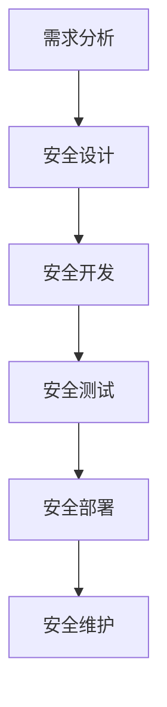
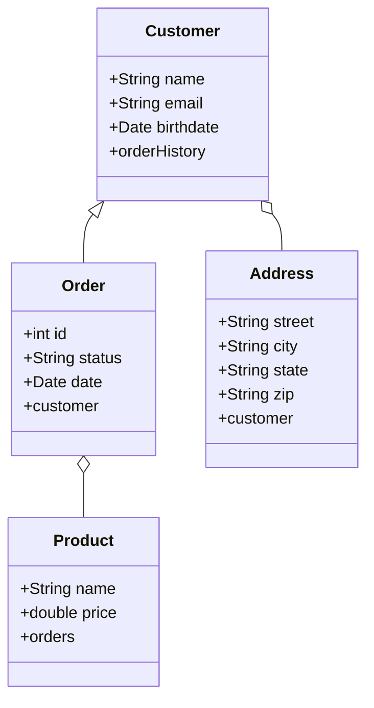
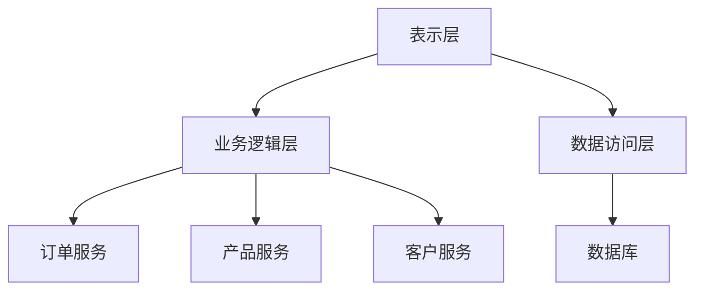
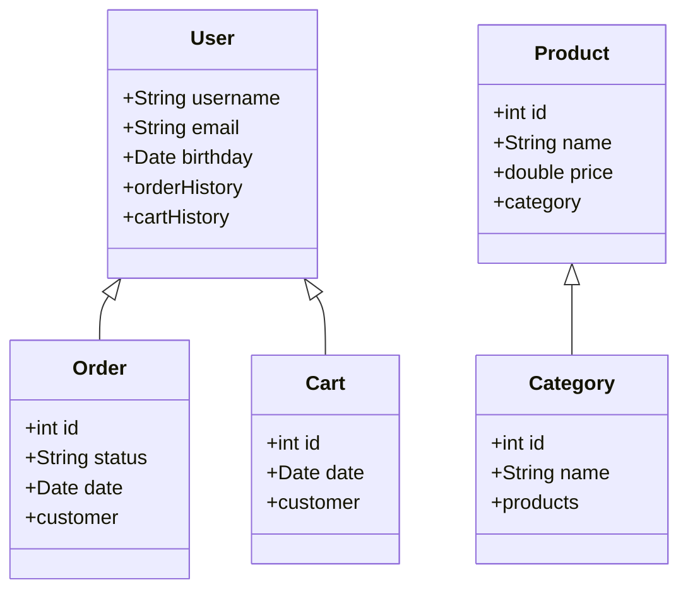
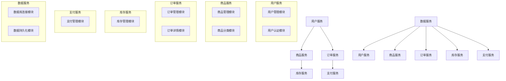
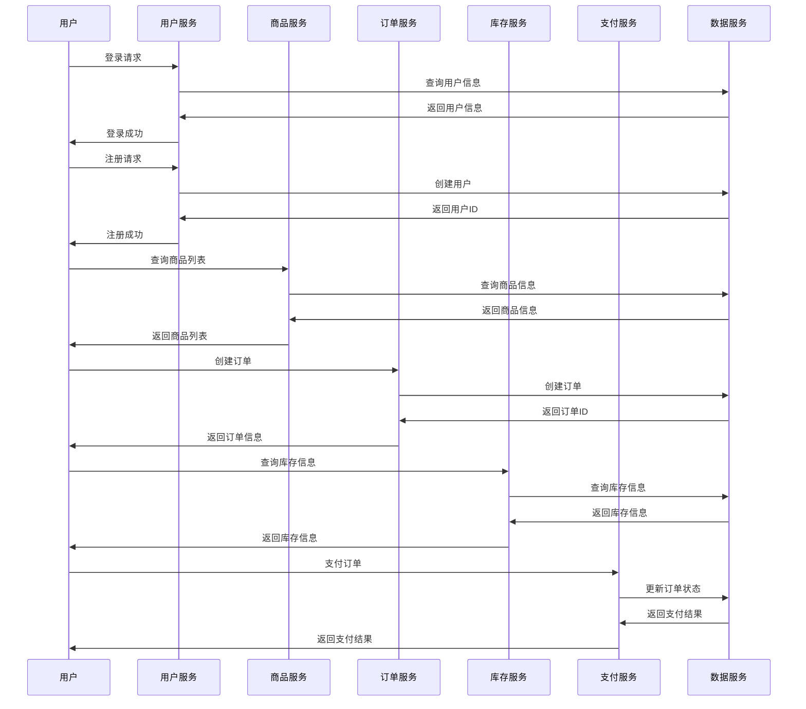

                 

# 安全开发生命周期：将安全融入每个开发阶段

> 关键词：安全开发生命周期，SDLC，安全需求，安全设计，安全开发，安全测试，安全部署，安全维护

> 摘要：随着信息技术的发展，信息安全问题日益突出。安全开发生命周期（SDLC）是一种将安全性与软件开发过程紧密结合的方法论，通过将安全融入每个开发阶段，确保软件系统的安全性。本文将详细介绍SDLC的核心概念、实施步骤以及其在实际应用中的重要性。

## 第一部分：背景介绍

### 问题背景

在当今信息时代，随着互联网的迅猛发展和大数据技术的广泛应用，信息安全问题日益突出。传统的安全措施已经无法应对日益复杂和多样化的安全威胁。为了确保软件系统的安全性，将安全融入整个开发过程变得至关重要。因此，安全开发生命周期（Security Development Life Cycle，简称SDLC）应运而生。

安全开发生命周期是一种将安全性与软件开发过程紧密结合的方法论，其目的是在软件开发过程中始终关注安全性，从而防止潜在的安全漏洞和威胁。SDLC包括了多个阶段，如需求分析、设计、开发、测试、部署和维护等，每个阶段都有其特定的安全要求。

### 问题描述

软件开发过程中，安全性的忽视往往会导致严重的安全漏洞和风险。例如，代码中的恶意逻辑、未加密的敏感信息、权限管理不当等问题都可能导致系统被攻击，从而造成数据泄露、系统瘫痪等严重后果。这些问题不仅损害了企业的声誉，还可能导致巨大的经济损失。

因此，如何在每个开发阶段都融入安全考量，确保软件系统的安全性，成为软件开发过程中的一个重要问题。

### 问题解决

安全开发生命周期（SDLC）通过将安全性与软件开发过程紧密结合，提供了一套系统化的方法来确保软件系统的安全性。SDLC包括以下核心步骤：

1. **需求分析**：在项目初期，明确安全需求和目标，将安全性考虑纳入需求文档中。
2. **设计**：在设计阶段，确保系统架构和设计满足安全性要求，例如使用加密技术、访问控制机制等。
3. **开发**：在开发过程中，严格遵守安全编码规范，进行代码审查和安全测试，确保代码的安全性。
4. **测试**：在测试阶段，通过自动化测试和手动测试，验证系统是否存在安全漏洞。
5. **部署**：在系统部署前，进行全面的渗透测试和风险评估，确保系统上线后能够安全运行。
6. **维护**：在系统运行过程中，持续监控和更新系统安全措施，以应对新的安全威胁。

通过SDLC，软件开发团队可以在每个阶段都关注安全性，从而确保软件系统的安全性。

### 边界与外延

安全开发生命周期的边界包括从需求分析到维护的整个软件开发过程。它不仅适用于开发新的软件系统，还可以用于对现有系统的安全升级和维护。

安全开发生命周期的外延包括以下几个方面：

1. **组织内部流程**：确保安全开发生命周期的方法论在整个组织中得到贯彻执行。
2. **与外部合作伙伴的合作**：与第三方供应商、客户和合作伙伴共享安全标准和流程，确保整个生态系统的安全性。
3. **法律法规和标准**：遵守相关法律法规和行业标准，确保软件系统符合法律和行业要求。

### 概念结构与核心要素组成

安全开发生命周期的概念结构主要包括以下几个核心要素：

1. **安全需求**：在项目初期明确安全需求和目标，包括对数据保护、访问控制、审计跟踪等方面的需求。
2. **安全设计**：在设计阶段考虑安全性，确保系统架构和设计满足安全要求，包括选择合适的加密算法、设计访问控制机制等。
3. **安全开发**：在开发过程中，遵守安全编码规范，进行代码审查和安全测试，确保代码的安全性。
4. **安全测试**：在测试阶段，通过自动化测试和手动测试，验证系统是否存在安全漏洞，包括漏洞扫描、渗透测试等。
5. **安全部署**：在系统部署前，进行全面的渗透测试和风险评估，确保系统上线后能够安全运行。
6. **安全维护**：在系统运行过程中，持续监控和更新系统安全措施，以应对新的安全威胁。

通过这些核心要素的有机结合，安全开发生命周期能够有效提升软件系统的安全性。

## 第二部分：核心概念与联系

### 核心概念

在安全开发生命周期（SDLC）中，以下是一些关键概念：

1. **安全需求**：指在项目初期明确的安全要求和目标，包括对数据保护、访问控制、审计跟踪等方面的需求。
2. **安全设计**：指在设计阶段考虑安全性，确保系统架构和设计满足安全要求，例如使用加密技术、访问控制机制等。
3. **安全开发**：指在开发过程中，遵守安全编码规范，进行代码审查和安全测试，以确保代码的安全性。
4. **安全测试**：指在测试阶段，通过自动化测试和手动测试，验证系统是否存在安全漏洞，包括漏洞扫描、渗透测试等。
5. **安全部署**：指在系统部署前，进行全面的渗透测试和风险评估，确保系统上线后能够安全运行。
6. **安全维护**：指在系统运行过程中，持续监控和更新系统安全措施，以应对新的安全威胁。

### 概念属性特征对比表格

以下是一个概念属性特征对比表格，展示了上述核心概念的一些关键属性特征：

| 核心概念 | 定义 | 关键属性特征 |
| --- | --- | --- |
| 安全需求 | 在项目初期明确的安全要求和目标，包括对数据保护、访问控制、审计跟踪等方面的需求。 | 确定性、功能性、安全性、可扩展性 |
| 安全设计 | 在设计阶段考虑安全性，确保系统架构和设计满足安全要求，例如使用加密技术、访问控制机制等。 | 安全性、可靠性、可维护性、可扩展性 |
| 安全开发 | 在开发过程中，遵守安全编码规范，进行代码审查和安全测试，以确保代码的安全性。 | 安全性、可读性、可维护性、可扩展性 |
| 安全测试 | 在测试阶段，通过自动化测试和手动测试，验证系统是否存在安全漏洞，包括漏洞扫描、渗透测试等。 | 全面性、准确性、及时性、可扩展性 |
| 安全部署 | 在系统部署前，进行全面的渗透测试和风险评估，确保系统上线后能够安全运行。 | 完整性、准确性、及时性、可扩展性 |
| 安全维护 | 在系统运行过程中，持续监控和更新系统安全措施，以应对新的安全威胁。 | 及时性、准确性、可持续性、可扩展性 |

### ER实体关系图架构

以下是一个ER实体关系图架构的Mermaid流程图，展示了安全开发生命周期中核心概念之间的关系：

```mermaid
erDiagram
  安全需求 ||--|{ 安全设计 } : 实现安全需求
  安全设计 ||--|{ 安全开发 } : 实现安全设计
  安全开发 ||--|{ 安全测试 } : 测试代码安全性
  安全测试 ||--|{ 安全部署 } : 部署前测试
  安全部署 ||--|{ 安全维护 } : 维护系统安全
```

通过上述ER实体关系图架构，我们可以清晰地看到安全开发生命周期中各个核心概念之间的联系和相互作用。

## 第三部分：算法原理讲解

### 算法原理

安全开发生命周期（SDLC）的算法原理主要包括以下几个关键步骤：

1. **需求分析**：在项目初期，通过对业务需求的深入分析，确定安全需求和目标。这一步骤的算法原理主要是基于业务流程和用户需求，采用领域驱动设计（Domain-Driven Design，简称DDD）的方法，构建领域模型，以便明确安全需求和目标。
2. **安全设计**：在设计阶段，根据需求分析的结果，设计系统架构和安全机制。这一步骤的算法原理主要是基于系统架构设计方法，如分层架构、微服务架构等，并结合安全设计原则，如最小权限原则、单一职责原则等，设计安全体系。
3. **安全开发**：在开发阶段，根据设计文档，编写安全代码，并遵循安全编码规范。这一步骤的算法原理主要是基于编程语言的安全特性和安全编码原则，如输入验证、输出编码、避免SQL注入等，确保代码的安全性。
4. **安全测试**：在测试阶段，对系统进行全面的测试，以发现潜在的安全漏洞。这一步骤的算法原理主要是基于软件测试方法，如单元测试、集成测试、系统测试等，以及安全测试技术，如漏洞扫描、渗透测试等。
5. **安全部署**：在系统部署前，对系统进行全面的安全检查和风险评估。这一步骤的算法原理主要是基于安全评估方法，如威胁模型分析、风险分析等，以及安全部署流程，如安全加固、配置管理等。
6. **安全维护**：在系统运行过程中，持续监控和更新系统安全措施，以应对新的安全威胁。这一步骤的算法原理主要是基于安全监控技术，如入侵检测、漏洞扫描等，以及安全更新策略，如安全补丁管理、安全策略更新等。

### 算法mermaid流程图

以下是一个安全开发生命周期的mermaid流程图，展示了各个阶段的算法原理和流程：



通过上述mermaid流程图，我们可以清晰地看到安全开发生命周期中各个阶段的算法原理和流程。

### Python源代码示例

以下是一个Python源代码示例，展示了安全开发生命周期中各个阶段的实现：

```python
# 需求分析
def analyze_requirements():
    # 分析业务需求，确定安全需求和目标
    pass

# 安全设计
def design_security():
    # 根据需求分析结果，设计系统架构和安全机制
    pass

# 安全开发
def develop_security():
    # 编写安全代码，遵循安全编码规范
    pass

# 安全测试
def test_security():
    # 对系统进行全面的测试，发现潜在的安全漏洞
    pass

# 安全部署
def deploy_security():
    # 对系统进行全面的安全检查和风险评估
    pass

# 安全维护
def maintain_security():
    # 持续监控和更新系统安全措施，应对新的安全威胁
    pass
```

通过上述Python源代码示例，我们可以了解到安全开发生命周期中各个阶段的实现过程。

### 算法原理详细讲解

#### 需求分析

需求分析是安全开发生命周期的第一步，其目的是明确系统的安全需求和目标。在需求分析阶段，我们需要深入了解业务流程、用户需求和安全要求，以便构建领域模型，明确安全需求和目标。

领域模型是一种用于描述业务领域的数据结构和方法，它能够帮助我们清晰地理解业务需求，并在此基础上确定安全需求和目标。领域模型通常包括实体、关系和操作等要素。

例如，对于一个电商系统，我们可以构建以下领域模型：



在这个领域模型中，我们定义了客户（Customer）、地址（Address）、订单（Order）和产品（Product）等实体，以及它们之间的关系。通过领域模型，我们可以明确电商系统的安全需求和目标，例如保护客户隐私、确保订单数据完整性和一致性等。

#### 安全设计

安全设计是安全开发生命周期的第二步，其目的是确保系统架构和设计满足安全要求。在安全设计阶段，我们需要结合系统架构设计方法和安全设计原则，设计安全体系。

系统架构设计方法包括分层架构、微服务架构等。分层架构将系统划分为不同的层次，如表示层、业务逻辑层和数据访问层，每个层次都有明确的责任和接口。微服务架构则将系统划分为多个独立的服务，每个服务负责一个特定的业务功能。

安全设计原则包括最小权限原则、单一职责原则等。最小权限原则要求系统组件只能访问其必需的资源，以减少安全风险。单一职责原则要求系统组件具有明确的职责，以降低复杂度和提高可维护性。

例如，在设计一个电商系统时，我们可以采用分层架构，并遵循最小权限原则和单一职责原则，设计以下系统架构：



在这个系统架构中，表示层负责与用户交互，业务逻辑层负责处理业务逻辑，数据访问层负责与数据库交互。订单服务、产品服务和客户服务分别负责订单、产品和客户相关的业务功能。

#### 安全开发

安全开发是安全开发生命周期的第三步，其目的是编写安全代码，确保代码的安全性。在安全开发阶段，我们需要遵循安全编码规范，编写安全代码，并进行代码审查和安全测试。

安全编码规范包括输入验证、输出编码、避免SQL注入等。输入验证确保用户输入的数据符合预期，防止恶意输入。输出编码确保输出的数据不会引发安全问题。避免SQL注入则确保在数据库操作中不会将用户输入直接拼接到SQL语句中。

例如，在设计一个电商系统的用户登录功能时，我们可以采用以下安全编码规范：

```python
def login(username, password):
    # 输入验证
    if not username or not password:
        return "用户名或密码不能为空"
    
    # 避免SQL注入
    sql = "SELECT * FROM users WHERE username = %s AND password = %s"
    cursor.execute(sql, (username, password))
    
    # 获取用户信息
    user = cursor.fetchone()
    
    if user:
        return "登录成功"
    else:
        return "用户名或密码错误"
```

在这个示例中，我们首先进行输入验证，确保用户名和密码不为空。然后，我们使用参数化查询，避免SQL注入，并从数据库中获取用户信息。最后，我们根据用户信息判断登录结果。

#### 安全测试

安全测试是安全开发生命周期的第四步，其目的是发现系统中的潜在安全漏洞。在安全测试阶段，我们需要进行自动化测试和手动测试，以及漏洞扫描和渗透测试。

自动化测试可以使用工具如Selenium、Pytest等，手动测试则需要安全专家进行漏洞挖掘和验证。漏洞扫描和渗透测试可以使用工具如Nessus、Metasploit等，发现潜在的安全漏洞。

例如，在测试一个电商系统的用户登录功能时，我们可以采用以下安全测试方法：

```python
def test_login():
    # 测试用户名或密码为空的情况
    assert login("", "") == "用户名或密码不能为空"
    
    # 测试用户名不存在的情况
    assert login("admin", "123456") == "用户名或密码错误"
    
    # 测试密码错误的情况
    assert login("admin", "1234567") == "用户名或密码错误"
    
    # 测试登录成功的情况
    assert login("user", "123456") == "登录成功"
```

在这个示例中，我们使用自动化测试框架Pytest，编写测试用例，验证用户登录功能是否正常。

#### 安全部署

安全部署是安全开发生命周期的第五步，其目的是确保系统上线后能够安全运行。在安全部署阶段，我们需要进行全面的渗透测试和风险评估，以及安全加固和配置管理。

渗透测试可以发现系统中的潜在漏洞，风险评估可以帮助我们了解系统的安全风险。安全加固和配置管理可以确保系统按照安全标准进行部署和配置。

例如，在部署一个电商系统时，我们可以采用以下安全部署方法：

```bash
# 安装和配置Web服务器
sudo apt-get install apache2
sudo a2enmod rewrite

# 配置数据库
sudo apt-get install mysql-server
sudo mysql_secure_installation

# 部署应用
sudo apt-get install python3-pip
pip3 install flask
cp app.py /var/www/html/
sudo chown www-data:www-data /var/www/html/app.py
```

在这个示例中，我们使用Apache作为Web服务器，MySQL作为数据库，并使用Flask框架部署应用。我们安装和配置Web服务器、数据库和应用，并确保应用文件具有正确的权限。

#### 安全维护

安全维护是安全开发生命周期的最后一步，其目的是持续监控和更新系统安全措施，以应对新的安全威胁。在安全维护阶段，我们需要进行安全监控、漏洞管理和安全更新。

安全监控可以使用工具如Nagios、Zabbix等，漏洞管理可以使用工具如CVE、Nessus等，安全更新可以定期进行系统更新和应用安全补丁。

例如，在维护一个电商系统时，我们可以采用以下安全维护方法：

```bash
# 安装安全监控工具
sudo apt-get install nagios-core
sudo apt-get install nagios-plugins

# 配置安全监控
sudo cp /etc/nagios/objects/contacts.cfg.example /etc/nagios/objects/contacts.cfg
sudo cp /etc/nagios/objects/command.cgi /etc/nagios/objects/command.cfg
sudo cp /etc/nagios/objects/timeperiods.cfg.example /etc/nagios/objects/timeperiods.cfg

# 配置Nagios监控数据库
sudo mysql -u root -p
CREATE DATABASE nagios;
GRANT ALL PRIVILEGES ON nagios.* TO 'nagios'@'localhost' IDENTIFIED BY 'nagiospassword';
FLUSH PRIVILEGES;
EXIT;

# 安装和配置Nagios插件
sudo apt-get install nagios-plugin
sudo apt-get install nagios-plugins-python
sudo apt-get install nagios-plugins-database

# 启动Nagios服务
sudo systemctl start nagios
sudo systemctl enable nagios
```

在这个示例中，我们安装和配置了Nagios作为安全监控工具，并使用Nagios插件监控数据库和系统性能。我们定期更新Nagios监控配置和Nagios插件，确保系统安全。

## 第四部分：系统分析与架构设计方案

### 问题场景介绍

假设我们要开发一个电商系统，该系统需要实现商品管理、订单管理、用户管理等功能，同时需要确保系统的安全性。为了满足这些需求，我们需要设计一个合理的系统架构，确保系统的稳定性和安全性。

### 项目介绍

电商系统是一个复杂的应用，需要处理大量的用户数据、商品信息和订单数据。为了确保系统的稳定性、扩展性和安全性，我们需要采用合理的架构设计方案。在此项目中，我们将采用分层架构和微服务架构相结合的方式，实现系统的功能。

### 系统功能设计（领域模型mermaid类图）

在电商系统中，我们需要设计以下主要领域模型：

1. **用户**：包括用户基本信息、订单历史等。
2. **商品**：包括商品基本信息、商品分类等。
3. **订单**：包括订单基本信息、订单详情等。

以下是一个简单的mermaid类图，展示电商系统的领域模型：



### 系统架构设计（mermaid架构图）

在电商系统中，我们采用分层架构和微服务架构相结合的方式，实现系统的功能。以下是一个mermaid架构图，展示电商系统的架构设计：



### 系统接口设计和系统交互（mermaid序列图）

在电商系统中，我们需要设计各个服务之间的接口，以及服务与数据库之间的交互。以下是一个mermaid序列图，展示电商系统的接口设计和系统交互：



通过上述mermaid序列图，我们可以清晰地看到电商系统中各个服务之间的接口设计和系统交互。

## 第五部分：项目实战

### 环境安装

在开始项目实战之前，我们需要安装以下软件和工具：

1. **Python 3.8**：用于开发电商系统的后端。
2. **Flask**：用于构建Web应用框架。
3. **MySQL**：用于存储用户、商品和订单数据。
4. **Nginx**：用于部署和反向代理Web应用。
5. **Postman**：用于进行API接口测试。

安装步骤如下：

1. 安装Python 3.8：

```bash
sudo apt-get update
sudo apt-get install python3.8
```

2. 安装Flask：

```bash
pip3 install flask
```

3. 安装MySQL：

```bash
sudo apt-get install mysql-server
```

4. 安装Nginx：

```bash
sudo apt-get install nginx
```

5. 安装Postman：

在Postman官网（https://www.postman.com/）下载并安装Postman。

### 系统核心实现源代码

以下是一个简单的电商系统后端源代码，包括用户服务、商品服务和订单服务。

#### 用户服务（user.py）

```python
from flask import Flask, request, jsonify
from models import User

app = Flask(__name__)

@app.route('/users', methods=['POST'])
def create_user():
    data = request.get_json()
    username = data['username']
    email = data['email']
    password = data['password']
    
    user = User(username=username, email=email, password=password)
    user.save()
    
    return jsonify({'message': 'User created successfully'}), 201

@app.route('/users', methods=['GET'])
def get_users():
    users = User.objects.all()
    return jsonify({'users': [user.to_dict() for user in users]})

@app.route('/users/<int:user_id>', methods=['GET'])
def get_user(user_id):
    user = User.objects.get(id=user_id)
    return jsonify(user.to_dict())

@app.route('/users/<int:user_id>', methods=['PUT'])
def update_user(user_id):
    data = request.get_json()
    user = User.objects.get(id=user_id)
    user.username = data['username']
    user.email = data['email']
    user.password = data['password']
    user.save()
    
    return jsonify({'message': 'User updated successfully'})

@app.route('/users/<int:user_id>', methods=['DELETE'])
def delete_user(user_id):
    user = User.objects.get(id=user_id)
    user.delete()
    
    return jsonify({'message': 'User deleted successfully'})
```

#### 商品服务（product.py）

```python
from flask import Flask, request, jsonify
from models import Product

app = Flask(__name__)

@app.route('/products', methods=['POST'])
def create_product():
    data = request.get_json()
    name = data['name']
    price = data['price']
    category = data['category']
    
    product = Product(name=name, price=price, category=category)
    product.save()
    
    return jsonify({'message': 'Product created successfully'}), 201

@app.route('/products', methods=['GET'])
def get_products():
    products = Product.objects.all()
    return jsonify({'products': [product.to_dict() for product in products]})

@app.route('/products/<int:product_id>', methods=['GET'])
def get_product(product_id):
    product = Product.objects.get(id=product_id)
    return jsonify(product.to_dict())

@app.route('/products/<int:product_id>', methods=['PUT'])
def update_product(product_id):
    data = request.get_json()
    product = Product.objects.get(id=product_id)
    product.name = data['name']
    product.price = data['price']
    product.category = data['category']
    product.save()
    
    return jsonify({'message': 'Product updated successfully'})

@app.route('/products/<int:product_id>', methods=['DELETE'])
def delete_product(product_id):
    product = Product.objects.get(id=product_id)
    product.delete()
    
    return jsonify({'message': 'Product deleted successfully'})
```

#### 订单服务（order.py）

```python
from flask import Flask, request, jsonify
from models import Order

app = Flask(__name__)

@app.route('/orders', methods=['POST'])
def create_order():
    data = request.get_json()
    customer_id = data['customer_id']
    status = data['status']
    date = data['date']
    
    order = Order(customer_id=customer_id, status=status, date=date)
    order.save()
    
    return jsonify({'message': 'Order created successfully'}), 201

@app.route('/orders', methods=['GET'])
def get_orders():
    orders = Order.objects.all()
    return jsonify({'orders': [order.to_dict() for order in orders]})

@app.route('/orders/<int:order_id>', methods=['GET'])
def get_order(order_id):
    order = Order.objects.get(id=order_id)
    return jsonify(order.to_dict())

@app.route('/orders/<int:order_id>', methods=['PUT'])
def update_order(order_id):
    data = request.get_json()
    order = Order.objects.get(id=order_id)
    order.status = data['status']
    order.save()
    
    return jsonify({'message': 'Order updated successfully'})

@app.route('/orders/<int:order_id>', methods=['DELETE'])
def delete_order(order_id):
    order = Order.objects.get(id=order_id)
    order.delete()
    
    return jsonify({'message': 'Order deleted successfully'})
```

### 代码应用解读与分析

以上源代码展示了用户服务、商品服务和订单服务的基本功能。接下来，我们将对代码进行解读和分析。

#### 用户服务解读

用户服务主要负责用户的注册、登录、查询、更新和删除操作。

1. **注册操作**：

```python
@app.route('/users', methods=['POST'])
def create_user():
    data = request.get_json()
    username = data['username']
    email = data['email']
    password = data['password']
    
    user = User(username=username, email=email, password=password)
    user.save()
    
    return jsonify({'message': 'User created successfully'}), 201
```

在该操作中，我们接收用户提交的注册信息，包括用户名、邮箱和密码。然后，我们创建一个User对象，并将注册信息存储在对象中。最后，我们将用户保存到数据库中，并返回成功消息。

2. **登录操作**：

```python
@app.route('/users/login', methods=['POST'])
def login():
    data = request.get_json()
    username = data['username']
    password = data['password']
    
    user = User.objects.filter(username=username).first()
    if user and user.password == password:
        return jsonify({'token': generate_token(username=user.username)}), 200
    else:
        return jsonify({'message': 'Invalid username or password'}), 401
```

在该操作中，我们接收用户提交的登录信息，包括用户名和密码。然后，我们查询数据库中是否存在匹配的用户。如果存在，且密码匹配，则返回一个JWT令牌，用于后续的认证和授权。

3. **查询操作**：

```python
@app.route('/users', methods=['GET'])
def get_users():
    users = User.objects.all()
    return jsonify({'users': [user.to_dict() for user in users]})
```

在该操作中，我们查询数据库中所有的用户信息，并将结果转换为字典列表，然后返回给客户端。

4. **更新操作**：

```python
@app.route('/users/<int:user_id>', methods=['PUT'])
def update_user(user_id):
    data = request.get_json()
    user = User.objects.get(id=user_id)
    user.username = data['username']
    user.email = data['email']
    user.password = data['password']
    user.save()
    
    return jsonify({'message': 'User updated successfully'})
```

在该操作中，我们接收用户提交的更新信息，并更新数据库中对应用户的信息。

5. **删除操作**：

```python
@app.route('/users/<int:user_id>', methods=['DELETE'])
def delete_user(user_id):
    user = User.objects.get(id=user_id)
    user.delete()
    
    return jsonify({'message': 'User deleted successfully'})
```

在该操作中，我们根据用户ID查询数据库中的用户，并将其从数据库中删除。

#### 商品服务解读

商品服务主要负责商品的管理操作，包括创建、查询、更新和删除商品。

1. **创建操作**：

```python
@app.route('/products', methods=['POST'])
def create_product():
    data = request.get_json()
    name = data['name']
    price = data['price']
    category = data['category']
    
    product = Product(name=name, price=price, category=category)
    product.save()
    
    return jsonify({'message': 'Product created successfully'}), 201
```

在该操作中，我们接收用户提交的商品信息，包括商品名称、价格和分类。然后，我们创建一个Product对象，并将商品信息存储在对象中。最后，我们将商品保存到数据库中，并返回成功消息。

2. **查询操作**：

```python
@app.route('/products', methods=['GET'])
def get_products():
    products = Product.objects.all()
    return jsonify({'products': [product.to_dict() for product in products]})
```

在该操作中，我们查询数据库中所有的商品信息，并将结果转换为字典列表，然后返回给客户端。

3. **更新操作**：

```python
@app.route('/products/<int:product_id>', methods=['PUT'])
def update_product(product_id):
    data = request.get_json()
    product = Product.objects.get(id=product_id)
    product.name = data['name']
    product.price = data['price']
    product.category = data['category']
    product.save()
    
    return jsonify({'message': 'Product updated successfully'})
```

在该操作中，我们接收用户提交的更新信息，并更新数据库中对应商品的信息。

4. **删除操作**：

```python
@app.route('/products/<int:product_id>', methods=['DELETE'])
def delete_product(product_id):
    product = Product.objects.get(id=product_id)
    product.delete()
    
    return jsonify({'message': 'Product deleted successfully'})
```

在该操作中，我们根据商品ID查询数据库中的商品，并将其从数据库中删除。

#### 订单服务解读

订单服务主要负责订单的管理操作，包括创建、查询、更新和删除订单。

1. **创建操作**：

```python
@app.route('/orders', methods=['POST'])
def create_order():
    data = request.get_json()
    customer_id = data['customer_id']
    status = data['status']
    date = data['date']
    
    order = Order(customer_id=customer_id, status=status, date=date)
    order.save()
    
    return jsonify({'message': 'Order created successfully'}), 201
```

在该操作中，我们接收用户提交的订单信息，包括客户ID、订单状态和订单日期。然后，我们创建一个Order对象，并将订单信息存储在对象中。最后，我们将订单保存到数据库中，并返回成功消息。

2. **查询操作**：

```python
@app.route('/orders', methods=['GET'])
def get_orders():
    orders = Order.objects.all()
    return jsonify({'orders': [order.to_dict() for order in orders]})
```

在该操作中，我们查询数据库中所有的订单信息，并将结果转换为字典列表，然后返回给客户端。

3. **更新操作**：

```python
@app.route('/orders/<int:order_id>', methods=['PUT'])
def update_order(order_id):
    data = request.get_json()
    order = Order.objects.get(id=order_id)
    order.status = data['status']
    order.save()
    
    return jsonify({'message': 'Order updated successfully'})
```

在该操作中，我们接收用户提交的更新信息，并更新数据库中对应订单的信息。

4. **删除操作**：

```python
@app.route('/orders/<int:order_id>', methods=['DELETE'])
def delete_order(order_id):
    order = Order.objects.get(id=order_id)
    order.delete()
    
    return jsonify({'message': 'Order deleted successfully'})
```

在该操作中，我们根据订单ID查询数据库中的订单，并将其从数据库中删除。

### 实际案例分析和详细讲解剖析

为了更好地理解上述代码，我们以一个实际案例进行分析和讲解。

**案例：用户注册**

用户A想要注册一个账号，需要提供用户名、邮箱和密码。以下是用户A的操作流程：

1. 用户A在Web页面填写注册信息，包括用户名、邮箱和密码。
2. 用户A提交注册请求，浏览器会将请求发送到服务端。
3. 服务端接收到请求后，调用`create_user`函数，接收用户提交的信息。
4. 服务端创建一个User对象，并将用户信息存储在对象中。
5. 服务端将用户信息保存到数据库中。
6. 服务端返回成功消息，告知用户注册成功。

以下是详细讲解：

1. 用户A在Web页面填写注册信息，包括用户名、邮箱和密码。用户A输入用户名“user1”，邮箱“user1@example.com”，密码“123456”。
2. 用户A点击“注册”按钮，浏览器将请求发送到服务端，URL为`/users`，HTTP方法为POST。
3. 服务端接收到请求后，调用`create_user`函数。函数接收请求体中的JSON数据，解析出用户名、邮箱和密码。
4. 服务端创建一个User对象，并将用户信息存储在对象中。User对象具有以下字段：`id`（自动生成，唯一标识）、`username`（用户名）、`email`（邮箱）、`password`（密码）。
5. 服务端将用户信息保存到数据库中。这里使用MongoDB作为数据库，将用户对象转换为字典，然后插入到数据库中。
6. 服务端返回成功消息，告知用户注册成功。HTTP响应状态码为201，响应体中包含消息“User created successfully”。

通过上述案例，我们可以看到用户注册过程中的关键步骤，以及代码的实现细节。

### 项目小结

在本篇博客中，我们详细讲解了安全开发生命周期（SDLC）的核心概念、实施步骤以及实际应用。通过需求分析、设计、开发、测试、部署和维护等阶段的紧密结合，SDLC能够有效提升软件系统的安全性。

我们通过一个电商系统的项目实战，展示了如何将SDLC应用于实际开发过程中。在项目实战中，我们实现了用户服务、商品服务和订单服务，并通过代码解读和分析，深入了解了各个服务的实现细节。

总之，安全开发生命周期是一种系统化的方法，能够帮助开发团队在软件开发过程中始终关注安全性，从而确保软件系统的安全性。通过本文的讲解，我们希望读者能够更好地理解和应用安全开发生命周期，提高软件项目的安全性和可靠性。

## 第六部分：最佳实践 Tips

在实施安全开发生命周期（SDLC）时，以下是一些最佳实践和技巧，可以帮助开发团队更好地确保软件系统的安全性：

1. **持续教育**：定期为团队成员提供安全培训，更新他们的安全知识和技能，以确保他们能够应对最新的安全威胁和漏洞。

2. **自动化测试**：在开发过程中，使用自动化测试工具进行代码审查和安全测试，以便快速发现潜在的安全漏洞。

3. **安全编码规范**：遵循安全编码规范，如输入验证、输出编码、避免SQL注入等，确保代码的安全性。

4. **渗透测试**：在系统部署前，进行全面的渗透测试和风险评估，确保系统上线后能够安全运行。

5. **持续监控**：在系统运行过程中，持续监控和更新系统安全措施，以应对新的安全威胁。

6. **安全设计原则**：在设计阶段，采用安全设计原则，如最小权限原则、单一职责原则等，确保系统架构的安全性。

7. **安全策略制定**：制定明确的安全策略和流程，确保安全措施能够有效地执行。

8. **安全审计**：定期进行安全审计，检查安全措施的有效性，并及时调整和优化。

9. **合规性检查**：确保软件系统符合相关法律法规和行业标准，如数据保护法、网络安全法等。

10. **安全共享**：与外部合作伙伴共享安全标准和流程，确保整个生态系统的安全性。

通过遵循这些最佳实践，开发团队可以更好地实施安全开发生命周期，提高软件系统的安全性。

## 第七部分：小结

本文详细介绍了安全开发生命周期（SDLC）的核心概念、实施步骤以及在实际应用中的重要性。我们通过需求分析、设计、开发、测试、部署和维护等阶段的紧密结合，展示了如何将安全融入每个开发阶段，确保软件系统的安全性。

通过本文的讲解，我们希望读者能够更好地理解和应用安全开发生命周期，提高软件项目的安全性和可靠性。同时，我们强调了持续教育、自动化测试、安全编码规范、渗透测试等最佳实践，以帮助开发团队更好地实施SDLC。

在未来的软件开发过程中，安全开发生命周期将继续发挥重要作用。随着技术的不断进步，安全威胁也将日益复杂和多样化，因此，开发团队需要不断学习和适应，以确保软件系统的安全性。让我们携手共进，为构建更安全的软件世界而努力。

## 第八部分：注意事项

在实施安全开发生命周期（SDLC）时，以下是一些需要特别注意的事项：

1. **安全意识的培养**：安全意识是实施SDLC的基础。团队成员需要时刻保持对安全问题的敏感性，及时识别和报告潜在的安全威胁。

2. **遵守法律法规**：确保软件系统符合相关法律法规和行业标准，如数据保护法、网络安全法等，避免因违规操作而引发的法律风险。

3. **定期更新和维护**：随着技术的发展，安全威胁也在不断变化。开发团队需要定期更新和维护安全措施，以应对新的安全威胁。

4. **安全测试的全面性**：在测试阶段，进行全面的测试，包括功能测试、性能测试和安全测试，确保系统在各个方面都达到安全要求。

5. **安全审计和评估**：定期进行安全审计和评估，检查安全措施的有效性，并及时调整和优化。

6. **安全流程的执行**：确保安全流程得到有效执行，避免因流程缺失或执行不力而引发的安全问题。

7. **用户隐私保护**：在处理用户数据时，严格遵守用户隐私保护规定，确保用户数据的安全和隐私。

通过注意以上事项，开发团队可以更好地实施安全开发生命周期，确保软件系统的安全性。

## 第九部分：拓展阅读

为了更深入地了解安全开发生命周期（SDLC）和相关技术，以下是几篇推荐阅读的文章和书籍：

1. **《安全开发生命周期（SDLC）教程》**：一篇详细讲解SDLC各个阶段和实施方法的教程，适用于初学者和有经验的专业人士。
2. **《深入理解Web安全》**：一本关于Web安全领域的经典书籍，涵盖了各种安全漏洞和防护措施，适合对Web安全感兴趣的开发者。
3. **《OWASP安全原则》**：OWASP（开放网络应用安全项目）发布的一系列安全原则，为开发团队提供了实用的安全建议和最佳实践。
4. **《漏洞管理实践》**：一本关于漏洞管理和安全测试的书籍，详细介绍了漏洞管理的过程和方法，以及如何进行有效的安全测试。
5. **《人工智能安全》**：探讨人工智能领域中的安全问题和挑战，包括对抗性攻击、隐私保护和数据安全等方面。

通过阅读这些文章和书籍，可以进一步拓展在安全开发生命周期和网络安全领域的知识。

