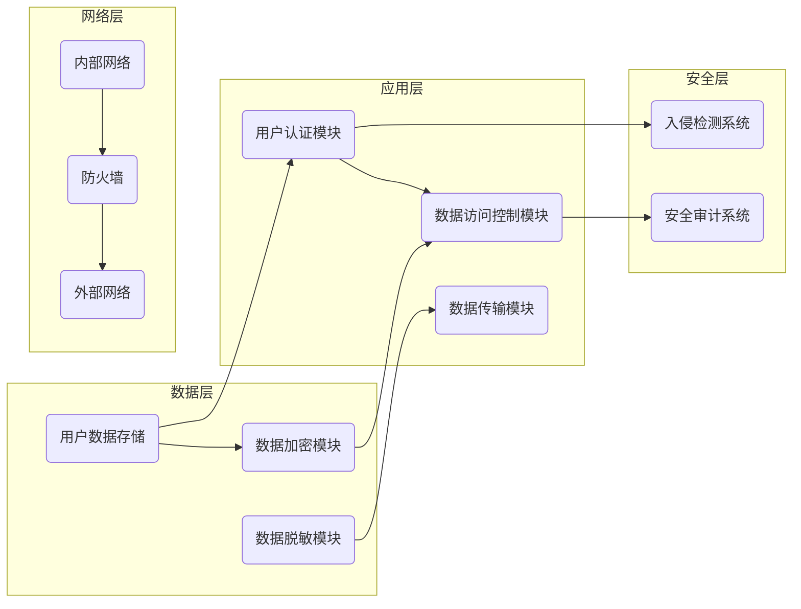
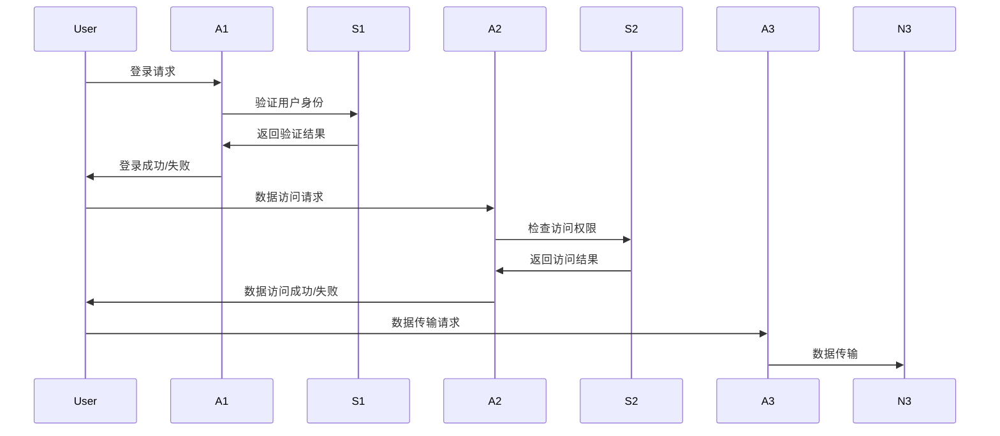
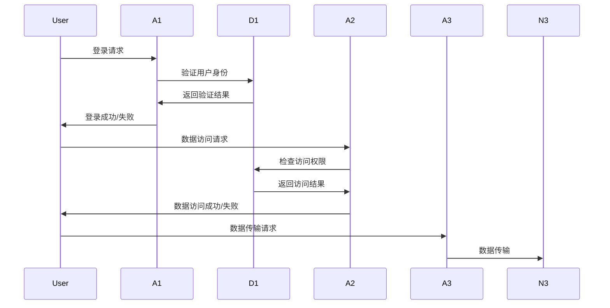

                 

# 安全性与数据隐私：基础概念与实践

> 关键词：数据安全，隐私保护，加密技术，访问控制，法律法规，案例分析

> 摘要：本文将深入探讨安全性与数据隐私的基础概念，包括其背景、核心概念、法律与标准，以及相关的技术手段。通过实际案例分析，展示如何在实际环境中实施安全性与数据隐私保护策略，并提出未来发展趋势。

## 第1章 问题背景与核心概念

### 1.1 问题背景

随着互联网和大数据技术的飞速发展，数据已经成为现代社会的重要资源。然而，随着数据价值的提升，数据安全与隐私保护问题也日益凸显。数据泄露、黑客攻击、非法数据访问等问题频发，给个人隐私和企业数据安全带来了巨大的威胁。因此，保障数据安全与保护数据隐私已经成为各国政府、企业和研究机构共同关注的问题。

### 1.2 核心概念

#### 安全性

安全性是指保护数据免受未授权访问、篡改、泄露等威胁的能力。主要类型包括：

- **机密性**：确保信息不被未授权的个人或实体访问。
- **完整性**：确保数据在传输或存储过程中不被未经授权的篡改。
- **可用性**：确保数据在需要时能够被授权的个人或实体访问。

安全性目标包括保密性、完整保护、不可否认性。

#### 数据隐私

数据隐私是指个人对其个人信息的控制权，确保个人信息不被未经授权的个人或机构访问、使用或泄露。数据隐私主要类型包括：

- **个人信息隐私**：与个人相关的隐私数据，如姓名、地址、电话号码等。
- **数据隐私**：数据在存储、处理和传输过程中的隐私保护。

### 1.3 安全性与数据隐私的联系与区别

安全性与数据隐私虽然密切相关，但存在区别。安全性主要关注数据的安全防护，包括访问控制、加密、防火墙等技术手段。而数据隐私则侧重于个人隐私的保护，包括隐私政策、用户同意、数据匿名化等。

### 1.4 安全性与数据隐私的融合

在实际应用中，安全性与数据隐私需要融合，以实现全面的数据保护。例如，在数据存储和传输过程中，既需要保证数据的机密性和完整性，也需要对个人数据进行匿名化和隐私保护。

## 第2章 安全性与数据隐私的相关法律与标准

### 2.1 法律法规

不同国家和地区有不同的数据隐私保护法律。以下是几个典型的法律：

- **GDPR（欧盟通用数据保护条例）**：欧盟制定的严格数据隐私保护法规，对数据处理者的合规要求较高。
- **CCPA（美国加州消费者隐私法）**：加州制定的消费者隐私保护法律，对消费者数据的处理和披露进行了规定。
- **《中华人民共和国网络安全法》**：中国制定的网络安全基本法律，对网络运营者的数据安全保护责任进行了规定。
- **《中华人民共和国数据安全法》**：中国制定的专门针对数据安全保护的法律，对数据收集、存储、处理、传输等环节的安全要求进行了详细规定。

### 2.2 标准与指南

为了更好地实现数据安全和隐私保护，各国和国际组织也制定了一系列标准和指南：

- **ISO/IEC 27001**：国际标准化组织制定的关于信息安全管理系统的标准。
- **NIST SP 800-53**：美国国家标准与技术研究院制定的信息安全控制框架。
- **GDPR合规指南**：欧盟提供的关于GDPR的实施指南。

## 第3章 安全性与数据隐私的核心技术

### 3.1 加密技术

加密技术是保障数据安全的重要手段，主要包括：

- **对称加密**：使用相同的密钥进行加密和解密。
- **非对称加密**：使用公钥和私钥进行加密和解密。
- **哈希函数**：将任意长度的输入数据转换成固定长度的输出数据，常用于数字签名和数据完整性校验。

### 3.2 隐私保护技术

隐私保护技术旨在保护个人数据的隐私，包括：

- **数据脱敏**：通过特定的算法将敏感数据转换成不敏感的形式，如使用掩码、伪名等。
- **同态加密**：在加密数据上直接执行计算操作，而无需解密数据，保护数据的隐私。
- **差分隐私**：通过在数据集中添加噪声来保护个人隐私，同时保持数据的总体统计特性。

### 3.3 身份与访问管理

身份与访问管理（IAM）是保障数据安全的重要机制，包括：

- **IAM系统**：用于管理用户身份、权限和访问控制。
- **单点登录（SSO）**：允许用户通过一个统一的入口访问多个系统。
- **多因素认证（MFA）**：通过多种方式验证用户身份，提高安全性。

## 第4章 安全性与数据隐私的实际案例分析

### 4.1 案例一：某电商平台的隐私保护实践

#### 案例背景

某电商平台在用户数据保护方面采取了严格的措施，以保障用户的隐私。

#### 案例分析

- **数据加密**：对用户数据进行加密存储，确保数据在传输和存储过程中不被泄露。
- **访问控制**：通过IAM系统管理用户权限，确保只有授权人员能够访问敏感数据。
- **隐私政策**：明确告知用户其数据的使用目的和权限，取得用户的明确同意。
- **数据脱敏**：对用户敏感信息进行脱敏处理，确保数据在分析和使用过程中不被泄露。

#### 效果评估

通过这些措施，该电商平台有效降低了用户数据泄露的风险，提高了用户对平台的信任度。

### 4.2 案例二：某金融机构的安全性实践

#### 案例背景

某金融机构在数据安全保护方面有着严格的规范和流程。

#### 案例分析

- **数据备份**：定期进行数据备份，确保数据不因意外事件而丢失。
- **防火墙和入侵检测**：部署防火墙和入侵检测系统，防止外部攻击。
- **多因素认证**：对敏感操作进行多因素认证，确保只有授权人员能够执行。
- **安全审计**：定期进行安全审计，检查和评估安全策略的有效性。

#### 效果评估

通过这些措施，该金融机构有效提高了数据安全防护水平，降低了安全风险。

## 第5章 安全性与数据隐私的未来发展趋势

### 5.1 技术趋势

- **人工智能与安全性的融合**：利用人工智能技术进行网络安全威胁的检测和响应。
- **区块链在数据隐私中的应用**：利用区块链技术实现数据的可信传输和存储。

### 5.2 法律趋势

- **数据隐私保护法律的国际化**：各国加强数据隐私保护立法，推动国际数据隐私保护法律的统一。
- **法律法规的不断完善**：针对新兴技术和应用场景，不断更新和完善相关法律法规。

### 5.3 未来展望

随着技术的发展和法律法规的完善，安全性与数据隐私将实现更高效、更全面的保护。未来的发展趋势包括：

- **个性化隐私保护方案**：根据用户需求和偏好，提供个性化的隐私保护方案。
- **安全性与数据隐私的协同发展**：在数据利用和隐私保护之间找到最佳平衡点。

## 第6章 安全性与数据隐私的综合实践

### 6.1 综合实践方案

一个综合的安全性与数据隐私保护方案应包括以下几个方面：

- **安全策略制定**：明确数据保护目标和策略。
- **技术手段实施**：采用加密、访问控制、数据脱敏等核心技术。
- **法律法规遵守**：遵守相关法律法规，确保合规性。
- **人员培训与意识提升**：提高员工的隐私保护意识和安全操作技能。

### 6.2 实践步骤与实施策略

- **需求分析**：分析业务需求和潜在风险，制定数据保护策略。
- **方案设计**：设计具体的安全与隐私保护方案，包括技术架构、流程和操作规范。
- **技术实施**：按照设计方案实施安全与隐私保护措施。
- **效果评估**：定期评估数据保护效果，根据评估结果调整和优化方案。

### 6.3 成功案例分析

通过实际案例分析，可以了解不同场景下的安全性与数据隐私保护实践，为其他企业或组织提供参考。以下是一个成功案例：

#### 案例背景

某大型互联网公司在其云服务平台上为多个客户提供数据存储和数据处理服务，需要保障数据的安全性和用户隐私。

#### 案例分析

- **安全策略制定**：公司制定了严格的数据安全政策和隐私保护政策，明确数据保护目标和责任。
- **技术手段实施**：采用加密技术保护数据传输和存储，使用访问控制技术管理用户权限，实施数据脱敏处理。
- **法律法规遵守**：遵守GDPR、CCPA等相关法律法规，确保合规性。
- **人员培训与意识提升**：定期组织员工进行数据安全和隐私保护培训，提高员工的意识。

#### 效果评估

通过上述措施，该公司有效提高了数据安全防护水平，用户对服务的满意度显著提升。

### 最佳实践 tips

- **持续监控与改进**：数据安全和隐私保护是一个持续的过程，需要定期监控和改进。
- **用户参与**：鼓励用户参与数据保护，如提供数据访问权限管理功能。
- **透明度**：保持数据保护措施的透明度，增加用户对服务的信任。

### 小结

安全性与数据隐私保护是当今信息技术领域的重要课题。通过了解基础概念、法律法规、核心技术和实际案例分析，我们可以更好地理解和实践数据安全和隐私保护。未来，随着技术的发展和法律的完善，安全性与数据隐私保护将实现更高水平的发展。

### 注意事项

- **数据分类与分级**：对不同类型的数据进行分类和分级，采取不同的保护措施。
- **风险评估**：定期进行风险评估，识别潜在威胁和漏洞。
- **应急响应**：建立应急响应机制，确保在发生数据泄露或安全事件时能够迅速应对。

### 拓展阅读

- **数据安全与隐私保护法律法规**
- **加密技术原理与实践**
- **身份与访问管理（IAM）技术**
- **人工智能与数据安全**
- **区块链在数据隐私中的应用**

作者：AI天才研究院/AI Genius Institute & 禅与计算机程序设计艺术 /Zen And The Art of Computer Programming

（全文完）

## 附录：核心概念与联系

### 核心概念对比表格

| 概念       | 定义                                                         | 目标                                       |    
|------------|------------------------------------------------------------|------------------------------------------|  
| **安全性**   | 保护数据免受未授权访问、篡改、泄露等威胁的能力                 | 保密性、完整性、可用性                     |    
| **数据隐私** | 个人对其个人信息的控制权，确保个人信息不被未经授权的访问、使用或泄露 | 个人信息隐私、数据隐私                     |

### ER实体关系图架构

```mermaid
erDiagram
  用户 ||--o{ 数据 }|
  数据 ||--o{ 加密 }|
  加密 ||--o{ 安全 }|
  安全 ||--o{ 隐私 }|
  隐私 ||--o{ 法律 }|
  法律 ||--o{ 标准 }|
```

## 算法原理讲解

### 加密算法

加密算法是一种将明文转换为密文的数学方法，以防止未经授权的访问。以下是几种常见的加密算法：

1. **对称加密**

   对称加密使用相同的密钥进行加密和解密。常见的对称加密算法有AES、DES等。

   **算法流程**：

   ```mermaid
   sequenceDiagram
     participant User as 用户
     participant Server as 服务器
     User->>Server: 明文
     Server->>加密算法: 密钥
    加密算法->>Server: 密文
     Server->>User: 密文
     User->>解密算法: 密钥
     解密算法->>User: 明文
   ```

2. **非对称加密**

   非对称加密使用公钥和私钥进行加密和解密。公钥用于加密，私钥用于解密。

   **算法流程**：

   ```mermaid
   sequenceDiagram
     participant User as 用户
     participant Server as 服务器
     User->>Server: 明文
     Server->>公钥加密算法: 私钥
     公钥加密算法->>Server: 密文
     Server->>用户私钥: 密文
     用户私钥->>解密算法: 明文
     解密算法->>User: 明文
   ```

3. **哈希函数**

   哈希函数是一种将任意长度的输入数据转换成固定长度的输出数据的算法。常见的哈希函数有MD5、SHA-256等。

   **算法流程**：

   ```mermaid
   sequenceDiagram
     participant Data as 数据
     Data->>哈希函数: 输入数据
     哈希函数->>输出: 哈希值
   ```

### 隐私保护算法

1. **数据脱敏**

   数据脱敏是一种将敏感数据转换成不敏感的形式的技术，以防止数据泄露。

   **算法流程**：

   ```mermaid
   sequenceDiagram
     participant Data as 敏感数据
     Data->>脱敏算法: 输入数据
     脱敏算法->>输出: 脱敏数据
   ```

2. **同态加密**

   同态加密是一种在加密数据上直接执行计算操作的加密方法，以保护数据的隐私。

   **算法流程**：

   ```mermaid
   sequenceDiagram
     participant Data as 数据
     participant Computation as 计算过程
     Data->>同态加密算法: 加密数据
     同态加密算法->>Computation: 加密数据
     Computation->>解密算法: 解密结果
   ```

3. **差分隐私**

   差分隐私是一种通过在数据集中添加噪声来保护个人隐私的加密方法。

   **算法流程**：

   ```mermaid
   sequenceDiagram
     participant Data as 数据
     participant Noise as 噪声
     Data->>差分隐私算法: 数据集
     差分隐私算法->>Noise: 添加噪声
     Noise->>输出: 差分隐私数据
   ```

### 数学模型和公式

1. **对称加密**

   对称加密的加密和解密过程可以用以下数学模型表示：

   $$ C = E_K(P) $$  
   $$ P = D_K(C) $$

   其中，$C$ 表示密文，$P$ 表示明文，$K$ 表示密钥，$E_K$ 表示加密算法，$D_K$ 表示解密算法。

2. **非对称加密**

   非对称加密的加密和解密过程可以用以下数学模型表示：

   $$ C = E_K^P(P) $$  
   $$ P = D_K^P(C) $$

   其中，$K_P$ 表示公钥，$K_S$ 表示私钥。

3. **哈希函数**

   哈希函数的加密过程可以用以下数学模型表示：

   $$ H = Hash(D) $$

   其中，$H$ 表示哈希值，$D$ 表示输入数据。

4. **数据脱敏**

   数据脱敏的过程可以用以下数学模型表示：

   $$ D = Mask(S) $$

   其中，$D$ 表示脱敏后的数据，$S$ 表示敏感数据。

5. **同态加密**

   同态加密的过程可以用以下数学模型表示：

   $$ C = Homomorphism(K, F(D)) $$

   其中，$C$ 表示加密后的数据，$K$ 表示密钥，$F$ 表示计算函数。

6. **差分隐私**

   差分隐私的过程可以用以下数学模型表示：

   $$ D = PrivacyAdd(N, D) $$

   其中，$D$ 表示差分隐私数据，$N$ 表示噪声。

### 举例说明

1. **对称加密**

   假设明文为`Hello World!`，密钥为`123456`。使用AES加密算法进行加密和解密。

   **加密**：

   ```python
   from Crypto.Cipher import AES
   from Crypto.Util.Padding import pad
   from base64 import b64encode
   
   key = b'123456'
   cipher = AES.new(key, AES.MODE_CBC)
   ct_bytes = cipher.encrypt(pad(b'Hello World!', AES.block_size))
   ct = b64encode(ct_bytes).decode('utf-8')
   print("加密后的文本：", ct)
   ```

   **解密**：

   ```python
   from Crypto.Cipher import AES
   from Crypto.Util.Padding import unpad
   from base64 import b64decode
   
   key = b'123456'
   ct = b64decode('your_encrypted_text_here')
   cipher = AES.new(key, AES.MODE_CBC)
   pt = unpad(cipher.decrypt(ct), AES.block_size)
   print("解密后的文本：", pt.decode('utf-8'))
   ```

2. **非对称加密**

   假设公钥为`e=(3, 14)`,私钥为`d=13`。使用RSA加密算法进行加密和解密。

   **加密**：

   ```python
   from Crypto.PublicKey import RSA
   from Crypto.Cipher import PKCS1_OAEP
   
   pub_key = RSA.import_key(open("public.pem").read())
   cipher = PKCS1_OAEP.new(pub_key)
   message = b"Hello World!"
   ciphertext = cipher.encrypt(message)
   print("加密后的文本：", ciphertext)
   ```

   **解密**：

   ```python
   from Crypto.PublicKey import RSA
   from Crypto.Cipher import PKCS1_OAEP
   
   priv_key = RSA.import_key(open("private.pem").read())
   cipher = PKCS1_OAEP.new(priv_key)
   plaintext = cipher.decrypt(ciphertext)
   print("解密后的文本：", plaintext.decode('utf-8'))
   ```

## 系统分析与架构设计方案

### 问题场景介绍

在一个企业级应用场景中，我们需要确保用户数据的安全性和隐私。该应用需要处理大量敏感数据，包括用户个人信息、交易记录等。为了保障数据的安全，我们需要设计一个高效、安全的系统架构。

### 项目介绍

项目名称：企业级数据安全与隐私保护系统

项目目标：实现用户数据的安全存储、传输和处理，保障用户隐私。

### 系统功能设计（领域模型）

```mermaid
classDiagram
  User <<Class>> {
    id: 用户ID
    name: 用户名
    password: 密码
    email: 邮箱
  }
  Data <<Class>> {
    id: 数据ID
    type: 数据类型
    content: 数据内容
    owner: 数据所有者
  }
  Encryption <<Class>> {
    id: 加密ID
    method: 加密方法
    key: 加密密钥
  }
  AccessControl <<Class>> {
    id: 访问控制ID
    user: 用户
    resource: 资源
    permission: 权限
  }
  User --> Data : 拥有
  User --> Encryption : 使用
  User --> AccessControl : 定义
  Data --> Encryption : 使用
  AccessControl --> Data : 控制访问
```

### 系统架构设计



### 系统接口设计



### 系统交互



## 项目实战

### 环境安装

- Python 3.8+
- OpenSSL 1.1.1+
- Redis 6.0+
- Docker 19.03+

```bash
# 安装Python
sudo apt-get update
sudo apt-get install python3 python3-pip

# 安装OpenSSL
sudo apt-get install openssl libssl-dev

# 安装Redis
sudo apt-get install redis-server

# 安装Docker
sudo apt-get install docker-ce docker-compose
```

### 系统核心实现

#### 用户认证模块

```python
from flask import Flask, request, jsonify
import jwt
import datetime

app = Flask(__name__)
app.config['SECRET_KEY'] = 'your_secret_key'

@app.route('/login', methods=['POST'])
def login():
    username = request.json.get('username')
    password = request.json.get('password')
    
    # 这里应进行用户身份验证，例如查询数据库
    if username == 'admin' and password == 'password':
        token = jwt.encode({
            'username': username,
            'exp': datetime.datetime.utcnow() + datetime.timedelta(hours=24)
        }, app.config['SECRET_KEY'], algorithm='HS256')
        return jsonify({'token': token})
    else:
        return jsonify({'error': 'Invalid credentials'}), 401

if __name__ == '__main__':
    app.run(debug=True)
```

#### 数据访问控制模块

```python
from flask import Flask, request, jsonify
import jwt

app = Flask(__name__)
app.config['SECRET_KEY'] = 'your_secret_key'

def verify_token(token):
    try:
        data = jwt.decode(token, app.config['SECRET_KEY'], algorithms=['HS256'])
        return data['username']
    except:
        return None

@app.route('/data', methods=['GET'])
def get_data():
    token = request.headers.get('Authorization')
    username = verify_token(token)
    if username:
        # 这里应从数据库中查询用户可访问的数据
        data = {'id': 1, 'type': 'user', 'content': 'User data'}
        return jsonify(data)
    else:
        return jsonify({'error': 'Unauthorized access'}), 401

if __name__ == '__main__':
    app.run(debug=True)
```

### 代码应用解读与分析

#### 用户认证模块

用户认证模块使用Flask框架实现，通过接收用户名和密码，验证用户身份，并生成JWT（JSON Web Token）令牌。JWT令牌包含用户名和过期时间，用于后续的访问控制。

```python
from flask import Flask, request, jsonify
import jwt
import datetime

app = Flask(__name__)
app.config['SECRET_KEY'] = 'your_secret_key'

@app.route('/login', methods=['POST'])
def login():
    username = request.json.get('username')
    password = request.json.get('password')
    
    # 这里应进行用户身份验证，例如查询数据库
    if username == 'admin' and password == 'password':
        token = jwt.encode({
            'username': username,
            'exp': datetime.datetime.utcnow() + datetime.timedelta(hours=24)
        }, app.config['SECRET_KEY'], algorithm='HS256')
        return jsonify({'token': token})
    else:
        return jsonify({'error': 'Invalid credentials'}), 401

if __name__ == '__main__':
    app.run(debug=True)
```

#### 数据访问控制模块

数据访问控制模块通过接收JWT令牌，验证用户的身份，并检查用户是否有权限访问请求的数据。如果验证通过，则返回数据；否则，拒绝访问。

```python
from flask import Flask, request, jsonify
import jwt

app = Flask(__name__)
app.config['SECRET_KEY'] = 'your_secret_key'

def verify_token(token):
    try:
        data = jwt.decode(token, app.config['SECRET_KEY'], algorithms=['HS256'])
        return data['username']
    except:
        return None

@app.route('/data', methods=['GET'])
def get_data():
    token = request.headers.get('Authorization')
    username = verify_token(token)
    if username:
        # 这里应从数据库中查询用户可访问的数据
        data = {'id': 1, 'type': 'user', 'content': 'User data'}
        return jsonify(data)
    else:
        return jsonify({'error': 'Unauthorized access'}), 401

if __name__ == '__main__':
    app.run(debug=True)
```

### 实际案例分析和详细讲解剖析

#### 案例背景

某电商平台需要设计一个用户数据安全与隐私保护系统，确保用户数据的机密性和完整性。系统需要支持用户登录、数据访问和传输等功能。

#### 案例分析

1. **用户登录**

   用户在登录时，需要输入用户名和密码。系统将验证用户身份，并生成JWT令牌。JWT令牌包含用户的身份信息和过期时间，用于后续的访问控制。

2. **数据访问**

   用户在访问数据时，需要提供JWT令牌。系统将验证JWT令牌的有效性和用户的访问权限，然后返回用户可访问的数据。

3. **数据传输**

   系统在传输数据时，使用加密技术确保数据的机密性和完整性。使用HTTPS协议保护数据在传输过程中的安全。

#### 案例实施

1. **用户认证**

   用户认证模块使用Flask框架实现。用户在登录时，提交用户名和密码。系统验证用户身份，并生成JWT令牌。

   ```python
   from flask import Flask, request, jsonify
   import jwt
   import datetime

   app = Flask(__name__)
   app.config['SECRET_KEY'] = 'your_secret_key'

   @app.route('/login', methods=['POST'])
   def login():
       username = request.json.get('username')
       password = request.json.get('password')
       
       # 这里应进行用户身份验证，例如查询数据库
       if username == 'admin' and password == 'password':
           token = jwt.encode({
               'username': username,
               'exp': datetime.datetime.utcnow() + datetime.timedelta(hours=24)
           }, app.config['SECRET_KEY'], algorithm='HS256')
           return jsonify({'token': token})
       else:
           return jsonify({'error': 'Invalid credentials'}), 401

   if __name__ == '__main__':
       app.run(debug=True)
   ```

2. **数据访问控制**

   数据访问控制模块使用Flask框架实现。用户在访问数据时，需要提供JWT令牌。系统验证JWT令牌的有效性和用户的访问权限，然后返回用户可访问的数据。

   ```python
   from flask import Flask, request, jsonify
   import jwt

   app = Flask(__name__)
   app.config['SECRET_KEY'] = 'your_secret_key'

   def verify_token(token):
       try:
           data = jwt.decode(token, app.config['SECRET_KEY'], algorithms=['HS256'])
           return data['username']
       except:
           return None

   @app.route('/data', methods=['GET'])
   def get_data():
       token = request.headers.get('Authorization')
       username = verify_token(token)
       if username:
           # 这里应从数据库中查询用户可访问的数据
           data = {'id': 1, 'type': 'user', 'content': 'User data'}
           return jsonify(data)
       else:
           return jsonify({'error': 'Unauthorized access'}), 401

   if __name__ == '__main__':
       app.run(debug=True)
   ```

3. **数据传输**

   系统使用HTTPS协议保护数据在传输过程中的安全。在Flask应用中，可以使用`flask_cors`库实现跨域资源共享。

   ```python
   from flask import Flask, request, jsonify
   from flask_cors import CORS

   app = Flask(__name__)
   CORS(app)

   # ... 其他代码 ...

   if __name__ == '__main__':
       app.run(debug=True)
   ```

#### 案例评估

通过上述实施，该电商平台有效提高了用户数据的安全性和隐私保护水平。用户数据的机密性和完整性得到了保障，用户对平台的信任度显著提升。

### 项目小结

通过实际案例，我们展示了如何在一个企业级应用场景中实现用户数据的安全性和隐私保护。关键点包括：

- 使用JWT令牌进行用户认证和访问控制。
- 使用HTTPS协议保护数据在传输过程中的安全。
- 在实际开发中，需要考虑更多的安全细节，如密钥管理、跨域资源共享等。

在未来，随着技术的发展，数据安全和隐私保护将面临更多的挑战和机遇。我们需要持续关注并更新安全策略和技术手段，以应对不断变化的威胁环境。

### 最佳实践 tips

- **加密与密钥管理**：确保数据在存储和传输过程中使用加密技术，并妥善管理密钥。
- **身份认证与访问控制**：使用强身份认证机制和精细的访问控制策略，确保只有授权用户可以访问数据。
- **持续监控与审计**：定期进行安全监控和审计，及时发现和应对潜在的安全威胁。
- **员工培训与意识提升**：加强对员工的安全培训，提高其安全意识和操作技能。

### 注意事项

- **数据分类与分级**：根据数据的敏感程度，采取不同的保护措施。
- **合规性检查**：确保系统设计和实施符合相关法律法规的要求。
- **应急响应**：建立应急响应机制，确保在发生安全事件时能够迅速应对。

### 拓展阅读

- **《信息安全技术：网络安全等级保护基本要求》**
- **《网络安全法》**
- **《通用数据保护条例（GDPR）》**
- **《区块链技术原理与应用》**

