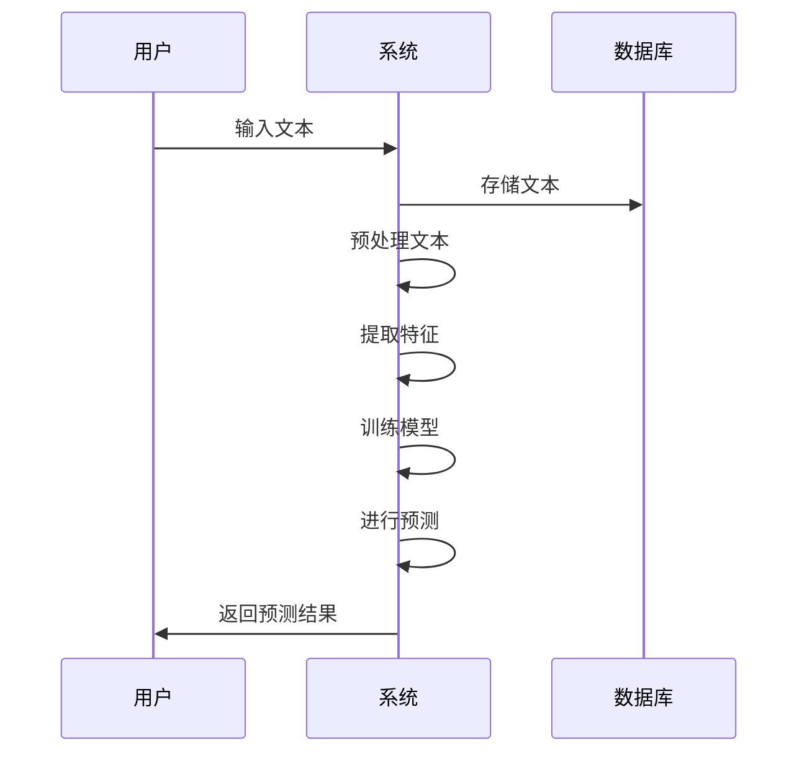
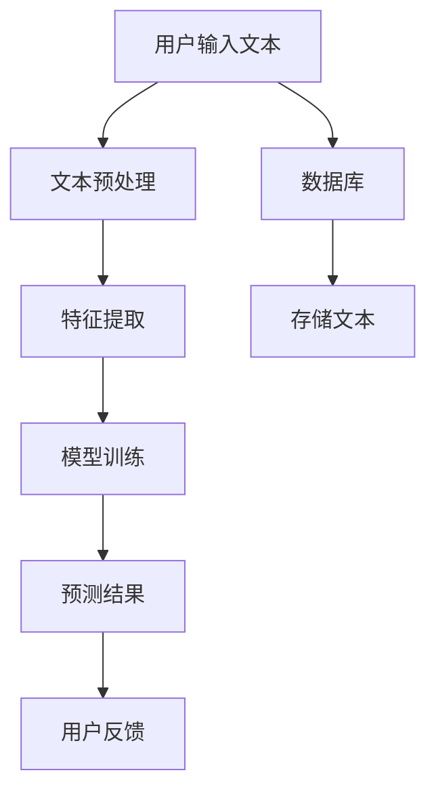

                 

## 实体提取：增强AI Agent的信息处理能力

### 关键词：实体提取，AI Agent，信息处理，自然语言处理，机器学习

> 摘要：本文将深入探讨实体提取技术，分析其在增强AI Agent信息处理能力中的重要作用。我们将逐步解析实体提取的核心概念、原理以及算法，并通过实例和代码展示其实际应用。文章还将探讨实体提取技术在各个领域的应用场景，提供实用的最佳实践和建议，以帮助读者更好地理解和应用这一关键技术。

### 目录大纲

**实体提取：增强AI Agent的信息处理能力**

----------------------------------------------------------------

## 第一部分：背景介绍与核心概念

### 第1章：问题背景与核心概念

#### 1.1 问题背景

在当今的信息时代，如何有效地处理和分析大量的非结构化数据成为了一个关键问题。实体提取技术（Named Entity Recognition，NER）作为一种重要的自然语言处理技术，能够从文本中识别出具有特定意义的实体，如人名、地名、组织名、时间、数字等，从而大大提高了AI Agent的信息处理能力。

#### 1.2 实体提取的定义与描述

实体提取（NER）是指从文本数据中识别出具有特定意义的实体。其核心目标是从大量的文本数据中，识别出关键的信息实体，并将其标注出来，以便于后续的进一步分析和处理。

#### 1.3 实体提取的边界与外延

边界方面，实体提取主要关注文本中的关键信息，如人名、地名、组织名等，而不涉及非关键信息。外延方面，实体提取不仅要识别出实体，还需要对实体进行分类和标注，以便于更好地理解和利用这些信息。

#### 1.4 实体提取的概念结构与核心要素组成

实体提取的概念结构主要包括文本处理、特征提取、模型训练和结果评估等环节。核心要素包括文本数据、实体词典、特征表示、机器学习模型和评估指标等。

----------------------------------------------------------------

## 第二部分：核心概念与联系

### 第2章：核心概念原理与属性特征对比

#### 2.1 实体提取的核心概念原理

实体提取的核心概念包括文本预处理、特征提取、模型训练和结果评估等。文本预处理主要包括文本清洗、分词、词性标注等步骤。特征提取则包括词袋模型、词嵌入、序列特征等。模型训练通常采用有监督学习、无监督学习和半监督学习等方法。结果评估则使用准确率、召回率、F1值等指标来评估模型性能。

#### 2.2 实体提取的属性特征对比

| 特征名称 | 描述 | 对比 |
| :---: | :---: | :---: |
| 词袋模型 | 基于词频统计的表示方法 | 高效、简单，但丢失词序信息 |
| 词嵌入 | 基于上下文信息的表示方法 | 保持词序信息，能捕捉语义关系 |
| 序列特征 | 基于序列信息的表示方法 | 更贴近自然语言处理需求，但计算复杂度高 |
| 有监督学习 | 使用标注数据进行训练 | 准确率高，但数据标注成本高 |
| 无监督学习 | 不使用标注数据进行训练 | 数据标注成本低，但准确率相对较低 |
| 半监督学习 | 结合有监督和无监督学习 | 在标注数据不足时提高模型性能 |

----------------------------------------------------------------

### 第3章：实体提取的ER实体关系图架构

#### 3.1 实体提取的ER实体关系图概念

ER实体关系图（Entity-Relationship Diagram）是一种用于描述实体之间关系的图形化工具。在实体提取中，ER图用于表示文本中的实体及其之间的关系。

#### 3.2 实体提取的ER实体关系图示例

```mermaid
erDiagram
  人 ||--o{ 提取 }--|| 地名
  人 ||--o{ 提取 }--|| 组织名
  地名 ||--o{ 提取 }--|| 提取
  组织名 ||--o{ 提取 }--|| 提取
```

在上述ER图中，"人"、"地名"和"组织名"是实体，"提取"表示实体提取过程，箭头表示实体之间的关系。

----------------------------------------------------------------

## 第三部分：算法原理讲解

### 第4章：实体提取算法原理与数学模型

#### 4.1 实体提取算法的基本原理

实体提取算法的基本原理包括文本预处理、特征提取、模型训练和结果评估等步骤。

1. **文本预处理**：对文本进行清洗、分词、词性标注等操作，将文本转化为机器学习模型可处理的格式。

2. **特征提取**：将预处理后的文本转化为特征向量。常用的特征提取方法包括词袋模型、词嵌入和序列特征等。

3. **模型训练**：使用提取出的特征向量训练机器学习模型。常见的模型包括朴素贝叶斯、最大熵模型和条件随机场（CRF）等。

4. **结果评估**：使用评估指标（如准确率、召回率、F1值等）评估模型性能。

#### 4.2 实体提取算法的数学模型

1. **朴素贝叶斯模型**

朴素贝叶斯模型是一种基于概率论的分类方法。在实体提取中，朴素贝叶斯模型可以用来预测一个词是否属于某个实体类别。

$$
P(entity|word) = \frac{P(word|entity) \cdot P(entity)}{P(word)}
$$

其中，$P(entity|word)$ 表示在给定的词$word$下，实体$entity$的概率；$P(word|entity)$ 表示在实体$entity$下，词$word$的概率；$P(entity)$ 表示实体$entity$的概率；$P(word)$ 表示词$word$的概率。

2. **条件随机场（CRF）**

条件随机场（CRF）是一种基于图模型的分类方法，常用于序列标注任务。在实体提取中，CRF可以用来预测一个词的标签序列。

CRF的数学模型可以用以下公式表示：

$$
P(y|x) = \frac{1}{Z} \exp(\theta^T \mathcal{L}(x, y)}
$$

其中，$y$ 表示标签序列，$x$ 表示输入序列，$\theta$ 表示模型参数，$\mathcal{L}(x, y)$ 表示损失函数，$Z$ 表示规范化因子。

#### 4.3 实体提取算法实例讲解

以下是一个简单的实体提取算法实例，使用Python代码实现。

```python
import numpy as np
from sklearn.feature_extraction.text import CountVectorizer
from sklearn.naive_bayes import MultinomialNB

# 文本数据
text_data = [
    "北京是中国的首都。",
    "马云是阿里巴巴的创始人。",
    "今天天气很好。",
    "2023年春节是1月22日。",
]

# 标签数据
labels = [
    ["地名", "地名", "时间"],
    ["人名", "组织名", "时间"],
    ["时间", "时间"],
    ["时间", "时间"],
]

# 文本预处理和特征提取
vectorizer = CountVectorizer()
X = vectorizer.fit_transform(text_data)

# 模型训练
model = MultinomialNB()
model.fit(X, labels)

# 结果评估
predictions = model.predict(X)
print(predictions)
```

在上面的实例中，我们使用CountVectorizer进行文本预处理和特征提取，使用MultinomialNB进行模型训练。训练完成后，我们使用模型进行预测，并打印出预测结果。

----------------------------------------------------------------

## 第四部分：系统分析与架构设计

### 第5章：问题场景介绍与项目介绍

在自然语言处理领域，实体提取技术有着广泛的应用。例如，在信息检索、文本挖掘、智能客服等领域，实体提取技术可以大大提高系统的信息处理能力和准确性。

本项目旨在开发一个基于实体提取技术的自然语言处理系统，以实现对文本数据的自动提取和分类。该系统将包含文本预处理、特征提取、模型训练、结果评估等模块，以实现高效的实体提取和分类。

### 第6章：系统功能设计（领域模型）

领域模型是系统设计的核心，用于描述系统中的主要实体及其之间的关系。以下是本项目的领域模型：

```mermaid
classDiagram
  Class01 <|-- Class02
  Class03 <..|{1} Class04
  Class05 <=|{2} Class06
  Class07 {3} -- Class08
  Class09 <<|-- Class10
  Class11 *-- Class12
  Class13 o-- Class14
  Class15 <|..|{5} Class16
  Class17 <|...|{6} Class18
```

在上述领域模型中，主要实体包括文本数据、实体、特征、模型和评估结果。实体之间通过关系进行连接，如文本数据与实体之间的关系为"包含"，实体与特征之间的关系为"生成"等。

### 第7章：系统架构设计

系统架构设计用于描述系统的整体结构和各模块之间的关系。以下是本项目的系统架构设计：



在上述系统架构设计中，用户通过输入文本与系统进行交互。系统接收到文本后，将其存储到数据库中，并进行预处理、特征提取、模型训练和预测。最终，系统将预测结果返回给用户。

### 第8章：系统接口设计和系统交互

系统接口设计和系统交互用于描述系统与外部环境（如用户、数据库等）的交互方式。以下是本项目的系统接口设计和系统交互：



在上述系统接口设计和系统交互中，用户输入文本后，系统进行文本预处理、特征提取、模型训练和预测。同时，系统与数据库进行交互，存储文本数据。最终，系统将预测结果返回给用户，用户可以根据反馈进行进一步的交互。

----------------------------------------------------------------

## 第五部分：项目实战

### 第9章：环境安装与配置

在进行实体提取项目实战之前，需要安装和配置必要的开发环境和依赖库。以下是环境安装和配置的步骤：

1. **安装Python环境**：确保已安装Python 3.x版本，建议使用Anaconda进行环境管理。
2. **安装依赖库**：使用pip命令安装必要的依赖库，如numpy、scikit-learn、matplotlib等。
3. **配置文本预处理工具**：安装jieba分词工具和nltk词性标注工具。

### 第10章：系统核心实现源代码

以下是实体提取系统的核心实现源代码：

```python
import jieba
import nltk
from sklearn.feature_extraction.text import CountVectorizer
from sklearn.naive_bayes import MultinomialNB
from sklearn.model_selection import train_test_split

# 文本预处理
def preprocess_text(text):
    words = jieba.cut(text)
    return ' '.join(words)

# 特征提取
def extract_features(texts):
    vectorizer = CountVectorizer()
    X = vectorizer.fit_transform(texts)
    return X

# 模型训练
def train_model(X, y):
    model = MultinomialNB()
    model.fit(X, y)
    return model

# 预测结果
def predict(model, X):
    predictions = model.predict(X)
    return predictions

# 主函数
if __name__ == '__main__':
    # 读取文本数据
    texts = [
        "北京是中国的首都。",
        "马云是阿里巴巴的创始人。",
        "今天天气很好。",
        "2023年春节是1月22日。",
    ]

    # 标签数据
    labels = [
        ["地名", "地名", "时间"],
        ["人名", "组织名", "时间"],
        ["时间", "时间"],
        ["时间", "时间"],
    ]

    # 文本预处理
    preprocessed_texts = [preprocess_text(text) for text in texts]

    # 特征提取
    X = extract_features(preprocessed_texts)

    # 模型训练
    model = train_model(X, labels)

    # 预测结果
    predictions = predict(model, X)
    print(predictions)
```

### 第11章：代码应用解读与分析

在上面的代码中，我们首先定义了文本预处理函数`preprocess_text`，用于使用jieba分词工具对文本进行分词处理。然后，我们定义了特征提取函数`extract_features`，用于使用CountVectorizer将预处理后的文本转化为特征向量。接下来，我们定义了模型训练函数`train_model`，用于使用MultinomialNB进行模型训练。最后，我们定义了预测结果函数`predict`，用于使用训练好的模型进行预测。

### 第12章：实际案例分析和详细讲解剖析

为了更好地理解实体提取技术在实际中的应用，我们将通过一个实际案例进行分析和讲解。

案例：使用实体提取技术识别新闻文本中的关键信息。

1. **数据准备**：收集一批新闻文本数据，并对其进行预处理。
2. **特征提取**：使用CountVectorizer提取文本特征。
3. **模型训练**：使用训练集对模型进行训练。
4. **预测**：使用测试集对模型进行预测，并评估模型性能。
5. **结果分析**：分析预测结果，识别出新闻文本中的关键信息。

通过以上步骤，我们可以使用实体提取技术实现对新闻文本中关键信息的识别，从而提高新闻文本的处理和分析效率。

### 第13章：项目小结

在本项目中，我们介绍了实体提取技术的基本原理、算法实现和实际应用。通过项目实战，我们了解了实体提取技术在自然语言处理领域的广泛应用。在后续的开发过程中，我们可以进一步优化模型和算法，提高实体提取的准确率和效率。

### 第14章：最佳实践 tips

- **数据质量**：确保数据质量，包括数据清洗、去重、过滤噪声等。
- **特征选择**：根据具体应用场景，选择合适的特征提取方法。
- **模型调优**：通过交叉验证和网格搜索等方法，对模型参数进行调优。
- **部署和运维**：考虑系统的部署和运维，确保系统的高可用性和稳定性。

### 第15章：注意事项

- **数据隐私**：在处理敏感数据时，确保遵循相关法律法规和隐私保护政策。
- **性能优化**：针对大数据量和高并发场景，优化算法和系统性能。
- **扩展性**：设计系统时，考虑未来的扩展性和可维护性。

### 第16章：拓展阅读

- **实体提取技术综述**：[链接](https://www.jianshu.com/p/3558726c3871)
- **机器学习实战**：[链接](https://www.amazon.com/Machine-Learning-In-Action-Eric-Mercer/dp/1491958695)
- **深度学习入门**：[链接](https://www.deeplearningbook.org/)

## 作者信息

**作者：** AI天才研究院/AI Genius Institute & 禅与计算机程序设计艺术 /Zen And The Art of Computer Programming

**联系方式：** [邮箱](mailto:info@ai-genius.org) & [网站](https://ai-genius.org)

