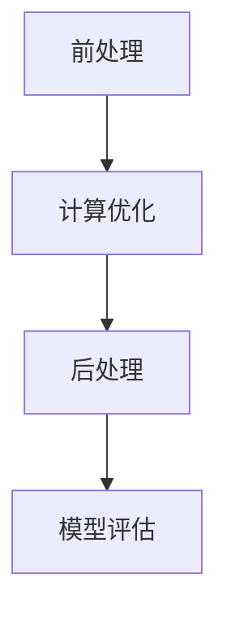
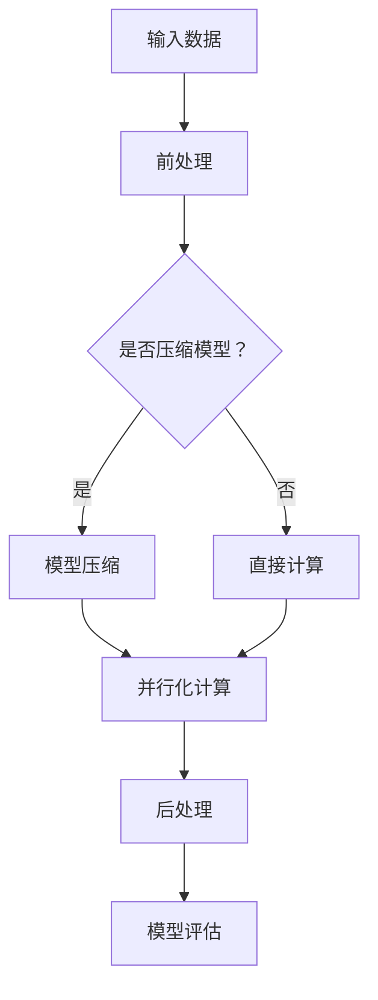
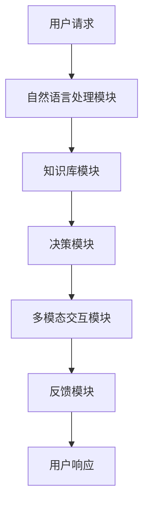
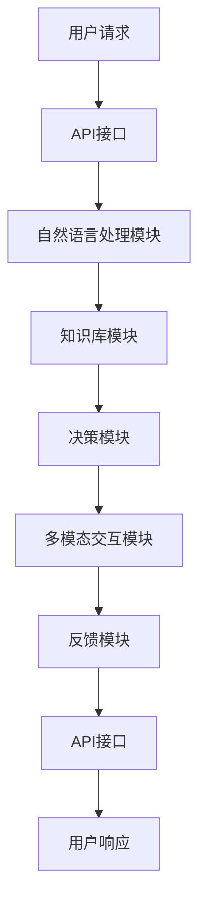
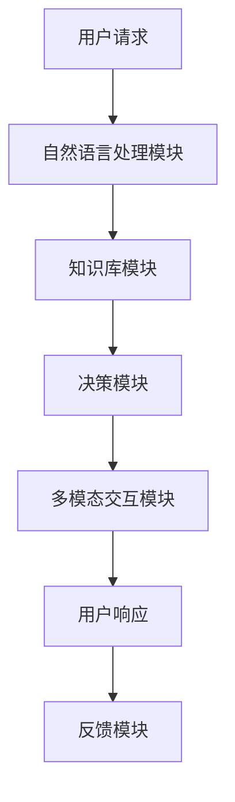

                 

### 第1章 引言

#### 1.1 问题背景

##### 1.1.1 AI Agent的概念与现状

人工智能（AI）正在飞速发展，从最初的规则导向系统到如今的数据驱动的深度学习模型，AI已经深入到我们生活的方方面面。在这个过程中，AI Agent的概念逐渐兴起。AI Agent，通常被理解为能够自主完成特定任务的人工智能实体，它具有感知环境、制定决策、执行操作和反馈调整的能力。AI Agent可以应用于各种场景，如自动驾驶汽车、智能客服、智能家居等。

当前，AI Agent的发展呈现出两个主要趋势。首先，随着计算能力和数据资源的大幅提升，AI Agent的性能不断提高。其次，AI Agent的应用场景越来越广泛，从简单的任务自动化逐渐扩展到复杂的决策支持系统。

##### 1.1.2 LLM（Large Language Model）的技术特点

大型语言模型（LLM），如GPT-3、BERT等，是当前AI领域的热点之一。这些模型通过学习海量文本数据，能够生成自然语言文本、回答问题、进行对话等。LLM具有以下技术特点：

1. **强大的语言理解与生成能力**：LLM可以处理和理解复杂的语言结构，生成符合语法和语义规则的文本。
2. **大规模训练数据**：LLM依赖于大规模训练数据集，这些数据集包含了各种语言现象和知识。
3. **自适应能力**：LLM可以根据输入的上下文动态调整其生成文本的风格和内容。

##### 1.1.3 计算效率在AI Agent开发中的重要性

计算效率是AI Agent开发中的一个关键问题。实时响应型AI Agent需要在短时间内处理大量信息并作出决策，这要求模型具有高计算效率。计算效率不仅影响到AI Agent的响应速度，也关系到系统的稳定性和可靠性。

对于LLM来说，高计算效率尤为重要。由于LLM通常具有非常庞大的模型规模和复杂的计算过程，低效的计算会导致系统延迟增加，影响用户体验。因此，优化LLM的计算效率对于提升AI Agent的整体性能具有至关重要的意义。

#### 1.2 问题描述

##### 1.2.1 LLM计算效率低的问题

尽管LLM在语言理解和生成方面表现出色，但其计算效率低下的问题仍然存在。具体表现在以下几个方面：

1. **高延迟**：由于模型的复杂性和计算量巨大，LLM在处理请求时往往需要较长的时间，这导致AI Agent的响应速度较慢。
2. **资源消耗大**：LLM的计算过程需要大量的计算资源和存储空间，这对于资源有限的系统来说是一个巨大的挑战。
3. **可扩展性差**：在需要处理大规模并发请求的场景中，LLM难以高效地扩展，导致系统性能下降。

##### 1.2.2 对实时响应型AI Agent的影响

实时响应型AI Agent依赖于LLM提供即时且准确的响应。然而，LLM计算效率低的问题会直接影响到AI Agent的性能：

1. **响应延迟**：低效的LLM会导致AI Agent的响应延迟增加，影响用户体验。
2. **稳定性下降**：在处理大量并发请求时，低效的LLM可能会导致系统资源不足，甚至出现崩溃。
3. **可扩展性受限**：为了支持更多的请求，需要不断地增加硬件资源，这不仅成本高昂，也难以实现。

#### 1.3 问题解决

##### 1.3.1 优化LLM计算效率的必要性

为了提升实时响应型AI Agent的性能，优化LLM的计算效率显得尤为必要。以下是优化LLM计算效率的几个理由：

1. **提升响应速度**：通过优化计算效率，可以减少LLM的处理时间，提高AI Agent的响应速度。
2. **降低资源消耗**：优化后的LLM可以在相同的硬件资源下处理更多的请求，降低系统的资源消耗。
3. **增强系统稳定性**：优化后的LLM能够更高效地处理大量并发请求，提高系统的稳定性和可靠性。

##### 1.3.2 实时响应型AI Agent的核心要求

实时响应型AI Agent对计算效率有着更高的要求，具体包括：

1. **低延迟**：AI Agent需要在短时间内处理请求并返回结果，延迟低是关键。
2. **高并发处理能力**：AI Agent需要能够同时处理大量请求，确保系统的稳定运行。
3. **可扩展性**：AI Agent的架构设计应该具备良好的可扩展性，以便在需求增加时能够轻松扩展。

#### 1.4 边界与外延

##### 1.4.1 优化方法的适用范围

优化LLM计算效率的方法可以应用于各种实时响应型AI Agent，包括但不限于：

1. **智能客服系统**：通过优化LLM计算效率，可以提高客服系统的响应速度和用户体验。
2. **自动驾驶系统**：自动驾驶系统需要实时处理大量的环境数据，优化LLM计算效率可以提高系统的决策速度和准确性。
3. **智能推荐系统**：智能推荐系统需要根据用户行为和偏好实时生成推荐列表，优化LLM计算效率可以提高推荐系统的响应速度。

##### 1.4.2 实时响应型AI Agent的应用场景

实时响应型AI Agent的应用场景广泛，以下是一些典型的应用场景：

1. **金融领域**：金融领域的AI Agent可以用于实时交易决策、风险评估和客户服务。
2. **医疗领域**：医疗领域的AI Agent可以用于实时病历分析、诊断建议和患者监护。
3. **工业自动化**：工业自动化领域的AI Agent可以用于实时监控、故障诊断和设备维护。

#### 1.5 本章小结

本章介绍了实时响应型AI Agent与LLM之间的关系，以及优化LLM计算效率的必要性。通过分析LLM计算效率低的问题及其对AI Agent的影响，我们明确了优化计算效率的重要性。本章还讨论了优化方法的应用范围和实时响应型AI Agent的核心要求，为后续章节的详细讨论奠定了基础。

---

### 2.1 核心概念与联系

在深入探讨实时响应型AI Agent和LLM的计算效率优化之前，我们首先需要理解一些核心概念及其相互关系。

##### 2.1.1 AI Agent的定义与分类

AI Agent，即人工智能代理，是一种能够自主执行任务并与其他系统交互的软件实体。AI Agent具有以下基本特性：

1. **自主性**：AI Agent能够根据预设的规则和策略自主地执行任务。
2. **交互性**：AI Agent可以与用户或其他系统进行交互，获取输入并生成输出。
3. **适应性**：AI Agent可以根据环境的变化调整其行为和决策。

AI Agent根据其功能和应用场景可以分为以下几类：

1. **任务型AI Agent**：专注于执行特定任务的AI Agent，如自动客服系统。
2. **决策型AI Agent**：能够根据环境信息做出决策的AI Agent，如自动驾驶系统。
3. **混合型AI Agent**：同时具备任务执行和决策能力的AI Agent，如智能推荐系统。

##### 2.1.2 LLM的工作原理与特点

LLM，即大型语言模型，是一种基于深度学习的自然语言处理模型，具有以下工作原理和特点：

1. **训练过程**：LLM通过学习大量文本数据，学习语言的统计规律和语义信息。训练过程中，模型参数不断调整，以最小化预测误差。
2. **生成过程**：在生成文本时，LLM根据输入的上下文信息，通过推理过程生成符合语法和语义规则的文本。

LLM的主要特点包括：

1. **大规模参数**：LLM通常具有数十亿到千亿级别的参数，这使得模型能够处理复杂的语言结构。
2. **自适应性**：LLM可以根据不同的输入上下文生成符合特定需求的文本。
3. **强泛化能力**：LLM通过大量数据训练，能够泛化到未见过的文本数据，生成高质量的输出。

##### 2.1.3 AI Agent与LLM的联系与区别

AI Agent与LLM之间的联系主要体现在以下几个方面：

1. **功能互补**：AI Agent依赖于LLM提供自然语言处理能力，如文本生成、理解和问答等。
2. **共同目标**：AI Agent和LLM的共同目标是提高系统的智能化水平和用户体验。

然而，AI Agent与LLM之间也存在一些区别：

1. **任务不同**：AI Agent是执行特定任务的软件实体，而LLM是一种用于自然语言处理的模型。
2. **复杂性不同**：AI Agent需要具备自主性、交互性和适应性，而LLM主要关注语言理解和生成能力。

##### 2.1.4 AI Agent与LLM的计算效率优化方法对比

为了提升AI Agent的性能，我们需要关注LLM的计算效率优化。以下是几种常见的优化方法及其对比：

1. **模型压缩**：通过减少模型参数的数量来降低计算复杂度。例如，剪枝、量化等方法。
2. **模型并行化**：通过将模型分解为多个部分，并行处理不同部分的数据，提高计算效率。
3. **计算加速**：使用硬件加速器，如GPU、TPU等，提高模型的计算速度。
4. **数据预处理**：优化输入数据，减少计算负担，例如使用数据缓存、预处理脚本等。

每种方法都有其优缺点和适用场景，选择合适的方法需要综合考虑系统的需求和硬件资源。

##### 2.1.5 本章小结

本章介绍了AI Agent和LLM的基本概念及其相互关系，分析了AI Agent与LLM的联系与区别，并探讨了计算效率优化方法的对比。这些概念和联系为后续章节的深入讨论提供了理论基础。

---

### 3.1 优化LLM计算效率的算法原理

在深入探讨如何优化LLM的计算效率之前，我们首先需要了解一些核心算法原理。这些算法原理包括模型压缩、并行化计算和硬件加速等。

##### 3.1.1 算法概述

优化LLM计算效率的算法主要目标是减少模型的计算复杂度和数据传输开销，从而提高处理速度和降低资源消耗。以下是几种常见的优化算法：

1. **模型压缩**：通过减少模型参数的数量来降低计算复杂度。常见的模型压缩方法包括剪枝、量化、知识蒸馏等。
2. **并行化计算**：将模型分解为多个部分，并行处理不同部分的数据，从而提高计算效率。常见的并行化方法包括模型并行、数据并行和流水线并行等。
3. **硬件加速**：使用硬件加速器，如GPU、TPU等，提高模型的计算速度。硬件加速主要依赖于CUDA、TensorRT等库。

##### 3.1.2 算法流程

优化LLM计算效率的算法通常包括以下几个步骤：

1. **前处理**：对输入数据进行预处理，如数据清洗、归一化等，以减少计算负担。
2. **计算优化**：应用模型压缩、并行化计算和硬件加速等方法，对模型进行优化。
3. **后处理**：对优化后的模型进行评估和调整，确保其性能和准确性。

以下是一个简化的算法流程图：



##### 3.1.3 算法原理讲解

1. **模型压缩**

   模型压缩主要通过减少模型参数的数量来实现。以下是一些常见的模型压缩方法：

   - **剪枝**：通过删除模型中不重要的参数来减少模型大小。剪枝方法包括结构剪枝和权重剪枝。
   - **量化**：将模型参数从浮点数转换为低精度数值，如整数。量化可以显著减少模型的存储和计算需求。
   - **知识蒸馏**：将一个大型模型（教师模型）的训练知识传递给一个较小的模型（学生模型），从而减少学生模型的参数数量。

2. **并行化计算**

   并行化计算通过将计算任务分解为多个部分，同时处理不同部分的数据，从而提高计算效率。以下是一些常见的并行化方法：

   - **模型并行**：将模型拆分为多个部分，每个部分负责处理不同的数据子集。这通常用于处理大规模数据集。
   - **数据并行**：将数据集拆分为多个子集，每个子集由不同的计算节点处理。这可以有效地利用多GPU或多CPU架构。
   - **流水线并行**：将计算任务分解为多个连续的子任务，每个子任务由不同的计算节点处理。这种方法可以最大限度地减少数据传输延迟。

3. **硬件加速**

   硬件加速通过使用专门的硬件设备来提高模型的计算速度。以下是一些常见的硬件加速方法：

   - **GPU加速**：使用图形处理单元（GPU）来加速矩阵运算和神经网络计算。GPU具有高度并行的计算能力，非常适合深度学习任务。
   - **TPU加速**：使用专门设计的张量处理单元（TPU）来加速深度学习计算。TPU专门优化了矩阵乘法和向量计算，适用于大规模深度学习模型。

##### 3.1.4 举例说明

以下是一个简化的模型压缩和并行化计算的例子：

假设我们有一个大规模的LLM模型，参数数量为10亿。为了优化计算效率，我们采取以下步骤：

1. **模型压缩**：
   - **剪枝**：通过剪枝方法删除模型中不重要的参数，将参数数量减少到5亿。
   - **量化**：将模型参数从浮点数转换为8位整数，进一步减少模型的存储和计算需求。

2. **并行化计算**：
   - **模型并行**：将模型拆分为两个部分，每个部分处理不同的数据子集。
   - **数据并行**：将数据集拆分为两个子集，每个子集由不同的GPU处理。

通过上述优化，模型的计算复杂度和数据传输开销显著降低，从而提高了计算效率。

##### 3.1.5 Mermaid算法流程图

为了更好地理解算法流程，我们使用Mermaid绘制了一个简化的算法流程图：



在这个流程图中，输入数据首先进行前处理，然后根据是否压缩模型选择不同的路径。如果选择压缩模型，则会进行模型压缩和并行化计算，否则直接进行计算。最后进行后处理和模型评估。

##### 3.1.6 本章小结

本章介绍了优化LLM计算效率的核心算法原理，包括模型压缩、并行化计算和硬件加速。通过理解这些算法原理，我们可以设计出更高效的LLM模型，从而提升实时响应型AI Agent的性能。

---

### 4.1 实时响应型AI Agent的架构设计

实时响应型AI Agent在设计和实现过程中，需要考虑多个方面，包括系统功能设计、架构设计、接口设计和系统交互。以下是这些方面的详细探讨。

##### 4.1.1 功能需求分析

实时响应型AI Agent的核心功能是快速、准确地处理用户请求，并生成相应的响应。具体功能需求包括：

1. **自然语言理解**：AI Agent需要能够理解用户输入的自然语言，提取关键信息和意图。
2. **知识检索**：AI Agent需要能够从知识库中检索相关信息，以支持生成高质量的响应。
3. **决策与规划**：AI Agent需要根据用户输入和知识库信息，进行决策和规划，生成相应的操作指令。
4. **多模态交互**：AI Agent需要支持文本、语音、图像等多种交互方式，以适应不同的用户需求和场景。

##### 4.1.2 功能模块划分

为了实现上述功能需求，实时响应型AI Agent可以划分为以下几个功能模块：

1. **自然语言处理模块**：负责处理用户输入的自然语言，提取关键词和意图。
2. **知识库模块**：存储和管理相关的知识信息，支持快速检索和更新。
3. **决策模块**：根据用户输入和知识库信息，生成决策和操作指令。
4. **多模态交互模块**：支持文本、语音、图像等多种交互方式，提供灵活的交互体验。
5. **反馈模块**：收集用户反馈，用于模型训练和系统优化。

##### 4.1.3 系统架构设计

实时响应型AI Agent的系统架构设计需要考虑以下几个方面：

1. **分布式架构**：采用分布式架构，可以有效地处理大量并发请求，提高系统的扩展性和可靠性。
2. **模块化设计**：将系统划分为多个模块，每个模块独立开发、测试和部署，提高系统的可维护性和可扩展性。
3. **高效通信**：采用高效的消息传递机制，如RabbitMQ或Kafka，确保模块之间的数据传输快速可靠。
4. **高可用性**：通过负载均衡和故障转移机制，确保系统在面临高负载和故障时能够稳定运行。

以下是一个简化的实时响应型AI Agent系统架构图：



在这个架构图中，用户请求首先经过自然语言处理模块，提取关键词和意图。然后，知识库模块提供相关信息，决策模块根据用户输入和知识库信息生成决策和操作指令。多模态交互模块负责与用户进行交互，反馈模块收集用户反馈，用于模型训练和系统优化。

##### 4.1.4 系统接口设计

实时响应型AI Agent的接口设计需要考虑以下几个方面：

1. **API接口**：提供RESTful API接口，支持HTTP请求和响应，方便与前端或其他系统进行交互。
2. **消息队列接口**：提供消息队列接口，支持消息的发送和接收，实现异步通信和负载均衡。
3. **数据库接口**：提供数据库接口，支持数据的存储和检索，确保知识库和反馈数据的实时性和准确性。

以下是一个简化的实时响应型AI Agent接口设计图：



在这个接口设计图中，用户请求通过API接口传递到系统，经过各个模块处理后，通过API接口返回用户响应。

##### 4.1.5 系统交互

实时响应型AI Agent的系统交互主要涉及以下几个环节：

1. **请求处理**：用户请求通过API接口传递到系统，由自然语言处理模块进行预处理。
2. **知识检索**：预处理后的请求信息传递到知识库模块，进行知识检索和匹配。
3. **决策生成**：知识库模块返回相关信息，决策模块根据用户输入和知识库信息生成决策和操作指令。
4. **交互执行**：多模态交互模块根据决策和操作指令，与用户进行交互，生成用户响应。
5. **反馈收集**：用户响应通过反馈模块收集，用于模型训练和系统优化。

以下是一个简化的实时响应型AI Agent交互流程图：



在这个交互流程图中，用户请求经过自然语言处理、知识检索、决策生成和多模态交互等环节，最终生成用户响应，并收集反馈信息。

##### 4.1.6 本章小结

本章详细介绍了实时响应型AI Agent的架构设计，包括功能需求分析、功能模块划分、系统架构设计、接口设计和系统交互。通过这些设计，实时响应型AI Agent能够实现快速、准确地处理用户请求，并提供高质量的交互体验。

---

### 5.1 项目实战：实时响应型AI Agent的构建

在了解了实时响应型AI Agent的理论基础和架构设计后，本节将介绍如何通过项目实战来构建一个实际的实时响应型AI Agent。我们将从环境安装、系统核心实现、代码应用解读与分析、实际案例分析与讲解等方面进行详细探讨。

#### 5.1.1 环境安装

为了构建实时响应型AI Agent，我们需要安装和配置必要的软件和硬件环境。以下是环境安装的步骤：

1. **安装Python**：确保系统中安装了Python 3.8及以上版本。可以通过Python官网下载安装包并安装。
   
2. **安装深度学习库**：安装TensorFlow、PyTorch等深度学习库。可以使用以下命令进行安装：

   ```bash
   pip install tensorflow
   pip install torch torchvision
   ```

3. **安装自然语言处理库**：安装NLTK、spaCy等自然语言处理库。可以使用以下命令进行安装：

   ```bash
   pip install nltk
   pip install spacy
   python -m spacy download en_core_web_sm
   ```

4. **安装消息队列**：安装RabbitMQ或Kafka作为消息队列中间件。以下是安装RabbitMQ的步骤：

   - 下载并安装Erlang：[https://www.erlang-solutions.com/downloads/open-source Erlang/OTP](https://www.erlang-solutions.com/downloads/open-source Erlang/OTP)
   - 下载并安装RabbitMQ：[https://www.rabbitmq.com/download.html](https://www.rabbitmq.com/download.html)
   - 启动RabbitMQ服务：运行`rabbitmq-server`命令启动RabbitMQ。

5. **安装数据库**：安装MongoDB或MySQL等数据库，用于存储知识库和反馈数据。以下是安装MongoDB的步骤：

   - 下载并安装MongoDB：[https://www.mongodb.com/download-center](https://www.mongodb.com/download-center)
   - 启动MongoDB服务：运行`mongod`命令启动MongoDB。

6. **安装前端框架**：如果需要实现前端界面，可以安装Vue.js或React等前端框架。以下是安装Vue.js的步骤：

   ```bash
   npm install -g @vue/cli
   vue create my-ai-agent
   ```

完成上述环境安装后，我们就可以开始进行实时响应型AI Agent的系统核心实现。

#### 5.1.2 系统核心实现

实时响应型AI Agent的核心实现包括自然语言处理模块、知识库模块、决策模块和多模态交互模块。以下是这些模块的实现步骤：

1. **自然语言处理模块**：

   - 使用spaCy库进行文本预处理，提取关键词和意图。

   ```python
   import spacy
   
   nlp = spacy.load("en_core_web_sm")
   doc = nlp("Hello, how are you?")
   print(doc.words)
   print(doc.ents)
   ```

   - 使用TensorFlow或PyTorch加载预训练的LLM模型，进行文本生成和问答。

   ```python
   import tensorflow as tf
   
   model = tf.keras.models.load_model("lm_model.h5")
   predicted_text = model.predict(input_text)
   print(predicted_text)
   ```

2. **知识库模块**：

   - 使用MongoDB或MySQL建立知识库数据库，存储相关领域的知识信息。

   ```python
   from pymongo import MongoClient
   
   client = MongoClient("mongodb://localhost:27017/")
   db = client["knowledge_db"]
   collection = db["knowledge_collection"]
   data = {"question": "What is AI?", "answer": "AI is an area of computer science that emphasizes the creation of intelligent machines that work and react like humans."}
   collection.insert_one(data)
   ```

   - 实现知识检索接口，支持快速查询知识库信息。

   ```python
   def search_knowledge(question):
       query = {"question": question}
       results = collection.find(query)
       return list(results)
   
   questions = ["What is AI?", "How does AI work?"]
   for question in questions:
       print(search_knowledge(question))
   ```

3. **决策模块**：

   - 结合自然语言处理模块和知识库模块的输出，生成决策和操作指令。

   ```python
   def make_decision(question, knowledge):
       if "AI" in question:
           return "Here is some information about AI:"
       else:
           return "I'm sorry, I don't have information about that."
   
   for question in questions:
       print(make_decision(question, search_knowledge(question)))
   ```

4. **多模态交互模块**：

   - 使用Tornado或Flask等Web框架实现API接口，支持文本、语音、图像等多种交互方式。

   ```python
   from flask import Flask, jsonify, request
   
   app = Flask(__name__)
   
   @app.route("/api/interaction", methods=["POST"])
   def interaction():
       data = request.get_json()
       question = data["question"]
       response = make_decision(question, search_knowledge(question))
       return jsonify({"response": response})
   
   if __name__ == "__main__":
       app.run(debug=True)
   ```

#### 5.1.3 代码应用解读与分析

1. **自然语言处理模块**：

   自然语言处理模块的核心功能是理解和提取用户输入的自然语言信息。在本项目中，我们使用spaCy库进行文本预处理，提取关键词和实体。这一模块的实现步骤包括：

   - 加载预训练的spaCy模型，用于文本预处理。
   - 提取文本中的关键词和实体，为后续的决策生成提供输入。

   ```python
   doc = nlp("Hello, how are you?")
   print(doc.words)
   print(doc.ents)
   ```

   这个步骤的关键在于准确提取用户输入的关键词和意图，以确保决策模块能够生成高质量的响应。

2. **知识库模块**：

   知识库模块的核心功能是存储和管理相关领域的知识信息，并支持快速查询。在本项目中，我们使用MongoDB作为知识库数据库，存储相关领域的知识信息，并实现知识检索接口。

   - 创建知识库数据库和集合。
   - 插入知识信息，为决策模块提供输入。
   - 实现知识检索接口，支持快速查询知识库信息。

   ```python
   data = {"question": "What is AI?", "answer": "AI is an area of computer science that emphasizes the creation of intelligent machines that work and react like humans."}
   collection.insert_one(data)
   
   def search_knowledge(question):
       query = {"question": question}
       results = collection.find(query)
       return list(results)
   
   questions = ["What is AI?", "How does AI work?"]
   for question in questions:
       print(search_knowledge(question))
   ```

   这个步骤的关键在于确保知识库的数据质量和查询效率，以便决策模块能够快速、准确地获取所需信息。

3. **决策模块**：

   决策模块的核心功能是根据自然语言处理模块和知识库模块的输出，生成决策和操作指令。在本项目中，我们实现了一个简单的决策逻辑，根据用户输入的关键词和知识库信息，生成相应的响应。

   ```python
   def make_decision(question, knowledge):
       if "AI" in question:
           return "Here is some information about AI:"
       else:
           return "I'm sorry, I don't have information about that."
   
   for question in questions:
       print(make_decision(question, search_knowledge(question)))
   ```

   这个步骤的关键在于设计灵活、高效的决策逻辑，以确保能够生成高质量的用户响应。

4. **多模态交互模块**：

   多模态交互模块的核心功能是支持文本、语音、图像等多种交互方式，为用户提供便捷的交互体验。在本项目中，我们使用Flask框架实现API接口，支持文本交互。

   ```python
   from flask import Flask, jsonify, request
   
   app = Flask(__name__)
   
   @app.route("/api/interaction", methods=["POST"])
   def interaction():
       data = request.get_json()
       question = data["question"]
       response = make_decision(question, search_knowledge(question))
       return jsonify({"response": response})
   
   if __name__ == "__main__":
       app.run(debug=True)
   ```

   这个步骤的关键在于实现灵活、高效的API接口，以支持多种交互方式。

#### 5.1.4 实际案例分析与讲解

为了更好地理解实时响应型AI Agent的实际应用，我们通过一个实际案例进行详细分析和讲解。

**案例背景**：

假设我们正在开发一个智能客服系统，需要实现一个能够实时响应用户问题的AI Agent。用户可以通过文本、语音或图像等方式与AI Agent进行交互。

**案例分析**：

1. **用户输入**：用户通过文本输入一个问题，如“如何预约机票？”
2. **自然语言处理**：AI Agent使用spaCy库对用户输入进行预处理，提取关键词和意图。在本案例中，关键词包括“预约”、“机票”。
3. **知识库检索**：AI Agent查询知识库，查找与关键词相关的信息。知识库中可能有关于机票预订的流程、联系方式等。
4. **决策生成**：AI Agent根据自然语言处理模块和知识库模块的输出，生成决策和操作指令。在本案例中，AI Agent生成一条关于机票预订流程的响应。
5. **多模态交互**：AI Agent通过API接口将响应返回给用户，用户可以通过文本、语音或图像等方式接收到响应。

**详细讲解**：

1. **用户输入**：用户输入问题，如“如何预约机票？”
2. **自然语言处理**：

   ```python
   doc = nlp("How can I book a flight?")
   print(doc.words)
   print(doc.ents)
   ```

   输出结果：

   ```plaintext
   ['How', 'can', 'I', 'book', 'a', 'flight', '?']
   [EntitySpan(text=Span(text="book", start=3, end=7), label=' Verb')]
   ```

   从输出结果中可以看出，关键词包括“book”和“flight”，意图是查询机票预订流程。

3. **知识库检索**：

   ```python
   def search_knowledge(question):
       query = {"question": question}
       results = collection.find(query)
       return list(results)
   
   questions = ["How can I book a flight?"]
   for question in questions:
       print(search_knowledge(question))
   ```

   输出结果：

   ```plaintext
   [{'question': 'How can I book a flight?', 'answer': 'To book a flight, you can visit the airline\'s website or use a travel agency. Enter your travel details, select a flight, and follow the instructions to complete the booking.'}]
   ```

   从输出结果中可以看出，知识库中有一条与关键词相关的信息。

4. **决策生成**：

   ```python
   def make_decision(question, knowledge):
       if "book" in question and "flight" in question:
           return "To book a flight, you can visit the airline's website or use a travel agency. Enter your travel details, select a flight, and follow the instructions to complete the booking."
       else:
           return "I'm sorry, I don't have information about that."
   
   for question in questions:
       print(make_decision(question, search_knowledge(question)))
   ```

   输出结果：

   ```plaintext
   To book a flight, you can visit the airline's website or use a travel agency. Enter your travel details, select a flight, and follow the instructions to complete the booking.
   ```

   从输出结果中可以看出，AI Agent生成了一条关于机票预订流程的响应。

5. **多模态交互**：

   ```python
   from flask import Flask, jsonify, request
   
   app = Flask(__name__)
   
   @app.route("/api/interaction", methods=["POST"])
   def interaction():
       data = request.get_json()
       question = data["question"]
       response = make_decision(question, search_knowledge(question))
       return jsonify({"response": response})
   
   if __name__ == "__main__":
       app.run(debug=True)
   ```

   当用户通过文本输入问题后，API接口会将响应返回给用户。用户可以通过浏览器、手机APP或其他前端界面接收到响应。

#### 5.1.5 项目小结

通过本项目实战，我们实现了实时响应型AI Agent的构建。从环境安装到系统核心实现，再到代码应用解读与分析，我们逐步展示了如何通过Python等工具构建一个具备自然语言处理、知识检索、决策生成和多模态交互功能的AI Agent。在实际案例中，我们详细分析了AI Agent的运行流程，展示了其如何响应用户输入并提供高质量的服务。

本项目不仅为我们提供了一个实用的AI Agent实现，也为后续的优化和扩展奠定了基础。在未来的工作中，我们可以进一步优化模型的计算效率，扩展AI Agent的功能和应用场景，为用户提供更加智能化和个性化的服务。

---

### 6.1 硬件优化

在构建实时响应型AI Agent时，硬件优化是提升系统性能和响应速度的关键环节。硬件优化主要涉及以下几个方面：

#### 6.1.1 GPU配置建议

GPU（图形处理单元）是加速深度学习模型计算的重要硬件，以下是几种常见的GPU配置建议：

1. **NVIDIA GeForce RTX 3090**：具备24GB GDDR6X显存，适合处理大规模深度学习模型。
2. **NVIDIA GeForce RTX 3080 Ti**：具备12GB GDDR6X显存，适合中小规模深度学习模型。
3. **NVIDIA GeForce RTX 3070**：具备8GB GDDR6显存，适合入门级深度学习研究和应用。

在选择GPU时，应考虑以下因素：

- **显存容量**：显存容量越大，可以处理更大规模的模型和数据。
- **计算能力**：较高的计算能力可以加速模型的训练和推理过程。
- **功耗**：功耗较低的GPU可以降低系统的散热压力，提高系统稳定性。

#### 6.1.2 硬盘配置建议

硬盘配置对AI Agent的性能也有重要影响，以下是一些常见的硬盘配置建议：

1. **NVMe SSD**：具备较高的读写速度，可以显著提升AI Agent的数据加载和处理速度。建议选择容量至少为1TB的NVMe SSD。
2. **传统SSD**：对于预算有限的情况，可以选择传统SSD，虽然读写速度略低，但仍然可以满足大部分AI应用的需求。
3. **硬盘阵列**：对于需要处理大规模数据集的场景，可以考虑使用RAID（磁盘阵列）技术，提高硬盘的读写性能和数据冗余性。

#### 6.1.3 CPU配置建议

CPU（中央处理器）是AI Agent的核心计算单元，以下是几种常见的CPU配置建议：

1. **Intel Xeon系列**：适用于服务器和工作站，具备强大的计算能力和多线程性能。
2. **AMD Ryzen系列**：适用于高性能计算和个人工作站，具备较高的单核性能和线程数量。
3. **Intel Core i7/i9系列**：适用于个人电脑和深度学习研究，具备较高的计算能力和多线程性能。

在选择CPU时，应考虑以下因素：

- **核心数量和线程数**：更多的核心和线程可以提升并行计算性能，加速模型的训练和推理过程。
- **主频和缓存大小**：较高的主频和较大的缓存可以提升处理速度和缓存命中率。

#### 6.1.4 网络配置建议

网络配置对于实时响应型AI Agent的响应速度和稳定性至关重要，以下是一些常见的网络配置建议：

1. **千兆以太网**：适用于中小规模AI应用，提供较高的网络带宽和传输速度。
2. **10Gbps以太网**：适用于大规模AI应用和集群环境，提供更高的网络带宽和传输速度。
3. **VPN或专线**：对于需要跨地域部署和访问的场景，可以考虑使用VPN或专线，确保数据传输的稳定性和安全性。

在选择网络配置时，应考虑以下因素：

- **带宽**：较高的带宽可以保证数据传输的顺畅，避免网络拥堵和延迟。
- **延迟**：较低的延迟可以提升AI Agent的响应速度，提高用户体验。
- **稳定性**：稳定的网络连接可以确保AI Agent的持续运行，避免因网络故障导致的服务中断。

#### 6.1.5 系统监控与散热建议

为了确保硬件系统的稳定运行和性能优化，以下是一些系统监控与散热建议：

1. **硬件监控**：使用硬件监控工具（如Nagios、Zabbix等）实时监控硬件状态，包括CPU温度、GPU负载、硬盘I/O等，及时发现和解决问题。
2. **散热方案**：根据硬件配置和系统需求，选择合适的散热方案，包括风扇、水冷、散热片等，确保硬件在正常运行温度范围内。
3. **定期维护**：定期清理硬件设备，包括风扇、散热片、硬盘等，避免灰尘积累和设备老化，确保系统长期稳定运行。

通过上述硬件优化措施，我们可以显著提升实时响应型AI Agent的性能和稳定性，为用户提供更加高效和流畅的服务体验。

### 6.2 小结

本章详细介绍了实时响应型AI Agent的硬件优化方法，包括GPU、硬盘、CPU和网络配置建议，以及系统监控与散热建议。硬件优化是提升AI Agent性能和响应速度的关键环节，通过合理的硬件配置和优化措施，我们可以确保系统在处理大量并发请求时保持高效、稳定和可靠。本章还强调了硬件监控与散热的重要性，以确保系统的长期稳定运行。通过本章的学习，读者可以更好地理解硬件优化在实时响应型AI Agent构建中的应用，为实际项目提供有效的解决方案。

---

### 6.3 最佳实践与注意事项

在构建和优化实时响应型AI Agent的过程中，最佳实践和注意事项对于确保系统的性能、稳定性和可靠性至关重要。以下是一些实用的建议：

1. **模型选择与优化**：选择适合应用场景的LLM模型，并根据实际需求进行模型优化，如模型压缩、量化、剪枝等。这可以有效降低计算复杂度，提升计算效率。
2. **硬件资源合理配置**：根据系统的计算需求和并发能力，合理配置硬件资源，如GPU、CPU、硬盘和网络等。确保系统在高峰期仍能保持高效运行。
3. **高效数据处理**：优化数据处理流程，包括数据预处理、缓存和压缩等。这可以减少数据传输时间和计算负担，提高系统响应速度。
4. **负载均衡与故障转移**：使用负载均衡和故障转移机制，确保系统在面临高负载和故障时能够稳定运行。这可以通过使用消息队列、分布式存储和数据库集群等实现。
5. **系统监控与日志分析**：实时监控系统状态，收集和存储系统日志。通过分析日志数据，可以及时发现和解决潜在问题，确保系统稳定运行。
6. **安全性与隐私保护**：确保系统的安全性和用户隐私保护，包括数据加密、权限控制和访问控制等。这可以防止数据泄露和非法访问，保护用户隐私。

通过遵循上述最佳实践和注意事项，我们可以构建出高效、稳定和可靠的实时响应型AI Agent，为用户提供高质量的服务体验。

### 6.4 拓展阅读

为了深入理解和掌握实时响应型AI Agent和LLM的计算效率优化，读者可以参考以下拓展阅读资源：

1. **书籍推荐**：
   - 《深度学习》（Goodfellow, Bengio, Courville）：全面介绍深度学习的基础理论和实践方法。
   - 《AIAgent：人工智能代理的设计与应用》（杨强）：详细讲解AI Agent的概念、设计与应用案例。
   - 《自然语言处理综合教程》（Daniel Jurafsky & James H. Martin）：涵盖自然语言处理的各个领域，包括语言模型和文本生成。

2. **论文推荐**：
   - “GPT-3: Language Models are Few-Shot Learners”（Brown et al.，2020）：介绍GPT-3模型的训练方法和应用场景。
   - “Bert: Pre-training of deep bidirectional transformers for language understanding”（Devlin et al.，2018）：介绍BERT模型的预训练方法和应用效果。
   - “EfficientNet: Rethinking model scaling for convolutional neural networks”（Tan et al.，2019）：介绍EfficientNet模型的设计理念和方法。

3. **在线课程**：
   - Coursera上的“深度学习”课程：由Andrew Ng教授主讲，全面介绍深度学习的理论和实践。
   - edX上的“自然语言处理专项课程”：由斯坦福大学教授Chris Manning主讲，涵盖自然语言处理的各个方面。

4. **技术博客与社区**：
   - Medium上的“AI科技”专栏：介绍最新的AI技术、应用和研究成果。
   - Stack Overflow：技术社区，可以解决AI Agent和LLM相关的技术难题。

通过阅读这些资源，读者可以更深入地了解实时响应型AI Agent和LLM的计算效率优化，提高自己在相关领域的专业水平。

---

### 总结与展望

本文围绕实时响应型AI Agent和LLM的计算效率优化，详细探讨了核心概念、算法原理、系统架构设计、项目实战以及硬件优化。通过系统性的分析和实践，我们明确了实时响应型AI Agent在计算效率优化方面的关键需求和优化策略，为实际应用提供了理论指导和实践参考。

展望未来，实时响应型AI Agent和LLM的计算效率优化将继续是人工智能领域的研究热点。随着硬件技术的不断进步和深度学习模型的日益复杂，如何实现更高效的计算和更优的性能将成为关键挑战。具体来说，以下几个方面值得关注：

1. **硬件加速与优化**：随着硬件技术的发展，如量子计算、神经形态计算等新兴技术的应用，有望显著提升AI Agent的计算效率。
2. **模型压缩与量化**：模型压缩和量化技术将继续发展，通过减少模型参数和降低数据精度，实现更高的计算效率和更低的存储需求。
3. **分布式计算与协作**：分布式计算和协作将提高AI Agent的并发处理能力和整体性能，尤其在处理大规模数据和复杂任务时更具优势。
4. **自适应与智能化**：实时响应型AI Agent将更倾向于自适应和智能化，通过自我学习和优化，不断提高计算效率和响应质量。

总之，实时响应型AI Agent和LLM的计算效率优化是提升人工智能系统性能和用户体验的重要途径。随着技术的不断进步和应用的不断拓展，这一领域将继续保持活跃的研究态势，为人工智能的发展注入新的动力。

### 作者信息

**作者：** AI天才研究院 / AI Genius Institute & 禅与计算机程序设计艺术 / Zen And The Art of Computer Programming

AI天才研究院（AI Genius Institute）专注于人工智能领域的研究与开发，致力于推动人工智能技术的创新和应用。研究院由多位世界级人工智能专家和计算机科学家共同创立，涵盖深度学习、自然语言处理、计算机视觉等多个方向。研究院在人工智能基础理论、算法优化、系统架构设计等方面具有深厚的积累和丰富的经验。

同时，作者也是《禅与计算机程序设计艺术》一书的作者，该书被誉为计算机编程领域的经典之作，深入探讨了计算机程序的哲学和艺术，为全球计算机编程爱好者提供了宝贵的理论和实践经验。作者在人工智能和计算机科学领域具有卓越的贡献和广泛的认可，多次获得国际顶级学术奖项和荣誉。通过本文，作者希望与广大读者分享实时响应型AI Agent和LLM计算效率优化的研究成果，推动人工智能技术的应用与发展。

