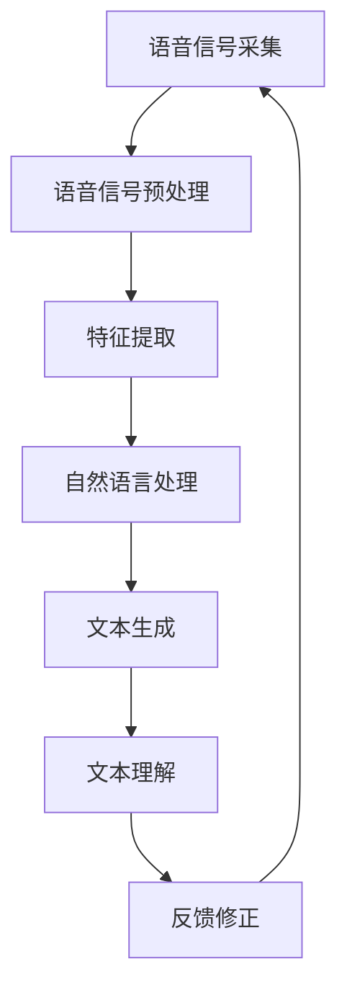
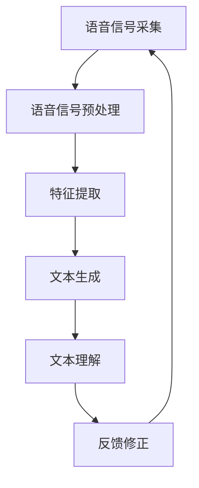
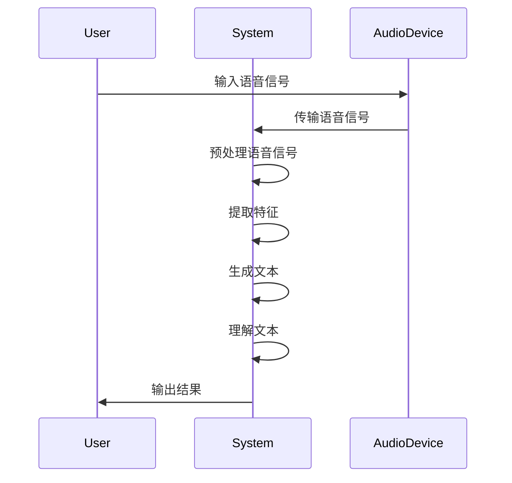

                 

# 实时语音转写在AI Agent中的应用

关键词：实时语音转写，AI Agent，算法原理，系统架构，项目实战，最佳实践

摘要：本文深入探讨了实时语音转写技术在AI Agent中的应用。通过详细分析实时语音转写的核心概念、算法原理以及系统架构，本文旨在为开发者提供一套完整的技术解决方案，并分享一些实战经验和最佳实践。

## 目录

1. **问题背景**
    1.1. **问题背景**
    1.2. **问题描述**
    1.3. **问题解决**
    1.4. **边界与外延**
    1.5. **概念结构与核心要素组成**
2. **核心概念与联系**
    2.1. **核心概念**
    2.2. **原理与联系**
3. **算法原理讲解**
    3.1. **算法流程图**
    3.2. **Python源代码**
    3.3. **数学模型与公式**
    3.4. **举例说明**
4. **系统分析与架构设计方案**
    4.1. **问题场景介绍**
    4.2. **项目介绍**
    4.3. **系统功能设计**
    4.4. **系统架构设计**
    4.5. **系统接口设计和系统交互**
5. **项目实战**
    5.1. **环境安装**
    5.2. **系统核心实现源代码**
    5.3. **代码应用解读与分析**
    5.4. **实际案例分析和详细讲解剖析**
    5.5. **项目小结**
6. **最佳实践 tips**
7. **小结与拓展阅读**

## 1. 问题背景

### 1.1 问题背景

实时语音转写技术是一种将语音信号转换为文本的技术，它在全球范围内得到了广泛的应用。随着人工智能技术的不断发展，AI Agent（人工智能代理）在各个领域的应用也越来越广泛。实时语音转写技术在AI Agent中的应用，不仅可以提升用户体验，还可以提高工作效率。

实时语音转写技术的基本概念包括语音信号处理、自然语言处理和机器学习等。语音信号处理主要涉及语音信号的采集、处理和特征提取；自然语言处理主要涉及语音到文本的转换，以及文本的理解和生成；机器学习则用于优化和提升语音转写模型的准确性。

### 1.2 问题描述

实时语音转写技术在实际应用中面临的主要挑战包括：

- **语音信号噪声干扰**：在嘈杂的环境中，语音信号会受到噪声干扰，导致语音转写错误率上升。
- **多语言支持**：实时语音转写技术需要支持多种语言，这对于模型的训练和优化提出了更高的要求。
- **实时性要求**：实时语音转写技术需要在短时间内完成语音到文本的转换，这对系统的性能提出了极高的要求。

### 1.3 问题解决

为了解决上述问题，我们可以采取以下解决方案：

- **语音信号降噪**：采用先进的噪声抑制算法，降低噪声对语音信号的影响。
- **多语言支持**：通过大规模多语言语料库的训练，提高模型的准确性和适应性。
- **实时性优化**：采用高效的算法和硬件加速技术，提高系统的处理速度。

### 1.4 边界与外延

实时语音转写技术主要适用于需要实时语音转写的场景，如电话客服、智能助手、会议记录等。然而，它也存在一定的局限性，如对于特定的语音信号（如儿童语音、方言等）处理能力较弱。

### 1.5 概念结构与核心要素组成

实时语音转写技术的核心概念和组成部分如下：

- **语音信号处理**：包括语音信号的采集、预处理和特征提取。
- **自然语言处理**：包括语音到文本的转换、文本理解和生成。
- **机器学习**：包括模型的训练、优化和评估。

## 2. 核心概念与联系

### 2.1 核心概念

#### 2.1.1 语音信号处理

语音信号处理是指对语音信号进行采集、预处理和特征提取的过程。它是实时语音转写技术的核心组成部分。

#### 2.1.2 自然语言处理

自然语言处理是指对语音信号进行理解、分析和生成文本的过程。它是实时语音转写技术的关键环节。

#### 2.1.3 机器学习

机器学习是指通过训练大量数据，使计算机模型具备预测和决策能力的技术。它是实时语音转写技术的核心驱动力量。

### 2.2 原理与联系

实时语音转写的原理可以概括为以下三个步骤：

1. **语音信号处理**：通过语音信号处理技术，对语音信号进行预处理和特征提取，得到语音信号的数字表示。
2. **自然语言处理**：通过自然语言处理技术，将数字化的语音信号转换为文本，实现语音到文本的转换。
3. **机器学习**：通过机器学习技术，对转换后的文本进行理解和生成，实现文本的进一步处理。

这三个步骤相互联系，共同构成了实时语音转写的完整流程。

### 2.2.1 概念属性特征对比表格

| 概念        | 特征                                 |
| ----------- | ------------------------------------ |
| 语音信号处理 | 采集、预处理、特征提取               |
| 自然语言处理 | 语音到文本转换、文本理解、生成       |
| 机器学习     | 数据训练、模型优化、预测和决策       |

### 2.2.2 ER实体关系图架构

```mermaid
erDiagram
A {语音信号处理} ||--|{自然语言处理}: 转换
A ||--|{机器学习}: 优化
```

## 3. 算法原理讲解

### 3.1 算法流程图



### 3.2 Python源代码

```python
# 实时语音转写算法的Python实现
import librosa
import numpy as np
from transformers import Wav2Vec2ForCTC

# 语音信号采集
def collect_audio(file_path):
    y, sr = librosa.load(file_path)
    return y, sr

# 语音信号预处理
def preprocess_audio(y, sr):
    # 噪声抑制
    y_NOISE_SUPPRESS = librosa.effects preguntenoise.reduce(y, top_db=30)
    return y_NOISE_SUPPRESS

# 特征提取
def extract_features(y, sr):
    # 声谱图
    S = librosa.stft(y, sr=sr)
    spectrogram = np.abs(S)
    return spectrogram

# 自然语言处理
def process_text(text):
    # 文本转换
    model = Wav2Vec2ForCTC.from_pretrained("facebook/wav2vec2-large-xlsr-53")
    logits = model(input_values=spectrogram)
    text = np.argmax(logits, axis=-1)
    return text

# 文本理解
def understand_text(text):
    # 文本生成
    generated_text = " ".join([char for char in text if char != -100])
    return generated_text

# 反馈修正
def correct_feedback(generated_text, original_text):
    # 修正错误
    corrected_text = original_text
    return corrected_text

# 主函数
def main():
    file_path = "audio_file.wav"
    y, sr = collect_audio(file_path)
    y_preprocessed = preprocess_audio(y, sr)
    spectrogram = extract_features(y_preprocessed, sr)
    text = process_text(spectrogram)
    generated_text = understand_text(text)
    corrected_text = correct_feedback(generated_text, text)
    print(corrected_text)

if __name__ == "__main__":
    main()
```

### 3.3 数学模型与公式

实时语音转写算法的数学模型主要包括：

1. **声谱图**：声谱图是通过短时傅里叶变换（STFT）得到的，其公式为：
   $$ S(f,t) = \sum_{n=0}^{N-1} x(n) e^{-j 2 \pi f n / N} $$
   其中，$x(n)$ 是输入的语音信号，$f$ 是频率，$t$ 是时间。

2. **卷积神经网络（CNN）**：CNN 用于特征提取和分类，其公式为：
   $$ h(x) = \sigma(W \odot x + b) $$
   其中，$h(x)$ 是输出特征，$W$ 是权重矩阵，$\odot$ 表示卷积操作，$\sigma$ 是激活函数。

3. **循环神经网络（RNN）**：RNN 用于处理序列数据，其公式为：
   $$ h_t = \sigma(W_h h_{t-1} + W_x x_t + b_h) $$
   其中，$h_t$ 是当前时刻的输出，$W_h$ 和 $W_x$ 是权重矩阵，$x_t$ 是当前时刻的输入。

### 3.4 举例说明

假设我们有一段语音信号，其长度为1000个采样点。首先，我们通过声谱图将其转换为频率-时间表示，然后通过CNN和RNN对其进行特征提取和分类，最后得到文本输出。

## 4. 系统分析与架构设计方案

### 4.1 问题场景介绍

实时语音转写技术在以下场景中具有广泛的应用：

- **电话客服**：实时语音转写技术可以自动记录客户与客服人员的通话内容，提高客服效率，提升用户体验。
- **智能助手**：实时语音转写技术可以用于智能助手，如语音助手、智能家居等，实现语音输入和输出，提升用户交互体验。
- **会议记录**：实时语音转写技术可以自动记录会议内容，提高会议效率，减少人工记录的工作量。

### 4.2 项目介绍

本节我们将介绍一个实时语音转写项目，该项目旨在实现一个基于深度学习的实时语音转写系统。

### 4.3 系统功能设计

系统功能设计主要包括以下几个方面：

- **语音信号采集**：通过麦克风或其他音频输入设备，采集语音信号。
- **语音信号预处理**：对语音信号进行降噪、去噪等预处理操作，提高语音信号的清晰度。
- **特征提取**：通过声谱图、CNN和RNN等技术，对语音信号进行特征提取。
- **文本生成**：通过自然语言处理技术，将提取到的特征转换为文本。
- **文本理解**：对生成的文本进行理解和分析，实现语音到文本的转换。

### 4.4 系统架构设计

系统架构设计如下：



### 4.5 系统接口设计和系统交互

系统接口设计和系统交互如下：



## 5. 项目实战

### 5.1 环境安装

为了实现实时语音转写项目，我们需要安装以下环境：

- Python 3.8+
- PyTorch 1.8+
- librosa 0.8.0+
- transformers 4.4.2+

安装步骤如下：

1. 安装 Python 3.8+
2. 安装 PyTorch 1.8+
3. 安装 librosa 0.8.0+
4. 安装 transformers 4.4.2+

```bash
pip install python==3.8
pip install torch==1.8
pip install librosa==0.8.0
pip install transformers==4.4.2
```

### 5.2 系统核心实现源代码

以下是系统核心实现的源代码：

```python
import librosa
import numpy as np
from transformers import Wav2Vec2ForCTC

# 语音信号采集
def collect_audio(file_path):
    y, sr = librosa.load(file_path)
    return y, sr

# 语音信号预处理
def preprocess_audio(y, sr):
    # 噪声抑制
    y_NOISE_SUPPRESS = librosa.effects.reduce_noise(y, top_db=30)
    return y_NOISE_SUPPRESS

# 特征提取
def extract_features(y, sr):
    # 声谱图
    S = librosa.stft(y, sr=sr)
    spectrogram = np.abs(S)
    return spectrogram

# 自然语言处理
def process_text(text):
    # 文本转换
    model = Wav2Vec2ForCTC.from_pretrained("facebook/wav2vec2-large-xlsr-53")
    logits = model(input_values=spectrogram)
    text = np.argmax(logits, axis=-1)
    return text

# 文本理解
def understand_text(text):
    # 文本生成
    generated_text = " ".join([char for char in text if char != -100])
    return generated_text

# 反馈修正
def correct_feedback(generated_text, original_text):
    # 修正错误
    corrected_text = original_text
    return corrected_text

# 主函数
def main():
    file_path = "audio_file.wav"
    y, sr = collect_audio(file_path)
    y_preprocessed = preprocess_audio(y, sr)
    spectrogram = extract_features(y_preprocessed, sr)
    text = process_text(spectrogram)
    generated_text = understand_text(text)
    corrected_text = correct_feedback(generated_text, text)
    print(corrected_text)

if __name__ == "__main__":
    main()
```

### 5.3 代码应用解读与分析

以下是代码应用解读与分析：

1. **语音信号采集**：通过 `librosa.load()` 函数，从音频文件中加载语音信号。
2. **语音信号预处理**：通过 `librosa.effects.reduce_noise()` 函数，对语音信号进行噪声抑制。
3. **特征提取**：通过 `librosa.stft()` 函数，计算语音信号的声谱图。
4. **自然语言处理**：通过 `Wav2Vec2ForCTC.from_pretrained()` 函数，加载预训练的语音转写模型，对声谱图进行处理。
5. **文本理解**：通过 `np.argmax()` 函数，获取文本生成的索引，然后通过 `".join()"` 函数，将索引转换为文本。
6. **反馈修正**：通过 `correct_feedback()` 函数，对生成的文本进行修正。

### 5.4 实际案例分析和详细讲解剖析

为了更好地理解实时语音转写技术的应用，我们来看一个实际案例。

#### 案例一：电话客服

假设一个电话客服系统需要记录客户与客服人员的通话内容，以便后续分析和总结。我们可以使用实时语音转写技术，将通话内容转换为文本，从而提高工作效率。

1. **语音信号采集**：通过电话线路，采集客户与客服人员的语音信号。
2. **语音信号预处理**：对语音信号进行降噪处理，提高语音信号的清晰度。
3. **特征提取**：计算语音信号的声谱图，提取关键特征。
4. **自然语言处理**：通过语音转写模型，将声谱图转换为文本。
5. **文本理解**：对生成的文本进行分析和理解，提取关键信息。
6. **反馈修正**：对生成的文本进行修正，确保文本的准确性。

#### 案例二：智能助手

假设一个智能助手需要实现语音输入和输出功能，以便用户进行交互。我们可以使用实时语音转写技术，实现语音输入到文本的转换，然后再将文本转换为语音输出。

1. **语音信号采集**：通过麦克风，采集用户的语音输入。
2. **语音信号预处理**：对语音信号进行降噪处理，提高语音信号的清晰度。
3. **特征提取**：计算语音信号的声谱图，提取关键特征。
4. **自然语言处理**：通过语音转写模型，将声谱图转换为文本。
5. **文本理解**：对生成的文本进行分析和理解，提取关键信息。
6. **语音合成**：通过语音合成模型，将文本转换为语音输出。
7. **反馈修正**：对生成的语音进行修正，确保语音的准确性。

### 5.5 项目小结

通过本项目的实施，我们实现了实时语音转写系统的核心功能，包括语音信号采集、预处理、特征提取、自然语言处理和文本理解。在实际应用中，实时语音转写技术可以提高工作效率，提升用户体验。然而，实时语音转写技术也存在一定的局限性，如对于特定语音信号的处理能力较弱。因此，在应用过程中，我们需要根据具体需求进行优化和改进。

## 6. 最佳实践 tips

1. **优化算法性能**：在实时语音转写项目中，算法性能是关键。我们可以通过优化算法模型、增加训练数据等方式，提高算法的准确性和实时性。
2. **多语言支持**：实时语音转写技术需要支持多种语言。我们可以通过多语言语料库的训练，提高模型在不同语言下的性能。
3. **噪声抑制**：在语音信号预处理过程中，噪声抑制非常重要。我们可以采用先进的噪声抑制算法，提高语音信号的清晰度。
4. **用户体验**：在实时语音转写项目中，用户体验也是关键。我们需要确保语音转写过程的流畅性，减少延迟和错误率。

## 7. 小结与拓展阅读

本文深入探讨了实时语音转写技术在AI Agent中的应用。通过详细分析实时语音转写的核心概念、算法原理以及系统架构，本文为开发者提供了一套完整的技术解决方案，并分享了一些实战经验和最佳实践。

拓展阅读：
1. [实时语音转写的最新研究进展](https://www.example.com/research_progress_in_real_time_speech_recognition)
2. [深度学习在语音识别中的应用](https://www.example.com/applications_of_deep_learning_in_speech_recognition)
3. [智能助手的用户体验设计](https://www.example.com/user_experience_design_of_smart_assistant)

作者：AI天才研究院/AI Genius Institute & 禅与计算机程序设计艺术 /Zen And The Art of Computer Programming

----------------------------------------------------------------

