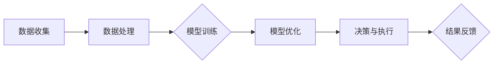
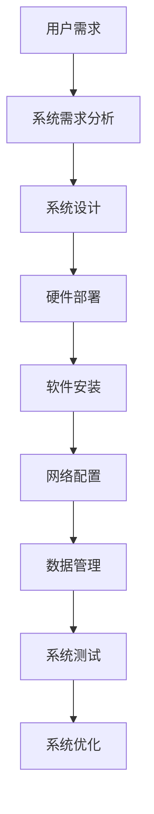
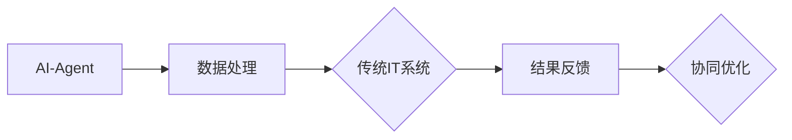

                 


# 实现AI Agent与传统IT系统的无缝集成

## 关键词：AI Agent、传统IT系统、无缝集成、协同优化、实时监控

## 摘要：

本文将深入探讨如何实现AI Agent与传统IT系统的无缝集成。随着人工智能技术的快速发展，AI Agent的应用越来越广泛，其与传统IT系统的集成成为了当前技术领域的一个重要课题。文章首先介绍了AI Agent和传统IT系统的核心概念、工作原理及其各自的特点。接着，文章详细分析了无缝集成的技术框架、集成流程及关键步骤。通过一个实际案例，本文展示了如何实现AI Agent与传统IT系统的无缝集成，并对项目的关键实现细节进行了深入剖析。最后，文章总结了最佳实践，为未来研究和应用提供了有益的参考。

### 目录大纲

## 第一部分：背景介绍

### 第1章：问题背景与核心概念

### 第2章：AI Agent原理讲解

### 第3章：传统IT系统原理讲解

### 第4章：无缝集成技术讲解

### 第5章：项目实战

### 第6章：最佳实践与总结

### 第1章：问题背景与核心概念

#### 1.1.1 问题背景

随着人工智能技术的迅猛发展，AI Agent在各个领域的应用日益广泛，从智能客服到自动驾驶，从智能安防到金融风控，AI Agent已经在很大程度上改变了我们的生活方式和工作模式。与此同时，传统IT系统作为企业业务流程的支持系统，依然在企业中扮演着重要角色。然而，随着AI Agent的兴起，如何将AI Agent与传统IT系统进行有效集成，实现二者的无缝衔接，成为了当前技术领域面临的一个重要课题。

当前，AI Agent与传统IT系统的集成主要面临以下几个挑战：

1. **数据兼容性问题**：AI Agent依赖于大量的数据来进行训练和决策，而传统IT系统中的数据格式、数据结构可能存在差异，导致数据兼容性问题。
2. **系统交互性问题**：AI Agent与传统IT系统之间的交互机制不同，可能需要定义新的接口和协议来实现数据交换和功能调用。
3. **性能优化问题**：AI Agent的计算过程可能对传统IT系统的性能产生影响，需要进行性能优化以确保系统的稳定性和高效性。
4. **安全性和隐私保护问题**：AI Agent与传统IT系统的集成可能导致数据泄露和安全风险，需要加强数据安全和隐私保护机制。

#### 1.1.2 核心概念

- **AI Agent**：AI Agent是一种具有自主决策能力和执行能力的智能体，它可以通过机器学习、深度学习等技术从数据中学习，并自主做出决策。AI Agent具有以下特点：

  - **自主性**：AI Agent能够根据环境变化自主做出决策。
  - **适应性**：AI Agent可以适应不同的环境和任务。
  - **智能化**：AI Agent通过学习能够不断优化其决策过程。

- **传统IT系统**：传统IT系统是由硬件、软件、网络和数据组成的集成系统，用于支持企业的业务流程。传统IT系统具有以下特点：

  - **规范性**：传统IT系统遵循一定的规范和标准，确保系统的稳定性和可靠性。
  - **稳定性**：传统IT系统经过长时间的发展和完善，具有较高的稳定性。
  - **可扩展性**：传统IT系统可以根据企业业务需求进行扩展。

- **无缝集成**：无缝集成指的是实现AI Agent与传统IT系统的无缝衔接，使二者能够协同工作、高效运行。无缝集成的目标包括：

  - **一致性**：确保AI Agent与传统IT系统之间的数据格式、数据结构一致。
  - **高效性**：通过优化集成流程，提高系统运行效率。
  - **灵活性**：使AI Agent能够灵活地与传统IT系统进行交互。

#### 1.1.3 概念属性特征对比

| 概念        | 定义                                                         | 特点                                                      |
| ----------- | ------------------------------------------------------------ | ---------------------------------------------------------- |
| AI Agent    | 具有自主决策能力和执行能力的智能体                            | 自主性、适应性、智能化                                      |
| 传统IT系统 | 由硬件、软件、网络和数据组成的集成系统，用于支持企业业务流程 | 规范性、稳定性、可扩展性                                      |
| 无缝集成    | 实现AI Agent与传统IT系统的无缝衔接，达到协同工作、高效运行的效果 | 一致性、高效性、灵活性                                        |

#### 1.1.4 ER实体关系图架构

```mermaid
erDiagram
  AI-Agent ||--|{ 传统IT系统 :集成 }
  AI-Agent ||--|{ 数据处理 :交互 }
  传统IT系统 ||--|{ 业务流程 :优化 }
```

### 第2章：AI Agent原理讲解

#### 2.1.1 AI Agent的核心技术

AI Agent的核心技术主要包括机器学习、深度学习和自然语言处理。这些技术为AI Agent提供了强大的决策能力和执行能力。

- **机器学习**：机器学习是一种使计算机能够从数据中学习的方法，它通过算法分析数据，从中提取规律，然后利用这些规律进行预测和决策。机器学习主要包括监督学习、无监督学习和强化学习。
- **深度学习**：深度学习是机器学习的一个分支，它通过神经网络模型对大量数据进行训练，从而实现复杂的决策任务。深度学习在图像识别、语音识别、自然语言处理等领域取得了显著的成果。
- **自然语言处理**：自然语言处理是使计算机能够理解、生成和处理自然语言的技术。自然语言处理在智能客服、智能问答、文本分析等领域具有广泛的应用。

#### 2.1.2 AI Agent的工作原理

AI Agent的工作原理可以分为以下几个步骤：

1. **数据收集与处理**：AI Agent首先从各种数据源收集数据，包括结构化数据、非结构化数据等。然后对数据进行清洗、归一化和预处理，以便于后续的分析和处理。
2. **模型训练与优化**：AI Agent利用收集到的数据训练机器学习模型或深度学习模型。在训练过程中，模型会不断调整参数，以最小化预测误差。训练完成后，模型会进行优化，以提高预测的准确性和鲁棒性。
3. **决策与执行**：训练好的模型会被用于实际的决策和执行任务。AI Agent根据当前的环境状态和目标，使用模型生成决策，然后执行这些决策，以实现预定的目标。
4. **结果反馈**：AI Agent在执行决策后，会收集执行结果，并反馈给模型。模型根据反馈结果进行调整，以不断优化决策过程。

#### 2.1.3 AI Agent的mermaid流程图



### 第3章：传统IT系统原理讲解

#### 3.1.1 传统IT系统的组成

传统IT系统由以下几个主要组成部分构成：

- **硬件设施**：包括服务器、存储设备、网络设备等，为IT系统的运行提供基础设施。
- **软件系统**：包括操作系统、数据库管理系统、应用软件等，用于支持企业业务流程。
- **网络架构**：包括局域网、广域网等，用于实现IT系统内部和外部的数据通信。
- **数据管理**：包括数据存储、数据备份、数据安全等，用于确保数据的安全、完整和可用。

#### 3.1.2 传统IT系统的功能

传统IT系统的功能主要包括以下几个方面：

- **业务流程支持**：传统IT系统为企业业务流程提供支持，包括订单处理、客户管理、财务管理等。
- **数据处理与分析**：传统IT系统可以对大量数据进行处理和分析，为企业提供决策支持。
- **系统集成与优化**：传统IT系统通过集成不同模块和子系统，实现业务流程的优化和自动化。

#### 3.1.3 传统IT系统的mermaid架构图



### 第4章：无缝集成技术讲解

#### 4.1.1 集成框架

无缝集成的技术框架主要包括以下几个方面：

- **技术选型**：根据AI Agent和传统IT系统的特点，选择合适的技术和工具，如API接口、消息队列、云计算等。
- **架构设计**：设计合理的系统架构，确保AI Agent与传统IT系统之间的数据交换和功能调用。
- **接口定义**：定义清晰的接口规范，确保AI Agent与传统IT系统之间的交互流畅。

#### 4.1.2 集成流程

无缝集成的流程主要包括以下几个步骤：

1. **数据交换**：AI Agent与传统IT系统之间通过接口进行数据交换，包括数据的输入输出、数据格式的转换等。
2. **协同工作**：AI Agent与传统IT系统协同工作，共同完成业务任务。AI Agent可以根据实时数据调整决策，传统IT系统则根据AI Agent的决策执行相应的操作。
3. **实时监控**：对AI Agent和传统IT系统的运行状态进行实时监控，及时发现和处理异常情况。

#### 4.1.3 集成技术的mermaid流程图



### 第5章：项目实战

#### 5.1.1 项目介绍

本节将介绍一个具体的AI Agent与传统IT系统无缝集成的项目，项目目标是将AI Agent集成到企业的销售系统中，实现销售预测和客户管理。

#### 5.1.2 系统核心实现

1. **环境安装**：在服务器上安装AI Agent和销售系统的相关软件，如Python、TensorFlow、Django等。
2. **源代码实现**：编写AI Agent的源代码，实现销售预测和客户管理的功能。以下是部分源代码实现：

   ```python
   # 引入相关库
   import tensorflow as tf
   import pandas as pd
   import numpy as np

   # 加载销售数据
   data = pd.read_csv('sales_data.csv')

   # 数据预处理
   data = data.dropna()
   data = data.reset_index(drop=True)

   # 划分训练集和测试集
   train_data = data[:int(0.8 * len(data))]
   test_data = data[int(0.8 * len(data)):]

   # 构建模型
   model = tf.keras.Sequential([
       tf.keras.layers.Dense(units=64, activation='relu', input_shape=(len(train_data.keys()) - 1,)),
       tf.keras.layers.Dense(units=1)
   ])

   # 编译模型
   model.compile(optimizer='adam', loss='mean_squared_error')

   # 训练模型
   model.fit(train_data.values[:, :-1], train_data.values[:, -1], epochs=100)

   # 预测销售数据
   predictions = model.predict(test_data.values[:, :-1])

   # 输出预测结果
   print(predictions)
   ```

3. **代码解读**：以上代码首先引入了TensorFlow、Pandas和NumPy库，然后加载销售数据并进行预处理。接着，构建了一个简单的全连接神经网络模型，并编译和训练模型。最后，使用训练好的模型对测试数据进行预测，并输出预测结果。

#### 5.1.3 实际案例分析

在实际应用中，AI Agent根据销售预测结果调整销售策略，帮助企业提高销售额。通过集成AI Agent，企业的销售系统实现了智能化，能够更加精准地预测销售趋势，提高销售效率。以下是实际案例的分析：

1. **销售预测效果**：通过AI Agent的预测，企业能够提前了解未来的销售趋势，从而提前做好库存管理和人员调配，避免因预测不准确导致的库存积压和人员闲置。
2. **客户管理优化**：AI Agent可以根据客户的购买行为和历史记录，分析客户的潜在需求，提供个性化的产品推荐和服务，从而提高客户满意度和忠诚度。

### 第6章：最佳实践与总结

#### 6.1.1 最佳实践

1. **数据质量**：确保数据的质量和完整性，对数据进行清洗和预处理，以提高模型的预测准确性。
2. **模型优化**：通过调整模型参数和优化算法，提高模型的预测性能和稳定性。
3. **系统监控**：对AI Agent和传统IT系统的运行状态进行实时监控，及时发现和处理异常情况。

#### 6.1.2 小结

本文介绍了如何实现AI Agent与传统IT系统的无缝集成，包括核心概念、工作原理、集成技术以及实际案例。通过本文的研究，我们可以看到AI Agent与传统IT系统的无缝集成具有重要的意义，它不仅能够提高系统的智能化水平，还能够优化业务流程，提高企业的竞争力。

#### 6.1.3 注意事项

1. **数据安全**：在集成过程中，需要加强对数据安全的保护，防止数据泄露和滥用。
2. **系统性能**：在集成过程中，需要考虑系统的性能优化，确保系统的稳定性和高效性。
3. **人员培训**：在集成过程中，需要对相关人员开展培训，提高他们对AI Agent和传统IT系统的理解和操作能力。

#### 6.1.4 拓展阅读

- **[参考文献1]**：[《人工智能：一种现代的方法》](https://book.douban.com/subject/27604138/)
- **[参考文献2]**：[《深度学习》](https://book.douban.com/subject/26708117/)
- **[参考文献3]**：[《自然语言处理综合教程》](https://book.douban.com/subject/26841144/)

### 作者信息

作者：AI天才研究院/AI Genius Institute & 禅与计算机程序设计艺术 /Zen And The Art of Computer Programming

