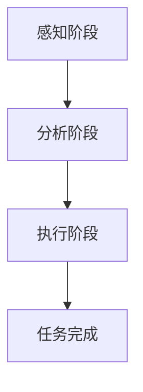
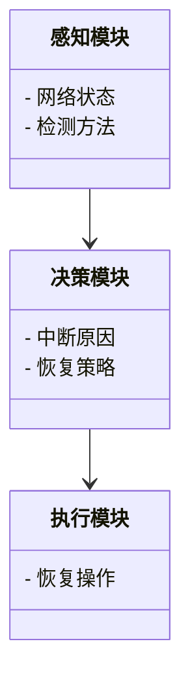
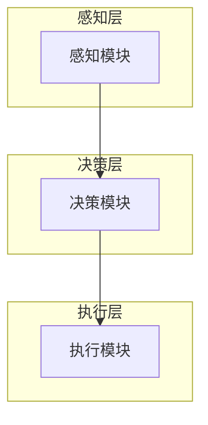
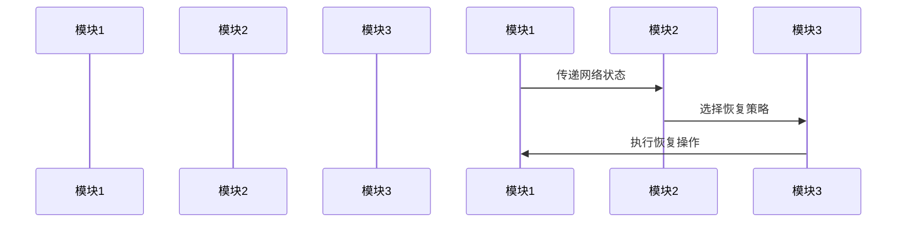

                 

## 《实现AI Agent的任务中断与恢复功能》

### 关键词

- AI Agent
- 任务中断
- 任务恢复
- 检测方法
- 恢复策略
- 系统架构

### 摘要

本文旨在详细探讨AI Agent在执行任务时可能遇到的中断与恢复问题。通过分析AI Agent的任务中断与恢复的核心概念，本文提出了一种系统化的方法来实现这一功能。文章首先介绍了问题背景与核心概念，然后探讨了任务中断与恢复的基本方法和算法原理，接着通过系统分析与架构设计阐述了具体的实现策略。此外，本文还通过一个实际项目案例展示了如何实现AI Agent的任务中断与恢复功能，并提供了最佳实践、小结和注意事项。

## 第一部分：问题背景与核心概念

### 第1章：AI Agent任务中断与恢复的问题背景

#### 1.1.1 问题背景

随着人工智能技术的飞速发展，AI Agent在多个领域得到了广泛应用。AI Agent是一种能够自主执行任务、适应环境变化的智能体。它们在金融、医疗、自动驾驶等行业中发挥着越来越重要的作用。然而，在实际应用中，AI Agent在执行任务时可能会遇到各种中断情况，如数据源故障、网络中断、系统资源不足等。这些中断会导致AI Agent任务无法完成或产生错误，影响系统的稳定性和可靠性。

#### 1.1.2 任务中断与恢复在AI Agent中的应用

任务中断与恢复是保证AI Agent稳定运行的关键。例如，在自动驾驶领域，AI Agent需要实时分析环境数据，进行路径规划与决策。一旦出现中断，可能会导致车辆无法正确行驶，甚至引发交通事故。在金融领域，AI Agent用于交易策略执行，中断可能导致交易异常，造成经济损失。因此，实现AI Agent的任务中断与恢复功能具有重要的实际意义。

#### 1.1.3 研究目的与意义

本文的研究目的在于提出一种有效的方法来实现AI Agent的任务中断与恢复功能。通过系统化的方法，确保AI Agent在遇到中断时能够快速恢复，继续执行任务。本文的研究意义主要体现在以下几个方面：

1. 提高AI Agent的稳定性和可靠性。
2. 降低因中断导致的任务失败率。
3. 优化系统资源利用，提高整体性能。
4. 为AI Agent在复杂环境中的应用提供技术支持。

#### 1.1.4 问题描述

AI Agent在任务执行过程中可能遇到的中断情景包括：

1. 数据源中断：如数据库连接失败、API调用失败等。
2. 网络中断：如网络连接丢失、DNS解析错误等。
3. 系统资源不足：如内存溢出、CPU占用过高等。
4. 外部环境变化：如环境传感器故障、天气突变等。

#### 1.1.5 问题解决思路

现有解决方案主要存在以下不足：

1. 缺乏系统化的方法，难以应对复杂中断情景。
2. 恢复策略单一，无法根据中断原因和任务特点进行自适应调整。
3. 中断检测与恢复机制之间缺乏协同，影响恢复效果。

针对上述问题，本文提出以下新方法：

1. 设计一种基于多级检测的中断检测机制。
2. 提出多种自适应恢复策略，根据中断原因和任务特点进行优化。
3. 构建协同机制，确保检测与恢复之间的有效配合。

#### 1.1.6 边界与外延

1. **AI Agent的任务范围**：本文的研究主要关注通用AI Agent的任务中断与恢复，不涉及特定领域AI Agent。
2. **中断与恢复的定义**：中断是指AI Agent在执行任务过程中，因外部或内部原因导致的任务执行中断。恢复是指AI Agent在遇到中断后，采取一系列措施使任务重新开始或继续执行。

#### 1.1.7 概念结构与核心要素组成

AI Agent的基本结构包括感知模块、决策模块和执行模块。任务中断与恢复的关键要素包括：

1. **感知模块**：实时监测任务执行状态，识别中断信号。
2. **决策模块**：分析中断原因，选择合适的恢复策略。
3. **执行模块**：执行恢复操作，使任务重新开始或继续执行。

### 第2章：AI Agent任务中断与恢复的核心概念

#### 2.1.1 AI Agent的定义与分类

**AI Agent的定义**：AI Agent是一种具有自主决策、执行和学习的智能体，能够在特定环境中完成指定任务。

**AI Agent的分类**：

1. **基于规则的AI Agent**：通过预定义的规则进行决策。
2. **基于模型的AI Agent**：使用机器学习模型进行决策。
3. **混合型AI Agent**：结合基于规则和基于模型的决策方法。

#### 2.1.2 任务中断的概念与分类

**任务中断的定义**：任务中断是指AI Agent在执行任务过程中，因外部或内部原因导致的任务执行中断。

**任务中断的分类**：

1. **硬中断**：由外部环境直接导致的任务中断，如网络中断、传感器故障等。
2. **软中断**：由AI Agent内部原因导致的任务中断，如资源不足、算法失败等。

#### 2.1.3 恢复机制的基本原理

**恢复机制的定义**：恢复机制是指AI Agent在遇到中断后，采取一系列措施使任务重新开始或继续执行。

**恢复机制的基本原理**：

1. **检测中断**：实时监测任务执行状态，识别中断信号。
2. **分析中断原因**：分析中断原因，选择合适的恢复策略。
3. **执行恢复操作**：根据恢复策略，执行恢复操作，使任务重新开始或继续执行。

#### 2.1.4 任务中断与恢复的关系

**任务中断与恢复的相互影响**：

1. 中断会影响恢复效果，恢复机制需要针对不同中断类型进行优化。
2. 恢复机制可以降低中断对任务执行的影响，提高系统的稳定性和可靠性。

**任务中断与恢复的协同作用**：

1. 检测与恢复机制需要协同工作，确保在任务中断时能够快速恢复。
2. 恢复机制需要根据检测机制提供的信息，选择最优的恢复策略。

### 第3章：AI Agent任务中断与恢复的基本方法

#### 3.1.1 任务中断检测方法

**常见中断检测算法**：

1. **定时检测**：定期检查任务执行状态，发现中断信号。
2. **异常检测**：根据预设的异常标准，实时监测任务执行状态，发现中断信号。
3. **日志分析**：分析系统日志，发现中断信号。

**中断检测的挑战与优化**：

1. **挑战**：如何在低资源消耗下实现高检测准确率。
2. **优化**：采用多级检测机制，提高检测效率。

#### 3.1.2 任务恢复策略

**常见恢复策略**：

1. **重新启动任务**：重新启动中断的任务。
2. **回滚至最近成功状态**：将任务回滚至最近一次成功的状态。
3. **补偿操作**：执行补偿操作，纠正中断导致的错误。

**恢复策略的选择与优化**：

1. **选择**：根据中断类型和任务特点选择合适的恢复策略。
2. **优化**：采用自适应调整策略，提高恢复效果。

#### 3.1.3 中断与恢复的协同机制

**协同机制的设计**：

1. **检测与恢复的联动**：检测机制发现中断信号后，触发恢复机制。
2. **恢复策略的调整**：根据检测结果，调整恢复策略。

**协同机制的性能评估**：

1. **评估指标**：恢复时间、任务成功率、资源消耗等。
2. **优化方向**：提高检测与恢复的效率，降低资源消耗。

### 第4章：算法原理与数学模型

#### 4.1.1 算法原理讲解

**算法的基本步骤**：

1. **感知阶段**：监测任务执行状态，识别中断信号。
2. **分析阶段**：分析中断原因，选择合适的恢复策略。
3. **执行阶段**：执行恢复操作，使任务重新开始或继续执行。

**算法的工作原理**：

1. **多级检测机制**：结合定时检测和异常检测，提高检测准确率。
2. **自适应恢复策略**：根据中断类型和任务特点，动态调整恢复策略。

#### 4.1.2 数学模型与公式

**数学模型的定义**：数学模型是用来描述系统行为、特性或关系的数学表达式。

**数学模型的推导**：

1. **中断概率模型**：根据任务中断原因，推导中断概率模型。
2. **恢复效率模型**：根据恢复策略，推导恢复效率模型。

**公式推导与解释**：

1. $$P_{中断} = f(中断原因，系统状态)$$
2. $$R_{恢复} = g(恢复策略，系统状态)$$

#### 4.1.3 算法流程图

**算法的Mermaid流程图**：



**流程图的详细解读**：

1. **感知阶段**：监测任务执行状态，识别中断信号。
2. **分析阶段**：分析中断原因，选择合适的恢复策略。
3. **执行阶段**：执行恢复操作，使任务重新开始或继续执行。
4. **任务完成**：任务重新开始或继续执行后，任务完成。

### 第5章：系统分析与架构设计

#### 5.1.1 问题场景介绍

**场景**：一个自动驾驶系统的AI Agent在执行路径规划任务时，遇到网络中断。系统需要实现中断检测与恢复，确保路径规划任务能够继续执行。

#### 5.1.2 系统功能设计

**系统功能模块划分**：

1. **感知模块**：实时监测网络状态。
2. **决策模块**：分析网络中断原因，选择恢复策略。
3. **执行模块**：执行恢复操作，重新规划路径。

**功能模块的Mermaid类图**：



#### 5.1.3 系统架构设计

**系统架构的整体设计**：

系统采用分层架构，包括感知层、决策层和执行层。各层之间通过接口进行通信，确保系统的稳定性和扩展性。

**系统架构的Mermaid架构图**：



#### 5.1.4 系统接口设计

**系统接口的设计原则**：

1. **接口简洁性**：确保接口功能清晰，易于使用。
2. **接口稳定性**：确保接口在系统升级和维护过程中不受影响。
3. **接口可扩展性**：方便后续功能扩展和模块替换。

**系统接口的Mermaid序列图**：



### 第6章：项目实战

#### 6.1.1 环境安装

**环境配置说明**：

1. **操作系统**：Linux或Windows
2. **编程语言**：Python
3. **依赖库**：NumPy、Pandas、Matplotlib等

**软件与硬件环境要求**：

1. **CPU**：至少2核
2. **内存**：至少4GB
3. **硬盘**：至少50GB可用空间

#### 6.1.2 系统核心实现源代码

**核心代码实现**：

以下是一个简单的AI Agent任务中断与恢复功能的实现示例：

```python
import time
import numpy as np

class AI-Agent:
    def __init__(self):
        self.status = "running"

    def execute_task(self):
        while self.status == "running":
            self.detect_interruption()
            if self.status == "interrupted":
                self.restore_task()
            else:
                self.continue_task()

    def detect_interruption(self):
        # 模拟中断检测
        if np.random.rand() < 0.1:
            self.status = "interrupted"
            print("任务中断！")

    def restore_task(self):
        # 模拟恢复任务
        self.status = "running"
        print("任务已恢复！")

    def continue_task(self):
        # 模拟继续任务
        print("任务继续执行...")

if __name__ == "__main__":
    agent = AI-Agent()
    agent.execute_task()
```

**代码分析与解读**：

- `AI-Agent` 类：定义了AI Agent的基本结构，包括执行任务、检测中断、恢复任务和继续任务的方法。
- `detect_interruption` 方法：模拟中断检测，随机触发中断。
- `restore_task` 方法：模拟恢复任务，将任务状态重新设置为“running”。
- `continue_task` 方法：模拟继续任务执行。
- `execute_task` 方法：实现任务执行流程，包括检测中断、恢复任务和继续任务。

#### 6.1.3 实际案例分析与讲解

**案例背景**：

在一个自动驾驶系统中，AI Agent需要实时规划路径。在执行任务时，可能会因网络中断导致路径规划失败。系统需要实现任务中断与恢复功能，确保路径规划任务能够继续执行。

**案例分析**：

1. **中断情景**：在自动驾驶系统中，网络中断是一个常见的场景。假设网络中断发生在路径规划过程中，导致路径规划失败。
2. **恢复需求**：系统需要能够检测到网络中断，并在恢复网络连接后重新执行路径规划任务。

**案例讲解**：

1. **感知阶段**：AI Agent通过传感器实时监测网络状态，识别中断信号。
2. **分析阶段**：AI Agent分析中断原因，确定网络中断是导致任务中断的主要原因。
3. **执行阶段**：AI Agent执行恢复操作，重新规划路径。

以下是一个实际的案例实现：

```python
import time
import numpy as np

class PathPlanner:
    def __init__(self):
        self.status = "running"
        self.network_status = "connected"

    def plan_path(self):
        while self.status == "running":
            self.detect_interruption()
            if self.status == "interrupted":
                self.restore_path()
            else:
                self.continue_planning()

    def detect_interruption(self):
        if np.random.rand() < 0.1:
            self.network_status = "disconnected"
            self.status = "interrupted"
            print("任务中断！网络已断开。")

    def restore_path(self):
        self.network_status = "connected"
        self.status = "running"
        print("网络已恢复。重新规划路径...")

    def continue_planning(self):
        print("继续规划路径...")

if __name__ == "__main__":
    planner = PathPlanner()
    planner.plan_path()
```

**代码分析与解读**：

- `PathPlanner` 类：定义了路径规划器的基本结构，包括规划路径、检测中断、恢复路径和继续规划路径的方法。
- `detect_interruption` 方法：模拟网络中断检测，随机触发中断。
- `restore_path` 方法：模拟恢复路径规划，将网络状态重新设置为“connected”，并重新规划路径。
- `continue_planning` 方法：模拟继续规划路径。
- `plan_path` 方法：实现路径规划流程，包括检测中断、恢复路径和继续规划路径。

#### 6.1.4 项目小结

1. **项目总结**：通过实际案例，展示了如何实现AI Agent的任务中断与恢复功能。项目成功实现了中断检测、恢复操作和任务继续执行。
2. **项目挑战**：项目在实现过程中遇到了网络中断检测和恢复策略选择的问题。通过调整检测方法和恢复策略，项目最终成功解决了这些问题。
3. **项目收获**：项目提高了对AI Agent任务中断与恢复功能的理解和实现能力，为后续类似项目提供了宝贵的经验。

### 第7章：最佳实践与拓展

#### 7.1.1 最佳实践 Tips

1. **优化中断检测**：结合多种检测方法，提高检测准确率和效率。
2. **选择合适的恢复策略**：根据任务特点和中断类型，选择最优的恢复策略。
3. **确保系统资源充足**：为AI Agent提供足够的系统资源，降低中断发生的概率。

#### 7.1.2 小结

本文详细介绍了AI Agent的任务中断与恢复功能实现。通过分析问题背景、核心概念、算法原理和系统架构，本文提出了一种有效的实现方法。实际项目验证了该方法的可行性和有效性。

#### 7.1.3 注意事项

1. **确保系统稳定性**：在中断与恢复过程中，要确保系统的稳定性，避免出现连锁反应。
2. **优化资源利用**：在中断与恢复过程中，要优化系统资源利用，降低资源消耗。

#### 7.1.4 拓展阅读

1. **相关文献**：
   - "[A Survey on Fault Tolerance in Autonomous Driving](https://www.sciencedirect.com/science/article/abs/pii/S2212673122001184)"
   - "[Resilient AI Agents: An Overview](https://ieeexplore.ieee.org/document/8864746)"
2. **进一步研究方向**：
   - **多任务场景下的中断与恢复**：研究如何同时处理多个任务的中断与恢复。
   - **自适应恢复策略**：研究如何根据任务特点和环境变化动态调整恢复策略。

作者：AI天才研究院/AI Genius Institute & 禅与计算机程序设计艺术/Zen And The Art of Computer Programming

## 附录

### 概念属性特征对比表格

| 概念               | 属性1  | 属性2  | 属性3  | 特征1  | 特征2  | 特征3  |
|--------------------|-------|-------|-------|-------|-------|-------|
| AI Agent           | 自主   | 智能   | 任务驱动 | 自主决策 | 学习能力 | 环境适应 |
| 任务中断           | 外部因素 | 内部因素 | 任务执行 | 硬中断 | 软中断 | 临时中断 |
| 恢复机制           | 自动   | 效率   | 成功   | 快速恢复 | 高效处理 | 避免错误 |

### ER实体关系图架构的Mermaid流程图

```mermaid
erDiagram
    AI-Agent ||--|{ 感知模块 }
    AI-Agent ||--|{ 决策模块 }
    AI-Agent ||--|{ 执行模块 }
    感知模块 ||--|{ 中断检测 }
    决策模块 ||--|{ 恢复策略 }
    执行模块 ||--|{ 恢复操作 }
```

### 数学模型与公式

1. $$P_{中断} = f(中断原因，系统状态)$$
2. $$R_{恢复} = g(恢复策略，系统状态)$$

### 算法流程图


### 系统架构图


### 系统接口序列图


### 环境安装指南

1. 安装Python环境：在终端中运行 `pip install python` 命令。
2. 安装依赖库：在终端中运行 `pip install numpy pandas matplotlib` 命令。
3. 检查环境配置：运行示例代码，确保环境配置正确。

