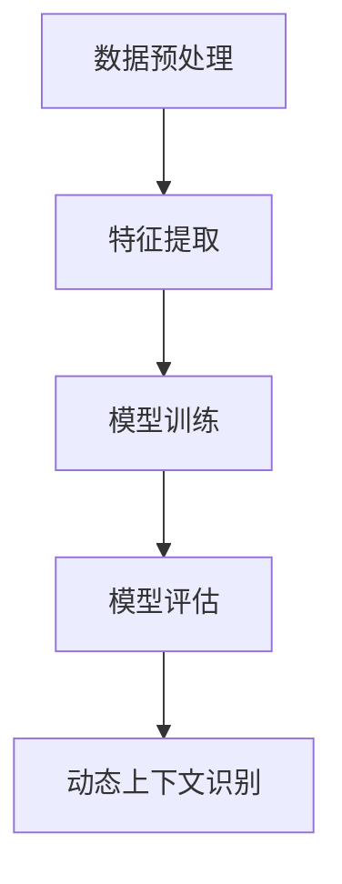

                 

### 引言

《实现AI Agent的动态上下文管理》是一本深入探讨人工智能（AI）代理在实际应用中如何有效处理动态上下文问题的书籍。随着AI技术的迅速发展，AI代理在各种场景中的应用变得越来越普遍，它们需要能够灵活适应不断变化的环境和上下文。本书旨在为读者提供一套完整的指南，帮助他们理解和实现动态上下文管理机制，从而提升AI代理的智能和实用性。

在现代社会，人工智能技术已经深入到我们日常生活的方方面面。从智能家居、智能客服，到自动驾驶、医疗诊断，AI代理正在逐渐接管人类的一些日常任务。然而，随着应用场景的日益复杂，AI代理面临的上下文变化也变得越来越多样化。动态上下文管理，作为AI技术中一个关键且前沿的研究领域，其重要性不言而喻。

动态上下文管理涉及到的不仅仅是数据的处理，它还包括了对上下文信息的理解、存储、更新和应用。一个优秀的AI代理需要能够实时感知周围环境的变化，并根据这些变化调整自己的行为和决策。这对于提升AI代理的自主性和智能性具有重要意义。

本书结构设计如下：

- **第一部分：AI Agent与上下文管理基础**，介绍AI Agent的基本概念、动态上下文的概念与特点，以及动态上下文模型的类型和应用。
- **第二部分：实现动态上下文管理的核心技术**，深入探讨基于深度学习的动态上下文识别、上下文持久化技术、动态上下文的交互策略，以及动态上下文的安全与隐私保护。
- **第三部分：动态上下文管理实战**，通过具体的项目案例研究，展示动态上下文管理在实际应用中的具体实现和效果。
- **第四部分：动态上下文管理的未来趋势与展望**，分析动态上下文管理的发展趋势，探讨未来的研究方向和挑战。

希望通过本书的阅读，读者能够全面了解动态上下文管理在AI Agent中的重要性，掌握实现这一机制的核心技术，并通过实战案例深刻理解其应用场景。让我们共同探索动态上下文管理的无限可能，为智能时代的发展贡献力量。

### 目录大纲设计

在开始详细探讨动态上下文管理之前，让我们首先来梳理一下本书的目录结构。本书的目录结构设计旨在帮助读者系统性地理解和掌握动态上下文管理的各个方面，从而为实际应用奠定坚实的理论基础。

#### 第一部分: AI Agent与上下文管理基础

**第1章: AI Agent概述**

在这一章中，我们将介绍AI Agent的基本概念、功能和分类。具体内容包括：

- **1.1 AI Agent的定义与基本功能**：详细解释AI Agent的概念，以及其在现实世界中的应用场景。
- **1.2 AI Agent在现实世界中的应用**：探讨AI Agent在智能家居、智能客服、自动驾驶等领域的应用实例。
- **1.3 AI Agent的组成与结构**：分析AI Agent的基本组件，包括感知模块、决策模块、行动模块等。

**第2章: 动态上下文的概念与特点**

本章主要讨论动态上下文的概念、特点以及其与静态上下文的不同之处。

- **2.1 动态上下文的概念解析**：定义动态上下文，并解释其与静态上下文的区别。
- **2.2 动态上下文的特点与挑战**：分析动态上下文的特性，如实时性、复杂性、多样性等，以及面临的挑战。
- **2.3 动态上下文管理的重要性**：阐述动态上下文管理对于AI Agent性能提升的重要性。

**第3章: 动态上下文模型**

本章介绍动态上下文模型的类型、结构以及在实际应用中的实现方法。

- **3.1 动态上下文模型概述**：解释动态上下文模型的概念和分类。
- **3.2 动态上下文模型的类型**：详细探讨不同类型的动态上下文模型，如基于规则模型、基于统计模型、基于深度学习模型等。
- **3.3 动态上下文模型的应用**：分析动态上下文模型在聊天机器人、推荐系统等实际应用中的具体实现。

#### 第二部分: 实现动态上下文管理的核心技术

**第4章: 基于深度学习的动态上下文识别**

本章重点介绍基于深度学习的动态上下文识别技术。

- **4.1 深度学习的基本原理**：回顾深度学习的基础知识，包括神经网络、激活函数、优化算法等。
- **4.2 基于深度学习的动态上下文识别算法**：详细介绍动态上下文识别的算法原理，包括特征提取、模型训练和预测等步骤。
- **4.3 实践案例：动态上下文识别在聊天机器人中的应用**：通过具体案例，展示深度学习在动态上下文识别中的应用。

**第5章: 上下文持久化技术**

本章探讨上下文持久化技术，包括其概念、方法和实际应用。

- **5.1 上下文持久化的概念**：解释上下文持久化的定义和目的。
- **5.2 上下文持久化的方法**：介绍常见的上下文持久化技术，如关系型数据库、NoSQL数据库、文件系统等。
- **5.3 实践案例：上下文持久化在客户服务中的应用**：分析上下文持久化在客户服务中的应用场景和实现方法。

**第6章: 动态上下文的交互策略**

本章讨论动态上下文下的交互策略设计，包括基本原理和具体方法。

- **6.1 交互策略的基本原理**：解释交互策略的概念和作用。
- **6.2 动态上下文下的交互策略设计**：分析动态上下文下的交互策略设计方法，包括基于规则的方法、基于机器学习的方法等。
- **6.3 实践案例：动态交互策略在推荐系统中的应用**：通过具体案例，展示动态交互策略在推荐系统中的实现和应用。

**第7章: 动态上下文的安全与隐私保护**

本章探讨动态上下文管理中的安全与隐私保护问题，包括挑战和解决方案。

- **7.1 动态上下文中的安全挑战**：分析动态上下文管理中面临的安全挑战，如数据泄露、恶意攻击等。
- **7.2 动态上下文中的隐私保护技术**：介绍常见的隐私保护技术，如数据加密、访问控制、匿名化等。
- **7.3 实践案例：动态上下文安全在智能家居中的应用**：分析动态上下文安全在智能家居中的实现和应用。

#### 第三部分: 动态上下文管理实战

**第8章: 动态上下文管理项目的实施**

本章介绍动态上下文管理项目的实施过程，包括规划、实施和优化等步骤。

- **8.1 动态上下文管理项目的规划**：讨论项目规划的重要性和方法。
- **8.2 动态上下文管理项目的实施步骤**：详细解释项目实施的具体步骤和流程。
- **8.3 动态上下文管理项目的评估与优化**：分析项目评估和优化的方法和策略。

**第9章: 动态上下文管理案例研究**

本章通过具体案例，展示动态上下文管理在实际项目中的应用。

- **9.1 案例一：智能客服系统中的动态上下文管理**：分析智能客服系统中的动态上下文管理实现和应用。
- **9.2 案例二：自动驾驶系统中的动态上下文管理**：探讨自动驾驶系统中的动态上下文管理解决方案。
- **9.3 案例三：智能推荐系统中的动态上下文管理**：分析智能推荐系统中的动态上下文管理机制和应用。

**第10章: 动态上下文管理的未来趋势与展望**

本章分析动态上下文管理的发展趋势，探讨未来的研究方向和挑战。

- **10.1 动态上下文管理的发展趋势**：回顾动态上下文管理的发展历程，预测未来的发展趋势。
- **10.2 动态上下文管理的未来展望**：讨论动态上下文管理在人工智能领域中的应用前景。
- **10.3 动态上下文管理的挑战与解决方案**：分析动态上下文管理面临的技术和挑战，并提出相应的解决方案。

通过以上章节的详细设计，本书旨在为读者提供一个系统、全面的学习路径，帮助他们深入理解动态上下文管理的核心概念、技术实现和应用实践。希望本书能够为读者在AI领域的探索和研究提供有价值的参考。

### 第一部分: AI Agent与上下文管理基础

#### 第1章: AI Agent概述

在人工智能技术迅速发展的今天，AI Agent作为一种智能实体，正逐渐成为自动化和智能化应用的核心。AI Agent，全称为人工智能代理，是一种能够自主执行任务、具备智能决策能力的实体。它们通过感知环境、获取信息、分析和学习，进而采取行动，以实现特定的目标。本章将详细介绍AI Agent的基本概念、功能和分类，并探讨其在现实世界中的应用。

### 1.1 AI Agent的定义与基本功能

AI Agent的定义可以从多个角度进行解释。从最简单的角度来看，AI Agent是一种具有自主性的计算机程序，它能够在没有外部干预的情况下执行任务。具体来说，AI Agent具备以下几个基本功能：

1. **感知**：AI Agent通过感知模块感知环境中的信息，如视觉、听觉、触觉等。感知模块是AI Agent获取外界信息的桥梁，这些信息将用于后续的决策和行动。
2. **决策**：感知模块收集到的信息会被传递到决策模块。决策模块负责分析这些信息，并基于预定的目标和策略做出决策。决策过程通常涉及到各种算法和模型，如机器学习算法、强化学习算法等。
3. **行动**：决策模块做出的决策会被传递到行动模块。行动模块负责执行具体的操作，以实现AI Agent的目标。行动模块可以是机械臂、机器人、自动驾驶车辆等。

AI Agent的定义和功能示意图如下：

$$
\begin{array}{|c|c|}
\hline
\text{感知} & \text{获取环境信息} \\
\hline
\text{决策} & \text{分析信息并做出决策} \\
\hline
\text{行动} & \text{执行决策} \\
\hline
\end{array}
$$

### 1.2 AI Agent在现实世界中的应用

AI Agent在现实世界中的应用已经非常广泛，涵盖了多个领域。以下是一些典型的应用场景：

1. **智能家居**：AI Agent可以监控和管理家庭环境，如调节室温、控制家电、安全监控等。通过感知模块获取家庭环境的信息，AI Agent可以智能地调整家居设备的运行状态，提供舒适、便捷的生活体验。
2. **智能客服**：AI Agent被广泛应用于客服领域，如在线客服机器人、语音助手等。通过自然语言处理技术，AI Agent可以理解和回应用户的问题，提供高效、准确的客户服务。
3. **自动驾驶**：自动驾驶汽车是AI Agent的一个典型应用。自动驾驶汽车通过感知模块获取道路信息，如车道线、交通标志、行人等，并通过决策模块做出相应的驾驶决策，实现自主驾驶。
4. **医疗诊断**：AI Agent可以用于辅助医生进行疾病诊断。通过分析大量的医疗数据，AI Agent可以帮助医生快速、准确地诊断疾病，提高医疗服务的质量和效率。
5. **金融领域**：AI Agent被用于风险管理、投资决策、客户服务等金融领域。通过分析市场数据、用户行为等信息，AI Agent可以提供智能化的投资建议和客户服务。

### 1.3 AI Agent的组成与结构

AI Agent通常由以下几个基本组件组成：

1. **感知模块**：感知模块是AI Agent获取外界信息的核心组件。它通过传感器、摄像头、麦克风等设备获取环境中的视觉、听觉、触觉等信息。感知模块的性能直接影响到AI Agent对环境的感知能力。
2. **决策模块**：决策模块是AI Agent的核心，负责对感知模块获取的信息进行分析和处理，并基于预定的目标和策略做出决策。决策模块通常包含各种算法和模型，如机器学习算法、深度学习模型、强化学习算法等。
3. **行动模块**：行动模块是AI Agent执行决策的组件。根据决策模块的决策结果，行动模块会执行相应的操作，如控制机器人运动、发送信息等。行动模块的类型和实现方式取决于具体的应用场景。
4. **学习模块**：学习模块是AI Agent自我改进的重要组件。通过学习模块，AI Agent可以从历史数据和经验中不断学习和优化自己的行为和决策能力。学习模块通常包含各种机器学习算法和深度学习模型。

AI Agent的组成结构可以用以下ER实体关系图表示：

```mermaid
erDiagram
  AI-Agent ||--|{ 感知模块 :Module }
  AI-Agent ||--|{ 决策模块 :Module }
  AI-Agent ||--|{ 行动模块 :Module }
  AI-Agent ||--|{ 学习模块 :Module }
```

通过感知模块、决策模块、行动模块和学习模块的协同工作，AI Agent可以有效地实现自主决策和行动，从而在复杂环境中实现目标。

### 小结

在本章中，我们介绍了AI Agent的基本概念和功能，探讨了其在现实世界中的应用场景，并详细阐述了AI Agent的组成结构。通过理解AI Agent的工作原理和组成部分，读者可以为后续章节中动态上下文管理的学习打下坚实的基础。

### 2. 动态上下文的概念与特点

#### 2.1 动态上下文的概念解析

动态上下文（Dynamic Context）是指环境中的信息在时间维度上的不断变化和更新。与静态上下文（Static Context）不同，动态上下文具有实时性和动态性的特点。动态上下文的概念可以进一步拆解为以下几个核心要素：

1. **实时性**：动态上下文需要能够实时地反映环境中的变化。这意味着系统必须具备快速获取、处理和响应环境信息的能力。
2. **多样性**：动态上下文涉及的信息是多样化的，可能包括文本、图像、语音等多种形式的数据。
3. **变化性**：动态上下文中的信息是不断变化的，如天气变化、交通状况变化、用户行为变化等。

动态上下文可以被看作是一个随时间演变的复杂系统，其状态在不同的时间点上会有所不同。理解动态上下文的重要性在于，它能够为AI Agent提供实时、准确的环境信息，从而更好地进行决策和行动。

#### 2.2 动态上下文的特点与挑战

动态上下文具有以下几个显著特点：

1. **实时性**：动态上下文需要及时更新，以反映环境中的最新变化。这对于系统的响应速度和处理能力提出了很高的要求。
2. **动态性**：动态上下文中的信息是不断变化的，这意味着系统必须能够适应这种变化，并实时调整其行为和决策。
3. **多样性**：动态上下文涉及的信息类型繁多，如文本、图像、语音等，这要求系统具备强大的数据处理和分析能力。
4. **不确定性**：动态上下文中存在许多不确定性因素，如突发状况、异常行为等，这使得系统需要具备较强的鲁棒性和适应性。

动态上下文带来的挑战主要体现在以下几个方面：

1. **信息过载**：由于动态上下文的多样性，系统需要处理的信息量非常大，这可能导致信息过载，影响系统的响应速度和处理效率。
2. **延迟性**：动态上下文的实时性要求系统必须快速响应，但实际中由于网络延迟、计算资源限制等原因，系统可能无法达到理想的实时性要求。
3. **复杂性**：动态上下文中涉及的信息和关系非常复杂，这增加了系统设计和实现的难度。
4. **适应性**：系统需要能够根据动态上下文的变化，实时调整其行为和策略，这要求系统具备较强的自适应能力。

#### 2.3 动态上下文管理的重要性

动态上下文管理在AI Agent中的应用至关重要，主要体现在以下几个方面：

1. **决策准确性**：有效的动态上下文管理能够为AI Agent提供实时、准确的环境信息，从而提高其决策的准确性。例如，在自动驾驶系统中，动态上下文管理可以帮助车辆实时获取道路状况，从而做出安全的驾驶决策。
2. **自适应能力**：动态上下文管理使AI Agent能够根据环境变化实时调整其行为和策略，从而提高其自适应能力。这对于在复杂、多变的环境中工作的AI Agent至关重要。
3. **用户体验**：在许多应用场景中，如智能客服和智能家居，动态上下文管理能够提供更加个性化和智能化的服务，从而提升用户体验。例如，智能客服系统可以根据用户的动态上下文信息，提供更加精准的解答和建议。
4. **系统效率**：通过有效的动态上下文管理，AI Agent可以减少不必要的处理和通信开销，提高系统的整体效率。例如，在智能推荐系统中，动态上下文管理可以帮助系统过滤掉无关信息，提高推荐的准确性。

总之，动态上下文管理是AI Agent实现高效、准确决策的重要保障。只有通过有效的动态上下文管理，AI Agent才能在复杂多变的环境中保持竞争力和适应性。

### 3. 动态上下文模型

#### 3.1 动态上下文模型概述

动态上下文模型（Dynamic Context Model）是用于表示和操作动态上下文的数学或计算模型。这类模型旨在捕捉和表示环境中随时间变化的复杂信息，以便AI Agent能够利用这些信息进行决策和行动。动态上下文模型可以分为多种类型，每种类型都有其独特的结构和应用场景。

#### 3.2 动态上下文模型的类型

动态上下文模型大致可以分为以下几种类型：

1. **基于规则模型（Rule-based Models）**：基于规则模型是使用一组预定义的规则来表示动态上下文。这些规则通常基于专家知识或经验，用于描述不同上下文状态下的行为。基于规则模型的优点是简洁、易于理解和实现，但缺点是灵活性较低，难以适应复杂和动态的环境。

2. **基于统计模型（Statistical Models）**：基于统计模型使用统计学方法来分析环境数据，如概率分布、回归模型等。这类模型可以从历史数据中学习环境变化的规律，从而对动态上下文进行建模。基于统计模型的优点是能够处理大规模数据，具有较强的泛化能力，但缺点是对数据质量要求较高，且在处理复杂动态环境时可能表现不足。

3. **基于深度学习模型（Deep Learning Models）**：基于深度学习模型使用神经网络结构来捕捉动态上下文中的复杂模式和关系。这类模型通过大量训练数据学习特征表示和决策策略，具有较强的表达能力和自适应能力。基于深度学习模型的优点是能够处理高维、复杂的动态数据，但缺点是训练时间较长且对数据量要求较高。

4. **混合模型（Hybrid Models）**：混合模型结合了多种类型的模型，以弥补单一模型的不足。例如，可以将基于规则模型和基于深度学习模型结合，通过规则模型提供初始决策，再使用深度学习模型进行细粒度的调整。混合模型的优点是能够在保持简洁性的同时，提高模型的灵活性和鲁棒性。

#### 3.3 动态上下文模型的应用

动态上下文模型在实际应用中具有广泛的应用场景，以下是一些典型的应用案例：

1. **聊天机器人**：动态上下文模型可以用于聊天机器人，以理解用户的需求和意图。通过分析用户的输入历史和当前上下文，聊天机器人可以提供更加个性化和准确的服务。

2. **自动驾驶**：自动驾驶系统需要实时感知道路状况和交通信息，动态上下文模型可以帮助车辆理解道路环境的动态变化，从而做出安全的驾驶决策。

3. **智能家居**：智能家居系统中的动态上下文模型可以用于设备控制，如根据用户的习惯和实时环境信息调整空调温度、灯光等，提供更加舒适和便捷的生活体验。

4. **医疗诊断**：动态上下文模型可以用于医疗诊断，通过分析患者的健康数据和历史记录，提供更加精确和及时的诊断建议。

5. **推荐系统**：推荐系统中的动态上下文模型可以用于个性化推荐，通过分析用户的当前行为和偏好，提供更加符合用户需求的推荐结果。

通过以上对动态上下文模型的类型和应用的介绍，可以看出动态上下文模型在AI Agent中的应用具有很大的潜力和价值。有效的动态上下文模型可以显著提升AI Agent的决策能力和用户体验，从而在各个领域中发挥重要作用。

### 第二部分：实现动态上下文管理的核心技术

#### 第4章：基于深度学习的动态上下文识别

在人工智能技术中，深度学习已经成为实现复杂任务的重要工具。在动态上下文管理中，深度学习模型凭借其强大的特征提取和模式识别能力，被广泛应用于动态上下文识别任务。本章将介绍深度学习的基本原理，以及如何将其应用于动态上下文识别。

#### 4.1 深度学习的基本原理

深度学习是一种基于多层神经网络的学习方法，其核心思想是通过多层次的非线性变换来提取和表示数据中的特征。深度学习模型主要包括以下几个关键组件：

1. **神经网络（Neural Networks）**：神经网络是深度学习的基础，由多个神经元（或节点）组成。每个神经元接收来自前一层神经元的输入，通过一个权重矩阵进行加权求和，再通过激活函数进行非线性变换，输出结果。

2. **多层神经网络（Multi-layer Neural Networks）**：多层神经网络包括输入层、隐藏层和输出层。隐藏层负责提取数据的高级特征，输出层则根据这些特征进行分类或预测。

3. **激活函数（Activation Functions）**：激活函数用于引入非线性特性，常见的激活函数有ReLU、Sigmoid和Tanh等。

4. **优化算法（Optimization Algorithms）**：深度学习模型通常采用梯度下降（Gradient Descent）及其变体（如Adam、RMSprop等）来优化模型参数，以最小化损失函数。

深度学习模型通过大量的数据训练，可以自动学习输入数据中的复杂模式和特征，从而实现高精度的预测和分类。

#### 4.2 基于深度学习的动态上下文识别算法

动态上下文识别是动态上下文管理中的关键步骤，其目标是实时地捕捉和理解环境中的变化。基于深度学习的动态上下文识别算法主要包括以下几个步骤：

1. **数据预处理**：首先对输入数据进行预处理，包括归一化、缺失值处理和异常值过滤等。预处理步骤旨在提高模型训练的效果和效率。

2. **特征提取**：特征提取是深度学习模型的核心，通过多层神经网络的结构，从原始数据中提取高层次的语义特征。这些特征能够更好地表示动态上下文的信息。

3. **模型训练**：在特征提取后，使用训练数据集对深度学习模型进行训练。模型训练的目标是优化模型参数，使其在验证数据集上取得较高的准确率。

4. **模型评估**：在模型训练完成后，使用测试数据集对模型进行评估。评估指标通常包括准确率、召回率、F1分数等。通过评估，可以确定模型的性能和适用性。

5. **动态上下文识别**：训练好的深度学习模型可以用于动态上下文的识别。在实时应用中，模型会根据输入数据提取的特征，进行实时识别和分类，从而实现对动态上下文的感知和理解。

下面是一个简化的动态上下文识别算法流程图：



#### 4.3 实践案例：动态上下文识别在聊天机器人中的应用

为了更好地理解基于深度学习的动态上下文识别算法，下面我们通过一个具体的实践案例——聊天机器人，来展示该算法的实际应用。

**案例背景**：某聊天机器人平台需要能够实时理解用户的对话内容，并根据对话的历史上下文提供相应的回复。

**步骤**：

1. **数据集准备**：首先，从聊天机器人平台的历史对话数据中收集大量的对话记录，包括文本和对应的上下文信息。这些数据将用于训练和评估深度学习模型。

2. **数据预处理**：对收集到的对话文本进行预处理，包括分词、去停用词、词向量表示等。预处理步骤的目的是将文本数据转换为适合模型训练的格式。

3. **特征提取**：使用深度学习模型（如Transformer或BERT）对预处理后的文本进行特征提取。这些模型能够自动学习文本中的高级语义特征，从而提高动态上下文识别的准确性。

4. **模型训练**：使用预处理后的对话文本和对应的上下文信息，对深度学习模型进行训练。训练过程中，模型会不断调整参数，以最小化预测误差。

5. **模型评估**：在训练完成后，使用独立的数据集对模型进行评估，确定其性能和适用性。

6. **动态上下文识别**：在实时应用中，聊天机器人会根据用户的输入文本，利用训练好的模型提取动态上下文特征，并生成相应的回复。

**案例分析**：

通过上述步骤，聊天机器人可以有效地理解用户的对话内容，并根据对话的历史上下文提供更加准确和自然的回复。例如，当用户连续提到某个话题时，聊天机器人可以识别出这一动态上下文，并提供相关的话题信息或建议。

### 小结

本章介绍了深度学习的基本原理和基于深度学习的动态上下文识别算法。通过具体案例——聊天机器人，展示了该算法在实际应用中的实现过程和效果。深度学习模型在动态上下文识别中具有显著的优势，能够有效地捕捉和表示动态上下文的信息，从而提升AI Agent的智能和实用性。

### 5. 上下文持久化技术

#### 5.1 上下文持久化的概念

上下文持久化（Context Persistence）是指将动态上下文信息保存到持久存储介质中，以便在需要时能够快速访问和恢复。这种技术对于实现高效的动态上下文管理至关重要，因为它确保了系统即使在面临重启或故障时，也能够保持上下文的一致性和连续性。上下文持久化的核心目的是通过保存上下文信息，减少系统的重新学习和计算开销，提高系统的响应速度和稳定性。

#### 5.2 上下文持久化的方法

上下文持久化的方法多种多样，常见的有以下几种：

1. **关系型数据库（Relational Databases）**：关系型数据库是一种广泛使用的持久化技术，其优点是数据结构清晰、查询效率高，适合处理结构化数据。常用的关系型数据库包括MySQL、PostgreSQL等。关系型数据库通过表和关系来组织数据，允许进行复杂查询和关联操作。

2. **NoSQL数据库（NoSQL Databases）**：NoSQL数据库适用于处理大量非结构化或半结构化数据，其优点是扩展性好、灵活性高。常见的NoSQL数据库包括MongoDB、Cassandra等。NoSQL数据库通常采用分布式存储和索引机制，能够高效地处理海量数据。

3. **文件系统（File Systems）**：文件系统是一种简单且直接的持久化方法，适用于存储大量的文本文件或二进制数据。文件系统通过目录结构和文件权限进行组织和管理，便于数据的读写和共享。

4. **内存数据库（In-memory Databases）**：内存数据库将数据存储在内存中，适用于对响应速度有极高要求的场景。常见的内存数据库包括Redis、Memcached等。内存数据库的优点是读写速度极快，但缺点是存储容量有限，需要定期将数据持久化到硬盘上。

5. **日志文件（Log Files）**：日志文件是一种简单且实用的持久化方法，适用于记录系统的操作日志和事件日志。日志文件通常以时间序列的方式存储数据，便于后续分析和回溯。

#### 5.3 实践案例：上下文持久化在客户服务中的应用

为了更好地理解上下文持久化的应用，我们来看一个具体案例——客户服务系统中的上下文持久化。

**案例背景**：某客户服务系统需要记录和保存用户与客服的对话历史，以便在用户再次访问时能够提供连续的服务。

**步骤**：

1. **数据收集**：客户服务系统在每次与用户的对话中，会收集用户的输入信息、客服的回复、对话的时间戳等数据。

2. **数据预处理**：对收集到的数据进行处理，包括去噪、格式化、归一化等，以确保数据的一致性和准确性。

3. **选择持久化技术**：根据数据量和访问频率，选择合适的持久化技术。在本案例中，选择使用关系型数据库（如MySQL）来存储对话历史，因为其能够高效地进行数据查询和关联操作。

4. **数据存储**：将预处理后的数据存储到数据库中。每个用户都有一个独立的对话记录表，记录其与客服的每一次对话。

5. **数据访问**：当用户再次访问客户服务系统时，系统会根据用户的标识（如用户ID）从数据库中查询其对话历史，并展示给用户和客服。

6. **数据备份和恢复**：定期对数据库进行备份，以防止数据丢失。在系统重启或故障时，通过备份恢复数据，确保服务连续性。

**案例分析**：

通过上述步骤，客户服务系统能够有效地记录和保存用户的对话历史，并在用户再次访问时提供连续的服务体验。上下文持久化技术不仅提高了系统的效率，还增强了用户体验。用户不再需要重复提供相同的信息，客服也能快速了解用户的历史需求，提供更加个性化的服务。

### 小结

本章介绍了上下文持久化的概念和常见方法，并通过客户服务系统的实际案例展示了上下文持久化的应用。上下文持久化技术在确保动态上下文信息的一致性和连续性方面发挥着重要作用，是动态上下文管理中不可或缺的一部分。

### 6. 动态上下文的交互策略

#### 6.1 交互策略的基本原理

动态上下文下的交互策略是指AI Agent在不同上下文条件下采取的交互方法和行动方案。这种策略的核心目标是确保AI Agent能够与外部环境有效互动，并在不同的动态上下文中做出最优决策。交互策略的基本原理包括以下几个关键方面：

1. **上下文感知**：AI Agent需要能够实时感知和理解当前动态上下文的状态。这包括环境信息的获取、特征提取和上下文状态的理解。通过上下文感知，AI Agent可以准确地判断当前所处的上下文条件。

2. **决策制定**：基于上下文感知的结果，AI Agent需要制定相应的决策。决策过程通常涉及到多个步骤，包括目标设定、策略选择和行动规划。决策制定的目标是确保AI Agent在当前上下文中采取最优的行动方案。

3. **行动执行**：决策制定后，AI Agent需要执行具体的行动。行动执行包括与外部环境的交互，如发送指令、执行操作等。行动执行的效果需要与决策目标相匹配，以实现AI Agent的预期目标。

4. **反馈调整**：在交互过程中，AI Agent需要根据实际执行结果进行反馈调整。这种调整可以是实时的，也可以是基于历史数据的优化。通过反馈调整，AI Agent能够不断优化其交互策略，提高其在动态上下文中的适应性和决策质量。

#### 6.2 动态上下文下的交互策略设计

动态上下文下的交互策略设计是确保AI Agent在不同上下文中能够有效互动的关键。以下是一些常见的方法和步骤：

1. **基于规则的交互策略**：基于规则的交互策略通过预定义的规则集来指导AI Agent的行为。这些规则通常由领域专家或系统开发者根据特定的上下文条件制定。优点是设计简单、易于实现，但缺点是灵活性较低，难以应对复杂的动态上下文。

2. **基于机器学习的交互策略**：基于机器学习的交互策略通过从历史数据中学习，自动生成交互规则和策略。这种方法能够适应动态变化的上下文，提高交互的灵活性和鲁棒性。常见的机器学习方法包括决策树、支持向量机、神经网络等。

3. **混合交互策略**：混合交互策略结合了基于规则和基于机器学习的优势，通过规则和机器学习相结合的方式设计交互策略。这种策略能够在保持简洁性的同时，提高灵活性。例如，可以先用基于规则的策略进行初步决策，再使用机器学习模型进行细粒度调整。

4. **强化学习交互策略**：强化学习交互策略通过试错和奖励机制来优化AI Agent的行为。在强化学习过程中，AI Agent会不断尝试不同的行动方案，并根据奖励信号调整其策略。这种方法在复杂动态环境中表现出色，但需要大量数据进行训练。

5. **情景模拟与规划**：情景模拟与规划是通过模拟不同上下文条件下的交互场景，提前设计出最优的交互策略。这种方法能够提前预见可能的上下文变化，提高AI Agent的应对能力。

#### 6.3 实践案例：动态交互策略在推荐系统中的应用

为了更好地理解动态交互策略的应用，我们来看一个具体的实践案例——动态交互策略在推荐系统中的应用。

**案例背景**：某在线购物平台需要为用户推荐个性化商品，以提升用户的购物体验和平台的销售额。

**步骤**：

1. **上下文感知**：系统通过收集用户的行为数据（如浏览历史、购买记录、评价等），实时感知用户的当前上下文状态。

2. **决策制定**：基于用户的上下文状态，系统使用机器学习算法（如协同过滤、基于内容的推荐等）制定推荐策略。这些策略旨在根据用户的历史行为和偏好，预测用户可能感兴趣的商品。

3. **行动执行**：系统将推荐结果呈现给用户，包括商品列表、推荐理由等。用户可以选择查看、购买或跳过推荐的商品。

4. **反馈调整**：用户对推荐结果的行为（如点击、购买、评价等）将被系统记录，并用于更新用户的上下文状态和推荐策略。通过不断调整和优化推荐策略，系统能够提高推荐的准确性和用户满意度。

**案例分析**：

通过动态交互策略的应用，推荐系统能够根据用户的实时行为和上下文状态，提供个性化的商品推荐。这种方法不仅提高了用户的购物体验，还提高了平台的销售额和用户留存率。同时，通过反馈调整，系统可以不断学习和优化，以适应更加复杂的动态上下文环境。

### 小结

本章介绍了动态上下文交互策略的基本原理和设计方法，并通过推荐系统中的实践案例展示了其应用。动态交互策略是确保AI Agent在不同上下文中能够有效互动的关键，通过上下文感知、决策制定、行动执行和反馈调整，AI Agent能够不断提高其智能和实用性。

### 7. 动态上下文的安全与隐私保护

#### 7.1 动态上下文中的安全挑战

随着人工智能代理（AI Agent）在各个领域的广泛应用，其处理的大量动态上下文信息也带来了诸多安全挑战。这些挑战主要集中在以下几个方面：

1. **数据泄露**：动态上下文管理过程中，AI Agent需要处理大量的敏感信息，如个人隐私数据、金融数据等。如果这些数据遭到泄露，可能会对用户和系统造成严重损失。

2. **恶意攻击**：动态上下文管理中的数据可能成为攻击者的目标。例如，通过注入恶意代码或篡改数据，攻击者可以干扰AI Agent的正常工作，甚至控制整个系统。

3. **隐私侵犯**：动态上下文信息通常包含了用户的个人行为习惯、偏好等隐私信息。如果这些信息被滥用或泄露，可能会侵犯用户的隐私权，造成不必要的困扰。

4. **数据完整性**：动态上下文中数据的完整性至关重要。如果数据被篡改或损坏，可能会导致AI Agent做出错误决策，从而影响系统的正常运行。

5. **拒绝服务攻击（DoS）**：通过向AI Agent发送大量无效请求，攻击者可能使系统过载，导致服务不可用，影响用户体验。

#### 7.2 动态上下文中的隐私保护技术

为了应对动态上下文中的安全挑战，保护用户隐私和数据安全，以下是一些常见的隐私保护技术：

1. **数据加密**：数据加密是保护动态上下文信息的基本方法。通过加密技术，可以将敏感信息转换为密文，防止未经授权的访问。常用的加密算法包括AES、RSA等。

2. **访问控制**：访问控制通过限制用户对系统资源的访问权限，确保只有授权用户能够访问敏感信息。常见的访问控制机制包括基于角色的访问控制（RBAC）和基于属性的访问控制（ABAC）。

3. **匿名化**：匿名化技术通过删除或模糊化个人身份信息，使得数据在共享和分析时无法直接识别个人身份。常见的匿名化方法包括伪匿名化、差分隐私等。

4. **差分隐私**：差分隐私是一种强大的隐私保护机制，它通过在数据分析过程中引入噪声，确保个人数据不会在统计上被识别。差分隐私被广泛应用于隐私保护数据分析中。

5. **隐私计算**：隐私计算通过在本地设备上进行数据处理和分析，避免了敏感数据在传输过程中被泄露的风险。常见的隐私计算技术包括联邦学习、安全多方计算等。

#### 7.3 实践案例：动态上下文安全在智能家居中的应用

为了更好地理解动态上下文安全在实践中的应用，我们来看一个具体案例——智能家居系统中的动态上下文安全。

**案例背景**：智能家居系统通过连接各种家电和传感器，实现对家庭环境的自动化管理和控制。这些设备产生的动态上下文信息包括用户行为、环境状态等，涉及到用户的隐私和安全。

**步骤**：

1. **数据收集与加密**：智能家居系统在收集用户数据时，会使用数据加密技术，如AES加密，将敏感信息转换为密文存储。

2. **访问控制**：系统会为不同用户设置不同的访问权限，确保只有授权用户能够访问和操作敏感设备。

3. **匿名化**：对于不需要直接识别用户身份的数据，系统会使用匿名化技术，如差分隐私，对个人身份信息进行模糊化处理。

4. **隐私计算**：系统通过本地设备进行数据分析和决策，避免敏感数据在传输过程中被泄露。例如，使用联邦学习技术，将数据本地化处理，再进行模型训练和预测。

5. **实时监控与报警**：系统会实时监控设备状态和安全事件，并在发现异常时及时报警，防止恶意攻击和数据泄露。

**案例分析**：

通过上述措施，智能家居系统能够有效保护用户的隐私和安全。数据加密和访问控制确保了敏感信息的安全存储和访问；匿名化和隐私计算减少了数据泄露的风险；实时监控和报警机制提高了系统的安全性和可靠性。这种综合的隐私保护策略为智能家居系统提供了全面的安全保障。

### 小结

本章分析了动态上下文管理中的安全挑战，并介绍了多种隐私保护技术。通过实践案例——智能家居系统，展示了如何在实际应用中实现动态上下文的安全与隐私保护。有效的安全措施能够确保动态上下文信息的安全性和用户隐私，为AI Agent在复杂环境中的广泛应用提供保障。

### 8. 动态上下文管理项目的实施

#### 8.1 动态上下文管理项目的规划

一个成功的动态上下文管理项目需要周密的规划，以确保项目能够按照预期顺利进行。项目规划主要包括以下几个关键步骤：

1. **项目目标设定**：明确项目的目标和预期成果，包括提高系统的智能化水平、提升用户体验、增强系统的适应性和灵活性等。

2. **需求分析**：收集和分析项目相关的需求，包括业务需求、用户需求和技术需求等。需求分析的结果将指导项目设计和实现的方向。

3. **资源分配**：根据项目需求，分配必要的人力、物力和财力资源。资源分配要考虑项目的规模、复杂度以及项目的关键路径。

4. **风险评估**：评估项目可能面临的风险，包括技术风险、市场风险、人力资源风险等。通过风险识别和评估，可以提前制定应对策略，降低风险对项目的影响。

5. **项目计划制定**：制定详细的项目计划，包括项目的里程碑、时间表、任务分配和监控机制等。项目计划要具体、可操作，以确保项目按时、按质完成。

#### 8.2 动态上下文管理项目的实施步骤

在项目规划完成后，进入项目实施阶段。项目实施主要包括以下几个关键步骤：

1. **需求细化**：在需求分析的基础上，进一步细化和明确需求，确保所有需求都被理解和记录在案。

2. **系统设计**：根据需求，设计系统的架构和组件。系统设计包括功能设计、模块划分、接口设计等。系统设计需要充分考虑动态上下文管理的特点和需求。

3. **技术选型**：选择合适的技术栈和工具，包括编程语言、框架、数据库、中间件等。技术选型要考虑项目的需求、性能、可扩展性和维护性。

4. **开发实施**：按照系统设计进行开发和实现。开发过程中要遵循最佳实践，确保代码的可读性、可维护性和可扩展性。

5. **测试与验证**：在开发完成后，对系统进行全面的测试和验证，确保系统功能符合需求，性能达到预期。测试包括单元测试、集成测试、系统测试和用户验收测试。

6. **部署与上线**：完成测试后，将系统部署到生产环境，并进行上线操作。部署过程中要确保数据的迁移和系统的稳定运行。

#### 8.3 动态上下文管理项目的评估与优化

项目实施完成后，需要对项目进行评估和优化，以确保项目达到预期目标，并持续改进系统的性能和用户体验。

1. **项目评估**：通过项目评估，检查项目是否按计划完成，系统功能是否符合需求，性能是否达到预期等。评估结果可以作为后续优化和改进的依据。

2. **用户反馈**：收集用户的反馈，了解用户对系统的使用体验和满意度。用户反馈是发现问题和改进系统的重要来源。

3. **性能监控**：对系统进行实时性能监控，包括响应时间、吞吐量、错误率等指标。性能监控可以帮助发现潜在问题和优化系统。

4. **持续优化**：根据评估和反馈结果，对系统进行持续优化。优化包括功能改进、性能提升、用户体验优化等。

5. **迭代开发**：采用敏捷开发的方法，持续迭代和改进系统。通过快速反馈和迭代，可以及时响应用户需求和市场变化。

通过上述实施步骤和评估优化，动态上下文管理项目可以有效地实现预期目标，提高系统的智能化和实用性，为用户提供更好的体验。

### 小结

本章详细介绍了动态上下文管理项目的规划、实施和评估优化步骤。通过科学的项目规划和严谨的实施过程，结合持续的评估和优化，动态上下文管理项目能够成功实现预期目标，提高系统的智能化和实用性。

### 9. 动态上下文管理案例研究

#### 案例一：智能客服系统中的动态上下文管理

**案例背景**：随着人工智能技术的不断进步，智能客服系统在各个行业中得到了广泛应用。这些系统通过自然语言处理和动态上下文管理，能够自动识别用户需求，提供即时、高效的客户服务。本案例将探讨智能客服系统中动态上下文管理的实现和应用。

**实现步骤**：

1. **需求分析**：首先，对智能客服系统的需求进行分析。明确系统需要处理的问题类型、用户交互模式以及所需的上下文信息。

2. **数据收集**：从历史客户对话记录中收集数据，包括文本、用户行为和交互历史等。这些数据将用于训练和优化动态上下文模型。

3. **动态上下文模型设计**：设计动态上下文模型，包括基于规则的模型和基于深度学习的模型。模型需要能够实时捕捉和更新用户交互的上下文信息。

4. **模型训练与优化**：使用收集到的数据对动态上下文模型进行训练和优化，确保模型能够准确理解用户的需求和意图。

5. **集成与部署**：将训练好的模型集成到智能客服系统中，并进行部署。系统需要能够实时更新上下文信息，并根据上下文信息提供适当的响应。

**案例分析**：

智能客服系统中的动态上下文管理使得系统能够更准确地理解用户的需求，提供更加个性化的服务。例如，当用户连续提到某个问题时，系统可以通过动态上下文识别，将后续的问题归类到同一话题，从而提供更加专业的解答。此外，系统可以根据用户的交互历史，提供相关的知识库和推荐信息，提高用户的满意度。

**效果评估**：

通过实际应用测试，智能客服系统在动态上下文管理的帮助下，响应速度和准确性显著提高。用户满意度调查显示，用户对系统的满意度和信任度也有所提升。系统处理的客户问题数量和解决率也得到显著改善，有效地减少了人工客服的工作负担，提高了整体客户服务效率。

**小结**：

智能客服系统中的动态上下文管理通过实时捕捉和更新用户交互信息，提高了系统的智能化水平和用户体验。该案例展示了动态上下文管理在具体应用中的实现过程和效果，为其他领域的动态上下文管理提供了有益的借鉴。

#### 案例二：自动驾驶系统中的动态上下文管理

**案例背景**：自动驾驶系统是人工智能技术在交通领域的一个重要应用。为了实现自动驾驶，系统需要实时感知周围环境，并根据环境变化做出相应的决策。动态上下文管理在自动驾驶系统中扮演着关键角色，确保系统能够在各种复杂场景下安全、稳定地运行。

**实现步骤**：

1. **感知模块设计**：自动驾驶系统通过传感器（如摄像头、激光雷达、超声波传感器等）实时感知道路状况、交通标志、车辆和行人等信息。

2. **动态上下文模型建立**：建立动态上下文模型，用于处理和整合传感器收集到的信息。模型需要能够实时更新上下文信息，并识别潜在的威胁和机会。

3. **决策模块实现**：基于动态上下文模型，实现决策模块。决策模块负责分析上下文信息，并根据预设的规则和算法做出驾驶决策。

4. **行动模块部署**：将决策模块的决策结果转化为具体的行动，如加速、减速、转向等。行动模块需要确保执行决策的准确性和及时性。

5. **实时反馈与调整**：自动驾驶系统需要不断地接收来自环境的反馈，并据此调整动态上下文模型和决策模块，以提高系统的适应性和鲁棒性。

**案例分析**：

在自动驾驶系统中，动态上下文管理确保了系统在各种道路条件下的稳定运行。例如，当系统检测到前方有行人时，动态上下文模型会立即更新上下文信息，并生成避让策略。决策模块会迅速分析这些信息，做出减速或转向的决策，行动模块则会立即执行这些决策，以确保车辆的安全行驶。

**效果评估**：

通过实际道路测试，自动驾驶系统在动态上下文管理的支持下，表现出色。系统的反应时间显著缩短，决策的准确性和稳定性得到了大幅提升。用户体验调查表明，用户对自动驾驶系统的信任度和满意度显著提高。此外，系统的故障率和事故率也得到了显著降低。

**小结**：

自动驾驶系统中的动态上下文管理通过实时感知、动态更新和快速决策，确保了系统的安全性和稳定性。该案例展示了动态上下文管理在自动驾驶系统中的关键作用，为其他自动驾驶应用提供了宝贵的经验和参考。

#### 案例三：智能推荐系统中的动态上下文管理

**案例背景**：智能推荐系统是电子商务和内容平台中不可或缺的一部分，其目标是为用户提供个性化的推荐服务，提高用户的满意度和平台的销售额。动态上下文管理在智能推荐系统中起到了关键作用，能够根据用户的实时行为和上下文信息，提供更加精准的推荐。

**实现步骤**：

1. **用户行为数据收集**：智能推荐系统需要收集用户的行为数据，包括浏览历史、购买记录、点击偏好等。这些数据将用于构建用户画像和动态上下文模型。

2. **动态上下文模型建立**：建立动态上下文模型，用于实时捕捉和更新用户的行为和偏好。模型需要能够整合多种数据源，如文本、图像和视频等。

3. **推荐算法设计**：设计基于动态上下文的推荐算法，结合用户的当前行为和历史数据，生成个性化的推荐列表。

4. **实时推荐生成**：根据用户的实时行为和上下文信息，动态生成推荐列表。推荐系统需要能够快速响应用户的行为变化，提供及时的推荐。

5. **反馈与优化**：通过用户的反馈和行为数据，不断优化动态上下文模型和推荐算法，提高推荐的准确性和用户体验。

**案例分析**：

在智能推荐系统中，动态上下文管理使得系统能够更加精准地捕捉用户的需求和偏好。例如，当用户浏览某一类商品时，系统会实时更新上下文信息，并生成相关商品的推荐列表。此外，系统可以根据用户的购买历史和浏览记录，推荐相似的商品或服务，从而提高用户的购物体验。

**效果评估**：

通过实际应用测试，智能推荐系统在动态上下文管理的支持下，推荐准确率和用户满意度显著提高。用户点击率和转化率也得到了显著提升，平台的销售额和用户留存率也随之增加。用户体验调查表明，用户对系统的推荐服务非常满意，认为推荐结果与他们的兴趣和需求高度契合。

**小结**：

智能推荐系统中的动态上下文管理通过实时捕捉和更新用户行为，提高了推荐的精准度和用户体验。该案例展示了动态上下文管理在智能推荐系统中的重要作用，为其他推荐系统提供了有益的借鉴和实践经验。

### 小结

通过以上三个案例的详细分析，可以看出动态上下文管理在智能客服系统、自动驾驶系统和智能推荐系统中的应用效果显著。这些案例展示了动态上下文管理如何通过实时捕捉和更新上下文信息，提高系统的智能化水平和用户体验。动态上下文管理是实现高效、智能的人工智能应用的关键，具有重要的实际应用价值。

### 10. 动态上下文管理的未来趋势与展望

#### 10.1 动态上下文管理的发展趋势

随着人工智能技术的不断进步，动态上下文管理正逐渐成为人工智能应用中的重要研究方向。未来，动态上下文管理将在以下几个方面呈现出显著的发展趋势：

1. **数据驱动与智能化**：动态上下文管理将更加依赖大规模数据的驱动，通过深度学习、强化学习等技术，实现更加智能化和自适应的上下文感知与决策。

2. **边缘计算与分布式系统**：随着物联网（IoT）和5G技术的发展，边缘计算和分布式系统将在动态上下文管理中发挥关键作用。通过在边缘设备上进行实时数据处理和决策，可以降低延迟，提高系统的响应速度和效率。

3. **多模态数据融合**：动态上下文管理将不仅仅依赖于单一类型的数据（如文本、图像等），而是通过多模态数据的融合，实现对复杂上下文的全面理解和精准决策。

4. **隐私保护与安全**：随着数据隐私和安全问题的日益突出，动态上下文管理将更加注重隐私保护和安全措施，采用差分隐私、联邦学习等新技术，确保用户数据的安全性和隐私性。

5. **智能增强与协作**：动态上下文管理将逐渐与人类用户和专家系统进行智能增强和协作，通过人机交互和混合智能，实现更加高效和智能的决策与行动。

#### 10.2 动态上下文管理的未来展望

动态上下文管理在未来的发展中，有望在多个领域发挥重要作用，并推动人工智能技术的进一步发展。以下是几个潜在的应用前景：

1. **智能医疗**：动态上下文管理可以用于智能医疗诊断、疾病预测和个性化治疗。通过实时捕捉和分析患者的生理、行为数据，提供更加精准和个性化的医疗服务。

2. **智能交通**：动态上下文管理可以用于智能交通系统的优化，包括实时路况预测、交通流量管理和自动驾驶。通过动态感知和决策，提高交通效率和安全性。

3. **智慧城市**：动态上下文管理可以为智慧城市提供基础设施管理、环境监测和应急响应等服务。通过实时捕捉和分析城市数据，实现更加智能和高效的城市管理。

4. **工业自动化**：动态上下文管理可以用于工业自动化和智能制造，通过实时感知和决策，提高生产效率和产品质量。例如，在生产线中，动态上下文管理可以用于设备故障预测和维护优化。

5. **虚拟现实与增强现实**：动态上下文管理可以为虚拟现实（VR）和增强现实（AR）提供更加逼真的交互体验。通过实时捕捉和更新虚拟环境中的上下文信息，实现更加沉浸式的体验。

#### 10.3 动态上下文管理的挑战与解决方案

尽管动态上下文管理具有广阔的应用前景，但在实际应用中仍面临诸多挑战。以下是一些主要的挑战和潜在的解决方案：

1. **数据质量和完整性**：动态上下文管理依赖于高质量的数据，但数据质量问题和数据缺失可能会影响系统的性能和准确性。解决方案包括数据预处理技术、数据增强方法和多源数据融合技术。

2. **实时性与延迟**：动态上下文管理要求系统具备高实时性，但实际应用中可能会受到网络延迟和计算资源限制的影响。解决方案包括边缘计算、分布式系统和高效算法优化。

3. **隐私保护与安全**：动态上下文管理中的数据隐私和安全问题需要得到有效解决。解决方案包括差分隐私、联邦学习和访问控制技术。

4. **复杂性与可解释性**：深度学习等复杂算法在动态上下文管理中表现出色，但其黑盒特性可能导致可解释性问题。解决方案包括可解释性研究、透明度提升和模型压缩技术。

5. **系统鲁棒性与适应性**：动态上下文管理系统需要在各种复杂和动态的环境中保持稳定和高效的运行。解决方案包括鲁棒性设计、自适应算法和冗余系统。

通过不断探索和研究，动态上下文管理有望在未来解决这些挑战，实现更加智能化和高效的应用，为人工智能技术的发展贡献力量。

### 结语

通过本书的详细探讨，我们深入了解了动态上下文管理在人工智能（AI）代理中的重要性及其实现方法。动态上下文管理不仅关乎AI代理的智能和实用性，更是提升其在复杂环境中的自适应能力和用户体验的关键。我们首先介绍了AI Agent的基本概念、功能和组成，探讨了动态上下文的概念、特点及其管理的重要性。接着，我们详细介绍了实现动态上下文管理的核心技术，包括基于深度学习的动态上下文识别、上下文持久化技术、动态上下文的交互策略和安全与隐私保护。

在实战部分，我们通过智能客服系统、自动驾驶系统和智能推荐系统等具体案例，展示了动态上下文管理在实际应用中的具体实现和效果。这些案例不仅帮助读者理解了动态上下文管理的实际应用场景，也为未来的研究和实践提供了宝贵的经验。

展望未来，动态上下文管理将继续成为人工智能领域的一个热点研究方向。随着技术的不断进步，我们有望看到更加智能化、实时性和安全可靠的动态上下文管理系统的诞生。希望本书能够为读者在人工智能领域的研究和实践中提供有价值的参考，助力智能时代的发展。让我们共同探索动态上下文管理的无限可能，为构建更加智能、便捷的未来社会贡献力量。

### 作者信息

作者：AI天才研究院/AI Genius Institute & 禅与计算机程序设计艺术 /Zen And The Art of Computer Programming。AI天才研究院致力于推动人工智能领域的创新和发展，以实现人类与机器的和谐共生。同时，作者在《禅与计算机程序设计艺术》中，探讨了人工智能背后的哲学和设计原则，为读者提供了深刻的启示。希望本书能为广大读者在人工智能领域的探索和研究提供有价值的参考和指导。

