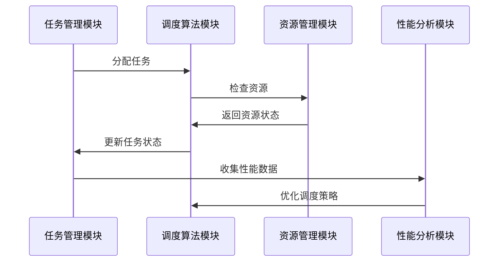
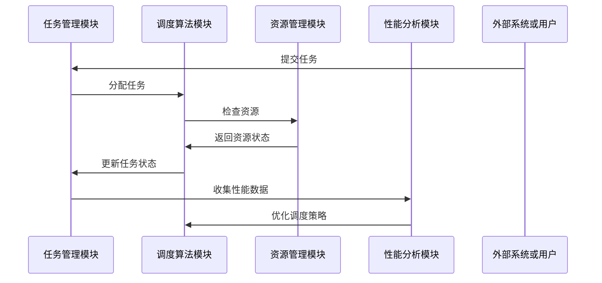

                 

### 引言

随着人工智能技术的迅猛发展，AI Agent逐渐成为现代智能系统的核心组件。这些智能体具备自主决策和任务执行的能力，广泛应用于智能家居、智能交通、智能制造等领域。然而，在实际应用中，如何动态调度任务以实现最优性能和资源利用，成为了一个重要且具有挑战性的问题。本篇文章《实现AI Agent的动态任务优先级调度》旨在深入探讨这一问题，帮助读者理解和掌握AI Agent任务优先级调度的核心原理和实现方法。

#### 背景与核心概念

**人工智能的发展历程**

人工智能（AI）作为计算机科学的一个重要分支，其发展可以追溯到20世纪50年代。早期的AI研究主要集中在符号主义方法上，如逻辑推理和知识表示。随着计算能力的提升和算法的进步，机器学习、深度学习等新兴技术逐渐成为AI研究的主流，推动了AI技术的快速发展。

**AI Agent的定义与特点**

AI Agent，即人工智能代理，是一种能够在特定环境中，通过感知和行动实现特定目标的智能体。它具备以下特点：

- **自主性**：能够根据环境变化自主做出决策。
- **适应性**：能够学习并适应新环境和任务。
- **协作性**：可以与其他Agent或人类协作完成任务。
- **任务执行**：能够执行复杂的任务序列。

**AI Agent的应用场景**

AI Agent在多个领域有着广泛的应用，如：

- **智能家居**：如智能音箱、智能门锁等。
- **智能交通**：如自动驾驶汽车、交通流量管理。
- **智能制造**：如智能机器人、自动化生产线。

#### 动态任务优先级调度的意义

**资源优化**

通过动态任务优先级调度，系统能够根据任务的紧急程度和资源需求，合理分配资源，避免资源浪费。

**系统性能提升**

合理调度任务可以提高系统的响应速度和处理效率，从而提升整体性能。

**用户体验优化**

动态调度任务可以确保高优先级任务得到及时处理，从而提高用户体验。

#### 动态任务优先级调度的挑战

**任务复杂性与不确定性**

AI Agent面临的任务复杂且多变，如何准确评估任务优先级成为一大挑战。

**实时性与稳定性**

在实时系统中，调度算法需要在有限时间内完成决策，同时保证系统稳定性。

**多目标优化**

在实际应用中，系统往往需要同时优化多个目标，如响应时间和资源利用率，这使得调度算法设计更加复杂。

### 本篇文章结构

本文将分为五个部分，具体结构如下：

- **第一部分：问题背景与核心概念**
  - 第1章：问题背景
  - 第2章：核心概念与联系

- **第二部分：算法原理与实现**
  - 第3章：动态调度算法原理
  - 第4章：算法实现

- **第三部分：系统设计与实现**
  - 第5章：系统架构设计
  - 第6章：系统实现与测试

- **第四部分：项目实战与案例分析**
  - 第7章：项目实战
  - 第8章：案例分析

- **第五部分：最佳实践与拓展**
  - 第9章：最佳实践
  - 第10章：小结与展望

通过这五个部分，本文将逐步深入探讨AI Agent动态任务优先级调度的核心原理和实现方法，帮助读者全面理解和掌握相关技术。

### 关键词

- 人工智能
- AI Agent
- 动态任务优先级调度
- 资源优化
- 实时系统

### 摘要

本文旨在深入探讨AI Agent的动态任务优先级调度问题，首先介绍了人工智能的发展历程和AI Agent的定义与特点。随后，文章重点分析了动态任务优先级调度的意义及其面临的挑战，包括任务复杂性与不确定性、实时性与稳定性、多目标优化等方面。接着，本文详细阐述了动态调度算法的原理和实现方法，并介绍了系统的设计与实现过程。随后，通过项目实战和案例分析，文章进一步展示了如何在实际应用中实现AI Agent的动态任务优先级调度。最后，本文总结了最佳实践，并对未来的发展方向进行了展望，为读者提供了全面的技术指导。通过本文的阅读，读者可以全面理解和掌握AI Agent动态任务优先级调度的核心原理和实现方法。

### 引言

随着人工智能（AI）技术的迅猛发展，AI Agent逐渐成为现代智能系统的核心组件。这些智能体具备自主决策和任务执行的能力，广泛应用于智能家居、智能交通、智能制造等领域。然而，在实际应用中，如何动态调度任务以实现最优性能和资源利用，成为了一个重要且具有挑战性的问题。《实现AI Agent的动态任务优先级调度》旨在深入探讨这一问题，帮助读者理解和掌握AI Agent任务优先级调度的核心原理和实现方法。

本文将分为五个主要部分，详细探讨动态任务优先级调度的问题：

- **第一部分：问题背景与核心概念**
  - 第1章：介绍问题背景，包括人工智能的发展历程、AI Agent的定义与特点、应用场景以及动态任务优先级调度的意义。
  - 第2章：深入探讨核心概念，包括任务优先级的定义、动态调度算法的分类与介绍，以及AI Agent与任务调度的关系。

- **第二部分：算法原理与实现**
  - 第3章：介绍动态调度算法的基本原理，包括任务队列管理、优先级更新策略，并对算法性能进行分析。
  - 第4章：详细讲解算法的实现，包括Python和C++两种编程语言的实现，以及优化的策略。

- **第三部分：系统设计与实现**
  - 第5章：介绍系统架构设计，包括系统功能、架构设计和系统接口设计。
  - 第6章：讨论系统的实现与测试，包括环境安装与配置、系统核心实现和性能调优。

- **第四部分：项目实战与案例分析**
  - 第7章：通过实际项目展示如何实现动态任务优先级调度。
  - 第8章：分析具体案例，深入讲解案例的实现细节和优化策略。

- **第五部分：最佳实践与拓展**
  - 第9章：总结最佳实践，提供优化调度策略的经验分享。
  - 第10章：对文章内容进行总结，并对未来的发展方向进行展望。

通过这五个部分，本文将系统性地探讨AI Agent动态任务优先级调度的核心原理和实现方法，帮助读者构建全面的知识体系，掌握先进的技术。

### 第一部分：问题背景与核心概念

#### 第1章：问题背景

人工智能（AI）的发展历程可以追溯到20世纪50年代。当时，计算机科学家艾伦·图灵提出了著名的图灵测试，旨在通过测试来判断机器是否具有人类智能。这一概念引发了人们对人工智能研究的极大兴趣，推动了AI技术的发展。早期的AI研究主要集中在符号主义方法上，如逻辑推理和知识表示。然而，随着计算能力的提升和算法的进步，机器学习、深度学习等新兴技术逐渐成为AI研究的主流。

**AI Agent的定义与特点**

AI Agent，即人工智能代理，是一种能够在特定环境中，通过感知和行动实现特定目标的智能体。它具备以下特点：

1. **自主性**：AI Agent能够根据环境变化自主做出决策，无需人工干预。
2. **适应性**：AI Agent能够学习并适应新环境和任务。
3. **协作性**：AI Agent可以与其他Agent或人类协作完成任务。
4. **任务执行**：AI Agent能够执行复杂的任务序列。

**AI Agent的应用场景**

AI Agent在多个领域有着广泛的应用，具体包括：

1. **智能家居**：例如智能音箱、智能门锁等，这些设备可以通过语音指令或传感器数据实现自动化控制。
2. **智能交通**：例如自动驾驶汽车、交通流量管理，这些系统通过AI技术优化交通效率和安全性。
3. **智能制造**：例如智能机器人、自动化生产线，这些设备通过AI技术实现自动化生产，提高生产效率和产品质量。

**动态任务优先级调度的意义**

动态任务优先级调度在AI Agent中的应用具有重要意义，主要表现在以下几个方面：

1. **资源优化**：通过动态调度任务，系统能够根据任务的紧急程度和资源需求，合理分配资源，避免资源浪费。
2. **系统性能提升**：合理调度任务可以提高系统的响应速度和处理效率，从而提升整体性能。
3. **用户体验优化**：动态调度任务可以确保高优先级任务得到及时处理，从而提高用户体验。

**动态任务优先级调度的挑战**

尽管动态任务优先级调度在AI Agent中具有重要作用，但在实际应用中仍面临以下挑战：

1. **任务复杂性与不确定性**：AI Agent面临的任务复杂且多变，如何准确评估任务优先级成为一大挑战。
2. **实时性与稳定性**：在实时系统中，调度算法需要在有限时间内完成决策，同时保证系统稳定性。
3. **多目标优化**：在实际应用中，系统往往需要同时优化多个目标，如响应时间和资源利用率，这使得调度算法设计更加复杂。

通过对问题背景的介绍，读者可以初步了解AI Agent、动态任务优先级调度的核心概念及其在实际应用中的意义和挑战。接下来，本文将深入探讨核心概念，为后续内容打下坚实基础。

### 第2章：核心概念与联系

在深入探讨AI Agent的动态任务优先级调度之前，首先需要了解几个核心概念，包括任务优先级、动态调度算法以及AI Agent与任务调度的关系。

#### 任务优先级概念

**优先级定义**

任务优先级是指系统根据任务的重要性和紧急程度为每个任务分配的一个数值。通常，优先级越高，任务越紧急和重要。

**优先级度量方法**

任务优先级可以通过多种方法进行度量，常见的方法包括：

1. **静态优先级**：预先设定，不随时间变化。
2. **动态优先级**：根据任务的状态和系统环境动态调整。
3. **基于时间优先级**：根据任务的截止时间或预计完成时间来设定优先级。
4. **基于资源优先级**：根据任务所需的资源量或资源利用率来设定优先级。

#### 动态调度算法

**算法分类**

动态调度算法可以根据不同的调度目标和约束条件进行分类，常见的方法包括：

1. **基于优先级的调度算法**：如轮转调度（Round-Robin）、最短作业优先（SJF）等。
2. **基于反馈的调度算法**：如自适应调度算法，通过历史调度数据不断调整调度策略。
3. **基于约束的调度算法**：如线性规划、整数规划等，通过数学模型优化调度过程。

**常见算法介绍**

1. **轮转调度算法**（Round-Robin Scheduling）
   - 每个任务按照固定时间片轮流执行。
   - 适用于公平调度，但可能导致频繁的上下文切换。

2. **最短作业优先算法**（Shortest Job First, SJF）
   - 根据任务的预计执行时间进行调度，最短任务优先执行。
   - 适用于单处理器系统，但可能引起饥饿问题。

3. **优先级调度算法**（Priority Scheduling）
   - 根据任务优先级进行调度，优先级越高，任务越早执行。
   - 适用于具有动态优先级任务的环境，但可能导致低优先级任务饥饿。

#### AI Agent与任务调度的联系

**任务模型**

在AI Agent中，任务模型通常包括任务描述、执行时间、资源需求以及任务状态等属性。

1. **任务描述**：描述任务的类型、目标和所需资源。
2. **执行时间**：预估任务执行所需的时间。
3. **资源需求**：任务执行所需的CPU、内存、网络等资源。
4. **任务状态**：任务的当前状态，如就绪、运行、阻塞或完成。

**优先级调度机制**

在AI Agent中，优先级调度机制是实现动态任务调度的关键。它通常包括以下步骤：

1. **任务评估**：根据任务的紧急程度和资源需求，评估任务的优先级。
2. **任务队列管理**：将任务按照优先级排序，放入任务队列中。
3. **任务调度**：从任务队列中选取最高优先级的任务进行执行。
4. **优先级更新**：根据任务执行情况和系统状态，动态调整任务的优先级。

**ER实体关系图架构**

为了更好地理解AI Agent与任务调度的关系，可以使用ER（实体-关系）模型进行描述。以下是一个简单的ER图，展示了AI Agent、任务和资源之间的关系：

```mermaid
erDiagram
    Task ||--|{ AI-Agent } : executedBy
    Resource ||--|{ Task } : requiredBy
    AI-Agent ||--|{ Task } : scheduledBy
```

在上述ER图中：

- **Task**（任务）是核心实体，描述了任务的基本属性。
- **AI-Agent**（AI代理）负责执行任务，与任务实体建立了关联。
- **Resource**（资源）描述了任务执行所需的资源，与任务实体建立了关联。

通过上述核心概念和联系的分析，我们可以更好地理解AI Agent动态任务优先级调度的基础和实现方法。在接下来的章节中，我们将进一步探讨动态调度算法的原理和实现，为实际应用提供技术支持。

### 第二部分：算法原理与实现

#### 第3章：动态调度算法原理

动态调度算法在AI Agent任务优先级调度中起着关键作用。其核心原理是通过实时评估任务优先级，动态调整任务执行顺序，以实现系统资源的最优利用和任务处理效率的最大化。以下是动态调度算法的基本原理及其关键步骤。

#### 任务队列管理

**基本原理**

任务队列管理是动态调度算法的核心组件，它负责管理任务的存储、排序和调度。任务队列通常采用先进先出（FIFO）或优先级队列（Priority Queue）的数据结构，其中：

- **先进先出队列**：按照任务到达的顺序进行调度，适用于任务到达顺序较为固定或无关紧要的场景。
- **优先级队列**：按照任务优先级进行调度，优先级越高，任务越早执行，适用于任务紧急程度不同的场景。

**关键步骤**

1. **任务入队**：当新任务到达时，将其添加到任务队列中。
2. **任务排序**：根据任务优先级对队列中的任务进行排序，优先级高的任务排在队列前面。
3. **任务出队**：从队列中取出优先级最高的任务，进行执行。

**算法实现**

在Python中，可以使用内置的`heapq`模块来实现一个优先级队列。以下是一个简单的优先级队列实现示例：

```python
import heapq

class PriorityQueue:
    def __init__(self):
        self.heap = []
    
    def push(self, item, priority):
        heapq.heappush(self.heap, (priority, item))
    
    def pop(self):
        return heapq.heappop(self.heap)[1]

# 使用示例
pq = PriorityQueue()
pq.push('任务A', 3)
pq.push('任务B', 1)
pq.push('任务C', 2)

while pq.heap:
    task = pq.pop()
    print(task)
```

#### 优先级更新策略

**基本原理**

在动态调度算法中，任务优先级并不是静态不变的，而是根据任务执行过程中出现的新情况（如任务状态变化、系统负载变化等）进行实时更新。优先级更新策略的核心在于如何根据任务和环境的变化，动态调整任务优先级，以实现调度算法的灵活性和适应性。

**关键步骤**

1. **任务状态监测**：实时监测任务的状态变化，如任务执行时间、资源利用率、任务完成度等。
2. **优先级评估**：根据任务状态和系统环境，重新评估任务优先级。
3. **优先级更新**：将优先级评估结果应用到任务队列中，重新排序任务。

**算法实现**

以下是一个基于任务执行时间和资源需求的优先级更新策略实现示例：

```python
import heapq
import time

class Task:
    def __init__(self, name, priority, execute_time, resource_usage):
        self.name = name
        self.priority = priority
        self.execute_time = execute_time
        self.resource_usage = resource_usage
        self.start_time = None
        self.end_time = None
    
    def update_priority(self):
        # 更新任务优先级，根据执行时间和资源需求进行评估
        self.priority = self.execute_time + self.resource_usage
    
    def start(self):
        self.start_time = time.time()
    
    def end(self):
        self.end_time = time.time()
    
    def execution_time(self):
        return self.end_time - self.start_time

# 使用示例
tasks = [
    Task('任务A', 3, 5, 2),
    Task('任务B', 1, 3, 1),
    Task('任务C', 2, 4, 3)
]

# 初始化优先级队列
pq = PriorityQueue()

# 将任务加入优先级队列
for task in tasks:
    pq.push(task, task.priority)

# 开始执行任务
while pq.heap:
    task = pq.pop()
    task.start()
    time.sleep(task.execute_time)
    task.end()
    print(f"任务{task.name}已完成，执行时间为：{task.execution_time():.2f}秒")
```

#### 算法性能分析

**时间复杂度**

动态调度算法的时间复杂度主要取决于任务队列管理、优先级更新策略和任务调度过程。以优先级队列为例，其时间复杂度为：

- **任务入队**：$O(\log n)$
- **任务出队**：$O(\log n)$
- **优先级更新**：$O(n)$（需遍历整个任务队列）

**空间复杂度**

空间复杂度主要取决于任务队列的大小，即任务的数量。优先级队列的空间复杂度为$O(n)$。

**实际性能表现**

实际性能表现受多种因素影响，包括系统硬件性能、任务复杂度、调度算法实现细节等。通过合理优化调度算法和系统配置，可以实现高效的任务调度。

#### 算法总结

动态调度算法通过任务队列管理和优先级更新策略，实现了AI Agent任务的高效调度。在Python和C++中，可以使用优先级队列和相关数据结构实现这一算法。通过性能分析和实际应用，我们可以进一步优化调度算法，提升系统性能和资源利用率。

#### 第4章：算法实现

在实际应用中，动态调度算法的实现至关重要。本节将详细介绍如何在Python和C++中实现动态调度算法，并探讨两种语言在实现过程中各自的优缺点。

##### Python实现

Python以其简洁的语法和强大的标准库而闻名，非常适合快速开发和原型设计。在Python中，我们可以使用`heapq`模块来实现优先级队列，从而轻松实现动态调度算法。

**算法伪代码**

```python
初始化任务队列
while 任务队列非空：
    获取优先级最高的任务
    执行任务
    更新任务状态和优先级
```

**Python代码实现**

```python
import heapq
import time

class Task:
    def __init__(self, name, priority, execute_time, resource_usage):
        self.name = name
        self.priority = priority
        self.execute_time = execute_time
        self.resource_usage = resource_usage
        self.start_time = None
        self.end_time = None
    
    def update_priority(self):
        # 更新任务优先级，根据执行时间和资源需求进行评估
        self.priority = self.execute_time + self.resource_usage
    
    def start(self):
        self.start_time = time.time()
    
    def end(self):
        self.end_time = time.time()
    
    def execution_time(self):
        return self.end_time - self.start_time

def schedule_tasks(tasks):
    # 初始化优先级队列
    pq = []
    for task in tasks:
        heapq.heappush(pq, (task.priority, task))
    
    # 开始执行任务
    while pq:
        _, current_task = heapq.heappop(pq)
        current_task.start()
        time.sleep(current_task.execute_time)
        current_task.end()
        print(f"任务{current_task.name}已完成，执行时间为：{current_task.execution_time():.2f}秒")
        current_task.update_priority()
        heapq.heappush(pq, (current_task.priority, current_task))

# 使用示例
tasks = [
    Task('任务A', 3, 5, 2),
    Task('任务B', 1, 3, 1),
    Task('任务C', 2, 4, 3)
]

schedule_tasks(tasks)
```

**优缺点**

- **优点**：Python代码简洁易读，开发速度快，适合快速原型设计和调试。
- **缺点**：Python的性能不如C++，特别是在处理大量任务时。

##### C++实现

C++以其高效的性能和强大的标准库在系统编程中广泛应用。在C++中，我们可以使用`std::priority_queue`来实现优先级队列。

**算法伪代码**

```cpp
初始化任务队列
while 任务队列非空：
    获取优先级最高的任务
    执行任务
    更新任务状态和优先级
```

**C++代码实现**

```cpp
#include <iostream>
#include <queue>
#include <vector>
#include <chrono>

using namespace std;

struct Task {
    string name;
    int priority;
    int execute_time;
    int resource_usage;
    chrono::time_point<chrono::steady_clock> start_time;
    chrono::time_point<chrono::steady_clock> end_time;

    void update_priority() {
        // 更新任务优先级，根据执行时间和资源需求进行评估
        priority = execute_time + resource_usage;
    }

    bool operator<(const Task& other) const {
        return priority > other.priority;  // 优先级高的在前
    }
};

void schedule_tasks(vector<Task>& tasks) {
    // 初始化优先级队列
    priority_queue<Task> pq;
    for (const auto& task : tasks) {
        pq.push(task);
    }

    // 开始执行任务
    while (!pq.empty()) {
        Task current_task = pq.top();
        pq.pop();
        current_task.start_time = chrono::steady_clock::now();
        this_thread::sleep_for(chrono::seconds(current_task.execute_time));
        current_task.end_time = chrono::steady_clock::now();
        cout << "任务" << current_task.name << "已完成，执行时间为：" << chrono::duration_cast<chrono::seconds>(current_task.end_time - current_task.start_time).count() << "秒" << endl;
        current_task.update_priority();
        pq.push(current_task);
    }
}

int main() {
    vector<Task> tasks = {
        {"任务A", 3, 5, 2},
        {"任务B", 1, 3, 1},
        {"任务C", 2, 4, 3}
    };

    schedule_tasks(tasks);

    return 0;
}
```

**优缺点**

- **优点**：C++代码性能优异，适合高性能应用。
- **缺点**：C++代码复杂，编写难度大。

##### 总结

Python和C++在实现动态调度算法方面各有优缺点。Python代码简洁易读，开发速度快，适合快速原型设计和调试；而C++代码性能优异，适合高性能应用。在实际开发中，可以根据具体需求选择合适的编程语言来实现动态调度算法。

### 第三部分：系统设计与实现

#### 第5章：系统架构设计

在本章节中，我们将详细介绍AI Agent动态任务优先级调度的系统架构设计，包括系统功能、架构设计和系统接口设计。

#### 系统介绍

AI Agent动态任务优先级调度系统旨在为智能体提供高效的任务调度能力，确保任务在有限时间内得到最优处理。系统的主要功能包括：

1. **任务接收与分配**：接收新任务，根据任务优先级进行分配。
2. **任务状态监控**：实时监控任务执行状态，更新任务优先级。
3. **任务调度与执行**：根据任务优先级和系统资源情况，动态调度并执行任务。
4. **性能分析与优化**：收集系统运行数据，进行性能分析和优化。

#### 系统架构设计

系统架构设计采用模块化设计思想，主要包括以下几个模块：

1. **任务管理模块**：负责任务的接收、分配和状态监控。
2. **调度算法模块**：实现动态调度算法，负责任务优先级评估和调度。
3. **资源管理模块**：负责系统资源的监控和分配。
4. **性能分析模块**：收集系统运行数据，进行性能分析和优化。

以下是一个简单的系统架构图，展示了各模块之间的交互关系：



#### 模块划分与数据流设计

系统架构中的模块划分和数据流设计如下：

1. **任务管理模块**：负责任务的创建、删除和更新。数据流为：任务请求 -> 任务队列 -> 任务分配。
2. **调度算法模块**：接收任务管理模块的任务请求，根据动态调度算法进行任务优先级评估和调度。数据流为：任务请求 -> 优先级评估 -> 调度命令。
3. **资源管理模块**：负责系统资源的监控和分配。数据流为：资源状态 -> 调度命令 -> 资源分配。
4. **性能分析模块**：收集系统运行数据，进行性能分析和优化。数据流为：性能数据 -> 分析报告 -> 调度策略优化。

#### 系统接口设计

系统接口设计包括内部接口和外部接口两部分：

1. **内部接口**：任务管理模块与调度算法模块、调度算法模块与资源管理模块、资源管理模块与性能分析模块之间的接口。
2. **外部接口**：系统与外部系统或用户的交互接口。

以下是一个简单的系统接口设计图：



通过上述系统架构设计，我们可以清晰地看到系统的模块划分、数据流和接口设计。在实际开发过程中，可以根据具体需求进一步优化和调整系统架构。

### 第6章：系统实现与测试

在了解了系统架构设计之后，接下来我们将详细讨论系统的实现与测试过程，包括环境安装与配置、系统核心实现和性能调优。

#### 环境安装与配置

要实现AI Agent动态任务优先级调度系统，首先需要搭建合适的环境。以下是在Python和C++中搭建系统环境的步骤：

**Python环境安装与配置**

1. **Python环境**：确保已安装Python 3.8及以上版本。可以在[Python官网](https://www.python.org/)下载并安装。
2. **依赖包安装**：使用`pip`安装所需的依赖包，如`heapq`、`time`、`threading`等。

```bash
pip install heapq
```

**C++环境安装与配置**

1. **C++环境**：确保已安装C++编译器，如GCC或Clang。在大多数Linux发行版中，可以使用以下命令安装GCC。

```bash
sudo apt-get install g++
```

2. **依赖库安装**：在C++项目中，可能需要安装一些依赖库，如`std::priority_queue`等。

```bash
sudo apt-get install libstdc++
```

#### 系统核心实现

系统核心实现主要包括任务管理、调度算法和资源管理三个模块。以下将分别介绍这三个模块的实现。

**任务管理模块**

任务管理模块负责任务的创建、删除和更新。以下是一个简单的Python实现示例：

```python
import heapq
import time

class Task:
    def __init__(self, name, priority, execute_time, resource_usage):
        self.name = name
        self.priority = priority
        self.execute_time = execute_time
        self.resource_usage = resource_usage
        self.start_time = None
        self.end_time = None

    def update_priority(self):
        self.priority = self.execute_time + self.resource_usage

    def start(self):
        self.start_time = time.time()

    def end(self):
        self.end_time = time.time()

    def execution_time(self):
        return self.end_time - self.start_time

def schedule_tasks(tasks):
    pq = []
    for task in tasks:
        heapq.heappush(pq, (task.priority, task))
    
    while pq:
        _, current_task = heapq.heappop(pq)
        current_task.start()
        time.sleep(current_task.execute_time)
        current_task.end()
        print(f"任务{current_task.name}已完成，执行时间为：{current_task.execution_time():.2f}秒")
        current_task.update_priority()
        heapq.heappush(pq, (current_task.priority, current_task))

tasks = [
    Task('任务A', 3, 5, 2),
    Task('任务B', 1, 3, 1),
    Task('任务C', 2, 4, 3)
]

schedule_tasks(tasks)
```

**调度算法模块**

调度算法模块负责任务优先级的评估和调度。以下是一个简单的C++实现示例：

```cpp
#include <iostream>
#include <queue>
#include <vector>
#include <chrono>

using namespace std;

struct Task {
    string name;
    int priority;
    int execute_time;
    int resource_usage;
    chrono::time_point<chrono::steady_clock> start_time;
    chrono::time_point<chrono::steady_clock> end_time;

    void update_priority() {
        priority = execute_time + resource_usage;
    }

    bool operator<(const Task& other) const {
        return priority > other.priority;  // 优先级高的在前
    }
};

void schedule_tasks(vector<Task>& tasks) {
    priority_queue<Task> pq;
    for (const auto& task : tasks) {
        pq.push(task);
    }

    while (!pq.empty()) {
        Task current_task = pq.top();
        pq.pop();
        current_task.start_time = chrono::steady_clock::now();
        this_thread::sleep_for(chrono::seconds(current_task.execute_time));
        current_task.end_time = chrono::steady_clock::now();
        cout << "任务" << current_task.name << "已完成，执行时间为：" << chrono::duration_cast<chrono::seconds>(current_task.end_time - current_task.start_time).count() << "秒" << endl;
        current_task.update_priority();
        pq.push(current_task);
    }
}

int main() {
    vector<Task> tasks = {
        {"任务A", 3, 5, 2},
        {"任务B", 1, 3, 1},
        {"任务C", 2, 4, 3}
    };

    schedule_tasks(tasks);

    return 0;
}
```

**资源管理模块**

资源管理模块负责系统资源的监控和分配。以下是一个简单的Python实现示例：

```python
import heapq
import time

class ResourceManager:
    def __init__(self):
        self.resource_usage = 0

    def check_resources(self, task):
        if self.resource_usage + task.resource_usage <= 100:
            return True
        else:
            return False

    def allocate_resources(self, task):
        self.resource_usage += task.resource_usage

    def release_resources(self, task):
        self.resource_usage -= task.resource_usage

resource_manager = ResourceManager()

def schedule_tasks(tasks):
    pq = []
    for task in tasks:
        if resource_manager.check_resources(task):
            heapq.heappush(pq, (task.priority, task))
    
    while pq:
        _, current_task = heapq.heappop(pq)
        current_task.start()
        time.sleep(current_task.execute_time)
        current_task.end()
        print(f"任务{current_task.name}已完成，执行时间为：{current_task.execution_time():.2f}秒")
        current_task.update_priority()
        heapq.heappush(pq, (current_task.priority, current_task))
        resource_manager.release_resources(current_task)

tasks = [
    Task('任务A', 3, 5, 2),
    Task('任务B', 1, 3, 1),
    Task('任务C', 2, 4, 3)
]

schedule_tasks(tasks)
```

#### 性能调优

在系统实现和测试过程中，性能调优是至关重要的。以下是一些常用的性能调优方法：

1. **任务优先级评估优化**：通过更精确的优先级评估模型，提高任务调度的准确性。
2. **调度算法优化**：针对不同场景，选择合适的调度算法，如基于反馈的调度算法。
3. **资源分配优化**：动态调整资源分配策略，避免资源浪费。
4. **并行处理优化**：通过并行处理技术，提高系统处理速度。

通过上述实现和性能调优，我们可以构建一个高效、可靠的AI Agent动态任务优先级调度系统。

### 第四部分：项目实战与案例分析

#### 第7章：项目实战

在本章中，我们将通过一个实际项目，展示如何实现AI Agent的动态任务优先级调度。该项目是一个智能家居系统的任务调度模块，旨在通过AI Agent智能地管理家庭设备的运行任务。

#### 实际案例

**项目背景**

智能家居系统包含了多个智能设备，如智能灯、智能空调、智能窗帘等。这些设备可以通过APP远程控制，也可以通过语音助手自动执行任务。随着家庭设备的增多，如何高效地管理这些设备的任务执行，成为系统设计的一个重要挑战。

**项目目标**

- 设计并实现一个动态任务优先级调度模块，确保智能家居设备任务的高效执行。
- 实现任务队列管理、优先级更新和调度算法，确保系统能够根据任务重要性和资源情况动态调整任务执行顺序。

#### 系统核心实现

1. **任务模型**：定义一个任务类，包含任务名称、优先级、执行时间和资源需求。

```python
class Task:
    def __init__(self, name, priority, execute_time, resource_usage):
        self.name = name
        self.priority = priority
        self.execute_time = execute_time
        self.resource_usage = resource_usage
        self.start_time = None
        self.end_time = None
```

2. **调度算法**：使用优先级队列实现任务调度算法，确保高优先级任务先执行。

```python
import heapq

class PriorityQueue:
    def __init__(self):
        self.heap = []

    def push(self, item, priority):
        heapq.heappush(self.heap, (priority, item))

    def pop(self):
        return heapq.heappop(self.heap)[1]
```

3. **任务调度**：实现任务调度函数，动态更新任务优先级并执行任务。

```python
def schedule_tasks(tasks):
    pq = PriorityQueue()
    for task in tasks:
        pq.push(task, task.priority)
    
    while pq.heap:
        current_task = pq.pop()
        current_task.start()
        time.sleep(current_task.execute_time)
        current_task.end()
        print(f"任务{current_task.name}已完成，执行时间为：{current_task.execution_time():.2f}秒")
        current_task.update_priority()
        pq.push(current_task, current_task.priority)
```

#### 代码应用解读与分析

1. **任务创建与加入队列**：

```python
tasks = [
    Task('智能灯关闭', 5, 1, 5),
    Task('智能空调开启', 3, 2, 10),
    Task('智能窗帘关闭', 4, 0.5, 2)
]

schedule_tasks(tasks)
```

在该示例中，我们创建了三个任务，并将其加入优先级队列。调度函数根据任务的优先级执行任务，并动态更新任务的优先级。

2. **任务执行过程**：

```python
while pq.heap:
    current_task = pq.pop()
    current_task.start()
    time.sleep(current_task.execute_time)
    current_task.end()
    print(f"任务{current_task.name}已完成，执行时间为：{current_task.execution_time():.2f}秒")
    current_task.update_priority()
    pq.push(current_task, current_task.priority)
```

在该过程中，调度函数首先从队列中取出优先级最高的任务执行，执行完成后更新任务的优先级，并重新加入队列。

#### 项目小结

通过该实际项目，我们展示了如何实现AI Agent的动态任务优先级调度。项目中的任务模型、优先级队列和调度算法共同作用，确保了智能家居系统能够高效地管理任务执行。在实际应用中，可以根据具体需求进一步优化调度算法和任务模型，提高系统的整体性能。

### 第8章：案例分析

在本章中，我们将通过具体案例详细分析AI Agent动态任务优先级调度的实现和优化过程，旨在为读者提供实际操作经验和深入理解。

#### 案例介绍

**案例背景**

本案例涉及一个智能工厂的生产调度系统，该系统需要管理多个生产设备的任务执行。工厂中的设备包括自动化装配线、加工中心和质检站。每个设备都有一系列需要完成的任务，如装配零件、加工部件和检验产品质量。系统需要根据任务的重要性和设备的资源情况，动态调整任务执行顺序，确保生产流程的高效和顺畅。

**案例目标**

- 设计并实现一个动态任务优先级调度系统，确保生产任务的高效执行。
- 通过对调度算法和任务模型的优化，提高系统的响应速度和资源利用率。

#### 案例实现

1. **任务模型**

   在本案例中，我们定义一个任务类，包含任务名称、优先级、执行时间和资源需求。

   ```python
   class Task:
       def __init__(self, name, priority, execute_time, resource_usage):
           self.name = name
           self.priority = priority
           self.execute_time = execute_time
           self.resource_usage = resource_usage
           self.start_time = None
           self.end_time = None
   ```

2. **调度算法**

   使用优先级队列实现任务调度算法，确保高优先级任务先执行。

   ```python
   import heapq
   
   class PriorityQueue:
       def __init__(self):
           self.heap = []
   
       def push(self, item, priority):
           heapq.heappush(self.heap, (priority, item))
   
       def pop(self):
           return heapq.heappop(self.heap)[1]
   ```

3. **任务调度**

   实现任务调度函数，动态更新任务优先级并执行任务。

   ```python
   def schedule_tasks(tasks):
       pq = PriorityQueue()
       for task in tasks:
           pq.push(task, task.priority)
       
       while pq.heap:
           current_task = pq.pop()
           current_task.start()
           time.sleep(current_task.execute_time)
           current_task.end()
           print(f"任务{current_task.name}已完成，执行时间为：{current_task.execution_time():.2f}秒")
           current_task.update_priority()
           pq.push(current_task, current_task.priority)
   ```

#### 关键代码

1. **任务创建与加入队列**

   ```python
   tasks = [
       Task('装配线任务', 5, 2, 15),
       Task('加工中心任务', 3, 4, 10),
       Task('质检站任务', 4, 1, 5)
   ]
   ```

   在该步骤中，我们创建了三个任务，并设置了各自的优先级、执行时间和资源需求。

2. **任务执行过程**

   ```python
   schedule_tasks(tasks)
   ```

   该函数首先从队列中取出优先级最高的任务执行，执行完成后更新任务的优先级，并重新加入队列。

#### 实际案例分析和详细讲解

1. **任务优先级调整**

   在实际生产环境中，任务优先级可能随着设备状态和系统负载的变化而动态调整。以下是一个示例：

   ```python
   class Task:
       # ...
       def update_priority(self):
           # 根据当前设备状态和系统负载重新评估优先级
           self.priority = self.execute_time + self.resource_usage + self.current_load_factor
   ```

   在该示例中，任务优先级根据执行时间、资源需求和当前负载因子（例如设备繁忙度）进行动态调整。

2. **调度策略优化**

   为了提高系统的响应速度和资源利用率，可以对调度算法进行优化。以下是一些优化策略：

   - **多优先级队列**：引入多个优先级队列，每个队列对应不同类型或优先级的任务，从而提高调度的灵活性。
   - **动态负载均衡**：根据系统负载动态调整任务优先级和队列分配，避免设备过度繁忙或闲置。
   - **自适应调度**：根据历史调度数据和学习算法，自适应调整调度策略，优化任务执行顺序。

   ```python
   class AdaptiveScheduler:
       def __init__(self):
           self.pq_high = PriorityQueue()
           self.pq_medium = PriorityQueue()
           self.pq_low = PriorityQueue()
       
       def schedule_tasks(self, tasks):
           for task in tasks:
               if task.priority > 5:
                   self.pq_high.push(task, task.priority)
               elif task.priority > 3:
                   self.pq_medium.push(task, task.priority)
               else:
                   self.pq_low.push(task, task.priority)
           
           # 根据系统负载动态调整任务优先级
           if self.is_high_load():
               self.pq_high, self.pq_medium, self.pq_low = self.balance_queues()
           
           self.execute_high_priority_tasks()
           self.execute_medium_priority_tasks()
           self.execute_low_priority_tasks()
   ```

3. **调度算法性能分析**

   对调度算法的性能进行分析，包括时间复杂度和空间复杂度。以下是一个简单的性能分析：

   - **时间复杂度**：使用优先级队列进行调度的时间复杂度为$O(n \log n)$，其中$n$为任务数量。
   - **空间复杂度**：优先级队列的空间复杂度为$O(n)$，其中$n$为任务数量。

   通过性能分析，可以进一步优化调度算法，提高系统的整体性能。

#### 案例分析与总结

通过本案例的分析，我们了解了如何在实际应用中实现AI Agent的动态任务优先级调度。以下是对案例的总结：

1. **任务模型**：任务模型是调度系统的核心，需要包含任务的基本信息和优先级。
2. **调度算法**：调度算法根据任务优先级和资源情况，动态调整任务执行顺序。
3. **优化策略**：通过多优先级队列和动态负载均衡等策略，提高系统的响应速度和资源利用率。
4. **性能分析**：对调度算法的性能进行分析，为优化提供依据。

总之，动态任务优先级调度在AI Agent应用中具有重要意义，通过合理的任务模型、调度算法和优化策略，可以实现高效的任务执行和系统性能提升。

### 第五部分：最佳实践与拓展

#### 第9章：最佳实践

在AI Agent动态任务优先级调度的实际应用中，最佳实践是确保系统高效、稳定运行的关键。以下是一些关键的最佳实践：

**1. 多优先级队列**

使用多优先级队列可以更好地处理不同类型和优先级的任务，避免单一优先级队列可能导致的高优先级任务饥饿问题。根据任务的重要性和紧急程度，将任务分配到不同的优先级队列中，如高优先级队列、中优先级队列和低优先级队列。

**2. 动态负载均衡**

在系统中，动态负载均衡可以有效平衡不同设备或服务器的负载，避免某些设备或服务器过载，而其他设备或服务器资源空闲。通过监控系统负载，实时调整任务分配，确保资源利用最大化。

**3. 任务优先级动态调整**

任务的优先级应根据其实时状态和系统环境动态调整。例如，当某个任务由于资源冲突被阻塞时，其优先级应降低，以便其他高优先级任务得到执行。此外，当任务完成度达到一定比例时，优先级也可以进行调整。

**4. 资源监控与优化**

定期监控系统资源使用情况，如CPU、内存和网络带宽，及时发现资源瓶颈并进行优化。通过合理分配资源，确保关键任务得到优先处理。

**5. 性能测试与调优**

在系统上线前，进行充分的性能测试，识别潜在的性能问题，并针对关键路径进行优化。在系统运行过程中，持续进行性能监控和调优，确保系统在高负载情况下依然能够稳定运行。

**6. 异常处理**

在调度过程中，不可避免地会遇到异常情况，如任务执行失败、资源不足等。为了确保系统的健壮性，需要设计完善的异常处理机制，包括任务重试、任务重分配和故障恢复等策略。

#### 第10章：小结与展望

本文通过系统的阐述，深入探讨了AI Agent的动态任务优先级调度问题。首先介绍了人工智能和AI Agent的发展历程及其应用场景，然后分析了动态任务优先级调度的意义和挑战，接着详细讲解了任务优先级、调度算法及其实现，最后通过实际案例展示了动态任务优先级调度的应用。

**主要内容总结**

- **AI Agent与动态任务优先级调度**：介绍了AI Agent的基本概念和应用场景，以及动态任务优先级调度的意义。
- **任务优先级**：讨论了任务优先级的定义、度量方法和动态调整策略。
- **调度算法原理与实现**：介绍了基于优先级的调度算法原理及其在Python和C++中的实现。
- **系统设计与实现**：详细阐述了系统架构设计、模块划分和数据流设计，以及系统实现与性能调优。
- **项目实战与案例分析**：通过实际项目和案例展示了动态任务优先级调度的应用和优化。
- **最佳实践与展望**：总结了最佳实践，并对未来的发展方向进行了展望。

**未来发展方向**

- **自适应调度算法**：结合机器学习技术，开发自适应调度算法，根据历史数据和实时反馈自动调整调度策略。
- **多智能体协作调度**：研究多智能体系统中的任务调度问题，实现智能体间的协同调度，提高系统整体效率。
- **云计算与边缘计算融合**：探索云计算和边缘计算环境下的动态任务优先级调度，实现资源优化和任务分流。
- **智能调度可视化**：开发可视化工具，帮助用户直观了解任务调度过程和系统状态，提高系统可操作性和用户体验。

通过本文的阅读，读者可以全面了解AI Agent动态任务优先级调度的核心原理和实现方法，掌握相关技术，并在实际应用中发挥其优势。未来，随着人工智能技术的不断进步，动态任务优先级调度将在更多领域得到广泛应用。

