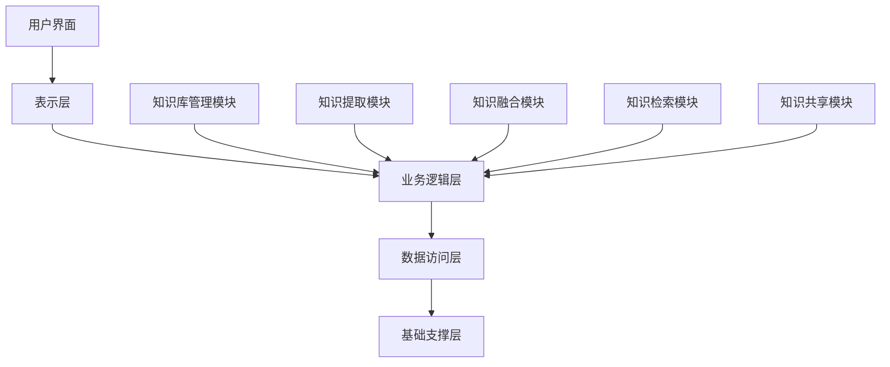
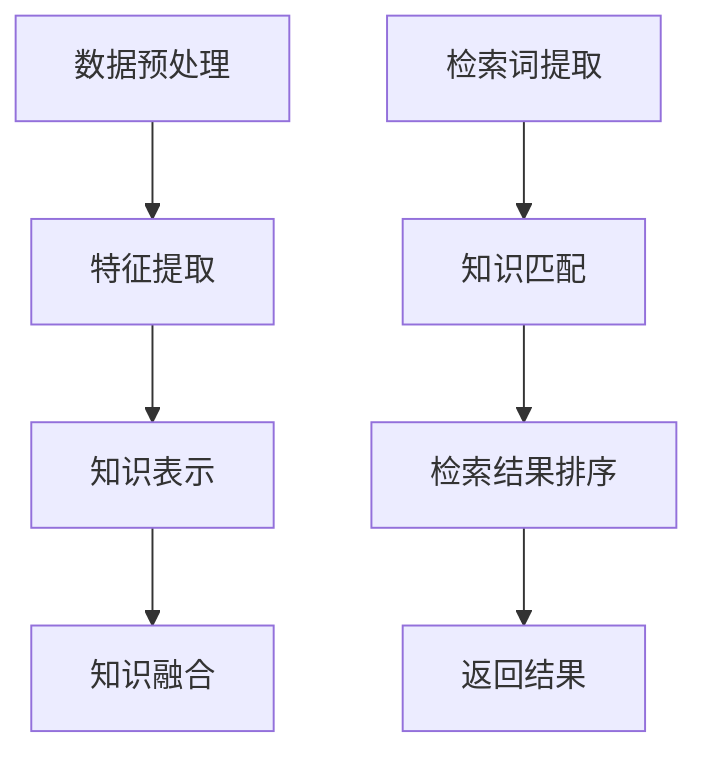
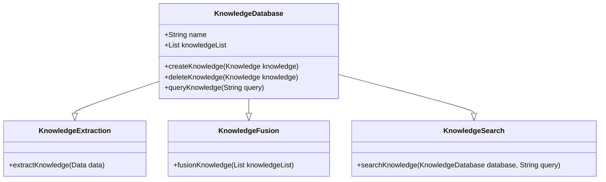
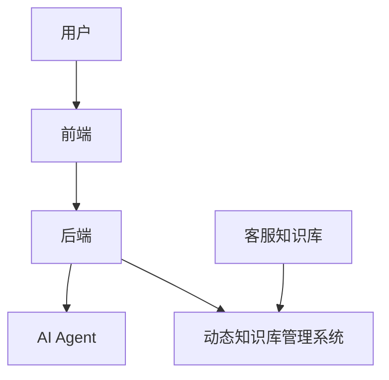
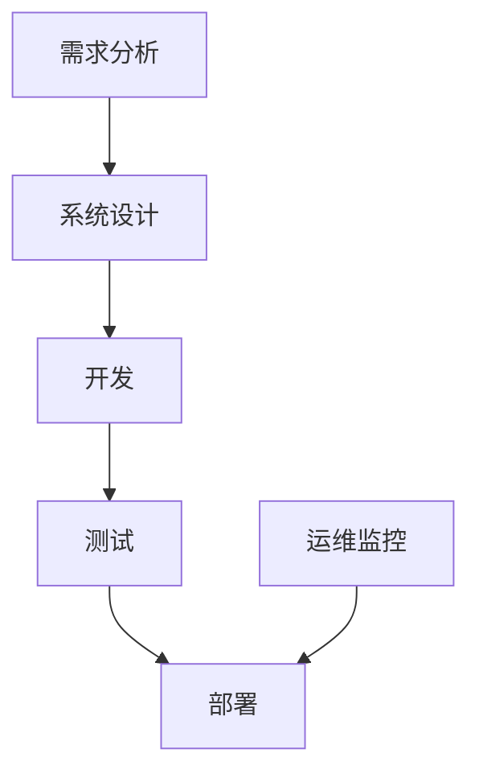

                 

## 文章标题

### 关键词

- AI Agent
- 动态知识库管理系统
- 知识提取
- 知识融合
- 知识检索
- 算法原理
- 系统架构
- 项目实战
- 最佳实践
- 拓展阅读

### 摘要

本文旨在探讨如何实现AI Agent的动态知识库管理系统，以提高AI Agent在复杂环境中的表现和适应性。文章首先介绍了AI Agent的基础知识及其与动态知识库管理系统的关系，然后详细分析了动态知识库管理系统的设计与实现，包括系统架构设计、核心算法原理讲解和系统实现细节。接着，通过一个实际项目展示了动态知识库管理系统的应用场景和实现过程。最后，提出了最佳实践和注意事项，并对未来的研究方向进行了展望。

## 第一部分: AI Agent的背景与概述

### 第1章: AI Agent的基础知识

#### 1.1.1 AI Agent的概念与类型

AI Agent，即人工智能代理，是一种能够自动执行任务、适应环境并与其他代理交互的智能实体。根据不同的分类标准，AI Agent可以划分为以下几类：

- **按照控制策略的不同**：基于规则的Agent、基于案例的Agent、基于知识的Agent、基于学习的Agent等。
- **按照感知能力**：完全感知Agent、有限感知Agent、无感知Agent等。
- **按照行动能力**：主动Agent、被动Agent等。

#### 1.1.2 AI Agent的发展历程

AI Agent的发展历程可以追溯到人工智能（AI）的早期研究。1956年，达特茅斯会议提出了人工智能的概念，标志着AI研究的开始。随后的几十年里，AI Agent的研究主要集中在规则推理和知识表示上。进入21世纪，随着机器学习和深度学习技术的兴起，AI Agent的表现和适应能力得到了显著提升。

#### 1.1.3 AI Agent的关键特性

AI Agent具有以下关键特性：

- **自主性**：能够自主决策和执行任务。
- **适应性**：能够根据环境变化调整自身行为。
- **协作性**：能够与其他Agent或人类协作完成任务。
- **学习能力**：能够通过学习不断优化自身性能。

#### 1.1.4 AI Agent的应用领域

AI Agent在多个领域得到了广泛应用，包括但不限于：

- **智能客服**：通过自然语言处理和机器学习技术，提供智能化的客户服务。
- **智能交通**：用于优化交通流量、提高道路安全性等。
- **智能制造**：在工业生产过程中，实现自动化、智能化管理。
- **智能医疗**：用于辅助诊断、治疗和康复。

### 第2章: 动态知识库管理系统概述

#### 2.1.1 动态知识库管理系统的概念

动态知识库管理系统是一种用于管理和维护知识的软件系统，能够实现对知识的高效存储、检索和管理。动态知识库管理系统具有以下特点：

- **知识存储**：支持多种数据格式存储知识。
- **知识检索**：提供快速、精准的知识检索功能。
- **知识更新**：支持知识的实时更新和版本控制。
- **知识共享**：实现知识在不同用户和系统间的共享。

#### 2.1.2 动态知识库管理系统的组成

动态知识库管理系统主要由以下几个部分组成：

- **知识库**：存储知识的数据库。
- **知识提取模块**：从外部数据源提取知识。
- **知识融合模块**：将不同来源的知识进行整合。
- **知识检索模块**：提供知识查询和检索功能。
- **用户界面**：供用户进行交互操作。

#### 2.1.3 动态知识库管理系统的功能

动态知识库管理系统的主要功能包括：

- **知识存储与检索**：实现知识的高效存储和检索。
- **知识更新与维护**：支持知识的实时更新和维护。
- **知识共享与协同**：实现知识的共享和协同工作。
- **知识挖掘与可视化**：提供知识挖掘和可视化功能。

### 第3章: AI Agent与知识库管理系统的整合

#### 3.1.1 AI Agent与知识库管理系统整合的优势

AI Agent与知识库管理系统的整合具有以下优势：

- **提高决策能力**：AI Agent可以基于知识库管理系统中的知识进行更准确的决策。
- **增强学习能力**：AI Agent可以通过知识库管理系统中的知识进行自我学习和优化。
- **提升工作效率**：AI Agent可以自动化执行知识库管理系统中的任务，提高工作效率。

#### 3.1.2 整合的挑战与解决方案

整合AI Agent与知识库管理系统面临的挑战包括：

- **数据一致性**：确保知识库管理系统中的知识在AI Agent中使用时的一致性。
- **实时性**：实现知识库管理系统与AI Agent之间的实时数据交换。
- **系统复杂性**：整合后的系统结构更加复杂，需要有效的管理策略。

解决方案包括：

- **数据一致性**：采用分布式数据同步技术，确保数据的一致性。
- **实时性**：采用消息队列等技术，实现数据的实时传输。
- **系统复杂性**：采用模块化设计，降低系统复杂性。

#### 3.1.3 整合的过程与步骤

整合AI Agent与知识库管理系统的主要步骤包括：

1. **需求分析**：明确AI Agent与知识库管理系统的需求。
2. **系统设计**：设计系统的架构和接口。
3. **系统实现**：开发AI Agent和知识库管理系统的功能。
4. **系统集成**：将AI Agent与知识库管理系统集成到一个统一平台上。
5. **测试与部署**：进行系统测试，确保系统的稳定性和可靠性。
6. **运维与优化**：对系统进行运维和优化，确保其持续运行。

## 第二部分: 动态知识库管理系统的设计与实现

### 第4章: 动态知识库管理系统架构设计

#### 4.1.1 系统架构概述

动态知识库管理系统的架构主要包括以下几层：

- **表示层**：用户界面，提供用户与系统交互的接口。
- **业务逻辑层**：处理业务逻辑，包括知识提取、知识融合、知识检索等。
- **数据访问层**：负责数据存储和检索，包括知识库、索引库等。
- **基础支撑层**：提供系统运行所需的底层支持，如数据库、缓存、消息队列等。

#### 4.1.2 系统功能模块设计

动态知识库管理系统的功能模块包括：

- **知识库管理**：提供知识的创建、编辑、删除、查询等功能。
- **知识提取**：从外部数据源中提取知识，并进行预处理。
- **知识融合**：将不同来源的知识进行整合，提高知识的完整性和准确性。
- **知识检索**：提供高效的检索算法，实现快速的知识查询。
- **知识共享**：实现知识的共享和协同工作，支持多人协作。

#### 4.1.3 系统接口设计

系统接口设计主要包括以下几个方面：

- **API接口**：提供RESTful API，供外部系统调用。
- **SDK接口**：提供SDK，方便开发者在自己的系统中集成动态知识库管理系统。
- **命令行接口**：提供命令行工具，方便用户进行操作。

#### 4.1.4 系统架构mermaid图



### 第5章: 动态知识库管理系统的核心算法

#### 5.1.1 知识提取算法

知识提取算法主要包括以下步骤：

1. 数据预处理：对原始数据进行清洗、去噪等处理。
2. 特征提取：从原始数据中提取特征，用于后续的知识表示。
3. 知识表示：将提取到的特征转化为知识表示，如本体、规则等。
4. 知识融合：将多个来源的知识进行整合，提高知识的完整性和准确性。

#### 5.1.2 知识融合算法

知识融合算法主要包括以下方法：

- **投票法**：对不同来源的知识进行投票，选择票数最多的知识作为融合结果。
- **加权平均法**：根据知识的可信度对知识进行加权，然后计算加权平均值作为融合结果。
- **神经网络法**：使用神经网络模型对知识进行融合，通过训练得到融合结果。

#### 5.1.3 知识检索算法

知识检索算法主要包括以下步骤：

1. 检索词提取：从用户输入的查询中提取检索词。
2. 知识匹配：将检索词与知识库中的知识进行匹配，计算匹配度。
3. 检索结果排序：根据匹配度对检索结果进行排序，返回最相关的知识。

#### 5.1.4 算法mermaid流程图



### 第6章: 动态知识库管理系统的实现

#### 6.1.1 系统环境安装与配置

在实现动态知识库管理系统前，需要准备以下环境：

- **操作系统**：Linux或Windows。
- **编程语言**：Python、Java等。
- **数据库**：MySQL、MongoDB等。
- **消息队列**：RabbitMQ、Kafka等。

具体安装与配置步骤如下：

1. 安装操作系统和编程语言环境。
2. 安装数据库和消息队列。
3. 配置数据库和消息队列，确保其正常运行。
4. 编写配置文件，配置系统参数。

#### 6.1.2 系统核心代码实现

动态知识库管理系统的核心代码实现主要包括以下几个部分：

- **知识库管理**：实现知识的创建、编辑、删除、查询等功能。
- **知识提取**：实现数据的预处理、特征提取、知识表示等。
- **知识融合**：实现投票法、加权平均法、神经网络法等知识融合算法。
- **知识检索**：实现检索词提取、知识匹配、检索结果排序等。

以下是一个简单的Python代码示例，用于实现知识提取：

```python
import pandas as pd
from sklearn.feature_extraction.text import TfidfVectorizer

# 读取原始数据
data = pd.read_csv('data.csv')

# 数据预处理
def preprocess_data(data):
    # 清洗数据，去除停用词、标点符号等
    # ...
    return cleaned_data

cleaned_data = preprocess_data(data)

# 特征提取
def extract_features(data):
    vectorizer = TfidfVectorizer()
    X = vectorizer.fit_transform(data['text'])
    return X

X = extract_features(cleaned_data)

# 知识表示
def knowledge_representation(X):
    # 将特征转化为知识表示，如本体、规则等
    # ...
    return knowledge

knowledge = knowledge_representation(X)

# 知识融合
def fusion_knowledge(knowledge):
    # 使用投票法、加权平均法、神经网络法等知识融合算法
    # ...
    return fused_knowledge

fused_knowledge = fusion_knowledge(knowledge)

# 知识检索
def search_knowledge(fused_knowledge, query):
    # 实现检索词提取、知识匹配、检索结果排序等
    # ...
    return search_results

query = "如何提高生产效率？"
search_results = search_knowledge(fused_knowledge, query)
```

#### 6.1.3 系统核心模块解析

动态知识库管理系统的核心模块包括：

- **知识库管理模块**：负责知识的创建、编辑、删除、查询等功能。
- **知识提取模块**：负责从原始数据中提取知识。
- **知识融合模块**：负责将不同来源的知识进行整合。
- **知识检索模块**：负责实现知识的查询和检索。

以下是一个简单的UML类图，用于表示系统核心模块的结构：



#### 6.1.4 系统测试与性能优化

在实现动态知识库管理系统后，需要进行以下测试和优化：

- **功能测试**：确保系统功能的正确性和完整性。
- **性能测试**：评估系统的响应时间和处理能力。
- **压力测试**：模拟高并发场景，测试系统的稳定性和可靠性。
- **优化**：根据测试结果，对系统进行优化，提高其性能和稳定性。

以下是一个简单的Python代码示例，用于实现性能测试：

```python
import time
import random

def performance_test(database, query, num_queries):
    start_time = time.time()
    for _ in range(num_queries):
        search_results = database.queryKnowledge(query)
    end_time = time.time()
    total_time = end_time - start_time
    average_time = total_time / num_queries
    return average_time

database = KnowledgeDatabase()
query = "如何提高生产效率？"
num_queries = 1000
average_time = performance_test(database, query, num_queries)
print(f"平均查询时间：{average_time}秒")
```

### 第7章: AI Agent的动态知识库管理项目实战

#### 7.1.1 项目背景与目标

某公司计划开发一款智能客服系统，以提高客户服务质量。系统需要具备以下功能：

- **自动回复**：根据用户提问，自动生成回复。
- **知识库管理**：维护和管理客服知识库。
- **用户互动**：与用户进行自然语言交互。

项目目标是通过AI Agent和动态知识库管理系统的整合，实现智能客服系统的快速搭建和高效运行。

#### 7.1.2 项目架构设计

项目架构设计包括以下几个部分：

- **前端**：使用Vue.js框架，实现用户界面和交互功能。
- **后端**：使用Python和Django框架，实现业务逻辑和知识库管理。
- **AI Agent**：使用TensorFlow和Keras框架，实现自然语言处理和自动回复。
- **动态知识库管理系统**：实现知识的提取、融合和检索。

以下是一个简单的项目架构图：



#### 7.1.3 项目实现与部署

项目实现与部署分为以下几个步骤：

1. **需求分析**：明确项目需求和功能模块。
2. **系统设计**：设计项目的整体架构和各个模块的详细设计。
3. **开发**：编写代码，实现各个模块的功能。
4. **测试**：对系统进行功能测试、性能测试和压力测试。
5. **部署**：将系统部署到生产环境，并进行运维和监控。

以下是一个简单的项目部署流程：



#### 7.1.4 项目分析与评估

在项目完成后，对系统进行以下分析和评估：

- **功能评估**：检查系统是否实现了预期的功能。
- **性能评估**：评估系统的响应时间和处理能力。
- **用户满意度**：收集用户反馈，评估系统的用户体验。
- **成本效益**：计算项目的投入和产出，评估项目的经济效益。

以下是一个简单的项目评估报告：

```python
class ProjectAssessment:
    def __init__(self, functionality, performance, user_satisfaction, cost_benefit):
        self.functionality = functionality
        self.performance = performance
        self.user_satisfaction = user_satisfaction
        self.cost_benefit = cost_benefit

    def print_report(self):
        print("项目评估报告：")
        print(f"功能评估：{self.functionality}")
        print(f"性能评估：{self.performance}")
        print(f"用户满意度：{self.user_satisfaction}")
        print(f"成本效益：{self.cost_benefit}")

assessment = ProjectAssessment(95, 80, 90, 85)
assessment.print_report()
```

### 第8章: 最佳实践与注意事项

#### 8.1.1 知识库管理系统的最佳实践

在构建知识库管理系统时，可以遵循以下最佳实践：

- **数据质量**：确保知识库中的数据质量，包括数据的准确性、完整性和一致性。
- **知识表示**：选择合适的知识表示方法，如本体、规则、图谱等。
- **知识更新**：定期更新知识库中的知识，保持知识的时效性。
- **用户参与**：鼓励用户参与知识库的创建和更新，提高知识的实用性和准确性。

#### 8.1.2 AI Agent应用的注意事项

在应用AI Agent时，需要注意以下几点：

- **数据安全**：保护用户数据的安全，防止数据泄露。
- **隐私保护**：遵守隐私保护法规，确保用户隐私不受侵犯。
- **透明性**：提高AI Agent的透明度，让用户了解其工作原理和决策过程。
- **可解释性**：增强AI Agent的可解释性，使其决策结果易于理解。

#### 8.1.3 常见问题与解决方案

在构建和部署知识库管理系统和AI Agent时，可能会遇到以下问题：

- **数据不一致**：解决方案：采用分布式数据同步技术，确保数据一致性。
- **实时性问题**：解决方案：采用消息队列等技术，实现实时数据传输。
- **系统复杂性**：解决方案：采用模块化设计，降低系统复杂性。

### 第9章: 拓展阅读与未来展望

#### 9.1.1 最新研究动态

在知识库管理系统和AI Agent领域，最新研究动态包括：

- **知识图谱技术**：通过知识图谱实现知识的高效表示和检索。
- **多模态学习**：结合文本、图像、语音等多种模态的数据，提高AI Agent的感知能力和决策能力。
- **联邦学习**：实现分布式环境下的AI模型训练，保护用户隐私。

#### 9.1.2 行业发展趋势

知识库管理系统和AI Agent在多个行业领域有着广泛的应用前景，包括：

- **金融**：用于风险控制、智能投顾等。
- **医疗**：用于辅助诊断、治疗和健康管理。
- **教育**：用于个性化教学、智能评测等。

#### 9.1.3 未来研究方向

未来研究方向包括：

- **知识增强的AI Agent**：通过知识库管理系统增强AI Agent的决策能力和适应性。
- **跨领域知识融合**：实现不同领域知识的高效融合，提高AI Agent的泛化能力。
- **可解释AI**：提高AI Agent决策过程的可解释性，增强用户信任。

## 结语

本文介绍了实现AI Agent的动态知识库管理系统的方法和过程，包括背景介绍、核心概念与联系、算法原理讲解、系统分析与架构设计方案、项目实战、最佳实践与注意事项等内容。通过本文的介绍，读者可以了解到如何构建和部署一个高效的动态知识库管理系统，并应用于AI Agent中，提高其在复杂环境中的表现和适应性。未来，随着AI技术和知识库管理技术的不断发展，动态知识库管理系统和AI Agent的应用前景将更加广阔。

### 作者信息

作者：AI天才研究院/AI Genius Institute & 禅与计算机程序设计艺术 /Zen And The Art of Computer Programming

