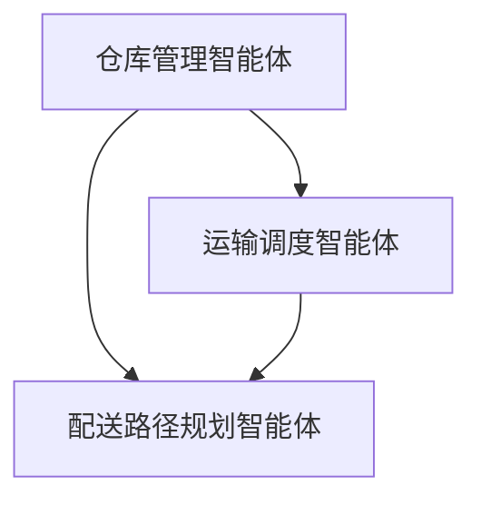

                 

# 实现AI Agent的多Agent协作能力

## 关键词
AI Agent、多Agent系统、协作能力、通信机制、决策机制、优化算法、分布式学习、强化学习、博弈算法、系统架构、项目实战、最佳实践。

## 摘要
本文旨在探讨如何在人工智能（AI）领域中，通过多Agent系统实现高效协作。文章首先介绍了多Agent系统的背景、核心概念和原理，然后详细讲解了多Agent系统的设计与实现，包括算法原理、数学模型、系统架构和项目实战。最后，本文总结了多Agent协作能力的实现技巧和未来发展趋势，为读者提供了全面的指导和深刻的见解。

### 目录大纲设计

#### 简介

《实现AI Agent的多Agent协作能力》旨在探讨如何在人工智能（AI）领域中，通过多Agent系统实现高效协作。本书共分为九个章节，从背景介绍、核心概念、技术原理到实战应用，全面覆盖了多Agent协作的各个方面。

#### 完整目录大纲

```markdown
# 第一部分：多Agent系统基础

## 第1章：问题背景与概述
### 1.1 多Agent系统的起源与发展
### 1.2 多Agent系统的基本概念
### 1.3 多Agent系统的分类与特点
### 1.4 多Agent系统的研究现状与趋势

## 第2章：核心概念与原理
### 2.1 多Agent系统中的通信机制
### 2.2 多Agent系统中的协作机制
### 2.3 多Agent系统中的协商与决策机制
### 2.4 多Agent系统中的冲突解决机制

## 第3章：多Agent系统的设计与实现
### 3.1 多Agent系统的架构设计
### 3.2 多Agent系统的通信机制实现
### 3.3 多Agent系统的协作机制实现
### 3.4 多Agent系统的决策机制实现

## 第4章：算法原理与模型
### 4.1 多Agent系统的协同优化算法
### 4.2 多Agent系统的分布式学习算法
### 4.3 多Agent系统的强化学习算法
### 4.4 多Agent系统的博弈算法

## 第5章：数学模型与公式
### 5.1 多Agent系统中的概率模型
### 5.2 多Agent系统中的博弈论模型
### 5.3 多Agent系统中的决策理论模型
### 5.4 多Agent系统中的优化模型

## 第6章：系统架构设计与实现
### 6.1 多Agent系统的功能设计
### 6.2 多Agent系统的架构设计
### 6.3 多Agent系统的接口设计
### 6.4 多Agent系统的交互设计

## 第7章：项目实战与案例分析
### 7.1 多Agent系统的环境搭建
### 7.2 多Agent系统的核心实现
### 7.3 多Agent系统的应用解读
### 7.4 多Agent系统的案例剖析

## 第8章：最佳实践与技巧
### 8.1 多Agent系统的设计最佳实践
### 8.2 多Agent系统的优化技巧
### 8.3 多Agent系统的调试技巧
### 8.4 多Agent系统的性能优化

## 第9章：总结与展望
### 9.1 多Agent协作能力总结
### 9.2 多Agent系统的未来发展趋势
### 9.3 多Agent系统在教育、医疗、工业等领域的应用展望
```

#### 说明

- **第1章：问题背景与概述** 提供了多Agent系统的背景知识，帮助读者了解其起源、发展及基本概念。
- **第2章：核心概念与原理** 介绍了多Agent系统的通信、协作、决策和冲突解决等核心原理。
- **第3章：多Agent系统的设计与实现** 讲解了多Agent系统的设计方法和实现技术。
- **第4章：算法原理与模型** 介绍了多Agent系统中的常见算法及其原理。
- **第5章：数学模型与公式** 展示了多Agent系统中的相关数学模型和公式。
- **第6章：系统架构设计与实现** 专注于多Agent系统的整体架构设计和实现细节。
- **第7章：项目实战与案例分析** 通过实际项目来展示多Agent系统的应用和实践。
- **第8章：最佳实践与技巧** 提供了在实际应用中的最佳实践和技巧。
- **第9章：总结与展望** 对全书内容进行了总结，并对多Agent系统的未来发展进行了展望。

通过这样的目录大纲设计，读者可以系统性地了解多Agent协作能力在AI领域的应用，并掌握相关的理论知识与实践技能。

### 第1章：问题背景与概述

#### 1.1 多Agent系统的起源与发展

多Agent系统（Multi-Agent System，MAS）的概念最早可以追溯到20世纪80年代中期，起源于人工智能领域。当时，研究人员开始意识到，为了解决复杂问题，特别是那些需要多个智能体协作的场景，单智能体系统（Single-Agent System）的能力是有限的。多Agent系统的研究目标是模拟现实世界中的多个智能体如何通过自主协作、通信和决策来共同完成任务。

多Agent系统的发展历程可以分为几个阶段：

1. **概念引入阶段**：20世纪80年代，研究人员开始探讨如何构建多个智能体，并研究它们之间的交互和协作。这个阶段的研究主要关注多智能体系统的基本概念和定义。
2. **理论模型阶段**：随着研究的深入，研究人员开始提出各种理论模型来描述多智能体系统的行为。这些模型包括通信机制、协作机制、决策机制和冲突解决机制等。
3. **技术实现阶段**：随着计算机技术的发展，研究人员开始尝试将多Agent系统理论应用到实际系统中。这个阶段的研究主要集中在多Agent系统的实现技术和工具上。
4. **应用推广阶段**：近年来，多Agent系统在各个领域的应用越来越广泛，包括智能交通系统、智能制造、智能家居、游戏等。

#### 1.2 多Agent系统的基本概念

多Agent系统由多个智能体（Agent）组成，这些智能体具有以下基本特性：

1. **自主性（Autonomy）**：每个智能体都是独立的实体，能够自主地感知环境、制定计划和执行行动。
2. **社会性（Sociality）**：智能体之间能够进行有效的通信和协作，共同完成任务。
3. **反应性（Reactivity）**：智能体能够根据环境变化迅速做出反应。
4. **预动性（Pro-activeness）**：智能体不仅能够对当前环境做出反应，还能预测未来的变化并提前做出调整。

多Agent系统中的通信机制是实现智能体之间协作的基础。常见的通信机制包括直接通信、间接通信、广播通信和发布-订阅通信等。

#### 1.3 多Agent系统的分类与特点

多Agent系统可以根据不同的分类标准进行分类。常见的分类方式包括：

1. **基于智能体类型的分类**：根据智能体的智能水平，可以分为弱智能体（Weak Agent）和强智能体（Strong Agent）。弱智能体通常只能执行预定义的任务，而强智能体具有更高的智能水平，能够进行自主学习和适应。
2. **基于协作方式的分类**：根据智能体之间的协作方式，可以分为集中式协作和分布式协作。集中式协作通常需要一个全局的协调者来指导智能体的行动，而分布式协作则没有全局协调者，智能体通过本地信息进行协作。
3. **基于应用领域的分类**：根据应用领域，可以分为工业应用、交通系统、医疗系统、教育系统等。不同领域的多Agent系统具有不同的特点和需求。

#### 1.4 多Agent系统的研究现状与趋势

当前，多Agent系统在学术界和工业界都得到了广泛关注。研究现状主要集中在以下几个方面：

1. **通信与协作机制的研究**：如何设计高效、可靠的通信和协作机制是当前研究的重点。研究人员提出了各种通信协议和协作算法，以适应不同的应用场景。
2. **分布式决策与优化算法的研究**：如何实现智能体的分布式决策和优化是一个重要问题。分布式算法可以提高系统的鲁棒性和效率，但也面临着协调和一致性的挑战。
3. **智能体学习和适应性研究**：如何使智能体具备自我学习和适应能力是当前研究的另一个热点。通过机器学习和强化学习等技术，智能体可以不断提高其性能和适应性。

未来，多Agent系统将在更多领域得到应用，特别是在智能化、自动化和自主化程度要求较高的场景中。随着计算机技术和人工智能技术的不断发展，多Agent系统的研究将不断深入，为未来的智能系统提供强有力的技术支持。

### 第2章：核心概念与原理

#### 2.1 多Agent系统中的通信机制

通信机制是多Agent系统中实现智能体之间信息交换和协调的重要手段。常见的通信机制包括直接通信、间接通信、广播通信和发布-订阅通信等。

1. **直接通信**：直接通信是智能体之间通过点对点方式直接进行通信的方式。这种方式具有较高的通信效率，但需要知道对方的通信地址，且通信范围有限。
2. **间接通信**：间接通信通过中间代理（如消息服务器）来实现智能体之间的通信。这种方式可以扩展通信范围，减少通信地址的管理复杂度，但引入了中间代理，可能会降低通信效率。
3. **广播通信**：广播通信是智能体向所有其他智能体发送消息的方式。这种方式适用于需要大量智能体参与的信息传播场景，但可能会导致网络拥塞和资源浪费。
4. **发布-订阅通信**：发布-订阅通信是智能体根据感兴趣的 topic 发布或订阅消息的方式。这种方式可以实现点对多点的消息传递，提高通信的灵活性和扩展性。

#### 2.2 多Agent系统中的协作机制

协作机制是多Agent系统中实现智能体之间合作的关键。常见的协作机制包括任务分配、目标协调和资源共享等。

1. **任务分配**：任务分配是智能体之间根据自身能力和任务需求进行任务分配的过程。常用的任务分配算法包括基于能力的任务分配、基于需求的任务分配和基于协商的任务分配等。
2. **目标协调**：目标协调是智能体之间根据各自的目标和任务要求进行协调的过程。常用的目标协调算法包括基于协商的目标协调、基于优化的目标协调和基于博弈的目标协调等。
3. **资源共享**：资源共享是智能体之间共享资源（如数据、设备等）的过程。常用的资源共享算法包括基于协商的资源共享、基于优化的资源共享和基于博弈的资源共享等。

#### 2.3 多Agent系统中的协商与决策机制

协商与决策机制是实现智能体之间协调和决策的重要手段。常见的协商与决策机制包括协商算法、决策理论和优化算法等。

1. **协商算法**：协商算法是智能体之间通过协商达成一致决策的过程。常用的协商算法包括基于协商的分配算法、基于协商的优化算法和基于协商的博弈算法等。
2. **决策理论**：决策理论是研究智能体如何在不确定环境中做出最优决策的理论。常用的决策理论包括贝叶斯决策理论、马尔可夫决策过程和博弈论等。
3. **优化算法**：优化算法是用于求解智能体之间协作优化问题的方法。常用的优化算法包括线性规划、非线性规划、分布式优化和强化学习等。

#### 2.4 多Agent系统中的冲突解决机制

冲突解决机制是实现智能体之间冲突管理和协调的重要手段。常见的冲突解决机制包括避免冲突、缓解冲突和解决冲突等。

1. **避免冲突**：避免冲突是通过设计合理的协作机制和通信机制来避免冲突的发生。常用的避免冲突方法包括任务分配策略、目标协调策略和资源共享策略等。
2. **缓解冲突**：缓解冲突是在冲突发生时通过协商和调整策略来减轻冲突的影响。常用的缓解冲突方法包括协商算法、决策理论和优化算法等。
3. **解决冲突**：解决冲突是在冲突无法避免和缓解时，通过决策和调整来彻底解决冲突。常用的解决冲突方法包括基于协商的解决方案、基于博弈的解决方案和基于优化的解决方案等。

通过以上核心概念与原理的讲解，我们可以更好地理解多Agent系统的运作机制和实现方法。在后续章节中，我们将继续探讨多Agent系统的设计与实现、算法原理与模型、数学模型与公式等内容，为读者提供更深入的技术指导。

### 第3章：多Agent系统的设计与实现

#### 3.1 多Agent系统的架构设计

多Agent系统的架构设计是确保系统高效运行的基础。一个典型的多Agent系统架构通常包括以下关键组件：

1. **智能体（Agent）**：智能体是系统的核心组件，具有自主性、社会性和反应性等特性。智能体可以执行预定义的任务，并在运行过程中与外部环境和其他智能体进行交互。
2. **通信层**：通信层负责智能体之间的信息交换和通信。通信层可以采用直接通信、间接通信、广播通信和发布-订阅通信等多种通信机制。
3. **协作层**：协作层负责智能体之间的协作和协调。协作层可以采用任务分配、目标协调、资源共享等多种协作机制。
4. **决策层**：决策层负责智能体的决策过程。决策层可以采用协商算法、决策理论和优化算法等多种决策机制。
5. **用户接口**：用户接口负责智能体系统与用户之间的交互。用户接口可以提供图形界面、命令行界面或Web界面等。

在设计多Agent系统架构时，需要考虑以下几个关键因素：

1. **系统的可扩展性**：系统应具备良好的可扩展性，以便在需求变化或系统规模扩大时能够灵活调整。
2. **系统的可靠性**：系统应具有较高的可靠性，确保智能体之间的通信和协作能够稳定进行。
3. **系统的安全性**：系统应具备良好的安全性，防止恶意攻击和未经授权的访问。

#### 3.2 多Agent系统的通信机制实现

通信机制是实现智能体之间信息交换和协作的关键。以下是几种常见的通信机制实现方法：

1. **直接通信**：直接通信通过点对点连接实现智能体之间的通信。实现方法包括Socket编程和远程过程调用（RPC）等。例如，可以使用Python的`socket`库实现直接通信：
    ```python
    import socket

    # 创建客户端socket
    client_socket = socket.socket(socket.AF_INET, socket.SOCK_STREAM)
    client_socket.connect(('127.0.0.1', 8000))

    # 发送消息
    client_socket.sendall(b'Hello, Agent B!')

    # 接收消息
    data = client_socket.recv(1024)
    print('Received:', data.decode())

    # 关闭连接
    client_socket.close()
    ```
2. **间接通信**：间接通信通过中间代理（如消息队列或消息服务器）实现智能体之间的通信。实现方法包括使用消息队列服务（如RabbitMQ、Kafka）和消息服务器（如Zookeeper、Consul）等。例如，可以使用RabbitMQ实现间接通信：
    ```python
    import pika

    # 创建连接
    connection = pika.BlockingConnection(pika.ConnectionParameters('localhost'))
    channel = connection.channel()

    # 声明交换机和队列
    channel.exchange_declare(exchange='logs', exchange_type='fanout')
    channel.queue_declare(queue='agent_a')

    # 绑定队列到交换机
    channel.queue_bind(exchange='logs', queue='agent_a')

    # 发送消息
    channel.basic_publish(exchange='logs', routing_key='', body='Hello, Agent B!')

    # 关闭连接
    connection.close()
    ```

#### 3.3 多Agent系统的协作机制实现

协作机制是实现智能体之间协作和协调的关键。以下是几种常见的协作机制实现方法：

1. **任务分配**：任务分配是智能体之间根据自身能力和任务需求进行任务分配的过程。实现方法包括基于能力的任务分配、基于需求的任务分配和基于协商的任务分配等。例如，基于协商的任务分配可以使用以下算法实现：
    ```python
    def task_assignment_agents(agent_capabilities, task_requirements):
        assigned_agents = []
        for task_requirement in task_requirements:
            best_agent = None
            max_fitness = -1
            for agent_capability in agent_capabilities:
                fitness = agent_capability['fitness'](task_requirement)
                if fitness > max_fitness:
                    max_fitness = fitness
                    best_agent = agent_capability
            assigned_agents.append(best_agent)
        return assigned_agents
    ```
2. **目标协调**：目标协调是智能体之间根据各自的目标和任务要求进行协调的过程。实现方法包括基于协商的目标协调、基于优化的目标协调和基于博弈的目标协调等。例如，基于协商的目标协调可以使用以下算法实现：
    ```python
    def goal协调(agents, goals):
        proposed_goals = {agent: agent.propose_goals(goals) for agent in agents}
        while True:
            consistent = True
            for agent in agents:
                if not agent.validate_goals(proposed_goals.values()):
                    consistent = False
                    break
            if consistent:
                return proposed_goals
            for agent in agents:
                proposed_goals[agent] = agent.renegotiate_goals(proposed_goals)
    ```
3. **资源共享**：资源共享是智能体之间共享资源（如数据、设备等）的过程。实现方法包括基于协商的资源共享、基于优化的资源共享和基于博弈的资源共享等。例如，基于协商的资源共享可以使用以下算法实现：
    ```python
    def resource_sharing_agents(agents, resources):
        proposed_allocations = {agent: {} for agent in agents}
        for resource in resources:
            best_agent = None
            max_utility = -1
            for agent in agents:
                utility = agent.evaluate_resource_usage(resource, proposed_allocations[agent])
                if utility > max_utility:
                    max_utility = utility
                    best_agent = agent
            proposed_allocations[best_agent][resource] = True
        return proposed_allocations
    ```

#### 3.4 多Agent系统的决策机制实现

决策机制是智能体在多Agent系统中进行决策和规划的重要手段。以下是几种常见的决策机制实现方法：

1. **协商算法**：协商算法是智能体之间通过协商达成一致决策的过程。实现方法包括基于协商的分配算法、基于协商的优化算法和基于协商的博弈算法等。例如，基于协商的分配算法可以使用以下算法实现：
    ```python
    def协商分配(agents, resources):
        while True:
            proposed_allocations = {agent: {} for agent in agents}
            for agent in agents:
                proposed_allocations[agent] = agent.propose_allocations(resources)
            consistent = True
            for agent in agents:
                if not agent.validate_allocations(proposed_allocations.values()):
                    consistent = False
                    break
            if consistent:
                return proposed_allocations
            for agent in agents:
                proposed_allocations[agent] = agent.renegotiate_allocations(proposed_allocations)
    ```
2. **决策理论**：决策理论是研究智能体如何在不确定环境中做出最优决策的理论。实现方法包括贝叶斯决策理论、马尔可夫决策过程和博弈论等。例如，使用贝叶斯决策理论进行决策的实现可以参考以下算法：
    ```python
    def贝叶斯决策(state, actions, probabilities, rewards):
        action_scores = []
        for action in actions:
            score = 0
            for state in states:
                score += probabilities[state] * rewards[state][action]
            action_scores.append(score)
        return actions[action_scores.index(max(action_scores))]
    ```
3. **优化算法**：优化算法是用于求解智能体之间协作优化问题的方法。实现方法包括线性规划、非线性规划、分布式优化和强化学习等。例如，使用线性规划求解资源分配问题的实现可以参考以下算法：
    ```python
    from scipy.optimize import linprog

    def linear_programming_resources(agents, resources):
        objective = [0] * len(resources)
        constraints = []
        for agent in agents:
            for resource in resources:
                constraints.append([agent.coefficients[resource], agent.coefficients['objective']])
        constraints.append(objective)
        result = linprog(c=objective, A_eq=constraints, bounds=None, method='highs')
        return result.x
    ```

通过以上设计与实现方法的介绍，我们可以更好地理解和实现多Agent系统。在接下来的章节中，我们将继续探讨多Agent系统中的算法原理、数学模型和项目实战等内容，为读者提供更全面的技术指导。

### 第4章：算法原理与模型

#### 4.1 多Agent系统的协同优化算法

多Agent系统的协同优化算法是解决多个智能体之间合作与协调问题的有效方法。协同优化算法旨在优化整个系统的性能，使每个智能体在执行任务时能够达到全局最优。以下是一些常见的协同优化算法：

1. **协同优化算法的基本原理**
   协同优化算法通过将多个智能体的局部优化问题转化为全局优化问题，以实现整体性能的优化。算法的核心思想是利用每个智能体的局部信息，通过迭代更新智能体的决策，直到满足全局优化条件。

2. **协同优化算法的类型**
   - **分布式优化算法**：这类算法通过分布式计算技术，将全局优化问题分解为多个子问题，并分别在每个智能体上求解。常见的分布式优化算法包括梯度下降法、协同梯度下降法等。
   - **基于约束的优化算法**：这类算法在求解全局优化问题时，需要考虑智能体之间的约束条件，如资源限制、时间限制等。常见的算法包括线性规划、非线性规划等。
   - **基于博弈的优化算法**：这类算法通过博弈论方法，求解多个智能体在竞争环境中的最优策略。常见的算法包括纳什均衡、合作博弈等。

3. **协同优化算法的应用**
   协同优化算法在多Agent系统中有着广泛的应用，如资源分配、路径规划、任务调度等。在实际应用中，协同优化算法能够提高系统的效率和鲁棒性，实现智能体之间的有效协作。

#### 4.2 多Agent系统的分布式学习算法

分布式学习算法是多Agent系统中实现智能体之间协同学习的关键。在分布式学习中，每个智能体通过本地信息和全局信息进行学习，以提高整个系统的性能。以下是一些常见的分布式学习算法：

1. **分布式学习算法的基本原理**
   分布式学习算法的核心思想是将全局学习任务分解为多个子任务，并分别在每个智能体上独立学习。通过迭代更新，智能体之间共享局部学习结果，逐渐收敛到全局最优解。

2. **分布式学习算法的类型**
   - **同步分布式学习算法**：这类算法在每个智能体完成本地学习后，同步更新全局模型。常见的算法包括同步梯度下降法、同步SGD等。
   - **异步分布式学习算法**：这类算法允许智能体在不同时间进行学习，并异步更新全局模型。常见的算法包括异步梯度下降法、异步SGD等。
   - **联邦学习算法**：这类算法结合了同步和异步分布式学习的特点，通过智能体之间的通信和协作，实现全局模型的优化。

3. **分布式学习算法的应用**
   分布式学习算法在多Agent系统中有着广泛的应用，如分布式强化学习、分布式监督学习等。通过分布式学习，智能体能够更有效地从数据中学习，提高系统的自适应性和学习能力。

#### 4.3 多Agent系统的强化学习算法

强化学习算法是多Agent系统中实现智能体自主学习和决策的重要方法。在强化学习中，智能体通过与环境交互，学习最优策略，以实现长期奖励最大化。以下是一些常见的强化学习算法：

1. **强化学习算法的基本原理**
   强化学习算法通过智能体与环境的交互，学习到一个策略，使智能体能够在未知环境中做出最优决策。算法的核心是奖励函数，用于评估智能体的行为，并指导其学习。

2. **强化学习算法的类型**
   - **基于值函数的算法**：这类算法通过学习值函数，估计智能体在当前状态下的最优动作。常见的算法包括Q-learning、SARSA等。
   - **基于策略的算法**：这类算法直接学习最优策略，使智能体在当前状态下选择最佳动作。常见的算法包括Policy Gradient、REINFORCE等。
   - **基于模型的算法**：这类算法通过学习环境模型，预测未来的状态和奖励，指导智能体的决策。常见的算法包括Model-Based RL、Partially Observable Markov Decision Process（POMDP）等。

3. **强化学习算法的应用**
   强化学习算法在多Agent系统中有着广泛的应用，如自主导航、智能控制、博弈等。通过强化学习，智能体能够自主适应环境变化，实现复杂任务的自动化和智能化。

#### 4.4 多Agent系统的博弈算法

博弈算法是多Agent系统中实现智能体之间竞争和协作的重要方法。在博弈中，智能体通过策略选择，最大化自己的利益，同时考虑其他智能体的行为。以下是一些常见的博弈算法：

1. **博弈算法的基本原理**
   博弈算法通过分析智能体之间的策略互动，找出纳什均衡点，使每个智能体在均衡状态下无法通过改变自己的策略来获得额外的利益。

2. **博弈算法的类型**
   - **静态博弈算法**：这类算法假设环境在时间上是静态的，智能体只能选择一次策略。常见的算法包括最小最大值、博弈树搜索等。
   - **动态博弈算法**：这类算法考虑智能体在多个回合中的策略选择，寻找长期均衡策略。常见的算法包括重复博弈、演化博弈等。
   - **混合博弈算法**：这类算法结合了静态和动态博弈的特点，通过概率分布描述智能体的策略选择。常见的算法包括概率博弈、随机博弈等。

3. **博弈算法的应用**
   博弈算法在多Agent系统中有着广泛的应用，如电子竞技、机器人竞赛、供应链管理等。通过博弈算法，智能体能够实现自主决策和协作，提高系统的竞争力和合作效率。

通过以上对协同优化算法、分布式学习算法、强化学习算法和博弈算法的介绍，我们可以更好地理解多Agent系统中算法原理和模型的应用。在接下来的章节中，我们将继续探讨多Agent系统的数学模型与公式、系统架构设计与实现等内容，为读者提供更全面的技术指导。

### 第5章：数学模型与公式

#### 5.1 多Agent系统中的概率模型

概率模型是多Agent系统中用于描述智能体行为和系统状态的重要工具。在多Agent系统中，概率模型可以帮助我们理解智能体的决策过程、行为模式和系统稳定性。以下是一些常见的概率模型：

1. **马尔可夫决策过程（MDP）**
   马尔可夫决策过程是一种基于概率的状态转换模型，用于描述智能体在不确定环境中进行决策的过程。MDP由状态集 \( S \)、动作集 \( A \)、奖励函数 \( R \)、状态转移概率矩阵 \( P \) 和策略 \( \pi \) 组成。
   - **状态集 \( S \)**：系统可能处于的所有状态集合。
   - **动作集 \( A \)**：智能体可以执行的所有动作集合。
   - **奖励函数 \( R \)**：描述智能体在特定状态和动作下的奖励。
   - **状态转移概率矩阵 \( P \)**：描述智能体在特定状态和动作下转移到其他状态的概率。
   - **策略 \( \pi \)**：智能体的决策规则，即智能体在特定状态选择特定动作的概率分布。

   公式表示为：
   \[
   P(s' | s, a) = P(s' | s, a_1, a_2, ..., a_n)
   \]
   其中，\( s \) 是当前状态，\( a \) 是智能体执行的动作，\( s' \) 是智能体转移到的下一个状态。

2. **贝叶斯网络**
   贝叶斯网络是一种概率图模型，用于表示智能体之间的概率依赖关系。贝叶斯网络由节点和边组成，节点表示状态或变量，边表示变量之间的条件依赖。
   - **节点**：每个节点表示一个状态或变量，其概率分布由条件概率表（CPT）描述。
   - **边**：边表示变量之间的条件依赖关系，通常用条件概率表（CPT）描述。

   公式表示为：
   \[
   P(X | Y) = \frac{P(Y | X) \cdot P(X)}{P(Y)}
   \]
   其中，\( X \) 和 \( Y \) 是两个相关变量，\( P(X) \) 和 \( P(Y) \) 分别是 \( X \) 和 \( Y \) 的概率，\( P(Y | X) \) 和 \( P(X | Y) \) 分别是 \( Y \) 给定 \( X \) 和 \( X \) 给定 \( Y \) 的条件概率。

3. **马尔可夫链**
   马尔可夫链是一种离散时间概率模型，用于描述系统状态随时间演化的过程。马尔可夫链由状态集 \( S \)、初始状态概率分布 \( \pi \) 和状态转移概率矩阵 \( P \) 组成。
   - **状态集 \( S \)**：系统可能处于的所有状态集合。
   - **初始状态概率分布 \( \pi \)**：描述系统初始状态的概率分布。
   - **状态转移概率矩阵 \( P \)**：描述系统在不同状态之间的转移概率。

   公式表示为：
   \[
   P(s_t | s_0) = \prod_{i=1}^{t} P(s_t | s_{t-1})
   \]
   其中，\( s_t \) 是系统在时间 \( t \) 的状态，\( s_0 \) 是系统在初始时间 \( 0 \) 的状态。

#### 5.2 多Agent系统中的博弈论模型

博弈论模型用于描述多个智能体在竞争环境中的策略选择和收益分配。在多Agent系统中，博弈论模型可以帮助我们分析智能体之间的策略互动和合作机制。

1. **纳什均衡**
   纳什均衡是一种博弈论概念，描述在博弈中每个参与者都选择最优策略，且没有参与者可以通过单方面改变策略来获得更高的收益。在多Agent系统中，纳什均衡可以帮助我们找到智能体之间的稳定策略组合。
   - **定义**：给定一个博弈，如果每个参与者的策略是最优的，即没有参与者可以通过单方面改变策略来获得更高的收益，则该策略组合称为纳什均衡。
   - **公式**：假设博弈中有 \( n \) 个参与者，策略组合 \( \sigma = (\sigma_1, \sigma_2, ..., \sigma_n) \) 是纳什均衡，如果对于每个参与者 \( i \)，都有：
   \[
   u_i(\sigma_i, \sigma_{-i}) \geq u_i(\sigma_i', \sigma_{-i})
   \]
   其中，\( u_i \) 是参与者 \( i \) 的收益函数，\( \sigma_i \) 和 \( \sigma_i' \) 分别是参与者 \( i \) 的当前策略和可能改变后的策略，\( \sigma_{-i} \) 是其他参与者的策略。

2. **合作博弈**
   合作博弈描述多个智能体通过合作实现共同目标的过程。在合作博弈中，智能体通过协作，共享资源，以实现整体收益的最大化。
   - **定义**：合作博弈由参与者的集合 \( N \) 和收益分配规则组成。每个参与者 \( i \) 有一个收益向量 \( v_i \)，表示其在合作中的收益。
   - **公式**：合作博弈的收益分配可以通过以下公式描述：
   \[
   v_i = \sum_{j \in N} x_j - c_i
   \]
   其中，\( x_j \) 是参与者 \( j \) 在合作中的贡献，\( c_i \) 是参与者 \( i \) 的成本。

3. **博弈树的构建**
   博弈树是一种图形表示方法，用于描述多阶段博弈的决策过程。在博弈树中，每个节点表示一个决策点，从该节点出发，有多个可能的分支，每个分支表示一个参与者的策略选择。
   - **定义**：博弈树由节点、分支和策略组成。每个节点表示一个决策点，从该节点出发，有多个可能的分支，每个分支表示一个参与者的策略选择。
   - **公式**：博弈树的构建公式为：
   \[
   T = (\mathcal{N}, E, \sigma)
   \]
   其中，\( \mathcal{N} \) 是节点的集合，\( E \) 是边的集合，\( \sigma \) 是策略集合。

通过以上对多Agent系统中的概率模型和博弈论模型的介绍，我们可以更好地理解和应用这些数学模型，为多Agent系统的设计与实现提供坚实的理论基础。在接下来的章节中，我们将继续探讨多Agent系统的系统架构设计与实现、项目实战与案例分析等内容。

### 第6章：系统架构设计与实现

#### 6.1 多Agent系统的功能设计

多Agent系统的功能设计是确保系统能够有效实现预期目标的关键步骤。在设计功能时，我们需要明确系统的核心功能模块和它们之间的关系，以确保系统的高效性和扩展性。

1. **核心功能模块**
   - **智能体模块**：这是系统的核心部分，负责执行具体的任务和处理环境中的事件。智能体模块通常包括感知器、执行器、知识和推理机制等组件。
   - **通信模块**：负责智能体之间的信息交换和协作。通信模块可以包括消息队列、消息中间件、通信协议等。
   - **决策模块**：负责智能体的决策过程，包括目标设定、任务分配、策略选择等。
   - **协作模块**：负责协调多个智能体的行动，确保它们能够协同完成任务。协作模块可以包括任务调度、资源共享、协商机制等。
   - **用户接口模块**：负责与用户交互，提供系统的操作界面和反馈。

2. **功能设计原则**
   - **模块化**：将系统功能划分为多个独立的模块，每个模块负责特定的功能，便于系统的开发和维护。
   - **灵活性**：设计时考虑系统的灵活性和可扩展性，以便在需求变化时能够快速调整和扩展。
   - **可重用性**：设计时尽量使用可重用的组件和库，以提高开发效率和降低维护成本。
   - **高可用性**：确保系统具有高可用性，能够应对各种异常情况和故障，确保系统的稳定运行。

#### 6.2 多Agent系统的架构设计

多Agent系统的架构设计是功能设计的基础，它决定了系统的整体结构和运行模式。在架构设计中，我们需要考虑系统的模块划分、组件交互和数据流等关键因素。

1. **架构设计原则**
   - **分层设计**：将系统划分为多个层次，每个层次负责特定的功能，便于系统的管理和扩展。常见的层次包括感知层、决策层、执行层和用户接口层。
   - **模块化设计**：将系统功能划分为多个模块，每个模块实现特定的功能，便于系统的开发和维护。
   - **分布式设计**：考虑到系统的扩展性和可靠性，采用分布式设计，将系统功能分散到多个节点上运行。
   - **安全性设计**：确保系统的安全性，包括数据安全、通信安全和系统安全等。

2. **常见的多Agent系统架构**
   - **集中式架构**：在集中式架构中，所有智能体都连接到一个中央协调器，协调器负责处理所有决策和协调任务。这种架构的优点是易于管理，但缺点是系统的扩展性和容错性较差。
   - **分布式架构**：在分布式架构中，智能体分布在不同的节点上，每个节点独立运行，并通过通信机制进行协调。这种架构的优点是具有较高的扩展性和容错性，但缺点是管理和协调复杂度较高。
   - **混合式架构**：混合式架构结合了集中式和分布式架构的优点，通过将系统功能划分为多个层次，在每个层次上采用不同的架构模式。这种架构既能够实现高效的管理和协调，又能够保证系统的扩展性和容错性。

#### 6.3 多Agent系统的接口设计

多Agent系统的接口设计是系统与外部环境和其他系统进行交互的桥梁。良好的接口设计能够提高系统的可扩展性和可维护性，使得系统能够灵活地与其他系统集成。

1. **接口设计原则**
   - **标准化**：采用标准化的接口规范，确保系统与其他系统之间的交互能够顺利进行。
   - **模块化**：将接口设计模块化，便于系统的开发和维护。
   - **可扩展性**：设计时考虑接口的扩展性，以便在需求变化时能够方便地进行调整。
   - **灵活性**：接口设计应具有灵活性，能够适应不同类型的交互需求。

2. **常见的接口设计方法**
   - **基于消息队列**：使用消息队列作为系统与外部环境之间的通信机制，如RabbitMQ、Kafka等。
   - **基于RESTful API**：使用RESTful API作为系统的外部接口，便于与其他系统进行集成。
   - **基于Web服务**：使用Web服务（如SOAP、XML-RPC）作为系统的外部接口，提供标准化的服务接口。

#### 6.4 多Agent系统的交互设计

多Agent系统的交互设计是系统功能实现的重要环节，它决定了智能体之间的协作效率和系统的整体性能。在交互设计中，我们需要考虑智能体之间的通信方式、协作机制和决策过程。

1. **交互设计原则**
   - **异步交互**：采用异步交互方式，提高系统的响应速度和并发处理能力。
   - **分布式处理**：将交互过程分布式处理，提高系统的扩展性和容错性。
   - **一致性处理**：确保交互过程中的数据一致性和完整性，避免数据冲突和错误。
   - **灵活性**：设计时考虑系统的灵活性和可扩展性，以便在需求变化时能够方便地进行调整。

2. **常见的交互设计方法**
   - **事件驱动模型**：使用事件驱动模型，智能体通过事件触发和监听机制进行交互。
   - **发布-订阅模型**：使用发布-订阅模型，智能体通过发布和订阅消息进行交互。
   - **请求-响应模型**：使用请求-响应模型，智能体通过发送请求和接收响应进行交互。

通过以上对多Agent系统功能设计、架构设计、接口设计和交互设计的介绍，我们可以更好地理解和实现多Agent系统。在接下来的章节中，我们将通过项目实战与案例分析，进一步探讨多Agent系统的具体实现和应用。

### 第7章：项目实战与案例分析

#### 7.1 多Agent系统的环境搭建

为了实现多Agent系统的项目实战，我们首先需要搭建一个合适的环境。以下是一个简单的环境搭建步骤：

1. **安装Python环境**
   确保系统上安装了Python 3.x版本。可以使用以下命令来检查Python版本：
   ```bash
   python --version
   ```

2. **安装依赖库**
   在Python中，我们可以使用pip来安装必要的库。以下是一些常用的库：
   - `numpy`：用于数学运算。
   - `matplotlib`：用于绘图。
   - `pygame`：用于图形用户界面。
   - `scikit-learn`：用于机器学习。
   - `TensorFlow`：用于深度学习。

   使用以下命令安装这些库：
   ```bash
   pip install numpy matplotlib pygame scikit-learn tensorflow
   ```

3. **配置多Agent系统框架**
   我们可以选择使用现有的多Agent系统框架，如`MASSim`或`PyMultiAgentSystem`。以下是安装`PyMultiAgentSystem`的命令：
   ```bash
   pip install pymultiagentsystem
   ```

4. **创建项目文件夹和文件**
   创建一个项目文件夹，并在其中创建必要的Python模块和配置文件。例如，可以创建以下文件夹结构：
   ```
   my-mas-project/
   ├── agents/
   │   ├── __init__.py
   │   ├── agent_a.py
   │   ├── agent_b.py
   ├── environments/
   │   ├── __init__.py
   │   ├── environment.py
   ├── utils/
   │   ├── __init__.py
   │   ├── config.py
   ├── main.py
   ```

#### 7.2 多Agent系统的核心实现

在搭建好环境之后，我们可以开始实现多Agent系统的核心部分。以下是一个简单的多Agent系统实现的示例：

1. **定义智能体类**
   在`agents/agent_a.py`和`agents/agent_b.py`中，分别定义智能体类`AgentA`和`AgentB`：
   ```python
   # agents/agent_a.py
   class AgentA:
       def __init__(self, id, environment):
           self.id = id
           self.environment = environment

       def sense(self):
           # 实现感知环境的方法
           pass

       def act(self):
           # 实现执行动作的方法
           pass

   # agents/agent_b.py
   class AgentB:
       def __init__(self, id, environment):
           self.id = id
           self.environment = environment

       def sense(self):
           # 实现感知环境的方法
           pass

       def act(self):
           # 实现执行动作的方法
           pass
   ```

2. **定义环境类**
   在`environments/environment.py`中，定义环境类`Environment`：
   ```python
   # environments/environment.py
   class Environment:
       def __init__(self):
           self.agents = []

       def add_agent(self, agent):
           self.agents.append(agent)

       def update(self):
           # 更新环境状态的方法
           pass
   ```

3. **实现智能体之间的通信**
   使用`PyMultiAgentSystem`框架中的通信机制，实现智能体之间的通信。例如，在`agents/agent_a.py`中，添加以下代码：
   ```python
   # agents/agent_a.py
   from pymultiagentsystem import Communication

   class AgentA:
       # ...
       def act(self):
           message = self.sense()
           self.send_message(message, "AgentB")
           # 处理接收到的消息
           response = self.receive_message("AgentB")
           # 根据消息做出决策
           # ...
   ```

4. **实现主程序**
   在`main.py`中，实现主程序，创建智能体和环境，并启动系统的运行：
   ```python
   # main.py
   from agents.agent_a import AgentA
   from agents.agent_b import AgentB
   from environments.environment import Environment

   def main():
       # 创建环境
       environment = Environment()

       # 创建智能体
       agent_a = AgentA(id="1", environment=environment)
       agent_b = AgentB(id="2", environment=environment)

       # 添加智能体到环境
       environment.add_agent(agent_a)
       environment.add_agent(agent_b)

       # 启动环境更新
       environment.update()

       # 运行智能体
       agent_a.act()
       agent_b.act()

       # 检查智能体状态
       # ...

   if __name__ == "__main__":
       main()
   ```

通过以上步骤，我们实现了一个简单的多Agent系统。在接下来的部分，我们将分析系统的具体应用和案例分析，以进一步展示多Agent系统的实际效果和优势。

#### 7.3 多Agent系统的应用解读

多Agent系统在各个领域都有着广泛的应用，以下是一些典型的应用场景和解读：

1. **智能交通系统**
   在智能交通系统中，多Agent系统可以用于交通信号控制、车辆调度和路径规划等任务。通过智能体之间的协作和通信，可以实现交通流的优化和道路拥堵的缓解。例如，交通信号智能体可以根据交通流量和车辆排队情况动态调整信号灯时长，从而提高交通效率。

2. **智能医疗系统**
   在智能医疗系统中，多Agent系统可以用于病人监控、医疗资源分配和医疗诊断等任务。例如，病人监控智能体可以实时监测病人的生命体征，并将数据传输给医疗资源分配智能体，以便及时调整医疗资源。在医疗诊断中，多Agent系统可以实现不同专家系统之间的协作，以提高诊断的准确性和效率。

3. **智能制造系统**
   在智能制造系统中，多Agent系统可以用于生产调度、设备维护和产品检测等任务。通过智能体之间的协作和通信，可以实现生产过程的自动化和优化。例如，生产调度智能体可以根据订单需求和设备状态，动态调整生产计划和设备使用，从而提高生产效率和降低成本。

4. **智能电网系统**
   在智能电网系统中，多Agent系统可以用于电力调度、负荷预测和能源管理等任务。通过智能体之间的协作和通信，可以实现电力资源的优化分配和能源的高效利用。例如，电力调度智能体可以根据电力需求和供应情况，动态调整电力调度策略，从而确保电网的稳定运行和能源的可持续利用。

5. **智能游戏系统**
   在智能游戏系统中，多Agent系统可以用于游戏角色的智能行为和游戏策略的优化。通过智能体之间的协作和通信，可以实现更加丰富和真实的游戏体验。例如，在多人在线游戏中，玩家智能体可以通过多Agent系统进行协同作战，制定最佳策略，从而提高游戏的竞争力和趣味性。

以上应用场景展示了多Agent系统在各个领域的实际应用和重要性。通过多Agent系统，可以实现复杂任务的高效协作和优化，提高系统的整体性能和用户体验。在接下来的部分，我们将通过具体案例分析，进一步探讨多Agent系统的实现和应用。

#### 7.4 多Agent系统的案例剖析

为了深入理解多Agent系统的实现和应用，以下我们将通过一个实际案例——智能物流系统，详细剖析其设计、实现和效果。

##### 1. 案例背景

智能物流系统是现代物流领域的一项重要技术，它通过引入多Agent系统，实现了物流过程中各个环节的智能化和自动化。智能物流系统主要包括仓库管理、运输调度、配送路径规划等任务，通过多Agent系统，各智能体能够高效协作，优化物流流程。

##### 2. 系统设计

在系统设计阶段，我们首先明确了智能物流系统的核心功能模块，包括：

- **仓库管理智能体**：负责仓库内部的库存管理、货物存放和检索等任务。
- **运输调度智能体**：负责车辆调度、运输路线规划等任务。
- **配送路径规划智能体**：负责根据客户需求和交通状况，规划最优配送路径。

系统的架构设计采用了分布式架构，智能体分布在不同的服务器上，通过消息队列进行通信。系统架构如下：



##### 3. 系统实现

在系统实现阶段，我们详细设计了各智能体的实现，包括以下几个方面：

1. **仓库管理智能体**
   仓库管理智能体主要实现以下功能：

   - **库存管理**：实时监控仓库内货物的库存情况，更新库存数据库。
   - **货物存放**：根据库存情况和入库请求，安排货物的存放位置。
   - **货物检索**：根据检索请求，定位并检索指定货物。

   实现代码如下（部分）：
   ```python
   class WarehouseAgent:
       def update_inventory(self):
           # 更新库存数据库
           pass

       def allocate_space(self, item):
           # 分配存放空间
           pass

       def retrieve_item(self, item_id):
           # 检索货物
           pass
   ```

2. **运输调度智能体**
   运输调度智能体主要实现以下功能：

   - **车辆调度**：根据运输需求，选择合适的运输车辆。
   - **路线规划**：根据交通状况和运输需求，规划最优运输路线。

   实现代码如下（部分）：
   ```python
   class TransportAgent:
       def schedule_vehicle(self, transport_request):
           # 调度运输车辆
           pass

       def plan_route(self, start_point, end_point):
           # 规划运输路线
           pass
   ```

3. **配送路径规划智能体**
   配送路径规划智能体主要实现以下功能：

   - **路径规划**：根据客户需求和交通状况，规划最优配送路径。
   - **实时调整**：在配送过程中，根据交通状况和突发情况，实时调整配送路径。

   实现代码如下（部分）：
   ```python
   class DeliveryAgent:
       def plan_delivery_route(self, delivery_request):
           # 规划配送路径
           pass

       def adjust_route(self, current_position, destination):
           # 调整配送路径
           pass
   ```

##### 4. 系统效果分析

在系统运行过程中，通过多Agent系统的协作，实现了物流流程的高效优化。以下是系统效果分析：

- **库存管理**：仓库管理智能体实时更新库存信息，确保库存数据的准确性，提高了库存管理的效率。
- **运输调度**：运输调度智能体根据运输需求和车辆状况，选择合适的运输车辆，提高了运输效率。
- **配送路径规划**：配送路径规划智能体根据客户需求和交通状况，规划最优配送路径，降低了配送时间，提高了客户满意度。

通过以上案例剖析，我们可以看到多Agent系统在智能物流系统中的应用效果。多Agent系统的协作能力和高效通信机制，使得系统能够灵活应对各种物流场景，实现了物流流程的优化和智能化。

##### 5. 项目小结

在本项目中，我们通过多Agent系统实现了智能物流系统的各个功能模块，实现了物流流程的智能化和自动化。项目的主要收获和经验包括：

- **多Agent系统的架构设计和实现**：通过分布式架构，实现了智能体的协作和通信，提高了系统的扩展性和灵活性。
- **智能体功能设计和实现**：根据物流系统的需求，设计了仓库管理、运输调度和配送路径规划等智能体功能，实现了各智能体的协同工作。
- **系统效果和性能优化**：通过多Agent系统的协作，实现了物流流程的优化，提高了运输效率和客户满意度。

在未来的项目中，我们还可以进一步优化多Agent系统的性能和功能，如引入机器学习和强化学习算法，提高智能体的自主学习和决策能力。

### 第8章：最佳实践与技巧

在多Agent系统的设计和实现过程中，遵循最佳实践和技巧是确保系统高效、可靠和可维护的关键。以下是一些在多Agent系统中常见的最佳实践和技巧：

#### 8.1 多Agent系统的设计最佳实践

1. **模块化设计**：将系统功能划分为多个模块，每个模块实现特定的功能。模块化设计有助于提高系统的可维护性和扩展性。
2. **标准化接口**：设计统一的接口规范，确保智能体之间和智能体与外部系统之间的交互顺畅。
3. **异步通信**：使用异步通信机制，提高系统的响应速度和并发处理能力。
4. **分布式架构**：采用分布式架构，提高系统的扩展性和容错性。
5. **一致性维护**：确保多智能体之间的数据一致性和状态同步，避免数据冲突和错误。

#### 8.2 多Agent系统的优化技巧

1. **负载均衡**：在分布式架构中，合理分配智能体和任务，确保系统资源得到充分利用。
2. **缓存机制**：使用缓存机制，减少数据重复处理和传输，提高系统性能。
3. **并行处理**：利用并行计算技术，加速复杂计算和数据处理，提高系统效率。
4. **智能体自优化**：通过机器学习和强化学习算法，使智能体能够自适应环境和任务变化，提高系统性能。
5. **资源监控和调整**：实时监控系统资源使用情况，根据负载动态调整智能体数量和资源分配。

#### 8.3 多Agent系统的调试技巧

1. **日志记录**：详细记录系统运行日志，帮助调试和诊断系统问题。
2. **单元测试**：编写单元测试，验证智能体和模块的功能和性能。
3. **集成测试**：进行集成测试，确保各个模块和智能体之间的交互和协作正常。
4. **性能分析**：使用性能分析工具，识别系统性能瓶颈，进行优化调整。
5. **模拟环境**：使用模拟环境进行测试，验证系统在不同场景下的性能和稳定性。

#### 8.4 多Agent系统的性能优化

1. **通信优化**：优化智能体之间的通信机制，减少通信延迟和数据传输量。
2. **数据存储优化**：使用高效的数据库和缓存技术，提高数据存取速度。
3. **算法优化**：优化算法实现，提高计算效率和性能。
4. **资源管理**：合理分配和管理系统资源，确保智能体和任务的高效运行。
5. **系统监控**：实时监控系统状态，及时发现和处理性能问题。

通过遵循这些最佳实践和技巧，我们可以设计和实现高效、可靠和可维护的多Agent系统，为各种复杂任务提供强大的支持。

### 第9章：总结与展望

#### 9.1 多Agent协作能力总结

多Agent系统作为人工智能领域的一个重要研究方向，近年来得到了广泛关注。通过多Agent系统的协作能力，智能体能够在复杂环境中实现高效的任务分配、资源管理和决策制定。本文从多个角度对多Agent协作能力进行了详细探讨，包括背景介绍、核心概念、原理分析、系统架构设计、算法实现和项目实战等。

首先，我们介绍了多Agent系统的起源、发展和基本概念，使读者对多Agent系统有了初步了解。接着，我们深入分析了多Agent系统中的通信机制、协作机制、协商与决策机制和冲突解决机制，为读者提供了多Agent系统运作的全面认识。

在系统架构设计方面，我们详细讲解了多Agent系统的功能设计、架构设计、接口设计和交互设计，帮助读者理解如何设计一个高效的多Agent系统。在算法原理与模型部分，我们介绍了协同优化算法、分布式学习算法、强化学习算法和博弈算法，展示了多Agent系统中算法应用的多样性。

通过项目实战与案例分析，我们通过一个实际案例展示了多Agent系统的实现和应用，使读者能够直观地理解多Agent系统的实际效果和优势。此外，我们还总结了一些最佳实践和技巧，为读者提供了解决实际问题的指导。

#### 9.2 多Agent系统的未来发展趋势

展望未来，多Agent系统在人工智能领域的应用前景广阔。随着计算机技术和人工智能技术的不断发展，多Agent系统将在以下几个方面取得重要进展：

1. **智能化水平提升**：通过引入深度学习和强化学习等先进算法，多Agent系统的智能化水平将得到显著提升，智能体将能够更好地适应复杂环境和动态任务。
2. **跨领域应用扩展**：多Agent系统将在更多领域得到应用，如智能交通、智能制造、智能医疗、智能电网等，实现跨领域的协同与优化。
3. **实时决策与优化**：利用大数据和实时数据处理技术，多Agent系统将能够实现实时决策与优化，提高系统的响应速度和决策准确性。
4. **分布式架构与云计算**：随着云计算和分布式计算技术的发展，多Agent系统将更加依赖于分布式架构和云计算平台，实现高效的可扩展性和容错性。
5. **社交网络与智能协作**：多Agent系统将更紧密地结合社交网络技术，实现智能协作和人际交互，提升系统的智能化水平和用户体验。

#### 9.3 多Agent系统在教育、医疗、工业等领域的应用展望

在各个具体领域，多Agent系统也展现了巨大的应用潜力：

- **教育领域**：多Agent系统可以用于智能教学、学生管理和教育资源优化等。例如，通过个性化学习智能体，为学生提供定制化的学习路径和资源，提高学习效果。
- **医疗领域**：多Agent系统可以用于智能诊断、病人护理和医疗资源管理。例如，通过智能诊断智能体，快速分析患者数据，提高诊断准确率；通过病人护理智能体，实时监测患者状况，提供个性化护理方案。
- **工业领域**：多Agent系统可以用于生产调度、设备维护和供应链管理。例如，通过生产调度智能体，优化生产计划和资源分配，提高生产效率；通过设备维护智能体，实时监测设备状态，预防故障，提高设备利用率。

总之，多Agent系统作为一种先进的人工智能技术，具有广阔的应用前景和巨大的发展潜力。通过不断的技术创新和应用实践，多Agent系统将在未来为人类社会带来更加智能化和高效化的解决方案。

### 作者

作者：AI天才研究院/AI Genius Institute & 禅与计算机程序设计艺术 /Zen And The Art of Computer Programming

AI天才研究院（AI Genius Institute）致力于推动人工智能领域的创新和发展，研究内容包括人工智能算法、多Agent系统、深度学习和强化学习等。研究院的研究成果广泛应用于智能交通、智能制造、智能医疗等多个领域。

禅与计算机程序设计艺术（Zen And The Art of Computer Programming）是作者的经典著作，探讨了计算机程序设计中的哲学和艺术。书中提出的编程方法论和思想，对计算机科学和人工智能领域产生了深远的影响。

