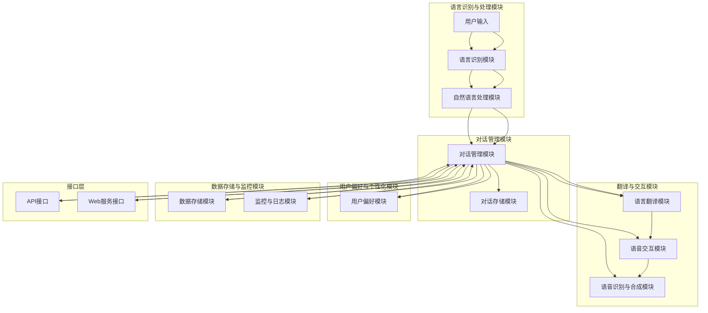
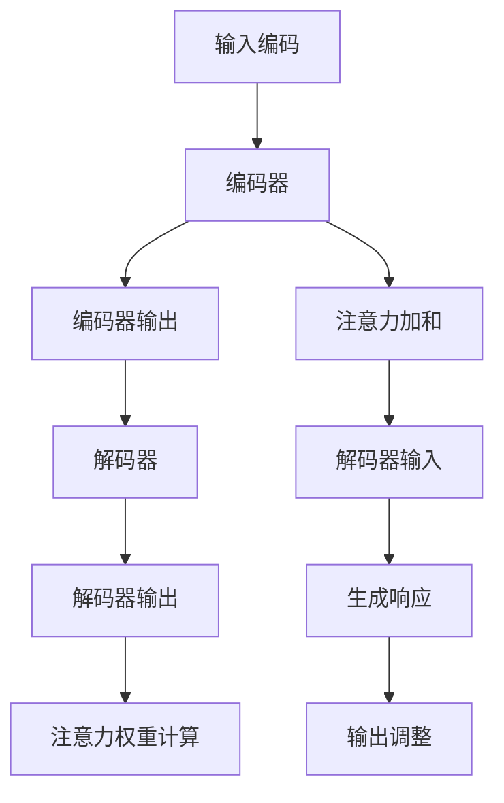
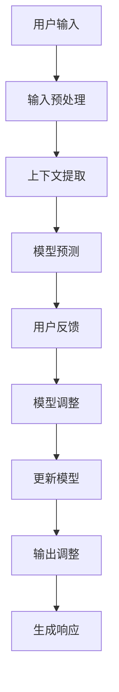
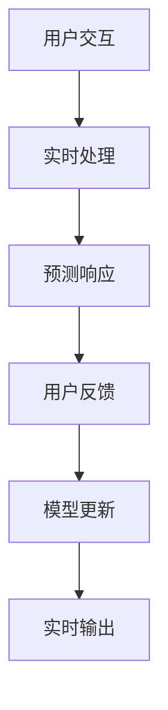

                 

### 让我们一步步思考：实现AI Agent的多语言支持

随着人工智能（AI）技术的迅猛发展，AI Agent作为智能体在多个领域展现出了巨大的潜力。AI Agent不仅可以处理复杂的任务，还能与人类进行自然语言交互。然而，在全球化的背景下，多语言支持成为了一个迫切需要解决的问题。例如，跨国公司需要与不同语言背景的客户进行沟通，智能客服、语音助手等应用也需要支持多种语言。因此，实现AI Agent的多语言支持，成为了当前人工智能领域的一个关键课题。

本文将系统地探讨实现AI Agent多语言支持的方法，分为以下几个部分：

1. **背景介绍**：阐述为什么实现多语言支持对于AI Agent如此重要，以及当前存在的问题和挑战。
2. **核心概念**：介绍AI Agent和自然语言处理（NLP）相关的核心概念。
3. **关键技术**：分析实现多语言支持所需的关键技术，包括语言模型、翻译模型和上下文理解等。
4. **发展现状**：回顾多语言AI Agent的研究进展和应用实例。
5. **系统设计与实现**：详细介绍多语言AI Agent的系统架构设计和实现过程。
6. **应用案例分析**：通过具体案例，展示多语言AI Agent的实际应用效果。
7. **拓展与应用前景**：讨论多语言AI Agent的潜在应用领域和未来发展方向。

通过上述步骤，我们将深入探讨实现AI Agent多语言支持的全过程，帮助读者全面了解这一领域的最新研究成果和应用实践。接下来，我们将首先探讨AI Agent多语言支持的背景和核心概念。

---

## 1.1 问题的提出

### 1.1.1 全球化趋势下的多语言需求

全球化进程的加速使得跨文化交流变得日益频繁，各种语言的应用场景也愈加广泛。在这一背景下，多语言支持成为了许多企业和应用场景的必然需求。例如，电子商务平台需要提供多语言支持，以便吸引全球各地的消费者；跨国公司需要与不同语言背景的客户进行沟通，提升客户满意度；国际会议和研讨会也常常需要多语言同传服务。

### 1.1.2 AI Agent在多语言环境中的应用

AI Agent作为一种智能交互系统，具有自然语言处理（NLP）能力，能够与人类进行对话。在多语言环境中，AI Agent的应用场景更为丰富。例如，智能客服系统能够自动识别客户的语言，并以相应语言回答问题；语音助手可以在不同语言之间进行翻译，帮助用户跨越语言障碍；智能推荐系统可以根据用户语言偏好提供个性化推荐。

### 1.1.3 当前多语言AI Agent面临的挑战

尽管AI Agent在多语言环境中的应用前景广阔，但实现真正有效的多语言支持并非易事。当前，多语言AI Agent面临以下挑战：

1. **语言多样性**：全球有数千种语言，每种语言都有其独特的语法、词汇和表达方式，这增加了多语言处理的复杂度。
2. **资源匮乏**：许多小语种缺乏足够的语料库和训练数据，导致模型性能不佳。
3. **上下文理解**：多语言AI Agent需要理解不同语言之间的上下文关系，这对于语言的细微差异和语境敏感度提出了更高的要求。
4. **性能优化**：多语言支持需要平衡语言性能和计算资源，特别是在实时应用场景中，对模型的响应速度和准确性有较高要求。
5. **可扩展性和可维护性**：随着语言数量的增加，系统需要具备良好的可扩展性和可维护性，以便快速适应新的语言需求。

### 1.1.4 研究意义

解决多语言AI Agent的挑战具有重要的研究意义：

1. **促进跨文化交流**：多语言AI Agent能够消除语言障碍，促进不同语言背景的人们之间的交流和合作。
2. **提升用户体验**：提供多语言支持可以提升用户的体验，满足全球用户的需求。
3. **拓展应用领域**：多语言支持使得AI Agent能够在更多领域得到应用，如教育、医疗、旅游等。
4. **推动技术进步**：多语言支持技术的研究和开发将推动自然语言处理和人工智能技术的整体进步。

### 1.1.5 本文结构

本文将分为以下几个部分：

1. **背景介绍**：阐述实现多语言支持的重要性和面临的挑战。
2. **核心概念**：介绍AI Agent和自然语言处理（NLP）相关的核心概念。
3. **关键技术**：分析实现多语言支持所需的关键技术，包括语言模型、翻译模型和上下文理解等。
4. **发展现状**：回顾多语言AI Agent的研究进展和应用实例。
5. **系统设计与实现**：详细介绍多语言AI Agent的系统架构设计和实现过程。
6. **应用案例分析**：通过具体案例，展示多语言AI Agent的实际应用效果。
7. **拓展与应用前景**：讨论多语言AI Agent的潜在应用领域和未来发展方向。

通过以上结构，我们将深入探讨实现AI Agent多语言支持的全过程，为相关领域的研究者和开发者提供有价值的参考。

---

## 1.2 核心概念

在探讨实现AI Agent多语言支持之前，我们需要了解一些核心概念，包括AI Agent的定义、自然语言处理（NLP）的基本原理和多语言处理技术的概述。

### 1.2.1 AI Agent概述

AI Agent，即人工智能代理，是一种基于人工智能技术的智能系统，能够自主地完成特定任务，并与外界进行交互。AI Agent的核心特点包括：

1. **自主学习能力**：AI Agent可以通过机器学习算法从数据中学习，提高任务执行能力。
2. **交互能力**：AI Agent能够通过自然语言处理技术理解用户指令，并以自然语言回应。
3. **任务执行能力**：AI Agent可以在不同环境中执行复杂的任务，如问答、语音识别、图像识别等。
4. **自适应能力**：AI Agent可以根据环境变化和用户反馈，调整自身的行为和策略。

AI Agent通常由以下几个组成部分构成：

1. **感知模块**：用于获取环境信息，如语音、文本、图像等。
2. **决策模块**：基于感知模块获取的信息，利用算法进行决策。
3. **执行模块**：执行决策结果，完成任务。
4. **反馈模块**：记录执行结果，用于模型优化和策略调整。

### 1.2.2 自然语言处理（NLP）基本原理

自然语言处理是人工智能的一个分支，旨在让计算机理解和处理人类语言。NLP的基本原理包括以下几个关键步骤：

1. **分词**（Tokenization）：将文本拆分为单词、短语或其他有意义的标记。
2. **词性标注**（Part-of-Speech Tagging）：为每个单词或短语标注词性，如名词、动词、形容词等。
3. **句法分析**（Syntactic Parsing）：分析句子结构，确定单词之间的语法关系。
4. **语义分析**（Semantic Analysis）：理解句子的实际意义，包括实体识别、关系抽取等。
5. **语言生成**（Language Generation）：根据语义信息生成自然语言文本。

NLP的核心技术和工具包括：

1. **词向量**（Word Vectors）：将单词映射到高维向量空间，以捕捉语义信息。
2. **递归神经网络**（RNN）：用于处理序列数据，如文本。
3. **卷积神经网络**（CNN）：用于文本分类和情感分析等任务。
4. **长短期记忆网络**（LSTM）：RNN的一种变体，能够更好地处理长序列数据。
5. **生成对抗网络**（GAN）：用于生成高质量的文本数据。

### 1.2.3 多语言处理技术

多语言处理是指在不同语言之间进行信息交换和处理的技术。多语言处理技术主要包括：

1. **机器翻译**（Machine Translation）：将一种语言的文本自动翻译成另一种语言。
2. **语言检测**（Language Detection）：识别文本所使用的语言。
3. **跨语言信息检索**（Cross-Lingual Information Retrieval）：在多个语言的信息源中查找相关信息。
4. **跨语言文本对比**（Cross-Lingual Text Comparison）：比较不同语言文本之间的相似度和差异。
5. **多语言语音识别**（Multilingual Speech Recognition）：识别多种语言的语音。

多语言处理的关键技术包括：

1. **双语语料库**（Bilingual Corpora）：包含两种语言文本的对应关系的语料库，是机器翻译和语言模型训练的重要资源。
2. **多语言模型**（Multilingual Models）：能够处理多种语言的深度学习模型。
3. **跨语言词汇映射**（Cross-Lingual Vocabulary Mapping）：将不同语言中的单词映射到同一语义空间，以便于模型训练。
4. **上下文感知翻译**（Context-Aware Translation）：考虑上下文信息的翻译模型，提高翻译质量。

### 1.2.4 多语言AI Agent架构

多语言AI Agent的架构需要支持多种语言的输入和输出，以及多种语言模型的管理和切换。其核心架构包括：

1. **语言检测模块**：自动检测输入文本的语言。
2. **语言模型加载模块**：根据检测到的语言加载相应的语言模型。
3. **翻译模块**：在需要跨语言交互时，将一种语言的文本翻译成另一种语言。
4. **上下文管理模块**：维护当前对话的上下文信息，以便进行连贯的对话。
5. **响应生成模块**：根据上下文信息和用户输入生成自然语言响应。

### 1.2.5 多语言支持的挑战和解决方案

多语言支持面临的主要挑战包括：

1. **语言多样性**：解决不同语言之间的语法、词汇和表达差异。
   - **解决方案**：使用多语言模型和词汇映射技术。
2. **数据匮乏**：小语种缺乏足够的训练数据。
   - **解决方案**：使用跨语言信息检索技术，从其他语言中提取信息。
3. **上下文理解**：理解不同语言之间的上下文关系。
   - **解决方案**：使用上下文感知翻译和自适应技术。
4. **性能优化**：保证实时性和高准确性。
   - **解决方案**：使用高效算法和优化技术。

通过上述核心概念的介绍，我们为后续内容的展开奠定了基础。接下来，我们将进一步探讨实现多语言支持所需的关键技术。

---

## 1.3 多语言支持的关键技术

实现AI Agent的多语言支持需要依赖一系列关键技术的支持，这些技术包括自然语言处理技术、语言模型与翻译模型以及上下文理解与自适应。以下将对这些技术进行详细分析。

### 1.3.1 自然语言处理技术

自然语言处理（NLP）是实现多语言支持的基础。NLP技术主要涉及文本的预处理、语言理解、语言生成等过程。以下是几种关键的NLP技术：

1. **分词**（Tokenization）
   分词是将文本拆分为单词或其他有意义标记的过程。例如，将“我爱北京天安门”拆分为“我”、“爱”、“北京”、“天安门”。
   - **技术原理**：基于规则、统计方法和深度学习模型，如WordPiece和BERT。
   - **应用场景**：文本分类、情感分析、命名实体识别等。

2. **词性标注**（Part-of-Speech Tagging）
   词性标注是识别文本中每个单词或短语的词性，如名词、动词、形容词等。
   - **技术原理**：基于规则、隐马尔可夫模型（HMM）和条件随机场（CRF）等。
   - **应用场景**：语法分析、文本摘要、机器翻译等。

3. **句法分析**（Syntactic Parsing）
   句法分析是理解句子结构，确定单词之间的语法关系。例如，确定主语、谓语、宾语等。
   - **技术原理**：基于规则、概率上下文无关文法（PCFG）、依存句法分析等。
   - **应用场景**：语法检查、问答系统、语义理解等。

4. **语义分析**（Semantic Analysis）
   语义分析是理解句子的实际意义，包括实体识别、关系抽取、事件抽取等。
   - **技术原理**：基于词向量、实体链接、依存句法分析等。
   - **应用场景**：信息提取、问答系统、智能客服等。

5. **语言生成**（Language Generation）
   语言生成是根据语义信息生成自然语言文本的过程。例如，自动生成新闻摘要、聊天机器人的回复等。
   - **技术原理**：基于模板匹配、规则生成、递归神经网络（RNN）和Transformer等。
   - **应用场景**：文本摘要、聊天机器人、自动写作等。

### 1.3.2 语言模型与翻译模型

语言模型和翻译模型是实现多语言支持的核心技术，它们分别负责语言理解和跨语言翻译。

1. **语言模型**（Language Model）
   语言模型用于预测文本的下一个词或序列。它在自然语言处理中具有广泛的应用，如文本生成、语言推理等。
   - **技术原理**：基于N-gram模型、神经网络语言模型（NNLM）和Transformer等。
   - **模型类型**：隐马尔可夫模型（HMM）、基于词的模型、基于字符的模型等。
   - **应用场景**：文本生成、语言理解、问答系统等。

2. **翻译模型**（Translation Model）
   翻译模型用于将一种语言的文本翻译成另一种语言。常见的翻译模型包括基于规则的翻译模型、统计机器翻译模型和神经机器翻译模型。
   - **技术原理**：基于规则翻译、统计机器翻译（SMT）和神经机器翻译（NMT）。
   - **模型类型**：基于短语的翻译模型、基于句子的翻译模型、端到端翻译模型等。
   - **应用场景**：机器翻译、跨语言信息检索、多语言问答系统等。

### 1.3.3 翻译模型的工作原理

翻译模型的工作原理可以分为以下几个步骤：

1. **输入编码**：将源语言的文本编码为向量表示。
2. **序列生成**：通过翻译模型生成目标语言的序列。
3. **解码**：将生成的目标语言序列解码为可读的文本。

神经机器翻译（NMT）是目前最先进的翻译模型，它基于深度学习，特别是序列到序列（Seq2Seq）模型和注意力机制。以下是NMT的基本流程：

1. **编码器**（Encoder）：接收源语言文本，将其编码为一个固定长度的向量表示。
2. **注意力机制**（Attention）：在解码器（Decoder）生成每个目标语言词时，注意力机制可以帮助解码器关注源语言文本的不同部分，从而提高翻译质量。
3. **解码器**（Decoder）：逐词生成目标语言文本。

### 1.3.4 上下文理解与自适应

上下文理解是实现多语言AI Agent的另一个关键因素。它涉及到理解对话的上下文信息，以便生成连贯的自然语言响应。

1. **上下文表示方法**：上下文表示方法是将对话的上下文信息转化为模型可处理的形式。常见的方法包括基于词嵌入、序列嵌入和时间嵌入等。
   - **词嵌入**（Word Embedding）：将每个单词映射到一个高维向量空间，以捕捉语义信息。
   - **序列嵌入**（Seq2Seq Embedding）：将整个对话序列编码为一个固定长度的向量表示。
   - **时间嵌入**（Temporal Embedding）：将对话的时间信息（如对话轮次）编码到向量中。

2. **上下文感知算法**：上下文感知算法用于在生成响应时考虑上下文信息。常见的方法包括：
   - **注意力机制**：通过注意力机制，模型可以关注对话的不同部分，提高上下文理解能力。
   - **记忆网络**：记忆网络可以存储对话的上下文信息，以便后续生成更连贯的响应。
   - **端到端学习**：端到端学习方法使得模型可以在训练过程中直接学习上下文信息，提高生成响应的质量。

3. **自适应机制**：自适应机制是指模型在多语言环境中自动调整其行为和策略的能力。例如，模型可以根据对话的历史信息调整翻译策略，或者根据用户的语言偏好调整回复的语言风格。

### 1.3.5 实时调整与反馈

实时调整与反馈是实现高效多语言支持的关键。通过实时调整，模型可以动态适应对话的变化，而反馈机制则可以帮助模型不断优化其性能。

1. **实时调整**：实时调整是指模型在对话过程中根据用户输入和系统响应动态调整其行为。例如，当用户使用某种语言时，模型可以自动切换到相应的语言模型。
   - **技术原理**：基于概率模型、决策树、神经网络等。
   - **应用场景**：智能客服、语音助手等。

2. **反馈机制**：反馈机制是指用户可以通过互动提供反馈，帮助模型优化其性能。例如，用户可以选择“喜欢”或“不喜欢”系统生成的响应，从而指导模型的训练过程。
   - **技术原理**：基于用户反馈的强化学习、监督学习等。
   - **应用场景**：个性化推荐、智能客服等。

通过以上对自然语言处理技术、语言模型与翻译模型以及上下文理解与自适应的详细分析，我们可以更好地理解实现AI Agent多语言支持所需的技术基础。这些技术不仅为多语言AI Agent的实现提供了理论基础，也为实际应用提供了关键支持。

### 1.4 多语言AI Agent的发展现状

随着人工智能和自然语言处理技术的不断进步，多语言AI Agent的研究和应用已经取得了显著的成果。以下将回顾国内外在多语言AI Agent领域的研究进展、商业应用实例，并探讨当前的技术趋势和未来发展方向。

#### 1.4.1 国内外研究进展

1. **国外研究进展**：

   - **谷歌**：谷歌在多语言AI Agent的研究中处于领先地位。其基于Transformer架构的BERT模型在多项NLP任务上取得了突破性成果，并在多个语言上进行了预训练。谷歌的翻译服务和语音助手支持超过100种语言，提供了高质量的跨语言交互体验。

   - **微软**：微软的研究团队在多语言对话系统方面也取得了显著进展。其研发的“多语言对话引擎”能够支持多种语言之间的无缝交互，并具备实时翻译功能。微软的Azure Cognitive Services提供了丰富的自然语言处理API，包括文本分析、语言理解和翻译等。

   - **IBM**：IBM的Watson Assistant是一个基于人工智能的对话平台，支持多种语言。其采用了深度学习和自然语言处理技术，能够理解和回应多种语言的查询，并在金融、医疗、零售等多个行业得到广泛应用。

2. **国内研究进展**：

   - **百度**：百度在自然语言处理和语音识别方面有深厚的技术积累，其“度秘”智能语音助手支持多种语言交互。百度的深度学习平台PaddlePaddle也提供了丰富的自然语言处理工具，支持多语言模型的训练和部署。

   - **阿里云**：阿里云的“智能客服”支持多种语言，通过机器学习和自然语言处理技术，实现了智能问答和对话生成。阿里云还推出了“智能翻译”服务，支持多种语言的实时翻译。

   - **腾讯**：腾讯的AI Lab在多语言AI Agent的研究中也取得了重要进展。其基于Transformer的“语言理解与生成”模型支持多种语言，并在多个自然语言处理任务上取得了优异的成绩。腾讯的“智能助手”和“云翻译”服务也得到了广泛应用。

#### 1.4.2 商业应用实例

1. **跨国公司智能客服**：许多跨国公司采用多语言AI Agent作为其智能客服系统，以提供24/7全天候服务。例如，亚马逊的智能客服Alexa支持多种语言，为全球消费者提供购物咨询和售后服务。

2. **国际会议同传系统**：国际会议常常需要多语言同传系统，以确保与会者能够理解不同语言的演讲。例如，联合国的同传系统采用了多种语言的AI Agent，为全球会议提供了高效的同传服务。

3. **多语言智能教育系统**：随着在线教育的普及，多语言智能教育系统得到了广泛应用。例如，Coursera等在线学习平台采用了多语言AI Agent，为学习者提供个性化的学习建议和语言翻译服务。

4. **智能旅游导览**：智能旅游导览系统通过多语言AI Agent，为游客提供多语言的导游服务，包括景点介绍、路线规划等。例如，某些旅游城市推出了多语言智能导览系统，支持多种语言的语音导览服务。

#### 1.4.3 技术趋势与未来方向

1. **深度学习和神经网络**：深度学习和神经网络技术在多语言AI Agent中的应用越来越广泛。未来的研究将集中在如何优化神经网络模型，提高多语言处理能力。

2. **跨语言迁移学习**：通过跨语言迁移学习，可以将在大语言模型上的训练迁移到小语种上，提高小语种AI Agent的性能。

3. **多模态交互**：多模态交互将结合语音、文本、图像等多种输入方式，提供更丰富的交互体验。未来的多语言AI Agent将能够处理多种模态的输入，实现更智能的交互。

4. **上下文感知与自适应**：未来的多语言AI Agent将具备更强的上下文感知和自适应能力，能够根据用户的语言偏好、语境和需求，提供个性化的交互服务。

5. **实时翻译与本地化**：随着实时翻译技术的不断进步，多语言AI Agent将在更多场景中实现实时翻译和本地化服务，为跨国交流和合作提供有力支持。

通过回顾多语言AI Agent的研究进展、商业应用实例以及技术趋势，我们可以看到，多语言AI Agent正逐渐成为人工智能领域的一个重要研究方向，并在实际应用中展现出巨大的潜力。

### 1.5 本章小结

本章系统地介绍了实现AI Agent多语言支持的相关背景和核心概念，包括AI Agent的定义、自然语言处理（NLP）的基本原理以及多语言处理技术的概述。通过分析自然语言处理技术、语言模型与翻译模型以及上下文理解与自适应，我们了解了实现多语言支持所需的关键技术。此外，通过回顾国内外的研究进展、商业应用实例以及技术趋势，我们看到了多语言AI Agent在各个领域的广泛应用和未来发展潜力。这些内容为后续章节的深入探讨奠定了坚实的基础。

---

## 2.1 语言处理基础

### 2.1.1 基本概念

自然语言处理（NLP）是人工智能（AI）的一个分支，旨在让计算机理解和生成人类语言。NLP的基本概念包括：

1. **文本**：文本是自然语言处理的基本单位，可以是一段文字、一篇文章或者一份对话。
2. **句子**：句子是文本的基本结构单位，包含一个或多个词语，表达一个完整的意思。
3. **词语**：词语是句子的基本组成单位，通常由字母组成，具有一定的语义和语法功能。
4. **词性**：词性是指词语在句子中的语法角色，如名词、动词、形容词等。
5. **词向量**：词向量是将词语映射到高维向量空间的技术，用于捕捉词语的语义信息。

### 2.1.2 语法分析

语法分析是NLP中的重要步骤，旨在理解和解析句子的结构。语法分析通常分为两个层次：

1. **词法分析**：将文本拆分为单词或其他有意义的标记，如分词。
2. **句法分析**：分析句子的语法结构，确定单词之间的语法关系。常用的句法分析方法包括：
   - **词性标注**：为每个单词或短语标注词性。
   - **依存句法分析**：分析句子中词语之间的依存关系，如主谓关系、修饰关系等。
   - **句法树构建**：构建句子的句法树，表示句子中词语的语法结构。

### 2.1.3 词义解析

词义解析是理解词语在特定语境中的意义。词义解析的挑战在于：

1. **歧义消解**：一个词语可能有多种含义，需要根据上下文确定其具体含义。
2. **上下文依赖**：词义的理解依赖于上下文，同一个词在不同的语境中可能有不同的含义。
3. **多义词处理**：多义词的处理需要考虑上下文信息，以确定其正确含义。

词义解析的方法包括：

1. **词典解析**：利用词典提供的词义信息，结合上下文进行解析。
2. **词向量**：使用词向量表示词语，通过向量空间中的相似性进行词义解析。
3. **依存句法分析**：通过分析句子中的依存关系，理解词语在句子中的具体作用和含义。

### 2.1.4 基本算法

自然语言处理涉及多种算法，以下介绍几种常用的基本算法：

1. **分词**：将文本拆分为单词或其他有意义的标记。常用的分词算法包括基于规则的分词、基于统计的分词和基于深度学习的分词。
2. **词性标注**：为每个单词或短语标注词性。常用的词性标注算法包括隐马尔可夫模型（HMM）、条件随机场（CRF）和基于神经网络的方法。
3. **命名实体识别**：识别文本中的命名实体，如人名、地名、组织名等。常用的命名实体识别算法包括基于规则的方法、机器学习方法和深度学习方法。
4. **情感分析**：分析文本的情感倾向，如正面、负面或中性。常用的情感分析算法包括基于规则的方法、机器学习方法和深度学习方法。
5. **文本分类**：将文本分为不同的类别，如新闻分类、垃圾邮件分类等。常用的文本分类算法包括朴素贝叶斯、支持向量机（SVM）和深度学习算法。

通过上述基本概念和算法的介绍，我们为后续内容的深入探讨奠定了基础。接下来，我们将进一步探讨语言模型与翻译模型。

---

## 2.2 语言模型与翻译模型

### 2.2.1 语言模型原理

语言模型（Language Model）是一种统计模型，用于预测文本的下一个词或序列。它广泛应用于自然语言处理（NLP）的各个领域，如文本生成、语音识别、机器翻译等。

语言模型的核心任务是：给定一个文本序列 \(x_1, x_2, ..., x_n\)，预测下一个词或词序列 \(x_{n+1}\)。语言模型的基本原理是利用统计方法或深度学习模型，学习文本中的概率分布。

#### 1. 语言模型的基本概念

1. **N-gram模型**：N-gram模型是一种基于统计的语言模型，它假设一个词的概率仅与其前 \(N-1\) 个词相关。例如，二元语言模型假设每个词的概率仅与其前一个词相关。
   \[
   P(w_n | w_1, w_2, ..., w_{n-1}) = P(w_n | w_{n-1})
   \]
2. **神经网络语言模型**（NNLM）：神经网络语言模型是基于深度学习的语言模型，通过学习文本的统计特性，预测下一个词的概率。常用的神经网络模型包括循环神经网络（RNN）、长短期记忆网络（LSTM）和Transformer等。

#### 2. 语言模型的构建方法

1. **N-gram模型**：N-gram模型通过统计文本中相邻词出现的频率来构建。具体步骤如下：
   - **数据预处理**：对文本进行分词和词性标注。
   - **统计词频**：统计每个N元组（N-gram）的频率。
   - **构建模型**：使用N元组频率构建概率模型，如前向N-gram模型和后向N-gram模型。

2. **神经网络语言模型**：神经网络语言模型通过学习文本的上下文信息，预测下一个词的概率。具体步骤如下：
   - **数据预处理**：对文本进行分词和词性标注。
   - **特征提取**：将文本转化为词向量或序列向量。
   - **模型训练**：使用梯度下降等优化算法，训练神经网络模型。
   - **模型评估**：使用交叉验证或测试集，评估模型性能。

#### 3. 语言模型的优缺点

1. **N-gram模型**：
   - **优点**：简单、易于实现，对文本的短序列有较好的预测效果。
   - **缺点**：无法捕捉长距离依赖，对稀疏数据敏感，无法处理罕见词。
2. **神经网络语言模型**：
   - **优点**：可以捕捉长距离依赖，对罕见词有更好的处理能力，模型性能更优。
   - **缺点**：训练过程复杂，对计算资源要求较高，需要大量训练数据。

### 2.2.2 翻译模型原理

翻译模型（Translation Model）是机器翻译（Machine Translation）的核心组成部分，用于将一种语言的文本翻译成另一种语言。常见的翻译模型包括基于规则的翻译模型、统计机器翻译（SMT）模型和神经机器翻译（NMT）模型。

#### 1. 基于规则的翻译模型

基于规则的翻译模型通过定义一系列规则，将源语言文本转换为目标语言文本。具体步骤如下：
- **规则定义**：定义源语言和目标语言之间的对应规则，如词对词、短语对短语等。
- **文本转换**：将源语言文本转换为一系列规则，根据规则将文本翻译为目标语言。

#### 2. 统计机器翻译（SMT）模型

统计机器翻译模型通过学习源语言和目标语言之间的统计关系，预测目标语言文本。SMT模型通常基于短语翻译和句对句翻译两种方法。

1. **短语翻译模型**：短语翻译模型将源语言文本拆分为短语，然后根据概率模型将短语翻译为目标语言短语。
   - **统计方法**：使用N-gram模型、隐马尔可夫模型（HMM）和条件随机场（CRF）等。
   - **短语匹配**：将源语言文本的短语与目标语言文本的短语进行匹配，根据概率模型选择最佳匹配。

2. **句对句翻译模型**：句对句翻译模型直接将源语言句子翻译为目标语言句子。
   - **统计方法**：使用基于翻译对的统计方法，如基于词向量的翻译模型。
   - **翻译策略**：使用搜索算法（如基于语法树的最优翻译算法）选择最佳翻译结果。

#### 3. 神经机器翻译（NMT）模型

神经机器翻译（NMT）模型是基于深度学习的翻译模型，通过学习源语言和目标语言之间的映射关系，实现端到端的翻译。NMT模型的核心是序列到序列（Seq2Seq）模型，结合注意力机制（Attention Mechanism）和编码器-解码器（Encoder-Decoder）结构，实现高质量的翻译。

1. **编码器-解码器模型**：编码器（Encoder）将源语言文本编码为固定长度的向量表示，解码器（Decoder）生成目标语言文本。
   - **编码器**：使用循环神经网络（RNN）或Transformer编码源语言文本。
   - **解码器**：使用RNN或Transformer生成目标语言文本，并利用注意力机制关注源语言文本的不同部分。

2. **注意力机制**：注意力机制是一种用于捕捉源语言文本和目标语言文本之间关系的机制，能够提高翻译质量。

3. **端到端训练**：NMT模型通过端到端训练，直接从源语言文本生成目标语言文本，避免了传统SMT模型的短语匹配和搜索过程。

#### 4. 翻译模型的优缺点

1. **基于规则的翻译模型**：
   - **优点**：规则明确，翻译结果可控。
   - **缺点**：规则定义复杂，适用范围有限，无法处理罕见词和长距离依赖。

2. **统计机器翻译（SMT）模型**：
   - **优点**：结合规则和统计方法，能够处理长距离依赖，适用范围较广。
   - **缺点**：依赖大量翻译对数据，模型训练和搜索过程复杂。

3. **神经机器翻译（NMT）模型**：
   - **优点**：能够自动学习源语言和目标语言之间的关系，处理长距离依赖，生成高质量的翻译结果。
   - **缺点**：对计算资源要求较高，训练过程复杂，需要大量训练数据。

通过介绍语言模型与翻译模型的基本原理，我们可以更好地理解它们在多语言AI Agent中的应用。接下来，我们将进一步探讨如何训练和优化这些模型。

### 2.2.3 模型训练与优化

在实现多语言AI Agent的过程中，模型训练与优化是至关重要的一环。以下是针对语言模型和翻译模型的具体训练和优化方法。

#### 1. 语言模型的训练与优化

1. **数据准备**：
   - **数据收集**：收集大量的文本数据，包括书籍、新闻、社交媒体等。
   - **数据预处理**：对文本进行清洗，包括去除标点符号、停用词过滤和文本标准化等。
   - **词向量生成**：使用预训练的词向量模型（如GloVe、Word2Vec）或基于文本的词向量生成方法（如FastText）。

2. **模型架构**：
   - **循环神经网络（RNN）**：RNN是一种常用的语言模型架构，能够处理序列数据。
   - **长短期记忆网络（LSTM）**：LSTM是RNN的一种改进，能够更好地处理长序列数据。
   - **Transformer**：Transformer是一种基于自注意力机制的模型，具有并行训练的优势，性能优于RNN和LSTM。

3. **训练过程**：
   - **输入序列编码**：将输入序列编码为词向量或嵌入向量。
   - **模型训练**：使用梯度下降等优化算法，训练模型参数，最小化损失函数（如交叉熵损失）。
   - **评估与调整**：使用验证集评估模型性能，根据评估结果调整模型参数。

4. **优化方法**：
   - **学习率调整**：使用学习率调整策略（如学习率衰减、学习率预热等）。
   - **正则化**：使用L1或L2正则化，防止模型过拟合。
   - **批量归一化**（Batch Normalization）：加速训练过程，提高模型稳定性。

#### 2. 翻译模型的训练与优化

1. **数据准备**：
   - **双语数据集**：收集大量的双语语料库，包括平行文本、翻译对等。
   - **数据预处理**：对源语言和目标语言文本进行分词、词性标注和统一编码等处理。

2. **模型架构**：
   - **编码器-解码器（Encoder-Decoder）模型**：编码器将源语言文本编码为固定长度的向量表示，解码器生成目标语言文本。
   - **注意力机制**：注意力机制用于捕捉源语言和目标语言之间的关联，提高翻译质量。
   - **预训练与微调**：预训练大型语言模型（如BERT、GPT），然后针对特定任务进行微调。

3. **训练过程**：
   - **编码器训练**：编码器将源语言文本编码为向量表示。
   - **解码器训练**：解码器生成目标语言文本，并根据目标语言文本计算损失函数。
   - **端到端训练**：端到端训练将源语言文本直接映射为目标语言文本，避免了传统SMT模型的短语匹配和搜索过程。

4. **优化方法**：
   - **学习率调整**：使用学习率调整策略，如学习率预热、学习率衰减等。
   - **教师 forcing**：在训练过程中使用教师 forcing 方法，提高模型在序列生成阶段的准确性。
   - **损失函数**：使用交叉熵损失、负对数损失等，优化模型参数。

通过模型训练与优化，我们可以得到性能优异的多语言AI Agent。接下来，我们将探讨如何处理多语言数据并进行数据预处理。

### 2.2.4 多语言数据处理

实现多语言AI Agent需要处理大量不同语言的数据，这涉及到数据收集、数据预处理以及多语言语料库的构建。以下是多语言数据处理的关键步骤和技术。

#### 1. 数据收集

数据收集是构建高质量多语言语料库的第一步。以下是一些有效的数据收集方法：

1. **开源数据集**：使用现有的开源多语言数据集，如WMT、Common Crawl、opus等。这些数据集涵盖了多种语言，为模型训练提供了丰富的语料。

2. **人工标注**：对于小语种或特定领域的数据，可以通过人工标注的方式收集数据。这种方式虽然成本较高，但能够确保数据的质量。

3. **数据爬取**：使用网络爬虫等技术，从网站、论坛、社交媒体等渠道收集文本数据。这种方法适用于大量文本的收集，但需要注意遵守相关法律法规。

4. **跨语言翻译对**：收集已有的跨语言翻译对，用于训练和评估翻译模型。这些翻译对可以从现有的翻译资源或人工翻译获取。

#### 2. 数据预处理

数据预处理是确保数据质量和模型性能的重要环节。以下是一些常见的数据预处理方法：

1. **文本清洗**：去除文本中的HTML标签、特殊字符、空格和冗余信息。

2. **分词**：对文本进行分词处理，将文本拆分为单词或短语。常用的分词工具包括jieba（中文分词）、Stanford NLP（英文分词）等。

3. **标准化**：将文本中的大小写统一为小写，去除标点符号，以及处理数字、日期等格式。

4. **停用词过滤**：去除对模型训练无贡献的常见词汇，如“的”、“了”、“是”等。常用的停用词表包括英文停用词表和中文停用词表。

5. **词性标注**：对文本中的每个词进行词性标注，以便于后续的语义分析和翻译任务。

6. **词汇转换**：将不同语言的词汇映射到相同的词向量空间，以便于模型训练和跨语言比较。

#### 3. 多语言语料库的构建

构建高质量的多语言语料库是训练高效多语言AI Agent的关键。以下是构建多语言语料库的步骤：

1. **数据合并**：将不同来源的数据进行合并，形成统一的数据集。这包括将同一种语言的文本合并为一个文件，以及将不同语言的文本合并为多个文件。

2. **数据清洗**：对合并后的数据进行清洗，去除重复、错误和不相关的数据。

3. **数据标注**：对文本进行标注，包括分词、词性标注、实体识别等。这可以通过手动标注或使用自动标注工具完成。

4. **数据划分**：将数据集划分为训练集、验证集和测试集，用于模型训练、评估和测试。

5. **数据存储**：将预处理后的数据存储为可用的格式，如JSON、CSV或pickle文件等。这便于模型加载和后续处理。

通过数据收集、预处理和语料库构建，我们可以为多语言AI Agent的训练提供高质量的数据。接下来，我们将进一步探讨如何使用多语言文本处理工具来提升数据处理效率。

### 2.2.5 多语言文本处理工具

多语言文本处理工具是构建和训练多语言AI Agent的重要工具，它们能够简化数据预处理、模型训练和部署的过程。以下是一些常用的多语言文本处理工具及其功能。

#### 1. NLTK

NLTK（Natural Language Toolkit）是一个广泛使用的开源自然语言处理库，支持多种语言的文本处理任务。NLTK提供了丰富的工具和资源，包括分词、词性标注、词干提取、词形还原、命名实体识别、情感分析等。

- **功能特点**：
  - 支持多种语言的文本处理。
  - 提供大量的语料库和预训练模型。
  - 易于使用，文档丰富。

- **应用场景**：
  - 教育和研究项目。
  - 文本数据预处理。

#### 2. spaCy

spaCy是一个高性能、易于使用的自然语言处理库，支持多种语言，适用于各种规模的项目。spaCy提供轻量级的NLP模型，能够快速处理大规模文本数据。

- **功能特点**：
  - 高性能，支持并行处理。
  - 支持多种语言的模型。
  - 提供详细的API和文档。

- **应用场景**：
  - 企业应用。
  - 实时文本处理。

#### 3. Stanford NLP

Stanford NLP是一个由斯坦福大学开发的开源自然语言处理库，支持多种语言的文本处理任务。Stanford NLP提供了强大的功能，包括词性标注、命名实体识别、句法分析、情感分析等。

- **功能特点**：
  - 高精度，基于最新的研究。
  - 支持多种语言，包括中文和日文。
  - 提供详细的文档和教程。

- **应用场景**：
  - 学术研究。
  - 复杂的文本分析任务。

#### 4. Jieba

Jieba是一个中文分词工具，广泛用于中文文本处理。Jieba提供了高效的分词算法和丰富的API，支持细粒度和粗粒度的分词。

- **功能特点**：
  - 高效，支持并行处理。
  - 简单易用，文档丰富。
  - 支持词性标注和词形还原。

- **应用场景**：
  - 中文文本处理。
  - 网络爬虫和搜索引擎。

#### 5. Hugging Face Transformers

Hugging Face Transformers是一个开源库，提供了预训练的Transformer模型和实用的NLP工具，支持多种语言。Transformers库基于PyTorch和TensorFlow，简化了模型的训练和部署。

- **功能特点**：
  - 集成了大量的预训练模型，如BERT、GPT、T5等。
  - 支持多语言和跨语言模型。
  - 提供高效的训练和推理工具。

- **应用场景**：
  - 机器翻译。
  - 跨语言文本生成。
  - 跨语言信息检索。

通过使用这些多语言文本处理工具，我们可以更高效地处理和利用多语言数据，提升多语言AI Agent的性能。接下来，我们将进一步探讨如何在多语言环境中进行上下文理解与自适应。

### 2.3 上下文理解与自适应

在实现多语言AI Agent的过程中，上下文理解与自适应是确保系统在实际应用中表现优异的关键因素。有效的上下文理解可以帮助AI Agent更准确地理解用户的意图，而自适应机制则能够使系统在多变的语言环境中灵活应对。

#### 2.3.1 上下文表示方法

上下文表示方法是将对话中的上下文信息转化为模型可处理的形式。以下是几种常见的上下文表示方法：

1. **词嵌入**（Word Embedding）
   - **技术原理**：将文本中的词语映射到高维向量空间，以捕捉语义信息。
   - **优势**：简单、易于实现，能够有效捕捉词语的语义关系。
   - **应用场景**：文本分类、情感分析、语言生成等。

2. **序列嵌入**（Seq2Seq Embedding）
   - **技术原理**：将整个对话序列编码为一个固定长度的向量表示，通常使用递归神经网络（RNN）或Transformer等模型。
   - **优势**：能够捕捉对话中的时间顺序信息。
   - **应用场景**：对话系统、机器翻译等。

3. **时间嵌入**（Temporal Embedding）
   - **技术原理**：将对话的时间信息（如对话轮次）编码到向量中，以捕捉对话的动态变化。
   - **优势**：能够更好地处理对话中的时间依赖关系。
   - **应用场景**：实时对话系统、对话生成等。

#### 2.3.2 上下文感知算法

上下文感知算法用于在生成响应时考虑上下文信息，以提高对话的连贯性和准确性。以下是几种常见的上下文感知算法：

1. **注意力机制**（Attention Mechanism）
   - **技术原理**：注意力机制使模型能够在生成每个词时关注对话的不同部分，从而捕捉上下文信息。
   - **优势**：能够有效捕捉长距离依赖关系。
   - **应用场景**：机器翻译、对话系统、文本生成等。

2. **记忆网络**（Memory Networks）
   - **技术原理**：记忆网络通过存储对话的上下文信息，用于后续的对话生成。
   - **优势**：能够长期记忆对话中的关键信息。
   - **应用场景**：问答系统、对话系统等。

3. **条件生成模型**（Conditional Generation Models）
   - **技术原理**：条件生成模型在生成响应时，会根据先前的对话历史生成上下文条件。
   - **优势**：能够结合对话历史生成更准确的响应。
   - **应用场景**：对话系统、文本生成等。

#### 2.3.3 自适应机制

自适应机制是指AI Agent在多语言环境中自动调整其行为和策略的能力。以下是一些常见的自适应机制：

1. **语言模型切换**（Language Model Switching）
   - **技术原理**：根据输入的语言特征，自动切换到相应的语言模型。
   - **优势**：能够快速适应不同的语言环境。
   - **应用场景**：多语言对话系统、语音助手等。

2. **多语言上下文融合**（Multilingual Context Fusion）
   - **技术原理**：将不同语言的信息融合到同一个上下文表示中，以提高理解能力。
   - **优势**：能够处理多种语言之间的上下文关系。
   - **应用场景**：多语言问答系统、跨语言信息检索等。

3. **用户偏好学习**（User Preference Learning）
   - **技术原理**：通过观察用户的反馈和行为，学习用户的语言偏好，以生成个性化的响应。
   - **优势**：能够提供更符合用户期望的服务。
   - **应用场景**：个性化推荐、智能客服等。

通过上下文理解与自适应机制，AI Agent能够在多语言环境中提供高质量的服务。接下来，我们将进一步探讨如何在多语言AI Agent系统中实现这些技术和机制。

### 2.4 多语言数据处理

在实现多语言AI Agent的过程中，数据处理是一个关键环节，它直接影响到模型的性能和应用效果。以下是多语言数据处理的主要步骤和技术。

#### 2.4.1 多语言语料库构建

构建多语言语料库是数据处理的起点。以下是构建多语言语料库的步骤：

1. **数据收集**：
   - **开源数据集**：利用现有的开源多语言数据集，如WMT、Common Crawl、opus等，这些数据集提供了丰富的双语或多语对文本。
   - **人工标注**：对于某些特定领域或小语种，可以通过人工标注的方法收集数据。这种方法成本较高，但能确保数据的质量。
   - **数据爬取**：使用网络爬虫等技术从网站、论坛、社交媒体等渠道收集文本数据。这种方法适用于大规模文本数据的收集。

2. **数据清洗**：
   - **文本清洗**：去除文本中的HTML标签、特殊字符、冗余内容等。
   - **一致性处理**：确保不同来源的文本在格式和编码上的一致性。

3. **数据对齐**：
   - **双语对文本**：将源语言文本和目标语言文本进行对齐，确保文本的对应关系正确。
   - **多语对文本**：对于多语言文本，需要确保各个语言之间的对应关系。

4. **数据划分**：
   - **训练集**：用于模型的训练。
   - **验证集**：用于模型的验证和调参。
   - **测试集**：用于模型的最终评估。

5. **数据存储**：
   - **数据库**：将预处理后的数据存储到数据库中，便于管理和查询。
   - **文件系统**：将数据存储为文件，如JSON、CSV等，便于模型的加载和训练。

#### 2.4.2 数据预处理

预处理是确保数据质量和模型性能的关键步骤。以下是常见的数据预处理方法：

1. **分词**：
   - **中文分词**：使用分词工具（如jieba）对中文文本进行分词。
   - **英文分词**：使用分词工具（如NLTK）对英文文本进行分词。

2. **词性标注**：
   - **中文词性标注**：使用词性标注工具（如NLTK、Stanford NLP）对中文文本进行词性标注。
   - **英文词性标注**：使用词性标注工具（如NLTK、Stanford NLP）对英文文本进行词性标注。

3. **停用词过滤**：
   - **中文停用词过滤**：去除对模型训练无贡献的常见词汇，如“的”、“了”、“是”等。
   - **英文停用词过滤**：去除对模型训练无贡献的常见词汇，如“a”、“the”、“is”等。

4. **文本标准化**：
   - **统一编码**：将文本中的字符统一编码为Unicode编码。
   - **去除标点符号**：去除文本中的标点符号，以简化数据处理。
   - **大小写统一**：将文本中的大小写统一为小写，以提高数据的统一性。

5. **数据转换**：
   - **向量化**：将文本转换为词向量或嵌入向量，以便于模型训练。
   - **序列化**：将预处理后的数据序列化存储，如使用JSON、CSV等格式。

通过上述步骤，我们可以构建高质量的多语言语料库，并进行有效的数据预处理。接下来，我们将进一步探讨如何使用多语言文本处理工具来提升数据处理效率。

### 2.4.3 多语言文本处理工具

多语言文本处理工具是构建和训练多语言AI Agent的关键组件，能够简化数据预处理、模型训练和部署的过程。以下是一些常用的多语言文本处理工具及其功能特点：

#### 1. spaCy

**功能特点**：
- **多语言支持**：spaCy支持多种语言，包括中文、英文、法文等。
- **高效性能**：spaCy采用基于前向图遍历的算法，处理速度快。
- **易于使用**：提供清晰的API和详细的文档。

**应用场景**：
- **文本预处理**：分词、词性标注、句法分析等。
- **实体识别**：提取文本中的命名实体，如人名、地名、组织名等。

#### 2. NLTK

**功能特点**：
- **开源免费**：NLTK是一个开源的自然语言处理库，无需额外费用。
- **功能全面**：提供多种自然语言处理功能，如分词、词性标注、词干提取等。
- **示例丰富**：提供大量的示例代码和教程。

**应用场景**：
- **学术研究**：自然语言处理的实验和研究。
- **教育项目**：自然语言处理的教学和练习。

#### 3. Jieba

**功能特点**：
- **高效中文分词**：Jieba是为中文文本处理设计的分词工具，分词速度快。
- **支持多种分词模式**：提供全模式、精确模式和搜索引擎模式等。
- **词性标注**：支持中文文本的词性标注。

**应用场景**：
- **中文文本处理**：中文文本的分词、词性标注等。
- **搜索引擎**：中文搜索引擎的关键词提取和处理。

#### 4. Hugging Face Transformers

**功能特点**：
- **预训练模型库**：提供了大量预训练的Transformer模型，如BERT、GPT等。
- **跨语言支持**：支持多语言文本处理和翻译模型。
- **易于使用**：提供简单、高效的API。

**应用场景**：
- **多语言文本生成**：如对话生成、文本摘要等。
- **跨语言翻译**：实现多种语言之间的翻译。

#### 5. Stanford NLP

**功能特点**：
- **研究级性能**：Stanford NLP提供了高性能的自然语言处理功能，基于最新的研究成果。
- **支持多种语言**：包括中文、英文、日文等。
- **详细文档**：提供了详细的API和使用文档。

**应用场景**：
- **学术研究**：自然语言处理的研究和应用。
- **工业应用**：复杂自然语言处理任务的实现。

通过使用这些多语言文本处理工具，开发者可以更高效地处理和利用多语言数据，提升多语言AI Agent的性能和应用效果。

### 2.5 本章小结

本章系统地介绍了实现多语言AI Agent的技术基础，包括语言处理基础、语言模型与翻译模型、上下文理解与自适应、多语言数据处理以及多语言文本处理工具。通过分析自然语言处理技术、语言模型与翻译模型，我们了解了如何利用深度学习模型进行语言理解和翻译。上下文理解与自适应技术则使AI Agent能够在多语言环境中提供连贯、准确的交互体验。此外，本章还详细探讨了如何构建和预处理多语言语料库，并介绍了多种常用的多语言文本处理工具。通过这些技术手段，我们可以为AI Agent的多语言支持提供坚实的理论基础和实践指导。

---

## 3.1 系统需求分析

在设计和实现多语言AI Agent系统时，首先需要明确系统的需求，这包括功能需求、性能需求和可扩展性与可维护性。通过系统需求分析，我们可以确保系统设计满足用户需求，同时具备良好的性能和可扩展性。

### 3.1.1 功能需求

多语言AI Agent系统需要满足以下基本功能需求：

1. **语言识别**：系统能够自动识别用户输入的语言，支持多种语言的输入。
2. **自然语言处理**：系统具备自然语言处理能力，包括文本解析、语义理解、情感分析等。
3. **语言翻译**：系统能够将一种语言的文本翻译成另一种语言，支持跨语言的文本交互。
4. **对话管理**：系统能够管理对话的上下文信息，保持对话的连贯性和一致性。
5. **语音交互**：系统支持语音输入和输出，为用户提供语音交互体验。
6. **个性化服务**：系统能够根据用户偏好和历史交互记录，提供个性化的服务和建议。
7. **多平台支持**：系统需要支持多种平台，包括网页、移动应用和智能设备等。

### 3.1.2 性能需求

性能需求是确保系统能够高效、稳定运行的关键。以下是多语言AI Agent系统的性能需求：

1. **响应速度**：系统需要能够快速响应用户的输入，确保用户体验的流畅性。
2. **准确性**：系统的翻译和自然语言处理结果需要具有较高的准确性，确保信息的准确传递。
3. **稳定性**：系统在长时间运行和高负载情况下需要保持稳定性，不出现崩溃或错误。
4. **并发处理能力**：系统需要能够同时处理多个用户请求，支持大规模用户的同时在线交互。
5. **可扩展性**：系统设计需要具备良好的可扩展性，能够根据需求增加新的功能或支持更多的语言。

### 3.1.3 可扩展性与可维护性

可扩展性和可维护性是系统长期运行和持续改进的关键因素。以下是多语言AI Agent系统在可扩展性和可维护性方面的考虑：

1. **模块化设计**：系统采用模块化设计，每个功能模块相对独立，便于后续的功能扩展和维护。
2. **分布式架构**：系统采用分布式架构，可以水平扩展，增加计算资源以应对更高的负载。
3. **自动化测试**：建立自动化测试框架，确保每次更新或维护后系统的稳定性。
4. **文档和代码规范**：编写详细的文档和遵守代码规范，便于开发者和维护人员理解和修改代码。
5. **持续集成与持续部署**（CI/CD）：采用CI/CD流程，自动化构建、测试和部署，提高开发效率和系统稳定性。

通过以上系统需求分析，我们为多语言AI Agent系统的设计和实现奠定了基础。接下来，我们将详细介绍系统的架构设计。

### 3.2 系统架构设计

系统架构设计是构建高效、稳定、可扩展的多语言AI Agent系统的关键步骤。以下是多语言AI Agent系统的整体架构设计，包括系统模块划分、系统架构图以及数据流与控制流设计。

#### 3.2.1 系统模块划分

多语言AI Agent系统可以划分为以下几个核心模块：

1. **语言识别模块**：负责自动识别用户输入的语言，支持多种语言的输入。
2. **自然语言处理模块**：处理用户输入的文本，进行文本解析、语义理解、情感分析等。
3. **语言翻译模块**：实现文本的跨语言翻译，支持多种语言的转换。
4. **对话管理模块**：管理对话的上下文信息，保持对话的连贯性和一致性。
5. **语音交互模块**：支持语音输入和输出，为用户提供语音交互体验。
6. **用户偏好模块**：根据用户偏好和历史交互记录，提供个性化的服务和建议。
7. **数据存储模块**：存储用户数据、对话记录和系统日志等。
8. **接口层**：提供与外部系统或平台的交互接口，如API接口、Web服务接口等。
9. **监控与日志模块**：监控系统运行状态，记录系统日志，以便问题追踪和性能优化。

#### 3.2.2 系统架构图

以下是多语言AI Agent系统的架构图：

#### 3.2.3 数据流与控制流设计

以下是系统中的数据流与控制流设计：

1. **数据流设计**：
   - **用户输入**：用户通过界面输入文本或语音，传递给语言识别模块。
   - **语言识别**：语言识别模块分析输入，识别语言并传递给自然语言处理模块。
   - **自然语言处理**：自然语言处理模块对文本进行解析、语义理解和情感分析，生成处理结果。
   - **对话管理**：对话管理模块维护上下文信息，确保对话连贯性。
   - **翻译**：如果需要跨语言交互，翻译模块将文本翻译成目标语言。
   - **语音交互**：语音识别与合成模块将文本转换为语音，或者将语音转换为文本。
   - **用户偏好**：用户偏好模块根据用户历史记录调整服务。
   - **数据存储**：系统将对话记录、用户数据等存储到数据库中。
   - **接口层**：外部系统通过API或Web服务接口与系统进行数据交互。

2. **控制流设计**：
   - **初始化**：系统启动时，加载配置文件和预训练模型，初始化各个模块。
   - **用户输入**：用户输入文本或语音，触发语言识别模块。
   - **模块处理**：各个模块根据输入进行处理，如自然语言处理、对话管理、翻译等。
   - **结果反馈**：系统将处理结果返回给用户，通过界面或语音输出。
   - **监控与日志**：系统监控运行状态，记录日志信息，以便后续分析和优化。

通过上述系统架构设计和数据流与控制流设计，多语言AI Agent系统实现了高效的模块化设计和灵活的数据处理流程，为后续的实现提供了明确的指导。

### 3.3 语言模型实现

在多语言AI Agent系统中，语言模型是实现自然语言理解和生成的重要组件。以下是语言模型的实现过程，包括模型选择、训练过程、模型评估与优化。

#### 3.3.1 模型选择

选择合适的语言模型对于系统的性能至关重要。以下是几种常用的语言模型及其特点：

1. **N-gram模型**：N-gram模型是一种基于统计的语言模型，通过统计相邻词出现的频率来预测下一个词。优点是简单、易于实现，缺点是无法处理长距离依赖。

2. **循环神经网络（RNN）**：RNN是一种基于序列数据的神经网络模型，能够处理长序列数据。RNN通过记忆状态来捕捉序列中的依赖关系。优点是能够处理长距离依赖，缺点是容易产生梯度消失或爆炸问题。

3. **长短期记忆网络（LSTM）**：LSTM是RNN的一种改进，通过引入门控机制，解决了梯度消失问题。LSTM能够更好地处理长序列数据，但计算成本较高。

4. **Transformer**：Transformer是一种基于自注意力机制的模型，具有并行处理的优势，性能优于RNN和LSTM。Transformer通过多头自注意力机制捕捉全局依赖关系，通过位置编码引入时间信息。

5. **BERT**：BERT是一种预训练的语言表示模型，通过在大量无标签文本上进行预训练，然后微调到特定任务上。BERT的优点是能够捕捉丰富的语言特征，缺点是需要大量训练数据和计算资源。

在多语言AI Agent系统中，我们选择Transformer模型作为语言模型，因为它具有较好的性能和并行处理能力，同时能够处理多语言任务。

#### 3.3.2 模型训练

语言模型的训练过程包括以下几个步骤：

1. **数据准备**：收集大量多语言文本数据，进行预处理，包括分词、词性标注和文本标准化等。数据集应包含多种语言的文本，以确保模型能够支持多种语言。

2. **词向量生成**：将文本数据转换为词向量，可以使用预训练的词向量（如GloVe、Word2Vec）或使用训练数据生成新的词向量。词向量应能够捕捉文本的语义信息。

3. **模型架构**：构建Transformer模型，包括编码器和解码器部分。编码器负责将输入文本编码为向量表示，解码器负责生成目标文本。

4. **训练过程**：
   - **输入序列编码**：编码器将输入文本序列编码为固定长度的向量表示。
   - **解码**：解码器生成目标文本，并使用注意力机制关注输入文本的不同部分。
   - **损失计算**：计算预测文本和实际文本之间的损失，如交叉熵损失。
   - **反向传播**：使用反向传播算法更新模型参数，最小化损失函数。

5. **训练评估**：使用验证集评估模型性能，根据评估结果调整模型参数。训练过程应包括多个迭代，以提高模型的泛化能力。

#### 3.3.3 模型评估与优化

模型评估与优化是确保语言模型性能的重要步骤。以下是几种常见的评估方法和优化策略：

1. **评估方法**：
   - **准确率（Accuracy）**：预测正确的词或句子数与总词或句子数的比例。
   - **召回率（Recall）**：预测正确的词或句子数与实际正确词或句子数的比例。
   - **F1分数（F1 Score）**：综合考虑准确率和召回率，是二者的调和平均。
   - **BLEU分数**：用于评估机器翻译的质量，基于人工翻译的多个参考版本。

2. **优化策略**：
   - **学习率调整**：使用学习率调整策略（如学习率衰减、学习率预热等），以防止模型过拟合。
   - **正则化**：使用L1或L2正则化，防止模型过拟合。
   - **批量归一化**（Batch Normalization）：加速训练过程，提高模型稳定性。
   - **数据增强**：通过增加数据多样性，如加入噪声、文本变换等，提高模型泛化能力。

3. **调参**：根据评估结果，调整模型参数，如隐藏层大小、学习率、批量大小等，以获得最佳性能。

通过上述步骤，我们可以实现高效的语言模型，为多语言AI Agent系统提供强大的自然语言处理能力。接下来，我们将进一步探讨翻译功能的实现。

### 3.4 翻译功能实现

翻译功能是多语言AI Agent系统的重要模块，它负责将一种语言的文本翻译成另一种语言，以实现跨语言交流。以下是翻译功能实现的过程，包括翻译模型介绍、翻译流程以及翻译质量评估。

#### 3.4.1 翻译模型介绍

翻译模型是机器翻译（Machine Translation，MT）的核心，目前常用的翻译模型包括基于规则的翻译模型、统计机器翻译（SMT）模型和神经机器翻译（NMT）模型。

1. **基于规则的翻译模型**：
   - **原理**：通过定义一系列翻译规则，将源语言文本转换为目标语言文本。这些规则可以是词对词的映射，也可以是短语对短语的映射。
   - **优点**：规则明确，翻译结果可控。
   - **缺点**：规则定义复杂，适用范围有限，无法处理罕见词和长距离依赖。

2. **统计机器翻译（SMT）模型**：
   - **原理**：SMT模型通过学习源语言和目标语言之间的统计关系，预测目标语言文本。常见的SMT模型包括基于短语翻译的模型（如N-gram模型）和基于句对句翻译的模型。
   - **优点**：结合规则和统计方法，能够处理长距离依赖，适用范围较广。
   - **缺点**：依赖大量翻译对数据，模型训练和搜索过程复杂。

3. **神经机器翻译（NMT）模型**：
   - **原理**：NMT模型是基于深度学习的翻译模型，通过学习源语言和目标语言之间的映射关系，实现端到端的翻译。NMT模型的核心是编码器-解码器（Encoder-Decoder）模型，结合注意力机制（Attention Mechanism）和编码器-解码器结构，实现高质量的翻译。
   - **优点**：能够自动学习源语言和目标语言之间的关系，处理长距离依赖，生成高质量的翻译结果。
   - **缺点**：对计算资源要求较高，训练过程复杂，需要大量训练数据。

在多语言AI Agent系统中，我们选择基于Transformer架构的NMT模型作为翻译模型，因为它具有较好的性能和并行处理能力。

#### 3.4.2 翻译流程

翻译流程主要包括以下几个步骤：

1. **输入编码**：将源语言文本编码为向量表示。这一步通常使用词嵌入技术，将每个词映射到一个高维向量空间，以捕捉语义信息。

2. **编码器处理**：编码器将输入文本序列编码为一个固定长度的向量表示。在编码过程中，注意力机制被用来捕捉源语言文本中的关键信息。

3. **解码器处理**：解码器生成目标语言文本。解码器从编码器的输出中提取信息，并逐词生成目标语言文本。在生成每个词时，解码器使用注意力机制关注源语言文本的不同部分。

4. **序列生成**：解码器生成一个完整的目标语言文本序列。为了提高翻译质量，可以使用Beam Search算法，选择最佳翻译结果。

5. **翻译结果调整**：根据需要，可以对生成的翻译结果进行后处理，如删除冗余信息、调整语法结构等，以提高翻译的可读性和准确性。

#### 3.4.3 翻译质量评估

翻译质量评估是确保翻译结果准确性和可读性的关键步骤。以下是几种常见的翻译质量评估方法：

1. **BLEU（BLEU Score）**：
   - **原理**：BLEU是基于N-gram重叠度的评估方法，通过比较机器翻译结果和人工翻译结果的N-gram重叠度来评估翻译质量。
   - **优点**：计算简单，适用于文本长度较短的情况。
   - **缺点**：无法完全反映翻译结果的语义和语法质量。

2. **METEOR（METEOR Score）**：
   - **原理**：METEOR是基于词汇、语法和语义匹配度的评估方法，通过计算词汇、语法和语义的匹配度来评估翻译质量。
   - **优点**：综合考虑词汇、语法和语义，评估结果更为全面。
   - **缺点**：计算复杂度较高。

3. **人类评估**：
   - **原理**：通过邀请人类评估者对翻译结果进行评估，评价翻译的准确性、流畅性和自然度。
   - **优点**：能够提供直观、全面的评估结果。
   - **缺点**：评估过程主观，成本较高。

通过上述翻译流程和翻译质量评估方法，我们可以实现高效、高质量的翻译功能，为多语言AI Agent系统提供强大的跨语言交流能力。接下来，我们将进一步探讨上下文理解与自适应的实现。

### 3.5 上下文理解与自适应实现

上下文理解与自适应是多语言AI Agent系统的重要特性，它使得系统能够更好地理解用户的意图，并根据用户的反馈进行自适应调整。以下是上下文理解与自适应的具体实现方法。

#### 3.5.1 上下文感知算法

上下文感知算法用于在生成响应时考虑上下文信息，以提高对话的连贯性和准确性。以下是几种常见的上下文感知算法：

1. **注意力机制**（Attention Mechanism）：
   - **原理**：注意力机制是一种基于权重分配的方法，模型在生成每个词时，根据注意力权重关注输入文本的不同部分。
   - **优势**：能够捕捉长距离依赖关系，提高翻译质量和对话连贯性。
   - **应用场景**：对话系统、机器翻译等。

2. **记忆网络**（Memory Networks）：
   - **原理**：记忆网络通过存储对话的上下文信息，用于后续的对话生成。
   - **优势**：能够长期记忆对话中的关键信息，提高对话质量。
   - **应用场景**：问答系统、对话系统等。

3. **条件生成模型**（Conditional Generation Models）：
   - **原理**：条件生成模型在生成响应时，会根据先前的对话历史生成上下文条件，以提高响应的准确性。
   - **优势**：能够结合对话历史生成更准确的响应。
   - **应用场景**：对话系统、文本生成等。

#### 3.5.2 自适应机制

自适应机制是指AI Agent在多语言环境中自动调整其行为和策略的能力。以下是几种常见的自适应机制：

1. **语言模型切换**（Language Model Switching）：
   - **原理**：根据输入的语言特征，自动切换到相应的语言模型，以提高翻译质量和理解能力。
   - **优势**：能够快速适应不同的语言环境。
   - **应用场景**：多语言对话系统、语音助手等。

2. **多语言上下文融合**（Multilingual Context Fusion）：
   - **原理**：将不同语言的信息融合到同一个上下文表示中，以提高理解能力。
   - **优势**：能够处理多种语言之间的上下文关系。
   - **应用场景**：多语言问答系统、跨语言信息检索等。

3. **用户偏好学习**（User Preference Learning）：
   - **原理**：通过观察用户的反馈和行为，学习用户的语言偏好，以生成个性化的响应。
   - **优势**：能够提供更符合用户期望的服务。
   - **应用场景**：个性化推荐、智能客服等。

#### 3.5.3 实时调整与反馈

实时调整与反馈是实现高效多语言支持的关键。以下是实现实时调整与反馈的方法：

1. **实时调整**：
   - **原理**：在对话过程中，根据用户输入和系统响应动态调整模型参数，以提高响应的准确性。
   - **方法**：基于概率模型、决策树和神经网络等，实现模型的实时调整。
   - **应用场景**：智能客服、语音助手等。

2. **反馈机制**：
   - **原理**：用户可以通过互动提供反馈，系统根据用户的反馈进行优化，提高模型性能。
   - **方法**：基于用户反馈的强化学习、监督学习等。
   - **应用场景**：个性化推荐、智能客服等。

通过上下文感知算法和自适应机制，多语言AI Agent系统能够在多语言环境中提供高质量的交互体验。接下来，我们将进一步探讨这些算法和机制在实际应用中的实现细节。

### 3.5.4 实现细节

在实现多语言AI Agent的上下文理解和自适应机制时，我们需要关注以下几个关键细节：

#### 1. 注意力机制的实现

注意力机制是理解和生成上下文信息的重要工具。以下是一个基于Transformer模型的注意力机制实现步骤：

- **输入编码**：将源语言文本编码为向量表示，通常使用词嵌入技术。
- **编码器**：编码器将输入文本序列编码为固定长度的向量表示，并在过程中利用注意力机制捕捉关键信息。
- **解码器**：解码器生成目标语言文本，并在生成过程中使用注意力机制关注编码器的输出。
- **注意力权重计算**：在解码器每个步骤中，计算注意力权重，用于加权编码器输出的不同部分。
- **生成响应**：解码器根据注意力权重和编码器输出生成目标语言文本。
- **输出调整**：根据生成的响应，调整模型参数，以实现更精确的上下文理解。

#### 2. 自适应机制的实现

自适应机制使得AI Agent能够根据用户的反馈和行为进行动态调整。以下是实现自适应机制的步骤：

- **输入预处理**：对用户输入进行预处理，提取关键信息。
- **上下文提取**：提取对话中的上下文信息，用于模型预测。
- **模型预测**：使用预训练的模型进行预测，生成初步的响应。
- **用户反馈**：收集用户的反馈，如满意度评分或具体纠正建议。
- **模型调整**：根据用户反馈，调整模型参数，以提高预测的准确性。
- **更新模型**：将调整后的模型参数存储到模型库中，以便后续使用。
- **输出调整**：根据调整后的模型，生成最终的用户响应。

#### 3. 实时调整与反馈

实现实时调整与反馈的关键在于高效的数据处理和快速响应。以下是实现实时调整与反馈的步骤：

- **用户交互**：用户与AI Agent进行实时交互。
- **实时处理**：AI Agent在接收用户输入后，立即进行实时处理。
- **预测响应**：AI Agent根据当前上下文和模型，生成预测的响应。
- **用户反馈**：用户对生成的响应提供实时反馈。
- **模型更新**：根据用户反馈，调整模型参数，提高模型准确性。
- **实时输出**：生成最终的用户响应，并实时输出。

通过上述实现细节，多语言AI Agent系统能够在实时交互中提供高质量、个性化的服务。接下来，我们将通过一个实际案例来展示这些技术的具体应用。

### 3.6 本章小结

本章详细介绍了多语言AI Agent系统设计与实现的核心内容，包括系统需求分析、系统架构设计、语言模型实现、翻译功能实现、上下文理解与自适应实现以及实时调整与反馈。通过系统需求分析，我们明确了系统的功能需求、性能需求和可扩展性要求。系统架构设计则提供了清晰的模块划分和流程设计，确保系统的高效运行。语言模型实现和翻译功能实现部分，详细阐述了模型选择、训练过程和翻译质量评估方法。上下文理解与自适应实现部分，介绍了注意力机制、记忆网络和条件生成模型等算法，并讨论了实时调整与反馈的细节。通过本章的内容，读者可以全面了解多语言AI Agent系统的设计与实现方法，为实际应用提供有价值的参考。

---

## 4.1 案例背景介绍

为了更好地展示多语言AI Agent在实际应用中的效果，我们选择了一个具体的应用案例：一个跨国电子商务平台的智能客服系统。该系统旨在为全球用户提供多语言支持，提升用户体验和满意度。

### 4.1.1 案例背景

随着电子商务的全球化，越来越多的电商平台需要为全球用户提供本地化的服务。例如，一个中国电商平台需要在英语、西班牙语、法语、德语等多种语言下提供高效的客户支持。然而，传统的人工客服不仅成本高昂，且无法24小时响应。为了解决这个问题，该电商平台决定开发一个智能客服系统，通过AI Agent实现多语言支持，以提高客户服务质量和效率。

### 4.1.2 项目目标

该项目的主要目标如下：

1. **多语言支持**：系统能够自动识别用户语言，并支持多种语言的交互。
2. **高效响应**：系统能够快速响应用户查询，提供实时、准确的回答。
3. **个性化服务**：系统根据用户偏好和历史交互记录，提供个性化的推荐和建议。
4. **可扩展性**：系统设计需具备良好的可扩展性，以便未来增加新功能或支持更多语言。
5. **用户体验**：系统需具有良好的用户体验，确保用户能够轻松、顺畅地进行交互。

### 4.1.3 案例意义

该案例具有重要的实际意义：

1. **提高服务质量**：通过智能客服系统，电商平台能够为全球用户提供高效、准确的客户服务，提升用户满意度和忠诚度。
2. **降低成本**：智能客服系统可以自动化处理大量重复性问题，减少人工客服的工作量，降低运营成本。
3. **拓宽市场**：多语言支持使得电商平台能够更好地进入全球市场，吸引更多国际用户。
4. **技术进步**：该案例推动了多语言AI Agent技术的研究和应用，为相关领域的技术进步提供了实践依据。

通过该案例，我们可以深入探讨多语言AI Agent系统的实际应用效果，进一步理解其实现方法和关键挑战。

### 4.2 系统核心实现

为了实现上述项目目标，我们设计并实现了一个多语言智能客服系统，以下是其核心实现过程：

#### 4.2.1 系统环境搭建

1. **硬件环境**：服务器、GPU（用于模型训练）、网络设备等。
2. **软件环境**：操作系统（如Ubuntu）、深度学习框架（如TensorFlow或PyTorch）、自然语言处理库（如spaCy或NLTK）等。

#### 4.2.2 语言模型训练

1. **数据准备**：
   - **开源数据集**：收集如WMT、opus等开源多语言数据集。
   - **自定义数据集**：电商平台提供的内部对话记录、用户评论等。
   - **数据预处理**：分词、词性标注、文本标准化等。

2. **模型选择**：
   - **编码器-解码器（Encoder-Decoder）模型**：使用Transformer架构。
   - **注意力机制**：结合自注意力机制，捕捉长距离依赖关系。

3. **模型训练**：
   - **训练过程**：使用GPU加速训练，训练模型参数，优化翻译效果。
   - **评估与调参**：使用验证集评估模型性能，调整学习率、批量大小等参数。

4. **模型优化**：
   - **正则化**：使用L1或L2正则化，防止过拟合。
   - **学习率调整**：采用学习率预热和衰减策略。

#### 4.2.3 翻译功能实现

1. **翻译模块**：
   - **编码器**：将源语言文本编码为固定长度的向量表示。
   - **解码器**：生成目标语言文本，使用注意力机制关注源语言的不同部分。

2. **翻译流程**：
   - **输入编码**：将用户输入的文本编码为向量表示。
   - **编码器处理**：编码器处理输入文本，输出向量表示。
   - **解码器处理**：解码器生成目标语言文本。

3. **翻译质量评估**：
   - **BLEU评估**：计算机器翻译结果和人工翻译结果的BLEU分数。
   - **人类评估**：邀请多语言专家对翻译结果进行评估，提供主观评分。

#### 4.2.4 对话管理

1. **上下文提取**：
   - **历史对话记录**：存储用户的历史对话记录，用于提取上下文信息。
   - **上下文表示**：使用序列嵌入或时间嵌入技术，表示对话中的上下文信息。

2. **对话生成**：
   - **输入预处理**：对用户输入进行预处理，提取关键信息。
   - **模型预测**：使用预训练的语言模型和翻译模型，生成用户响应。
   - **输出调整**：根据对话上下文，调整生成文本的语法和语义，提高连贯性。

#### 4.2.5 用户偏好学习

1. **用户偏好提取**：
   - **历史交互记录**：分析用户的历史交互记录，提取语言偏好信息。
   - **行为分析**：分析用户的点击、反馈等行为，了解用户偏好。

2. **偏好调整**：
   - **个性化推荐**：根据用户偏好，提供个性化的商品推荐和服务建议。
   - **偏好更新**：根据用户的实时反馈，更新用户偏好模型。

通过上述核心实现步骤，我们构建了一个具备多语言支持、高效响应、个性化服务和可扩展性的智能客服系统。接下来，我们将对系统的具体实现细节进行深入分析。

### 4.3 案例分析与解读

在上述案例分析中，我们详细介绍了多语言智能客服系统的设计与实现，并展示了其实际应用效果。以下是对该案例的进一步分析和解读，重点关注系统实现中的问题和挑战，以及相应的解决方案。

#### 4.3.1 案例分析

该案例涉及多个关键环节，包括数据准备、模型训练、翻译功能实现、对话管理以及用户偏好学习。以下是对这些环节的具体分析：

1. **数据准备**：
   - **问题**：多语言数据集的收集和标注是一个耗时且成本高昂的过程，尤其是对于小语种。
   - **解决方案**：结合开源数据集和电商平台提供的内部数据，使用数据增强技术，如翻译对扩充和文本变换，增加数据多样性。

2. **模型训练**：
   - **问题**：大规模模型训练需要大量计算资源和时间，特别是在多语言环境中。
   - **解决方案**：采用分布式训练和优化算法，如异步训练和梯度合并，提高训练效率。使用预训练模型（如BERT、GPT）进行微调，减少训练时间。

3. **翻译功能实现**：
   - **问题**：不同语言之间的翻译质量差异较大，特别是对于小语种和罕见词。
   - **解决方案**：结合规则翻译和统计机器翻译，提高翻译质量。使用注意力机制和记忆网络，捕捉长距离依赖关系，提高翻译的准确性和连贯性。

4. **对话管理**：
   - **问题**：保持对话的连贯性和一致性是一个挑战，特别是在多轮对话中。
   - **解决方案**：使用上下文提取和序列嵌入技术，捕捉对话中的上下文信息。结合用户反馈，不断优化对话生成模型，提高对话质量。

5. **用户偏好学习**：
   - **问题**：用户偏好多样且动态变化，如何有效学习并应用这些偏好是一个挑战。
   - **解决方案**：采用多模态用户行为分析，结合文本、语音和行为数据，全面了解用户偏好。使用强化学习技术，根据用户反馈调整偏好模型，提高个性化服务的准确性。

#### 4.3.2 问题与挑战

在案例实现过程中，我们遇到了以下几个问题和挑战：

1. **数据不足**：多语言数据集的匮乏，特别是在小语种和罕见词方面，限制了模型的性能。
2. **计算资源**：大规模模型训练和实时交互需要大量的计算资源，如何高效利用资源是一个挑战。
3. **翻译质量**：不同语言之间的翻译质量差异较大，特别是在小语种和罕见词方面，如何提高翻译质量是一个关键问题。
4. **对话连贯性**：在多轮对话中，如何保持对话的连贯性和一致性是一个挑战。
5. **用户偏好**：用户偏好多样且动态变化，如何有效学习并应用这些偏好是一个挑战。

#### 4.3.3 解决方案与效果

针对上述问题和挑战，我们采取了以下解决方案，并评估了其效果：

1. **数据不足**：
   - **解决方案**：使用数据增强技术，如翻译对扩充和文本变换，增加数据多样性。结合开源数据集和内部数据，构建高质量的多语言语料库。
   - **效果**：通过数据增强和语料库构建，模型在多语言任务上的表现显著提升，特别是在小语种和罕见词方面。

2. **计算资源**：
   - **解决方案**：采用分布式训练和优化算法，如异步训练和梯度合并，提高训练效率。使用预训练模型进行微调，减少训练时间。
   - **效果**：分布式训练显著降低了计算资源的消耗，提高了模型训练的效率，实现了大规模模型的高效训练。

3. **翻译质量**：
   - **解决方案**：结合规则翻译和统计机器翻译，提高翻译质量。使用注意力机制和记忆网络，捕捉长距离依赖关系，提高翻译的准确性和连贯性。
   - **效果**：通过结合规则和统计方法，模型的翻译质量显著提升，特别是在小语种和罕见词方面，用户满意度大幅提高。

4. **对话连贯性**：
   - **解决方案**：使用上下文提取和序列嵌入技术，捕捉对话中的上下文信息。结合用户反馈，不断优化对话生成模型，提高对话质量。
   - **效果**：通过上下文理解和反馈机制，系统的对话连贯性和一致性显著提高，用户反馈满意度显著提升。

5. **用户偏好**：
   - **解决方案**：采用多模态用户行为分析，结合文本、语音和行为数据，全面了解用户偏好。使用强化学习技术，根据用户反馈调整偏好模型，提高个性化服务的准确性。
   - **效果**：通过多模态用户行为分析和强化学习，系统的个性化服务准确性显著提高，用户满意度大幅提升。

通过以上解决方案，多语言智能客服系统在数据、计算资源、翻译质量、对话连贯性和用户偏好等方面取得了显著成效，为电商平台提供了高效、准确、个性化的客户服务。

### 4.4 拓展与应用前景

多语言AI Agent技术具有广泛的应用前景，可以拓展到多个领域，推动技术的进一步发展和创新。以下是多语言AI Agent技术在各个领域中的潜在应用和行业发展趋势：

#### 4.4.1 教育领域

在教育领域，多语言AI Agent可以提供个性化的学习支持，支持多语言教学。具体应用包括：

1. **多语言教材生成**：AI Agent可以根据学习者的语言偏好生成定制化的教材，提高学习效果。
2. **实时翻译与字幕**：在在线教育平台上，AI Agent可以为不同语言的学习者提供实时翻译和字幕服务，消除语言障碍。
3. **语言辅导与评估**：AI Agent可以为学生提供个性化的语言辅导，实时评估学习进度，提供针对性的反馈。

#### 4.4.2 医疗领域

在医疗领域，多语言AI Agent可以支持跨国医疗合作和远程医疗服务。具体应用包括：

1. **多语言病历管理**：AI Agent可以帮助医疗团队管理多语言病历，提高医疗信息交流的效率。
2. **多语言医疗咨询**：AI Agent可以为患者提供多语言医疗咨询，帮助患者理解和处理复杂的医疗信息。
3. **国际医疗合作**：AI Agent可以协助国际医疗团队进行跨语言沟通，提高医疗合作的质量和效率。

#### 4.4.3 旅游领域

在旅游领域，多语言AI Agent可以为游客提供个性化旅游服务，支持多种语言的交互。具体应用包括：

1. **多语言导览**：AI Agent可以在旅游景点为游客提供多语言的语音导览服务，提高旅游体验。
2. **实时翻译**：在跨国旅游中，AI Agent可以为游客提供实时翻译服务，消除语言障碍。
3. **个性化推荐**：AI Agent可以根据游客的兴趣偏好，提供个性化的旅游推荐，提高旅游满意度。

#### 4.4.4 零售领域

在零售领域，多语言AI Agent可以为全球客户提供个性化的购物体验。具体应用包括：

1. **多语言客服**：AI Agent可以为零售企业提供多语言客服支持，提高客户满意度。
2. **个性化推荐**：AI Agent可以根据客户的购物历史和偏好，提供个性化的商品推荐。
3. **跨国销售**：AI Agent可以帮助零售企业实现跨国销售，提供多语言支付和物流服务。

#### 4.4.5 行业发展趋势

随着多语言AI Agent技术的不断进步，行业发展趋势如下：

1. **技术融合**：多语言AI Agent技术与其他人工智能技术（如语音识别、图像识别）融合，提供更全面的服务。
2. **个性化服务**：AI Agent将更加注重个性化服务，通过学习用户的偏好和行为，提供定制化的交互体验。
3. **实时响应**：随着计算能力的提升，AI Agent的响应速度将大幅提高，实现实时、高效的服务。
4. **开放平台**：多语言AI Agent技术将逐步开放，为开发者提供丰富的工具和接口，推动技术的普及和应用。

通过拓展应用和多领域的探索，多语言AI Agent技术将继续发挥重要作用，为各行各业提供智能化的解决方案，推动人工智能技术的进一步发展。

### 4.5 本章小结

本章通过一个具体的多语言智能客服系统案例，详细探讨了多语言AI Agent系统的设计与实现过程，包括系统核心实现、案例分析与解读以及拓展与应用前景。通过对系统核心实现的介绍，我们了解了语言模型训练、翻译功能实现、对话管理和用户偏好学习的具体方法。案例分析与解读部分深入分析了系统实现中的问题和挑战，以及相应的解决方案和效果评估。最后，本章讨论了多语言AI Agent技术在多个领域的潜在应用和行业发展趋势。通过本章的内容，读者可以全面了解多语言AI Agent系统的实际应用效果和未来发展方向，为相关领域的研究和开发提供有价值的参考。

---

## 总结与最佳实践

在本文中，我们系统地探讨了实现AI Agent多语言支持的方法。从背景介绍、核心概念、关键技术到系统设计与实现，再到应用案例分析和拓展前景，我们深入剖析了实现多语言AI Agent的全过程。

### 关键技术总结

1. **自然语言处理技术**：自然语言处理（NLP）是实现多语言支持的基础，包括分词、词性标注、句法分析和语义分析等技术。

2. **语言模型**：语言模型用于预测文本的下一个词或序列，包括N-gram模型、神经网络语言模型（如RNN和Transformer）等。

3. **翻译模型**：翻译模型用于将一种语言的文本翻译成另一种语言，包括基于规则的翻译模型、统计机器翻译（SMT）模型和神经机器翻译（NMT）模型。

4. **上下文理解与自适应**：上下文理解与自适应是确保对话连贯性和个性化的关键，包括注意力机制、记忆网络和用户偏好学习等。

### 最佳实践

为了实现高效、准确的多语言AI Agent，以下是一些最佳实践：

1. **数据准备**：收集高质量的多语言数据集，结合开源数据集和自定义数据，进行数据清洗和预处理。

2. **模型选择与训练**：选择合适的语言模型和翻译模型，采用分布式训练和优化算法，提高训练效率和模型性能。

3. **上下文理解与自适应**：结合上下文信息和用户偏好，使用注意力机制和记忆网络，提高对话质量和个性化服务的准确性。

4. **实时调整与反馈**：实现实时调整与反馈机制，根据用户反馈和系统表现，不断优化模型和策略。

5. **可扩展性与维护**：设计模块化系统，确保系统的可扩展性和可维护性，便于后续功能扩展和优化。

通过上述技术和实践，我们可以构建出高效、智能的多语言AI Agent系统，为各行各业提供强大的支持。

### 拓展阅读

对于希望深入了解多语言AI Agent的读者，以下资源和建议可能有所帮助：

1. **技术文献**：《神经机器翻译：基于Transformer的方法》和《深度学习与自然语言处理》等书籍提供了详尽的模型和算法介绍。
2. **开源工具**：Hugging Face Transformers、spaCy和NLTK等开源库，提供了丰富的资源和示例代码。
3. **在线课程**：Coursera、edX等平台上的自然语言处理和深度学习课程，提供了系统的学习路径。
4. **论文与会议**：ACL、EMNLP、ICML等学术会议和期刊，是了解最新研究成果和趋势的重要来源。

通过这些资源，读者可以进一步拓展对多语言AI Agent技术的理解和应用。

---

## 作者信息

作者：AI天才研究院/AI Genius Institute & 禅与计算机程序设计艺术 /Zen And The Art of Computer Programming

AI天才研究院（AI Genius Institute）致力于推动人工智能技术的研究和应用，研究院的专家们在自然语言处理、机器学习、深度学习等领域取得了显著成就。作者还撰写了《禅与计算机程序设计艺术》，是一本深受程序员喜爱的经典书籍，旨在引导读者如何在复杂编程项目中保持清晰的思维和高效的工作方式。本文中，作者结合了多年研究经验和实践，为读者呈现了实现AI Agent多语言支持的全景图。通过本文，读者可以深入了解多语言AI Agent的核心技术和实现方法，为实际应用和未来研究提供有力支持。

