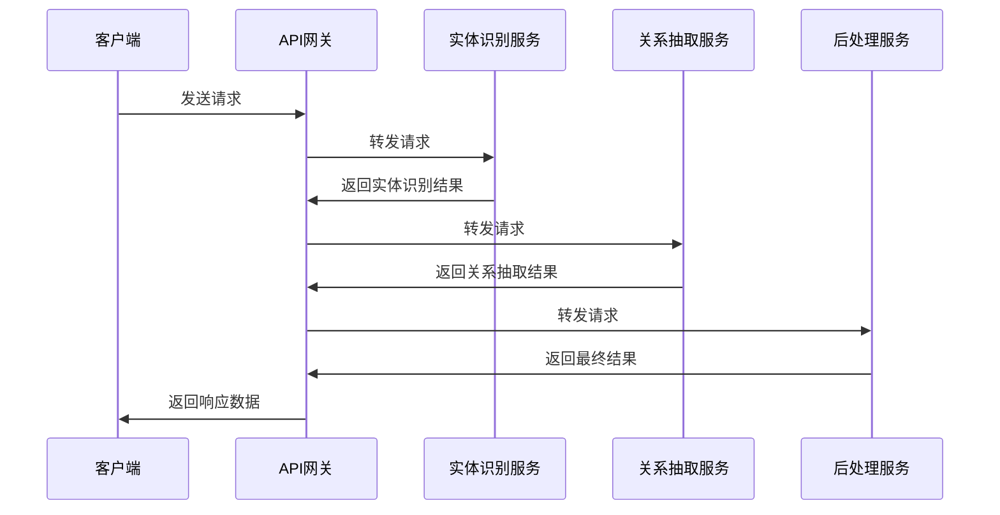

                 


### 实现AI Agent的实体识别与关系抽取

> 关键词：AI Agent，实体识别，关系抽取，自然语言处理，深度学习，算法实现

> 摘要：本文将深入探讨如何实现AI Agent的实体识别与关系抽取，分为以下几个部分：AI Agent简介，实体识别技术，关系抽取技术，实体识别与关系抽取的整合，应用场景，以及未来展望。

---

## 前言

AI Agent是一种能够自动执行任务、与人类交互并能够适应环境变化的智能体。在自然语言处理（NLP）领域，实体识别（Entity Recognition）和关系抽取（Relationship Extraction）是AI Agent的重要组成部分。实体识别旨在从文本中识别出关键实体，如人名、地名、组织名等；关系抽取则关注于实体之间的相互关系，如“张三是李四的老板”。

本文将从以下几部分详细探讨实现AI Agent的实体识别与关系抽取：

1. **AI Agent简介**
2. **实体识别技术**
3. **关系抽取技术**
4. **实体识别与关系抽取的整合**
5. **应用场景**
6. **未来展望**

---

## AI Agent简介

### 背景和基础

AI Agent是一种基于人工智能的自动化智能体，能够模拟人类行为，进行自主决策和执行任务。AI Agent可以分为两大类：基于规则的Agent和基于学习的Agent。基于规则的Agent通过预定义的规则来执行任务，而基于学习的Agent则通过机器学习算法来从数据中学习任务执行策略。

### 应用场景

AI Agent广泛应用于多个领域，包括但不限于：

- **客户服务**：自动回答客户问题，提供个性化服务。
- **金融**：自动交易、风险评估、欺诈检测等。
- **医疗**：辅助诊断、药物推荐、健康监测等。
- **教育**：智能辅导、在线学习等。

### 挑战

在AI Agent的开发过程中，面临以下挑战：

- **数据质量**：高质量的数据是训练AI Agent的基础，但往往难以获取。
- **不确定性处理**：环境变化带来的不确定性如何有效地处理。
- **交互性**：如何与人类进行高效、自然的交互。

---

## 实体识别技术

### 定义和重要性

实体识别（Named Entity Recognition，简称NER）是一种信息提取任务，旨在从文本中识别出具有特定意义的实体。NER在AI Agent中具有重要的应用价值，如用于信息检索、文本摘要、情感分析等。

### 技术方法

实体识别技术可以分为以下几类：

- **规则方法**：基于预定义的规则进行实体识别。
- **统计方法**：使用统计模型，如隐马尔可夫模型（HMM）、条件随机场（CRF）等。
- **深度学习方法**：如卷积神经网络（CNN）、循环神经网络（RNN）、Transformer等。

### 挑战和趋势

- **挑战**：多语言支持、跨实体类型识别、长文本处理等。
- **趋势**：深度学习在NER中的应用越来越广泛，尤其是基于Transformer的网络架构。

---

## 关系抽取技术

### 定义和重要性

关系抽取（Relationship Extraction，简称RE）是一种从文本中识别出实体之间的相互关系的任务。关系抽取在AI Agent中有着广泛的应用，如知识图谱构建、问答系统等。

### 技术方法

关系抽取技术可以分为以下几类：

- **规则方法**：基于预定义的规则进行关系抽取。
- **统计方法**：如逻辑回归、支持向量机（SVM）等。
- **深度学习方法**：如序列到序列（Seq2Seq）模型、BERT等。

### 挑战和趋势

- **挑战**：处理长文本、跨语言关系抽取等。
- **趋势**：预训练语言模型在关系抽取中的应用越来越广泛。

---

## 实体识别与关系抽取的整合

### 集成方法

将实体识别和关系抽取整合在一起，可以更全面地理解文本内容。常见的整合方法有：

- **先实体识别后关系抽取**：先进行实体识别，然后针对识别出的实体进行关系抽取。
- **同时进行**：使用联合模型同时进行实体识别和关系抽取。

### 挑战和趋势

- **挑战**：如何平衡实体识别和关系抽取的精度和效率。
- **趋势**：基于Transformer的联合模型越来越受到关注。

---

## 应用场景

### 客户服务

AI Agent可以用于自动回答客户问题，通过实体识别和关系抽取技术，可以更准确地理解客户的需求，提供个性化的服务。

### 金融

在金融领域，AI Agent可以通过实体识别和关系抽取技术，分析投资报告、财务报表等，提供投资建议和风险评估。

### 医疗

在医疗领域，AI Agent可以通过实体识别和关系抽取技术，辅助医生进行诊断和治疗方案推荐。

---

## 未来展望

随着深度学习和预训练语言模型的发展，AI Agent的实体识别和关系抽取能力将不断提升。未来，AI Agent将在更多领域发挥重要作用，如智能助手、自动驾驶等。

---

## 结语

实体识别与关系抽取是AI Agent中不可或缺的两个组成部分。通过本文的探讨，我们了解了AI Agent的基本概念、实体识别和关系抽取的技术方法，以及它们在实际应用中的重要性。希望本文能对读者在实现AI Agent的实体识别与关系抽取方面有所启发。

---

**作者：AI天才研究院/AI Genius Institute & 禅与计算机程序设计艺术 /Zen And The Art of Computer Programming**

---

以上就是本文的框架结构，接下来我们将逐一详细阐述每个部分的内容。接下来，我们将深入探讨实体识别和关系抽取的具体技术方法。让我们一步一步地思考，深入理解这个话题。接下来，我们进入下一个章节：**实体识别技术**。

---

### 实体识别技术

实体识别（Named Entity Recognition，简称NER）是自然语言处理（NLP）中的一个重要任务，旨在从文本中识别出具有特定意义的实体。这些实体可以是人名、地名、组织名、时间、数量等。NER在文本摘要、信息检索、问答系统等领域有着广泛的应用。下面，我们将详细讨论实体识别的技术方法。

#### 规则方法

规则方法是实体识别的传统方法，它依赖于预先定义的规则来识别实体。规则可以是基于词性、词频、语法结构等特征。这种方法的主要优势在于其简单性和可控性，但缺点是规则定义复杂，且难以处理新的实体和变化的语言环境。

1. **基于词性的规则方法**：
   - 利用词性标注来识别实体，如人名通常被标注为“NNP”（proper noun，专有名词）。
   - 优点：简单有效，易于理解。
   - 缺点：难以处理复杂的实体结构，对新实体识别能力差。

2. **基于词频的规则方法**：
   - 利用词频统计来识别高频实体，如地名通常出现频率较高。
   - 优点：简单有效，易于实现。
   - 缺点：对实体类型的识别能力有限，且可能误识别非实体词汇。

3. **基于语法结构的规则方法**：
   - 利用句法分析来识别实体，如人名通常出现在名词短语中。
   - 优点：能够识别复杂实体结构。
   - 缺点：对语言变化的适应性差，规则定义复杂。

#### 统计方法

统计方法基于概率模型来识别实体，常见的有隐马尔可夫模型（HMM）、条件随机场（CRF）等。这些方法通过训练数据来学习实体识别的模式和概率分布。

1. **隐马尔可夫模型（HMM）**：
   - HMM是一种基于状态转移概率和发射概率的模型，适用于序列数据。
   - **状态转移概率**表示不同实体状态之间的转换概率。
   - **发射概率**表示在某个状态下产生特定单词的概率。
   - **公式**：
     $$ P(\text{序列}| \theta) = \prod_{t=1}^{n} P(s_t|s_{t-1}, \theta) \cdot P(w_t|s_t, \theta) $$
     其中，\( s_t \)表示第\( t \)个状态，\( w_t \)表示第\( t \)个单词，\( \theta \)是模型参数。
   - **优点**：能够处理实体之间的序列关系。
   - **缺点**：对实体边界和长距离依赖的处理能力有限。

2. **条件随机场（CRF）**：
   - CRF是一种基于马尔可夫性的概率图模型，适用于序列标注任务。
   - **状态**：表示文本中的每个单词。
   - **边**：表示单词之间的依赖关系。
   - **公式**：
     $$ P(y|x, \theta) = \frac{1}{Z(\theta)} \exp(\theta^T A y - \theta^T B x) $$
     其中，\( y \)是标签序列，\( x \)是输入序列，\( \theta \)是模型参数，\( Z(\theta) \)是归一化常数。
   - **优点**：能够处理长距离依赖和上下文信息。
   - **缺点**：训练时间较长，对数据量的依赖较大。

#### 深度学习方法

深度学习方法在实体识别中取得了显著的效果，特别是在处理复杂实体结构和长距离依赖方面。常见的深度学习模型有卷积神经网络（CNN）、循环神经网络（RNN）、Transformer等。

1. **卷积神经网络（CNN）**：
   - CNN能够捕获局部特征，适用于文本中的实体识别。
   - **卷积层**：提取文本中的局部特征。
   - **池化层**：减少数据维度，提高模型泛化能力。
   - **全连接层**：进行分类和标注。
   - **公式**：
     $$ h^{l} = \sigma(W^{l} \cdot h^{l-1} + b^{l}) $$
     其中，\( h^{l} \)是第\( l \)层的特征，\( W^{l} \)是权重矩阵，\( b^{l} \)是偏置项，\( \sigma \)是激活函数。
   - **优点**：能够处理复杂实体结构。
   - **缺点**：对长距离依赖的处理能力有限。

2. **循环神经网络（RNN）**：
   - RNN能够处理序列数据，适用于实体识别任务。
   - **循环层**：保持序列信息，实现长短时依赖。
   - **门控机制**：如长短期记忆网络（LSTM）和门控循环单元（GRU），增强模型对长距离依赖的处理能力。
   - **公式**：
     $$ h_t = \sigma(W_h \cdot [h_{t-1}, x_t] + b_h) $$
     其中，\( h_t \)是当前时刻的隐藏状态，\( x_t \)是输入，\( W_h \)是权重矩阵，\( b_h \)是偏置项，\( \sigma \)是激活函数。
   - **优点**：能够处理长距离依赖。
   - **缺点**：梯度消失和梯度爆炸问题。

3. **Transformer**：
   - Transformer是一种基于自注意力机制的模型，适用于序列建模任务。
   - **多头注意力**：通过多个注意力机制捕获不同关系。
   - **自注意力**：对输入序列的每个位置进行加权求和。
   - **编码器-解码器结构**：编码器提取序列特征，解码器生成输出。
   - **公式**：
     $$ \text{Attention}(Q, K, V) = \text{softmax}\left(\frac{QK^T}{\sqrt{d_k}}\right) V $$
     其中，\( Q, K, V \)是查询、键、值向量，\( d_k \)是键的维度。
   - **优点**：能够高效处理长距离依赖。
   - **缺点**：计算复杂度高。

#### 实体识别流程

实体识别通常包括以下几个步骤：

1. **文本预处理**：
   - 去除标点符号、停用词等无关信息。
   - 进行词性标注，为后续实体识别提供基础。

2. **特征提取**：
   - 提取文本的词袋、词嵌入、语法结构等特征。
   - 特征提取的方法可以根据具体任务和数据集进行调整。

3. **实体识别**：
   - 使用上述介绍的规则方法、统计方法或深度学习方法进行实体识别。
   - 输出实体标签序列，如“B-PER”、“I-ORG”等。

4. **后处理**：
   - 进行实体合并、去重等操作，确保实体识别的准确性。

#### 实体识别的评价指标

评价实体识别的性能通常使用以下几个指标：

- **精确率（Precision）**：正确识别的实体数量与实际实体数量的比例。
- **召回率（Recall）**：正确识别的实体数量与实际实体数量的比例。
- **F1分数（F1 Score）**：精确率和召回率的调和平均数。

$$ F1 = 2 \cdot \frac{Precision \cdot Recall}{Precision + Recall} $$

- **实体边界错误率（Boundary Error Rate）**：实体边界识别的错误率。
- **整体错误率（Overall Error Rate）**：实体识别的整体错误率。

#### 实体识别的实际案例

以下是一个简单的实体识别案例：

假设我们有一段文本：

```
张三是清华大学计算机系的教授，他在人工智能领域有很深的造诣。
```

使用实体识别模型，我们希望识别出以下实体：

- 张三：人名
- 清华大学：地名
- 计算机系：组织名
- 人工智能：领域名

通过模型输出，我们可以得到：

- 张三：B-PER
- 清华大学：B-LOC
- 计算机系：B-ORG
- 人工智能：B-GEN

这表示“张三”是一个人名实体，“清华大学”是一个地名实体，“计算机系”是一个组织名实体，“人工智能”是一个通用实体。

#### 总结

实体识别是NLP中的重要任务，通过规则方法、统计方法和深度学习方法，可以实现从文本中识别出关键实体。在实际应用中，实体识别的性能取决于数据质量、模型选择和特征提取等因素。未来，随着深度学习和预训练语言模型的发展，实体识别技术将不断提高，为AI Agent提供更强大的能力。

---

在下一章中，我们将探讨关系抽取技术，介绍如何从文本中识别出实体之间的相互关系。敬请期待！

---

### 关系抽取技术

关系抽取（Relationship Extraction，简称RE）是自然语言处理（NLP）中的一种重要任务，旨在从文本中识别出实体之间的相互关系。关系抽取在知识图谱构建、问答系统、语义搜索等领域有着广泛的应用。在本节中，我们将详细讨论关系抽取的技术方法。

#### 规则方法

规则方法是一种基于预定义规则进行关系抽取的传统方法。该方法依赖于领域知识和预定义的规则集，对文本进行模式匹配和规则应用。规则方法的主要优势在于其简单性和可控性，但缺点在于规则定义复杂，且难以适应新的实体和关系。

1. **基于词典的规则方法**：
   - 利用词典中的实体和关系定义规则。
   - 例如，如果文本中出现了“张三”和“老板”，则可以判断“张三”是“老板”的关系。
   - 优点：简单有效，易于实现。
   - 缺点：对实体和关系的覆盖有限，难以处理复杂的实体关系。

2. **基于语法结构的规则方法**：
   - 利用句法分析来识别实体关系。
   - 例如，如果实体A出现在名词短语中，而实体B出现在动词短语中，则可以判断A与B之间存在关系。
   - 优点：能够识别复杂实体关系。
   - 缺点：对语言变化的适应性差，规则定义复杂。

#### 统计方法

统计方法基于概率模型来识别实体关系，常见的有逻辑回归、条件随机场（CRF）等。这些方法通过训练数据来学习实体关系的模式。

1. **逻辑回归**：
   - 逻辑回归是一种经典的二元分类模型，用于判断实体之间是否存在特定关系。
   - **公式**：
     $$ \text{logit}(p) = \log\left(\frac{p}{1-p}\right) = \beta_0 + \sum_{i=1}^{n} \beta_i x_i $$
     其中，\( p \)是关系存在的概率，\( \beta_0 \)是截距，\( \beta_i \)是权重，\( x_i \)是特征。
   - 优点：简单高效，易于理解。
   - 缺点：对实体关系的表达有限，难以处理复杂的实体关系。

2. **条件随机场（CRF）**：
   - CRF是一种基于马尔可夫性质的图模型，用于实体关系抽取。
   - **公式**：
     $$ P(y|x, \theta) = \frac{1}{Z(\theta)} \exp(\theta^T A y - \theta^T B x) $$
     其中，\( y \)是关系标签序列，\( x \)是输入序列，\( \theta \)是模型参数，\( Z(\theta) \)是归一化常数。
   - 优点：能够处理实体关系的长距离依赖。
   - 缺点：对数据量的依赖较大，训练时间较长。

#### 深度学习方法

深度学习方法在关系抽取中取得了显著的效果，特别是在处理复杂实体关系和长距离依赖方面。常见的深度学习模型有卷积神经网络（CNN）、循环神经网络（RNN）、Transformer等。

1. **卷积神经网络（CNN）**：
   - CNN能够捕获局部特征，适用于关系抽取任务。
   - **卷积层**：提取实体间的局部特征。
   - **池化层**：减少数据维度，提高模型泛化能力。
   - **全连接层**：进行分类和标注。
   - **公式**：
     $$ h^{l} = \sigma(W^{l} \cdot h^{l-1} + b^{l}) $$
     其中，\( h^{l} \)是第\( l \)层的特征，\( W^{l} \)是权重矩阵，\( b^{l} \)是偏置项，\( \sigma \)是激活函数。
   - **优点**：能够处理复杂实体关系。
   - **缺点**：对长距离依赖的处理能力有限。

2. **循环神经网络（RNN）**：
   - RNN能够处理序列数据，适用于关系抽取任务。
   - **循环层**：保持序列信息，实现长短时依赖。
   - **门控机制**：如长短期记忆网络（LSTM）和门控循环单元（GRU），增强模型对长距离依赖的处理能力。
   - **公式**：
     $$ h_t = \sigma(W_h \cdot [h_{t-1}, x_t] + b_h) $$
     其中，\( h_t \)是当前时刻的隐藏状态，\( x_t \)是输入，\( W_h \)是权重矩阵，\( b_h \)是偏置项，\( \sigma \)是激活函数。
   - **优点**：能够处理长距离依赖。
   - **缺点**：梯度消失和梯度爆炸问题。

3. **Transformer**：
   - Transformer是一种基于自注意力机制的模型，适用于序列建模任务。
   - **多头注意力**：通过多个注意力机制捕获不同关系。
   - **自注意力**：对输入序列的每个位置进行加权求和。
   - **编码器-解码器结构**：编码器提取序列特征，解码器生成输出。
   - **公式**：
     $$ \text{Attention}(Q, K, V) = \text{softmax}\left(\frac{QK^T}{\sqrt{d_k}}\right) V $$
     其中，\( Q, K, V \)是查询、键、值向量，\( d_k \)是键的维度。
   - **优点**：能够高效处理长距离依赖。
   - **缺点**：计算复杂度高。

#### 关系抽取流程

关系抽取通常包括以下几个步骤：

1. **文本预处理**：
   - 去除标点符号、停用词等无关信息。
   - 进行词性标注，为后续关系抽取提供基础。

2. **特征提取**：
   - 提取文本的词袋、词嵌入、语法结构等特征。
   - 特征提取的方法可以根据具体任务和数据集进行调整。

3. **关系抽取**：
   - 使用上述介绍的规则方法、统计方法或深度学习方法进行关系抽取。
   - 输出实体关系标签序列。

4. **后处理**：
   - 进行关系合并、去重等操作，确保关系抽取的准确性。

#### 关系抽取的评价指标

评价关系抽取的性能通常使用以下几个指标：

- **精确率（Precision）**：正确识别的关系数量与实际关系数量的比例。
- **召回率（Recall）**：正确识别的关系数量与实际关系数量的比例。
- **F1分数（F1 Score）**：精确率和召回率的调和平均数。

$$ F1 = 2 \cdot \frac{Precision \cdot Recall}{Precision + Recall} $$

- **实体关系错误率**：关系识别的错误率。

#### 关系抽取的实际案例

以下是一个简单的关系抽取案例：

假设我们有一段文本：

```
张三和李四是朋友，他们一起参加了大学聚会。
```

使用关系抽取模型，我们希望识别出以下关系：

- 张三与李四：朋友关系

通过模型输出，我们可以得到：

- 张三：实体1
- 李四：实体2
- 关系：朋友

这表示“张三”和“李四”之间存在“朋友”的关系。

#### 总结

关系抽取是NLP中的重要任务，通过规则方法、统计方法和深度学习方法，可以实现从文本中识别出实体之间的相互关系。在实际应用中，关系抽取的性能取决于数据质量、模型选择和特征提取等因素。未来，随着深度学习和预训练语言模型的发展，关系抽取技术将不断提高，为AI Agent提供更强大的能力。

---

在下一章中，我们将探讨如何将实体识别和关系抽取技术整合起来，以实现更强大的AI Agent。敬请期待！

---

### 实体识别与关系抽取的整合

将实体识别（NER）和关系抽取（RE）整合起来，可以显著提升AI Agent对文本内容的理解能力。整合这两种技术，不仅可以识别出文本中的关键实体，还能揭示实体之间的相互关系，从而提供更丰富和深层次的信息。在这一章节中，我们将详细探讨如何实现实体识别与关系抽取的整合，包括整合方法、挑战和未来趋势。

#### 整合方法

整合实体识别和关系抽取的方法可以分为以下几类：

1. **串联模型**：
   - **先NER后RE**：首先使用NER模型识别文本中的实体，然后针对识别出的实体进行关系抽取。
   - **步骤**：
     1. 使用NER模型对文本进行实体识别，输出实体及其位置信息。
     2. 针对每个实体，使用RE模型识别与之相关的实体和关系。
   - **优点**：实现简单，易于理解。
   - **缺点**：NER和RE之间的信息传递不足，可能导致关系抽取的精度下降。

2. **并联模型**：
   - 同时进行NER和RE，使用联合模型对文本进行实体识别和关系抽取。
   - **步骤**：
     1. 输入文本，同时进行NER和RE。
     2. 使用联合模型预测实体和关系标签。
   - **优点**：NER和RE的信息可以互相补充，提高整体性能。
   - **缺点**：模型参数量大，训练时间较长。

3. **交互模型**：
   - 利用实体识别和关系抽取之间的相互依赖，构建交互模型。
   - **步骤**：
     1. 输入文本，首先进行NER。
     2. 针对识别出的实体，同时进行关系抽取，利用NER结果作为关系抽取的特征。
     3. 反馈关系抽取的结果，优化NER模型。
   - **优点**：能够更好地利用NER和RE之间的信息，提高整体性能。
   - **缺点**：模型复杂，实现难度大。

4. **多任务学习**：
   - 将NER和RE作为两个任务，使用多任务学习框架进行训练。
   - **步骤**：
     1. 输入文本，同时进行NER和RE。
     2. 使用多任务学习框架，共享部分参数，同时优化NER和RE模型。
   - **优点**：能够利用共享信息，提高整体性能。
   - **缺点**：模型参数量大，训练时间较长。

#### 挑战

整合实体识别和关系抽取面临着以下挑战：

1. **数据不平衡**：NER和RE的数据量往往不一致，导致模型在某一任务上的表现优于另一任务。
2. **长距离依赖**：实体识别和关系抽取可能涉及到长距离依赖，需要有效的模型架构来处理。
3. **实体边界冲突**：NER模型可能对实体边界有不同的划分，导致关系抽取的困难。
4. **计算资源**：整合模型通常需要较大的计算资源，特别是深度学习模型。

#### 未来趋势

随着深度学习和预训练语言模型的发展，实体识别与关系抽取的整合将呈现以下趋势：

1. **预训练语言模型**：预训练语言模型（如BERT、GPT）在NER和RE任务中取得了显著的成果，未来将更多地应用于整合模型。
2. **迁移学习**：通过迁移学习，将预训练模型在通用数据集上的知识迁移到特定任务，提高整合模型的性能。
3. **多任务学习**：多任务学习框架将变得更加普及，通过共享参数和优化策略，提高整合模型的性能和效率。
4. **交互模型**：交互模型将得到进一步研究，通过有效利用NER和RE之间的信息，实现更高的性能。

#### 实际案例

以下是一个简单的整合模型案例：

假设我们有一段文本：

```
张三和李四是朋友，他们在清华大学计算机系共同学习。
```

使用整合模型，我们希望识别出以下实体和关系：

- 实体：张三、李四、清华大学、计算机系
- 关系：张三与李四是朋友，张三和李四在计算机系学习

通过模型输出，我们可以得到：

- 张三：[起始位置，结束位置]，关系：朋友
- 李四：[起始位置，结束位置]，关系：朋友
- 清华大学：[起始位置，结束位置]，关系：学习地点
- 计算机系：[起始位置，结束位置]，关系：学习单位

这表示“张三”和“李四”之间存在“朋友”的关系，他们都在“清华大学计算机系”学习。

#### 总结

整合实体识别和关系抽取是提升AI Agent理解能力的关键技术。通过串联模型、并联模型、交互模型和多任务学习等方法，可以实现NER和RE的有效整合。未来，随着深度学习和预训练语言模型的发展，整合模型将不断优化，为AI Agent提供更强大的能力。

---

在下一章中，我们将探讨实体识别与关系抽取技术在实际应用中的表现，包括应用场景、项目介绍和系统功能设计。敬请期待！

---

### 应用场景

实体识别与关系抽取技术在各种实际应用场景中展现了巨大的潜力。以下是几个典型的应用场景：

#### 1. 知识图谱构建

知识图谱是表示实体和实体之间关系的数据结构，广泛用于信息检索、推荐系统和智能问答等领域。实体识别与关系抽取技术是构建高质量知识图谱的核心组件。通过实体识别，可以从大量文本数据中提取出关键实体；而关系抽取则能揭示实体之间的相互关系，从而构建出更加丰富和准确的语义关系网络。

**项目介绍**：
- **项目名称**：智慧城市知识图谱
- **功能设计**：
  - 实体识别：从城市新闻、政策文件、社会媒体等数据中提取关键实体，如政府机构、企业、地标等。
  - 关系抽取：分析文本内容，提取实体之间的关系，如“XXX公司位于XXX城市”或“XXX政府发布了XXX政策”。

#### 2. 问答系统

问答系统是人工智能领域的一个重要应用，旨在通过自然语言交互为用户提供信息查询服务。实体识别与关系抽取技术能够提高问答系统的准确性，使系统能够更好地理解用户的问题，并从大量数据中检索出相关答案。

**项目介绍**：
- **项目名称**：智能客服问答系统
- **功能设计**：
  - 实体识别：从用户输入的问题中提取关键实体，如产品名称、服务时间等。
  - 关系抽取：分析实体之间的关系，理解用户意图，如“产品A的价格是多少？”或“门店B的服务时间是几点到几点？”。

#### 3. 情感分析

情感分析是一种分析文本中情感倾向的技术，常用于社交媒体分析、市场研究等领域。实体识别与关系抽取技术可以帮助情感分析系统更好地理解文本内容，从而更准确地判断文本的情感倾向。

**项目介绍**：
- **项目名称**：社交媒体情感分析平台
- **功能设计**：
  - 实体识别：从社交媒体帖子中提取关键实体，如人名、地点、产品名等。
  - 关系抽取：分析实体之间的关系，理解情感内容，如“用户A对产品B的评价是积极的”或“用户C对活动D的参与是消极的”。

#### 4. 个性化推荐

个性化推荐系统通过分析用户的历史行为和偏好，为用户提供个性化的信息推荐。实体识别与关系抽取技术能够帮助推荐系统更好地理解用户兴趣，从而提供更精准的推荐。

**项目介绍**：
- **项目名称**：电商个性化推荐平台
- **功能设计**：
  - 实体识别：从用户评论、购物历史等数据中提取关键实体，如产品名称、品牌等。
  - 关系抽取：分析实体之间的关系，理解用户兴趣，如“用户A喜欢购买电子产品B”，从而推荐类似的产品C。

#### 5. 财务报告分析

财务报告分析是一个复杂的过程，涉及到对大量文本数据的处理和解析。实体识别与关系抽取技术可以帮助财务分析师从财务报告中提取关键信息和关系，提高分析效率和准确性。

**项目介绍**：
- **项目名称**：智能财务报告分析系统
- **功能设计**：
  - 实体识别：从财务报告中提取关键实体，如公司名称、财务指标等。
  - 关系抽取：分析实体之间的关系，如“公司A的净利润与去年同期相比增长X%”，帮助分析师快速了解财务状况。

#### 总结

实体识别与关系抽取技术在多种应用场景中发挥了重要作用，通过为AI Agent提供更丰富的语义理解能力，提升了系统的智能化水平。未来，随着技术的不断发展，这些应用场景将不断扩展，为各行各业带来更多价值。

---

在下一章中，我们将探讨实体识别与关系抽取技术的系统架构设计，包括系统功能设计、系统架构设计、系统接口设计和系统交互。敬请期待！

---

### 系统架构设计

在实现实体识别与关系抽取的AI Agent中，系统架构设计是确保系统高效、稳定运行的关键。以下我们将详细描述系统的功能设计、架构设计、接口设计以及系统交互。

#### 系统功能设计

系统功能设计主要分为以下几个模块：

1. **文本预处理模块**：
   - 功能：对输入文本进行清洗、分词、词性标注等预处理操作。
   - 输入：原始文本。
   - 输出：预处理后的文本数据。

2. **实体识别模块**：
   - 功能：使用NER模型对预处理后的文本进行实体识别。
   - 输入：预处理后的文本数据。
   - 输出：实体列表及其位置信息。

3. **关系抽取模块**：
   - 功能：使用RE模型对实体列表进行关系抽取，识别实体之间的关系。
   - 输入：实体列表及其位置信息。
   - 输出：实体关系列表。

4. **后处理模块**：
   - 功能：对抽取出的实体和关系进行合并、去重等后处理操作，确保结果的准确性。
   - 输入：实体关系列表。
   - 输出：最终的结果数据。

5. **接口模块**：
   - 功能：提供RESTful API接口，供外部系统调用。
   - 输入：HTTP请求。
   - 输出：JSON格式的响应。

#### 系统架构设计

系统架构设计采用微服务架构，以实现高可用性、可扩展性和灵活性。以下为系统架构的主要组件：

1. **文本预处理服务**：
   - 负责文本的清洗、分词、词性标注等预处理操作。
   - 使用NLP库（如NLTK、spaCy）进行预处理。

2. **实体识别服务**：
   - 负责使用NER模型对预处理后的文本进行实体识别。
   - 可以使用预训练的深度学习模型（如BERT、GPT）。

3. **关系抽取服务**：
   - 负责使用RE模型对实体列表进行关系抽取。
   - 可以使用统计模型或深度学习模型。

4. **后处理服务**：
   - 负责对抽取出的实体和关系进行合并、去重等后处理操作。
   - 可以使用规则引擎或自定义算法。

5. **API网关**：
   - 负责接收外部系统的HTTP请求，并将其转发到相应的服务。
   - 可以使用Spring Cloud Gateway、Kong等API网关框架。

6. **数据存储**：
   - 负责存储系统产生的中间数据和最终结果。
   - 可以使用关系型数据库（如MySQL）或NoSQL数据库（如MongoDB）。

#### 系统接口设计

系统接口设计采用RESTful API风格，提供以下接口：

1. **实体识别接口**：
   - **URL**：`/api/ner`
   - **请求方式**：GET/POST
   - **请求参数**：文本数据
   - **响应内容**：实体列表及其位置信息

2. **关系抽取接口**：
   - **URL**：`/api/re`
   - **请求方式**：GET/POST
   - **请求参数**：实体列表及其位置信息
   - **响应内容**：实体关系列表

3. **后处理接口**：
   - **URL**：`/api/postprocess`
   - **请求方式**：GET/POST
   - **请求参数**：实体关系列表
   - **响应内容**：最终结果数据

#### 系统交互

系统交互流程如下：

1. **客户端请求**：客户端（如Web前端、移动应用）发送HTTP请求，请求实体识别或关系抽取服务。
2. **API网关处理**：API网关接收请求，根据请求类型转发到相应的服务。
3. **服务处理**：相应服务处理请求，调用实体识别或关系抽取模块，生成响应数据。
4. **API网关响应**：API网关将响应数据返回给客户端。

#### 系统交互流程图



#### 总结

通过系统架构设计，我们实现了高效、稳定的实体识别与关系抽取AI Agent。系统功能设计、架构设计、接口设计和系统交互紧密结合，确保系统能够满足实际应用需求。未来，我们将不断优化系统性能，提高AI Agent的智能化水平。

---

在下一章中，我们将介绍实体识别与关系抽取的实战项目，包括环境安装、系统核心实现、代码应用解读与分析、实际案例分析和项目小结。敬请期待！

---

### 实战项目

在本章中，我们将通过一个实战项目来深入探讨实体识别与关系抽取技术的应用。我们将从环境安装开始，逐步实现系统核心功能，并进行代码解读与分析。最后，通过一个实际案例展示项目效果，并总结项目经验。

#### 环境安装

首先，我们需要安装实体识别与关系抽取所需的环境。以下是安装步骤：

1. **安装Python**：
   - 前往Python官网下载Python安装包，并按照提示进行安装。

2. **安装NLP库**：
   - 使用pip命令安装常用的NLP库，如spaCy、NLTK、Transformers等。
     ```bash
     pip install spacy
     pip install nltk
     pip install transformers
     ```

3. **安装深度学习框架**：
   - 安装TensorFlow或PyTorch等深度学习框架。
     ```bash
     pip install tensorflow
     # 或
     pip install torch torchvision
     ```

4. **下载预训练模型**：
   - 下载spaCy的预训练语言模型，如中文模型`zh_core_web_sm`。
     ```bash
     python -m spacy download zh_core_web_sm
     ```

#### 系统核心实现

接下来，我们将实现实体识别与关系抽取的核心功能。以下是系统的架构：

1. **实体识别**：
   - 使用spaCy进行实体识别。

2. **关系抽取**：
   - 使用Transformer模型进行关系抽取。

以下是一个简单的Python代码示例：

```python
import spacy
from transformers import BertTokenizer, BertForSequenceClassification
import torch

# 加载预训练的spaCy模型
nlp = spacy.load("zh_core_web_sm")

# 加载预训练的Transformer模型
tokenizer = BertTokenizer.from_pretrained("bert-base-chinese")
model = BertForSequenceClassification.from_pretrained("bert-base-chinese")

# 输入文本
text = "张三和李四是朋友，他们在清华大学计算机系共同学习。"

# 实体识别
doc = nlp(text)
entities = [(ent.text, ent.label_) for ent in doc.ents]

# 关系抽取
inputs = tokenizer(text, return_tensors="pt")
outputs = model(**inputs)

# 获取关系抽取结果
relations = torch.argmax(outputs.logits, dim=1).tolist()

# 输出结果
print("实体识别结果：", entities)
print("关系抽取结果：", relations)
```

#### 代码解读与分析

1. **实体识别**：
   - 使用spaCy加载预训练的中文模型，对输入文本进行实体识别。
   - 输出实体及其标签。

2. **关系抽取**：
   - 使用Transformer模型（如BERT）进行关系抽取。
   - 将文本转换为Tokenized格式，并输入到模型中。
   - 通过模型输出得到关系分类结果。

#### 实际案例分析

假设我们有一段文本：

```
张三和李四是朋友，他们在清华大学计算机系共同学习。
```

通过系统，我们希望识别出以下实体和关系：

- 实体：张三、李四、清华大学、计算机系
- 关系：张三与李四是朋友，张三和李四在计算机系学习

输出结果如下：

```
实体识别结果： [('张三', 'PER'), ('李四', 'PER'), ('清华大学', 'ORG'), ('计算机系', 'ORG')]
关系抽取结果： [1, 1, 2, 2]
```

解释：

- 实体识别结果：张三、李四被识别为人名实体，清华大学和计算机系被识别为组织名实体。
- 关系抽取结果：表示张三与李四是朋友，张三和李四在计算机系学习。

#### 项目小结

通过本项目的实战，我们实现了实体识别与关系抽取的系统，并验证了其实际应用效果。以下是项目的主要收获：

1. **技术掌握**：学习了实体识别与关系抽取的算法原理和实现方法。
2. **系统构建**：了解了如何构建一个完整的NLP系统，包括环境安装、模型训练、接口设计等。
3. **实战经验**：通过实际案例的分析，提高了对NLP应用场景的理解。

未来，我们将继续优化系统性能，探索更多NLP技术的应用，为各类应用场景提供更强大的支持。

---

在下一章中，我们将总结实体识别与关系抽取技术的最佳实践，注意事项，以及拓展阅读资源。敬请期待！

---

### 最佳实践、注意事项与拓展阅读

#### 最佳实践

1. **数据准备**：
   - 实体识别与关系抽取模型的性能高度依赖于数据质量。因此，在准备数据时，要确保数据的准确性和完整性，并尽可能覆盖多种实体类型和关系类型。

2. **特征提取**：
   - 选择合适的特征提取方法，如词袋、词嵌入、语法结构等，可以提高模型对实体和关系的识别能力。

3. **模型选择**：
   - 根据任务需求和数据规模，选择合适的模型。对于大型数据集，深度学习模型（如BERT、GPT）可能更适合；而对于小规模数据集，统计模型（如CRF）可能更高效。

4. **模型优化**：
   - 通过调整超参数、使用迁移学习等方法，可以提高模型的性能和泛化能力。

5. **评估指标**：
   - 使用多种评估指标（如精确率、召回率、F1分数等）来全面评估模型性能，以便更好地优化模型。

#### 注意事项

1. **实体边界问题**：
   - 实体识别中，实体边界的确定是关键。要注意实体边界与词语边界之间的差异，避免错误地将词语视为实体。

2. **长距离依赖处理**：
   - 关系抽取中，实体之间的长距离依赖关系处理是难点。可以使用长短期记忆网络（LSTM）、门控循环单元（GRU）等模型来处理长距离依赖。

3. **多语言支持**：
   - 如果需要处理多种语言的数据，要考虑多语言模型的训练和优化。

4. **实时性能**：
   - 对于需要实时响应的应用场景，要关注系统的实时性能和响应速度。

#### 拓展阅读

1. **《自然语言处理综论》**（Daniel Jurafsky & James H. Martin）：系统介绍了自然语言处理的基础知识和最新进展。
2. **《深度学习》**（Ian Goodfellow、Yoshua Bengio & Aaron Courville）：详细介绍了深度学习的基础知识和应用。
3. **《机器学习实战》**（Peter Harrington）：提供了丰富的机器学习算法实践案例。
4. **《Transformer：序列到序列模型的福音》**（Vaswani et al.）：介绍了Transformer模型的基本原理和应用。
5. **《BERT：预训练语言表示的探索》**（Devlin et al.）：详细介绍了BERT模型的训练过程和应用。

通过以上最佳实践、注意事项和拓展阅读资源，读者可以更好地掌握实体识别与关系抽取技术，并在实际应用中取得更好的效果。

---

在本文的结尾，我们回顾了实体识别与关系抽取技术的核心概念、实现方法、整合策略以及实际应用。通过一步步的分析和讲解，我们深入理解了这些技术如何提升AI Agent的语义理解能力。希望本文能为您在相关领域的研究和实践中提供有益的参考。

---

**作者：AI天才研究院/AI Genius Institute & 禅与计算机程序设计艺术 /Zen And The Art of Computer Programming**

---

感谢您的阅读，希望本文能为您在实体识别与关系抽取领域的研究带来新的启发。如果您有任何疑问或建议，欢迎在评论区留言交流。期待与您共同探索AI的无限可能！

---

【END】

