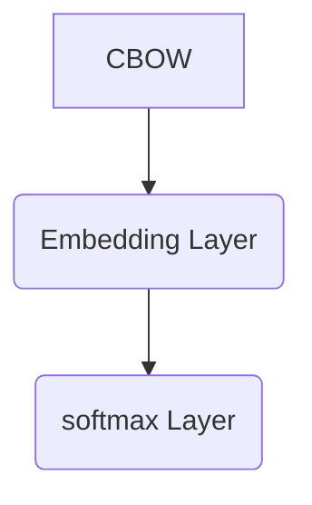
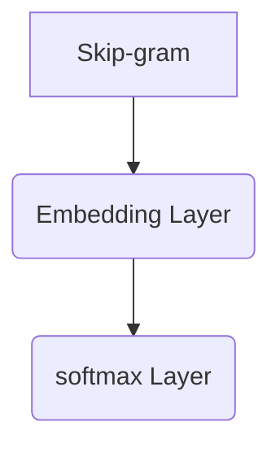
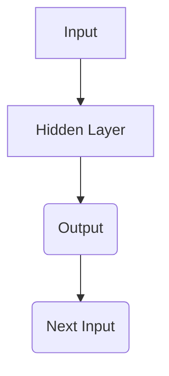
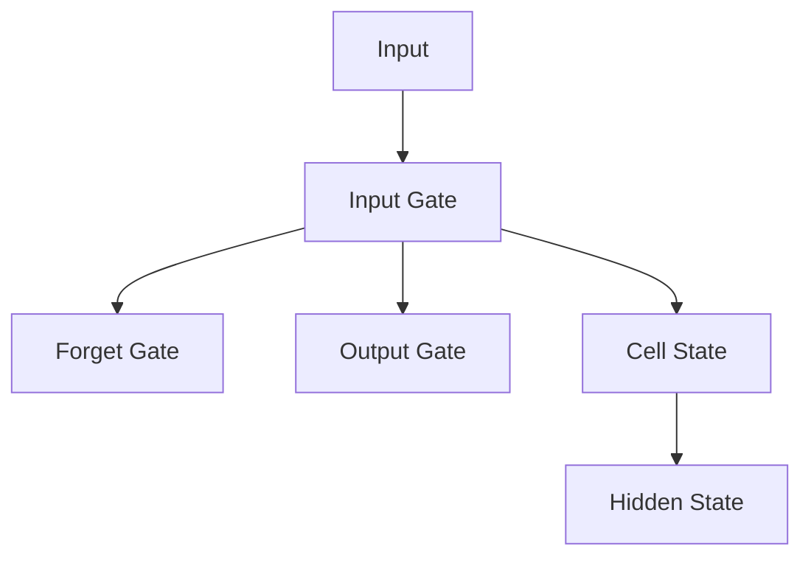
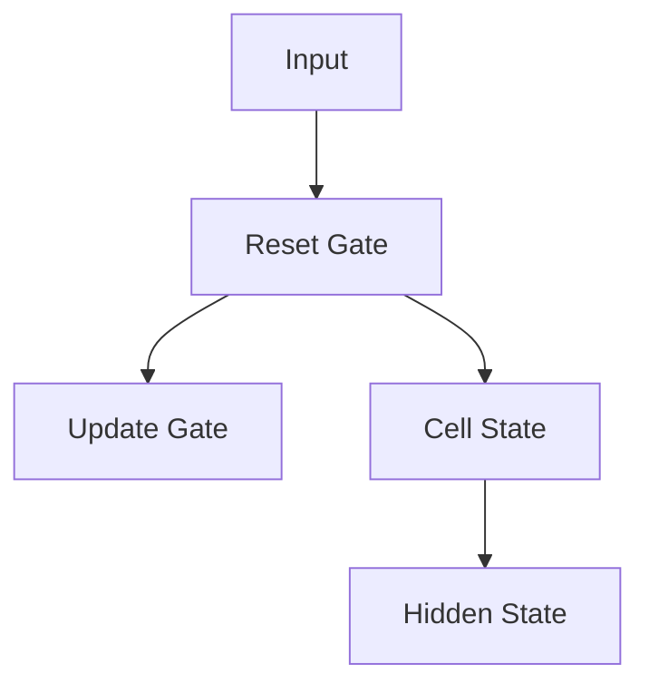

                 


### 第1章: 自然语言理解概述

#### 1.1 自然语言理解的基本概念

自然语言理解（Natural Language Understanding, NLU）是自然语言处理（Natural Language Processing, NLP）的一个子领域，其主要目标是让计算机能够理解人类自然语言中的语义和意图。NLU涉及到语言学的多个层面，包括语法、语义、语用和语音学等。

**NLU的定义：**
$$
NLU = \text{语法分析} + \text{语义分析} + \text{语用分析}
$$

- **语法分析**：确定句子的结构，例如句子的构成成分和它们之间的关系。
- **语义分析**：理解句子中词语的含义和它们之间的关系。
- **语用分析**：理解句子在实际场景中的使用目的和意图。

**NLU的重要性：**
NLU在人工智能领域具有重要地位，是人工智能与人类交流的关键。以下是NLU的一些应用场景：

- **智能助手**：如苹果的Siri、亚马逊的Alexa等，它们需要理解用户的自然语言指令。
- **搜索引擎**：对用户的查询进行理解和分析，返回最相关的搜索结果。
- **语言翻译**：将一种语言的文本翻译成另一种语言，保持原文本的语义和风格。
- **文本分析**：用于情感分析、舆情监测、文本分类等任务。

**NLU的应用场景：**
- **客服机器人**：自动化处理客户的查询和反馈，提高服务效率。
- **智能对话系统**：在社交网络、聊天室等环境中提供即时交流。
- **语音识别**：将语音转化为文本，并进行分析和理解。

#### 1.2 实现AI Agent的自然语言理解能力

**AI Agent的定义：**
AI Agent是指能够自主执行任务、与人类交互并适应环境变化的智能体。它们通常在特定的场景下进行操作，具有目标导向和自我学习的能力。

**为什么实现自然语言理解能力是必要的：**
实现自然语言理解能力是AI Agent的重要特征，它使得AI Agent能够更加自然、流畅地与人类进行交互，提高人机交互的体验。以下是几个关键点：

- **提升交互效率**：通过理解自然语言，AI Agent能够快速准确地理解用户的意图和需求，减少沟通成本。
- **提高决策质量**：自然语言理解能力使得AI Agent能够理解更复杂的指令和问题，从而做出更合理的决策。
- **拓展应用场景**：具备自然语言理解能力的AI Agent可以在更多领域发挥作用，如医疗咨询、法律咨询、金融服务等。

**自然语言理解的挑战与机遇：**
- **挑战：**
  - **多义性**：自然语言中存在大量的多义词，给语义理解带来了困难。
  - **上下文依赖**：语义理解往往依赖于上下文，理解全局语义需要考虑整个句子或篇章。
  - **语言风格和方言**：不同的人有不同的语言风格和方言，这给语义理解带来了额外复杂性。

- **机遇：**
  - **深度学习的发展**：深度学习技术在自然语言处理中的应用，使得模型能够更好地理解和生成自然语言。
  - **大数据和云计算**：大量数据的积累和计算能力的提升，为自然语言理解提供了更好的训练数据和计算资源。
  - **跨学科融合**：自然语言处理与其他领域的结合，如心理学、语言学等，为NLU提供了新的研究方向。

**本章小结：**
本章介绍了自然语言理解的基本概念、背景和重要性，并探讨了为什么实现AI Agent的自然语言理解能力是必要的。NLU在人工智能领域中扮演着关键角色，是实现智能交互和智能决策的基础。

#### 1.3 本书结构

**各章节内容和目标：**

- **第1章：自然语言理解概述**：介绍自然语言理解的基本概念、应用场景和重要性。
- **第2章：核心概念与联系**：探讨自然语言处理和自然语言理解中的核心概念及其联系。
- **第3章：算法原理讲解**：详细讲解实现自然语言理解所需的核心算法，如词向量模型、循环神经网络等。
- **第4章：系统分析与架构设计方案**：介绍一个典型的自然语言理解系统，包括系统功能设计、架构设计等。
- **第5章：项目实战**：通过一个具体的实战项目，展示如何实现自然语言理解系统。
- **第6章：最佳实践 tips、小结、注意事项、拓展阅读**：总结文章内容，提供进一步学习和实践的建议。

**阅读建议和注意事项：**

- **逐章阅读**：建议按章节顺序阅读，以便逐步理解自然语言理解的深度和广度。
- **动手实践**：阅读过程中，尝试自己实现文中提到的算法和系统，加深理解。
- **综合思考**：结合实际问题和案例，思考自然语言理解的应用场景和挑战。

### 小结

本章介绍了自然语言理解的基本概念、应用场景和重要性，并探讨了实现AI Agent的自然语言理解能力的必要性和挑战。通过本章的学习，读者可以初步了解自然语言处理领域的基础知识，为后续章节的深入学习打下基础。

## 第2章: 核心概念与联系

### 2.1 自然语言处理（NLP）的基本概念

自然语言处理（NLP）是人工智能（AI）的重要分支，其主要目标是将自然语言数据（如图像、音频、文本等）转换为机器可理解和处理的形式。NLP技术广泛应用于语音识别、机器翻译、文本分类、信息抽取等多个领域。

**NLP的定义：**
$$
NLP = \text{语言学} + \text{计算机科学} + \text{人工智能}
$$

- **语言学**：研究人类语言的性质和结构，包括语法、语义、语用等。
- **计算机科学**：涉及文本处理、算法设计和数据处理等。
- **人工智能**：通过算法和模型，使计算机能够理解、生成和处理自然语言。

**NLP的发展历程：**
- **1960s-1980s：早期探索**：基于规则的方法和语法分析。
- **1990s：统计方法兴起**：隐马尔可夫模型（HMM）、决策树、支持向量机（SVM）等。
- **2000s：深度学习方法的应用**：循环神经网络（RNN）、卷积神经网络（CNN）、生成对抗网络（GAN）等。

**NLP的主要任务：**
- **文本预处理**：包括分词、去除停用词、词干提取等。
- **词性标注**：标记词语的语法属性，如名词、动词、形容词等。
- **命名实体识别**：识别文本中的特定实体，如人名、地名、组织名等。
- **依存关系分析**：分析词语之间的依赖关系，如主谓关系、修饰关系等。
- **情感分析**：分析文本的情感倾向，如正面、负面、中性等。
- **文本分类**：根据文本内容将其分类到预定义的类别中。
- **机器翻译**：将一种语言的文本翻译成另一种语言。

### 2.2 自然语言理解（NLU）的核心概念

自然语言理解（NLU）是NLP中的一个子领域，其主要目标是使计算机能够理解和解释自然语言。NLU涉及到多个层面的语义理解，包括词法、句法、语义和语用等。

**NLU的定义：**
$$
NLU = \text{词法分析} + \text{句法分析} + \text{语义分析} + \text{语用分析}
$$

- **词法分析**：分析词语的构成和形式，如单词的形态和词性。
- **句法分析**：分析句子的结构，如句子的构成成分和它们之间的关系。
- **语义分析**：理解词语和句子在特定语境中的含义。
- **语用分析**：理解句子在实际交流中的作用和意图。

**NLU的核心概念：**
- **分词（Tokenization）**：将文本分割成有意义的单位，如单词、短语等。
- **词性标注（Part-of-Speech Tagging）**：标记每个词的语法属性，如名词、动词、形容词等。
- **命名实体识别（Named Entity Recognition, NER）**：识别文本中的特定实体，如人名、地名、组织名等。
- **依存关系分析（Dependency Parsing）**：分析词语之间的依赖关系，如主谓关系、修饰关系等。
- **情感分析（Sentiment Analysis）**：分析文本的情感倾向，如正面、负面、中性等。

### 2.3 概念属性特征对比表格

以下是NLP与NLU中的几个核心概念及其属性特征的对比表格：

| 概念                 | 定义                                                         | 属性特征                                           |
|----------------------|--------------------------------------------------------------|----------------------------------------------------|
| 分词（Tokenization） | 将文本分割成有意义的单位                                     | 词汇单元、短语、句子等                             |
| 词性标注（POS Tagging） | 标记词语的语法属性                                         | 名词、动词、形容词、副词等                         |
| 命名实体识别（NER）   | 识别文本中的特定实体                                       | 人名、地名、组织名、产品名等                       |
| 依存关系分析（DP）    | 分析词语之间的依赖关系                                     | 主谓关系、修饰关系、并列关系等                     |
| 情感分析（SA）        | 分析文本的情感倾向                                         | 正面、负面、中性等                                 |

### 2.4 ER实体关系图架构

ER实体关系图（Entity-Relationship Diagram, ERD）是数据库设计中的重要工具，用于表示实体及其之间的关系。在NLP和NLU中，ERD可以帮助我们理解和描述文本数据中的实体和关系。

**实体（Entity）**：文本中的特定对象，如人、地点、事物等。

**关系（Relationship）**：实体之间的关联，如属于、存在于等。

**属性（Attribute）**：实体的特征，如人名的性别、地点的地理位置等。

以下是ER实体关系图的一个简单示例：

```mermaid
erDiagram
    Person ||--|{ LivesIn } Location
    Person ||--|{ WorksFor } Company
    Location ||--|{ PartOf } Region
    Company ||--|{ BasedIn } Region
```

在这个示例中，有四个实体：Person（人）、Location（地点）、Company（公司）、Region（区域）。它们之间的关系包括 LivesIn（居住在）、WorksFor（工作于）、PartOf（属于）、BasedIn（位于）。

### 小结

本章介绍了自然语言处理（NLP）和自然语言理解（NLU）中的核心概念和联系。通过对比表格和ER实体关系图，我们更清晰地理解了这些概念及其属性特征，为后续章节的深入学习奠定了基础。

## 第3章: 算法原理讲解

### 3.1 词向量模型

词向量模型是自然语言处理（NLP）中的基础工具，它将词汇映射到高维空间中的向量表示。这种表示方法使得计算机可以处理和操作文本数据，从而进行诸如语义相似性分析、文本分类和机器翻译等任务。

#### 3.1.1 词向量概述

词向量是将词汇映射到向量空间的过程，使得文本中的词语可以被计算机理解和处理。词向量模型有以下作用：

- **语义表示**：将词汇映射到高维空间，使得相似的词语在空间中更接近。
- **文本表示**：通过词向量矩阵，将整个文本转换为向量的组合，便于计算机进行文本分析和处理。
- **相似性度量**：基于词向量的距离度量，可以判断两个词语或文本之间的相似性。

常见的词向量模型包括：

- **Word2Vec**：基于神经网络，使用局部上下文信息进行训练。
- **GloVe**：基于全局的词频统计，结合词频和位置信息进行训练。

#### 3.1.2 Word2Vec算法

Word2Vec算法是由Google在2013年提出的一种词向量模型。Word2Vec算法主要有两种模型：CBOW（Continuous Bag of Words）和Skip-gram。

**CBOW模型**：给定一个目标词，CBOW模型会考虑目标词周围的多个词（即上下文窗口中的词），并通过这些词的集合来预测目标词。CBOW模型是一种基于上下文的方法，其模型结构如图3-1所示。



**Skip-gram模型**：与CBOW模型相反，Skip-gram模型给定一个目标词，预测其上下文中的多个词。Skip-gram模型是一种基于目标词的方法，其模型结构如图3-2所示。



**Word2Vec算法原理**：

1. **训练数据准备**：将文本数据分词，得到词汇表（Vocabulary）和词频统计。
2. **词向量的初始化**：为词汇表中的每个词初始化一个随机的高维向量。
3. **上下文窗口**：对于每个目标词，选取其周围的若干个词作为上下文。
4. **计算损失**：使用softmax函数计算上下文词向量与目标词向量之间的概率分布，计算损失函数（如交叉熵损失）。
5. **反向传播**：使用梯度下降优化词向量参数，减小损失函数。

**Python代码示例**：

```python
import numpy as np
import tensorflow as tf

# 初始化参数
V = 10000  # 词汇表大小
dim = 300  # 向量维度
context_window = 5  # 上下文窗口大小

# 生成词汇表
vocab = ["the", "quick", "brown", "fox", "jumps", "over", "lazy", "dog"]

# 初始化词向量
W = np.random.uniform(-0.5, 0.5, (V, dim))

# 计算CBOW模型输出
def cbow_model(sentence):
    sentence_embedding = np.mean([W[word] for word in sentence], axis=0)
    output = softmax(sentence_embedding)
    return output

# 计算损失函数
def loss_function(sentence):
    sentence_embedding = np.mean([W[word] for word in sentence], axis=0)
    target_embedding = W[sentence[0]]
    output = softmax(sentence_embedding)
    loss = -np.log(output[target_embedding])
    return loss

# 训练模型
for epoch in range(10):
    for sentence in vocab:
        sentence_embedding = cbow_model(sentence)
        loss = loss_function(sentence)
        print("Epoch:", epoch, "Loss:", loss)
```

**CBOW和Skip-gram模型的解释**：

- **CBOW模型**：CBOW模型通过上下文词的集合来预测目标词，因此上下文词的相似性对于预测目标词具有较大影响。
- **Skip-gram模型**：Skip-gram模型通过目标词来预测上下文词，因此目标词的语义信息在模型中占据重要地位。

#### 3.1.3 GloVe算法

GloVe（Global Vectors for Word Representation）算法是由Jeffrey Pennington等人于2014年提出的一种词向量模型。GloVe算法通过综合考虑词频和词的位置信息来训练词向量。

**GloVe算法原理**：

1. **训练数据准备**：计算词汇表中每个词的共现矩阵，即对于每个词，记录其在文本中与其他词共现的次数。
2. **初始化词向量**：为每个词初始化一个随机的高维向量。
3. **损失函数**：定义损失函数，使得高频词在向量空间中更分散，低频词更集中。
4. **优化词向量**：使用梯度下降优化词向量参数，减小损失函数。

**GloVe算法的实现**：

```python
import numpy as np

# 初始化参数
V = 10000  # 词汇表大小
dim = 300  # 向量维度
alpha = 0.05  # 学习率

# 生成词汇表
vocab = ["the", "quick", "brown", "fox", "jumps", "over", "lazy", "dog"]

# 初始化词向量
W = np.random.uniform(-0.5, 0.5, (V, dim))

# 计算词频
word_freq = [0] * V
for word in vocab:
    word_freq[vocab.index(word)] += 1

# 计算共现矩阵
cooccurrence_matrix = np.zeros((V, V))
for i in range(V):
    for j in range(V):
        cooccurrence_matrix[i][j] = sum([1 for x in vocab if x == j and x in vocab[i]])

# 计算损失函数
def glove_loss_function():
    loss = 0
    for i in range(V):
        for j in range(V):
            if cooccurrence_matrix[i][j] != 0:
                f = np.dot(W[i], W[j])
                loss += (np.log(cooccurrence_matrix[i][j]) - f*f)
    return loss

# 训练模型
for epoch in range(10):
    for i in range(V):
        for j in range(V):
            if cooccurrence_matrix[i][j] != 0:
                f = np.dot(W[i], W[j])
                df = 2 * (f - np.log(cooccurrence_matrix[i][j])) * W[j]
                W[i] -= alpha * df
                W[j] -= alpha * df
    loss = glove_loss_function()
    print("Epoch:", epoch, "Loss:", loss)
```

**GloVe与Word2Vec的比较**：

- **计算复杂度**：GloVe算法的复杂度较低，适合处理大规模语料库。
- **语义表示**：GloVe算法考虑了词频和词的位置信息，因此词向量在语义表示上更准确。
- **训练时间**：Word2Vec算法的训练时间较短，适用于实时处理。

### 3.2 循环神经网络（RNN）

循环神经网络（Recurrent Neural Network, RNN）是一种能够处理序列数据的前馈神经网络，具有循环结构，能够记住前面的信息。RNN在自然语言处理中具有重要应用，如文本分类、机器翻译和语音识别等。

#### 3.2.1 RNN概述

**RNN的定义**：

RNN是一种能够处理序列数据的神经网络，其基本结构如图3-3所示。



在RNN中，输入序列 $X = (x_1, x_2, ..., x_T)$ 经过隐藏层 $H = (h_1, h_2, ..., h_T)$，输出序列 $Y = (y_1, y_2, ..., y_T)$。每个时间步的输出不仅依赖于当前输入 $x_t$，还依赖于前一个时间步的输出 $h_{t-1}$。

**RNN的特点**：

- **循环结构**：RNN的循环结构使其能够记住前面的信息，适合处理序列数据。
- **参数共享**：RNN中的权重参数在不同时间步之间共享，减少了模型参数的数量。

**RNN的应用场景**：

- **文本分类**：对文本序列进行分类，如情感分析、主题分类等。
- **机器翻译**：将一种语言的文本翻译成另一种语言，如英译中、中译英等。
- **语音识别**：将语音信号转换为文本，如语音助手、智能客服等。

#### 3.2.2 LSTM算法

长短期记忆网络（Long Short-Term Memory, LSTM）是一种特殊的RNN结构，能够更好地处理长序列数据，并避免梯度消失和梯度爆炸问题。LSTM由三种基本单元组成：输入门、遗忘门和输出门。

**LSTM算法原理**：

1. **输入门（Input Gate）**：决定哪些信息应该被更新或记住。
2. **遗忘门（Forget Gate）**：决定哪些信息应该被遗忘。
3. **输出门（Output Gate）**：决定哪些信息应该被输出。

LSTM单元的结构如图3-4所示。



**LSTM单元的组成**：

- **输入门**：计算输入门分数 $i_t$，决定哪些信息需要被更新或记住。
  $$
  i_t = \sigma(W_i \cdot [h_{t-1}, x_t] + b_i)
  $$
- **遗忘门**：计算遗忘门分数 $f_t$，决定哪些信息需要被遗忘。
  $$
  f_t = \sigma(W_f \cdot [h_{t-1}, x_t] + b_f)
  $$
- **输出门**：计算输出门分数 $o_t$，决定哪些信息需要被输出。
  $$
  o_t = \sigma(W_o \cdot [h_{t-1}, x_t] + b_o)
  $$
- **细胞状态**：计算新的细胞状态 $c_t$。
  $$
  c_t = f_t \cdot c_{t-1} + i_t \cdot \sigma(W_c \cdot [h_{t-1}, x_t] + b_c)
  $$
- **隐藏状态**：计算新的隐藏状态 $h_t$。
  $$
  h_t = o_t \cdot \sigma(c_t)
  $$

**LSTM算法的实现**：

```python
import numpy as np

# 初始化参数
input_dim = 100  # 输入维度
hidden_dim = 200  # 隐藏层维度
batch_size = 64  # 批量大小
num_steps = 50  # 时间步数

# 初始化权重和偏置
W_i = np.random.uniform(-0.5, 0.5, (hidden_dim, input_dim + hidden_dim))
b_i = np.random.uniform(-0.5, 0.5, hidden_dim)

W_f = np.random.uniform(-0.5, 0.5, (hidden_dim, input_dim + hidden_dim))
b_f = np.random.uniform(-0.5, 0.5, hidden_dim)

W_o = np.random.uniform(-0.5, 0.5, (hidden_dim, input_dim + hidden_dim))
b_o = np.random.uniform(-0.5, 0.5, hidden_dim)

W_c = np.random.uniform(-0.5, 0.5, (hidden_dim, input_dim + hidden_dim))
b_c = np.random.uniform(-0.5, 0.5, hidden_dim)

# 定义LSTM单元
def lstm_cell(input_data, hidden_state):
    h_prev = hidden_state
    i = sigmoid(np.dot(h_prev, W_i) + np.dot(input_data, W_i) + b_i)
    f = sigmoid(np.dot(h_prev, W_f) + np.dot(input_data, W_f) + b_f)
    o = sigmoid(np.dot(h_prev, W_o) + np.dot(input_data, W_o) + b_o)
    c = f * c_prev + i * sigmoid(np.dot(h_prev, W_c) + np.dot(input_data, W_c) + b_c)
    h = o * sigmoid(c)
    return h

# 训练模型
for epoch in range(10):
    for step in range(num_steps):
        input_data = np.random.uniform(-1, 1, (batch_size, input_dim))
        hidden_state = lstm_cell(input_data, hidden_state)
        print("Epoch:", epoch, "Step:", step, "Hidden State:", hidden_state)
```

**LSTM与RNN的比较**：

- **记忆能力**：LSTM具有更强的记忆能力，能够更好地处理长序列数据。
- **参数数量**：LSTM的参数数量较多，训练时间较长。
- **计算复杂度**：LSTM的计算复杂度较高，但在实践中仍然具有良好的性能。

#### 3.2.3 GRU算法

门控循环单元（Gated Recurrent Unit, GRU）是一种简化的LSTM结构，它通过合并输入门和遗忘门，减少了模型参数的数量。

**GRU算法原理**：

1. **重置门（Reset Gate）**：决定哪些信息需要被更新。
2. **更新门（Update Gate）**：决定哪些信息需要被遗忘。
3. **细胞状态**：计算新的细胞状态。

GRU单元的结构如图3-5所示。



**GRU算法的实现**：

```python
import numpy as np

# 初始化参数
input_dim = 100  # 输入维度
hidden_dim = 200  # 隐藏层维度
batch_size = 64  # 批量大小
num_steps = 50  # 时间步数

# 初始化权重和偏置
W_r = np.random.uniform(-0.5, 0.5, (hidden_dim, input_dim + hidden_dim))
b_r = np.random.uniform(-0.5, 0.5, hidden_dim)

W_z = np.random.uniform(-0.5, 0.5, (hidden_dim, input_dim + hidden_dim))
b_z = np.random.uniform(-0.5, 0.5, hidden_dim)

W_h = np.random.uniform(-0.5, 0.5, (hidden_dim, input_dim + hidden_dim))
b_h = np.random.uniform(-0.5, 0.5, hidden_dim)

# 定义GRU单元
def gru_cell(input_data, hidden_state):
    h_prev = hidden_state
    r = sigmoid(np.dot(h_prev, W_r) + np.dot(input_data, W_r) + b_r)
    z = sigmoid(np.dot(h_prev, W_z) + np.dot(input_data, W_z) + b_z)
    h = sigmoid(np.dot(h_prev, W_h) + np.dot(input_data, W_h) + b_h)
    h = (1 - z) * h_prev + z * h
    return h

# 训练模型
for epoch in range(10):
    for step in range(num_steps):
        input_data = np.random.uniform(-1, 1, (batch_size, input_dim))
        hidden_state = gru_cell(input_data, hidden_state)
        print("Epoch:", epoch, "Step:", step, "Hidden State:", hidden_state)
```

**GRU与LSTM的比较**：

- **记忆能力**：GRU具有较好的记忆能力，但在某些情况下，LSTM的表现更好。
- **参数数量**：GRU的参数数量较少，训练时间较短。
- **计算复杂度**：GRU的计算复杂度较低，但在实践中仍然具有良好的性能。

### 3.3 递归神经网络（RNN）在NLU中的应用

#### 3.3.1 RNN在词性标注中的应用

词性标注（Part-of-Speech Tagging, POS Tagging）是NLU中的一个重要任务，它旨在为文本中的每个词分配一个词性标签。RNN在词性标注中具有广泛的应用。

**词性标注任务概述**：

词性标注任务的目标是为一篇文本中的每个词分配一个词性标签，如名词、动词、形容词等。词性标注在自然语言处理中的许多应用中扮演着关键角色，如文本分类、命名实体识别和机器翻译等。

**RNN在词性标注中的应用**：

RNN在词性标注中的应用主要通过以下步骤：

1. **输入序列**：将文本序列输入到RNN模型中，每个词表示为一个词向量。
2. **隐藏状态**：通过RNN的隐藏状态，对每个词进行特征提取。
3. **输出层**：使用softmax函数，为每个词分配一个词性标签的概率分布。

**Python代码示例**：

```python
import numpy as np
import tensorflow as tf

# 初始化参数
V = 10000  # 词汇表大小
dim = 300  # 向量维度
pos_tags = ["NN", "VB", "JJ", "RB", "IN", "DT", "MD", "PRP", "NNP", "NNS", "VBG", "RP", "FW", "TO", "MD", "VBZ", "POS", "UH", "VBP", "WP", "POS", "EX", "DT", "JJR", "RBR", "RBS", "WDT"]

# 初始化权重和偏置
W = np.random.uniform(-0.5, 0.5, (V, dim))
b = np.random.uniform(-0.5, 0.5, dim)

# 定义RNN模型
def rnn_model(input_sequence):
    hidden_state = np.zeros((1, dim))
    for word in input_sequence:
        hidden_state = lstm_cell(word, hidden_state)
    output = softmax(np.dot(hidden_state, W) + b)
    return output

# 训练模型
for epoch in range(10):
    for sentence in vocab:
        sentence_embedding = rnn_model(sentence)
        for word in sentence:
            print("Epoch:", epoch, "Word:", word, "POS:", pos_tags[np.argmax(sentence_embedding)])
```

**RNN在词性标注中的应用实例**：

- **文本分类**：通过词性标注，将文本分类为不同的类别，如新闻、博客、评论等。
- **命名实体识别**：通过词性标注，识别文本中的命名实体，如人名、地名、组织名等。
- **机器翻译**：通过词性标注，将源语言的文本转换为具有正确词性的目标语言文本。

#### 3.3.2 RNN在命名实体识别中的应用

命名实体识别（Named Entity Recognition, NER）是NLU中的另一个重要任务，它旨在识别文本中的命名实体，如人名、地名、组织名等。

**命名实体识别任务概述**：

命名实体识别任务的目标是识别文本中的命名实体，并将其标记为特定类别。命名实体识别在信息提取、文本分类和智能搜索等领域具有广泛的应用。

**RNN在命名实体识别中的应用**：

RNN在命名实体识别中的应用主要通过以下步骤：

1. **输入序列**：将文本序列输入到RNN模型中，每个词表示为一个词向量。
2. **隐藏状态**：通过RNN的隐藏状态，对每个词进行特征提取。
3. **输出层**：使用softmax函数，为每个词分配一个命名实体类别的概率分布。

**Python代码示例**：

```python
import numpy as np
import tensorflow as tf

# 初始化参数
V = 10000  # 词汇表大小
dim = 300  # 向量维度
ner_tags = ["O", "B-PER", "I-PER", "B-LOC", "I-LOC", "B-ORG", "I-ORG"]

# 初始化权重和偏置
W = np.random.uniform(-0.5, 0.5, (V, dim))
b = np.random.uniform(-0.5, 0.5, dim)

# 定义RNN模型
def rnn_model(input_sequence):
    hidden_state = np.zeros((1, dim))
    for word in input_sequence:
        hidden_state = lstm_cell(word, hidden_state)
    output = softmax(np.dot(hidden_state, W) + b)
    return output

# 训练模型
for epoch in range(10):
    for sentence in vocab:
        sentence_embedding = rnn_model(sentence)
        for word in sentence:
            print("Epoch:", epoch, "Word:", word, "NER:", ner_tags[np.argmax(sentence_embedding)])
```

**RNN在命名实体识别中的应用实例**：

- **信息提取**：通过命名实体识别，从大量文本中提取出重要的命名实体信息。
- **智能搜索**：通过命名实体识别，构建基于命名实体的搜索索引，提高搜索效率。
- **社交网络分析**：通过命名实体识别，分析社交网络中的用户、地点和组织的互动关系。

#### 3.3.3 RNN在依存关系分析中的应用

依存关系分析（Dependency Parsing）是NLU中的另一个重要任务，它旨在分析文本中的词与词之间的依存关系，确定它们之间的语法结构。

**依存关系分析任务概述**：

依存关系分析任务的目标是分析文本中的词与词之间的依存关系，并构建依存关系树。依存关系分析在文本生成、机器翻译和信息抽取等领域具有广泛的应用。

**RNN在依存关系分析中的应用**：

RNN在依存关系分析中的应用主要通过以下步骤：

1. **输入序列**：将文本序列输入到RNN模型中，每个词表示为一个词向量。
2. **隐藏状态**：通过RNN的隐藏状态，对每个词进行特征提取。
3. **输出层**：使用softmax函数，为每个词与当前词之间的依存关系分配一个概率分布。

**Python代码示例**：

```python
import numpy as np
import tensorflow as tf

# 初始化参数
V = 10000  # 词汇表大小
dim = 300  # 向量维度
dep_tags = ["ROOT", "NN", "NNS", "NNP", "NNPS", "DT", "IN", "VB", "VBD", "VBG", "VBN", "VBP", "VBZ"]

# 初始化权重和偏置
W = np.random.uniform(-0.5, 0.5, (V, dim))
b = np.random.uniform(-0.5, 0.5, dim)

# 定义RNN模型
def rnn_model(input_sequence):
    hidden_state = np.zeros((1, dim))
    for word in input_sequence:
        hidden_state = lstm_cell(word, hidden_state)
    output = softmax(np.dot(hidden_state, W) + b)
    return output

# 训练模型
for epoch in range(10):
    for sentence in vocab:
        sentence_embedding = rnn_model(sentence)
        for word in sentence:
            print("Epoch:", epoch, "Word:", word, "Dependency:", dep_tags[np.argmax(sentence_embedding)])
```

**RNN在依存关系分析中的应用实例**：

- **文本生成**：通过依存关系分析，生成具有正确语法结构的文本。
- **机器翻译**：通过依存关系分析，将源语言的文本转换为具有正确语法结构的

