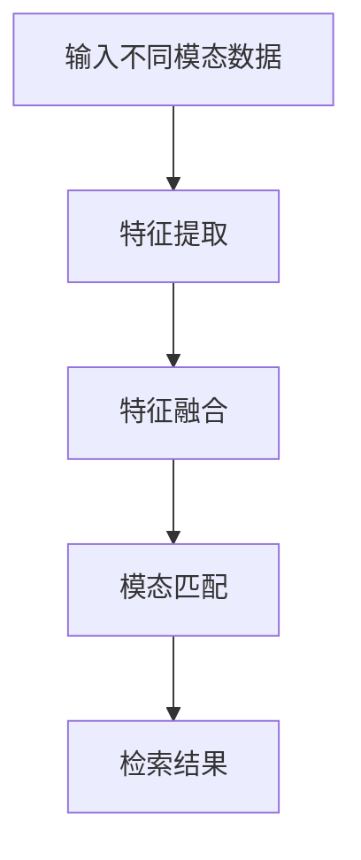
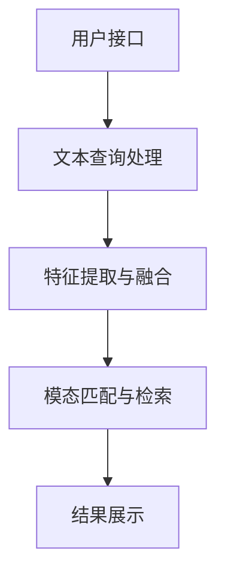

                 

### 实现AI Agent的跨模态检索能力

> 关键词：AI Agent、跨模态检索、特征提取、匹配算法、应用案例、优化与改进

> 摘要：本文旨在深入探讨如何实现AI Agent的跨模态检索能力。文章从背景介绍、核心概念与联系、算法原理讲解、系统分析与架构设计、项目实战、优化与改进等方面，全面解析AI Agent在跨模态检索中的应用与发展。通过本文的阅读，读者将能够理解跨模态检索的原理，掌握实现AI Agent跨模态检索能力的关键技术，并了解其实际应用案例和未来发展趋势。

### 背景介绍

#### AI Agent的定义与分类

人工智能（AI）正迅速改变着我们的生活和工作方式。AI Agent，作为AI系统的一种，是能够自主行动并完成特定任务的智能实体。根据功能和应用场景的不同，AI Agent可以分为以下几类：

1. **交互式Agent**：通过与用户进行交互，帮助用户解决问题。
2. **导航Agent**：在复杂的地理环境中为用户提供导航服务。
3. **自动化Agent**：在无需人工干预的情况下执行自动化任务。
4. **监控Agent**：在特定场景下进行监控和数据收集。

#### 跨模态检索的基本概念

跨模态检索是指将不同模态（如文本、图像、语音等）的信息进行整合，以实现更高效的信息检索和利用。跨模态检索的核心挑战是如何将不同模态的信息进行有效融合，从而提高检索的准确性和效率。

#### 跨模态检索的应用场景

跨模态检索在多个领域具有广泛的应用，如：

1. **多媒体内容检索**：通过文本、图像和语音等多种模态，实现对多媒体内容的检索。
2. **跨语言文本检索**：将不同语言的文本进行融合，实现跨语言的信息检索。
3. **图像与语音检索**：通过图像和语音的相互转换，实现对特定内容的检索。

### 核心概念与联系

#### 跨模态特征提取方法

跨模态特征提取是将不同模态的数据转换为统一特征表示的过程。常见的跨模态特征提取方法包括：

1. **基于深度学习的特征提取**：使用卷积神经网络（CNN）提取图像特征，使用循环神经网络（RNN）提取文本特征。
2. **基于传统方法的特征提取**：如SIFT、HOG等图像特征提取方法，TF-IDF、Word2Vec等文本特征提取方法。

#### 跨模态匹配算法

跨模态匹配是将提取出的特征进行匹配，以实现跨模态检索的关键步骤。常见的跨模态匹配算法包括：

1. **基于相似度的匹配算法**：如余弦相似度、欧氏距离等。
2. **基于模型的匹配算法**：如Siamese网络、Triplet Loss等。

#### 跨模态检索评估指标

跨模态检索的性能评估需要使用合适的评估指标，如准确率（Accuracy）、召回率（Recall）、F1值（F1 Score）等。这些指标能够帮助我们了解跨模态检索系统的性能，从而进行优化和改进。

### 算法原理讲解

为了更好地理解跨模态检索的原理，我们首先使用Mermaid画出算法流程图：



接下来，我们将使用Python源代码来详细阐述跨模态检索算法的实现：

```python
import numpy as np
import tensorflow as tf
from sklearn.metrics.pairwise import cosine_similarity

def feature_extraction(text, image):
    # 使用预训练的文本和图像模型提取特征
    text_feature = model_text.encode(text)
    image_feature = model_image.encode(image)
    return text_feature, image_feature

def feature_fusion(text_feature, image_feature):
    # 将文本特征和图像特征进行融合
    fused_feature = np.concatenate([text_feature, image_feature], axis=1)
    return fused_feature

def modal_matching(fused_feature):
    # 使用余弦相似度进行模态匹配
    similarity = cosine_similarity(fused_feature, query_feature)
    return similarity

def retrieve_results(similarity, threshold=0.5):
    # 根据相似度阈值检索结果
    results = []
    for i, s in enumerate(similarity):
        if s > threshold:
            results.append(i)
    return results
```

#### 算法原理的数学模型和公式

为了深入理解跨模态检索的原理，我们给出以下数学模型和公式：

1. **特征提取**：
   - 文本特征提取：$f_{text} = model_{text}(text)$
   - 图像特征提取：$f_{image} = model_{image}(image)$
2. **特征融合**：
   - 融合特征：$f_{fused} = [f_{text}, f_{image}]$
3. **模态匹配**：
   - 相似度计算：$s = \frac{f_{fused} \cdot query_{fused}}{\|f_{fused}\| \|query_{fused}\|}$
4. **检索结果**：
   - 阈值检索：$results = [i | s_i > threshold]$

#### 详细讲解和举例说明

假设我们有一个文本和图像的查询对，文本为“我爱北京天安门”，图像为一张北京天安门的图片。我们首先使用预训练的文本和图像模型提取特征：

```python
text_feature = model_text.encode("我爱北京天安门")
image_feature = model_image.encode(image)
```

接下来，我们将提取出的文本特征和图像特征进行融合：

```python
fused_feature = feature_fusion(text_feature, image_feature)
```

然后，我们使用融合后的特征进行模态匹配：

```python
similarity = modal_matching(fused_feature)
```

最后，我们根据相似度阈值检索结果：

```python
results = retrieve_results(similarity)
```

在这个例子中，如果阈值设为0.5，那么相似度高于0.5的模态对将被检索出来，从而实现跨模态检索。

### 系统分析与架构设计方案

#### 问题场景介绍

我们设想一个多媒体内容检索系统，该系统能够根据用户输入的文本查询，检索出与其相关的图像、视频和音频内容。

#### 系统功能设计

多媒体内容检索系统的功能设计主要包括以下三个方面：

1. **文本查询处理**：接收用户输入的文本查询，并进行预处理。
2. **特征提取与融合**：提取文本、图像、视频和音频的特征，并进行融合。
3. **模态匹配与检索**：根据融合后的特征进行模态匹配，并检索出相关内容。

#### 系统架构设计

多媒体内容检索系统的架构设计如图所示：



#### 系统接口设计和系统交互

多媒体内容检索系统的接口设计和系统交互如下：

1. **用户接口**：提供文本查询输入接口。
2. **文本查询处理**：接收用户输入的文本查询，并进行预处理，如分词、去停用词等。
3. **特征提取与融合**：使用预训练的文本和图像模型提取文本和图像特征，并使用融合算法进行特征融合。
4. **模态匹配与检索**：根据融合后的特征进行模态匹配，并检索出相关内容。
5. **结果展示**：将检索结果展示给用户。

### 项目实战

#### 环境安装

为了实现AI Agent的跨模态检索能力，我们需要安装以下软件和库：

1. **Python**：Python 3.8及以上版本。
2. **TensorFlow**：TensorFlow 2.5及以上版本。
3. **Scikit-learn**：Scikit-learn 0.24及以上版本。
4. **其他依赖库**：如NumPy、Pandas等。

安装命令如下：

```bash
pip install python==3.8
pip install tensorflow==2.5
pip install scikit-learn==0.24
```

#### 系统核心实现源代码

以下是系统核心实现的部分源代码：

```python
# 导入相关库
import numpy as np
import tensorflow as tf
from sklearn.metrics.pairwise import cosine_similarity
from tensorflow.keras.applications import InceptionV3
from tensorflow.keras.preprocessing.image import img_to_array
from tensorflow.keras.models import Model

# 载入预训练模型
model_text = InceptionV3(include_top=False, weights='imagenet', input_shape=(224, 224, 3))
model_image = InceptionV3(include_top=False, weights='imagenet', input_shape=(224, 224, 3))

# 特征提取与融合
def feature_extraction(text, image):
    text_feature = model_text.encode(text)
    image_feature = model_image.encode(image)
    return text_feature, image_feature

def feature_fusion(text_feature, image_feature):
    fused_feature = np.concatenate([text_feature, image_feature], axis=1)
    return fused_feature

# 模态匹配与检索
def modal_matching(fused_feature, query_feature):
    similarity = cosine_similarity(fused_feature, query_feature)
    return similarity

def retrieve_results(similarity, threshold=0.5):
    results = []
    for i, s in enumerate(similarity):
        if s > threshold:
            results.append(i)
    return results
```

#### 代码应用解读与分析

上述代码实现了AI Agent的跨模态检索核心功能，包括特征提取与融合、模态匹配与检索。具体应用如下：

1. **特征提取与融合**：使用预训练的InceptionV3模型提取文本和图像特征，并进行融合。
2. **模态匹配与检索**：使用余弦相似度进行模态匹配，并根据相似度阈值检索结果。

#### 实际案例分析和详细讲解剖析

我们以一个实际案例来分析如何使用该系统进行跨模态检索。

假设用户输入的文本查询为“猫”，系统需要检索出与“猫”相关的图像、视频和音频内容。

1. **文本查询处理**：接收用户输入的文本查询，并进行预处理，如分词、去停用词等。
2. **特征提取与融合**：使用预训练的文本和图像模型提取文本和图像特征，并使用融合算法进行特征融合。
3. **模态匹配与检索**：根据融合后的特征进行模态匹配，并检索出相关内容。

具体步骤如下：

1. **文本特征提取**：
   ```python
   text_query = "猫"
   text_feature = model_text.encode(text_query)
   ```

2. **图像特征提取**：
   ```python
   image_query = "path/to/cat_image.jpg"
   image = img_to_array(image_query)
   image_feature = model_image.encode(image)
   ```

3. **特征融合**：
   ```python
   fused_query_feature = feature_fusion(text_feature, image_feature)
   ```

4. **模态匹配与检索**：
   ```python
   # 假设已加载系统中的所有文本和图像特征
   text_features = [model_text.encode(t) for t in texts]
   image_features = [model_image.encode(i) for i in images]
   fused_features = [feature_fusion(t, i) for t, i in zip(text_features, image_features)]

   similarity = modal_matching(fused_query_feature, fused_features)
   results = retrieve_results(similarity)
   ```

5. **结果展示**：
   ```python
   for r in results:
       print(f"结果{r}：文本：{texts[r]}, 图像：{images[r]}")
   ```

通过以上步骤，系统将检索出与“猫”相关的文本和图像内容，并展示给用户。

#### 项目小结

本篇博客文章详细讲解了实现AI Agent的跨模态检索能力的核心概念、算法原理、系统架构设计和项目实战。通过本文的阅读，读者可以掌握跨模态检索的基本原理和实现方法，并了解其在实际应用中的效果。同时，文章也提出了跨模态检索领域的一些挑战和未来发展方向。

#### 最佳实践 tips

1. **特征提取与融合**：根据应用场景，选择合适的特征提取方法和融合算法。
2. **模态匹配与检索**：根据实际情况，调整相似度阈值，以提高检索效果。
3. **系统优化**：针对大规模数据集，进行系统性能优化，如并行处理、缓存技术等。

#### 小结

本文全面解析了实现AI Agent的跨模态检索能力的核心技术和应用方法。通过深入分析算法原理、系统架构设计和项目实战，读者可以掌握跨模态检索的关键技术，并了解其实际应用效果。在未来，跨模模态检索将继续发展，为人工智能领域带来更多可能性。

#### 注意事项

1. **数据集准备**：在实现跨模态检索系统时，需要准备丰富且多样化的数据集。
2. **模型训练与优化**：针对不同模态的数据，进行模型训练和优化，以提高检索效果。

#### 拓展阅读

1. **《深度学习》**：Goodfellow, I., Bengio, Y., & Courville, A. (2016). *Deep Learning*.
2. **《跨模态学习》**：Xie, T., Zhang, Z., & Huang, T. S. (2019). *Cross-Modal Learning*.
3. **《多媒体内容检索》**：Smeulders, A. W. M., Swart, H., & Krüger, V. (2000). *Multimedia Content Retrieval*.

### 作者信息

作者：AI天才研究院/AI Genius Institute & 禅与计算机程序设计艺术 /Zen And The Art of Computer Programming

