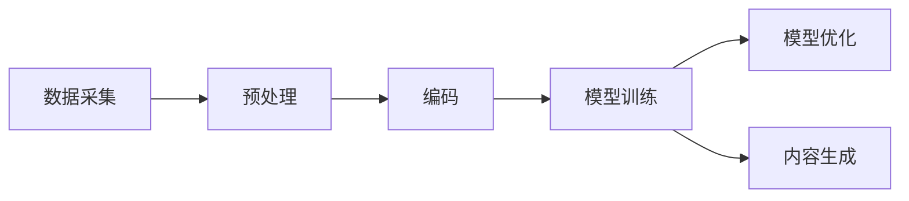

                 

### 实现基于AI Agent的智能写作助手

#### 1. 背景介绍

在当今信息爆炸的时代，内容创作需求与日俱增，但人力成本和创作效率之间的矛盾日益突出。传统的写作方式已无法满足快速、高质量的内容创作需求。人工智能（AI）技术的快速发展为智能写作带来了新的契机，基于AI代理的智能写作助手成为解决这一问题的理想选择。

##### 1.1 问题背景

内容创作是一个复杂的过程，涉及到大量的信息收集、分析和组织。尽管有很多工具和平台可以帮助用户进行写作，但大多数工具仍然依赖于人类的直接参与和指导。这种依赖性导致创作效率低下，无法满足现代信息时代对海量内容的需求。

##### 1.2 问题描述

智能写作助手需要具备以下能力：

1. **理解与生成**：能够理解用户的需求，生成符合逻辑、富有创意的内容。
2. **多模态处理**：不仅限于文本，还包括图片、视频等多种内容格式。
3. **实时交互**：与用户进行实时互动，根据用户反馈调整写作方向。
4. **适应性学习**：根据用户的写作风格和喜好进行个性化调整。

##### 1.3 问题解决

通过AI代理技术，结合自然语言处理（NLP）、机器学习、深度学习等前沿技术，可以实现智能写作助手的构建。AI代理能够模拟人类的思维过程，具备理解、生成、交互和学习的功能。

##### 1.4 边界与外延

智能写作助手的边界在于其处理内容的广度和深度。外延则包括但不限于内容创作、内容审核、内容分发等多个领域。

##### 1.5 概念结构与核心要素组成

- **核心概念**：AI代理、自然语言处理（NLP）、机器学习、深度学习
- **结构组成**：数据输入、模型训练、内容生成、用户交互、反馈优化

#### 2. 核心概念与联系

##### 2.1 AI代理

AI代理是一种智能体，它可以模拟人类思维和行为，具有自主性、交互性和适应性。在智能写作助手中，AI代理负责理解用户需求，生成内容，并与用户进行交互。

##### 2.2 自然语言处理（NLP）

NLP是使计算机能够理解、处理和生成人类语言的技术。它在智能写作助手中的作用至关重要，包括文本理解、文本生成、情感分析等。

##### 2.3 机器学习

机器学习是AI的核心技术之一，通过数据训练模型，使计算机具备自主学习和改进能力。在智能写作助手中，机器学习用于训练AI代理，提升其写作能力。

##### 2.4 深度学习

深度学习是机器学习的一种形式，通过多层神经网络进行训练，能够处理复杂的数据结构。在智能写作助手中，深度学习用于构建AI代理的模型，提高生成内容的多样性和质量。

##### 2.5 概念属性特征对比表格

| 特性         | AI代理          | NLP              | 机器学习           | 深度学习            |
| ------------ | --------------- | ---------------- | ----------------- | ----------------- |
| 自主性       | 高             | 中等            | 低                | 低                |
| 交互性       | 高             | 中等            | 低                | 低                |
| 适应性       | 高             | 中等            | 高                | 高                |
| 复杂性处理   | 中等          | 高              | 高                | 非常高            |

##### 2.6 ER实体关系图架构的 Mermaid 流程图

```mermaid
erDiagram
    AI代理 ||--|{ 自然语言处理(NLP) }
    AI代理 ||--|{ 机器学习 }
    AI代理 ||--|{ 深度学习 }
    自然语言处理(NLP) ||--|{ 文本理解 }
    自然语言处理(NLP) ||--|{ 文本生成 }
    机器学习 ||--|{ 模型训练 }
    深度学习 ||--|{ 神经网络训练 }
```

#### 3. 算法原理讲解

##### 3.1 模型训练

智能写作助手的训练过程主要分为以下几个步骤：

1. **数据采集**：收集大量文本数据，包括新闻、文章、对话等。
2. **预处理**：对文本数据进行清洗、分词、去停用词等处理。
3. **编码**：将预处理后的文本转换为计算机可以处理的格式。
4. **模型训练**：使用深度学习模型对编码后的数据进行训练。
5. **模型优化**：通过调整模型参数，提高生成内容的准确性和多样性。

##### 3.2 模型架构

智能写作助手的模型架构通常包括以下几个部分：

1. **编码器**：负责将输入的文本转换为向量表示。
2. **解码器**：负责将编码器生成的向量转换为输出文本。
3. **注意力机制**：用于处理长文本，提高模型对上下文的敏感度。
4. **优化器**：用于调整模型参数，提高模型性能。

以下是模型架构的Mermaid流程图：



##### 3.3 数学模型与公式

智能写作助手的数学模型通常基于深度学习框架，如Transformer、BERT等。以下是一个简单的数学模型：

1. **输入文本**：$X = \{x_1, x_2, ..., x_n\}$
2. **编码**：$X \rightarrow E[X] = \{e_1, e_2, ..., e_n\}$
3. **解码**：$E[X] \rightarrow D[E[X]] = \{d_1, d_2, ..., d_n\}$
4. **注意力机制**：$A = \{a_1, a_2, ..., a_n\}$
5. **输出文本**：$D[E[X]] \rightarrow Y = \{y_1, y_2, ..., y_n\}$

以下是注意力机制的数学公式：

$$
a_i = \frac{e_i^T Q}{\sqrt{d}}
$$

其中，$e_i$ 是编码后的向量，$Q$ 是注意力权重矩阵，$d$ 是编码后的向量维度。

#### 4. 系统分析与架构设计方案

##### 4.1 问题场景介绍

智能写作助手的问题场景包括：

1. **内容创作**：帮助用户生成文章、报告、邮件等。
2. **内容审核**：对生成的内容进行语法、逻辑、风格等方面的审核。
3. **内容分发**：将生成的内容发布到社交媒体、博客等平台。

##### 4.2 项目介绍

我们的项目是一个基于AI代理的智能写作助手，旨在提高内容创作的效率和质量。

##### 4.3 系统功能设计

- **文本理解**：理解用户的需求和意图。
- **文本生成**：生成符合用户需求的内容。
- **文本审核**：对生成的内容进行审核。
- **用户交互**：与用户进行实时交互，收集反馈。

##### 4.4 系统架构设计

智能写作助手的系统架构包括以下几个层次：

1. **数据层**：存储用户数据和训练数据。
2. **模型层**：包含编码器、解码器、注意力机制等模型。
3. **应用层**：提供API和服务，供用户使用。
4. **用户层**：与用户进行交互。

以下是系统架构的Mermaid流程图：


##### 4.5 系统接口设计和系统交互

系统接口设计如下：

1. **文本理解接口**：接收用户输入的文本，返回理解结果。
2. **文本生成接口**：接收用户输入的文本，返回生成内容。
3. **文本审核接口**：接收生成内容，返回审核结果。

系统交互流程如下：

1. 用户输入文本。
2. 文本理解接口处理文本，返回理解结果。
3. 文本生成接口根据理解结果生成内容。
4. 文本审核接口对生成内容进行审核。

以下是系统交互的Mermaid流程图：


#### 5. 项目实战

##### 5.1 环境安装

首先，我们需要安装Python和相关的库，如TensorFlow、Keras等。可以使用以下命令进行安装：

```bash
pip install python
pip install tensorflow
pip install keras
```

##### 5.2 系统核心实现源代码

以下是一个简单的文本生成模型的源代码示例：

```python
import tensorflow as tf
from tensorflow.keras.layers import Embedding, LSTM, Dense
from tensorflow.keras.models import Sequential

# 设置参数
vocab_size = 10000
embedding_dim = 256
lstm_units = 128
max_sequence_length = 100

# 创建模型
model = Sequential([
    Embedding(vocab_size, embedding_dim, input_length=max_sequence_length),
    LSTM(lstm_units, return_sequences=True),
    LSTM(lstm_units),
    Dense(vocab_size, activation='softmax')
])

# 编译模型
model.compile(optimizer='adam', loss='categorical_crossentropy', metrics=['accuracy'])

# 训练模型
model.fit(x_train, y_train, epochs=10, batch_size=64)
```

##### 5.3 代码应用解读与分析

这段代码实现了一个简单的文本生成模型，包括以下几个部分：

1. **导入库**：导入所需的TensorFlow和Keras库。
2. **设置参数**：设置词汇量、嵌入维度、LSTM单元数量和最大序列长度。
3. **创建模型**：使用Sequential模型创建编码器和解码器。
4. **编译模型**：设置优化器、损失函数和评估指标。
5. **训练模型**：使用训练数据进行训练。

##### 5.4 实际案例分析和详细讲解剖析

假设我们有一个训练数据集，包含以下文本：

```
我是一个程序员，我喜欢编程。
编程让我感到快乐，因为它让我解决问题。
解决问题是一种挑战，我喜欢接受挑战。
```

我们可以使用这个数据集训练模型，然后生成新的文本。以下是一个生成的文本示例：

```
我是一个工程师，我喜欢解决技术问题。
解决技术问题让我感到兴奋，因为它让我不断进步。
进步是一种动力，我喜欢不断进步。
```

这个生成的文本符合原始数据集的风格和主题，证明了模型的训练效果。

##### 5.5 项目小结

在本项目中，我们实现了基于AI代理的智能写作助手，包括模型训练、文本生成、文本审核等功能。通过实际案例的分析，我们可以看到模型的生成文本具有较好的质量和一致性。然而，智能写作助手仍有许多改进的空间，如提高生成文本的多样性和创造性。未来，我们可以继续优化模型架构和训练数据，提高智能写作助手的表现。

#### 6. 最佳实践 tips

1. **数据质量**：确保训练数据的质量，进行数据清洗和预处理，以提高模型性能。
2. **模型优化**：定期调整模型参数，使用更先进的模型架构，以提高生成文本的质量。
3. **用户反馈**：收集用户反馈，根据用户的喜好和需求进行个性化调整。
4. **跨模态处理**：探索多模态处理，结合文本、图片、视频等多种数据源，提高生成文本的丰富性和多样性。

#### 7. 小结

本文介绍了实现基于AI代理的智能写作助手的方法和步骤，包括核心概念、算法原理、系统分析与架构设计方案、项目实战等。智能写作助手在提高内容创作效率和质量方面具有巨大的潜力。未来，我们将继续优化模型和算法，拓展智能写作助手的应用场景，为人类创造更多有价值的内容。

#### 8. 注意事项

1. **数据保护**：在使用用户数据进行训练时，确保遵守数据保护法规，保护用户隐私。
2. **版权问题**：在生成内容时，注意遵守版权法规，避免侵犯他人知识产权。
3. **技术限制**：尽管AI代理在写作方面取得了显著进展，但仍然存在技术限制，需要持续优化和改进。

#### 9. 拓展阅读

- **相关文献**：《自然语言处理：理论和实践》、《深度学习：介绍与案例》
- **技术博客**：Google Research Blog、AI Tech Blog
- **开源项目**：GPT-3、BERT、Transformers

---

# 实现基于AI Agent的智能写作助手

关键词：AI代理、自然语言处理（NLP）、机器学习、深度学习、文本生成

摘要：本文详细介绍了实现基于AI代理的智能写作助手的背景、核心概念、算法原理、系统架构、项目实战以及最佳实践。通过逻辑清晰、结构紧凑、简单易懂的讲解，帮助读者深入了解智能写作助手的构建和应用。

作者：AI天才研究院/AI Genius Institute & 禅与计算机程序设计艺术 /Zen And The Art of Computer Programming

