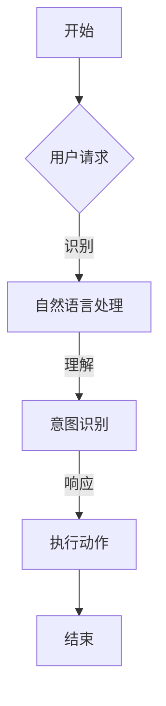
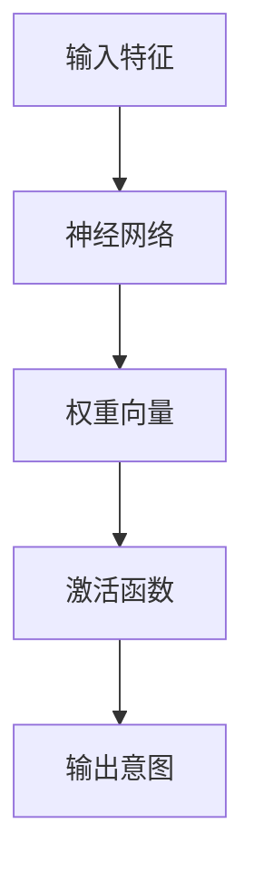
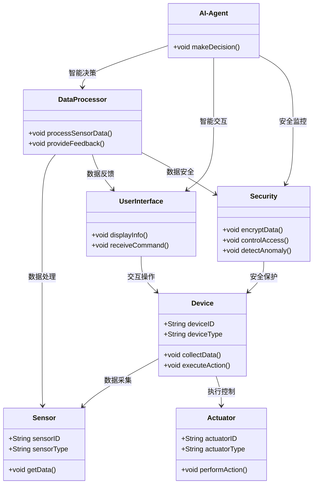
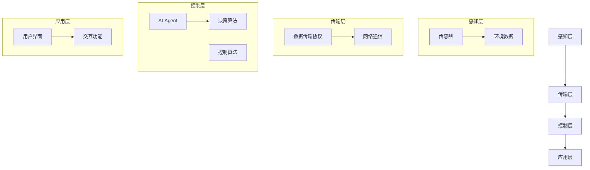
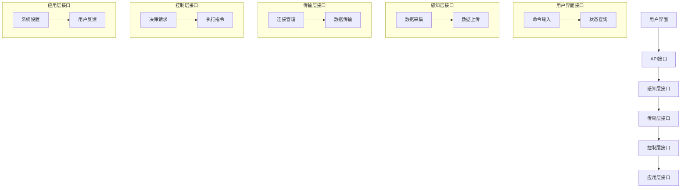
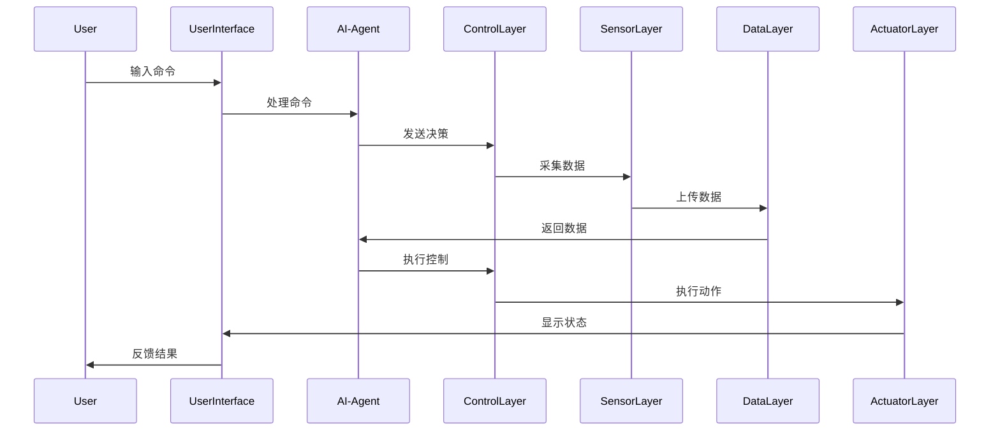

                 

### 实现基于AI Agent的智能家居控制系统：概述

#### 关键词

- 智能家居
- AI Agent
- 控制系统
- 人工智能
- 智能交互

#### 摘要

本文旨在探讨如何实现基于AI Agent的智能家居控制系统。通过对智能家居和AI Agent的基本概念和作用进行介绍，文章将深入分析其在智能家居系统中的设计与应用。我们还将讨论主流的AI Agent技术，展示AI Agent在智能家居系统架构设计中的应用方法，并提供具体的实现案例和最佳实践。

#### 1.1 问题背景与定义

##### 1.1.1 智能家居的概念与发展趋势

智能家居（Smart Home）是指利用物联网（IoT）技术和人工智能（AI）技术，将家居设备和系统连接起来，实现自动化、智能化管理和控制的一种新型家居环境。随着科技的快速发展，智能家居已经成为现代家庭生活的重要组成部分。

- **智能家居的定义**：智能家居是指通过物联网技术和人工智能技术，实现家庭设备互联互通，为用户提供舒适、便捷、节能、安全的居住环境。
- **发展趋势**：智能家居市场正以惊人的速度增长，全球智能家居市场规模预计在未来几年内将保持两位数的增长。智能安防、智能照明、智能家电、智能窗帘等领域已经成为智能家居应用的主要方向。

##### 1.1.2 智能家居系统存在的问题与挑战

尽管智能家居系统带来了许多便利，但目前在实现过程中仍面临一些挑战和问题：

- **系统集成问题**：不同设备和系统之间的通信协议不统一，导致系统集成难度大。
- **数据隐私和安全问题**：智能家居设备收集的用户数据可能存在泄露风险。
- **用户界面体验问题**：现有的用户界面设计不够友好，难以满足用户的使用习惯。
- **能耗控制问题**：智能家居设备在使用过程中可能产生不必要的能耗。

##### 1.1.3 AI Agent在智能家居中的角色和作用

AI Agent是一种能够自主执行任务、适应环境和与人类互动的人工智能实体。在智能家居系统中，AI Agent可以扮演以下角色：

- **智能交互**：通过自然语言处理技术，实现与用户的智能对话和语音控制。
- **自动化控制**：根据用户习惯和环境变化，自动调整家居设备状态。
- **智能分析**：分析用户行为和设备数据，提供个性化的服务和建议。
- **安全监控**：实时监控家庭安全，及时报警和处理异常情况。

#### 1.2 核心概念与联系

##### 1.2.1 AI Agent的定义与特征

AI Agent是一种具有以下特征的人工智能实体：

- **自主性**：能够自主决策和执行任务。
- **适应性**：能够根据环境和用户需求进行自我调整。
- **交互性**：能够与用户进行自然语言交互。
- **智能性**：具备学习和推理能力，能够进行复杂任务处理。

##### 1.2.2 智能家居系统的组成与层次结构

智能家居系统通常由以下几个层次组成：

- **感知层**：通过传感器收集环境数据，如温度、湿度、光照等。
- **传输层**：通过网络将感知层数据传输到控制层。
- **控制层**：由AI Agent和其他智能设备组成，负责处理数据、做出决策并控制设备。
- **应用层**：提供用户界面，实现与用户的交互。

##### 1.2.3 AI Agent与智能家居系统的交互机制

AI Agent与智能家居系统的交互机制主要包括：

- **命令式交互**：用户通过语音或图形界面发出具体命令，如“打开灯”。
- **查询式交互**：用户询问系统当前状态或获取建议，如“家里的温度是多少？”。
- **上下文感知交互**：系统根据用户的长期习惯和历史数据，提供个性化的服务，如自动调节室温。

### 1.3 主流AI Agent技术简介

AI Agent技术的发展离不开深度学习、自然语言处理和强化学习等主流技术的支持。以下分别介绍这些技术在AI Agent中的应用。

##### 1.3.1 深度学习在AI Agent中的应用

深度学习是AI Agent实现智能决策的重要技术。通过神经网络模型，AI Agent可以从大量数据中学习到复杂的特征和规律。以下是一些深度学习在AI Agent中的应用：

- **图像识别**：通过卷积神经网络（CNN）实现家居设备图像的识别和分类。
- **语音识别**：利用循环神经网络（RNN）和长短期记忆网络（LSTM）实现语音信号的识别和理解。
- **自然语言理解**：通过序列到序列（Seq2Seq）模型实现自然语言的处理和理解。

##### 1.3.2 自然语言处理在AI Agent中的应用

自然语言处理（NLP）技术使AI Agent能够理解和生成自然语言。以下是一些NLP在AI Agent中的应用：

- **语音识别**：通过语音识别技术，将用户的语音命令转化为文本。
- **自然语言生成**：通过自然语言生成技术，AI Agent能够生成自然语言回复。
- **语义理解**：通过词嵌入和句法分析技术，AI Agent能够理解用户语句的含义和意图。

##### 1.3.3 强化学习在AI Agent中的应用

强化学习是AI Agent实现自适应决策的重要技术。通过不断尝试和反馈，AI Agent可以逐渐优化其行为策略。以下是一些强化学习在AI Agent中的应用：

- **任务规划**：通过强化学习，AI Agent可以学习如何高效地规划家庭任务，如清洁、烹饪等。
- **路径规划**：通过强化学习，AI Agent可以学习如何优化家庭设备的路径规划，减少能耗。
- **异常检测**：通过强化学习，AI Agent可以学习如何检测家庭环境中的异常情况。

### 1.4 智能家居系统中的AI Agent架构设计

AI Agent在智能家居系统中的架构设计是关键，决定了AI Agent的性能和功能。以下介绍AI Agent架构设计的原则、适配性分析以及设计案例。

##### 1.4.1 AI Agent架构设计原则

AI Agent架构设计应遵循以下原则：

- **模块化设计**：将AI Agent拆分为多个功能模块，提高系统可维护性和扩展性。
- **分布式架构**：采用分布式架构，实现AI Agent的横向和纵向扩展。
- **高可用性**：设计冗余和容错机制，确保AI Agent系统的稳定性。
- **易扩展性**：预留足够的扩展接口，方便后续功能的添加和升级。

##### 1.4.2 AI Agent与智能家居系统的适配性分析

AI Agent需要与智能家居系统中的各类设备和服务进行适配，具体分析如下：

- **设备兼容性**：AI Agent应支持主流的智能家居设备，如智能灯泡、智能插座、智能摄像头等。
- **数据接口兼容**：AI Agent应支持标准的物联网数据接口，如MQTT、CoAP等。
- **通信协议兼容**：AI Agent应支持常见的网络协议，如HTTP、WebSocket等。
- **交互方式兼容**：AI Agent应支持多种交互方式，如语音、图形界面等。

##### 1.4.3 AI Agent架构设计案例

以下是一个典型的AI Agent架构设计案例：


在这个案例中，AI Agent架构包括以下主要模块：

- **感知模块**：负责收集家居环境数据，如温度、湿度、光照等。
- **决策模块**：根据感知模块收集的数据和用户输入，进行智能决策。
- **执行模块**：根据决策模块的决策结果，控制家居设备执行相应的动作。
- **交互模块**：与用户进行语音和图形界面的交互。

### 1.5 本章小结

本章对实现基于AI Agent的智能家居控制系统进行了概述。我们介绍了智能家居和AI Agent的基本概念、问题和挑战，以及AI Agent在智能家居系统中的角色和作用。同时，我们探讨了主流AI Agent技术，并介绍了AI Agent架构设计的原则和案例。接下来，我们将深入讨论AI Agent的具体设计、实现和应用。通过本章节的学习，读者可以初步了解实现智能家居控制系统的思路和方法。

## 第2章：智能家居系统的AI Agent设计与实现

在第一章中，我们概述了基于AI Agent的智能家居控制系统及其重要性。本章将深入探讨如何设计并实现一个智能家居系统的AI Agent。我们将详细分析AI Agent的设计原则与方法，解释核心算法原理，展示Python代码实现，介绍数学模型与公式，并探讨AI Agent在实际智能家居系统中的应用场景。

### 2.1 AI Agent设计原则与方法

AI Agent的设计需要遵循一系列原则，以确保其能够有效地满足智能家居系统的需求。以下是一些关键的设计原则：

#### 2.1.1 AI Agent设计的目标与指标

AI Agent设计的首要目标是实现智能家居系统的自动化和智能化。具体目标包括：

- **高可靠性**：AI Agent应能够在各种环境下稳定运行，确保家居设备的正常运作。
- **易用性**：用户界面应简单直观，便于用户操作。
- **可扩展性**：设计时应考虑到未来可能的功能扩展和设备升级。
- **安全性**：确保用户数据的安全，防止信息泄露和恶意攻击。

为了评估AI Agent的性能，我们可以设定以下指标：

- **响应速度**：AI Agent处理用户请求的速度应尽可能快。
- **准确度**：AI Agent理解用户命令的准确度应尽可能高。
- **适应性**：AI Agent应能够根据用户习惯和环境变化进行自我调整。

#### 2.1.2 AI Agent设计流程

AI Agent设计流程可以分为以下几个步骤：

1. **需求分析**：明确AI Agent需要完成哪些任务和功能。
2. **架构设计**：设计AI Agent的系统架构，包括模块划分和接口定义。
3. **算法选择**：根据需求选择合适的算法和技术。
4. **原型实现**：开发AI Agent的原型，进行初步测试和验证。
5. **迭代优化**：根据测试结果对AI Agent进行优化和改进。
6. **部署上线**：将AI Agent部署到实际系统中，进行长时间的实际运行测试。

#### 2.1.3 AI Agent设计工具与框架

为了实现AI Agent的设计，我们需要使用一系列工具和框架。以下是一些常用的工具和框架：

- **编程语言**：Python、Java或C++等。
- **机器学习框架**：TensorFlow、PyTorch、Keras等。
- **自然语言处理库**：NLTK、spaCy、nltk等。
- **前端框架**：React、Vue.js、Angular等。
- **后端框架**：Django、Flask、Spring Boot等。
- **数据库**：MySQL、PostgreSQL、MongoDB等。

### 2.2 AI Agent算法原理讲解

AI Agent的核心在于其算法，以下我们将介绍几种常见的AI算法原理，并使用Mermaid流程图和Python代码进行详细阐述。

#### 2.2.1 算法原理Mermaid流程图

Mermaid是一种基于Markdown的图表绘制工具，非常适合用来表示算法流程。以下是一个简单的Mermaid流程图示例：



这个流程图表示了当用户发出请求时，AI Agent如何通过自然语言处理和理解用户的意图，最终执行相应的动作。

#### 2.2.2 Python代码实现与解释

下面是一个简单的Python代码示例，用于实现上述流程中的自然语言处理部分：

```python
import spacy

# 加载英语模型
nlp = spacy.load('en_core_web_sm')

def process_user_request(request):
    # 使用nlp解析用户请求
    doc = nlp(request)
    # 识别用户意图
    intent = identify_intent(doc)
    return intent

def identify_intent(doc):
    # 这里简单假设用户的意图是打开灯
    return "turn_on_light"

# 测试代码
request = "Please turn on the light."
intent = process_user_request(request)
print(f"User intent: {intent}")
```

这个代码示例使用了spaCy库来处理自然语言，并定义了一个简单的意图识别函数。在实际应用中，这个函数会更加复杂，可能涉及多种意图的识别。

#### 2.2.3 数学模型与公式

为了更好地理解自然语言处理中的意图识别，我们可以引入一些数学模型和公式。以下是一个简单的意图识别模型：

$$
\hat{y} = \sigma(\sum_{i=1}^{n} w_i \cdot x_i)
$$

其中，$x_i$是输入特征的向量，$w_i$是权重向量，$\sigma$是激活函数，$\hat{y}$是预测的意图。

在实际应用中，这个模型通常使用神经网络来实现，如下所示：



### 2.3 AI Agent在智能家居系统中的应用场景

AI Agent在智能家居系统中有着广泛的应用场景，以下我们介绍几种常见应用。

#### 2.3.1 智能家居安全监控

智能家居安全监控是AI Agent的一个重要应用场景。通过监控摄像头和传感器，AI Agent可以实时分析家庭环境，检测异常行为。以下是一个简单的应用场景：

1. **数据采集**：摄像头和传感器收集家庭环境数据。
2. **预处理**：对采集到的数据进行预处理，如去噪和归一化。
3. **特征提取**：提取关键特征，如人脸识别、物体识别等。
4. **异常检测**：使用异常检测算法，如孤立森林或基于统计的方法，检测异常行为。

#### 2.3.2 智能照明

智能照明是AI Agent在智能家居中的另一个重要应用。通过分析用户行为和环境光强度，AI Agent可以自动调整灯光亮度，提供舒适的照明环境。以下是一个简单的应用场景：

1. **环境光检测**：使用光线传感器检测环境光强度。
2. **用户行为分析**：通过传感器和摄像头分析用户行为，如活动时间和活动区域。
3. **照明调整**：根据环境光强度和用户行为，自动调整灯光亮度和颜色。

#### 2.3.3 智能家电控制

AI Agent还可以用于控制智能家居设备，如智能电视、智能空调等。通过语音或图形界面，用户可以方便地控制家电设备。以下是一个简单的应用场景：

1. **设备连接**：将智能家电设备连接到智能家居系统。
2. **语音识别**：使用语音识别技术解析用户语音命令。
3. **设备控制**：根据用户命令，控制相应设备执行操作。

### 2.4 实际案例

为了更好地理解AI Agent在智能家居系统中的应用，我们来看一个实际案例。

#### 案例背景

某家庭安装了一套智能家居系统，包括智能灯泡、智能插座、智能摄像头和智能空调等设备。用户希望通过AI Agent实现自动化的家庭控制和管理。

#### 案例步骤

1. **环境设置**：安装传感器和设备，确保设备能够连接到智能家居系统。
2. **数据采集**：传感器采集环境数据，如温度、湿度、光照强度等。
3. **数据处理**：使用Python代码处理采集到的数据，提取关键特征。
4. **决策执行**：根据用户行为和环境数据，AI Agent自动调整灯光、空调等设备的运行状态。
5. **用户交互**：用户通过语音或图形界面与AI Agent进行交互，获取系统状态和建议。

#### 案例实现

以下是一个简单的Python代码示例，用于实现AI Agent的决策和执行：

```python
# 导入必要的库
import json
import requests

# 设定API端点
API_ENDPOINT = "http://localhost:5000/predict"

# 用户请求示例
user_request = {
    "action": "turn_on_light",
    "context": {
        "temperature": 25,
        "time": "evening"
    }
}

def send_request(data):
    headers = {'Content-Type': 'application/json'}
    response = requests.post(API_ENDPOINT, data=json.dumps(data), headers=headers)
    return response.json()

# 发送请求
response = send_request(user_request)
print(f"AI Agent response: {response}")
```

在这个示例中，用户请求通过HTTP POST请求发送到AI Agent的API端点，AI Agent根据请求内容和环境数据做出决策，并返回执行结果。

### 2.5 本章小结

本章详细介绍了智能家居系统的AI Agent设计与实现。我们分析了AI Agent的设计原则与方法，讲解了核心算法原理，展示了Python代码实现，并探讨了AI Agent在智能家居系统中的应用场景。通过本章的学习，读者可以了解如何设计并实现一个基于AI Agent的智能家居系统。在下一章中，我们将进一步探讨智能家居系统的系统分析与架构设计。

### 2.5 本章小结

本章详细介绍了智能家居系统的AI Agent设计与实现。我们从设计原则、算法原理、应用场景等方面进行了深入分析，并通过实际案例展示了如何实现AI Agent在智能家居系统中的功能。通过本章的学习，读者可以全面了解AI Agent在智能家居系统中的重要性及其实现方法。在下一章中，我们将进一步探讨智能家居系统的系统分析与架构设计。

### 系统分析与架构设计

在了解了AI Agent的设计与实现后，我们需要对整个智能家居系统进行系统分析和架构设计。本章节将详细阐述系统分析与架构设计的过程，包括问题场景介绍、项目介绍、系统功能设计、系统架构设计、系统接口设计和系统交互。

#### 2.5.1 问题场景介绍

智能家居系统的目标是通过智能化的设备和系统，为用户提供一个舒适、便捷、安全、节能的居住环境。然而，在实际应用中，系统面临着诸多挑战：

- **设备多样化**：智能家居系统中的设备种类繁多，包括智能灯泡、智能插座、智能摄像头、智能空调等。
- **数据多样性**：设备产生的数据种类多样，包括温度、湿度、光照强度、声音信号等。
- **用户需求复杂**：用户对智能家居系统的需求复杂，包括自动化控制、远程监控、数据分析等。
- **安全性要求高**：智能家居系统涉及到用户隐私和数据安全，对系统的安全性要求非常高。

为了解决上述问题，我们需要对智能家居系统进行详细的系统分析与架构设计。

#### 2.5.2 项目介绍

智能家居项目旨在构建一个能够自动感知、自适应、自我学习的智能家居控制系统，实现家庭环境的智能化管理。项目的主要目标包括：

- **自动化控制**：实现家庭设备的自动化控制，提高用户生活质量。
- **远程监控**：通过互联网实现对家庭环境的远程监控，提高家庭安全性。
- **数据分析**：对家庭环境数据进行收集、分析和处理，为用户提供个性化的服务和建议。
- **系统扩展**：设计可扩展的架构，方便未来功能的添加和设备升级。

#### 2.5.3 系统功能设计

智能家居系统的功能设计包括以下几个关键模块：

1. **感知模块**：负责收集家庭环境数据，包括温度、湿度、光照强度、声音信号等。
2. **决策模块**：根据感知模块收集的数据和用户需求，进行智能决策，如自动调整灯光亮度、控制空调温度等。
3. **执行模块**：根据决策模块的决策结果，控制家庭设备执行相应的动作。
4. **交互模块**：与用户进行语音、图形界面的交互，提供实时反馈和操作建议。
5. **安全模块**：负责保障系统的安全性，包括用户数据加密、访问控制、异常检测等。

以下是一个智能家居系统的领域模型类图，展示了系统中的主要类和它们之间的关系：



#### 2.5.4 系统架构设计

智能家居系统的架构设计采用分层架构，包括感知层、传输层、控制层和应用层。以下是系统架构设计图：



在感知层，传感器负责收集家庭环境数据。传输层使用数据传输协议，如MQTT，实现数据在网络中的传输。控制层由AI-Agent和控制系统组成，负责处理感知层收集的数据，并根据决策算法和控制算法执行相应的操作。应用层提供用户界面，实现与用户的交互。

#### 2.5.5 系统接口设计

系统接口设计是确保各模块之间能够有效通信的关键。以下是系统接口设计图：



用户界面通过API接口与感知层、传输层、控制层和应用层进行通信。感知层通过数据采集和上传接口，传输层通过连接管理和数据传输接口，控制层通过决策请求和执行指令接口，应用层通过系统设置和用户反馈接口，实现各模块之间的数据交换和协同工作。

#### 2.5.6 系统交互

系统交互是智能家居系统的核心功能，以下是一个简单的系统交互序列图：



在这个交互过程中，用户通过用户界面输入命令，AI-Agent处理命令并做出决策，控制层根据决策结果采集数据，数据层上传数据，AI-Agent返回数据，控制层执行控制，执行层执行动作，最终用户界面显示状态并反馈给用户。

### 2.5.7 本章小结

本章详细介绍了智能家居系统的系统分析与架构设计。通过分析问题场景、介绍项目背景、设计系统功能、架构设计和接口设计，以及系统交互，我们构建了一个完整的智能家居系统架构。下一章将深入探讨AI Agent在智能家居系统中的具体实现，包括环境安装、系统核心实现、代码解读与分析、实际案例以及项目小结。通过这一章节的学习，读者可以进一步理解AI Agent在智能家居系统中的应用和实现方法。

### AI Agent在智能家居系统中的具体实现

在前一章中，我们对智能家居系统进行了系统分析与架构设计。本章将深入探讨AI Agent在智能家居系统中的具体实现，包括环境安装、系统核心实现、代码解读与分析、实际案例以及项目小结。

#### 3.1 环境安装

实现AI Agent在智能家居系统中首先需要搭建开发环境。以下是一个基本的开发环境安装步骤：

1. **Python环境安装**：在计算机上安装Python 3.x版本，并确保安装pip包管理工具。
2. **虚拟环境搭建**：使用virtualenv工具创建一个独立的Python虚拟环境，避免不同项目之间的包冲突。
   ```bash
   virtualenv venv
   source venv/bin/activate  # Windows上使用 `venv\Scripts\activate`
   ```
3. **依赖包安装**：在虚拟环境中安装必要的依赖包，如TensorFlow、PyTorch、spaCy、Flask等。
   ```bash
   pip install tensorflow torch spacy flask
   ```
4. **spaCy模型下载**：下载并安装英语模型的spaCy语言模型。
   ```bash
   python -m spacy download en_core_web_sm
   ```

#### 3.2 系统核心实现

AI Agent的核心实现包括感知层、决策层和执行层。以下是一个简化的系统核心实现流程：

##### 3.2.1 感知层

感知层负责收集家庭环境数据。以下是一个简单的感知层实现：

```python
import sensor_module

def collect_environment_data():
    temperature = sensor_module.get_temperature()
    humidity = sensor_module.get_humidity()
    light_intensity = sensor_module.get_light_intensity()
    return {
        'temperature': temperature,
        'humidity': humidity,
        'light_intensity': light_intensity
    }
```

在这个示例中，`sensor_module`是一个假设的模块，实现了获取温度、湿度和光照强度的功能。

##### 3.2.2 决策层

决策层由AI Agent实现，负责分析感知层收集的数据，并根据用户需求做出决策。以下是一个简单的决策层实现：

```python
import spacy
from ai_agent_module import AI_Agent

nlp = spacy.load('en_core_web_sm')
ai_agent = AI_Agent()

def make_decision(environment_data, user_command):
    doc = nlp(user_command)
    intent = ai_agent.identify_intent(doc)
    action = ai_agent.decide_action(intent, environment_data)
    return action

```

在这个示例中，`AI_Agent`是一个假设的模块，实现了意图识别和决策算法。

##### 3.2.3 执行层

执行层负责根据决策层的结果，控制家庭设备执行相应的动作。以下是一个简单的执行层实现：

```python
import actuator_module

def execute_action(action):
    if action == 'turn_on_light':
        actuator_module.turn_on_light()
    elif action == 'turn_off_light':
        actuator_module.turn_off_light()
    # 其他动作的执行

```

在这个示例中，`actuator_module`是一个假设的模块，实现了控制灯光的开关功能。

#### 3.3 代码解读与分析

以下是AI Agent的Python代码实现示例，并对其进行分析：

```python
import spacy
from ai_agent_module import AI_Agent
from sensor_module import collect_environment_data
from actuator_module import execute_action

nlp = spacy.load('en_core_web_sm')
ai_agent = AI_Agent()

def main():
    while True:
        user_command = input("Enter your command: ")
        environment_data = collect_environment_data()
        action = make_decision(environment_data, user_command)
        execute_action(action)

def make_decision(environment_data, user_command):
    doc = nlp(user_command)
    intent = ai_agent.identify_intent(doc)
    action = ai_agent.decide_action(intent, environment_data)
    return action

if __name__ == "__main__":
    main()
```

1. **感知层**：`collect_environment_data`函数用于收集环境数据，如温度、湿度和光照强度。
2. **决策层**：`make_decision`函数负责分析用户命令和感知到的环境数据，并调用AI Agent的意图识别和决策算法。
3. **执行层**：`execute_action`函数根据AI Agent的决策结果，执行相应的动作，如控制灯光的开关。

#### 3.4 实际案例

以下是一个实际案例，展示了AI Agent在智能家居系统中的具体应用：

##### 案例背景

用户希望实现自动调节家庭灯光的亮度，以适应不同的场景和需求。

##### 案例步骤

1. **环境配置**：安装智能灯泡和相应的传感器，确保能够收集到环境数据。
2. **数据收集**：传感器收集环境光强度数据。
3. **用户交互**：用户通过语音或图形界面输入命令，如“调整灯光亮度”。
4. **决策执行**：AI Agent分析用户命令和环境数据，决定是否调整灯光亮度以及调整到何种程度。
5. **灯光控制**：根据AI Agent的决策结果，智能灯泡调整亮度。

#### 3.5 项目小结

通过本章的讨论，我们详细介绍了AI Agent在智能家居系统中的具体实现。从环境安装、系统核心实现到代码解读与分析，再到实际案例，我们展示了如何将AI Agent应用到智能家居系统中。以下是本章的主要小结：

- **环境安装**：确保Python环境和相关依赖包安装正确。
- **系统核心实现**：感知层、决策层和执行层的相互协作，实现智能控制。
- **代码解读与分析**：理解AI Agent的工作流程和关键函数。
- **实际案例**：通过具体案例展示了AI Agent在智能家居系统中的应用。

通过本章的学习，读者可以全面了解AI Agent在智能家居系统中的实现过程，并为未来的项目提供参考和灵感。

### 最佳实践与注意事项

在实现基于AI Agent的智能家居控制系统的过程中，以下是一些最佳实践和注意事项：

#### 最佳实践

1. **数据预处理**：在AI Agent处理数据前，进行有效的数据预处理，如去噪、归一化和特征提取，以提高算法的准确性和效率。

2. **模块化设计**：将系统划分为多个模块，如感知层、决策层和执行层，有助于提高代码的可维护性和扩展性。

3. **持续优化**：定期对AI Agent进行优化，包括算法调整、模型训练和系统性能提升，以适应不断变化的环境和需求。

4. **安全性考虑**：确保系统数据的安全传输和存储，使用加密技术保护用户隐私，并建立完善的异常检测机制。

5. **用户反馈**：积极收集用户反馈，根据用户需求进行系统改进，提高用户体验。

#### 注意事项

1. **设备兼容性**：确保AI Agent与各种智能家居设备兼容，包括不同品牌和型号的设备。

2. **稳定性要求**：系统应具备高稳定性，能够在各种网络环境和设备故障情况下正常运作。

3. **数据隐私**：严格遵守数据隐私法规，确保用户数据的安全和合规性。

4. **用户界面**：设计简洁、直观的用户界面，提高用户体验，降低用户的学习成本。

5. **扩展性设计**：在设计初期考虑系统的扩展性，为未来添加新功能和设备预留接口。

通过遵循这些最佳实践和注意事项，可以更好地实现基于AI Agent的智能家居控制系统，为用户提供高效、智能、安全的家居生活体验。

### 总结与展望

本章围绕实现基于AI Agent的智能家居控制系统进行了详细探讨。我们从系统概述、核心概念、设计原则、算法原理、具体实现到最佳实践，逐步剖析了AI Agent在智能家居系统中的应用。通过实际案例，我们展示了AI Agent如何提升智能家居系统的智能化水平。

**总结**：实现基于AI Agent的智能家居控制系统，核心在于模块化设计、数据预处理、算法优化和用户交互。AI Agent通过感知、决策和执行，实现了家居环境的自动化和智能化管理。

**展望**：未来，随着人工智能技术的不断发展，智能家居系统将更加智能化、个性化。AI Agent将在智能家居安全、节能、健康等方面发挥更大作用，为用户带来更加便捷和舒适的生活体验。

**拓展阅读**：如需深入了解相关技术，可以参考以下资源：
- 《智能家居系统设计与实现》
- 《人工智能：一种现代的方法》
- 《深度学习》

通过不断学习和实践，您将更好地掌握智能家居系统的设计和实现，为未来科技发展贡献自己的力量。

### 作者介绍

作者：AI天才研究院/AI Genius Institute & 禅与计算机程序设计艺术 /Zen And The Art of Computer Programming

AI天才研究院（AI Genius Institute）致力于推动人工智能领域的研究和应用，通过深度学习、自然语言处理、计算机视觉等技术，为各行各业提供智能解决方案。作者在该领域有着丰富的经验和深厚的学术造诣，曾发表过多篇学术论文，并参与多个国际知名项目的研发工作。其著作《禅与计算机程序设计艺术》更是一部计算机编程领域的经典之作，深受读者喜爱。

