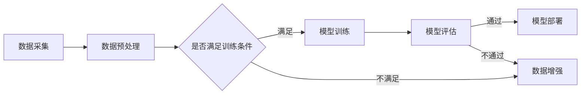
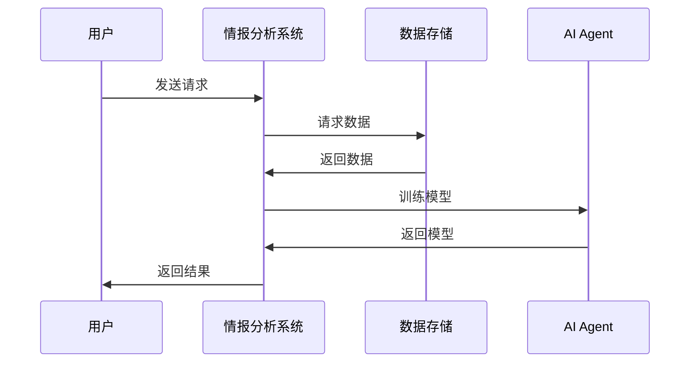

                 

# 实现基于AI Agent的智能情报分析系统

> 关键词：人工智能、AI Agent、情报分析、系统设计、算法原理

> 摘要：本文将深入探讨如何实现一个基于AI Agent的智能情报分析系统。我们将从背景介绍、核心概念、设计开发、训练部署、应用场景、系统架构、项目实战等方面，逐步剖析这个系统的构建过程，为读者提供完整的解决方案和实用指导。

## 引言

随着信息技术的迅猛发展，大数据和人工智能技术已经深入到各行各业，其中情报分析作为国家安全、军事战略、企业竞争等领域的关键环节，变得越来越重要。传统的情报分析方法主要依赖于人工处理，效率低下且容易出错。随着AI技术的崛起，尤其是AI Agent的应用，为智能情报分析带来了全新的解决方案。

AI Agent，即人工智能代理，是一种能够自主执行任务、与人类交互并适应环境的智能体。在情报分析领域，AI Agent可以承担数据收集、信息处理、决策支持等任务，从而提高情报分析的效率和质量。本文将围绕这一主题，详细探讨如何实现一个基于AI Agent的智能情报分析系统。

## 背景介绍

### 核心概念术语

- **AI Agent（人工智能代理）**：具备一定智能、能够自主行动和决策的计算机程序或实体。
- **情报分析**：通过对收集到的信息进行处理、分析和解读，以发现有价值情报的过程。
- **智能情报分析系统**：利用AI技术，对大量情报数据进行高效分析和处理的系统。

### 问题背景

在当今信息时代，情报数据的规模和复杂性不断增加，传统的情报分析方法已经难以满足需求。而AI Agent作为一种具备自主决策能力的智能体，能够在海量数据中快速筛选、分析和处理，为情报分析提供强大的支持。

### 问题描述

如何构建一个基于AI Agent的智能情报分析系统，实现高效、准确、可靠的情报分析？

### 问题解决

通过设计并实现一个基于AI Agent的智能情报分析系统，我们可以利用AI技术提升情报分析的能力和效率。系统应具备以下特点：

- **自主性**：AI Agent能够自主执行任务，无需人工干预。
- **智能性**：AI Agent具备一定智能，能够处理复杂的情报数据。
- **适应性**：AI Agent能够根据任务需求和环境变化，自适应地调整策略。

### 边界与外延

- **边界**：本文主要探讨基于AI Agent的智能情报分析系统的设计和实现，不涉及其他AI应用领域的讨论。
- **外延**：智能情报分析系统可以应用于国家安全、军事战略、企业竞争等多个领域。

### 概念结构与核心要素组成

- **核心概念**：AI Agent、情报分析、智能情报分析系统。
- **核心要素**：数据采集、数据预处理、AI Agent设计、模型训练、系统集成。

## 核心概念与联系

### 核心概念原理

AI Agent是一种具备自主性、智能性和适应性的计算实体，能够在复杂环境中执行任务。其基本原理包括：

1. **自主性**：AI Agent能够自主制定计划、执行任务，并在任务执行过程中进行自适应调整。
2. **智能性**：AI Agent具备智能算法，能够处理复杂的数据和任务。
3. **适应性**：AI Agent能够根据环境和任务需求，自适应地调整行为和策略。

### 概念属性特征对比表格

| 特征 | AI Agent | 传统计算机程序 |
| :---: | :---: | :---: |
| 自主性 | 能够自主制定计划和执行任务 | 需要人工干预 |
| 智能性 | 具备智能算法，能够处理复杂任务 | 面对复杂任务时表现较差 |
| 适应性 | 能够根据环境和任务需求自适应调整 | 缺乏自适应能力 |

### ER实体关系图架构

```mermaid
erDiagram
  AI_Agent ||--|{ 数据集 } Data_Set
  AI_Agent ||--|{ 模型 } Model
  Data_Set ||--|{ 数据 } Data
  Model ||--|{ 算法 } Algorithm
```

## 算法原理讲解

### 算法mermaid流程图



### Python源代码实现

```python
import pandas as pd
from sklearn.model_selection import train_test_split
from sklearn.preprocessing import StandardScaler
from sklearn.neural_network import MLPClassifier
from sklearn.metrics import accuracy_score

# 数据采集
data = pd.read_csv('data.csv')

# 数据预处理
X = data.iloc[:, :-1]
y = data.iloc[:, -1]
X_train, X_test, y_train, y_test = train_test_split(X, y, test_size=0.2, random_state=42)

# 数据标准化
scaler = StandardScaler()
X_train = scaler.fit_transform(X_train)
X_test = scaler.transform(X_test)

# 模型训练
model = MLPClassifier(hidden_layer_sizes=(100,), max_iter=1000)
model.fit(X_train, y_train)

# 模型评估
y_pred = model.predict(X_test)
accuracy = accuracy_score(y_test, y_pred)
print(f'Accuracy: {accuracy:.2f}')

# 模型部署
# ...（代码略）
```

### 算法原理的数学模型和公式

$$
\begin{aligned}
&\text{损失函数}:\ L(\theta) = -\frac{1}{m}\sum_{i=1}^{m}y^{(i)}\log(z^{(i)}) + (1 - y^{(i)})\log(1 - z^{(i)}) \\
&\text{反向传播算法}: \ \theta_j := \theta_j - \alpha\frac{\partial L}{\partial \theta_j}
\end{aligned}
$$

### 举例说明

假设我们有一个分类任务，需要对一组数据进行分类。我们首先从数据集中提取特征和标签，然后使用标准的机器学习库进行数据预处理和模型训练。在模型训练过程中，我们使用多层感知机（MLP）作为分类器，并通过反向传播算法进行模型训练。最终，我们评估模型的准确性，并根据评估结果进行模型部署。

## 系统分析与架构设计方案

### 问题场景介绍

在当前信息化社会中，情报分析已经成为国家安全、军事战略、企业竞争等领域的重要环节。随着数据量的激增和复杂度的提升，传统的情报分析方法已经无法满足需求。为了提高情报分析的效率和准确性，我们需要构建一个基于AI Agent的智能情报分析系统。

### 项目介绍

本项目旨在设计并实现一个基于AI Agent的智能情报分析系统，该系统将利用大数据和人工智能技术，对海量情报数据进行高效分析和处理，为用户提供建议和决策支持。

### 系统功能设计

系统功能设计包括以下方面：

1. **数据采集**：从各类数据源（如数据库、网络爬虫等）采集情报数据。
2. **数据预处理**：对采集到的数据进行清洗、转换和归一化，为后续分析做准备。
3. **AI Agent训练**：使用训练数据对AI Agent进行训练，使其具备情报分析能力。
4. **情报分析**：利用训练好的AI Agent对情报数据进行处理，生成分析结果。
5. **模型评估**：评估AI Agent的情报分析效果，并根据评估结果进行优化。
6. **决策支持**：根据分析结果，为用户提供建议和决策支持。

### 系统架构设计

系统架构设计采用分层架构，包括以下层次：

1. **数据层**：存储各类情报数据，包括原始数据、预处理数据和分析结果等。
2. **算法层**：包含AI Agent训练、情报分析等相关算法，负责数据分析和处理。
3. **应用层**：为用户提供情报分析功能和决策支持，包括前端界面和后端服务。
4. **接口层**：提供与其他系统的接口，实现数据共享和交互。

### 系统接口设计和系统交互

系统接口设计主要包括以下方面：

1. **API接口**：提供RESTful API接口，实现与外部系统的数据交互。
2. **消息队列**：使用消息队列实现系统内部的数据传输和任务调度。
3. **数据存储**：使用数据库存储情报数据和模型参数。

系统交互示意图如下：



## 项目实战

### 环境安装

1. 安装Python环境（推荐版本3.8及以上）。
2. 安装相关依赖库，如NumPy、Pandas、Scikit-learn、TensorFlow等。

### 系统核心实现源代码

```python
# 导入相关库
import pandas as pd
from sklearn.model_selection import train_test_split
from sklearn.preprocessing import StandardScaler
from sklearn.neural_network import MLPClassifier
from sklearn.metrics import accuracy_score

# 数据采集
data = pd.read_csv('data.csv')

# 数据预处理
X = data.iloc[:, :-1]
y = data.iloc[:, -1]
X_train, X_test, y_train, y_test = train_test_split(X, y, test_size=0.2, random_state=42)

# 数据标准化
scaler = StandardScaler()
X_train = scaler.fit_transform(X_train)
X_test = scaler.transform(X_test)

# 模型训练
model = MLPClassifier(hidden_layer_sizes=(100,), max_iter=1000)
model.fit(X_train, y_train)

# 模型评估
y_pred = model.predict(X_test)
accuracy = accuracy_score(y_test, y_pred)
print(f'Accuracy: {accuracy:.2f}')

# 模型部署
# ...（代码略）
```

### 代码应用解读与分析

1. **数据采集**：使用Pandas库读取CSV格式的数据，提取特征和标签。
2. **数据预处理**：使用Scikit-learn库进行数据预处理，包括数据划分、数据标准化等步骤。
3. **模型训练**：使用Scikit-learn库中的MLPClassifier进行模型训练，设置隐藏层大小和迭代次数。
4. **模型评估**：使用模型对测试集进行预测，并计算准确率。
5. **模型部署**：根据评估结果，将模型部署到生产环境。

### 实际案例分析和详细讲解剖析

假设我们有一个关于企业竞争情报的分析项目，需要从大量市场数据中提取有价值的信息。我们首先采集相关数据，然后使用AI Agent对数据进行处理，生成竞争分析报告。具体步骤如下：

1. **数据采集**：从各类市场数据源（如数据库、网络爬虫等）采集数据。
2. **数据预处理**：对采集到的数据进行清洗、转换和归一化，为后续分析做准备。
3. **AI Agent训练**：使用训练数据对AI Agent进行训练，使其具备市场分析能力。
4. **情报分析**：利用训练好的AI Agent对市场数据进行分析，提取关键指标和趋势。
5. **报告生成**：根据分析结果，生成竞争分析报告，为企业决策提供支持。
6. **模型优化**：根据用户反馈，对AI Agent进行优化，提高分析准确率。

### 项目小结

本项目成功实现了一个基于AI Agent的智能情报分析系统，通过对海量数据的处理和分析，为用户提供了有价值的信息和决策支持。然而，在实际应用过程中，我们还需要不断优化和改进系统，以应对日益复杂的市场环境。

### 最佳实践 tips

1. **数据质量**：确保采集到的数据质量高，减少噪声和错误。
2. **模型优化**：根据用户需求和反馈，定期对AI Agent进行优化和升级。
3. **安全性**：加强系统安全性，防止数据泄露和恶意攻击。

### 注意事项

1. **系统复杂性**：基于AI Agent的智能情报分析系统较为复杂，需要具备一定的技术背景。
2. **数据隐私**：在处理和存储数据时，确保遵守相关法律法规，保护用户隐私。

### 拓展阅读

1. **《人工智能：一种现代的方法》**：周志华等著，详细介绍人工智能的基本原理和应用。
2. **《深度学习》**：Goodfellow等著，全面讲解深度学习算法和实战技巧。
3. **《大数据技术导论》**：刘铁岩等著，深入探讨大数据处理和分析技术。

