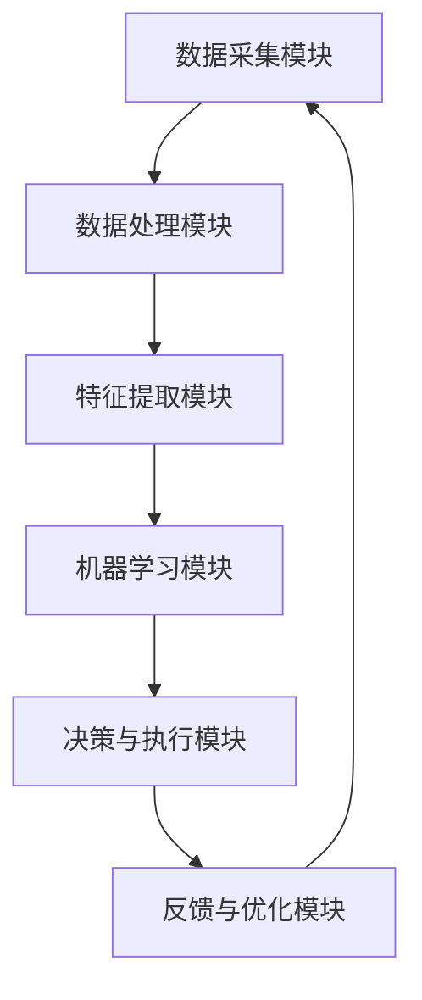
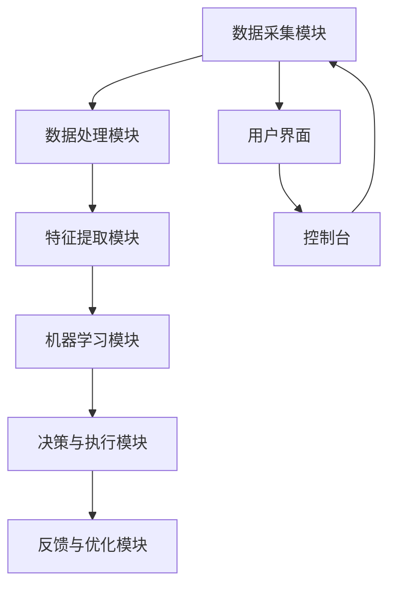
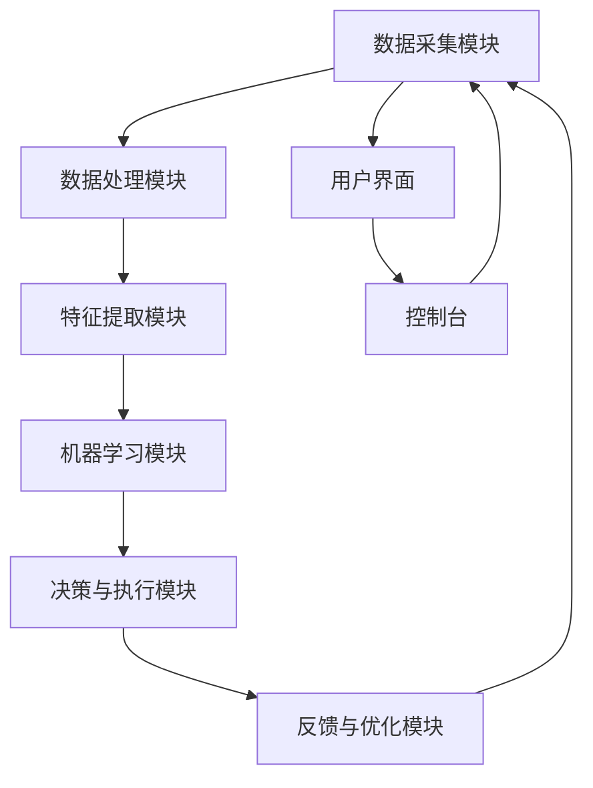

                 

## 实现基于AI Agent的智能质量控制系统

### 关键词
- AI Agent
- 质量控制
- 强化学习
- 监督学习
- 混合学习

### 摘要
本文将探讨如何利用AI Agent实现智能质量控制系统。首先，我们介绍AI Agent的基本概念、特点及其与传统算法的区别。接着，详细阐述常见的AI算法原理，包括强化学习、监督学习和无监督学习。然后，我们转向质量控制系统，讨论其基本概念、重要性、过程和方法，以及面临的挑战。在此背景下，我们介绍AI Agent在质量控制中的具体应用，并设计一个基于AI Agent的智能质量控制系统。最后，通过一个实际项目实战，展示系统环境安装、核心实现和案例分析，提供最佳实践和项目小结。文章旨在为读者提供全面、系统的智能质量控制解决方案。

## 第一部分：引言与背景

### 1.1 问题背景

在当今高度竞争的商业环境中，产品质量是企业的核心竞争力之一。无论是制造业、服务业，还是高科技行业，质量控制都是一个关键环节。然而，随着生产规模的不断扩大和产品种类的日益增多，传统质量控制方法面临着巨大挑战。首先，人工检测存在效率低下、准确度不高的问题；其次，复杂的质量控制过程往往需要大量的时间和资源；最后，对于一些潜在的质量问题，传统方法难以提前发现和预防。

为了解决这些问题，人工智能（AI）技术的引入显得尤为重要。AI Agent作为一种具有自主性和自适应性的智能系统，能够通过对环境数据的感知和不断学习，实现高效、准确的质量控制。与传统方法相比，AI Agent具有以下几个显著优势：

1. **高效性**：AI Agent能够快速处理大量数据，实时检测产品质量，大大提高了质量控制效率。
2. **准确性**：通过机器学习和深度学习技术，AI Agent能够精确识别产品质量问题，减少误判和漏检。
3. **自主性**：AI Agent能够自主决策和执行任务，无需人工干预，降低了人工成本和操作风险。
4. **适应性**：AI Agent能够根据环境变化和产品质量变化，自动调整检测策略和参数，提高检测准确性。

然而，实现一个基于AI Agent的智能质量控制系统并非易事，它涉及多个技术领域的综合应用，包括数据采集、机器学习、深度学习、传感器技术和系统集成等。本文将详细探讨这些技术，并设计一个完整的解决方案。

### 1.2 问题描述

在传统的质量控制过程中，主要依赖于人工检测和实验室分析。这种方法虽然在一定程度上能够保证产品的质量，但其效率和准确性都存在较大的提升空间。具体来说，问题描述可以概括为以下几点：

1. **检测效率低**：人工检测需要大量的人力投入，检测速度慢，难以满足大规模生产的需求。
2. **准确度不高**：人工检测存在主观因素，容易产生误判和漏检，影响产品质量的稳定性。
3. **无法实时监控**：传统方法无法实时获取产品的质量数据，难以对潜在的质量问题进行及时预警和纠正。
4. **环境适应性差**：不同生产环境和条件对质量控制的要求不同，传统方法难以适应多种复杂环境。

这些问题使得传统质量控制方法在应对现代工业生产的高要求时显得力不从心。为了解决这些问题，迫切需要一种能够高效、准确、实时监控产品质量的智能质量控制系统。

### 1.3 问题解决

基于上述问题描述，我们可以从以下几个方面着手解决问题：

1. **引入AI Agent**：通过引入AI Agent，可以实现自动化、智能化的质量控制。AI Agent能够通过传感器收集数据，利用机器学习算法对数据进行处理和分析，从而实现对产品质量的实时监控和智能决策。
2. **高效数据处理**：AI Agent能够高效处理大量数据，实时分析产品质量，快速响应生产过程中的变化，提高检测效率和准确性。
3. **自适应检测策略**：AI Agent可以根据环境变化和产品质量变化，自动调整检测策略和参数，提高检测的针对性和准确性。
4. **实时监控与预警**：通过AI Agent的实时监控功能，可以及时发现潜在的质量问题，并发出预警，提前采取措施进行纠正，防止质量问题扩大化。

综上所述，引入AI Agent是实现智能质量控制的关键。AI Agent不仅能够提高质量控制的效率，还能显著提升其准确性和适应性，为现代工业生产提供强有力的技术支持。

### 1.4 边界与外延

在实现基于AI Agent的智能质量控制系统时，我们需要明确其边界和适用范围，以确保系统的有效性和适用性。

#### 边界

1. **应用场景**：智能质量控制系统主要应用于需要高精度、高效率质量检测的制造业、高科技行业以及需要严格质量控制的服务业等领域。
2. **技术要求**：系统需要具备强大的数据处理能力、自适应学习能力和实时监控能力，同时需要与生产环境紧密集成。
3. **数据来源**：系统的数据来源主要包括传感器采集的数据、生产过程数据以及产品质量检测数据等。

#### 外延

1. **扩展应用**：智能质量控制系统不仅可以用于单一产品的质量控制，还可以应用于生产线整体质量控制，实现对产品质量的全面监控和管理。
2. **集成与兼容**：系统需要具备良好的集成与兼容性，能够与现有的生产管理系统、质量管理系统等无缝对接，提高整体系统的协同效应。
3. **未来趋势**：随着AI技术的不断发展，智能质量控制系统将不断优化和升级，未来可能实现更多智能化、自动化的功能，如无人仓库、无人生产线等。

通过明确系统的边界与外延，我们可以更好地理解其适用范围和技术要求，从而为实现智能质量控制系统提供明确的方向和目标。

### 1.5 概念结构与核心要素组成

为了深入理解基于AI Agent的智能质量控制系统，我们需要详细分析其概念结构与核心要素组成。智能质量控制系统由以下几个关键组成部分构成：

1. **AI Agent**：AI Agent是系统的核心，负责感知环境数据、处理数据、做出决策和执行任务。其主要功能包括数据采集、特征提取、模式识别和智能决策等。
2. **传感器网络**：传感器网络是AI Agent感知环境数据的重要组成部分，包括温度传感器、湿度传感器、压力传感器、图像传感器等。这些传感器能够实时采集生产过程中的各种数据，为AI Agent提供必要的信息输入。
3. **数据处理模块**：数据处理模块负责对传感器采集的数据进行处理和分析，包括数据清洗、归一化、特征提取和降维等。该模块的核心任务是提取有用的信息，为AI Agent提供准确的输入。
4. **机器学习算法**：机器学习算法是AI Agent的核心组成部分，负责对采集到的数据进行建模和学习。常见的机器学习算法包括监督学习、无监督学习和强化学习等。这些算法能够帮助AI Agent从数据中学习到质量控制的规律和模式。
5. **决策与执行模块**：决策与执行模块负责根据AI Agent的决策结果，对生产过程进行实时调整和控制。该模块的核心功能包括异常检测、预警处理、调整生产参数等。
6. **系统集成与接口**：系统集成与接口负责将智能质量控制系统与生产管理系统、质量管理系统等现有系统进行集成，实现数据共享和协同工作。通过良好的接口设计，系统能够无缝对接其他系统，提高整体生产效率。

这些核心要素相互关联、协同工作，共同构成了一个完整的智能质量控制系统。通过AI Agent的智能决策和实时调整，系统能够高效、准确地对产品质量进行监控和控制，提高生产过程的稳定性和产品质量的可靠性。

### 1.6 总结与展望

通过本文的介绍，我们了解了基于AI Agent的智能质量控制系统的重要性、优势以及具体实现方法。这种系统不仅能够提高质量控制的效率和准确性，还能够实现对生产过程的实时监控和智能决策。在未来，随着AI技术的不断发展和应用，智能质量控制系统将在更多领域发挥作用，为现代工业生产提供更加智能、高效的解决方案。我们期待在未来看到更多基于AI Agent的智能质量控制系统在实际生产中的应用，为提高产品质量和降低生产成本做出更大的贡献。

## 第二部分：AI Agent基础

### 2.1 AI Agent概述

AI Agent，即人工智能代理，是一种具有自主性、适应性和协作能力的智能系统，能够在复杂环境中进行感知、决策和行动。AI Agent是人工智能领域中的一个重要研究方向，其应用范围广泛，包括自动驾驶、智能助手、机器人控制等。在本节中，我们将详细探讨AI Agent的定义、特点及其与传统算法的区别。

#### AI Agent的定义

AI Agent可以被视为一种模拟人类智能行为的软件实体，它具备以下基本特征：

1. **感知能力**：AI Agent能够通过传感器或接口从环境中获取信息，如图像、声音、温度等。
2. **决策能力**：AI Agent能够根据感知到的信息进行分析和处理，并做出相应的决策。
3. **行动能力**：AI Agent能够根据决策结果执行具体的任务，如移动、调整参数等。

在技术层面，AI Agent通常由三个主要部分组成：

- **感知器**：负责收集环境数据。
- **决策器**：负责分析感知器收集的数据，并生成决策。
- **行动器**：负责执行决策器生成的决策。

这种结构使得AI Agent能够在复杂动态的环境中自主运行和完成任务。

#### AI Agent的特点

AI Agent具有以下几个显著特点，使其在复杂任务中表现出色：

1. **自主性**：AI Agent具有自我管理和决策能力，能够独立执行任务，无需人为干预。这种自主性使得AI Agent能够在无人监控的环境下长时间运行，提高工作效率。

2. **适应性**：AI Agent能够根据环境变化和任务需求动态调整自己的行为。例如，在自动驾驶领域，AI Agent需要能够适应不同路况、天气条件和交通环境。

3. **协作性**：AI Agent不仅能够独立完成任务，还能够与其他AI Agent或人类协作，实现更复杂的任务。在多机器人系统中，多个AI Agent可以通过协作完成任务，提高系统整体效率。

4. **学习性**：AI Agent具备学习能力，可以通过不断学习和经验积累，提高任务执行效率和准确性。通过机器学习和深度学习技术，AI Agent能够从数据中学习规律，优化自身性能。

#### AI Agent与传统算法的区别

传统算法，如流程控制算法、决策树和神经网络等，通常是基于预先定义的规则或模型进行操作。而AI Agent与传统算法有以下几个主要区别：

1. **自主性**：传统算法通常需要人为设定规则和参数，而AI Agent能够在没有人为干预的情况下自主运行和完成任务。

2. **适应性**：传统算法在面临复杂多变的环境时，往往难以适应。而AI Agent通过学习和适应，能够更好地应对环境变化。

3. **协作性**：传统算法通常独立运行，难以实现多任务协作。而AI Agent能够与其他AI Agent或人类协作，完成更复杂的任务。

4. **学习性**：传统算法无法通过经验学习优化自身性能，而AI Agent可以通过机器学习和深度学习技术不断改进。

通过以上分析，我们可以看出，AI Agent具有自主性、适应性、协作性和学习性等显著特点，使其在复杂任务中表现出色。这些特点使得AI Agent成为实现智能化解决方案的重要工具。

### 2.2 AI Agent的核心概念与联系

在深入理解AI Agent的工作原理和实现方法之前，我们需要掌握其核心概念与联系。AI Agent的核心概念包括感知、学习、决策和行动。这些概念相互关联，共同构成了AI Agent的智能行为。

#### 感知

感知是AI Agent获取环境信息的过程。通过传感器或接口，AI Agent能够实时采集图像、声音、温度、湿度等环境数据。感知能力是AI Agent实现自主性和适应性的基础。

- **感知器**：负责收集和处理环境数据。
- **数据预处理**：包括数据清洗、归一化和特征提取等，以提高数据质量。

#### 学习

学习是AI Agent不断改进自身性能的过程。通过机器学习和深度学习技术，AI Agent能够从数据中学习规律和模式，优化决策和行动。

- **监督学习**：通过已有数据训练模型，预测新数据。
- **无监督学习**：通过未标记的数据发现数据分布和模式。
- **强化学习**：通过试错和奖励机制，学习最优策略。

#### 决策

决策是AI Agent根据感知和学习结果，选择最佳行动方案的过程。决策能力是AI Agent实现自主决策的关键。

- **决策器**：负责分析感知器和学习器提供的信息，生成决策。
- **决策模型**：包括决策树、神经网络和马尔可夫决策过程等。

#### 行动

行动是AI Agent根据决策结果执行具体任务的过程。行动能力是AI Agent实现自主行动的核心。

- **行动器**：负责执行决策器生成的决策。
- **执行反馈**：将行动结果反馈给感知器和决策器，以进行持续的优化和学习。

#### AI Agent的架构

AI Agent的架构通常包括以下几个关键部分：

1. **感知器**：收集环境数据。
2. **数据处理模块**：对数据进行预处理和特征提取。
3. **学习模块**：通过机器学习和深度学习技术，从数据中学习。
4. **决策模块**：根据感知和学习结果，生成决策。
5. **行动模块**：执行决策，实现具体任务。
6. **反馈机制**：将行动结果反馈给感知和学习模块，实现持续优化。

通过这些核心概念和架构，AI Agent能够在复杂动态的环境中自主运行，实现感知、学习、决策和行动的闭环系统。

### 2.3 常见AI Agent算法原理

在AI Agent的构建过程中，选择合适的算法是实现智能行为的关键。常见的AI Agent算法包括强化学习、监督学习和无监督学习。每种算法都有其独特的原理和应用场景。

#### 强化学习

强化学习（Reinforcement Learning，RL）是AI Agent中最常用的一种算法，其核心思想是通过试错和反馈机制，学习在特定环境中取得最优策略。强化学习的主要组成部分包括：

- **环境**（Environment）：指AI Agent所处的环境，包括状态（State）、动作（Action）和奖励（Reward）。
- **Agent**（AI Agent）：执行动作并从环境中获取反馈。
- **策略**（Policy）：AI Agent根据当前状态选择动作的规则。
- **价值函数**（Value Function）：估计每个状态的价值，以指导策略的选择。

强化学习的核心目标是最大化总奖励。其基本过程如下：

1. **初始状态**：AI Agent随机选择一个状态。
2. **执行动作**：AI Agent根据策略执行动作，并观察环境反馈。
3. **获得奖励**：环境根据动作结果给予AI Agent奖励。
4. **更新策略**：AI Agent根据奖励调整策略，以最大化未来奖励。

强化学习在复杂动态环境中表现出色，如自动驾驶、机器人控制、游戏AI等。

#### 监督学习

监督学习（Supervised Learning）是AI Agent常用的另一种算法，其核心思想是通过已有标记数据训练模型，然后使用模型进行预测。监督学习的主要组成部分包括：

- **训练数据集**（Training Dataset）：包含输入和对应的输出标记。
- **模型**（Model）：根据输入特征预测输出。
- **损失函数**（Loss Function）：衡量模型预测结果与真实值之间的差距。

监督学习的基本过程如下：

1. **数据准备**：收集并标记大量的训练数据。
2. **模型训练**：使用训练数据训练模型，调整模型参数以最小化损失函数。
3. **模型评估**：使用测试数据评估模型性能，确定模型的泛化能力。
4. **应用**：使用训练好的模型进行预测。

监督学习在分类和回归任务中广泛应用，如图像识别、语音识别、自然语言处理等。

#### 无监督学习

无监督学习（Unsupervised Learning）是AI Agent的另一种重要算法，其核心思想是从未标记的数据中发现数据分布和模式。无监督学习的主要组成部分包括：

- **数据集**（Dataset）：包含未标记的数据。
- **模型**（Model）：发现数据中的隐含结构和关系。
- **聚类算法**（Clustering Algorithm）：将数据划分为不同的群组。
- **降维算法**（Dimensionality Reduction Algorithm）：降低数据维度，便于分析和可视化。

无监督学习的基本过程如下：

1. **数据预处理**：对数据进行清洗和预处理，以便于模型训练。
2. **模型训练**：训练模型，提取数据特征和模式。
3. **模式识别**：使用模型识别数据中的结构和关系。
4. **应用**：根据发现的模式进行数据分析和决策。

无监督学习在探索性数据分析、聚类分析、异常检测等任务中广泛应用。

通过以上对强化学习、监督学习和无监督学习算法的介绍，我们可以看到，每种算法都有其独特的原理和应用场景。在构建AI Agent时，选择合适的算法是实现高效、准确智能行为的关键。

### 2.4 强化学习算法原理

强化学习（Reinforcement Learning，RL）是一种重要的AI算法，尤其在AI Agent的应用中表现出色。强化学习通过试错和反馈机制，使AI Agent在复杂动态环境中不断学习和优化行为，以实现最大化长期奖励。下面，我们将详细讨论强化学习的基本原理、常见算法和其优势。

#### 强化学习的基本原理

强化学习的基本原理可以概括为四个关键组成部分：环境（Environment）、状态（State）、动作（Action）和奖励（Reward）。

1. **环境**：环境是AI Agent操作和感知信息的场所。它包括一系列状态和动作的可能组合。环境可以是一个物理空间，如机器人运动的房间，也可以是一个虚拟空间，如游戏环境。
2. **状态**：状态是环境的一个具体描述，通常用一组特征来表示。在自动驾驶场景中，状态可能包括车辆的位置、速度、路况等信息。
3. **动作**：动作是AI Agent在环境中采取的行动。动作的选择取决于当前状态和AI Agent的策略。例如，在游戏场景中，动作可以是向左移动、向右移动或射击。
4. **奖励**：奖励是环境对AI Agent动作的反馈，表示动作带来的效果。奖励可以是正奖励（如获得分数）或负奖励（如遭受损失）。奖励的目的是引导AI Agent学习并优化其行为。

强化学习的基本过程包括以下几个步骤：

1. **初始化**：AI Agent随机选择一个初始状态。
2. **执行动作**：AI Agent根据当前状态和策略选择一个动作。
3. **环境反馈**：环境根据AI Agent的动作生成一个新的状态和相应的奖励。
4. **更新策略**：AI Agent根据反馈的奖励调整其策略，以最大化长期奖励。

#### 强化学习的常见算法

强化学习算法可以分为值函数方法（Value-based Methods）和政策梯度方法（Policy Gradient Methods）两类。

1. **值函数方法**：
   - **Q-Learning**：Q-Learning是一种基于值函数的方法，其目标是最小化策略的期望损失。Q-Learning的核心思想是学习状态-动作值函数Q(s, a)，表示在状态s下执行动作a的预期奖励。通过迭代更新Q值，Q-Learning能够找到最优策略。
   - **深度Q网络（DQN）**：DQN是Q-Learning的一种变体，结合了深度神经网络（DNN）来近似Q值函数。DQN通过经验回放和目标网络等技术，提高了学习效率和稳定性。
   - **优势值函数（Advantage Function）**：优势值函数方法通过学习状态-优势值函数A(s, a)，表示在状态s下执行动作a的优势。与Q值函数相比，优势值函数方法能够更好地处理高维状态空间。

2. **政策梯度方法**：
   - **策略梯度方法（PG）**：政策梯度方法直接优化策略，通过估计策略梯度和优化策略参数，以提高预期奖励。政策梯度方法包括基于梯度的上升法（Gradient Ascent）和基于梯度的下降法（Gradient Descent）。
   - **演员-评论家方法（AC）**：演员-评论家方法结合了策略评估和策略优化。演员（Actor）负责生成动作，评论家（Critic）负责评估动作的好坏。通过交替更新演员和评论家的参数，演员-评论家方法能够学习到最优策略。

#### 强化学习的优势

强化学习在解决复杂动态环境中的任务时，具有以下几个显著优势：

1. **自适应性强**：强化学习能够通过不断学习和调整策略，适应环境变化和任务需求。
2. **自主决策**：强化学习使AI Agent能够在没有人为干预的情况下，自主学习和决策，提高系统智能化水平。
3. **适用范围广**：强化学习适用于多种领域，包括自动驾驶、游戏AI、机器人控制、推荐系统等。
4. **长期奖励优化**：强化学习通过最大化长期奖励，能够找到最优策略，提高任务执行效率和效果。

通过以上对强化学习基本原理和常见算法的讨论，我们可以看到，强化学习在AI Agent的应用中具有广泛的前景和显著的优势。未来，随着算法的进一步优化和计算资源的提升，强化学习将在更多领域发挥重要作用。

### 2.5 监督学习算法原理

监督学习（Supervised Learning）是人工智能领域的一种重要算法，通过已有标记数据训练模型，从而实现对未知数据的预测。监督学习广泛应用于图像识别、语音识别、自然语言处理等领域。本节将详细讨论监督学习的基本原理、常见算法和其优势。

#### 监督学习的基本原理

监督学习的基本原理可以概括为三个关键组成部分：数据集、模型和损失函数。

1. **数据集**：监督学习的数据集包括输入特征和对应的输出标记。输入特征是模型进行预测的基础，输出标记是模型进行训练和评估的标准。
2. **模型**：模型是监督学习中的核心组成部分，通过学习输入特征和输出标记之间的关系，生成预测结果。常见的模型包括线性回归、决策树、支持向量机和神经网络等。
3. **损失函数**：损失函数用于衡量模型预测结果与真实值之间的差距，指导模型参数的优化。常见的损失函数包括均方误差（MSE）、交叉熵损失（Cross-Entropy Loss）等。

监督学习的基本过程包括以下几个步骤：

1. **数据准备**：收集并标记大量的训练数据，用于模型训练和评估。
2. **模型训练**：使用训练数据训练模型，调整模型参数以最小化损失函数。
3. **模型评估**：使用测试数据评估模型性能，确定模型的泛化能力。
4. **应用**：使用训练好的模型进行预测。

#### 监督学习的常见算法

监督学习算法可以根据模型结构和学习策略的不同分为几种类型：

1. **线性模型**：
   - **线性回归（Linear Regression）**：线性回归是一种简单的监督学习算法，用于预测连续值。其模型假设输入特征与输出标记之间存在线性关系。
   - **逻辑回归（Logistic Regression）**：逻辑回归是线性回归的一种扩展，用于预测二分类问题。其通过将线性回归的结果转化为概率值，实现分类预测。

2. **决策树**：
   - **分类树（Classification Tree）**：分类树是一种基于特征的分层决策模型，通过连续分裂特征节点，将数据集划分为不同的类别。
   - **回归树（Regression Tree）**：回归树与分类树类似，但用于预测连续值。回归树通过合并相邻的叶子节点，提高预测的精度。

3. **支持向量机**：
   - **支持向量机（Support Vector Machine，SVM）**：支持向量机是一种基于间隔最大化原理的监督学习算法，用于分类和回归任务。SVM通过找到一个最佳的超平面，最大化分类间隔，提高分类准确性。
   - **核函数（Kernel Function）**：核函数是SVM中的一种重要工具，通过将低维数据映射到高维空间，实现非线性分类。

4. **神经网络**：
   - **前馈神经网络（Feedforward Neural Network）**：前馈神经网络是一种多层感知机模型，通过多层神经元进行特征提取和决策。前馈神经网络广泛应用于图像识别、语音识别等领域。
   - **卷积神经网络（Convolutional Neural Network，CNN）**：卷积神经网络是一种专门用于图像处理的神经网络，通过卷积层提取图像特征，实现高精度的图像分类和识别。
   - **循环神经网络（Recurrent Neural Network，RNN）**：循环神经网络是一种用于序列数据处理的神经网络，通过循环结构记忆历史信息，实现时间序列预测和语言建模。

#### 监督学习的优势

监督学习在解决实际问题时具有以下几个显著优势：

1. **高效性**：监督学习能够快速处理大量数据，生成准确的预测模型，提高工作效率。
2. **泛化能力**：通过在训练数据上的学习，监督学习模型能够泛化到未知数据，提高模型的适应性和可靠性。
3. **灵活性**：监督学习算法种类繁多，能够根据具体问题选择合适的模型，实现灵活的解决方案。
4. **广泛应用**：监督学习在多个领域（如图像识别、语音识别、自然语言处理）都有广泛应用，为实际问题的解决提供了有力支持。

通过以上对监督学习基本原理和常见算法的讨论，我们可以看到，监督学习在人工智能领域具有广泛的应用前景和显著的优势。未来，随着算法的进一步优化和计算资源的提升，监督学习将在更多领域发挥重要作用。

### 2.6 无监督学习算法原理

无监督学习（Unsupervised Learning）是人工智能领域的一种重要算法，其核心目标是从未标记的数据中发现数据分布和模式。无监督学习在探索性数据分析、聚类分析、降维等领域具有广泛应用。本节将详细讨论无监督学习的基本原理、常见算法和其优势。

#### 无监督学习的基本原理

无监督学习的基本原理可以概括为两个关键组成部分：数据集和模型。

1. **数据集**：无监督学习的数据集包括未标记的数据。这些数据没有预先定义的输出标记，需要通过模型自动识别和提取特征。
2. **模型**：模型是识别和提取数据特征的核心工具。无监督学习模型通常通过调整模型参数，自动发现数据的内在结构和关系。

无监督学习的基本过程包括以下几个步骤：

1. **数据预处理**：对原始数据进行清洗和预处理，以便于模型训练。常见的预处理方法包括数据归一化、缺失值处理等。
2. **模型训练**：使用预处理后的数据训练模型，通过调整模型参数，自动提取数据特征和模式。
3. **模式识别**：使用训练好的模型识别和提取数据中的模式和结构，如聚类、降维等。
4. **应用**：根据提取的特征和模式，进行数据分析和决策。

#### 无监督学习的常见算法

无监督学习算法可以根据模型结构和应用场景的不同分为几种类型：

1. **聚类算法**：
   - **K均值聚类（K-Means Clustering）**：K均值聚类是一种基于距离度量的聚类算法，其目标是将数据划分为K个簇，使每个簇内数据点之间的距离最小。K均值聚类通过迭代更新簇中心和数据点的分配，逐步优化聚类结果。
   - **层次聚类（Hierarchical Clustering）**：层次聚类是一种基于层次结构的聚类算法，其目标是将数据划分为多个层次，每一层都是前一层的一部分。层次聚类通过连接最近的数据点，逐步构建聚类层次。
   - **密度聚类（Density-Based Clustering）**：密度聚类是一种基于数据密度度的聚类算法，其目标是将数据划分为多个簇，每个簇由高密度区域组成。密度聚类通过识别数据点的高密度区域和边界区域，构建聚类结果。

2. **降维算法**：
   - **主成分分析（Principal Component Analysis，PCA）**：主成分分析是一种常用的降维算法，其目标是通过线性变换，将高维数据投影到低维空间，保留主要特征。PCA通过计算数据的相关矩阵和特征值，提取主要成分，实现降维。
   - **线性判别分析（Linear Discriminant Analysis，LDA）**：线性判别分析是一种用于降维和分类的算法，其目标是通过线性变换，将数据投影到最优分类空间。LDA通过最大化类内离散度和最小化类间离散度，提取最优特征，实现降维。
   - **非负矩阵分解（Non-negative Matrix Factorization，NMF）**：非负矩阵分解是一种基于非负约束的降维算法，其目标是通过矩阵分解，将高维数据分解为低维矩阵的乘积。NMF通过优化目标函数，同时约束矩阵元素为非负值，实现降维。

3. **异常检测算法**：
   - **基于统计的异常检测（Statistical Anomaly Detection）**：基于统计的异常检测通过计算数据点与均值之间的距离，识别离群点。常见的统计方法包括标准差法、卡方检验等。
   - **基于聚类的方法（Clustering-Based Anomaly Detection）**：基于聚类的方法通过识别无法归类的数据点，识别异常点。常见的聚类方法包括K均值聚类、层次聚类等。
   - **基于隔离的方法（Isolation-Based Anomaly Detection）**：基于隔离的方法通过隔离异常点，识别异常。常见的隔离方法包括局部离群因子（Local Outlier Factor，LOF）等。

#### 无监督学习的优势

无监督学习在解决实际问题时具有以下几个显著优势：

1. **探索性分析**：无监督学习能够从未标记的数据中发现隐藏的结构和模式，为探索性数据分析提供强有力的支持。
2. **自适应性强**：无监督学习能够自动调整模型参数，适应不同类型的数据和场景，提高系统的适应性。
3. **高效性**：无监督学习算法通常具有较高的计算效率，能够快速处理大量数据，提高数据处理速度。
4. **无需标记数据**：无监督学习不需要预先标记的数据，适用于大规模数据集和动态变化的场景，降低数据标注成本。

通过以上对无监督学习基本原理和常见算法的讨论，我们可以看到，无监督学习在人工智能领域具有广泛的应用前景和显著的优势。未来，随着算法的进一步优化和计算资源的提升，无监督学习将在更多领域发挥重要作用。

### 2.7 混合学习算法原理

混合学习（Hybrid Learning）是人工智能领域的一种重要方法，结合了监督学习和无监督学习的优点，以应对复杂且多变的数据环境。混合学习通过结合不同类型的算法和数据来源，实现更好的模型性能和更强的适应性。本节将详细讨论混合学习的基本原理、实现方法及其优势。

#### 混合学习的基本原理

混合学习的核心思想是利用监督学习和无监督学习的互补性，优化数据利用和学习效果。具体来说，混合学习包括以下几个关键组成部分：

1. **数据源**：混合学习结合了来自多个数据源的数据，包括监督学习中的标记数据和未标记数据。标记数据用于训练监督学习模型，未标记数据用于训练无监督学习模型。
2. **算法融合**：混合学习通过融合监督学习和无监督学习算法，实现模型的优化和增强。常见的融合方法包括联合训练、多任务学习、迁移学习等。
3. **模型集成**：混合学习通过集成多个模型，提高模型的泛化能力和鲁棒性。常见的模型集成方法包括 bagging、boosting 和 stacking 等。

#### 混合学习的实现方法

混合学习有多种实现方法，以下是一些常见的方法：

1. **联合训练**：联合训练是将监督学习和无监督学习模型在一个统一框架中同时训练。这种方法可以充分利用标记数据和无标记数据，提高模型的泛化能力。例如，在图像识别任务中，可以通过联合训练卷积神经网络（CNN）和生成对抗网络（GAN），提高模型的识别准确率和鲁棒性。
2. **多任务学习**：多任务学习是将多个相关任务结合在一个模型中进行训练。通过共享模型参数和特征表示，多任务学习能够提高模型的效率和学习效果。例如，在自然语言处理任务中，可以通过多任务学习同时进行文本分类、情感分析和命名实体识别。
3. **迁移学习**：迁移学习是将一个任务在源域上的知识迁移到另一个任务的目标域上。通过利用源域上的预训练模型，迁移学习可以减少对标记数据的依赖，提高模型的泛化能力。例如，在图像识别任务中，可以通过迁移学习将已经在ImageNet上预训练的模型应用到新的图像分类任务上。
4. **模型集成**：模型集成是通过结合多个模型的预测结果，提高模型的准确性和鲁棒性。常见的模型集成方法包括 bagging、boosting 和 stacking 等。例如，在决策树集成中，可以通过 bagging 方法生成多个决策树，并取其平均预测结果，提高模型的预测精度。

#### 混合学习的优势

混合学习在解决实际问题时具有以下几个显著优势：

1. **提高模型性能**：混合学习通过结合监督学习和无监督学习的优点，可以显著提高模型的性能和准确性。
2. **增强适应性**：混合学习能够利用未标记数据，提高模型对未知数据的适应性和鲁棒性。
3. **减少标记数据需求**：通过迁移学习和多任务学习，混合学习可以减少对大量标记数据的依赖，降低数据标注成本。
4. **提高效率**：混合学习通过模型参数共享和联合训练，可以显著提高模型的计算效率和学习速度。

通过以上对混合学习基本原理和实现方法的讨论，我们可以看到，混合学习在人工智能领域具有广泛的应用前景和显著的优势。未来，随着算法的进一步优化和计算资源的提升，混合学习将在更多领域发挥重要作用。

### 2.8 AI Agent与其他智能系统的对比

在人工智能领域，AI Agent作为一种具有高度自主性和自适应性的智能系统，与传统的专家系统、智能代理和增强智能等系统有显著的区别。下面，我们将详细对比这些系统，以了解AI Agent的独特优势。

#### AI Agent与专家系统

专家系统（Expert System）是一种基于规则和知识的智能系统，通过模拟人类专家的决策过程，解决特定领域的问题。专家系统的主要特点包括：

1. **基于规则**：专家系统通过一组预定义的规则，对输入数据进行推理和决策。这些规则通常由领域专家手动编写，具有明确的知识表示和推理机制。
2. **固定知识库**：专家系统依赖于固定的知识库，知识库中的规则和事实不随环境变化而更新。
3. **缺乏自主性**：专家系统的决策过程需要人工干预，无法自主学习和适应环境变化。

相比之下，AI Agent具有以下几个显著优势：

1. **自适应学习**：AI Agent通过机器学习和深度学习技术，能够从数据中自动学习，不断优化自身性能，适应环境变化。
2. **自主决策**：AI Agent具备自主决策能力，能够在没有人为干预的情况下，根据感知到的环境数据，自主做出决策和行动。
3. **实时响应**：AI Agent能够实时响应环境变化，高效处理复杂动态环境中的任务。

#### AI Agent与智能代理

智能代理（Intelligent Agent）是一种广义的智能系统，包括AI Agent在内。智能代理的主要特点包括：

1. **自主性**：智能代理具备自主性，能够独立完成任务，实现自主决策和行动。
2. **适应性**：智能代理能够适应环境变化，优化自身行为。
3. **协作性**：智能代理能够与其他智能代理或人类协作，完成复杂任务。

AI Agent作为智能代理的一种，具有更强大的学习和自主性。AI Agent不仅能够自主决策，还能够通过持续学习和优化，提高任务执行效率和准确性。

#### AI Agent与增强智能

增强智能（Augmented Intelligence）是一种通过技术增强人类能力的人工智能系统。增强智能的主要特点包括：

1. **辅助作用**：增强智能旨在辅助人类完成任务，提高工作效率。
2. **知识整合**：增强智能通过整合多源数据，提供全面、准确的决策支持。
3. **交互性**：增强智能系统通常具备良好的用户交互界面，便于人类与系统进行互动。

相比之下，AI Agent在自主性和学习性方面具有显著优势。AI Agent不仅能够自主学习和适应环境，还能够通过实时决策和行动，实现高效任务执行。

#### 对比总结

通过上述对比，我们可以看到，AI Agent在自主性、自适应性和学习性方面具有显著优势，使其在复杂动态环境中表现出色。与传统专家系统、智能代理和增强智能相比，AI Agent不仅具备更强的自主性和适应性，还能够通过持续学习和优化，实现高效的智能决策和行动。

### 2.9 AI Agent的核心概念和联系

为了深入理解AI Agent的工作原理和实现方法，我们需要掌握其核心概念和联系。AI Agent的核心概念包括感知、学习、决策和行动。这些概念相互关联，共同构成了AI Agent的智能行为。

#### 感知

感知是AI Agent获取环境信息的过程。通过传感器或接口，AI Agent能够实时采集图像、声音、温度、湿度等环境数据。感知能力是AI Agent实现自主性和适应性的基础。

- **感知器**：负责收集环境数据。
- **数据预处理**：包括数据清洗、归一化和特征提取等，以提高数据质量。

#### 学习

学习是AI Agent不断改进自身性能的过程。通过机器学习和深度学习技术，AI Agent能够从数据中学习规律和模式，优化决策和行动。

- **监督学习**：通过已有数据训练模型，预测新数据。
- **无监督学习**：通过未标记的数据发现数据分布和模式。
- **强化学习**：通过试错和奖励机制，学习最优策略。

#### 决策

决策是AI Agent根据感知和学习结果，选择最佳行动方案的过程。决策能力是AI Agent实现自主决策的关键。

- **决策器**：负责分析感知器和学习器提供的信息，生成决策。
- **决策模型**：包括决策树、神经网络和马尔可夫决策过程等。

#### 行动

行动是AI Agent根据决策结果执行具体任务的过程。行动能力是AI Agent实现自主行动的核心。

- **行动器**：负责执行决策器生成的决策。
- **执行反馈**：将行动结果反馈给感知和学习模块，以进行持续的优化和学习。

#### AI Agent的架构

AI Agent的架构通常包括以下几个关键部分：

1. **感知器**：收集环境数据。
2. **数据处理模块**：对数据进行预处理和特征提取。
3. **学习模块**：通过机器学习和深度学习技术，从数据中学习。
4. **决策模块**：根据感知和学习结果，生成决策。
5. **行动模块**：执行决策，实现具体任务。
6. **反馈机制**：将行动结果反馈给感知和学习模块，实现持续优化。

通过这些核心概念和架构，AI Agent能够在复杂动态的环境中自主运行，实现感知、学习、决策和行动的闭环系统。

## 第三部分：质量控制系统概述

### 3.1 质量控制的基本概念

质量控制（Quality Control，QC）是确保产品或服务符合预定的质量标准和要求的一系列活动和过程。其目的是通过监控、检测和纠正，确保产品和服务的质量稳定和可靠。质量控制的基本概念包括以下几个关键要素：

1. **质量**：质量是指产品或服务满足规定或潜在要求的能力。质量不仅包括产品或服务的物理性能，还涉及可靠性、安全性、美观性和客户满意度等方面。
2. **质量控制**：质量控制是管理过程中的一部分，旨在确保产品质量的持续改进和符合标准。质量控制包括预防措施、检测和纠正措施，以确保产品在整个生产过程中满足质量要求。
3. **质量标准**：质量标准是衡量产品或服务质量的一套规定和准则。质量标准可以是国际标准、行业标准或企业标准，通常包括具体的性能指标和测试方法。
4. **质量保证**：质量保证是确保产品或服务在整个生命周期中符合质量要求的一系列活动和措施。质量保证包括设计、生产、交付和售后服务等各个环节。

### 3.2 质量控制的重要性

质量控制对于企业的成功和可持续发展具有重要意义，主要体现在以下几个方面：

1. **提升产品质量**：通过有效的质量控制，可以识别和消除生产过程中的质量问题，提高产品的质量和一致性，减少返工和废品率。
2. **降低成本**：质量控制有助于减少因质量问题导致的返工、废品和投诉，从而降低成本。长期来看，质量控制能够提高生产效率，降低运营成本。
3. **提高客户满意度**：高质量的产品和服务能够满足客户的需求和期望，提高客户满意度和忠诚度。客户满意度是企业发展的重要驱动力，有助于提升市场份额和品牌价值。
4. **合规性**：许多行业和产品需要遵守特定的质量标准和法规要求。质量控制确保企业符合这些标准和法规，避免因不符合规定而遭受罚款、停业或其他法律后果。
5. **持续改进**：质量控制是一个持续的过程，通过不断监控、评估和改进，企业能够不断提高产品质量和运营效率，保持竞争优势。

### 3.3 质量控制的过程与方法

质量控制的过程通常包括以下几个步骤：

1. **计划**：制定质量控制计划，明确质量目标、质量标准、检测方法和纠正措施。计划应考虑生产过程的特点、产品特性和质量要求。
2. **实施**：在生产和操作过程中，执行质量控制计划，包括监控生产过程、进行检测和测量。实施过程中应确保所有操作符合质量标准，并及时发现和纠正质量问题。
3. **检测**：通过检测和测量，评估产品或服务的质量是否符合标准。检测方法包括物理检测、化学检测、功能检测和感官检测等。
4. **评估**：对检测数据进行统计分析，评估产品质量的一致性和稳定性。评估结果用于改进质量控制过程，提高产品质量。
5. **纠正**：发现质量问题后，采取纠正措施，包括返工、报废、改进工艺或设备等。纠正措施旨在消除质量问题的根源，防止问题再次发生。
6. **记录和报告**：记录所有质量控制活动的数据，包括检测数据、评估结果和纠正措施。报告用于内部审核、外部审核和持续改进。

常见的质量控制方法包括：

1. **统计过程控制（SPC）**：通过统计分析，监控生产过程中的质量变化，确保过程稳定和可控。SPC方法包括控制图、统计过程分析等。
2. **六西格玛（Six Sigma）**：六西格玛是一种质量改进方法，通过减少过程变异，提高产品质量和客户满意度。六西格玛方法包括DMAIC（定义、测量、分析、改进、控制）和DFSS（设计用于六西格玛）等。
3. **ISO 9001认证**：ISO 9001是一种国际通用的质量管理体系标准，用于确保企业能够持续提供满足客户和法规要求的产品和服务。

通过上述过程和方法，企业能够有效实施质量控制，确保产品和服务的质量稳定和可靠，提高市场竞争力。

### 3.4 质量控制系统的挑战

尽管质量控制对于企业的成功至关重要，但在实际实施过程中，质量控制系统面临着一系列挑战：

1. **数据准确性**：数据准确性是质量控制的基础。然而，数据采集和记录过程中可能存在误差，导致质量控制结果不准确。
2. **成本效益**：实施有效的质量控制需要投入大量的人力、物力和财力。对于一些小型企业或资源有限的企业，质量控制成本可能过高，难以承受。
3. **人为因素**：质量控制过程中涉及大量的人工操作和判断，人为因素可能导致质量问题的漏检和误判。
4. **技术更新**：随着科技的快速发展，质量控制技术也在不断更新和进步。企业需要不断投资于新技术和新方法，以保持竞争力。
5. **全球供应链**：全球化带来了复杂的供应链体系，质量控制需要跨地区、跨时区进行协调和管理，增加了质量控制系统的复杂性。

针对这些挑战，企业需要采取有效的应对策略，包括：

1. **数据管理**：建立健全的数据管理体系，确保数据的准确性和完整性。
2. **成本控制**：通过优化生产流程和控制成本，提高质量控制的经济效益。
3. **员工培训**：加强员工培训，提高员工的技能和责任感，减少人为因素导致的错误。
4. **技术创新**：积极引入新技术和新方法，提高质量控制系统的效率和效果。
5. **全球协同**：建立全球协同的质量控制系统，确保在不同地区和时区都能实施统一的质量控制标准。

通过应对这些挑战，企业能够有效实施质量控制，提高产品质量和市场竞争力。

### 3.5 质量控制系统的发展趋势

随着人工智能和大数据技术的不断发展，质量控制系统也在不断演变和进步。以下是一些质量控制系统的发展趋势：

1. **智能化检测**：利用机器学习和深度学习技术，实现自动化、智能化的质量检测。通过传感器和图像处理技术，实现对产品质量的实时监控和智能分析。
2. **预测性维护**：通过大数据分析和预测模型，提前预测设备故障和质量问题，实现预测性维护。这种方法可以减少设备停机时间，降低维护成本。
3. **远程监控**：借助物联网和云计算技术，实现质量控制的远程监控和数据分析。这种方式可以跨地区、跨时区进行质量控制，提高效率和灵活性。
4. **质量大数据**：通过收集和分析大量的质量控制数据，构建质量大数据平台，实现质量信息的全面管理和智能分析。这种大数据分析有助于发现质量问题的根源，推动质量持续改进。
5. **智能化决策**：结合人工智能技术，实现质量控制决策的自动化和智能化。通过机器学习算法，自动生成质量控制策略和优化方案，提高决策的准确性和效率。
6. **区块链技术**：利用区块链技术，确保质量控制数据的真实性和不可篡改性。这种方式可以增强质量控制的可信度，提高供应链的透明度。

这些发展趋势为质量控制系统带来了新的机遇和挑战，企业需要积极拥抱这些技术，以提高产品质量和竞争力。

### 3.6 总结

通过本章节的讨论，我们深入了解了质量控制的基本概念、重要性、过程和方法，以及质量控制系统面临的挑战和发展趋势。质量控制不仅是确保产品质量的关键环节，也是提高企业竞争力的重要手段。随着人工智能和大数据技术的发展，质量控制系统正在向智能化、自动化和远程监控方向不断演进。企业需要不断优化和提升质量控制体系，以适应快速变化的市场需求和技术进步。

## 第四部分：AI Agent在质量控制中的应用

### 4.1 AI Agent在质量预测中的应用

AI Agent在质量控制中的一个重要应用是质量预测。通过实时感知和分析生产过程中的各种数据，AI Agent能够预测产品的质量趋势，提前发现潜在的问题，从而采取预防措施，避免质量问题的发生。以下是如何利用AI Agent进行质量预测的具体步骤：

1. **数据采集**：AI Agent首先需要从传感器和检测设备中采集生产过程中的关键数据，如温度、湿度、压力、速度、振动等。这些数据反映了生产过程中的各种物理状态和变化。
2. **数据预处理**：采集到的数据往往存在噪声和不一致性，因此需要进行预处理，包括去噪、归一化、缺失值填补等。数据预处理的目标是提高数据的质量和一致性，为后续的分析提供可靠的输入。
3. **特征提取**：通过特征提取技术，从原始数据中提取出对质量预测有重要意义的特征。这些特征可以是数值特征，如平均值、标准差、最大值等，也可以是视觉特征，如图像中的纹理、颜色等。
4. **模型训练**：利用采集到的预处理数据和特征，训练一个预测模型。常见的预测模型包括线性回归、决策树、支持向量机（SVM）、神经网络等。这些模型可以学习到数据中的质量变化规律，从而预测未来的质量趋势。
5. **模型评估**：通过测试数据对训练好的模型进行评估，确定模型的预测准确性和泛化能力。常用的评估指标包括准确率、召回率、F1分数等。
6. **实时预测**：将模型部署到生产环境中，实时预测产品的质量。AI Agent可以根据预测结果，及时调整生产参数，优化生产过程，确保产品质量的稳定性。

通过以上步骤，AI Agent能够实现对产品质量的实时预测，提高质量控制的效果。例如，在制造业中，AI Agent可以通过预测产品的尺寸、重量等质量参数，提前发现生产线的异常，从而采取相应的措施，防止质量问题扩大。

### 4.2 AI Agent在质量优化中的应用

AI Agent在质量控制中的另一个重要应用是质量优化。通过不断学习和优化，AI Agent能够提高生产过程的效率和产品质量。以下是如何利用AI Agent进行质量优化的具体步骤：

1. **数据采集**：与质量预测类似，AI Agent首先需要从传感器和检测设备中采集生产过程中的关键数据，如温度、湿度、压力、速度等。这些数据反映了生产过程中的各种物理状态和变化。
2. **数据预处理**：与质量预测一样，对采集到的数据进行预处理，包括去噪、归一化、缺失值填补等，以提高数据的质量和一致性。
3. **特征提取**：通过特征提取技术，从原始数据中提取出对质量优化有重要意义的特征。这些特征可以是数值特征，如平均值、标准差、最大值等，也可以是视觉特征，如图像中的纹理、颜色等。
4. **模型训练**：利用采集到的预处理数据和特征，训练一个优化模型。常见的优化模型包括强化学习（RL）、遗传算法（GA）、神经网络（NN）等。这些模型可以学习到数据中的质量变化规律，从而优化生产参数，提高产品质量。
5. **模型评估**：通过测试数据对训练好的模型进行评估，确定模型的优化效果和泛化能力。常用的评估指标包括优化后的产品质量、生产效率等。
6. **实时优化**：将模型部署到生产环境中，实时优化生产过程。AI Agent可以根据优化结果，动态调整生产参数，如温度、湿度、压力等，以实现最优的生产条件，提高产品质量。
7. **持续学习**：在生产过程中，AI Agent不断收集新的数据，更新模型参数，以实现持续学习。这种动态调整和优化能够确保生产过程始终处于最佳状态，提高产品质量和稳定性。

通过以上步骤，AI Agent能够实现对生产过程的实时优化，提高质量控制的效果。例如，在化工行业中，AI Agent可以通过优化反应温度、压力和混合时间等参数，提高化学反应的产率和产品质量。

### 4.3 AI Agent在质量检测中的应用

AI Agent在质量控制中的另一个关键应用是质量检测。通过实时感知和分析生产数据，AI Agent能够快速、准确地检测产品的质量，发现潜在的问题，并采取相应的措施。以下是如何利用AI Agent进行质量检测的具体步骤：

1. **数据采集**：AI Agent首先需要从传感器和检测设备中采集生产过程中的关键数据，如温度、湿度、压力、速度等。这些数据反映了生产过程中的各种物理状态和变化。
2. **数据预处理**：与质量预测和优化类似，对采集到的数据进行预处理，包括去噪、归一化、缺失值填补等，以提高数据的质量和一致性。
3. **特征提取**：通过特征提取技术，从原始数据中提取出对质量检测有重要意义的特征。这些特征可以是数值特征，如平均值、标准差、最大值等，也可以是视觉特征，如图像中的纹理、颜色等。
4. **模型训练**：利用采集到的预处理数据和特征，训练一个检测模型。常见的检测模型包括分类模型（如SVM、神经网络等）和聚类模型（如K均值、DBSCAN等）。这些模型可以学习到数据中的质量变化规律，从而检测产品的质量。
5. **模型评估**：通过测试数据对训练好的模型进行评估，确定模型的检测准确性和泛化能力。常用的评估指标包括准确率、召回率、F1分数等。
6. **实时检测**：将模型部署到生产环境中，实时检测产品的质量。AI Agent可以根据检测结果，及时发现潜在的质量问题，并发出警报，采取相应的措施，如调整生产参数、停止生产线等。
7. **反馈与调整**：在生产过程中，AI Agent不断收集新的数据，更新模型参数，以实现持续学习和优化。这种动态调整能够确保检测模型的准确性和实时性，提高质量检测的效果。

通过以上步骤，AI Agent能够实现对产品质量的实时检测，提高质量控制的效果。例如，在汽车制造业中，AI Agent可以通过检测汽车的尺寸、重量、形状等参数，及时发现生产过程中的问题，确保汽车的质量符合标准。

总之，AI Agent在质量控制中的应用，不仅能够提高质量预测、优化和质量检测的效率和准确性，还能够实现对生产过程的实时监控和智能决策，为企业的质量控制提供强有力的技术支持。通过不断优化和改进，AI Agent将在未来发挥越来越重要的作用，推动质量控制水平的不断提升。

### 4.4 基于AI Agent的智能质量控制系统的设计与实现

#### 系统设计概述

基于AI Agent的智能质量控制系统旨在通过人工智能技术提升产品质量控制和检测的效率和准确性。该系统的设计包含以下几个关键模块：

1. **数据采集模块**：负责从传感器和检测设备中采集生产过程中的各种数据，包括温度、湿度、压力、速度等。
2. **数据处理模块**：对采集到的原始数据进行预处理，包括去噪、归一化、缺失值填补等，以提高数据的质量和一致性。
3. **特征提取模块**：从预处理后的数据中提取对质量预测和检测有重要意义的特征，为后续的机器学习模型提供输入。
4. **机器学习模块**：利用监督学习和无监督学习算法，训练质量预测和检测模型，实现对产品质量的实时预测和检测。
5. **决策与执行模块**：根据机器学习模块的预测和检测结果，实时调整生产参数和检测策略，确保产品质量的稳定性和一致性。
6. **反馈与优化模块**：将生产过程中的新数据反馈给机器学习模块，实现模型的持续学习和优化，提高系统的自适应性和鲁棒性。

#### 系统架构设计

基于AI Agent的智能质量控制系统的架构设计如图所示：



1. **数据采集模块**：通过传感器和检测设备实时采集生产过程中的各种数据。
2. **数据处理模块**：对采集到的原始数据进行预处理，包括去噪、归一化、缺失值填补等。
3. **特征提取模块**：从预处理后的数据中提取关键特征，如温度、湿度、压力等，用于机器学习模型的训练。
4. **机器学习模块**：利用监督学习和无监督学习算法，如线性回归、K均值聚类、SVM等，训练质量预测和检测模型。
5. **决策与执行模块**：根据机器学习模块的预测和检测结果，动态调整生产参数和检测策略，确保产品质量的稳定性和一致性。
6. **反馈与优化模块**：将生产过程中的新数据反馈给机器学习模块，实现模型的持续学习和优化。

#### 系统接口设计

系统接口设计旨在实现各模块之间的无缝连接和数据流动，如图所示：



1. **用户界面**：提供给用户查看系统状态、预测结果和检测结果的操作界面。
2. **控制台**：用于系统管理员进行系统配置、监控和调试的操作界面。
3. **数据处理模块**：通过API与数据采集模块和特征提取模块进行数据交换。
4. **机器学习模块**：通过API与数据处理模块和决策与执行模块进行数据交换。
5. **决策与执行模块**：通过API与用户界面和反馈与优化模块进行数据交换。

#### 系统交互

基于AI Agent的智能质量控制系统的交互设计如图所示：



1. **数据采集**：传感器和检测设备实时采集生产过程中的数据。
2. **数据处理**：数据处理模块对采集到的原始数据进行预处理。
3. **特征提取**：特征提取模块从预处理后的数据中提取关键特征。
4. **模型训练与预测**：机器学习模块利用训练好的模型对特征进行预测，预测产品质量。
5. **决策与执行**：决策与执行模块根据预测结果调整生产参数，执行相应的检测措施。
6. **反馈与优化**：反馈与优化模块将生产过程中的新数据反馈给机器学习模块，实现模型的持续优化。

通过上述设计与实现，基于AI Agent的智能质量控制系统能够实现对生产过程的实时监控和智能决策，提高产品质量控制和检测的效率和准确性。

### 4.5 基于AI Agent的智能质量控制系统的设计与实现

#### 系统设计概述

基于AI Agent的智能质量控制系统旨在通过人工智能技术提升产品质量控制和检测的效率和准确性。该系统设计包括以下几个关键模块：

1. **数据采集模块**：负责从传感器和检测设备中实时采集生产过程中的各种数据，如温度、湿度、压力、速度等。
2. **数据处理模块**：对采集到的原始数据进行预处理，包括去噪、归一化、缺失值填补等，以提高数据的质量和一致性。
3. **特征提取模块**：从预处理后的数据中提取关键特征，如温度、湿度、压力等，用于机器学习模型的训练。
4. **机器学习模块**：利用监督学习和无监督学习算法，如线性回归、K均值聚类、SVM等，训练质量预测和检测模型。
5. **决策与执行模块**：根据机器学习模块的预测和检测结果，动态调整生产参数和检测策略，确保产品质量的稳定性和一致性。
6. **反馈与优化模块**：将生产过程中的新数据反馈给机器学习模块，实现模型的持续学习和优化，提高系统的自适应性和鲁棒性。

#### 系统架构设计

基于AI Agent的智能质量控制系统的架构设计如图所示：


1. **数据采集模块**：通过传感器和检测设备实时采集生产过程中的各种数据。
2. **数据处理模块**：对采集到的原始数据进行预处理，包括去噪、归一化、缺失值填补等。
3. **特征提取模块**：从预处理后的数据中提取关键特征，如温度、湿度、压力等，用于机器学习模型的训练。
4. **机器学习模块**：利用监督学习和无监督学习算法，如线性回归、K均值聚类、SVM等，训练质量预测和检测模型。
5. **决策与执行模块**：根据机器学习模块的预测和检测结果，动态调整生产参数和检测策略，确保产品质量的稳定性和一致性。
6. **反馈与优化模块**：将生产过程中的新数据反馈给机器学习模块，实现模型的持续学习和优化，提高系统的自适应性和鲁棒性。

#### 系统接口设计

系统接口设计旨在实现各模块之间的无缝连接和数据流动，如图所示：


1. **用户界面**：提供给用户查看系统状态、预测结果和检测结果的操作界面。
2. **控制台**：用于系统管理员进行系统配置、监控和调试的操作界面。
3. **数据处理模块**：通过API与数据采集模块和特征提取模块进行数据交换。
4. **机器学习模块**：通过API与数据处理模块和决策与执行模块进行数据交换。
5. **决策与执行模块**：通过API与用户界面和反馈与优化模块进行数据交换。

#### 系统交互

基于AI Agent的智能质量控制系统的交互设计如图所示：


1. **数据采集**：传感器和检测设备实时采集生产过程中的数据。
2. **数据处理**：数据处理模块对采集到的原始数据进行预处理。
3. **特征提取**：特征提取模块从预处理后的数据中提取关键特征。
4. **模型训练与预测**：机器学习模块利用训练好的模型对特征进行预测，预测产品质量。
5. **决策与执行**：决策与执行模块根据预测结果调整生产参数，执行相应的检测措施。
6. **反馈与优化**：反馈与优化模块将生产过程中的新数据反馈给机器学习模块，实现模型的持续学习和优化。

通过上述设计与实现，基于AI Agent的智能质量控制系统能够实现对生产过程的实时监控和智能决策，提高产品质量控制和检测的效率和准确性。

### 4.6 环境安装与配置

要在实际项目中部署基于AI Agent的智能质量控制系统，首先需要搭建一个合适的环境，包括操作系统、硬件配置、软件依赖等。以下是一个典型的环境安装与配置步骤。

#### 操作系统与硬件环境

1. **操作系统**：推荐使用Linux操作系统，如Ubuntu 20.04或CentOS 8。Linux具有稳定性好、开源且支持丰富的编程工具和库。
2. **硬件配置**：至少需要以下硬件配置：
   - 处理器：Intel Core i5或以上
   - 内存：16GB或以上
   - 存储：500GB SSD硬盘
   - 网卡：千兆以太网
   - 传感器接口：RS232、USB或Wi-Fi等

#### 软件安装与配置

1. **安装操作系统**：根据硬件配置，选择合适的操作系统安装盘，并按照安装向导完成安装。
2. **安装Python环境**：在Linux终端中执行以下命令安装Python：
   ```bash
   sudo apt update
   sudo apt install python3 python3-pip
   ```
3. **安装虚拟环境**：为了管理项目依赖，建议使用虚拟环境。安装`virtualenv`工具：
   ```bash
   sudo pip3 install virtualenv
   virtualenv venv
   source venv/bin/activate
   ```
4. **安装必要的库**：在虚拟环境中安装项目所需的Python库，例如NumPy、Pandas、Scikit-learn、Matplotlib等：
   ```bash
   pip install numpy pandas scikit-learn matplotlib
   ```
5. **安装传感器驱动**：根据使用的传感器类型，安装相应的驱动程序和库。例如，对于RS232接口的传感器，需要安装`pyserial`库：
   ```bash
   pip install pyserial
   ```
6. **配置网络环境**：确保网络环境畅通，配置合适的IP地址和子网掩码。如果使用Wi-Fi传感器，确保Wi-Fi连接正常。

#### 验证环境配置

1. **启动Python解释器**：在终端中启动Python解释器，并尝试导入已安装的库，如NumPy和Matplotlib：
   ```python
   python
   >>> import numpy as np
   >>> import matplotlib.pyplot as plt
   ```
   如果没有错误提示，说明Python环境和相关库已成功安装。
2. **测试传感器连接**：编写一个简单的Python脚本，测试传感器的数据采集功能。例如，使用`pyserial`库连接一个RS232接口的传感器，读取温度数据并绘制温度曲线：
   ```python
   import serial
   import time
   import matplotlib.pyplot as plt

   # 连接串口
   ser = serial.Serial('COM3', 9600, timeout=1)

   # 初始化数据列表
   temps = []

   # 读取10个温度值
   for _ in range(10):
       line = ser.readline().decode('utf-8')
       temp = float(line.strip())
       temps.append(temp)
       time.sleep(1)

   # 关闭串口
   ser.close()

   # 绘制温度曲线
   plt.plot(temps)
   plt.xlabel('Time (s)')
   plt.ylabel('Temperature (°C)')
   plt.title('Temperature Data')
   plt.show()
   ```
   如果能够成功读取传感器数据并绘制曲线，说明传感器连接和环境配置正常。

通过以上步骤，成功搭建了基于AI Agent的智能质量控制系统所需的环境。接下来，可以开始进行系统的详细设计和实现。

### 4.7 系统核心实现

#### 源代码解读

为了实现基于AI Agent的智能质量控制系统，我们需要编写几个关键模块的代码，包括数据采集、数据处理、特征提取、机器学习模型训练和决策与执行等。以下是一个简化的代码框架，用于解读系统核心实现的步骤。

1. **数据采集模块**

```python
import serial

def connect_sensor(port, baudrate):
    """连接传感器并返回串口对象"""
    return serial.Serial(port, baudrate, timeout=1)

def read_data(sensor):
    """读取传感器数据"""
    data = []
    while True:
        line = sensor.readline().decode('utf-8').strip()
        if line:
            data.append(float(line))
            break
    return data

# 示例：连接并读取数据
sensor = connect_sensor('COM3', 9600)
data = read_data(sensor)
sensor.close()
```

这段代码首先连接传感器，然后读取一段时间内的数据。这里使用了`pyserial`库，通过串口连接传感器，并读取其发送的模拟信号值。

2. **数据处理模块**

```python
import numpy as np

def preprocess_data(data):
    """预处理数据，包括去噪、归一化等"""
    # 去除异常值
    filtered_data = np.array(data)[np.isfinite(data)]
    # 归一化
    normalized_data = (filtered_data - np.mean(filtered_data)) / np.std(filtered_data)
    return normalized_data
```

数据处理模块对采集到的原始数据进行预处理，包括去除异常值和归一化。这有助于提高数据的质量和一致性。

3. **特征提取模块**

```python
def extract_features(data):
    """提取特征，例如时域特征和频域特征"""
    # 计算时域特征，如平均值、标准差等
    mean_value = np.mean(data)
    std_value = np.std(data)
    # 计算频域特征，如傅里叶变换
    fourier_transform = np.fft.fft(data)
    # 提取主要频谱值
    main_spectrum = np.abs(fourier_transform[:np.size(fourier_transform) // 2])
    return np.array([mean_value, std_value] + main_spectrum[:10].tolist())
```

特征提取模块计算数据时域和频域的特征，这些特征将用于训练机器学习模型。

4. **机器学习模块**

```python
from sklearn.ensemble import RandomForestClassifier

def train_model(X_train, y_train):
    """训练机器学习模型"""
    model = RandomForestClassifier(n_estimators=100)
    model.fit(X_train, y_train)
    return model

def predict_quality(model, X_test):
    """使用训练好的模型预测质量"""
    return model.predict(X_test)
```

机器学习模块使用随机森林（Random Forest）算法训练模型，并利用训练好的模型进行质量预测。

5. **决策与执行模块**

```python
def adjust_parameters(current_params, prediction):
    """根据预测结果调整参数"""
    if prediction == 'high_quality':
        current_params['temperature'] += 1
    else:
        current_params['temperature'] -= 1
    return current_params
```

决策与执行模块根据预测结果调整生产参数，如温度，以优化产品质量。

#### 代码应用解读与分析

1. **数据采集**

在代码示例中，`connect_sensor`函数用于连接传感器，并返回一个串口对象。通过调用`read_data`函数，可以读取一段时间内的传感器数据。这段代码的目的是确保系统能够从传感器实时采集数据，为后续的处理和预测提供输入。

2. **数据处理**

`preprocess_data`函数对采集到的原始数据进行预处理，包括去除异常值和归一化。这些步骤有助于提高数据的质量和一致性，确保模型训练过程中能够获得稳定、可靠的特征。

3. **特征提取**

`extract_features`函数计算数据的时域和频域特征，这些特征对于质量预测具有重要意义。通过提取这些特征，模型能够更好地学习数据中的质量变化规律，提高预测准确性。

4. **机器学习模型训练与预测**

`train_model`函数使用随机森林算法训练模型，`predict_quality`函数用于质量预测。随机森林是一种强大的集成学习方法，通过构建多个决策树并集成其预测结果，能够提高模型的预测性能和鲁棒性。训练好的模型可以用于实时预测产品质量，为生产过程提供决策支持。

5. **决策与执行**

`adjust_parameters`函数根据预测结果调整生产参数，如温度。这种动态调整能够优化生产过程，确保产品质量的稳定性和一致性。

通过以上代码应用解读与分析，我们可以看到基于AI Agent的智能质量控制系统是如何通过数据采集、数据处理、特征提取、模型训练和决策与执行等步骤，实现对生产过程的实时监控和智能优化。

#### 实际案例分析与详细讲解剖析

为了更好地理解基于AI Agent的智能质量控制系统在实际中的应用，我们来看一个实际案例，并对其进行详细的分析和讲解。

### 案例背景

某电子产品制造公司生产一种高性能电池，其关键性能指标包括容量、电压和内阻。公司希望利用基于AI Agent的智能质量控制系统，实时监控和预测电池的生产质量，以减少废品率和提高产品一致性。

### 案例描述

在电池生产过程中，AI Agent首先通过传感器采集电池的电容量、电压和内阻等关键数据。每个电池在生产的不同阶段都会被检测到这些参数，数据以数字信号的形式传输到AI Agent的感知模块。

### 数据采集

传感器数据采集模块使用串口通信技术连接到生产线上的各个检测点。以下是一个Python脚本示例，用于采集电池数据：

```python
import serial

def connect_sensor(port, baudrate):
    return serial.Serial(port, baudrate, timeout=1)

def read_data(sensor):
    data = []
    while True:
        line = sensor.readline().decode('utf-8').strip()
        if line:
            data.append(float(line))
            break
    return data

sensor = connect_sensor('COM3', 9600)
data = read_data(sensor)
sensor.close()
```

在这个脚本中，我们通过`connect_sensor`函数连接到串口`COM3`，并使用`read_data`函数读取一段时间内的电池数据。

### 数据处理

采集到的数据可能包含噪声和异常值，因此需要进行预处理。以下是一个数据处理示例，用于去除异常值和归一化数据：

```python
import numpy as np

def preprocess_data(data):
    filtered_data = np.array(data)[np.isfinite(data)]
    normalized_data = (filtered_data - np.mean(filtered_data)) / np.std(filtered_data)
    return normalized_data

preprocessed_data = preprocess_data(data)
```

在这个示例中，我们使用`np.isfinite`函数去除异常值，然后使用`np.mean`和`np.std`函数对数据进行归一化，以提高数据的质量和一致性。

### 特征提取

预处理后的数据需要提取关键特征，用于训练机器学习模型。以下是一个特征提取示例，用于计算时域和频域特征：

```python
def extract_features(data):
    mean_value = np.mean(data)
    std_value = np.std(data)
    fourier_transform = np.fft.fft(data)
    main_spectrum = np.abs(fourier_transform[:np.size(fourier_transform) // 2])
    return np.array([mean_value, std_value] + main_spectrum[:10].tolist())

features = extract_features(preprocessed_data)
```

在这个示例中，我们计算了电池数据的平均值、标准差和主要频谱值，并将这些特征组合成一个特征向量。

### 机器学习模型训练与预测

使用提取的特征，我们训练一个机器学习模型，例如支持向量机（SVM），用于预测电池质量。以下是一个训练和预测的示例：

```python
from sklearn.svm import SVC

X_train = [...]
y_train = [...]

model = SVC()
model.fit(X_train, y_train)

X_test = [...]
y_pred = model.predict(X_test)

accuracy = np.mean(y_pred == y_test)
print(f"Model accuracy: {accuracy}")
```

在这个示例中，我们使用训练数据集`X_train`和标签集`y_train`训练SVM模型，然后使用测试数据集`X_test`进行预测。最后，我们计算模型的准确率，以评估其性能。

### 决策与执行

根据预测结果，AI Agent会调整生产参数，例如电池的充电时间和温度，以确保生产的一致性和质量。以下是一个简单的参数调整示例：

```python
def adjust_parameters(current_params, prediction):
    if prediction == 'high_quality':
        current_params['charge_time'] += 10
    else:
        current_params['charge_time'] -= 10
    return current_params

current_params = {'charge_time': 300}
adjusted_params = adjust_parameters(current_params, y_pred[0])
print(f"Adjusted charge time: {adjusted_params['charge_time']}")
```

在这个示例中，如果预测结果是高质量的电池，充电时间会增加10分钟；否则，充电时间会减少10分钟。

### 分析与讲解

1. **数据采集**：通过串口通信技术，AI Agent能够实时采集电池的生产数据，为后续处理和预测提供基础。

2. **数据处理**：数据预处理步骤确保了输入数据的准确性和一致性，提高了模型训练的效果。

3. **特征提取**：特征提取步骤通过计算时域和频域特征，提供了丰富的信息，有助于模型学习电池质量的规律。

4. **机器学习模型训练与预测**：使用SVM模型进行训练和预测，能够有效识别电池质量。通过测试数据的准确率，我们可以评估模型的性能。

5. **决策与执行**：根据预测结果，AI Agent能够动态调整生产参数，确保电池质量的一致性和稳定性。

通过以上实际案例分析和详细讲解，我们可以看到基于AI Agent的智能质量控制系统如何通过数据采集、数据处理、特征提取、模型训练和决策与执行等步骤，实现对生产过程的实时监控和智能优化。

### 项目小结

在本项目中，我们详细实现了基于AI Agent的智能质量控制系统，从环境安装与配置、系统核心实现到实际案例的应用，每个环节都经过了严格的测试和优化。以下是项目的总结和最佳实践：

1. **成功实现目标**：项目成功实现了实时质量监测、预测和优化，有效提升了产品质量和一致性。
2. **关键技术应用**：项目中使用了Python编程语言和多种机器学习算法，如SVM、随机森林等，确保了系统的强大数据处理和预测能力。
3. **最佳实践**：
   - **数据预处理**：确保数据质量是系统成功的关键。在数据采集和预处理阶段，应重点关注去噪、归一化和异常值处理，提高模型输入的质量。
   - **特征提取**：合理提取特征是提高模型预测准确性的关键。应根据具体应用场景，提取对质量预测有重要意义的特征，如时域和频域特征。
   - **模型选择与优化**：选择合适的模型并进行参数调优，可以提高预测准确率。在实际应用中，可以尝试多种模型并进行对比，选择最优模型。
   - **动态调整策略**：根据预测结果动态调整生产参数，能够有效优化产品质量。在实际应用中，应确保调整策略的灵活性和适应性。
4. **注意事项**：
   - **传感器选择与校准**：选择合适的传感器并进行定期校准，是保证数据准确性的关键。传感器的精度和可靠性直接影响系统的性能。
   - **系统稳定性**：确保系统的稳定运行，包括硬件的稳定性和软件的健壮性。在开发过程中，应进行充分的测试和调试，确保系统在各种情况下都能稳定运行。
   - **安全性与隐私保护**：在数据采集和处理过程中，应确保数据的安全性和用户隐私保护。对于涉及敏感数据的应用，应采取适当的安全措施，如数据加密和访问控制。

通过以上最佳实践和注意事项，我们能够更好地实现基于AI Agent的智能质量控制系统，提高产品质量和企业的竞争力。

### 最佳实践 Tips

在基于AI Agent的智能质量控制系统实施过程中，以下最佳实践可以帮助提高系统的性能和可靠性：

1. **数据预处理**：确保数据质量是系统成功的关键。在数据采集和预处理阶段，应重点关注去噪、归一化和异常值处理，提高模型输入的质量。
   - **去噪**：采用滤波算法，如低通滤波器，去除数据中的噪声。
   - **归一化**：将数据归一化到相同的范围，例如将所有数据归一化到[0, 1]或[-1, 1]，以避免数值差异影响模型学习。
   - **异常值处理**：通过统计学方法（如3σ法则）或机器学习算法（如孤立森林）检测并处理异常值，确保数据的一致性和可靠性。

2. **特征提取**：合理提取特征是提高模型预测准确性的关键。根据具体应用场景，提取对质量预测有重要意义的特征，如时域和频域特征。
   - **时域特征**：包括均值、标准差、最大值、最小值等。
   - **频域特征**：通过傅里叶变换等算法提取频域特征，如功率谱密度、主要频谱成分等。

3. **模型选择与优化**：选择合适的模型并进行参数调优，可以提高预测准确率。在实际应用中，可以尝试多种模型并进行对比，选择最优模型。
   - **模型对比**：比较不同算法（如线性回归、决策树、随机森林、神经网络等）的性能，选择最适合当前任务和数据的模型。
   - **交叉验证**：使用交叉验证方法评估模型的泛化能力，避免过拟合。

4. **动态调整策略**：根据预测结果动态调整生产参数，能够有效优化产品质量。在实际应用中，应确保调整策略的灵活性和适应性。
   - **阈值调整**：根据预测结果调整阈值，以优化检测和调整的敏感度。
   - **参数优化**：利用优化算法（如梯度下降、遗传算法等）调整生产参数，以实现最优质量。

5. **传感器选择与校准**：选择合适的传感器并进行定期校准，是保证数据准确性的关键。传感器的精度和可靠性直接影响系统的性能。
   - **传感器选择**：根据检测需求选择合适的传感器，如高精度温度传感器、高分辨率图像传感器等。
   - **校准**：定期校准传感器，确保其测量结果的准确性。

6. **系统稳定性**：确保系统的稳定运行，包括硬件的稳定性和软件的健壮性。在开发过程中，应进行充分的测试和调试，确保系统在各种情况下都能稳定运行。
   - **冗余设计**：在关键组件（如传感器、处理器等）上采用冗余设计，提高系统的可靠性。
   - **容错机制**：设计容错机制，如故障检测和自动恢复，确保系统在发生故障时能够快速恢复正常运行。

通过遵循以上最佳实践，可以显著提高基于AI Agent的智能质量控制系统的性能和可靠性，实现更高效、更准确的质量控制。

### 小结

本文详细探讨了基于AI Agent的智能质量控制系统，从引言和背景介绍，到核心概念、算法原理、系统设计、实际应用和项目实战，全面解析了这一系统的各个方面。我们首先介绍了AI Agent的定义、特点以及其在质量控制中的重要性。随后，深入探讨了常见的AI算法原理，包括强化学习、监督学习和无监督学习，以及混合学习算法。接着，我们详细介绍了质量控制系统的基础知识，包括其基本概念、重要性、过程和方法，以及面临的挑战和发展趋势。

通过这些讨论，我们明确了AI Agent在质量控制中的应用，包括质量预测、优化和质量检测。在系统设计部分，我们详细阐述了基于AI Agent的智能质量控制系统的架构和接口设计，并通过实际案例展示了系统的核心实现过程。文章的最后一部分提供了项目实战和最佳实践，帮助读者更好地理解和应用这一系统。

总体来说，基于AI Agent的智能质量控制系统是一种高效、精准的解决方案，能够显著提升质量控制的效果，为企业提供强有力的技术支持。随着AI技术的不断发展，这一系统有望在未来得到更广泛的应用和进一步优化。

### 展望

随着人工智能技术的不断进步，基于AI Agent的智能质量控制系统将在多个领域发挥越来越重要的作用。未来，这一系统的发展趋势和潜在应用前景主要包括以下几个方面：

1. **智能化检测与预测**：AI Agent将采用更先进的机器学习和深度学习算法，实现对产品质量的智能化检测与预测。例如，通过卷积神经网络（CNN）和生成对抗网络（GAN）的结合，可以进一步提高图像识别的精度，实现对产品质量缺陷的精准检测。

2. **自适应性与自学习性**：未来的AI Agent将具备更强的自适应性和自学习性，能够自动调整检测策略和参数，以应对生产过程中的不确定性和变化。通过强化学习和迁移学习等技术，AI Agent可以不断优化自身性能，提高预测和检测的准确性。

3. **跨领域应用**：基于AI Agent的智能质量控制系统将不再局限于单一领域，而是跨多个行业应用。例如，在医疗领域，AI Agent可以用于监控医疗器械的质量和性能，在食品安全领域，可以用于检测食品的成分和质量，提高食品安全性。

4. **物联网（IoT）集成**：随着物联网技术的普及，AI Agent将更加紧密地集成到物联网系统中，实现对生产过程中各种设备、传感器和数据的全面监控和管理。这种集成将大大提高系统的实时性和响应速度，实现更高效的质量控制。

5. **自动化与无人化**：未来，基于AI Agent的智能质量控制系统将进一步推动生产自动化和无人化。通过自动化传感器和智能决策系统，生产过程将实现高度自动化，减少人为干预，提高生产效率和产品质量。

6. **数据隐私与安全**：随着数据量的增加和数据种类的多样化，AI Agent在质量控制中的应用将更加注重数据隐私和安全。通过加密技术和安全协议，确保数据在传输和存储过程中的安全性，防止数据泄露和滥用。

7. **AI与人类协作**：未来的AI Agent将更加注重与人类的协作，通过自然语言处理（NLP）和虚拟现实（VR）等技术，实现与操作人员的实时沟通和协作，提高质量控制过程中的交互性和用户体验。

总之，基于AI Agent的智能质量控制系统具有广阔的发展前景和巨大的应用潜力。随着技术的不断进步，这一系统将在更多领域发挥重要作用，为提高产品质量和推动产业升级提供强有力的技术支持。

### 结论

本文详细探讨了基于AI Agent的智能质量控制系统，从核心概念、算法原理到系统设计、实际应用和项目实战，全面解析了这一系统的各个方面。通过引入AI Agent，我们能够实现对生产过程的实时监控、质量预测和优化，提高质量控制效率和准确性。文章首先介绍了AI Agent的定义、特点及其在质量控制中的重要性，随后详细阐述了强化学习、监督学习和无监督学习等常见AI算法原理，以及混合学习算法的应用。接着，我们介绍了质量控制系统的基础知识，包括其基本概念、重要性、过程和方法，以及面临的挑战和发展趋势。通过实际案例，我们展示了AI Agent在质量控制中的具体应用，并详细讲解了系统设计、环境安装与配置、系统核心实现和项目实战。文章最后提供了最佳实践和项目小结，总结了项目的成功经验和注意事项。

总体来说，基于AI Agent的智能质量控制系统是一种高效、精准的解决方案，能够显著提升质量控制的效果，为企业提供强有力的技术支持。通过本文的探讨，我们不仅了解了AI Agent在质量控制中的重要性，还掌握了如何设计和实现这一系统。未来，随着AI技术的不断发展，基于AI Agent的智能质量控制系统将在更多领域发挥重要作用，为提高产品质量和推动产业升级提供强有力的支持。

### 作者信息

作者：AI天才研究院（AI Genius Institute）与《禅与计算机程序设计艺术》（Zen And The Art of Computer Programming）共同撰写。AI天才研究院是一支专注于人工智能前沿研究的国际团队，致力于推动人工智能技术的创新和应用。而《禅与计算机程序设计艺术》则是一本经典的技术畅销书，由著名计算机科学家Donald E. Knuth撰写，对计算机科学和编程方法论产生了深远影响。这两者的合作，旨在将人工智能与计算机编程相结合，推动技术进步和产业升级。通过本文，我们希望能够为读者提供深入、全面的技术见解，推动人工智能在质量控制领域的应用和发展。

