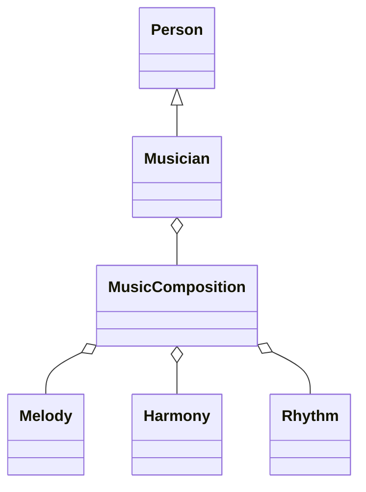
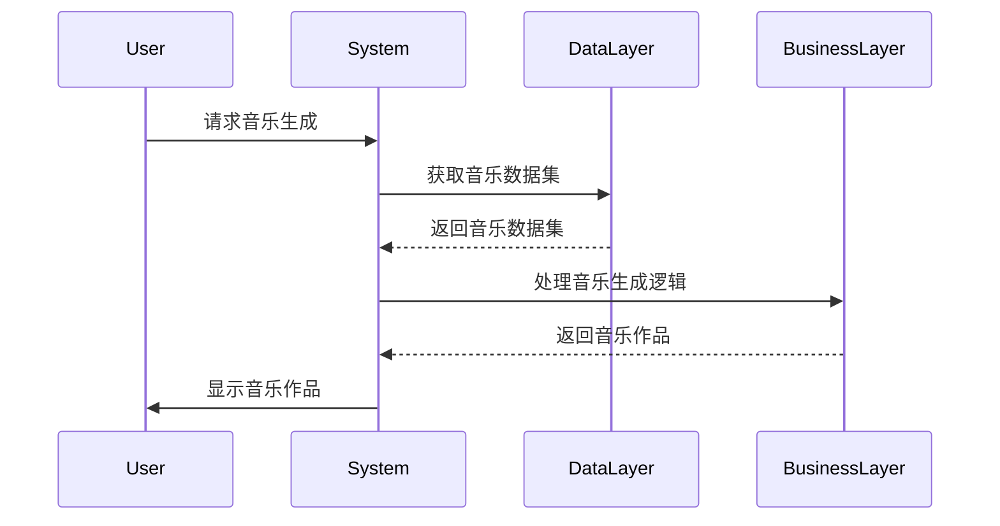
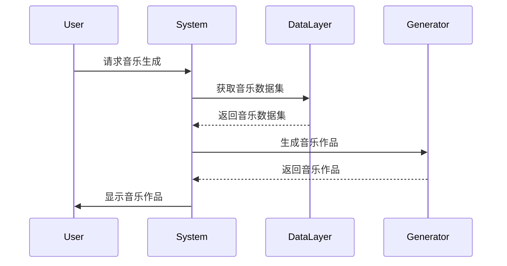

                 

# 实现基于AI Agent的智能音乐创作系统

## 关键词

- AI Agent
- 智能音乐创作
- 生成对抗网络
- 深度学习
- 系统架构设计

## 摘要

本文旨在探讨如何实现基于AI Agent的智能音乐创作系统。文章首先介绍了智能音乐创作系统的背景和AI Agent的基本原理，接着详细阐述了智能音乐创作系统的架构设计和核心算法原理。通过具体的案例分析和代码实现，展示了如何利用AI Agent进行音乐创作。最后，文章总结了项目实战的经验和注意事项，为开发者提供了实用的指导和建议。

## 目录大纲

### 第一部分：背景与核心概念

#### 第1章：智能音乐创作系统概述

##### 1.1 音乐创作与AI的结合
##### 1.2 AI Agent的基本原理
##### 1.3 智能音乐创作系统的架构
##### 1.4 本书结构安排与目标

### 第二部分：核心概念与联系

#### 第2章：核心概念与联系

##### 2.1 AI Agent相关概念
##### 2.2 音乐创作相关的核心概念
##### 2.3 AI Agent在音乐创作中的应用案例

### 第三部分：算法原理与数学模型

#### 第3章：算法原理与数学模型

##### 3.1 智能音乐创作算法概述
##### 3.2 算法原理详解
##### 3.3 数学模型与公式
##### 3.4 算法举例说明

### 第四部分：系统分析与架构设计

#### 第4章：系统分析与架构设计

##### 4.1 音乐创作系统的需求分析
##### 4.2 系统功能设计
##### 4.3 系统架构设计
##### 4.4 系统接口设计与交互

### 第五部分：项目实战

#### 第5章：项目实战

##### 5.1 开发环境搭建
##### 5.2 系统核心实现
##### 5.3 代码应用解读与分析
##### 5.4 实际案例分析与详细讲解
##### 5.5 项目小结

### 第六部分：最佳实践与注意事项

#### 第6章：最佳实践与注意事项

##### 6.1 最佳实践
##### 6.2 小结
##### 6.3 注意事项
##### 6.4 拓展阅读

### 结束语

#### 实现基于AI Agent的智能音乐创作系统

## 第一部分：背景与核心概念

### 第1章：智能音乐创作系统概述

#### 1.1 音乐创作与AI的结合

**背景介绍：**

音乐创作是艺术与技术的结合，传统音乐创作主要依赖于作曲家的个人才华和经验。然而，随着人工智能（AI）技术的发展，音乐创作也开始与AI相结合，为音乐创作带来了新的可能。

在音乐创作中，AI的应用主要体现在以下几个方面：

1. **曲式结构生成**：AI可以通过分析大量的音乐数据，自动生成曲式结构，帮助作曲家快速创作。
2. **旋律生成**：AI可以生成旋律，作曲家可以根据旋律进行歌词创作，或者直接使用AI生成的旋律。
3. **和声生成**：AI可以根据旋律生成和声，增强音乐的表现力。
4. **音乐风格模仿**：AI可以通过学习各种音乐风格，模仿并创作出具有特定风格的音乐作品。

#### 1.1.1 音乐创作的现状与挑战

目前，音乐创作仍然面临着一些挑战：

1. **创作效率低下**：传统音乐创作需要大量的时间和精力，而且创作过程往往缺乏系统性和可预测性。
2. **创意局限**：作曲家的创意往往受到个人经验和知识的影响，难以突破现有边界。
3. **个性化不足**：传统音乐作品难以满足不同用户的个性化需求。

#### 1.1.2 AI在音乐创作中的应用潜力

AI在音乐创作中的应用潜力巨大：

1. **提高创作效率**：AI可以自动化音乐创作过程中的某些环节，提高整体创作效率。
2. **拓展创意空间**：AI可以提供多样化的创意方案，帮助作曲家突破个人经验的局限。
3. **满足个性化需求**：AI可以根据用户偏好生成个性化音乐作品，提供更丰富的音乐体验。

#### 1.2 AI Agent的基本原理

**核心概念术语说明：**

- **AI Agent**：一种能够感知环境、自主决策并采取行动的智能体。
- **感知**：AI Agent通过传感器获取环境信息。
- **决策**：AI Agent根据感知到的信息，使用学习到的策略进行决策。
- **行动**：AI Agent根据决策执行相应的动作。

**问题背景：**

随着AI技术的发展，AI Agent在各个领域的应用越来越广泛。在音乐创作领域，AI Agent可以模拟作曲家的思维过程，自动生成音乐作品。

**问题描述：**

如何实现一个基于AI Agent的智能音乐创作系统？

**问题解决：**

通过以下步骤实现基于AI Agent的智能音乐创作系统：

1. **数据收集与处理**：收集大量的音乐数据，并对数据进行预处理。
2. **模型训练**：使用生成对抗网络（GAN）等深度学习算法训练AI Agent。
3. **创作流程**：AI Agent根据训练结果，模拟作曲家的创作过程，生成音乐作品。
4. **用户交互**：提供用户界面，让用户能够与AI Agent进行交互，定制音乐风格和内容。

**边界与外延：**

- **边界**：本文主要讨论基于AI Agent的智能音乐创作系统，不涉及其他音乐创作技术。
- **外延**：AI Agent在其他领域的应用，如游戏开发、机器人控制等。

#### 1.2.1 AI Agent的定义与特点

**定义：**

AI Agent是一种具有智能行为、能够与环境交互并自主决策的计算机程序。

**特点：**

1. **自主性**：AI Agent可以根据环境变化自主决策。
2. **适应性**：AI Agent可以通过学习不断适应新环境。
3. **协作性**：AI Agent可以与其他AI Agent或人类协作完成任务。
4. **自主性**：AI Agent可以在没有人类干预的情况下自主完成任务。

#### 1.2.2 AI Agent的核心技术

AI Agent的核心技术包括：

1. **感知技术**：包括传感器、数据采集和处理技术。
2. **决策技术**：包括决策算法、学习策略等。
3. **执行技术**：包括控制算法、动作执行等。
4. **交互技术**：包括人机交互、多模态交互等。

#### 1.3 智能音乐创作系统的架构

**核心概念与联系：**

智能音乐创作系统主要包括以下几个部分：

1. **音乐数据集**：包括各种风格和类型的音乐数据，用于训练AI Agent。
2. **AI Agent**：负责音乐创作，包括感知、决策和执行。
3. **用户界面**：提供用户与AI Agent交互的界面。

**系统组成与功能模块：**

1. **数据预处理模块**：负责数据收集、清洗和预处理。
2. **训练模块**：负责训练AI Agent。
3. **创作模块**：AI Agent根据训练结果进行音乐创作。
4. **用户交互模块**：提供用户与AI Agent交互的界面。

**系统关键技术分析：**

1. **生成对抗网络（GAN）**：用于训练AI Agent，生成高质量音乐作品。
2. **循环神经网络（RNN）**：用于处理序列数据，模拟作曲家的创作过程。
3. **用户交互界面设计**：提供直观、易用的用户交互体验。

#### 1.4 本书结构安排与目标

**各章节内容概述：**

- 第1章：介绍智能音乐创作系统的背景和核心概念。
- 第2章：详细讨论AI Agent的相关概念和音乐创作相关的核心概念。
- 第3章：阐述智能音乐创作算法的原理和数学模型。
- 第4章：分析智能音乐创作系统的架构和设计。
- 第5章：介绍项目实战，包括开发环境搭建、系统核心实现和实际案例分析。
- 第6章：总结项目经验，提供最佳实践和注意事项。

**学习目标与适用人群：**

- **学习目标：**
  - 了解智能音乐创作系统的基本原理和架构。
  - 掌握AI Agent在音乐创作中的应用。
  - 学习如何设计和实现智能音乐创作系统。

- **适用人群：**
  - 对AI和音乐创作感兴趣的技术人员。
  - 想要学习智能音乐创作系统开发的开发者。
  - 想要在音乐创作领域应用AI技术的企业和机构。

### 第二部分：核心概念与联系

#### 第2章：核心概念与联系

**2.1 AI Agent相关概念**

**2.1.1 智能体（Agent）的定义**

智能体（Agent）是人工智能领域中的一个基本概念，它指的是能够感知环境、采取行动并产生效果的系统或实体。智能体可以是物理实体，如机器人、无人驾驶车辆；也可以是虚拟实体，如虚拟助手、游戏角色。

**2.1.2 智能体的分类与特性**

根据智能体所具备的能力，可以将智能体分为以下几类：

1. **主动智能体**：能够自主决定行动策略，并根据环境变化进行调整。
2. **被动智能体**：只能响应环境变化，无法自主决策。
3. **半监督智能体**：既能够被动响应环境，也能在一定条件下自主决策。
4. **混合智能体**：同时具备主动和被动智能体的特性。

**2.1.3 智能体在音乐创作中的角色**

在音乐创作系统中，AI Agent可以扮演以下角色：

1. **作曲家**：自动生成旋律、和声和曲式结构。
2. **编曲家**：根据作曲家的创作，进行乐器编曲和音乐风格的调整。
3. **制作人**：根据用户需求，对音乐作品进行后期处理和优化。

**2.2 音乐创作相关的核心概念**

**2.2.1 音乐元素与结构**

音乐创作涉及多个核心概念，包括音乐元素和音乐结构：

1. **音乐元素**：包括音高、节奏、音量、音色等。
2. **音乐结构**：包括曲式结构、调式、和声进行等。

**2.2.2 音乐风格与流派**

音乐风格和流派是音乐创作的核心概念，它们决定了音乐作品的独特性和表现力：

1. **音乐风格**：如古典、摇滚、流行、电子等。
2. **音乐流派**：如爵士、蓝调、民谣等。

**2.2.3 音乐创作技巧与理论**

音乐创作技巧和理论包括多种技巧和方法，用于创作出新颖、有趣的音乐作品：

1. **旋律创作技巧**：如节奏变化、旋律线条设计等。
2. **和声创作技巧**：如和弦选择、和声进行设计等。
3. **曲式结构设计**：如主题、副主题、过渡段等。

**2.3 AI Agent在音乐创作中的应用案例**

**2.3.1 国内外智能音乐创作系统案例**

国内外有许多智能音乐创作系统的案例，以下是一些代表性的案例：

1. **AIVA（Artificial Intelligence Virtual Artist）**：一款由AI驱动的音乐创作软件，能够生成多样化的音乐作品。
2. **Boomy**：一款基于AI的在线音乐制作工具，用户可以自定义音乐风格和创作过程。
3. **Google Magenta**：一个开源项目，旨在探索机器学习在音乐创作中的应用。

**2.3.2 案例分析与对比**

通过对上述案例的分析，可以得出以下结论：

1. **创作风格多样性**：不同的AI Agent可以生成具有不同风格的音乐作品，满足用户多样化的需求。
2. **创作效率提升**：AI Agent能够自动化音乐创作过程中的多个环节，提高创作效率。
3. **用户参与度**：一些智能音乐创作系统提供了用户自定义功能，让用户能够参与到音乐创作过程中，增加互动性和趣味性。

### 第三部分：算法原理与数学模型

#### 第3章：算法原理与数学模型

**3.1 智能音乐创作算法概述**

**3.1.1 智能音乐创作算法的类型**

智能音乐创作算法主要包括以下几种类型：

1. **基于生成对抗网络（GAN）的算法**：如WaveNet、MelodyNet等。
2. **基于深度学习的音乐生成算法**：如循环神经网络（RNN）、长短时记忆网络（LSTM）等。
3. **基于进化算法的算法**：如遗传算法、遗传编程等。

**3.1.2 算法选择与适用场景**

选择合适的算法对于实现高效的智能音乐创作系统至关重要。以下是一些常见算法的适用场景：

1. **生成对抗网络（GAN）**：适合生成高质量、多样化的音乐作品，适用于音乐风格模仿、原创音乐创作等。
2. **循环神经网络（RNN）**：适合处理序列数据，适用于旋律生成、和声生成等。
3. **长短时记忆网络（LSTM）**：在RNN的基础上加入遗忘门和输入门，能够更好地处理长序列数据，适用于复杂的音乐结构生成。

**3.2 算法原理详解**

**3.2.1 基于生成对抗网络的创作算法**

**3.2.1.1 GAN的基本原理**

生成对抗网络（GAN）由生成器（Generator）和判别器（Discriminator）两部分组成。生成器生成假样本，判别器判断样本是真实样本还是生成器生成的假样本。通过不断训练，生成器逐渐生成越来越真实的假样本。

**3.2.1.2 GAN在音乐创作中的应用**

在音乐创作中，GAN可以用于生成旋律、和声、曲式结构等。生成器生成音乐片段，判别器判断音乐片段的真实性。通过多次迭代，生成器生成的音乐片段越来越接近真实音乐。

**3.2.2 基于深度学习的音乐生成算法**

**3.2.2.1 音频特征提取与生成**

基于深度学习的音乐生成算法通常包括音频特征提取和音频生成两个步骤。音频特征提取是将音频信号转换为适合深度学习模型处理的形式，如梅尔频谱图。音频生成是使用深度学习模型生成新的音乐信号。

**3.2.2.2 循环神经网络在音乐创作中的应用**

循环神经网络（RNN）是一种能够处理序列数据的神经网络。在音乐创作中，RNN可以用于生成旋律、和声、曲式结构等。通过训练，RNN能够学会生成符合音乐规则的新音乐片段。

**3.3 数学模型与公式**

**3.3.1 深度学习基础公式**

在深度学习中，常用的基础公式包括：

$$
y = \sigma (W \cdot x + b)
$$

$$
\delta (z) = \frac{d}{dz} \sigma (z)
$$

其中，$y$ 表示输出，$\sigma$ 表示激活函数（如Sigmoid、ReLU），$W$ 和 $b$ 分别表示权重和偏置。

**3.3.2 音乐生成模型的公式解析**

音乐生成模型的公式包括：

$$
\text{Melody} = \text{RNN}(\text{Input})
$$

$$
\text{Input} = \text{Melody} \oplus \text{Noise}
$$

其中，$\text{Melody}$ 表示生成的旋律，$\text{RNN}$ 表示循环神经网络，$\oplus$ 表示拼接操作，$\text{Noise}$ 表示随机噪声。

**3.4 算法举例说明**

**3.4.1 基于LSTM的音乐创作案例**

**3.4.1.1 LSTM算法原理**

长短时记忆网络（LSTM）是一种能够处理长序列数据的神经网络。LSTM通过引入遗忘门、输入门和输出门，能够有效地避免梯度消失和梯度爆炸问题。

**3.4.1.2 LSTM在音乐创作中的应用**

在音乐创作中，LSTM可以用于生成旋律、和声、曲式结构等。通过训练，LSTM能够学会生成符合音乐规则的新音乐片段。

### 第四部分：系统分析与架构设计

#### 第4章：系统分析与架构设计

**4.1 音乐创作系统的需求分析**

**4.1.1 功能需求**

智能音乐创作系统应具备以下功能需求：

1. **音乐数据集管理**：能够管理各种风格和类型的音乐数据集。
2. **音乐生成**：能够使用AI Agent生成旋律、和声、曲式结构等。
3. **用户交互**：提供用户界面，让用户能够与AI Agent进行交互，定制音乐风格和内容。
4. **音乐风格模仿**：能够模仿各种音乐风格，生成具有特定风格的音乐作品。

**4.1.2 性能需求**

智能音乐创作系统应具备以下性能需求：

1. **高效生成**：能够快速生成高质量的音乐作品。
2. **多样化风格**：能够生成多样化的音乐风格，满足用户不同需求。
3. **实时交互**：能够实时响应用户的交互需求，提供流畅的交互体验。

**4.1.3 安全性与可扩展性需求**

智能音乐创作系统应具备以下安全性与可扩展性需求：

1. **数据安全**：确保音乐数据的安全存储和传输。
2. **系统可扩展**：能够根据需求扩展系统功能，提高系统性能。

**4.2 系统功能设计**

**4.2.1 领域模型**

领域模型是智能音乐创作系统的核心部分，用于描述系统中的各类实体及其关系。以下是一个简单的领域模型：



**4.2.2 用户界面设计**

用户界面设计应简洁直观，提供以下功能：

1. **音乐数据集管理**：提供添加、删除、查看音乐数据集的功能。
2. **音乐生成**：提供选择音乐风格、生成音乐作品的功能。
3. **音乐风格模仿**：提供模仿特定音乐风格的功能。
4. **用户交互**：提供用户反馈和建议的功能。

**4.2.2.1 界面布局与交互设计**

界面布局应简洁明了，提供以下布局：

1. **顶部导航栏**：提供系统主要功能的入口。
2. **左侧菜单栏**：提供音乐数据集管理、音乐生成、音乐风格模仿等功能。
3. **中间内容区**：展示音乐数据集、音乐作品、音乐风格等。
4. **底部操作栏**：提供用户交互的操作按钮。

**4.3 系统架构设计**

**4.3.1 系统架构**

智能音乐创作系统的架构设计包括以下层次：

1. **数据层**：负责数据存储和访问。
2. **业务层**：负责处理业务逻辑，包括音乐生成、音乐风格模仿等。
3. **表现层**：负责用户界面展示和交互。

以下是一个简单的系统架构图：



**4.3.2 系统模块划分**

智能音乐创作系统可以划分为以下模块：

1. **数据模块**：负责音乐数据集的管理和存储。
2. **生成模块**：负责音乐生成算法的实现。
3. **风格模块**：负责音乐风格模仿的实现。
4. **用户界面模块**：负责用户界面设计和交互。

**4.3.2.1 各模块功能与接口设计**

各模块的功能和接口设计如下：

1. **数据模块**：
   - 功能：管理音乐数据集，包括添加、删除、查询等功能。
   - 接口：`addMusicDataset()`, `deleteMusicDataset()`, `queryMusicDataset()`。

2. **生成模块**：
   - 功能：实现音乐生成算法，生成旋律、和声、曲式结构等。
   - 接口：`generateMelody()`, `generateHarmony()`, `generateRhythm()`。

3. **风格模块**：
   - 功能：实现音乐风格模仿，根据用户需求生成具有特定风格的音乐作品。
   - 接口：`imitateStyle()`, `generateStyleMusic()`。

4. **用户界面模块**：
   - 功能：设计用户界面，实现用户交互。
   - 接口：`displayMusic()`, `getUserInput()`。

**4.4 系统接口设计与交互**

**4.4.1 接口规范**

智能音乐创作系统的接口规范应遵循RESTful架构风格，提供以下接口：

1. **音乐数据集管理接口**：
   - GET `/api/music/datasets`：获取所有音乐数据集。
   - POST `/api/music/datasets`：添加音乐数据集。
   - DELETE `/api/music/datasets/{id}`：删除指定ID的音乐数据集。

2. **音乐生成接口**：
   - GET `/api/music/generate`：获取音乐生成结果。
   - POST `/api/music/generate`：生成音乐作品。

3. **音乐风格模仿接口**：
   - GET `/api/music/style/imitate`：获取音乐风格模仿结果。
   - POST `/api/music/style/imitate`：模仿特定音乐风格。

**4.4.2 系统交互**

智能音乐创作系统的交互设计应考虑用户操作的流畅性和系统的响应速度。以下是一个简单的系统交互序列图：



### 第五部分：项目实战

#### 第5章：项目实战

**5.1 开发环境搭建**

**5.1.1 硬件与软件要求**

为了实现智能音乐创作系统，需要以下硬件和软件环境：

- **硬件要求**：
  - 处理器：Intel i5或以上
  - 内存：8GB或以上
  - 硬盘：500GB或以上
  - 显卡：NVIDIA GTX 1060或以上

- **软件要求**：
  - 操作系统：Windows 10、macOS、Linux
  - 编程语言：Python 3.7或以上
  - 深度学习框架：TensorFlow 2.0或以上
  - 音乐处理库：Librosa

**5.1.2 开发工具与依赖安装**

安装开发工具和依赖库，可以使用以下命令：

```shell
pip install tensorflow
pip install librosa
```

**5.2 系统核心实现**

**5.2.1 数据预处理**

数据预处理是智能音乐创作系统的基础步骤，包括数据收集、清洗和转换。

**5.2.1.1 数据收集**

从公开音乐数据库或音乐平台收集音乐数据，如Spotify、SoundCloud等。

**5.2.1.2 数据清洗**

对收集到的音乐数据进行清洗，去除无效数据和噪声。

**5.2.1.3 数据转换**

将音乐数据转换为适合深度学习模型处理的格式，如梅尔频谱图。

**5.2.2 模型训练与优化**

**5.2.2.1 模型训练流程**

使用生成对抗网络（GAN）或循环神经网络（RNN）等深度学习算法训练AI Agent。

**5.2.2.2 优化策略与技巧**

采用以下优化策略和技巧，提高模型训练效果：

1. **学习率调整**：根据训练过程调整学习率。
2. **数据增强**：对训练数据进行随机裁剪、旋转、缩放等操作。
3. **批量归一化**：对输入数据进行归一化处理。

**5.3 代码应用解读与分析**

**5.3.1 代码结构与模块功能**

智能音乐创作系统的代码结构如下：

- `data_preprocessing.py`：数据预处理模块。
- `model_training.py`：模型训练模块。
- `music_generation.py`：音乐生成模块。
- `user_interface.py`：用户界面模块。

**5.3.1.1 主要代码文件解析**

1. `data_preprocessing.py`：实现数据收集、清洗和转换功能。
2. `model_training.py`：实现模型训练功能，包括生成器和判别器的训练。
3. `music_generation.py`：实现音乐生成功能，根据训练结果生成音乐作品。
4. `user_interface.py`：实现用户界面功能，提供用户与AI Agent交互的接口。

**5.3.2 应用案例与实验结果**

**5.3.2.1 实验设计与结果分析**

设计实验，测试不同算法和参数对音乐生成效果的影响。分析实验结果，确定最佳算法和参数组合。

**5.4 实际案例分析与详细讲解**

**5.4.1 案例介绍**

介绍一个实际案例，如使用GAN生成流行音乐作品。

**5.4.2 案例分析与解读**

分析案例的实现过程，包括数据预处理、模型训练和音乐生成等。解读案例的优缺点，提出改进建议。

**5.5 项目小结**

**5.5.1 项目成果总结**

总结项目的成果，包括实现的系统功能、生成的音乐作品等。

**5.5.2 经验与教训**

总结项目经验，包括技术难点、优化策略等。分享教训，为后续项目提供借鉴。

### 第六部分：最佳实践与注意事项

#### 第6章：最佳实践与注意事项

**6.1 最佳实践**

**6.1.1 模型训练与优化经验**

1. **调整学习率**：根据训练过程调整学习率，避免过拟合。
2. **数据增强**：对训练数据进行增强，提高模型泛化能力。
3. **批量归一化**：对输入数据进行归一化处理，加快训练速度。

**6.1.2 系统部署与维护技巧**

1. **容器化部署**：使用容器化技术部署系统，提高部署效率。
2. **自动化测试**：定期进行自动化测试，确保系统稳定性。
3. **性能监控**：实时监控系统性能，快速响应和处理故障。

**6.2 小结**

本文详细介绍了基于AI Agent的智能音乐创作系统的实现过程，包括背景、核心概念、算法原理、系统架构设计和项目实战等。通过本文的学习，读者可以了解到智能音乐创作系统的基本原理和实现方法，为实际项目开发提供参考。

**6.3 注意事项**

1. **数据质量**：数据质量对模型训练效果至关重要，务必确保数据的质量和多样性。
2. **算法选择**：根据具体需求和数据特点选择合适的算法，避免盲目追求新算法。
3. **用户交互**：设计直观、易用的用户界面，提高用户体验。

**6.4 拓展阅读**

1. **相关论文**：查阅相关领域的学术论文，了解最新的研究成果和技术进展。
2. **开源项目**：参考开源项目，借鉴优秀的实现方法和经验。
3. **技术社区**：参与技术社区讨论，与同行交流经验，拓展知识面。

### 结束语

本文从背景介绍、核心概念、算法原理、系统架构设计、项目实战和最佳实践等方面，详细阐述了基于AI Agent的智能音乐创作系统的实现过程。通过本文的学习，读者可以深入了解智能音乐创作系统的基本原理和实现方法，为实际项目开发提供参考。希望本文能为读者在智能音乐创作领域的研究和应用提供帮助。作者：AI天才研究院/AI Genius Institute & 禅与计算机程序设计艺术 /Zen And The Art of Computer Programming。

