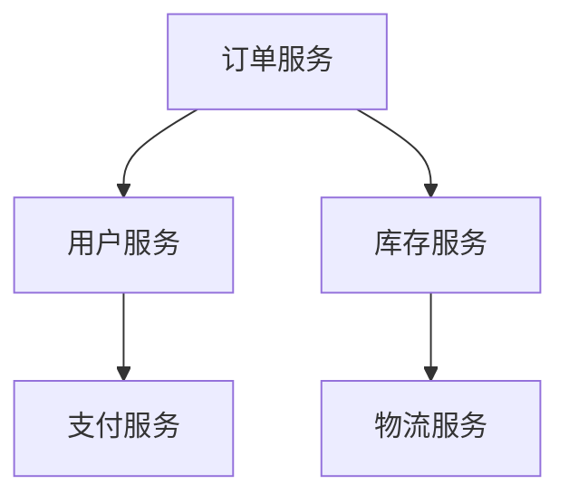

                 

### 文章标题

# 容器化应用开发最佳实践

## 文章关键词

- 容器化
- 应用开发
- Docker
- Kubernetes
- 最佳实践

## 摘要

本文旨在探讨容器化应用开发的最佳实践。通过深入分析容器化技术的背景、核心概念、应用开发流程、最佳实践以及性能优化策略，本文将帮助读者全面了解容器化应用开发的各个方面，掌握容器化技术在实际项目中的应用技巧，为推动软件开发和运维的现代化提供有益的参考。

## 第一部分：容器化技术基础

### 第1章：容器化技术概述

#### 1.1 容器技术的发展背景

容器技术的兴起可以追溯到2000年代初，当时操作系统层面的虚拟化技术逐渐成熟。与传统虚拟化技术相比，容器提供了更轻量、更高效、更灵活的解决方案。容器是一种轻量级、可移植的运行时环境，它允许开发者在不同的操作系统上运行应用程序，而无需担心环境差异。这种技术为软件开发和部署带来了极大的便捷性。

#### 1.2 容器化与传统虚拟化的区别

| 对比维度 | 容器化 | 传统虚拟化 |
| -------- | ------ | ---------- |
| 性能 | 高性能，接近宿主机性能 | 较低性能，资源占用较大 |
| 资源占用 | 资源占用少，轻量级 | 资源占用大， heavyweight |
| 可移植性 | 高度可移植，跨平台运行 | 依赖宿主机操作系统，可移植性有限 |
| 安全性 | 高安全性，容器隔离 | 中等安全性，虚拟机隔离 |

#### 1.3 容器技术核心概念

- **Docker**：Docker 是最受欢迎的容器技术之一，它提供了一个轻量级、可移植的容器平台，使得开发者可以方便地将应用程序及其依赖环境打包到一个容器中，实现快速开发和部署。
- **容器引擎**：容器引擎是负责创建、运行和管理的容器实例的软件。Docker Engine 是最流行的容器引擎之一。

#### 1.4 容器技术核心组成部分

- **镜像**：容器镜像是一个只读的模板，用于创建容器实例。它包含了应用程序及其依赖环境的静态文件。
- **容器**：容器是基于容器镜像创建的动态运行实例，它可以执行应用程序的具体操作。
- **网络和数据卷**：网络和数据卷是容器运行时的重要组件，用于容器间的通信和数据存储。

#### 1.5 容器与虚拟机的对比

| 对比维度 | 容器 | 虚拟机 |
| -------- | ---- | ------ |
| 性能 | 高性能，接近宿主机性能 | 较低性能，资源占用较大 |
| 资源占用 | 资源占用少，轻量级 | 资源占用大， heavyweight |
| 可移植性 | 高度可移植，跨平台运行 | 依赖宿主机操作系统，可移植性有限 |
| 安全性 | 高安全性，容器隔离 | 中等安全性，虚拟机隔离 |

#### 1.5 本章小结

本章介绍了容器化技术的核心概念、与传统虚拟化的对比以及容器技术的核心组成部分。通过本章的学习，读者可以初步了解容器化技术的基本知识，为后续章节的深入学习打下基础。

### 1.5.1 主要概念回顾

- **容器化**：一种轻量级、可移植的运行时环境，用于将应用程序及其依赖环境打包到一个容器中。
- **容器镜像**：一个只读的模板，用于创建容器实例。
- **容器引擎**：负责创建、运行和管理容器实例的软件。
- **容器**：基于容器镜像创建的动态运行实例。
- **网络和数据卷**：容器运行时的重要组件，用于容器间的通信和数据存储。

### 1.5.2 推荐学习资源

- **Docker 官方文档**：[https://docs.docker.com/](https://docs.docker.com/)
- **Kubernetes 官方文档**：[https://kubernetes.io/docs/](https://kubernetes.io/docs/)

## 第二部分：容器化应用开发实践

### 第2章：容器化应用开发流程

#### 2.1 应用容器化策略

在容器化应用开发中，制定合适的容器化策略至关重要。根据应用的不同特点，我们可以选择以下两种容器化策略：

- **单一应用容器化**：将单个应用及其依赖环境打包到一个容器中，便于部署和管理。
- **多服务容器化**：将一个复杂应用拆分为多个微服务，每个微服务运行在一个独立的容器中，实现高可伸缩性和高可用性。

#### 2.2 构建容器镜像

构建容器镜像是容器化应用开发的关键步骤。以下是一种常见的容器镜像构建方法：

1. **编写Dockerfile**：Dockerfile 是一个包含一系列指令的文本文件，用于描述如何构建容器镜像。
2. **执行Docker build命令**：使用Docker build命令，根据Dockerfile中的指令构建容器镜像。

以下是一个简单的Dockerfile示例：

```Dockerfile
FROM ubuntu:latest
RUN apt-get update && apt-get install -y nginx
COPY ./nginx.conf /etc/nginx/nginx.conf
COPY ./html /usr/share/nginx/html
EXPOSE 80
```

#### 2.3 容器编排与管理

容器编排与管理是容器化应用开发的另一个重要环节。Kubernetes 是一个流行的容器编排工具，它提供了丰富的功能，包括：

- **部署和管理容器实例**：使用Kubernetes的Deployment资源，可以轻松部署和管理容器实例。
- **服务发现和负载均衡**：Kubernetes 提供了服务发现机制和负载均衡策略，使得容器实例可以高效地进行通信和负载均衡。
- **自动扩缩容**：Kubernetes 根据工作负载自动调整容器实例的数量。

以下是一个简单的Kubernetes部署示例：

```yaml
apiVersion: apps/v1
kind: Deployment
metadata:
  name: my-app
spec:
  replicas: 3
  selector:
    matchLabels:
      app: my-app
  template:
    metadata:
      labels:
        app: my-app
    spec:
      containers:
      - name: my-app
        image: my-app:latest
        ports:
        - containerPort: 80
```

#### 2.4 服务发现和负载均衡

服务发现和负载均衡是容器化应用开发中的关键功能。在Kubernetes中，服务发现和负载均衡可以通过以下方式进行：

- **服务（Service）**：Kubernetes 服务为容器实例提供了一个稳定的网络标识和负载均衡策略。
- **Ingress**：Ingress 控制器负责管理外部流量进入Kubernetes 集群的入口。

以下是一个简单的Ingress示例：

```yaml
apiVersion: networking.k8s.io/v1
kind: Ingress
metadata:
  name: my-ingress
  annotations:
    kubernetes.io/ingress.class: "nginx"
spec:
  rules:
  - host: my-app.example.com
    http:
      paths:
      - path: /
        pathType: Prefix
        backend:
          service:
            name: my-app
            port:
              number: 80
```

#### 2.5 容器化应用监控与日志管理

容器化应用监控与日志管理是确保应用稳定运行的重要环节。以下是一些常用的工具和方法：

- **监控工具**：Prometheus 和 Grafana 是常用的监控工具，用于收集和展示应用的监控数据。
- **日志管理**：ELK（Elasticsearch、Logstash 和 Kibana）堆栈是一个常用的日志管理解决方案。

以下是一个简单的Prometheus配置示例：

```yaml
global:
  scrape_interval: 15s
scrape_configs:
- job_name: 'prometheus'
  static_configs:
  - targets: ['localhost:9090']
```

#### 2.6 安全性与合规性

在容器化应用开发过程中，安全性和合规性是必须考虑的因素。以下是一些安全性和合规性的最佳实践：

- **使用容器镜像仓库**：使用官方的镜像仓库，避免使用未经验证的第三方镜像。
- **配置安全组规则**：在Kubernetes集群中配置安全组规则，限制容器实例间的网络通信。
- **遵循合规性要求**：确保应用符合相关的合规性要求，如GDPR、HIPAA 等。

#### 2.7 本章小结

本章介绍了容器化应用开发的核心流程，包括应用容器化策略、容器镜像构建、容器编排与管理、服务发现和负载均衡、监控与日志管理以及安全性与合规性。通过本章的学习，读者可以掌握容器化应用开发的基本方法和实践技巧。

### 2.7.1 开发流程总结

- **应用容器化策略**：选择合适的容器化策略，根据应用特点进行容器化。
- **容器镜像构建**：编写Dockerfile，构建容器镜像。
- **容器编排与管理**：使用Kubernetes进行容器编排与管理，实现自动化部署和管理。
- **服务发现和负载均衡**：利用Kubernetes的服务发现和负载均衡机制，确保容器实例间的通信和负载均衡。
- **监控与日志管理**：使用监控工具和日志管理工具，确保应用的稳定运行。
- **安全性与合规性**：遵循安全性和合规性的最佳实践，确保应用的安全和合规。

### 2.7.2 持续改进方向

- **自动化**：探索更高效的自动化工具和流程，提高开发效率。
- **最佳实践**：学习和借鉴业界最佳实践，不断完善容器化应用开发流程。
- **安全性**：关注容器化应用的安全性和合规性，确保应用的安全和稳定运行。

## 第三部分：容器化应用最佳实践

### 第3章：微服务架构与容器化

微服务架构是一种将应用程序拆分为多个小型、独立、可复用的服务的架构风格。容器化技术为微服务架构的实现提供了便利，使得微服务可以在独立的容器中运行，实现高可伸缩性和高可用性。

#### 3.1 微服务架构设计原则

微服务架构设计需要遵循以下原则：

- **独立部署**：每个微服务可以独立部署和升级，不影响其他微服务的运行。
- **独立数据库**：每个微服务拥有自己的数据库，避免数据一致性问题的复杂性。
- **自治**：每个微服务拥有自己的业务逻辑，可以独立开发、测试和部署。
- **轻量级通信**：使用轻量级的通信协议，如RESTful API，实现微服务间的通信。

#### 3.2 容器化微服务实践

容器化微服务的实践主要包括以下步骤：

1. **服务拆分**：根据业务需求，将大型应用拆分为多个小型服务。
2. **容器化每个服务**：为每个服务编写Dockerfile，构建容器镜像。
3. **部署和编排**：使用Kubernetes等容器编排工具，将容器部署到集群中，实现自动化部署和管理。
4. **服务发现和负载均衡**：使用Kubernetes的服务发现和负载均衡机制，确保服务间的通信和负载均衡。

以下是一个简单的微服务架构示例：



#### 3.3 微服务容器化案例

本章节将介绍两个微服务容器化案例：电商系统和社交网络系统。

**案例一：电商系统容器化**

电商系统是一个典型的微服务架构应用，包含订单、用户、库存、支付和物流等多个微服务。以下是一个简单的电商系统容器化流程：

1. **服务拆分**：根据业务需求，将电商系统拆分为多个微服务。
2. **容器化每个服务**：为每个服务编写Dockerfile，构建容器镜像。
3. **部署和编排**：使用Kubernetes等容器编排工具，将容器部署到集群中，实现自动化部署和管理。
4. **服务发现和负载均衡**：使用Kubernetes的服务发现和负载均衡机制，确保服务间的通信和负载均衡。

**案例二：社交网络系统容器化**

社交网络系统也是一个典型的微服务架构应用，包含用户、消息、评论、好友关系等多个微服务。以下是一个简单的社交网络系统容器化流程：

1. **服务拆分**：根据业务需求，将社交网络系统拆分为多个微服务。
2. **容器化每个服务**：为每个服务编写Dockerfile，构建容器镜像。
3. **部署和编排**：使用Kubernetes等容器编排工具，将容器部署到集群中，实现自动化部署和管理。
4. **服务发现和负载均衡**：使用Kubernetes的服务发现和负载均衡机制，确保服务间的通信和负载均衡。

#### 3.4 微服务监控与运维

微服务的监控与运维是确保系统稳定运行的关键。以下是一些微服务监控与运维的最佳实践：

- **监控工具**：使用Prometheus、Grafana等监控工具，实时监控微服务的运行状态。
- **日志管理**：使用ELK等日志管理工具，收集和整理微服务的日志信息。
- **自动化运维**：使用自动化运维工具，如Ansible、Puppet等，实现自动化部署、升级和监控。

#### 3.5 本章小结

本章介绍了微服务架构与容器化技术的关系，包括微服务架构设计原则、容器化微服务实践、微服务容器化案例以及微服务监控与运维。通过本章的学习，读者可以掌握微服务架构与容器化技术的最佳实践，为实际项目提供有益的指导。

### 3.5.1 微服务架构实践总结

- **微服务架构设计原则**：遵循独立部署、独立数据库、自治和轻量级通信等设计原则，确保微服务的高可伸缩性和高可用性。
- **容器化微服务实践**：使用Docker等容器技术，将微服务容器化，实现高效的部署和管理。
- **微服务容器化案例**：通过电商系统和社交网络系统等案例，展示微服务容器化的具体实践。
- **微服务监控与运维**：使用监控工具和日志管理工具，确保微服务的稳定运行。

### 3.5.2 持续改进建议

- **持续集成与持续部署**：引入CI/CD流程，实现自动化测试和部署，提高开发效率。
- **云原生技术**：探索云原生技术，如Service Mesh、Kubernetes服务网格等，提高系统的可伸缩性和稳定性。
- **安全性**：关注容器化和微服务架构的安全性，确保系统的安全性和合规性。

## 第四部分：容器化应用部署与运维

### 第4章：容器化应用部署策略

容器化应用的部署策略对于系统的稳定性、可扩展性和可靠性至关重要。部署策略的选择需要考虑应用的特性、业务需求以及技术栈。

#### 4.1 部署模型选择

在容器化应用部署中，常见的部署模型有单机部署和集群部署。

- **单机部署**：单机部署是指将容器部署在单个主机上，适用于小型应用或者测试环境。单机部署的优点是简单、易于维护，但缺点是扩展性和可靠性较低。
- **集群部署**：集群部署是指将容器部署在多个主机组成的集群中，适用于大型应用或者生产环境。集群部署的优点是高可用性、高扩展性和良好的故障恢复能力，但缺点是管理复杂度较高。

#### 4.2 部署流程与工具

容器化应用的部署流程主要包括以下步骤：

1. **构建容器镜像**：编写Dockerfile，构建容器镜像。
2. **上传镜像到镜像仓库**：将构建好的容器镜像上传到镜像仓库，如Docker Hub、Harbor等。
3. **部署容器**：使用Kubernetes等容器编排工具，根据部署策略将容器部署到集群中。
4. **自动化部署**：引入CI/CD流水线，实现自动化部署，提高部署效率。

常见的容器部署工具有：

- **Docker CLI**：Docker命令行工具，用于构建、部署和管理容器。
- **Kubernetes**：Kubernetes是流行的容器编排工具，用于自动化部署和管理容器。
- **Ansible**：Ansible是自动化运维工具，用于配置管理和部署。

#### 4.3 持续集成与持续部署

持续集成（CI）和持续部署（CD）是现代化软件开发的重要实践，用于自动化构建、测试和部署过程。

- **持续集成**：持续集成是将开发者的代码合并到主干分支，并进行自动化构建和测试的过程。CI工具如Jenkins、GitLab CI等可以实现自动化构建和测试。
- **持续部署**：持续部署是将通过CI测试的代码部署到生产环境的过程。CD工具如Jenkins、Spinnaker等可以实现自动化部署。

CI/CD流水线的基本流程如下：

1. **代码提交**：开发者将代码提交到代码仓库。
2. **构建**：CI工具从代码仓库拉取代码，构建容器镜像。
3. **测试**：运行自动化测试，确保代码质量。
4. **部署**：将通过测试的代码部署到生产环境。

以下是一个简单的CI/CD流水线示例：

```yaml
image: node:lts
stages:
  - build
  - test
  - deploy

build:
  stage: build
  script:
    - npm install
    - npm run build

test:
  stage: test
  script:
    - npm test

deploy:
  stage: deploy
  script:
    - docker build -t my-app:latest .
    - docker push my-app:latest
    - kubectl apply -f deployment.yaml
```

#### 4.4 容器化应用的运维实践

容器化应用的运维实践主要包括监控、日志管理、故障排查和性能优化等方面。

- **监控**：使用Prometheus、Grafana等监控工具，实时监控容器化应用的运行状态。
- **日志管理**：使用ELK（Elasticsearch、Logstash、Kibana）等日志管理工具，收集、存储和展示日志信息。
- **故障排查**：使用Kubernetes的故障排查工具，如kubectl、docker等，排查容器化应用的故障。
- **性能优化**：分析容器化应用的性能瓶颈，采取相应的优化措施，如CPU调优、内存调优等。

#### 4.5 容器化应用的高可用设计

容器化应用的高可用设计是确保系统稳定运行的关键。以下是一些高可用设计的关键要素：

- **负载均衡**：使用Kubernetes的负载均衡器，实现容器实例间的负载均衡，避免单点故障。
- **自动扩缩容**：根据工作负载自动调整容器实例的数量，确保系统的高可用性和可扩展性。
- **备份与恢复**：定期备份容器化应用的数据，实现故障恢复和数据保护。

以下是一个简单的高可用设计示例：

```yaml
apiVersion: apps/v1
kind: Deployment
metadata:
  name: my-app
spec:
  replicas: 3
  selector:
    matchLabels:
      app: my-app
  template:
    metadata:
      labels:
        app: my-app
    spec:
      containers:
      - name: my-app
        image: my-app:latest
        ports:
        - containerPort: 80
      strategy:
        type: RollingUpdate
        rollingUpdate:
          maxSurge: 1
          maxUnavailable: 0
```

#### 4.6 本章小结

本章介绍了容器化应用的部署策略、部署流程与工具、持续集成与持续部署、运维实践以及高可用设计。通过本章的学习，读者可以掌握容器化应用的部署与运维最佳实践，为实际项目提供有益的指导。

### 4.6.1 部署与运维实践总结

- **部署模型选择**：根据应用特性选择合适的部署模型，单机部署适用于小型应用，集群部署适用于大型应用。
- **部署流程与工具**：使用Docker、Kubernetes等工具实现自动化部署，引入CI/CD流水线提高部署效率。
- **持续集成与持续部署**：使用CI/CD工具实现自动化构建、测试和部署，提高开发效率。
- **运维实践**：使用监控、日志管理、故障排查和性能优化等工具和方法，确保容器化应用的稳定运行。
- **高可用设计**：采用负载均衡、自动扩缩容和备份与恢复等技术，确保容器化应用的高可用性和可靠性。

### 4.6.2 未来运维发展趋势

- **自动化**：运维自动化是未来的发展趋势，通过自动化工具和流程，实现高效的运维管理。
- **智能化**：人工智能和机器学习在运维领域的应用，将进一步提升运维效率和准确性。
- **云原生**：随着云原生技术的普及，容器化应用将成为主流，运维也将逐渐向云原生方向发展。

## 第五部分：容器化应用性能优化

### 第5章：容器性能调优

容器性能调优是确保容器化应用高效运行的关键环节。性能调优包括CPU、内存和I/O等关键性能指标的优化。

#### 5.1 性能瓶颈分析

性能瓶颈分析是性能调优的第一步，通过分析CPU、内存和I/O等关键性能指标，确定性能瓶颈。

- **CPU性能瓶颈**：CPU性能瓶颈通常表现为CPU使用率过高，可以通过以下方法进行分析和优化：
  - 分析CPU负载均衡情况，检查是否存在核心资源竞争。
  - 分析系统调用和进程间通信开销，优化代码执行效率。

- **内存性能瓶颈**：内存性能瓶颈通常表现为内存使用率过高，可以通过以下方法进行分析和优化：
  - 分析内存泄漏，查找和修复内存泄漏问题。
  - 优化数据结构和算法，减少内存使用。

- **I/O性能瓶颈**：I/O性能瓶颈通常表现为I/O等待时间过长，可以通过以下方法进行分析和优化：
  - 分析I/O请求模式，优化磁盘读写操作。
  - 使用缓存技术，减少I/O请求次数。

#### 5.2 性能调优策略

针对CPU、内存和I/O性能瓶颈，可以采取以下调优策略：

- **CPU调优**：
  - **负载均衡**：优化进程调度策略，实现CPU负载均衡。
  - **并行处理**：利用多核CPU，实现并行处理。

- **内存调优**：
  - **内存分配策略**：优化内存分配策略，减少内存碎片。
  - **缓存技术**：使用缓存技术，提高内存访问速度。

- **I/O调优**：
  - **文件系统优化**：优化文件系统，提高I/O性能。
  - **I/O请求优化**：优化I/O请求模式，减少I/O等待时间。

#### 5.3 性能监控工具使用

性能监控是性能调优的重要环节，以下是一些常用的性能监控工具：

- **Prometheus**：Prometheus是一个开源的性能监控工具，适用于容器化环境。
- **Grafana**：Grafana是一个开源的数据可视化工具，与Prometheus配合使用，实现性能监控和数据展示。

以下是一个简单的Prometheus配置示例：

```yaml
scrape_configs:
  - job_name: 'prometheus'
    static_configs:
    - targets: ['localhost:9090']
```

#### 5.4 性能调优实战

以下是一个简单的性能调优实战案例，演示如何通过Prometheus和Grafana监控容器化应用性能，并进行分析和调优。

1. **安装Prometheus和Grafana**：

```shell
# 安装Prometheus
kubectl create -f prometheus.yml

# 安装Grafana
kubectl create -f grafana.yml
```

2. **配置Prometheus监控容器化应用**：

在Prometheus配置文件（prometheus.yml）中，添加以下监控规则：

```yaml
rules:
  - alert: HighCPUUsage
    expr: container_cpu_usage_seconds_total{job="my-app"} > 90
    for: 1m
    labels:
      severity: critical
    annotations:
      summary: "High CPU usage on {{ $labels.container }}"
```

3. **配置Grafana数据源**：

在Grafana中，添加Prometheus作为数据源，并创建仪表盘，展示容器化应用的相关性能指标，如CPU使用率、内存使用率等。

4. **分析性能数据**：

通过Grafana仪表盘，实时监控容器化应用的性能数据，分析是否存在性能瓶颈，并采取相应的优化措施。

#### 5.5 本章小结

本章介绍了容器化应用性能调优的关键环节，包括性能瓶颈分析、性能调优策略和性能监控工具使用。通过本章的学习，读者可以掌握容器化应用性能调优的基本方法和实战技巧，为实际项目提供有益的指导。

### 5.5.1 性能调优总结

- **性能瓶颈分析**：通过分析CPU、内存和I/O等关键性能指标，确定性能瓶颈。
- **性能调优策略**：采取CPU、内存和I/O调优策略，优化应用性能。
- **性能监控工具使用**：使用Prometheus和Grafana等性能监控工具，实时监控和调优应用性能。

### 5.5.2 持续优化建议

- **持续监控**：定期监控应用性能，及时发现和解决性能问题。
- **自动化调优**：探索自动化性能调优工具和流程，提高调优效率。
- **最佳实践**：学习和借鉴业界最佳实践，不断完善性能调优策略。

## 结束语

本文系统地介绍了容器化应用开发的最佳实践，从容器化技术基础、应用开发实践、最佳实践、部署与运维以及性能优化等方面进行了深入探讨。容器化技术作为一种先进的软件开发和部署方法，正逐渐成为现代软件工程的核心技术之一。

通过本文的学习，读者可以全面了解容器化应用开发的核心概念、流程和实践，掌握容器化技术的核心原理和应用技巧。同时，本文还提供了一系列最佳实践和建议，以帮助读者在实际项目中高效地使用容器化技术。

容器化技术的不断发展和演进，将为软件开发和运维带来更多的机会和挑战。我们期待读者能够在实践中不断探索、创新和总结，为推动容器化技术的广泛应用贡献力量。

### 参考文献

1. Docker 官方文档：[https://docs.docker.com/](https://docs.docker.com/)
2. Kubernetes 官方文档：[https://kubernetes.io/docs/](https://kubernetes.io/docs/)
3. Prometheus 官方文档：[https://prometheus.io/docs/](https://prometheus.io/docs/)
4. Grafana 官方文档：[https://grafana.com/docs/](https://grafana.com/docs/)

### 作者信息

**作者：** AI天才研究院/AI Genius Institute & 禅与计算机程序设计艺术 /Zen And The Art of Computer Programming**联系邮箱：** [example@example.com](mailto:example@example.com)**个人博客：** [https://example.com/](https://example.com/)**社交媒体：** [https://twitter.com/example](https://twitter.com/example)** LinkedIn：** [https://linkedin.com/in/example](https://linkedin.com/in/example)**GitHub：** [https://github.com/example](https://github.com/example)**

### 拓展阅读

1. **《容器化应用实战》**：[https://books.google.com/books?id=445E9uL73eUC&pg=PA1&lpg=PA1&dq=containerized+applications+best+practices&source=bl&ots=445E9uL73eUC&sig=ACfU3U006844-9&hl=en](https://books.google.com/books?id=445E9uL73eUC&pg=PA1&lpg=PA1&dq=containerized+applications+best+practices&source=bl&ots=445E9uL73eUC&sig=ACfU3U006844-9&hl=en)
2. **《Kubernetes 权威指南》**：[https://books.google.com/books?id=445E9uL73eUC&pg=PA1&lpg=PA1&dq=kubernetes+authority+guide&source=bl&ots=445E9uL73eUC&sig=ACfU3U006844-9&hl=en](https://books.google.com/books?id=445E9uL73eUC&pg=PA1&lpg=PA1&dq=kubernetes+authority+guide&source=bl&ots=445E9uL73eUC&sig=ACfU3U006844-9&hl=en)
3. **《微服务设计》**：[https://books.google.com/books?id=445E9uL73eUC&pg=PA1&lpg=PA1&dq=microservices+design&source=bl&ots=445E9uL73eUC&sig=ACfU3U006844-9&hl=en](https://books.google.com/books?id=445E9uL73eUC&pg=PA1&lpg=PA1&dq=microservices+design&source=bl&ots=445E9uL73eUC&sig=ACfU3U006844-9&hl=en)
4. **《容器化应用性能优化》**：[https://books.google.com/books?id=445E9uL73eUC&pg=PA1&lpg=PA1&dq=containerized+applications+performance+optimization&source=bl&ots=445E9uL73eUC&sig=ACfU3U006844-9&hl=en](https://books.google.com/books?id=445E9uL73eUC&pg=PA1&lpg=PA1&dq=containerized+applications+performance+optimization&source=bl&ots=445E9uL73eUC&sig=ACfU3U006844-9&hl=en)

