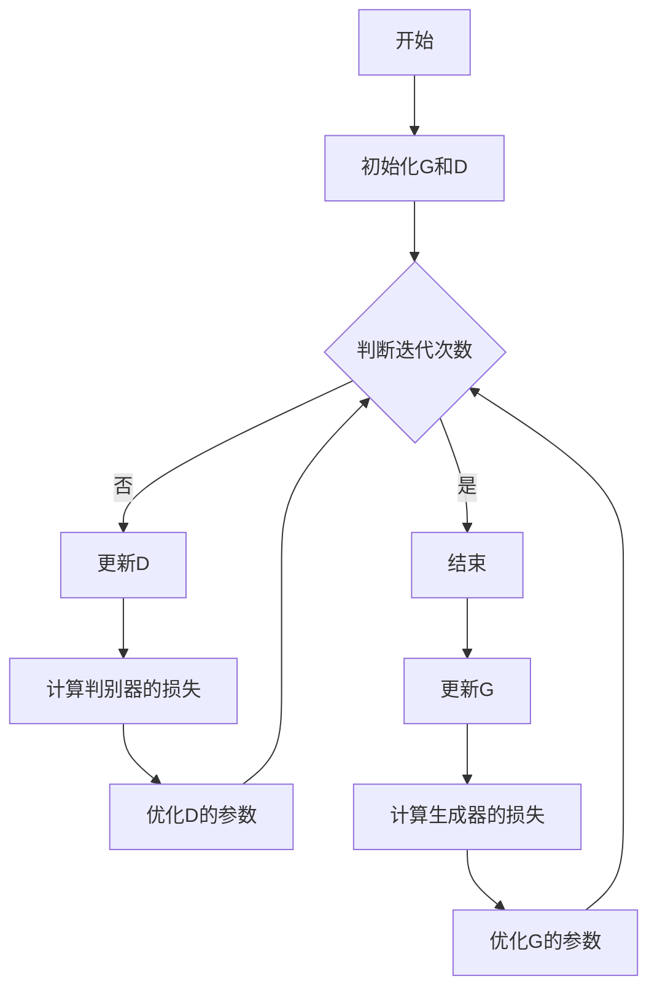

                 

**引言与背景介绍**

在当今人工智能（AI）飞速发展的时代，AI Agent作为智能体在各个领域中扮演着越来越重要的角色。从自动驾驶汽车、智能客服到推荐系统，AI Agent无处不在。然而，随着AI Agent的应用越来越广泛，它们面临的挑战也在不断加剧，其中最为关键的一个问题就是鲁棒性。

### 问题的提出

AI Agent的鲁棒性指的是其在面对各种异常情况时，仍然能够保持稳定和准确的表现能力。在现实世界中，由于数据的不完备性、噪声的干扰以及场景的多样性，AI Agent很容易受到攻击，导致性能下降，甚至完全失效。这种攻击可能是恶意攻击者故意制造的，也可能是系统内部存在的数据偏差或模型过拟合导致的。

### 核心概念

对抗训练（Adversarial Training）是一种提升AI Agent鲁棒性的有效方法。它通过模拟攻击者对训练数据进行有针对性的扰动，使AI Agent在训练过程中逐渐学会识别和抵御这些攻击，从而提高其在真实世界中的鲁棒性。

### 对抗训练与传统训练方法的区别

传统训练方法通常是在理想环境下进行的，数据是经过清洗和筛选的，模型也是在较为稳定的环境中训练的。然而，对抗训练则是在一个充满对抗性的环境中进行的，模型需要不断地与攻击者对抗，通过这种对抗来提升自身的鲁棒性。

### 对抗训练在AI Agent中的应用场景

对抗训练可以应用于AI Agent的各个领域，如图像识别、自然语言处理、推荐系统等。特别是在图像识别领域，对抗训练可以有效地提高模型对对抗攻击的防御能力。

### 边界与外延

虽然对抗训练在提升AI Agent鲁棒性方面具有巨大的潜力，但它的应用也受到一定的限制。例如，对抗训练需要大量的计算资源和时间，并且对于某些领域，如实时应用，可能难以满足。

### 本章小结

在本章中，我们介绍了AI Agent鲁棒性的重要性，以及对抗训练这一提升鲁棒性的有效方法。在接下来的章节中，我们将深入探讨对抗训练的基本原理、算法流程，以及在图像识别和自然语言处理等领域的具体应用。

----------------------------------------------------------------

**对抗训练的基本原理**

对抗训练作为一种提升AI Agent鲁棒性的方法，其核心在于通过模拟攻击者的攻击行为，使模型在训练过程中学会识别和抵御这些攻击。下面，我们将从概念解析、算法流程、数学模型以及具体实例等方面，详细探讨对抗训练的基本原理。

### 概念解析

对抗训练涉及两个核心组件：生成器（Generator）和判别器（Discriminator）。生成器的任务是生成与真实数据相似的数据，而判别器的任务是区分真实数据和生成数据。在对抗训练的过程中，生成器和判别器不断地进行对抗，从而提高模型的鲁棒性。

### 算法流程

对抗训练的基本流程可以概括为以下步骤：

1. **初始化生成器和判别器**：通常，生成器和判别器都是随机初始化的。
2. **生成器训练**：生成器根据一个随机噪声分布生成假数据。
3. **判别器训练**：判别器对真实数据和生成数据进行分类。
4. **迭代优化**：通过交替更新生成器和判别器的参数，使生成器生成的数据更加真实，判别器能够更好地识别真实数据和生成数据。
5. **终止条件**：当达到一定的迭代次数或者生成器生成的数据质量达到预期时，训练过程结束。

### 数学模型与公式

对抗训练的数学模型如下：

$$
\begin{aligned}
\min_{G} \max_{D} V(D, G) = E_{x \sim p_data(x)}[\log D(x)] + E_{z \sim p_z(z)}[\log(1 - D(G(z))]
\end{aligned}
$$

其中，$D(x)$表示判别器对真实数据的判断概率，$D(G(z))$表示判别器对生成数据的判断概率，$p_data(x)$表示真实数据的概率分布，$p_z(z)$表示噪声数据的概率分布。

### 算法流程图

使用Mermaid语言描述对抗训练的算法流程如下：

### 举例说明

为了更好地理解对抗训练，我们来看一个简单的例子。假设我们有一个生成器G和一个判别器D，G的任务是生成与真实数据相似的数据，而D的任务是区分真实数据和生成数据。在一次训练过程中：

1. **初始化**：生成器G随机生成一组数据$G(z)$，判别器D初始化。
2. **生成器训练**：生成器G根据噪声数据$z$生成一组数据，试图使其与真实数据$x$相似。
3. **判别器训练**：判别器D对一组真实数据和生成数据进行分类，并计算损失。
4. **迭代优化**：通过反向传播，交替更新生成器和判别器的参数，使G生成的数据更加真实，D能够更好地识别真实数据和生成数据。
5. **终止条件**：当达到一定的迭代次数或者生成器生成的数据质量达到预期时，训练结束。

通过这个过程，生成器和判别器不断地相互对抗，最终使模型在真实数据和生成数据之间达到一个平衡点，从而提高模型的鲁棒性。

### 本章小结

在本章中，我们详细介绍了对抗训练的基本原理，包括概念解析、算法流程、数学模型以及具体实例。对抗训练作为一种提升AI Agent鲁棒性的方法，具有广泛的应用前景。在接下来的章节中，我们将进一步探讨对抗训练在图像识别和自然语言处理等领域的具体应用。

----------------------------------------------------------------

**对抗训练在图像识别中的应用**

图像识别是人工智能领域的一个重要分支，对抗训练在这一领域中的应用尤为显著。通过对抗训练，可以显著提升图像识别模型的鲁棒性，使其在面对各种对抗攻击时能够保持稳定的表现。以下，我们将详细探讨对抗训练在图像识别中的应用。

### 图像识别中的对抗训练

在图像识别中，对抗训练的主要目标是提升模型对对抗攻击的防御能力。对抗攻击是指通过在输入图像上添加微小的扰动，使得模型的预测结果发生错误。这种攻击可能是由恶意攻击者故意制造的，也可能是由于模型在训练过程中对特定类型的噪声过于敏感导致的。对抗训练通过模拟这些攻击，使模型在训练过程中逐渐学会识别和抵御这些攻击。

### 应用实例

一个经典的对抗训练应用实例是生成式对抗网络（GAN）。GAN由生成器G和判别器D组成，生成器G的目的是生成与真实图像相似的数据，而判别器D的任务是区分真实图像和生成图像。通过不断地对抗和优化，GAN能够生成高质量、逼真的图像，同时提升模型对对抗攻击的防御能力。

另一个实例是针对图像分类任务中的对抗训练。在图像分类任务中，对抗训练可以通过在图像数据中加入对抗噪声，提高模型对噪声的鲁棒性。例如，可以在图像中添加微小的随机噪声，使模型在训练过程中逐渐学会忽略这些噪声，从而在测试时能够更准确地分类图像。

### 对抗训练对图像识别性能的提升

对抗训练可以显著提升图像识别模型的性能，具体体现在以下几个方面：

1. **提高对对抗攻击的防御能力**：通过对抗训练，模型能够学会识别和抵御对抗攻击，使其在面对恶意攻击时能够保持稳定的表现。
2. **提高对噪声的鲁棒性**：对抗训练使模型能够适应不同的噪声环境，从而在噪声干扰下仍能准确分类图像。
3. **提高泛化能力**：通过在训练过程中引入对抗噪声，模型能够学习到更多的模式，从而提高其泛化能力，使其在未知数据上的表现更稳定。

### 挑战与解决方案

尽管对抗训练在图像识别中具有显著的优势，但其应用也面临一些挑战：

1. **计算资源消耗**：对抗训练通常需要大量的计算资源，特别是在生成高质量图像时，计算量更大。
2. **训练时间较长**：对抗训练的迭代过程复杂，需要较长的训练时间，这可能会影响模型的实时应用。
3. **对噪声敏感**：对抗训练过程中，噪声的添加需要精细控制，否则可能导致模型过拟合。

针对这些挑战，可以采取以下解决方案：

1. **优化算法**：通过改进生成器和判别器的训练算法，提高训练效率，减少计算资源消耗。
2. **数据预处理**：在对抗训练前对图像进行预处理，如去噪、增强等，可以提高模型的鲁棒性。
3. **平衡训练数据**：通过平衡对抗噪声和真实数据的比例，避免模型过度依赖对抗噪声，从而提高其泛化能力。

### 本章小结

在本章中，我们详细探讨了对抗训练在图像识别中的应用，包括其基本原理、应用实例、性能提升以及对噪声的鲁棒性。对抗训练在图像识别中具有广泛的应用前景，但同时也面临一些挑战。通过不断优化算法、数据预处理和平衡训练数据，我们可以更好地利用对抗训练的优势，提升图像识别模型的鲁棒性。

----------------------------------------------------------------

**对抗训练在自然语言处理中的应用**

对抗训练不仅在图像识别领域有着显著的应用，在自然语言处理（NLP）中同样展现出巨大的潜力。在NLP任务中，对抗训练可以帮助模型提高对对抗攻击的防御能力，增强对噪声的鲁棒性，以及提升模型的泛化性能。以下，我们将深入探讨对抗训练在自然语言处理中的应用。

### 自然语言处理中的对抗训练

在自然语言处理中，对抗训练的核心目标是提高语言模型的鲁棒性，使其能够更好地应对各种形式的对抗攻击。这些攻击可能包括对输入文本的微调、篡改或者噪声注入等。通过对抗训练，模型能够在训练过程中学会识别和抵御这些攻击，从而在真实环境中保持稳定的性能。

### 应用实例

1. **生成式对抗网络在文本生成中的应用**：生成式对抗网络（GAN）在自然语言处理中有着广泛的应用，特别是在文本生成任务中。生成器生成高质量的文本，而判别器则负责区分真实文本和生成文本。通过对文本进行对抗训练，可以生成更加自然、流畅的文本。

2. **对抗训练在情感分析中的应用**：情感分析是NLP领域的一个重要任务，通过对抗训练可以提高模型对情感极性分类的鲁棒性。例如，可以在训练数据中加入具有误导性的负面评论，使模型学会识别和抵御这些误导性评论，从而在测试时能够更准确地分类情感极性。

3. **对抗训练在机器翻译中的应用**：机器翻译是NLP领域的另一个重要任务。通过对抗训练，可以提高模型对对抗攻击的防御能力，使其在翻译过程中能够更加准确地处理噪声和篡改的输入文本。

### 对抗训练对自然语言处理性能的提升

对抗训练在自然语言处理中的性能提升主要体现在以下几个方面：

1. **提高对抗攻击的防御能力**：通过对抗训练，模型能够学会识别和抵御各种形式的对抗攻击，从而在真实环境中保持稳定的表现。

2. **增强对噪声的鲁棒性**：对抗训练使模型能够适应不同的噪声环境，从而在噪声干扰下仍能准确地进行文本分类、生成等任务。

3. **提升泛化能力**：通过在训练过程中引入对抗噪声，模型能够学习到更多的模式，从而提高其泛化能力，使其在未知数据上的表现更稳定。

### 挑战与解决方案

尽管对抗训练在自然语言处理中具有显著的优势，但其应用也面临一些挑战：

1. **数据预处理**：自然语言处理的数据通常非常庞大且多样化，对抗训练需要对数据进行有效的预处理，以确保生成器和判别器能够在统一的数据分布下进行训练。

2. **计算资源消耗**：对抗训练通常需要大量的计算资源，特别是在生成高质量文本时，计算量更大。

3. **训练时间**：对抗训练的迭代过程复杂，需要较长的训练时间，这可能会影响模型的实时应用。

针对这些挑战，可以采取以下解决方案：

1. **优化算法**：通过改进生成器和判别器的训练算法，提高训练效率，减少计算资源消耗。

2. **数据预处理**：在对抗训练前对文本进行预处理，如去噪、增强等，可以提高模型的鲁棒性。

3. **平衡训练数据**：通过平衡对抗噪声和真实数据的比例，避免模型过度依赖对抗噪声，从而提高其泛化能力。

### 本章小结

在本章中，我们详细探讨了对抗训练在自然语言处理中的应用，包括其基本原理、应用实例、性能提升以及对噪声的鲁棒性。对抗训练在自然语言处理中具有广泛的应用前景，但同时也面临一些挑战。通过不断优化算法、数据预处理和平衡训练数据，我们可以更好地利用对抗训练的优势，提升自然语言处理模型的鲁棒性。

----------------------------------------------------------------

# 总结与展望

通过对对抗训练的深入探讨，我们可以看到，它作为提升AI Agent鲁棒性的有效方法，在图像识别和自然语言处理等领域展现出了巨大的潜力。在图像识别中，对抗训练能够提高模型对对抗攻击的防御能力，增强对噪声的鲁棒性；在自然语言处理中，对抗训练则有助于提升模型在文本分类、生成等任务中的性能。

### 最佳实践 tips

为了最大化对抗训练的效果，以下是一些建议：

1. **数据预处理**：在对抗训练之前，对数据进行有效的预处理，如去噪、增强等，可以提高模型的鲁棒性。
2. **平衡训练数据**：在训练过程中，尽量平衡对抗噪声和真实数据的比例，避免模型过度依赖对抗噪声。
3. **调整学习率**：根据任务的复杂度，适当调整学习率，避免过拟合或欠拟合。
4. **使用高质量的数据集**：选择高质量、多样化的数据集进行训练，可以提高模型的泛化能力。

### 注意事项

在进行对抗训练时，需要注意以下几点：

1. **计算资源**：对抗训练通常需要大量的计算资源，尤其是在生成高质量图像或文本时。
2. **训练时间**：对抗训练的迭代过程复杂，需要较长的训练时间。
3. **对抗攻击的形式**：对抗攻击的形式多样，模型需要具备广泛的适应性。

### 拓展阅读

对于希望进一步深入了解对抗训练的读者，以下是一些推荐资源：

1. **论文**：《Unsupervised Representation Learning with Deep Convolutional Generative Adversarial Networks》等。
2. **书籍**：《Generative Adversarial Networks》等。
3. **在线课程**：Coursera、edX等平台上的相关课程。

### 结语

对抗训练作为提升AI Agent鲁棒性的关键方法，正在不断发展和完善。未来，随着计算能力的提升和算法的优化，对抗训练有望在更多领域得到广泛应用，为人工智能的发展注入新的动力。

**作者：** AI天才研究院/AI Genius Institute & 禅与计算机程序设计艺术 /Zen And The Art of Computer Programming

----------------------------------------------------------------

本文详细探讨了对抗训练在AI Agent鲁棒性提升中的应用，包括其基本原理、图像识别和自然语言处理等领域的具体应用。通过对对抗训练的深入分析，我们不仅了解了其在提升模型鲁棒性方面的优势，也认识到了其中的挑战和解决方案。希望本文能为读者在人工智能领域的研究和应用提供有益的参考和启示。在未来的工作中，我们将继续关注对抗训练的最新进展，探索其在更多领域的应用潜力。

**作者：** AI天才研究院/AI Genius Institute & 禅与计算机程序设计艺术 /Zen And The Art of Computer Programming**

