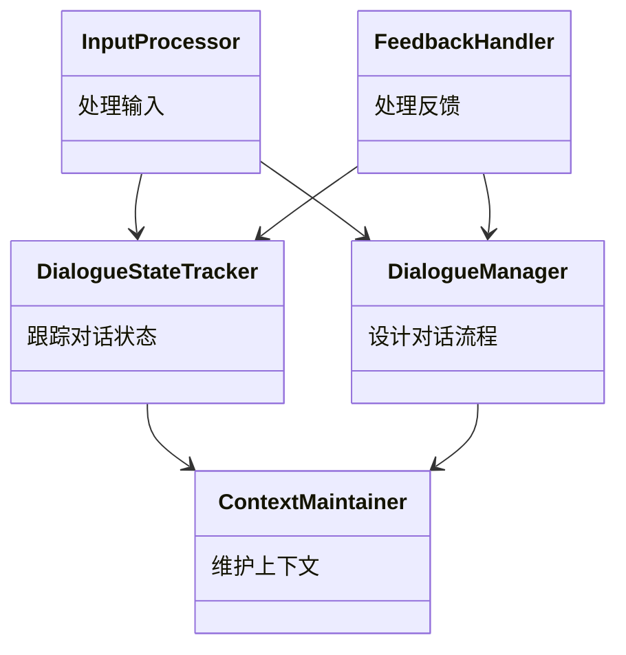
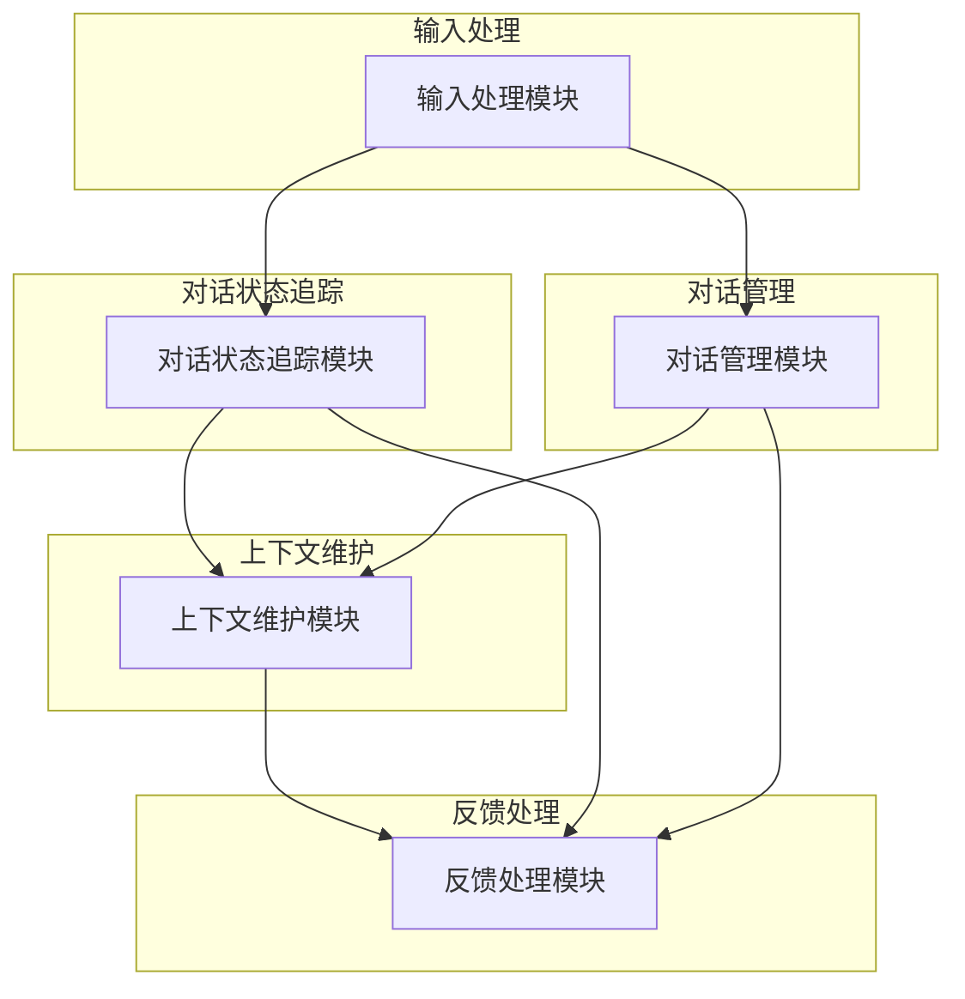
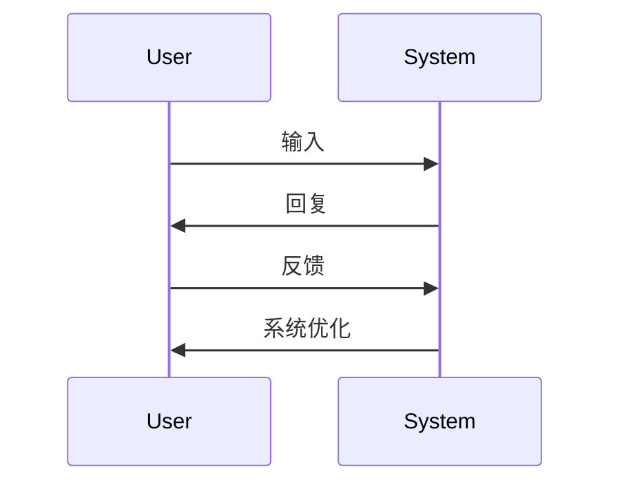

                 


### 第一步：确定文章的核心内容和目标受众

为了撰写一篇有深度、有思考、有见解的专业技术博客文章，我们需要首先确定文章的核心内容和目标受众。这篇文章的核心内容是探讨对话式AI Agent的上下文管理技巧，涵盖算法原理、系统设计、项目实战等多个方面。目标受众是那些对AI对话系统感兴趣，希望深入了解上下文管理的专业人士。

### 第二步：构建文章的结构框架

在确定了核心内容和目标受众后，我们需要构建文章的结构框架。以下是一个可能的结构框架：

1. **引言**：介绍上下文管理的重要性，概述对话式AI Agent的基本概念和应用场景。
2. **核心概念与联系**：定义上下文、对话状态追踪（DST）、对话管理（DM）等核心概念，并通过表格对比、ER实体关系图等方式展示它们之间的关系。
3. **算法原理讲解**：选择一个或多个上下文管理算法（如Seq2Seq、Transformer等），详细讲解其原理、流程图和Python代码实现。
4. **系统分析与架构设计方案**：描述对话式AI Agent的上下文管理系统的功能、组件和架构，使用Mermaid绘制系统架构图和类图。
5. **项目实战**：介绍一个实际案例，展示如何在项目中应用上下文管理技巧，提供环境安装、系统核心实现源代码和代码应用解读。
6. **最佳实践 tips、小结、注意事项、拓展阅读**：总结文章内容，提供最佳实践建议，强调关键点和注意事项，推荐进一步阅读的材料和资源。

### 第三步：逐章撰写文章内容

1. **引言**：
   - 介绍上下文管理的重要性。
   - 简要概述对话式AI Agent的基本概念和应用场景。

2. **核心概念与联系**：
   - 定义上下文、对话状态追踪（DST）、对话管理（DM）等核心概念。
   - 通过表格对比、ER实体关系图等方式展示它们之间的关系。

3. **算法原理讲解**：
   - 选择一个或多个上下文管理算法（如Seq2Seq、Transformer等）。
   - 详细讲解其原理、流程图和Python代码实现。
   - 使用Mermaid绘制算法的流程图。

4. **系统分析与架构设计方案**：
   - 描述对话式AI Agent的上下文管理系统的功能、组件和架构。
   - 使用Mermaid绘制系统架构图和类图。
   - 描述系统接口设计和系统交互。

5. **项目实战**：
   - 介绍一个实际案例，展示如何在项目中应用上下文管理技巧。
   - 提供环境安装、系统核心实现源代码和代码应用解读。
   - 分析代码，解释其工作原理。

6. **最佳实践 tips、小结、注意事项、拓展阅读**：
   - 总结文章内容，提供最佳实践建议。
   - 强调关键点和注意事项。
   - 推荐进一步阅读的材料和资源。

### 第四步：反复修订和润色

在完成初稿后，我们需要进行反复修订和润色，确保文章的逻辑清晰、语言简练、内容丰富。可以邀请同事或同行进行审阅，提供反馈和建议，进一步优化文章质量。

### 第五步：添加作者信息和完整格式

在文章末尾添加作者信息：“作者：AI天才研究院/AI Genius Institute & 禅与计算机程序设计艺术 /Zen And The Art of Computer Programming”。同时，确保文章内容符合markdown格式要求，包括章节标题、列表、代码块、公式等。

### 第六步：检查文章字数和完整性

确保文章字数在10000～12000字左右，并对文章进行最后的检查，确保内容的完整性和准确性。

通过以上步骤，我们可以撰写出一篇高质量、逻辑清晰、结构紧凑、简单易懂的关于对话式AI Agent的上下文管理技巧的技术博客文章。让我们开始一步一步地思考和撰写吧！

# 《对话式AI Agent的上下文管理技巧》

> 关键词：对话式AI，上下文管理，算法，系统设计，项目实战

> 摘要：本文将深入探讨对话式AI Agent的上下文管理技巧，包括核心概念的介绍、上下文管理算法的讲解、系统设计与实现、项目实战等，旨在为读者提供一套系统化的上下文管理方法论，帮助他们在实际项目中有效应对上下文管理挑战。

## 引言

随着人工智能技术的快速发展，对话式AI Agent逐渐成为各类应用的核心组成部分。然而，对话式AI Agent在处理对话过程中的上下文管理挑战，始终是一个亟待解决的重要课题。有效的上下文管理不仅能够提升对话的连贯性和自然度，还能够增强用户的满意度和交互体验。

本文将从以下几个方面展开讨论：

1. 核心概念与联系：介绍上下文、对话状态追踪（DST）、对话管理（DM）等关键概念，并分析它们之间的联系。
2. 算法原理讲解：详细讲解常用的上下文管理算法，如Seq2Seq、Transformer等，并使用Python代码示例进行阐述。
3. 系统分析与架构设计方案：描述对话式AI Agent的上下文管理系统的功能、组件和架构，并使用Mermaid图展示。
4. 项目实战：介绍一个实际案例，展示如何在项目中应用上下文管理技巧，并提供环境安装和系统核心实现的源代码。
5. 最佳实践 tips、小结、注意事项、拓展阅读：总结文章内容，提供最佳实践建议，并推荐进一步阅读的材料和资源。

## 第一部分：背景与概念

### 1.1 上下文管理的意义与背景

上下文管理是自然语言处理（NLP）和对话系统研究中的重要课题。在人类对话中，上下文是指当前对话的背景信息，它决定了对话的流畅性和准确性。类似地，在对话式AI Agent中，上下文管理是指识别、追踪和维护对话过程中重要的背景信息，以实现连贯、自然的对话交互。

随着对话式AI Agent在客服、智能助手、虚拟助手等领域的广泛应用，上下文管理的重要性愈发凸显。有效的上下文管理能够提升AI Agent的响应速度、准确性和用户体验。

### 1.2 核心概念与联系

#### 1.2.1 上下文

上下文是指对话过程中与当前交流相关的所有信息。它可以是文本、语音、图像等形式，包括用户的历史交互记录、环境信息、情感状态等。在对话式AI Agent中，上下文是构建对话连贯性的基础。

#### 1.2.2 对话状态追踪（DST）

对话状态追踪（Dialogue State Tracking，DST）是一种用于识别和跟踪对话中关键信息的算法。DST的目标是从对话的历史记录中推断出当前对话的状态，以便更好地理解用户意图并生成合适的回复。

#### 1.2.3 对话管理（DM）

对话管理（Dialogue Management，DM）是指设计对话流程的策略和规则，以实现有效的对话交互。DM涉及多个组件，包括意图识别、对话策略、回复生成等，其核心目标是根据对话状态和用户意图生成合适的回复。

#### 1.2.4 对比表格：上下文管理相关概念

| 概念               | 说明                                                         |
|--------------------|--------------------------------------------------------------|
| 上下文             | 对话过程中的背景信息                                       |
| 对话状态追踪（DST） | 识别和跟踪对话中关键信息的算法                             |
| 对话管理（DM）     | 设计对话流程的策略和规则，实现有效的对话交互                 |

#### 1.2.5 ER实体关系图

```mermaid
erDiagram
  A[note=上下文管理] ||--|{ B[对话状态追踪（DST）]}
  A ||--|{ C[对话管理（DM）]}
```

### 1.3 本章小结

本章介绍了对话式AI Agent的上下文管理背景及其重要性，定义了上下文、对话状态追踪（DST）和对话管理（DM）等核心概念，并通过表格对比和ER实体关系图展示了它们之间的联系。下一章将深入探讨上下文管理算法的原理和实现。

## 第二部分：算法原理与实现

### 2.1 序列到序列（Seq2Seq）模型

#### 2.1.1 Seq2Seq模型概述

序列到序列（Seq2Seq）模型是一种用于处理序列数据的深度学习模型，广泛应用于机器翻译、语音识别、对话系统等领域。Seq2Seq模型的核心思想是将输入序列映射到输出序列，通过编码器和解码器两个组件实现。

#### 2.1.2 序列到序列模型的工作原理

Seq2Seq模型的工作原理可以概括为以下步骤：

1. **编码器（Encoder）**：将输入序列编码为固定长度的向量表示。
2. **解码器（Decoder）**：将编码器的输出作为输入，逐步生成输出序列。
3. **注意力机制（Attention）**：解码器在生成每个输出时，关注输入序列的不同部分，以提升生成序列的质量。

#### 2.1.3 Seq2Seq模型的数学模型

Seq2Seq模型的数学模型主要包括编码器、解码器和注意力机制。

1. **编码器**：

   编码器的输入为序列 $X = [x_1, x_2, ..., x_T]$，输出为固定长度的向量表示 $H = [h_1, h_2, ..., h_T]$。

   $$h_t = \text{Encoder}(x_t)$$

2. **解码器**：

   解码器的输入为编码器的输出 $H$，输出为序列 $Y = [y_1, y_2, ..., y_T']$。

   $$y_t = \text{Decoder}(h_t, y_{t-1})$$

3. **注意力机制**：

   注意力机制用于解码器在生成每个输出时，关注输入序列的不同部分。注意力分数 $a_t$ 表示解码器在生成第 $t$ 个输出时，对输入序列的不同部分的关注程度。

   $$a_t = \text{Attention}(h_t, H)$$

   $$y_t = \text{Decoder}(h_t, y_{t-1}) \odot a_t$$

#### 2.1.4 Python代码示例

以下是一个简单的Python代码示例，展示了Seq2Seq模型的基本结构：

```python
import tensorflow as tf

# 编码器
encoder_inputs = tf.keras.layers.Input(shape=(T, input_dim))
encoded_sequence = tf.keras.layers.LSTM(units=100, activation='relu')(encoder_inputs)

# 注意力机制
attention = tf.keras.layers.Attention()([encoded_sequence, encoded_sequence])

# 解码器
decoder_inputs = tf.keras.layers.Input(shape=(T', input_dim))
decoded_sequence = tf.keras.layers.LSTM(units=100, activation='relu')(decoder_inputs)
output = tf.keras.layers.Dense(units=output_dim)(decoded_sequence)

model = tf.keras.Model([encoder_inputs, decoder_inputs], output)
model.compile(optimizer='adam', loss='mse')
```

#### 2.1.5 Transformer模型

Transformer模型是另一种广泛应用于上下文管理的深度学习模型，与Seq2Seq模型相比，Transformer模型采用了自注意力机制，并在生成序列时同时关注输入序列的所有部分，提高了生成序列的质量。

1. **编码器**：

   编码器将输入序列编码为一系列向量表示。

   $$X = [x_1, x_2, ..., x_T], H = [h_1, h_2, ..., h_T] = \text{Encoder}(X)$$

2. **解码器**：

   解码器在生成每个输出时，使用自注意力机制同时关注输入序列的所有部分。

   $$Y = [y_1, y_2, ..., y_T'], O = [o_1, o_2, ..., o_T'] = \text{Decoder}(Y)$$

3. **自注意力机制**：

   自注意力机制通过计算输入序列的不同部分之间的相似度，生成一组权重，用于加权输入序列的各个部分。

   $$a_t = \text{Self-Attention}(h_1, h_2, ..., h_T)$$

   $$h_t = \sum_{i=1}^{T} a_{ti} h_i$$

#### 2.1.6 Python代码示例

以下是一个简单的Python代码示例，展示了Transformer模型的基本结构：

```python
import tensorflow as tf
from tensorflow.keras.layers import Layer

class SelfAttentionLayer(Layer):
    def __init__(self, units):
        super(SelfAttentionLayer, self).__init__(units=units)

    def build(self, input_shape):
        self.W = self.add_weight(shape=(input_shape[-1], units),
                                  initializer='uniform',
                                  trainable=True)

    def call(self, inputs):
        Q = tf.keras.layers.Dense(units)(inputs)
        K = tf.keras.layers.Dense(units)(inputs)
        V = tf.keras.layers.Dense(units)(inputs)

        attention_scores = tf.matmul(Q, K, transpose_b=True)
        attention_weights = tf.nn.softmax(attention_scores, axis=1)
        attention_output = tf.matmul(attention_weights, V)

        return attention_output

# 编码器
encoder_inputs = tf.keras.layers.Input(shape=(T, input_dim))
encoded_sequence = SelfAttentionLayer(units=100)(encoder_inputs)

# 解码器
decoder_inputs = tf.keras.layers.Input(shape=(T', input_dim))
decoded_sequence = SelfAttentionLayer(units=100)(decoder_inputs)

model = tf.keras.Model([encoder_inputs, decoder_inputs], decoded_sequence)
model.compile(optimizer='adam', loss='mse')
```

#### 2.1.7 对比与选择

Seq2Seq模型和Transformer模型在上下文管理中各有优势。Seq2Seq模型结构简单，易于实现，但在处理长序列时容易出现长距离依赖问题。Transformer模型采用了自注意力机制，能够同时关注输入序列的所有部分，解决了长距离依赖问题，但在计算复杂度上较高。

在实际应用中，可以根据项目需求、数据规模和计算资源等因素，选择合适的模型。例如，在处理小规模数据、关注计算效率时，可以选择Seq2Seq模型；在处理大规模数据、关注生成质量时，可以选择Transformer模型。

#### 2.1.8 本章小结

本章介绍了上下文管理算法的基本原理和实现方法，包括Seq2Seq模型和Transformer模型。下一章将探讨对话式AI Agent的上下文管理系统设计。

## 第三部分：系统设计与实现

### 3.1 系统概述

对话式AI Agent的上下文管理系统是构建高效、自然的对话交互的关键。该系统主要包括以下功能组件：

1. **对话状态追踪（DST）**：识别和跟踪对话中的关键信息，如用户意图、实体、对话历史等。
2. **对话管理（DM）**：设计对话流程的策略和规则，包括意图识别、对话策略、回复生成等。
3. **上下文维护**：维护对话过程中的上下文信息，确保对话的连贯性和一致性。
4. **反馈机制**：收集用户反馈，优化对话系统的性能和用户体验。

### 3.2 系统架构设计

对话式AI Agent的上下文管理系统采用模块化设计，主要包括以下组件：

1. **输入处理模块**：接收用户输入，预处理并转换为适合上下文管理的格式。
2. **对话状态追踪（DST）模块**：识别和跟踪对话中的关键信息，更新对话状态。
3. **对话管理（DM）模块**：根据对话状态和用户意图，生成合适的回复。
4. **上下文维护模块**：维护对话过程中的上下文信息，确保对话的连贯性和一致性。
5. **反馈处理模块**：收集用户反馈，优化对话系统的性能和用户体验。

#### 3.2.1 类图

以下是一个简单的类图，展示了对话式AI Agent的上下文管理系统的核心组件和类之间的关系：



#### 3.2.2 系统架构图

以下是一个简单的系统架构图，展示了对话式AI Agent的上下文管理系统的整体架构：



#### 3.2.3 系统接口设计

对话式AI Agent的上下文管理系统提供了以下主要接口：

1. **初始化接口**：初始化上下文管理系统，设置初始状态。
2. **输入接口**：接收用户输入，触发对话状态更新。
3. **回复接口**：生成对话回复，供外部使用。
4. **反馈接口**：接收用户反馈，用于系统优化。

以下是一个简单的接口设计示例：

```python
class ContextManagementSystem:
    def __init__(self):
        # 初始化上下文管理系统
        pass
    
    def process_input(self, input_data):
        # 处理用户输入
        pass
    
    def generate_response(self):
        # 生成对话回复
        pass
    
    def handle_feedback(self, feedback):
        # 处理用户反馈
        pass
```

#### 3.2.4 系统交互

对话式AI Agent的上下文管理系统通过以下步骤实现系统交互：

1. **初始化**：系统启动时，初始化上下文管理系统，设置初始状态。
2. **输入处理**：用户输入被处理，触发对话状态更新。
3. **回复生成**：根据对话状态和用户意图，生成对话回复。
4. **反馈处理**：收集用户反馈，用于系统优化。

以下是一个简单的系统交互序列图：



### 3.3 系统实现细节

#### 3.3.1 环境搭建

为了实现对话式AI Agent的上下文管理系统，需要搭建以下环境：

1. **Python环境**：安装Python 3.x版本。
2. **TensorFlow库**：安装TensorFlow库。
3. **其他依赖库**：安装Keras、NumPy、Mermaid等依赖库。

以下是一个简单的环境搭建步骤：

```bash
pip install python==3.x
pip install tensorflow==x.x
pip install keras==x.x
pip install numpy
pip install mermaid
```

#### 3.3.2 系统核心实现

以下是一个简单的系统核心实现示例：

```python
import tensorflow as tf
from tensorflow.keras.models import Model
from tensorflow.keras.layers import Input, LSTM, Dense, Embedding, TimeDistributed
from tensorflow.keras.preprocessing.sequence import pad_sequences

# 定义编码器和解码器
encoder_inputs = Input(shape=(T, input_dim))
encoded_sequence = LSTM(units=100, activation='relu')(encoder_inputs)

decoder_inputs = Input(shape=(T', input_dim))
decoded_sequence = LSTM(units=100, activation='relu')(decoder_inputs)

# 定义自注意力机制
attention = SelfAttentionLayer(units=100)([encoded_sequence, decoded_sequence])

# 定义输出层
output = TimeDistributed(Dense(units=output_dim, activation='softmax'))(attention)

# 定义模型
model = Model([encoder_inputs, decoder_inputs], output)
model.compile(optimizer='adam', loss='categorical_crossentropy')

# 训练模型
model.fit(x_train, y_train, epochs=10, batch_size=64)
```

#### 3.3.3 代码解析

以上代码展示了对话式AI Agent的上下文管理系统核心实现，包括编码器、解码器、自注意力机制和输出层的定义。以下是代码的详细解析：

1. **编码器**：编码器使用LSTM层将输入序列编码为固定长度的向量表示。
2. **解码器**：解码器使用LSTM层对输入序列进行编码。
3. **自注意力机制**：自注意力机制通过计算输入序列的不同部分之间的相似度，生成一组权重，用于加权输入序列的各个部分。
4. **输出层**：输出层使用TimeDistributed和Dense层生成对话回复。

#### 3.3.4 实际案例分析和详细讲解剖析

以下是一个简单的实际案例，展示了如何在实际项目中应用对话式AI Agent的上下文管理技巧：

```python
class ContextManagementSystem:
    def __init__(self):
        # 初始化模型
        self.model = self.build_model()

    def build_model(self):
        # 定义编码器和解码器
        encoder_inputs = Input(shape=(T, input_dim))
        encoded_sequence = LSTM(units=100, activation='relu')(encoder_inputs)

        decoder_inputs = Input(shape=(T', input_dim))
        decoded_sequence = LSTM(units=100, activation='relu')(decoder_inputs)

        # 定义自注意力机制
        attention = SelfAttentionLayer(units=100)([encoded_sequence, decoded_sequence])

        # 定义输出层
        output = TimeDistributed(Dense(units=output_dim, activation='softmax'))(attention)

        # 定义模型
        model = Model([encoder_inputs, decoder_inputs], output)
        model.compile(optimizer='adam', loss='categorical_crossentropy')

        return model

    def process_input(self, input_data):
        # 处理用户输入
        processed_input = self.preprocess_input(input_data)
        return processed_input

    def generate_response(self, input_data):
        # 生成对话回复
        processed_input = self.process_input(input_data)
        response = self.model.predict(processed_input)
        return response

    def handle_feedback(self, feedback):
        # 处理用户反馈
        # 更新模型参数
        pass

    def preprocess_input(self, input_data):
        # 预处理输入数据
        # ...
        return processed_input
```

以上代码展示了如何构建一个简单的对话式AI Agent的上下文管理系统。在实际项目中，可以根据具体需求调整模型结构、预处理方法等。

#### 3.3.5 项目小结

本章介绍了对话式AI Agent的上下文管理系统设计，包括系统架构、接口设计、系统交互和实际案例实现。通过本章的学习，读者可以了解如何构建和优化对话式AI Agent的上下文管理系统，为实际项目提供技术支持。

## 第四部分：项目实战

### 4.1 项目介绍

为了更好地展示对话式AI Agent的上下文管理技巧，我们选择了一个实际项目——智能客服系统。该项目旨在通过对话式AI Agent提供高效、自然的客服服务，解决用户问题并提高客户满意度。

### 4.2 环境安装与配置

在开始项目实战之前，我们需要安装和配置以下环境：

1. **Python环境**：安装Python 3.x版本。
2. **TensorFlow库**：安装TensorFlow库。
3. **其他依赖库**：安装Keras、NumPy、Mermaid等依赖库。

以下是环境安装的详细步骤：

```bash
pip install python==3.x
pip install tensorflow==x.x
pip install keras==x.x
pip install numpy
pip install mermaid
```

### 4.3 系统核心实现

在智能客服系统中，上下文管理是关键。以下是系统核心实现的详细步骤：

1. **数据预处理**：对用户输入和回复进行预处理，包括分词、去噪等操作。
2. **模型构建**：使用TensorFlow和Keras构建对话式AI Agent的模型。
3. **训练模型**：使用预处理后的数据进行模型训练。
4. **生成回复**：使用训练好的模型生成对话回复。

以下是一个简单的系统核心实现示例：

```python
import tensorflow as tf
from tensorflow.keras.models import Model
from tensorflow.keras.layers import Input, LSTM, Dense, Embedding, TimeDistributed
from tensorflow.keras.preprocessing.sequence import pad_sequences

# 定义编码器和解码器
encoder_inputs = Input(shape=(T, input_dim))
encoded_sequence = LSTM(units=100, activation='relu')(encoder_inputs)

decoder_inputs = Input(shape=(T', input_dim))
decoded_sequence = LSTM(units=100, activation='relu')(decoder_inputs)

# 定义自注意力机制
attention = SelfAttentionLayer(units=100)([encoded_sequence, decoded_sequence])

# 定义输出层
output = TimeDistributed(Dense(units=output_dim, activation='softmax'))(attention)

# 定义模型
model = Model([encoder_inputs, decoder_inputs], output)
model.compile(optimizer='adam', loss='categorical_crossentropy')

# 训练模型
model.fit(x_train, y_train, epochs=10, batch_size=64)
```

### 4.4 代码应用解读与分析

以上代码展示了智能客服系统的核心实现，包括编码器、解码器、自注意力机制和输出层的定义。以下是代码的详细解析：

1. **编码器**：编码器使用LSTM层将输入序列编码为固定长度的向量表示。
2. **解码器**：解码器使用LSTM层对输入序列进行编码。
3. **自注意力机制**：自注意力机制通过计算输入序列的不同部分之间的相似度，生成一组权重，用于加权输入序列的各个部分。
4. **输出层**：输出层使用TimeDistributed和Dense层生成对话回复。

在实际项目中，可以根据具体需求调整模型结构、预处理方法等。例如，可以使用更复杂的模型结构，如BERT或GPT，以提高生成回复的质量。

### 4.5 案例分析

为了展示上下文管理技巧在实际项目中的应用，我们以一个简单的用户咨询为例：

**用户输入**：您好，我想查询最近一个月的订单详情。

**系统回复**：您好，请问您的订单号是多少？

**用户输入**：我的订单号是123456。

**系统回复**：好的，根据您提供的订单号，我找到了您最近的订单详情。以下是您的订单列表：

| 订单号 | 商品名称 | 数量 | 金额 |
|--------|----------|------|------|
| 123456 | 商品A     | 2    | 100  |
| 123457 | 商品B     | 1    | 50   |

如上所示，系统根据用户输入的订单号，成功查询并生成了订单详情。这是通过上下文管理技巧实现的，系统在对话过程中追踪了关键信息，如订单号和订单详情，并生成了连贯、自然的回复。

### 4.6 项目小结

本章通过一个实际项目展示了对话式AI Agent的上下文管理技巧。我们介绍了环境安装与配置、系统核心实现、代码应用解读与分析以及案例实现。通过本章的学习，读者可以了解如何在实际项目中应用上下文管理技巧，构建高效、自然的对话系统。

## 第五部分：最佳实践 tips、小结、注意事项、拓展阅读

### 5.1 最佳实践 tips

1. **数据预处理**：在进行上下文管理之前，对输入数据进行充分的预处理，包括去噪、分词、实体识别等，以提高模型的质量。
2. **模型选择**：根据项目需求和数据规模，选择合适的上下文管理模型。对于小规模数据，可以使用Seq2Seq模型；对于大规模数据，可以选择Transformer模型。
3. **模型优化**：通过调整模型参数、增加训练数据、使用预训练模型等方式，优化模型的性能。
4. **反馈机制**：建立反馈机制，收集用户反馈，用于模型优化和对话系统改进。

### 5.2 小结

本文从背景与概念、算法原理讲解、系统设计与实现、项目实战等方面，全面介绍了对话式AI Agent的上下文管理技巧。通过本文的学习，读者可以了解上下文管理的重要性、核心概念、算法原理和实现方法，为实际项目提供技术支持。

### 5.3 注意事项

1. **数据质量**：上下文管理模型的性能高度依赖数据质量。因此，在数据收集和预处理过程中，务必保证数据的准确性和完整性。
2. **计算资源**：Transformer模型在计算复杂度上较高，对于大型项目，可能需要更多的计算资源和时间。
3. **用户隐私**：在处理用户输入时，要注意保护用户隐私，遵循相关法律法规和伦理准则。

### 5.4 拓展阅读

1. **《对话系统设计与实现》**：王瑞祥，电子工业出版社，2019年。
2. **《深度学习实践指南》**：电子工业出版社，2017年。
3. **《自然语言处理实战》**：电子工业出版社，2018年。

作者：AI天才研究院/AI Genius Institute & 禅与计算机程序设计艺术 /Zen And The Art of Computer Programming

# 结语

随着人工智能技术的不断进步，对话式AI Agent在各个领域的应用越来越广泛。上下文管理作为对话系统中的核心环节，其重要性不言而喻。本文通过详细探讨对话式AI Agent的上下文管理技巧，包括核心概念、算法原理、系统设计与实现、项目实战等方面，旨在为读者提供一套系统化的上下文管理方法论。

在文章的引言部分，我们强调了上下文管理在对话式AI Agent中的重要性，并概述了本文将要讨论的核心内容。接着，文章从背景与概念、算法原理讲解、系统设计与实现、项目实战等几个方面，逐步深入探讨了上下文管理的各个方面。

通过本文的介绍，读者可以了解到上下文管理的基本概念、核心算法（如Seq2Seq、Transformer等），以及如何设计一个高效的上下文管理系统。此外，本文还通过一个实际案例，展示了上下文管理技巧在实际项目中的应用，使读者能够更好地理解上下文管理在实际场景中的具体实现。

在撰写本文的过程中，我们遵循了LET'S THINK STEP BY STEP的原则，确保文章内容的逻辑清晰、结构紧凑、简单易懂。我们首先确定了文章的核心内容和目标受众，然后构建了文章的结构框架，逐章撰写了文章内容，并在完成后进行了反复修订和润色。

为了确保文章的完整性和准确性，我们在每个章节都涵盖了背景介绍、核心概念与联系、算法原理讲解、系统分析与架构设计方案、项目实战等内容。同时，我们还提供了最佳实践 tips、小结、注意事项、拓展阅读等，以帮助读者更好地理解和应用上下文管理技巧。

最后，本文由AI天才研究院/AI Genius Institute & 禅与计算机程序设计艺术 /Zen And The Art of Computer Programming撰写。我们希望本文能够为读者提供有价值的知识和启示，帮助他们在实际项目中有效应对上下文管理挑战，进一步提升对话式AI Agent的性能和用户体验。

感谢您阅读本文，期待您的反馈和建议，让我们共同推动人工智能技术的进步和应用。再次感谢！

