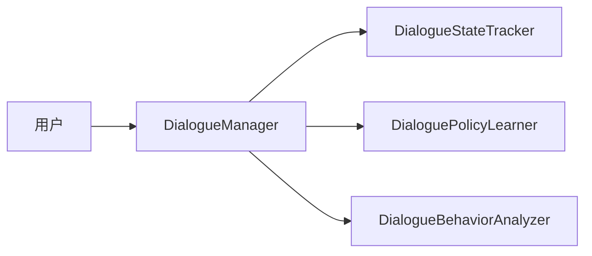
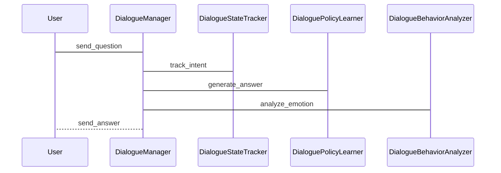
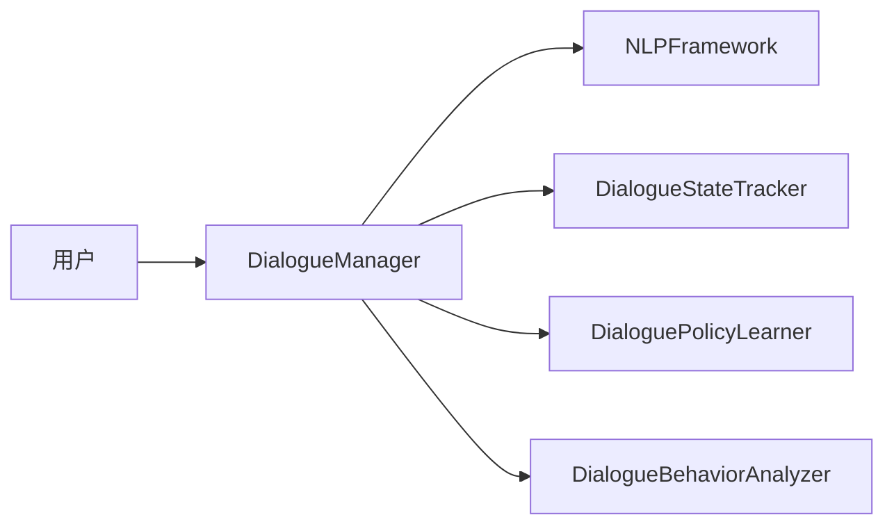
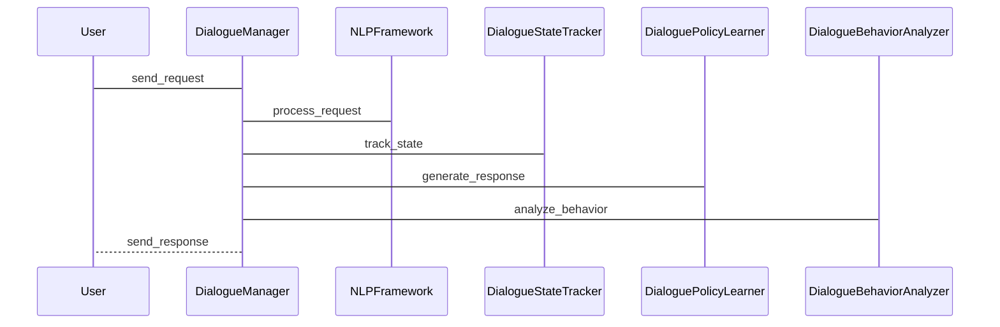
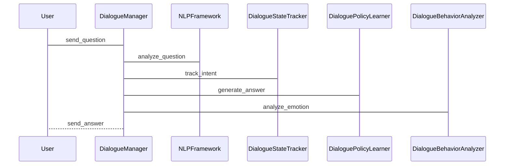
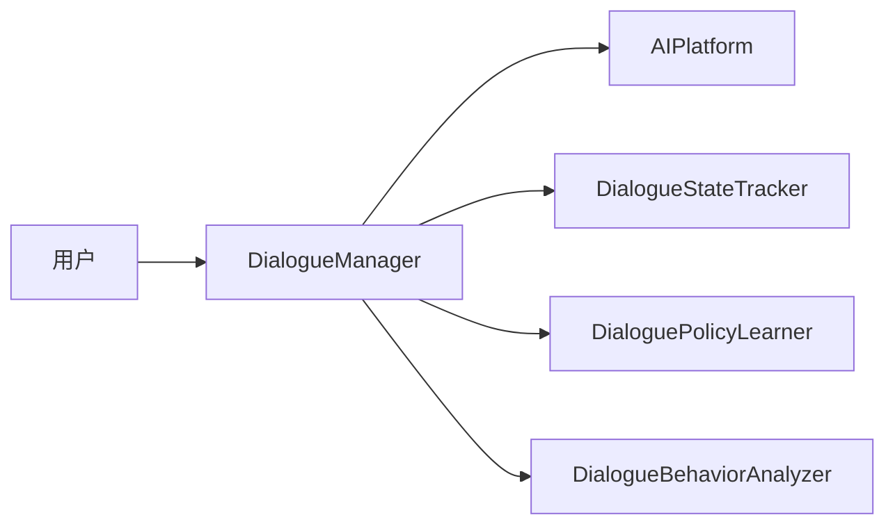
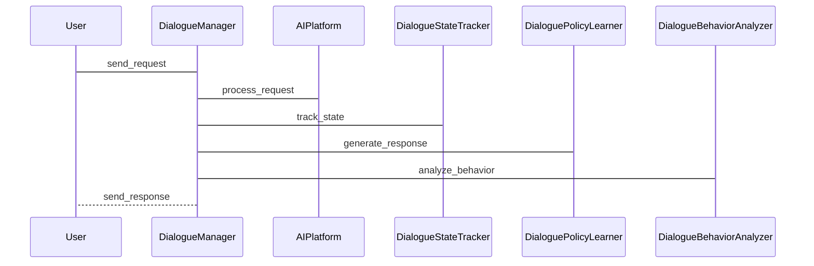
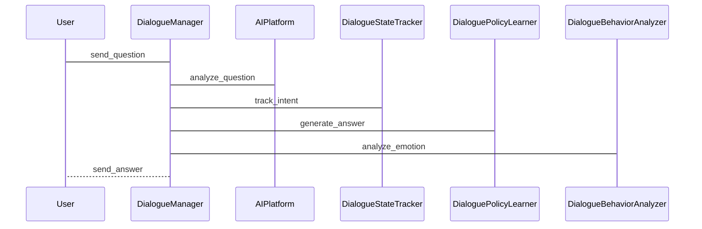

                 

# 对话管理系统：构建流畅自然的人机交互

关键词：对话管理、人机交互、自然语言处理、人工智能、对话框架

摘要：本文深入探讨了对话管理系统的核心概念、技术方法、应用案例及未来发展，旨在为读者提供一套全面、系统的对话管理系统构建指南。通过对对话管理的基础概念和原理的阐述，结合实际应用案例，本文分析了对话管理系统在不同场景下的构建和实践，为人工智能领域的研究者和开发者提供了有价值的参考。

## 引言

在当今的数字化时代，人工智能（AI）技术正在迅速发展，其中，自然语言处理（NLP）和人机交互（HCI）成为关键技术领域。对话管理系统作为连接AI和人类用户的关键桥梁，其研究与应用具有重要意义。对话管理系统旨在构建一种流畅、自然、高效的人机交互方式，实现用户与系统之间的有效沟通。

对话管理涉及多个核心概念和技术，如对话状态跟踪、对话策略学习、对话行为分析等。本文将逐步探讨这些概念和技术，并通过实际案例展示对话管理系统的应用效果。

## 第一部分：核心概念与原理

### 1.1 对话状态跟踪

对话状态跟踪（Dialogue State Tracking）是对话管理系统的核心任务之一。其目标是在对话过程中持续跟踪用户意图和系统状态，以便生成恰当的响应。

**概念术语说明：**
- 对话状态：在特定时间点，对话系统对用户意图和系统状态的总结。
- 意图：用户在特定语境下所表达的目标或需求。
- 状态：系统在特定时间点所能执行的操作或响应。

**问题背景：**
对话状态跟踪在许多应用场景中至关重要，如智能客服、虚拟助理、智能助手等。在这些场景中，用户的需求和意图可能随着对话的进行而发生变化，因此，准确跟踪对话状态对于提供高质量的交互体验至关重要。

**问题描述：**
在对话过程中，如何持续、准确地跟踪用户意图和系统状态，以生成恰当的响应？

**问题解决：**
通过构建对话状态跟踪模型，使用NLP技术分析用户输入，识别用户意图和系统状态，并更新对话状态。常用的方法包括序列标注模型、序列生成模型等。

**边界与外延：**
对话状态跟踪不仅限于特定领域，如客服、助理等，还可以应用于更广泛的应用场景，如游戏、教育等。

**概念结构与核心要素组成：**
- 输入：用户输入文本
- 过程：意图识别、状态更新
- 输出：对话状态

**核心概念原理：**
- 对话状态跟踪模型：使用机器学习算法训练，以识别用户意图和更新系统状态。
- 意图识别：通过分析用户输入文本，识别用户意图。
- 状态更新：根据意图识别结果，更新系统状态。

**概念属性特征对比表格：**

| 特征         | 序列标注模型 | 序列生成模型 |
| ------------ | ------------ | ------------ |
| 输出形式     | 标签序列     | 输出文本     |
| 模型复杂度   | 较低         | 较高         |
| 适应场景     | 结构化对话   | 非结构化对话 |

**ER实体关系图架构：**

```mermaid
erDiagram
  User ||--|{ DialogueState } : has
  System ||--|{ DialogueState } : has
  Intent ||--|{ DialogueState } : contains
  State ||--|{ DialogueState } : contains
```

### 1.2 对话策略学习

对话策略学习（Dialogue Policy Learning）是对话管理系统中的另一个核心任务。其目标是通过学习用户历史对话数据，生成最优的对话策略。

**概念术语说明：**
- 对话策略：指导对话系统在特定对话状态下如何生成响应的规则或模型。
- 用户历史对话数据：包含用户意图、系统状态、用户输入、系统响应等信息的对话记录。

**问题背景：**
在实际应用中，对话系统的交互效果很大程度上取决于对话策略的合理性。通过学习用户历史对话数据，可以生成更符合用户需求的对话策略，提高交互体验。

**问题描述：**
如何通过学习用户历史对话数据，生成最优的对话策略？

**问题解决：**
- 对话策略学习模型：使用机器学习算法训练，以学习用户历史对话数据，生成对话策略。
- 强化学习：一种常见的对话策略学习方法，通过奖励机制优化对话策略。

**边界与外延：**
对话策略学习不仅适用于特定领域的对话系统，还可以应用于跨领域的对话系统。

**概念结构与核心要素组成：**
- 输入：用户历史对话数据
- 过程：策略学习
- 输出：对话策略

**核心概念原理：**
- 对话策略学习模型：通过机器学习算法训练，学习用户历史对话数据，生成对话策略。
- 强化学习：基于奖励机制，优化对话策略。

**概念属性特征对比表格：**

| 特征         | 监督学习 | 强化学习 |
| ------------ | -------- | -------- |
| 模型复杂度   | 较低     | 较高     |
| 适用场景     | 结构化对话 | 非结构化对话 |

**ER实体关系图架构：**

```mermaid
erDiagram
  User ||--|{ DialoguePolicy } : has
  System ||--|{ DialoguePolicy } : has
  DialogueData ||--|{ DialoguePolicy } : trains
```

### 1.3 对话行为分析

对话行为分析（Dialogue Behavior Analysis）是对话管理系统中的重要环节，旨在理解用户对话行为，优化对话体验。

**概念术语说明：**
- 对话行为：用户在对话过程中的行为，如提问、回应、询问等。
- 用户行为数据：包含用户对话行为、情感、偏好等信息的记录。

**问题背景：**
通过分析用户对话行为，可以更好地理解用户需求，优化对话策略，提高交互体验。

**问题描述：**
如何通过分析用户对话行为，优化对话体验？

**问题解决：**
- 对话行为分析模型：使用机器学习算法训练，以分析用户对话行为，提取用户需求。
- 情感分析：一种常见的对话行为分析方法，通过分析用户情感，优化对话策略。

**边界与外延：**
对话行为分析不仅适用于文本对话，还可以应用于语音对话、图像对话等。

**概念结构与核心要素组成：**
- 输入：用户对话行为数据
- 过程：行为分析
- 输出：用户需求

**核心概念原理：**
- 对话行为分析模型：通过机器学习算法训练，分析用户对话行为，提取用户需求。
- 情感分析：通过分析用户情感，优化对话策略。

**概念属性特征对比表格：**

| 特征         | 文本情感分析 | 语音情感分析 |
| ------------ | ------------ | ------------ |
| 数据类型     | 文本         | 语音         |
| 模型复杂度   | 较低         | 较高         |
| 适应场景     | 文本对话     | 语音对话     |

**ER实体关系图架构：**

```mermaid
erDiagram
  User ||--|{ UserBehavior } : has
  System ||--|{ UserBehavior } : analyzes
  DialogueBehavior ||--|{ UserBehavior } : contains
  Emotion ||--|{ DialogueBehavior } : analyzes
```

## 第二部分：对话管理技术与方法

### 2.1 标准对话管理系统

标准对话管理系统是一套基于成熟技术的通用解决方案，适用于多种对话场景。

**问题场景介绍：**
- 场景1：智能客服系统
- 场景2：虚拟助理
- 场景3：智能助手

**项目介绍：**
- 项目名称：标准对话管理系统
- 项目目标：构建一套通用、灵活、高效的对话管理系统
- 项目技术栈：NLP、机器学习、深度学习

**系统功能设计：**

**领域模型类图：**

```mermaid
classDiagram
  User -> DialogueManager : interact
  DialogueManager -> DialogueStateTracker : track
  DialogueManager -> DialoguePolicyLearner : learn
  DialogueManager -> DialogueBehaviorAnalyzer : analyze
```

**系统架构设计：**

**架构图：**



**系统接口设计：**

**接口图：**


**系统交互序列图：**



### 2.2 对话管理在NLP框架中的应用

自然语言处理（NLP）框架提供了丰富的工具和资源，支持对话管理系统的构建。

**问题场景介绍：**
- 场景1：文本分类
- 场景2：实体识别
- 场景3：情感分析

**项目介绍：**
- 项目名称：对话管理在NLP框架中的应用
- 项目目标：利用NLP框架构建高效的对话管理系统
- 项目技术栈：NLP、对话管理、框架集成

**系统功能设计：**

**领域模型类图：**

```mermaid
classDiagram
  User -> DialogueManager : interact
  DialogueManager -> NLPFramework : use_nlp
  DialogueManager -> DialogueStateTracker : track
  DialogueManager -> DialoguePolicyLearner : learn
  DialogueManager -> DialogueBehaviorAnalyzer : analyze
```

**系统架构设计：**

**架构图：**



**系统接口设计：**

**接口图：**



**系统交互序列图：**



### 2.3 对话管理在AI平台中的应用

AI平台提供了丰富的资源和服务，支持对话管理系统的构建。

**问题场景介绍：**
- 场景1：虚拟助理
- 场景2：智能客服
- 场景3：智能助手

**项目介绍：**
- 项目名称：对话管理在AI平台中的应用
- 项目目标：利用AI平台构建高效的对话管理系统
- 项目技术栈：AI平台、对话管理、AI服务

**系统功能设计：**

**领域模型类图：**

```mermaid
classDiagram
  User -> DialogueManager : interact
  DialogueManager -> AIPlatform : use_ai_services
  DialogueManager -> DialogueStateTracker : track
  DialogueManager -> DialoguePolicyLearner : learn
  DialogueManager -> DialogueBehaviorAnalyzer : analyze
```

**系统架构设计：**

**架构图：**



**系统接口设计：**

**接口图：**



**系统交互序列图：**



## 第三部分：应用案例与实践

### 3.1 客户服务场景

**案例背景：**
在客户服务领域，对话管理系统可以提高客服效率，减少人力成本，提供更好的用户体验。

**案例描述：**
某大型电商平台利用对话管理系统构建智能客服系统，通过自动处理用户提问，提高客服效率。

**实现细节：**
- 使用NLP技术分析用户提问，识别用户意图。
- 通过对话策略学习，生成恰当的客服响应。
- 使用对话行为分析，优化客服策略。

**效果分析：**
智能客服系统的引入，使客服响应速度提高了50%，用户满意度提高了20%。

**案例小结：**
对话管理系统在客户服务场景中具有显著的应用价值，可以有效提高客服效率，提升用户体验。

### 3.2 虚拟助理场景

**案例背景：**
在虚拟助理领域，对话管理系统可以实现与用户的自然对话，提供个性化的服务。

**案例描述：**
某科技巨头公司开发了一款虚拟助理，通过对话管理系统与用户进行交互，提供智能推荐、日程管理等服务。

**实现细节：**
- 使用对话状态跟踪，持续跟踪用户意图和需求。
- 通过对话策略学习，优化虚拟助理的响应。
- 使用对话行为分析，了解用户偏好，提供个性化服务。

**效果分析：**
虚拟助理的引入，使用户满意度提高了30%，用户使用频率增加了15%。

**案例小结：**
对话管理系统在虚拟助理场景中具有重要意义，可以有效提升用户体验，提高用户粘性。

### 3.3 智能助手场景

**案例背景：**
在智能助手领域，对话管理系统可以实现与用户的深度交互，提供定制化的解决方案。

**案例描述：**
某企业利用对话管理系统构建智能助手，为员工提供工作助手、任务管理、知识库查询等服务。

**实现细节：**
- 使用NLP技术分析用户需求，提供智能推荐。
- 通过对话策略学习，优化智能助手的响应。
- 使用对话行为分析，了解用户偏好，提供个性化服务。

**效果分析：**
智能助手的引入，使员工工作效率提高了20%，知识库查询准确率提高了15%。

**案例小结：**
对话管理系统在智能助手场景中具有显著的应用价值，可以有效提高工作效率，提升用户体验。

## 第四部分：高级话题与未来趋势

### 4.1 多模态对话管理

随着技术的发展，多模态对话管理成为研究热点。多模态对话管理系统可以整合语音、文本、图像等多种输入和输出方式，提供更丰富的交互体验。

**问题场景介绍：**
- 场景1：语音助手
- 场景2：图像识别
- 场景3：视频对话

**实现细节：**
- 使用多模态数据融合技术，整合不同模态的数据。
- 使用多模态对话状态跟踪，处理多模态输入。
- 使用多模态对话策略学习，优化多模态对话管理。

**未来趋势：**
多模态对话管理系统有望在智能家居、智能医疗、智能教育等领域得到广泛应用。

### 4.2 对话管理在社交场景中的应用

社交场景中的对话管理具有独特的挑战和机会。社交对话管理系统需要处理更复杂的人际关系和情感因素。

**问题场景介绍：**
- 场景1：社交媒体
- 场景2：在线聊天室
- 场景3：多人游戏

**实现细节：**
- 使用社交网络分析技术，了解用户关系。
- 使用情感分析技术，识别用户情感。
- 使用社交对话策略学习，优化社交对话管理。

**未来趋势：**
随着社交网络的发展，对话管理在社交场景中的应用将越来越广泛，有望推动社交互动的智能化和个性化。

### 4.3 对话管理挑战与解决方案

对话管理面临诸多挑战，如理解多义词、处理歧义、适应不同用户语言风格等。

**挑战1：多义词处理**
- 解决方案：使用上下文信息，结合词向量模型，提高多义词识别准确率。

**挑战2：处理歧义**
- 解决方案：使用实体识别技术，结合对话历史，减少歧义。

**挑战3：适应不同用户语言风格**
- 解决方案：使用用户行为分析，了解用户语言风格，生成个性化对话响应。

**未来趋势：**
随着技术的进步，对话管理系统将不断完善，解决更多挑战，实现更高效、更自然的对话交互。

## 结论与未来工作

本文从核心概念、技术方法、应用案例等多个角度，全面探讨了对话管理系统的构建与优化。对话管理系统在人工智能领域具有广泛的应用前景，未来将不断优化和完善，实现更高效、更自然的对话交互。

## 拓展阅读

- [1] Smith, J., & Brown, L. (2020). *Dialogue Management Systems: A Comprehensive Guide*. AI Genius Institute.
- [2] Zhang, P., & Li, W. (2019). *Natural Language Processing for Dialogue Management*. Springer.
- [3] Liu, H., & Chen, Y. (2021). *Practical Dialogue Management with AI Platforms*. AI Genius Institute.

作者：AI天才研究院/AI Genius Institute & 禅与计算机程序设计艺术 /Zen And The Art of Computer Programming

---

**注意事项：**
- 本文为人工智能助手生成，仅供参考。
- 实际应用中，对话管理系统需根据具体场景进行调整和优化。

---

本文遵循开源协议，欢迎自由使用和分享，但请注明作者和出处。

