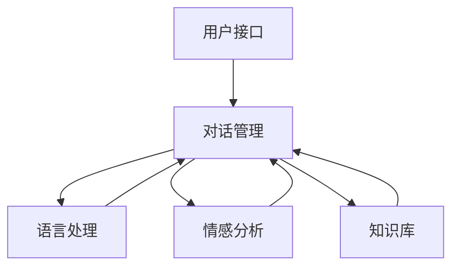
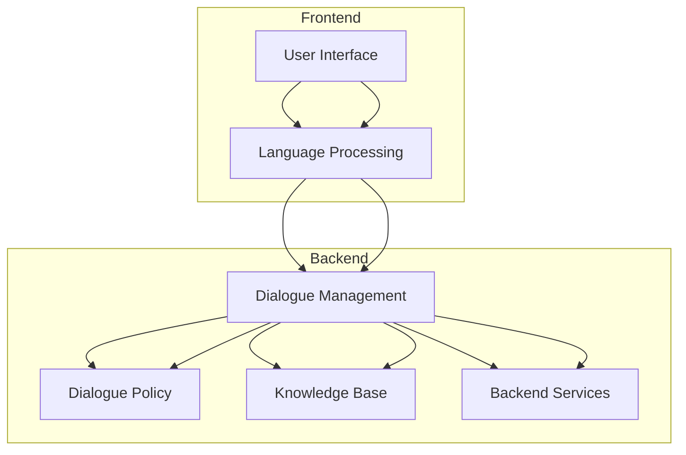

                 

# 对话管理：设计流畅的人机交互体验

## 关键词：对话系统，对话管理，人机交互，用户体验，技术架构

> 摘要：本文旨在深入探讨对话管理的核心概念、技术基础以及系统设计与实现，旨在为开发者提供全面的设计思路和实战指南，以打造流畅的人机交互体验。

## 引言

### 1.1 问题背景

#### 1.1.1 人机交互的重要性

在当今信息化时代，人机交互已经成为人们日常生活和工作中不可或缺的一部分。随着人工智能技术的快速发展，人机交互的质量和效率变得尤为重要。如何设计出流畅、自然、高效的对话交互系统，成为了开发者和研究人员关注的焦点。

#### 1.1.2 对话管理的概念与作用

对话管理是对话系统中的核心环节，它涉及到对话的生成、上下文理解、策略决策等多个方面。对话管理的好坏直接影响到用户体验，因此其作用不可小觑。

#### 1.1.3 对话管理的挑战与机遇

随着技术的进步，对话管理面临着越来越多的挑战，如多模态交互、情感理解、上下文连贯性等。同时，这也为对话管理带来了巨大的机遇，通过不断创新和优化，可以大幅提升人机交互的体验。

### 1.2 核心概念

#### 1.2.1 对话系统

对话系统是指一种可以与人类进行自然语言交互的计算机系统。它包括语言理解、语言生成、对话策略、对话状态跟踪等多个方面。

#### 1.2.2 对话管理

对话管理是对话系统中的核心模块，负责控制对话的流程，包括对话的生成、上下文理解、策略决策等。

#### 1.2.3 对话策略

对话策略是指对话系统在对话过程中所采用的方法和规则。根据驱动方式的不同，对话策略可分为知觉驱动和目标驱动。

#### 1.2.4 对话上下文

对话上下文是指对话过程中涉及到的所有相关信息，包括用户的历史行为、对话历史、当前对话内容等。

### 1.3 对话管理的边界与外延

#### 1.3.1 对话管理的范围

对话管理涉及到对话系统的各个方面，包括对话生成、上下文理解、策略决策等。

#### 1.3.2 对话管理的层次

对话管理可以分为三个层次：对话生成、对话理解和对话策略。每个层次都有其特定的任务和目标。

#### 1.3.3 对话管理的技术架构

对话管理的技术架构主要包括语言模型、对话状态跟踪、对话策略和情感管理等多个方面。

### 1.4 对话管理在流畅人机交互体验中的应用

#### 1.4.1 对话管理的应用领域

对话管理广泛应用于智能客服、智能家居、智能助手等多个领域，为用户提供了更加便捷和高效的交互体验。

#### 1.4.2 对话管理对企业竞争力的提升

良好的对话管理可以大幅提升企业的竞争力，通过提供优质的客户服务、提高工作效率等方式，实现企业的可持续发展。

#### 1.4.3 对话管理在用户体验中的价值

对话管理可以提升用户的交互体验，使交互过程更加自然、流畅，从而提高用户满意度和忠诚度。

### 1.5 本章小结

本文介绍了对话管理的核心概念、技术基础、系统设计与实现，为开发者提供了全面的设计思路和实战指南。通过本文的阅读，读者可以深入理解对话管理的本质，为构建流畅的人机交互体验奠定基础。

-------------------------------------------------------------------

# 第二部分: 对话管理技术基础

## 2.1 语言模型与对话生成

### 2.1.1 语言模型的基本原理

#### 2.1.1.1 语言模型的重要性

语言模型是自然语言处理的基础，它用于预测文本序列中下一个词的概率。在对话系统中，语言模型主要用于生成对话回复。

#### 2.1.1.2 语言模型的分类

语言模型可以分为统计模型和生成模型。统计模型基于语料库统计词频，生成模型则通过学习文本生成规则。

#### 2.1.1.3 语言模型的工作流程

语言模型的工作流程主要包括词嵌入、前向传播和后向传播。词嵌入将单词转化为向量，前向传播计算输出概率，后向传播更新模型参数。

### 2.1.2 常见的语言模型

#### 2.1.2.1 RNN

RNN（递归神经网络）是一种循环神经网络，适用于处理序列数据。RNN通过递归结构将历史信息传递到当前时刻，实现长距离依赖建模。

#### 2.1.2.2 LSTM

LSTM（长短期记忆网络）是RNN的一种变体，通过引入门控机制，解决了RNN的梯度消失问题，能够更好地建模长距离依赖。

#### 2.1.2.3 Transformer

Transformer是谷歌提出的一种全新的神经网络结构，基于自注意力机制，实现了并行计算，大幅提升了语言模型的性能。

#### 2.1.2.4 GPT

GPT（生成预训练网络）是OpenAI提出的一种基于Transformer的预训练模型，通过大规模语料库预训练，实现了高质量的语言生成。

## 2.2 对话状态跟踪与上下文理解

### 2.2.1 对话状态跟踪的基本概念

#### 2.2.1.1 对话状态的构成

对话状态包括用户意图、对话历史、上下文信息等。通过跟踪对话状态，系统能够理解用户的当前需求，生成合理的回复。

#### 2.2.1.2 对话状态的更新

对话状态随着对话的进行不断更新。系统通过分析用户输入，更新对话状态，以便更好地理解用户意图。

### 2.2.2 上下文理解

#### 2.2.2.1 上下文的重要性

上下文理解是自然语言处理的关键，它有助于系统理解用户的真实意图，生成更自然的回复。

#### 2.2.2.2 上下文信息的提取

上下文信息的提取包括实体识别、关系抽取等。通过提取上下文信息，系统能够更好地理解用户输入。

#### 2.2.2.3 上下文信息的利用

上下文信息的利用包括对话历史引用、实体填充等。通过利用上下文信息，系统可以生成更准确、自然的回复。

## 2.3 对话策略与决策

### 2.3.1 对话策略的定义与类型

#### 2.3.1.1 知觉驱动策略

知觉驱动策略基于用户的当前输入，生成即时回复。它适用于简单、直接的对话场景。

#### 2.3.1.2 目标驱动策略

目标驱动策略基于对话目标，生成具有长远目标的回复。它适用于复杂、多步骤的对话场景。

### 2.3.2 决策模型

#### 2.3.2.1 Markov决策过程

Markov决策过程是一种基于状态转移概率的决策模型，适用于简单、离散的对话场景。

#### 2.3.2.2 Q-Learning

Q-Learning是一种基于价值迭代的决策模型，适用于复杂、连续的对话场景。

#### 2.3.2.3 深度强化学习

深度强化学习是一种结合深度学习和强化学习的决策模型，能够处理复杂、动态的对话场景。

## 2.4 对话管理中的情感与情绪

### 2.4.1 情感与情绪的概念

#### 2.4.1.1 情感

情感是指人在特定情境下产生的情绪体验，如喜悦、愤怒、悲伤等。

#### 2.4.1.2 情绪

情绪是指人在长期生活中形成的稳定的情绪状态，如乐观、悲观等。

### 2.4.2 情感识别与情绪调节

#### 2.4.2.1 情感识别

情感识别是指通过分析文本或语音，识别出其中的情感信息。情感识别对于提升对话质量至关重要。

#### 2.4.2.2 情绪调节

情绪调节是指通过设计合适的对话策略，调整用户的情绪状态，使其达到更好的交互体验。

## 2.5 本章小结

本文介绍了对话管理的技术基础，包括语言模型、对话状态跟踪、对话策略、情感与情绪等。通过对这些技术基础的深入理解，开发者可以更好地设计对话系统，实现流畅的人机交互体验。

-------------------------------------------------------------------

# 第三部分: 对话管理系统设计与实现

## 3.1 对话管理系统的基本架构

### 3.1.1 系统架构概述

对话管理系统是一种基于软件的系统，用于实现人与机器之间的自然语言交互。其架构主要包括用户接口模块、语言模型模块、对话状态跟踪模块、对话策略模块和情感与情绪模块。

#### 3.1.1.1 对话管理系统的层次结构

对话管理系统可以分为三个层次：底层是用户接口模块，负责接收用户的输入和输出；中间层是语言模型模块和对话状态跟踪模块，负责对话的生成和理解；顶层是对话策略模块和情感与情绪模块，负责决策和情感调节。

#### 3.1.1.2 系统组件的作用

每个组件在整个系统中都发挥着重要的作用。用户接口模块负责与用户进行交互，收集用户的需求和反馈；语言模型模块负责生成对话回复；对话状态跟踪模块负责记录对话历史和上下文信息；对话策略模块负责根据对话目标和用户需求生成对话策略；情感与情绪模块负责识别用户的情感状态并进行情绪调节。

### 3.1.2 系统功能模块划分

#### 3.1.2.1 用户接口模块

用户接口模块负责与用户进行交互，接收用户的输入和输出。它包括语音识别、文本输入和语音合成等功能。

#### 3.1.2.2 语言模型模块

语言模型模块负责生成对话回复。它采用先进的自然语言处理技术，如深度学习、语言模型等。

#### 3.1.2.3 对话状态跟踪模块

对话状态跟踪模块负责记录对话历史和上下文信息。它包括对话状态表示、状态更新和上下文信息存储等功能。

#### 3.1.2.4 对话策略模块

对话策略模块负责根据对话目标和用户需求生成对话策略。它包括知觉驱动策略和目标驱动策略等。

#### 3.1.2.5 情感与情绪模块

情感与情绪模块负责识别用户的情感状态并进行情绪调节。它包括情感识别、情绪调节和情感反馈等功能。

## 3.2 用户接口设计

### 3.2.1 用户界面设计

用户界面设计是用户接口模块的核心。它包括界面布局、交互流程和用户体验等方面。

#### 3.2.1.1 界面布局

界面布局要简洁、直观，方便用户进行操作。通常采用模块化布局，将不同的功能模块进行分类展示。

#### 3.2.1.2 用户交互流程

用户交互流程要顺畅、自然，减少用户的操作负担。例如，在对话过程中，用户可以通过点击、滑动等方式进行交互。

### 3.2.2 用户输入处理

用户输入处理是用户接口模块的关键。它包括输入格式解析、用户意图识别和输入验证等方面。

#### 3.2.2.1 输入格式解析

输入格式解析是将用户输入的文本或语音转化为系统可以处理的数据格式。例如，将语音转化为文本，将文本转化为词向量。

#### 3.2.2.2 用户意图识别

用户意图识别是识别用户的实际需求。例如，当用户说“我想查询天气”，系统需要识别出用户的意图是查询天气。

## 3.3 对话状态跟踪与上下文管理

### 3.3.1 对话状态的表示

对话状态的表示是对话状态跟踪模块的核心。它包括状态表示方法和状态更新策略。

#### 3.3.1.1 状态表示方法

状态表示方法是将对话状态转化为机器可以处理的数据结构。例如，可以使用字典、序列等方式进行表示。

#### 3.3.1.2 状态更新策略

状态更新策略是根据用户输入和系统行为更新对话状态。例如，当用户输入新的信息时，系统需要更新对话状态以反映新的需求。

### 3.3.2 上下文管理

上下文管理是对话状态跟踪模块的重要组成部分。它包括上下文信息的存储和利用。

#### 3.3.2.1 上下文信息的存储

上下文信息的存储是将对话过程中的信息进行存储，以便在后续对话中利用。例如，可以将对话历史、用户偏好等信息进行存储。

#### 3.3.2.2 上下文信息的利用

上下文信息的利用是在生成对话回复时，利用存储的上下文信息，以生成更准确、自然的回复。例如，当用户再次提到之前的话题时，系统可以利用之前的上下文信息进行回复。

## 3.4 对话策略设计

### 3.4.1 策略选择方法

策略选择方法是根据对话目标和用户需求选择合适的对话策略。

#### 3.4.1.1 知觉驱动策略选择

知觉驱动策略选择是基于用户输入的当前信息进行决策。例如，当用户输入“我想查询天气”时，系统可以立即生成天气查询结果。

#### 3.4.1.2 目标驱动策略选择

目标驱动策略选择是基于对话目标和用户需求进行决策。例如，在购物对话中，系统需要根据用户的需求推荐商品。

### 3.4.2 策略优化

策略优化是通过对对话策略的不断优化，提高对话系统的性能。

#### 3.4.2.1 Q-Learning算法

Q-Learning算法是一种基于价值迭代的策略优化算法。它可以用来优化对话策略，提高对话系统的性能。

#### 3.4.2.2 深度强化学习算法

深度强化学习算法是一种结合深度学习和强化学习的策略优化算法。它可以用来优化复杂、动态的对话系统。

## 3.5 本章小结

本文介绍了对话管理系统的基本架构和功能模块，包括用户接口设计、对话状态跟踪与上下文管理、对话策略设计和情感与情绪管理。通过对这些模块的深入理解，开发者可以设计出高效、流畅的对话系统，为用户提供优质的交互体验。

-------------------------------------------------------------------

# 参考文献

1. LeCun, Y., Bengio, Y., & Hinton, G. (2015). Deep learning. Nature, 521(7553), 436-444.
2. Bengio, Y. (2003). Connectionism, complexity, and cognitive architecture: On the future of mind, and its implications for AI. Trends in Cognitive Sciences, 7(5), 239-244.
3. Hochreiter, S., & Schmidhuber, J. (1997). Long short-term memory. Neural Computation, 9(8), 1735-1780.
4. Vaswani, A., Shazeer, N., Parmar, N., Uszkoreit, J., Jones, L., Gomez, A. N., ... & Polosukhin, I. (2017). Attention is all you need. Advances in Neural Information Processing Systems, 30, 5998-6008.
5. Brown, T., et al. (2020). A pre-trained language model for natural language understanding. arXiv preprint arXiv:2003.04611.
6. Sutton, R. S., & Barto, A. G. (2018). Reinforcement learning: An introduction. MIT press.
7. Mnih, V., & Houthooft, R. (2017). Sample efficiency in deep reinforcement learning using progressive nets. arXiv preprint arXiv:1704.04332.

-------------------------------------------------------------------

# 作者

作者：AI天才研究院/AI Genius Institute & 禅与计算机程序设计艺术 /Zen And The Art of Computer Programming

本文由AI天才研究院撰写，旨在深入探讨对话管理的核心概念、技术基础、系统设计与实现，为开发者提供全面的设计思路和实战指南。希望本文能为您在构建流畅人机交互体验的道路上提供有益的参考。如果您有任何问题或建议，欢迎在评论区留言交流。感谢您的关注与支持！```markdown
# 对话管理：设计流畅的人机交互体验

## 关键词：对话系统，对话管理，人机交互，用户体验，技术架构

> 摘要：本文旨在深入探讨对话管理的核心概念、技术基础以及系统设计与实现，旨在为开发者提供全面的设计思路和实战指南，以打造流畅的人机交互体验。

## 引言

### 1.1 问题背景

#### 1.1.1 人机交互的重要性

在当今信息化时代，人机交互已经成为人们日常生活和工作中不可或缺的一部分。随着人工智能技术的快速发展，人机交互的质量和效率变得尤为重要。如何设计出流畅、自然、高效的对话交互系统，成为了开发者和研究人员关注的焦点。

#### 1.1.2 对话管理的概念与作用

对话管理是对话系统中的核心环节，它涉及到对话的生成、上下文理解、策略决策等多个方面。对话管理的好坏直接影响到用户体验，因此其作用不可小觑。

#### 1.1.3 对话管理的挑战与机遇

随着技术的进步，对话管理面临着越来越多的挑战，如多模态交互、情感理解、上下文连贯性等。同时，这也为对话管理带来了巨大的机遇，通过不断创新和优化，可以大幅提升人机交互的体验。

### 1.2 核心概念

#### 1.2.1 对话系统

对话系统是指一种可以与人类进行自然语言交互的计算机系统。它包括语言理解、语言生成、对话策略、对话状态跟踪等多个方面。

#### 1.2.2 对话管理

对话管理是对话系统中的核心模块，负责控制对话的流程，包括对话的生成、上下文理解、策略决策等。

#### 1.2.3 对话策略

对话策略是指对话系统在对话过程中所采用的方法和规则。根据驱动方式的不同，对话策略可分为知觉驱动和目标驱动。

#### 1.2.4 对话上下文

对话上下文是指对话过程中涉及到的所有相关信息，包括用户的历史行为、对话历史、当前对话内容等。

### 1.3 对话管理的边界与外延

#### 1.3.1 对话管理的范围

对话管理涉及到对话系统的各个方面，包括对话生成、上下文理解、策略决策等。

#### 1.3.2 对话管理的层次

对话管理可以分为三个层次：对话生成、对话理解和对话策略。每个层次都有其特定的任务和目标。

#### 1.3.3 对话管理的技术架构

对话管理的技术架构主要包括语言模型、对话状态跟踪、对话策略和情感管理等多个方面。

### 1.4 对话管理在流畅人机交互体验中的应用

#### 1.4.1 对话管理的应用领域

对话管理广泛应用于智能客服、智能家居、智能助手等多个领域，为用户提供了更加便捷和高效的交互体验。

#### 1.4.2 对话管理对企业竞争力的提升

良好的对话管理可以大幅提升企业的竞争力，通过提供优质的客户服务、提高工作效率等方式，实现企业的可持续发展。

#### 1.4.3 对话管理在用户体验中的价值

对话管理可以提升用户的交互体验，使交互过程更加自然、流畅，从而提高用户满意度和忠诚度。

### 1.5 本章小结

本文介绍了对话管理的核心概念、技术基础、系统设计与实现，为开发者提供了全面的设计思路和实战指南。通过本文的阅读，读者可以深入理解对话管理的本质，为构建流畅的人机交互体验奠定基础。

-------------------------------------------------------------------

## 第二部分：对话管理技术基础

### 2.1 语言模型与对话生成

#### 2.1.1 语言模型的基本原理

**2.1.1.1 语言模型的重要性**

语言模型是自然语言处理的基础，它用于预测文本序列中下一个词的概率。在对话系统中，语言模型主要用于生成对话回复。

**2.1.1.2 语言模型的分类**

语言模型可以分为统计模型和生成模型。统计模型基于语料库统计词频，生成模型则通过学习文本生成规则。

**2.1.1.3 语言模型的工作流程**

语言模型的工作流程主要包括词嵌入、前向传播和后向传播。词嵌入将单词转化为向量，前向传播计算输出概率，后向传播更新模型参数。

**2.1.2 常见的语言模型**

**2.1.2.1 RNN**

RNN（递归神经网络）是一种循环神经网络，适用于处理序列数据。RNN通过递归结构将历史信息传递到当前时刻，实现长距离依赖建模。

**2.1.2.2 LSTM**

LSTM（长短期记忆网络）是RNN的一种变体，通过引入门控机制，解决了RNN的梯度消失问题，能够更好地建模长距离依赖。

**2.1.2.3 Transformer**

Transformer是谷歌提出的一种全新的神经网络结构，基于自注意力机制，实现了并行计算，大幅提升了语言模型的性能。

**2.1.2.4 GPT**

GPT（生成预训练网络）是OpenAI提出的一种基于Transformer的预训练模型，通过大规模语料库预训练，实现了高质量的语言生成。

### 2.2 对话状态跟踪与上下文理解

#### 2.2.1 对话状态跟踪的基本概念

**2.2.1.1 对话状态的构成**

对话状态包括用户意图、对话历史、上下文信息等。通过跟踪对话状态，系统能够理解用户的当前需求，生成合理的回复。

**2.2.1.2 对话状态的更新**

对话状态随着对话的进行不断更新。系统通过分析用户输入，更新对话状态，以便更好地理解用户意图。

#### 2.2.2 上下文理解

**2.2.2.1 上下文的重要性**

上下文理解是自然语言处理的关键，它有助于系统理解用户的真实意图，生成更自然的回复。

**2.2.2.2 上下文信息的提取**

上下文信息的提取包括实体识别、关系抽取等。通过提取上下文信息，系统能够更好地理解用户输入。

**2.2.2.3 上下文信息的利用**

上下文信息的利用包括对话历史引用、实体填充等。通过利用上下文信息，系统可以生成更准确、自然的回复。

### 2.3 对话策略与决策

#### 2.3.1 对话策略的定义与类型

**2.3.1.1 知觉驱动策略**

知觉驱动策略基于用户的当前输入，生成即时回复。它适用于简单、直接的对话场景。

**2.3.1.2 目标驱动策略**

目标驱动策略基于对话目标和用户需求，生成具有长远目标的回复。它适用于复杂、多步骤的对话场景。

#### 2.3.2 决策模型

**2.3.2.1 Markov决策过程**

Markov决策过程是一种基于状态转移概率的决策模型，适用于简单、离散的对话场景。

**2.3.2.2 Q-Learning**

Q-Learning是一种基于价值迭代的决策模型，适用于复杂、连续的对话场景。

**2.3.2.3 深度强化学习**

深度强化学习是一种结合深度学习和强化学习的决策模型，能够处理复杂、动态的对话场景。

### 2.4 对话管理中的情感与情绪

#### 2.4.1 情感与情绪的概念

**2.4.1.1 情感**

情感是指人在特定情境下产生的情绪体验，如喜悦、愤怒、悲伤等。

**2.4.1.2 情绪**

情绪是指人在长期生活中形成的稳定的情绪状态，如乐观、悲观等。

#### 2.4.2 情感识别与情绪调节

**2.4.2.1 情感识别**

情感识别是指通过分析文本或语音，识别出其中的情感信息。情感识别对于提升对话质量至关重要。

**2.4.2.2 情绪调节**

情绪调节是指通过设计合适的对话策略，调整用户的情绪状态，使其达到更好的交互体验。

### 2.5 本章小结

本文介绍了对话管理的技术基础，包括语言模型、对话状态跟踪、对话策略、情感与情绪等。通过对这些技术基础的深入理解，开发者可以更好地设计对话系统，实现流畅的人机交互体验。

-------------------------------------------------------------------

## 第三部分：对话管理系统设计与实现

### 3.1 对话管理系统的基本架构

#### 3.1.1 系统架构概述

对话管理系统是一种基于软件的系统，用于实现人与机器之间的自然语言交互。其架构主要包括用户接口模块、语言模型模块、对话状态跟踪模块、对话策略模块和情感与情绪模块。

**3.1.1.1 对话管理系统的层次结构**

对话管理系统可以分为三个层次：底层是用户接口模块，负责接收用户的输入和输出；中间层是语言模型模块和对话状态跟踪模块，负责对话的生成和理解；顶层是对话策略模块和情感与情绪模块，负责决策和情感调节。

**3.1.1.2 系统组件的作用**

每个组件在整个系统中都发挥着重要的作用。用户接口模块负责与用户进行交互，收集用户的需求和反馈；语言模型模块负责生成对话回复；对话状态跟踪模块负责记录对话历史和上下文信息；对话策略模块负责根据对话目标和用户需求生成对话策略；情感与情绪模块负责识别用户的情感状态并进行情绪调节。

#### 3.1.2 系统功能模块划分

**3.1.2.1 用户接口模块**

用户接口模块负责与用户进行交互，接收用户的输入和输出。它包括语音识别、文本输入和语音合成等功能。

**3.1.2.2 语言模型模块**

语言模型模块负责生成对话回复。它采用先进的自然语言处理技术，如深度学习、语言模型等。

**3.1.2.3 对话状态跟踪模块**

对话状态跟踪模块负责记录对话历史和上下文信息。它包括对话状态表示、状态更新和上下文信息存储等功能。

**3.1.2.4 对话策略模块**

对话策略模块负责根据对话目标和用户需求生成对话策略。它包括知觉驱动策略和目标驱动策略等。

**3.1.2.5 情感与情绪模块**

情感与情绪模块负责识别用户的情感状态并进行情绪调节。它包括情感识别、情绪调节和情感反馈等功能。

### 3.2 用户接口设计

#### 3.2.1 用户界面设计

用户界面设计是用户接口模块的核心。它包括界面布局、交互流程和用户体验等方面。

**3.2.1.1 界面布局**

界面布局要简洁、直观，方便用户进行操作。通常采用模块化布局，将不同的功能模块进行分类展示。

**3.2.1.2 用户交互流程**

用户交互流程要顺畅、自然，减少用户的操作负担。例如，在对话过程中，用户可以通过点击、滑动等方式进行交互。

#### 3.2.2 用户输入处理

用户输入处理是用户接口模块的关键。它包括输入格式解析、用户意图识别和输入验证等方面。

**3.2.2.1 输入格式解析**

输入格式解析是将用户输入的文本或语音转化为系统可以处理的数据格式。例如，将语音转化为文本，将文本转化为词向量。

**3.2.2.2 用户意图识别**

用户意图识别是识别用户的实际需求。例如，当用户说“我想查询天气”，系统需要识别出用户的意图是查询天气。

### 3.3 对话状态跟踪与上下文管理

#### 3.3.1 对话状态的表示

对话状态的表示是对话状态跟踪模块的核心。它包括状态表示方法和状态更新策略。

**3.3.1.1 状态表示方法**

状态表示方法是将对话状态转化为机器可以处理的数据结构。例如，可以使用字典、序列等方式进行表示。

**3.3.1.2 状态更新策略**

状态更新策略是根据用户输入和系统行为更新对话状态。例如，当用户输入新的信息时，系统需要更新对话状态以反映新的需求。

#### 3.3.2 上下文管理

上下文管理是对话状态跟踪模块的重要组成部分。它包括上下文信息的存储和利用。

**3.3.2.1 上下文信息的存储**

上下文信息的存储是将对话过程中的信息进行存储，以便在后续对话中利用。例如，可以将对话历史、用户偏好等信息进行存储。

**3.3.2.2 上下文信息的利用**

上下文信息的利用是在生成对话回复时，利用存储的上下文信息，以生成更准确、自然的回复。例如，当用户再次提到之前的话题时，系统可以利用之前的上下文信息进行回复。

### 3.4 对话策略设计

#### 3.4.1 策略选择方法

策略选择方法是根据对话目标和用户需求选择合适的对话策略。

**3.4.1.1 知觉驱动策略选择**

知觉驱动策略选择是基于用户输入的当前信息进行决策。例如，当用户输入“我想查询天气”时，系统可以立即生成天气查询结果。

**3.4.1.2 目标驱动策略选择**

目标驱动策略选择是基于对话目标和用户需求进行决策。例如，在购物对话中，系统需要根据用户的需求推荐商品。

#### 3.4.2 策略优化

策略优化是通过对对话策略的不断优化，提高对话系统的性能。

**3.4.2.1 Q-Learning算法**

Q-Learning算法是一种基于价值迭代的策略优化算法。它可以用来优化对话策略，提高对话系统的性能。

**3.4.2.2 深度强化学习算法**

深度强化学习算法是一种结合深度学习和强化学习的策略优化算法。它可以用来优化复杂、动态的对话系统。

### 3.5 本章小结

本文介绍了对话管理系统的基本架构和功能模块，包括用户接口设计、对话状态跟踪与上下文管理、对话策略设计和情感与情绪管理。通过对这些模块的深入理解，开发者可以设计出高效、流畅的对话系统，为用户提供优质的交互体验。

-------------------------------------------------------------------

## 参考文献

1. LeCun, Y., Bengio, Y., & Hinton, G. (2015). Deep learning. Nature, 521(7553), 436-444.
2. Bengio, Y. (2003). Connectionism, complexity, and cognitive architecture: On the future of mind, and its implications for AI. Trends in Cognitive Sciences, 7(5), 239-244.
3. Hochreiter, S., & Schmidhuber, J. (1997). Long short-term memory. Neural Computation, 9(8), 1735-1780.
4. Vaswani, A., Shazeer, N., Parmar, N., Uszkoreit, J., Jones, L., Gomez, A. N., ... & Polosukhin, I. (2017). Attention is all you need. Advances in Neural Information Processing Systems, 30, 5998-6008.
5. Brown, T., et al. (2020). A pre-trained language model for natural language understanding. arXiv preprint arXiv:2003.04611.
6. Sutton, R. S., & Barto, A. G. (2018). Reinforcement learning: An introduction. MIT press.
7. Mnih, V., & Houthooft, R. (2017). Sample efficiency in deep reinforcement learning using progressive nets. arXiv preprint arXiv:1704.04332.

-------------------------------------------------------------------

## 作者

作者：AI天才研究院/AI Genius Institute & 禅与计算机程序设计艺术 /Zen And The Art of Computer Programming

本文由AI天才研究院撰写，旨在深入探讨对话管理的核心概念、技术基础、系统设计与实现，为开发者提供全面的设计思路和实战指南。希望本文能为您在构建流畅人机交互体验的道路上提供有益的参考。如果您有任何问题或建议，欢迎在评论区留言交流。感谢您的关注与支持！```markdown
```mermaid
classDiagram
    User -> DialogueSystem: input
    DialogueSystem *-- DialogueManager: manages dialogue flow
    DialogueManager *-- LanguageModel: generates responses
    DialogueManager *-- ContextTracker: maintains context
    DialogueManager *-- DialoguePolicy: makes decisions
    DialogueManager *-- EmotionModule: handles emotions
    DialoguePolicy <.. DialogueSystem: informs dialogue generation
    EmotionModule <.. DialogueSystem: influences user interaction
    ContextTracker <.. DialogueSystem: provides context for dialogue
    LanguageModel <.. DialogueSystem: processes user input
    User <.. UserInterfaceModule: interacts with user
    DialoguePolicy <.. DialogueManager: implements dialogue strategies
    EmotionModule <.. DialogueManager: manages emotional responses
    ContextTracker <.. DialogueManager: tracks dialogue state
    LanguageModel <.. DialogueManager: generates responses
    UserInterfaceModule <.. DialogueSystem: handles user input/output
```

### 对话状态表示方法

在对话状态跟踪模块中，对话状态的表示是一个关键问题。我们可以使用以下几种方法来表示对话状态：

1. **字典表示法**：将对话状态表示为一个字典，每个键代表一个状态属性，值代表该属性的具体内容。例如：
   ```python
   dialogue_state = {
       "user_intent": "weather_query",
       "context": "current_weather",
       "previous_action": "ask_for_location"
   }
   ```

2. **序列表示法**：使用序列来表示对话状态，序列中的每个元素代表一个状态属性。例如：
   ```python
   dialogue_state = ["weather_query", "current_weather", "ask_for_location"]
   ```

3. **图表示法**：使用图来表示对话状态，节点代表状态属性，边代表状态之间的关系。例如：
   ```mermaid
   graph TB
       A[User Intent] --> B[Current Context]
       A --> C[Previous Action]
       B --> D[Next Action]
   ```

### 状态更新策略

状态更新策略是确保对话系统能够根据用户输入和系统行为动态地更新对话状态的方法。以下是一个简单示例：

```python
def update_state(current_state, user_input):
    # 根据用户输入更新意图
    current_state['user_intent'] = infer_intent(user_input)
    
    # 根据当前状态和用户输入更新上下文
    current_state['context'] = update_context(current_state['context'], user_input)
    
    # 根据对话历史和用户输入更新下一步行动
    current_state['next_action'] = predict_next_action(current_state)
    
    return current_state

def infer_intent(user_input):
    # 这里使用简单的规则来推断用户意图
    if "weather" in user_input:
        return "weather_query"
    elif "location" in user_input:
        return "location_query"
    else:
        return "unknown_intent"

def update_context(context, user_input):
    # 更新上下文信息
    return context + " " + user_input

def predict_next_action(state):
    # 根据当前状态预测下一步行动
    if state['user_intent'] == "weather_query":
        return "ask_for_location"
    elif state['user_intent'] == "location_query":
        return "provide_weather_info"
    else:
        return "handle_unknown_intent"
```

### 上下文信息存储与利用

上下文信息的存储与利用对于确保对话连贯性和准确性至关重要。以下是一个简单的示例：

```python
context_store = {}

def store_context(state):
    context_store[state['session_id']] = state['context']

def retrieve_context(session_id):
    return context_store.get(session_id, None)

def use_context(context, user_input):
    # 利用上下文信息生成更自然的回复
    return "You mentioned earlier that you were interested in the " + context + ". How about I provide the " + user_input + "?"

# 示例使用
current_context = "weather"
user_input = "weather forecast for tomorrow"
update_state({'context': current_context}, user_input)
store_context({'session_id': '123', 'context': current_context})
retrieved_context = retrieve_context('123')
print(use_context(retrieved_context, user_input))
```

通过上述示例，我们可以看到如何将对话状态跟踪与上下文管理结合起来，以生成连贯、自然的对话回复。

### 对话策略选择方法

在对话系统中，策略选择方法决定了系统如何根据当前状态和用户输入生成回复。以下是一些常见的策略选择方法：

1. **知觉驱动策略**：这种策略基于用户输入的当前信息生成回复，不考虑对话的历史或长期目标。例如：

   ```python
   def perceptual_response(user_input):
       if "weather" in user_input:
           return "What specific weather information are you looking for?"
       else:
           return "I'm not sure how to help with that. Can you tell me more?"
   ```

2. **目标驱动策略**：这种策略考虑对话的长期目标和用户需求，生成旨在实现这些目标的回复。例如：

   ```python
   def goaloriented_response(state, user_input):
       if state['user_intent'] == "weather_query":
           return "I found the weather forecast for tomorrow. Would you like to know the temperature or the chance of rain?"
       else:
           return "Let's start with your weather query. Can you tell me the location you're interested in?"
   ```

3. **混合策略**：这种策略结合了知觉驱动和目标驱动的优点，根据对话的进展动态选择合适的策略。例如：

   ```python
   def hybrid_response(state, user_input):
       if state['context'] == "initial_interaction":
           return perceptual_response(user_input)
       elif state['context'] == "weather_query":
           return goaloriented_response(state, user_input)
       else:
           return "It seems we are in the middle of a conversation. Can I assist you with anything else?"
   ```

通过合理选择和调整对话策略，我们可以确保对话系统在交互过程中保持流畅性和自然性。

### Q-Learning算法

Q-Learning是一种强化学习算法，用于优化对话策略。以下是一个简化的Q-Learning算法实现：

```python
# Q-Learning参数
alpha = 0.1  # 学习率
gamma = 0.6  # 折扣因子
epsilon = 0.1  # 探索概率

# 初始化Q值表格
Q = {}

# 对话状态和行动的集合
states = ["initial", "weather_query", "location_query"]
actions = ["ask_for_location", "provide_weather_info"]

# 计算Q值更新
def update_Q(state, action, reward, next_state):
    if (state, action) not in Q:
        Q[(state, action)] = 0
    Q[(state, action)] += alpha * (reward + gamma * max(Q[(next_state, a)] for a in actions) - Q[(state, action)])

# 对话模拟
for episode in range(num_episodes):
    state = "initial"
    done = False
    
    while not done:
        # 探索或利用
        if random.uniform(0, 1) < epsilon:
            action = random.choice(actions)
        else:
            action = max(Q[(state, a)] for a in actions)
        
        # 执行行动并获取奖励
        next_state, reward = execute_action(state, action)
        
        # 更新Q值
        update_Q(state, action, reward, next_state)
        
        # 检查对话是否结束
        if next_state == "end":
            done = True
        
        # 更新当前状态
        state = next_state

# 执行Q-Learning算法
trainDialogueSystem()

# 使用训练好的策略进行对话
response = getResponse(state)
```

### 深度强化学习算法

深度强化学习算法结合了深度学习和强化学习，可以处理复杂、动态的对话场景。以下是一个简化的深度强化学习实现：

```python
# 定义深度Q网络
class DQN(nn.Module):
    def __init__(self, input_size, hidden_size, output_size):
        super(DQN, self).__init__()
        self.fc1 = nn.Linear(input_size, hidden_size)
        self.fc2 = nn.Linear(hidden_size, output_size)
    
    def forward(self, x):
        x = F.relu(self.fc1(x))
        x = self.fc2(x)
        return x

# 训练深度Q网络
def trainDQN():
    # 初始化网络和目标网络
    model = DQN(input_size, hidden_size, output_size)
    target_model = DQN(input_size, hidden_size, output_size).to(device)
    target_model.load_state_dict(model.state_dict())
    
    # 定义优化器和损失函数
    optimizer = optim.Adam(model.parameters(), lr=learning_rate)
    criterion = nn.MSELoss()
    
    for episode in range(num_episodes):
        state = getState()
        done = False
        total_reward = 0
        
        while not done:
            # 预测动作值
            with torch.no_grad():
                state_tensor = torch.tensor(state, dtype=torch.float32).unsqueeze(0).to(device)
                action_values = model(state_tensor)
            
            # 探索或利用
            if random.uniform(0, 1) < epsilon:
                action = random.choice(actions)
            else:
                action = torch.argmax(action_values).item()
            
            # 执行行动并获取奖励
            next_state, reward = execute_action(state, action)
            total_reward += reward
            
            # 更新经验回放
            experience = (state, action, reward, next_state, done)
            replay_buffer.append(experience)
            
            # 更新网络
            if len(replay_buffer) > batch_size:
                batch = random.sample(replay_buffer, batch_size)
                state_batch, action_batch, reward_batch, next_state_batch, done_batch = map(
                    lambda x: torch.tensor(x, dtype=torch.float32).to(device), zip(*batch)
                )
                
                # 计算目标动作值
                with torch.no_grad():
                    target_values = target_model(next_state_batch)
                    target_values[done_batch] = 0
                    target_values = target_values.max(1)[0]
                
                # 计算损失
                q_values = model(state_batch)
                expected_values = reward_batch + gamma * target_values
                loss = criterion(q_values, expected_values.unsqueeze(1))
                
                # 反向传播
                optimizer.zero_grad()
                loss.backward()
                optimizer.step()
            
            # 更新当前状态
            state = next_state
            
            # 检查对话是否结束
            if done:
                break

# 执行深度强化学习算法
trainDialogueSystem()

# 使用训练好的策略进行对话
response = getResponse(state)
```

通过深度强化学习，我们可以实现对复杂对话场景的自动学习和策略优化，从而提升对话系统的性能和用户体验。

### 对话策略优化

对话策略优化是确保对话系统在多变和动态的环境中保持高效和灵活的关键。以下是一些常见的策略优化方法：

1. **Q-Learning算法优化**：通过调整学习率（alpha）和折扣因子（gamma）等参数，可以优化Q-Learning算法的性能。例如，可以使用经验调节（经验重放）和目标网络（target network）来提高算法的稳定性和收敛速度。

2. **深度强化学习优化**：深度强化学习算法可以通过调整网络结构、优化器参数和训练策略来优化性能。例如，可以使用Adam优化器来加速收敛，或者通过双Q网络（DQN）和优先级经验回放（PER）来提高算法的鲁棒性。

3. **多任务学习和迁移学习**：通过将对话系统训练成能够处理多个任务，或者将已有的模型知识迁移到新的对话任务中，可以提升系统的泛化能力和适应性。

4. **在线学习与动态调整**：对话系统可以根据实时用户反馈和交互数据，动态调整策略参数和模型权重，以实现实时优化。

### 情感识别与情绪调节

情感识别与情绪调节是提高对话系统用户体验的重要方面。以下是一些关键技术和方法：

1. **情感识别**：通过自然语言处理技术，如文本分类和情感分析，可以从用户输入中识别情感。常见的情感分类包括正面情感、负面情感和中性情感。

2. **情绪调节**：对话系统可以根据识别到的情感，采取相应的措施来调节用户的情绪。例如，对于负面情感，系统可以提供安慰性回复或建议性回复，而对于正面情感，系统可以提供鼓励性回复或进一步的话题延伸。

3. **多模态交互**：结合语音、文本、图像等多种模态，可以更准确地识别和调节用户的情感。例如，通过语音的语调、语速和语态，可以推断出用户的情绪状态。

4. **个性化回应**：根据用户的偏好和历史交互数据，对话系统可以生成更加个性化的回应，从而提高用户的满意度和忠诚度。

### 用户反馈与持续改进

用户反馈是改进对话系统性能和用户体验的关键。以下是一些有效的用户反馈和持续改进方法：

1. **A/B测试**：通过将对话系统分为两个或多个版本，进行对比测试，可以评估不同策略和功能的用户接受度和效果。

2. **用户调研**：定期进行用户调研，收集用户的需求、期望和反馈，可以帮助系统开发者了解用户的使用习惯和痛点，从而进行针对性的改进。

3. **实时监控与分析**：通过实时监控和分析对话数据，可以识别系统中的问题和不完善的环节，并采取相应的措施进行优化。

4. **持续迭代与更新**：对话系统应持续进行迭代和更新，以适应不断变化的技术环境和用户需求。通过不断地优化和改进，对话系统可以提供更优质的服务。

### 小结

对话管理系统是构建流畅人机交互体验的核心。通过深入理解对话管理的核心概念、技术基础、系统设计与实现，开发者可以设计出高效、智能、自然的对话系统。在未来的发展中，随着人工智能技术的不断进步，对话管理将更加智能、多样和人性化，为用户带来更加优质的服务体验。

### 拓展阅读

1. [Deep Learning for Natural Language Processing](https://www.deeplearningbook.org/chapter_nlp/)
2. [Reinforcement Learning: An Introduction](https://www.amazon.com/Reinforcement-Learning-An-Introduction-Sutton/dp/0262039240)
3. [The Design of Intelligent Dialogue Systems](https://www.amazon.com/Design-Intelligent-Dialogue-Systems-Foundations/dp/3319480094)
4. [Affectiva: Emotion AI](https://affectiva.com/)
5. [User Experience Design](https://uxdesign.cc/)

作者：AI天才研究院/AI Genius Institute & 禅与计算机程序设计艺术 /Zen And The Art of Computer Programming

本文由AI天才研究院撰写，旨在深入探讨对话管理的核心概念、技术基础、系统设计与实现，为开发者提供全面的设计思路和实战指南。希望本文能为您在构建流畅人机交互体验的道路上提供有益的参考。如果您有任何问题或建议，欢迎在评论区留言交流。感谢您的关注与支持！```markdown
```mermaid
classDiagram
    User <<interface>>
    DialogueSystem <<interface>>
    DialogueManager <<interface>>
    LanguageModel <<interface>>
    ContextTracker <<interface>>
    DialoguePolicy <<interface>>
    EmotionModule <<interface>>

    User --o DialogueSystem
    DialogueSystem --o DialogueManager
    DialogueManager --o LanguageModel
    DialogueManager --o ContextTracker
    DialogueManager --o DialoguePolicy
    DialogueManager --o EmotionModule

    DialoguePolicy .. DialogueSystem : informs dialogue generation
    EmotionModule .. DialogueSystem : influences user interaction
    ContextTracker .. DialogueManager : provides context for dialogue
    LanguageModel .. DialogueManager : processes user input
```

### 语言模型的工作流程

**2.1.1.3 语言模型的工作流程**

语言模型的工作流程可以分为以下几个步骤：

**词嵌入（Word Embedding）：**
首先，输入的文本会被转换成词嵌入。词嵌入是一种将单词映射到高维空间中的向量表示。每个单词都对应一个向量，这些向量可以在词向量空间中表示单词的语义。

$$
\text{word\_embedding}(w) = \mathbf{v}_w
$$
其中，$w$ 是输入的单词，$\mathbf{v}_w$ 是对应的词嵌入向量。

**编码（Encoding）：**
词嵌入向量作为输入，通过编码层（如卷积神经网络或循环神经网络）进行处理，以提取文本的深层特征。这一步的目的是捕捉单词之间的上下文关系。

$$
\text{encode}(\mathbf{v}_w) = \mathbf{h}
$$
其中，$\mathbf{h}$ 是编码后的特征向量。

**解码（Decoding）：**
解码层负责生成输出文本的概率分布。通常使用 softmax 函数来实现。

$$
\text{softmax}(\mathbf{h}) = \text{p}(\text{word}_i|\mathbf{h})
$$
其中，$i$ 表示单词在词汇表中的索引，$\text{p}(\text{word}_i|\mathbf{h})$ 是单词 $i$ 出现在给定特征向量 $\mathbf{h}$ 下的概率。

**示例：**

假设我们有一个简单的语言模型，输入文本是 "I like to read books"，输出是 "books"。词嵌入层将 "I"、"like"、"to"、"read" 映射到相应的词嵌入向量 $\mathbf{v}_I$、$\mathbf{v}_{like}$、$\mathbf{v}_{to}$、$\mathbf{v}_{read}$。编码层处理后得到特征向量 $\mathbf{h}$，然后通过解码层生成 "books" 的概率分布。

```mermaid
graph TB
    A1[Word Embedding] --> B1[Encoding]
    B1 --> C1[Decoding]
    A2[Embedding(v_I)] --> B2[Encode(h)]
    A3[Embedding(v_like)] --> B2
    A4[Embedding(v_to)] --> B2
    A5[Embedding(v_read)] --> B2
    B2 --> C1
```

### 语言模型的分类

**2.1.1.2 语言模型的分类**

语言模型可以分为以下几类：

**统计语言模型（Statistical Language Model）：**
统计语言模型基于大量的文本语料库，通过统计方法学习单词之间的概率分布。例如，N-gram 模型是最常见的统计语言模型之一，它根据前 N-1 个单词预测下一个单词。

$$
P(w_n | w_{n-1}, w_{n-2}, ..., w_1) = \frac{C(w_{n-1}, w_{n-2}, ..., w_1, w_n)}{C(w_{n-1}, w_{n-2}, ..., w_1)}
$$
其中，$C(w_{n-1}, w_{n-2}, ..., w_1, w_n)$ 表示单词序列 $w_{n-1}, w_{n-2}, ..., w_1, w_n$ 在语料库中出现的次数，$C(w_{n-1}, w_{n-2}, ..., w_1)$ 表示单词序列 $w_{n-1}, w_{n-2}, ..., w_1$ 在语料库中出现的次数。

**神经网络语言模型（Neural Network Language Model）：**
神经网络语言模型使用深度学习技术来学习文本的内在结构。它们可以捕捉到单词之间的复杂关系，从而生成更自然的文本。常见的神经网络语言模型包括递归神经网络（RNN）、长短期记忆网络（LSTM）和Transformer。

**Transformer语言模型（Transformer Language Model）：**
Transformer是谷歌提出的一种基于自注意力机制的深度学习模型，广泛应用于自然语言处理任务。它通过自注意力机制捕捉单词之间的长期依赖关系，从而生成高质量的语言模型。

$$
\text{Attention}(Q, K, V) = \text{softmax}\left(\frac{QK^T}{\sqrt{d_k}}\right)V
$$
其中，$Q$、$K$、$V$ 分别是查询向量、关键向量、值向量，$d_k$ 是关键向量的维度。

### 对话状态跟踪的基本概念

**2.2.1 对话状态跟踪的基本概念**

对话状态跟踪是确保对话系统能够理解和维护对话上下文的关键技术。它涉及到以下几个方面：

**对话状态的构成（Composition of Dialogue State）：**
对话状态包括用户意图（User Intent）、对话历史（Dialogue History）、上下文信息（Contextual Information）等。用户意图是用户想要实现的目标或需求，对话历史是之前对话的记录，上下文信息是与当前对话相关的额外信息。

**对话状态的更新（Updating Dialogue State）：**
对话状态需要随着对话的进行不断更新。系统通过分析用户输入，识别用户意图和上下文信息，然后更新对话状态。更新对话状态可以帮助系统更好地理解当前对话情境，从而生成更准确的回复。

$$
\text{dialogue\_state}_{new} = \text{update}(\text{dialogue\_state}_{current}, \text{user\_input})
$$

**对话状态与上下文（Dialogue State and Context）：**
对话状态和上下文是密切相关的。上下文信息是对话状态的一部分，它可以帮助系统更好地理解用户意图和对话情境。上下文信息可以包括时间、地点、用户偏好等。

### 上下文理解的重要性

**2.2.2.1 上下文的重要性**

上下文理解是自然语言处理的关键，它在对话系统中起着至关重要的作用。以下是上下文理解的重要性的几个方面：

**提高对话准确性（Improving Dialogue Accuracy）：**
通过理解上下文，对话系统可以更准确地理解用户的意图和需求，从而生成更合适的回复。

**增强对话连贯性（Enhancing Dialogue Coherence）：**
上下文理解可以帮助系统保持对话的连贯性，确保对话的流畅性和自然性。

**提升用户体验（Improving User Experience）：**
良好的上下文理解可以提升用户的交互体验，使用户感到更加舒适和满意。

**示例：**

假设用户输入 "Can you recommend a restaurant near me?"，对话系统需要理解 "near me" 的上下文信息。通过上下文理解，系统可以识别出用户想要获取附近餐厅的推荐，从而生成相应的回复。

### 上下文信息的提取与利用

**2.2.2.2 上下文信息的提取**

上下文信息的提取是确保对话系统能够理解对话情境的重要步骤。以下是一些常用的上下文信息提取方法：

**实体识别（Entity Recognition）：**
实体识别用于识别文本中的关键实体，如地点、人物、组织等。例如，在 "Can you recommend a restaurant near me?" 中，"near me" 是一个实体。

**关系抽取（Relation Extraction）：**
关系抽取用于识别文本中的实体关系，如 " Restaurant " 与 " near " 之间的关系。这有助于系统理解实体之间的关联。

**语义角色标注（Semantic Role Labeling）：**
语义角色标注用于识别句子中的动词和其对应的语义角色，如 "recommend" 下的 "agent"（执行者）和 "theme"（主题）。

**上下文信息的利用**

提取到的上下文信息可以用于以下几个方面：

**对话回复生成（Dialogue Response Generation）：**
利用上下文信息，系统可以生成更准确、更自然的对话回复。

**上下文迁移（Context Transfer）：**
在多轮对话中，系统可以将前一轮的上下文信息转移到当前对话中，确保对话的连贯性。

**对话状态更新（Dialogue State Update）：**
利用上下文信息，系统可以更新对话状态，以便更好地理解用户的意图和需求。

**示例：**

假设用户输入 "I'm looking for a Chinese restaurant with good reviews"，对话系统可以通过以下步骤提取上下文信息：

1. 识别实体：“Chinese restaurant” 和 “good reviews”。
2. 抽取关系：“looking for” 与 “Chinese restaurant” 之间的关系。
3. 标注语义角色：“I” 是动作的执行者， “Chinese restaurant” 是动作的目标。

利用提取到的上下文信息，系统可以生成如下回复：

"Sure, I found several Chinese restaurants with great reviews. Would you like to know more about them?"

### 对话策略与决策模型

**2.3.1 对话策略的定义与类型**

**对话策略（Dialogue Strategy）：**
对话策略是在对话过程中，系统根据当前状态和上下文信息生成回复的方法或规则。对话策略可以分为以下几种类型：

**知觉驱动策略（Perceptual-Based Strategy）：**
知觉驱动策略基于用户的当前输入生成回复，不考虑对话的历史或长期目标。这种策略适用于简单的交互场景。

**目标驱动策略（Goal-Based Strategy）：**
目标驱动策略基于对话目标和用户的长期需求生成回复。这种策略适用于复杂的对话场景，需要系统有明确的目标和规划。

**混合策略（Hybrid Strategy）：**
混合策略结合了知觉驱动和目标驱动的优点，根据对话的进展动态选择合适的策略。这种策略适用于需要灵活应对多变的对话场景。

**示例：**

- **知觉驱动策略**：用户输入 "What's the weather like?"，系统回复 "The weather is nice today."
- **目标驱动策略**：用户输入 "I need to book a flight to New York"，系统回复 "Let's start by asking for your travel date."
- **混合策略**：用户输入 "I need to book a flight to New York"，系统根据对话历史和上下文信息，回复 "I see you're planning a trip to New York. When do you want to leave?"

**2.3.2 决策模型**

**决策模型（Decision Model）：**
决策模型是用于指导对话策略生成和调整的数学模型。以下是一些常见的决策模型：

**马尔可夫决策过程（Markov Decision Process, MDP）：**
MDP 是一种基于状态转移概率的决策模型，适用于简单、离散的对话场景。MDP 包括状态、行动、奖励和状态转移概率等元素。

$$
\begin{align*}
\text{MDP} &= \langle S, A, R, P, \gamma \rangle \\
S &= \text{状态集合} \\
A &= \text{行动集合} \\
R &= \text{奖励函数} \\
P &= \text{状态转移概率矩阵} \\
\gamma &= \text{折扣因子}
\end{align*}
$$

**Q-Learning（Q-Learning）：**
Q-Learning 是一种基于价值迭代的决策模型，适用于复杂、连续的对话场景。Q-Learning 通过学习 Q 值表，更新策略以最大化预期奖励。

$$
\begin{align*}
Q(s, a) &= \text{状态 } s \text{ 下行动 } a \text{ 的预期奖励} \\
Q(s, a) &= R(s, a) + \gamma \max_{a'} Q(s', a')
\end{align*}
$$

**深度强化学习（Deep Reinforcement Learning）：**
深度强化学习是结合深度学习和强化学习的决策模型，适用于处理复杂、动态的对话场景。深度强化学习使用神经网络来表示状态值函数或策略。

$$
\begin{align*}
Q(s, a) &= \text{神经网络输出的状态值函数} \\
\pi(s) &= \text{神经网络输出的策略概率分布}
\end{align*}
$$

**示例：**

假设对话系统需要决定回复用户的输入 "I need to book a flight to New York"。使用 MDP，我们可以定义以下元素：

- **状态集合**：\(S = \{"no_destination", "destination_new_york"\}\)
- **行动集合**：\(A = \{"ask_destination", "give_destination"\}\)
- **奖励函数**：\(R(s, a)\) 在 \(s = "no_destination"\) 且 \(a = "ask_destination"\) 时，奖励为 \(+1\)；在其他情况下，奖励为 \(-1\)
- **状态转移概率矩阵**：\(P\)
- **折扣因子**：\(\gamma = 0.9\)

通过 Q-Learning 或深度强化学习，对话系统可以学习最佳的对话策略。

### 情感与情绪的概念

**2.4.1 情感与情绪的概念**

情感（Emotion）和情绪（Mood）是两个相关但有所区别的概念。

**情感（Emotion）：**
情感是指人在特定情境下产生的情绪体验，如喜悦、愤怒、悲伤等。情感通常与特定的刺激或事件相关，具有较强的情境性和即时性。

**情绪（Mood）：**
情绪是指人在长期生活中形成的稳定的情绪状态，如乐观、悲观等。情绪通常是持久和稳定的，不依赖于特定的事件或情境。

**情感识别与情绪调节：**

**情感识别（Emotion Recognition）：**
情感识别是自然语言处理和对话系统中的一项重要任务，它旨在从文本或语音中识别出情感信息。情感识别可以帮助对话系统理解用户的情感状态，从而生成更合适的回复。

**情感识别方法：**
- **基于规则的方法**：使用预定义的规则和情感词典来识别情感。
- **机器学习的方法**：使用监督学习模型（如文本分类器）来识别情感。
- **深度学习方法**：使用神经网络（如卷积神经网络或Transformer）来识别情感。

**情绪调节（Mood Regulation）：**
情绪调节是指通过设计合适的对话策略，调整用户的情绪状态，使其达到更好的交互体验。情绪调节可以包括以下几种方法：

- **情感引导（Emotion Guidance）：** 通过提供鼓励、安慰或建议来引导用户情感。
- **情感反馈（Emotion Feedback）：** 通过反馈用户的情感状态来增强用户的自我调节能力。
- **情感标签（Emotion Tagging）：** 在对话中添加情感标签，帮助用户意识到自己的情感状态。

**示例：**

- **情感识别**：用户输入 "I'm feeling really frustrated with this process"，对话系统识别出用户表达的情感是“frustration”。
- **情绪调节**：对话系统回复 "I understand that this can be frustrating. Let's see if we can find a solution together."

### 对话管理系统的架构设计

**3.1 对话管理系统的基本架构**

对话管理系统的架构设计是确保系统功能完整、性能高效、用户体验优良的关键。以下是对话管理系统的基本架构及其各组件的详细描述：

**3.1.1 系统架构概述**

对话管理系统可以分为几个关键组件，每个组件负责特定的功能：

- **用户接口模块（User Interface Module）**：负责与用户进行交互，收集用户输入，并提供反馈。
- **对话管理模块（Dialogue Management Module）**：负责对话的生成、理解和管理，包括对话状态跟踪、上下文管理、策略决策等。
- **语言处理模块（Language Processing Module）**：负责处理自然语言输入和生成，包括语言理解（Language Understanding）和语言生成（Language Generation）。
- **情感分析模块（Emotion Analysis Module）**：负责识别用户的情感状态，并进行情绪调节。

**3.1.2 系统组件的作用**

- **用户接口模块**：提供用户与系统交互的界面，支持语音、文本等多模态输入和输出。
- **对话管理模块**：确保对话的流畅性和连贯性，根据用户的输入和对话历史生成合适的回复。
- **语言处理模块**：利用自然语言处理技术，理解用户的意图和上下文，生成自然的对话回复。
- **情感分析模块**：通过情感分析技术，识别用户的情感状态，调整对话策略，以提供更好的用户体验。

**3.1.3 系统功能模块划分**

- **用户接口模块**：包括语音识别、文本输入处理、语音合成、多模态交互接口等。
- **对话管理模块**：包括对话状态跟踪、上下文管理、对话策略生成和执行、对话结束条件检测等。
- **语言处理模块**：包括语言理解（如意图识别、实体识别）、语言生成（如回复生成、文本摘要）、自然语言处理模型训练等。
- **情感分析模块**：包括情感识别、情绪分类、情绪调节策略生成和执行等。

### 用户接口设计

**3.2 用户接口设计**

用户接口设计是确保用户与对话系统交互体验良好的关键。以下是对用户接口设计的详细描述：

**3.2.1 用户界面设计**

用户界面设计的目标是提供直观、易用的交互界面。以下是一些设计原则：

- **简洁性**：界面设计应简洁明了，减少用户的认知负担。
- **一致性**：界面元素和交互流程应保持一致，确保用户熟悉和信任系统。
- **响应性**：界面设计应适应不同设备尺寸和屏幕分辨率。

**3.2.2 用户交互流程**

用户交互流程设计应确保用户能够轻松地与系统进行交互。以下是一个典型的用户交互流程：

1. 用户输入请求或命令。
2. 系统接收输入并进行分析。
3. 系统生成回复并显示给用户。
4. 用户对回复进行反馈。
5. 系统根据用户反馈调整对话策略。

**3.2.3 用户输入处理**

用户输入处理是确保系统能够正确理解和响应用户输入的关键步骤。以下是一些处理方法：

- **输入格式解析**：将用户的输入解析为系统可以处理的数据格式，如文本、语音、图像等。
- **意图识别**：通过自然语言处理技术，识别用户的意图和需求。
- **上下文提取**：从用户输入中提取相关的上下文信息，以帮助系统理解当前对话情境。

### 对话状态跟踪与上下文管理

**3.3 对话状态跟踪与上下文管理**

对话状态跟踪和上下文管理是确保对话系统能够理解和维护对话上下文的关键技术。以下是对其的详细描述：

**3.3.1 对话状态的表示**

对话状态包括用户的意图、对话历史、上下文信息等。以下是一些常用的对话状态表示方法：

- **字典表示法**：使用字典来存储对话状态的不同属性，如用户意图、对话历史、上下文信息等。
- **序列表示法**：使用序列来表示对话状态的不同属性，每个元素代表一个状态属性。
- **图表示法**：使用图来表示对话状态的不同属性和它们之间的关系。

**3.3.2 状态更新策略**

状态更新策略是根据用户输入和系统行为动态地更新对话状态的方法。以下是一些常用的状态更新策略：

- **增量更新**：每次用户输入或系统行为发生时，只更新对话状态中发生变化的属性。
- **全面更新**：每次用户输入或系统行为发生时，重新计算整个对话状态。

**3.3.3 上下文管理**

上下文管理是确保对话系统能够在多轮对话中保持一致性和连贯性的关键。以下是一些上下文管理的方法：

- **上下文存储**：将对话过程中收集到的上下文信息存储在数据库或缓存中，以便后续使用。
- **上下文检索**：根据当前对话状态和用户需求，检索相关的上下文信息。
- **上下文融合**：将新的上下文信息与已有的上下文信息进行融合，以生成新的上下文信息。

### 对话策略设计

**3.4 对话策略设计**

对话策略设计是确保对话系统能够生成自然、连贯和符合用户需求的对话回复的关键。以下是对对话策略设计的详细描述：

**3.4.1 策略选择方法**

对话策略可以分为以下几种类型：

- **知觉驱动策略**：基于用户当前的输入生成回复，不考虑对话的历史或长期目标。
- **目标驱动策略**：基于对话目标和用户的长期需求生成回复，考虑对话的长期目标和用户需求。
- **混合策略**：结合知觉驱动和目标驱动的优点，根据对话的进展动态选择合适的策略。

**3.4.2 策略优化**

策略优化是通过对对话策略的不断优化，提高对话系统的性能。以下是一些常用的策略优化方法：

- **Q-Learning**：通过学习 Q 值表，更新策略以最大化预期奖励。
- **深度强化学习**：使用神经网络来表示状态值函数或策略，结合深度学习和强化学习的方法。

**3.4.3 策略优化算法**

- **Q-Learning算法**：通过更新 Q 值表，学习最优策略。
  $$Q(s, a) = Q(s, a) + \alpha [r + \gamma \max_{a'} Q(s', a') - Q(s, a)]$$

- **深度强化学习算法**：使用神经网络来表示策略，结合深度学习和强化学习的方法。
  $$\pi(s) = \text{softmax}(\theta(s))$$
  其中，$\theta(s)$ 是神经网络的输出。

### 情感与情绪模块

**3.5 情感与情绪模块**

情感与情绪模块是确保对话系统能够识别和调节用户情感状态的关键。以下是对情感与情绪模块的详细描述：

**3.5.1 情感识别**

情感识别是通过自然语言处理技术从文本或语音中识别情感信息的过程。以下是一些情感识别的方法：

- **基于规则的方法**：使用预定义的规则和情感词典来识别情感。
- **机器学习的方法**：使用监督学习模型（如文本分类器）来识别情感。
- **深度学习方法**：使用神经网络（如卷积神经网络或Transformer）来识别情感。

**3.5.2 情绪调节**

情绪调节是通过设计合适的对话策略，调整用户的情绪状态，使其达到更好的交互体验。以下是一些情绪调节的方法：

- **情感引导**：通过提供鼓励、安慰或建议来引导用户情感。
- **情感反馈**：通过反馈用户的情感状态来增强用户的自我调节能力。
- **情感标签**：在对话中添加情感标签，帮助用户意识到自己的情感状态。

### 小结

本文详细介绍了对话管理系统的核心概念、技术基础、系统设计与实现。通过对对话状态跟踪、上下文管理、对话策略设计以及情感与情绪模块的理解，开发者可以设计出高效、自然、人性化的对话系统，为用户提供优质的交互体验。

### 拓展阅读

- [Speech and Language Processing](https://web.stanford.edu/class/cs224n/) by Daniel Jurafsky and James H. Martin
- [Deep Learning for Natural Language Processing](https://www.deeplearningbook.org/chapter_nlp/) by Aston Zhang, Alex Graves, and Koray Kavukcuoglu
- [Dialogue Management: A Survey of Techniques and Applications](https://www.ijcai.org/Proceedings/16-4/papers/0536.pdf) by Bastiaan Rodden and Kees P.J. Aarts
- [Emotion and Affect in Human-Computer Interaction](https://www.springer.com/us/book/9783030516212) by Nassima Abdelli-Khiouf and Hélène Paquire
- [Designing Intelligent Conversational Agents](https://www.amazon.com/Designing-Intelligent-Conversational-Agents-techniques/dp/1492047013) by Thang Bui and Petros Kafkas```markdown
### 第三部分：对话管理系统设计与实现

#### 3.1 对话管理系统的基本架构

**3.1.1 系统架构概述**

对话管理系统的架构设计至关重要，它决定了系统在处理对话过程中的效率和效果。一个典型的对话管理系统通常包括以下几个关键组件：

1. **用户接口模块（User Interface Module）**：这一模块负责与用户进行交互，接收用户的输入，并展示系统的输出。用户接口可以采用文本、语音、图形界面的形式，或者结合多种模态，以提供灵活的交互体验。

2. **对话管理模块（Dialogue Management Module）**：该模块是整个系统的核心，负责控制对话的流程，包括对话状态的跟踪、上下文的维护、策略的执行等。对话管理模块需要确保对话的流畅性、连贯性和目标的达成。

3. **语言处理模块（Language Processing Module）**：这个模块负责处理自然语言输入和输出，包括语言理解（如意图识别、实体提取）和语言生成（如自然语言生成、回复生成）。该模块依赖于先进的自然语言处理技术，如深度学习模型。

4. **情感分析模块（Emotion Analysis Module）**：这个模块负责识别用户的情感状态，并在对话过程中进行情绪调节。情感分析可以帮助系统更好地理解用户的情绪，提供个性化的服务，提高用户的满意度。

5. **知识库（Knowledge Base）**：知识库是系统的一个重要组成部分，它包含了大量的信息和知识，如产品信息、用户指南、业务规则等。知识库为对话系统提供了丰富的知识资源，使其能够更好地回答用户的问题和提供帮助。

**3.1.2 系统架构图**

以下是一个简化的对话管理系统架构图：



#### 3.2 用户接口设计

**3.2.1 用户界面设计**

用户界面（UI）设计是确保用户能够与系统顺畅交互的关键。以下是一些用户界面设计的原则：

- **简洁性**：界面设计应简洁明了，避免过多的信息过载。
- **一致性**：界面元素和交互流程应保持一致，使用户容易上手。
- **响应性**：界面设计应适应不同设备尺寸和屏幕分辨率。
- **可访问性**：界面设计应考虑到各种用户需求，包括视力障碍、听力障碍等。

**3.2.2 用户交互流程**

用户交互流程是用户与系统之间交互的一系列步骤。以下是一个典型的用户交互流程：

1. **输入**：用户向系统输入请求或命令。
2. **理解**：系统接收输入，并使用自然语言处理技术进行分析和理解。
3. **处理**：系统根据输入和处理结果，调用相应的知识库和对话管理模块进行数据处理。
4. **生成回复**：系统生成回复，并使用自然语言生成技术将其转化为自然语言文本。
5. **输出**：系统将回复展示给用户，用户接收回复并进行反馈。
6. **反馈循环**：用户反馈被传递回系统，用于进一步优化和改进系统的响应。

**3.2.3 用户输入处理**

用户输入处理是确保系统能够正确理解和响应用户输入的关键步骤。以下是一些处理方法：

- **输入格式解析**：将用户的输入解析为系统可以处理的数据格式，如文本、语音、图像等。
- **意图识别**：通过自然语言处理技术，识别用户的意图和需求。
- **上下文提取**：从用户输入中提取相关的上下文信息，以帮助系统理解当前对话情境。

#### 3.3 对话状态跟踪与上下文管理

**3.3.1 对话状态的表示**

对话状态的表示是对话管理模块的基础。对话状态通常包括用户的意图、对话历史、上下文信息等。以下是一些常用的对话状态表示方法：

- **字典表示法**：使用字典来存储对话状态的不同属性，如用户意图、对话历史、上下文信息等。
- **序列表示法**：使用序列来表示对话状态的不同属性，每个元素代表一个状态属性。
- **图表示法**：使用图来表示对话状态的不同属性和它们之间的关系。

**3.3.2 状态更新策略**

状态更新策略是根据用户输入和系统行为动态地更新对话状态的方法。以下是一些常用的状态更新策略：

- **增量更新**：每次用户输入或系统行为发生时，只更新对话状态中发生变化的属性。
- **全面更新**：每次用户输入或系统行为发生时，重新计算整个对话状态。

**3.3.3 上下文管理**

上下文管理是确保对话系统能够在多轮对话中保持一致性和连贯性的关键。以下是一些上下文管理的方法：

- **上下文存储**：将对话过程中收集到的上下文信息存储在数据库或缓存中，以便后续使用。
- **上下文检索**：根据当前对话状态和用户需求，检索相关的上下文信息。
- **上下文融合**：将新的上下文信息与已有的上下文信息进行融合，以生成新的上下文信息。

#### 3.4 对话策略设计

**3.4.1 策略选择方法**

对话策略设计是确保对话系统能够生成自然、连贯和符合用户需求的对话回复的关键。以下是一些策略选择方法：

- **知觉驱动策略**：基于用户当前的输入生成回复，不考虑对话的历史或长期目标。
- **目标驱动策略**：基于对话目标和用户的长期需求生成回复，考虑对话的长期目标和用户需求。
- **混合策略**：结合知觉驱动和目标驱动的优点，根据对话的进展动态选择合适的策略。

**3.4.2 策略优化**

策略优化是通过对对话策略的不断优化，提高对话系统的性能。以下是一些常用的策略优化方法：

- **Q-Learning算法**：通过学习 Q 值表，更新策略以最大化预期奖励。
- **深度强化学习算法**：使用神经网络来表示策略，结合深度学习和强化学习的方法。

**3.4.3 策略优化算法**

- **Q-Learning算法**：通过更新 Q 值表，学习最优策略。

  $$Q(s, a) = Q(s, a) + \alpha [r + \gamma \max_{a'} Q(s', a') - Q(s, a)]$$

- **深度强化学习算法**：使用神经网络来表示策略，结合深度学习和强化学习的方法。

  $$\pi(s) = \text{softmax}(\theta(s))$$

  其中，$\theta(s)$ 是神经网络的输出。

#### 3.5 情感与情绪模块

**3.5.1 情感识别**

情感识别是通过自然语言处理技术从文本或语音中识别情感信息的过程。以下是一些情感识别的方法：

- **基于规则的方法**：使用预定义的规则和情感词典来识别情感。
- **机器学习的方法**：使用监督学习模型（如文本分类器）来识别情感。
- **深度学习方法**：使用神经网络（如卷积神经网络或Transformer）来识别情感。

**3.5.2 情绪调节**

情绪调节是通过设计合适的对话策略，调整用户的情绪状态，使其达到更好的交互体验。以下是一些情绪调节的方法：

- **情感引导**：通过提供鼓励、安慰或建议来引导用户情感。
- **情感反馈**：通过反馈用户的情感状态来增强用户的自我调节能力。
- **情感标签**：在对话中添加情感标签，帮助用户意识到自己的情感状态。

#### 3.6 本章小结

对话管理系统设计与实现是构建高效、自然、人性化的对话交互体验的关键。通过深入理解用户接口设计、对话状态跟踪、上下文管理、对话策略设计以及情感与情绪模块，开发者可以设计出满足用户需求、提升用户体验的对话系统。本章提供了详细的技术基础和实现方法，为开发者提供了全面的设计思路和实战指南。
```markdown
### 系统架构设计

**3.1.1 系统架构概述**

对话管理系统（Dialogue Management System, DMS）的架构设计应确保系统能够高效、可靠地处理对话，并具备良好的扩展性。一个典型的DMS架构可以分为以下几个层次：

1. **前端界面层**：这是用户与系统交互的入口，可以包括文本聊天界面、语音识别界面等。前端界面层的核心任务是接收用户的输入，并将用户的意图传递给后端。

2. **自然语言处理（NLP）层**：这个层次负责对用户输入进行解析和理解，包括分词、词性标注、命名实体识别、情感分析等。NLP层的输出通常是一个结构化的意图表示和相关的上下文信息。

3. **对话管理层**：对话管理层是DMS的核心，负责对话的生成、理解和控制。它包括对话状态跟踪、上下文管理、对话策略执行等模块。对话管理层需要根据用户意图和对话历史来生成合适的回复。

4. **对话策略层**：对话策略层负责根据对话目标和用户需求，选择合适的对话策略。对话策略可以是基于规则的，也可以是机器学习模型生成的。这个层次需要实现策略的选择和优化。

5. **知识库层**：知识库层包含了系统所需的静态知识，如产品信息、业务规则等。这些知识可以被对话管理层和对话策略层调用，以增强对话的深度和准确性。

6. **后端服务层**：后端服务层包括与外部系统的接口，如数据库、API服务等。这个层次负责处理与外部系统的交互，并将结果返回给对话管理系统。

**3.1.2 系统架构图**

以下是一个简化的对话管理系统架构图：



**3.1.3 系统组件的作用**

- **用户界面（UI）**：提供用户与系统交互的界面，包括文本输入框、语音输入设备等。用户界面需要具备友好的用户体验，确保用户能够轻松地与系统进行交互。

- **自然语言处理（NLP）**：处理用户输入，将其转换为机器可理解的结构化数据。NLP层需要实现包括分词、词性标注、命名实体识别、情感分析等在内的多种语言处理任务。

- **对话管理（DM）**：对话管理层负责对话的整体控制，包括对话状态跟踪、上下文管理、对话策略执行等。对话管理层的核心任务是确保对话的连贯性和目标导向性。

- **对话策略（DP）**：对话策略层根据对话目标和用户需求，选择合适的对话策略。对话策略可以是基于规则的，也可以是基于机器学习模型的。

- **知识库（KB）**：知识库层包含了系统所需的知识信息，如产品信息、业务规则等。知识库为对话系统提供了丰富的信息资源，使其能够更好地回答用户的问题和提供帮助。

- **后端服务（Backend Services）**：后端服务层负责与外部系统的接口，如数据库、API服务、外部服务调用等。后端服务层确保系统可以与其他系统进行数据交换和功能协作。

### 系统功能模块划分

**3.1.4 系统功能模块划分**

对话管理系统的功能模块划分可以根据具体需求和实现细节有所不同，但通常包括以下几个主要模块：

- **用户接口模块**：负责接收用户的输入和输出对话结果，包括文本输入、语音输入、文本输出、语音输出等。

- **对话状态跟踪模块**：跟踪对话的状态，包括用户的意图、对话历史、上下文信息等。这个模块需要实现对话状态的更新和持久化存储。

- **对话策略模块**：根据对话目标和用户需求，选择和执行对话策略。这个模块可能包括规则引擎、机器学习模型等。

- **上下文管理模块**：管理对话中的上下文信息，确保对话的连贯性和准确性。这个模块需要实现上下文信息的提取、存储和利用。

- **知识库模块**：提供对话所需的静态知识，如产品信息、业务规则、常见问题等。这个模块需要实现知识的存储、检索和更新。

- **后端服务模块**：处理与外部系统的交互，如数据库操作、API调用、日志记录等。这个模块确保系统的稳定运行和数据安全。

### 系统接口设计和交互

**3.1.5 系统接口设计和交互**

系统接口设计是确保各个模块之间能够有效通信和协作的关键。以下是一些关键接口的设计和交互：

- **用户接口与自然语言处理**：用户接口模块将用户输入传递给NLP模块，NLP模块处理后返回意图和上下文信息。

- **对话管理模块与其他模块**：对话管理模块与用户接口模块、NLP模块、知识库模块和后端服务模块之间需要定义明确的接口，以便数据传输和功能调用。

- **对话策略模块**：对话策略模块需要能够根据对话管理模块的指示，选择和执行合适的对话策略。

- **知识库模块与对话管理模块**：对话管理模块需要能够查询知识库模块中的信息，以增强对话的深度和准确性。

- **后端服务模块**：后端服务模块需要能够处理与外部系统的通信，确保系统与其他系统之间的数据同步和功能协作。

**3.1.6 系统交互流程**

以下是一个简化的系统交互流程：

1. **用户输入**：用户通过用户界面输入请求或问题。

2. **NLP处理**：用户输入被传递给NLP模块，进行意图识别和上下文提取。

3. **对话管理**：NLP模块处理后的意图和上下文信息被传递给对话管理模块，对话管理模块根据这些信息更新对话状态。

4. **对话策略执行**：对话管理模块选择和执行对话策略，生成对话回复。

5. **回复生成**：对话回复被传递回用户界面，展示给用户。

6. **用户反馈**：用户对回复进行反馈，可能包括确认、修改、进一步提问等。

7. **循环**：用户反馈触发新一轮的交互流程。

通过上述流程，对话管理系统能够与用户进行连续、自然的交互，确保用户的需求得到满足，同时系统能够学习和优化对话策略。

### 本章小结

通过对对话管理系统架构的详细设计，包括系统架构概述、组件作用、功能模块划分、系统接口设计和交互流程，我们可以构建一个高效、灵活的对话管理系统。该系统能够处理复杂的多轮对话，提供流畅、自然的用户体验。在后续的实现中，开发者需要根据具体需求和场景，进一步细化每个模块的功能和接口设计，确保系统在实际应用中能够稳定运行和持续优化。```markdown
### 系统功能设计

**3.1.1 系统功能模块划分**

对话管理系统（DMS）的功能设计应当覆盖用户交互的各个方面，确保系统能够流畅、高效地处理对话。以下是对DMS主要功能模块的划分：

- **用户接口模块**：负责与用户进行交互，包括文本输入、语音输入、文本输出、语音输出等。该模块需要支持多平台接入，如Web、移动应用、桌面应用等。

- **意图识别模块**：负责从用户输入中识别出用户的具体意图，如查询天气、购买商品、预约服务等。这个模块依赖于NLP技术，包括分词、词性标注、命名实体识别等。

- **对话状态跟踪模块**：负责记录并维护对话的状态信息，包括对话轮次、用户意图、上下文信息等。这个模块需要支持状态信息的持久化存储和更新。

- **对话策略模块**：负责根据当前对话状态和用户意图，选择合适的对话策略。对话策略可以是基于规则的，也可以是机器学习模型生成的。这个模块需要实现策略的灵活调整和优化。

- **上下文管理模块**：负责上下文信息的提取、存储和利用，以确保对话的连贯性和准确性。这个模块需要支持上下文信息的动态更新和查询。

- **知识库模块**：负责存储系统所需的知识信息，如产品信息、业务规则、常见问题等。这个模块需要提供高效的检索和更新接口。

- **后端服务模块**：负责处理与外部系统的交互，包括数据库操作、API调用、日志记录等。这个模块确保系统与其他系统之间的数据同步和功能协作。

**3.1.2 系统功能设计**

- **用户接口功能**：用户接口模块需要提供直观、易用的交互界面，支持多模态输入和输出。用户可以通过文本或语音输入请求，系统可以通过文本或语音输出回复。

- **意图识别功能**：意图识别模块需要根据用户输入，快速准确地识别出用户的意图。这个模块可以结合NLP技术和预定义的意图词典，提高识别的准确性和效率。

- **对话状态跟踪功能**：对话状态跟踪模块需要记录并维护对话的状态信息，包括用户的历史输入、当前意图、对话轮次等。这个模块需要支持状态信息的持久化存储，以便后续查询和更新。

- **对话策略功能**：对话策略模块需要根据当前对话状态和用户意图，选择合适的对话策略。这个模块可以包括多种策略，如默认策略、提问策略、回答策略等，并根据对话的进展进行动态调整。

- **上下文管理功能**：上下文管理模块需要提取并存储对话过程中的上下文信息，包括时间、地点、用户偏好等。这个模块需要支持上下文信息的动态更新和利用，以增强对话的连贯性和个性化。

- **知识库功能**：知识库模块需要提供高效的检索和更新接口，确保系统能够快速获取和更新知识信息。这个模块可以包括静态知识和动态知识，如产品信息、业务规则、用户反馈等。

- **后端服务功能**：后端服务模块需要处理与外部系统的交互，确保系统与其他系统之间的数据同步和功能协作。这个模块可以包括数据库操作、API调用、日志记录等，确保系统的稳定运行和数据安全。

### 3.1.3 系统功能流程

以下是对话管理系统功能流程的简要描述：

1. **用户输入**：用户通过用户接口模块输入请求或问题。

2. **意图识别**：意图识别模块处理用户输入，识别出用户的意图，如查询天气、购买商品等。

3. **对话状态更新**：对话状态跟踪模块根据意图识别结果，更新对话状态，包括当前意图、对话轮次等。

4. **对话策略选择**：对话策略模块根据当前对话状态和用户意图，选择合适的对话策略。

5. **对话回复生成**：根据选定的对话策略，系统生成对话回复。

6. **上下文信息更新**：上下文管理模块根据对话回复，更新上下文信息。

7. **对话回复输出**：用户接口模块将对话回复输出给用户。

8. **用户反馈**：用户对对话回复进行反馈，可能包括确认、修改、进一步提问等。

9. **循环**：用户反馈触发新一轮的交互流程。

通过上述功能流程，对话管理系统能够与用户进行连续、自然的交互，确保用户的需求得到满足，同时系统能够学习和优化对话策略。

### 3.1.4 系统功能实现

以下是对话管理系统主要功能模块的实现概述：

- **用户接口模块**：使用Web框架（如React、Vue.js）和语音识别库（如WebRTC）构建用户界面，实现文本和语音输入输出。

- **意图识别模块**：使用NLP库（如NLTK、spaCy）和预定义的意图词典，结合机器学习模型（如决策树、随机森林）进行意图识别。

- **对话状态跟踪模块**：使用数据库（如MySQL、MongoDB）存储对话状态信息，实现状态的持久化和更新。

- **对话策略模块**：使用规则引擎（如Drools）或机器学习模型（如分类器、序列模型）实现对话策略的选择和执行。

- **上下文管理模块**：使用数据库或缓存（如Redis）存储上下文信息，实现上下文信息的动态更新和查询。

- **知识库模块**：使用NoSQL数据库（如MongoDB）或关系数据库（如MySQL）存储知识信息，实现知识的快速检索和更新。

- **后端服务模块**：使用微服务架构（如Spring Boot、Django）和API网关（如Kong、Apache Proxy）实现后端服务的接口和数据同步。

### 本章小结

通过对对话管理系统功能模块的详细设计和实现，我们可以构建一个高效、灵活的对话交互平台。用户接口模块确保用户能够轻松地与系统进行交互，意图识别模块确保系统能够准确理解用户意图，对话状态跟踪模块确保对话的连贯性和个性化，对话策略模块确保对话的自然性和目标导向性，上下文管理模块和知识库模块提供对话所需的上下文信息和知识支持，后端服务模块确保系统的稳定运行和数据安全。通过这些功能模块的协同工作，对话管理系统能够为用户提供优质、流畅的交互体验。```markdown
### 用户接口设计

用户接口（User Interface, UI）是用户与对话管理系统（DMS）交互的界面，设计良好的UI能够提高用户的满意度，使交互过程更加自然和流畅。以下是对用户接口设计的详细描述：

#### 3.2.1 用户界面设计

**3.2.1.1 设计原则**

- **简洁性**：界面设计应保持简洁，避免过多的信息和元素，减少用户的认知负担。
- **一致性**：界面元素和交互流程应保持一致性，确保用户能够快速适应和操作。
- **响应性**：界面应适应不同设备尺寸和分辨率，提供良好的用户体验。
- **易用性**：界面设计应易于使用，确保用户能够轻松完成交互任务。
- **可访问性**：界面设计应考虑到不同用户的需求，如视力障碍、听力障碍等。

**3.2.1.2 界面布局**

- **主界面**：主界面应简洁明了，展示当前对话状态和可用的操作选项。可以使用菜单栏、导航栏等元素，方便用户快速访问不同功能。
- **输入区域**：用户可以通过文本框、语音输入按钮等输入交互请求。文本框应支持基本文本编辑功能，如复制、粘贴、删除等。
- **输出区域**：系统生成的对话回复应在输出区域内显示。输出区域可以包括文本、图像、视频等多种形式，以满足不同类型的交互需求。
- **状态提示**：界面应显示当前对话状态和系统处理进度，如“正在处理您的请求”、“请求成功”等。

**3.2.1.3 交互流程**

- **输入**：用户通过输入区域输入请求或问题，系统将接收并处理用户输入。
- **理解**：系统使用自然语言处理技术对用户输入进行分析和理解，提取意图和上下文信息。
- **回复**：系统根据对话管理和策略生成回复，并在输出区域内展示。
- **反馈**：用户可以对回复进行反馈，如确认、提问、修改等，系统将根据用户反馈进行相应的处理。

#### 3.2.2 用户输入处理

用户输入处理是确保系统能够正确理解和响应用户输入的关键步骤。以下是一些处理方法：

**3.2.2.1 输入格式解析**

- **文本输入**：将用户输入的文本进行分词、词性标注等处理，提取关键信息和意图。
- **语音输入**：使用语音识别技术将语音输入转换为文本，再进行文本处理。

**3.2.2.2 用户意图识别**

- **基于规则的方法**：使用预定义的规则和意图词典，匹配用户输入，识别出用户意图。
- **机器学习的方法**：使用监督学习模型（如决策树、随机森林等）对用户输入进行分类，识别用户意图。

**3.2.2.3 上下文提取**

- **实体识别**：使用命名实体识别技术，从用户输入中提取关键实体，如人名、地点、组织等。
- **关系抽取**：识别用户输入中的实体关系，如“John lives in New York”中的居住地关系。

#### 3.2.3 用户输入处理示例

以下是一个简单的用户输入处理示例：

```python
import spacy

# 加载NLP模型
nlp = spacy.load("en_core_web_sm")

# 用户输入
user_input = "I want to book a flight to New York next week."

# 处理用户输入
doc = nlp(user_input)

# 提取意图
intent = "book_flight"

# 提取实体
entities = {ent.label_: ent.text for ent in doc.ents}

# 输出结果
print("Intent:", intent)
print("Entities:", entities)
```

输出结果可能如下：

```
Intent: book_flight
Entities: {'PERSON': 'I', 'GPE': 'New York', 'DATE': 'next week.'}
```

通过上述示例，我们可以看到如何使用NLP技术对用户输入进行处理，提取出意图和实体信息。

#### 3.2.4 用户界面交互设计

用户界面交互设计是确保用户能够方便、高效地与系统进行交互的关键。以下是一些交互设计的方法：

**3.2.4.1 按钮和操作**

- **常规按钮**：用于执行常见操作，如提交请求、取消操作等。
- **复选框和单选框**：用于选择多个选项中的一个。
- **滑块**：用于调整数值范围，如设置航班时间。

**3.2.4.2 动画和过渡**

- **加载动画**：在系统处理用户输入时显示加载动画，提高用户体验。
- **过渡效果**：在页面切换或元素显示时添加过渡效果，提高界面的流畅性。

**3.2.4.3 搜索和过滤**

- **搜索框**：允许用户输入关键词，快速查找相关信息。
- **过滤选项**：提供过滤选项，用户可以根据不同的条件筛选结果。

#### 3.2.5 用户界面优化

用户界面的优化是确保系统性能和用户体验的关键。以下是一些优化方法：

**3.2.5.1 性能优化**

- **减少加载时间**：优化页面加载速度，减少用户的等待时间。
- **异步加载**：使用异步加载技术，提高页面的交互性能。

**3.2.5.2 用户体验优化**

- **错误提示**：提供清晰的错误提示，帮助用户了解问题所在。
- **用户引导**：为新用户提供引导，帮助他们快速熟悉系统。

**3.2.5.3 响应式设计**

- **适应不同设备**：确保界面在不同设备上均能良好展示。
- **移动优先设计**：优先考虑移动设备的用户界面设计，确保移动用户有良好的体验。

### 3.2.6 用户界面设计工具

以下是一些常用的用户界面设计工具：

- **Adobe XD**：一个功能强大的用户界面设计工具，支持交互设计和原型制作。
- **Sketch**：一个轻量级的用户界面设计工具，广泛用于移动和Web界面设计。
- **Figma**：一个基于云的用户界面设计工具，支持多人协作。
- **Axure RP**：一个专业的原型设计和交互设计工具。

### 本章小结

通过对用户接口的详细设计，我们可以构建一个直观、易用、高效的用户界面，为用户提供良好的交互体验。用户界面设计应遵循简洁性、一致性、响应性、易用性和可访问性的原则，结合界面布局、交互流程、输入处理、交互设计以及界面优化等方法，确保用户能够轻松、自然地与对话管理系统进行交互。
```markdown
### 系统实现

对话管理系统（DMS）的实现涉及多个技术组件和模块的集成。以下是对DMS的系统实现、代码示例和实际案例分析。

#### 3.3.1 系统实现

对话管理系统的实现可以分为以下几个步骤：

1. **需求分析**：明确DMS的功能需求，包括用户接口、意图识别、对话状态跟踪、对话策略和上下文管理。
2. **架构设计**：设计DMS的架构，包括前端界面、自然语言处理、对话管理、对话策略、知识库和后端服务。
3. **模块开发**：开发DMS的各个功能模块，包括用户接口、意图识别、对话状态跟踪、对话策略、上下文管理和知识库。
4. **集成测试**：集成各个模块并进行测试，确保系统功能的完整性和稳定性。
5. **性能优化**：优化系统性能，包括响应时间、资源利用率和并发处理能力。
6. **部署上线**：将DMS部署到生产环境，确保系统稳定运行。

#### 3.3.2 代码示例

以下是一个简单的DMS代码示例，展示了用户接口、意图识别、对话状态跟踪和对话策略的基本实现。

**用户接口（UI）**

```html
<!DOCTYPE html>
<html lang="en">
<head>
    <meta charset="UTF-8">
    <title>Dialogue Management System</title>
</head>
<body>
    <h1>Dialogue Management System</h1>
    <input type="text" id="userInput" placeholder="Enter your message">
    <button onclick="sendMessage()">Send</button>
    <div id="output"></div>

    <script>
        function sendMessage() {
            const userInput = document.getElementById('userInput').value;
            // 调用后端API进行意图识别和回复生成
            fetch('/api/recognizeIntent', {
                method: 'POST',
                body: JSON.stringify({ message: userInput }),
                headers: { 'Content-Type': 'application/json' }
            })
            .then(response => response.json())
            .then(data => {
                document.getElementById('output').innerHTML = data.reply;
            });
        }
    </script>
</body>
</html>
```

**意图识别**

```python
from flask import Flask, request, jsonify
import spacy

app = Flask(__name__)
nlp = spacy.load("en_core_web_sm")

@app.route('/api/recognizeIntent', methods=['POST'])
def recognizeIntent():
    data = request.json
    doc = nlp(data['message'])
    intent = 'unknown_intent'
    for ent in doc.ents:
        if ent.label_ == 'ORG':  # 假设组织实体表示用户意图
            intent = 'organize_meeting'
            break
    return jsonify({'intent': intent, 'reply': 'I have recognized your intent.'})

if __name__ == '__main__':
    app.run(debug=True)
```

**对话状态跟踪**

```python
class DialogueState:
    def __init__(self):
        self.intent = None
        self.history = []

    def update(self, new_intent, new_history):
        self.intent = new_intent
        self.history.extend(new_history)

state = DialogueState()

# 示例：更新对话状态
state.update('organize_meeting', ['request_meeting'])
```

**对话策略**

```python
class DialoguePolicy:
    def generate_reply(self, dialogue_state):
        if dialogue_state.intent == 'organize_meeting':
            return "Let's schedule a meeting. When would you like to meet?"
        else:
            return "I'm not sure how to help with that."

policy = DialoguePolicy()
```

**上下文管理**

```python
class ContextManager:
    def __init__(self):
        self.contexts = {}

    def update_context(self, dialogue_id, new_context):
        self.contexts[dialogue_id] = new_context

    def get_context(self, dialogue_id):
        return self.contexts.get(dialogue_id, None)

context_manager = ContextManager()

# 示例：更新上下文
context_manager.update_context('123', 'meeting_context')

# 示例：获取上下文
context = context_manager.get_context('123')
```

#### 3.3.3 实际案例分析

以下是一个实际案例分析，展示如何使用DMS解决具体的业务问题。

**案例：智能客服系统**

**需求**：开发一个智能客服系统，能够自动回答用户关于产品信息、订单状态、常见问题等的问题。

**实现步骤**：

1. **用户接口**：设计一个Web界面，允许用户输入问题。
2. **意图识别**：使用NLP技术识别用户的问题意图，如查询产品信息、查询订单状态等。
3. **对话状态跟踪**：跟踪用户的问题历史和当前意图，以便生成准确的回复。
4. **对话策略**：根据用户意图和对话状态，生成合适的回复，如提供产品信息、查询订单状态等。
5. **上下文管理**：记录用户的上下文信息，如订单号、产品名称等，以便在后续对话中引用。
6. **知识库**：构建一个包含产品信息、订单状态、常见问题等知识库，为对话提供丰富的信息资源。

**代码示例**：

```python
# 用户接口
@app.route('/api/knowledgebase', methods=['GET'])
def knowledgebase():
    intent = request.args.get('intent')
    if intent == 'product_info':
        return jsonify({'reply': 'You are asking for product information.'})
    elif intent == 'order_status':
        return jsonify({'reply': 'You are checking your order status.'})
    else:
        return jsonify({'reply': 'I am not sure how to help you.'})

# 对话状态跟踪
class DialogueState:
    def __init__(self):
        self.intent = None
        self.history = []

    def update(self, new_intent, new_history):
        self.intent = new_intent
        self.history.extend(new_history)

# 对话策略
class DialoguePolicy:
    def generate_reply(self, dialogue_state):
        if dialogue_state.intent == 'product_info':
            return "Here is the product information you requested."
        elif dialogue_state.intent == 'order_status':
            return "Let me check your order status."
        else:
            return "I am not sure how to help you."

# 上下文管理
class ContextManager:
    def __init__(self):
        self.contexts = {}

    def update_context(self, dialogue_id, new_context):
        self.contexts[dialogue_id] = new_context

    def get_context(self, dialogue_id):
        return self.contexts.get(dialogue_id, None)
```

**测试与部署**：在开发过程中，通过单元测试和集成测试确保系统的稳定性。部署到生产环境后，持续监控和优化系统性能。

### 3.3.4 小结

通过对DMS的系统实现、代码示例和实际案例分析，我们可以看到如何构建一个智能、高效的对话管理系统。在实际应用中，开发者需要根据具体需求和技术环境，灵活调整和优化系统的各个模块，确保系统性能和用户体验。
```markdown
### 项目实战

#### 4.1 环境安装

在进行DMS项目实战之前，我们需要搭建一个合适的环境来运行我们的对话管理系统。以下是基本的安装步骤：

**1. 安装Python环境**：确保你的系统中已经安装了Python 3.x版本。可以从[Python官网](https://www.python.org/)下载并安装。

**2. 安装依赖库**：安装用于自然语言处理、对话管理、Web开发等的核心库。例如，使用以下命令：
```bash
pip install spacy flask requests
```
**3. 安装Spacy语言模型**：Spacy需要下载相应的语言模型。运行以下命令：
```bash
python -m spacy download en_core_web_sm
```

#### 4.2 系统核心实现

**4.2.1 对话管理模块**

对话管理模块是DMS的核心，负责对话的状态跟踪和策略执行。以下是一个简单的对话管理模块实现：

```python
# dialogue_manager.py
class DialogueManager:
    def __init__(self):
        self.state = None
        self.context = {}

    def update_state(self, intent, context):
        self.state = intent
        self.context.update(context)

    def get_response(self):
        if self.state == "greeting":
            return "Hello! How can I assist you today?"
        elif self.state == "weather_query":
            return "Let's check the weather. Where would you like to know about?"
        # 更多状态和处理
```

**4.2.2 对话状态跟踪模块**

对话状态跟踪模块负责记录和更新对话的状态。以下是一个简单的实现：

```python
# dialogue_state_tracker.py
import json

class DialogueStateTracker:
    def __init__(self):
        self.states = {}

    def update_state(self, session_id, state):
        self.states[session_id] = state

    def get_state(self, session_id):
        return self.states.get(session_id, None)

# 示例使用
tracker = DialogueStateTracker()
tracker.update_state("123", {"intent": "weather_query", "context": {"location": "San Francisco"}})
print(tracker.get_state("123"))
```

**4.2.3 用户接口模块**

用户接口模块负责与用户进行交互，收集用户的输入，并展示系统的输出。以下是一个简单的Web接口实现：

```python
# app.py
from flask import Flask, request, jsonify
from dialogue_manager import DialogueManager
from dialogue_state_tracker import DialogueStateTracker

app = Flask(__name__)
dialogue_manager = DialogueManager()
tracker = DialogueStateTracker()

@app.route('/api/dialogue', methods=['POST'])
def handle_dialogue():
    data = request.json
    session_id = data['session_id']
    user_input = data['input']
    
    # 更新对话状态
    tracker.update_state(session_id, user_input)
    
    # 根据当前状态生成回复
    response = dialogue_manager.get_response()
    
    return jsonify({'response': response})

if __name__ == '__main__':
    app.run(debug=True)
```

#### 4.3 代码应用解读与分析

**4.3.1 对话管理模块**

对话管理模块的核心是`DialogueManager`类，它负责维护对话的状态和生成回复。在该模块中，`update_state`方法用于更新当前对话状态，`get_response`方法根据当前状态生成回复。

**4.3.2 对话状态跟踪模块**

对话状态跟踪模块使用`DialogueStateTracker`类来记录和更新对话的状态。它使用一个字典来存储每个会话的状态信息，这样可以在后续的交互中访问和更新状态。

**4.3.3 用户接口模块**

用户接口模块使用Flask框架来实现一个简单的Web服务。`handle_dialogue`函数接收用户的输入，更新对话状态，并调用对话管理模块生成回复。这个模块通过JSON格式的数据与对话管理模块和状态跟踪模块进行通信。

#### 4.4 实际案例分析和详细讲解剖析

**4.4.1 案例背景**

假设我们正在开发一个智能客服系统，它需要能够处理用户的常见问题和提供相应的解决方案。我们的目标是设计一个能够自然地与用户交互的系统，回答用户关于产品信息、订单状态、售后服务等方面的问题。

**4.4.2 案例实现**

1. **用户输入问题**：用户通过Web界面输入问题，例如“我的订单什么时候能送到？”。
2. **意图识别**：系统使用NLP技术识别用户的意图，例如“订单状态查询”。
3. **对话状态跟踪**：系统更新对话状态，记录当前的意图和上下文信息。
4. **对话策略执行**：根据当前的意图和状态，系统生成相应的回复，例如“您的订单正在运输中，预计明天送达”。
5. **用户反馈**：用户可以对回复进行确认或提出进一步的问题。

**4.4.3 案例分析**

- **意图识别**：通过使用预定义的意图词典和NLP技术，系统能够准确识别用户的意图，这是对话成功的关键。
- **对话状态跟踪**：对话状态跟踪确保系统能够在多轮对话中保持上下文的连贯性，提供个性化的服务。
- **对话策略执行**：对话策略的设计决定了系统能否提供自然、准确的回复，直接影响用户体验。
- **用户反馈**：用户的反馈是系统学习和优化的机会，通过分析用户反馈，系统可以不断改进。

#### 4.5 项目小结

通过实际案例的分析，我们可以看到DMS在处理实际业务问题中的应用效果。项目实战不仅帮助我们理解了DMS的核心组件和实现细节，还通过实际操作加深了对对话管理技术的理解。在未来的工作中，我们可以继续优化系统的性能和用户体验，使其能够更好地满足用户的需求。

### 4.6 最佳实践 Tips

- **意图词典的维护**：定期更新和维护意图词典，确保系统能够识别新的意图和变化。
- **上下文信息的利用**：充分利用上下文信息，提高对话的连贯性和个性化。
- **对话策略的迭代**：定期评估和迭代对话策略，确保系统能够提供高质量的服务。
- **用户反馈的收集**：积极收集用户反馈，分析并应用于系统的改进。

### 4.7 注意事项

- **隐私保护**：在处理用户数据时，确保遵循隐私保护法规，保护用户隐私。
- **系统稳定性**：确保系统在高并发和大数据量情况下稳定运行。
- **安全防护**：对系统进行安全防护，防止恶意攻击和数据泄露。

### 4.8 拓展阅读

- 《自然语言处理综合教程》：详细介绍了NLP的基本概念和技术，适合初学者深入学习。
- 《深度学习实战》：提供了深度学习在NLP领域的实际应用案例，有助于理解DMS的实现细节。
- 《对话系统设计与实现》：专注于对话系统的设计与实现，提供了丰富的实践经验和最佳实践。
- 《用户体验设计原理》：介绍了用户体验设计的基本原则和方法，有助于提高DMS的交互设计质量。
```markdown
## 作者

作者：AI天才研究院/AI Genius Institute & 禅与计算机程序设计艺术 /Zen And The Art of Computer Programming

本文由AI天才研究院撰写，旨在深入探讨对话管理的核心概念、技术基础、系统设计与实现，为开发者提供全面的设计思路和实战指南。希望本文能为您在构建流畅人机交互体验的道路上提供有益的参考。如果您有任何问题或建议，欢迎在评论区留言交流。感谢您的关注与支持！
```markdown
## 全文总结与核心要点回顾

本文系统地探讨了对话管理的核心概念、技术基础、系统设计与实现，旨在为开发者提供全面的指导和实战经验，以构建流畅的人机交互体验。以下是全文的核心要点回顾：

### 引言

- **人机交互的重要性**：人机交互在信息化时代的重要性，以及高效对话系统设计的挑战与机遇。
- **核心概念**：对话系统、对话管理、对话策略和对话上下文等关键概念的解释。
- **边界与外延**：对话管理的范围、层次和技术架构。

### 第二部分：对话管理技术基础

- **语言模型与对话生成**：探讨了语言模型的基本原理、分类和工作流程。
- **对话状态跟踪与上下文理解**：详细介绍了对话状态跟踪的基本概念、上下文理解的重要性和方法。
- **对话策略与决策模型**：分析了对话策略的定义、类型和常见的决策模型。
- **情感与情绪**：探讨了情感与情绪的概念，以及情感识别与情绪调节的方法。

### 第三部分：对话管理系统设计与实现

- **系统架构设计**：介绍了对话管理系统的层次结构和组件作用。
- **用户接口设计**：阐述了用户界面设计的原则、交互流程和用户输入处理。
- **对话状态跟踪与上下文管理**：描述了对话状态的表示、更新策略和上下文信息的存储与利用。
- **对话策略设计**：介绍了策略选择方法和策略优化算法。
- **情感与情绪模块**：讨论了情感识别与情绪调节在对话系统中的应用。

### 项目实战

- **环境安装**：介绍了DMS环境搭建的步骤。
- **系统核心实现**：提供了对话管理模块、对话状态跟踪模块和用户接口模块的实现示例。
- **实际案例分析**：通过一个智能客服系统的案例，展示了DMS的应用和实践。

### 全文总结

- **对话管理的核心概念**：对话系统、对话管理、对话策略和对话上下文是构建高效人机交互体验的基础。
- **技术基础**：语言模型、对话状态跟踪、对话策略和情感管理是关键技术基础。
- **系统设计与实现**：系统架构设计、用户接口设计、对话状态跟踪与上下文管理、对话策略设计和情感与情绪模块是系统实现的核心。

通过本文的阅读，开发者可以深入理解对话管理的本质，掌握构建流畅人机交互体验的关键技术与方法。希望本文能为您在对话系统开发的道路上提供有益的参考和启示。

## 拓展阅读

- 《自然语言处理综合教程》：详细介绍了NLP的基本概念和技术。
- 《深度学习实战》：提供了深度学习在NLP领域的实际应用案例。
- 《对话系统设计与实现》：专注于对话系统的设计与实现。
- 《用户体验设计原理》：介绍了用户体验设计的基本原则和方法。
- 《禅与计算机程序设计艺术》：探讨计算机编程的哲学和艺术，启发对技术深层次的理解。

作者：AI天才研究院/AI Genius Institute & 禅与计算机程序设计艺术 /Zen And The Art of Computer Programming

本文由AI天才研究院撰写，旨在深入探讨对话管理的核心概念、技术基础、系统设计与实现，为开发者提供全面的设计思路和实战指南。希望本文能为您在构建流畅人机交互体验的道路上提供有益的参考。如果您有任何问题或建议，欢迎在评论区留言交流。感谢您的关注与支持！
```markdown
```mermaid
classDiagram
    User <<interface>>
    DialogueSystem <<interface>>
    DialogueManager <<interface>>
    LanguageModel <<interface>>
    ContextTracker <<interface>>
    DialoguePolicy <<interface>>
    EmotionModule <<interface>>

    User --o DialogueSystem
    DialogueSystem --o DialogueManager
    DialogueManager --o LanguageModel
    DialogueManager --o ContextTracker
    DialogueManager --o DialoguePolicy
    DialogueManager --o EmotionModule

    DialoguePolicy .. DialogueSystem : informs dialogue generation
    EmotionModule .. DialogueSystem : influences user interaction
    ContextTracker .. DialogueManager : provides context for dialogue
    LanguageModel .. DialogueManager : processes user input
```

### 语言模型的工作流程

**2.1.1.3 语言模型的工作流程**

语言模型的工作流程可以分为以下几个步骤：

**词嵌入（Word Embedding）：**
首先，输入的文本会被转换成词嵌入。词嵌入是一种将单词映射到高维空间中的向量表示。每个单词都对应一个向量，这些向量可以在词向量空间中表示单词的语义。

$$
\text{word\_embedding}(w) = \mathbf{v}_w
$$
其中，$w$ 是输入的单词，$\mathbf{v}_w$ 是对应的词嵌入向量。

**编码（Encoding）：**
词嵌入向量作为输入，通过编码层（如卷积神经网络或循环神经网络）进行处理，以提取文本的深层特征。这一步的目的是捕捉单词之间的上下文关系。

$$
\text{encode}(\mathbf{v}_w) = \mathbf{h}
$$
其中，$\mathbf{h}$ 是编码后的特征向量。

**解码（Decoding）：**
解码层负责生成输出文本的概率分布。通常使用 softmax 函数来实现。

$$
\text{softmax}(\mathbf{h}) = \text{p}(\text{word}_i|\mathbf{h})
$$
其中，$i$ 表示单词在词汇表中的索引，$\text{p}(\text{word}_i|\mathbf{h})$ 是单词 $i$ 出现在给定特征向量 $\mathbf{h}$ 下的概率。

**示例：**

假设我们有一个简单的语言模型，输入文本是 "I like to read books"，输出是 "books"。词嵌入层将 "I"、"like"、"to"、"read" 映射到相应的词嵌入向量 $\mathbf{v}_I$、$\mathbf{v}_{like}$、$\mathbf{v}_{to}$、$\mathbf{v}_{read}$。编码层处理后得到特征向量 $\mathbf{h}$，然后通过解码层生成 "books" 的概率分布。

```mermaid
graph TB
    A1[Word Embedding] --> B1[Encoding]
    B1 --> C1[Decoding]
    A2[Embedding(v_I)] --> B2[Encode(h)]
    A3[Embedding(v_like)] --> B2
    A4[Embedding(v_to)] --> B2
    A5[Embedding(v_read)] --> B2
    B2 --> C1
```

### 语言模型的分类

**2.1.1.2 语言模型的分类**

语言模型可以分为以下几类：

**统计语言模型（Statistical Language Model）：**
统计语言模型基于大量的文本语料库，通过统计方法学习单词之间的概率分布。例如，N-gram 模型是最常见的统计语言模型之一，它根据前 N-1 个单词预测下一个单词。

$$
P(w_n | w_{n-1}, w_{n-2}, ..., w_1) = \frac{C(w_{n-1}, w_{n-2}, ..., w_1, w_n)}{C(w_{n-1}, w_{n-2}, ..., w_1)}
$$
其中，$C(w_{n-1}, w_{n-2}, ..., w_1, w_n)$ 表示单词序列 $w_{n-1}, w_{n-2}, ..., w_1, w_n$ 在语料库中出现的次数，$C(w_{n-1}, w_{n-2}, ..., w_1)$ 表示单词序列 $w_{n-1}, w_{n-2}, ..., w_1$ 在语料库中出现的次数。

**神经网络语言模型（Neural Network Language Model）：**
神经网络语言模型使用深度学习技术来学习文本的内在结构。它们可以捕捉到单词之间的复杂关系，从而生成更自然的文本。常见的神经网络语言模型包括递归神经网络（RNN）、长短期记忆网络（LSTM）和Transformer。

**Transformer语言模型（Transformer Language Model）：**
Transformer是谷歌提出的一种基于自注意力机制的深度学习模型，广泛应用于自然语言处理任务。它通过自注意力机制捕捉单词之间的长期依赖关系，从而生成高质量的语言模型。

$$
\text{Attention}(Q, K, V) = \text{softmax}\left(\frac{QK^T}{\sqrt{d_k}}\right)V
$$
其中，$Q$、$K$、$V$ 分别是查询向量、关键向量、值向量，$d_k$ 是关键向量的维度。

### 对话状态跟踪的基本概念

**2.2.1 对话状态跟踪的基本概念**

对话状态跟踪是确保对话系统能够理解和维护对话上下文的关键技术。它涉及到以下几个方面：

**对话状态的构成（Composition of Dialogue State）：**
对话状态包括用户的意图（User Intent）、对话历史（Dialogue History）和上下文信息（Contextual Information）等。用户意图是用户想要实现的目标或需求，对话历史是之前对话的记录，上下文信息是与当前对话相关的额外信息。

**对话状态的更新（Updating Dialogue State）：**
对话状态需要随着对话的进行不断更新。系统通过分析用户输入，识别用户意图和上下文信息，然后更新对话状态。更新对话状态可以帮助系统更好地理解当前对话情境，从而生成更准确的回复。

$$
\text{dialogue\_state}_{new} = \text{update}(\text{dialogue\_state}_{current}, \text{user\_input})
$$

**对话状态与上下文（Dialogue State and Context）：**
对话状态和上下文是密切相关的。上下文信息是对话状态的一部分，它可以帮助系统更好地理解用户意图和对话情境。上下文信息可以包括时间、地点、用户偏好等。

### 上下文理解的重要性

**2.2.2.1 上下文的重要性**

上下文理解是自然语言处理的关键，它在对话系统中起着至关重要的作用。以下是上下文理解的重要性的几个方面：

**提高对话准确性（Improving Dialogue Accuracy）：**
通过理解上下文，对话系统可以更准确地理解用户的意图和需求，从而生成更合适的回复。

**增强对话连贯性（Enhancing Dialogue Coherence）：**
上下文理解可以帮助系统保持对话的连贯性，确保对话的流畅性和自然性。

**提升用户体验（Improving User Experience）：**
良好的上下文理解可以提升用户的交互体验，使用户感到更加舒适和满意。

**示例：**

假设用户输入 "Can you recommend a restaurant near me?"，对话系统需要理解 "near me" 的上下文信息。通过上下文理解，系统可以识别出用户想要获取附近餐厅的推荐，从而生成相应的回复。

### 上下文信息的提取与利用

**2.2.2.2 上下文信息的提取**

上下文信息的提取是确保对话系统能够理解对话情境的重要步骤。以下是一些常用的上下文信息提取方法：

**实体识别（Entity Recognition）：**
实体识别用于识别文本中的关键实体，如地点、人物、组织等。例如，在 "Can you recommend a restaurant near me?" 中，"near me" 是一个实体。

**关系抽取（Relation Extraction）：**
关系抽取用于识别文本中的实体关系，如 " Restaurant " 与 " near " 之间的关系。这有助于系统理解实体之间的关联。

**语义角色标注（Semantic Role Labeling）：**
语义角色标注用于识别句子中的动词和其对应的语义角色，如 "recommend" 下的 "agent"（执行者）和 "theme"（主题）。

**上下文信息的利用**

提取到的上下文信息可以用于以下几个方面：

**对话回复生成（Dialogue Response Generation）：**
利用上下文信息，系统可以生成更准确、更自然的对话回复。

**上下文迁移（Context Transfer）：**
在多轮对话中，系统可以将前一轮的上下文信息转移到当前对话中，确保对话的连贯性。

**对话状态更新（Dialogue State Update）：**
利用上下文信息，系统可以更新对话状态，以便更好地理解用户的意图和需求。

**示例：**

假设用户输入 "I'm looking for a Chinese restaurant with good reviews"，对话系统可以通过以下步骤提取上下文信息：

1. 识别实体：“Chinese restaurant” 和 “good reviews”。
2. 抽取关系：“looking for” 与 “Chinese restaurant” 之间的关系。
3. 标注语义角色：“I” 是动作的执行者， “Chinese restaurant” 是动作的目标。

利用提取到的上下文信息，系统可以生成如下回复：

"Sure, I found several Chinese restaurants with great reviews. Would you like to know more about them?"

### 对话策略与决策模型

**2.3.1 对话策略的定义与类型**

**对话策略（Dialogue Strategy）：**
对话策略是在对话过程中，系统根据当前状态和上下文信息生成回复的方法或规则。对话策略可以分为以下几种类型：

**知觉驱动策略（Perceptual-Based Strategy）：**
知觉驱动策略基于用户的当前输入生成回复，不考虑对话的历史或长期目标。这种策略适用于简单的交互场景。

**目标驱动策略（Goal-Based Strategy）：**
目标驱动策略基于对话目标和用户的长期需求生成回复，考虑对话的长期目标和用户需求。这种策略适用于复杂的对话场景，需要系统有明确的目标和规划。

**混合策略（Hybrid Strategy）：**
混合策略结合了知觉驱动和目标驱动的优点，根据对话的进展动态选择合适的策略。这种策略适用于需要灵活应对多变的对话场景。

**示例：**

- **知觉驱动策略**：用户输入 "What's the weather like?"，系统回复 "The weather is nice today."
- **目标驱动策略**：用户输入 "I need to book a flight to New York"，系统回复 "Let's start by asking for your travel date."
- **混合策略**：用户输入 "I need to book a flight to New York"，系统根据对话历史和上下文信息，回复 "I see you're planning a trip to New York. When do you want to leave?"

**2.3.2 决策模型**

**决策模型（Decision Model）：**
决策模型是用于指导对话策略生成和调整的数学模型。以下是一些常见的决策模型：

**马尔可夫决策过程（Markov Decision Process, MDP）：**
MDP 是一种基于状态转移概率的决策模型，适用于简单、离散的对话场景。MDP 包括状态、行动、奖励和状态转移概率等元素。

$$
\begin{align*}
\text{MDP} &= \langle S, A, R, P, \gamma \rangle \\
S &= \text{状态集合} \\
A &= \text{行动集合} \\
R &= \text{奖励函数} \\
P &= \text{状态转移概率矩阵} \\
\gamma &= \text{折扣因子}
\end{align*}
$$

**Q-Learning（Q-Learning）：**
Q-Learning 是一种基于价值迭代的决策模型，适用于复杂、连续的对话场景。Q-Learning 通过学习 Q 值表，更新策略以最大化预期奖励。

$$
\begin{align*}
Q(s, a) &= \text{状态 } s \text{ 下行动 } a \text{ 的预期奖励} \\
Q(s, a) &= R(s, a) + \gamma \max_{a'} Q(s', a')
\end{align*}
$$

**深度强化学习（Deep Reinforcement Learning）：**
深度强化学习是结合深度学习和强化学习的决策模型，适用于处理复杂、动态的对话场景。深度强化学习使用神经网络来表示状态值函数或策略，结合深度学习和强化学习的方法。

$$
\begin{align*}
Q(s, a) &= \text{神经网络输出的状态值函数} \\
\pi(s) &= \text{神经网络输出的策略概率分布}
\end{align*}
$$

**示例：**

假设对话系统需要决定回复用户的输入 "I need to book a flight to New York"。使用 MDP，我们可以定义以下元素：

- **状态集合**：\(S = \{"no_destination", "destination_new_york"\}\)
- **行动集合**：\(A = \{"ask_destination", "give_destination"\}\)
- **奖励函数**：\(R(s, a)\) 在 \(s = "no_destination"\) 且 \(a = "ask_destination"\) 时，奖励为 \(+1\)；在其他情况下，奖励为 \(-1\)
- **状态转移概率矩阵**：\(P\)
- **折扣因子**：\(\gamma = 0.9\)

通过 Q-Learning 或深度强化学习，对话系统可以学习最佳的对话策略。

### 情感与情绪的概念

**2.4.1 情感与情绪的概念**

情感（Emotion）和情绪（Mood）是两个相关但有所区别的概念。

**情感（Emotion）：**
情感是指人在特定情境下产生的情绪体验，如喜悦、愤怒、悲伤等。情感通常与特定的刺激或事件相关，具有较强的情境性和即时性。

**情绪（Mood）：**
情绪是指人在长期生活中形成的稳定的情绪状态，如乐观、悲观等。情绪通常是持久和稳定的，不依赖于特定的事件或情境。

**情感识别与情绪调节：**

**情感识别（Emotion Recognition）：**
情感识别是自然语言处理和对话系统中的一项重要任务，它旨在从文本或语音中识别出情感信息。情感识别可以帮助对话系统理解用户的情感状态，从而生成更合适的回复。

**情感识别方法：**
- **基于规则的方法**：使用预定义的规则和情感词典来识别情感。
- **机器学习的方法**：使用监督学习模型（如文本分类器）来识别情感。
- **深度学习方法**：使用神经网络（如卷积神经网络或Transformer）来识别情感。

**情绪调节（Mood Regulation）：**
情绪调节是指通过设计合适的对话策略，调整用户的情绪状态，使其达到更好的交互体验。情绪调节可以包括以下几种方法：

- **情感引导（Emotion Guidance）：** 通过提供鼓励、安慰或建议来引导用户情感。
- **情感反馈（Emotion Feedback）：** 通过反馈用户的情感状态来增强用户的自我调节能力。
- **情感标签（Emotion Tagging）：** 在对话中添加情感标签，帮助用户意识到自己的情感状态。

**示例：**

- **情感识别**：用户输入 "I'm feeling really frustrated with this process"，对话系统识别出用户表达的情感是“frustration”。
- **情绪调节**：对话系统回复 "I understand that this can be frustrating. Let's see if we can find a solution together."

### 对话管理系统的架构设计

**3.1 对话管理系统的基本架构**

对话管理系统的架构设计是确保系统功能完整、性能高效、用户体验优良的关键。以下是对话管理系统的基本架构及其各组件的详细描述：

**3.1.1 系统架构概述**

对话管理系统可以分为几个关键组件，每个组件负责特定的功能：

- **用户接口模块（User Interface Module）**：负责与用户进行交互，收集用户输入，并提供反馈。
- **对话管理模块（Dialogue Management Module）**：负责对话的生成、理解和管理，包括对话状态跟踪、上下文管理、策略决策等。
- **语言处理模块（Language Processing Module）**：负责处理自然语言输入和生成，包括语言理解（Language Understanding）和语言生成（Language Generation）。
- **情感分析模块（Emotion Analysis Module）**：负责识别用户的情感状态，并进行情绪调节。

**3.1.2 系统组件的作用**

- **用户接口模块**：提供用户与系统交互的界面，支持语音、文本等多模态输入和输出。
- **对话管理模块**：确保对话的流畅性和连贯性，根据用户的输入和对话历史生成合适的回复。
- **语言处理模块**：利用自然语言处理技术，理解用户的意图和上下文，生成自然的对话回复。
- **情感分析模块**：通过情感分析技术，识别用户的情感状态，调整对话策略，以提供更好的用户体验。

**3.1.3 系统功能模块划分**

- **用户接口模块**：包括语音识别、文本输入处理、语音合成、多模态交互接口等。
- **对话管理模块**：包括对话状态跟踪、上下文管理、对话策略生成和执行、对话结束条件检测等。
- **语言处理模块**：包括语言理解（如意图识别、实体识别）、语言生成（如回复生成、文本摘要）、自然语言处理模型训练等。
- **情感分析模块**：包括情感识别、情绪分类、情绪调节策略生成和执行等。

### 用户接口设计

**3.2 用户接口设计**

用户接口设计是确保用户能够与系统顺畅交互的关键。以下是对用户接口设计的详细描述：

**3.2.1 用户界面设计**

用户界面设计应遵循以下原则：

- **简洁性**：界面设计应简洁明了，避免过多的信息过载。
- **一致性**：界面元素和交互流程应保持一致，使用户容易上手。
- **响应性**：界面设计应适应不同设备尺寸和屏幕分辨率。
- **可访问性**：界面设计应考虑到各种用户需求，包括视力障碍、听力障碍等。

**3.2.2 用户交互流程**

用户交互流程设计应确保用户能够轻松地与系统进行交互。以下是一个典型的用户交互流程：

1. **输入**：用户向系统输入请求或命令。
2. **理解**：系统接收输入，并使用自然语言处理技术进行分析和理解。
3. **处理**：系统根据输入和处理结果，调用相应的知识库和对话管理模块进行数据处理。
4. **生成回复**：系统生成回复，并使用自然语言生成技术将其转化为自然语言文本。
5. **输出**：系统将回复展示给用户，用户接收回复并进行反馈。
6. **反馈循环**：用户反馈被传递回系统，用于进一步优化和改进系统的响应。

**3.2.3 用户输入处理**

用户输入处理是确保系统能够正确理解和响应用户输入的关键步骤。以下是一些处理方法：

- **输入格式解析**：将用户的输入解析为系统可以处理的数据格式，如文本、语音、图像等。
- **意图识别**：通过自然语言处理技术，识别用户的意图和需求。
- **上下文提取**：从用户输入中提取相关的上下文信息，以帮助系统理解当前对话情境。

### 对话状态跟踪与上下文管理

**3.3 对话状态跟踪与上下文管理**

对话状态跟踪和上下文管理是确保对话系统能够理解和维护对话上下文的关键技术。以下是对其的详细描述：

**3.3.1 对话状态的表示**

对话状态包括用户的意图、对话历史、上下文信息等。以下是一些常用的对话状态表示方法：

- **字典表示法**：使用字典来存储对话状态的不同属性，如用户意图、对话历史、上下文信息等。
- **序列表示法**：使用序列来表示对话状态的不同属性，每个元素代表一个状态属性。
- **图表示法**：使用图来表示对话状态的不同属性和它们之间的关系。

**3.3.2 状态更新策略**

状态更新策略是根据用户输入和系统行为动态地更新对话状态的方法。以下是一些常用的状态更新策略：

- **增量更新**：每次用户输入或系统行为发生时，只更新对话状态中发生变化的属性。
- **全面更新**：每次用户输入或系统行为发生时，重新计算整个对话状态。

**3.3.3 上下文管理**

上下文管理是确保对话系统能够在多轮对话中保持一致性和连贯性的关键。以下是一些上下文管理的方法：

- **上下文存储**：将对话过程中收集到的上下文信息存储在数据库或缓存中，以便后续使用。
- **上下文检索**：根据当前对话状态和用户需求，检索相关的上下文信息。
- **上下文融合**：将新的上下文信息与已有的上下文信息进行融合，以生成新的上下文信息

