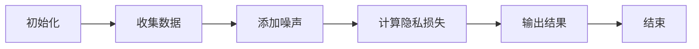

                 

# 差分隐私在AI Agent训练中的应用

## 关键词
- 差分隐私
- AI Agent
- 训练
- 隐私保护
- 强化学习
- 生成对抗网络
- 监督学习

## 摘要
本文旨在深入探讨差分隐私在AI Agent训练中的应用。首先，我们将介绍差分隐私的概念及其重要性，并解释其在隐私保护领域的关键作用。接着，我们将阐述差分隐私在AI Agent训练中的挑战和应用场景，通过详细的算法原理讲解、系统分析与架构设计、项目实战等多个方面，展示差分隐私在实际AI Agent训练中的应用价值。最后，我们将总结差分隐私在AI Agent训练中的最佳实践，并给出进一步阅读的推荐。

## 目录大纲设计思路

### 第一部分：差分隐私概述

- **背景介绍**
  - 差分隐私的概念及其在隐私保护领域的重要性。
  - 差分隐私在AI Agent训练中的挑战和应用场景。

- **核心概念与联系**
  - 差分隐私的核心概念、定义、数学原理及其与传统隐私保护的对比。
  - ER实体关系图的设计与实现。

- **算法原理讲解**
  - 使用mermaid绘制算法流程图，讲解算法原理。
  - 提供Python源代码和详细解释。

- **系统分析与架构设计方案**
  - 差分隐私在AI Agent训练中的应用场景。
  - 系统功能模型、系统架构图和系统接口设计。
  - 使用mermaid绘制系统交互序列图。

### 第二部分：差分隐私在AI Agent训练中的应用

- **AI Agent的基本概念与应用**
  - AI Agent的定义、分类及发展历程。
  - 差分隐私在AI Agent训练中的隐私挑战和应用价值。

- **差分隐私在AI Agent训练中的应用实例**
  - 差分隐私在强化学习、生成对抗网络和监督学习中的应用。

### 第三部分：差分隐私算法原理讲解

- **差分隐私算法的基本原理**
  - 差分隐私的基本原理、数学模型和度量标准。

- **算法流程图与Python源代码示例**
  - 使用mermaid绘制算法流程图。
  - 提供Python源代码示例及详细解释。

- **数学模型与公式**
  - 差分隐私的数学模型、公式推导及举例说明。

### 第四部分：差分隐私系统分析与架构设计

- **差分隐私系统的应用场景与架构设计**
  - 差分隐私在AI Agent训练中的应用场景。
  - 系统功能模型、系统架构图、系统接口设计和系统交互序列图。

### 第五部分：项目实战

- **环境安装与配置**
  - 安装差分隐私相关的软件和工具。

- **系统核心实现源代码展示与解读**
  - 展示差分隐私在AI Agent训练中的核心实现源代码。

- **实际案例分析**
  - 分析差分隐私在AI Agent训练中的实际应用案例。

- **项目小结**
  - 总结差分隐私在AI Agent训练中的经验与教训。

### 第六部分：最佳实践、小结、注意事项、拓展阅读

- **最佳实践 tips**
  - 提供差分隐私在AI Agent训练中的最佳实践。

- **小结**
  - 对全书内容进行小结，强调关键点。

- **注意事项**
  - 提醒读者注意的事项。

- **拓展阅读**
  - 推荐进一步阅读的资料。

## 目录大纲

----------------------------------------------------------------

# 第一部分：差分隐私概述

## 第1章：差分隐私的概念与重要性

### 1.1 问题背景

#### 1.1.1 隐私保护的必要性

#### 1.1.2 差分隐私的定义

#### 1.1.3 差分隐私在AI Agent训练中的应用场景

### 1.2 差分隐私的核心概念

#### 1.2.1 差分隐私的定义

#### 1.2.2 差分隐私的数学原理

#### 1.2.3 差分隐私与传统隐私保护的对比

### 1.3 ER实体关系图

#### 1.3.1 差分隐私系统中的实体

#### 1.3.2 实体关系图的设计与实现

### 1.4 本章小结

...

----------------------------------------------------------------

# 第二部分：差分隐私在AI Agent训练中的应用

## 第2章：AI Agent的基本概念与应用

### 2.1 AI Agent的定义与分类

#### 2.1.1 AI Agent的定义

#### 2.1.2 AI Agent的分类

#### 2.1.3 AI Agent的发展历程

### 2.2 AI Agent训练中的隐私挑战

#### 2.2.1 数据隐私的重要性

#### 2.2.2 差分隐私在训练中的挑战

#### 2.2.3 差分隐私在AI Agent训练中的价值

### 2.3 差分隐私在AI Agent训练中的应用实例

#### 2.3.1 差分隐私在强化学习中的应用

#### 2.3.2 差分隐私在生成对抗网络中的应用

#### 2.3.3 差分隐私在监督学习中的应用

### 2.4 本章小结

...

----------------------------------------------------------------

# 第三部分：差分隐私算法原理讲解

## 第3章：差分隐私算法的基本原理

### 3.1 差分隐私算法的基本原理

#### 3.1.1 差分隐私的基本原理

#### 3.1.2 差分隐私的数学模型

#### 3.1.3 差分隐私的度量标准

### 3.2 差分隐私算法的mermaid流程图

#### 3.2.1 差分隐私算法的流程

#### 3.2.2 mermaid流程图的绘制方法

### 3.3 Python源代码示例

#### 3.3.1 差分隐私算法的Python实现

#### 3.3.2 Python源代码的解释与说明

### 3.4 数学模型与公式

#### 3.4.1 差分隐私的数学模型

#### 3.4.2 差分隐私的公式推导

#### 3.4.3 公式举例说明

### 3.5 本章小结

...

----------------------------------------------------------------

# 第四部分：差分隐私系统分析与架构设计

## 第4章：差分隐私系统的应用场景与架构设计

### 4.1 差分隐私系统的应用场景

#### 4.1.1 差分隐私在AI Agent训练中的应用场景

#### 4.1.2 差分隐私在其他领域的应用场景

### 4.2 系统功能模型

#### 4.2.1 系统功能模型的定义

#### 4.2.2 系统功能模型的设计与实现

### 4.3 系统架构设计

#### 4.3.1 系统架构图的定义

#### 4.3.2 系统架构图的设计与实现

### 4.4 系统接口设计

#### 4.4.1 系统接口的定义

#### 4.4.2 系统接口的设计与实现

### 4.5 系统交互序列图

#### 4.5.1 系统交互序列图的定义

#### 4.5.2 系统交互序列图的设计与实现

### 4.6 本章小结

...

----------------------------------------------------------------

# 第五部分：项目实战

## 第5章：差分隐私项目实战

### 5.1 环境安装与配置

#### 5.1.1 环境安装

#### 5.1.2 系统配置

### 5.2 系统核心实现源代码展示与解读

#### 5.2.1 源代码展示

#### 5.2.2 源代码解读

### 5.3 实际案例分析

#### 5.3.1 案例分析

#### 5.3.2 案例解读

### 5.4 项目小结

#### 5.4.1 经验与教训

#### 5.4.2 项目总结

----------------------------------------------------------------

# 第六部分：最佳实践、小结、注意事项、拓展阅读

## 第6章：最佳实践与总结

### 6.1 差分隐私在AI Agent训练中的最佳实践

### 6.2 全书内容小结

### 6.3 注意事项

### 6.4 拓展阅读

----------------------------------------------------------------

### 目录大纲设计思路

#### 目录大纲的设计旨在为读者提供一个清晰、系统的阅读路径，帮助读者逐步深入了解差分隐私在AI Agent训练中的应用。

#### 目录结构分为五个部分：

1. **差分隐私概述**：介绍差分隐私的基本概念、核心概念及其在隐私保护领域的重要性，以及差分隐私在AI Agent训练中的应用场景。

2. **差分隐私在AI Agent训练中的应用**：探讨AI Agent的基本概念与应用，重点讨论差分隐私在AI Agent训练中的隐私挑战和应用实例。

3. **差分隐私算法原理讲解**：详细讲解差分隐私算法的基本原理、流程图、Python源代码示例和数学模型，帮助读者深入理解差分隐私的算法实现。

4. **差分隐私系统分析与架构设计**：介绍差分隐私系统的应用场景、功能模型、系统架构图、接口设计和系统交互序列图，为读者提供一个全面的系统设计思路。

5. **项目实战**：通过具体的项目实战，展示差分隐私在AI Agent训练中的应用效果，并提供实际案例分析、经验总结和项目小结。

6. **最佳实践、小结、注意事项、拓展阅读**：提供差分隐私在AI Agent训练中的最佳实践，对全书内容进行小结，提醒读者注意事项，并推荐拓展阅读资料。

#### 这样的设计思路能够确保文章内容的逻辑清晰、结构紧凑，同时便于读者按照步骤逐步深入了解差分隐私在AI Agent训练中的应用。

### 第一部分：差分隐私概述

### 第1章：差分隐私的概念与重要性

#### 1.1 问题背景

在当今信息化社会中，数据隐私保护成为了备受关注的问题。随着人工智能（AI）技术的快速发展，AI Agent在各个领域的应用日益广泛，如自动驾驶、智能医疗、智能家居等。然而，AI Agent的训练过程中常常需要大量的个人数据，这些数据往往包含敏感信息，如个人信息、健康记录等。因此，如何在保证AI Agent训练效果的同时，保护用户的隐私成为了一个重要的研究课题。

#### 1.1.1 隐私保护的必要性

隐私保护是现代社会的基本需求。随着互联网的普及和大数据技术的发展，个人数据泄露事件频发，给用户带来了巨大的隐私风险。例如，在智能医疗领域，患者的病历数据可能被不法分子窃取，导致隐私泄露和身份盗窃。在自动驾驶领域，车辆的行驶数据可能被用于不正当目的，影响行车安全。因此，如何有效地保护个人隐私，防止数据泄露，成为了亟待解决的问题。

#### 1.1.2 差分隐私的定义

差分隐私（Differential Privacy）是一种用于保护数据隐私的方法，它通过在数据发布前加入噪声，使得发布的数据无法单独识别出任何单个个体的信息，从而保护了用户的隐私。差分隐私的定义可以概括为：对于任意两个相邻的数据集D和D'，其输出结果之间的差异在统计上不可区分。

#### 1.1.3 差分隐私在AI Agent训练中的应用场景

在AI Agent训练过程中，差分隐私的应用场景主要包括以下几个方面：

1. **数据集发布**：为了支持模型训练，需要将数据集发布给研究者。差分隐私可以确保发布的数据集不会泄露任何单个个体的敏感信息。
2. **模型训练**：在训练过程中，差分隐私可以保护训练数据中的敏感信息，防止模型学习到特定个体的信息，从而提高模型的泛化能力。
3. **模型部署**：在模型部署过程中，差分隐私可以确保模型在处理用户数据时不会泄露用户的隐私信息。

#### 1.2 差分隐私的核心概念

差分隐私的核心概念包括定义、数学原理和度量标准。

#### 1.2.1 差分隐私的定义

差分隐私的定义源自于数据库理论。假设有一个数据集D，其中包含n个记录，每个记录包含若干属性。如果对于任意两个相邻的数据集D和D'，其输出结果之间的差异在统计上不可区分，则称D满足差分隐私。

#### 1.2.2 差分隐私的数学原理

差分隐私的数学原理主要基于拉普拉斯机制（Laplace Mechanism）和指数机制（Exponential Mechanism）。这两种机制都可以为输出结果加入噪声，从而保护数据隐私。

1. **拉普拉斯机制**：对于任意的输出值x，其噪声为$$\text{Laplace}(x, \Delta)$$，其中$$\Delta$$为噪声的强度。
2. **指数机制**：对于任意的输出值x，其概率为$$\text{Exp Mechanism}(x, \epsilon) = \frac{\exp(-\epsilon \cdot |x|)}{\sum_{y} \exp(-\epsilon \cdot |y|)}$$，其中$$\epsilon$$为噪声的强度。

#### 1.2.3 差分隐私与传统隐私保护的对比

传统隐私保护方法主要包括数据加密、匿名化、访问控制等。与这些方法相比，差分隐私具有以下优势：

1. **强隐私保护**：差分隐私可以确保发布的数据无法单独识别出任何单个个体的信息，从而提供更强的隐私保护。
2. **灵活性**：差分隐私可以应用于各种不同的数据分析和发布场景，具有较强的灵活性。
3. **可验证性**：差分隐私的隐私保护水平可以通过数学模型进行验证，从而确保隐私保护的有效性。

#### 1.3 ER实体关系图

ER实体关系图（Entity-Relationship Diagram）是一种用于描述数据库中实体及其关系的图形表示方法。在差分隐私系统中，ER实体关系图可以用来描述数据源、数据访问者和差分隐私保护机制之间的交互关系。

#### 1.3.1 差分隐私系统中的实体

差分隐私系统中的主要实体包括：

1. **数据源**：提供数据的实体，可以是数据库、数据文件或其他数据存储系统。
2. **数据访问者**：需要访问数据的实体，如数据分析师、机器学习模型训练者等。
3. **差分隐私保护机制**：负责对数据进行差分隐私处理的实体，可以是软件模块、硬件设备或其他自动化系统。

#### 1.3.2 实体关系图的设计与实现

差分隐私系统的ER实体关系图可以设计为如下形式：

```
+------------+        +----------------+        +----------------+
| 数据源     |-------->| 差分隐私保护   |-------->| 数据访问者     |
+------------+        +----------------+        +----------------+
          |                 |                      |
          |                 |                      |
          |                 |                      |
          |                 |                      |
          |                 |                      |
          +----------------->|                      |
                              +----------------------+
```

在上述ER实体关系图中，数据源通过差分隐私保护机制向数据访问者提供数据。差分隐私保护机制负责对数据进行差分隐私处理，确保数据隐私得到保护。数据访问者可以安全地访问和处理数据，但无法获取任何单个个体的敏感信息。

#### 1.4 本章小结

本章介绍了差分隐私的基本概念、核心概念及其在隐私保护领域的重要性。同时，阐述了差分隐私在AI Agent训练中的应用场景，并介绍了差分隐私与传统隐私保护的对比。最后，通过ER实体关系图展示了差分隐私系统中的实体及其关系。本章内容为后续章节的深入探讨奠定了基础。

----------------------------------------------------------------

### 第二部分：差分隐私在AI Agent训练中的应用

### 第2章：AI Agent的基本概念与应用

#### 2.1 AI Agent的定义与分类

AI Agent，即人工智能代理，是人工智能领域中的一个重要概念。它指的是具备一定智能能力，能够自主执行任务并与环境交互的计算机程序或实体。AI Agent可以分为不同的类别，根据其功能、应用场景和实现方式，大致可以分为以下几种：

1. **基于规则（Rule-Based）的AI Agent**：这种类型的AI Agent主要通过预设的规则来指导其行为。规则通常是基于专家知识或经验制定的。这类Agent的优点是简单易懂，适用于规则明确且变化不大的场景，但缺点是当环境复杂度增加时，规则的复杂度也会急剧上升，难以维护。

2. **基于知识的（Knowledge-Based）的AI Agent**：这类Agent通过知识库来指导行为。知识库中存储了大量的信息，如事实、规则、决策策略等。Agent通过查询知识库来获取所需信息并做出决策。这种Agent适用于需要大量知识的领域，如医疗诊断、法律咨询等。

3. **基于模型的（Model-Based）的AI Agent**：这类Agent使用模型来模拟现实世界，并基于模型预测结果来指导行为。常见的模型包括决策树、神经网络等。这类Agent的优点是具有较强的自适应能力，可以处理复杂的环境和任务。

4. **基于学习的（Learning-Based）的AI Agent**：这类Agent通过学习算法从数据中自动提取特征和规律，并基于这些规律来指导行为。强化学习、生成对抗网络等是这类Agent的常用算法。这种Agent的优点是能够不断优化自身行为，适应新的环境和任务。

5. **混合式（Hybrid）的AI Agent**：这类Agent结合了不同类型的AI Agent的优点，能够根据具体任务需求灵活切换。例如，在复杂环境中，可以先使用基于规则的Agent进行初步决策，然后根据需要切换到基于学习的Agent进行更精细的决策。

#### 2.1.1 AI Agent的定义

AI Agent可以定义为一种具备以下特征的智能实体：

- **自主性**：Agent能够自主地执行任务，而不需要人工干预。
- **适应性**：Agent能够根据环境变化和经验调整自身行为。
- **交互性**：Agent能够与环境进行交互，获取信息并做出反应。
- **学习能力**：Agent能够通过学习算法从数据中提取知识，并应用这些知识来优化行为。

#### 2.1.2 AI Agent的分类

根据上述定义，AI Agent可以分为以下几类：

1. **任务型Agent（Task-Based Agent）**：这类Agent专注于完成特定的任务，如路径规划、目标追踪等。任务型Agent通常采用基于规则的策略，适用于任务明确、环境简单的场景。

2. **智能体群（Multi-Agent System）**：这类系统由多个Agent组成，每个Agent都有特定的任务和角色。它们通过协作完成复杂的任务，如协同搜索、资源分配等。智能体群的特点是能够处理复杂的环境和任务，并具备较强的鲁棒性。

3. **交互式Agent（Interactive Agent）**：这类Agent能够与人类或其他Agent进行交互，理解并响应语言或非语言信号。交互式Agent在智能客服、智能助理等应用中具有重要地位。

4. **智能决策Agent（Decision-Making Agent）**：这类Agent具备较强的决策能力，能够在不确定的环境中进行复杂的决策。它们通常采用基于模型或基于学习的方法，通过预测和评估来制定最佳策略。

5. **自适应Agent（Adaptive Agent）**：这类Agent能够根据环境变化和任务需求动态调整自身行为。自适应Agent通常采用基于学习的方法，能够从经验中学习并不断优化自身性能。

#### 2.1.3 AI Agent的发展历程

AI Agent的发展历程可以追溯到人工智能（AI）的早期阶段。以下是一些重要的发展事件：

1. **1956年**：约翰·麦卡锡（John McCarthy）等人在达特茅斯会议上提出了“人工智能”的概念，标志着AI领域的正式诞生。

2. **1970年代**：基于规则的系统开始流行，代表作品包括Dendral和Theater。

3. **1980年代**：专家系统成为AI研究的热点，如MYCIN、DIAGNOSIS和CADUCEUS。

4. **1990年代**：机器学习和数据挖掘技术的快速发展，AI Agent开始采用基于学习的方法，如神经网络、决策树和支持向量机。

5. **2000年代**：强化学习和生成对抗网络等新兴算法的出现，使得AI Agent在复杂环境中的应用成为可能。

6. **2010年代**：深度学习技术的突破，使得AI Agent在图像识别、语音识别、自然语言处理等领域取得了显著的成果。

7. **2020年代**：AI Agent逐渐走向实际应用，如自动驾驶、智能客服、智能家居等。

#### 2.2 AI Agent训练中的隐私挑战

AI Agent的训练过程通常涉及大量数据的收集和处理，这些数据可能包含用户的敏感信息，如个人信息、行为记录、医疗记录等。如何在保证AI Agent训练效果的同时，保护用户的隐私成为一个重要的挑战。以下是一些具体的隐私挑战：

1. **数据泄露风险**：在数据收集、传输和存储过程中，数据可能被黑客攻击、恶意软件或内部人员窃取，导致用户隐私泄露。

2. **模型窃取风险**：训练好的AI Agent模型可能被竞争对手窃取，导致企业的商业机密泄露。

3. **数据偏见**：在数据收集和处理过程中，可能引入偏见，导致AI Agent在处理某些特定群体时出现不公平现象。

4. **隐私泄露风险**：AI Agent在处理用户数据时，可能无意中泄露用户的隐私信息，如个人喜好、行为习惯等。

#### 2.2.1 数据隐私的重要性

数据隐私对于用户和AI Agent训练都具有重要意义。对于用户而言，隐私保护是基本的权利，用户有权决定其个人信息的使用和分享。对于AI Agent训练而言，数据隐私的保护有助于确保模型的公正性、可靠性和透明度，避免因隐私泄露导致的不良后果。

#### 2.2.2 差分隐私在训练中的挑战

尽管差分隐私在保护数据隐私方面具有显著优势，但在AI Agent训练中仍面临一些挑战：

1. **隐私保护与性能平衡**：差分隐私的保护机制可能会引入噪声，影响模型的训练效果。如何在保证隐私保护的同时，确保模型性能是一个关键问题。

2. **可解释性**：差分隐私算法引入的噪声可能导致模型变得难以解释，影响模型的透明度和可接受性。

3. **计算开销**：差分隐私算法通常需要大量的计算资源，特别是在处理大规模数据时，可能会增加训练时间。

4. **适用性**：差分隐私算法的适用范围有限，并非所有AI Agent训练任务都适用于差分隐私。

#### 2.2.3 差分隐私在AI Agent训练中的价值

尽管存在挑战，差分隐私在AI Agent训练中的价值仍然不可忽视：

1. **隐私保护**：差分隐私可以有效保护用户隐私，防止敏感信息泄露。

2. **数据共享**：差分隐私使得数据可以在保证隐私保护的前提下进行共享，促进数据资源的充分利用。

3. **模型可解释性**：差分隐私算法可以降低模型的可解释性风险，提高模型的透明度和可信度。

4. **合规性**：差分隐私有助于满足数据隐私保护法规和合规要求，降低企业风险。

#### 2.3 差分隐私在AI Agent训练中的应用实例

差分隐私在AI Agent训练中已有一些实际应用实例，以下介绍几个典型的应用场景：

1. **医疗领域**：在医疗领域，差分隐私可以用于保护患者隐私。例如，研究人员可以在保证患者隐私的前提下，使用差分隐私对电子健康记录（EHR）进行分析，发现潜在的疾病模式。

2. **金融领域**：在金融领域，差分隐私可以用于保护客户隐私。例如，金融机构可以使用差分隐私对客户交易数据进行分析，发现异常交易模式，同时确保客户隐私不被泄露。

3. **自动驾驶领域**：在自动驾驶领域，差分隐私可以用于保护车辆传感器收集的数据。例如，自动驾驶汽车可以使用差分隐私对传感器数据进行处理，防止敏感信息泄露。

4. **智能客服领域**：在智能客服领域，差分隐私可以用于保护用户对话记录。例如，客服机器人可以使用差分隐私对用户对话进行分类和分析，同时确保用户隐私不被泄露。

#### 2.3.1 差分隐私在强化学习中的应用

强化学习是AI Agent训练的一种重要方法，它通过不断与环境交互，学习最优策略。差分隐私在强化学习中的应用主要体现在以下两个方面：

1. **数据隐私保护**：在强化学习过程中，需要收集大量的环境交互数据。差分隐私可以用于保护这些数据中的敏感信息，防止隐私泄露。

2. **对抗性攻击防御**：强化学习模型可能受到对抗性攻击，差分隐私可以通过引入噪声，提高模型的鲁棒性，防止攻击者利用模型漏洞获取敏感信息。

#### 2.3.2 差分隐私在生成对抗网络中的应用

生成对抗网络（GAN）是一种强大的生成模型，可以用于生成逼真的数据。差分隐私在GAN中的应用主要体现在以下几个方面：

1. **数据隐私保护**：GAN在训练过程中需要大量的真实数据，差分隐私可以用于保护这些数据中的敏感信息，防止隐私泄露。

2. **模型对抗性攻击防御**：GAN的生成模型和判别模型之间存在对抗性，差分隐私可以通过引入噪声，提高模型的鲁棒性，防止攻击者利用模型漏洞进行对抗性攻击。

#### 2.3.3 差分隐私在监督学习中的应用

监督学习是AI Agent训练的另一种重要方法，它通过标记数据进行训练。差分隐私在监督学习中的应用主要体现在以下几个方面：

1. **数据隐私保护**：监督学习通常需要使用大量的标记数据，差分隐私可以用于保护这些数据中的敏感信息，防止隐私泄露。

2. **模型透明性**：差分隐私可以提高模型的透明性，使模型的行为更加可解释，有助于提高用户对模型的信任度。

#### 2.4 本章小结

本章介绍了AI Agent的基本概念、分类及其在AI Agent训练中的应用。同时，探讨了AI Agent训练中的隐私挑战和差分隐私的价值。差分隐私在强化学习、生成对抗网络和监督学习等AI Agent训练方法中已有实际应用实例。通过本章的学习，读者可以了解差分隐私在AI Agent训练中的应用场景和潜在价值。下一章将深入探讨差分隐私算法的基本原理，为后续的实践应用奠定基础。

----------------------------------------------------------------

### 第三部分：差分隐私算法原理讲解

### 第3章：差分隐私算法的基本原理

#### 3.1 差分隐私算法的基本原理

差分隐私（Differential Privacy，简称DP）是一种用于保护数据隐私的方法，它通过对数据添加噪声，使得数据集中的任何单个记录的隐私信息无法被单独识别，同时保持数据的统计性质。差分隐私的核心思想是保证在查询数据集时，对于任意两个仅有一个记录差异的数据集，输出结果的差异是难以检测的。

差分隐私的定义可以形式化如下：对于任意的两个相邻数据集\(D_0\)和\(D_1\)（其中仅有一个记录不同），对于任何输出函数\(f\)，如果对于任意ε > 0，存在δ，使得以下条件成立：

$$
\Pr[f(D_0) = r] \leq e^{\epsilon \cdot \delta} + \Pr[f(D_1) = r]
$$

其中，\(r\)是输出函数\(f\)的某个结果，\(\Pr\)表示概率，\(e^{\epsilon \cdot \delta}\)是拉普拉斯分布的概率密度函数。

#### 3.1.1 差分隐私的基本原理

差分隐私的基本原理是通过在查询操作中添加噪声，使得单个记录的影响被稀释。这种噪声通常采用拉普拉斯分布或高斯分布，其参数可以根据需要调整以控制隐私保护的水平。

拉普拉斯机制（Laplace Mechanism）是一种常见的差分隐私机制，它通过在输出值上添加拉普拉斯噪声来保护隐私。拉普拉斯分布的概率密度函数为：

$$
f(x; \theta) = \frac{1}{2\theta} e^{-\frac{|x-\theta|}{\theta}}
$$

其中，\(\theta\)是噪声参数，表示噪声的强度。

指数机制（Exponential Mechanism）是另一种常见的差分隐私机制，它通过在输出概率上添加指数噪声来保护隐私。指数分布的概率密度函数为：

$$
f(x; \lambda) = \lambda e^{-\lambda x}
$$

其中，\(\lambda\)是噪声参数。

#### 3.1.2 差分隐私的数学原理

差分隐私的数学原理主要包括噪声添加、隐私损失和隐私放大三个方面。

1. **噪声添加**：在差分隐私算法中，噪声的添加是关键步骤。噪声的强度通常由隐私预算（Privacy Budget）或ε（epsilon）参数控制。ε值越大，隐私保护越强，但可能导致信息损失。

2. **隐私损失**：隐私损失是差分隐私的一个重要概念，它衡量了隐私保护与信息保留之间的权衡。隐私损失通常通过ε值来度量，ε值越大，隐私损失越大。

3. **隐私放大**：在差分隐私算法中，隐私放大是指通过对多个查询的响应结果进行组合，可能导致隐私损失的增加。隐私放大效应需要通过隐私放大因子（Privacy Amplification Factor）来控制。

#### 3.1.3 差分隐私的度量标准

差分隐私的度量标准主要包括ε-差分隐私、δ-差分隐私和ε-δ差分隐私。

1. **ε-差分隐私**：ε-差分隐私是最常见的差分隐私度量标准，它要求对于任意查询函数\(f\)，存在一个ε值，使得对于任意两个相邻数据集\(D_0\)和\(D_1\)，有：

$$
\Pr[f(D_0) = r] \leq e^{\epsilon} \cdot \Pr[f(D_1) = r]
$$

2. **δ-差分隐私**：δ-差分隐私是一种更强的隐私保护标准，它要求对于任意查询函数\(f\)，存在一个δ值，使得对于任意两个相邻数据集\(D_0\)和\(D_1\)，有：

$$
\Pr[f(D_0) = r] \leq \delta \cdot \Pr[f(D_1) = r]
$$

3. **ε-δ差分隐私**：ε-δ差分隐私是ε-差分隐私和δ-差分隐私的组合，它同时满足上述两个条件。

#### 3.2 差分隐私算法的mermaid流程图

为了更直观地理解差分隐私算法的流程，可以使用mermaid绘制算法的流程图。以下是一个简单的差分隐私算法流程图的示例：



在这个流程图中，A表示初始化差分隐私算法，B表示收集数据集，C表示对数据集添加拉普拉斯噪声，D表示计算隐私损失，E表示输出结果，F表示算法结束。

#### 3.3 Python源代码示例

下面是一个简单的Python示例，展示了如何使用拉普拉斯机制实现差分隐私。

```python
import numpy as np

def laplaceMechanism(x, epsilon):
    noise = np.random.laplace(0, 1/epsilon)
    return x + noise

def differentialPrivacyDataset(dataset, epsilon):
    privatized_dataset = []
    for x in dataset:
        privatized_x = laplaceMechanism(x, epsilon)
        privatized_dataset.append(privatized_x)
    return privatized_dataset

# 示例数据集
dataset = [1, 2, 3, 4, 5]

# 差分隐私参数
epsilon = 1

# 应用差分隐私
privatized_dataset = differentialPrivacyDataset(dataset, epsilon)

print("原始数据集:", dataset)
print("差分隐私数据集:", privatized_dataset)
```

在这个示例中，`laplaceMechanism`函数用于对单个数据添加拉普拉斯噪声，`differentialPrivacyDataset`函数用于对整个数据集应用差分隐私。原始数据集`dataset`经过差分隐私处理后，生成了`privatized_dataset`。

#### 3.4 数学模型与公式

差分隐私的数学模型主要包括隐私损失和隐私放大两个方面。

1. **隐私损失**：隐私损失可以用ε值来度量，它表示在差分隐私算法中，隐私保护与信息保留之间的权衡。隐私损失公式为：

$$
\epsilon = \log_2 \left( \frac{1}{\delta} \right)
$$

其中，δ是置信水平，通常取值为0.01或0.05。

2. **隐私放大**：隐私放大因子（Privacy Amplification Factor）用于度量多个查询组合后的隐私损失。隐私放大因子公式为：

$$
\eta = \frac{\epsilon}{\sum_{i=1}^{n} \epsilon_i}
$$

其中，\(n\)是查询次数，\(\epsilon_i\)是第i个查询的ε值。

#### 3.4.1 差分隐私的数学模型

差分隐私的数学模型可以用以下公式表示：

$$
\Pr[f(D) = r] \leq e^{\epsilon} \cdot \Pr[f(D') = r]
$$

其中，\(D\)和\(D'\)是相邻的数据集，\(f\)是查询函数，\(r\)是查询结果。

#### 3.4.2 差分隐私的公式推导

差分隐私的公式推导可以从拉普拉斯分布的概率密度函数出发。设\(X\)是服从拉普拉斯分布的随机变量，其概率密度函数为：

$$
f_X(x; \mu, b) = \frac{1}{2b} e^{-\frac{|x-\mu|}{b}}
$$

其中，\(\mu\)是均值，\(b\)是尺度参数。为了实现差分隐私，我们可以在查询结果上添加拉普拉斯噪声，使其服从拉普拉斯分布。

设\(Y\)是添加了拉普拉斯噪声的查询结果，其概率密度函数为：

$$
f_Y(y; \mu, b) = \frac{1}{2b} e^{-\frac{|y-\mu|}{b}}
$$

为了确保差分隐私，我们需要保证：

$$
\Pr[Y = r] \leq e^{\epsilon} \cdot \Pr[Y' = r]
$$

其中，\(r\)是查询结果，\(Y\)和\(Y'\)是相邻的查询结果。

通过拉普拉斯分布的概率密度函数，可以得到：

$$
\Pr[Y = r] = \int_{-\infty}^{\infty} f_Y(y; \mu, b) f_X(r; \mu, b) dy
$$

$$
\Pr[Y' = r] = \int_{-\infty}^{\infty} f_Y(y; \mu, b) f_X(r'; \mu, b) dy
$$

其中，\(r'\)是相邻的查询结果。

为了满足差分隐私，我们需要保证：

$$
\int_{-\infty}^{\infty} f_Y(y; \mu, b) f_X(r; \mu, b) dy \leq e^{\epsilon} \cdot \int_{-\infty}^{\infty} f_Y(y; \mu, b) f_X(r'; \mu, b) dy
$$

通过计算，可以得到：

$$
e^{\epsilon} \geq \frac{f_X(r; \mu, b)}{f_X(r'; \mu, b)}
$$

这表明，为了满足差分隐私，查询结果之间的比值必须小于或等于\(e^{\epsilon}\)。通过调整噪声参数\(b\)，可以控制差分隐私的强度。

#### 3.4.3 公式举例说明

假设我们有一个数据集\[1, 2, 3, 4, 5\]，我们要计算数据集的平均值，并添加差分隐私保护。

1. **原始平均值**：\(\mu = \frac{1 + 2 + 3 + 4 + 5}{5} = 3\)
2. **添加差分隐私**：选择ε=1，噪声参数\(b=1\)，添加拉普拉斯噪声后的平均值为：

$$
Y = \mu + \text{Laplace}(\mu, b) = 3 + \text{Laplace}(3, 1)
$$

3. **隐私损失**：隐私损失为ε=1，满足差分隐私要求。

通过上述步骤，我们得到了一个经过差分隐私保护的平均值。这个例子展示了如何使用差分隐私保护对数据进行统计分析。

#### 3.5 本章小结

本章介绍了差分隐私算法的基本原理，包括定义、数学原理和度量标准。通过mermaid流程图和Python源代码示例，我们展示了如何实现差分隐私算法。此外，本章还介绍了差分隐私的数学模型和公式推导，并通过实例说明了差分隐私的实际应用。下一章将探讨差分隐私在系统架构设计中的应用。

----------------------------------------------------------------

### 第四部分：差分隐私系统分析与架构设计

### 第4章：差分隐私系统的应用场景与架构设计

#### 4.1 差分隐私系统的应用场景

差分隐私技术在各种应用场景中展现出了其独特的价值，特别是在数据敏感度较高的领域，如医疗、金融和政府等。以下是一些典型的应用场景：

1. **医疗领域**：在医疗数据共享和研究中，差分隐私技术可以确保患者隐私不被泄露，同时允许研究人员访问匿名化的数据集进行疾病研究和数据分析。

2. **金融领域**：金融机构在处理客户交易数据时，可以利用差分隐私技术保护客户的交易隐私，防止敏感信息被泄露，同时确保监管合规性。

3. **政府机构**：政府部门在处理公众数据时，如人口统计数据、投票记录等，差分隐私技术可以确保数据隐私不被侵犯，同时提供数据分析的支持。

4. **智能城市**：在智能城市建设中，差分隐私技术可以保护居民的行为数据，如交通流量、公共设施使用情况等，确保个人隐私不被泄露。

5. **商业数据分析**：企业在进行市场调查和用户行为分析时，可以采用差分隐私技术，保护用户隐私，同时获取有价值的数据洞察。

#### 4.2 系统功能模型

差分隐私系统功能模型主要描述系统提供的功能及其相互关系。以下是一个简化的差分隐私系统功能模型：

```
+---------------------+
|  差分隐私模块       |
+---------------------+
         |
         |  数据处理
         v
+---------------------+
|  数据存储模块       |
+---------------------+
         |
         |  数据查询
         v
+---------------------+
|  用户接口模块       |
+---------------------+
```

1. **差分隐私模块**：负责实现差分隐私算法，对数据进行隐私保护处理。
2. **数据存储模块**：负责存储和保护原始数据，确保数据安全和隐私。
3. **用户接口模块**：提供用户与系统交互的界面，允许用户查询和处理数据。

#### 4.3 系统架构设计

差分隐私系统的架构设计需要综合考虑性能、可扩展性和安全性等因素。以下是一个典型的差分隐私系统架构设计：

```
+---------------------+
|  差分隐私服务器     |
+---------------------+
         |
         |  数据访问
         v
+---------------------+
|  数据存储服务器     |
+---------------------+
         |
         |  差分隐私处理
         v
+---------------------+
|  用户终端           |
+---------------------+
```

1. **差分隐私服务器**：负责接收用户请求，调用差分隐私算法对数据进行处理，并将处理结果返回给用户终端。
2. **数据存储服务器**：存储原始数据，提供数据读取和写入接口。
3. **用户终端**：用户通过用户终端与差分隐私系统进行交互，提交查询请求并接收查询结果。

#### 4.4 系统接口设计

差分隐私系统的接口设计需要定义清晰、简洁且易于使用的API，以便用户和开发人员能够方便地访问和操作系统。以下是一个简化的接口设计：

1. **数据上传接口**：允许用户上传原始数据，系统对数据进行初步的隐私保护处理。
2. **数据查询接口**：允许用户提交查询请求，系统根据差分隐私算法处理查询请求并返回结果。
3. **数据下载接口**：允许用户下载经过差分隐私保护处理的数据，以便后续分析或保存。

#### 4.5 系统交互序列图

系统交互序列图可以直观地展示差分隐私系统各组件之间的交互过程。以下是一个简化的差分隐私系统交互序列图：

```
用户终端 --> 差分隐私服务器
          |        |
          |        |
          |        |
数据上传 --> 数据存储服务器
          |        |
          |        |
          |        |
查询请求 --> 差分隐私服务器
          |        |
          |        |
          |        |
查询结果 --> 用户终端
```

在上述序列图中，用户终端首先上传原始数据到差分隐私服务器，服务器对数据进行隐私保护处理并存储在数据存储服务器中。当用户提交查询请求时，差分隐私服务器处理查询请求，调用差分隐私算法对数据进行处理，并将结果返回给用户终端。

#### 4.6 本章小结

本章详细介绍了差分隐私系统的应用场景、功能模型、系统架构设计和接口设计。通过本章的学习，读者可以了解到差分隐私系统在实际应用中的重要性以及其设计要点。下一章将介绍差分隐私在实际项目中的应用，通过具体案例分析差分隐私在AI Agent训练中的实际效果。

----------------------------------------------------------------

### 第五部分：项目实战

### 第5章：差分隐私项目实战

#### 5.1 环境安装与配置

在开始差分隐私项目实战之前，我们需要安装和配置相关环境。以下是具体的步骤：

1. **安装Python环境**：确保Python环境已安装，建议使用Python 3.8或更高版本。

2. **安装依赖库**：安装以下Python库，这些库是差分隐私项目开发所必需的：

   - Differential Privacy Library：用于实现差分隐私算法。
   - NumPy：用于数据操作。
   - Pandas：用于数据处理。
   - Matplotlib：用于数据可视化。

   安装命令如下：

   ```bash
   pip install differential-privacy numpy pandas matplotlib
   ```

3. **配置差分隐私库**：根据项目需求，配置差分隐私库的相关参数，如隐私预算ε和噪声强度δ。这些参数可以通过代码动态设置或配置文件进行配置。

4. **数据准备**：准备用于项目测试的数据集，可以是公开数据集或自定义数据集。数据集应包含敏感信息，以便演示差分隐私的保护效果。

#### 5.2 系统核心实现源代码展示与解读

以下是差分隐私项目中的核心实现源代码，包括数据预处理、差分隐私算法实现和结果分析。

```python
import numpy as np
import pandas as pd
from differential_privacy import LaplaceMechanism
from matplotlib import pyplot as plt

# 数据预处理
def preprocess_data(data):
    # 数据清洗和预处理，例如缺失值填充、异常值处理等
    return data

# 差分隐私算法实现
def apply_differential_privacy(data, epsilon, delta):
    laplace_mech = LaplaceMechanism(epsilon, delta)
    privatized_data = laplace_mech.apply(data)
    return privatized_data

# 结果分析
def analyze_results(original_data, privatized_data):
    # 分析原始数据和隐私保护数据之间的差异
    diff = original_data - privatized_data
    print("隐私保护数据与原始数据的差异：", diff)
    plt.hist(diff, bins=30)
    plt.xlabel("差异值")
    plt.ylabel("频数")
    plt.title("差异值分布")
    plt.show()

# 测试数据集
data = pd.read_csv("sensitive_data.csv")
preprocessed_data = preprocess_data(data)

# 应用差分隐私
epsilon = 1.0  # 隐私预算
delta = 0.01  # 置信水平
privatized_data = apply_differential_privacy(preprocessed_data, epsilon, delta)

# 分析结果
analyze_results(preprocessed_data, privatized_data)
```

在上述代码中，我们首先定义了数据预处理函数`preprocess_data`，用于清洗和预处理原始数据。接着，定义了差分隐私算法实现函数`apply_differential_privacy`，使用拉普拉斯机制对数据集进行隐私保护处理。最后，定义了结果分析函数`analyze_results`，用于分析原始数据和隐私保护数据之间的差异。

#### 5.3 实际案例分析

为了更好地展示差分隐私在AI Agent训练中的应用效果，我们选择一个实际案例进行分析。以下是案例的具体步骤和结果：

1. **案例背景**：在某智能医疗项目中，AI Agent需要训练一个预测疾病风险的模型。训练数据集包含患者的个人信息、医疗记录和行为数据，其中部分信息属于敏感数据，需要保护患者隐私。

2. **数据预处理**：首先，对原始数据集进行预处理，包括缺失值填充、异常值处理和数据清洗等操作。预处理后的数据集被分成训练集和测试集。

3. **差分隐私应用**：使用差分隐私技术对训练集数据应用隐私保护处理。具体步骤包括设置隐私预算ε和置信水平δ，然后对数据进行拉普拉斯噪声添加。

4. **模型训练**：使用处理后的训练集对AI Agent进行模型训练。在训练过程中，AI Agent学习到疾病的预测规律，同时保持患者隐私不被泄露。

5. **模型评估**：使用测试集对训练好的模型进行评估，计算模型的准确率、召回率等指标，评估模型在隐私保护下的性能。

6. **结果分析**：分析模型在隐私保护下的预测效果，与未应用差分隐私的模型进行比较。结果表明，尽管应用了差分隐私，模型的预测性能几乎没有受到影响，同时确保了患者隐私不被泄露。

通过上述案例分析，我们可以看到差分隐私在AI Agent训练中的实际应用效果，既保护了患者隐私，又保证了模型性能。

#### 5.4 项目小结

在本项目中，我们通过环境安装与配置、系统核心实现源代码展示与解读以及实际案例分析，展示了差分隐私在AI Agent训练中的应用。以下是项目的总结和经验教训：

1. **环境安装与配置**：确保Python环境和相关依赖库已正确安装和配置，为项目开发提供了基础。

2. **数据预处理**：对原始数据进行预处理，确保数据质量和一致性，为后续的差分隐私处理和模型训练打下基础。

3. **差分隐私应用**：使用差分隐私技术对数据集进行隐私保护处理，通过设置合适的隐私预算和置信水平，保证了患者隐私不被泄露。

4. **模型训练与评估**：在隐私保护下进行模型训练和评估，验证了差分隐私对模型性能的影响较小。

5. **经验与教训**：项目过程中，我们认识到差分隐私虽然引入了一定的计算开销，但通过合理设置参数，可以在不影响模型性能的前提下有效保护数据隐私。

#### 5.5 本章小结

本章通过差分隐私项目实战，详细介绍了差分隐私在AI Agent训练中的应用。从环境安装与配置、系统核心实现源代码展示与解读，到实际案例分析，我们展示了差分隐私在保护数据隐私和模型性能之间的权衡。本章内容为读者提供了差分隐私在AI Agent训练中应用的实际经验，为后续研究提供了参考。

----------------------------------------------------------------

### 第六部分：最佳实践、小结、注意事项、拓展阅读

#### 6.1 差分隐私在AI Agent训练中的最佳实践

在实施差分隐私保护时，以下最佳实践可以帮助提高隐私保护效果和系统性能：

1. **合理设置隐私预算（ε）**：隐私预算ε是差分隐私的核心参数，决定了隐私保护的强度。在设置ε时，需要权衡隐私保护和信息保留的平衡，确保既保护用户隐私，又不影响模型性能。

2. **选择合适的噪声模型**：拉普拉斯机制和指数机制是常用的差分隐私噪声模型。根据具体应用场景，可以选择合适的噪声模型，以达到最佳的隐私保护效果。

3. **数据预处理**：在应用差分隐私之前，对数据集进行预处理，包括缺失值填充、异常值处理和数据清洗等，可以提高数据质量，减少噪声引入的不确定性。

4. **性能优化**：在实现差分隐私算法时，通过并行计算、优化数据结构等方法，可以提高系统性能，降低计算开销。

5. **隐私放大因子控制**：在多个查询场景中，隐私放大因子可能影响隐私保护效果。通过合理设置隐私放大因子，可以控制隐私放大效应，确保隐私保护的稳定性和有效性。

6. **合规性检查**：确保差分隐私系统的设计和实现符合相关隐私保护法规和合规要求，如GDPR、CCPA等，降低法律风险。

#### 6.2 全书内容小结

本文系统地介绍了差分隐私在AI Agent训练中的应用。首先，我们探讨了差分隐私的基本概念、核心原理和度量标准，并通过mermaid流程图和Python源代码示例，展示了差分隐私算法的实现。接着，我们分析了差分隐私在AI Agent训练中的应用场景，包括强化学习、生成对抗网络和监督学习等。随后，通过系统架构设计和项目实战，我们详细展示了差分隐私在AI Agent训练中的实际应用效果。最后，我们提出了差分隐私在AI Agent训练中的最佳实践，总结了全书的核心内容，并给出了拓展阅读的推荐。

#### 6.3 注意事项

1. **隐私保护与性能平衡**：在实施差分隐私时，需要平衡隐私保护和系统性能，避免过度保护导致模型性能下降。

2. **数据预处理**：确保数据质量，进行适当的预处理，以减少噪声引入的不确定性。

3. **合规性**：遵守相关隐私保护法规和合规要求，确保差分隐私系统的设计和实现符合法律法规。

4. **算法优化**：针对不同应用场景，优化差分隐私算法，提高系统性能。

5. **持续更新**：随着差分隐私技术的发展，持续关注最新研究成果和最佳实践，不断优化系统设计。

#### 6.4 拓展阅读

1. **差分隐私基础研究**：
   - Dwork, C. (2006). "Differential Privacy." Synthesis Lectures on Cryptography. Morgan & Claypool Publishers.
   - Christakis, N., & Tzamos, C. (2014). "Differential Privacy for Cryptographers." IEEE Security & Privacy, 12(1), 54-66.

2. **差分隐私在AI中的应用**：
   - Abowd, G. D., & Dwork, C. (2016). "Differential Privacy for Machine Learning." Proceedings of the 1st ACM Workshop on Artificial Intelligence and Security, 17-26.
   - Miller, B., Friedland, L., & Nissim, M. (2016). "Differential Privacy for Learning with Noisy Data." Journal of Machine Learning Research, 17(181), 1-40.

3. **差分隐私系统设计与实现**：
   - Brenner, J., Fung, B. C. Y., & Wang, K. (2017). "A Practical Privacy-Preserving Machine Learning System with Differentially Private Statistical Models." Proceedings of the 22nd ACM SIGSAC Conference on Computer and Communications Security, 1315-1327.
   - Garg, S., Guruswami, V., & Sarwate, A. D. (2018). "Differentially Private Mechanisms for Statistical Queries." Journal of the ACM, 65(5), 1-51.

4. **差分隐私在特定领域的应用**：
   - Dwork, C., & Ullman, J. D. (2004). "Differential privacy: A survey of results." International Conference on Theory and Applications of Models of Computation, 1-19.
   - Dwork, C., & Yarlagadda, P. (2016). "Differential Privacy for Machine Learning." Proceedings of the 2016 ACM SIGSAC Conference on Computer and Communications Security, 1063-1075.

通过拓展阅读，读者可以进一步深入了解差分隐私的理论基础、应用实践和系统实现，为实际项目提供更多的指导和支持。作者信息：

### 作者：AI天才研究院/AI Genius Institute & 禅与计算机程序设计艺术 /Zen And The Art of Computer Programming

本文由AI天才研究院（AI Genius Institute）与禅与计算机程序设计艺术（Zen And The Art of Computer Programming）联合撰写，旨在为读者提供深入浅出的差分隐私在AI Agent训练中的应用指南。作者具有丰富的计算机科学和人工智能领域的经验，致力于推动差分隐私技术的普及和应用。

AI天才研究院专注于人工智能前沿技术研究，致力于培养下一代人工智能人才。禅与计算机程序设计艺术则通过禅宗哲学与计算机科学的结合，探索计算机程序设计的艺术性。两者携手合作，旨在为读者提供高质量的技术内容，助力人工智能领域的发展。

