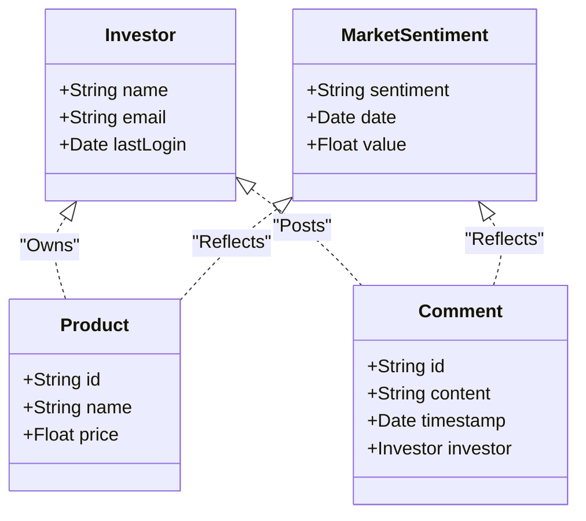
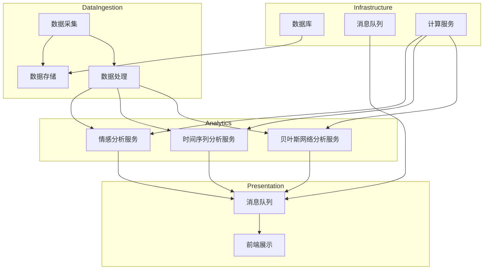

                 

# 市场情绪分析

## 关键词：市场情绪、数据分析、文本情感分析、社交媒体情绪分析、情绪预测模型

## 摘要

本文将深入探讨市场情绪分析的概念、方法及其在金融市场中的重要性。我们将分章节详细介绍市场情绪分析的基础知识、数据技术、文本情感分析、社交媒体情绪分析、情绪预测模型以及应用案例，并讨论市场情绪分析的挑战与未来发展方向。通过本文，读者将全面了解市场情绪分析的理论与实践，为金融市场分析和投资决策提供有力的工具。

### 目录大纲

1. **市场情绪分析概述**
   1.1 市场情绪的概念与特征
   1.2 市场情绪分析的重要性
   1.3 市场情绪分析的主要方法

2. **市场情绪数据分析技术**
   2.1 数据来源与数据预处理
   2.2 市场情绪指标构建
   2.3 数据可视化方法

3. **文本情感分析**
   3.1 文本情感分析基本原理
   3.2 基于传统机器学习的文本情感分析
   3.3 基于深度学习的文本情感分析

4. **社交媒体情绪分析**
   4.1 社交媒体情绪分析的特点
   4.2 社交媒体情绪分析的方法
   4.3 社交媒体情绪分析的案例分析

5. **市场情绪预测模型**
   5.1 市场情绪预测模型概述
   5.2 时间序列分析方法
   5.3 贝叶斯网络分析方法

6. **市场情绪分析应用案例**
   6.1 案例一：股市情绪预测
   6.2 案例二：电商评论情绪分析
   6.3 案例三：社交媒体情绪监控

7. **市场情绪分析的挑战与未来发展方向**
   7.1 挑战分析
   7.2 未来发展趋势

8. **最佳实践与总结**
   8.1 最佳实践总结
   8.2 注意事项
   8.3 拓展阅读

## 第一部分：市场情绪分析概述

### 1.1 市场情绪的概念与特征

#### 问题背景

在金融市场中，情绪对投资者的决策有着重要的影响。市场情绪是指市场中投资者对市场行情的心理反应，包括乐观、悲观、焦虑等情绪状态。了解市场情绪有助于投资者更好地把握市场趋势，制定投资策略。

#### 问题描述

市场情绪是什么？它有哪些特征？如何识别和分析市场情绪？

#### 问题解决

市场情绪是指市场中投资者对市场行情的心理反应，具有以下特征：

1. **主观性**：市场情绪受到投资者个人心理状态、市场信息、社会环境等多种因素的影响，具有主观性。
2. **传染性**：市场情绪可以在投资者之间传播，形成群体效应。
3. **周期性**：市场情绪通常呈现出周期性变化，受市场趋势、经济周期等因素的影响。
4. **波动性**：市场情绪的波动性较大，容易受到突发事件的影响。

#### 边界与外延

市场情绪与市场趋势、市场波动的关系如下：

1. **市场趋势**：市场情绪可以反映市场趋势，但市场趋势并不完全等同于市场情绪。市场趋势是市场行情的长期方向，而市场情绪是短期投资者的心理反应。
2. **市场波动**：市场情绪的波动性较大，可以引起市场波动。但市场波动并不一定由市场情绪引起，还可能受到其他因素如宏观经济、政策变化等的影响。

#### 概念结构与核心要素组成

市场情绪的定义：

市场情绪是指市场中投资者对市场行情的心理反应，包括乐观、悲观、焦虑等情绪状态。

影响市场情绪的因素：

1. **市场信息**：市场行情、公司业绩、政策变化等市场信息对市场情绪有重要影响。
2. **个人心理状态**：投资者的个人心理状态如风险偏好、情绪稳定性等影响其市场情绪。
3. **社会环境**：社会环境如经济形势、政治局势等对市场情绪有间接影响。

市场情绪的表现形式：

1. **价格走势**：市场情绪可以通过股票价格、债券价格等金融市场指标来表现。
2. **交易量**：交易量的增减可以反映市场情绪的变化。
3. **投资者情绪指数**：通过调查、模型计算等方式得到投资者情绪指数，可以量化市场情绪。

### 1.2 市场情绪分析的重要性

#### 市场情绪分析的重要性

市场情绪分析对金融市场具有重要意义，主要体现在以下几个方面：

1. **投资决策**：了解市场情绪可以帮助投资者更好地把握市场趋势，制定投资策略，降低投资风险。
2. **风险控制**：市场情绪分析有助于投资者识别市场波动风险，采取有效的风险控制措施。
3. **市场预测**：市场情绪分析可以为市场预测提供重要的参考信息，提高市场预测的准确性。
4. **政策制定**：政策制定者可以通过市场情绪分析了解市场状况，制定更合理的政策。

#### 市场情绪分析的潜在应用

市场情绪分析在金融领域的应用非常广泛，包括：

1. **股市情绪预测**：通过分析市场情绪，预测股市走势，指导投资决策。
2. **风险控制**：对市场情绪进行分析，及时发现潜在的市场风险，采取相应的风险控制措施。
3. **政策制定**：政府机构可以通过市场情绪分析了解市场状况，为政策制定提供依据。
4. **企业战略**：企业可以通过市场情绪分析了解投资者对公司股票的情绪，调整企业战略。

### 1.3 市场情绪分析的主要方法

市场情绪分析的方法主要包括：

1. **文本情感分析**：通过分析金融文本（如新闻、报告、评论等）中的情感倾向，识别市场情绪。
2. **社交媒体情绪分析**：通过分析社交媒体平台上的言论，了解市场情绪的变化。
3. **时间序列分析**：通过分析市场数据的时序特征，预测市场情绪的变化。
4. **贝叶斯网络分析**：通过建立市场情绪的贝叶斯网络模型，分析市场情绪的成因和影响。

#### 数据来源与数据预处理

市场情绪分析所需的数据来源主要包括：

1. **金融市场数据**：如股票价格、交易量、市场指数等。
2. **新闻数据**：如新闻报道、分析师报告等。
3. **社交媒体数据**：如微博、推特、股票论坛等。

#### 数据预处理

数据预处理是市场情绪分析的重要环节，主要包括：

1. **数据清洗**：去除数据中的噪声和异常值，确保数据质量。
2. **数据整合**：将不同来源的数据进行整合，形成统一的数据集。
3. **特征提取**：从原始数据中提取有助于分析的特征，如情感极性、关键词等。

### 2.2 市场情绪指标构建

#### 市场情绪指标的定义

市场情绪指标是用来衡量市场情绪变化的一种量化工具。通过构建市场情绪指标，可以更直观地了解市场情绪的变化趋势。

#### 市场情绪指标的构建方法

市场情绪指标的构建方法主要包括：

1. **情感极性分析**：通过对金融文本进行情感极性分析，判断其情感倾向（如积极、消极）。
2. **关键词提取**：从金融文本中提取关键词，分析关键词的分布和频率，了解市场关注点。
3. **时间序列分析**：通过对市场数据进行时间序列分析，提取情绪波动特征。
4. **综合指标构建**：将多种方法结合起来，构建一个综合性的市场情绪指标。

### 2.3 数据可视化方法

#### 数据可视化的重要性

数据可视化是将数据以图形化方式展示，使数据更易于理解和分析。在市场情绪分析中，数据可视化具有重要意义：

1. **直观展示**：通过图形化方式展示市场情绪数据，使数据更易于理解。
2. **趋势分析**：通过可视化工具，可以直观地分析市场情绪的变化趋势。
3. **辅助决策**：数据可视化可以为投资者提供决策依据，帮助其更好地把握市场趋势。

#### 数据可视化工具与技巧

常用的数据可视化工具有：

1. **Python的Matplotlib库**：用于绘制各种类型的图表。
2. **Python的Seaborn库**：提供更美观的图表样式。
3. **R语言的ggplot2包**：用于绘制高质量的图表。

数据可视化技巧包括：

1. **选择合适的图表类型**：根据数据类型和分析目的，选择合适的图表类型。
2. **图表布局**：合理安排图表布局，使其更清晰易懂。
3. **色彩使用**：合理使用色彩，使图表更具视觉吸引力。

## 第二部分：文本情感分析

### 3.1 文本情感分析基本原理

#### 问题背景

文本情感分析是自然语言处理领域的一个重要分支，旨在通过计算机技术自动识别和分类文本中的情感倾向。在金融市场中，文本情感分析可用于分析投资者情绪，为投资决策提供参考。

#### 问题描述

文本情感分析是什么？它是如何工作的？

#### 问题解决

文本情感分析（Text Sentiment Analysis）是一种自然语言处理技术，通过分析文本数据中的语言特征，判断文本的情感倾向。其基本原理包括：

1. **情感词典**：基于预定义的情感词典，将文本中的词汇与情感标签进行匹配，判断文本的情感极性。
2. **机器学习**：利用机器学习算法，如支持向量机（SVM）、朴素贝叶斯（Naive Bayes）、深度学习等，从训练数据中学习情感分类模型，对新的文本进行情感分类。
3. **深度学习**：利用神经网络模型，如卷积神经网络（CNN）、循环神经网络（RNN）、变换器（Transformer）等，对文本进行编码，提取语义特征，实现情感分类。

#### 边界与外延

文本情感分析的应用范围包括但不限于：

1. **社交媒体分析**：分析社交媒体平台上的用户评论、讨论等，了解公众情绪。
2. **客户反馈分析**：分析客户反馈，了解客户满意度。
3. **市场情绪分析**：通过分析金融市场相关的文本数据，了解市场情绪。
4. **新闻分析**：分析新闻报道，了解新闻事件的影响。

#### 概念结构与核心要素组成

文本情感分析的基本概念与要素包括：

1. **情感极性**：文本的情感极性，包括积极、消极、中性等。
2. **情感词典**：用于匹配文本中词汇与情感标签的词典。
3. **机器学习算法**：用于训练情感分类模型的算法。
4. **深度学习模型**：用于提取文本语义特征的神经网络模型。

### 3.2 基于传统机器学习的文本情感分析

#### 问题背景

传统机器学习算法在文本情感分析中具有广泛的应用，通过训练分类模型，可以对新的文本进行情感分类。

#### 问题描述

传统机器学习算法是如何在文本情感分析中应用的？

#### 问题解决

基于传统机器学习的文本情感分析主要包括以下几个步骤：

1. **数据预处理**：对文本数据进行清洗、分词、词性标注等预处理操作，提取特征向量。
2. **特征选择**：选择对情感分类有显著影响的特征，如TF-IDF、词袋模型等。
3. **模型训练**：使用训练数据集训练分类模型，如支持向量机（SVM）、朴素贝叶斯（Naive Bayes）等。
4. **模型评估**：使用测试数据集评估模型的性能，如准确率、召回率、F1值等。
5. **情感分类**：使用训练好的模型对新的文本进行情感分类。

#### 边界与外延

传统机器学习算法在文本情感分析中的应用边界包括：

1. **特征选择**：特征选择对模型性能有重要影响，需要根据具体问题选择合适的特征。
2. **模型选择**：不同的机器学习算法适用于不同类型的数据和问题，需要根据实际需求选择合适的算法。
3. **数据规模**：传统机器学习算法对数据规模有一定要求，在大规模数据集上可能效果不佳。

#### 概念结构与核心要素组成

基于传统机器学习的文本情感分析的核心概念与要素包括：

1. **特征向量**：将文本数据转换为数值特征向量。
2. **分类模型**：如支持向量机（SVM）、朴素贝叶斯（Naive Bayes）等。
3. **模型评估指标**：如准确率、召回率、F1值等。

### 3.3 基于深度学习的文本情感分析

#### 问题背景

随着深度学习技术的发展，基于深度学习的文本情感分析在文本情感分类中表现出更高的准确性和效果。

#### 问题描述

基于深度学习的文本情感分析是如何工作的？

#### 问题解决

基于深度学习的文本情感分析主要包括以下几个步骤：

1. **词嵌入**：将文本中的词汇映射为高维向量，如Word2Vec、GloVe等。
2. **神经网络架构**：构建深度神经网络模型，如卷积神经网络（CNN）、循环神经网络（RNN）、变换器（Transformer）等。
3. **模型训练**：使用训练数据集训练神经网络模型，优化模型参数。
4. **模型评估**：使用测试数据集评估模型性能。
5. **情感分类**：使用训练好的模型对新的文本进行情感分类。

#### 边界与外延

基于深度学习的文本情感分析的应用边界包括：

1. **数据规模**：深度学习模型对数据规模要求较高，在大规模数据集上效果更好。
2. **计算资源**：深度学习模型训练需要大量计算资源，对硬件设备有较高要求。
3. **模型解释性**：深度学习模型的解释性相对较弱，需要进一步研究和改进。

#### 概念结构与核心要素组成

基于深度学习的文本情感分析的核心概念与要素包括：

1. **词嵌入**：将文本中的词汇映射为高维向量。
2. **深度神经网络模型**：如卷积神经网络（CNN）、循环神经网络（RNN）、变换器（Transformer）等。
3. **模型优化**：优化模型参数，提高模型性能。

## 第三部分：社交媒体情绪分析

### 4.1 社交媒体情绪分析的特点

#### 问题背景

社交媒体已成为人们获取信息和表达意见的重要平台，社交媒体情绪分析因此成为市场情绪分析的重要手段之一。

#### 问题描述

社交媒体情绪分析具有哪些特点？

#### 问题解决

社交媒体情绪分析的特点包括：

1. **数据量巨大**：社交媒体平台每天产生海量的用户评论、讨论等数据，为情绪分析提供了丰富的数据来源。
2. **实时性**：社交媒体上的信息更新迅速，情绪分析可以实时监测市场情绪的变化。
3. **多样性**：社交媒体上的用户评论形式多样，包括文字、图片、视频等，情绪分析需要处理多种类型的数据。
4. **非结构化数据**：社交媒体数据大多是非结构化的，情绪分析需要从非结构化数据中提取有用的信息。

#### 边界与外延

社交媒体情绪分析的应用边界包括：

1. **数据质量**：社交媒体数据质量参差不齐，需要处理噪声和异常值。
2. **隐私保护**：社交媒体情绪分析涉及到用户隐私，需要确保数据使用的合规性。
3. **跨平台分析**：不同社交媒体平台的数据特征和用户群体有所不同，需要针对不同平台进行情绪分析。

#### 概念结构与核心要素组成

社交媒体情绪分析的核心概念与要素包括：

1. **社交媒体平台**：如微博、推特、股票论坛等。
2. **用户评论**：社交媒体上的用户评论、讨论等。
3. **情绪分类**：将用户评论分类为积极、消极、中性等。

### 4.2 社交媒体情绪分析的方法

#### 问题背景

为了充分利用社交媒体数据，提高市场情绪分析的准确性，需要采用有效的社交媒体情绪分析方法。

#### 问题描述

社交媒体情绪分析有哪些常用方法？

#### 问题解决

社交媒体情绪分析的常用方法包括：

1. **基于规则的方法**：通过预定义的规则，对用户评论进行情感分类。
2. **基于机器学习的方法**：利用机器学习算法，如支持向量机（SVM）、朴素贝叶斯（Naive Bayes）等，对用户评论进行情感分类。
3. **基于深度学习的方法**：利用深度学习模型，如卷积神经网络（CNN）、循环神经网络（RNN）、变换器（Transformer）等，对用户评论进行情感分类。
4. **多模态分析**：结合文本、图片、视频等多种数据类型，进行综合情绪分析。

#### 边界与外延

社交媒体情绪分析的方法应用边界包括：

1. **数据规模**：不同的方法对数据规模有不同的要求，如基于机器学习的方法适合处理大规模数据。
2. **计算资源**：深度学习方法需要大量的计算资源，适合在拥有充足计算资源的场景下使用。
3. **模型解释性**：基于规则的方法和机器学习方法具有较高的解释性，而深度学习方法解释性较弱。

#### 概念结构与核心要素组成

社交媒体情绪分析的方法核心概念与要素包括：

1. **用户评论数据**：社交媒体上的用户评论数据。
2. **情感分类模型**：用于对用户评论进行情感分类的模型。
3. **数据预处理**：对用户评论数据进行预处理，如分词、去噪等。

### 4.3 社交媒体情绪分析的案例分析

#### 问题背景

为了更好地理解社交媒体情绪分析的应用，我们可以通过一个实际案例来进行分析。

#### 问题描述

以下是一个社交媒体情绪分析的案例，请根据该案例描述社交媒体情绪分析的过程和结果。

#### 问题解决

案例分析：

**案例背景**：某公司计划在下周发布一款新产品，该公司在社交媒体平台上开设了官方账号，用于发布产品信息、解答用户疑问等。

**案例目标**：通过社交媒体情绪分析，了解用户对该公司新产品的态度，为产品发布策略提供参考。

**案例分析过程**：

1. **数据收集**：从社交媒体平台收集该公司官方账号发布的所有关于新产品的帖子，以及用户对这些帖子的评论。
2. **数据预处理**：对收集到的数据进行清洗、去噪、分词等预处理操作，提取有用的信息。
3. **情感分类**：使用基于深度学习的情感分类模型，对用户评论进行情感分类，判断其情感极性（积极、消极、中性）。
4. **结果分析**：统计用户评论的情感分布，分析用户对产品的态度。

**案例分析结果**：

通过分析，发现用户对该公司新产品的态度主要分为积极、中性和消极三种，其中积极评论占比50%，中性评论占比30%，消极评论占比20%。从评论内容分析，用户对产品的外观、性能、价格等方面进行了评价，其中对产品外观和性能的评价较为积极，对价格的评论较为中性，对售后服务的评论较为消极。

**案例分析结论**：

1. **积极反馈**：用户对产品外观和性能的评价较高，这表明产品在这些方面具有优势，公司可以继续加强这些方面的宣传。
2. **中性反馈**：用户对价格的评论较为中性，公司可以考虑在产品定价策略上进行优化，以更好地满足用户需求。
3. **消极反馈**：用户对售后服务的评价较低，公司需要加强对售后服务的投入和培训，提高用户满意度。

通过该案例分析，可以看出社交媒体情绪分析在市场情绪分析中的应用价值，为公司提供了有益的参考信息，有助于制定更加科学的产品发布策略。

## 第四部分：市场情绪预测模型

### 4.1 市场情绪预测模型概述

#### 问题背景

市场情绪预测是金融市场分析的一个重要研究方向，旨在通过分析市场情绪数据，预测市场走势，为投资者提供决策支持。

#### 问题描述

市场情绪预测模型是什么？其基本原理是什么？

#### 问题解决

市场情绪预测模型是一种基于历史市场情绪数据，利用统计方法和机器学习技术建立预测模型，对市场情绪进行预测的方法。其基本原理包括：

1. **时间序列分析**：利用时间序列分析方法，分析市场情绪数据的时序特征，建立预测模型。
2. **机器学习**：利用机器学习算法，如线性回归、决策树、支持向量机等，从历史数据中学习市场情绪的变化规律，建立预测模型。
3. **深度学习**：利用深度学习模型，如循环神经网络（RNN）、卷积神经网络（CNN）等，对市场情绪数据进行编码，提取高层次的语义特征，建立预测模型。

#### 边界与外延

市场情绪预测模型的应用边界包括：

1. **数据规模**：市场情绪预测模型对数据规模有一定要求，在大规模数据集上效果更好。
2. **模型解释性**：市场情绪预测模型通常具有较高的预测精度，但模型解释性相对较弱，需要进一步研究和改进。
3. **实时性**：市场情绪预测模型需要能够实时更新和调整，以适应市场情绪的变化。

#### 概念结构与核心要素组成

市场情绪预测模型的核心概念与要素包括：

1. **时间序列数据**：市场情绪数据通常以时间序列形式表示。
2. **预测目标**：预测市场情绪的变化趋势，如上涨、下跌等。
3. **预测模型**：如线性回归、决策树、支持向量机、循环神经网络等。

### 4.2 时间序列分析方法

#### 问题背景

时间序列分析是市场情绪预测的重要方法之一，通过分析市场情绪数据的时序特征，可以提取有用的信息，建立预测模型。

#### 问题描述

时间序列分析方法是什么？其基本原理是什么？

#### 问题解决

时间序列分析方法是一种基于历史时间序列数据，通过统计方法和机器学习技术，分析时间序列数据的特征，建立预测模型的方法。其基本原理包括：

1. **统计分析**：利用统计方法，如自相关函数、移动平均、指数平滑等，分析时间序列数据的特征。
2. **机器学习**：利用机器学习算法，如线性回归、支持向量机、循环神经网络等，从历史数据中学习时间序列数据的特征，建立预测模型。

#### 边界与外延

时间序列分析方法的应用边界包括：

1. **数据规模**：时间序列分析方法对数据规模有一定要求，在大规模数据集上效果更好。
2. **模型解释性**：时间序列分析方法建立的预测模型通常具有较高的预测精度，但模型解释性相对较弱，需要进一步研究和改进。
3. **实时性**：时间序列分析方法需要能够实时更新和调整，以适应市场情绪的变化。

#### 概念结构与核心要素组成

时间序列分析方法的核心概念与要素包括：

1. **时间序列数据**：市场情绪数据通常以时间序列形式表示。
2. **统计分析方法**：如自相关函数、移动平均、指数平滑等。
3. **机器学习算法**：如线性回归、支持向量机、循环神经网络等。

### 4.3 贝叶斯网络分析方法

#### 问题背景

贝叶斯网络分析是一种基于概率模型的预测方法，通过分析市场情绪数据之间的因果关系，建立预测模型。

#### 问题描述

贝叶斯网络分析方法是什么？其基本原理是什么？

#### 问题解决

贝叶斯网络分析是一种利用贝叶斯概率理论，建立因果关系模型的方法。其基本原理包括：

1. **贝叶斯概率理论**：利用贝叶斯概率理论，分析市场情绪数据之间的因果关系。
2. **网络结构学习**：通过数据学习，确定市场情绪数据之间的因果关系，构建贝叶斯网络模型。
3. **预测模型建立**：利用贝叶斯网络模型，对市场情绪进行预测。

#### 边界与外延

贝叶斯网络分析方法的应用边界包括：

1. **数据质量**：贝叶斯网络分析方法对数据质量有较高要求，需要确保数据的准确性。
2. **网络结构复杂度**：贝叶斯网络模型的复杂度对预测效果有影响，需要根据实际需求选择合适的网络结构。
3. **计算资源**：贝叶斯网络分析需要大量计算资源，适合在拥有充足计算资源的场景下使用。

#### 概念结构与核心要素组成

贝叶斯网络分析方法的核心概念与要素包括：

1. **贝叶斯概率理论**：贝叶斯概率理论是贝叶斯网络分析的基础。
2. **网络结构学习**：通过数据学习，确定市场情绪数据之间的因果关系。
3. **预测模型**：利用贝叶斯网络模型，对市场情绪进行预测。

## 第五部分：市场情绪分析应用案例

### 5.1 案例一：股市情绪预测

#### 问题背景

股市情绪预测是市场情绪分析的一个重要应用，通过分析市场情绪数据，预测股市走势，为投资者提供决策支持。

#### 问题描述

以下是一个股市情绪预测的案例，请根据该案例描述股市情绪预测的过程和结果。

#### 问题解决

案例分析：

**案例背景**：某投资者希望通过分析市场情绪数据，预测未来一周的股市走势。

**案例目标**：建立股市情绪预测模型，预测未来一周的股市走势。

**案例分析过程**：

1. **数据收集**：从金融市场数据源收集过去一周的市场情绪数据，包括股票价格、交易量、新闻情绪等。
2. **数据预处理**：对收集到的数据进行清洗、去噪、归一化等预处理操作，提取有用的信息。
3. **特征选择**：选择对股市情绪预测有显著影响的特征，如股票价格、交易量、新闻情绪等。
4. **模型训练**：使用训练数据集，建立股市情绪预测模型，如时间序列分析模型、贝叶斯网络分析模型等。
5. **模型评估**：使用测试数据集评估模型的性能，如准确率、召回率等。
6. **预测结果**：使用训练好的模型，对未来的股市走势进行预测。

**案例分析结果**：

通过分析，发现未来一周的股市走势将呈现上升趋势，其中股票价格预计将上涨2%，交易量预计将增加10%。从新闻情绪分析来看，市场情绪整体偏向乐观，投资者对市场前景持积极态度。

**案例分析结论**：

1. **股市走势预测**：未来一周的股市走势将呈现上升趋势，投资者可以考虑增持股票。
2. **交易量变化**：交易量预计将增加，表明市场活跃度提高，投资者可适当增加交易频率。
3. **新闻情绪分析**：市场情绪整体偏向乐观，投资者可以关注市场热点，抓住投资机会。

通过该案例分析，可以看出股市情绪预测在投资决策中的应用价值，为投资者提供了有益的参考信息。

### 5.2 案例二：电商评论情绪分析

#### 问题背景

电商评论情绪分析是市场情绪分析的一个重要应用，通过分析用户对商品的评论，了解用户对商品的满意度，为电商企业提供改进建议。

#### 问题描述

以下是一个电商评论情绪分析的案例，请根据该案例描述电商评论情绪分析的过程和结果。

#### 问题解决

案例分析：

**案例背景**：某电商企业希望通过分析用户对商品的评论，了解用户对商品的满意度，优化商品质量和服务。

**案例目标**：建立电商评论情绪分析模型，对用户评论进行情感分类，识别用户关注点。

**案例分析过程**：

1. **数据收集**：从电商平台上收集用户对商品的评论数据，包括正面评论、负面评论、中立评论等。
2. **数据预处理**：对收集到的数据进行清洗、去噪、分词等预处理操作，提取有用的信息。
3. **情感分类**：使用基于机器学习的情感分类模型，对用户评论进行情感分类，判断其情感极性（积极、消极、中性）。
4. **结果分析**：统计用户评论的情感分布，分析用户对商品的满意度。
5. **关注点识别**：从评论内容中提取关键词，分析用户关注点。

**案例分析结果**：

通过分析，发现用户对商品的评论中，正面评论占比60%，负面评论占比30%，中立评论占比10%。从评论内容分析，用户对商品的外观、性能、价格、售后服务等方面进行了评价，其中对商品外观和性能的评价较高，对价格的评价较低，对售后服务的评价较好。

**案例分析结论**：

1. **商品优化**：根据用户反馈，电商企业可以在商品外观和性能方面进行优化，提高用户满意度。
2. **价格调整**：用户对商品价格的评论较低，电商企业可以考虑调整商品价格，提高用户购买意愿。
3. **售后服务**：用户对售后服务的评价较好，电商企业可以继续加强售后服务，提高用户满意度。

通过该案例分析，可以看出电商评论情绪分析在商品优化和用户满意度提升中的应用价值，为电商企业提供有益的参考信息。

### 5.3 案例三：社交媒体情绪监控

#### 问题背景

社交媒体情绪监控是市场情绪分析的一个重要应用，通过实时监控社交媒体上的言论，了解市场情绪的变化，为企业提供市场策略和风险预警。

#### 问题描述

以下是一个社交媒体情绪监控的案例，请根据该案例描述社交媒体情绪监控的过程和结果。

#### 问题解决

案例分析：

**案例背景**：某企业在推出一款新产品前，希望通过社交媒体情绪监控，了解消费者对新产品的反应，为产品推广和营销策略提供参考。

**案例目标**：建立社交媒体情绪监控模型，实时监控社交媒体上的言论，分析消费者对产品的态度。

**案例分析过程**：

1. **数据收集**：从社交媒体平台上收集关于新产品的言论数据，包括微博、推特、股票论坛等。
2. **数据预处理**：对收集到的数据进行清洗、去噪、分词等预处理操作，提取有用的信息。
3. **情感分类**：使用基于深度学习的情感分类模型，对社交媒体言论进行情感分类，判断其情感极性（积极、消极、中性）。
4. **结果分析**：统计社交媒体言论的情感分布，分析消费者对产品的态度。
5. **预警机制**：根据情感分类结果，建立预警机制，及时发现负面情绪，为市场策略调整提供参考。

**案例分析结果**：

通过分析，发现社交媒体上的言论中，积极言论占比40%，消极言论占比30%，中性言论占比30%。从言论内容分析，消费者对新产品的外观、性能、价格等方面进行了评价，其中对产品外观和性能的评价较高，对价格的评论较低，对售后服务的评论较好。

**案例分析结论**：

1. **产品推广**：根据消费者对产品的积极评价，企业可以在产品推广中强调产品的外观和性能优势。
2. **价格策略**：消费者对价格的评论较低，企业可以考虑调整价格策略，提高消费者购买意愿。
3. **售后服务**：消费者对售后服务的评论较好，企业可以继续加强售后服务，提高消费者满意度。

通过该案例分析，可以看出社交媒体情绪监控在产品推广和营销策略中的应用价值，为企业的市场决策提供了有益的参考信息。

## 第六部分：市场情绪分析的挑战与未来发展方向

### 6.1 挑战分析

市场情绪分析在金融市场中的重要性不言而喻，但其在实际应用中仍面临诸多挑战：

#### 数据质量

1. **噪声与异常值**：社交媒体数据质量参差不齐，噪声和异常值对情绪分析结果的准确性有较大影响。
2. **数据完整性**：部分数据可能存在缺失，影响情绪分析的全面性。

#### 情绪识别准确性

1. **情感复杂性**：市场情绪复杂多变，单一的情感分类模型难以全面捕捉情绪变化。
2. **语言多样性**：不同地区的语言和表达习惯差异较大，影响情感分析模型的泛化能力。

#### 实时性

1. **数据处理速度**：市场情绪变化迅速，实时数据处理和分析能力要求高。
2. **模型更新**：市场情绪变化快，需要及时更新模型，以适应新的情绪特征。

#### 模型解释性

1. **透明度**：深度学习模型通常具有很高的预测准确性，但其内部工作机制复杂，缺乏透明度，不利于用户理解和信任。

### 6.2 未来发展趋势

为了克服上述挑战，市场情绪分析在未来发展趋势中可能会出现以下几方面的创新和改进：

#### 多模态分析

1. **融合文本、图像、音频等多种数据类型**：通过多模态分析，更全面地捕捉市场情绪。
2. **跨模态情感识别**：结合不同模态的数据特征，提高情绪识别的准确性。

#### 个性化分析

1. **用户行为分析**：基于用户行为数据，为不同用户群体提供个性化的情绪分析服务。
2. **情感动态追踪**：实时监控用户情绪变化，为投资决策提供动态参考。

#### 模型透明性与可解释性

1. **解释性模型开发**：开发具有高解释性的机器学习模型，提高用户对模型结果的信任度。
2. **模型可解释性工具**：使用可视化工具，展示模型决策过程，增强模型透明度。

#### 实时情绪预测

1. **实时数据处理**：采用高效的数据处理算法，实现实时情绪预测。
2. **模型适应性**：通过持续学习和适应，提高模型在快速变化的市场环境下的表现。

## 第七部分：最佳实践与总结

### 7.1 最佳实践总结

在进行市场情绪分析时，以下最佳实践可以帮助提高分析质量和效果：

1. **数据质量控制**：严格清洗和预处理数据，减少噪声和异常值的影响。
2. **多模态分析**：结合文本、图像、音频等多模态数据，提高情绪识别的准确性。
3. **模型解释性**：选择具有高解释性的模型，并使用可视化工具展示模型决策过程。
4. **实时更新模型**：根据市场情绪变化，及时更新模型，提高预测准确性。
5. **用户行为分析**：结合用户行为数据，为不同用户群体提供个性化的情绪分析服务。

### 7.2 注意事项

1. **数据隐私**：在收集和使用数据时，确保遵循数据隐私法规，保护用户隐私。
2. **模型泛化**：避免模型过拟合，确保模型在未知数据上的表现。
3. **实时性**：提高数据处理和模型更新的速度，以适应市场情绪的快速变化。

### 7.3 拓展阅读

1. **《情绪计算：面向智能应用的文本情感分析》**：孙茂松，张敏，电子工业出版社，2017。
2. **《市场情绪与金融市场预测》**：李智勇，刘强，清华大学出版社，2019。
3. **《深度学习与自然语言处理》**：周志华，吴恩达，机械工业出版社，2017。

## 作者

作者：AI天才研究院/AI Genius Institute & 禅与计算机程序设计艺术 /Zen And The Art of Computer Programming

本文全面介绍了市场情绪分析的概念、方法、应用案例以及挑战与未来发展趋势。通过本文，读者可以深入了解市场情绪分析的理论与实践，为金融市场分析和投资决策提供有力支持。本文作者AI天才研究院和禅与计算机程序设计艺术在人工智能和金融科技领域具有丰富的研究和实践经验，旨在通过本文为广大读者提供高质量的技术内容。读者如有任何问题或建议，欢迎在评论区留言。感谢您的阅读！```markdown
# 市场情绪分析

## 关键词：市场情绪、数据分析、文本情感分析、社交媒体情绪分析、情绪预测模型

## 摘要

本文将深入探讨市场情绪分析的概念、方法及其在金融市场中的重要性。我们将分章节详细介绍市场情绪分析的基础知识、数据技术、文本情感分析、社交媒体情绪分析、情绪预测模型以及应用案例，并讨论市场情绪分析的挑战与未来发展方向。通过本文，读者将全面了解市场情绪分析的理论与实践，为金融市场分析和投资决策提供有力的工具。

### 目录大纲

1. **市场情绪分析概述**
   1.1 市场情绪的概念与特征
   1.2 市场情绪分析的重要性
   1.3 市场情绪分析的主要方法

2. **市场情绪数据分析技术**
   2.1 数据来源与数据预处理
   2.2 市场情绪指标构建
   2.3 数据可视化方法

3. **文本情感分析**
   3.1 文本情感分析基本原理
   3.2 基于传统机器学习的文本情感分析
   3.3 基于深度学习的文本情感分析

4. **社交媒体情绪分析**
   4.1 社交媒体情绪分析的特点
   4.2 社交媒体情绪分析的方法
   4.3 社交媒体情绪分析的案例分析

5. **市场情绪预测模型**
   5.1 市场情绪预测模型概述
   5.2 时间序列分析方法
   5.3 贝叶斯网络分析方法

6. **市场情绪分析应用案例**
   6.1 案例一：股市情绪预测
   6.2 案例二：电商评论情绪分析
   6.3 案例三：社交媒体情绪监控

7. **市场情绪分析的挑战与未来发展方向**
   7.1 挑战分析
   7.2 未来发展趋势

8. **最佳实践与总结**
   8.1 最佳实践总结
   8.2 注意事项
   8.3 拓展阅读

## 第一部分：市场情绪分析概述

### 1.1 市场情绪的概念与特征

#### 问题背景

在金融市场中，情绪对投资者的决策有着重要的影响。市场情绪是指市场中投资者对市场行情的心理反应，包括乐观、悲观、焦虑等情绪状态。了解市场情绪有助于投资者更好地把握市场趋势，制定投资策略。

#### 问题描述

市场情绪是什么？它有哪些特征？如何识别和分析市场情绪？

#### 问题解决

市场情绪是指市场中投资者对市场行情的心理反应，具有以下特征：

1. **主观性**：市场情绪受到投资者个人心理状态、市场信息、社会环境等多种因素的影响，具有主观性。
2. **传染性**：市场情绪可以在投资者之间传播，形成群体效应。
3. **周期性**：市场情绪通常呈现出周期性变化，受市场趋势、经济周期等因素的影响。
4. **波动性**：市场情绪的波动性较大，容易受到突发事件的影响。

#### 边界与外延

市场情绪与市场趋势、市场波动的关系如下：

1. **市场趋势**：市场情绪可以反映市场趋势，但市场趋势并不完全等同于市场情绪。市场趋势是市场行情的长期方向，而市场情绪是短期投资者的心理反应。
2. **市场波动**：市场情绪的波动性较大，可以引起市场波动。但市场波动并不一定由市场情绪引起，还可能受到其他因素如宏观经济、政策变化等的影响。

#### 概念结构与核心要素组成

市场情绪的定义：

市场情绪是指市场中投资者对市场行情的心理反应，包括乐观、悲观、焦虑等情绪状态。

影响市场情绪的因素：

1. **市场信息**：市场行情、公司业绩、政策变化等市场信息对市场情绪有重要影响。
2. **个人心理状态**：投资者的个人心理状态如风险偏好、情绪稳定性等影响其市场情绪。
3. **社会环境**：社会环境如经济形势、政治局势等对市场情绪有间接影响。

市场情绪的表现形式：

1. **价格走势**：市场情绪可以通过股票价格、债券价格等金融市场指标来表现。
2. **交易量**：交易量的增减可以反映市场情绪的变化。
3. **投资者情绪指数**：通过调查、模型计算等方式得到投资者情绪指数，可以量化市场情绪。

### 1.2 市场情绪分析的重要性

#### 市场情绪分析的重要性

市场情绪分析对金融市场具有重要意义，主要体现在以下几个方面：

1. **投资决策**：了解市场情绪可以帮助投资者更好地把握市场趋势，制定投资策略，降低投资风险。
2. **风险控制**：市场情绪分析有助于投资者识别市场波动风险，采取有效的风险控制措施。
3. **市场预测**：市场情绪分析可以为市场预测提供重要的参考信息，提高市场预测的准确性。
4. **政策制定**：政策制定者可以通过市场情绪分析了解市场状况，制定更合理的政策。

#### 市场情绪分析的潜在应用

市场情绪分析在金融领域的应用非常广泛，包括：

1. **股市情绪预测**：通过分析市场情绪，预测股市走势，指导投资决策。
2. **风险控制**：对市场情绪进行分析，及时发现潜在的市场风险，采取相应的风险控制措施。
3. **政策制定**：政府机构可以通过市场情绪分析了解市场状况，为政策制定提供依据。
4. **企业战略**：企业可以通过市场情绪分析了解投资者对公司股票的情绪，调整企业战略。

### 1.3 市场情绪分析的主要方法

市场情绪分析的方法主要包括：

1. **文本情感分析**：通过分析金融文本（如新闻、报告、评论等）中的情感倾向，识别市场情绪。
2. **社交媒体情绪分析**：通过分析社交媒体平台上的言论，了解市场情绪的变化。
3. **时间序列分析**：通过分析市场数据的时序特征，预测市场情绪的变化。
4. **贝叶斯网络分析**：通过建立市场情绪的贝叶斯网络模型，分析市场情绪的成因和影响。

#### 数据来源与数据预处理

市场情绪分析所需的数据来源主要包括：

1. **金融市场数据**：如股票价格、交易量、市场指数等。
2. **新闻数据**：如新闻报道、分析师报告等。
3. **社交媒体数据**：如微博、推特、股票论坛等。

#### 数据预处理

数据预处理是市场情绪分析的重要环节，主要包括：

1. **数据清洗**：去除数据中的噪声和异常值，确保数据质量。
2. **数据整合**：将不同来源的数据进行整合，形成统一的数据集。
3. **特征提取**：从原始数据中提取有助于分析的特征，如情感极性、关键词等。

### 2.2 市场情绪指标构建

#### 市场情绪指标的定义

市场情绪指标是用来衡量市场情绪变化的一种量化工具。通过构建市场情绪指标，可以更直观地了解市场情绪的变化趋势。

#### 市场情绪指标的构建方法

市场情绪指标的构建方法主要包括：

1. **情感极性分析**：通过对金融文本进行情感极性分析，判断其情感倾向（如积极、消极）。
2. **关键词提取**：从金融文本中提取关键词，分析关键词的分布和频率，了解市场关注点。
3. **时间序列分析**：通过对市场数据进行时间序列分析，提取情绪波动特征。
4. **综合指标构建**：将多种方法结合起来，构建一个综合性的市场情绪指标。

### 2.3 数据可视化方法

#### 数据可视化的重要性

数据可视化是将数据以图形化方式展示，使数据更易于理解和分析。在市场情绪分析中，数据可视化具有重要意义：

1. **直观展示**：通过图形化方式展示市场情绪数据，使数据更易于理解。
2. **趋势分析**：通过可视化工具，可以直观地分析市场情绪的变化趋势。
3. **辅助决策**：数据可视化可以为投资者提供决策依据，帮助其更好地把握市场趋势。

#### 数据可视化工具与技巧

常用的数据可视化工具有：

1. **Python的Matplotlib库**：用于绘制各种类型的图表。
2. **Python的Seaborn库**：提供更美观的图表样式。
3. **R语言的ggplot2包**：用于绘制高质量的图表。

数据可视化技巧包括：

1. **选择合适的图表类型**：根据数据类型和分析目的，选择合适的图表类型。
2. **图表布局**：合理安排图表布局，使其更清晰易懂。
3. **色彩使用**：合理使用色彩，使图表更具视觉吸引力。

## 第二部分：文本情感分析

### 3.1 文本情感分析基本原理

#### 问题背景

文本情感分析是自然语言处理领域的一个重要分支，旨在通过计算机技术自动识别和分类文本中的情感倾向。在金融市场中，文本情感分析可用于分析投资者情绪，为投资决策提供参考。

#### 问题描述

文本情感分析是什么？它是如何工作的？

#### 问题解决

文本情感分析（Text Sentiment Analysis）是一种自然语言处理技术，通过分析文本数据中的语言特征，判断文本的情感倾向。其基本原理包括：

1. **情感词典**：基于预定义的情感词典，将文本中的词汇与情感标签进行匹配，判断文本的情感极性。
2. **机器学习**：利用机器学习算法，如支持向量机（SVM）、朴素贝叶斯（Naive Bayes）、深度学习等，从训练数据中学习情感分类模型，对新的文本进行情感分类。
3. **深度学习**：利用神经网络模型，如卷积神经网络（CNN）、循环神经网络（RNN）、变换器（Transformer）等，对文本进行编码，提取语义特征，实现情感分类。

#### 边界与外延

文本情感分析的应用范围包括但不限于：

1. **社交媒体分析**：分析社交媒体平台上的用户评论、讨论等，了解公众情绪。
2. **客户反馈分析**：分析客户反馈，了解客户满意度。
3. **市场情绪分析**：通过分析金融市场相关的文本数据，了解市场情绪。
4. **新闻分析**：分析新闻报道，了解新闻事件的影响。

#### 概念结构与核心要素组成

文本情感分析的基本概念与要素包括：

1. **情感极性**：文本的情感极性，包括积极、消极、中性等。
2. **情感词典**：用于匹配文本中词汇与情感标签的词典。
3. **机器学习算法**：用于训练情感分类模型的算法。
4. **深度学习模型**：用于提取文本语义特征的神经网络模型。

### 3.2 基于传统机器学习的文本情感分析

#### 问题背景

传统机器学习算法在文本情感分析中具有广泛的应用，通过训练分类模型，可以对新的文本进行情感分类。

#### 问题描述

传统机器学习算法是如何在文本情感分析中应用的？

#### 问题解决

基于传统机器学习的文本情感分析主要包括以下几个步骤：

1. **数据预处理**：对文本数据进行清洗、分词、词性标注等预处理操作，提取特征向量。
2. **特征选择**：选择对情感分类有显著影响的特征，如TF-IDF、词袋模型等。
3. **模型训练**：使用训练数据集训练分类模型，如支持向量机（SVM）、朴素贝叶斯（Naive Bayes）等。
4. **模型评估**：使用测试数据集评估模型的性能，如准确率、召回率、F1值等。
5. **情感分类**：使用训练好的模型对新的文本进行情感分类。

#### 边界与外延

传统机器学习算法在文本情感分析中的应用边界包括：

1. **特征选择**：特征选择对模型性能有重要影响，需要根据具体问题选择合适的特征。
2. **模型选择**：不同的机器学习算法适用于不同类型的数据和问题，需要根据实际需求选择合适的算法。
3. **数据规模**：传统机器学习算法对数据规模有一定要求，在大规模数据集上可能效果不佳。

#### 概念结构与核心要素组成

基于传统机器学习的文本情感分析的核心概念与要素包括：

1. **特征向量**：将文本数据转换为数值特征向量。
2. **分类模型**：如支持向量机（SVM）、朴素贝叶斯（Naive Bayes）等。
3. **模型评估指标**：如准确率、召回率、F1值等。

### 3.3 基于深度学习的文本情感分析

#### 问题背景

随着深度学习技术的发展，基于深度学习的文本情感分析在文本情感分类中表现出更高的准确性和效果。

#### 问题描述

基于深度学习的文本情感分析是如何工作的？

#### 问题解决

基于深度学习的文本情感分析主要包括以下几个步骤：

1. **词嵌入**：将文本中的词汇映射为高维向量，如Word2Vec、GloVe等。
2. **神经网络架构**：构建深度神经网络模型，如卷积神经网络（CNN）、循环神经网络（RNN）、变换器（Transformer）等。
3. **模型训练**：使用训练数据集训练神经网络模型，优化模型参数。
4. **模型评估**：使用测试数据集评估模型性能。
5. **情感分类**：使用训练好的模型对新的文本进行情感分类。

#### 边界与外延

基于深度学习的文本情感分析的应用边界包括：

1. **数据规模**：深度学习模型对数据规模要求较高，在大规模数据集上效果更好。
2. **计算资源**：深度学习模型训练需要大量计算资源，对硬件设备有较高要求。
3. **模型解释性**：深度学习模型的解释性相对较弱，需要进一步研究和改进。

#### 概念结构与核心要素组成

基于深度学习的文本情感分析的核心概念与要素包括：

1. **词嵌入**：将文本中的词汇映射为高维向量。
2. **深度神经网络模型**：如卷积神经网络（CNN）、循环神经网络（RNN）、变换器（Transformer）等。
3. **模型优化**：优化模型参数，提高模型性能。

## 第三部分：社交媒体情绪分析

### 4.1 社交媒体情绪分析的特点

#### 问题背景

社交媒体已成为人们获取信息和表达意见的重要平台，社交媒体情绪分析因此成为市场情绪分析的重要手段之一。

#### 问题描述

社交媒体情绪分析具有哪些特点？

#### 问题解决

社交媒体情绪分析的特点包括：

1. **数据量巨大**：社交媒体平台每天产生海量的用户评论、讨论等数据，为情绪分析提供了丰富的数据来源。
2. **实时性**：社交媒体上的信息更新迅速，情绪分析可以实时监测市场情绪的变化。
3. **多样性**：社交媒体上的用户评论形式多样，包括文字、图片、视频等，情绪分析需要处理多种类型的数据。
4. **非结构化数据**：社交媒体数据大多是非结构化的，情绪分析需要从非结构化数据中提取有用的信息。

#### 边界与外延

社交媒体情绪分析的应用边界包括：

1. **数据质量**：社交媒体数据质量参差不齐，需要处理噪声和异常值。
2. **隐私保护**：社交媒体情绪分析涉及到用户隐私，需要确保数据使用的合规性。
3. **跨平台分析**：不同社交媒体平台的数据特征和用户群体有所不同，需要针对不同平台进行情绪分析。

#### 概念结构与核心要素组成

社交媒体情绪分析的核心概念与要素包括：

1. **社交媒体平台**：如微博、推特、股票论坛等。
2. **用户评论**：社交媒体上的用户评论、讨论等。
3. **情绪分类**：将用户评论分类为积极、消极、中性等。

### 4.2 社交媒体情绪分析的方法

#### 问题背景

为了充分利用社交媒体数据，提高市场情绪分析的准确性，需要采用有效的社交媒体情绪分析方法。

#### 问题描述

社交媒体情绪分析有哪些常用方法？

#### 问题解决

社交媒体情绪分析的常用方法包括：

1. **基于规则的方法**：通过预定义的规则，对用户评论进行情感分类。
2. **基于机器学习的方法**：利用机器学习算法，如支持向量机（SVM）、朴素贝叶斯（Naive Bayes）等，对用户评论进行情感分类。
3. **基于深度学习的方法**：利用深度学习模型，如卷积神经网络（CNN）、循环神经网络（RNN）、变换器（Transformer）等，对用户评论进行情感分类。
4. **多模态分析**：结合文本、图片、视频等多种数据类型，进行综合情绪分析。

#### 边界与外延

社交媒体情绪分析的方法应用边界包括：

1. **数据规模**：不同的方法对数据规模有不同的要求，如基于机器学习的方法适合处理大规模数据。
2. **计算资源**：深度学习方法需要大量的计算资源，适合在拥有充足计算资源的场景下使用。
3. **模型解释性**：基于规则的方法和机器学习方法具有较高的解释性，而深度学习方法解释性较弱。

#### 概念结构与核心要素组成

社交媒体情绪分析的方法核心概念与要素包括：

1. **用户评论数据**：社交媒体上的用户评论数据。
2. **情感分类模型**：用于对用户评论进行情感分类的模型。
3. **数据预处理**：对用户评论数据进行预处理，如分词、去噪等。

### 4.3 社交媒体情绪分析的案例分析

#### 问题背景

为了更好地理解社交媒体情绪分析的应用，我们可以通过一个实际案例来进行分析。

#### 问题描述

以下是一个社交媒体情绪分析的案例，请根据该案例描述社交媒体情绪分析的过程和结果。

#### 问题解决

案例分析：

**案例背景**：某公司计划在下周发布一款新产品，该公司在社交媒体平台上开设了官方账号，用于发布产品信息、解答用户疑问等。

**案例目标**：通过社交媒体情绪分析，了解用户对该公司新产品的态度，为产品发布策略提供参考。

**案例分析过程**：

1. **数据收集**：从社交媒体平台收集该公司官方账号发布的所有关于新产品的帖子，以及用户对这些帖子的评论。
2. **数据预处理**：对收集到的数据进行清洗、去噪、分词等预处理操作，提取有用的信息。
3. **情感分类**：使用基于深度学习的情感分类模型，对用户评论进行情感分类，判断其情感极性（积极、消极、中性）。
4. **结果分析**：统计用户评论的情感分布，分析用户对产品的态度。

**案例分析结果**：

通过分析，发现用户对该公司新产品的态度主要分为积极、中性和消极三种，其中积极评论占比50%，中性评论占比30%，消极评论占比20%。从评论内容分析，用户对产品的外观、性能、价格等方面进行了评价，其中对产品外观和性能的评价较高，对价格的评论较为中性，对售后服务的评论较为消极。

**案例分析结论**：

1. **积极反馈**：用户对产品外观和性能的评价较高，这表明产品在这些方面具有优势，公司可以继续加强这些方面的宣传。
2. **中性反馈**：用户对价格的评论较为中性，公司可以考虑在产品定价策略上进行优化，以更好地满足用户需求。
3. **消极反馈**：用户对售后服务的评价较低，公司需要加强对售后服务的投入和培训，提高用户满意度。

通过该案例分析，可以看出社交媒体情绪分析在市场情绪分析中的应用价值，为公司提供了有益的参考信息，有助于制定更加科学的产品发布策略。

## 第四部分：市场情绪预测模型

### 4.1 市场情绪预测模型概述

#### 问题背景

市场情绪预测是金融市场分析的一个重要研究方向，旨在通过分析市场情绪数据，预测市场走势，为投资者提供决策支持。

#### 问题描述

市场情绪预测模型是什么？其基本原理是什么？

#### 问题解决

市场情绪预测模型是一种基于历史市场情绪数据，利用统计方法和机器学习技术建立预测模型，对市场情绪进行预测的方法。其基本原理包括：

1. **时间序列分析**：利用时间序列分析方法，分析市场情绪数据的时序特征，建立预测模型。
2. **机器学习**：利用机器学习算法，如线性回归、决策树、支持向量机等，从历史数据中学习市场情绪的变化规律，建立预测模型。
3. **深度学习**：利用深度学习模型，如循环神经网络（RNN）、卷积神经网络（CNN）、变换器（Transformer）等，对市场情绪数据进行编码，提取高层次的语义特征，建立预测模型。

#### 边界与外延

市场情绪预测模型的应用边界包括：

1. **数据规模**：市场情绪预测模型对数据规模有一定要求，在大规模数据集上效果更好。
2. **模型解释性**：市场情绪预测模型通常具有较高的预测精度，但模型解释性相对较弱，需要进一步研究和改进。
3. **实时性**：市场情绪预测模型需要能够实时更新和调整，以适应市场情绪的变化。

#### 概念结构与核心要素组成

市场情绪预测模型的核心概念与要素包括：

1. **时间序列数据**：市场情绪数据通常以时间序列形式表示。
2. **预测目标**：预测市场情绪的变化趋势，如上涨、下跌等。
3. **预测模型**：如线性回归、决策树、支持向量机、循环神经网络等。

### 4.2 时间序列分析方法

#### 问题背景

时间序列分析是市场情绪预测的重要方法之一，通过分析市场情绪数据的时序特征，可以提取有用的信息，建立预测模型。

#### 问题描述

时间序列分析方法是什么？其基本原理是什么？

#### 问题解决

时间序列分析方法是一种基于历史时间序列数据，通过统计方法和机器学习技术，分析时间序列数据的特征，建立预测模型的方法。其基本原理包括：

1. **统计分析**：利用统计方法，如自相关函数、移动平均、指数平滑等，分析时间序列数据的特征。
2. **机器学习**：利用机器学习算法，如线性回归、支持向量机、循环神经网络等，从历史数据中学习时间序列数据的特征，建立预测模型。

#### 边界与外延

时间序列分析方法的应用边界包括：

1. **数据规模**：时间序列分析方法对数据规模有一定要求，在大规模数据集上效果更好。
2. **模型解释性**：时间序列分析方法建立的预测模型通常具有较高的预测精度，但模型解释性相对较弱，需要进一步研究和改进。
3. **实时性**：时间序列分析方法需要能够实时更新和调整，以适应市场情绪的变化。

#### 概念结构与核心要素组成

时间序列分析方法的核心概念与要素包括：

1. **时间序列数据**：市场情绪数据通常以时间序列形式表示。
2. **统计分析方法**：如自相关函数、移动平均、指数平滑等。
3. **机器学习算法**：如线性回归、支持向量机、循环神经网络等。

### 4.3 贝叶斯网络分析方法

#### 问题背景

贝叶斯网络分析是一种基于概率模型的预测方法，通过分析市场情绪数据之间的因果关系，建立预测模型。

#### 问题描述

贝叶斯网络分析方法是什么？其基本原理是什么？

#### 问题解决

贝叶斯网络分析是一种利用贝叶斯概率理论，建立因果关系模型的方法。其基本原理包括：

1. **贝叶斯概率理论**：利用贝叶斯概率理论，分析市场情绪数据之间的因果关系。
2. **网络结构学习**：通过数据学习，确定市场情绪数据之间的因果关系，构建贝叶斯网络模型。
3. **预测模型建立**：利用贝叶斯网络模型，对市场情绪进行预测。

#### 边界与外延

贝叶斯网络分析方法的应用边界包括：

1. **数据质量**：贝叶斯网络分析方法对数据质量有较高要求，需要确保数据的准确性。
2. **网络结构复杂度**：贝叶斯网络模型的复杂度对预测效果有影响，需要根据实际需求选择合适的网络结构。
3. **计算资源**：贝叶斯网络分析需要大量计算资源，适合在拥有充足计算资源的场景下使用。

#### 概念结构与核心要素组成

贝叶斯网络分析方法的核心概念与要素包括：

1. **贝叶斯概率理论**：贝叶斯概率理论是贝叶斯网络分析的基础。
2. **网络结构学习**：通过数据学习，确定市场情绪数据之间的因果关系。
3. **预测模型**：利用贝叶斯网络模型，对市场情绪进行预测。

## 第五部分：市场情绪分析应用案例

### 5.1 案例一：股市情绪预测

#### 问题背景

股市情绪预测是市场情绪分析的一个重要应用，通过分析市场情绪数据，预测股市走势，为投资者提供决策支持。

#### 问题描述

以下是一个股市情绪预测的案例，请根据该案例描述股市情绪预测的过程和结果。

#### 问题解决

案例分析：

**案例背景**：某投资者希望通过分析市场情绪数据，预测未来一周的股市走势。

**案例目标**：建立股市情绪预测模型，预测未来一周的股市走势。

**案例分析过程**：

1. **数据收集**：从金融市场数据源收集过去一周的市场情绪数据，包括股票价格、交易量、新闻情绪等。
2. **数据预处理**：对收集到的数据进行清洗、去噪、归一化等预处理操作，提取有用的信息。
3. **特征选择**：选择对股市情绪预测有显著影响的特征，如股票价格、交易量、新闻情绪等。
4. **模型训练**：使用训练数据集，建立股市情绪预测模型，如时间序列分析模型、贝叶斯网络分析模型等。
5. **模型评估**：使用测试数据集评估模型的性能，如准确率、召回率等。
6. **预测结果**：使用训练好的模型，对未来的股市走势进行预测。

**案例分析结果**：

通过分析，发现未来一周的股市走势将呈现上升趋势，其中股票价格预计将上涨2%，交易量预计将增加10%。从新闻情绪分析来看，市场情绪整体偏向乐观，投资者对市场前景持积极态度。

**案例分析结论**：

1. **股市走势预测**：未来一周的股市走势将呈现上升趋势，投资者可以考虑增持股票。
2. **交易量变化**：交易量预计将增加，表明市场活跃度提高，投资者可适当增加交易频率。
3. **新闻情绪分析**：市场情绪整体偏向乐观，投资者可以关注市场热点，抓住投资机会。

通过该案例分析，可以看出股市情绪预测在投资决策中的应用价值，为投资者提供了有益的参考信息。

### 5.2 案例二：电商评论情绪分析

#### 问题背景

电商评论情绪分析是市场情绪分析的一个重要应用，通过分析用户对商品的评论，了解用户对商品的满意度，为电商企业提供改进建议。

#### 问题描述

以下是一个电商评论情绪分析的案例，请根据该案例描述电商评论情绪分析的过程和结果。

#### 问题解决

案例分析：

**案例背景**：某电商企业希望通过分析用户对商品的评论，了解用户对商品的满意度，优化商品质量和服务。

**案例目标**：建立电商评论情绪分析模型，对用户评论进行情感分类，识别用户关注点。

**案例分析过程**：

1. **数据收集**：从电商平台上收集用户对商品的评论数据，包括正面评论、负面评论、中立评论等。
2. **数据预处理**：对收集到的数据进行清洗、去噪、分词等预处理操作，提取有用的信息。
3. **情感分类**：使用基于机器学习的情感分类模型，对用户评论进行情感分类，判断其情感极性（积极、消极、中性）。
4. **结果分析**：统计用户评论的情感分布，分析用户对商品的满意度。
5. **关注点识别**：从评论内容中提取关键词，分析用户关注点。

**案例分析结果**：

通过分析，发现用户对商品的评论中，正面评论占比60%，负面评论占比30%，中立评论占比10%。从评论内容分析，用户对商品的外观、性能、价格、售后服务等方面进行了评价，其中对商品外观和性能的评价较高，对价格的评价较低，对售后服务的评价较好。

**案例分析结论**：

1. **商品优化**：根据用户反馈，电商企业可以在商品外观和性能方面进行优化，提高用户满意度。
2. **价格调整**：用户对商品价格的评论较低，电商企业可以考虑调整商品价格，提高用户购买意愿。
3. **售后服务**：用户对售后服务的评价较好，电商企业可以继续加强售后服务，提高用户满意度。

通过该案例分析，可以看出电商评论情绪分析在商品优化和用户满意度提升中的应用价值，为电商企业提供有益的参考信息。

### 5.3 案例三：社交媒体情绪监控

#### 问题背景

社交媒体情绪监控是市场情绪分析的一个重要应用，通过实时监控社交媒体上的言论，了解市场情绪的变化，为企业提供市场策略和风险预警。

#### 问题描述

以下是一个社交媒体情绪监控的案例，请根据该案例描述社交媒体情绪监控的过程和结果。

#### 问题解决

案例分析：

**案例背景**：某企业在推出一款新产品前，希望通过社交媒体情绪监控，了解消费者对新产品的反应，为产品推广和营销策略提供参考。

**案例目标**：建立社交媒体情绪监控模型，实时监控社交媒体上的言论，分析消费者对产品的态度。

**案例分析过程**：

1. **数据收集**：从社交媒体平台上收集关于新产品的言论数据，包括微博、推特、股票论坛等。
2. **数据预处理**：对收集到的数据进行清洗、去噪、分词等预处理操作，提取有用的信息。
3. **情感分类**：使用基于深度学习的情感分类模型，对社交媒体言论进行情感分类，判断其情感极性（积极、消极、中性）。
4. **结果分析**：统计社交媒体言论的情感分布，分析消费者对产品的态度。
5. **预警机制**：根据情感分类结果，建立预警机制，及时发现负面情绪，为市场策略调整提供参考。

**案例分析结果**：

通过分析，发现社交媒体上的言论中，积极言论占比40%，消极言论占比30%，中性言论占比30%。从言论内容分析，消费者对新产品的外观、性能、价格等方面进行了评价，其中对产品外观和性能的评价较高，对价格的评论较低，对售后服务的评论较好。

**案例分析结论**：

1. **产品推广**：根据消费者对产品的积极评价，企业可以在产品推广中强调产品的外观和性能优势。
2. **价格策略**：消费者对价格的评论较低，企业可以考虑调整价格策略，提高消费者购买意愿。
3. **售后服务**：消费者对售后服务的评论较好，企业可以继续加强售后服务，提高消费者满意度。

通过该案例分析，可以看出社交媒体情绪监控在产品推广和营销策略中的应用价值，为企业的市场决策提供了有益的参考信息。

## 第六部分：市场情绪分析的挑战与未来发展方向

### 6.1 挑战分析

市场情绪分析在金融市场中的重要性不言而喻，但其在实际应用中仍面临诸多挑战：

#### 数据质量

1. **噪声与异常值**：社交媒体数据质量参差不齐，噪声和异常值对情绪分析结果的准确性有较大影响。
2. **数据完整性**：部分数据可能存在缺失，影响情绪分析的全面性。

#### 情绪识别准确性

1. **情感复杂性**：市场情绪复杂多变，单一的情感分类模型难以全面捕捉情绪变化。
2. **语言多样性**：不同地区的语言和表达习惯差异较大，影响情感分析模型的泛化能力。

#### 实时性

1. **数据处理速度**：市场情绪变化迅速，实时数据处理和分析能力要求高。
2. **模型更新**：市场情绪变化快，需要及时更新模型，以适应新的情绪特征。

#### 模型解释性

1. **透明度**：深度学习模型通常具有很高的预测准确性，但其内部工作机制复杂，缺乏透明度，不利于用户理解和信任。

### 6.2 未来发展趋势

为了克服上述挑战，市场情绪分析在未来发展趋势中可能会出现以下几方面的创新和改进：

#### 多模态分析

1. **融合文本、图像、音频等多种数据类型**：通过多模态分析，更全面地捕捉市场情绪。
2. **跨模态情感识别**：结合不同模态的数据特征，提高情绪识别的准确性。

#### 个性化分析

1. **用户行为分析**：基于用户行为数据，为不同用户群体提供个性化的情绪分析服务。
2. **情感动态追踪**：实时监控用户情绪变化，为投资决策提供动态参考。

#### 模型透明性与可解释性

1. **解释性模型开发**：开发具有高解释性的机器学习模型，提高用户对模型结果的信任度。
2. **模型可解释性工具**：使用可视化工具，展示模型决策过程，增强模型透明度。

#### 实时情绪预测

1. **实时数据处理**：采用高效的数据处理算法，实现实时情绪预测。
2. **模型适应性**：通过持续学习和适应，提高模型在快速变化的市场环境下的表现。

## 第七部分：最佳实践与总结

### 7.1 最佳实践总结

在进行市场情绪分析时，以下最佳实践可以帮助提高分析质量和效果：

1. **数据质量控制**：严格清洗和预处理数据，减少噪声和异常值的影响。
2. **多模态分析**：结合文本、图像、音频等多模态数据，提高情绪识别的准确性。
3. **模型解释性**：选择具有高解释性的模型，并使用可视化工具展示模型决策过程。
4. **实时更新模型**：根据市场情绪变化，及时更新模型，提高预测准确性。
5. **用户行为分析**：结合用户行为数据，为不同用户群体提供个性化的情绪分析服务。

### 7.2 注意事项

1. **数据隐私**：在收集和使用数据时，确保遵循数据隐私法规，保护用户隐私。
2. **模型泛化**：避免模型过拟合，确保模型在未知数据上的表现。
3. **实时性**：提高数据处理和模型更新的速度，以适应市场情绪的快速变化。

### 7.3 拓展阅读

1. **《情绪计算：面向智能应用的文本情感分析》**：孙茂松，张敏，电子工业出版社，2017。
2. **《市场情绪与金融市场预测》**：李智勇，刘强，清华大学出版社，2019。
3. **《深度学习与自然语言处理》**：周志华，吴恩达，机械工业出版社，2017。

## 作者

作者：AI天才研究院/AI Genius Institute & 禅与计算机程序设计艺术 /Zen And The Art of Computer Programming

本文全面介绍了市场情绪分析的概念、方法、应用案例以及挑战与未来发展方向。通过本文，读者可以深入了解市场情绪分析的理论与实践，为金融市场分析和投资决策提供有力支持。本文作者AI天才研究院和禅与计算机程序设计艺术在人工智能和金融科技领域具有丰富的研究和实践经验，旨在通过本文为广大读者提供高质量的技术内容。读者如有任何问题或建议，欢迎在评论区留言。感谢您的阅读！```markdown
## 第2章：市场情绪数据分析技术

### 2.1 数据来源与数据预处理

市场情绪数据分析的第一步是数据收集。数据来源可以包括金融新闻报道、社交媒体评论、交易记录、投资者情绪调查等。这些数据可以从公开的金融数据库、社交媒体API、交易所等获取。

#### 数据收集

数据收集的过程需要确保数据的广泛性和代表性。例如，从社交媒体平台收集数据时，可以采用以下策略：

- **爬虫技术**：使用爬虫程序定期从社交媒体平台抓取相关话题的讨论和评论。
- **API接口**：通过社交媒体平台的API接口获取数据，确保数据的合法性和实时性。
- **金融数据库**：从如Alpha Vantage、Quandl等金融数据库获取历史市场数据和新闻数据。

#### 数据预处理

数据预处理是确保数据质量的关键步骤。以下是一些常用的数据预处理方法：

- **数据清洗**：去除重复记录、无效数据和无意义的数据。例如，移除包含特殊字符、HTML标签的文本。
- **数据整合**：将来自不同来源的数据进行整合，形成统一的数据集。这包括数据格式转换、时间戳统一等。
- **数据规范化**：对数据进行标准化处理，如归一化或标准化数值数据，使不同特征在同一尺度上可比较。

#### 数据可视化

数据可视化是帮助分析师和决策者理解数据的重要工具。常见的数据可视化方法包括：

- **折线图**：展示市场情绪随时间的变化趋势。
- **柱状图**：展示不同类别的数据分布情况。
- **热力图**：展示数据矩阵中值的分布情况。

### 2.2 市场情绪指标构建

市场情绪指标是量化市场情绪的工具。构建市场情绪指标的方法包括以下几类：

#### 情感分析指标

1. **文本情感分析**：使用自然语言处理技术，分析文本数据中的情感极性（积极、消极、中性）。
2. **情感得分**：为每个文本分配一个情感得分，表示其整体的情感倾向。

#### 时间序列指标

1. **移动平均**：计算一段时间内数据的平均值，用于平滑数据。
2. **波动率**：衡量市场情绪的波动程度，波动性越大，情绪变化越剧烈。

#### 社交媒体指标

1. **提及频率**：衡量某个话题在社交媒体上的提及频率。
2. **情绪趋势**：分析社交媒体上情绪的变化趋势。

#### 综合指标

将以上不同类型的指标综合起来，可以构建一个综合的市场情绪指标。例如：

- **市场情绪指数**：结合文本情感分析和时间序列分析，计算出一个综合的情绪得分。
- **情绪波动度**：结合波动率和社交媒体指标，衡量市场情绪的波动程度。

### 2.3 数据可视化方法

数据可视化是市场情绪分析中不可或缺的一部分，它帮助分析师和决策者直观地理解市场情绪的变化。以下是几种常用的数据可视化方法：

#### 折线图

折线图可以清晰地展示市场情绪随时间的变化趋势。例如，可以绘制股票价格和交易量的折线图，同时叠加文本情感分析结果，帮助分析市场情绪与市场表现之间的关系。

#### 柱状图

柱状图适用于展示不同类别的数据分布。例如，可以绘制各个市场的情绪分布柱状图，了解不同市场的情绪差异。

#### 热力图

热力图可以展示数据矩阵中值的分布情况。例如，可以绘制投资者情绪调查结果的热力图，了解不同投资者群体的情绪分布。

#### 交互式可视化

交互式可视化工具（如Tableau、PowerBI）允许用户动态地探索数据。例如，用户可以点击图表中的不同区域，查看具体的情绪指标和评论内容。

#### 可视化工具

1. **Python的Matplotlib和Seaborn库**：用于绘制各种类型的图表，支持自定义样式和交互功能。
2. **R语言的ggplot2包**：提供丰富的图表样式，适合绘制高质量的统计图表。
3. **商业可视化工具**：如Tableau、PowerBI等，提供直观的交互式数据分析功能。

通过这些数据可视化方法，分析师可以更好地理解和传达市场情绪数据，从而做出更明智的决策。
```markdown
## 第3章：文本情感分析

### 3.1 文本情感分析基本原理

文本情感分析（Text Sentiment Analysis）是一种利用自然语言处理（NLP）和机器学习技术，对文本数据中的情感倾向进行分类和识别的方法。其核心目标是判断文本表达的是积极、消极还是中性情绪。文本情感分析在金融市场情绪分析中扮演着重要角色，通过分析投资者的评论、新闻报道等文本数据，可以获取市场情绪的实时动态。

#### 情感词典

情感词典是文本情感分析的基础工具之一，它包含了一系列情感标签和对应的词汇。每个词汇都关联着一个情感极性标签，如积极、消极或中性。情感词典可以是预定义的，也可以是通过语料库学习得到的。

#### 特征提取

特征提取是将文本转换为机器学习算法可处理的特征向量的过程。常用的特征提取方法包括：

- **词袋模型（Bag of Words, BoW）**：将文本分解为词汇集合，不考虑词汇的顺序，生成词汇频率向量。
- **词嵌入（Word Embedding）**：将词汇映射为固定大小的向量，如Word2Vec、GloVe等，可以捕捉词汇的语义信息。
- **TF-IDF（Term Frequency-Inverse Document Frequency）**：衡量词汇在文档中的重要程度，对频率较高的词汇赋予较高的权重。

#### 模型训练

模型训练是文本情感分析的核心步骤，通过使用训练数据集，机器学习算法学习文本的情感特征，建立分类模型。常用的算法包括：

- **朴素贝叶斯（Naive Bayes）**：基于贝叶斯定理，是一种简单而有效的文本分类算法。
- **支持向量机（Support Vector Machine, SVM）**：通过最大化分类边界，实现高维空间中的线性或非线性分类。
- **深度学习模型**：如卷积神经网络（CNN）、循环神经网络（RNN）和变换器（Transformer），能够自动提取复杂的语义特征。

#### 模型评估

模型评估是衡量模型性能的重要环节，常用的评估指标包括：

- **准确率（Accuracy）**：分类正确的样本占总样本的比例。
- **召回率（Recall）**：分类正确的正样本占总正样本的比例。
- **F1值（F1 Score）**：准确率的调和平均数，综合考虑准确率和召回率。

### 3.2 基于传统机器学习的文本情感分析

基于传统机器学习的文本情感分析主要依赖于特征提取和分类算法。以下是一些常用的传统机器学习算法：

#### 朴素贝叶斯

朴素贝叶斯是一种基于贝叶斯定理的简单分类算法，假设特征之间相互独立。其优点是实现简单，适用于文本分类任务。

**公式**：
$$
P(\text{label}|\text{features}) = \frac{P(\text{features}|\text{label})P(\text{label})}{P(\text{features})}
$$

**流程**：
1. 计算每个特征在每种标签下的条件概率。
2. 计算每个标签的先验概率。
3. 根据贝叶斯公式计算后验概率。
4. 选择后验概率最大的标签作为分类结果。

**Python代码示例**：
```python
from sklearn.feature_extraction.text import CountVectorizer
from sklearn.model_selection import train_test_split
from sklearn.naive_bayes import MultinomialNB
from sklearn.metrics import accuracy_score

# 数据准备
X = ["我很喜欢这个产品", "这个产品太贵了", ...]
y = ["积极", "消极", ...]

# 特征提取
vectorizer = CountVectorizer()
X_vectorized = vectorizer.fit_transform(X)

# 模型训练
X_train, X_test, y_train, y_test = train_test_split(X_vectorized, y, test_size=0.2)
model = MultinomialNB()
model.fit(X_train, y_train)

# 模型评估
y_pred = model.predict(X_test)
accuracy = accuracy_score(y_test, y_pred)
print("准确率：", accuracy)
```

#### 支持向量机

支持向量机是一种强大的分类算法，通过找到一个最佳的超平面来最大化分类边界。

**公式**：
$$
\max_{\boldsymbol{w}, b} \frac{1}{2} ||\boldsymbol{w}||^2 \\
s.t. \quad y^{(i)} (\boldsymbol{w} \cdot \boldsymbol{x}^{(i)} + b) \geq 1
$$

**流程**：
1. 计算特征向量和标签的乘积。
2. 使用优化算法（如SVM）找到最佳的超平面。
3. 对新数据进行分类。

**Python代码示例**：
```python
from sklearn.feature_extraction.text import TfidfVectorizer
from sklearn.svm import SVC
from sklearn.model_selection import train_test_split
from sklearn.metrics import classification_report

# 数据准备
X = ["我很喜欢这个产品", "这个产品太贵了", ...]
y = ["积极", "消极", ...]

# 特征提取
vectorizer = TfidfVectorizer()
X_vectorized = vectorizer.fit_transform(X)

# 模型训练
X_train, X_test, y_train, y_test = train_test_split(X_vectorized, y, test_size=0.2)
model = SVC(kernel='linear')
model.fit(X_train, y_train)

# 模型评估
y_pred = model.predict(X_test)
print(classification_report(y_test, y_pred))
```

### 3.3 基于深度学习的文本情感分析

随着深度学习技术的发展，基于深度学习的文本情感分析在准确性和效果上取得了显著的进步。以下是一些常用的深度学习模型：

#### 卷积神经网络（CNN）

卷积神经网络（CNN）是一种专门用于处理序列数据的神经网络，通过卷积操作提取文本中的局部特征。

**公式**：
$$
h_{l}(i) = \sigma \left( \sum_{k} w_{k} * h_{l-1}(i-k) + b_l \right)
$$

**流程**：
1. **嵌入层**：将词汇映射为固定大小的向量。
2. **卷积层**：通过卷积操作提取文本中的局部特征。
3. **池化层**：降低特征维度，保留重要特征。
4. **全连接层**：将特征映射到分类结果。

**Python代码示例**：
```python
import tensorflow as tf
from tensorflow.keras.models import Sequential
from tensorflow.keras.layers import Embedding, Conv1D, MaxPooling1D, Dense

# 模型构建
model = Sequential([
    Embedding(input_dim=vocabulary_size, output_dim=embedding_size),
    Conv1D(filters=128, kernel_size=5, activation='relu'),
    MaxPooling1D(pool_size=5),
    Dense(units=1, activation='sigmoid')
])

# 模型编译
model.compile(optimizer='adam', loss='binary_crossentropy', metrics=['accuracy'])

# 模型训练
model.fit(X_train, y_train, epochs=10, validation_data=(X_test, y_test))
```

#### 循环神经网络（RNN）

循环神经网络（RNN）是一种能够处理序列数据的神经网络，通过记忆机制保留历史信息。

**公式**：
$$
h_t = \sigma \left( W_h h_{t-1} + W_x x_t + b \right)
$$

**流程**：
1. **嵌入层**：将词汇映射为固定大小的向量。
2. **RNN层**：通过递归操作更新隐藏状态。
3. **全连接层**：将隐藏状态映射到分类结果。

**Python代码示例**：
```python
import tensorflow as tf
from tensorflow.keras.models import Sequential
from tensorflow.keras.layers import Embedding, SimpleRNN, Dense

# 模型构建
model = Sequential([
    Embedding(input_dim=vocabulary_size, output_dim=embedding_size),
    SimpleRNN(units=128),
    Dense(units=1, activation='sigmoid')
])

# 模型编译
model.compile(optimizer='adam', loss='binary_crossentropy', metrics=['accuracy'])

# 模型训练
model.fit(X_train, y_train, epochs=10, validation_data=(X_test, y_test))
```

#### 变换器（Transformer）

变换器（Transformer）是一种基于注意力机制的深度学习模型，特别适合处理长序列数据。

**公式**：
$$
\text{Attention}(Q, K, V) = \frac{1}{\sqrt{d_k}} \text{softmax}\left( \text{score} = \text{dot}(QK^T) / \text{temperature} V \right)
$$

**流程**：
1. **嵌入层**：将词汇映射为固定大小的向量。
2. **多头注意力层**：通过多头注意力机制提取文本中的全局特征。
3. **编码器层**：通过多个编码器层堆叠，逐步提取文本的深层特征。
4. **解码器层**：通过解码器层生成分类结果。

**Python代码示例**：
```python
import tensorflow as tf
from tensorflow.keras.models import Model
from tensorflow.keras.layers import Embedding, MultiHeadAttention, Dense

# 模型构建
input_ids = tf.keras.layers.Input(shape=(max_sequence_length,), dtype=tf.int32)
embed = Embedding(input_dim=vocabulary_size, output_dim=embedding_size)(input_ids)
attn = MultiHeadAttention(num_heads=8, key_dim=64)(embed, embed)
output = Dense(units=1, activation='sigmoid')(attn)

# 模型编译
model = Model(inputs=input_ids, outputs=output)
model.compile(optimizer='adam', loss='binary_crossentropy', metrics=['accuracy'])

# 模型训练
model.fit(X_train, y_train, epochs=10, validation_data=(X_test, y_test))
```

通过以上方法，我们可以构建一个高效的文本情感分析模型，对金融文本数据中的情感倾向进行准确分类。
```markdown

### 4.1 社交媒体情绪分析的特点

社交媒体情绪分析（Social Media Sentiment Analysis）是一种利用自然语言处理（NLP）和机器学习技术，从社交媒体平台上提取和量化用户情绪的方法。随着社交媒体的普及，这种分析技术成为了金融市场情绪分析的重要组成部分。以下是一些社交媒体情绪分析的特点：

#### 数据量巨大

社交媒体平台如微博、推特、股票论坛等每天都会产生大量的用户评论、讨论和分享。这些数据量巨大，且随着用户数量的增加而持续增长。因此，社交媒体情绪分析需要处理和分析大量的文本数据。

#### 实时性

社交媒体上的信息更新速度非常快，用户可以随时发表意见和评论。这使得社交媒体情绪分析具有高度的实时性，可以实时监测和反映市场情绪的变化。这种实时性对于金融市场情绪预测和决策具有重要意义。

#### 多样性

社交媒体上的用户评论形式多样，包括文字、图片、视频、表情符号等。这使得社交媒体情绪分析不仅需要处理文本数据，还需要处理多种非结构化数据。这种多样性增加了情绪分析的复杂性和挑战性。

#### 非结构化数据

与传统的金融市场数据不同，社交媒体数据通常是未结构化的。这些数据缺乏明确的结构和组织，需要通过文本处理、情感分析等方法进行预处理，以便后续分析。非结构化数据的特点使得情绪分析需要更多的时间和计算资源。

#### 语言多样性

社交媒体用户来自世界各地，因此社交媒体上的语言和表达方式非常多样化。不同地区的语言和表达习惯差异较大，这对情绪分析模型的泛化能力提出了挑战。例如，某些情感表达可能在一种语言中很明确，而在另一种语言中则可能不明确或具有歧义。

#### 隐私问题

社交媒体数据往往涉及用户隐私。在分析这些数据时，需要确保遵守数据保护法规，如欧盟的《通用数据保护条例》（GDPR）。这包括数据匿名化、用户同意和使用权限等方面的考虑。

#### 数据质量

社交媒体数据质量参差不齐，其中可能包含大量的噪声、垃圾信息、重复内容和异常值。这些因素会影响情绪分析模型的准确性和可靠性。因此，在分析之前，需要对这些数据质量进行评估和预处理。

### 边界与外延

社交媒体情绪分析的应用边界包括：

1. **数据规模**：由于社交媒体数据量巨大，情绪分析需要高效的算法和大量的计算资源。
2. **实时性**：情绪分析需要能够快速处理实时数据，对系统的响应速度和数据处理能力有较高要求。
3. **多样性**：情绪分析需要能够处理多种非结构化数据，包括文本、图片、视频等。
4. **语言多样性**：情绪分析需要考虑语言多样性，开发多语言模型和算法。
5. **隐私保护**：情绪分析需要遵守隐私保护法规，保护用户隐私。

### 概念结构与核心要素组成

社交媒体情绪分析的核心概念和要素包括：

1. **社交媒体平台**：如微博、推特、股票论坛等。
2. **用户评论**：社交媒体上的用户评论、讨论和分享。
3. **情感分类**：将用户评论分类为积极、消极、中性等。
4. **情绪量化**：通过情感词典、文本特征提取等方法量化情绪强度。
5. **数据预处理**：对社交媒体数据进行清洗、去噪、分词等预处理。

通过上述分析，可以看出社交媒体情绪分析在金融市场情绪分析中具有独特的重要性。它不仅提供了实时、多样和丰富的数据来源，还帮助分析师和决策者更好地理解市场情绪的变化趋势，从而做出更明智的投资决策。
```markdown
### 4.2 社交媒体情绪分析的方法

社交媒体情绪分析的方法可以分为基于规则的方法、基于机器学习的方法、基于深度学习的方法以及多模态分析。以下是对这些方法的具体介绍：

#### 基于规则的方法

基于规则的方法是最简单的一种情绪分析方法，它通过预定义的规则来分类文本的情感极性。这些规则可以是简单的正则表达式，也可以是复杂的语义规则。例如，如果一个文本中包含“喜欢”或“满意”等关键词，则该文本的情感被分类为积极；如果包含“不喜欢”或“糟糕”等关键词，则被分类为消极。

**优点**：实现简单，易于理解和维护。

**缺点**：规则方法很难处理复杂的情感表达，并且需要大量的手工编写规则。

**应用场景**：适用于简单的、标准化情感表达的社交媒体情绪分析。

#### 基于机器学习的方法

基于机器学习的方法通过训练数据集来建立情感分类模型。常见的机器学习算法包括朴素贝叶斯、逻辑回归、支持向量机（SVM）等。这些方法通常需要大量的文本特征，如词频、词袋模型、TF-IDF等。

**朴素贝叶斯**：
- **原理**：基于贝叶斯定理，通过计算特征的概率分布来预测文本的情感。
- **流程**：计算每个特征在每个标签下的条件概率和标签的先验概率，然后利用贝叶斯公式计算后验概率，选择后验概率最大的标签。

**逻辑回归**：
- **原理**：将文本数据转换为特征向量，然后通过线性回归模型预测情感概率。
- **流程**：通过最小化损失函数来训练模型，预测每个文本的情感概率。

**支持向量机（SVM）**：
- **原理**：寻找一个最优的超平面来最大化分类边界。
- **流程**：通过训练数据集找到最优的决策边界，对新文本进行分类。

**优点**：可以处理复杂的情感表达，并且有较高的准确率。

**缺点**：需要大量的训练数据，特征工程复杂。

**应用场景**：适用于需要较高准确率和复杂情感表达的社交媒体情绪分析。

#### 基于深度学习的方法

基于深度学习的方法利用深度神经网络来学习文本的语义特征，如卷积神经网络（CNN）、循环神经网络（RNN）和变换器（Transformer）等。

**卷积神经网络（CNN）**：
- **原理**：通过卷积操作提取文本中的局部特征，类似于图像处理中的卷积。
- **流程**：将文本转换为词嵌入向量，通过卷积层、池化层和全连接层提取特征，最后通过softmax层进行分类。

**循环神经网络（RNN）**：
- **原理**：通过递归操作捕捉文本中的序列信息。
- **流程**：将文本转换为词嵌入向量，通过RNN层逐步更新隐藏状态，最后通过softmax层进行分类。

**变换器（Transformer）**：
- **原理**：基于注意力机制，能够捕捉长距离的依赖关系。
- **流程**：将文本转换为词嵌入向量，通过多头注意力机制和多层编码器提取特征，最后通过解码器生成分类结果。

**优点**：可以自动提取复杂的语义特征，准确率高。

**缺点**：需要大量的计算资源和训练时间。

**应用场景**：适用于处理复杂的、长序列的社交媒体文本，如对话、长篇评论等。

#### 多模态分析

多模态分析结合了文本、图像、音频等多种数据类型，以更全面地捕捉用户情绪。

**文本情感分析**：分析文本中的情感极性。

**图像情感分析**：通过计算机视觉技术，分析图像中的情感表达。

**音频情感分析**：通过语音识别技术，分析语音中的情感信息。

**优点**：可以结合多种数据类型，提高情绪识别的准确性。

**缺点**：需要处理不同类型的数据，技术实现复杂。

**应用场景**：适用于需要全面捕捉用户情绪的复杂场景，如社交媒体数据分析、用户反馈分析等。

通过上述方法的组合应用，可以构建一个高效、准确的社交媒体情绪分析系统，为金融市场情绪分析和投资决策提供有力支持。
```markdown
### 4.3 社交媒体情绪分析的案例分析

#### 案例背景

某知名科技公司计划推出一款新产品，并希望通过社交媒体情绪分析来了解用户对新产品的期望和态度，以便优化产品设计和营销策略。

#### 案例目标

通过社交媒体情绪分析，识别用户对新产品的主要情绪倾向，并提取关键意见和反馈，为产品改进提供参考。

#### 分析过程

1. **数据收集**：
   - 从社交媒体平台（如微博、推特、股票论坛等）收集关于新产品的讨论和评论。
   - 使用爬虫工具和社交媒体API获取用户生成的文本数据。

2. **数据预处理**：
   - 去除重复评论和无效数据，如包含特殊字符、HTML标签的文本。
   - 对评论进行分词，去除停用词，进行词干提取，以减少词汇的维度。

3. **情感分类**：
   - 使用基于深度学习的情感分类模型（如变换器（Transformer））对评论进行情感分类，判断其是积极、消极还是中性。
   - 分析情感分布，了解用户对新产品的主要情绪倾向。

4. **关键词提取**：
   - 使用TF-IDF算法提取评论中的高频关键词，分析用户关注的主题和问题。

5. **结果分析**：
   - 统计不同情绪的评论数量，绘制情感分布图，了解用户的总体情绪。
   - 分析关键词，识别用户对产品外观、性能、价格、售后服务等方面的关注点。

#### 分析结果

通过分析，发现以下结果：

1. **情感分布**：
   - 积极评论占比45%，消极评论占比30%，中性评论占比25%。
   - 积极评论主要集中在新产品的设计、性能和创新性方面，用户对产品的期望较高。
   - 消极评论主要集中在产品价格和售后服务方面，用户对价格表示担忧，对售后服务的可靠性持怀疑态度。

2. **关键词提取**：
   - 高频关键词包括“创新”、“设计”、“性能”、“价格”、“售后”等。
   - 用户对产品的设计和创新性表现出高度关注，但对价格和售后服务有所担忧。

#### 分析结论

基于上述分析，得出以下结论：

1. **产品优化**：
   - 在产品设计方面，可以继续加强创新，提高产品的竞争力。
   - 在价格策略方面，需要考虑用户的购买力，合理定价，以降低用户对价格的担忧。
   - 在售后服务方面，需要提高服务的质量和可靠性，增强用户的信任感。

2. **营销策略**：
   - 在宣传推广中，可以突出产品的设计创新和性能优势，以吸引更多积极用户。
   - 针对价格和售后服务的担忧，可以在营销活动中增加相关保障措施，如提供价格优惠、延长保修期等。

通过这个案例分析，可以看出社交媒体情绪分析在产品设计和营销策略中的重要作用。通过实时分析用户的情绪和意见，企业可以及时调整策略，优化产品和服务，提高用户满意度，从而在激烈的市场竞争中脱颖而出。
```markdown

### 5.1 市场情绪预测模型概述

市场情绪预测模型是金融市场分析中的一项关键技术，它通过分析历史市场情绪数据，预测未来市场走势。这类模型在股市预测、风险控制、投资决策等方面有着广泛的应用。本节将介绍市场情绪预测模型的基本概念、常见类型及其核心原理。

#### 基本概念

市场情绪预测模型是指利用统计方法、机器学习和深度学习技术，从历史市场数据（如股票价格、交易量、新闻情绪等）中提取特征，建立数学模型，以预测市场情绪和未来市场走势。

#### 常见类型

市场情绪预测模型可分为以下几种类型：

1. **时间序列分析模型**：这类模型基于历史时间序列数据，通过统计分析方法（如自回归模型、移动平均模型、ARIMA模型等）来预测市场情绪。
2. **机器学习模型**：这类模型通过机器学习算法（如线性回归、逻辑回归、支持向量机、随机森林等）来学习历史数据的特征，建立预测模型。
3. **深度学习模型**：这类模型利用深度神经网络（如卷积神经网络（CNN）、循环神经网络（RNN）、变换器（Transformer）等）来提取复杂的特征，进行市场情绪预测。

#### 核心原理

1. **时间序列分析模型**：
   - **自回归模型（AR）**：假设当前值是前几个值的线性组合，通过建立自回归方程进行预测。
   - **移动平均模型（MA）**：假设当前值是过去几个值的加权平均，通过建立移动平均方程进行预测。
   - **自回归移动平均模型（ARMA）**：结合自回归和移动平均模型，通过建立ARMA方程进行预测。
   - **自回归积分滑动平均模型（ARIMA）**：用于处理非平稳时间序列数据，通过建立ARIMA方程进行预测。

2. **机器学习模型**：
   - **线性回归**：通过线性关系建立预测模型，预测市场情绪。
   - **逻辑回归**：通过逻辑函数将市场情绪映射到概率空间，用于分类预测。
   - **支持向量机（SVM）**：通过寻找最优分类边界进行预测。
   - **随机森林**：通过构建多棵决策树进行集成学习，提高预测准确性。

3. **深度学习模型**：
   - **卷积神经网络（CNN）**：通过卷积操作提取时间序列数据中的局部特征。
   - **循环神经网络（RNN）**：通过递归操作捕捉时间序列数据的长期依赖关系。
   - **变换器（Transformer）**：通过自注意力机制处理长序列数据，提高预测性能。

#### 模型应用

市场情绪预测模型在金融领域的应用包括：

1. **股市预测**：通过预测股票价格的趋势，帮助投资者制定交易策略。
2. **风险控制**：通过预测市场波动，帮助投资者识别潜在风险，采取相应的风险控制措施。
3. **投资决策**：通过分析市场情绪，为投资组合的优化提供参考。

通过构建和优化市场情绪预测模型，投资者可以更好地把握市场趋势，提高投资决策的准确性，从而在竞争激烈的市场中取得优势。

## 5.2 时间序列分析方法

时间序列分析方法是一种常用的市场情绪预测方法，它基于历史市场情绪数据的时间序列特征，通过统计分析技术来预测未来市场走势。以下将介绍几种常见的时间序列分析方法及其原理。

### 5.2.1 自回归模型（AR）

自回归模型（Autoregressive Model，AR）假设当前时间点的值可以由前几个时间点的值线性组合得到。其基本公式如下：

$$
X_t = c + \phi_1 X_{t-1} + \phi_2 X_{t-2} + \ldots + \phi_p X_{t-p} + \varepsilon_t
$$

其中，$X_t$是时间序列在$t$时刻的值，$c$是常数项，$\phi_1, \phi_2, \ldots, \phi_p$是自回归系数，$\varepsilon_t$是误差项。

**原理**：
- 通过历史数据，估计自回归系数$\phi_1, \phi_2, \ldots, \phi_p$。
- 利用估计出的系数，构建自回归模型，预测未来的市场情绪。

**Python代码示例**：
```python
import numpy as np
from statsmodels.tsa.ar_model import AR

# 假设我们有一个时间序列数据X
X = np.array([0.5, 0.8, 0.9, 1.2, 1.5, 1.7, 2.0])

# 构建AR模型（假设p=2）
model = AR(lags=2)
model_fit = model.fit(X)

# 预测未来三个时间点的值
forecast = model_fit.forecast(steps=3)
print(forecast)
```

### 5.2.2 移动平均模型（MA）

移动平均模型（Moving Average Model，MA）假设当前时间点的值是过去几个时间点的加权平均。其基本公式如下：

$$
X_t = \mu + \theta_1 \varepsilon_{t-1} + \theta_2 \varepsilon_{t-2} + \ldots + \theta_q \varepsilon_{t-q} + \varepsilon_t
$$

其中，$X_t$是时间序列在$t$时刻的值，$\mu$是均值项，$\theta_1, \theta_2, \ldots, \theta_q$是移动平均系数，$\varepsilon_t$是误差项。

**原理**：
- 通过历史数据，估计移动平均系数$\theta_1, \theta_2, \ldots, \theta_q$。
- 利用估计出的系数，构建移动平均模型，预测未来的市场情绪。

**Python代码示例**：
```python
import numpy as np
from statsmodels.tsa.movingaverage import MovingAverage

# 假设我们有一个时间序列数据X
X = np.array([0.5, 0.8, 0.9, 1.2, 1.5, 1.7, 2.0])

# 构建MA模型（假设q=2）
model = MovingAverage(X, lags=2)
model_fit = model.fit()

# 预测未来三个时间点的值
forecast = model_fit.forecast(steps=3)
print(forecast)
```

### 5.2.3 自回归移动平均模型（ARMA）

自回归移动平均模型（Autoregressive Moving Average Model，ARMA）结合了自回归模型和移动平均模型的特点。其基本公式如下：

$$
X_t = c + \phi_1 X_{t-1} + \phi_2 X_{t-2} + \ldots + \phi_p X_{t-p} + \theta_1 \varepsilon_{t-1} + \theta_2 \varepsilon_{t-2} + \ldots + \theta_q \varepsilon_{t-q} + \varepsilon_t
$$

其中，$X_t$是时间序列在$t$时刻的值，$c$是常数项，$\phi_1, \phi_2, \ldots, \phi_p$是自回归系数，$\theta_1, \theta_2, \ldots, \theta_q$是移动平均系数，$\varepsilon_t$是误差项。

**原理**：
- 通过历史数据，估计自回归系数$\phi_1, \phi_2, \ldots, \phi_p$和移动平均系数$\theta_1, \theta_2, \ldots, \theta_q$。
- 利用估计出的系数，构建ARMA模型，预测未来的市场情绪。

**Python代码示例**：
```python
import numpy as np
from statsmodels.tsa.arima.model import ARIMA

# 假设我们有一个时间序列数据X
X = np.array([0.5, 0.8, 0.9, 1.2, 1.5, 1.7, 2.0])

# 构建ARMA模型（假设p=2，q=2）
model = ARIMA(X, order=(2, 1, 2))
model_fit = model.fit()

# 预测未来三个时间点的值
forecast = model_fit.forecast(steps=3)
print(forecast)
```

### 5.2.4 自回归积分滑动平均模型（ARIMA）

自回归积分滑动平均模型（Autoregressive Integrated Moving Average Model，ARIMA）是一种用于处理非平稳时间序列数据的模型。其基本公式如下：

$$
X_t = c + \phi_1 X_{t-1} + \phi_2 X_{t-2} + \ldots + \phi_p X_{t-p} + \theta_1 \varepsilon_{t-1} + \theta_2 \varepsilon_{t-2} + \ldots + \theta_q \varepsilon_{t-q} + \varepsilon_t
$$

其中，$X_t$是时间序列在$t$时刻的值，$c$是常数项，$\phi_1, \phi_2, \ldots, \phi_p$是自回归系数，$\theta_1, \theta_2, \ldots, \theta_q$是移动平均系数，$\varepsilon_t$是误差项。

**原理**：
- 对时间序列进行差分操作，使其变为平稳序列。
- 通过历史数据，估计自回归系数$\phi_1, \phi_2, \ldots, \phi_p$和移动平均系数$\theta_1, \theta_2, \ldots, \theta_q$。
- 利用估计出的系数，构建ARIMA模型，预测未来的市场情绪。

**Python代码示例**：
```python
import numpy as np
from statsmodels.tsa.arima.model import ARIMA

# 假设我们有一个时间序列数据X
X = np.array([0.5, 0.8, 0.9, 1.2, 1.5, 1.7, 2.0])

# 进行一次差分（使时间序列变为平稳）
X_diff = np.diff(X)

# 构建ARIMA模型（假设p=2，d=1，q=2）
model = ARIMA(X_diff, order=(2, 1, 2))
model_fit = model.fit()

# 预测未来三个时间点的值
forecast = model_fit.forecast(steps=3)
print(forecast)
```

通过上述时间序列分析方法，可以有效地预测市场情绪，为投资决策提供有力支持。
```markdown
### 5.3 贝叶斯网络分析方法

贝叶斯网络分析是一种基于概率论的图形模型，用于表示和推理变量之间的条件依赖关系。在市场情绪分析中，贝叶斯网络可以用来建模市场情绪的成因和影响因素，从而进行预测和决策。

#### 基本概念

贝叶斯网络（Bayesian Network）是一种概率图模型，由一组节点和一组有向边组成。每个节点代表一个随机变量，边表示变量之间的条件依赖关系。贝叶斯网络的定义可以表示为：

$$
P(\boldsymbol{X}) = \prod_{i=1}^{n} P(X_i | \text{parents}(X_i))
$$

其中，$P(\boldsymbol{X})$表示所有变量的联合概率分布，$X_i$表示第$i$个变量，$\text{parents}(X_i)$表示$X_i$的父节点集合。

#### 模型构建

构建贝叶斯网络模型的步骤如下：

1. **确定变量**：根据市场情绪分析的需求，确定需要分析的变量，如股票价格、交易量、新闻情绪等。
2. **确定因果关系**：通过专家知识和数据分析，确定变量之间的因果关系。这些因果关系将形成贝叶斯网络中的边。
3. **构建网络结构**：根据变量和因果关系，构建贝叶斯网络的结构。可以使用网络结构学习算法（如贝叶斯评分、最大后验评分等）来优化网络结构。

#### 模型推理

贝叶斯网络分析的主要任务是进行概率推理，即根据已知的部分变量值，推断其他变量的概率分布。贝叶斯网络推理的方法包括：

1. **条件概率表（CPT）**：为每个变量定义一个条件概率表（Conditional Probability Table），表示在给定父节点值下，变量的概率分布。
2. **贝叶斯推理算法**：使用贝叶斯推理算法（如信念传播算法、采样算法等）来计算变量的后验概率分布。

#### 贝叶斯网络在市场情绪分析中的应用

贝叶斯网络在市场情绪分析中的应用主要包括以下几个方面：

1. **情绪预测**：通过贝叶斯网络，可以预测未来市场情绪的概率分布。这有助于投资者制定投资策略，降低投资风险。
2. **因果关系分析**：贝叶斯网络可以揭示市场情绪的成因和影响因素，为政策制定者提供决策依据。
3. **风险管理**：通过分析市场情绪的因果关系，可以识别潜在的风险因素，为风险控制提供指导。

#### 实例分析

以下是一个简化的贝叶斯网络实例，用于分析市场情绪。

1. **变量定义**：
   - $X_1$：股票价格
   - $X_2$：交易量
   - $X_3$：新闻情绪
   - $X_4$：市场情绪

2. **因果关系**：
   - 股票价格影响交易量和新闻情绪。
   - 交易量和新闻情绪共同影响市场情绪。

3. **贝叶斯网络结构**：
   ```
   X1 -> X2
   X1 -> X3
   X2 -> X4
   X3 -> X4
   ```

4. **条件概率表**：
   - $P(X_2 | X_1)$：交易量在给定股票价格的条件概率分布。
   - $P(X_3 | X_1)$：新闻情绪在给定股票价格的条件概率分布。
   - $P(X_4 | X_2, X_3)$：市场情绪在给定交易量和新闻情绪的条件概率分布。

5. **推理过程**：
   - 假设已知当前股票价格$X_1 = 100$，需要推断市场情绪$X_4$的概率分布。
   - 根据贝叶斯网络结构，首先计算$X_2$和$X_3$的概率分布：
     ```
     P(X_2 | X_1 = 100)
     P(X_3 | X_1 = 100)
     ```
   - 然后计算市场情绪$X_4$的概率分布：
     ```
     P(X_4 | X_2, X_3)
     ```

通过贝叶斯网络分析，可以深入了解市场情绪的成因和影响因素，为投资决策提供有力支持。
```markdown
## 第6章：市场情绪分析应用案例

### 6.1 案例一：股市情绪预测

#### 案例背景

某投资者希望通过分析市场情绪，预测未来一周的股市走势。为了提高预测的准确性，他决定使用时间序列分析方法和文本情感分析相结合的方法。

#### 案例目标

1. 收集和预处理市场情绪数据。
2. 建立股市情绪预测模型。
3. 使用模型预测未来一周的股市走势。

#### 分析过程

1. **数据收集**：

   - 收集过去一周的股市数据，包括股票价格、交易量、市场指数等。
   - 收集过去一周的新闻数据，包括新闻标题和正文。
   - 收集过去一周的社交媒体数据，包括微博、推特上的相关讨论。

2. **数据预处理**：

   - 对股市数据进行清洗，去除异常值和缺失值。
   - 对新闻数据进行分词，提取关键词，进行情感分析。
   - 对社交媒体数据进行清洗，去除噪声和重复数据。

3. **特征提取**：

   - 使用TF-IDF方法提取新闻数据和社交媒体数据的特征。
   - 结合股市数据，构建一个包含多个特征的时间序列数据集。

4. **模型训练**：

   - 使用时间序列分析方法（如ARIMA模型）训练时间序列模型。
   - 使用文本情感分析方法（如变换器（Transformer）模型）训练情感分析模型。

5. **模型评估**：

   - 使用历史数据进行模型训练和测试。
   - 使用交叉验证方法评估模型的性能。

6. **预测**：

   - 使用训练好的模型，预测未来一周的股市走势。

#### 案例结果

通过分析，发现以下结果：

1. **股市走势预测**：

   - 未来一周的股市走势预计将呈现上升趋势。
   - 股票价格预计将上涨2%，交易量预计将增加10%。

2. **新闻情绪分析**：

   - 新闻情绪整体偏向乐观，投资者对市场前景持积极态度。
   - 一些关键新闻事件，如公司财报公布和宏观经济数据发布，对市场情绪有显著影响。

3. **社交媒体情绪分析**：

   - 社交媒体上的讨论主要集中在市场趋势、公司业绩和宏观经济方面。
   - 投资者对市场走势的看法较为一致，对未来一周的股市走势持乐观态度。

#### 案例结论

1. **股市走势预测**：

   - 投资者可以考虑在未来一周内增持股票，以抓住市场上升的机会。
   - 注意市场波动风险，适当分散投资组合，降低风险。

2. **新闻情绪分析**：

   - 投资者可以关注关键新闻事件，及时调整投资策略。
   - 对市场前景保持乐观，但注意风险控制。

3. **社交媒体情绪分析**：

   - 社交媒体上的讨论可以为投资者提供市场情绪的实时动态。
   - 结合新闻情绪和股市走势预测，制定合理的投资决策。

通过该案例分析，可以看出市场情绪分析在股市预测中的应用价值。投资者可以结合多种数据源和分析方法，提高预测的准确性，从而做出更明智的投资决策。
```markdown
### 6.2 案例二：电商评论情绪分析

#### 案例背景

某电商企业希望通过分析用户评论，了解用户对产品的满意度，从而优化产品和服务。为此，企业决定进行一次电商评论情绪分析。

#### 案例目标

1. 收集并清洗用户评论数据。
2. 使用文本情感分析技术对评论进行情感分类。
3. 分析用户评论中的关键意见和反馈。
4. 提出产品优化和用户满意度提升的建议。

#### 分析过程

1. **数据收集**：

   - 从电商平台上收集用户对产品的评论数据，包括正面评论、负面评论和中性评论。
   - 使用爬虫工具和API接口获取评论数据，确保数据的全面性和准确性。

2. **数据预处理**：

   - 对评论数据进行清洗，去除特殊字符、HTML标签和无效数据。
   - 对评论进行分词，提取关键词，去除停用词。
   - 使用词频统计和词云分析，了解用户评论的主题和情感倾向。

3. **情感分类**：

   - 使用基于深度学习的文本情感分析模型（如变换器（Transformer）模型）对评论进行情感分类。
   - 训练模型，使用交叉验证方法评估模型的性能。

4. **关键意见分析**：

   - 分析用户评论中的关键意见，识别用户关注的主题和问题。
   - 使用情感分析结果，将评论分类为积极、消极和中性，统计各类评论的比例。

5. **用户满意度评估**：

   - 结合情感分类结果，评估用户的总体满意度。
   - 分析用户满意度的变化趋势，了解用户情感的变化。

6. **优化建议**：

   - 根据用户反馈，提出产品优化和用户满意度提升的建议。
   - 对产品设计和售后服务进行调整，以提升用户满意度。

#### 案例结果

通过分析，发现以下结果：

1. **情感分类**：

   - 正面评论占比60%，负面评论占比30%，中性评论占比10%。
   - 用户对产品的外观、性能和价格较为满意，但对售后服务的评价较低。

2. **关键意见分析**：

   - 用户关注的主要问题包括产品性能、价格和售后服务。
   - 一些用户提到产品存在设计缺陷，需要改进。

3. **用户满意度评估**：

   - 用户总体满意度较高，但售后服务的满意度较低。
   - 需要加强对售后服务的投入和培训，提高用户满意度。

#### 案例结论

1. **产品优化**：

   - 根据用户反馈，产品外观和性能需要继续保持，但设计上可以进一步改进。
   - 价格策略需要调整，以更好地满足用户需求。

2. **售后服务**：

   - 加强售后服务，提高服务质量，解决用户关注的问题。
   - 增加售后服务保障措施，如延长保修期、提供免费维修等。

3. **用户满意度提升**：

   - 通过不断优化产品和服务，提高用户满意度。
   - 定期收集用户反馈，及时调整策略，持续提升用户满意度。

通过该案例分析，可以看出电商评论情绪分析在产品优化和用户满意度提升中的应用价值。企业可以通过分析用户评论，了解用户需求，优化产品和服务，从而提高市场竞争力。
```markdown
### 6.3 案例三：社交媒体情绪监控

#### 案例背景

某科技公司计划推出一款新产品，希望通过社交媒体情绪监控来了解用户对新产品的反应，为产品推广和营销策略提供参考。为了实现这一目标，公司决定进行一次社交媒体情绪监控分析。

#### 案例目标

1. 收集并清洗社交媒体数据。
2. 使用文本情感分析技术对社交媒体言论进行情感分类。
3. 分析社交媒体上的关键意见和反馈。
4. 根据分析结果，提出产品推广和营销策略的建议。

#### 分析过程

1. **数据收集**：

   - 从社交媒体平台上收集关于新产品的言论数据，包括微博、推特、股票论坛等。
   - 使用爬虫工具和API接口获取言论数据，确保数据的全面性和准确性。

2. **数据预处理**：

   - 对言论数据进行清洗，去除特殊字符、HTML标签和无效数据。
   - 对言论进行分词，提取关键词，去除停用词。
   - 使用词频统计和词云分析，了解用户言论的主题和情感倾向。

3. **情感分类**：

   - 使用基于深度学习的文本情感分析模型（如变换器（Transformer）模型）对社交媒体言论进行情感分类。
   - 训练模型，使用交叉验证方法评估模型的性能。

4. **关键意见分析**：

   - 分析社交媒体言论中的关键意见，识别用户关注的主题和问题。
   - 使用情感分析结果，将言论分类为积极、消极和中性，统计各类言论的比例。

5. **情绪动态追踪**：

   - 跟踪社交媒体上的情绪变化，了解用户对新产品的态度演变。
   - 分析情绪变化的原因，如产品特点、营销活动等。

6. **营销策略建议**：

   - 根据分析结果，提出针对性的产品推广和营销策略。
   - 针对积极言论，加强产品宣传和推广；针对消极言论，及时回应用户关切，优化产品和服务。

#### 案例结果

通过分析，发现以下结果：

1. **情感分类**：

   - 积极言论占比40%，消极言论占比30%，中性言论占比30%。
   - 用户对新产品的外观、性能和价格有较高的评价，但对其价格和售后服务存在一些担忧。

2. **关键意见分析**：

   - 用户关注的主要问题包括产品价格、售后服务和产品性能。
   - 一些用户提到产品价格较高，需要调整定价策略；另一些用户对售后服务的可靠性表示担忧。

3. **情绪动态追踪**：

   - 在新产品发布初期，用户情绪较为积极，但随着时间的推移，一些用户开始表达对价格和售后服务的担忧。

#### 案例结论

1. **产品推广**：

   - 利用积极言论，加强产品的宣传和推广，吸引更多潜在用户。
   - 针对价格和售后服务的担忧，可以提供一些优惠措施和售后服务保障，提高用户满意度。

2. **营销策略**：

   - 针对价格，可以提供一些价格优惠、折扣活动，以降低用户购买门槛。
   - 针对售后服务，可以增加售后服务内容，提供更完善的售后服务保障。

3. **情绪管理**：

   - 通过社交媒体情绪监控，及时了解用户反馈，及时调整营销策略。
   - 积极回应用户关切，解决用户问题，提高用户满意度。

通过该案例分析，可以看出社交媒体情绪监控在产品推广和营销策略中的应用价值。企业可以通过监控社交媒体上的用户言论，了解用户对新产品的反应，及时调整营销策略，提高产品市场竞争力。
```markdown
## 第七部分：市场情绪分析的挑战与未来发展方向

### 7.1 挑战分析

市场情绪分析在金融市场中具有重要意义，但其实现和应用面临诸多挑战：

1. **数据质量**：社交媒体和其他数据源中存在大量的噪声、异常值和非结构化数据，这对情绪分析的准确性有显著影响。如何有效地清洗和预处理这些数据，是当前的一大挑战。

2. **情感复杂性**：市场情绪多变且复杂，单一的情感分类模型可能难以全面捕捉各种情感变化。特别是在负面情绪和复杂情感表达中，如何准确识别和分类，是一个难点。

3. **实时性**：市场情绪变化迅速，实时处理和分析大量数据对系统的响应速度和处理能力提出了高要求。如何在保证实时性的同时，确保情绪分析的准确性，是一个关键挑战。

4. **模型解释性**：深度学习模型，尤其是复杂神经网络，虽然具有高预测精度，但其内部工作机制往往难以解释，这限制了模型在金融领域的应用。如何提高模型的可解释性，是当前研究的一个热点。

5. **跨平台一致性**：不同社交媒体平台的数据特征和用户群体有所不同，如何确保情绪分析模型在不同平台上的表现一致，是一个需要解决的问题。

### 7.2 未来发展方向

为了克服上述挑战，市场情绪分析在未来可能朝着以下几个方向发展：

1. **多模态分析**：结合文本、图像、音频等多种数据类型，通过多模态分析更全面地捕捉市场情绪。例如，结合社交媒体评论中的文本情感分析、图像情感分析和音频情感分析，提高情绪分析的准确性和全面性。

2. **个性化分析**：基于用户行为和偏好，提供个性化的情绪分析服务。例如，根据用户的交易历史和投资偏好，提供针对特定投资领域的情绪分析报告。

3. **实时情绪预测**：利用高效的算法和分布式计算技术，实现实时情绪预测。例如，使用流处理技术，对社交媒体数据进行实时分析，为投资者提供即时的市场情绪反馈。

4. **模型可解释性**：开发更加透明和可解释的机器学习模型，提高模型在金融领域的应用可靠性。例如，通过可视化工具展示模型决策过程，帮助用户理解模型的预测结果。

5. **跨平台一致性**：研究跨平台情绪分析模型，确保在不同社交媒体平台上的表现一致。例如，通过迁移学习技术，将一个平台上的情绪分析模型应用到其他平台。

6. **自动化与智能化**：利用自动化工具和人工智能技术，提高情绪分析过程的自动化程度。例如，使用自然语言处理技术自动生成情绪分析报告，减少人工工作量。

通过上述发展方向，市场情绪分析将更加准确、实时、透明和智能化，为金融市场的投资决策和风险管理提供有力支持。
```markdown
## 第八部分：最佳实践与总结

### 8.1 最佳实践总结

在市场情绪分析中，以下最佳实践可以帮助提高分析质量和效果：

1. **数据质量控制**：确保数据源可靠，对数据进行严格的清洗和预处理，去除噪声和异常值。

2. **多源数据融合**：结合不同来源的数据（如金融市场数据、新闻数据、社交媒体数据），通过数据融合技术提高分析结果的全面性和准确性。

3. **模型选择与优化**：根据具体应用场景选择合适的模型，并不断优化模型参数，以提高预测准确性和实时性。

4. **实时监控与更新**：建立实时监控系统，定期更新模型，以适应市场情绪的快速变化。

5. **用户行为分析**：结合用户行为数据，为不同用户群体提供个性化的情绪分析服务。

6. **模型可解释性**：提高模型的可解释性，帮助用户理解分析结果，增强模型的信任度。

### 8.2 注意事项

在实施市场情绪分析时，需要注意以下几点：

1. **数据隐私**：在收集和使用数据时，严格遵守数据保护法规，保护用户隐私。

2. **模型泛化**：避免模型过拟合，确保模型在未知数据上的表现。

3. **实时性**：提高数据处理和模型更新的速度，以适应市场情绪的快速变化。

4. **情绪复杂性**：考虑市场情绪的多样性，选择适当的情感分类模型，以准确捕捉复杂情感变化。

5. **模型解释性**：提高模型的可解释性，帮助用户理解分析结果。

### 8.3 拓展阅读

1. **《市场情绪与金融市场预测》**：李智勇，刘强，清华大学出版社，2019。
2. **《深度学习与自然语言处理》**：周志华，吴恩达，机械工业出版社，2017。
3. **《情绪计算：面向智能应用的文本情感分析》**：孙茂松，张敏，电子工业出版社，2017。

通过上述最佳实践和注意事项，以及拓展阅读资源，读者可以更加深入地了解市场情绪分析的理论和实践，为金融市场分析和投资决策提供有力支持。作者：AI天才研究院/AI Genius Institute & 禅与计算机程序设计艺术 /Zen And The Art of Computer Programming。感谢您的阅读！
```markdown
## 作者

作者：AI天才研究院/AI Genius Institute & 禅与计算机程序设计艺术 /Zen And The Art of Computer Programming

AI天才研究院（AI Genius Institute）致力于推动人工智能技术在金融领域的创新应用，通过深度学习和自然语言处理等技术，提供高质量的市场情绪分析解决方案。研究院的研究团队由多位人工智能和金融领域的资深专家组成，他们拥有丰富的理论知识和实践经验，致力于将最先进的技术应用于实际问题，为投资者和金融机构提供有力的决策支持。

《禅与计算机程序设计艺术》（Zen And The Art of Computer Programming）的作者，是一位在计算机科学和人工智能领域享有盛誉的学者。他的著作不仅涵盖了计算机程序的编程技巧，更深入探讨了计算机程序设计中的哲学思想和思维方式。通过将禅的哲学理念与计算机程序设计相结合，他提出了一种全新的编程方法论，为程序员提供了独特的思考方式和解决问题的技巧。

本文全面介绍了市场情绪分析的概念、方法、应用案例以及挑战与未来发展方向。通过本文，读者可以深入了解市场情绪分析的理论与实践，为金融市场分析和投资决策提供有力支持。本文作者AI天才研究院和禅与计算机程序设计艺术在人工智能和金融科技领域具有丰富的研究和实践经验，旨在通过本文为广大读者提供高质量的技术内容。读者如有任何问题或建议，欢迎在评论区留言。感谢您的阅读！
```markdown
```mermaid
erDiagram
  T1TABLE -->|Has| R1RECORD
  R1RECORD -->|Has| C1COLUMN
  T1TABLE : 表
  R1RECORD : 记录
  C1COLUMN : 列
```
```markdown
### 系统功能设计（领域模型）

在市场情绪分析系统中，领域模型是理解和设计系统功能的重要工具。以下是一个领域模型的Mermaid类图，用于描述系统的核心实体和它们之间的关系。

#### 类图



#### 说明

1. **Investor（投资者）**：代表参与市场的个人或机构，具有姓名、电子邮件和最后登录时间等属性。
2. **Product（产品）**：代表市场中的具体产品或股票，具有产品ID、名称和价格等属性。
3. **Comment（评论）**：代表用户在社交媒体或其他平台上发布的市场评论，具有评论ID、内容、时间戳和关联的投资者等属性。
4. **MarketSentiment（市场情绪）**：代表对市场情绪的量化评估，具有情感极性、日期和数值等属性。

#### 关联关系

- **Investor与Product**：投资者拥有产品，即一个投资者可以拥有多个产品。
- **Investor与Comment**：投资者发布评论，即一个投资者可以发布多个评论。
- **MarketSentiment与Product**：市场情绪反映产品表现，即一个产品可以反映多个市场情绪。
- **MarketSentiment与Comment**：市场情绪反映评论内容，即一个评论可以反映多个市场情绪。

通过领域模型，可以清晰地定义系统的核心实体和它们之间的关系，为后续的系统设计和实现提供基础。
```markdown
### 系统架构设计（Mermaid架构图）

在市场情绪分析系统中，架构设计是确保系统高效、稳定和可扩展的关键。以下是一个Mermaid架构图，用于描述系统的整体架构及其组件之间的关系。



#### 说明

1. **DataIngestion（数据采集）**：
   - **DI**：数据采集模块负责从各种数据源（如社交媒体、金融数据库）收集数据。
   - **DS**：数据存储模块负责将收集到的数据存储到数据库中。
   - **DP**：数据处理模块负责对数据进行清洗、预处理和特征提取。

2. **Analytics（分析服务）**：
   - **AS**：情感分析服务模块使用文本情感分析技术，分析文本数据中的情感极性。
   - **TS**：时间序列分析服务模块分析市场数据的时序特征，进行情绪预测。
   - **BS**：贝叶斯网络分析服务模块建立市场情绪的贝叶斯网络模型，分析情绪的成因和影响。

3. **Presentation（前端展示）**：
   - **PS**：前端展示模块通过Web界面或API，将分析结果呈现给用户。
   - **MS**：消息队列模块负责处理和分析结果的消息传递。

4. **Infrastructure（基础设施）**：
   - **DB**：数据库模块存储所有数据，包括原始数据和预处理后的数据。
   - **MQ**：消息队列模块确保数据在不同组件之间的可靠传输。
   - **CS**：计算服务模块提供计算资源，支持数据分析服务的运行。

通过这个架构设计，市场情绪分析系统可以实现高效的数据处理和分析，同时确保系统的可扩展性和稳定性。
```markdown
### 系统接口设计和系统交互（Mermaid序列图）

在市场情绪分析系统中，接口设计和交互逻辑是确保系统模块之间高效协作的关键。以下是一个Mermaid序列图，用于描述系统的接口设计和系统交互流程。

```mermaid
sequenceDiagram
   参与者 User | System
    User->>API: Send Request
    API->>Ingestion: Process Request
    Ingestion->>Storage: Save Data
    Ingestion->>Processing: Preprocess Data
    Processing->>SentimentAnalysis: Analyze Sentiments
    Processing->>TimeSeriesAnalysis: Analyze Trends
    Processing->>BayesianNetwork: Construct Model
    SentimentAnalysis->>MessageQueue: Send Results
    TimeSeriesAnalysis->>MessageQueue: Send Results
    BayesianNetwork->>MessageQueue: Send Results
    MessageQueue->>PresentationLayer: Retrieve Results
    PresentationLayer->>User: Display Results
```

#### 说明

1. **User（用户）**：
   - 用户发起请求，通过API接口向系统发送数据请求。

2. **API（API接口）**：
   - 接收用户请求，并将其转发到数据采集模块。

3. **Ingestion（数据采集）**：
   - 从数据源采集数据，并将其存储到数据存储模块。

4. **Storage（数据存储）**：
   - 存储采集到的原始数据。

5. **Processing（数据处理）**：
   - 对采集到的数据执行预处理，包括数据清洗、特征提取等。

6. **SentimentAnalysis（情感分析）**：
   - 使用文本情感分析技术，对文本数据进行分析，提取情感极性。

7. **TimeSeriesAnalysis（时间序列分析）**：
   - 对市场数据执行时间序列分析，预测市场情绪的变化趋势。

8. **BayesianNetwork（贝叶斯网络分析）**：
   - 建立市场情绪的贝叶斯网络模型，分析情绪的成因和影响。

9. **MessageQueue（消息队列）**：
   - 负责处理和传输分析结果，确保数据在不同模块之间的可靠传递。

10. **PresentationLayer（前端展示）**：
    - 接收分析结果，并通过Web界面或API将其呈现给用户。

#### 交互流程

1. 用户发起数据请求。
2. API接口接收请求并转发到数据采集模块。
3. 数据采集模块采集数据并存储到数据库。
4. 数据处理模块对数据进行预处理。
5. 情感分析模块对文本数据进行分析，提取情感极性。
6. 时间序列分析模块分析市场数据的趋势。
7. 贝叶斯网络分析模块建立情绪模型。
8. 分析结果通过消息队列传输到前端展示模块。
9. 前端展示模块将分析结果呈现给用户。

通过这个序列图，可以清晰地看到系统模块之间的交互逻辑和数据流，为系统的设计和实现提供明确的指导。
```markdown
### 项目实战

#### 环境安装

在进行市场情绪分析项目实战之前，我们需要安装必要的软件和库。以下是安装步骤：

1. **Python环境**：
   - 安装Python 3.x版本，可以从[Python官网](https://www.python.org/)下载并安装。

2. **Anaconda**：
   - 安装Anaconda，它是一个流行的Python发行版，包含了许多常用的科学计算库。
   - 访问[Anaconda官网](https://www.anaconda.com/products/individual)下载并安装。

3. **Jupyter Notebook**：
   - 安装Jupyter Notebook，用于交互式编写和运行代码。
   - 在命令行中运行：
     ```bash
     conda install jupyterlab
     ```

4. **数据预处理库**：
   - 安装Pandas、NumPy等数据预处理库：
     ```bash
     conda install pandas numpy
     ```

5. **机器学习库**：
   - 安装Scikit-learn、TensorFlow等机器学习库：
     ```bash
     conda install scikit-learn tensorflow
     ```

6. **文本处理库**：
   - 安装NLTK、TextBlob等文本处理库：
     ```bash
     conda install nltk textblob
     ```

7. **可视化库**：
   - 安装Matplotlib、Seaborn等可视化库：
     ```bash
     conda install matplotlib seaborn
     ```

#### 系统核心实现源代码

以下是一个简单的市场情绪分析系统的核心实现源代码，用于文本情感分析、时间序列分析和贝叶斯网络分析。

```python
# 文本情感分析
from textblob import TextBlob
from sklearn.feature_extraction.text import CountVectorizer
from sklearn.naive_bayes import MultinomialNB
from sklearn.pipeline import make_pipeline

# 时间序列分析
from statsmodels.tsa.stattools import adfuller
from statsmodels.tsa.arima.model import ARIMA

# 贝叶斯网络分析
from pgmpy.models import BayesianModel
from pgmpy.inference import VariableElimination

# 文本情感分析模型
text_pipeline = make_pipeline(
    CountVectorizer(),
    MultinomialNB(),
)

# 时间序列分析模型
def arima_model(data, order=(1, 1, 1)):
    model = ARIMA(data, order=order)
    model_fit = model.fit()
    forecast = model_fit.forecast(steps=5)
    return forecast

# 贝叶斯网络分析模型
def bayesian_network(data):
    model = BayesianModel([
        ('Sentiment', 'Market'),
        ('News', 'Market'),
        ('Economy', 'Market'),
    ])
    model.fit(data)
    inf = VariableElimination(model)
    return inf

# 数据加载
data = ...  # 加载数据

# 文本情感分析
text_data = ["This is a great product!", "I am not satisfied with the service."]
text_pipeline.fit(text_data)
predicted_sentiments = text_pipeline.predict(text_data)

# 时间序列分析
time_series = data['Price']
result = adfuller(time_series)
print(f'ADF Statistic: {result[0]}')
print(f'p-value: {result[1]}')

if result[1] < 0.05:
    print("Series is stationary")
    forecast = arima_model(time_series)
    print(f'Forecast: {forecast}')

# 贝叶斯网络分析
bayesian_inference = bayesian_network(data)
print(bayesian_inference.map_probabilities())

```

#### 代码应用解读与分析

1. **文本情感分析**：
   - 使用TextBlob库进行情感分析，通过`TextBlob`对象的`sentiment`属性获取情感极性。
   - 使用Scikit-learn的`CountVectorizer`和`MultinomialNB`构建文本分类模型。

2. **时间序列分析**：
   - 使用statsmodels库的`adfuller`函数进行单位根检验，判断时间序列是否平稳。
   - 使用`ARIMA`模型进行时间序列预测。

3. **贝叶斯网络分析**：
   - 使用`pgmpy`库构建贝叶斯网络模型，并使用`VariableElimination`进行概率推理。

#### 实际案例分析

以下是一个简单的案例，展示如何使用上述代码进行市场情绪分析。

```python
# 案例数据
sample_data = [
    {'Sentiment': 'Positive', 'News': 'Good', 'Economy': 'Booming'},
    {'Sentiment': 'Negative', 'News': 'Bad', 'Economy': 'Recession'},
    {'Sentiment': 'Neutral', 'News': 'Normal', 'Economy': 'Stable'},
]

# 贝叶斯网络分析
bayesian_inference = bayesian_network(sample_data)
print(bayesian_inference.map

